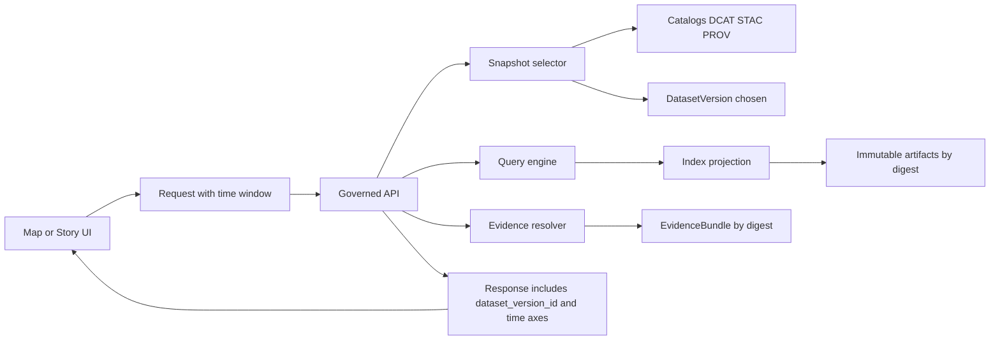

<!-- [KFM_META_BLOCK_V2]
doc_id: kfm://doc/daed5013-c251-4efe-b98d-b57bcbb25416
title: Time queries and snapshots
type: standard
version: v1
status: draft
owners: TBD
created: 2026-03-01
updated: 2026-03-01
policy_label: restricted
related:
  - (TODO) docs/architecture/overview/README.md
  - (TODO) docs/architecture/overview/truth-path-and-trust-membrane.md
  - (TODO) docs/architecture/overview/governed-apis.md
tags:
  - kfm
  - architecture
  - time
  - snapshots
notes:
  - Establishes shared semantics for temporal queries + snapshot selection across pipelines, catalogs, APIs, and UI.
  - Must be kept consistent with the governed API contract and dataset onboarding specs.
[/KFM_META_BLOCK_V2] -->

# Time queries and snapshots
Define **how KFM answers “when?”** (event/valid time) and **“as of what version of knowledge?”** (transaction time + immutable snapshots).


## Quick navigation
- [Where this fits](#where-this-fits)
- [Legend: Confirmed vs Proposed vs Unknown](#legend-confirmed-vs-proposed-vs-unknown)
- [Core concepts](#core-concepts)
- [Time axes](#time-axes)
- [Snapshot model](#snapshot-model)
- [Temporal query semantics](#temporal-query-semantics)
- [API query patterns](#api-query-patterns)
- [Storage and indexing implications](#storage-and-indexing-implications)
- [Governance and failure modes](#governance-and-failure-modes)
- [Definition of done](#definition-of-done)
- [Open questions](#open-questions)

---

## Where this fits
**Location:** `docs/architecture/overview/time-queries-and-snapshots.md`

**Purpose:** Align *pipelines → catalogs → governed APIs → Map/Story UI → Focus Mode* on a single temporal model so that:
- a “time slider” always means the same thing,
- every answer can be reproduced by selecting the same snapshot(s),
- and ambiguity fails closed rather than silently drifting.

**Acceptable inputs:**
- Dataset onboarding specs (including which time axes apply)
- Catalog conventions (DCAT/STAC/PROV + EvidenceRef/EvidenceBundle)
- API contract conventions for query parameters
- Example datasets that exercise event time vs boundary/valid time

**Explicit non-goals:**
- Picking a specific database temporal extension (implementation detail)
- Defining final endpoint paths (belongs in the governed API contract doc)
- Solving bitemporality for all domains on day 1 (see [Open questions](#open-questions))

[Back to top](#time-queries-and-snapshots)

---

## Legend: Confirmed vs Proposed vs Unknown
KFM documentation uses explicit tagging to avoid “implicit defaults”:

- **CONFIRMED**: stated in current KFM vNext snapshots / integration packs.
- **PROPOSED**: recommended default to keep building; must be implemented + gated.
- **UNKNOWN**: needs repo/API verification before we can treat it as contract.

This file includes all three; treat **PROPOSED** and **UNKNOWN** as “not yet a guarantee.”

[Back to top](#time-queries-and-snapshots)

---

## Core concepts

### DatasetVersion is the unit of snapshotting
**CONFIRMED (concept):**
- A **Dataset** is a logical identity (e.g., “NOAA Storm Events”).
- A **DatasetVersion** is an **immutable** version of that dataset corresponding to a specific promoted output set.
- An **Artifact** is a concrete output (GeoParquet, PMTiles, COG, JSON, etc.).

### EvidenceBundle is snapshot-able too
**CONFIRMED (concept):**
- **EvidenceRef** is a stable reference scheme (`dcat://`, `stac://`, `prov://`, `doc://`, etc.).
- **EvidenceBundle** is the resolved result of EvidenceRefs and is treated as immutable by digest so it can be cached and reproduced.

### Receipts make snapshots auditable
**CONFIRMED (concept):**
- Every pipeline run (and every Focus Mode query) should emit a typed receipt containing inputs, outputs, environment, validation results, and policy decisions.

[Back to top](#time-queries-and-snapshots)

---

## Time axes
KFM distinguishes **at least** three time axes.

### Definitions
**CONFIRMED (definitions; recommended approach):**
- **Event time**: when something happened in the world (e.g., flood peak).
- **Valid time**: when a statement is considered true (e.g., an administrative boundary existed from X to Y).
- **Transaction time**: when KFM acquired/recorded/published the data.

### Default modeling strategy
**CONFIRMED direction + PROPOSED default:**
- Start with **event time + transaction time** for most datasets.
- Introduce **valid time** where boundary changes and administrative history require it (often only for boundary datasets at first).

[Back to top](#time-queries-and-snapshots)

---

## Snapshot model
A “snapshot” in KFM is not “whatever is current in a database.” It is **a set of immutable, versioned artifacts and catalogs**.

### Snapshot identity
**CONFIRMED pattern:**
- Snapshots are stabilized using deterministic identifiers (e.g., `spec_hash`) and immutable digests for produced artifacts.
- Downstream consumers must pin content by digest (not floating tags).

### Snapshot surfaces
In practice, KFM snapshots appear at multiple layers:

1) **Promoted dataset version**
- Selected by `dataset_version_id` (or equivalent).
- Resolves to immutable artifacts + catalogs (STAC/DCAT/PROV) + receipts.

2) **Evidence bundle snapshot**
- Evidence resolver outputs an EvidenceBundle that is itself immutable by digest and cacheable.

3) **Story snapshot**
- Story versions capture a map state including time window and selected dataset versions, enabling replay.

[Back to top](#time-queries-and-snapshots)

---

## Temporal query semantics
Every temporal query should be interpreted as two separate questions:

1) **“Which time axis describes the phenomenon?”**  
   (event time vs valid time)

2) **“As-of which KFM knowledge snapshot?”**  
   (transaction time / dataset version selection)

### The key rule
**PROPOSED (contract rule):**  
A request MUST be explicit or inferable about both dimensions:

- **Phenomenon time window** (event/valid): e.g., “show events in 1934”
- **Knowledge snapshot** (transaction): e.g., “as of the 2026‑02 release”

If either is ambiguous, the system should **fail closed** (return a policy-safe error) *or* default via a declared dataset policy (see next table).

### Dataset-level time policy (recommended)
**PROPOSED:** define, per dataset, a policy describing what the UI/API should assume.

| Dataset category | Primary time axis for filtering | Secondary axis kept for audit/repro | Notes |
|---|---:|---:|---|
| Observations (storms, station telemetry, incidents) | Event time | Transaction time | Valid time usually not needed. |
| Administrative boundaries / jurisdictions | Valid time | Transaction time | Often needs bitemporal support. |
| Publications (reports, documents) | Event time = publication/issue date (if used) | Transaction time | Often treated as “document date” + “ingest date”. |
| Derived analytics tiles | Inherited from source dataset policy | Transaction time | Always pin to source DatasetVersion(s). |

[Back to top](#time-queries-and-snapshots)

---

## API query patterns
This section is **illustrative** until reconciled with the governed API contract.

### Recommended parameter vocabulary
**PROPOSED (keep it boring, consistent, and cache-friendly):**

| Dimension | Parameter | Type | Meaning |
|---|---|---:|---|
| Phenomenon time | `event_from`, `event_to` | RFC3339 | Filter by event time window. |
| Phenomenon time | `valid_at` **or** `valid_from`,`valid_to` | date/RFC3339 | Filter by valid time instant or window (boundary datasets). |
| Knowledge snapshot | `as_of` | RFC3339 | Transaction-time “best known as of …” selector. |
| Snapshot pin | `dataset_version_id` | string | Hard pin to a promoted DatasetVersion. |
| Snapshot pin | `evidence_bundle_digest` | digest | Hard pin to an EvidenceBundle for replay. |

### Selection precedence
**PROPOSED (deterministic):**
1. If `dataset_version_id` provided → use it (after policy check).
2. Else if `as_of` provided → select the newest DatasetVersion with `released_at <= as_of`.
3. Else → default to “current published” (still a pinned version in the response metadata).

### Example requests (illustrative)
```http
# Event-time query, “as best known” (transaction time defaults to current)
GET /v1/layers/storm_events?bbox=...&event_from=1934-01-01T00:00:00Z&event_to=1934-12-31T23:59:59Z

# Boundary dataset: “what counties existed on 1900-01-01”, using valid time
GET /v1/layers/counties?bbox=...&valid_at=1900-01-01

# Replay exactly what a Story saw (pin dataset version)
GET /v1/layers/counties?bbox=...&valid_at=1900-01-01&dataset_version_id=1900.boundaries.abcd1234

# Audit: “what did KFM believe on 2026-02-20?”
GET /v1/layers/counties?bbox=...&valid_at=1900-01-01&as_of=2026-02-20T13:00:00Z
```

### Response requirements
**PROPOSED (trust membrane friendly + reproducible):**
Every response that depends on time MUST include:
- `dataset_version_id`
- `spec_hash` (or equivalent deterministic identity)
- artifact digest(s) or a stable artifact reference that resolves to digest
- the time axes actually applied (so the UI cannot mislabel a filter)

[Back to top](#time-queries-and-snapshots)

---

## Storage and indexing implications
KFM’s snapshot model depends on immutability and rebuildability.

### Canonical artifact layout
**CONFIRMED (canonical layout pattern exists; details may vary by repo):**
- RAW, WORK, PROCESSED, CATALOG are separate zones.
- CATALOG includes DCAT/STAC/PROV and receipts under the promoted version.

### Indexes are projections, not source of truth
**CONFIRMED direction:**
- PostGIS/search/graph/tiles indexes should be rebuildable from promoted artifacts and catalogs.
- Time queries must be implementable without relying on mutable “latest rows.”

### Snapshot vs delta ingestion
**CONFIRMED pattern (example):**
- Some feeds should be treated as **snapshots** unless stable IDs exist; deltas can be derived by hashing snapshot state and comparing to the previous snapshot.

[Back to top](#time-queries-and-snapshots)

---

## Governance and failure modes
Temporal ambiguity is a governance risk: it silently changes what users think they’re seeing.

### Fail-closed rules (recommended)
**CONFIRMED direction + PROPOSED specifics:**
- If time parsing fails → error (policy-safe).
- If a dataset requires valid time and request provides only event time → error (or documented default).
- If the request implies “as of” but no snapshot selector exists → error.
- If evidence cannot resolve for the selected version/time → error (no “best effort” for governed surfaces).

### Receipts must record time
**CONFIRMED invariant (receipt contract includes timestamps):**
- Run receipts include RFC3339 start/end timestamps bounding the run.
- Promotion manifests record release time and digests for reproducibility.

[Back to top](#time-queries-and-snapshots)

---

## End-to-end flow


[Back to top](#time-queries-and-snapshots)

---

## Definition of done
Use this checklist when adding or upgrading a dataset to support time-aware querying.

### Dataset onboarding
- [ ] Dataset spec declares which time axes apply (`event`, `transaction`, optional `valid`)
- [ ] Dataset spec declares default axis for UI “time slider” and API filters
- [ ] Time field mapping documented (source fields → canonical fields)

### Pipeline + promotion
- [ ] Pipeline outputs are deterministic (stable ordering, stable JSON, pinned tooling)
- [ ] Run receipt emitted with timestamps + spec_hash + input/output digests
- [ ] Promotion manifest emitted with `released_at`, digests, and policy decision reference

### Catalogs + evidence
- [ ] STAC extents and/or item properties correctly represent the primary time axis
- [ ] EvidenceRefs resolve for the selected version and time
- [ ] EvidenceBundles are cacheable by digest and include policy decisions

### Governed API + UI
- [ ] API supports explicit time axis parameters (no hidden semantics)
- [ ] Responses echo the applied axis and the selected dataset version
- [ ] UI labels the time axis correctly (event vs valid) and can replay pinned snapshots

[Back to top](#time-queries-and-snapshots)

---

## Open questions
### Bitemporal support scope
**CONFIRMED as an explicit gap:** KFM expects bitemporal support may be needed for administrative history, with a recommended default to introduce valid time for boundary datasets first.

**Minimum verification steps (to convert UNKNOWN → CONFIRMED contract):**
1. Identify boundary datasets in scope (counties, townships, reservations, districts, etc.).
2. For each, define:
   - canonical valid time fields (`valid_from`, `valid_to`) and semantics
   - query behavior for overlaps, gaps, “unknown valid end”
3. Update:
   - schemas (dataset records, features)
   - indexing strategy
   - governed API contract + tests
   - Story replay requirements

[Back to top](#time-queries-and-snapshots)
