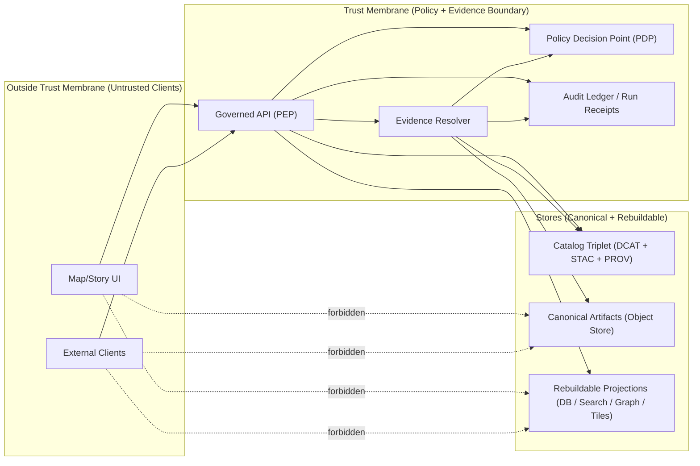

<!-- [KFM_META_BLOCK_V2]
doc_id: kfm://doc/9c3b7b4a-3f86-4c61-b43e-8e5e3f8b1a54
title: Trust Membrane
type: standard
version: v1
status: draft
owners: TODO(platform-architecture@)  # TODO: replace with real owners / CODEOWNERS group
created: 2026-03-01
updated: 2026-03-01
policy_label: public
related:
  - TODO: docs/architecture/overview/truth-path.md
  - TODO: docs/governance/policy-as-code.md
  - TODO: docs/architecture/overview/evidence-resolution.md
  - TODO: contracts/openapi  # exact path not confirmed
tags: [kfm, architecture, governance, trust-membrane, policy, evidence]
notes:
  - Defines the Trust Membrane invariant: no client bypass of governed APIs; uniform policy + obligations; evidence-first citations.
[/KFM_META_BLOCK_V2] -->

# Trust Membrane
**One-line purpose:** Prevent policy bypass by forcing *all* reads/writes and all citations through governed interfaces (PEP + Evidence Resolver).  
**Status:** Draft • **Policy:** public • **Owners:** TODO

> **Non-negotiable invariant:** Clients (UI/external) must **never** directly access DB/storage/indexes. All access flows through the **governed API** (Policy Enforcement Point) and the **Evidence Resolver** (for citations).  
> If the system cannot prove a claim with admissible evidence, it must abstain.

---

## Quick navigation
- [Definition](#definition)
- [What is inside the membrane](#what-is-inside-the-membrane)
- [Architecture view](#architecture-view)
- [Enforcement points](#enforcement-points)
- [Contracts](#contracts)
- [Threat model](#threat-model)
- [Failure modes](#failure-modes)
- [Verification checklist](#verification-checklist)
- [Glossary](#glossary)

---

## Definition

### Trust Membrane
The **trust membrane** is the **policy + provenance boundary** separating *clients* from *stores*.

Inside the membrane:
- We can access canonical storage and rebuildable projections.
- We can execute policy decisions and enforce obligations (redaction, licensing, etc.).
- We can produce inspectable evidence bundles and audit receipts.

Outside the membrane:
- Clients can only call governed endpoints and render policy-safe results.
- Clients cannot “reach around” the API to query a database, object store, index, or tile store.

### Design intent
The trust membrane exists to make two things true at once:

1) **Uniform policy enforcement** (no bypass): all data access goes through a policy enforcement point.  
2) **Inspectable evidence**: a “citation” is a resolvable object (EvidenceRef → EvidenceBundle), not a pasted URL string.

---

## What is inside the membrane

### Canonical vs rebuildable stores
**Canonical** (must be sufficient to rebuild anything):
- Object storage of promoted artifacts
- Catalog triplet (DCAT + STAC + PROV) and run receipts

**Rebuildable** (projections that can be regenerated from canonical):
- PostGIS tables / spatial indexes
- Search indexes
- Graph projections
- Vector tiles / PMTiles

> Rule of thumb: if it can be rebuilt, treat it as disposable; if it cannot, it must be part of the canonical truth path.

---

## Architecture view

### Boundary diagram

### Layering responsibility (KFM posture)
- **Domain / Use-cases:** express what “allowed access” means and what obligations exist.
- **Interfaces:** governed repositories/services that enforce policy and return only admissible results.
- **Infrastructure:** DB/object store/indexes; protected by network and IAM so bypass is impossible even if code is buggy.

---

## Enforcement points

### PDP vs PEP (required terminology)
- **PDP (Policy Decision Point):** evaluates allow/deny + obligations (e.g., OPA/Rego running in-process or sidecar).
- **PEP (Policy Enforcement Point):** places where we *must* call policy before taking actions.

### PEP matrix
| PEP surface | Role | Must do | Must NOT do |
|---|---|---|---|
| **CI** | Prevent unsafe merges | Run schema + policy + contract tests; fail closed | Allow drift between CI and runtime policy semantics |
| **Runtime API** | Gate all reads/writes | Authn/z, policy checks, obligation enforcement, policy-safe errors | Return restricted metadata in 403/404 |
| **Evidence Resolver** | Gate all citations | Resolve EvidenceRefs → EvidenceBundles; apply redactions/obligations before returning | Resolve anything without policy check |
| **UI** | Make trust visible | Render badges, show license/rights, show evidence drawer | Make policy decisions; fetch restricted content directly |

> **Rule:** UI is never a policy engine. It can display policy outcomes and obligations, but cannot decide them.

### Enforcement layers (defense in depth)
1) **Network controls (required):** block direct access from UI to DB/object store/indexes.
2) **Identity + auth (required):** authenticated principals; propagate policy context.
3) **Policy-as-code (required):** shared fixtures + outcomes between CI and runtime.
4) **Contract surfaces (required):** catalog triplet + evidence resolver define what can be cited.
5) **Auditability (required):** append-only receipts for governed operations.

---

## Contracts

### Evidence resolution contract
**Definition:** A “citation” in KFM is an **EvidenceRef** that resolves to an **EvidenceBundle**.

**Hard rule:** If citations cannot be verified (resolve + are policy-allowed), the system must:
- drop unsupported claims,
- reduce scope, or
- **abstain**.

### “Policy-safe errors”
Trust membrane enforcement must not become an oracle:
- Do not reveal restricted dataset names, IDs, or metadata in error payloads.
- Prefer consistent deny responses.

### Sensitivity defaults (baseline posture)
- Default deny for sensitive-location and restricted datasets.
- If public representation is permitted, publish a separate generalized derivative.
- Do not embed precise coordinates in Story Nodes or Focus Mode outputs unless explicitly allowed.
- Treat redaction/generalization as first-class provenance (recorded).

> NOTE: Exact rubrics and labels are governed artifacts; don’t invent them in code without a policy review.

---

## Threat model

### Primary threats the membrane must mitigate
| Threat | Example | Mitigation (required posture) |
|---|---|---|
| Policy bypass | UI hits PostGIS directly | Network policies + code-level boundaries + CI checks |
| Restricted leakage | 403 error reveals dataset existence | Policy-safe error model; deny-by-default |
| Prompt injection via documents | OCR text tells model to reveal secrets | Tool allowlist + evidence resolver gate + filtering before model sees text |
| Citation spoofing | URL pasted into answer | EvidenceRef → resolver only; hard verification gate |
| License violation | “Online” media mirrored without rights | Promotion gates require rights metadata; “metadata-only” mode |

---

## Failure modes

### Fail-closed behavior (required)
If *any* of the following are missing or invalid, responses must fail closed:
- policy decision unavailable
- evidence resolver cannot resolve
- required obligations cannot be satisfied (e.g., attribution / redaction)
- catalogs cannot be validated or cross-linked
- run receipt cannot be persisted when required

### Abstention UX (required)
When abstaining, the system must clearly say:
- what is missing (in policy-safe terms),
- what is allowed (public alternatives),
- how to request access (steward workflow),
- and include an audit reference for follow-up.

---

## Verification checklist

### “Trust membrane is real” tests
- [ ] **Static:** UI code has no DB/index credentials and no direct connectors.
- [ ] **Network:** UI namespace cannot reach DB/object store endpoints except via API service.
- [ ] **Contract:** every “citation” object resolves through evidence resolver.
- [ ] **Policy:** CI and runtime share fixtures; outcomes match for allow/deny + obligations.
- [ ] **Negative:** restricted dataset does not leak via timing/response/body differences.

### Minimum verification steps (convert Unknown → Confirmed)
1) Capture repo commit hash and root directory tree.
2) Confirm which work packages exist (policy pack, evidence resolver, validators).
3) Extract CI gates and identify which checks block merges.
4) Promote a single MVP dataset end-to-end with receipts + catalogs.
5) Validate UI cannot bypass the PEP and that EvidenceRefs resolve in Map Explorer + Story publish.
6) Run Focus Mode evaluation harness and store golden query diffs as artifacts.

> TODO: Link these checks to actual scripts once paths are confirmed in-repo.

---

## Glossary

- **PDP:** Policy Decision Point (computes decision + obligations).
- **PEP:** Policy Enforcement Point (where decision is enforced).
- **EvidenceRef:** A resolvable pointer to inspectable evidence.
- **EvidenceBundle:** The resolved evidence payload (metadata + artifacts + provenance) after policy/obligation enforcement.
- **Obligation:** Required transformation or condition (redaction, attribution, watermark, etc.) attached to a policy decision.
- **Fail closed:** deny by default when uncertain or when enforcement is incomplete.

---

## Appendix: Open questions (must be verified, do not assume)
- Which PDP runtime pattern is used (sidecar vs in-process)?
- What network policy mechanism is used (Kubernetes NetworkPolicy, service mesh, etc.)?
- How “policy context” is represented (role, purpose, jurisdiction, time, etc.) and propagated end-to-end.
- Exact error model for deny responses (to prevent metadata oracles).

_Back to top:_ [Trust Membrane](#trust-membrane)
