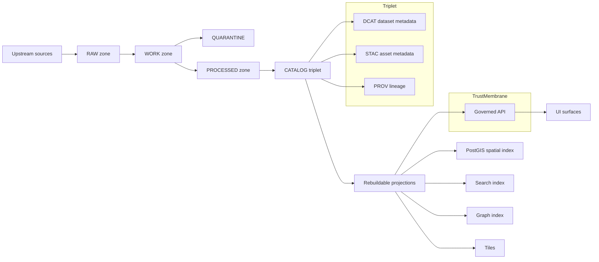

<!-- [KFM_META_BLOCK_V2]
doc_id: kfm://doc/7f0a9a2a-4b6d-4d2f-9c8f-83d8f5f8a1c3
title: Truth Path
type: standard
version: v1
status: draft
owners: TBD
created: 2026-03-01
updated: 2026-03-01
policy_label: public
related:
  - kfm://doc/kfm-gdg-2026
tags: [kfm, architecture, governance, truth-path, promotion-contract]
notes:
  - Defines the end-to-end lifecycle for governed data from upstream acquisition to published runtime surfaces.
  - Normative requirements are written with MUST/SHOULD; implement as CI + runtime gates.
[/KFM_META_BLOCK_V2] -->

# Truth Path

**Purpose:** Describe how KFM turns upstream sources into **governed, citable** Map/Story/Focus surfaces by enforcing an auditable lifecycle: **Upstream → RAW → WORK/QUARANTINE → PROCESSED → CATALOG/TRIPLET → PUBLISHED**.


---

## Quick navigation

- [Why this exists](#why-this-exists)
- [Reference flow](#reference-flow)
- [Zones](#zones)
- [Promotion Contract](#promotion-contract)
- [Canonical vs rebuildable](#canonical-vs-rebuildable)
- [Operational rules](#operational-rules)
- [Appendices](#appendices)

---

## Why this exists

KFM’s “truth path” is the project’s primary trust mechanic:

- It creates **reproducibility** (immutable acquisition, deterministic IDs, receipts).
- It makes governance **enforceable** (fail-closed promotion gates).
- It makes trust **inspectable** (catalog triplet + EvidenceRefs that resolve).

> **Non-negotiable:** Clients and UIs MUST NOT access storage/DB directly; all access is evaluated at the governed API (Policy Enforcement Point) and mediated by evidence resolution (“trust membrane”).  
> If you can bypass policy, you can bypass provenance.

---

## Reference flow



**Notes**
- Promotion gates apply at **each transition**; the triplet must be cross-linked so EvidenceRefs resolve deterministically.
- “Projections” are rebuildable outputs (indexes/tiles/search) derived from canonical artifacts + catalogs.

---

## Zones

### Zone definitions

| Zone | What it is | Mutability | Typical artifacts | Allowed operations | Exit criteria |
|---|---|---:|---|---|---|
| **Upstream** | External sources (portals, APIs, files, sensors) | Mutable (external) | Source URLs, upstream terms, snapshots | Acquire / monitor | Successful acquisition to RAW |
| **RAW** | Immutable acquisition copy of upstream payloads | **Append-only** | Acquisition manifest; raw artifacts (files/API responses); checksums; minimal metadata incl. license/terms snapshot | **Never edit**; only supersede with a new acquisition | Manifests + checksums exist |
| **WORK** | Intermediate transforms + QA staging | Mutable | Normalized representations; QA reports; candidate redactions/generalizations; provisional entity resolution outputs | Transform, validate, repair | Pass QA + rights + sensitivity checks |
| **QUARANTINE** | Isolation for failures / unclear governance | Mutable (but blocked) | Failure reports; investigation notes | Investigate; re-run; reclassify | **Cannot promote** until resolved |
| **PROCESSED** | Publishable artifacts in approved formats | Immutable per version | GeoParquet / PMTiles / COG / corpora; checksums; derived runtime metadata (bbox, time range, counts) | Create new version for changes | Artifacts finalized + checksummed |
| **CATALOG / TRIPLET** | Cross-linked catalogs + lineage | Versioned artifacts | DCAT dataset record; STAC collections/items; PROV bundle; run receipts; link maps | Validate; linkcheck | Triplet validates and cross-links resolve |
| **PUBLISHED** | Governed runtime surfaces | Governed | API responses; tiles; Story pages; Focus answers; audit receipts | Serve only promoted versions; apply policy obligations | Promotion Contract satisfied |

### When to use QUARANTINE

QUARANTINE exists to fail closed. Put a dataset/version in QUARANTINE when:

- validation fails,
- licensing/rights are unclear,
- sensitivity concerns exist,
- upstream instability prevents reproducible acquisition.

---

## Promotion Contract

Promotion is the act of moving from **Raw/Work → Processed + Catalog/Lineage → Published runtime surfaces**.

### Minimum gates (Promotion Contract v1)

A dataset version MUST NOT be promoted to PUBLISHED unless the following gates pass.

| Gate | Minimum requirement | Typical automation |
|---|---|---|
| **A — Identity and versioning** | Stable `dataset_id`; immutable `dataset_version_id` derived from stable `spec_hash` | Schema validation; hash golden tests; digest verification |
| **B — Licensing and rights metadata** | Explicit license/rights + rights holder/attribution requirements captured; if unclear → QUARANTINE | CI fails if license missing/unknown; terms snapshot required |
| **C — Sensitivity classification and redaction plan** | `policy_label` assigned; for sensitive-location or restricted data, redaction/generalization plan exists and is recorded in lineage | Policy tests; obligation conformance checks |
| **D — Catalog triplet validation** | DCAT/STAC/PROV exist, validate, and cross-link; EvidenceRefs resolve without guessing | Validators + linkcheck; referential integrity tests |
| **E — Run receipt and checksums** | `run_receipt` exists per producing run; inputs/outputs enumerated with checksums; environment captured (container digest, parameters) | Receipt schema validation; attestation checks (if enabled) |
| **F — Policy tests and contract tests** | OPA tests pass; evidence resolver resolves at least one EvidenceRef in CI; API/contracts/schemas validate | conftest/OPA CI gates; contract tests |
| **G — Optional but recommended** | Production posture: SBOM + build provenance; performance smoke checks; accessibility smoke checks | Supply-chain gates; perf + a11y checks |

> **Fail-closed rule:** If any gate is missing or unclear, promotion MUST be blocked.

### Promotion manifest

Every promotion SHOULD emit a **promotion manifest** that ties together:
- dataset version identity (`dataset_version_id`, `spec_hash`),
- artifact digests,
- catalog digests,
- QA status,
- policy decision reference,
- approvals.

This enables reproducibility, audit, and rollback.

---

## Canonical vs rebuildable

KFM distinguishes between:

- **Canonical truth**: object storage artifacts + catalogs + provenance/receipts.
- **Rebuildable projections**: DB/search/graph/tiles that can be regenerated from canonical truth.

This is how we keep runtime fast while preserving the trust membrane: if a projection corrupts or drifts, we rebuild it; we do not rewrite history.

---

## Operational rules

### Hard rules

- **RAW is append-only.** Never edit RAW; supersede with a new acquisition.
- **No publishing without a triplet.** If DCAT/STAC/PROV don’t cross-link, citations are not deterministic.
- **No policy bypass.** Clients/UIs never access stores directly; all access must be policy-evaluated at the governed API.
- **Cite or abstain is a system behavior.** If evidence cannot be verified/resolved, the system must reduce scope or abstain.

### Minimum verification steps

If you are unsure whether the codebase enforces this end-to-end:

- Capture repo commit hash + root tree; attach to governance docs.
- Confirm CI gates exist for: spec_hash stability, catalog validators + linkcheck, policy tests, evidence resolution.
- Pick one MVP dataset and prove it can be promoted through all gates with receipts + catalogs.

---

## Appendices

<details>
  <summary><strong>Appendix A — “Triplet” responsibilities (conceptual)</strong></summary>

- **DCAT** answers: *What is this dataset? Who published it? What is the license/rights? What are the distributions?*
- **STAC** answers: *What spatiotemporal assets exist and where are the files?*
- **PROV** answers: *How were outputs created, from which inputs, by which tools/parameters, under which policy decision?*

</details>

<details>
  <summary><strong>Appendix B — Promotion manifest skeleton (illustrative)</strong></summary>

```json
{
  "kfm_promotion_manifest_version": "v1",
  "dataset_slug": "<dataset_id>",
  "dataset_version_id": "<version_id>",
  "spec_hash": "sha256:<...>",
  "released_at": "<ISO-8601 timestamp>",
  "artifacts": [
    { "path": "<artifact>", "digest": "sha256:<...>", "media_type": "<mime>" }
  ],
  "catalogs": [
    { "path": "dcat.jsonld", "digest": "sha256:<...>" },
    { "path": "stac/collection.json", "digest": "sha256:<...>" },
    { "path": "prov/bundle.jsonld", "digest": "sha256:<...>" }
  ],
  "qa": { "status": "pass|fail", "report_digest": "sha256:<...>" },
  "policy": { "policy_label": "public|restricted", "decision_id": "kfm://policy_decision/<...>" },
  "approvals": [
    { "role": "steward", "principal": "<id>", "approved_at": "<timestamp>" }
  ]
}
```

</details>

---

[Back to top](#truth-path)
