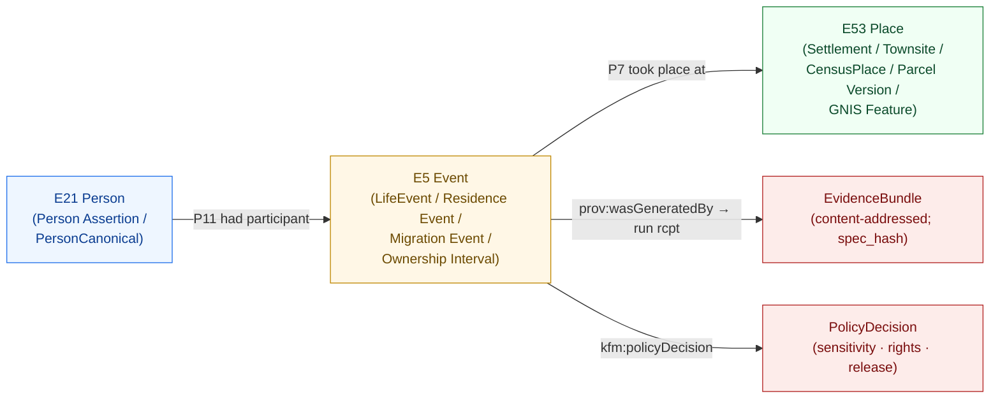
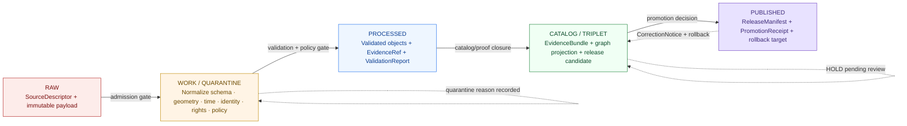

<!-- [KFM_META_BLOCK_V2]
doc_id: kfm://doc/architecture-people-place-joins
title: People-Place Joins — Architecture
type: standard
version: v1
status: draft
owners: <People/DNA/Land + Settlements stewards — TBD>
created: 2026-05-25
updated: 2026-05-25
policy_label: public
related:
  - docs/architecture/README.md
  - docs/architecture/governed-api.md
  - docs/architecture/contract-schema-policy-split.md
  - docs/domains/people-dna-land/README.md
  - docs/domains/settlements-infrastructure/README.md
  - docs/standards/PROV.md
  - docs/standards/SENSITIVITY_RUBRIC.md
  - docs/doctrine/trust-membrane.md
  - docs/doctrine/lifecycle-law.md
tags: [kfm, architecture, joins, people, place, graph, governance]
notes:
  - Repo not mounted in authoring session; all path claims are PROPOSED.
  - PROV.md / PROVENANCE.md naming variance tracked at directory-rules §18 OPEN-DR-01.
[/KFM_META_BLOCK_V2] -->

# People-Place Joins — Architecture

> How KFM connects person evidence to place evidence — through events, under authority, with sensitivity gates and EvidenceBundle backing — without ever collapsing assertion into observation or aggregate into per-place truth.


**Status** · draft &nbsp;·&nbsp; **Owners** · *People/DNA/Land + Settlements stewards — TBD* &nbsp;·&nbsp; **Updated** · 2026-05-25

---

## Quick jump

- [1. Scope and non-goals](#1-scope-and-non-goals)
- [2. Conceptual model](#2-conceptual-model)
- [3. Authority anchoring ladders](#3-authority-anchoring-ladders)
- [4. Identity rule for a join](#4-identity-rule-for-a-join)
- [5. Cross-lane join families](#5-cross-lane-join-families)
- [6. Join lifecycle](#6-join-lifecycle-raw--published)
- [7. Outcome envelope](#7-outcome-envelope)
- [8. Sensitivity and deny-by-default register](#8-sensitivity-and-deny-by-default-register)
- [9. Anti-patterns](#9-anti-patterns)
- [10. Verification backlog](#10-verification-backlog)
- [11. Related docs](#11-related-docs)

---

## 1. Scope and non-goals

### 1.1 In scope

**CONFIRMED doctrine / PROPOSED architecture surface.** This document specifies how KFM forms *joins* between **person evidence** (owned by People, Genealogy, DNA, Land Ownership) and **place evidence** (owned principally by Settlements/Infrastructure, with secondary place context from Roads/Rail, Archaeology, Agriculture, Hydrology, and the spatial foundation). The join is the architectural surface where most cross-lane harm can occur — living-person exposure, private person-parcel disclosure, aggregate-as-per-place misuse, cultural-affiliation drift — and it is therefore governed.

A "join" here is **not** a SQL operation. It is a **derived claim** asserting that a Person Assertion (or a PersonCanonical) stood in a typed relationship to a Place during a temporal scope, and like every consequential KFM claim it must resolve `EvidenceRef → EvidenceBundle` before it is rendered, promoted, or returned by the governed API.

### 1.2 Non-goals

- This document does **not** define the wire format of an EvidenceBundle; see `docs/standards/PROV.md` (PROPOSED canonical name; see directory-rules §18 OPEN-DR-01) and the EvidenceBundle schema under `schemas/contracts/v1/evidence/` (PROPOSED path; **NEEDS VERIFICATION** in mounted repo).
- This document does **not** itself redact, generalize, or transform geometry — those are profile-driven, deterministic transforms governed by `docs/standards/SENSITIVITY_RUBRIC.md` and `docs/standards/REDACTION_DETERMINISM.md` (both PROPOSED in corpus; not yet authored — see directory-rules §6.1).
- This document does **not** describe the People/DNA/Land domain in full; see `docs/domains/people-dna-land/README.md` (PROPOSED path).
- This document does **not** authorize public exposure of any specific source family; rights and current terms are **NEEDS VERIFICATION** per Source family table in the People domain.

> [!IMPORTANT]
> Every join produced under this architecture is itself a consequential claim. It carries its own EvidenceBundle, its own PolicyDecision, and — when consequential enough to ship to a public surface — its own PromotionReceipt. The join inherits the *strictest* sensitivity, rights, and source-role posture of its inputs; it never weakens them.

---

## 2. Conceptual model

### 2.1 Event-first, never attribute-first

**CONFIRMED doctrine** (Pass-10 C8-01, C8-02, C8-03): KFM routes every person-place relationship through an **event** rather than asserting it as a flat attribute on a person record. The graph backbone is CIDOC-CRM (`E5 Event`, `E7 Activity`, `E21 Person`, `E53 Place`, `E55 Type`, `E74 Group`), with a Schema.org `Person/Place/Event` projection for the web-discoverable surface and PROV-O + PAV for claim-level provenance. The graph itself is a **derived projection** of the catalog and the receipt layer, content-addressed and rebuilt deterministically from those layers on every promotion.

Event-first is doctrinally load-bearing because:

- It preserves **who-what-when-where-how-we-know-it** without forcing a single name, date, or place to be authoritative on the person record.
- It lets multiple, conflicting **NameAssertions**, **LifeEvents**, **Residence Events**, and **Migration Events** coexist with their own evidence and their own temporal scopes.
- It makes time-aware UIs and map-time-slider queries answerable without rebuilding the model.

### 2.2 The three nodes and the four edges of a People↔Place join

The minimum viable join is a small graph fragment, not a row:



> [!NOTE]
> **PROPOSED** edge labels above are illustrative CIDOC-CRM and PROV-O properties; the canonical JSON-LD context is a separate artifact and is **NEEDS VERIFICATION** in the mounted repo. The `kfm:` namespace IRI base and versioning strategy are an **open question** (Pass-10 C.3 item 1).

### 2.3 What rides on the event

| Carrier | What it carries | Authority |
|---|---|---|
| `E5 Event` node | Type, temporal scope, source-role, sensitivity rank | CIDOC-CRM + `kfm:` extensions |
| `E21 Person` node | Person Assertion or PersonCanonical, `sameAs` to LCNAF / VIAF / ISNI / Wikidata | C7-01..04 authority anchors |
| `E53 Place` node | Place identity + `sameAs` to GNIS FID, TGN, KHRI, Wikidata QID | C7-09, C7-10 |
| `EvidenceBundle` | Run receipts, parameters, integrity, signatures, crosswalks | PROV-O + PAV (Pass-10 C8-03) |
| `PolicyDecision` | allow / hold / deny + reason_code, sensitivity_rank | Policy-as-code (Pass-10 C5, C6) |
| `PromotionReceipt` | Governed state-transition record at admission to PUBLISHED | Lifecycle law |

---

## 3. Authority anchoring ladders

### 3.1 Place-anchor ladder (CONFIRMED doctrine; Pass-10 C7-09)

**Order matters.** A place node anchors at the highest applicable rung and records every lower rung it also matches. The ladder mirrors the personal-name ladder and explicitly accommodates the corpus's note that GNIS encodes a colonial-era naming layer and is thin on Indigenous, pre-statehood, and vernacular names.

```text
1. GNIS FID                         ← required when GNIS has coverage
2. TGN (Getty Thesaurus)            ← historical / vernacular / cultural-heritage
3. KHRI / KSHS                      ← Kansas-first historical and inventory records
4. Wikidata QID                     ← crosswalk substrate; never sole-source of truth
5. Local-only (kfm:place/...)       ← only when ladder above is exhausted
```

### 3.2 Person-anchor ladder (CONFIRMED doctrine; Pass-10 C7-01..04)

```text
1. LCNAF (Library of Congress)      ← U.S. names with authority records
2. VIAF                             ← multi-library cluster
3. ISNI                             ← ISO 27729 cross-system identifier
4. Wikidata QID                     ← routing anchor, not truth source
5. Local-only (kfm:person/...)      ← assertion-first, never authoritative alone
```

### 3.3 Why ladders, not single anchors

**CONFIRMED:** Stable identifiers across catalogs are what make joins and deduplication deterministic and citations automatic (Pass-10 C7 overview). Without a ladder, a missing top-rung anchor would either block the join (over-strict) or admit an unanchored join (over-permissive). The ladder lets the system anchor at the best available rung *and* record every other rung as evidence of that decision in the crosswalk-provenance schema.

> [!TIP]
> The ladder is recorded **per record**, not per source. A Person Assertion drawn from a 1910 federal census can carry LCNAF + Wikidata anchors on the person side and GNIS + KHRI + Wikidata on the place side, with the crosswalk-provenance schema (Pass-10 C7.e) preserving the fetch time and confidence behind each anchoring decision.

---

## 4. Identity rule for a join

### 4.1 The four-tuple

**PROPOSED deterministic basis** (matches the People/DNA/Land *Main object families* identity rule, applied to the join itself):

```text
join_id = digest(
  source_id          : str   # the source-ledger id that produced the join
  object_role        : enum  # observed | regulatory | modeled | aggregate |
                             # administrative | candidate | synthetic
  temporal_scope     : str   # ISO interval / fuzzy interval / "unknown"
  normalized_digest  : hex   # JCS-canonicalized canonical-form digest of payload
)
```

This is **not** a hash of "the person and the place". It is a hash of the **assertion that they were related, at a time, from a source, with a role**, in canonical form. Two source records that disagree about whether Alice lived in Cottonwood Falls in 1888 produce **two distinct join IDs** with two distinct EvidenceBundles, not one merged "truth."

### 4.2 Temporal scope is part of identity

**CONFIRMED doctrine** (People/DNA/Land Main object families, temporal handling column): source, observed, valid, retrieval, release, and correction times stay distinct where material. The join's `temporal_scope` reflects the *valid* time of the relationship as evidence supports it; the receipt envelope holds the rest.

### 4.3 Source-role is fixed at admission

**CONFIRMED doctrine** (Source-Role Anti-Collapse Register): the join inherits the *strictest* source-role of its inputs and never upgrades. An aggregate-cell-derived person-place co-occurrence is forever an `aggregate`-role join; it cannot be promoted to `observed` by joining it to a per-place observation. Promotion is a state transition over the *same* role, not a role rewrite.

---

## 5. Cross-lane join families

The People/DNA/Land lane owns four canonical cross-lane edge families (CONFIRMED doctrine; Atlas §24.4.14). Each is governed by the constraint that the join must preserve ownership, source role, sensitivity, and EvidenceBundle support.

### 5.1 People ↔ Settlements / Infrastructure

| Aspect | Specification |
|---|---|
| Event types (PROPOSED) | `ResidenceEvent`, `BurialEvent`, `SchoolEnrollmentEvent`, `CourtAppearanceEvent`, `CountyMembershipEvent`, `TownshipMembershipEvent`, `PlaceMembershipEvent` |
| Place anchors | `Settlement`, `Municipality`, `CensusPlace`, `Townsite`, `GhostTown`, `Fort`, `Mission`, `ReservationCommunity` |
| Constraint (CONFIRMED) | Residence events anchor settlement membership; **living-person fields fail closed** |
| Sensitivity default | T0–T2 for historical; **T4 default** for any living-person component |
| Public default | ANSWER for historical with EvidenceBundle; DENY for living-person identifying joins |

### 5.2 People ↔ Roads / Rail

| Aspect | Specification |
|---|---|
| Event types (PROPOSED) | `MigrationEvent`, `AccessEvent`, `MovementEvent` |
| Place anchors | `CorridorRoute`, `RouteMembership`, `Crossing`, `TransportFacility` |
| Constraint (CONFIRMED) | Migration paths render *with uncertainty*; movement events do not assert continuous presence |
| Sensitivity default | T0–T1 historical; trip-level living-person paths denied |

### 5.3 People ↔ Archaeology / Cultural Heritage

| Aspect | Specification |
|---|---|
| Event types (PROPOSED) | `CulturalAffiliationAssertion`, `HistoricPersonAtSiteContext` |
| Place anchors | `Archaeological Site` *(coordinates denied at public surface)*, `CulturalTemporalPeriod`, `ProvenienceContext` |
| Constraint (CONFIRMED) | Cultural affiliations cited with **rights, sovereignty, and steward review**; site coordinates denied on public surface; ownership of the cultural-affiliation edge sits with Archaeology/Cultural Heritage, **consuming** from People/Land (Atlas §24.4.13) |
| Sensitivity default | T3–T5; HOLD pending steward review by default |
| Public default | DENY for exact site geometry; ABSTAIN at AI surface unless steward review present |

### 5.4 People ↔ Agriculture

| Aspect | Specification |
|---|---|
| Event types (PROPOSED) | `FarmOperationContext`, `ProducerAdjacentContext` |
| Place anchors | `LandParcel` *(public context only)*, `Field` *(candidate)*, `OperationUnit` *(candidate)* |
| Constraint (CONFIRMED) | LandParcel context may **bound** field-candidate joins; **private person-parcel joins denied by default** |
| Sensitivity default | T2–T4; producer-adjacent context only |
| Public default | DENY for the private person→parcel edge unless consent + policy + restricted-authorized surface |

### 5.5 Cross-family rules (CONFIRMED doctrine)

- Settlement, road, archaeology, hydrology, agriculture, hazards, and spatial-foundation lanes provide **context** but do not weaken living-person, DNA, title, or parcel-boundary controls (People/DNA/Land §B).
- The strictest sensitivity from any contributing lane governs the join's release posture.
- Cross-lane joins that depend on aggregate cells (e.g. county-year Frontier Matrix panels) must carry an **aggregation receipt** and may not be cited as per-place observations (CONFIRMED anti-pattern: Aggregate cited as a per-place truth).

---

## 6. Join lifecycle (RAW → PUBLISHED)

**CONFIRMED doctrine / PROPOSED lane application:** People-Place joins follow the standard KFM lifecycle. The join is itself a derived assertion; promotion is a governed state transition, not a file move.



### 6.1 Stage table

| Stage | What the join looks like at this stage | Gate | Status |
|---|---|---|---|
| **RAW** | Source-bearing assertion captured with role, rights, sensitivity, citation, time, and content hash | SourceDescriptor exists | PROPOSED |
| **WORK / QUARANTINE** | Normalized to (Person, Event, Place) + temporal scope + crosswalks; ladder anchors attempted | Validation + policy gate pass, or quarantine reason recorded | PROPOSED |
| **PROCESSED** | EvidenceRef present; ValidationReport pass; sensitivity rank assigned; redaction profile selected if needed | EvidenceRef + ValidationReport + digest closure | PROPOSED |
| **CATALOG / TRIPLET** | EvidenceBundle published (JSON-LD, JCS+SHA-256); CRM/PROV-O graph fragment projected; release candidate ready | Catalog / proof closure passes; PROV-O round-trip resolves | PROPOSED |
| **PUBLISHED** | Available via the governed API; ReleaseManifest applies; rollback target named | PromotionReceipt issued; PolicyDecision = allow; review state recorded where required | PROPOSED |

### 6.2 The governed API never serves below CATALOG

**CONFIRMED doctrine (Trust membrane):** Public clients and the normal UI consume joins via the **governed API**, never directly from canonical / internal stores. The governed API resolves `EvidenceRef → EvidenceBundle → PolicyDecision → release state` and returns a **finite outcome** before any pixel renders.

---

## 7. Outcome envelope

**CONFIRMED doctrine** (Master Decision Outcome Envelope, Atlas §24.3): every governed-API surface, validator, policy gate, and Focus Mode answer returns one of a small set of finite outcomes. People-Place join queries are no exception.

| Outcome | When | What the caller sees |
|---|---|---|
| **ANSWER** | EvidenceBundle resolves; PolicyDecision = allow; release state allows; review state recorded if required | Substantive join with Evidence Drawer and citation |
| **ABSTAIN** | Evidence insufficient, stale, or AI cannot cite; ambiguous crosswalk match with no clear disambiguation | Non-substantive note with reason; **never invents** the join |
| **DENY** | Policy, rights, sensitivity, or release state forbids the join (sensitive lanes default here) | Denial with `reason_code`; alternative non-restricted surface where possible |
| **ERROR** | Schema missing, query malformed, contract violation, infrastructure failure | Finite error envelope; no claim leakage |
| **HOLD** | Promotion / release / correction paused pending steward, rights-holder, or policy review | Surface remains in prior state; no silent rollback |
| **PASS / FAIL** | Internal validator outcomes (admission, contract, policy) | Not directly emitted to public; promotion gate effect |

### 7.1 Ambiguous-join ABSTAIN (CONFIRMED doctrine, Atlas KFM-P24-PROG-0041 analogue)

**PROPOSED rule for people-place joins:** if the place crosswalk yields multiple unresolved candidates after the place-anchor ladder (§3.1) has been walked, **or** the person-anchor ladder (§3.2) has been walked, **or** the geometry/reachcode disambiguation tie-break fails, the pipeline **ABSTAINS**. It does not pick the most-plausible candidate. The ABSTAIN is itself receipt-bearing.

> [!CAUTION]
> Splits and merges (a place that was renamed, divided, or absorbed; a person whose authority cluster split) require **geometry overlap or reachcode disambiguation** before a join is accepted (Atlas KFM-P24-PROG-0040 analogue). Time-window context alone is not sufficient.

---

## 8. Sensitivity and deny-by-default register

### 8.1 The rubric (CONFIRMED doctrine, Pass-10 C6-01)

| Rank | Label | Default posture |
|---|---|---|
| 0 | public / open | ANSWER on evidence + release |
| 1 | common non-sensitive | ANSWER on evidence + release |
| 2 | watchlist | ANSWER with profile-specified generalization |
| 3 | locally sensitive (e.g. SINC analogue) | Profile-required generalization; default `profile:sinc-obscure-10km` |
| 4 | threatened / rare / living-person | Strict mask or embargo; DENY by default at public surface |
| 5 | sacred / critical / fail-closed | **No** map / timeline exposure; fail-closed |

### 8.2 Per-edge defaults for People-Place joins

| Join family | Denied by default at public surface | Allowed only when |
|---|---|---|
| Person ↔ Settlement (historical, deceased) | Exact residence geometry below rank threshold | EvidenceBundle + profile-conformant generalization |
| Person ↔ Settlement (living) | All identifying joins | Consent + policy + restricted authorized surface |
| Person ↔ Parcel (private) | All person→parcel exact joins | Consent + policy + restricted authorized surface |
| Person ↔ DNA segment | All raw segment IDs and triangulation joins | Consent + policy + restricted authorized surface |
| Person ↔ Archaeology site (cultural affiliation) | Exact site geometry; uncited affiliation | Steward / cultural review + transform receipt + EvidenceBundle |
| Person ↔ Aggregate cell | Cell-as-per-place truth | Aggregation receipt with geometry-scope guard; cite as aggregate |

### 8.3 Inference-risk note

**CONFIRMED risk (Atlas §24.10):** Living-person data can be exposed via inference from an aggregate + context join even when no single edge is sensitive. The join surface is therefore the right place to model **inference risk**, not just per-edge sensitivity. PROPOSED control: periodic threat modeling of joins, with minimum-cell suppression for cross-lane aggregates.

---

## 9. Anti-patterns

<details>
<summary><strong>Click to expand: catalog of People-Place join anti-patterns</strong></summary>

| Anti-pattern | Why it fails | Counter-rule |
|---|---|---|
| **Flat `person.place_of_residence` attribute** | Loses time, source, role, evidence | Event-first (§2.1): every relationship via `E5 Event` |
| **Aggregate cited as per-place truth** | Source-role collapse from `aggregate` → `observed` | Aggregation receipt; geometry-scope guard; DENY join from cell to single record |
| **Most-plausible disambiguation** | Picks a join when evidence is ambiguous | ABSTAIN with receipt (§7.1) |
| **Style-only hiding of sensitive geometry** | Public client devtools reveal "hidden" data | Sensitive geometry must be **withheld** at the tile / vector / receipt boundary, not styled away |
| **Wikidata QID as truth source** | Wikidata is community-edited; content changes silently | Wikidata as **routing anchor**; upstream authority is truth source for biographical / sensitive claims |
| **Promotion that upgrades source-role** | Modeled → observed, aggregate → observed via join | Source-role fixed at admission; never upgraded by promotion |
| **Living-person fields opportunistically joined** | Inference risk; rights violation | Living-person joins fail closed; T4 default |
| **Person-parcel join from private records** | Discloses ownership + identity simultaneously | DENY by default; only restricted authorized surface |
| **DNA segment join inferred via name + place co-occurrence** | Re-identifies kit holders | DENY raw segments; consent + policy + restricted surface |
| **CRM E13 used in place of PROV-O Activity for run provenance** | Mixes scholarly attribution with run provenance | PROV-O Activity for run; CRM E13 for scholarly attribution (Pass-10 C8-03 demarcation; **open question**) |
| **Bundle without all required EvidenceRefs resolved** | Composed claim renders on incomplete evidence | All-or-abstain rule for composed claims (Atlas KFM-P26-IDEA-0008) |
| **Admin shortcut used as the normal public path** | Trust-membrane breach | Admin shortcuts justified, constrained, audited; never normal-path |

</details>

---

## 10. Verification backlog

| Item | Evidence that would settle it | Status |
|---|---|---|
| `schemas/contracts/v1/evidence/evidence_bundle.schema.json` present and field set matches Atlas KFM-P26-PROG-0004 | Mounted repo file inspection | **NEEDS VERIFICATION** |
| `schemas/contracts/v1/evidence/evidence_ref.schema.json` present and field set matches Atlas KFM-P26-PROG-0005 | Mounted repo file inspection | **NEEDS VERIFICATION** |
| JCS+SHA-256 vs URDNA2015 canonicalization choice for bundle `spec_hash` resolved (Pass-10 C8-05) | ADR or `docs/standards/PROV.md` (or `PROVENANCE.md`; see OPEN-DR-01) | **NEEDS VERIFICATION** |
| `kfm:` namespace IRI base and versioning strategy (Pass-10 C.3 item 1) | ADR | **UNKNOWN** |
| PROV-O Activity ↔ Run Receipt round-trip enforcement (Pass-10 C8-03 open question) | Validator + graph-validation tool | **UNKNOWN** |
| PROV-O vs CRM E13 demarcation guide | `docs/standards/` doc + worked examples | **PROPOSED** (Pass-10 C8-03 expansion) |
| Ambiguous-join ABSTAIN rule wired into the runtime resolver | Validator + integration test fixture | **PROPOSED** |
| Place-anchoring ladder smoke test against a Kansas county inventory | Test artifact + coverage report | **PROPOSED** (Pass-10 C7-09 suggested future work) |
| ISNI/VIAF/LCNAF/Wikidata person-anchor ladder enforced at gate B | OPA policy + fixtures | **PROPOSED** (Pass-10 C7-04 expansion) |
| Inference-risk threat model for People-Place join surface | Threat-model doc + minimum-cell suppression policy | **PROPOSED** |
| Cultural affiliation edge ownership at Archaeology lane wired in joins | Atlas §24.4.13 cross-reference + policy bundle | **CONFIRMED doctrine / PROPOSED enforcement** |
| Repo-side path `docs/architecture/people-place-joins.md` confirmed as the canonical home | Mounted-repo `docs/architecture/` tree | **PROPOSED** path (this file); confirm against `docs/architecture/README.md` index when repo is mounted |

> [!NOTE]
> All file paths in this document are **PROPOSED** per directory-rules. Verify against a mounted repo before linking from neighboring docs.

[Back to top](#people-place-joins--architecture)

---

## 11. Related docs

- `docs/architecture/README.md` — architecture index *(TODO: link verify)*
- `docs/architecture/governed-api.md` — the trust-membrane surface joins are served through *(TODO: link verify)*
- `docs/architecture/contract-schema-policy-split.md` — meaning vs shape vs admissibility *(TODO: link verify)*
- `docs/domains/people-dna-land/README.md` — People/DNA/Land domain manual *(PROPOSED)*
- `docs/domains/settlements-infrastructure/README.md` — Settlements/Infrastructure domain manual *(PROPOSED)*
- `docs/standards/PROV.md` — W3C PROV-O + PAV profile *(authored prior session; naming variance vs `PROVENANCE.md` tracked at directory-rules §18 OPEN-DR-01)*
- `docs/standards/SENSITIVITY_RUBRIC.md` — sensitivity rubric 0–5 *(PROPOSED in corpus; not yet authored)*
- `docs/standards/REDACTION_DETERMINISM.md` — named profiles, seeded transforms *(PROPOSED in corpus; not yet authored)*
- `docs/doctrine/trust-membrane.md` — public path constraints *(PROPOSED)*
- `docs/doctrine/lifecycle-law.md` — RAW → PUBLISHED governance *(PROPOSED)*
- `directory-rules.md` — root-folder authority boundaries

---

<sub>Last updated · 2026-05-25 &nbsp;·&nbsp; Doc class · architecture &nbsp;·&nbsp; Status · draft &nbsp;·&nbsp; <a href="#people-place-joins--architecture">Back to top ↑</a></sub>
