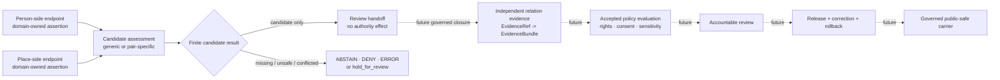
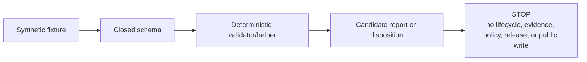

<!-- [KFM_META_BLOCK_V2]
doc_id: kfm://doc/architecture-people-place-joins
title: People-Place Joins — Architecture
type: architecture-standard
version: v2.0.0
prior_version: v1
status: draft; repository-grounded; pair-contract-partial; historical-fixture-executable; generic-join-policy-inactive; public-join-hold; non-authoritative
owners:
  - "@bartytime4life — verified CODEOWNERS review route; routing is not domain stewardship, policy approval, independent review, release authority, or publication authority"
owner_status: "People/DNA/Land, Settlements/Infrastructure, evidence, identity, rights, consent, sensitivity, policy, validation, review, release, correction, and rollback stewards remain NEEDS VERIFICATION"
created: 2026-05-25
updated: 2026-08-20
policy_label: public; architecture; people-place; cross-domain; historical-person-place-event; living-person-sensitive; evidence-first; non-release; non-publication
owning_root: docs/
responsibility_root: docs/
responsibility: Explain the People-Place relation boundary, reconcile proposal-era doctrine with current repository evidence, and keep endpoint authority, relation evidence, source role, time, sensitivity, policy, review, release, correction, and rollback distinct without becoming contract, schema, policy, resolver, runtime, release, or publication authority.
canonical_relationship: Same-path explanatory architecture reference under accepted Directory Rules; no seam registration, semantic admission, identity decision, policy result, public-join permission, release, or publication authority is created.
truth_posture: >-
  CONFIRMED the existing target path, accepted Directory Rules placement, current
  generic CrossLaneJoinAssessment candidate packet, current People-Settlements
  semantic README lane, current fixture-only HistoricalPersonPlaceEventResolutionCandidate
  contract/schema/validator/fixtures/tests/workflow, inactive generic join-policy lane,
  closed PolicyDecision family enum without joins, empty proposed policy-gate register,
  and absence of a People-Place entry from the partial Cross-Domain Seam Register /
  PROPOSED the event-first architecture, future pair-profile closure, relation-evidence
  rules, public-safe transformations, correction propagation, and smallest next slice /
  UNKNOWN live-source resolution, real place/person authority matching, deployed
  People-Place consumers, policy execution, governed ANSWER behavior, released
  derivatives, correction propagation, and rollback execution / NEEDS VERIFICATION
  accountable stewards, accepted pair semantics, pair schema and policy, relation-level
  EvidenceBundle closure, resolution identity validation, seam registration, reviewed
  public obligations, exact-head hosted checks, and consumer behavior.
evidence_snapshot:
  repository: bartytime4life/Kansas-Frontier-Matrix
  visibility: public
  base_ref: main
  base_commit: 18da9e4700f930776340367f4a5c8ffc3dbb5781
  target_prior_blob: 7e428017d0a0a3b75cbf01424f34bfbe356e8e6d
  directory_rules_blob: fd49a0b83e55cef52c1124281f093e263526898d
  adr_0029_blob: a4de0d7a96b78da59cfc499d1025e1508afd8dd9
  generic_join_contract_blob: 2d78246d66d64d69413686e460321635adfc6170
  people_settlements_contract_readme_blob: c4b109e85af72ad6d1ff3f9499d124e733672815
  historical_resolution_contract_blob: 7382ae1ef339df51fa9777f26a6f26d57b8009f5
  historical_resolution_schema_blob: 0a1cd4d6fcd0d80a45b88bf679dd7beb3f9ad4d6
  historical_resolution_validator_blob: 3ce791ef6b04a87807146675a7d1536ee6c713bc
  historical_resolution_fixture_readme_blob: cdb60340b8484b4a6ca40bec5b7245192b8ec22a
  historical_resolution_tests_blob: 9c98ad5b6b4e11ed6625305121e0e39026eac1c1
  historical_resolution_workflow_blob: 729b2f7189f146ea17c809a506a8f429f1f9fb81
  place_identity_contract_blob: 8f315a9e07e6230188243e6476abc263a390922e
  evidence_ref_contract_blob: afd3a964435445edbb694b5edf16e2b6ddd49a92
  policy_decision_schema_blob: 1472d26a42c73f17545b4464a275412ffa1d098e
  join_policy_readme_blob: 98b0a4e55007786039690a54be8f19b1bb0d2aec
  cross_domain_seam_register_blob: dc87ea9c2ab11cc10e51cf4e8284c030e7c9ab29
  policy_gate_register_blob: 10e66eb9d587797a3f12e2aaac00fb4e60ec7fa2
inspection_boundary: >-
  Current-session GitHub reads covered the complete prior target; accepted ADR-0029
  and adopted Directory Rules; the architecture index and current Governed API
  boundary; generic cross-lane join architecture, contract, helper boundary, policy
  boundary, PolicyDecision shape, and gate/seam projections; the People-Settlements
  semantic lane; the historical person-place-event contract, schema, validator,
  fixture guide, tests, and workflow; People/DNA/Land architecture and identity
  guidance; place-identity semantics; EvidenceRef and EvidenceBundle contracts; open
  pull requests; and matching branches. No live source, real person, real parcel,
  real DNA record, real exact location, production resolver, active joins policy
  evaluator, authenticated reviewer, deployed API route, public MapLibre layer,
  release packet, correction cascade, or rollback execution was exercised.
related:
  - README.md
  - cross-lane-join-policy.md
  - cross-domain/cross-lane-relations.md
  - governed-api/README.md
  - ../doctrine/directory-rules.md
  - ../adr/ADR-0029-adopt-directory-governance-standard-v2.md
  - ../domains/people-dna-land/ARCHITECTURE.md
  - ../domains/people-dna-land/IDENTITY_MODEL.md
  - ../domains/settlements-infrastructure/README.md
  - ../../contracts/joins/README.md
  - ../../contracts/joins/people-settlements/README.md
  - ../../contracts/domains/people-dna-land/historical_person_place_event_resolution.md
  - ../../contracts/domains/settlements-infrastructure/place-identity.md
  - ../../contracts/evidence/evidence_ref.md
  - ../../contracts/evidence/evidence_bundle.md
  - ../../schemas/contracts/v1/domains/people-dna-land/historical_person_place_event_resolution.schema.json
  - ../../tools/validators/validate_historical_person_place_event_resolution.py
  - ../../fixtures/contracts/v1/domains/people-dna-land/historical_person_place_event_resolution/README.md
  - ../../tests/validators/test_validate_historical_person_place_event_resolution.py
  - ../../.github/workflows/historical-person-place-event-resolution.yml
  - ../../contracts/joins/cross_lane_join_assessment.md
  - ../../schemas/contracts/v1/joins/cross_lane_join_assessment.schema.json
  - ../../tools/joins/join_candidates.py
  - ../../fixtures/contracts/v1/joins/cross_lane_join_assessment/cases.json
  - ../../tests/joins/test_join_candidates.py
  - ../../.github/workflows/cross-lane-join-assessment.yml
  - ../../policy/joins/README.md
  - ../../schemas/contracts/v1/policy/policy_decision.schema.json
  - ../../control_plane/cross_domain_seam_register.yaml
  - ../../control_plane/policy_gate_register.yaml
tags: [kfm, architecture, people-place, people-dna-land, settlements-infrastructure, event-first, relation-candidate, identity, evidence, source-role, sensitivity, consent, policy, review, release, correction, rollback]
notes:
  - "v2.0.0 replaces a proposal-era architecture page with a commit-pinned current-repository boundary while preserving the same path, doc_id, H1, and all eleven numbered H2 headings."
  - "The current executable proof is synthetic and candidate-only: one generic cross-lane packet and one historical person-place-event profile. Neither establishes identity, residence, migration, ownership, title, policy permission, release, or publication."
  - "People-Place is absent from the partial Cross-Domain Seam Register; no registered seam identity or public join is inferred."
  - "policy/joins is documented but inactive, the current PolicyDecision family enum has no joins value, and the proposed policy-gate register has no entries."
  - "No doctrine, ADR, register, contract, schema, policy, source, fixture, validator, test, workflow, runtime, lifecycle state, release, deployment, publication, or repository setting is changed by this page."
[/KFM_META_BLOCK_V2] -->

<a id="top"></a>

# People-Place Joins — Architecture

A People-Place relation is a **derived relationship candidate** between independently governed person-side and place-side assertions. It is not person identity, place identity, residence truth, migration truth, ownership truth, title proof, policy permission, review approval, release approval, or publication.

[](#status-and-evidence-boundary)
[](#status-and-evidence-boundary)
[](#current-implementation-map)
[](#current-implementation-map)
[](#8-sensitivity-and-deny-by-default-register)
[](#6-join-lifecycle-raw--published)
[](#7-outcome-envelope)

> [!IMPORTANT]
> **A candidate is not a claim of fact.** The current repository can validate bounded synthetic candidate packets. It does not prove a live person's identity, historical residence, migration, land ownership, patent validity, title, place status, cultural affiliation, or right to expose a location.

> [!CAUTION]
> **Current policy is not active for this relation family.** [`policy/joins/`](../../policy/joins/README.md) has no local executable rule, accepted bundle, selector, evaluator, or decision emitter; the current [`PolicyDecision`](../../schemas/contracts/v1/policy/policy_decision.schema.json) family enum does not include `joins`; and the proposed [`policy_gate_register.yaml`](../../control_plane/policy_gate_register.yaml) has no entries.

> [!WARNING]
> **Composition can create new harm.** Public or low-risk endpoint records may become sensitive when combined. Living-person location, private family context, DNA inference, person-parcel association, exact burial location, reservation-community context, archaeology, cultural affiliation, and other harmful precision fail closed unless separate evidence, rights, consent, policy, review, release, correction, and rollback controls support a narrower use.

## Table of contents

- [Status and evidence boundary](#status-and-evidence-boundary)
- [Authority and responsibility split](#authority-and-responsibility-split)
- [Current implementation map](#current-implementation-map)
- [1. Scope and non-goals](#1-scope-and-non-goals)
- [2. Conceptual model](#2-conceptual-model)
- [3. Authority anchoring ladders](#3-authority-anchoring-ladders)
- [4. Identity rule for a join](#4-identity-rule-for-a-join)
- [5. Cross-lane join families](#5-cross-lane-join-families)
- [6. Join lifecycle](#6-join-lifecycle-raw--published)
- [7. Outcome envelope](#7-outcome-envelope)
- [8. Sensitivity and deny-by-default register](#8-sensitivity-and-deny-by-default-register)
- [9. Anti-patterns](#9-anti-patterns)
- [10. Verification backlog](#10-verification-backlog)
- [11. Related docs](#11-related-docs)
- [Smallest sound next implementation slice](#smallest-sound-next-implementation-slice)
- [Correction, invalidation, and rollback](#correction-invalidation-and-rollback)
- [Evidence ledger](#evidence-ledger)
- [Change history](#change-history)

---

## Status and evidence boundary

This revision replaces the May 2026 proposal-era posture with a current, commit-pinned repository boundary. The page remains human-readable architecture. It does not become contract, schema, source, identity, evidence, policy, review, runtime, release, or publication authority merely because it is detailed.

| Surface | Confirmed state at `main@18da9e4700f930776340367f4a5c8ffc3dbb5781` | Safe interpretation |
|---|---|---|
| This page | Existing tracked file; prior blob `7e428017d0a0a3b75cbf01424f34bfbe356e8e6d`. | Same-path modernization; no move, rename, or parallel authority home. |
| Directory governance | [ADR-0029](../adr/ADR-0029-adopt-directory-governance-standard-v2.md) is accepted and adopts [Directory Rules v2](../doctrine/directory-rules.md). | This existing cross-cutting explanation remains under `docs/architecture/`; placement does not admit relation semantics or policy. |
| Generic join packet | [`CrossLaneJoinAssessment`](../../contracts/joins/cross_lane_join_assessment.md), a closed schema, deterministic helper, synthetic cases, focused tests, and a read-only workflow exist. | Proves one local candidate-assessment profile only. `ALLOW` means emit a reviewable `JOIN_CANDIDATE`, not truth or permission. |
| People-Settlements semantics | [`contracts/joins/people-settlements/README.md`](../../contracts/joins/people-settlements/README.md) exists, with a confirmed cemetery child and proposed residence, institution, migration, land-record-place, and community-membership children. | Pair-level semantic boundary exists as draft prose; complete pair schema, policy, fixtures, tests, and release behavior are not established by that README. |
| Historical candidate profile | Contract, closed schema, deterministic validator, synthetic fixtures, focused tests, and a read-only workflow exist for `HistoricalPersonPlaceEventResolutionCandidate`. | Proves synthetic score/disposition and negative-boundary conformance only; no live resolution, EvidenceBundle closure, policy decision, or public effect. |
| Place identity | [`place-identity.md`](../../contracts/domains/settlements-infrastructure/place-identity.md) defines draft place/community semantics. | The paired place-identity schema is reported missing; field enforcement and real authority matching remain unproved. |
| Join-policy source | [`policy/joins/`](../../policy/joins/README.md) is documented but inactive. | No accepted generic or People-Settlements evaluator/bundle is available. |
| Outward policy shape | The current [`PolicyDecision`](../../schemas/contracts/v1/policy/policy_decision.schema.json) permits `promotion`, `access`, `render`, `capability`, `consent`, and `sensitivity`. | `policy_family: joins` is currently schema-invalid; do not manufacture a join PolicyDecision. |
| Policy-gate projection | [`policy_gate_register.yaml`](../../control_plane/policy_gate_register.yaml) is `PROPOSED` with `entries: []`. | No active join gate or required-check binding is registered. |
| Seam projection | The partial [`cross_domain_seam_register.yaml`](../../control_plane/cross_domain_seam_register.yaml) has five held seams; People-Place is absent. | No registered People-Place seam ID, participant allocation, seam contract, or public-join permission exists in that projection. |
| Governed API | The current [Governed API architecture boundary](governed-api/README.md) proves schema-backed negative envelopes, not a substantive People-Place `ANSWER` route. | No deployed People-Place consumer or public relation payload is claimed. |
| Review route | Repository review routes to `@bartytime4life`. | Routing is not specialist stewardship, qualified sensitivity review, consent, policy approval, or independent release authority. |

### Truth posture

- **CONFIRMED:** the paths and bounded artifact families listed above, their current proposal/fixture/inactive states, and the target's existing bytes.
- **PROPOSED:** event-first relation architecture, pair-profile graduation, relation-level evidence closure, public-safe transforms, correction propagation, and future operational sequence.
- **UNKNOWN:** live source ingestion, real authority resolution, deployed consumers, policy execution, released relation products, and rollback execution.
- **NEEDS VERIFICATION:** accountable stewards, accepted pair semantics, exact relation identity rules, pair policy and schema closure, EvidenceRef-to-EvidenceBundle resolution, and public/release obligations.
- **HOLD:** any public People-Place join, live-person relation, exact private person-parcel relation, DNA-derived relation, exact sensitive site relation, or uncited cultural-affiliation relation.

### Non-effects

This page changes no:

- doctrine or ADR status;
- control-plane register;
- semantic contract or schema;
- source admission or lifecycle record;
- identity resolution result;
- policy source, evaluation, or outward decision;
- fixture, validator, test, workflow, app, package, API, map, graph, search, export, or AI runtime;
- review, release, correction, withdrawal, rollback, deployment, or publication state.

[Back to top](#top)

---

## Authority and responsibility split

A People-Place feature spans several roots, but each artifact has one authority owner. The relation does not create a sovereign merged domain above People/DNA/Land and Settlements/Infrastructure.

| Concern | Owning surface | Boundary |
|---|---|---|
| Person assertion and identity meaning | People/DNA/Land contracts and domain documentation | A place relation may reference a person-side assertion; it cannot canonize or rewrite it. |
| Place/community identity meaning | Settlements/Infrastructure contracts and domain documentation | A person-side source cannot establish municipal, census, historic, reservation-community, or other place identity by itself. |
| Relationship meaning | [`contracts/joins/`](../../contracts/joins/README.md) and a reviewed pair profile | Tooling and policy cannot invent semantics. |
| Machine shape | `schemas/` under the accepted pair/object family | Shape validity is not endpoint truth, relation truth, or permission. |
| Candidate computation | [`tools/joins/`](../../tools/joins/README.md) or a reviewed pair-specific validator | A helper may propose and explain; it cannot approve, release, or publish. |
| Source identity and source role | Source contracts and registry authority | A relation cannot upgrade what an input source can prove. |
| Evidence pointers and closure | [`EvidenceRef`](../../contracts/evidence/evidence_ref.md), [`EvidenceBundle`](../../contracts/evidence/evidence_bundle.md), receipts, proofs, and catalogs | Endpoint evidence and evidence for the relationship remain separately inspectable. |
| Rights, consent, sensitivity, and use | Accepted `policy/` families plus qualified review | Permission for an endpoint does not transfer to the combined relation. |
| Review | Governed review records and authenticated reviewer authority | CODEOWNERS routing is not review proof. |
| Release, correction, withdrawal, rollback | `release/` and applicable accountability lanes | Candidate, validation, policy, and review are not release. |
| Public API, map, search, graph, export, and AI | Governed released-carrier surfaces | Public clients consume released, obligation-compliant derivatives only. |
| This page | `docs/architecture/` | Explain current evidence and boundaries; never create another authority surface. |

> [!IMPORTANT]
> **Endpoint validity, relation validity, policy admissibility, review approval, and release are five different claims.** Proving one never proves the others.

[Back to top](#top)

---

## Current implementation map

Current repository evidence supports two bounded executable candidate profiles and one pair-level semantic lane.

| Layer | Current evidence | What it proves | What it does not prove |
|---|---|---|---|
| Generic candidate assessment | Contract, closed schema, deterministic helper, synthetic fixture matrix, focused tests, read-only workflow | A declared exact-key or synthetic spatial-temporal predicate can produce a finite local report while preserving generic role/evidence/sensitivity boundaries. | Real geometry, pair semantics, identity, relation truth, policy, review, release, or publication. |
| People-Settlements semantic lane | Parent README and cemetery child README | The repository has a draft semantic home for the pair and records sensitivity/non-ownership rules. | A complete relation object family, schema, evaluator, fixture packet, policy, or released product. |
| Historical person-place-event profile | Contract, closed schema, validator, three valid polarity fixtures plus exact-negative fixtures, seven focused tests, read-only workflow | Synthetic historical candidates can be scored and rejected deterministically under a bounded profile. | Live authority/GLO/census/archive access, identity adjudication, residence, migration, ownership, title, EvidenceBundle sufficiency, policy approval, public use, or release. |

The two executable profiles must not be silently fused:

- the generic profile reports `ALLOW`, `ABSTAIN`, `DENY`, or `ERROR` for a candidate operation;
- the historical profile validates a fixture and derives `candidate_review`, `hold_for_review`, or `abstain`;
- neither produces outward `ANSWER`;
- neither creates an EvidenceBundle, PolicyDecision, ReviewRecord, ReleaseManifest, public graph edge, API result, or map feature.

[Back to top](#top)

---

## 1. Scope and non-goals

### 1.1 In scope

This page explains how KFM may evaluate a typed relationship between:

- a person-side assertion, candidate, canonical record, or historical event participant owned by People/DNA/Land; and
- a place-side assertion, settlement, municipality, census place, townsite, ghost town, fort, mission, reservation community, parcel context, or other bounded location identity owned by its source domain.

The relation is a **derived claim candidate** with explicit:

- endpoint references and owning domains;
- relationship type and relation owner;
- source roles;
- valid-time and other material time axes;
- spatial support, scale, precision, uncertainty, and generalization posture;
- endpoint EvidenceRefs and independent relation support;
- rights, consent, sensitivity, review, release, correction, and rollback posture;
- finite candidate outcome and reason codes.

A database join, matching name, shared identifier, spatial containment, temporal overlap, route proximity, common county, or model score may be one input to candidate computation. None establishes the relationship by itself.

### 1.2 Non-goals

This page does **not**:

- define Person, PersonCanonical, Place, Settlement, Parcel, Event, or relationship wire formats;
- adjudicate identity, residency, migration, kinship, biological relationship, cultural affiliation, ownership, patent validity, legal title, municipal status, or public access;
- choose a universal ontology or claim that CIDOC-CRM, Schema.org, PROV-O, or a `kfm:` JSON-LD context is emitted today;
- activate a live source, authority service, GLO service, census source, newspaper source, archive, geocoder, place registry, or public API;
- treat an EvidenceRef as EvidenceBundle closure;
- accept or activate a join policy, add `joins` to `PolicyDecision`, or register a policy gate;
- authorize a public relation, exact sensitive geometry, living-person location, private parcel association, DNA-derived inference, or public AI answer;
- write any lifecycle, receipt, proof, catalog, graph, release, correction, withdrawal, or rollback record.

[Back to top](#top)

---

## 2. Conceptual model

### 2.1 Event-first architecture

The durable architectural posture remains **event-first, not flat-attribute-first**:

```text
Person-side assertion
  -> typed event or relationship candidate
  -> Place-side assertion
```

This prevents a field such as `person.place_of_residence` from erasing source, time, uncertainty, contradiction, relation evidence, and correction history.

**Current boundary:**

- The historical fixture profile contains explicit `person`, `event`, and `place` objects and enumerates historical event types.
- The generic helper computes exact-key and synthetic spatial-temporal candidates.
- Neither executable profile emits a CIDOC-CRM/PROV-O graph, canonical JSON-LD context, or released relation edge.
- Therefore event-first semantics are **PROPOSED architecture with bounded fixture support**, not a fully implemented graph model.

### 2.2 Current and future flow


```mermaid
flowchart LR
  P["Person-side endpoint<br/>domain-owned assertion"] --> C["Candidate assessment<br/>generic or pair-specific"]
  L["Place-side endpoint<br/>domain-owned assertion"] --> C
  C --> O{"Finite candidate result"}
  O -->|candidate only| R["Review handoff<br/>no authority effect"]
  O -->|missing / unsafe / conflicted| N["ABSTAIN · DENY · ERROR<br/>or hold_for_review"]

  R -. future governed closure .-> E["Independent relation evidence<br/>EvidenceRef -> EvidenceBundle"]
  E -. future .-> POL["Accepted policy evaluation<br/>rights · consent · sensitivity"]
  POL -. future .-> REV["Accountable review"]
  REV -. future .-> REL["Release + correction + rollback"]
  REL -. future .-> PUB["Governed public-safe carrier"]
```

Solid edges represent current candidate-oriented reasoning. Dotted edges are the required future governed path and are not proven complete for People-Place joins.

### 2.3 Minimum relation packet

A mature relation candidate should keep these concerns separate:

| Concern | Minimum requirement | Current status |
|---|---|---|
| Left endpoint | Stable reference, owner, source role, time, evidence pointer | Generic fixture support; pair-specific maturity varies. |
| Right endpoint | Stable reference, owner, source role, time, spatial support, evidence pointer | Generic fixture support; place schema remains incomplete. |
| Relation | Named semantics, relation owner, candidate identity, rule/method, uncertainty | Generic and historical bounded profiles exist; universal profile absent. |
| Relation evidence | Support for **the connection**, not merely each endpoint | Required architecture; current closure incomplete. |
| Governance | Rights, consent, sensitivity, policy, review, release, correction, rollback | Current join-policy lane inactive; no complete pair flow. |
| Public projection | Finite outward envelope and public-safe geometry/content | No People-Place `ANSWER` or released carrier proved. |

[Back to top](#top)

---

## 3. Authority anchoring ladders

### 3.1 Person-side anchors

The historical fixture validator confirms this priority order **for that bounded profile only**:

```text
LCNAF -> VIAF -> ISNI -> Wikidata -> local
```

An exact LCNAF, VIAF, ISNI, or Wikidata match earns the profile's authority signal only when independently supported by at least two distinct fixture source references. SNAC may be corroborative fixture evidence, but it is not primary and does not earn that signal alone.

This confirms a testable fixture rule. It does not establish that live authority services are connected, current, rights-cleared, or sufficient to adjudicate a person.

### 3.2 Place-side anchors

The current historical profile does **not** implement the former proposal's full GNIS/TGN/KHRI/Wikidata ladder. It uses visibly synthetic place support:

- `county_fips=99999`;
- `Synthetic County`;
- `T00S/R00W/S00`;
- an optional exact synthetic GLO legal-description block.

The current draft [`Place Identity Contract`](../../contracts/domains/settlements-infrastructure/place-identity.md) names place/community families and proposes source-native IDs, aliases, time, spatial support, evidence, and governance fields, but reports its paired schema missing.

Accordingly:

- GNIS, TGN, KHRI/KSHS, Wikidata, local identifiers, GLO legal descriptions, and other sources may be candidate anchors;
- no universal ranking is accepted or machine-enforced by this page;
- Indigenous, reservation-community, vernacular, historical, legal, census, and administrative identities must not be collapsed into a single display-name match;
- place anchoring remains **NEEDS VERIFICATION** against source roles, time, rights, sovereignty, geometry, and pair-specific semantics.

### 3.3 Anchors are not relation evidence

An authority match on each endpoint can improve candidate identity. It does not prove that the person stood in the asserted relationship to the place. The relation needs its own support, contradiction handling, and scope.

[Back to top](#top)

---

## 4. Identity rule for a join

### 4.1 Current identities must not be collapsed

The repository currently carries more than one candidate identity rule:

| Profile | Current rule | Confirmed enforcement |
|---|---|---|
| Generic `CrossLaneJoinAssessment` | `candidate_id` is RFC 8785 / SHA-256 over the request and endpoints; `spec_hash` binds the assessment profile. | Bounded generic helper/tests. |
| Historical person-place-event candidate | Schema requires `resolution_id` and `spec_hash`; validator recomputes `spec_hash`, score, confidence, disposition, review state, and primary authority. | `spec_hash` and derived fields confirmed; independent recomputation of `resolution_id` is **NEEDS VERIFICATION** from the inspected validator. |
| Former four-tuple in this page | `source_id + object_role + temporal_scope + normalized_digest`. | Design lineage only; not established as the current pair contract. |

This page does not choose a new canonical formula. A later accepted relation contract must define:

- which endpoint identities are referenced rather than copied;
- which relation semantics and temporal scope enter identity;
- canonicalization algorithm and version;
- method/rule version;
- source-role and evidence posture;
- correction and supersession behavior;
- collision handling and replay tests.

### 4.2 Time is part of relation identity

A relation such as residence, migration stage, burial, enrollment, institutional membership, land-record context, or historical presence is materially time-scoped. At minimum, distinguish:

- `valid_time` — when the relationship is asserted to hold;
- source/record time;
- retrieval and processing time;
- review and release time;
- correction or withdrawal time.

Unknown or fuzzy time must be represented as uncertainty, not silently converted to a precise instant.

### 4.3 Source role never upgrades

A relation preserves each input role. Aggregate, modeled, administrative, candidate, or synthetic support cannot become observed simply because it is linked to a precise place or an observed endpoint. Promotion moves state; it does not rewrite epistemic character.

[Back to top](#top)

---

## 5. Cross-lane join families

### 5.1 Verified pair lane and bounded executable subset

| Family | Current repository state | Public posture |
|---|---|---|
| People ↔ Settlements parent | Draft semantic README exists. | HOLD; no complete pair policy/release path. |
| Cemetery / burial context | Confirmed child semantic README. | Restricted by default; exact burial/person context requires stronger controls. |
| Historical person-place-event resolution | Executable synthetic candidate profile with event types including land patent, residence, migration, burial, and other historical. | No public release; all fixtures synthetic. |
| Residence | Proposed child family in pair README. | Unimplemented as a complete pair profile. |
| Institution | Proposed child family. | Unimplemented as a complete pair profile. |
| Migration | Proposed child family. | Unimplemented as a complete pair profile. |
| Land-record-place | Proposed, highly sensitive child family. | DENY/HOLD by default; not title proof. |
| Community membership | Proposed, review-sensitive child family. | HOLD; sovereignty, living-person, and cultural obligations may apply. |

### 5.2 Adjacent relation families

The prior page also described People relations to Roads/Rail, Archaeology/Cultural Heritage, and Agriculture. Those remain useful architecture questions, but current evidence does not place them inside the verified People-Settlements child lane or register them as active seams.

| Adjacent family | Safe current interpretation |
|---|---|
| People ↔ Roads / Rail | Migration or access context may be proposed; route proximity does not prove movement or continuous presence. |
| People ↔ Archaeology / Cultural Heritage | Cultural affiliation and site context require independent evidence, sovereignty/cultural review, and exact-location denial by default. |
| People ↔ Agriculture / Land | Public context may be proposed; private person-parcel, operator, title, and yield inferences fail closed. |
| People ↔ Aggregate county/year context | Aggregate context remains aggregate; it cannot become per-person or per-place observation. |

### 5.3 Four invariants across every family

1. **Ownership preserved** — endpoint domains retain authority.
2. **Source role preserved** — no epistemic upgrade through composition.
3. **Sensitivity preserved or increased** — the relation inherits the strictest input and may become more restrictive because of inference risk.
4. **Evidence preserved** — endpoint support and relationship support remain separately resolvable.

People-Place is absent from the partial Cross-Domain Seam Register. This page does not add it by implication.

[Back to top](#top)

---

## 6. Join lifecycle (RAW → PUBLISHED)

### 6.1 Current executable lifecycle effect

The current generic and historical executable profiles are **fixture-only non-publishers**:


```mermaid
flowchart LR
  F["Synthetic fixture"] --> S["Closed schema"]
  S --> V["Deterministic validator/helper"]
  V --> C["Candidate report or disposition"]
  C --> STOP["STOP<br/>no lifecycle, evidence, policy, release, or public write"]
```

The historical workflow explicitly performs no live authority, GLO, census, newspaper, archive, or map access. The contract states that it writes no RAW, WORK, QUARANTINE, PROCESSED, CATALOG, TRIPLET, PUBLISHED, proof, release, graph, search, vector, cache, API, map, or AI state.

### 6.2 Required future governed lifecycle

A real People-Place relation would need a separately governed path:

```text
PRE-RAW / source admission
  -> RAW endpoint records
  -> WORK / QUARANTINE normalization and candidate resolution
  -> PROCESSED endpoint and relation candidates
  -> CATALOG / TRIPLET evidence closure and reviewed projection
  -> PUBLISHED public-safe derivative after release
```

| Stage | Required relation posture | Current proof |
|---|---|---|
| Source admission / RAW | SourceDescriptor, rights, source role, immutable capture, person/place scope | Not implemented by the fixture profiles. |
| WORK / QUARANTINE | Normalize endpoints, time, place support, contradictions, uncertainty, consent/sensitivity | Synthetic candidate logic only. |
| PROCESSED | Valid relation candidate plus separately resolvable endpoint and relation evidence | Partial candidate proof; no complete relation EvidenceBundle closure. |
| CATALOG / TRIPLET | Catalog/proof closure and reviewed graph projection without source-role collapse | UNKNOWN for People-Place. |
| PUBLISHED | Applied policy, accountable review, ReleaseManifest, public-safe transform, correction path, rollback target | HOLD / unproved. |

### 6.3 Public boundary

Normal clients must not read candidate fixtures, internal identity stores, raw evidence, policy internals, or unreleased graph edges. The current Governed API has no verified substantive People-Place `ANSWER` route. Public use remains blocked until a released, obligation-compliant carrier is proven.

[Back to top](#top)

---

## 7. Outcome envelope

Three current vocabularies serve different responsibilities and must not be collapsed.

| Surface | Finite vocabulary | Meaning |
|---|---|---|
| Generic candidate helper | `ALLOW`, `ABSTAIN`, `DENY`, `ERROR` plus report statuses such as `JOIN_CANDIDATE` | Local candidate-assessment result. `ALLOW` authorizes only report emission. |
| Historical fixture validator | `VALID`, `INVALID`, `ERROR`; valid candidate dispositions `candidate_review`, `hold_for_review`, `abstain` | Conformance and review posture for the synthetic historical profile. |
| Outward `PolicyDecision` | `ANSWER`, `ABSTAIN`, `DENY`, `ERROR` | Runtime/policy envelope for one admitted policy family; `joins` is not currently admitted. |

### 7.1 Non-equivalence rules

- `VALID` is not `ALLOW`.
- `ALLOW` is not `ANSWER`.
- `candidate_review` is not review approval.
- `hold_for_review` is not a released outward result.
- `ABSTAIN` never authorizes a best-guess relation.
- `DENY` must not leak protected details in its reason.
- `ERROR` must fail closed and must not fall back to a candidate or public claim.
- A workflow success proves only the checks the workflow actually ran.

### 7.2 Ambiguity

Multiple plausible candidates, unresolved authority matches, unresolved place identity, conflicting evidence, missing EvidenceRefs, unsupported time/space, or uncertain rights must produce a bounded negative result. The system does not select the most plausible relation merely because a score is highest.

[Back to top](#top)

---

## 8. Sensitivity and deny-by-default register

### 8.1 Current executable negative boundaries

The historical validator and generic helper establish the following bounded negative evidence:

| Risk | Current bounded behavior |
|---|---|
| Living person | Historical profile requires `living_person=false`; deviation is rejected. Generic candidate profile denies living-person joins. |
| Public release | Historical profile requires `public_release=false`, `release_state=not_released`, `promotion_eligible=false`, and `public_exposure=false`. |
| Raw DNA / kit identifiers | Forbidden DNA/genotype/sequence/segment/kit-related fields are rejected. |
| Private parcel and harmful precision | Parcel IDs, addresses, coordinates, latitude, longitude, and related precise/private fields are rejected in the historical profile; generic exact restricted geometry is denied. |
| Missing evidence refs | Generic candidate assessment abstains when required EvidenceRefs are absent. |
| Source-role conflict | Generic candidate assessment abstains rather than laundering modeled, aggregate, or candidate roles. |
| Restricted/generalized context | Generic candidate assessment requires sensitivity review or denies exact restricted geometry. |
| Strong historical contradiction | Historical scoring subtracts three points and forces `hold_for_review`, even when other signals are strong. |
| Real geography | Historical fixtures use synthetic county and PLSS sentinels only. |

These checks are real but narrow. They do not constitute an accepted People-Place policy.

### 8.2 Composition risk

A relation can be more sensitive than either endpoint. Examples include:

- a public place plus a restricted person assertion revealing a living person's location;
- a historical family record plus a precise parcel revealing private ownership context;
- a place, date, and family network re-identifying a DNA participant;
- a public cemetery name plus an exact grave coordinate exposing protected or culturally sensitive information;
- an aggregate cell plus a small cohort enabling re-identification;
- a place identity plus archaeology or reservation-community context exposing restricted cultural knowledge.

The effective posture is at least the strictest endpoint and may become stricter after threat modeling the composition.

### 8.3 Current policy gap

This page does not ratify a universal numeric sensitivity scale. The current policy source for generic joins is inactive, and no People-Settlements child policy was verified under `policy/joins/`. Until accepted policy, consent, review, and release controls exist, sensitive People-Place use remains `HOLD`, `DENY`, or `ABSTAIN`.

[Back to top](#top)

---

## 9. Anti-patterns

| Anti-pattern | Why it fails | Required counter-rule |
|---|---|---|
| Flat `person.place_of_residence` | Erases event, time, source, evidence, contradiction, and correction. | Event-first candidate with explicit scope. |
| Matching names as identity | Names are ambiguous and time/source dependent. | Authority candidates plus independent evidence; abstain when unresolved. |
| Matching endpoint anchors as relation proof | Two valid endpoints do not prove a connection. | Require independent relation evidence. |
| Most-plausible candidate wins | Converts uncertainty into unsupported truth. | Finite negative outcome and review handoff. |
| Aggregate cited as a person/place fact | Collapses scale and source role. | Preserve aggregate role and scope; block record-level inference. |
| Modeled or administrative input becomes observed | Launders epistemic character. | Source role is immutable through candidate/release state changes. |
| Style-only hiding | Sensitive bytes remain available to clients. | Withhold/generalize before released carrier creation. |
| `VALID`, `ALLOW`, workflow success, or score used as approval | Conformance/candidate evidence is not policy, review, or release. | Keep decision classes and receipts separate. |
| EvidenceRef treated as evidence closure | A pointer may be unresolved or pre-closure. | Resolve to claim-scope EvidenceBundle where material. |
| Wikidata or a community identifier used as sole truth | Routing/crosswalk identifiers can drift and do not prove the claim. | Preserve source authority and independent support. |
| Person-parcel association inferred from private records | Combines identity and property context. | Deny by default; restricted use requires consent, policy, review, and release. |
| DNA relationship inferred from name/place co-occurrence | Re-identification and unsupported biological inference. | Deny raw/derived DNA relation without specialized consent and policy. |
| Candidate written directly to graph/API/map | Bypasses evidence, policy, review, and release. | Public clients consume released derivatives only. |
| Correction updates one endpoint but leaves relation live | Creates stale derived truth. | Dependency invalidation and transparent supersession. |
| Architecture prose used to activate a seam or policy | Docs are explanatory. | Use accepted contracts, schemas, policy, registers, tests, review, and release records. |

[Back to top](#top)

---

## 10. Verification backlog

| Item | Evidence required | Current status |
|---|---|---|
| People-Place seam standing | Reviewed decision whether this pair needs a seam-register entry, plus participant allocation and non-effects | **NEEDS VERIFICATION**; absent from partial register |
| Pair semantic closure | Accepted object-level People-Settlements relation contract beyond README guidance | **PROPOSED** |
| Pair machine shape | Closed People-Settlements relation schema with exact valid/invalid/denied cases | **UNKNOWN / NEEDS VERIFICATION** |
| Place identity shape | Paired schema, fixtures, validator, and tests for place identity | **NEEDS VERIFICATION**; contract reports schema missing |
| Join policy | Accepted People-Settlements policy source, selector, evaluator, native tests, and obligations | **UNKNOWN**; generic lane inactive |
| Outward policy compatibility | Decision whether joins becomes a `PolicyDecision` family or composes existing families | **NEEDS VERIFICATION** |
| Gate registration | Policy-gate register entry and required-check significance | **UNKNOWN**; register empty |
| Relation evidence | Distinct support for the relationship, not merely both endpoints | **PROPOSED** |
| Evidence resolution | EvidenceRef-to-EvidenceBundle resolver closure for endpoint and relation support | **NEEDS VERIFICATION** |
| Resolution identity | Deterministic recomputation/validation of historical `resolution_id` | **NEEDS VERIFICATION** |
| Real authority resolution | Live or frozen LCNAF/VIAF/ISNI/Wikidata and place-source adapters with rights/currentness | **UNKNOWN** |
| Real spatial/temporal resolver | CRS, geometry, precision, uncertainty, fuzzy time, split/merge, and historical-boundary handling | **UNKNOWN** |
| Cultural and sovereignty review | Qualified ownership/review rules for reservation-community, Indigenous, archaeology, burial, and cultural-affiliation relations | **NEEDS VERIFICATION** |
| Living-person/consent handling | Accepted consent, purpose, audience, retention, revocation, and denial rules | **NEEDS VERIFICATION** |
| Graph projection | Reviewed ontology/context, relation identity, provenance round-trip, and correction behavior | **UNKNOWN** |
| Public API and map behavior | Released carrier, schema-backed outward envelope, redaction/generalization, Evidence Drawer, cache invalidation | **UNKNOWN / HOLD** |
| Correction and rollback | Dependency graph, invalidation receipt, correction propagation, withdrawal, and rollback drill | **UNKNOWN** |
| Accountable stewards | Verified domain, evidence, identity, policy, sensitivity, review, release, and correction owners | **NEEDS VERIFICATION** |
| Exact-head validation | Hosted documentation, link, schema, receipt, security, and relevant repository checks on the PR head | **NEEDS VERIFICATION until PR checks settle** |

[Back to top](#top)

---

## 11. Related docs

### Architecture and doctrine

- [Architecture index](README.md)
- [Cross-Lane Join Policy](cross-lane-join-policy.md)
- [Cross-Lane Relations](cross-domain/cross-lane-relations.md)
- [Governed API Architecture Boundary](governed-api/README.md)
- [Directory Rules v2](../doctrine/directory-rules.md)
- [ADR-0029](../adr/ADR-0029-adopt-directory-governance-standard-v2.md)

### Domain and semantic authority

- [People/DNA/Land Architecture](../domains/people-dna-land/ARCHITECTURE.md)
- [People/DNA/Land Identity Model](../domains/people-dna-land/IDENTITY_MODEL.md)
- [Settlements/Infrastructure domain](../domains/settlements-infrastructure/README.md)
- [`contracts/joins/`](../../contracts/joins/README.md)
- [People-Settlements semantic lane](../../contracts/joins/people-settlements/README.md)
- [Historical person-place-event candidate contract](../../contracts/domains/people-dna-land/historical_person_place_event_resolution.md)
- [Place Identity Contract](../../contracts/domains/settlements-infrastructure/place-identity.md)

### Evidence, implementation, policy, and projections

- [EvidenceRef Contract](../../contracts/evidence/evidence_ref.md)
- [EvidenceBundle Contract](../../contracts/evidence/evidence_bundle.md)
- [Historical candidate schema](../../schemas/contracts/v1/domains/people-dna-land/historical_person_place_event_resolution.schema.json)
- [Historical candidate validator](../../tools/validators/validate_historical_person_place_event_resolution.py)
- [Historical fixture guide](../../fixtures/contracts/v1/domains/people-dna-land/historical_person_place_event_resolution/README.md)
- [Historical focused tests](../../tests/validators/test_validate_historical_person_place_event_resolution.py)
- [Historical workflow](../../.github/workflows/historical-person-place-event-resolution.yml)
- [Generic candidate contract](../../contracts/joins/cross_lane_join_assessment.md)
- [Generic helper](../../tools/joins/join_candidates.py)
- [Generic candidate tests](../../tests/joins/test_join_candidates.py)
- [Join-policy boundary](../../policy/joins/README.md)
- [PolicyDecision schema](../../schemas/contracts/v1/policy/policy_decision.schema.json)
- [Cross-Domain Seam Register](../../control_plane/cross_domain_seam_register.yaml)
- [Policy Gate Register](../../control_plane/policy_gate_register.yaml)

[Back to top](#top)

---

## Smallest sound next implementation slice

**PROPOSED:** strengthen the existing historical person-place-event profile instead of creating a parallel scoring authority or activating live sources.

A bounded follow-up should:

1. define and validate deterministic `resolution_id` derivation;
2. distinguish endpoint evidence refs from evidence supporting the relationship itself;
3. prove that relation evidence cannot be replaced by two valid endpoints;
4. add exact-negative cases for unresolved relation evidence, authority ambiguity, source-role conflict, contradictory time/place support, living-person data, DNA-derived inference, private parcel context, and precise sensitive geometry;
5. map the pair-specific candidate to the generic candidate-assessment vocabulary without turning `VALID` or generic `ALLOW` into `ANSWER`;
6. keep every lifecycle, policy, review, release, publication, and public-use effect false;
7. update the dedicated no-network workflow and generated receipt only as direct dependencies require.

Out of scope for that slice:

- live authority/GLO/census/newspaper/archive connectors;
- a universal place authority ladder;
- accepted generic join policy;
- `PolicyDecision` schema admission for joins;
- seam activation;
- public API, MapLibre, graph, search, export, or AI delivery;
- release, deployment, or publication.

**Directory Rules basis:** extend the existing contract/schema/fixture/validator/test/workflow responsibility lanes. Do not create a new root or a second writable semantic profile. Whether to extend the current domain-specific contract or introduce a reviewed People-Settlements child contract is **NEEDS VERIFICATION** before assigning a new file path.

[Back to top](#top)

---

## Correction, invalidation, and rollback

### Candidate and relation correction

A later correction, withdrawal, revocation, source-role change, rights change, consent revocation, sensitivity escalation, place-identity correction, person-identity split/merge, or evidence supersession must invalidate dependent relation candidates and any governed derivatives.

A mature dependency record should make it possible to:

1. locate affected relation candidates and released carriers;
2. stop new public use;
3. preserve prior state and reason;
4. recompute or abstain under current evidence;
5. issue correction/withdrawal records;
6. invalidate map/search/graph/cache/AI derivatives;
7. rollback to a known safe release where applicable.

Current fixture profiles create no public state, so their operational rollback is a transparent repository revert or bounded forward correction. They do not need a public correction notice unless a later change creates released state.

### Documentation rollback

Before merge, close the draft PR and abandon the feature branch. After an authorized merge, revert the documentation and generated authoring receipt together or issue a bounded forward-correction PR. Do not rewrite shared history or use the old proposal text to imply current implementation maturity.

[Back to top](#top)

---

## Evidence ledger

| Evidence surface | Verified blob at the base | Supports | Does not prove |
|---|---|---|---|
| This page | `7e428017d0a0a3b75cbf01424f34bfbe356e8e6d` | Existing identity/path and proposal-era content | Current implementation |
| Directory Rules | `fd49a0b83e55cef52c1124281f093e263526898d` | Responsibility-root placement | Relation admission or public use |
| Generic join contract | `2d78246d66d64d69413686e460321635adfc6170` | Candidate-only semantics | Pair truth or policy |
| People-Settlements README | `c4b109e85af72ad6d1ff3f9499d124e733672815` | Draft pair semantic lane | Complete pair profile |
| Historical contract | `7382ae1ef339df51fa9777f26a6f26d57b8009f5` | Synthetic scoring and boundaries | Live resolution |
| Historical schema | `0a1cd4d6fcd0d80a45b88bf679dd7beb3f9ad4d6` | Closed fixture shape | Semantic truth or release |
| Historical validator | `3ce791ef6b04a87807146675a7d1536ee6c713bc` | Deterministic checks expressed in code | Hosted execution on this PR |
| Historical fixtures | `cdb60340b8484b4a6ca40bec5b7245192b8ec22a` | Synthetic polarity expectations | Real records |
| Historical tests | `9c98ad5b6b4e11ed6625305121e0e39026eac1c1` | Seven focused test functions | Complete resolver behavior |
| Historical workflow | `729b2f7189f146ea17c809a506a8f429f1f9fb81` | Read-only no-network command path | Identity, policy, release, or publication |
| EvidenceRef contract | `afd3a964435445edbb694b5edf16e2b6ddd49a92` | Pointer/closure distinction | Relation bundle closure |
| PolicyDecision schema | `1472d26a42c73f17545b4464a275412ffa1d098e` | Current outcomes and family enum | Active join policy |
| Seam register | `dc87ea9c2ab11cc10e51cf4e8284c030e7c9ab29` | Five held seams and fail-closed defaults | People-Place registration |
| Policy-gate register | `10e66eb9d587797a3f12e2aaac00fb4e60ec7fa2` | Proposed empty register | Active gate |

Evidence from repository bytes is stronger for current state than proposal-era prose. Documentation remains subordinate to contracts, schemas, policy, executable behavior, review, release, and runtime evidence for the claims those surfaces own.

[Back to top](#top)

---

## Change history

| Version | Date | Change |
|---|---|---|
| `v1` | 2026-05-25 | Proposal-era event-first People-Place architecture, authority ladders, lifecycle, outcomes, sensitivity, and backlog. |
| `v2.0.0` | 2026-08-20 | Repository-grounded rewrite. Preserves path, doc_id, H1, and all eleven numbered H2 headings; reconciles the generic and historical executable candidate packets, draft People-Settlements lane, inactive policy boundary, absent seam registration, current negative controls, public/release HOLD, correction obligations, and a bounded next slice. |

---

<sub>Last updated · 2026-08-20 · Document role · explanatory architecture · Status · repository-grounded draft · <a href="#top">Back to top ↑</a></sub>
