<div align="center">

# 🔄 **Kansas Frontier Matrix — ETL & AI Pipelines Architecture (v2.1.1 · Tier-Ω+∞ Certified)**  
`docs/architecture/pipelines.md`

**Mission:** Define the **data transformation and AI enrichment pipelines** that power the Kansas Frontier Matrix (KFM),  
ensuring reproducibility, provenance, and FAIR+CARE compliance throughout every stage of data processing and AI lifecycle management.

[](../../docs/)
[](../../.github/workflows/stac-validate.yml)
[](../../docs/standards/faircare-validation.md)
[](../../LICENSE)

</div>

---

## 📚 Overview

The **ETL & AI Pipelines** subsystem is the engine that transforms, validates, enriches, and publishes KFM’s data.  
Each pipeline is **containerized**, **automated**, and **audited**, ensuring compliance with FAIR+CARE governance and MCP reproducibility principles.

The architecture integrates:
- **ETL Workflows:** Extraction, transformation, and loading of structured, geospatial, and archival datasets.  
- **AI Workflows:** Enrichment via NLP, geocoding, summarization, and Focus Mode entity reasoning.  
- **Validation & Governance:** Continuous verification, ethical compliance, and provenance tracking.  

---

## 🧩 Pipeline Architecture Overview

```mermaid
flowchart TD
  subgraph RAW["Raw Data Sources"]
    A1["NOAA · USGS · FEMA · KGS"]
    A2["Archives · Documents · Maps"]
  end

  subgraph ETL["ETL Pipeline"]
    E1["Extract (APIs · Downloads · OCR)"]
    E2["Transform (Normalize · Reproject · Clean)"]
    E3["Validate (Schema · FAIR+CARE)"]
    E4["Load (GeoJSON · CSV · GeoTIFF)"]
  end

  subgraph AI["AI Pipeline"]
    I1["Entity Recognition (spaCy / Transformers)"]
    I2["Summarization · Semantic Linking"]
    I3["Focus Mode Reasoning · Explainability"]
  end

  subgraph META["Metadata & Governance"]
    M1["STAC/DCAT Metadata Generation"]
    M2["Governance Ledger Update"]
    M3["FAIR+CARE Validation Report"]
  end

  subgraph PUB["Publication"]
    P1["STAC Catalog Update"]
    P2["API + Web Visualization"]
    P3["Archival Manifest / SBOM"]
  end

  A1 --> E1
  A2 --> E1
  E1 --> E2 --> E3 --> E4 --> I1 --> I2 --> I3 --> M1 --> M2 --> M3 --> P1 --> P2 --> P3
```


<!-- END OF MERMAID -->

---

## 🧱 Core Pipeline Components

| Component | Description | Tools / Technologies | Outputs |
|:--|:--|:--|:--|
| **Extraction** | Fetches data from APIs and repositories. | Python, cURL, wget, OCRmyPDF | Raw datasets |
| **Transformation** | Reprojects CRS, cleans attributes, harmonizes schemas. | GDAL, Pandas, GeoPandas | Normalized GeoJSON |
| **Validation** | Ensures schema, STAC/DCAT conformity, and FAIR+CARE alignment. | `stac-validator`, Conftest | Reports and STAC items |
| **AI Enrichment** | Applies NLP, summarization, and geospatial AI. | spaCy, Transformers | Enhanced metadata |
| **Publication** | Generates STAC catalog, DCAT exports, and manifests. | Python + Jinja2 | `catalog.json`, `manifest.zip` |
| **Governance** | Tracks provenance, signatures, and checksum integrity. | GitHub Actions, OPA | Audit reports |

---

## ⚙️ ETL Workflow Detail


<!-- END OF MERMAID -->

---

## 🧠 AI Workflow Overview

| Stage | Function | Toolchain | Output |
|:--|:--|:--|:--|
| **NER** | Identify names of people, places, events. | spaCy, Hugging Face Transformers | Entity JSON |
| **Summarization** | Generate textual summaries for datasets or documents. | Transformers (T5/BART) | AI summaries |
| **Linking** | Connect recognized entities to graph nodes. | Neo4j · CIDOC CRM | Graph relationships |
| **Explainability** | Produce model interpretability outputs (SHAP/LIME). | Python, Captum | Bias audit |
| **Focus Mode** | Context-aware narrative generation and visualization. | Custom reasoning layer | Focus AI output |

---

## ⚖️ FAIR + CARE Alignment

| Principle | Implementation | Evidence |
|:--|:--|:--|
| **Findable** | Indexed via STAC catalog and Focus API. | `data/stac/catalog.json` |
| **Accessible** | Public datasets under open licenses. | `LICENSE`, GitHub Pages |
| **Interoperable** | STAC/DCAT crosswalk in ETL outputs. | `metadata_bridge.py` |
| **Reusable** | Versioned manifests and data contracts. | `releases/v*/manifest.zip` |
| **Collective Benefit (CARE)** | Governance ensures ethical data transformation. | `data/reports/audit/data_provenance_ledger.json` |

---

## 🔍 Governance Integration

| Workflow | Purpose | Output |
|:--|:--|:--|
| `stac-validate.yml` | STAC/DCAT metadata validation | `reports/validation/stac_validation_report.json` |
| `faircare-validate.yml` | FAIR+CARE data ethics verification | `reports/fair/data_care_assessment.json` |
| `governance-ledger.yml` | Provenance ledger and checksum record | `data/reports/audit/data_provenance_ledger.json` |
| `ai-drift-detect.yml` | Drift and bias monitoring for AI models | `reports/validation/ai_validation_metrics.csv` |

---

## 🧮 Provenance & Validation Chain


<!-- END OF MERMAID -->

> Each stage emits machine-verifiable logs and validation artifacts under `data/reports/`.

---

## 🧩 CI/CD Integration

| Workflow | Trigger | Artifact | Function |
|:--|:--|:--|:--|
| `etl-run.yml` | Commit / Schedule | `data/work/processed/` | Executes ETL pipelines |
| `ai-model.yml` | Nightly | `releases/v*/models.json` | Trains and validates AI models |
| `faircare-validate.yml` | Post-process | `reports/fair/data_fair_summary.json` | Validates ethical compliance |
| `governance-ledger.yml` | On merge | `data/reports/audit/data_provenance_ledger.json` | Logs provenance hashes |

---

## 🧱 Example ETL Output Directory

```bash
data/work/processed/hazards/
├── hazards_floods_2025.geojson
├── hazards_tornadoes_2025.geojson
├── metadata/
│   ├── hazards_collection.json
│   └── hazards_item.json
├── validation/
│   ├── stac_validation_report.json
│   ├── faircare_assessment.json
│   └── schema_validation.json
└── checksums.sha256
```

---

## 🧠 Metrics and Observability

| Metric | Description | Source | Threshold |
|:--|:--|:--|:--|
| **stac_validation_pass** | STAC items valid in CI runs. | `stac-validate.yml` | 100% |
| **faircare_score** | FAIR+CARE ethical audit rating. | `faircare-validate.yml` | ≥ 95 |
| **checksum_integrity** | Data checksum verification success. | `governance-ledger.yml` | 100% |
| **drift_index** | AI model performance drift. | `ai-drift-detect.yml` | ≤ 0.05 |
| **etl_success_rate** | Completed ETL tasks per CI cycle. | `etl-run.yml` | ≥ 99% |

---

## 🕰 Version History

| Version | Date | Author | Summary |
|:--|:--|:--|:--|
| **v2.1.1** | 2025-11-16 | @kfm-architecture | Standardized ETL & AI workflow documentation; added governance and validation chain diagrams. |
| v2.0.0 | 2025-10-25 | @kfm-data-lab | Added FAIR+CARE integration and AI pipeline lifecycle. |
| v1.0.0 | 2025-10-04 | @kfm-architecture | Initial ETL and AI pipeline documentation under MCP-DL. |

---

<div align="center">

**Kansas Frontier Matrix © 2025**  
*“Pipelines Build Provenance — Provenance Builds Trust.”*  
📍 `docs/architecture/pipelines.md` — ETL and AI pipeline architecture for the Kansas Frontier Matrix.

</div>

