<div align="center">

# ⚙️ **Kansas Frontier Matrix — Pipeline Architecture (v2.0.0 · Tier-Ω+∞ Certified)**  
`docs/architecture/pipelines.md`

**Mission:** Specify the **Extract–Transform–Load (ETL) + enrichment** system that powers the **Kansas Frontier Matrix (KFM)** — defining how raw datasets are **fetched → standardized → validated → cataloged → published** as **STAC-compliant, provenance-tracked** knowledge assets.

[](../../docs/)
[](../../.github/workflows/stac-validate.yml)
[](../../.github/workflows/site.yml)
[](../../.github/workflows/sbom.yml)
[](../../.github/workflows/slsa.yml)
[](../../LICENSE)

</div>

---

```yaml
---
title: "Kansas Frontier Matrix — Pipeline Architecture"
document_type: "Architecture Spec"
version: "v2.0.0"
last_updated: "2025-11-16"
owners: ["@kfm-data","@kfm-architecture","@kfm-ai","@kfm-security","@kfm-web"]
status: "Stable"
maturity: "Production"
license: "MIT"
tags: ["etl","pipelines","stac","checksums","dq","cog","mvt","parquet","jsonl","provenance","fair","care","ci-cd"]
alignment:
  - MCP-DL v6.3
  - STAC 1.0 / STAC API
  - DCAT 2.0
  - JSON Schema / ISO 19115
  - CIDOC CRM / OWL-Time / GeoSPARQL
validation:
  docs_ci_required: true
  frontmatter_required: ["title","version","owners","last_updated","license"]
  mermaid_end_marker: "<!-- END OF MERMAID -->"
observability:
  endpoint: "https://metrics.kfm.ai/pipelines"
  metrics: ["run_success_rate","checksum_drift_pct","stac_pass_rate","tile_build_latency_s","throughput_mb_s"]
preservation_policy:
  retention: "raw permanent · processed 5y · tiles 2y · logs 90d"
  checksum_algorithm: "SHA-256"
  replication_targets: ["GitHub","Zenodo DOI (major)","OSF"]
---
```

---

## 📚 Overview

The KFM pipeline layer is **declarative, deterministic, and domain-modular**.  
Every run is **rebuildable** from source manifests; every artifact is **checksummed**, **cataloged** in **STAC**, and **verifiable** in CI.

**Design goals**
- 🧠 **Documentation-first** (MCP): each pipeline has README + config schema  
- 🔁 **Reproducible**: same inputs → same outputs (hash-stable)  
- 🧩 **Modular**: independent domains with shared utilities  
- 🧾 **Auditable**: logs, checksums, and STAC validation in CI  
- 🌍 **Open-standard**: COG, GeoJSON, NetCDF, Parquet, JSONL, STAC

---

## 🏗️ ETL + Enrichment Workflow

```mermaid
flowchart TD
  A["🌐 Sources\n(data/sources/)"] --> B["📦 Raw\n(data/raw/ · LFS/DVC)"]
  B --> C["⚙️ Domain Pipelines\n(src/etl/ · Makefile)"]
  C --> D["✅ Processed\n(data/processed/)"]
  D --> E["🧩 STAC & Metadata\n(data/stac/ · processed/metadata/)"]
  E --> F["🔐 Checksums & DQ\n(data/checksums/ · dq_report.json)"]
  F --> G["🗺 Tiles/Exports\n(data/tiles/ · KML/KMZ)"]
  G --> H["🌎 Publication\n(web/ · Pages · STAC API)"]
```


<!-- END OF MERMAID -->

---

## 🧩 Pipeline Design Principles

| Principle | Implementation |
|:--|:--|
| **Deterministic** | Idempotent steps; seed-controlled derivations; stable output paths |
| **Config-Driven** | YAML/JSON configs per domain (`configs/<domain>_config.yaml`) |
| **Composable** | Terrain → Hydrology chaining; shared utilities in `src/utils/` |
| **Logged & Checkpointed** | Run logs to `data/work/logs/` with correlation IDs |
| **Graceful Failure** | Structured error reports; resumable stages; CI surfacing |
| **Versioned** | Output filenames encode `vMAJOR.MINOR` and time slices |

---

## 🧭 Directory Layout (pipelines)

```bash
src/etl/
├── terrain_pipeline.py
├── hydrology_pipeline.py
├── landcover_pipeline.py
├── climate_pipeline.py
├── hazards_pipeline.py
├── tabular_pipeline.py
├── text_pipeline.py
└── utils/  # checksum, stac, tiling, geometry, partition helpers
```

Each pipeline:
- Reads manifests from `data/sources/`
- Processes `data/raw/` → `data/processed/`
- Emits STAC Items + `.sha256` + thumbnails/previews
- Logs to `data/work/logs/<domain>_etl_debug.log`

---

## 🧱 Domain Pipelines (Authoritative)

| Domain | Script | Inputs | Outputs | Notes |
|:--|:--|:--|:--|:--|
| **Terrain** | `terrain_pipeline.py` | USGS 3DEP · KS DASC | DEM/slope/hillshade (COG) | overviews; internal tiling |
| **Hydrology** | `hydrology_pipeline.py` | NHD/WBD/NFHL | flowlines, HUCs, flood layers (GeoJSON/COG) | CRS normalization |
| **Landcover** | `landcover_pipeline.py` | NLCD/CDL | veg & land use (COG/CSV) | temporal partitioning |
| **Climate** | `climate_pipeline.py` | Daymet/NOAA | temp/precip grids (COG/NetCDF) | year/season windows |
| **Hazards** | `hazards_pipeline.py` | FEMA/NOAA | tornado/flood/wildfire (GeoJSON/COG) | event intervals |
| **Tabular** | `tabular_pipeline.py` | Census/BEA/USDA | Parquet/CSV | tidy schemas |
| **Text** | `text_pipeline.py` | OCR/KSHS/LOC | JSONL + entities | NLP enrichment |

---

## 🧮 Config Schema (excerpt)

```yaml
# configs/terrain_config.yaml
dataset_id: "terrain_ks_1m_dem_v2.0_2020"
sources:
  - id: "usgs_3dep_dem"
    href: "https://..."
    license: "Public Domain"
processing:
  crs: "EPSG:4326"
  outputs:
    - kind: "cog"
      path: "data/processed/terrain/ks_1m_dem_v2.0_2020.tif"
      compression: "DEFLATE"
      overviews: [2,4,8,16]
stac:
  collection: "terrain"
  datetime: "2020-01-01/2020-12-31"
  bbox: [-102.05,36.99,-94.59,40.00]
care:
  data_ethics: "public"
```

**Schema validation** at `docs/standards/schemas/pipeline.schema.json`.

---

## 🧮 Data Quality (DQ) Framework

| Rule | Description | Target |
|:--|:--|:--|
| Schema completeness | Required STAC + custom fields | 100% |
| Geometry validity | No self-intersections or empties | 100% |
| CRS declared | File + metadata CRS | 100% |
| Checksum parity | Raw→processed parity | 100% |
| Temporal plausibility | Dates within expected interval | ≥ 99% |

**Reports**: `data/processed/metadata/<domain>/dq_report.json` (published as CI artifact and Pages report).

---

## ⚙️ Execution & Orchestration

### Makefile
```bash
make fetch           # fetch sources by manifest
make process         # run all ETL pipelines
make stac            # write & validate STAC Items/Collections
make checksums       # compute + diff SHA-256
make tiles           # build COG/MVT tiles
make validate        # run DQ suite
```

### Direct Python
```bash
python src/etl/terrain_pipeline.py --config configs/terrain_config.yaml --threads 4
```

**Parallelism**: multiprocessing/Dask where safe; use chunked IO for large rasters.  
**Retries**: exponential backoff on network fetch; stage-aware resume.  
**Idempotency**: content hash gates to avoid duplicate work; `--force` overrides.

---

## 🧭 Partitioning, CRS & Compression

- **CRS policy**: catalog coordinates **EPSG:4326**; tiles **EPSG:3857**; rasters may use native CRS with `proj:` STAC fields.  
- **Partitioning**: temporal (year/quarter) and spatial (HUC/county) for scale.  
- **COG**: `DEFLATE`, internal tiling; **Parquet**: columnar, `snappy` by default; **GeoJSON**: bbox + feature count logged.

---

## 🔐 Integrity, Provenance & Supply Chain

| Mechanism | Purpose | Enforcement |
|:--|:--|:--|
| **Checksums (SHA-256)** | Asset integrity | `checksums.yml` |
| **STAC Validation** | Catalog consistency | `stac-validate.yml` |
| **Provenance bundle** | Release evidence: SBOM/SLSA/`.prov.json` | release pipelines |
| **Action pinning + OIDC** | Workflow hygiene | OPA/Conftest |
| **CARE flags** | Sensitive data publishing rules | STAC `properties.data_ethics` + CI gate |

---

## 🧩 Logging & Provenance

| Artifact | Description | Location |
|:--|:--|:--|
| Run logs | Step-wise ETL trace | `data/work/logs/<domain>_etl_debug.log` |
| Error reports | Structured exceptions | `data/work/logs/errors/` |
| Checksums | Per-asset `.sha256` | `data/checksums/<domain>/` |
| Provenance | Source→process→output JSON | `data/processed/metadata/<domain>/` |

> Provenance includes: `derived_from`, `processing_date`, `checksum_reference`, `source_manifest`, `pipeline_version`.

---

## 📊 Observability & Cost Guardrails

```yaml
pipeline_metrics:
  export_to: "https://metrics.kfm.ai/pipelines"
  fields: ["run_success_rate","checksum_drift_pct","stac_pass_rate","tile_build_latency_s","throughput_mb_s"]
  budgets:
    checksum_drift_pct: 0
    stac_pass_rate: 1.0
    tile_build_latency_s: 600
    storage_growth_gb_month: 20
```

---

## 🔐 CI/CD Integration

| Workflow | Function | Trigger | Outputs |
|:--|:--|:--|:--|
| `fetch.yml` | Acquire sources from manifests | schedule/manual | `data/raw/` |
| `checksums.yml` | Integrity verification | data PR | `.sha256` + diffs |
| `stac-validate.yml` | STAC/schema checks | PR/push | `stac-report.json` |
| `docs-validate.yml` | Docs-as-code | PR/push | lint/meta reports |
| `ai-ethics.yml` | Bias checks when model outputs attached | weekly | `ai_ethics_report.json` |

**OPA rules** block merges if required STAC/metadata fields are missing or if **restricted** datasets are targeted for public Pages.

---

## 🧪 Example (Terrain) — concise

```python
def run(cfg):
    import rasterio
    from utils.cog import to_cog
    from utils.checksum import write_sha256
    from utils.stac import write_item

    with rasterio.open(cfg["input"]) as dem:
        hs_path = cfg["outputs"]["hillshade"]
        # ... hillshade derivation ...
        to_cog(hs_path, compression="DEFLATE", overviews=[2,4,8,16])

    write_sha256(hs_path)
    write_item(asset_path=hs_path, collection="terrain", datetime=cfg["stac"]["datetime"])
```

Logs → `data/work/logs/terrain_etl_debug.log`, checksum → `data/checksums/terrain/*.sha256`.

---

## 🧠 MCP Compliance Summary

| MCP Pillar | Implementation |
|:--|:--|
| Documentation-first | README + config schema per pipeline |
| Reproducibility | Deterministic outputs; SHA-256 parity |
| Open Standards | STAC, COG, GeoJSON, NetCDF, Parquet |
| Provenance | Source→process→output JSON + STAC lineage |
| Auditability | CI artifacts + policy gates + DQ reports |

---

## 🔗 Related Documentation

- `docs/architecture/data-architecture.md` — Data flow & lineage  
- `docs/architecture/api-architecture.md` — API exposure & STAC API  
- `docs/architecture/knowledge-graph.md` — Graph ingestion & semantics  
- `docs/architecture/file-architecture.md` — Directory standards & contracts  
- `.github/workflows/README.md` — CI/CD governance & automation

---

## 🧾 Versioning & Lifecycle

```yaml
versioning:
  policy: "Semantic Versioning (MAJOR.MINOR.PATCH)"
  tag_pattern: "pipelines-arch-v*"
  doi_on_major: true
  provenance_bundle:
    - "pipelines_provenance.json"
    - "pipelines_provenance.sha256"
```

---

## 🕰 Version History

| Version | Date | Summary |
|:--|:--|:--|
| **v2.0.0** | 2025-11-16 | Tier-Ω+∞: added config schema, DQ framework, partition/CRS/compression policies, retries/idempotency, observability budgets, policy gates, and provenance bundles. |
| v1.0.0 | 2025-10-04 | Initial ETL pipeline architecture (domain modular system). |

---

<div align="center">

**Kansas Frontier Matrix — Pipeline Architecture**  
*“Every Transformation Documented. Every Dataset Reproducible. Every Publication Interoperable.”*

</div>