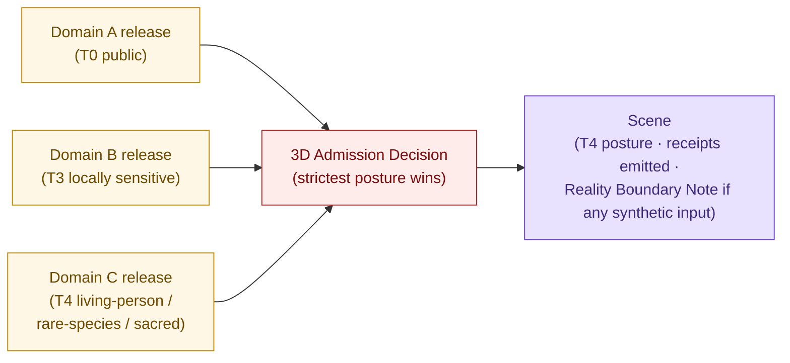
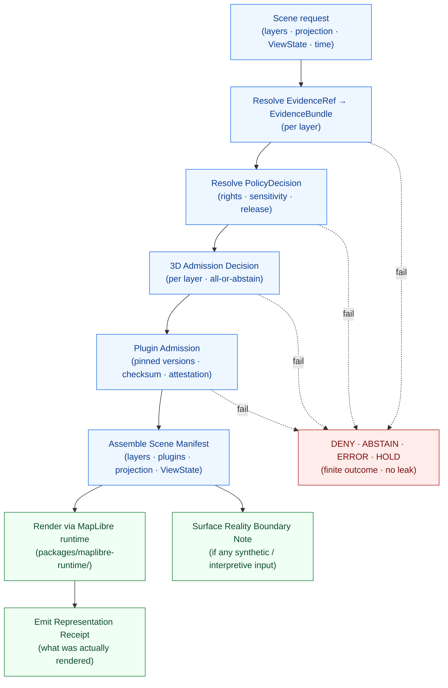
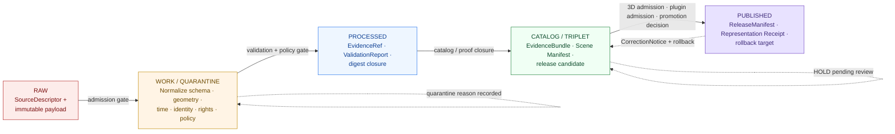

<!-- [KFM_META_BLOCK_V2]
doc_id: kfm://doc/architecture-planetary-3d
title: Planetary, 3D, Digital Twin, and Synthetic Spatial — Architecture
type: standard
version: v1
status: draft
owners: <Planetary/3D + Map Surface stewards — TBD>
created: 2026-05-25
updated: 2026-05-25
policy_label: public
related:
  - docs/architecture/README.md
  - docs/architecture/maplibre-3d.md
  - docs/architecture/map-shell.md
  - docs/architecture/governed-api.md
  - docs/architecture/people-place-joins.md
  - docs/domains/archaeology/README.md
  - docs/domains/settlements-infrastructure/README.md
  - docs/standards/PROV.md
  - docs/standards/SENSITIVITY_RUBRIC.md
  - docs/doctrine/trust-membrane.md
  - docs/doctrine/lifecycle-law.md
tags: [kfm, architecture, planetary-3d, digital-twin, synthetic-spatial, scene-manifest, reality-boundary-note]
notes:
  - Repo not mounted in authoring session; all path claims are PROPOSED.
  - This is the governance-lane doc for KFM Atlas §18. The renderer architecture is docs/architecture/maplibre-3d.md.
  - PROV.md / PROVENANCE.md naming variance tracked at directory-rules §18 OPEN-DR-01.
[/KFM_META_BLOCK_V2] -->

# Planetary, 3D, Digital Twin, and Synthetic Spatial — Architecture

> The governance lane for terrain models, 3D tile sets, glTF assets, point clouds, digital-twin views, synthetic surfaces, scene manifests, representation receipts, reality-boundary notes, and 3D admission decisions. **This lane carries other domains' evidence in higher-exposure form. It never owns domain truth.**


**Status** · draft &nbsp;·&nbsp; **Owners** · *Planetary/3D + Map Surface stewards — TBD* &nbsp;·&nbsp; **Updated** · 2026-05-25

---

## Quick jump

- [1. Scope and non-ownership](#1-scope-and-non-ownership)
- [2. The 3D-as-carrier doctrine](#2-the-3d-as-carrier-doctrine)
- [3. Ubiquitous language](#3-ubiquitous-language)
- [4. Object families](#4-object-families)
- [5. Cross-lane relations](#5-cross-lane-relations)
- [6. Scene assembly and admission](#6-scene-assembly-and-admission)
- [7. Lifecycle (RAW → PUBLISHED)](#7-lifecycle-raw--published)
- [8. Outcome envelope](#8-outcome-envelope)
- [9. Sensitivity, rights, and CARE generalization](#9-sensitivity-rights-and-care-generalization)
- [10. Reality Boundary Note discipline](#10-reality-boundary-note-discipline)
- [11. Renderer relationship](#11-renderer-relationship)
- [12. Anti-patterns](#12-anti-patterns)
- [13. Verification backlog](#13-verification-backlog)
- [14. Related docs](#14-related-docs)

---

## 1. Scope and non-ownership

### 1.1 What this lane owns

**CONFIRMED doctrine / PROPOSED implementation** (KFM Atlas §18.A–B): The Planetary, 3D, Digital Twin, and Synthetic Spatial lane governs *terrain models, 3D tile sets, glTF assets, point clouds, digital-twin views, synthetic surfaces, scene manifests, representation receipts, reality-boundary notes, 3D admission decisions, and public-safe scenes*. These are the object families the lane is responsible for defining, validating, admitting, and rolling back.

### 1.2 What this lane explicitly does **not** own

**CONFIRMED doctrine** (Atlas §18.B): *"This lane renders, relates, or represents released governed evidence; it does not own geology, hydrology, archaeology, settlements, infrastructure, hazards, habitat, fauna, flora, people, land, roads, agriculture, soil, or atmosphere truth."*

This is the doctrinal core of the lane. Every other claim in this document hangs on it.

> [!IMPORTANT]
> **The Planetary/3D lane is a carrier, not a source.** A 3D scene is a higher-exposure rendering of evidence whose authority lives in another lane. If the scene says something the evidence does not, the scene is wrong. The lane's job is to make sure the scene never says more than the evidence, the policy, the release state, and the review state allow.

### 1.3 Why a dedicated governance lane

3D scenes are the most tempting place for **synthetic content to displace observation** if reality-boundary discipline is not explicit. The doctrinal answer is to give Planetary/3D its own admission gate, its own receipt type (Representation Receipt), its own narrative artifact (Reality Boundary Note), and its own outcome envelope — separate from the 2D map shell and from any single domain. The lane sits next to the renderer (`docs/architecture/maplibre-3d.md`), not inside it.

---

## 2. The 3D-as-carrier doctrine

### 2.1 Three rules that never bend

| Rule | Doctrine |
|---|---|
| **3D never authors truth.** | 3D scenes may cite domain releases under admission rules; they are never an instruction, alert, or sovereign-evidence surface. *(Atlas §24.4.16.)* |
| **3D inherits the strictest posture of its inputs.** | Any contributing layer's sensitivity, rights, source-role, and release state propagates to the scene; the scene never loosens them. |
| **Style is not a substitute for transformation.** | Hiding sensitive geometry with a paint property fails the sensitivity test. Public-safe scenes carry public-safe geometry, transformed upstream. |

### 2.2 What follows from "carrier, not source"

- Every scene cites at least one EvidenceBundle and resolves every `EvidenceRef` before render.
- Every plugin and every renderer dependency is **pinned** and **admission-gated**.
- Every release of a scene emits a **Representation Receipt** describing what was actually rendered, with which plugin versions, against which spec_hashes.
- Synthetic, interpretive, reconstructed, or modeled content carries a **Reality Boundary Note** in the Evidence Drawer.
- Globe view, sky, atmosphere, and camera path are **ViewState** transformations, not lane-loosening primitives. A layer denied in 2D mercator stays denied in globe (`docs/architecture/maplibre-3d.md` §8.4).

---

## 3. Ubiquitous language

**CONFIRMED terms / PROPOSED field realizations** (Atlas §18.C). Each term is used inside this lane with meaning constrained by source role, evidence, time, and release state.

| Term | What it means in this lane |
|---|---|
| **Scene Manifest** | The signed, addressable enumeration of every source, layer, projection, ViewState, plugin pin, and Reality Boundary Note in a published 3D scene |
| **Terrain Model** | DEM-as-evidence identity; CRS, vertical datum, vintage, integrity all required |
| **3D Tile Set** | OGC 3D Tiles container (b3dm / i3dm / pnts); evidence-bearing |
| **glTF Asset** | Single-model artifact with provenance, rights, and time bindings |
| **Point Cloud** | LAS / LAZ / COPC / EPT identity; sensitivity-gated, CARE-aware |
| **Digital Twin View** | A composition referencing multiple 2D, 2.5D, and 3D layers under one time anchor |
| **Synthetic Surface** | Generated / modeled / interpolated raster; **always** carries a Reality Boundary Note |
| **ViewState** | Camera + projection + time slice; the lane's record of "how the scene was looked at" |
| **Representation Receipt** | Per-scene-assembly record: which layers, projection, plugin versions, spec_hashes were actually used |
| **Reality Boundary Note** | The Evidence-Drawer-surfaced statement of *what is real, what is reconstructed, what is interpretive* in a scene |
| **3D Admission Decision** | The governed allow / deny / abstain that gates a layer's participation in a 3D scene |
| **3D as carrier** | The doctrinal name for §2.1 — that this lane carries, never authors |

---

## 4. Object families

**CONFIRMED doctrine / PROPOSED field realization** (Atlas §18.E). Identity rule and temporal handling are uniform across the lane and inherited from the lane-wide pattern.

### 4.1 Object catalog

| Object | Purpose |
|---|---|
| Scene Manifest | Represents Scene Manifest evidence or released derivative within Planetary/3D |
| Terrain Model | Represents Terrain Model evidence or released derivative within Planetary/3D |
| 3D Tile Set | Represents 3D Tile Set evidence or released derivative within Planetary/3D |
| glTF Asset | Represents glTF Asset evidence or released derivative within Planetary/3D |
| Point Cloud | Represents Point Cloud evidence or released derivative within Planetary/3D |
| Digital Twin View | Represents Digital Twin View evidence or released derivative within Planetary/3D |
| Synthetic Surface | Represents Synthetic Surface evidence or released derivative within Planetary/3D |
| ViewState | Represents ViewState evidence or released derivative within Planetary/3D |
| Representation Receipt | Represents Representation Receipt evidence or released derivative within Planetary/3D |
| Reality Boundary Note | Represents Reality Boundary Note evidence or released derivative within Planetary/3D |
| 3D Admission Decision | The governed decision instance itself, content-addressed |

### 4.2 Identity rule (uniform)

**PROPOSED deterministic basis** across the lane:

```text
object_id = digest(
  source_id          : str   # source-ledger id
  object_role        : enum  # observed | regulatory | modeled |
                             # aggregate | administrative |
                             # candidate | synthetic
  temporal_scope     : str   # valid-time interval / "unknown"
  normalized_digest  : hex   # JCS-canonicalized canonical-form digest
)
```

### 4.3 Temporal handling (uniform)

**CONFIRMED doctrine.** Source, observed, valid, retrieval, release, and correction times remain distinct where material. Receipts created earlier are *referenced* (via `EvidenceRef`) by later phases, never duplicated.

### 4.4 Schema-home boundary (PROPOSED)

Schema homes for these objects are split between two responsibility roots (`docs/architecture/maplibre-3d.md` §6.2; KFM Encyclopedia §5.3 *Schema-home boundary note*; tracked as directory-rules §18.e **OPEN-DR-13**):

| Family | Proposed home | Rationale |
|---|---|---|
| Scene Manifest, Terrain Model, Synthetic Surface, ViewState, Representation Receipt | `schemas/contracts/v1/maplibre/` | Renderer-shaped artifacts |
| 3D Tile Set, glTF Asset, Point Cloud, Digital Twin View, Reality Boundary Note | `schemas/contracts/v1/3d/` | Asset-shaped artifacts |
| 3D Admission Decision, Plugin Admission | `schemas/contracts/v1/policy/` | Policy-decision subtypes |

**NEEDS VERIFICATION** in mounted repo before linking.

---

## 5. Cross-lane relations

### 5.1 Edges owned by this lane

**CONFIRMED doctrine** (Atlas §18.F and §24.4.16):

| This lane consumes from | Relation | Constraint |
|---|---|---|
| **Spatial Foundation** | CRS, vertical datum, terrain, geometry support | Relation must preserve ownership, source role, sensitivity, and EvidenceBundle support |
| **Archaeology / Cultural Heritage** | 3D documentation and cultural review | Same constraint; sites admitted only via steward-reviewed, generalized 3D representation with reality-boundary note (Atlas §24.4.13) |
| **Settlements / Infrastructure** | Critical-facility / dependency scene exposure controls | Same constraint; default-deny for critical-asset detail |
| **Hazards** | Scenario / exposure context **without emergency instruction** | Same constraint; **KFM is never an alert authority** |

### 5.2 The lane-wide "consumes from all domains" rule

**CONFIRMED doctrine** (Atlas §24.4.16, edges owned by Planetary/3D):

| Consumes from | Relation |
|---|---|
| **All domains** | 3D scenes may cite domain releases under admission rules; never an instruction or alert surface |
| **UI / Evidence Drawer** | Scene Manifests, ViewStates, and Reality Boundary Notes are rendered with the same Evidence Drawer discipline as 2D layers |

### 5.3 The sensitivity inheritance chain

Because this lane consumes from many domains, the **strictest** posture wins. A scene with one Archaeology layer at T4 (default rare/sacred), one Settlements layer at T0 (public), and one People/Land overlay denied for living-person fields resolves to **the Archaeology + People posture**, not the Settlements one.



---

## 6. Scene assembly and admission

### 6.1 The admission gate

**CONFIRMED doctrine** companion to the default-deny matrix in `docs/architecture/maplibre-3d.md` §8.1. The Planetary/3D lane's admission gate evaluates every layer **before** the renderer reaches `setTerrain`, `setProjection({type:'globe'})`, or any plugin-hosted 3D layer add.

| Condition | Default |
|---|---|
| Missing EvidenceBundle for the requested layer | **DENY** |
| Missing PolicyDecision (rights, sensitivity, source authority) | **DENY** |
| Missing or drifted plugin pin (I-3D-7) | **DENY** |
| Living-person data | **DENY for 3D** |
| Archaeology without ≥5 km coordinate generalization | **DENY for terrain-anchored render** |
| Rare-species precise location | **DENY for terrain-anchored render** |
| Critical-infrastructure precise location | **DENY** |
| Source role unknown (no SourceDescriptor) | **ABSTAIN** |
| Source role labeled `model` and no Reality Boundary Note attached | **ABSTAIN** |
| Stale-vs-released conflict | **ABSTAIN** + degraded badge |
| `geometry_label` mismatches requested mode (e.g., 2.5D requested as `true_3d_evidence`) | **DENY** |
| All gates clear | **ALLOW** |

### 6.2 Scene-assembly flow



### 6.3 All-or-abstain at scene level

**CONFIRMED doctrine** (Atlas KFM-P26-IDEA-0008 composed-claim rule, applied to scenes): a scene renders only when every required layer's `EvidenceRef` resolves and every layer's PolicyDecision allows. A single layer failing admission is sufficient to ABSTAIN the scene — or to render a *degraded* scene with the failing layer omitted and the omission visible in the Evidence Drawer. **PROPOSED rule:** the choice between scene-level ABSTAIN and degraded-render is itself a PolicyDecision, not a renderer fallback.

---

## 7. Lifecycle (RAW → PUBLISHED)

**CONFIRMED doctrine / PROPOSED lane application** (Atlas §18.H): Planetary/3D follows the standard KFM lifecycle, with promotion as a governed state transition.



| Stage | Handling | Gate | Status |
|---|---|---|---|
| **RAW** | Capture immutable payload (DEM, 3D tileset, glTF, LAS/LAZ, etc.) with source role, rights, sensitivity, citation, time, hash | SourceDescriptor exists | PROPOSED |
| **WORK / QUARANTINE** | Normalize CRS, vertical datum, geometry, identity; check rights and policy; hold failures | Validation + policy gate pass, or quarantine reason recorded | PROPOSED |
| **PROCESSED** | Emit validated normalized objects + receipts + public-safe candidates (e.g., CARE-generalized derivatives) | EvidenceRef + ValidationReport + digest closure | PROPOSED |
| **CATALOG / TRIPLET** | Emit catalog records, EvidenceBundles, Scene Manifest candidates | Catalog / proof closure passes | PROPOSED |
| **PUBLISHED** | Serve released public-safe artifacts through governed APIs and manifests; emit Representation Receipt at render | ReleaseManifest + correction path + rollback target + review / policy state | PROPOSED |

---

## 8. Outcome envelope

**CONFIRMED doctrine** (Atlas §24.3 outcome envelope, applied to Planetary/3D surfaces; Atlas §18.J):

| Surface | DTO / schema | Outcomes |
|---|---|---|
| Planetary/3D feature/detail resolver | `Planetary3DDecisionEnvelope` | ANSWER · ABSTAIN · DENY · ERROR |
| Planetary/3D layer manifest resolver | `LayerManifest` / domain layer descriptor | ANSWER · DENY · ERROR |
| Planetary/3D Evidence Drawer payload | `EvidenceDrawerPayload` + EvidenceBundle projection | ANSWER · ABSTAIN · DENY · ERROR |
| Planetary/3D Focus Mode answer | Runtime Response Envelope + `AIReceipt` | ANSWER · ABSTAIN · DENY · ERROR |

All routes are **PROPOSED**; exact route names are **UNKNOWN** in this docs-only session.

> [!NOTE]
> The lane never returns raw RAW/WORK payloads, never returns an unreleased candidate as ANSWER, never serves WORK or CATALOG layers to public clients. These are CONFIRMED constraints carried from the Master Decision Outcome Envelope (Atlas §24.3.2).

---

## 9. Sensitivity, rights, and CARE generalization

### 9.1 Default posture (CONFIRMED doctrine, Atlas §18.I)

*3D scenes are higher-exposure carriers; public 3D should use generalized, lower-resolution, clipped, or withheld content where sensitive. Synthetic surfaces require a Reality Boundary Note. Unclear rights, unresolved source role, missing evidence, unresolved sensitivity, or absent release state blocks public promotion.*

### 9.2 What an upstream transform looks like

**CONFIRMED workflow** (`docs/architecture/maplibre-3d.md` §8.2): style filters are **never** an acceptable substitute for transformation. A CARE-masked archaeology layer that reaches the renderer has already been transformed upstream:

1. Original coordinates remain canonical and **not public** (e.g., under `data/processed/archaeology/`).
2. A generalization pipeline produces a published, transformed derivative (e.g., `data/published/layers/archaeology/<dataset>-care-5km.geojson.pmtiles`).
3. The `LayerManifest` declares the transform (e.g., `sensitivity.transform = "care_generalization_5km"`) and references the authorizing `PolicyDecision`.
4. The renderer (MapLibre + plugins) only ever sees the generalized version.

All paths above are **PROPOSED** and **NEEDS VERIFICATION** in mounted repo.

### 9.3 Per-domain 3D posture summary

| Contributing domain | Default 3D posture | Reference |
|---|---|---|
| Spatial Foundation (terrain, CRS, datum) | T0; admit by default | `docs/architecture/maplibre-3d.md` §5.1 |
| Geology surface | T0; admit | `docs/architecture/maplibre-3d.md` §5.2 |
| Geology subsurface volumetric | **Out of scope for browser renderer**; UNKNOWN | `docs/architecture/maplibre-3d.md` §5.2 |
| Archaeology generalized site indicators | T1 after ≥5 km generalization + steward review | Atlas §24.4.13; `maplibre-3d.md` §5.3 |
| Archaeology 3D excavation reconstructions | HOLD; site-by-site PolicyDecision + Reality Boundary Note | `maplibre-3d.md` §5.3 |
| Settlements historic footprints with heights | T0; 2.5D `fill-extrusion` only; heights must be evidence-bearing | `maplibre-3d.md` §5.4 |
| Settlements photogrammetric building models | T0–T2; 3D via glTF; Reality Boundary Note if interpretive | `maplibre-3d.md` §5.4 |
| Critical-infrastructure precise locations | **DENY** | Atlas §20.5 |
| Hazards scenario / exposure context | T0; never alert authority | Atlas §24.4.16 |
| Atmosphere surface drape | T0 | `maplibre-3d.md` §5.6 |
| Fauna / flora rare-species precise locations | **DENY**; generalized before any layer | `maplibre-3d.md` §5.7 |
| People / DNA / land | **Default-deny for 3D**; living-person and DNA-linked locations excluded | `maplibre-3d.md` §5.9 |

---

## 10. Reality Boundary Note discipline

### 10.1 When a Reality Boundary Note is required

**CONFIRMED doctrine** (Atlas §18.I; KFM Atlas §18.E object family):

- Any **Synthetic Surface** in a scene.
- Any **Digital Twin View** that composes interpretive layers.
- Any 3D model marked `geometry_label: '3D'` whose source role is `modeled`, `synthetic`, or `interpretive` rather than `observed`.
- Any reconstruction (photogrammetric building, archaeological model, terrain interpolation across data gaps).

### 10.2 What the note must carry (PROPOSED fields)

| Field | Purpose |
|---|---|
| `method` | How the surface / model was produced (interpolation, reconstruction, simulation, generative) |
| `inputs` | The EvidenceRefs that fed the method |
| `bounds` | Where the reality boundary applies in space, time, and confidence |
| `not_real` | A plain-language statement of what is **not** observed reality |
| `viewable_at` | Render-time scope (layer, scene, projection, time slice) |
| `steward` | Owner / reviewer of the note |

### 10.3 Where it surfaces

- In the Scene Manifest, by reference (`evidence_refs.reality_boundary_note`).
- In the Evidence Drawer when the layer is active, with the same discipline as 2D evidence (Atlas §24.4.16).
- In the Representation Receipt that the runtime emits at render time.

> [!CAUTION]
> Reality Boundary Notes are not disclaimers. They are receipts. They are content-addressed, evidence-linked, reviewable, and rollback-able. A scene that renders without an applicable Reality Boundary Note fails admission — not because of a missing label, but because the lane cannot guarantee the reality boundary will reach the viewer.

---

## 11. Renderer relationship

**CONFIRMED doctrine companion / PROPOSED architectural decision** (see `docs/architecture/maplibre-3d.md` §0.1 and §0.3): KFM uses **MapLibre GL JS 5.x + its governed plugin ecosystem** as the sole browser-side renderer for this lane. The retirement of an alternate renderer is pending an ADR (referenced in the maplibre-3d.md appendix).

### 11.1 Division of responsibility

| Concern | Owner |
|---|---|
| Object families, identity, temporal handling, admission rules, cross-lane edges | **This doc** (`docs/architecture/planetary-3d.md`) |
| How MapLibre primitives realize each object family; plugin admission specifics; performance budgets; validation tests | `docs/architecture/maplibre-3d.md` |
| Per-domain 3D usage patterns | `docs/architecture/maplibre-3d.md` §5 + domain READMEs |
| Schema homes for the object families | Split per §4.4; tracked at directory-rules §18.e OPEN-DR-13 |
| Policy bundles enforcing the admission gate | `policy/maplibre/3d-admission.rego`, `policy/maplibre/plugin-admission.rego` *(PROPOSED paths)* |

### 11.2 Conflict-resolution rule

If this doc and `docs/architecture/maplibre-3d.md` disagree on a governance question (admission posture, sensitivity, lane ownership), **this doc governs** because it is the lane-architecture artifact. If they disagree on a renderer-mechanics question (how to wire a plugin, how `setTerrain` behaves), **`maplibre-3d.md` governs** because it is the renderer-architecture artifact. Material conflicts should be filed and resolved via ADR, not by silent edits to either doc.

---

## 12. Anti-patterns

<details>
<summary><strong>Click to expand: catalog of Planetary/3D anti-patterns</strong></summary>

| Anti-pattern | Why it fails | Counter-rule |
|---|---|---|
| **Synthetic surface presented as observed** | Reconstruction read as observation | Reality Boundary Note + scene-admission gate (Atlas §29.2) |
| **Style-only hiding of sensitive geometry** | Public client devtools reveal "hidden" data | Sensitive geometry transformed **upstream**; never paint-property hidden (`maplibre-3d.md` §8.2) |
| **Globe projection used to loosen 2D admission** | Same data, different view; admission must not change | Globe inherits 2D admission (`maplibre-3d.md` §8.4) |
| **Unpinned or drifted plugin version** | Supply-chain risk; receipts cannot be replayed | I-3D-7: plugin pin + checksum + attestation; drift = DENY |
| **2.5D `fill-extrusion` cited as 3D evidence** | Renderer feature mistaken for evidence shape | `geometry_label: '2.5D'` mismatched with `true_3d_evidence` request = DENY |
| **3D scene used as alert / instruction surface** | KFM is never an alert authority | Hazards context only; DENY any instruction framing (Atlas §24.4.16) |
| **Cross-renderer drift (MapLibre ⇄ alternate)** | Two renderers, two truth claims | Sole-renderer doctrine; one trust membrane (`maplibre-3d.md` §0.1) |
| **DEM with no CRS / no vertical datum / no integrity** | Geometry without provenance | Terrain Model requires CRS, vertical datum, vintage, checksum |
| **Living-person data in 3D / DNA-linked locations on terrain** | Severe privacy harm via inference | Default-deny for 3D (`maplibre-3d.md` §5.9) |
| **Archaeology site rendered at original coordinates** | Looting risk; cultural-sovereignty breach | ≥5 km generalization + steward review **before** publication; Reality Boundary Note if reconstruction |
| **Scene without Representation Receipt** | Cannot audit what was rendered | Receipt emission is part of admission, not a logging afterthought |
| **Reality Boundary Note absent for a synthetic input** | Reconstruction read as observed | Lane admission fails closed without the note |

</details>

---

## 13. Verification backlog

**CONFIRMED open verification items** (Atlas §18.N) + items raised by this doc:

| Item | Evidence that would settle it | Status |
|---|---|---|
| Verify actual scene implementation and schema home | Mounted repo files, schemas, registry entries | **NEEDS VERIFICATION** |
| Define 3D admission policy (canonical Rego) | `policy/maplibre/3d-admission.rego` + fixtures | **NEEDS VERIFICATION** |
| Verify point-cloud and synthetic/reality-boundary rules | Schema files + validator outputs | **NEEDS VERIFICATION** |
| Verify 3D archaeology / infrastructure / rare-species no-leak gates | Policy + fixtures + integration tests | **NEEDS VERIFICATION** |
| Schema-home split between `maplibre/` and `3d/` confirmed | ADR resolving directory-rules §18.e OPEN-DR-13 | **PROPOSED** |
| MapLibre as sole renderer ratified | ADR referenced in `docs/architecture/maplibre-3d.md` §0.1 | **PROPOSED** |
| Plugin-admission gate wired (`policy/maplibre/plugin-admission.rego`) | Policy + supply-chain attestation pipeline | **PROPOSED** |
| Scene-level all-or-abstain vs degraded-render choice formalized | PolicyDecision schema + reviewed fixtures | **PROPOSED** |
| Subsurface volumetric stratigraphy disposition | ADR or scope-out note (geology subsurface UNKNOWN regardless of renderer) | **UNKNOWN** |
| This file's canonical path `docs/architecture/planetary-3d.md` | Mounted `docs/architecture/` tree + `docs/architecture/README.md` index | **PROPOSED** |

> [!NOTE]
> Every file path in this document is **PROPOSED** per directory-rules. Verify against a mounted repo before linking from neighboring docs.

[Back to top](#planetary-3d-digital-twin-and-synthetic-spatial--architecture)

---

## 14. Related docs

- `docs/architecture/README.md` — architecture index *(TODO: link verify)*
- `docs/architecture/maplibre-3d.md` — renderer architecture; companion to this doc *(CONFIRMED authored prior session; NEEDS VERIFICATION in repo)*
- `docs/architecture/map-shell.md` — 2D map shell architecture *(PROPOSED)*
- `docs/architecture/governed-api.md` — trust-membrane surface *(PROPOSED)*
- `docs/architecture/people-place-joins.md` — sibling lane-architecture doc for People↔Place edges *(PROPOSED)*
- `docs/architecture/contract-schema-policy-split.md` — meaning vs shape vs admissibility *(PROPOSED)*
- `docs/domains/archaeology/README.md` — most policy-sensitive 3D consumer *(PROPOSED)*
- `docs/domains/settlements-infrastructure/README.md` — 2.5D / 3D building consumer *(PROPOSED)*
- `docs/standards/PROV.md` — W3C PROV-O + PAV profile *(CONFIRMED authored prior session; naming variance tracked at directory-rules §18 OPEN-DR-01)*
- `docs/standards/SENSITIVITY_RUBRIC.md` — sensitivity rubric 0–5 *(PROPOSED in corpus; not yet authored)*
- `docs/doctrine/trust-membrane.md` — public-path constraints *(PROPOSED)*
- `docs/doctrine/lifecycle-law.md` — RAW → PUBLISHED governance *(PROPOSED)*
- `directory-rules.md` — root-folder authority boundaries

---

<sub>Last updated · 2026-05-25 &nbsp;·&nbsp; Doc class · architecture &nbsp;·&nbsp; Status · draft &nbsp;·&nbsp; <a href="#planetary-3d-digital-twin-and-synthetic-spatial--architecture">Back to top ↑</a></sub>
