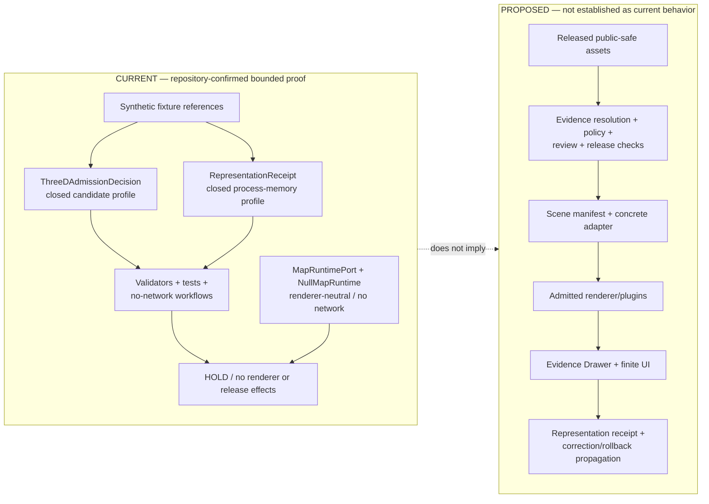
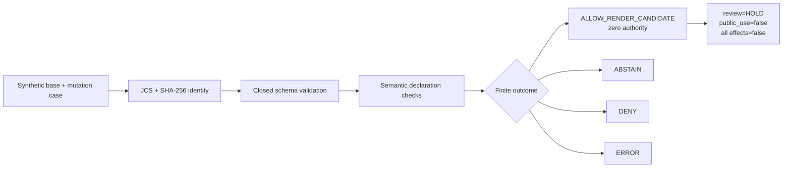
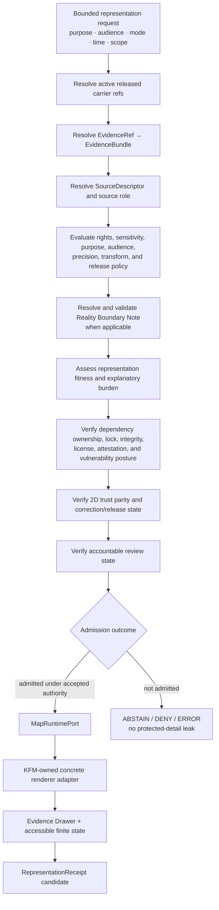
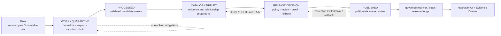

<a id="top"></a>
<a id="planetary-3d-digital-twin-and-synthetic-spatial--architecture"></a>

<!-- [KFM_META_BLOCK_V2]
doc_id: kfm://doc/architecture-planetary-3d
title: Planetary, 3D, Digital Twin, and Synthetic Spatial — Current Architecture and Implementation Boundary
type: architecture-reference
version: v2.1
status: draft; repository-grounded; bounded-executable; renderer-hold; non-publisher
owners:
  - "@bartytime4life — verified CODEOWNERS review route"
  - "NEEDS VERIFICATION — independent Planetary/3D, renderer, accessibility, evidence, policy, sensitivity, security, release, and domain stewardship"
created: 2026-05-25
updated: 2026-08-23
policy_label: public; architecture; planetary-3d; synthetic-spatial; trust-membrane; renderer-hold; no-release; no-publication
owning_root: docs/
responsibility: Explain the current Planetary/3D carrier boundary, repository-present fixture-first admission and representation-receipt profiles, renderer-neutral runtime seam, held concrete renderer and scene surfaces, cross-domain obligations, graduation evidence, and rollback without becoming semantic, schema, policy, runtime, review, release, or publication authority.
truth_posture: cite-or-abstain; current-state claims are pinned to repository evidence; inactive profiles, held dependencies and runtime surfaces, source currentness, deployment, release, and public-operation claims remain explicitly bounded
current_path: docs/architecture/planetary-3d.md
evidence_snapshot:
  repository: bartytime4life/Kansas-Frontier-Matrix
  base_ref: main
  base_commit: d760932e3be8f2cfedd7ece7e9a6f53aa0f18226
  target_prior_blob: 41e26697a05c9479fc78b43d5112279d9125a492
  directory_rules_decision: ADR-0029 accepted
  adr_0006_blob: 4bf4292dc05a85fd4cd829c491808b13894bc223
  adr_0007_blob: 2482eea382fd97e68544bb04bc2e2ea1e1cedebe
  explorer_adapter_blob: 663ba0f7a05498948f67d644387c73ab19d5c16c
  maplibre_manifest_blob: c7e8e57445fcca8f8a7316b54043da0ea43968a6
  maplibre_entry_blob: 08a48ac008665317833a9476b21cd35b1679c595
  map_runtime_port_blob: 11b734165bc0e0617b9d98c99f43441b0275cb50
  null_map_runtime_blob: d51164820393398fe8e193817f9585e6cc3fd43e
  three_d_contract_blob: e71692ce8897596e3477a8dafc0ef5c12fcd130a
  three_d_schema_blob: ad914fa53f32339972ec357ba2da855e1e315516
  three_d_fixture_blob: 3ee003cee537724cdfc28b2cf44a89ae411698ef
  three_d_validator_blob: 449941c61b26ad7f11de963179aef4c8043c00f7
  three_d_test_blob: e2738c3c7baf1b28227544e6aaa67282f2bd7274
  three_d_workflow_blob: e920df1895dbc1151798504c582a03e5b090b4ee
  reality_boundary_schema_blob: 08015f26d0b2fc899a68e46b746285c93fc331a2
  representation_contract_blob: 4e4a7e4d1d98c8592a76d0d3127eb90233906614
  representation_schema_blob: 6ed7c07ad22d31b983e2339a101b69d2a1b1adff
  representation_fixture_blob: 2d014a0130c4a8769f223cc09160aea0eb6690d1
  representation_validator_blob: be69f706ce2081d66054f582c597f97f2cdfe02c
  representation_test_blob: 736879a56146b1e01d4613d2b6cfbc00cbda2bc8
  representation_workflow_blob: 3ca169034e64e48e030e6a1d3f53c17bc9e8e811
  scene_schema_readme_blob: 3a86146bb6b8a5004b17b3aa076b4e8c040c1fb1
  published_scene_readme_blob: 09be41eb1cddff71e06fcc14bd6b1ee5edc70776
  rest_3d_companion_blob: 4bef779b0c8275a43be35c6f23f748ff4fd349f6
  rest_3d_source_map_prior_blob: f8da2f3efd58197c95219728a5359d2f0ffd267e
related:
  - docs/architecture/README.md
  - docs/architecture/map-shell.md
  - docs/architecture/maplibre.md
  - docs/architecture/rest-orchestrated-3d-derivatives.md
  - docs/architecture/map-master/2D_3D_PARITY.md
  - docs/intake/exploratory/rest-orchestrated-advanced-3d-rendering-source-map.md
  - docs/domains/planetary-3d/README.md
  - docs/doctrine/directory-rules.md
  - docs/adr/INDEX.md
  - docs/adr/ADR-0006-maplibre-boundary--only-maplibreadapter-imports-maplibre.md
  - "docs/adr/ADR-0007 — MapLibre GL JS Is the Sole Browser-Side Renderer.md"
  - docs/adr/ADR-0029-adopt-directory-governance-standard-v2.md
  - contracts/map/three_d_admission_decision.md
  - contracts/receipts/representation_receipt.md
  - schemas/contracts/v1/map/three_d_admission_decision.schema.json
  - schemas/contracts/v1/evidence/reality_boundary_note.schema.json
  - schemas/contracts/v1/receipts/representation_receipt.schema.json
  - schemas/contracts/v1/scene/README.md
  - fixtures/contracts/v1/map/three_d_admission_decision/cases.json
  - fixtures/contracts/v1/receipts/representation_receipt/
  - tools/validators/map/validate_three_d_admission_decision.py
  - tools/validators/validate_representation_receipt.py
  - tests/validators/map/test_validate_three_d_admission_decision.py
  - tests/validators/test_validate_representation_receipt.py
  - .github/workflows/three-d-admission-decision.yml
  - .github/workflows/representation-receipt.yml
  - apps/explorer-web/package.json
  - apps/explorer-web/src/adapters/MapLibreAdapter.ts
  - packages/maplibre/package.json
  - packages/maplibre/src/index.ts
  - packages/maplibre/src/map-runtime-port.ts
  - packages/maplibre/src/null-map-runtime.ts
  - data/published/layers/scene/README.md
tags: [kfm, architecture, planetary-3d, digital-twin, synthetic-spatial, scene, maplibre, map-runtime-port, evidence-parity, reality-boundary, representation-receipt, finite-outcomes, renderer-hold]
notes:
  - "v2.0 replaced proposal-era no-repository language with a repository-grounded architecture and implementation boundary."
  - "v2.1 reconciles the parent with merged PR #3433, accepted ADR-0006/0007, and the merged REST/3D source-lineage and architecture-companion documents without admitting a renderer dependency or runtime."
  - "The H1 anchor and legacy section anchors for core object families, finite outcome envelope, sensitivity and rights, Reality Boundary Note, renderer relationship, verification backlog, and related docs are preserved for inbound-link compatibility."
  - "The repository has an inactive, fixture-only ThreeDAdmissionDecision contract/schema/validator/test/workflow slice and a separate proposed RepresentationReceipt slice; neither has renderer, policy, review, release, deployment, publication, or public-use authority."
  - "The renderer-neutral seam is implemented: packages/maplibre exports MapRuntimePort and NullMapRuntime. The package still declares no maplibre-gl dependency, and the Explorer MapLibreAdapter remains comment-only."
  - "ADR-0006 and ADR-0007 are accepted architecture decisions. Exact renderer version, package admission, plugins, workers, concrete adapter implementation, browser proof, release, deployment, and publication remain separate HOLD or future gates."
  - "The former docs/architecture/maplibre-3d.md source lineage is not restored. REST/3D research lineage lives under docs/intake/exploratory, while the narrow promoted companion lives at docs/architecture/rest-orchestrated-3d-derivatives.md."
  - "This change updates two existing human-readable documentation surfaces only and creates no contract, schema, policy, dependency, runtime, source, release, deployment, or publication effect."
[/KFM_META_BLOCK_V2] -->

# Planetary, 3D, Digital Twin, and Synthetic Spatial — Architecture

> **Current architecture and implementation boundary.** Planetary/3D is a cross-domain representation and delivery concern. It can carry released, evidence-bound, policy-safe material in terrain, 2.5D, true-3D, globe, point-cloud, model, reconstruction, and synthetic forms. It does not own the underlying domain truth. Current repository evidence establishes a renderer-neutral port and deterministic null runtime, but not a concrete browser renderer, admitted renderer dependency, production 3D runtime, or released scene.


| Field | Current bounded result |
|---|---|
| **Evidence snapshot** | `main@d760932e3be8f2cfedd7ece7e9a6f53aa0f18226` |
| **Document role** | Human-readable cross-cutting architecture reference; no semantic, schema, policy, runtime, review, release, or publication authority |
| **Placement authority** | **CONFIRMED:** accepted [ADR-0029](../adr/ADR-0029-adopt-directory-governance-standard-v2.md) adopts [Directory Rules v2](../doctrine/directory-rules.md); this is a same-path update under `docs/architecture/` |
| **Carrier doctrine** | **CONFIRMED:** representations remain downstream carriers and do not become sovereign evidence or domain truth |
| **3D admission profile** | **CONFIRMED / BOUNDED:** inactive, fixture-only contract, closed schema, deterministic validator, 18 exact-polarity cases, focused tests, and no-network workflow |
| **Admission authority** | **NONE:** `ALLOW_RENDER_CANDIDATE` proves local candidate coherence only; review stays `HOLD`, public use stays false, and all effect flags stay false |
| **Representation receipt** | **CONFIRMED / BOUNDED:** proposed process-memory contract, closed schema, valid/invalid fixtures, deterministic validator, focused tests, and no-network workflow |
| **Reality Boundary Note** | **PARTIAL:** a machine schema exists and both bounded profiles reference it; a complete accepted semantic authority, live resolver, review path, and release binding are not established |
| **Scene schema family** | **README-ONLY / HOLD:** `schemas/contracts/v1/scene/` contains a guardrail README and no accepted scene schema files |
| **Published scene lane** | **README-ONLY / EMPTY:** `data/published/layers/scene/` contains a README and `.gitkeep`; no released scene artifact was found |
| **Renderer-neutral runtime seam** | **CONFIRMED / DEPENDENCY-FREE:** `MapRuntimePort` and deterministic `NullMapRuntime` are exported from `@kfm/maplibre`; they expose no concrete renderer and grant no evidence, policy, review, release, deployment, or publication authority |
| **Concrete browser renderer** | **HOLD:** Explorer and `@kfm/maplibre` declare no `maplibre-gl` dependency; `MapLibreAdapter.ts` remains comment-only; authenticated browser and long-session evidence remains separate under #2906 |
| **Renderer architecture decision** | **ACCEPTED ARCHITECTURE / IMPLEMENTATION HOLD:** ADR-0006 accepts the package-owned seam and ADR-0007 accepts MapLibre GL JS as the sole normal production browser renderer family; neither admits a version, package, plugin, worker, adapter, or browser runtime |
| **REST/3D derivative architecture** | **CONFIRMED explanatory companion / implementation proposed:** [`rest-orchestrated-3d-derivatives.md`](./rest-orchestrated-3d-derivatives.md) is subordinate to this page; its source lineage remains under [`docs/intake/exploratory/`](../intake/exploratory/rest-orchestrated-advanced-3d-rendering-source-map.md) |
| **Live 3D policy execution** | **NOT ESTABLISHED:** the candidate validator checks declarations and holds but does not invoke a policy engine or human review |
| **Source activation and terrain ingestion** | **NOT ESTABLISHED:** source pages are planning/catalog documentation, not proof of active connectors, processed terrain, or released bytes |
| **Deployment and public operation** | **UNKNOWN / not established** |
| **Review route** | `@bartytime4life` through CODEOWNERS; independent specialist review remains **NEEDS VERIFICATION** |

> [!IMPORTANT]
> **A green fixture result is not permission to render.** The current `ThreeDAdmissionDecision` profile is deliberately inactive. Its positive outcome is `ALLOW_RENDER_CANDIDATE`, not policy approval, review approval, release authorization, renderer boot, plugin installation, deployment, publication, or public-use permission.

> [!CAUTION]
> **A `RepresentationReceipt` is process memory, not a release.** It can prove declared input/output digests, method identity, fidelity, information loss, timing, lineage, and a reality-boundary reference. It explicitly keeps evidence, policy, review, release, and public-use authority outside the receipt.

> [!WARNING]
> **No working 3D product is established.** The repository contains meaningful fixture-first governance slices and a renderer-neutral runtime seam, but no admitted MapLibre dependency, implemented concrete adapter, live EvidenceBundle resolution, scene manifest implementation, released scene bytes, or production 3D interaction path.

## Quick jump

- [0. Current evidence snapshot](#0-current-evidence-snapshot)
- [1. Scope and non-ownership](#1-scope-and-non-ownership)
- [2. The 3D-as-carrier doctrine](#2-the-3d-as-carrier-doctrine)
- [3. Ubiquitous language](#3-ubiquitous-language)
- [4. Object families and current maturity](#4-object-families-and-current-maturity)
- [5. Cross-lane relations](#5-cross-lane-relations)
- [6. Scene assembly and admission](#6-scene-assembly-and-admission)
- [7. Lifecycle: RAW → PUBLISHED](#7-lifecycle-raw--published)
- [8. Finite outcomes](#8-finite-outcomes)
- [9. Sensitivity, rights, precision, and transformation](#9-sensitivity-rights-precision-and-transformation)
- [10. Reality Boundary Note and RepresentationReceipt](#10-reality-boundary-note-and-representationreceipt)
- [11. Renderer relationship and decision state](#11-renderer-relationship-and-decision-state)
- [12. Anti-patterns](#12-anti-patterns)
- [13. Validation, graduation, and rollback](#13-validation-graduation-and-rollback)
- [14. Related docs and known drift](#14-related-docs-and-known-drift)

---

## 0. Current evidence snapshot

### 0.1 Confirmed repository surfaces

The current tree establishes two executable-but-inactive trust slices, one renderer-neutral runtime seam, and several documentation-only boundaries.

| Surface | Confirmed repository state | Safe conclusion |
|---|---|---|
| [`ThreeDAdmissionDecision` contract](../../contracts/map/three_d_admission_decision.md) | `proposed-inactive`; fixture-only; names explanatory burden, geometry labels, evidence/drawer/correction/release/sensitivity parity, sensitive-geometry checks, plugin declarations, identity, and zero-effect holds | A bounded semantic candidate exists; it is not operational policy or runtime authority |
| [Paired 3D admission schema](../../schemas/contracts/v1/map/three_d_admission_decision.schema.json) | Closed Draft 2020-12 shape with `PROPOSED_INACTIVE`, `review_state`, `public_use_allowed`, and explicit effect flags | Machine shape exists for the candidate profile only |
| [3D admission fixtures](../../fixtures/contracts/v1/map/three_d_admission_decision/cases.json) | 18 deterministic cases: two `ALLOW_RENDER_CANDIDATE`, one `ABSTAIN`, fourteen `DENY`, and one `ERROR` | Exact local polarity is represented; the cases use synthetic references and assert no effects |
| [3D admission validator](../../tools/validators/map/validate_three_d_admission_decision.py) | No-network validation; deterministic JCS + SHA-256 identity; geometry, explanatory-burden, sensitivity, reality-boundary, parity, plugin, license, and hold checks | Declarative candidate consistency is executable |
| [3D admission tests](../../tests/validators/map/test_validate_three_d_admission_decision.py) | Schema check, exact fixture polarity, deterministic identity, no-network proof, fail-closed JSON/symlink behavior, no-leak diagnostics, zero-authority output | Focused local behavior is tested; no renderer or policy engine is tested |
| [3D admission workflow](../../.github/workflows/three-d-admission-decision.yml) | Read-only CI lane for contract/schema/fixtures/validator/tests/receipt; records non-effects | CI orchestration exists for this profile |
| [`RepresentationReceipt` contract](../../contracts/receipts/representation_receipt.md) | Proposed fixture-first process-memory contract for map tiles, raster overviews, generalized vectors, 3D scenes, synthetic surfaces, and exports | One shared carrier-receipt meaning is repository-present |
| [RepresentationReceipt schema](../../schemas/contracts/v1/receipts/representation_receipt.schema.json) | Closed Draft 2020-12 shape; requires EvidenceBundle refs, input/output digests, method/spec hashes, fidelity, timing, lineage, governance, and a nullable reality-boundary ref | Machine shape exists; schema validity is not evidence or release closure |
| [RepresentationReceipt fixtures](../../fixtures/contracts/v1/receipts/representation_receipt/) | Valid exact, generalized, and synthetic-scene cases plus fail-closed invalid cases | The profile covers one synthetic 3D carrier example without claiming public use |
| [RepresentationReceipt validator](../../tools/validators/validate_representation_receipt.py) | Requires a Reality Boundary Note ref for 3D/modelled/synthetic cases; rejects placeholder digests, noncanonical arrays, fidelity contradictions, timing errors, self-supersession, and authority overclaim | Local receipt consistency is executable |
| [RepresentationReceipt tests](../../tests/validators/test_validate_representation_receipt.py) | Schema, fixture polarity, CLI, duplicate-key, nonfinite-number, and missing-file checks | Focused validation exists |
| [RepresentationReceipt workflow](../../.github/workflows/representation-receipt.yml) | Read-only, no-network focused workflow | Workflow success remains bounded to shape and local consistency |
| [Reality Boundary Note schema](../../schemas/contracts/v1/evidence/reality_boundary_note.schema.json) | Closed shape for representation kind, reality posture, source roles, evidence refs, transforms, limitations, spatial/temporal scope, and correction refs | A schema exists, but an accepted semantic contract and live resolution path are not established |
| [Scene schema family README](../../schemas/contracts/v1/scene/README.md) | Explicit README-only guardrail; no accepted scene schemas found in that family | Do not infer `SceneManifest` implementation |
| [Published scene README](../../data/published/layers/scene/README.md) | Defines intended released-carrier boundary; exact directory contains only README and `.gitkeep` | No current scene release is established |
| [Explorer manifest](../../apps/explorer-web/package.json) | Vite/TypeScript/Vitest/Playwright tooling only; no renderer or 3D dependencies | Explorer cannot be described as a functioning 3D client |
| [MapLibre package manifest](../../packages/maplibre/package.json) and [entrypoint](../../packages/maplibre/src/index.ts) | Private `@kfm/maplibre` version `0.0.0`; explicit source export surface; no renderer dependency | Package home owns a renderer-neutral seam, not a renderer runtime |
| [`MapRuntimePort`](../../packages/maplibre/src/map-runtime-port.ts) | Serializable camera, selection, runtime-state, snapshot, validation, and disposal boundary with finite errors and no concrete renderer types | Reusable application seam exists; no renderer acquisition or browser proof follows |
| [`NullMapRuntime`](../../packages/maplibre/src/null-map-runtime.ts) | Deterministic, no-network implementation for migration and tests | Test/control runtime exists; it is not a browser renderer or release proof |
| [Explorer adapter](../../apps/explorer-web/src/adapters/MapLibreAdapter.ts) | One boundary comment; no concrete implementation | Renderer adapter remains unimplemented |
| [REST/3D architecture companion](./rest-orchestrated-3d-derivatives.md) | Source-reconciled explanatory companion merged by PR #3434 | Defines no route, schema, worker, source, dependency, release, or publication authority |
| [REST/3D source map](../intake/exploratory/rest-orchestrated-advanced-3d-rendering-source-map.md) | Noncanonical source-lineage and verified page-map record from PR #3435 and issue #3436 | Supports research traceability; it does not compete with this parent architecture |

### 0.2 Current versus target boundary


```mermaid
flowchart LR
  subgraph CURRENT["CURRENT — repository-confirmed bounded proof"]
    C1["Synthetic fixture references"]
    C2["ThreeDAdmissionDecision<br/>closed candidate profile"]
    C3["RepresentationReceipt<br/>closed process-memory profile"]
    C4["MapRuntimePort + NullMapRuntime<br/>renderer-neutral / no network"]
    C5["Validators + tests +<br/>no-network workflows"]
    C6["HOLD / no renderer or release effects"]
    C1 --> C2 --> C5 --> C6
    C1 --> C3 --> C5
    C4 --> C6
  end

  subgraph TARGET["PROPOSED — not established as current behavior"]
    T1["Released public-safe assets"]
    T2["Evidence resolution + policy +<br/>review + release checks"]
    T3["Scene manifest + concrete adapter"]
    T4["Admitted renderer/plugins"]
    T5["Evidence Drawer + finite UI"]
    T6["Representation receipt +<br/>correction/rollback propagation"]
    T1 --> T2 --> T3 --> T4 --> T5 --> T6
  end

  CURRENT -. "does not imply" .-> TARGET
```

### 0.3 Corrections to the prior edition

The prior edition contained useful doctrine but became stale after the MapRuntimePort merge and ADR transitions. This revision narrows those deltas without claiming a working renderer.

| Prior treatment | Current evidence | v2.1 disposition |
|---|---|---|
| `packages/maplibre/` described as a placeholder package | Package exports `MapRuntimePort` and deterministic `NullMapRuntime`; manifest remains dependency-free | Record the implemented renderer-neutral seam while retaining concrete-renderer HOLD |
| Shared package entry described as `placeholder = true` | Entry exports `map-runtime-port` and `null-map-runtime` | Replace the retired current-state claim; no renderer dependency is implied |
| ADR-0006 and ADR-0007 described as proposed | Both ADRs are accepted architecture decisions | Record acceptance while keeping dependency/version, concrete adapter, browser proof, release, deployment, and publication separate |
| No runtime seam treated as present | PR #3433 established one dependency-free application seam | Distinguish a renderer-neutral port from a renderer implementation |
| REST/3D research had no settled documentation relationship | PR #3435 merged source lineage; PR #3434 merged a subordinate companion | Link both and preserve this file as the parent carrier architecture |
| `docs/architecture/maplibre-3d.md` treated as present renderer authority in older lineage | Exact path remains absent | Do not restore or treat it as current authority; preserve supplied source lineage separately |
| 3D policy paths presented as implemented | Current bounded search finds a candidate contract/validator, not live policy execution | Separate inactive candidate validation from policy authority |
| Scene and 3D schema families treated as implemented | Scene family is README-only; exact earlier 3D paths are absent | Point to actual receipt, map-candidate, runtime-seam, and evidence schema surfaces |
| Reality Boundary Note described only as a proposed narrative object | A machine schema exists and bounded validators require its ref in applicable cases | Mark shape **CONFIRMED**, semantics/runtime/review **PARTIAL** |
| Representation Receipt described as a future render-time emission | A contract/schema/fixtures/validator/tests/workflow packet exists, but no runtime emits it | Describe the executable profile without runtime overclaim |
| Fixed sensitivity thresholds stated as global policy | The inactive candidate validator encodes some thresholds, including a 5,000 m archaeology check; no accepted universal 3D policy was verified | State the threshold as profile behavior, not system-wide accepted policy |
| `ALLOW` treated as operational permission | Positive candidate outcome explicitly carries zero authority and all holds | Use `ALLOW_RENDER_CANDIDATE` exactly and explain its non-effects |

[Back to top](#top)

---

## 1. Scope and non-ownership

### 1.1 What this architecture page explains

This page explains the cross-cutting responsibility boundary for:

- terrain, globe, 2.5D, true-3D, point-cloud, glTF, OGC 3D Tiles, reconstruction, digital-twin, and synthetic representations;
- evidence and 2D-parity obligations carried by 3D candidates;
- Reality Boundary Note and RepresentationReceipt relationships;
- sensitivity, rights, precision, transform, plugin, review, and release boundaries;
- current fixture-first implementation and renderer-neutral seam evidence;
- missing concrete runtime, policy, scene, release, and operational evidence;
- graduation and rollback requirements.

This page does not define field-level semantics or machine constraints. The repository-present semantic contracts and schemas own those details.

### 1.2 What Planetary/3D does not own

Planetary/3D does not own the geology, hydrology, archaeology, settlements, infrastructure, hazards, habitat, fauna, flora, people, land, roads, agriculture, soil, atmosphere, archival, or source truth it depicts.

It also does not own:

| Concern | Owning evidence |
|---|---|
| Source identity, role, terms, rights, cadence, and activation | Source descriptors, source registry, source policy, and current source evidence |
| Domain claims and observations | The applicable domain lane |
| Evidence closure | `EvidenceRef → EvidenceBundle` and evidence policy |
| Machine shape | Accepted schemas under `schemas/` |
| Admissibility | Policy plus rights, sensitivity, purpose, audience, review, and release state |
| Renderer acquisition and lifecycle | Accepted ADR-0006/0007 boundaries plus a separately admitted dependency and concrete implementation |
| Review approval | Review records and accountable reviewers |
| Release, correction, withdrawal, and rollback | `release/` and the applicable released-carrier records |
| Public operation | Deployed configuration, authentication, CSP/network controls, runtime tests, logs, and operational evidence |

> [!IMPORTANT]
> **A scene can be wrong even when every byte rendered successfully.** Rendering proves presentation mechanics. It does not prove source authority, evidence closure, geometry truthfulness, policy permission, review, release, or public suitability.

### 1.3 Why the concern remains cross-cutting

This file remains under `docs/architecture/` because it explains how multiple responsibility roots and domain lanes compose around a high-exposure representation boundary. Domain-specific 3D use and source selection belong in domain documentation; contracts, schemas, policy, code, fixtures, tests, receipts, and released bytes stay in their owning roots.

The [REST/3D derivative companion](./rest-orchestrated-3d-derivatives.md) explains one narrow cross-cutting concern beneath this parent. Its [source map](../intake/exploratory/rest-orchestrated-advanced-3d-rendering-source-map.md) records the external research lineage. Neither changes this page’s parent role.

[Back to top](#top)

---

## 2. The 3D-as-carrier doctrine

### 2.1 Carrier law

Planetary/3D representations are downstream carriers. They may arrange released public-safe assets, evidence references, time, camera, projection, layer selection, fidelity, and limitations. They do not create a claim merely by displaying it.

The current repository makes this boundary executable in three narrow ways:

1. `ThreeDAdmissionDecision` requires declared evidence, source, parity, sensitivity, plugin, review, public-use, and effect state before a candidate can pass local validation.
2. `RepresentationReceipt` records fidelity and process memory while forcing every governance authority flag to remain false.
3. `MapRuntimePort` and `NullMapRuntime` separate serializable application state from renderer acquisition and provide deterministic no-network control behavior.

None resolves live evidence, authorizes display, admits a renderer dependency, or releases a scene.

### 2.2 Non-negotiable invariants

| Invariant | Required posture | Current proof |
|---|---|---|
| **3D is not evidence** | Pixels, meshes, terrain, camera state, feature properties, model assets, and point clouds do not become evidence authority by rendering | Contract and receipt prose; no runtime proof |
| **2D trust parity remains explicit** | Evidence, drawer fields, correction refs, release refs, and sensitivity labels remain equal between baseline and candidate | Executable in the inactive candidate validator |
| **2.5D is not true-3D evidence** | Terrain and fill extrusion carry `TWO_POINT_FIVE_D`; they cannot support a `VERTICAL_EVIDENCE` claim | Executable in fixture validation |
| **Synthetic/modelled/reconstructed stays labeled** | Applicable candidates and receipts require a Reality Boundary Note ref | Executable reference requirement; note semantics/runtime remain partial |
| **Sensitive geometry is transformed before display** | Style-only hiding is never access control | Candidate profile checks declarations; production transformation proof absent |
| **Explanatory burden matters** | `SPECTACLE_ONLY` is denied in the candidate profile | Executable fixture rule; not an accepted global product policy |
| **Plugins are dependencies, not evidence** | Plugin references require exact declared versions, digests, attestations, admission refs, license state, and CVE-watch refs in plugin-hosted candidate modes | Executable declaration checks; actual dependency admission absent |
| **Renderer-neutral state is not renderer admission** | Port types remain serializable and renderer-free; null execution remains deterministic and no-network | `MapRuntimePort`, `NullMapRuntime`, package exports, and focused tests from PR #3433 |
| **Positive validation retains zero authority** | Review remains `HOLD`, public use false, and all effect flags false | Schema, validator, test, and fixture proof |
| **Correction and release parity are not optional** | A 3D candidate cannot silently diverge from baseline correction or release refs | Executable candidate checks |
| **No public internal-store path** | A future browser runtime consumes governed responses or released public-safe carriers only | Architecture doctrine; no deployed proof |

### 2.3 Representation fidelity

The repository-present receipt vocabulary distinguishes:

- `EXACT`
- `GENERALIZED`
- `AGGREGATED`
- `MODELED`
- `SYNTHETIC`

These terms describe the carrier’s relationship to its inputs. They do not rate the truth of the evidence itself. A carrier can be encoded exactly and still be unreleased, policy-denied, stale, or unsupported for a claim.

[Back to top](#top)

---

## 3. Ubiquitous language

Use the terms below consistently. Maturity is part of the definition.

| Term | Meaning | Current maturity |
|---|---|---|
| **3D representation candidate** | A fixture-shaped request to represent one released-asset-shaped layer in a bounded 3D or 2.5D mode | **CONFIRMED inactive profile** |
| **`ThreeDAdmissionDecision`** | Deterministic candidate assessment for explanatory burden, geometry labeling, parity, sensitivity, Reality Boundary Note, plugin declarations, and zero-effect holds | **CONFIRMED bounded executable / PROPOSED inactive** |
| **`ALLOW_RENDER_CANDIDATE`** | Candidate is locally coherent while every authority hold remains intact | **CONFIRMED finite validator outcome / not permission** |
| **Terrain 3D** | A terrain-shaped request labeled `TWO_POINT_FIVE_D` in the candidate profile | **CONFIRMED fixture vocabulary / runtime absent** |
| **Fill extrusion 2.5D** | Extruded geometry labeled `TWO_POINT_FIVE_D`; not true vertical evidence | **CONFIRMED schema vocabulary / runtime absent** |
| **True 3D** | OGC 3D Tiles, glTF, or point-cloud candidate labeled `TRUE_3D` | **CONFIRMED schema vocabulary / dependencies absent** |
| **Globe** | A distinct representation label and candidate mode; it does not change evidence or sensitivity authority | **CONFIRMED schema vocabulary / runtime absent** |
| **Scene Manifest** | Proposed scene composition identity referenced by the candidate profile | **Reference-only; no accepted scene schema established** |
| **`MapRuntimePort`** | KFM-owned renderer-neutral contract for serializable camera, selection, snapshot, runtime state, validation, and disposal | **CONFIRMED implemented seam / no renderer admission** |
| **`NullMapRuntime`** | Deterministic no-network implementation used for migration and tests | **CONFIRMED bounded implementation / not a renderer** |
| **View State** | Serializable camera, projection, time, selection, and layer context; some current map state is represented through `MapRuntimePort` | **PARTIAL / renderer-neutral only** |
| **Representation fitness** | Referenced assessment of whether the requested representation carries explanatory value and truthful geometry labeling | **Referenced candidate dependency; current authority requires separate verification** |
| **Reality Boundary Note** | Machine-shaped statement of representation kind, reality posture, source roles, evidence, transforms, limitations, spatial/temporal scope, and corrections | **Schema present; accepted semantics/live use partial** |
| **`RepresentationReceipt`** | Evidence-bound process-memory record for a downstream carrier’s inputs, outputs, method, fidelity, information loss, reality boundary, time, and lineage | **CONFIRMED bounded executable / proposed** |
| **Scene release** | Governed publication state for a public-safe scene carrier | **Not established** |
| **3D admission policy** | Actual policy decision permitting or denying a real request for a real audience and purpose | **Not established by fixture validation** |
| **Renderer adapter** | KFM-owned implementation seam translating admitted application operations into renderer-specific operations; only this seam may acquire MapLibre runtime types under ADR-0006 | **Architecture accepted; concrete implementation absent** |
| **3D as carrier** | The architecture rule that a representation remains subordinate to evidence, policy, review, release, correction, and rollback | **CONFIRMED doctrine** |

> [!NOTE]
> A term’s presence in a schema, fixture, or TypeScript interface does not prove that its referenced object exists, resolves, is authentic, has been reviewed, or is publicly usable. The inactive profiles and null runtime intentionally prove bounded local behavior without dereferencing external authorities or booting a renderer.

[Back to top](#top)

---

<a id="4-core-object-families"></a>

## 4. Object families and current maturity

### 4.1 Current object map

| Object family | What it is allowed to mean | Current repository evidence | Current limit |
|---|---|---|---|
| `ThreeDAdmissionDecision` | Inactive candidate assessment | Contract, closed schema, fixtures, deterministic validator, tests, workflow, generated authoring receipt | No live policy, review, renderer, plugin, release, or public-use authority |
| `RealityBoundaryNote` | Representation/reality disclosure shape | Closed schema; refs required by applicable 3D candidate and receipt rules | Semantic contract, note registry, authenticated review, UI projection, correction propagation, and release binding not established |
| `RepresentationReceipt` | Process memory for a representation transform | Contract, closed schema, fixtures, validator, tests, workflow | Does not resolve evidence, decide policy, approve review, release, or publish |
| `MapRuntimePort` | Renderer-neutral application and state boundary | TypeScript contract exported from `@kfm/maplibre`; consumer migration and focused tests from PR #3433 | No renderer dependency, DOM/WebGL behavior, source/layer/style semantics, or browser proof |
| `NullMapRuntime` | Deterministic no-network runtime control surface | Exported implementation with finite state and disposal behavior | Not a renderer, adapter, evidence resolver, policy engine, release service, or publication path |
| Scene Manifest | Scene composition reference | Referenced in candidate fixtures; README-only scene schema family | No accepted scene contract/schema/validator/runtime |
| Layer Manifest | Released-layer-shaped reference in candidate profile | Reference fields exist; broader layer authorities are separate | Candidate does not authenticate the ref |
| View State | Serializable renderer-neutral state | Camera/selection/snapshot structures exist through `MapRuntimePort` | No concrete 3D renderer translation established |
| Representation fitness assessment | Explanatory-burden reference | Required ref in candidate profile | Resolution and authority not proved here |
| EvidenceBundle | Evidence-support reference | Candidate/receipt arrays require refs | No live resolution or authenticity check in these validators |
| SourceDescriptor | Source identity/role reference | Candidate requires refs | No live source resolution in these validators |
| Plugin dependency record | Exact plugin declaration and support refs for selected candidate modes | Closed field shape and local set/license checks | No actual package install, lock closure, attestation verification, admission decision, or CVE service |
| Transformation receipt ref | Declared sensitive-geometry transform support | Candidate sensitivity object accepts refs | No upstream transform execution or authentication in profile |
| Released scene carrier | Public-safe scene bytes and sidecars | Published-lane README only | Exact lane has no scene release artifact |
| Correction / rollback record | Separate authority governing public change | Candidate parity refs and receipt lineage fields | No released scene exists to correct or roll back |

### 4.2 Reference, validation, seam, and authority closure are different

```text
reference present
  != referenced object exists
  != referenced object validates
  != renderer-neutral seam exists
  != concrete renderer is admitted
  != evidence resolves
  != policy allows
  != review approves
  != release authorizes
  != public use is safe
```

The current fixture profiles and runtime seam intentionally stop well before public authority.

### 4.3 Identity and replay

`ThreeDAdmissionDecision` uses deterministic identity over the complete candidate except `decision_id` and `spec_hash`:

```text
spec_hash   = sha256(JCS(identity_subject))
decision_id = "three-d-admission:" + first_24_hex(spec_hash)
```

The focused tests prove deterministic fixture binding. They do not prove source-byte identity, renderer replay, output-byte reproducibility, scene parity on a device, or released-cache behavior.

`RepresentationReceipt` separately carries method-spec and parameter hashes plus input/output digests. Its current validator checks local consistency, not end-to-end artifact retrieval.

`NullMapRuntime` provides deterministic application-state replay for its bounded in-memory profile. It does not prove browser, WebGL, GPU, driver, tile, source, style, worker, plugin, or pixel determinism.

[Back to top](#top)

---

## 5. Cross-lane relations

### 5.1 Ownership stays with contributing lanes

A Planetary/3D carrier may compose material from many domains. The contributing domain remains authoritative for its own observations, assertions, source roles, rights, sensitivity, and corrections.

| Contributing concern | Planetary/3D may carry | It must not infer or override |
|---|---|---|
| Spatial foundation | CRS, datum, elevation, terrain, extent, scale, uncertainty | Correctness of unverified coordinate/datum declarations |
| Geology | Surface and subsurface context when supported and fit for representation | Site investigation, resource certainty, or true volumetric geology from 2.5D |
| Hydrology | Terrain and water relationships under correct time/scale support | Flow, flood, water-supply, or life-safety claims from terrain alone |
| Archaeology / cultural heritage | Reviewed, transformed, public-safe reconstruction or context | Exact site location, cultural permission, or observed certainty |
| Settlements / infrastructure | Public-safe structures, footprints, networks, historical context | Operational detail, critical-asset exposure, or inferred current status |
| Hazards | Scenario or exposure context with visible limitations | Alerts, instructions, official current status, or predicted certainty |
| Habitat / fauna / flora | Generalized public-safe landscape or ecological context | Precise protected locations or modeled suitability as observation |
| People / land | Only material explicitly approved for the audience and purpose | Living-person, genomic, private-title, or identity inference |
| Atmosphere | Public-safe modeled or observed context with time/source roles visible | Forecast/observation collapse or life-safety instruction |
| Stories / Focus Mode | Released context and finite, cited interpretation | Authoring, evidence, policy, review, release, or model authority |

### 5.2 Composition is obligation-aware

The prior edition reduced sensitivity composition to “the strictest numeric tier wins.” The safer current rule is broader:

> **Every contributing obligation survives composition unless an accountable policy decision explicitly transforms or discharges it.**

The scene candidate must preserve, at minimum:

- evidence refs;
- source roles;
- spatial and temporal scope;
- sensitivity labels;
- rights and attribution obligations;
- transformation receipts;
- correction refs;
- release refs;
- limitations;
- Reality Boundary Note refs where applicable.

A numeric tier can help classification, but it cannot by itself reconcile incompatible rights, cultural sovereignty, consent, purpose, audience, or release obligations.

### 5.3 2D parity is a bounded candidate rule

The inactive profile currently checks exact equality for:

- 2D and 3D EvidenceBundle refs;
- Evidence Drawer field labels;
- correction refs;
- release refs;
- sensitivity labels.

This is meaningful local proof. It does not establish that a working 2D layer or 3D scene exists, that the refs resolve, or that both surfaces render identically.

[Back to top](#top)

---

## 6. Scene assembly and admission

### 6.1 Current fixture-only flow


```mermaid
flowchart LR
  F["Synthetic base + mutation case"] --> H["JCS + SHA-256 identity"]
  H --> S["Closed schema validation"]
  S --> M["Semantic declaration checks"]
  M --> O{"Finite outcome"}
  O --> A["ALLOW_RENDER_CANDIDATE<br/>zero authority"]
  O --> B["ABSTAIN"]
  O --> D["DENY"]
  O --> E["ERROR"]
  A --> Z["review=HOLD<br/>public_use=false<br/>all effects=false"]
```

The current validator checks:

- canonical reference arrays;
- expected 2.5D / true-3D / globe labels;
- denial of 2.5D as vertical evidence;
- denial of spectacle-only requests;
- declared sensitive-geometry conditions;
- Reality Boundary Note ref for modelled/synthetic/reconstructed candidates;
- 2D evidence/drawer/correction/release/sensitivity parity;
- expected plugin sets for selected fixture modes;
- exact versions, digests, support refs, and verified declared license status;
- deterministic `spec_hash` and `decision_id`;
- `review_state=HOLD`;
- `public_use_allowed=false`;
- every effect flag false.

### 6.2 What the current flow does not do

It does not:

- fetch or authenticate a source;
- resolve an EvidenceBundle;
- retrieve a Scene Manifest or Layer Manifest;
- evaluate an external policy bundle;
- verify a human review record;
- inspect a real artifact or transform receipt;
- install or import a renderer or plugin;
- verify an actual package lock, SBOM, attestation, license, or vulnerability state;
- boot a browser or render pixels;
- compare 2D and 3D output bytes or screenshots;
- create a release, correction, rollback, cache entry, or public route.

The renderer-neutral port and null runtime do not change that list. They establish application boundaries and deterministic no-network behavior only.

### 6.3 Proposed governed runtime flow


```mermaid
flowchart TD
  REQ["Bounded representation request<br/>purpose · audience · mode · time · scope"]
  REL["Resolve active released carrier refs"]
  EVD["Resolve EvidenceRef → EvidenceBundle"]
  SRC["Resolve SourceDescriptor and source role"]
  POL["Evaluate rights, sensitivity, purpose, audience,<br/>precision, transform, and release policy"]
  RBN["Resolve and validate Reality Boundary Note<br/>when applicable"]
  FIT["Assess representation fitness and explanatory burden"]
  DEP["Verify dependency ownership, lock, integrity,<br/>license, attestation, and vulnerability posture"]
  PAR["Verify 2D trust parity and correction/release state"]
  REV["Verify accountable review state"]
  ADM{"Admission outcome"}
  PORT["MapRuntimePort"]
  ADP["KFM-owned concrete renderer adapter"]
  UI["Evidence Drawer + accessible finite state"]
  REC["RepresentationReceipt candidate"]
  DEN["ABSTAIN / DENY / ERROR<br/>no protected-detail leak"]

  REQ --> REL --> EVD --> SRC --> POL --> RBN --> FIT --> DEP --> PAR --> REV --> ADM
  ADM -->|"admitted under accepted authority"| PORT --> ADP --> UI --> REC
  ADM -->|"not admitted"| DEN
```

`MapRuntimePort` exists. Every other integrated transition in this diagram remains **PROPOSED** or **HOLD** unless separately proved. The existence of the port does not bypass admission, policy, review, release, or dependency gates.

### 6.4 Scene-level degradation remains a decision

Whether one failed layer causes:

- whole-scene `ABSTAIN`;
- omission of the layer with an explicit degraded state; or
- a policy `DENY`

depends on purpose, consequence, audience, required completeness, and accepted policy. A renderer must not choose silently.

[Back to top](#top)

---

## 7. Lifecycle: RAW → PUBLISHED

Planetary/3D inherits the standard KFM lifecycle. The lifecycle applies separately to source bytes, normalized assets, representation candidates, receipts, catalog records, release decisions, and public-safe scene carriers.


```mermaid
flowchart LR
  RAW["RAW<br/>source bytes / immutable refs"]
  WQ["WORK / QUARANTINE<br/>normalize · inspect · transform · hold"]
  PRO["PROCESSED<br/>validated candidate assets"]
  CAT["CATALOG / TRIPLET<br/>evidence and relationship projections"]
  REL["RELEASE DECISION<br/>policy · review · proof · rollback"]
  PUB["PUBLISHED<br/>public-safe scene carriers"]
  API["governed resolver / static released edge"]
  UI["map/story UI + Evidence Drawer"]

  RAW --> WQ --> PRO --> CAT --> REL --> PUB --> API --> UI
  WQ -. "unresolved obligations" .-> WQ
  REL -. "DENY / HOLD / ABSTAIN" .-> CAT
  PUB -. "correction / withdrawal / rollback" .-> REL
```

| Phase | Planetary/3D handling | Current repository result |
|---|---|---|
| **RAW** | Preserve source bytes or immutable source refs with source role, rights, time, CRS/datum, and digest | Source documentation exists; active 3D ingest not established |
| **WORK / QUARANTINE** | Normalize geometry and metadata; assess rights/sensitivity; transform protected precision; record failures | No current end-to-end scene pipeline proved |
| **PROCESSED** | Produce validated candidate artifacts and process receipts | RepresentationReceipt fixtures are synthetic; no real 3D artifact pipeline proved |
| **CATALOG / TRIPLET** | Create discoverable evidence-bound asset/scene relationships | Scene catalog closure not established |
| **RELEASE** | Join evidence, policy, review, integrity, correction, and rollback into an authorized transition | No released scene decision found |
| **PUBLISHED** | Serve only released public-safe scene carriers | Exact scene lane is README-only and empty |
| **RUNTIME** | Consume governed responses or immutable released carriers through an admitted adapter; render finite states | Renderer-neutral port exists; concrete browser 3D runtime not established |

> [!IMPORTANT]
> A fixture whose refs look like `kfm:release:...` does not prove a release exists. Fixture references are synthetic test inputs unless resolved to current authority-bearing objects.

[Back to top](#top)

---

<a id="8-finite-outcome-envelope"></a>

## 8. Finite outcomes

### 8.1 Current candidate outcomes

| Outcome | Current exact meaning |
|---|---|
| `ALLOW_RENDER_CANDIDATE` | Inactive synthetic candidate passes local shape, identity, parity, sensitivity, plugin-declaration, and zero-effect checks |
| `ABSTAIN` | Current validator uses this for a missing required Reality Boundary Note |
| `DENY` | Candidate violates explanatory-burden, geometry-label, sensitivity, parity, plugin, license-declaration, or authority-hold rules |
| `ERROR` | Input, schema, hashing, identity, JSON, fixture, or execution failure |

`ALLOW_RENDER_CANDIDATE` must never be shortened to `ALLOW` in architecture prose because that would erase its fixture-only and zero-authority boundary.

### 8.2 Proposed public-facing outcomes

A future governed runtime should expose the existing KFM finite result vocabulary:

| Outcome | Public-facing posture |
|---|---|
| `ANSWER` | Evidence, policy, review, release, and citation support are sufficient for the bounded request |
| `ABSTAIN` | Support is missing, unresolved, stale, conflicted, unfit for the requested representation, or incomplete |
| `DENY` | Rights, sensitivity, purpose, audience, precision, source terms, or policy prohibit exposure |
| `ERROR` | A required service or validation operation failed; no unsafe fallback |

The inactive candidate outcome and null-runtime state are internal engineering results. Neither is itself a public runtime envelope.

### 8.3 No-leak negative states

A negative outcome may disclose:

- stable reason code;
- safe next step;
- public limitations;
- correlation or run reference where appropriate.

It must not disclose:

- protected geometry;
- source secrets;
- private evidence;
- living-person or genomic detail;
- critical-asset specifics;
- sensitive cultural or archaeological reason detail;
- arbitrary candidate fields reflected from untrusted input.

[Back to top](#top)

---

<a id="9-sensitivity-and-rights"></a>

## 9. Sensitivity, rights, precision, and transformation

### 9.1 Current fixture guardrails

The inactive candidate validator currently denies declared:

- living-person geometry;
- precise rare-species geometry;
- precise critical-infrastructure geometry;
- archaeology marked present with less than 5,000 metres of declared generalization;
- unverified plugin-license status;
- a modelled, synthetic, or reconstructed candidate without a Reality Boundary Note ref.

These are **CONFIRMED validator behaviors for the candidate profile**. They are not proof of:

- an accepted cross-domain sensitivity policy;
- the correctness of one threshold for every source, community, law, use, audience, or site;
- an executed geometry transform;
- a valid transformation receipt;
- steward or cultural-sovereignty approval;
- deployed no-leak enforcement.

### 9.2 Production rule

A production representation path must evaluate:

```text
source identity and role
+ rights and source terms
+ representation purpose
+ audience and access class
+ domain sensitivity
+ precision and inference risk
+ cultural / sovereignty obligations
+ transform method and receipt
+ review state
+ release and correction state
```

When any material obligation is unresolved, fail closed through quarantine, generalization, redaction, staged access, delay, abstention, or denial.

### 9.3 Style is not access control

A style filter, opacity, camera limit, clipping plane, hidden layer toggle, or disabled popup does not remove protected bytes from the client.

Public-safe representation requires upstream transformation or exclusion, with:

- deterministic output identity;
- input/output digests;
- method/spec/parameter identity;
- declared information loss;
- rights and sensitivity decision;
- transformation or representation receipt;
- public-safe validation;
- correction and rollback relationship.

### 9.4 3D increases inference risk

Terrain anchoring, vertical context, occlusion, perspective, point density, building form, and camera motion can reveal relationships that are less obvious in a flat layer. The review burden can therefore be higher even when the same fields are present.

A 3D path must consider compositional leakage, not merely field-level redaction.

[Back to top](#top)

---

<a id="10-reality-boundary-note"></a>

## 10. Reality Boundary Note and RepresentationReceipt

### 10.1 Reality Boundary Note: current shape

The current schema defines:

| Field family | What it records |
|---|---|
| Identity | `note_id`, `subject_ref` |
| Representation | `representation_kind`, `reality_posture` |
| Source support | `source_roles`, `evidence_refs` |
| Transformation | `transforms` |
| Honest limits | `limitations` |
| Scope | `spatial_scope`, `temporal_scope` |
| Correction | `correction_refs` |

This is valuable machine shape. Current evidence does not establish:

- an accepted paired semantic contract;
- a canonical note registry;
- authenticated evidence dereferencing;
- a review signature;
- an Evidence Drawer projection;
- release-manifest binding;
- correction propagation in a deployed client.

### 10.2 When the current profiles require a note reference

| Profile | Requirement |
|---|---|
| `ThreeDAdmissionDecision` | `MODELED`, `SYNTHETIC`, or `RECONSTRUCTED` candidate requires a non-null note ref |
| `RepresentationReceipt` | `THREE_D_SCENE`, `SYNTHETIC_SURFACE`, `MODELED`, or `SYNTHETIC` representation requires a note ref |

The validators check the reference’s presence, not the referenced note’s existence, authenticity, review state, or contents.

### 10.3 RepresentationReceipt: current proof boundary

The receipt records:

- subject ref;
- one or more EvidenceBundle refs;
- exact input and output artifact refs and SHA-256 digests;
- method id/version, `spec_hash`, and parameters hash;
- evidence and representation fidelity;
- information-loss flag and notes;
- optional/required reality-boundary ref depending on semantics;
- represented and input-as-of time;
- supersession lineage;
- fixed zero-authority governance declarations.

Its validator also rejects:

- placeholder zero digests;
- noncanonical refs/artifacts;
- contradictory fidelity and information-loss declarations;
- missing loss notes when required;
- future input-as-of time relative to representation;
- self-supersession;
- any governance flag asserting evidence, policy, review, release, or public-use authority.

### 10.4 Receipt and note do not replace each other

```text
RealityBoundaryNote
  explains what is observed, derived, modeled, synthetic, reconstructed,
  generalized, illustrative, limited, or unsupported.

RepresentationReceipt
  records how evidence-bound inputs became a carrier and what fidelity,
  information loss, method, timing, and lineage were declared.
```

A high-consequence synthetic scene may need both, plus evidence resolution, policy, review, proof, release, correction, and rollback objects.

### 10.5 No runtime-emission claim

The repository does not establish a browser renderer that emits RepresentationReceipts during real scene rendering. The current receipt examples are fixtures. `NullMapRuntime` emits no release-significant representation receipt. Any real runtime-emission claim remains **PROPOSED** until code, integration tests, emitted artifacts, and operational evidence prove it.

[Back to top](#top)

---

<a id="11-renderer-relationship"></a>

## 11. Renderer relationship and decision state

### 11.1 Current physical state

| Surface | Current evidence |
|---|---|
| Browser app | Tooling and repository-grounded synthetic composition; no renderer dependency |
| Map package | Private `@kfm/maplibre` version `0.0.0` with explicit renderer-neutral source exports and no `maplibre-gl` dependency |
| Shared package entry | Exports `map-runtime-port` and `null-map-runtime` |
| `MapRuntimePort` | Implemented renderer-neutral application contract with serializable state and finite errors |
| `NullMapRuntime` | Implemented deterministic no-network control runtime; not a renderer |
| Explorer adapter | Comment-only; no concrete implementation |
| `packages/maplibre-runtime/` | Absent at the pinned tree and not an authorized peer package under ADR-0006 |
| `packages/cesium/` | Absent at the pinned tree |
| `docs/architecture/maplibre-3d.md` | Absent at the pinned tree; prior manuscript remains source lineage only |
| Renderer-package boundary | ADR-0006 accepted architecture; reusable implementation and dependency owner is `packages/maplibre/` |
| Renderer-family decision | ADR-0007 accepted architecture; MapLibre GL JS is the sole normal production browser renderer family |
| Exact renderer version and dependency | Not admitted |
| Real browser 3D boot | Not established |
| Authenticated browser/long-session evidence | Not established; tracked separately under #2906 |
| Real-device 3D tests | Not established |
| Released 3D scene | Not established |

### 11.2 What accepted architecture proves—and does not prove

Accepted ADR-0006 and ADR-0007 prove the selected package/adapter ownership boundary and renderer family. They do not:

- add `maplibre-gl` or select a version;
- implement `MapLibreAdapter`;
- admit a plugin, protocol, worker, custom layer, or external asset;
- prove browser, device, accessibility, performance, security, or long-session readiness;
- resolve evidence, execute policy, approve review, release a scene, deploy a client, or publish an artifact.

The absence of a Cesium package remains bounded path evidence. The accepted peer-renderer rule comes from ADR-0007, not from path absence.

The presence of `MapRuntimePort` and `NullMapRuntime` proves one renderer-neutral seam and deterministic no-network behavior. It does not prove concrete renderer translation.

### 11.3 Current decision posture

- **ADR-0029:** accepted placement authority.
- **ADR-0005:** current status requires separate verification; it does not alter the accepted package/renderer decisions recorded here.
- **ADR-0006:** accepted adapter/import and dependency-ownership architecture; dependency and concrete implementation remain held.
- **ADR-0007:** accepted renderer-family architecture; exact version, dependency, plugin, worker, runtime, release, deployment, and publication remain held or separately governed.

This page records those accepted decisions and current bytes. It does not admit their downstream implementation gates.

### 11.4 Remaining renderer-admission closure

Before claiming a functioning Planetary/3D runtime, equivalent evidence should establish:

1. exact dependency version, integrity, provenance, license, and lock closure in the accepted owning manifest;
2. complete import/dynamic-load/worker/protocol/plugin inventory;
3. vulnerability, CSP, browser-support, accessibility, and rollback review;
4. one concrete `MapLibreAdapter` behind the existing `MapRuntimePort`;
5. released public-safe fixture assets;
6. authenticated browser and long-session probes under #2906 or its governed successor;
7. real selection-to-Evidence-Drawer parity;
8. Reality Boundary Note and RepresentationReceipt integration;
9. negative-state, accessibility, performance, correction, withdrawal, and rollback behavior;
10. human review without publication overclaim.

[Back to top](#top)

---

## 12. Anti-patterns

| Anti-pattern | Why it fails | Current or required counter-control |
|---|---|---|
| **3D render presented as source truth** | Carrier displaces evidence | Carrier doctrine; EvidenceBundle remains separate |
| **`ALLOW_RENDER_CANDIDATE` treated as permission** | Fixture coherence becomes policy/release authority | Exact outcome name, zero-effect schema, tests, workflow boundary |
| **Reference string treated as resolved authority** | Synthetic ref can masquerade as a real object | Explicit dereference/authenticity/review/release stages |
| **2.5D cited as vertical evidence** | Geometry label overstates support | Candidate validator denies the mismatch |
| **Spectacle-only request treated as explanatory need** | Polish outranks evidence burden | Candidate validator denies `SPECTACLE_ONLY` |
| **Synthetic/modelled scene without Reality Boundary Note** | Reconstruction can be read as observation | Candidate and receipt validators require the ref |
| **Receipt treated as evidence, policy, review, or release** | Process memory becomes authority | Governance flags fixed false; release ref null |
| **Style-only hiding of sensitive geometry** | Protected bytes still reach the client | Upstream transform/exclusion plus receipt and policy |
| **Numeric sensitivity tier treated as complete policy** | Rights, purpose, audience, sovereignty, and composition disappear | Obligation-aware policy and accountable review |
| **Fixture plugin declarations treated as installed dependencies** | Synthetic versions/digests/refs become supply-chain proof | Actual manifest, lock, SBOM, attestation, license, and vulnerability evidence required |
| **Accepted renderer ADR treated as dependency admission** | Architecture choice silently bypasses version, supply-chain, implementation, and browser-proof gates | ADR-0006/0007 non-effects plus separate dependency/runtime admission |
| **Port or null runtime described as a working renderer** | Boundary/test behavior becomes browser-runtime proof | Exact type and capability language; concrete adapter and #2906 proof remain required |
| **Scene README interpreted as released scene** | Intended directory boundary becomes publication proof | Exact inventory shows README + `.gitkeep` only |
| **Source product page interpreted as active ingest** | Documentation becomes connector/runtime proof | Require source descriptor, activated connector, receipts, pipeline, and released artifacts |
| **Negative state leaks protected reason detail** | Denial itself becomes an exposure channel | Fixed public-safe reasons and no candidate-value echo |
| **3D client reads internal stores directly** | Trust membrane bypass | Governed API or released public-safe immutable carrier only |
| **Renderer fallback silently drops failed layers** | User sees incomplete scene as complete | Policy-owned degraded-state decision and visible omission |
| **3D scene used as alert or instruction authority** | KFM displaces official operational channels | Context-only posture and explicit finite denial/abstention |

[Back to top](#top)

---

<a id="13-verification-backlog"></a>

## 13. Validation, graduation, and rollback

### 13.1 Confirmed focused validation surfaces

| Validation surface | Current scope | Does not prove |
|---|---|---|
| `ThreeDAdmissionDecision` schema | Closed candidate shape | Real referenced objects, policy, renderer, or release |
| Candidate validator | Identity, explanatory burden, geometry label, sensitivity declarations, note ref, parity, plugin declarations, holds | Live source, EvidenceBundle resolution, real licenses/attestations, browser compatibility |
| Candidate tests | 18 exact outcomes, deterministic identity, no network, fail-closed parsing, no-leak diagnostics | Product readiness |
| Candidate workflow | Read-only orchestration and generated-receipt integrity | Required-check enforcement or runtime |
| RepresentationReceipt schema | Closed receipt shape | Truth, policy, review, release, or public suitability |
| Receipt validator/tests | Digests, canonical arrays, fidelity, loss, note ref, time, lineage, authority boundary | Output-byte reproducibility or public release |
| Receipt workflow | Focused no-network validation | Runtime receipt emission |
| MapRuntimePort/NullMapRuntime tests | Renderer-neutral state, validation, deterministic null behavior, disposal, and consumer boundary | MapLibre import, WebGL/DOM behavior, browser support, 3D rendering, release, or public operation |
| Scene schema README | Placement guardrail | Accepted scene machine schema |
| Published scene README | Lifecycle/publication boundary | Existence of any release |

This documentation-only update does not execute those implementation tests locally. It reports repository-present proof at the pinned revision and relies on hosted PR checks only for checks actually triggered at the candidate head.

### 13.2 Graduation gates

#### P0 — Authority and physical closure

- **CONFIRMED closed for architecture direction:** ADR-0006 and ADR-0007 accept the package/adapter seam and renderer family.
- Preserve `packages/maplibre/` as the single reusable package home; do not create `packages/maplibre-runtime/` as a peer authority.
- Reconcile stale 3D documentation against accepted decisions and merged seam evidence.
- Define accepted scene, Reality Boundary Note, admission-policy, and released-carrier authority boundaries.
- Assign accountable owner/reviewer roles; do not invent identities.
- Preserve no public internal-store path and zero-effect fixture posture.

#### P1 — One dependency-closed no-network representation slice

- Use one synthetic, public-safe representation fixture.
- Resolve local contract/schema/profile identities.
- Validate one scene-shaped manifest, one note, one admission candidate, one representation receipt, and one finite UI projection.
- Prove 2D evidence/drawer/correction/release/sensitivity parity.
- Prove sensitive and authority-overclaim negatives.
- Use the current `MapRuntimePort` and `NullMapRuntime` without installing or booting a renderer merely to claim closure.
- Prove deterministic replay and no network/model calls.

#### P2 — Controlled renderer admission and browser proof

- Admit exact dependency ownership, versions, lock, worker/protocol strategy, CSP, browser matrix, license, SBOM, attestation, and vulnerability posture.
- Implement one KFM-owned `MapLibreAdapter` behind the existing renderer-neutral port.
- Render one released-public-safe synthetic fixture on supported browsers/device classes.
- Prove selection-to-drawer continuity, accessible negative states, time/selection continuity, performance limits, no-leak behavior, receipt emission, correction propagation, cache invalidation, and rollback replay.
- Satisfy authenticated browser and long-session evidence requirements without collapsing them into release or publication authority.
- Keep source activation, domain-scale release, deployment, and publication as separately governed transitions.

### 13.3 Validation commands owned by current profiles

```bash
python -m unittest tests.validators.map.test_validate_three_d_admission_decision --verbose
python tools/validators/map/validate_three_d_admission_decision.py --fixtures

python -m unittest discover \
  --start-directory tests/validators \
  --pattern 'test_validate_representation_receipt.py' \
  --verbose
python tools/validators/validate_representation_receipt.py --fixtures
```

These commands validate current fixture profiles. They do not boot a browser renderer or approve public use. The MapRuntimePort slice has its own TypeScript and policy/acquisition validation surfaces; exact candidate-head execution belongs to the associated PR checks.

### 13.4 Documentation rollback

Restore the prior target blob:

```text
41e26697a05c9479fc78b43d5112279d9125a492
```

The original v2.0 predecessor remains recorded historically as blob `f95061c8add6fad1910b7acc8c65c523869414ed`.

Because this change modifies existing documentation only, rollback requires no:

- data migration;
- source deactivation;
- dependency removal;
- scene withdrawal;
- cache invalidation;
- correction notice;
- deployment rollback;
- release rollback;
- public notice.

### 13.5 Runtime rollback remains open

A future renderer/scene implementation needs a separate rollback plan covering:

- dependency and adapter rollback;
- release-manifest rollback target;
- scene/carrier withdrawal;
- cache and static-edge invalidation;
- Evidence Drawer correction state;
- Story/Focus references;
- RepresentationReceipt supersession;
- source and transform lineage;
- operational monitoring and incident response.

[Back to top](#top)

---

<a id="14-related-docs"></a>

## 14. Related docs and known drift

### 14.1 Current authority and repository orientation

- [Architecture folder README](./README.md) — explains the cross-cutting documentation responsibility.
- [Directory Rules v2](../doctrine/directory-rules.md) — accepted placement authority through ADR-0029.
- [ADR index](../adr/INDEX.md) — current decision inventory and status crosswalk.
- [ADR-0006](../adr/ADR-0006-maplibre-boundary--only-maplibreadapter-imports-maplibre.md) — accepted package-owned port/adapter and dependency-acquisition boundary.
- [ADR-0007](<../adr/ADR-0007 — MapLibre GL JS Is the Sole Browser-Side Renderer.md>) — accepted renderer-family architecture with downstream dependency/runtime holds.
- [Map Shell](./map-shell.md) — browser composition and renderer/runtime boundary; recheck its own evidence snapshot before relying on current-state details.
- [REST-Orchestrated 3D Derivatives and LLM-Ingestible PDF Packaging](./rest-orchestrated-3d-derivatives.md) — narrow subordinate architecture companion; no route, schema, renderer, source, release, deployment, or publication effect.
- [REST/3D source map](../intake/exploratory/rest-orchestrated-advanced-3d-rendering-source-map.md) — noncanonical source lineage, PDF audit, and page-level verification record.
- [Planetary/3D domain README](../domains/planetary-3d/README.md) — domain-lineage companion; current-state and renderer claims require reconciliation against this page and current repo evidence.

### 14.2 Current bounded implementation

- [`ThreeDAdmissionDecision` contract](../../contracts/map/three_d_admission_decision.md)
- [3D admission schema](../../schemas/contracts/v1/map/three_d_admission_decision.schema.json)
- [3D admission fixture matrix](../../fixtures/contracts/v1/map/three_d_admission_decision/cases.json)
- [3D admission validator](../../tools/validators/map/validate_three_d_admission_decision.py)
- [3D admission tests](../../tests/validators/map/test_validate_three_d_admission_decision.py)
- [3D admission workflow](../../.github/workflows/three-d-admission-decision.yml)
- [`RepresentationReceipt` contract](../../contracts/receipts/representation_receipt.md)
- [RepresentationReceipt schema](../../schemas/contracts/v1/receipts/representation_receipt.schema.json)
- [RepresentationReceipt fixtures](../../fixtures/contracts/v1/receipts/representation_receipt/)
- [RepresentationReceipt validator](../../tools/validators/validate_representation_receipt.py)
- [RepresentationReceipt tests](../../tests/validators/test_validate_representation_receipt.py)
- [RepresentationReceipt workflow](../../.github/workflows/representation-receipt.yml)
- [Reality Boundary Note schema](../../schemas/contracts/v1/evidence/reality_boundary_note.schema.json)
- [MapRuntimePort](../../packages/maplibre/src/map-runtime-port.ts)
- [NullMapRuntime](../../packages/maplibre/src/null-map-runtime.ts)
- [MapLibre package entry](../../packages/maplibre/src/index.ts)
- [Scene schema-family guardrail](../../schemas/contracts/v1/scene/README.md)
- [Published scene lane guardrail](../../data/published/layers/scene/README.md)

### 14.3 Renderer and source boundaries

- [Explorer package manifest](../../apps/explorer-web/package.json) — no concrete renderer dependency.
- [Explorer MapLibre adapter boundary](../../apps/explorer-web/src/adapters/MapLibreAdapter.ts) — comment-only; no concrete implementation.
- [MapLibre package manifest](../../packages/maplibre/package.json) — accepted owning package, explicit source exports, no `maplibre-gl` dependency.
- [USGS 3DEP source-planning page](../sources/catalog/usgs/3dep-elevation.md) — source-role and datum guidance; not active-source or release proof.

### 14.4 Known adjacent-document drift

| Document | Drift | Required treatment |
|---|---|---|
| [`maplibre.md`](./maplibre.md) | May retain pre-ADR or pre-#3433 renderer/package assumptions | Separate same-path repository-grounded modernization; do not expand this PR into a general MapLibre rewrite |
| [`map-master/2D_3D_PARITY.md`](./map-master/2D_3D_PARITY.md) | Treats Cesium as the 3D peer and contains dual-renderer sync assumptions | Preserve as design lineage until reviewed disposition; accepted ADR-0007 controls current renderer-family architecture |
| [Planetary/3D domain README](../domains/planetary-3d/README.md) | Says repo not mounted and repeats settled renderer/path claims | Separate same-path reconciliation |
| Scene schema-family README | Candidate list predates current map-candidate, runtime-seam, and receipt profiles | Reconcile only with authority and overlap review; do not create parallel scene schemas |
| Source and doctrine pages | Some carry stale Directory Rules editions, package homes, exact renderer versions, or unaccepted policy paths | Treat current repo and accepted ADR status as controlling for current-state claims |

The absence of `docs/architecture/maplibre-3d.md` means the supplied MapLibre 3D manuscript remains source lineage rather than a current repository authority. Creating or restoring that path remains outside this update and requires overlap, decision, placement, and migration review.

---

## Change history

| Version | Date | Change |
|---|---|---|
| `v1` | 2026-05-25 | Proposal-era Planetary/3D architecture written without mounted repository evidence |
| `v2.0` | 2026-08-19 | Repository-grounded current-state reconciliation; records inactive 3D-admission and representation-receipt proof, Reality Boundary Note shape, scene and renderer HOLDs, then-current ADR state, exact non-effects, validation, graduation, drift, and rollback |
| `v2.1` | 2026-08-23 | Reconciles merged MapRuntimePort/NullMapRuntime evidence, accepted ADR-0006/0007 architecture, and REST/3D source-lineage/companion relationships while preserving all dependency, runtime, source, policy, review, release, deployment, and publication holds |

<sub>Last evidence review: **2026-08-23** · Base: `main@d760932e3be8f2cfedd7ece7e9a6f53aa0f18226` · Prior blob: `41e26697a05c9479fc78b43d5112279d9125a492` · Release/publication effect: **none**.</sub>

[Back to top](#top)
