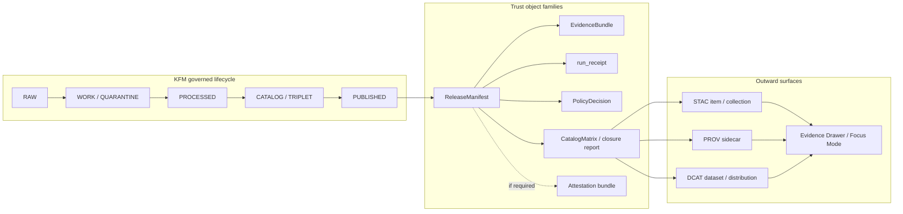

<!-- [KFM_META_BLOCK_V2]
doc_id: kfm://doc/TODO-NEEDS-UUID-PROV-STAC-DCAT
title: KFM Provenance + Catalog Mapping (PROV / STAC / DCAT)
type: standard
version: v1
status: draft
owners: OWNER_TBD_NEEDS_VERIFICATION
created: TODO_DATE_NEEDS_VERIFICATION
updated: 2026-05-02
policy_label: public
related: [
  docs/architecture/CONTROL_PLANE_INDEX.md,
  docs/registers/schema_registry.md,
  docs/registers/source_registry.md,
  docs/adr/TODO-PROV-STAC-DCAT.md,
  docs/adr/TODO-SCHEMA-HOME.md,
  docs/adr/TODO-STAC-DCAT-PROV-VERSION-PINS.md
]
tags: [kfm, provenance, prov, stac, dcat, receipts, proof-objects, catalog, promotion, governance]
notes: [Revised Markdown profile. Current repo implementation depth remains UNKNOWN from this editing pass. Paths, owners, doc_id, created date, schema home, public catalog host, KFM namespace URI, and version pins require verification before publication.]
[/KFM_META_BLOCK_V2] -->

<a id="top"></a>

# KFM Provenance + Catalog Mapping (PROV / STAC / DCAT)

Evidence-first profile for binding **EvidenceBundle**, **run_receipt**, promoted artifacts, provenance sidecars, and outward catalog records without weakening KFM’s trust membrane.


> [!IMPORTANT]
> **CONFIRMED doctrine:** KFM treats evidence, policy, review state, provenance, release state, correction lineage, and rollback as load-bearing.  
> **PROPOSED profile:** this document defines how promoted KFM artifacts should map into **PROV**, **STAC**, and **DCAT** surfaces.  
> **UNKNOWN implementation depth:** this editing pass did not verify a mounted target repository, schema registry, CI workflow, route, validator, emitted catalog object, branch protection, or runtime behavior.

---

## Quick jump

- [Purpose](#purpose)
- [Evidence boundary and authority](#evidence-boundary-and-authority)
- [Repo fit](#repo-fit)
- [Version posture](#version-posture)
- [One-minute model](#one-minute-model)
- [Profile operating law](#profile-operating-law)
- [Core mapping: KFM → PROV](#core-mapping-kfm--prov)
- [PROV sidecar contract](#prov-sidecar-contract)
- [STAC mapping](#stac-mapping)
- [DCAT mapping](#dcat-mapping)
- [Catalog closure rules](#catalog-closure-rules)
- [Attestation and integrity](#attestation-and-integrity)
- [Proposed file layout](#proposed-file-layout)
- [Validation and policy gates](#validation-and-policy-gates)
- [Rollback and correction behavior](#rollback-and-correction-behavior)
- [Definition of done](#definition-of-done)
- [Open ADRs and verification backlog](#open-adrs-and-verification-backlog)
- [Appendix A — Compact KFM field map](#appendix-a--compact-kfm-field-map)
- [Appendix B — Maintainer review checklist](#appendix-b--maintainer-review-checklist)

---

## Purpose

Define a portable, inspectable provenance and catalog profile that keeps KFM proof objects connected across release, catalog, UI, downstream harvest, and governed AI surfaces.

This document makes the following rule operational:

> A public KFM artifact is not “published” merely because a file exists. It is published only when the artifact, evidence, provenance, rights, sensitivity posture, catalog entries, receipts, review state, policy decision, release state, and rollback target resolve as a governed set.

### This profile should

- keep **EvidenceBundle** sovereign rather than merging it into catalog metadata;
- keep **run_receipt**, **ai_receipt**, **redaction_receipt**, **review receipt**, proof bundle, and release manifest as distinct object families;
- map KFM release objects into interoperable **PROV**, **STAC**, and **DCAT** surfaces;
- preserve `spec_hash`, `content_spec_hash`, `run_hash`, and artifact digests as deterministic identity anchors where the relevant hash family has been approved;
- support Evidence Drawer and Focus Mode without exposing canonical stores, RAW / WORK / QUARANTINE records, or raw model output;
- fail closed when provenance, rights, sensitivity, catalog closure, evidence resolution, or attestation cannot be verified.

### This profile does not

- define the canonical EvidenceBundle schema;
- define every lane-specific STAC or DCAT extension;
- activate live source connectors;
- authorize public release of sensitive geometry;
- replace promotion, policy, review, release manifests, or rollback procedures;
- prove that any target repo file, validator, workflow, route, dashboard, or emitted object already exists.

[↑ Back to top](#top)

---

## Evidence boundary and authority

This document is a **standard architecture/profile document**, not a root README and not a claim of current implementation.

| Source | Status | Supports | Limits |
|---|---|---|---|
| Attached Markdown baseline | **CONFIRMED baseline** | Existing profile structure, KFM → PROV/STAC/DCAT mappings, examples, closure rules, validation gates, and backlog. | Does not prove repo implementation, owner assignment, schema-home authority, or version pins. |
| KFM doctrine corpus | **CONFIRMED doctrine / LINEAGE implementation pressure** | Trust membrane, inspectable-claim posture, EvidenceBundle priority, proof-object separation, governed API, Evidence Drawer, Focus Mode, cite-or-abstain. | Prior PDFs and plans are not current mounted-repo proof. |
| Current editing workspace | **CONFIRMED limited evidence** | Visible workspace contained uploaded PDFs and this Markdown source; no mounted target Git checkout was verified in this pass. | Cannot confirm current target repo tree, tests, workflow YAML, runtime logs, branch protections, dashboards, source registry, or emitted proof packs. |
| Official external standards | **CONFIRMED external anchors / NEEDS PINNING** | PROV-O, STAC, DCAT, JCS, Sigstore, and DSSE concepts used by this profile. | Do not decide KFM internal field names, schema homes, policy decisions, or source activation. |
| Proposed target paths | **PROPOSED** | A small, reviewable implementation direction after repo inspection. | Must be adapted to actual repo convention through ADR or migration note. |

> [!NOTE]
> Memory is not evidence. Repeated object names across prior KFM reports increase continuity weight, but do not prove implementation. Current behavior must be verified from repository files, tests, manifests, logs, workflows, dashboards, emitted artifacts, or runtime evidence.

[↑ Back to top](#top)

---

## Repo fit

| Item | Status | Value |
|---|---:|---|
| Suggested path | **PROPOSED** | `docs/architecture/provenance_catalog_mapping.md` |
| Document role | **PROPOSED** | Standard architecture/profile document for outward provenance and catalog closure |
| Upstream objects | **PROPOSED** | `SourceDescriptor`, canonical spec, `EvidenceBundle`, `run_receipt`, `PolicyDecision`, `ReleaseManifest`, `CatalogMatrix`, optional `AIReceipt`, optional `redaction_receipt`, optional attestation bundle |
| Downstream consumers | **PROPOSED** | STAC catalog, DCAT catalog, PROV sidecars, release review, Evidence Drawer, Focus Mode, export/harvest tools |
| Machine-contract home | **NEEDS VERIFICATION** | `schemas/contracts/v1/...` vs `contracts/...` requires ADR before implementation |
| Public data path | **PROPOSED** | Governed API and published catalog artifacts only; no public RAW / WORK / QUARANTINE path |

### Accepted inputs

A provenance/catalog export may consume only release-eligible inputs:

| Input | Required? | Notes |
|---|---:|---|
| Release identifier | Yes | Must identify the governed release subject. |
| Promoted artifact digest | Yes | Artifact bytes must hash to the ReleaseManifest digest. |
| EvidenceBundle reference | Yes | Must resolve before catalog publication. |
| `run_receipt` | Yes | Captures process memory for the generating activity. |
| SourceDescriptor reference | Yes | Required for source role, rights, authority posture, and source terms. |
| Policy decision | Yes | Must permit the requested release class. |
| Review state | Yes | Must satisfy the lane’s release burden. |
| ReleaseManifest | Yes | Closure spine for artifact, digest, evidence, policy, review, catalog, and rollback. |
| CatalogMatrix / closure report | Recommended | Makes cross-surface consistency explicit and testable. |
| `ai_receipt` | Conditional | Required when model mediation contributed to the published claim, summary, or Focus Mode response. |
| `redaction_receipt` | Conditional | Required when geometry, attributes, timing, or identifiers were transformed for public safety. |
| Attestation bundle | Conditional | Required when release policy demands signing or integrity proof. |

### Exclusions

| Excluded from this profile | Where it belongs instead |
|---|---|
| RAW, WORK, or QUARANTINE records | Source lifecycle and ingest policy docs |
| Canonical EvidenceBundle schema | Schema registry / contract docs |
| Live connector code | Pipeline implementation docs |
| Emergency or life-safety instruction | Official source guidance, not KFM catalog prose |
| Unreviewed generated summaries | Governed AI receipts, evaluator outputs, and review queues |
| Exact sensitive locations | Restricted access surfaces or generalized public derivatives with redaction receipts |
| Public routes to canonical/internal stores | Governed API, released artifacts, and policy-safe catalog surfaces |

[↑ Back to top](#top)

---

## Version posture

External standards support the profile. They do not replace KFM-specific contracts, policy gates, review state, release decisions, or ADRs.

| Surface | External anchor | KFM posture | Verification before implementation |
|---|---|---|---|
| **PROV-O** | **CONFIRMED external standard basis** | Use for lineage sidecars: entities, activities, agents, and generated/used/attributed relationships. | Confirm serialization target: JSON-LD profile, PROV-JSON, or both. |
| **STAC** | **CONFIRMED external standard basis / candidate STAC Item profile 1.1.0** | Use for itemized geospatial asset discovery. | ADR must pin STAC version, extensions, checksum vocabulary, and geometry-withholding rules. |
| **DCAT v3** | **CONFIRMED external standard basis** | Use for dataset/distribution discovery, access rights, and federation-friendly catalog records. | ADR must pin DCAT profile, access-rights vocabulary, and digest/checksum field strategy. |
| **RFC 8785 / JCS** | **CONFIRMED external canonicalization anchor** | Candidate canonical JSON method for stable JSON hashes. | ADR must decide whether JCS governs `spec_hash`, `content_spec_hash`, `run_hash`, or only selected JSON payloads. |
| **Sigstore bundles** | **PROPOSED integrity mechanism** | Use as attestation/proof material when policy requires it. | Toolchain, trust root, bundle format, offline verification, and CI support require verification. |
| **DSSE / in-toto envelope** | **PROPOSED attestation envelope** | Use when authenticated statement payloads are required. | ADR must decide whether DSSE is standalone, Sigstore-wrapped, or not adopted. |
| **KFM `kfm:` namespace** | **PROPOSED local profile** | Use only for KFM-specific fields not provided by external standards. | Publish namespace URI and schema/profile before relying on it in CI. |

> [!WARNING]
> If existing repo tooling already pins a different STAC, DCAT, provenance serialization, checksum vocabulary, or signing baseline, do not silently migrate. Record the decision in an ADR, add compatibility fixtures, and run a closure validator before changing public output.

[↑ Back to top](#top)

---

## One-minute model



**Operating rule:** STAC and DCAT make released artifacts discoverable. PROV explains how a released artifact was generated. EvidenceBundle remains the stronger KFM evidence object, and ReleaseManifest remains the release-closure spine.

[↑ Back to top](#top)

---

## Profile operating law

| Rule | Consequence |
|---|---|
| Publication is a governed state transition. | A catalog record cannot make an artifact published by itself. |
| EvidenceBundle outranks generated language and catalog metadata. | STAC, DCAT, UI summaries, and Focus Mode responses must resolve evidence before consequential claims. |
| Receipts are process memory, not sovereign truth. | `run_receipt`, `ai_receipt`, and `redaction_receipt` must be inspectable without replacing evidence, policy, or review state. |
| Derived delivery surfaces are rebuildable. | Tiles, STAC, DCAT, PROV sidecars, graph projections, summaries, and indexes must not become canonical truth. |
| Rights and sensitivity fail closed. | Unknown rights, unknown source terms, restricted geometry, or missing redaction receipts deny public release. |
| Public clients use governed surfaces. | No normal public UI or client should read RAW, WORK, QUARANTINE, unpublished canonical stores, or raw model outputs. |
| Catalog closure is testable. | ReleaseManifest, EvidenceBundle, PROV, STAC, DCAT, digests, policy, and review state must agree before release. |

[↑ Back to top](#top)

---

## Core mapping: KFM → PROV

| KFM object | PROV class/property | Profile role | Requirement |
|---|---|---|---:|
| Published artifact | `prov:Entity` | Released data, layer, scene, report, tile bundle, or other artifact | Required |
| EvidenceBundle | `prov:Entity` | Evidence-bearing support object or evidence reference target | Required |
| Canonical spec | `prov:Entity` | Input definition used by the run | Required |
| SourceDescriptor | `prov:Entity` | Source identity, role, rights, cadence, and authority context | Required |
| Pipeline or promotion run | `prov:Activity` | Transformation, derivation, export, promotion, rollback, or correction activity | Required |
| `run_receipt` | `prov:Entity` | Process memory linked to the activity | Required |
| ReleaseManifest | `prov:Entity` | Release subject and closure spine | Required |
| PolicyDecision | `prov:Entity` | Policy result for the requested release class | Required |
| Signer / service / steward | `prov:Agent` | Responsible software, human, service, or steward actor | Required |
| `ai_receipt` | `prov:Entity` | Model-mediated interpretive trace | Conditional |
| `redaction_receipt` | `prov:Entity` | Geoprivacy or sensitivity transform record | Conditional |
| Attestation bundle | `prov:Entity` | Integrity proof or signature verification material | Conditional |
| CorrectionNotice / withdrawal receipt | `prov:Entity` | Supersession, withdrawal, or rollback lineage | Conditional |

### Required relations

| Relation | Meaning |
|---|---|
| `prov:wasGeneratedBy` | Artifact or EvidenceBundle was generated by a pipeline or release activity. |
| `prov:used` | Activity used a spec, source descriptor, input artifact, or EvidenceBundle. |
| `prov:wasAttributedTo` | Artifact is attributed to a signer, service, steward, or responsible system. |
| `prov:wasAssociatedWith` | Activity was associated with an agent. |
| `prov:wasDerivedFrom` | Derived artifact was produced from an earlier artifact or source. |
| `prov:wasRevisionOf` | Corrected or superseded artifact revises an earlier released artifact. |
| `prov:invalidatedAtTime` | Withdrawn artifact ceased to be valid for public use at a recorded time. |

> [!NOTE]
> KFM receipts are not automatically authoritative truth. EvidenceBundle, PolicyDecision, review state, release state, and correction lineage determine whether a public claim may be made.

[↑ Back to top](#top)

---

## PROV sidecar contract

### Placement rule

Each published artifact **SHOULD** include a colocated PROV sidecar. A release policy **MAY** escalate this to **MUST** for public or semi-public artifacts.

```text
artifact.ext
artifact.prov.jsonld
artifact.bundle.json         # conditional; attestation/proof bundle
artifact.release.json         # release manifest or release reference, if colocated
```

### Minimum fields

| Field | Required? | Purpose |
|---|---:|---|
| `@context` | Yes | Namespaces for PROV, DCTERMS, KFM, and optional checksum terms. |
| Artifact entity | Yes | Identifies the released artifact, EvidenceBundle, digest, license, release subject, and access posture. |
| Activity | Yes | Identifies the pipeline, promotion, rollback, correction, or export activity and its inputs. |
| Agent | Yes | Identifies the responsible signer, system, steward, or service. |
| `prov:wasGeneratedBy` | Yes | Binds output to activity. |
| `prov:used` | Yes | Binds activity to spec, source, input evidence, and release context. |
| `prov:wasAttributedTo` | Yes | Binds artifact to responsible agent. |
| Receipt links | Yes | Links `run_receipt` and conditional receipts without merging them into the artifact. |
| Policy/release links | Yes | Binds provenance to release state and policy decision. |
| Correction links | Conditional | Required when artifact is superseded, corrected, withdrawn, or rolled back. |

### Minimal JSON-LD shape

> [!TIP]
> This is a **profile example**, not final schema authority. Move the machine contract into the verified schema home after the schema-home ADR is resolved.

```json
{
  "@context": {
    "prov": "http://www.w3.org/ns/prov#",
    "dct": "http://purl.org/dc/terms/",
    "xsd": "http://www.w3.org/2001/XMLSchema#",
    "kfm": "https://kfm.local/ns#"
  },
  "@graph": [
    {
      "@id": "kfm://artifact/TODO-ARTIFACT-ID",
      "@type": ["prov:Entity", "kfm:PublishedArtifact"],
      "dct:identifier": "kfm://artifact/TODO-ARTIFACT-ID",
      "dct:license": "TODO-LICENSE-URI",
      "kfm:evidence_bundle": { "@id": "kfm://evidence/TODO-EVIDENCE-ID" },
      "kfm:release_manifest": { "@id": "kfm://release/TODO-RELEASE-ID" },
      "kfm:policy_decision": { "@id": "kfm://policy-decision/TODO-POLICY-ID" },
      "kfm:spec_hash": "sha256:TODO-SPEC-HASH",
      "kfm:artifact_digest": "sha256:TODO-ARTIFACT-DIGEST",
      "kfm:access_rights": "public",
      "prov:wasGeneratedBy": { "@id": "kfm://run/TODO-RUN-ID" },
      "prov:wasAttributedTo": { "@id": "kfm://agent/TODO-AGENT-ID" }
    },
    {
      "@id": "kfm://run/TODO-RUN-ID",
      "@type": ["prov:Activity", "kfm:PipelineRun"],
      "prov:used": [
        { "@id": "kfm://spec/TODO-SPEC-ID" },
        { "@id": "kfm://source/TODO-SOURCE-ID" },
        { "@id": "kfm://evidence/TODO-EVIDENCE-ID" }
      ],
      "prov:wasAssociatedWith": { "@id": "kfm://agent/TODO-AGENT-ID" },
      "prov:endedAtTime": {
        "@value": "TODO-ISO-8601-RUN-END-TIME",
        "@type": "xsd:dateTime"
      },
      "kfm:run_receipt": { "@id": "kfm://receipt/run/TODO-RUN-RECEIPT-ID" },
      "kfm:release_manifest": { "@id": "kfm://release/TODO-RELEASE-ID" }
    },
    {
      "@id": "kfm://receipt/run/TODO-RUN-RECEIPT-ID",
      "@type": ["prov:Entity", "kfm:RunReceipt"],
      "kfm:receipt_digest": "sha256:TODO-RECEIPT-DIGEST"
    },
    {
      "@id": "kfm://agent/TODO-AGENT-ID",
      "@type": "prov:SoftwareAgent",
      "dct:identifier": "TODO-SYSTEM-OR-SIGNER-ID"
    }
  ]
}
```

### Conditional receipt nodes

Add these only when they apply:

| Receipt | Include when | Public handling |
|---|---|---|
| `ai_receipt` | AI contributed to a released summary, claim draft, interpretation, or Focus Mode response | Public pointer may be allowed; private chain-of-thought is not a KFM truth object. |
| `redaction_receipt` | Geometry, timing, identifiers, or attributes were generalized, suppressed, delayed, or transformed | Public pointer should explain transform class without revealing restricted detail. |
| `review_receipt` | Steward, reviewer, or separation-of-duty review is required | Public pointer depends on policy and reviewer privacy. |
| `withdrawal_receipt` | Artifact was corrected, superseded, withdrawn, or rolled back | Public correction lineage should remain discoverable. |

[↑ Back to top](#top)

---

## STAC mapping

STAC carries itemized geospatial asset discovery. It should remain lightweight and link outward to KFM proof objects.

### Required KFM profile fields

| STAC location | Field | Requirement | Purpose |
|---|---|---:|---|
| `id` | release-scoped item id | Required | Stable discovery id for the promoted artifact. |
| `stac_version` | ADR-pinned STAC version | Required | Must match ADR-approved target. |
| `properties` | `kfm:spec_hash` | Required | Deterministic spec identity. |
| `properties` | `kfm:release_id` | Required | ReleaseManifest subject. |
| `properties` | `kfm:evidence_bundle_id` | Required | EvidenceBundle pointer. |
| `properties` | `kfm:policy_label` | Required | Release/sensitivity class visible to clients. |
| `properties` | `kfm:review_state` | Required | Review burden visible to clients. |
| `properties` | `kfm:rights_state` | Required | Rights posture visible to release tooling and clients. |
| `assets.data` | `href`, `type`, digest field | Required | Artifact access and integrity check. |
| `assets.provenance` | PROV sidecar asset | Required for public release unless policy says otherwise | Machine-readable lineage pointer. |
| `assets.release_manifest` | ReleaseManifest asset or pointer | Recommended | Release closure spine. |
| `assets.attestation` | Attestation bundle asset | Conditional | Integrity/signature proof. |
| `links` | `rel=provenance` | Required | Discoverable PROV sidecar. |
| `links` | `rel=attestation` | Conditional | Discoverable signature/proof bundle. |
| `links` | `rel=via` or ADR-approved release relation | Recommended | Discoverable ReleaseManifest. |

### STAC Item profile example

> [!NOTE]
> This example uses `geometry: null` and `bbox: null` only for non-spatial artifacts or public-withheld geometry. Spatial artifacts should provide policy-safe geometry and bounding boxes when release policy allows them.

```json
{
  "type": "Feature",
  "stac_version": "1.1.0",
  "stac_extensions": [
    "TODO-PIN-KFM-STAC-EXTENSION-SCHEMA",
    "TODO-PIN-CHECKSUM-EXTENSION-IF-USED"
  ],
  "id": "kfm-example-artifact-TODO",
  "geometry": null,
  "bbox": null,
  "properties": {
    "datetime": "TODO-ISO-8601-ARTIFACT-DATETIME",
    "kfm:spec_hash": "sha256:TODO-SPEC-HASH",
    "kfm:release_id": "kfm://release/TODO-RELEASE-ID",
    "kfm:evidence_bundle_id": "kfm://evidence/TODO-EVIDENCE-ID",
    "kfm:policy_label": "public",
    "kfm:review_state": "reviewed",
    "kfm:rights_state": "verified",
    "processing:software": "kfm-pipeline",
    "processing:version": "TODO-PIPELINE-VERSION",
    "processing:datetime": "TODO-ISO-8601-RUN-END-TIME"
  },
  "assets": {
    "data": {
      "href": "../../published/example/artifact.ext",
      "type": "application/octet-stream",
      "roles": ["data"],
      "title": "Published KFM artifact",
      "kfm:artifact_digest": "sha256:TODO-ARTIFACT-DIGEST"
    },
    "provenance": {
      "href": "../../published/example/artifact.prov.jsonld",
      "type": "application/ld+json",
      "roles": ["metadata", "provenance"],
      "title": "PROV sidecar"
    },
    "release_manifest": {
      "href": "../../published/example/artifact.release.json",
      "type": "application/json",
      "roles": ["metadata", "release"],
      "title": "KFM ReleaseManifest"
    },
    "attestation": {
      "href": "../../published/example/artifact.bundle.json",
      "type": "application/json",
      "roles": ["metadata", "attestation"],
      "title": "Attestation bundle"
    }
  },
  "links": [
    {
      "rel": "provenance",
      "href": "../../published/example/artifact.prov.jsonld",
      "type": "application/ld+json"
    },
    {
      "rel": "attestation",
      "href": "../../published/example/artifact.bundle.json",
      "type": "application/json"
    },
    {
      "rel": "via",
      "href": "../../published/example/artifact.release.json",
      "type": "application/json",
      "title": "KFM ReleaseManifest"
    }
  ]
}
```

> [!CAUTION]
> STAC asset links must not bypass KFM access policy. Restricted, steward-only, or sensitive derivatives need governed URLs, generalized public artifacts, staged access, or no public asset link.

[↑ Back to top](#top)

---

## DCAT mapping

DCAT carries dataset and distribution discovery. Use it to make release objects harvestable while preserving rights, access posture, and provenance references.

### Required DCAT profile fields

| DCAT location | Field | Requirement | Purpose |
|---|---|---:|---|
| Dataset | `dct:identifier` | Required | Release-scoped dataset id. |
| Dataset | `dct:title` | Required | Human-readable name. |
| Dataset | `dct:license` | Required | Legal reuse posture. Must not be unknown for public release. |
| Dataset | `dct:accessRights` | Required | Public/restricted/suppressed access posture. |
| Dataset | `dct:provenance` | Required | Pointer to PROV sidecar or provenance statement. |
| Dataset | `dcat:distribution` | Required | Published artifact distributions. |
| Dataset | `kfm:release_id` | Required by KFM profile | ReleaseManifest subject. |
| Dataset | `kfm:evidence_bundle_id` | Required by KFM profile | EvidenceBundle pointer. |
| Distribution | `dcat:accessURL` or `dcat:downloadURL` | Required | Access point, governed if needed. |
| Distribution | `dcat:mediaType` | Recommended | Artifact MIME/media type. |
| Distribution | digest/checksum field | Required by KFM profile | Must match ReleaseManifest digest. |
| Distribution | `kfm:provenance_url` | Required by KFM profile | Discoverable PROV sidecar. |
| Distribution | `kfm:attestation_url` | Conditional | Discoverable proof bundle when required. |

### DCAT JSON-LD profile example

```json
{
  "@context": {
    "dcat": "http://www.w3.org/ns/dcat#",
    "dct": "http://purl.org/dc/terms/",
    "prov": "http://www.w3.org/ns/prov#",
    "kfm": "https://kfm.local/ns#"
  },
  "@id": "kfm://dataset/TODO-DATASET-ID",
  "@type": "dcat:Dataset",
  "dct:identifier": "kfm://dataset/TODO-DATASET-ID",
  "dct:title": "TODO KFM Published Dataset Title",
  "dct:license": "TODO-LICENSE-URI",
  "dct:accessRights": "public",
  "dct:provenance": {
    "@id": "kfm://artifact/TODO-ARTIFACT-ID/provenance"
  },
  "kfm:release_id": "kfm://release/TODO-RELEASE-ID",
  "kfm:evidence_bundle_id": "kfm://evidence/TODO-EVIDENCE-ID",
  "kfm:spec_hash": "sha256:TODO-SPEC-HASH",
  "dcat:distribution": [
    {
      "@id": "kfm://distribution/TODO-DISTRIBUTION-ID",
      "@type": "dcat:Distribution",
      "dcat:accessURL": "https://catalog.example.invalid/kfm/published/example/artifact.ext",
      "dcat:mediaType": "application/octet-stream",
      "kfm:artifact_digest": "sha256:TODO-ARTIFACT-DIGEST",
      "kfm:provenance_url": "https://catalog.example.invalid/kfm/published/example/artifact.prov.jsonld",
      "kfm:release_manifest_url": "https://catalog.example.invalid/kfm/published/example/artifact.release.json",
      "kfm:attestation_url": "https://catalog.example.invalid/kfm/published/example/artifact.bundle.json"
    }
  ]
}
```

> [!NOTE]
> `https://catalog.example.invalid/...` is a placeholder. Replace it with the governed catalog or API host selected by deployment policy.

[↑ Back to top](#top)

---

## Catalog closure rules

Catalog closure means the release subject can be reconstructed across ReleaseManifest, EvidenceBundle, PROV, STAC, and DCAT without relying on guesswork.

| Closure check | PASS condition | DENY condition |
|---|---|---|
| Release subject | Same `release_id` or resolvable release subject appears in ReleaseManifest, STAC, DCAT, and PROV. | Catalog records point to different subjects. |
| Artifact digest | STAC asset digest, DCAT distribution digest, PROV artifact digest, and ReleaseManifest digest match. | Missing or mismatched digest. |
| Spec identity | `kfm:spec_hash` matches canonical spec hash used by the run. | Missing, unstable, or recomputed mismatch. |
| Evidence resolution | `EvidenceRef` resolves to the expected EvidenceBundle. | Missing, inaccessible, stale, or mismatched EvidenceBundle. |
| Rights | License and access rights are verified for the requested release class. | Unknown license, unknown access rights, or source terms prohibit release. |
| Sensitivity | Public artifact is safe for its policy class and has required redaction receipt if transformed. | Restricted geometry, sensitive attributes, or unrecorded transform reaches public surface. |
| Provenance | PROV sidecar includes generated/used/attributed relations and links receipts. | Sidecar missing or does not connect artifact to run and inputs. |
| Attestation | Required bundle is present and verifies against artifact digest. | Required attestation missing, unverifiable, or digest-mismatched. |
| Public access path | Public link resolves through governed API or approved published artifact surface. | Public link exposes RAW, WORK, QUARANTINE, unpublished, restricted, or canonical/internal stores. |

### Minimal closure matrix

```yaml
release_id: kfm://release/TODO-RELEASE-ID
artifact_digest: sha256:TODO-ARTIFACT-DIGEST
spec_hash: sha256:TODO-SPEC-HASH
checks:
  release_manifest:
    subject_matches: true
    artifact_digest_matches: true
    rollback_target_recorded: true
  evidence_bundle:
    resolves: true
    evidence_digest_matches: true
  prov_sidecar:
    was_generated_by_run: true
    used_spec_source_and_evidence: true
    attributed_to_agent: true
    links_required_receipts: true
  stac:
    item_id_matches_release_subject: true
    asset_digest_matches: true
    provenance_link_resolves: true
  dcat:
    dataset_identifier_matches_release_subject: true
    distribution_digest_matches: true
    access_rights_verified: true
  policy:
    rights_not_unknown: true
    sensitivity_allowed: true
    restricted_geometry_absent: true
  attestation:
    required: true
    present: true
    verifies: true
```

[↑ Back to top](#top)

---

## Attestation and integrity

KFM should keep integrity proofs separate from provenance and receipts.

| Object | What it proves | What it does not prove |
|---|---|---|
| PROV sidecar | Lineage: what generated what, using which inputs, associated with which agent. | Artifact bytes are untampered unless digests/signatures also verify. |
| `run_receipt` | Process memory: execution metadata, inputs, outputs, decisions, failures. | The published claim is true or policy-approved by itself. |
| EvidenceBundle | Evidence support for a claim or artifact. | That release policy was satisfied unless linked to review/policy state. |
| Attestation bundle | Integrity/origin/signature material for artifact or statement. | Rights, sensitivity, review sufficiency, or claim correctness by itself. |
| ReleaseManifest | Release subject and closure spine. | Source authority or evidence validity by itself. |
| CatalogMatrix / closure report | Cross-surface consistency status. | That evidence is sufficient or policy is permissive unless linked to those checks. |

### Supported mechanisms

| Mechanism | Status | Placement |
|---|---|---|
| Sigstore bundle | **PROPOSED / NEEDS TOOLCHAIN VERIFICATION** | `artifact.bundle.json` and STAC/DCAT links |
| DSSE envelope | **PROPOSED / NEEDS POLICY DECISION** | Attestation content or proof bundle |
| Digest-only manifest | **PROPOSED fallback** | ReleaseManifest, PROV sidecar, STAC/DCAT digest fields |

> [!IMPORTANT]
> If policy requires attestation and the bundle fails verification, the public release must stop even if STAC, DCAT, and PROV files are present.

[↑ Back to top](#top)

---

## Proposed file layout

All paths in this section are **PROPOSED** until the real repo layout is verified.

```text
docs/
  architecture/
    provenance_catalog_mapping.md
  adr/
    TODO-PROV-STAC-DCAT.md
    TODO-SCHEMA-HOME.md
    TODO-STAC-DCAT-PROV-VERSION-PINS.md

data/
  published/
    <lane>/
      <release-id>/
        artifact.ext
        artifact.prov.jsonld
        artifact.bundle.json          # conditional
        artifact.release.json         # release manifest or release pointer

  catalog/
    stac/
      <lane>/
        collection.json
        items/
          <release-id>.json
    dcat/
      <lane>/
        dataset.<release-id>.jsonld
    prov/
      <lane>/
        artifact.<release-id>.prov.jsonld

schemas/
  contracts/
    v1/
      catalog/
        kfm_prov_sidecar.schema.json
        kfm_stac_profile.schema.json
        kfm_dcat_profile.schema.json
        kfm_catalog_closure.schema.json

policy/
  catalog/
    catalog_closure.rego
    provenance_release.rego
    sensitivity_publication.rego

tests/
  fixtures/
    catalog/
      valid/
      invalid/
      deny/
```

### Layout rules

- Published artifacts remain downstream of promotion; publication is not a file move.
- Catalog records may be rebuilt from ReleaseManifest, EvidenceBundle, receipts, and proof objects.
- Sidecars may be colocated with artifacts and mirrored into catalog/provenance folders for harvesting.
- Public clients should resolve through governed APIs or published catalog surfaces, never internal canonical stores.
- Checksums and release identifiers must remain stable across mirrored copies.
- If actual repo convention places machine contracts under `contracts/`, do not create a parallel authority under `schemas/` without an ADR.

[↑ Back to top](#top)

---

## Validation and policy gates

### Required checks before publication

| Gate | Outcome grammar | Required behavior |
|---|---|---|
| Evidence resolution | `PASS` / `DENY` | `EvidenceRef` resolves to the expected EvidenceBundle. |
| Stable identity | `PASS` / `DENY` | `spec_hash` recomputes under the approved canonicalization rule. |
| Artifact integrity | `PASS` / `DENY` | Artifact digest matches ReleaseManifest and catalog references. |
| Provenance sidecar | `PASS` / `DENY` | PROV sidecar exists and links artifact, run, inputs, and agent. |
| Rights | `PASS` / `DENY` | License and source terms allow the requested release. Unknown rights deny public release. |
| Sensitivity | `PASS` / `DENY` | Release class is compatible with geometry and attributes. |
| Redaction | `PASS` / `DENY` / `NOT_APPLICABLE` | Required transform receipt exists when public geometry or attributes are generalized/suppressed. |
| Attestation | `PASS` / `DENY` / `NOT_REQUIRED` | Required bundle is present and verifies. |
| Cross-catalog closure | `PASS` / `DENY` | STAC, DCAT, PROV, and ReleaseManifest identify the same release subject and digest. |
| Public surface check | `PASS` / `DENY` | No public URL exposes RAW, WORK, QUARANTINE, restricted, unreviewed, or canonical/internal stores. |
| Correction lineage | `PASS` / `DENY` / `NOT_APPLICABLE` | Superseded or withdrawn artifacts preserve visible correction lineage and rollback target. |

### DENY conditions

Publication must fail closed when any of these are true:

- PROV sidecar is missing when required;
- `run_receipt` is missing;
- EvidenceBundle cannot be resolved;
- `spec_hash` is missing or unstable;
- license, source terms, or access rights are unknown;
- policy class does not permit the requested release;
- restricted coordinates or attributes appear in a public DTO/catalog record;
- required redaction receipt is missing;
- catalog records disagree on release id or artifact digest;
- required attestation is absent or fails verification;
- public links bypass governed access controls;
- rollback target is missing for a release that requires one;
- correction or withdrawal lineage is suppressed.

### Illustrative policy input

```json
{
  "release_id": "kfm://release/TODO-RELEASE-ID",
  "release_class": "public",
  "artifact_digest": "sha256:TODO-ARTIFACT-DIGEST",
  "spec_hash": "sha256:TODO-SPEC-HASH",
  "rights_state": "verified",
  "sensitivity_state": "public_safe",
  "evidence_bundle_resolves": true,
  "run_receipt_present": true,
  "prov_sidecar_present": true,
  "catalog_closure_passed": true,
  "rollback_target_recorded": true,
  "attestation": {
    "required": true,
    "present": true,
    "verified": true
  },
  "public_surface": {
    "contains_restricted_geometry": false,
    "uses_governed_access_url": true
  }
}
```

[↑ Back to top](#top)

---

## Rollback and correction behavior

Catalog outputs must preserve release history rather than hiding it.

| Scenario | Required behavior |
|---|---|
| Artifact is superseded | New ReleaseManifest links to prior release. Prior catalog record remains discoverable or tombstoned according to policy. |
| Artifact is withdrawn | Public catalog marks withdrawal state and points to withdrawal receipt or correction notice without exposing restricted details. |
| Artifact digest mismatch is found | Release is blocked or withdrawn. STAC/DCAT/PROV records must not continue to advertise the mismatched artifact as valid. |
| Sensitivity leak is found | Public artifact is pulled or generalized. Redaction/correction receipt records transform class and reason. |
| EvidenceBundle is invalidated | Dependent public claims must abstain, be corrected, or be withdrawn according to release policy. |
| Attestation failure occurs | Release is blocked or rolled back even if catalog records are otherwise present. |

### Rollback target

```yaml
rollback:
  release_id: kfm://release/TODO-RELEASE-ID
  rollback_target: kfm://release/TODO-PRIOR-RELEASE-ID
  correction_notice: kfm://correction/TODO-CORRECTION-ID
  withdrawal_receipt: kfm://receipt/withdrawal/TODO-WITHDRAWAL-ID
  public_catalog_action: TODO_KEEP_TOMBSTONE_OR_SUPERSESSION_LINK
```

[↑ Back to top](#top)

---

## Definition of done

A provenance/catalog mapping slice is ready for review when:

- [ ] `doc_id`, owners, created date, policy label, and related links are verified or explicitly accepted as placeholders.
- [ ] Schema-home ADR is resolved.
- [ ] STAC, DCAT, PROV, checksum, and serialization versions/profiles are pinned.
- [ ] `kfm:` extension fields have a published schema or profile note.
- [ ] Valid, invalid, and deny fixtures exist for PROV, STAC, DCAT, and catalog closure.
- [ ] Policy gates deny unknown rights and public restricted geometry.
- [ ] Example public artifact has a matching ReleaseManifest, EvidenceBundle pointer, run receipt, PROV sidecar, STAC item, DCAT dataset, and optional attestation bundle.
- [ ] Catalog closure validator checks release id, digest, EvidenceBundle, PROV, STAC, DCAT, rights, sensitivity, review state, and rollback target.
- [ ] Evidence Drawer can display provenance, rights, review state, release state, and correction lineage from governed surfaces.
- [ ] Focus Mode can answer only from released, policy-safe EvidenceBundle context or abstain.
- [ ] Rollback or correction flow preserves previous catalog records with visible supersession/withdrawal lineage.
- [ ] No public path exposes RAW, WORK, QUARANTINE, unpublished, restricted, or canonical/internal stores.

[↑ Back to top](#top)

---

## Open ADRs and verification backlog

| Item | Status | Why it matters |
|---|---:|---|
| ADR: schema home | **NEEDS VERIFICATION** | Prevents divergence between `contracts/` and `schemas/contracts/v1/`. |
| ADR: STAC target version and extensions | **NEEDS VERIFICATION** | Avoids silent change from existing STAC tooling. |
| ADR: DCAT profile and checksum vocabulary | **NEEDS VERIFICATION** | Defines digest/access-rights fields for harvesters. |
| ADR: PROV serialization | **NEEDS VERIFICATION** | Decides JSON-LD profile, PROV-JSON, or both. |
| ADR: canonical JSON / JCS enforcement | **PROPOSED** | Required for stable `spec_hash` if JSON payloads are hashed. |
| ADR: attestation baseline | **PROPOSED** | Decides Sigstore bundle, DSSE, digest-only fallback, or layered policy. |
| ADR: public access-rights vocabulary | **PROPOSED** | Prevents inconsistent `public`, `restricted`, `suppressed`, `steward_only`, and similar labels. |
| Validator: cross-catalog closure | **PROPOSED** | Checks release id, artifact digest, EvidenceBundle, PROV, STAC, and DCAT as one set. |
| Fixture: sensitive release deny case | **PROPOSED** | Proves exact restricted geometry cannot leak through public catalog records. |
| Fixture: withdrawal/correction case | **PROPOSED** | Proves supersession and rollback remain visible without exposing sensitive details. |
| Public catalog host | **NEEDS VERIFICATION** | Replaces `catalog.example.invalid` with governed deployment URL or API route. |
| KFM namespace URI | **NEEDS VERIFICATION** | Replaces `https://kfm.local/ns#` placeholder before public publication. |

[↑ Back to top](#top)

---

<details id="appendix-a--compact-kfm-field-map">
<summary><strong>Appendix A — Compact KFM field map</strong></summary>

| KFM field | PROV | STAC | DCAT | Notes |
|---|---|---|---|---|
| `release_id` | `kfm:release_manifest` / entity id | `properties.kfm:release_id` | `kfm:release_id` | Release subject must close across all surfaces. |
| `spec_hash` | `kfm:spec_hash` | `properties.kfm:spec_hash` | `kfm:spec_hash` | Hash canonicalization must be pinned elsewhere. |
| `artifact_digest` | `kfm:artifact_digest` | asset digest field | distribution digest field | Digest field vocabulary must be pinned. |
| `evidence_bundle_id` | `kfm:evidence_bundle` | `properties.kfm:evidence_bundle_id` | `kfm:evidence_bundle_id` | Must resolve before release. |
| `run_receipt_id` | `kfm:run_receipt` | link or property | `kfm:run_receipt_id` if public | Public exposure may depend on policy. |
| `policy_label` | `kfm:policy_decision` | `properties.kfm:policy_label` | `dct:accessRights` + `kfm:policy_label` | Use a controlled vocabulary. |
| `review_state` | `kfm:review_state` | `properties.kfm:review_state` | `kfm:review_state` | Review state is not the same as policy label. |
| `rights_state` | `kfm:rights_state` | `properties.kfm:rights_state` | `dct:license` / `dct:accessRights` / `kfm:rights_state` | Unknown rights deny public release. |
| `license` | `dct:license` | asset/link license field or KFM property | `dct:license` | Unknown license denies public release. |
| `provenance_url` | sidecar id | `links[rel=provenance]` | `dct:provenance` / `kfm:provenance_url` | Must resolve to sidecar. |
| `release_manifest_url` | ReleaseManifest entity | `assets.release_manifest` / `links[rel=via]` | `kfm:release_manifest_url` | Relation name must be ADR-approved. |
| `attestation_url` | attestation entity | `links[rel=attestation]` | `kfm:attestation_url` | Conditional by release policy. |
| `correction_notice_id` | `prov:wasRevisionOf` / correction entity | link or property | `kfm:correction_notice_id` | Required for corrections and withdrawals. |

</details>

<details id="appendix-b--maintainer-review-checklist">
<summary><strong>Appendix B — Maintainer review checklist</strong></summary>

- Does the document preserve the KFM lifecycle and trust membrane?
- Are all implementation claims labeled as PROPOSED or UNKNOWN unless verified?
- Are external standard versions pinned or marked NEEDS VERIFICATION?
- Are public release gates fail-closed?
- Are EvidenceBundle, receipts, proofs, manifests, catalogs, and attestations kept distinct?
- Are sensitive-location and rights failures represented as DENY conditions?
- Are examples clearly examples rather than implementation proof?
- Are placeholders reviewable and easy to find?
- Does the profile avoid creating parallel schema authority?
- Does every public link go through governed access or approved published surfaces?
- Does rollback preserve correction lineage rather than erasing prior release state?

</details>

---

<a href="#top">↑ Back to top</a>
