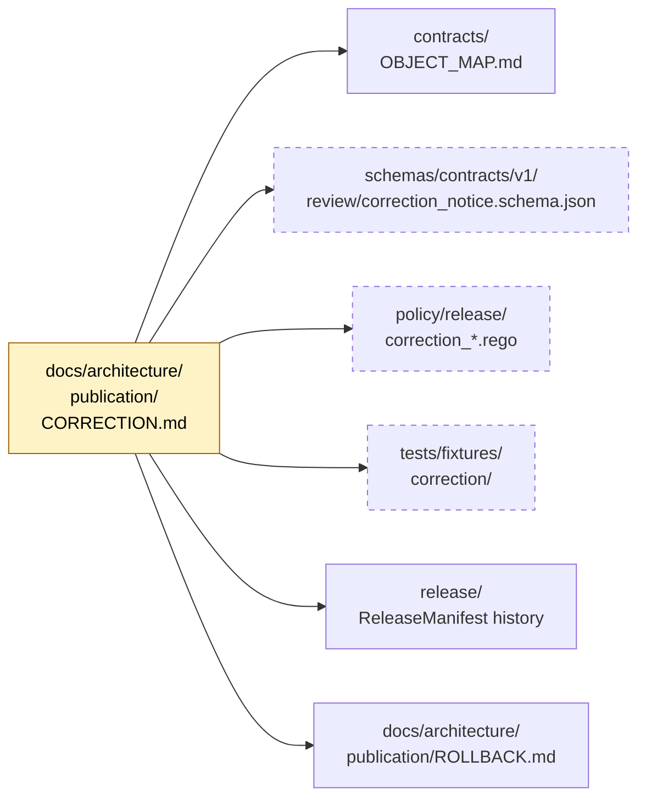
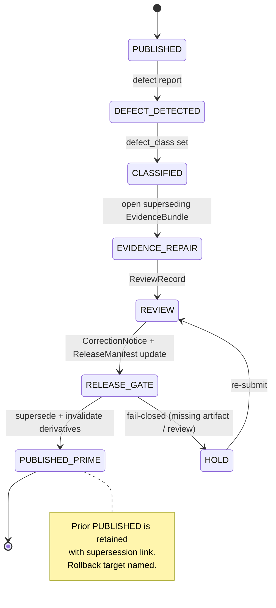
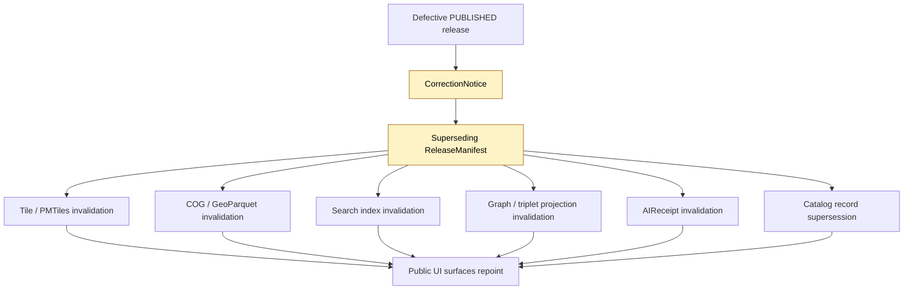
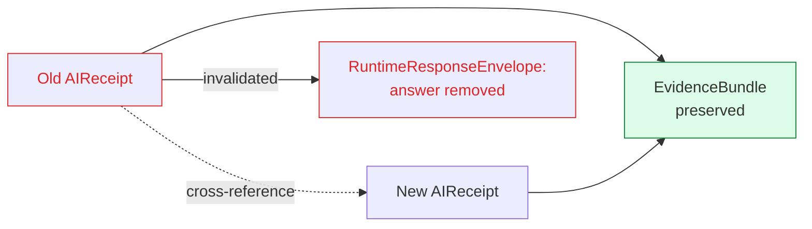

<!-- [KFM_META_BLOCK_V2]
doc_id: kfm://doc/architecture/publication/correction
title: Correction Path (Publication Architecture)
type: standard
version: v1
status: draft
owners: Docs steward + Release authority + Subsystem owner (publication)
created: 2026-05-14
updated: 2026-05-14
policy_label: public
related:
  - docs/architecture/publication/README.md
  - docs/architecture/publication/ROLLBACK.md
  - docs/architecture/publication/GEO_MANIFEST.md
  - docs/architecture/review/README.md
  - docs/architecture/governed-ai/README.md
  - docs/doctrine/lifecycle-law.md
  - docs/doctrine/trust-membrane.md
  - docs/doctrine/directory-rules.md
  - contracts/OBJECT_MAP.md
  - schemas/contracts/v1/review/correction_notice.schema.json
  - schemas/contracts/v1/review/review_record.schema.json
tags: [kfm, publication, correction, rollback, governance]
notes:
  - Path docs/architecture/publication/CORRECTION.md is PROPOSED until verified against mounted repo evidence.
  - Doctrine in this doc is CONFIRMED. Schema paths, route names, and implementation maturity remain PROPOSED.
[/KFM_META_BLOCK_V2] -->

# Correction Path

*How a defective KFM release is corrected without silently mutating the past, and how every correction stays inspectable, reviewable, and reversible.*

<!-- Badge row -->


<!-- TODO: replace static badges with repo-relative Shields.io targets after CI conventions are verified. -->

> [!IMPORTANT]
> **Correction is a publication requirement, not an afterthought.** A released claim, layer, catalog record, artifact, or answer must have a visible **correction path** and a named **rollback target** *before* it is treated as safely publishable. Silent edits to a prior release are forbidden.

**Status:** draft &nbsp;·&nbsp; **Owners:** Docs steward + Release authority + Subsystem owner (publication) &nbsp;·&nbsp; **Last updated:** 2026-05-14

---

## Quick jump

- [1. Scope](#1-scope)
- [2. Where this doc fits](#2-where-this-doc-fits)
- [3. CONFIRMED doctrine](#3-confirmed-doctrine)
- [4. Correction flow (PROPOSED)](#4-correction-flow-proposed)
- [5. Defect classes and posture](#5-defect-classes-and-posture)
- [6. `CorrectionNotice` — required content](#6-correctionnotice--required-content)
- [7. `PUBLISHED → PUBLISHED′` state transition](#7-published--published-state-transition)
- [8. Stale vs. wrong](#8-stale-vs-wrong)
- [9. Supersession lineage](#9-supersession-lineage)
- [10. Derivative invalidation](#10-derivative-invalidation)
- [11. Separation of duties](#11-separation-of-duties)
- [12. Governed AI surface and corrections](#12-governed-ai-surface-and-corrections)
- [13. Gate failure reason codes](#13-gate-failure-reason-codes)
- [14. Trust-visible UI signals](#14-trust-visible-ui-signals)
- [15. Anti-patterns](#15-anti-patterns)
- [16. Verification backlog](#16-verification-backlog)
- [17. Related docs](#17-related-docs)

---

## 1. Scope

This document defines the **correction path** for KFM's publication subsystem: the governed `PUBLISHED → PUBLISHED′` transition that supersedes a defective release with an evidence-supported one, the `CorrectionNotice` lineage object that makes the correction inspectable, and the relationship between correction, rollback, and review.

**In scope.** Correction posture by defect class · `CorrectionNotice` shape and required references · supersession lineage · derivative invalidation · separation-of-duties for steward-significant corrections · trust-visible stale / superseded / withdrawn badging.

**Out of scope.** The rollback drill and `RollbackCard` mechanics are summarized here but specified in [`ROLLBACK.md`](./ROLLBACK.md). The promotion gates (Admission → Release) are specified in the lifecycle and release-gate docs.

> [!NOTE]
> **Truth labels in this doc.** Doctrinal statements (that correction must exist, that supersession must not silently delete, that the trust membrane holds) are **CONFIRMED**. Specific paths, schema homes, route names, validator names, and CI workflow names are **PROPOSED** until verified against mounted-repo evidence per Directory Rules §0.

[↑ Back to top](#quick-jump)

---

## 2. Where this doc fits

```text
docs/architecture/publication/
├── README.md              # Publication subsystem overview (PROPOSED)
├── CORRECTION.md          # ← this doc
├── ROLLBACK.md            # Rollback path & drill (PROPOSED companion)
└── GEO_MANIFEST.md        # Geo asset manifest doctrine (PROPOSED sibling)
```

> [!NOTE]
> Path placement reflects Directory Rules §15 (Required README Contract) at the folder level and the responsibility-root convention: publication concerns live under `docs/architecture/publication/`, with the canonical lifecycle objects in `schemas/contracts/v1/...` and policy in `policy/...` per ADR-0001. **Tree above is PROPOSED.**



> [!WARNING]
> Diagram dependencies marked with dashed borders are **PROPOSED** paths. Their existence in the mounted repo has not been verified in this session.

[↑ Back to top](#quick-jump)

---

## 3. CONFIRMED doctrine

The following are CONFIRMED by KFM publication doctrine. They do not depend on mounted-repo state.

| # | Doctrine | Why it matters |
|---|---|---|
| D1 | Correction and rollback are **publication requirements**, not afterthoughts. | A release without a correction path and rollback target is not safely publishable. |
| D2 | A correction **preserves the original release record**, identifies the defect, classifies it, emits a `CorrectionNotice`, updates the relevant `EvidenceBundle` and `ReleaseManifest`, and publishes a **superseding release**. | Silent mutation of a prior release destroys auditability. |
| D3 | The durable public unit is the **inspectable claim**. | Every PUBLISHED claim, layer, catalog record, artifact, or answer must be traceable to evidence, policy, review, release state, correction path, and rollback target. |
| D4 | The **trust membrane** holds during correction. | Corrections route through the same governed APIs and gates as initial releases; no client reaches RAW, WORK, QUARANTINE, canonical stores, graph internals, vector indexes, source APIs, or direct model runtimes. |
| D5 | **Promotion is a governed state transition, not a file move.** | A correction that bypasses gates is not a correction; it is drift. |
| D6 | **Cite-or-abstain** survives correction. If post-correction evidence is insufficient to support a claim, the governed surface must ABSTAIN rather than serve the prior claim. | Fluency must not stand in for evidence. |

[↑ Back to top](#quick-jump)

---

## 4. Correction flow (PROPOSED)

The flow below is **PROPOSED implementation** of CONFIRMED doctrine. Step ordering, artifact names, and validator names are the recommended shape; specific paths and tool names remain NEEDS VERIFICATION until repo-mounted.

```mermaid
sequenceDiagram
    autonumber
    participant Detector as Defect detector<br/>(steward, validator, user report, AI audit)
    participant Reviewer as Correction reviewer
    participant RelAuth as Release authority
    participant Release as ReleaseManifest store
    participant Evidence as EvidenceBundle store
    participant Public as Governed API / UI

    Detector->>Reviewer: Defect report (classified)
    Reviewer->>Reviewer: Validate defect against EvidenceBundle + policy
    Reviewer->>Evidence: Open superseding EvidenceBundle (PROPOSED)
    Reviewer->>RelAuth: Submit CorrectionNotice + ReviewRecord
    RelAuth->>RelAuth: Separation-of-duties check
    RelAuth->>Release: Emit superseding ReleaseManifest<br/>(prior manifest retained)
    RelAuth->>Release: Record rollback target
    Release->>Public: Repoint aliases; mark prior release superseded
    Public->>Public: Stale/superseded/withdrawn badging<br/>+ invalidate downstream derivatives
    Note over RelAuth,Release: Old release record is never deleted.
```

### Required artifacts at each step

| Step | Required artifact | Truth label |
|---|---|---|
| Detection | Defect report (free-form or structured) referencing `release_id`, claim, or artifact | PROPOSED minimum |
| Classification | One of the defect classes in §5 | CONFIRMED categories |
| Evidence repair | Superseding `EvidenceBundle` with supersession link to prior | PROPOSED schema home: `schemas/contracts/v1/evidence/` |
| Review | `ReviewRecord` linked to the `CorrectionNotice` | PROPOSED schema home: `schemas/contracts/v1/review/review_record.schema.json` |
| Notice | `CorrectionNotice` (see §6) | PROPOSED schema home: `schemas/contracts/v1/review/correction_notice.schema.json` |
| Release | Superseding `ReleaseManifest` + rollback target | CONFIRMED requirement; PROPOSED schema home |
| Invalidation | Derivative-invalidation list (tiles, indexes, graph projections, AIReceipts) | PROPOSED shape |
| Public signal | UI badge: `superseded` / `withdrawn` / `stale` | CONFIRMED doctrine |

[↑ Back to top](#quick-jump)

---

## 5. Defect classes and posture

CONFIRMED by KFM doctrine. Posture pairs each defect class with a correction strategy and a rollback strategy; the two are distinct but coupled.

| Defect class | Correction posture | Rollback posture |
|---|---|---|
| **Evidence gap** | ABSTAIN, or withdraw the unsupported claim | Restore prior evidence-supported release |
| **Source-role defect** | Restore source role; refuse upcast; emit corrected `SourceDescriptor` | Withdraw artifacts that depended on the wrong role |
| **Rights defect** | DENY public use; quarantine source / artifact | Withdraw affected artifacts |
| **Sensitivity leak** | Redact or generalize; notify stewards; emit `RedactionReceipt` | **Immediate** public disablement |
| **Geometry defect** | Rebuild derivative layer and Evidence Drawer payload | Restore previous digest-pinned artifact |
| **Temporal defect** | Correct `valid_time` / `source_time` / `retrieval_time` / `release_time` | Mark stale until rebuilt |
| **Policy defect** | Re-run policy and `DecisionEnvelope` | Disable route / layer if the gate failed |
| **Validation defect** | Re-run validator; supersede `ValidationReport` | Hold at prior validated release |
| **Rendering / API defect** | Patch governed API or layer manifest; re-validate | Revert route / manifest |
| **AI-answer defect** | Invalidate `AIReceipt` and `RuntimeResponseEnvelope` | Remove answer; **preserve** the `EvidenceBundle` |
| **Catalog defect** | Re-emit catalog closure after proof repair | Restore previous catalog state |

> [!CAUTION]
> **Sensitivity leaks demand immediate action.** The correction posture is parallel to but not a substitute for the rollback posture: public surfaces must be disabled *before* the steward-side correction completes.

[↑ Back to top](#quick-jump)

---

## 6. `CorrectionNotice` — required content

> [!NOTE]
> The shape below is the **PROPOSED minimum** required fields. The authoritative schema lives at `schemas/contracts/v1/review/correction_notice.schema.json` (PROPOSED path; NEEDS VERIFICATION in mounted repo). Names, types, and required-flags are governed by the schema, not by this doc.

```json
{
  "object_type": "CorrectionNotice",
  "schema_version": "v1",
  "notice_id": "kfm://correction/<uuid>",
  "created": "2026-05-14T00:00:00Z",
  "spec_hash": "sha256:...",
  "defect_class": "evidence | source_role | rights | sensitivity | geometry | temporal | policy | validation | rendering | api | ai_answer | catalog",
  "affected_release": "kfm://release/<release_id>",
  "affected_claims": ["kfm://claim/<claim_id>"],
  "affected_artifacts": ["kfm://artifact/<artifact_id>"],
  "evidence_supersedes": ["kfm://evidence/<bundle_id>"],
  "evidence_replacement": ["kfm://evidence/<new_bundle_id>"],
  "review_record": "kfm://review/<review_id>",
  "supersession": {
    "supersedes_release": "kfm://release/<prior>",
    "superseded_by_release": "kfm://release/<new>"
  },
  "rollback_target": "kfm://release/<safe_prior>",
  "derivative_invalidation": [
    "kfm://tile/...",
    "kfm://index/...",
    "kfm://graph-projection/...",
    "kfm://ai-receipt/..."
  ],
  "public_signal": "superseded | withdrawn | stale | corrected",
  "reasons": ["short structured reason codes"],
  "notes": ["human-readable narrative for the Evidence Drawer"]
}
```

> [!IMPORTANT]
> `affected_release`, `defect_class`, `supersession`, `rollback_target`, and `review_record` are **PROPOSED required**. A `CorrectionNotice` missing any of these should fail closed at the release gate with `RELEASE_MANIFEST_INVALID` or a `CORRECTION_*` reason code (see §13).

[↑ Back to top](#quick-jump)

---

## 7. `PUBLISHED → PUBLISHED′` state transition

CONFIRMED doctrine: correction is a **governed lifecycle transition**, sitting alongside Admission, Normalization, Validation, Catalog closure, Release, and Rollback. It is **not** a file edit.

| Field | Value |
|---|---|
| **Transition** | `PUBLISHED → PUBLISHED′` |
| **Pre-condition** | Detected error or new evidence; downstream derivatives identified |
| **Required artifacts (PROPOSED minimum)** | `CorrectionNotice`; `ReviewRecord`; derivative-invalidation list; `ReleaseManifest` update or supersession; named `rollback_target` |
| **Failure-closed outcome** | Stale-state announcement; **no silent edit** of the prior release |
| **Separation of duties** | Author / detector ≠ correction reviewer; release authority distinct when correction is steward-significant (see §11) |



[↑ Back to top](#quick-jump)

---

## 8. Stale vs. wrong

CONFIRMED doctrine: KFM **separates stale from wrong**. Both have visible markers and traceable lifecycles, but they are different defects with different correction postures.

| Property | **Stale claim** | **Wrong claim** |
|---|---|---|
| Definition | Evidence, source freshness, dependent data, or context has aged past declared tolerance. | The substance of the claim is incorrect. |
| Trigger | Cadence / version drift; review-aged; policy or model version superseded. | Counter-evidence; logic, geometry, temporal, or source-role error. |
| Required action | Re-admit, supersede, or mark stale. Does **not** always require a `CorrectionNotice`. | `CorrectionNotice` always required. |
| UI signal | `stale` badge in Evidence Drawer. | `superseded` / `withdrawn` / `corrected` badge. |
| Rollback | Optional; depends on severity. | Often required for sensitivity or rights defects. |

> [!TIP]
> When a claim is **both** stale and wrong, treat it as wrong: emit a `CorrectionNotice` and follow §4. The stale badge can be retained as supporting context in the Evidence Drawer.

[↑ Back to top](#quick-jump)

---

## 9. Supersession lineage

CONFIRMED doctrine (extends Atlas v1.0 Appendix E): supersession is the audit trail that lets a future reviewer reconstruct *why* the prior release was wrong, *how* it was corrected, and *what* now stands in its place.

| Object class | Supersession rule | Required lineage artifact |
|---|---|---|
| `SourceDescriptor` | Replaced by newer descriptor; old retained with `superseded_by` link. | Supersession entry in source register. |
| `EvidenceBundle` | Replaced when corrected; old bundle retained for audit. | `EvidenceBundle` + `CorrectionNotice` + supersession link. |
| `GeographyVersion` | Replaced by newer version; both queryable for time-bound claims. | Version register entry + crosswalk. |
| Schema (`schemas/contracts/v1/...`) | Replaced via ADR; old schema retained. | ADR + supersession link in schema header. |
| Policy | Replaced via accepted ADR; old policy retained. | ADR + supersession link. |
| `ReleaseManifest` | Replaced by next release; rollback target remains valid. | Manifest history + rollback chain. |
| `AIReceipt` | **Never** superseded retroactively. Old answer retained; a new answer is a new receipt. | Two distinct `AIReceipt`s with cross-reference. |

> [!WARNING]
> **A supersession without a forward link is a defect.** The "Supersession lineage gap" governance indicator (PROPOSED healthy posture: zero) treats unlinked supersessions as broken.

[↑ Back to top](#quick-jump)

---

## 10. Derivative invalidation

CONFIRMED doctrine: corrections must name and invalidate downstream derivatives. A correction that leaves stale tiles, indexes, or graph projections in place is incomplete.



### PROPOSED invalidation classes

| Derivative class | Invalidation action | Posture |
|---|---|---|
| Tile / PMTiles / MVT / COG | Mark digest stale; serve only post-correction digest | Fail closed if digest mismatch |
| GeoParquet / vector source | Retain prior parquet for audit; route reads only the new manifest | Pin canonical artifact via release manifest |
| Search index | Reindex from post-correction catalog; surface stale-banner until reindex completes | Index is derivative; never canonical |
| Graph / triplet projection | Re-emit projection from canonical/catalog truth | Graph is derivative |
| `AIReceipt` | Mark answer removed; preserve `EvidenceBundle` for re-answer | AI receipt is runtime accountability, not evidence |
| Catalog record | Emit superseded catalog record with link to corrected record | Catalog is discovery, not proof |

[↑ Back to top](#quick-jump)

---

## 11. Separation of duties

CONFIRMED doctrine: correction is one of the actions where authorship and approval **must** separate when materiality applies.

| Action | May author also approve? | Required separation (PROPOSED) |
|---|---|---|
| Correction / rollback (steward-significant) | **No.** | Author / detector + correction reviewer + release authority. |
| Correction (routine, non-sensitive) | Conditional. | Domain steward may self-author; release authority still distinct for any change touching public surfaces. |
| Sensitive-lane correction | **No.** | Author + sensitivity reviewer + release authority + rights-holder rep where applicable. |
| AI-answer correction | **No.** | AI surface steward + docs steward (policy binding); release authority for any public re-emission. |

> [!NOTE]
> Maturity-dependent: Directory Rules §2 treats separation of duties as **maturity-dependent**. Early doctrine work may be authored and approved by the same actor at low materiality. As the public trust surface expands, separation must be enforced through tooling, not custom — this doc does not claim that enforcement is already in place.

[↑ Back to top](#quick-jump)

---

## 12. Governed AI surface and corrections

CONFIRMED doctrine: AI is interpretive, not the root truth source. The correction path applies to AI surfaces with two specific rules.

1. **An `AIReceipt` is never superseded retroactively.** A corrected answer is a **new receipt** with a cross-reference to the prior; the prior is retained for audit.
2. **The `EvidenceBundle` survives.** When an AI-answer defect is detected, the answer envelope and `AIReceipt` are invalidated, but the underlying `EvidenceBundle` is preserved — the bundle is canonical, the answer is derivative.



Allowed AI behaviors during and after correction:

- Summarize the released, corrected `EvidenceBundle`.
- Explain limitations and uncertainty.
- Draft steward-review notes for the next correction cycle.
- **ABSTAIN** when post-correction evidence is insufficient.
- **DENY** when policy, rights, sensitivity, or release state blocks the request.

Forbidden during correction:

- Re-serving the old `AIReceipt` as authoritative.
- Generating uncited claims to fill an evidence gap created by the correction.
- Reaching past the governed API to direct model runtimes, RAW, WORK, QUARANTINE, or canonical stores.

[↑ Back to top](#quick-jump)

---

## 13. Gate failure reason codes

PROPOSED catalog — reason codes the release gate may emit when a correction submission fails closed. Names are PROPOSED; canonical list lives in the release policy bundle once verified.

| Failure family | Reason code (PROPOSED) | When it fires | Recovery |
|---|---|---|---|
| Missing required artifact | `MISSING_RECEIPT`, `MISSING_EVIDENCE`, `MISSING_REVIEW` | Correction submission lacks a required artifact. | Re-emit missing receipt; re-run review; re-validate. |
| Correction-specific | `CORRECTION_DEFECT_UNCLASSIFIED`, `CORRECTION_SUPERSESSION_MISSING`, `CORRECTION_DERIVATIVE_LIST_MISSING` | `CorrectionNotice` missing `defect_class`, `supersession`, or `derivative_invalidation`. | Complete the notice; resubmit. |
| Release infrastructure | `RELEASE_MANIFEST_INVALID`, `ROLLBACK_TARGET_MISSING` | Superseding manifest malformed or missing rollback target. | Manifest fix; supply rollback target. |
| Review state | `REVIEW_NEEDED`, `REVIEW_INSUFFICIENT`, `REVIEW_REJECTED` | Required reviewer signature missing or rejected. | Run required review; supply `ReviewRecord`. |
| Sensitivity / rights | `SENSITIVITY_UNRESOLVED`, `RIGHTS_UNKNOWN` | Sensitivity or rights status not resolved post-correction. | Steward review; tier reassignment. |
| Source-role | `ROLE_COLLAPSE`, `ROLE_DOWNCAST_FORBIDDEN` | Correction attempts to upcast / collapse a source role. | Restore source role; refuse upcast. |

> [!CAUTION]
> Reason codes must be machine-readable. Free-text rejection without a structured code is a drift indicator and should be flagged in the drift register.

[↑ Back to top](#quick-jump)

---

## 14. Trust-visible UI signals

CONFIRMED doctrine: the public UI surfaces what governance already decided. It does not re-decide.

| State | Trigger | Evidence Drawer badge | Layer / tile behavior |
|---|---|---|---|
| `superseded` | A newer `ReleaseManifest` supersedes this release via `CorrectionNotice`. | Superseded badge with forward link to corrected release. | Layer serves corrected artifact; prior remains queryable by release id only. |
| `withdrawn` | Sensitivity, rights, or severe defect required public disablement. | Withdrawn badge with rationale class (rights / sensitivity / safety). | Layer disabled; route returns `DENY`. |
| `corrected` | A correction has been applied and re-released. | Corrected badge with link to `CorrectionNotice`. | Normal serve from corrected artifacts. |
| `stale` | Source freshness / schema / geography / model / review / policy version drift, no defect yet. | Stale badge with cause class. | Layer continues to serve; user is informed. |

> [!IMPORTANT]
> The badge **is not the proof**. Every badge dereferences to the `CorrectionNotice`, `ReviewRecord`, or `SourceDescriptor` that justifies it. UI badges are not a substitute for the Evidence Drawer.

[↑ Back to top](#quick-jump)

---

## 15. Anti-patterns

> [!WARNING]
> Each of the following is a failure of the correction path. They are listed so reviewers can name them before they harden into authority.

| Anti-pattern | Symptom | Why it fails | Correct posture |
|---|---|---|---|
| **Silent mutation** | Prior release file edited in place. | Destroys audit. Violates D2 / D5. | Emit superseding release; preserve prior. |
| **Notice-less correction** | New release published with no `CorrectionNotice`. | No lineage. UI cannot badge `corrected`. | Always emit `CorrectionNotice`. |
| **Orphan supersession** | New release supersedes a prior with no forward link. | Breaks supersession lineage indicator. | Forward + backward link both required. |
| **Stale-as-correction** | A `stale` badge used in place of a `CorrectionNotice` for a substantively wrong claim. | Conflates §8 categories. | Emit `CorrectionNotice` for wrong claims. |
| **Derivative drift** | Tiles, indexes, or graph projections not invalidated after correction. | Old artifacts serve through public CDN. | Name and invalidate all derivatives. |
| **AI re-serve** | Old `AIReceipt` answer re-served after correction. | Bypasses governed surface. | New `AIReceipt`; cross-reference; ABSTAIN if evidence insufficient. |
| **Same-author release** | Author of defective release self-approves the correction at materiality. | Violates §11. | Separation of duties enforced. |
| **Policy-skip** | Correction routed around `PolicyDecision` because "it's just a fix." | Gate-bypass; trust-membrane breach. | Re-run policy gate as for any release. |
| **Rollback collapse** | `CorrectionNotice` published with no `rollback_target`. | `RELEASE_MANIFEST_INVALID` / `ROLLBACK_TARGET_MISSING`. | Name a valid prior release as rollback target. |

[↑ Back to top](#quick-jump)

---

## 16. Verification backlog

The items below are NEEDS VERIFICATION until checked against the mounted repository. They are tracked here for the docs steward and should also appear in `docs/registers/VERIFICATION_BACKLOG.md`.

<details>
<summary><strong>Open verification items (PROPOSED)</strong></summary>

- [ ] **Schema home**: `schemas/contracts/v1/review/correction_notice.schema.json` exists and matches the PROPOSED shape in §6.
- [ ] **Schema home**: `schemas/contracts/v1/review/review_record.schema.json` exists.
- [ ] **Policy bundle**: `policy/release/` (or repo equivalent) emits the §13 reason codes.
- [ ] **Fixtures**: `tests/fixtures/correction/` covers each defect class in §5 with at least one positive and one negative case.
- [ ] **Validator**: A `CorrectionNotice` validator enforces required references (`affected_release`, `supersession`, `rollback_target`, `review_record`).
- [ ] **CI workflow**: A workflow runs correction-notice validation and derivative-invalidation closure check on every release PR.
- [ ] **Trust-membrane test**: A cross-system test proves no public client can fetch a superseded release without the supersession link.
- [ ] **ADR**: Whether a separate ADR is required for the `CorrectionNotice` schema home; or whether ADR-0001 (schema home) covers it.
- [ ] **OBJECT_MAP**: `contracts/OBJECT_MAP.md` carries `CorrectionNotice`, `ReviewRecord`, `ReleaseManifest`, `RollbackCard` with current schema paths.
- [ ] **Companion doc**: `docs/architecture/publication/ROLLBACK.md` exists and is cross-linked.
- [ ] **Folder README**: `docs/architecture/publication/README.md` meets Directory Rules §15 contract.
- [ ] **Governance indicators**: "Correction lead time", "Derivative-invalidation coverage", "Supersession lineage gap", "Release with rollback target" are reported in the governance dashboard.

</details>

[↑ Back to top](#quick-jump)

---

## 17. Related docs

<details>
<summary><strong>Doctrine</strong></summary>

- [Directory Rules](../../doctrine/directory-rules.md) — §15 README contract, §0 status & authority.
- [Lifecycle Law](../../doctrine/lifecycle-law.md) — RAW → WORK / QUARANTINE → PROCESSED → CATALOG / TRIPLET → PUBLISHED.
- [Trust Membrane](../../doctrine/trust-membrane.md) — public clients consume governed APIs only.
- [Truth Posture](../../doctrine/truth-posture.md) — cite-or-abstain.
- [Authority Ladder](../../registers/AUTHORITY_LADDER.md) — how doctrine, repo, source, and runtime evidence rank.

</details>

<details>
<summary><strong>Publication subsystem</strong></summary>

- `docs/architecture/publication/README.md` *(PROPOSED)* — subsystem overview.
- `docs/architecture/publication/ROLLBACK.md` *(PROPOSED)* — rollback path & drill.
- `docs/architecture/publication/GEO_MANIFEST.md` *(PROPOSED)* — geo asset manifest for tile / COG trust badges.

</details>

<details>
<summary><strong>Adjacent subsystems</strong></summary>

- `docs/architecture/review/README.md` — review & steward read-only surface.
- `docs/architecture/governed-ai/README.md` — AI runtime, AIReceipt, finite outcomes.
- `docs/architecture/ui/EVIDENCE_DRAWER.md` — drawer payload that surfaces correction lineage.
- `contracts/OBJECT_MAP.md` — canonical object map for `CorrectionNotice`, `ReviewRecord`, `ReleaseManifest`, `RollbackCard`.

</details>

<details>
<summary><strong>Registers</strong></summary>

- `docs/registers/VERIFICATION_BACKLOG.md` — tracks NEEDS VERIFICATION items.
- `docs/registers/DRIFT_REGISTER.md` — tracks drift between doctrine and repo state.
- `docs/registers/CANONICAL_LINEAGE_EXPLORATORY.md` — classification of canon vs. lineage vs. exploratory packets.

</details>

> [!NOTE]
> All links above are **PROPOSED relative paths**. They depend on the canonical `docs/` tree being laid out per the Whole-UI Expansion Report's proposed file map. Verify against mounted repo before treating any link as live.

---

**Last updated:** 2026-05-14 &nbsp;·&nbsp; **Owners:** Docs steward + Release authority + Subsystem owner (publication) &nbsp;·&nbsp; [↑ Back to top](#quick-jump)
