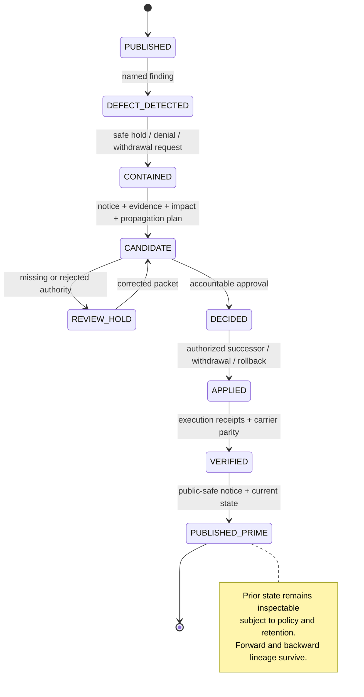

<!-- [KFM_META_BLOCK_V2]
doc_id: kfm://doc/architecture/publication/correction
title: Correction Path
type: architecture-reference
version: v2.0.0
status: draft; repository-grounded; mixed-maturity; non-executing; non-publication
owners:
  - "@bartytime4life — CODEOWNERS review route"
  - "NEEDS VERIFICATION — independent correction, release, policy, rights/sensitivity, and public-surface stewardship"
created: 2026-05-14
updated: 2026-08-19
policy_label: public; architecture; publication; correction; supersession; withdrawal; fail-closed; no-erasure
owning_root: docs/
current_path: docs/architecture/publication/CORRECTION.md
responsibility: Explain KFM publication-correction architecture, current repository proof, authority boundaries, finite failure states, derivative-propagation profiles, graduation gates, public visibility obligations, and recovery coupling without creating or executing correction authority.
truth_posture: >-
  CONFIRMED accepted Directory Rules placement, the tracked architecture page,
  current correction contracts and schemas, the placeholder CorrectionNotice and
  SupersessionNotice machine profiles, fixture-only CorrectionImpactAssessment and
  CorrectionPropagationPlan validators/tests, canonical correction_notices release
  lane, inactive release-policy scaffolds, and current CODEOWNERS route / PROPOSED
  strict CorrectionNotice profile, correction policy, authenticated review,
  correction decision and execution receipts, public notice behavior, derivative
  executor, operational reason-code registry, and health measures / UNKNOWN deployed
  runtime, external storage, current public aliases, public API/UI parity, correction
  service, and end-to-end recovery capability / NEEDS VERIFICATION accountable
  stewards, accepted object-family placement, signer trust, retention, independent
  review, consumer closure, and a production-like correction drill
evidence_snapshot:
  repository: bartytime4life/Kansas-Frontier-Matrix
  base_ref: main
  base_commit: 1a491637df6ce97aa41c4328d88a1f7ba61c6c61
  target_prior_blob: dcd7bd43f63a340842ed0f6df315ca68dbb11f69
  directory_rules_blob: fd49a0b83e55cef52c1124281f093e263526898d
  codeowners_blob: dd2a84aa514d8ecd9208bc347f90f9a2ed37dd61
  correction_notice_contract_blob: 4716f2bc6e714ad2ab873d95144417d7855f5beb
  correction_notice_schema_blob: 8f260eb5a5adba0b4966adfeffebfbcf6960277d
  correction_impact_contract_blob: c397c83f558299388f9d5ca0a9c58deffb3f8c86
  correction_impact_schema_blob: f721aa7cd9c1b30cf63ab108f12c9b08927fd0bf
  correction_impact_validator_blob: 2d78540bb04a906fee7e86588fac71303511d787
  correction_impact_tests_blob: e720222ec5d695a5e8db2be75048d4f07863eeb9
  correction_propagation_contract_blob: b61e7fb0ecd0e68588a29642f3c47e0cb810eff9
  correction_propagation_schema_blob: 3b178bd83c5753a90b30a1549ef5ed587986bd70
  correction_propagation_validator_blob: 4cb4f366a21612adf660fae4bb8dacbc67a169ab
  correction_propagation_tests_blob: 2c5647b7d87447ad2c69f373c9e81a26e57a206a
  correction_notices_readme_blob: 12ad123b53e03e46cd1adfbaf8d5c1855fd99f31
  release_policy_readme_blob: 8a6a91e18f29f6f961eac88270b385a95b86281e
related:
  - README.md
  - ROLLBACK.md
  - rollback-and-correction.md
  - release-objects.md
  - release-state-machine.md
  - RELEASE_GATES.md
  - ../../doctrine/corrections-first-class.md
  - ../../doctrine/directory-rules.md
  - ../../doctrine/lifecycle-law.md
  - ../../doctrine/trust-membrane.md
  - ../../adr/ADR-0029-adopt-directory-governance-standard-v2.md
  - ../../../contracts/correction/README.md
  - ../../../contracts/correction/correction_notice.md
  - ../../../contracts/correction/correction_impact_assessment.md
  - ../../../contracts/correction/correction_propagation_plan.md
  - ../../../contracts/correction/supersession_notice.md
  - ../../../schemas/contracts/v1/correction/README.md
  - ../../../schemas/contracts/v1/correction/correction_notice.schema.json
  - ../../../schemas/contracts/v1/correction/correction_impact_assessment.schema.json
  - ../../../schemas/contracts/v1/correction/correction_propagation_plan.schema.json
  - ../../../schemas/contracts/v1/correction/supersession_notice.schema.json
  - ../../../fixtures/contracts/v1/correction/correction_impact_assessment/
  - ../../../fixtures/contracts/v1/correction/correction_propagation_plan/
  - ../../../tools/validators/correction/validate_correction_impact_assessment.py
  - ../../../tools/validators/correction/validate_correction_propagation_plan.py
  - ../../../tests/validators/correction/test_correction_impact_assessment.py
  - ../../../tests/validators/test_validate_correction_propagation_plan.py
  - ../../../release/correction_notices/README.md
  - ../../../policy/release/README.md
  - ../../../data/receipts/generated/README.md
tags: [kfm, architecture, publication, correction, supersession, withdrawal, derivative-invalidation, evidence, review, policy, release, rollback, audit, fail-closed]
notes:
  - "v2.0.0 is a same-path repository-grounded modernization of the proposal-era page."
  - "The document preserves its doc_id, H1, top target, quick-jump target, and all seventeen legacy numbered section anchors."
  - "Accepted ADR-0029 settles public correction-object placement at release/correction_notices/; release/correction/ and release/corrections/ remain classification or migration sources rather than parallel canonical writers."
  - "The current CorrectionNotice and SupersessionNotice schemas are permissive placeholders. No CorrectionNotice validator, fixture family, policy/correction lane, or operational correction executor was found at the evidence snapshot."
  - "CorrectionImpactAssessment and CorrectionPropagationPlan are deterministic fixture-only, no-network, non-executing profiles. Their COMPLETE or PASS outcomes do not prove a correction was approved, applied, propagated, released, or published."
  - "This revision changes documentation and its generated authoring receipt only. It does not change contracts, schemas, policy, fixtures, validators, workflows, release records, published state, deployment, or public behavior."
[/KFM_META_BLOCK_V2] -->

<a id="top"></a>
<a id="correction-path"></a>

# Correction Path

> **Purpose.** Explain how KFM names, reviews, supersedes, propagates, verifies, and publicly signals a correction without silently rewriting published history, bypassing evidence and policy, or treating a fixture validator as operational correction authority.

[](#status-and-authority)
[](#2-where-this-doc-fits)
[](#6-correctionnotice--required-content)
[](#10-derivative-invalidation)
[](#current-implementation-maturity)
[](#authority-and-publication-boundary)

> [!IMPORTANT]
> **Correction is a governed publication transition, not an edit, notice, pull request, workflow pass, pointer change, cache purge, or deployment.** Those mechanisms may participate in a future accepted operator, but none creates correction authority or public truth by itself.

> [!CAUTION]
> **The current `CorrectionNotice` object family is not machine-closed.** Its semantic contract is draft, its schema requires only `id` and permits additional properties, its declared fixture and validator paths are absent, and `policy/correction/` is absent at this evidence snapshot.

> [!WARNING]
> **The implemented correction validators are inventories, not executors.** `CorrectionImpactAssessment.COMPLETE` and `CorrectionPropagationPlan.PASS` prove only bounded fixture semantics and local consistency. They do not mutate an alias, invalidate a cache, rebuild a tile, issue a correction notice, authenticate review, authorize release, or publish anything.

> [!NOTE]
> **Current repository result.** KFM has a tracked correction architecture lane, semantic contracts, four correction schemas, two deterministic fixture-first validation profiles, and a canonical public correction-notice lane. It does not yet establish a strict CorrectionNotice profile, active correction policy, authenticated correction decision, production operator, execution receipt lane, public parity, or end-to-end correction drill.

<a id="quick-jump"></a>

**Quick navigation:** [Status](#status-and-authority) · [Scope](#1-scope) · [Repo fit](#2-where-this-doc-fits) · [Doctrine](#3-confirmed-doctrine) · [Flow](#4-correction-flow-proposed) · [Defects](#5-defect-classes-and-posture) · [CorrectionNotice](#6-correctionnotice--required-content) · [Transition](#7-published--published-state-transition) · [Stale vs wrong](#8-stale-vs-wrong) · [Lineage](#9-supersession-lineage) · [Propagation](#10-derivative-invalidation) · [Duties](#11-separation-of-duties) · [AI](#12-governed-ai-surface-and-corrections) · [Reasons](#13-gate-failure-reason-codes) · [UI](#14-trust-visible-ui-signals) · [Anti-patterns](#15-anti-patterns) · [Maturity](#current-implementation-maturity) · [Backlog](#16-verification-backlog) · [References](#17-related-docs) · [Appendix](#appendix)

---

<a id="status-and-authority"></a>
<a id="authority-and-publication-boundary"></a>

## Status and authority

| Field | Current bounded result |
|---|---|
| Tracked path | `docs/architecture/publication/CORRECTION.md` |
| Document identity | `kfm://doc/architecture/publication/correction` |
| Document role | Human-readable publication-correction architecture reference |
| Owning root | `docs/` |
| Placement | **CONFIRMED** under accepted ADR-0029 and Directory Rules v2 |
| Repository evidence base | `main@1a491637df6ce97aa41c4328d88a1f7ba61c6c61` |
| Prior document blob | `dcd7bd43f63a340842ed0f6df315ca68dbb11f69` |
| Repository review route | `@bartytime4life` through current CODEOWNERS |
| Independent correction/release stewardship | **NEEDS VERIFICATION** |
| CorrectionNotice profile | Draft semantic contract; permissive placeholder schema; validator and fixtures absent |
| Impact and propagation profiles | **CONFIRMED** fixture-only, no-network, non-authoritative validation surfaces |
| Active correction policy | **HOLD** — `policy/correction/` absent; `policy/release/` remains inactive scaffolding |
| Operational correction | **HOLD / UNKNOWN** beyond inspected repository surfaces |
| Release, deployment, publication effect | None |

This page explains boundaries and evidence. It does not own semantic meaning, machine shape, admissibility, actor authority, release decisions, correction execution, process receipts, published payloads, or public serving.

### Truth labels used here

| Label | Meaning |
|---|---|
| **CONFIRMED** | Verified from current repository bytes, accepted ADRs, tests, workflows, or generated artifacts inspected for this revision |
| **PROPOSED** | A candidate design, inactive profile, unaccepted behavior, graduation step, or future operational surface |
| **UNKNOWN** | Not established strongly enough from available repository, platform, deployment, or runtime evidence |
| **NEEDS VERIFICATION** | A concrete check remains before relying on the claim |

`HOLD`, `PASS`, `COMPLETE`, `ABSTAIN`, `DENY`, and `ERROR` are operational or validator outcomes; they do not replace the four truth labels.

<p align="right"><a href="#top">Back to top</a></p>

---

<a id="1-scope"></a>

## 1. Scope

This page covers the architecture of correcting material that has crossed, or is represented as having crossed, the KFM `PUBLISHED` boundary:

- detection, containment, evidence resolution, review, policy, release, execution, verification, public notice, and audit;
- the distinction among a defect report, `CorrectionNotice`, `SupersessionNotice`, impact assessment, propagation plan, accountable decision, execution receipt, and corrected public carrier;
- the current placeholder `CorrectionNotice` and `SupersessionNotice` profiles;
- the current fixture-only `CorrectionImpactAssessment` and `CorrectionPropagationPlan` profiles;
- defect classification, stale-versus-wrong posture, supersession lineage, derivative propagation, and public signals;
- the accepted correction-object placement and current alias/path drift;
- the production gaps that keep operational correction on hold;
- validation, graduation, and rollback of this documentation change.

This page does **not**:

- apply a correction, supersession, withdrawal, or rollback;
- authorize a release-state transition;
- define accepted public routes, current aliases, cache behavior, or retention windows;
- authenticate actors or approve separation of duties;
- activate policy or create a policy decision;
- replace contracts, schemas, fixtures, validators, tests, workflows, runbooks, or release records;
- prescribe database transaction rollback, schema migration rollback, infrastructure rollback, or Git rollback;
- claim deployed API, MapLibre, Evidence Drawer, search, graph, export, or AI parity.

<p align="right"><a href="#top">Back to top</a></p>

---

<a id="2-where-this-doc-fits"></a>

## 2. Where this doc fits

Accepted [ADR-0029](../../adr/ADR-0029-adopt-directory-governance-standard-v2.md) makes [Directory Rules v2](../../doctrine/directory-rules.md) the placement authority. This same-path page receives `PLACE`: its primary responsibility is to explain publication correction to humans.

### Current responsibility map

| Responsibility | Current or accepted home | Current status |
|---|---|---:|
| Architecture and boundaries | `docs/architecture/publication/CORRECTION.md` | **CONFIRMED** tracked page |
| Correction doctrine companion | [`docs/doctrine/corrections-first-class.md`](../../doctrine/corrections-first-class.md) | **CONFIRMED** tracked draft; implementation paths inside it remain mixed maturity |
| Correction semantic family | [`contracts/correction/`](../../../contracts/correction/) | **CONFIRMED** tracked family; CorrectionNotice placement conflict remains open |
| CorrectionNotice meaning | [`contracts/correction/correction_notice.md`](../../../contracts/correction/correction_notice.md) | **CONFIRMED** draft semantic contract |
| CorrectionNotice machine shape | [`schemas/contracts/v1/correction/correction_notice.schema.json`](../../../schemas/contracts/v1/correction/correction_notice.schema.json) | **CONFIRMED** permissive placeholder; not field-complete |
| SupersessionNotice meaning/shape | [`contracts/correction/supersession_notice.md`](../../../contracts/correction/supersession_notice.md) and paired schema | **CONFIRMED** draft/placeholder; no validator established |
| Downstream carrier inventory | [`CorrectionImpactAssessment`](../../../contracts/correction/correction_impact_assessment.md) plus schema, fixtures, validator, and tests | **CONFIRMED** fixture-only / non-executing |
| Dependency propagation inventory | [`CorrectionPropagationPlan`](../../../contracts/correction/correction_propagation_plan.md) plus schema, fixtures, validator, and tests | **CONFIRMED** fixture-only / non-executing |
| Public correction objects | [`release/correction_notices/`](../../../release/correction_notices/) | **CONFIRMED** canonical collection name under Directory Rules; current lane contains indexes/scaffolds, not a proved governed correction instance |
| Release-admissibility policy source | [`policy/release/`](../../../policy/release/) | **CONFIRMED** path; current modules are inactive scaffolds |
| Correction-specific policy | `policy/correction/` | **CONFIRMED absent** at this snapshot |
| Executed correction/invalidation receipts | `data/receipts/correction/` | **PROPOSED** subtype lane; **CONFIRMED absent** at this snapshot |
| Corrected public-safe carriers | [`data/published/`](../../../data/published/) | **CONFIRMED** payload responsibility; no correction parity proved |
| Production correction operator or pipeline | `tools/release/` or `pipelines/` by accepted responsibility | **UNKNOWN / no correction-specific production operator established in the inspected surfaces** |
| Public delivery | [`apps/governed-api/`](../../../apps/governed-api/) and [`apps/explorer-web/`](../../../apps/explorer-web/) | Paths exist; correction behavior remains **UNKNOWN** |

### Accepted collection grammar and current drift

Directory Rules §13.3 selects `release/correction_notices/` for public correction objects. The current repository also contains `release/correction/` and `release/corrections/`. Those lanes are not silently promoted to parallel canonical writers; each object requires classification, migration evidence, one writable authority, parity checks, and rollback before consolidation.

The current correction schema-family README is also stale relative to the directory it indexes: it lists only the placeholder `correction_notice.schema.json`, while the directory now also contains impact-assessment, propagation-plan, and supersession schemas. This page records that drift; it does not repair a neighboring authority or change schema status.

### Present architecture split

```text
docs/architecture/publication/
└── CORRECTION.md                         # human explanation; this page

contracts/correction/
├── correction_notice.md                  # draft semantics; placeholder schema
├── supersession_notice.md                # draft semantics; placeholder schema
├── correction_impact_assessment.md       # fixture-only carrier inventory
└── correction_propagation_plan.md        # fixture-only dependency inventory

schemas/contracts/v1/correction/
├── correction_notice.schema.json         # permissive placeholder
├── supersession_notice.schema.json       # permissive placeholder
├── correction_impact_assessment.schema.json
└── correction_propagation_plan.schema.json

release/correction_notices/               # public correction-object collection
policy/release/                            # inactive release-policy source
```

<p align="right"><a href="#top">Back to top</a></p>

---

<a id="3-confirmed-doctrine"></a>

## 3. CONFIRMED doctrine

The following is the governing correction posture supported by KFM's current operating law, accepted placement rules, and correction doctrine. The dedicated [`corrections-first-class.md`](../../doctrine/corrections-first-class.md) page remains draft and does not prove operational adoption by itself.

| # | Governing posture | Consequence |
|---|---|---|
| D1 | Corrections, withdrawals, supersessions, rollback, and lineage are first-class and inspectable. | A public object without a correction and rollback path is not release-ready. |
| D2 | A correction is named and append-only. | Prior release, evidence, decision, and receipt history is not silently rewritten. |
| D3 | Evidence, policy, review, release decision, correction execution, and public notice remain separate authorities. | One notice, validator result, workflow, or receipt cannot collapse the chain. |
| D4 | Public clients remain behind the trust membrane. | Corrected state reaches public surfaces only through governed APIs or released public-safe carriers. |
| D5 | Cite-or-abstain survives correction. | If the remaining evidence cannot support the claim, public surfaces narrow, abstain, deny, or hold rather than re-serving unsupported content. |
| D6 | Rights, sensitivity, sovereignty, privacy, and harmful precision fail closed. | Immediate containment may precede the full editorial correction, but it does not erase the need for accountable notice and lineage. |
| D7 | Publication and promotion are governed transitions, not file operations. | Editing a manifest, alias, tile, document, or database row does not by itself establish corrected public truth. |
| D8 | Correction is reversible and correctable. | A correction may itself be superseded; rollback and forward-fix targets remain explicit. |

### Correction, withdrawal, and rollback are different

| Operation | Primary purpose | Public-state posture |
|---|---|---|
| Correction | Replace a wrong or trust-modified public assertion with a governed successor | New candidate and release state; prior lineage retained |
| Supersession | Record that a newer governed object replaces an earlier one | Forward and backward links; no in-place rewrite |
| Withdrawal | Remove or deny a public route while preserving the record and safe explanation | Public route closes; audit persists |
| Rollback | Repoint governed current state to a previously safe target | Operational recovery; see [`ROLLBACK.md`](ROLLBACK.md) |

<p align="right"><a href="#top">Back to top</a></p>

---

<a id="4-correction-flow-proposed"></a>

## 4. Correction flow (PROPOSED)

The complete flow below is **PROPOSED operational architecture**. Current repository proof is strongest for the two inventory/validation steps; the decision, execution, receipt, and public-parity stages remain held or unknown.


```mermaid
flowchart LR
  DETECT["Detect and classify defect"] --> CONTAIN["Contain unsafe public exposure"]
  CONTAIN --> EVIDENCE["Resolve evidence, scope, rights, sensitivity"]
  EVIDENCE --> NOTICE["Draft CorrectionNotice"]
  NOTICE --> IMPACT["CorrectionImpactAssessment"]
  IMPACT --> PLAN["CorrectionPropagationPlan"]
  PLAN --> REVIEW["Authenticated review and policy"]
  REVIEW --> DECIDE["Accountable correction/release decision"]
  DECIDE --> EXECUTE["Apply successor, withdrawal, or rollback"]
  EXECUTE --> RECEIPTS["Emit execution and invalidation receipts"]
  RECEIPTS --> VERIFY["Verify all affected carriers"]
  VERIFY --> PUBLIC["Expose public-safe notice and current state"]
  PUBLIC --> AUDIT["Retain append-only lineage"]

  classDef implemented fill:#ede9fe,stroke:#6d28d9,color:#111;
  classDef held fill:#fee2e2,stroke:#b91c1c,color:#111;
  classDef proposed fill:#fef3c7,stroke:#a16207,color:#111;
  class IMPACT,PLAN implemented;
  class REVIEW,DECIDE,EXECUTE,RECEIPTS,VERIFY,PUBLIC held;
  class DETECT,CONTAIN,EVIDENCE,NOTICE,AUDIT proposed;
```

### Stage contract

| Stage | Minimum evidence or object | Current repository status |
|---|---|---:|
| Detect | Typed finding or report bound to affected release/claim/artifact | **PROPOSED**; no shared strict defect-report profile verified |
| Contain | Public-safe hold, denial, withdrawal, or rollback request appropriate to severity | **UNKNOWN** operational behavior |
| Resolve | EvidenceRef → EvidenceBundle, source role, time, geography, rights, sensitivity, and affected scope | **NEEDS VERIFICATION** integration |
| Name | `CorrectionNotice` or `SupersessionNotice` | Contracts/schemas exist; machine closure **HOLD** |
| Inventory | `CorrectionImpactAssessment` | **CONFIRMED** fixture-only validator/test surface |
| Plan | `CorrectionPropagationPlan` | **CONFIRMED** fixture-only validator/test surface |
| Review | Authenticated review record plus policy decision | **UNKNOWN** integrated authority |
| Decide | Accountable correction/release decision with successor or withdrawal target | **UNKNOWN** accepted profile/operator |
| Execute | Versioned successor, withdrawal, or governed rollback | **HOLD** |
| Receipt | Append-only execution and per-carrier completion records | **HOLD**; subtype lane absent |
| Verify | Carrier parity, citations, cache/search/graph/map/API/AI/documentation checks | **HOLD** beyond synthetic profile validation |
| Expose | Public-safe notice and current release state through governed interfaces | **UNKNOWN** deployed parity |
| Audit | Prior state, reasons, decisions, receipts, and successor links retained | **PROPOSED** operational closure |

> [!IMPORTANT]
> Immediate containment for a rights, sensitivity, security, or harmful-precision defect may precede the full correction packet. That emergency containment must still produce accountable follow-up, preserve safe audit, and not become a permanent undocumented state.

<p align="right"><a href="#top">Back to top</a></p>

---

<a id="5-defect-classes-and-posture"></a>

## 5. Defect classes and posture

The classes below are an architecture taxonomy, not an accepted policy enum. A future strict profile may normalize or split them after contract, policy, and steward review.

| Defect class | Initial public posture | Correction path | Rollback or withdrawal posture |
|---|---|---|---|
| Evidence gap or contradiction | `ABSTAIN` or `HOLD` the unsupported assertion | Resolve support, narrow scope, or emit a successor | Restore prior evidence-supported state when available |
| Source-role defect | Hold affected derived claims; do not upcast weak support | Repair source-role metadata and dependent claims | Withdraw derivatives built on the invalid role |
| Rights or consent defect | `DENY` affected public use | Re-evaluate admissibility and issue a safe notice | Withdraw immediately when permission no longer supports exposure |
| Sensitivity, sovereignty, privacy, or harmful precision | Immediate containment and least-exposing public state | Redact, generalize, stage, delay, or withdraw with qualified review | Disable affected route or artifact before full editorial closure |
| Geometry or CRS defect | Hold affected map/analysis surfaces when material | Rebuild from validated geometry and preserve old digest | Restore prior digest-pinned carrier if safe |
| Temporal or freshness defect | Mark stale, narrow time, or `ABSTAIN`; do not imply currentness | Repair valid/source/retrieval/release time and dependent claims | Optional unless current public use is unsafe |
| Policy or review defect | `HOLD` or `DENY` the operation | Re-run accepted policy and authenticated review | Disable or withdraw when prior exposure lacked authority |
| Validation or integrity defect | Hold affected release candidate or public carrier | Rebuild and revalidate from pinned inputs | Restore prior validated target when possible |
| API, renderer, tile, cache, search, graph, export, or document defect | Fail closed in the affected carrier without redefining truth | Repair the carrier and verify parity | Repoint or withdraw affected delivery surface |
| AI-answer or citation defect | Remove or `ABSTAIN` the answer; preserve evidence | Re-resolve evidence and emit a new answer/receipt | Never rewrite the prior receipt as though it never existed |
| Catalog or provenance defect | Hold discovery/public references that cannot resolve | Re-emit catalog/provenance from corrected support | Restore prior catalog projection only if still valid |

> [!CAUTION]
> Defect class alone cannot determine review burden or public action. Severity, affected audience, sensitivity, rights, geography, time, materiality, reversibility, and the availability of a safe prior state all matter.

<p align="right"><a href="#top">Back to top</a></p>

---

<a id="6-correctionnotice--required-content"></a>

## 6. `CorrectionNotice` — required content

### Current machine truth

The current paired schema at [`schemas/contracts/v1/correction/correction_notice.schema.json`](../../../schemas/contracts/v1/correction/correction_notice.schema.json):

- declares JSON Schema Draft 2020-12;
- has status `PROPOSED` in its `x-kfm` metadata;
- requires only `id`;
- optionally defines `version` and `spec_hash` as unconstrained strings;
- permits additional properties;
- points to a fixture root, validator, and policy lane that were not found at this evidence snapshot.

Schema-valid under that profile therefore does **not** prove affected objects, evidence, defect class, review, policy, successor, rollback, propagation, public summary, or release state.

### Current semantic contract

The draft [`CorrectionNotice` contract](../../../contracts/correction/correction_notice.md) treats the notice as a named trust object rather than the corrected artifact. It recommends, but the current schema does not enforce, these semantic groups:

| Group | Proposed content | Why required before operational use |
|---|---|---|
| Identity | Stable notice ID, version, deterministic digest | Replay and unambiguous lineage |
| Scope | Affected release, claims, assets, layers, catalogs, answers, or public surfaces | Prevent vague notices |
| Reason | Defect class, severity/materiality, structured public-safe reasons | Drive review, containment, and explanation |
| Evidence | Resolvable source and evidence references; counter-evidence or update record | Preserve cite-or-abstain |
| Review and policy | Authenticated reviewer/issuer, review state, policy decision reference, obligations | Separate semantics from authority |
| Successor state | Replacement release/artifact/claim or withdrawal posture; effective time | Identify what now stands |
| Recovery | Rollback target and forward-fix posture | Preserve reversibility |
| Propagation | Impact assessment and propagation-plan references; completion receipts | Prove carrier closure rather than merely assert it |
| Public explanation | Safe summary, notice audience, disclosure limits, forward link | Make correction visible without exposing restricted detail |
| AI authorship | Generated receipt reference when AI drafts substantive notice prose | Keep generated language subordinate and reviewable |

### Operational HOLD

A production-capable `CorrectionNotice` remains on hold until the following dependency-closed packet exists and is accepted:

1. one canonical semantic home or documented compatibility model;
2. strict versioned schema with finite enums and cross-field rules;
3. valid and invalid no-network fixtures;
4. deterministic validator and focused tests;
5. evidence, review, policy, release, successor, rollback, and propagation bindings;
6. public-safe redaction rules for sensitive reasons;
7. versioning, migration, correction-of-correction, and backward-compatibility rules;
8. integration into an accountable correction decision and executor without making the validator the authority.

> [!WARNING]
> Do not copy the proposal-era JSON example from an older edition into production. It was architecture prose, not the current schema, and it named fields the repository does not yet machine-enforce.

<p align="right"><a href="#top">Back to top</a></p>

---

<a id="7-published--published-state-transition"></a>

## 7. `PUBLISHED → PUBLISHED′` state transition

`PUBLISHED → PUBLISHED′` is explanatory notation for a governed successor state. It is not a literal current state-machine enum, database transaction, file rename, or proof that the repository can apply the transition.

| Layer | Required distinction | Current posture |
|---|---|---:|
| Candidate validation | Are the proposed notice, impact inventory, propagation plan, and successor packet structurally coherent? | Partial fixture-first proof |
| Accountable decision | May this correction, withdrawal, supersession, or rollback proceed under evidence, policy, review, rights, sensitivity, and release rules? | **UNKNOWN / HOLD** |
| Application | Were public pointers, manifests, carriers, caches, indexes, and notices changed by an authorized operator? | **HOLD** |
| Receipt and verification | Is the exact applied effect recorded, replayable, and independently checked across every affected carrier? | **HOLD** |
| Public state | Do governed API/UI/map/search/export/AI surfaces expose the safe current state and visible lineage? | **UNKNOWN** |


```mermaid
stateDiagram-v2
  [*] --> PUBLISHED
  PUBLISHED --> DEFECT_DETECTED: named finding
  DEFECT_DETECTED --> CONTAINED: safe hold / denial / withdrawal request
  CONTAINED --> CANDIDATE: notice + evidence + impact + propagation plan
  CANDIDATE --> REVIEW_HOLD: missing or rejected authority
  REVIEW_HOLD --> CANDIDATE: corrected packet
  CANDIDATE --> DECIDED: accountable approval
  DECIDED --> APPLIED: authorized successor / withdrawal / rollback
  APPLIED --> VERIFIED: execution receipts + carrier parity
  VERIFIED --> PUBLISHED_PRIME: public-safe notice + current state
  PUBLISHED_PRIME --> [*]
  note right of PUBLISHED_PRIME
    Prior state remains inspectable
    subject to policy and retention.
    Forward and backward lineage survive.
  end note
```

No stage may infer the next from filenames, a workflow conclusion, or prose. A candidate `PASS` is not a decision; a decision is not execution; execution without receipts is not verified completion; public display without governed lineage is not KFM-grade correction.

<p align="right"><a href="#top">Back to top</a></p>

---

<a id="8-stale-vs-wrong"></a>

## 8. Stale vs. wrong

KFM must not collapse **stale**, **wrong**, **disputed**, **withdrawn**, and **superseded** into one badge or reason. They can overlap, but each carries different evidence and policy consequences.

| State | Meaning | Minimum posture | CorrectionNotice requirement |
|---|---|---|---|
| Stale | Support or context exceeded an accepted freshness or review tolerance | Mark stale, narrow scope, hold, or abstain according to policy | Conditional; required when the public meaning or trust state materially changes |
| Wrong | The substantive assertion, geometry, attribution, time, source role, or result is incorrect | Contain unsupported use and create a governed successor or withdrawal | Required under the proposed operational profile |
| Disputed | Qualified evidence or authority challenges the assertion but resolution is pending | Surface dispute or abstain when material | Conditional; notice or caveat must preserve the dispute record |
| Withdrawn | Public use is no longer permitted or safe, or the object is no longer supported | Close the governed public route and preserve safe audit | Required public-safe withdrawal/correction lineage |
| Superseded | A newer governed object now stands in place of the prior one | Preserve old identity and link forward to the successor | Required lineage record |

> [!IMPORTANT]
> Stale does not mean safe to keep serving. The appropriate public behavior depends on accepted freshness policy and consequence. When stale support cannot justify the requested claim, the governed result is `ABSTAIN`, `HOLD`, or `DENY`, not a stale badge attached to an otherwise authoritative answer.

When an object is both stale and wrong, use the wrong/correction path and preserve stale state as supporting context rather than as a substitute for correction.

<p align="right"><a href="#top">Back to top</a></p>

---

<a id="9-supersession-lineage"></a>

## 9. Supersession lineage

Supersession allows a future reviewer to reconstruct what was asserted, why it changed, what now stands, and which evidence, policy, review, release, propagation, and rollback records support the transition.

### Current repository evidence

- [`contracts/correction/supersession_notice.md`](../../../contracts/correction/supersession_notice.md) exists as a draft semantic contract.
- [`schemas/contracts/v1/correction/supersession_notice.schema.json`](../../../schemas/contracts/v1/correction/supersession_notice.schema.json) exists as a permissive placeholder.
- No supersession validator or fixture family was established in the inspected correction validator/fixture lanes.
- [`release/correction_notices/`](../../../release/correction_notices/) and its flora, hydrology, and roads-rail-trade sublanes contain README/scaffold material rather than a proved governed correction-notice instance.

### Lineage obligations

| Object family | Required posture |
|---|---|
| Source or dataset version | Preserve prior source/version identity and record the authoritative update relationship |
| Evidence bundle or claim | Preserve prior support and bind the successor, caveat, dispute, or withdrawal |
| Geography, schema, contract, or policy | Preserve versioned identity and migration/supersession rules; do not rewrite historical meaning |
| Release manifest or public carrier | Preserve prior release identity, successor/withdrawal target, effective time, and rollback relationship |
| Catalog, graph, search, or tile projection | Rebuild from corrected support and record the prior projection as superseded or withdrawn |
| Runtime or generated receipt | Preserve the original receipt; emit a new receipt for the corrected action or answer and cross-reference it |
| Public notice | Link backward to affected state and forward to current state without revealing restricted reasons |

Forward and backward pointers should be validated as one closure. A forward-only or backward-only link may strand users or auditors and must not be treated as complete lineage.

<p align="right"><a href="#top">Back to top</a></p>

---

<a id="10-derivative-invalidation"></a>

## 10. Derivative invalidation

Two repository-owned profiles now make the derivative burden more concrete. Both are intentionally bounded and non-executing.

### `CorrectionImpactAssessment`

The [`CorrectionImpactAssessment` contract](../../../contracts/correction/correction_impact_assessment.md), paired schema, fixtures, validator, and tests define an exact ten-carrier inventory in canonical order:

1. `CATALOG`
2. `API`
3. `MAP`
4. `TILE`
5. `SEARCH`
6. `GRAPH`
7. `EXPORT`
8. `AI`
9. `CACHE`
10. `DOCUMENTATION`

Its finite outcomes are `COMPLETE`, `HOLD`, and `ERROR`. The current valid fixture lane contains one `COMPLETE` and one `HOLD` profile; the invalid lane exercises missing carrier, digest drift, invalid cache action, and missing AI citation revalidation. Tests prove deterministic identity, no network access, exact fixture polarity, and false authority/repository-mutation/release/publication/public-use flags.

> [!CAUTION]
> `COMPLETE` means the declared inventory is structurally and semantically closed for review. It does **not** mean the carriers were changed, the correction was approved, or public state is correct.

### `CorrectionPropagationPlan`

The [`CorrectionPropagationPlan` contract](../../../contracts/correction/correction_propagation_plan.md), paired schema, one deterministic `cases.json` matrix, validator, and tests model dependency-level actions and statuses. The fixture polarity is two `PASS`, one `ABSTAIN`, eleven `DENY`, and one `ERROR` cases.

The validator recomputes identity, surface closure, entry order, reason codes, summary counts, time consistency, completion-receipt requirements, and replacement-target bindings. Tests deny network access and verify that mutation, release, publication, and history-deletion claims remain false.

> [!CAUTION]
> `PASS` means a fixture plan is internally coherent. It does **not** prove that any downstream system consumed the plan or completed an action.

### Operational completion requirement (PROPOSED)

A future correction executor should treat a carrier as complete only when an append-only execution or completion receipt binds:

- the exact correction/decision ID;
- affected prior and successor release/object IDs;
- carrier kind and artifact or route identity;
- planned versus observed action;
- pre- and post-action digests or state references;
- operator identity and authorization reference;
- start, completion, and observation times;
- result and stable reason codes;
- verification method and verifier identity;
- rollback or recovery target;
- safe public-state observation where applicable.

| Carrier | Typical required effect | Fail-closed observation |
|---|---|---|
| Catalog/provenance | Re-emit or supersede discovery/provenance projection | Old projection still resolves as current |
| API | Serve only governed current state; preserve lineage | Route serves affected prior state without notice |
| Map/tile/raster/vector | Rebuild, repoint, withdraw, or mark unavailable | Old digest remains publicly admitted |
| Search/graph | Reindex or reproject from corrected support | Stale result remains current or lacks lineage |
| Export/story/documentation | Regenerate or supersede with release/correction references | Download or narrative omits correction state |
| AI | Re-resolve evidence/citations; withdraw or replace answer | Prior answer remains authoritative |
| Cache/CDN | Invalidate exact keys or version namespace | Cached prior bytes remain reachable as current |

No `data/receipts/correction/` subtype lane, accepted receipt profile, production executor, or end-to-end carrier parity proof was found. Operational derivative invalidation remains on hold.

<p align="right"><a href="#top">Back to top</a></p>

---

<a id="11-separation-of-duties"></a>

## 11. Separation of duties

Current [`CODEOWNERS`](../../../.github/CODEOWNERS) routes the repository to `@bartytime4life` and explicitly states that routing is not a `ReviewRecord`, policy decision, release approval, publication authority, or proof of independent review. No authenticated correction-role registry or independent correction/release approver was established in the inspected surfaces.

### Proposed operational role split

| Role | Owns | Must not silently collapse into |
|---|---|---|
| Detector/reporter | Finding, affected scope, initial evidence, urgency | Final reviewer or release authority for a material self-authored correction |
| Correction author | Candidate notice, evidence packet, impact assessment, propagation plan | Policy decision or execution receipt |
| Evidence/domain reviewer | Factual support, scope, source role, time, geography | Rights/sensitivity authority outside scope |
| Rights/sensitivity/policy reviewer | Admissibility, disclosure limits, obligations, denial/withdrawal posture | Release execution |
| Release authority | Accountable correction, supersession, withdrawal, or rollback decision | Authoring and independent verification at materiality |
| Operator | Exact application of the authorized decision | Decision authority or self-issued verification |
| Independent verifier | Receipt integrity, carrier parity, public-state observation | Operator for the same significant action |
| Docs/public-notice steward | Safe explanatory notice and navigation | Evidence, policy, or release authority |

Routine low-materiality work may eventually use a bounded exception, but that exception needs an accepted threshold, authenticated actor scope, audit record, expiry, and escalation rule. Significant, sensitive, rights-bearing, or public-state corrections default to separated duties.

<p align="right"><a href="#top">Back to top</a></p>

---

<a id="12-governed-ai-surface-and-corrections"></a>

## 12. Governed AI surface and corrections

AI may assist discovery and drafting. It is not the evidence source, correction reviewer, policy authority, release authority, operator, or verifier.

### Allowed bounded uses

- detect candidate contradictions, stale citations, or affected derivative references;
- cluster duplicate reports and draft a candidate defect summary;
- summarize resolved EvidenceBundles for reviewer use;
- draft public-safe notice prose with explicit source references and a generated authoring receipt;
- propose an impact inventory or propagation plan for deterministic validation;
- re-answer only after governed evidence, policy, review, and release state support it;
- return `ABSTAIN`, `DENY`, or `ERROR` when support or authority is missing.

### Prohibited uses

- treating generated prose as the evidence for its own correction;
- silently rewriting a prior notice, answer, receipt, or release record;
- inventing a corrected fact, reviewer, policy decision, release ID, or completion receipt;
- exposing restricted reasons or sensitive geometry in public notice text;
- reaching around the governed API to canonical/internal stores or direct model runtimes;
- using hidden reasoning or chain-of-thought as proof.

A corrected AI answer is a new runtime event with new citations and accountability records. The prior answer/receipt remains preserved according to policy and retention; it is not retroactively rewritten. Deployed Focus Mode, Evidence Drawer, search, map, and AI correction parity remains **UNKNOWN** in this evidence pass.

<p align="right"><a href="#top">Back to top</a></p>

---

<a id="13-gate-failure-reason-codes"></a>

## 13. Gate failure reason codes

KFM does not yet have one accepted correction reason-code registry. Keep three layers distinct.

### Confirmed validator-local findings

The current fixture validators use implementation-local codes for bounded validation. Examples include:

| Profile | Confirmed examples | Scope |
|---|---|---|
| Impact assessment | `AI_CITATION_REVALIDATION_REQUIRED`, `CACHE_ACTION_INVALID`, `ASSESSMENT_DIGEST_MISMATCH`, `SCHEMA_INVALID` | Fixture shape, identity, and carrier semantics only |
| Propagation plan | `CORRECTION_SCHEMA_INVALID`, `CORRECTION_SPEC_HASH_MISMATCH`, `CORRECTION_SURFACE_CLOSURE_MISMATCH`, `CORRECTION_COMPLETION_RECEIPT_REQUIRED`, `CORRECTION_TARGET_RELEASE_REQUIRED`, `CORRECTION_TIME_INVALID` | Fixture dependency-plan integrity only |

These codes do not prove accepted public policy, release denial semantics, or operator behavior.

### Proposal-era architecture codes retained for compatibility

The prior edition named codes such as `MISSING_RECEIPT`, `MISSING_EVIDENCE`, `MISSING_REVIEW`, `CORRECTION_DEFECT_UNCLASSIFIED`, `CORRECTION_SUPERSESSION_MISSING`, `CORRECTION_DERIVATIVE_LIST_MISSING`, `RELEASE_MANIFEST_INVALID`, `ROLLBACK_TARGET_MISSING`, `REVIEW_NEEDED`, `SENSITIVITY_UNRESOLVED`, `RIGHTS_UNKNOWN`, and `ROLE_COLLAPSE`.

Those names remain **PROPOSED**. Do not expose them as a stable API, policy, or release contract until an accepted registry defines:

- namespace and version;
- owning contract/policy surface;
- public-safe versus restricted detail;
- outcome mapping (`HOLD`, `ABSTAIN`, `DENY`, `ERROR`, or candidate validation failure);
- retryability and escalation;
- supersession and compatibility behavior;
- cross-surface mapping for API, UI, map, export, and AI.

Free text may accompany a code, but free text alone must not be the only machine-visible failure signal for a consequential correction operation.

<p align="right"><a href="#top">Back to top</a></p>

---

<a id="14-trust-visible-ui-signals"></a>

## 14. Trust-visible UI signals

The table below is **PROPOSED public behavior**. No deployed route, component, payload, or public-parity test was established by this documentation pass.

| Public state | Minimum safe signal | Governed behavior |
|---|---|---|
| Correction pending / containment | Temporarily unavailable, under review, or narrowed scope with a public-safe reason | Do not re-serve affected state merely to avoid an empty surface |
| Corrected | Notice that content changed, effective time, current release link, and safe summary | Serve only the governed current state |
| Superseded | Forward link to current state and prior-version identity | Prior may remain inspectable only as policy permits and never as current |
| Withdrawn | Public-safe withdrawal notice without restricted details | Public route denies or abstains; audit remains protected |
| Stale | Cause class, observed/currentness time, and limitation | Continue, narrow, hold, or abstain only as accepted policy permits |
| Disputed | Visible caveat or abstention when material | Do not flatten unresolved dispute into a confident answer |
| Correction failed | Stable public-safe failure state and recovery posture | Fail closed; do not silently fall back to affected state |

The map renderer, UI badge, search result, export footer, or AI response never decides the state. Each is a downstream projection of governed evidence, policy, review, release, and correction records.

Public notice text must disclose enough to preserve trust while withholding secrets, private data, exact sensitive locations, legal strategy, security details, or restricted reasons. A generic badge with no resolvable lineage is not proof.

<p align="right"><a href="#top">Back to top</a></p>

---

<a id="15-anti-patterns"></a>

## 15. Anti-patterns

| Anti-pattern | Why it fails | Correct posture |
|---|---|---|
| Silent in-place mutation | Erases the inspected prior state and breaks lineage | Create a governed successor or withdrawal; preserve prior identity |
| Notice as authority | Prose cannot approve or apply a correction | Link notice to evidence, review, policy, decision, execution, and current release state |
| Placeholder schema treated as complete | Current schema accepts almost any additional content | Keep CorrectionNotice operational use on hold until strict closure exists |
| `COMPLETE` treated as applied | Impact profile validates inventory only | Require actual execution/completion receipts and carrier verification |
| `PASS` treated as approval | Propagation profile validates coherence only | Keep decision and execution separate |
| Alias lane treated as canonical by presence | `release/correction/`, `release/corrections/`, and `release/correction_notices/` coexist | Follow accepted collection grammar and govern migration/classification |
| Same actor authors, decides, executes, and verifies | Hides mistakes and defeats accountability | Separate significant duties or record an accepted bounded exception |
| History deletion or receipt rewrite | Prevents replay and audit | Append new records; use policy-governed retention, not semantic erasure |
| Stale badge used for a wrong claim | Avoids correction and may keep unsupported truth visible | Use the correction/withdrawal path and preserve stale context separately |
| Incomplete derivative scope | Old API, tile, cache, search, graph, export, document, or AI state remains current | Inventory all carriers and verify observed completion |
| Public notice leaks sensitive reason/detail | Correction creates a new exposure | Redact/generalize notice; keep restricted rationale behind governed access |
| Documentation or workflow described as publication | Confuses repository state with public truth | Preserve explicit non-effects and separately authorize release/application |

<p align="right"><a href="#top">Back to top</a></p>

---

<a id="current-implementation-maturity"></a>

## Current implementation maturity

| Surface | Repository proof | Safe conclusion |
|---|---|---|
| Architecture page | Tracked at the requested path; parent publication README links it | Human explanation exists; no behavioral authority |
| CorrectionNotice | Draft semantic contract plus permissive placeholder schema | Meaning is described; machine closure and operational use remain held |
| SupersessionNotice | Draft semantic contract plus permissive placeholder schema | Lineage intent exists; validator/fixtures/integration not established |
| CorrectionImpactAssessment | Contract, strict schema, two valid and four invalid fixtures, deterministic validator, focused no-network tests | Bounded carrier-inventory proof only |
| CorrectionPropagationPlan | Contract, strict schema, 15-case matrix, deterministic validator, no-network tests | Bounded dependency-plan proof only |
| Public correction-notice collection | Parent and three domain index/scaffold lanes | Placement/indexing exists; no proved governed public correction instance |
| Policy | Release-policy lane contains inactive scaffolds; correction-specific policy absent | No accepted correction admissibility result |
| Review and actor authority | CODEOWNERS routes to one verified account | Review routing only; no independent/authenticated correction authority proved |
| Release decision/application | No accepted correction decision profile or correction-specific operator established | Operational correction **HOLD** |
| Execution receipts | Proposed subtype lane absent | Applied effects and carrier completion cannot be proved end to end |
| API/UI/map/search/export/AI parity | No deployed or end-to-end evidence inspected | **UNKNOWN** |
| Production-like correction drill | No end-to-end governed correction/withdrawal/re-correction drill established | **HOLD / NEEDS VERIFICATION** |

### Proposed health indicators

These are useful only after their producers, denominators, windows, and evidence sources are accepted:

- time from trusted detection to safe containment;
- time from containment to accountable decision;
- CorrectionNotice strict-validation rate;
- affected-carrier inventory completeness;
- propagation completion-receipt coverage;
- public-surface parity lag by carrier;
- unresolved forward/backward lineage gaps;
- stale prior-state reachability as current;
- unauthorized in-place mutation count;
- sensitive-reason redaction incidents;
- correction failure, rollback, and re-correction rate.

No dashboard or operational measurement of these indicators was verified in this pass.

<p align="right"><a href="#top">Back to top</a></p>

---

<a id="16-verification-backlog"></a>

## 16. Verification backlog

### Confirmed bounded work already present

- [x] Accepted Directory Rules select `docs/` for this architecture page and `release/correction_notices/` for public correction objects.
- [x] CorrectionNotice and SupersessionNotice semantic contracts and placeholder schemas exist.
- [x] CorrectionImpactAssessment has a deterministic strict schema, fixture polarity, validator, and no-network tests.
- [x] CorrectionPropagationPlan has a deterministic strict schema, 15-case polarity, validator, and no-network tests.
- [x] Release policy explicitly documents its inactive scaffold status and non-authority.
- [x] CODEOWNERS explicitly distinguishes review routing from approval and separation of duties.

### Operational HOLDs

- [ ] Resolve canonical CorrectionNotice semantic placement between correction and release families, or document a compatibility model with one writer.
- [ ] Replace the permissive CorrectionNotice and SupersessionNotice placeholders with reviewed versioned profiles.
- [ ] Add valid/invalid fixtures, validators, focused tests, and registry wiring for those notice families.
- [ ] Define and activate accepted correction policy with finite outcomes, public-safe reason codes, and replayable decisions.
- [ ] Bind authenticated ReviewRecord/actor authority and enforce appropriate separation of duties.
- [ ] Define accountable correction, supersession, withdrawal, and re-correction decisions separately from candidate validation.
- [ ] Implement an idempotent, least-privilege correction operator with dry-run and fail-closed behavior.
- [ ] Define immutable execution/completion receipt profiles and the accepted subtype lane under `data/receipts/`.
- [ ] Prove catalog, API, map, tile, search, graph, export, AI, cache, and documentation propagation with observed receipts.
- [ ] Prove public-safe notice, current-state, citation, and lineage parity through governed APIs and clients.
- [ ] Establish retention, restricted-history access, correction-of-correction, rollback, and incident runbooks.
- [ ] Run production-like no-network/synthetic drills before any live correction authority is activated.

### Smallest coherent next slice

The next bounded repository-owned slice should close the **CorrectionNotice candidate profile**, not build a production operator:

1. reconcile the semantic home against accepted Directory Rules and current release contracts;
2. define one strict versioned schema from the reviewed semantic contract;
3. add deterministic valid/invalid fixtures and a no-network validator;
4. test identity, required references, public-safe summary rules, no-authority flags, and fail-closed parsing;
5. wire bounded validation into current registry/CI conventions;
6. preserve policy, actor authority, release decision, execution, receipts, public behavior, and publication as explicit later HOLDs.

That slice is dependency-closed enough to make notice candidates trustworthy without pretending that KFM can yet apply a correction.

### Operational graduation gates

A correction path should not be called operational until evidence proves all of the following:

- accepted contracts and strict schemas for notices, decisions, receipts, and lineage;
- authenticated actors and materiality-appropriate independent review;
- accepted correction/release policy and deterministic evaluator binding;
- resolvable evidence, rights, sensitivity, temporal, and affected-scope closure;
- idempotent decision application with dry-run, compare-and-swap or equivalent conflict control, and least privilege;
- immutable execution and per-carrier completion receipts;
- complete public-surface parity and fail-closed negative behavior;
- correction, withdrawal, rollback, re-correction, partial-failure, and rollback-of-correction drills;
- documented incident, correction request, escalation, retention, and recovery runbooks;
- accountable human approval for live activation.

<p align="right"><a href="#top">Back to top</a></p>

---

<a id="17-related-docs"></a>

## 17. Related docs

### Publication architecture

- [Publication Architecture](README.md) — lane boundary, maturity map, and conflict register.
- [Publication Rollback Discipline](ROLLBACK.md) — candidate profile, synthetic rehearsal, and operational rollback HOLDs.
- [Rollback and Correction](rollback-and-correction.md) — concise comparison; currently proposal-era and requires separate convergence review.
- [Release Objects](release-objects.md) — publication object-family overview.
- [Release State Machine](release-state-machine.md) — explanatory release-state narrative.
- [Release Gates](RELEASE_GATES.md) — detailed readiness/gate architecture.

### Doctrine, placement, and review routing

- [Corrections Are First-Class](../../doctrine/corrections-first-class.md) — draft doctrine companion.
- [Directory Rules](../../doctrine/directory-rules.md) — accepted placement and collection grammar through ADR-0029.
- [ADR-0029](../../adr/ADR-0029-adopt-directory-governance-standard-v2.md) — accepted adoption record.
- [Lifecycle Law](../../doctrine/lifecycle-law.md) — lifecycle boundary.
- [Trust Membrane](../../doctrine/trust-membrane.md) — governed public-interface rule.
- [CODEOWNERS](../../../.github/CODEOWNERS) — repository review routing, not approval authority.

### Contracts, schemas, fixtures, validators, and tests

- [Correction contracts](../../../contracts/correction/README.md)
- [Correction schema family](../../../schemas/contracts/v1/correction/README.md)
- [Correction impact fixtures](../../../fixtures/contracts/v1/correction/correction_impact_assessment/)
- [Correction propagation fixtures](../../../fixtures/contracts/v1/correction/correction_propagation_plan/)
- [Impact-assessment validator](../../../tools/validators/correction/validate_correction_impact_assessment.py)
- [Propagation-plan validator](../../../tools/validators/correction/validate_correction_propagation_plan.py)
- [Impact-assessment tests](../../../tests/validators/correction/test_correction_impact_assessment.py)
- [Propagation-plan tests](../../../tests/validators/test_validate_correction_propagation_plan.py)

### Release, policy, receipts, and public carriers

- [Public correction-notice lane](../../../release/correction_notices/README.md)
- [Release policy lane](../../../policy/release/README.md)
- [Generated authoring receipts](../../../data/receipts/generated/README.md)
- [Public-safe carriers](../../../data/published/README.md)

### Documentation rollback

Before merge, close the draft pull request and abandon the feature branch. After an authorized merge, revert the bounded documentation commit and remove only its generated authoring receipt through the same reviewed change. Do not alter historical correction, release, or process records to roll back this page.

<p align="right"><a href="#top">Back to top</a></p>

---

<a id="appendix"></a>

## Appendix

### A. Repository-native validation commands

```bash
PYTHONDONTWRITEBYTECODE=1 KFM_NO_NETWORK=1 \
  python -m pytest -q \
  tests/validators/correction/test_correction_impact_assessment.py

PYTHONDONTWRITEBYTECODE=1 KFM_NO_NETWORK=1 \
  python -m unittest \
  tests.validators.test_validate_correction_propagation_plan -v

PYTHONDONTWRITEBYTECODE=1 KFM_NO_NETWORK=1 \
  python tools/validators/correction/validate_correction_propagation_plan.py \
  --fixtures

python tools/validators/validate_generated_receipt.py \
  data/receipts/generated/<generated-receipt>.json

make schemas
git diff --check
```

These commands validate bounded repository objects. A green result does not activate correction policy, authenticate review, apply a release transition, or prove deployed public parity.

### B. Compatibility ledger for the prior edition

| Prior element | Disposition in v2.0.0 |
|---|---|
| `doc_id`, H1, and quick-jump target | Preserved |
| Numbered section anchors `1` through `17` | Preserved explicitly |
| Proposal-era path uncertainty | Replaced with current repository and accepted Directory Rules evidence |
| Proposal-era `review/` schema paths | Corrected to the current `correction/` schema family |
| Illustrative CorrectionNotice JSON | Removed as non-authoritative and replaced with current schema/contract truth |
| Defect, stale/wrong, lineage, propagation, AI, UI, and anti-pattern content | Retained, bounded, and reconciled with current implementation maturity |
| Unverified validator/fixture/CI claims | Replaced with exact implemented and absent surfaces |
| Operational correction claims | Held until decision, execution, receipt, public-parity, and drill evidence exists |

### C. Change history

| Version | Date | Change |
|---|---|---|
| `v1` | 2026-05-14 | Proposal-era correction architecture page. |
| `v2.0.0` | 2026-08-19 | Same-path repository-grounded modernization; current object-family proof, fixture-only profiles, accepted placement, explicit production HOLDs, and authoring provenance. |

---

**Last updated:** 2026-08-19 · **Review route:** `@bartytime4life` via CODEOWNERS · **Operational correction:** HOLD · **Publication effect:** none

<p align="right"><a href="#top">Back to top</a></p>
