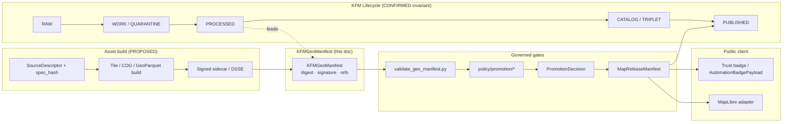
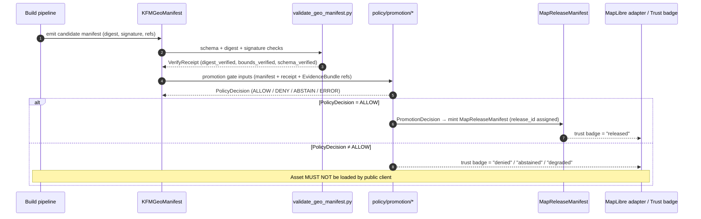

<!-- [KFM_META_BLOCK_V2]
doc_id: kfm://doc/architecture/publication/geo-manifest
title: KFM Geo Manifest
type: standard
version: v1
status: draft
owners: [Publication subsystem owner, Docs steward, Tooling/QA owner]   # NEEDS VERIFICATION
created: 2026-05-14
updated: 2026-05-14
policy_label: public
related:
  - schemas/contracts/v1/evidence/kfm_geo_manifest.schema.json
  - tools/validators/geo_manifest/validate_geo_manifest.py
  - policy/promotion/
  - tests/fixtures/geo_manifest/
  - docs/architecture/ui/LAYERING.md
  - docs/architecture/publication/RELEASE_MANIFEST.md      # NEEDS VERIFICATION
  - docs/doctrine/lifecycle-law.md
  - docs/doctrine/trust-membrane.md
  - docs/doctrine/directory-rules.md
tags: [kfm, publication, pmtiles, cog, geoparquet, manifest, integrity, evidence, trust-badge]
notes:
  - Path is CONFIRMED by Whole-UI + Governed AI Expansion Report §14 "Canonical home decisions"
  - Live repo not mounted in this session; every "live state" claim is PROPOSED or NEEDS VERIFICATION
  - data/manifests/ vs release/manifests/ as emitted-instance home is an OPEN item per Directory Rules §17
[/KFM_META_BLOCK_V2] -->

<a id="top"></a>

# KFM Geo Manifest

> Release-candidate integrity manifest binding PMTiles, COG, and GeoParquet assets to deterministic digests, signatures, and provenance — feeding governed publication gates and on-map trust badges.

---


<!-- All badges are reviewable placeholders; targets are not yet wired. NEEDS VERIFICATION. -->

| Field | Value |
|---|---|
| **Document type** | Standard architecture doc (object-family contract surface) |
| **Authority of doctrine** | CONFIRMED — see [Source attribution](#source-attribution) |
| **Authority of any quoted path** | PROPOSED until verified against mounted-repo evidence |
| **Owners** | Publication subsystem owner · Tooling/QA owner · Docs steward — *NEEDS VERIFICATION* |
| **Status** | `draft` · v1 |
| **Last reviewed** | 2026-05-14 |
| **Schema home (CONFIRMED doctrine)** | `schemas/contracts/v1/evidence/kfm_geo_manifest.schema.json` |
| **Validator home (CONFIRMED doctrine)** | `tools/validators/geo_manifest/validate_geo_manifest.py` |
| **Fixture home (CONFIRMED doctrine)** | `tests/fixtures/geo_manifest/` |
| **Policy home (CONFIRMED doctrine)** | `policy/promotion/` |
| **Emitted-instance home** | `data/manifests/` *(per Expansion Report)* — **CONFLICTED** with Directory Rules §17 open item that treats `release/manifests/` as canonical for release manifests; see [Open verification items](#15-open-verification-items) |

---

## Quick Links

- [1. Purpose](#1-purpose)
- [2. What this is / is not](#2-what-this-is--is-not)
- [3. Position in the publication architecture](#3-position-in-the-publication-architecture)
- [4. Object-family relationships](#4-object-family-relationships)
- [5. Required and optional fields](#5-required-and-optional-fields)
- [6. Lifecycle and promotion flow](#6-lifecycle-and-promotion-flow)
- [7. Validation contract](#7-validation-contract)
- [8. Failure conditions and DENY table](#8-failure-conditions-and-deny-table)
- [9. Trust badges and runtime consumption](#9-trust-badges-and-runtime-consumption)
- [10. Anti-patterns register](#10-anti-patterns-register)
- [11. Rollback, correction, and withdrawal](#11-rollback-correction-and-withdrawal)
- [12. Worked example (illustrative)](#12-worked-example-illustrative)
- [13. Directory placement basis](#13-directory-placement-basis)
- [14. Related docs](#14-related-docs)
- [15. Open verification items](#15-open-verification-items)
- [16. Source attribution](#16-source-attribution)

---

## 1. Purpose

The **KFM Geo Manifest** (`KFMGeoManifest`) is the **release-candidate integrity manifest** for KFM map assets — specifically PMTiles, Cloud-Optimized GeoTIFF (COG), and GeoParquet bytes destined for governed publication. It binds the asset's deterministic digest, optional signature bundle, source-descriptor identity, lifecycle state, and integrity references into one object that downstream gates and runtimes can verify before the asset is allowed near a public client.

It is the **evidence-side artifact** in the publication stack: it asserts *what the bytes are* and *how they can be verified*, distinct from `MapReleaseManifest` which asserts *that a release happened*, and distinct from `TileArtifactManifest` which carries broader tile/format metadata. PROPOSED scope: `KFMGeoManifest` is consumed by `validate_geo_manifest.py`, by promotion-gate policy under `policy/promotion/`, and by on-map trust-badge surfaces; it does **not** itself perform promotion, decide rights, or claim release state.

> [!IMPORTANT]
> `KFMGeoManifest` is a **derived carrier**, not a sovereign truth source. The bytes it describes are downstream of `SourceDescriptor`, `EvidenceBundle`, validation, and review state. A signed manifest does not establish evidentiary certainty; it establishes byte integrity and lineage hooks for a promotion gate to evaluate.

[⬆ Back to top](#top)

---

## 2. What this is / is not

| This **is** | This is **not** |
|---|---|
| A release-candidate integrity manifest for PMTiles, COG, and GeoParquet bytes | A release decision (that is `ReleaseManifest`) |
| A digest- and signature-bearing evidence object | A canonical truth source (those are `EvidenceBundle` / `EvidenceRef`) |
| Input to promotion-gate policy under `policy/promotion/` | A policy engine or admissibility decision |
| Input to on-map trust badges and `AutomationBadgePayload` projections | A renderable map style or layer definition |
| Bound to a deterministic `spec_hash` of its canonical descriptor | Bound to a mutable URL, tag, or filename |
| Required before any PMTiles/COG/GeoParquet artifact is allowed past the trust membrane | A bypass mechanism for source rights, sensitivity, or review state |
| Verifiable offline, given the manifest + asset bytes | A substitute for `RunReceipt`, `PromotionDecision`, or `RollbackCard` |

[⬆ Back to top](#top)

---

## 3. Position in the publication architecture

`KFMGeoManifest` sits in the **PROCESSED → CATALOG/TRIPLET → PUBLISHED** boundary of the KFM lifecycle invariant. It is produced after the asset is generated, before `PromotionDecision` is recorded, and is referenced by `MapReleaseManifest` once promotion succeeds.



> [!NOTE]
> The diagram reflects **doctrine**, not verified repo state. Box names match contracts/object-family names from the Whole-UI + Governed AI Expansion Report and the Master MapLibre Components Atlas; arrows reflect the documented relationships. Live wiring (route names, module imports, runtime sequencing) is **NEEDS VERIFICATION** until the repo is mounted.

[⬆ Back to top](#top)

---

## 4. Object-family relationships

The manifest is one node in a small, sharply-bounded graph of publication objects. Each neighbor has a separate responsibility; conflating them is the most common drift pattern in this area.

| Object | Role | Relationship to `KFMGeoManifest` |
|---|---|---|
| `SourceDescriptor` | Source identity, rights, sensitivity, cadence | Provides `source_id` and `spec_hash` inputs; the manifest **references**, never re-derives, source rights |
| `EvidenceBundle` / `EvidenceRef` | Admissible evidence resolved from a ref | Manifest carries `evidence_refs` only; bundles are resolved through governed APIs, not embedded |
| `RunReceipt` | Build/run process memory (inputs, tool versions, attestations) | Linked by `run_receipt_ref`; the manifest is *not* a substitute for the receipt |
| `TileArtifactManifest` | Tile artifact contract (format, layers, root_hash, ranges) | Sibling object; `KFMGeoManifest` is the narrower evidence-side manifest focused on digest + signature; `TileArtifactManifest` carries broader tile/format metadata |
| `LayerManifest` / `LayerDescriptor` | Versioned layer payload / MapLibre source-and-layer descriptor | Consumes `KFMGeoManifest` via `geo_manifest_ref`; trust badges read manifest state through the layer surface |
| `PolicyDecision` | Allow / deny / restrict / abstain output | Promotion-gate policy reads the manifest and emits a `PolicyDecision` — never the other direction |
| `PromotionDecision` | Governed state transition into release | References the validated `KFMGeoManifest`; the manifest alone is not a promotion |
| `MapReleaseManifest` / `ReleaseManifest` | Publication envelope binding artifacts, evidence, policy, rollback | The release manifest **embeds** `KFMGeoManifest` references; only `MapReleaseManifest` declares "PUBLISHED" |
| `RollbackCard` | Reversal decision artifact | A rollback card points at a prior `MapReleaseManifest` and, transitively, the `KFMGeoManifest` set that release referenced |
| `CorrectionNotice` | Public correction record | May point at a manifest whose claim has been corrected |
| `AutomationBadgePayload` | On-map trust-visible status projection | Reads manifest verification state to project `released` / `stale` / `degraded` / `denied` badges |

> [!CAUTION]
> Do **not** carry release decisions, policy outcomes, or evidence resolution inside the manifest. The manifest's job is asset integrity and lineage. Other families own the rest. See [Anti-patterns register](#10-anti-patterns-register).

[⬆ Back to top](#top)

---

## 5. Required and optional fields

The authoritative shape lives in `schemas/contracts/v1/evidence/kfm_geo_manifest.schema.json` (PROPOSED — not yet verified against mounted repo). The field intent below is **doctrinally derived** from the Whole-UI Expansion Report (canonical home decision), the Master MapLibre Atlas v1.5 PMTiles sidecar guidance, and the `docs/tiles/PIPELINE.md` precedent in *New Ideas 5-8-26*. Exact field names will be locked when the schema PR lands.

### 5.1 Identity and integrity (REQUIRED)

| Field | Intent | Truth label |
|---|---|---|
| `spec_hash` | Deterministic digest over the canonical descriptor; identity fingerprint. SHA-256 over canonical JSON (sorted keys, no whitespace variance) per the KFM identity scheme. | PROPOSED |
| `manifest_spec_hash` | The manifest's own `spec_hash`, computed over the canonical manifest with the `spec_hash` field excluded | PROPOSED |
| `asset_kind` | Enum: `pmtiles` \| `cog` \| `geoparquet` | PROPOSED |
| `asset_media_type` | e.g. `application/vnd.pmtiles`, `image/tiff; application=geotiff; profile=cloud-optimized`, `application/vnd.apache.parquet` | PROPOSED |
| `digest` | Primary content digest of the asset bytes (algorithm declared) | PROPOSED |
| `digest_algo` | Enum (v1 PROPOSED): `sha256` (catalog/OCI compat) \| `blake3` (PMTiles sidecar lineage) | NEEDS VERIFICATION — algorithm freeze requires ADR |
| `size_bytes` | Asset size in bytes | PROPOSED |

### 5.2 Source and evidence linkage (REQUIRED)

| Field | Intent | Truth label |
|---|---|---|
| `source_id` | Stable identifier resolving to a ledgered `SourceDescriptor` | PROPOSED |
| `source_head` | Captured upstream identity at fetch time: `ETag`, `Last-Modified`, `Content-Length` | PROPOSED |
| `evidence_refs[]` | `EvidenceRef` IDs (resolve to `EvidenceBundle` via governed API) | PROPOSED |
| `run_receipt_ref` | Pointer to the `RunReceipt` that produced the asset | PROPOSED |

### 5.3 Format-specific metadata (REQUIRED per `asset_kind`)

<details>
<summary><strong>PMTiles</strong></summary>

| Field | Intent |
|---|---|
| `pmtiles_version` | Version string (e.g., `v3`) |
| `tile_format` | `mvt` \| `webp` \| `png` |
| `tiling_scheme` | `xyz` \| `tms` |
| `minzoom` / `maxzoom` | Integer zoom bounds |
| `root_hash` | Hash over PMTiles root (algorithm declared in `root_hash_algo`) |
| `root_hash_algo` | Typically `blake3` per sidecar lineage |
| `byte_ranges_manifest[]` | Optional: range descriptors for BAO partial verification / delta patches |
| `delta_base_hash` | Optional: previous root hash for delta publication |

</details>

<details>
<summary><strong>COG</strong></summary>

| Field | Intent |
|---|---|
| `cog_profile` | Required overviews, internal tiling, predictor, compression |
| `crs` | EPSG code or PROJ string |
| `bbox` | `[minx, miny, maxx, maxy]` |
| `overview_levels` | Declared overview pyramid |
| `internal_tile_hashes[]` | Optional: per-internal-tile or per-chunk digests for high-integrity releases |
| `range_capable_hosting` | Boolean assertion that hosting honors HTTP Range |

</details>

<details>
<summary><strong>GeoParquet</strong></summary>

| Field | Intent |
|---|---|
| `geoparquet_version` | e.g., `1.1` |
| `crs` | Per-column CRS metadata reference |
| `schema_digest` | Digest over the Arrow / Parquet schema |
| `row_count` | Asserted row count |
| `geometry_columns[]` | Per-column encoding (`WKB` / `WKT`) and geometry types |

</details>

### 5.4 Signature and attestation (REQUIRED for public release; OPTIONAL pre-promotion)

| Field | Intent | Truth label |
|---|---|---|
| `signature_bundle` | DSSE envelope or Cosign signature artifact (b64) | PROPOSED |
| `signature_algo` | `ed25519` \| `ecdsa-p256` (PROPOSED set) | NEEDS VERIFICATION |
| `signature_kid` | Key ID / KMS URI / certificate subject | PROPOSED |
| `rekor_index_or_proof` | Transparency-log inclusion entry or proof, when used | PROPOSED |
| `sbom_ref` | OCI referrer or path to the SBOM for the build | PROPOSED |
| `prov_ref` | PROV-O / SLSA provenance attestation pointer | PROPOSED |

### 5.5 Policy posture (REQUIRED — not decided here, only declared)

| Field | Intent |
|---|---|
| `policy_label` | e.g., `public` \| `restricted` \| `quarantined` (the manifest *declares*, the policy *decides*) |
| `rights_status` | Resolved rights state from `SourceDescriptor` |
| `sensitivity_class` | CARE-aware sensitivity class |
| `review_state` | `pending` \| `reviewed` \| `withdrawn` |

### 5.6 Release linkage (REQUIRED at publish; absent pre-promotion)

| Field | Intent |
|---|---|
| `release_id` | Set only after `PromotionDecision` succeeds and `MapReleaseManifest` is minted |
| `rollback_target_ref` | Prior release pointer, satisfying the "rollback supported" gate |
| `correction_notice_refs[]` | Any correction notices that supersede earlier claims about this asset |

### 5.7 Provenance and timing (REQUIRED)

| Field | Intent |
|---|---|
| `generation_tool` | Tool identity and version (e.g., `tippecanoe@2.x`) |
| `timestamp` | RFC 3339 generation timestamp |
| `tool_versions[]` | Pinned versions of every tool that touched the canonical descriptor or bytes |

> [!TIP]
> Fields that **change evidentiary meaning** (source, rights, sensitivity, digests, refs) MUST be inside `spec_hash`. Fields that are **transport-only** (URLs, timestamps, signatures, nonces, host metadata) MUST be excluded from `spec_hash`. The canonical normalization rule lives with the schema and is enforced by the validator.

[⬆ Back to top](#top)

---

## 6. Lifecycle and promotion flow



**Lifecycle invariant (CONFIRMED doctrine):** `RAW → WORK/QUARANTINE → PROCESSED → CATALOG/TRIPLET → PUBLISHED`. A `KFMGeoManifest` is meaningful only from **PROCESSED** onward; emitting one against RAW/WORK/QUARANTINE bytes is a category error.

**Promotion is a governed state transition, not a file move** (CONFIRMED doctrine, Directory Rules §0). Producing the manifest does not promote the asset; only `PromotionDecision` and the resulting `MapReleaseManifest` do.

[⬆ Back to top](#top)

---

## 7. Validation contract

The manifest's executable checks live in `tools/validators/geo_manifest/validate_geo_manifest.py` (CONFIRMED doctrinal path; PROPOSED implementation maturity). The validator MUST be deterministic, no-network, and fail-closed. Its required checks:

| # | Check | Outcome on failure |
|---|---|---|
| V1 | JSON Schema validation against `schemas/contracts/v1/evidence/kfm_geo_manifest.schema.json` | `ERROR` |
| V2 | `spec_hash` recomputes from canonical descriptor | `ERROR` |
| V3 | `manifest_spec_hash` recomputes from canonical manifest (excluding `spec_hash`) | `ERROR` |
| V4 | Asset `digest` matches recomputation over asset bytes | `DENY` |
| V5 | Format-specific structural check (PMTiles index opens; COG has overviews + Range-readable layout; GeoParquet schema parses) | `DENY` |
| V6 | `root_hash` (PMTiles) or internal-chunk hashes (COG) recompute when present | `DENY` |
| V7 | Signature bundle verifies under declared `signature_algo` / `signature_kid` | `DENY` |
| V8 | `evidence_refs[]` each resolve in the governed catalog | `ABSTAIN` (validator) → `DENY` (promotion) |
| V9 | `run_receipt_ref` resolves to a `RunReceipt` whose inputs match `source_head` and `spec_hash` | `ABSTAIN` |
| V10 | `source_id` resolves to a ledgered `SourceDescriptor` with rights status set | `DENY` if rights unknown |
| V11 | Cross-run determinism: same inputs → identical `spec_hash` and `manifest_spec_hash` across machines | `ERROR` |
| V12 | **Negative-state fixtures fire correctly**: stale-source, invalid signature, missing sidecar, sensitive-geometry — each produces the documented DENY/ABSTAIN outcome | Validator fails closed |

> [!IMPORTANT]
> The validator MUST exercise its DENY / ABSTAIN / ERROR paths via fixtures under `tests/fixtures/geo_manifest/` (positive *and* negative). A validator without negative fixtures is treated as not enforcing — per the KFM Failure Rule and Anti-Patterns posture, this is a release blocker.

[⬆ Back to top](#top)

---

## 8. Failure conditions and DENY table

These map directly to the policy-gate outcomes that the promotion stack must encode under `policy/promotion/`. The list is doctrinally derived from the v1.5 Master MapLibre Atlas (ML-058-025, ML-058-028, ML-058-032, ML-058-045) and the *New Ideas 5-8-26* failure-condition guidance.

| Condition | Outcome | Source |
|---|---|---|
| Invalid signature | **DENY** | ML-058-025 / failure table |
| Missing sidecar / signature bundle | **DENY** | ML-058-025 |
| Unknown or unsupported `tiling_scheme` / `tile_format` | **DENY** | failure table |
| `spec_hash` mismatch (ref vs manifest, or canonical recomputation drift) | **DENY** | Identity scheme D4 |
| `manifest_spec_hash` mismatch | **DENY** | derived |
| Asset `digest` recomputation mismatch | **DENY** | failure table |
| `rights_status` unknown or unresolved | **DENY** | ML-058-045 |
| `sensitivity_class` non-public for a public release lane | **DENY** | ML-058-045 |
| Exact sensitive geometry exposed in artifact bytes | **DENY** (also generalize/redact upstream) | sensitive-geometry deny fixture |
| `evidence_refs[]` empty or unresolvable | **ABSTAIN** (validator) → **DENY** (promotion) | ML-058-032 |
| Missing `rollback_target_ref` at publish | **DENY** | ML-058-045 |
| Publication attempted before review | **DENY** | failure table |
| Unverifiable delta chain (`delta_base_hash` does not chain) | **DENY** | ML-058-035 lineage |
| Stale `source_head` versus current upstream | **ABSTAIN** + stale badge | stale-source fixture |
| Hash algorithm tag outside the v1 allowed set | **DENY** + require migration gate | Identity scheme D5 |

> [!WARNING]
> Fail-closed is the **default**, not the exception. Any uncertainty about rights, sensitivity, signature validity, or evidence closure MUST resolve to `DENY` or `ABSTAIN`. Optimistic defaults are an anti-pattern in this layer.

[⬆ Back to top](#top)

---

## 9. Trust badges and runtime consumption

`KFMGeoManifest` is the upstream input to **on-map trust badges** and the `AutomationBadgePayload` projection — both governed UI surfaces, not authoritative truth.

| Badge state | Manifest condition |
|---|---|
| `released` | Manifest validated; embedded in a current `MapReleaseManifest`; `PolicyDecision = ALLOW` |
| `stale` | Validation passed but `source_head` is older than the configured freshness threshold |
| `degraded` | Validation passed but optional checks (e.g., internal-chunk hashes, SBOM/PROV referrers) are missing or partial |
| `denied` | Any DENY condition from §8 fired |
| `abstained` | Manifest itself is well-formed but resolution couldn't reach a finite outcome |
| `withdrawn` | A `CorrectionNotice` or withdrawal record supersedes this asset |

**Runtime rule (CONFIRMED doctrine, ML-058-029 / ML-058-032):** Public clients see only PMTiles/COG/GeoParquet assets whose `KFMGeoManifest` is embedded in a `MapReleaseManifest` with state `PUBLISHED`, known rights, public sensitivity, evidence refs and artifact hashes present, rollback supported, and policy ALLOW. RAW / WORK / QUARANTINE / candidate paths MUST remain non-public. Style filtering is **not** a substitute for policy enforcement.

[⬆ Back to top](#top)

---

## 10. Anti-patterns register

| Anti-pattern | Why dangerous | Mitigation |
|---|---|---|
| Treating a signed manifest as proof of evidentiary truth | Signatures attest bytes, not claims; the asset is still a derived carrier | Resolve `evidence_refs[]` through `EvidenceBundle`; signature is necessary, never sufficient |
| Embedding `EvidenceBundle` contents directly in the manifest | Collapses evidence resolution into the carrier; breaks the trust membrane | Carry refs only; bundles resolve via governed API |
| Cataloging by mutable OCI tag or URL instead of digest | Tags drift; URLs change; rollback target becomes unverifiable | Catalog and reference by `digest` (and OCI digest where applicable); tags are convenience aliases only |
| Hiding sensitive geometry by style filter while the manifest still describes the precise asset | Bytes leak; style is renderer-only and not a policy boundary | Sensitive geometry MUST be generalized or suppressed **upstream**; manifest must reject the exposed form |
| Using `KFMGeoManifest` as the release decision | Conflates evidence (manifest) with decision (`MapReleaseManifest`) | Release authority is `MapReleaseManifest` + `PromotionDecision`; manifest is input only |
| Re-deriving `spec_hash` with environment entropy (timestamps, hosts) | Identity becomes non-deterministic and rotates per build | Canonicalize per the identity scheme; exclude transport/runtime fields |
| Skipping negative fixtures because positive validation passes | Validators that never fail are not enforcing | DENY / ABSTAIN / ERROR fixtures are required under `tests/fixtures/geo_manifest/` |
| Treating `data/manifests/` and `release/manifests/` as interchangeable | Mixes evidence-side manifests with release decisions; one of the four documented drift patterns | Resolve [Open verification items §15](#15-open-verification-items) via ADR before instances land |

[⬆ Back to top](#top)

---

## 11. Rollback, correction, and withdrawal

The manifest carries the **pointers** the release stack needs to reverse a publication, but does not itself perform reversal.

- **Rollback**: A `RollbackCard` (canonically `release/rollback_cards/`) points at the prior `MapReleaseManifest`, which in turn references the previous `KFMGeoManifest` set. Rollback restores the prior digest-pinned references and invalidates caches keyed on the withdrawn digests. The PROPOSED rule is **pointer-based rollback** (ML-057-047): rollback shifts the lineage pointer; it does not delete artifact bytes.
- **Correction**: A `CorrectionNotice` (canonically `release/correction_notices/`) MAY reference a manifest whose claim has been corrected. The manifest itself remains immutable; the correction notice rides alongside.
- **Withdrawal**: A withdrawal record (canonically `release/withdrawal_notices/`) supersedes the manifest's "released" status; the trust badge flips to `withdrawn`; clients must stop loading the affected asset.

> [!NOTE]
> Rollback drills are a **required validation test**, not an operational nice-to-have. The fixture must restore prior manifest, prior digest set, and prior cache state, then verify the runtime no longer loads the withdrawn asset.

[⬆ Back to top](#top)

---

## 12. Worked example (illustrative)

The shape below is **illustrative** — drawn from the v1.5 PMTiles sidecar guidance and Identity Scheme decision record in *New Ideas 5-8-26*. Exact field names will be locked when `kfm_geo_manifest.schema.json` lands. Not a verified live instance.

```json
{
  "spec_hash": "NEEDS_FILL",
  "manifest_spec_hash": "NEEDS_FILL",

  "asset_kind": "pmtiles",
  "asset_media_type": "application/vnd.pmtiles",
  "digest": "sha256:NEEDS_FILL",
  "digest_algo": "sha256",
  "size_bytes": 0,

  "source_id": "src-kfm-NEEDS_VERIFICATION",
  "source_head": {
    "etag": "NEEDS_FILL",
    "last_modified": "NEEDS_FILL",
    "content_length": 0
  },
  "evidence_refs": ["er-NEEDS_FILL"],
  "run_receipt_ref": "data/receipts/runs/NEEDS_FILL.json",

  "pmtiles": {
    "pmtiles_version": "v3",
    "tile_format": "mvt",
    "tiling_scheme": "xyz",
    "minzoom": 0,
    "maxzoom": 14,
    "root_hash": "NEEDS_FILL",
    "root_hash_algo": "blake3",
    "byte_ranges_manifest": [],
    "delta_base_hash": null
  },

  "signature_bundle": "NEEDS_FILL",
  "signature_algo": "ed25519",
  "signature_kid": "NEEDS_FILL",
  "rekor_index_or_proof": null,
  "sbom_ref": null,
  "prov_ref": null,

  "policy_label": "public",
  "rights_status": "known-public",
  "sensitivity_class": "public",
  "review_state": "reviewed",

  "release_id": null,
  "rollback_target_ref": null,
  "correction_notice_refs": [],

  "generation_tool": "tippecanoe@NEEDS_VERIFICATION",
  "timestamp": "2026-05-14T00:00:00Z",
  "tool_versions": []
}
```

> [!CAUTION]
> Do not copy this as a live template. Field naming, casing, nested-object layout (e.g., format-specific block under `pmtiles` / `cog` / `geoparquet` vs flat top-level fields), and required-vs-optional split are **PROPOSED** and pending the schema PR. The example exists to show intent, not committed shape.

[⬆ Back to top](#top)

---

## 13. Directory placement basis

This section satisfies the Response Contract requirement to state the Directory Rules basis for every proposed path.

| Path | Basis |
|---|---|
| `docs/architecture/publication/GEO_MANIFEST.md` | CONFIRMED in Whole-UI + Governed AI Expansion Report §14 (canonical home decisions). Aligns with Directory Rules §6.1 (`docs/` explains) and §11 architecture topology. |
| `schemas/contracts/v1/evidence/kfm_geo_manifest.schema.json` | CONFIRMED in Expansion Report §16 (contracts/schemas table). Aligns with Directory Rules §6.4 schema-home rule (ADR-0001 default `schemas/contracts/v1/...`). Note: home is `evidence/`, **not** `release/`, because the manifest is an evidence-side integrity object, not a release decision. |
| `tools/validators/geo_manifest/validate_geo_manifest.py` | CONFIRMED in Expansion Report (validator paths table). Aligns with Directory Rules §2.4 (gate validators under validator roots, not release roots). |
| `tests/fixtures/geo_manifest/` | CONFIRMED in Expansion Report §14. Aligns with Directory Rules fixture convention (§6.4 / §8). |
| `policy/promotion/` | CONFIRMED in Expansion Report §14 (policy home). Aligns with Directory Rules §6.5 (`policy/promotion/` is the canonical promotion-gate policy home). |
| `data/manifests/` (emitted-instance home) | **CONFLICTED.** Expansion Report §14 places emitted instances in `data/manifests/`. Directory Rules §17 lists this as an OPEN item and treats `release/manifests/` as canonical for *release* manifests, with `data/manifests/` reserved (if it exists at all) for non-release lane-internal manifests. Resolution requires an ADR — see [§15](#15-open-verification-items). |

> [!IMPORTANT]
> A new canonical home for `data/manifests/` would trigger Directory Rules §2.4 (ADR required to create a parallel home for manifests). Until the ADR lands, treat `data/manifests/` as **PROPOSED** and prefer `release/manifests/` for release-bound manifests; the `KFMGeoManifest` is a release-candidate manifest, so its instance home is the contested case.

[⬆ Back to top](#top)

---

## 14. Related docs

> Some of these are PROPOSED neighbors per the Expansion Report tree; existence in the mounted repo is NEEDS VERIFICATION.

- [`docs/architecture/ui/LAYERING.md`](../ui/LAYERING.md) — `LayerCatalogItem`, `LayerDescriptor`, `LayerManifest`; consumes `KFMGeoManifest` via `geo_manifest_ref`
- [`docs/architecture/publication/RELEASE_MANIFEST.md`](./RELEASE_MANIFEST.md) — `MapReleaseManifest` / `ReleaseManifest` (PROPOSED sibling doc; NEEDS VERIFICATION)
- [`docs/architecture/publication/PROMOTION.md`](./PROMOTION.md) — Promotion gates and `PromotionDecision` (PROPOSED)
- [`docs/architecture/publication/ROLLBACK.md`](./ROLLBACK.md) — `RollbackCard` and rollback drills (PROPOSED)
- [`docs/architecture/governed-ai/FOCUS_FLOW.md`](../governed-ai/FOCUS_FLOW.md) — How Focus Mode resolves evidence and may explain manifest state
- [`docs/architecture/ui/EVIDENCE_DRAWER.md`](../ui/EVIDENCE_DRAWER.md) — Evidence Drawer payload (consumes bundles, not manifests directly)
- [`docs/doctrine/lifecycle-law.md`](../../doctrine/lifecycle-law.md) — RAW → … → PUBLISHED invariant
- [`docs/doctrine/trust-membrane.md`](../../doctrine/trust-membrane.md) — Why manifests gate, never substitute for, the membrane
- [`docs/doctrine/directory-rules.md`](../../doctrine/directory-rules.md) — Placement authority; §15 README contract; §17 open items
- [`docs/tiles/PIPELINE.md`](../../tiles/PIPELINE.md) — Tile ingestion → PMTiles → signed sidecar → viewer verification (PROPOSED; lineage source for sidecar fields)
- `contracts/evidence/` — Markdown contract surface for `KFMGeoManifest` semantics (PROPOSED)
- `tools/validators/geo_manifest/` — Validator and its tests (PROPOSED)
- `policy/promotion/` — Promotion-gate Rego (PROPOSED)

[⬆ Back to top](#top)

---

## 15. Open verification items

These remain `UNKNOWN` or `NEEDS VERIFICATION` until the live repo is mounted or an ADR is recorded. Each should be tracked in `docs/registers/VERIFICATION_BACKLOG.md`.

| # | Item | Type | Resolution path |
|---|---|---|---|
| OV-1 | `data/manifests/` vs `release/manifests/` as the emitted-instance home for `KFMGeoManifest` | Directory Rules §17 open item | ADR (Directory Rules §2.4 requires it; instance lands only after ADR is accepted) |
| OV-2 | Exact field names, nesting, and required-vs-optional split in `kfm_geo_manifest.schema.json` | Schema PR | Schema PR + fixture wave |
| OV-3 | Permitted `digest_algo` set for v1 (`sha256` only, or `sha256` + `blake3` with documented usage split) | Identity-scheme detail | ADR; aligns with Identity Scheme D5 (algorithm freeze) |
| OV-4 | Whether `KFMGeoManifest` and `TileArtifactManifest` remain separate objects or merge | Object-family boundary | ADR (would touch contracts/ + schemas/) |
| OV-5 | Whether GeoParquet warrants a distinct manifest object family vs sharing `KFMGeoManifest` with PMTiles/COG | Object-family boundary | ADR |
| OV-6 | Owner team for the publication subsystem and the manifest object | Governance | CODEOWNERS + Directory Rules §15 review burden update |
| OV-7 | Mounted-repo verification of every path quoted in this doc | Repo state | Run repository preflight; mark CONFIRMED/PROPOSED line-by-line |
| OV-8 | Version-sensitive external tool checks (PMTiles v3 field set, COG profile required overviews, GeoParquet v1.1 columnar metadata) | EXTERNAL spec versioning | Bounded external research **at schema time**, recorded as `EXTERNAL` citations on the schema PR |

[⬆ Back to top](#top)

---

## 16. Source attribution

All claims labeled `CONFIRMED` in this document trace to one or more of the following project sources. No web research was performed for this draft.

| Source | Used for |
|---|---|
| `KFM_Whole_UI_Governed_AI_Expansion_Report.pdf` §14 (Canonical home decisions) | Doc path, schema path, validator path, fixture path, policy path; status PROPOSED |
| `KFM_Whole_UI_Governed_AI_Expansion_Report.pdf` §16 (Contracts and schemas to add or change) | `KFMGeoManifest` purpose statement |
| `KFM_Whole_UI_Governed_AI_Expansion_Report.pdf` Appendix B (path-by-path change table) | Validator role; "fail closed if absent" rollback note |
| `Master_MapLibre_Components-Functions-Features.pdf` v1.5 packet — ML-058-022 through ML-058-045 | PMTiles sidecar fields; failure table; `ReleaseManifest` binding fields; public-runtime rule |
| `Master_MapLibre_Components-Functions-Features.pdf` v1.7 / v1.9 packets | OCI digest-pinning posture; SBOM/PROV referrers; PMTiles/COG/GeoParquet asset-role posture |
| `KFM_Pass_18_Idea_Index_Category_Atlas_and_Expansion_Dossier.pdf` KFM-P18-INV-046 | OCI/Cosign publication posture for PMTiles, COG, GeoParquet |
| `New_Ideas_5-8-26.pdf` — Tile pipeline + Identity Scheme decision | Sidecar template field set; identity normalization rules; failure-condition DENY table |
| `kfm_encyclopedia.pdf` Knowledge systems section | Object-family taxonomy (RunReceipt, DecisionEnvelope, ReleaseManifest, etc.) |
| `directory-rules.md` §0, §6.1, §6.4, §6.5, §9.2, §15, §17 | Placement basis; schema-home rule (ADR-0001); release vs data split; README contract context; OPEN items |
| `KFM_Unified_Implementation_Architecture_Build_Manual.pdf` §18 | Initial implementation package including `ReleaseManifest`, `RollbackCard`, and proof closure |

[⬆ Back to top](#top)

---

> **Last reviewed:** 2026-05-14 · **Doc status:** draft · **Truth posture:** PROPOSED until repo verification · **Trust posture:** fail-closed

[⬆ Back to top](#top)
