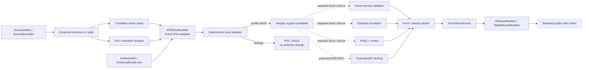

<!-- [KFM_META_BLOCK_V2]
doc_id: kfm://doc/architecture/publication/geo-manifest
title: KFM Geo Manifest — Architecture and Current Fixture Profile
type: architecture-reference
version: v2.0-draft
status: draft; repository-grounded; fixture-first; evidence-integrity-support; non-signing; no-release; no-publication; ADR-0023-proposed; instance-home-HOLD
owners:
  - "@bartytime4life — verified CODEOWNERS review route"
  - "NEEDS VERIFICATION — independent evidence, geospatial, policy, security/signing, release, correction, and rollback stewardship"
created: 2026-05-14
updated: 2026-08-19
policy_label: public; architecture; publication; geo-manifest; evidence-integrity; fixture-first; cite-or-abstain; fail-closed; non-release; non-publication
owning_root: docs/
current_path: docs/architecture/publication/GEO_MANIFEST.md
responsibility: >-
  Explain the KFMGeoManifest evidence/integrity support boundary, its current
  fixture-first repository profile, its relationships to carrier-specific
  validation and release governance, and its open holds without replacing
  semantic contracts, machine schemas, policy, evidence, review, release
  records, runtime behavior, or publication authority.
truth_posture: >-
  CONFIRMED tracked same-path document, accepted Directory Rules v2 placement,
  closed Draft 2020-12 fixture profile, deterministic no-network validator,
  synthetic positive/negative corpus, focused tests, and read-only workflow /
  PROPOSED KFMGeoManifest semantic profile and ADR-0023 cryptographic release
  rule / HOLD signer trust, carrier-format conformance, evidence and policy
  resolution, non-fixture instance placement, promotion, release, serving,
  correction propagation, and rollback execution / UNKNOWN production
  instances, deployed consumers, current public behavior, and operational
  signing or release services / NEEDS VERIFICATION accountable stewards,
  accepted hash and signature profiles, exact-head hosted checks, instance-home
  decision, and the first governed carrier release.
evidence_snapshot:
  repository: bartytime4life/Kansas-Frontier-Matrix
  base_ref: main
  base_commit: 996b7e16d46a703c9436b26ef74ed0ecaf87796a
  target_prior_blob: c6af4e5c002f0ec8caf30f4b751368d5bc4d09af
  directory_rules_blob: fd49a0b83e55cef52c1124281f093e263526898d
  codeowners_blob: dd2a84aa514d8ecd9208bc347f90f9a2ed37dd61
  semantic_contract_blob: c7993b8bf8fbcbf01f0947a99a14d81509e89370
  machine_schema_blob: fcaa128400e7ef8dbf9fad15de797928dd133451
  fixture_readme_blob: b0af76ac26f2720a34d23e169fb47faf7f8db028
  focused_tests_blob: 680fec23e284df633c2f8edb1dd499c51a3649f9
  dedicated_workflow_blob: fa476a9d2d3ee7c855d1d86debd68de332ac7554
  release_objects_blob: 5eb63909448a5353367852c4302348506a0b0bfe
  map_release_contract_blob: e2a70bdd659cf432901ee9d5544b8e1418c23e60
  pmtiles_standard_blob: 372845bd9ee9877a96de2d01d824e003d22010b5
  data_manifests_compatibility_blob: 8e7e70c52b02990c87194bdc28c04e6849903bec
  data_geo_compatibility_blob: fbff970d99a6244ed1dad6f664a0831fbdcf8a64
  release_manifests_readme_blob: c699a527ff11bebad6a874ed1a37aa3a8213b86c
inspection_boundary: >-
  Current-session GitHub reads covered this complete document, accepted
  Directory Rules adoption, CODEOWNERS, the KFMGeoManifest semantic contract,
  schema, fixtures, validator, tests, workflow, proposed ADR-0023, PMTiles and
  COG integrity boundaries, map release semantics, publication architecture,
  and manifest compatibility lanes. No mounted checkout, local repository-native
  test execution, private key, signer registry, transparency service, real
  PMTiles/COG/GeoParquet/GeoJSON conformance vector, release registry,
  deployment, CDN, public endpoint, cache, correction propagation, or rollback
  operation was exercised.
related:
  - README.md
  - release-objects.md
  - release-state-machine.md
  - RELEASE_GATES.md
  - ROLLBACK.md
  - CORRECTION.md
  - ../../adr/ADR-0013-spec_hash-and-run_id-identity-grammar.md
  - ../../adr/ADR-0023-geo-manifest-signs-every-pmtiles-cog-release.md
  - ../../adr/ADR-0029-adopt-directory-governance-standard-v2.md
  - ../../doctrine/directory-rules.md
  - ../../../contracts/evidence/kfm_geo_manifest.md
  - ../../../schemas/contracts/v1/evidence/kfm_geo_manifest.schema.json
  - ../../../fixtures/evidence/kfm_geo_manifest/README.md
  - ../../../tools/validators/evidence/validate_kfm_geo_manifest.py
  - ../../../tests/validators/test_validate_kfm_geo_manifest.py
  - ../../../.github/workflows/kfm-geo-manifest-validation.yml
tags: [kfm, architecture, publication, geo-manifest, pmtiles, cog, geoparquet, geojson, integrity, evidence, rollback]
notes:
  - "Same-path architecture-document modernization; placement outcome PLACE."
  - "The current executable profile is fixture-first and fixed to non-release/no-authority state."
  - "ADR-0023 remains proposed; this document neither accepts nor implements cryptographic release binding."
  - "No new instance home is selected; data/manifests remains compatibility-only and release/manifests owns release-governance records, not KFMGeoManifest metadata candidates."
  - "All sixteen legacy numbered section anchors are preserved."
[/KFM_META_BLOCK_V2] -->

<a id="top"></a>

# KFM Geo Manifest — Architecture and Current Fixture Profile

> **One-line purpose.** Explain how `KFMGeoManifest` binds one geospatial carrier candidate to deterministic identity, source/evidence references, spatial and temporal scope, derivation receipts, governance references, and correction/rollback lineage—without letting metadata validation impersonate carrier conformance, cryptographic trust, release, or publication.

[](#status-and-authority)
[](#7-validation-contract)
[](#7-validation-contract)
[](#cryptographic-and-release-hold)
[](#6-lifecycle-and-promotion-flow)
[](#9-trust-badges-and-runtime-consumption)

> [!IMPORTANT]
> **This page is explanatory architecture, not the `KFMGeoManifest` contract or schema.** Semantic meaning lives in [`contracts/evidence/kfm_geo_manifest.md`](../../../contracts/evidence/kfm_geo_manifest.md); machine shape lives in [`schemas/contracts/v1/evidence/kfm_geo_manifest.schema.json`](../../../schemas/contracts/v1/evidence/kfm_geo_manifest.schema.json). When this page and those authorities differ, the contract/schema pair controls its respective responsibility.

> [!CAUTION]
> **The checked-in profile is intentionally non-releasing.** Its schema fixes `release_state` to `not_released`, `release_manifest_ref` to `null`, `public_use_allowed` to `false`, and `authority_created` to `false`. Passing validation cannot be converted into a release badge, public URL, or publication decision.

> [!WARNING]
> **Metadata integrity is not carrier conformance or evidentiary truth.** The synthetic payloads are not real PMTiles, COG, GeoParquet, or production GeoJSON files. The current validator does not parse those formats, resolve evidence, evaluate policy, authenticate review, verify signatures, apply promotion, mutate release state, serve bytes, or execute correction/rollback.

**Quick navigation:** [Status](#status-and-authority) · [Purpose](#1-purpose) · [Boundary](#2-what-this-is--is-not) · [Architecture](#3-position-in-the-publication-architecture) · [Relationships](#4-object-family-relationships) · [Shape](#5-required-and-optional-fields) · [Lifecycle](#6-lifecycle-and-promotion-flow) · [Validation](#7-validation-contract) · [Failures](#8-failure-conditions-and-deny-table) · [Runtime](#9-trust-badges-and-runtime-consumption) · [Anti-patterns](#10-anti-patterns-register) · [Correction](#11-rollback-correction-and-withdrawal) · [Example](#12-worked-example-illustrative) · [Placement](#13-directory-placement-basis) · [Related](#14-related-docs) · [Open work](#15-open-verification-items) · [Evidence](#16-source-attribution)

---

<a id="status-and-authority"></a>

## Status and authority

| Question | Current bounded answer |
|---|---|
| Does this architecture page exist at the stated path? | **CONFIRMED.** It is tracked at `docs/architecture/publication/GEO_MANIFEST.md`. |
| Is same-path placement accepted? | **CONFIRMED.** Accepted ADR-0029 adopts Directory Rules v2; an explanatory publication-architecture page remains under `docs/architecture/publication/`. Placement outcome: **PLACE**. |
| What is implemented? | A **PROPOSED fixture-first profile** with a closed Draft 2020-12 schema, deterministic no-network validator, synthetic fixtures, 15 focused tests, and a read-only dedicated workflow. |
| What does the profile prove? | Bounded metadata shape and local consistency; optional exact SHA-256/byte-length binding to supplied local fixture bytes. |
| What does it not prove? | Carrier-format conformance, evidence existence/sufficiency, policy or review authority, signature trust, promotion, release persistence, deployment, public serving, publication, or rollback execution. |
| What is ADR-0023's status? | **PROPOSED.** It is not accepted or implemented by this page or by the fixture profile. |
| Is a canonical emitted-instance home established? | **HOLD.** `data/manifests/` is a non-canonical compatibility subtree; `release/manifests/` is for release-governance records. This task found no accepted non-fixture `KFMGeoManifest` instance lane. |
| Who is the verified GitHub review route? | **CONFIRMED:** `@bartytime4life` through CODEOWNERS. Independent evidence, policy, security, release, correction, and rollback stewardship remains **NEEDS VERIFICATION**. |
| Does this revision release or publish anything? | **No.** Documentation only. |

### Current evidence matrix

| Surface | CONFIRMED repository state | Boundary |
|---|---|---|
| Semantic contract | Draft v0.3 contract defines carrier-candidate metadata and explicit non-authority | Contract is proposed; no release effect |
| Machine schema | Closed Draft 2020-12 `fixture-first-v1` profile | Machine shape only |
| Validator | Deterministic local parser and semantic checker under `tools/validators/evidence/` | No network, no signer, no evidence/policy resolver |
| Fixtures | Three valid, four schema-invalid, eleven semantic/local-byte negative vectors | Tiny synthetic bytes; no format conformance |
| Tests | 15 focused tests including parser safety, no-network behavior, exact finding codes, and byte binding | Focused profile only |
| Workflow | Read-only path-scoped workflow with SHA-pinned actions | This documentation path is not in its trigger filters |
| PMTiles integrity | Separate structural attestation profile exists | Cryptographic verification and accepted canonical composition remain held |
| COG integrity | Separate synthetic whole-file/range SHA-256 candidate exists | Payload is not TIFF/COG; no binary conformance |
| Map release | Fixture-first `MapReleaseManifest` specialization exists | No authenticated release, cache mutation, serving, or rollback |
| Production instances/consumers | No non-fixture instance or direct runtime consumer was established in this inspection | **UNKNOWN / NEEDS VERIFICATION** |

[Back to top](#top)

---

<a id="1-purpose"></a>

## 1. Purpose

`KFMGeoManifest` is an **evidence/integrity support object for one geospatial artifact candidate**. Its current semantic contract requires enough information to inspect:

- stable manifest identity and version;
- the artifact's type, role, media type, byte length, SHA-256 digest, and source-artifact references;
- claim, geography, and temporal scope;
- source role and references to `EvidenceBundle`, `EvidenceRef`, and `SourceDescriptor`;
- CRS, bounding box, geometry type, scale or resolution, and an optional PMTiles tiling profile;
- the ordered derivation chain, parameters digest, transform receipts, and final artifact binding;
- rights, sensitivity, policy, review, rollback, release, and public-use posture;
- correction, supersession, and rollback lineage; and
- explicit limitations.

The object belongs in the publication architecture because a release may require this integrity support. It remains an **adjacent support family**, not a release-governance record. [`release-objects.md`](release-objects.md) owns the broader architecture distinction.

### Current bounded capability

The executable profile supports metadata for four carrier families:

| Carrier metadata family | Shape admitted by schema | Complete positive fixture currently present | Format conformance proved |
|---|---:|---:|---:|
| PMTiles | yes | yes | no |
| Cloud-Optimized GeoTIFF metadata | yes | yes | no |
| GeoParquet metadata | yes | no | no |
| GeoJSON metadata | yes | yes | no |

The absence of a positive GeoParquet vector is not a schema prohibition; it is a current fixture-coverage gap.

### Core rule

```text
KFMGeoManifest PASS
  != carrier-format conformance
  != evidence closure
  != policy allowance
  != authenticated review
  != signature trust
  != PromotionDecision
  != ReleaseManifest
  != deployment
  != publication
```

[Back to top](#top)

---

<a id="2-what-this-is--is-not"></a>

## 2. What this is / is not

| This **is** | This is **not** |
|---|---|
| Metadata about one geospatial carrier candidate | The carrier bytes themselves |
| A deterministic fixture-first integrity and lineage profile | A universal geospatial packaging standard |
| A reference graph across sources, evidence, transforms, policy/review, and rollback | Evidence resolution or proof that refs exist |
| Optional exact binding to supplied local bytes by SHA-256 and byte length | PMTiles, TIFF/COG, Parquet, or GeoJSON parser proof |
| A candidate input to proofs, release review, or map-release assembly | `PromotionDecision`, `ReleaseManifest`, or `MapReleaseManifest` |
| A place to declare rights and sensitivity state | The authority that decides rights or sensitivity |
| A place to require generalization/redaction receipts | The transform, receipt producer, or policy evaluator |
| An immutable, versioned metadata candidate | A mutable `latest` alias or public endpoint |
| A bounded no-network validation target | A live registry, signing service, catalog resolver, or public API |
| A support object whose current authority flags are fixed false | Release or publication authority |

### Non-substitution rule

The following families may reference one another but remain separate:

```text
artifact bytes
  -> KFMGeoManifest
  -> validation findings / local-byte result
  -> EvidenceRef / EvidenceBundle
  -> PolicyDecision
  -> ReviewRecord
  -> ProofPack / catalog closure
  -> PromotionDecision
  -> ReleaseManifest / MapReleaseManifest
  -> released public-safe carrier
  -> correction / withdrawal / rollback
```

No arrow means that the upstream object can create the downstream authority.

[Back to top](#top)

---

<a id="3-position-in-the-publication-architecture"></a>

## 3. Position in the publication architecture

The manifest becomes meaningful after a geospatial derivative exists in a governed processing lane. In the current fixture profile, it remains a non-releasing candidate even when all local checks pass.


```mermaid
flowchart LR
    SRC["SourceArtifact / SourceDescriptor"] --> BUILD["Governed transform or build"]
    BUILD --> BYTES["Candidate carrier bytes"]
    BUILD --> RR["Run / transform receipts"]
    BYTES --> GM["KFMGeoManifest<br/>fixture-first metadata"]
    RR --> GM
    ER["EvidenceRef / EvidenceBundle refs"] --> GM
    GM --> VAL["Deterministic local validator"]
    VAL -->|profile PASS| SUPPORT["Integrity support candidate"]
    VAL -->|findings| HOLD["FAIL / HOLD<br/>no authority change"]

    SUPPORT -. separate future closure .-> FMT["Carrier-format validation"]
    SUPPORT -. separate future closure .-> EVID["Evidence resolution"]
    SUPPORT -. separate future closure .-> POL["Policy + review"]
    SUPPORT -. proposed ADR-0023 .-> SIG["Cryptographic binding"]
    FMT --> PACK["Proof / release packet"]
    EVID --> PACK
    POL --> PACK
    SIG --> PACK
    PACK --> PD["PromotionDecision"]
    PD --> RM["ReleaseManifest / MapReleaseManifest"]
    RM --> PUB["Released public-safe carrier"]

    style PUB stroke-dasharray: 5 5
```

> [!NOTE]
> Solid arrows show relationships established by current object boundaries. Dashed arrows show **separate held or proposed capability families**, not current execution. No runtime, release registry, signer service, or public carrier transition was exercised in this task.

### Lifecycle relationship

KFM's lifecycle remains:

```text
RAW -> WORK / QUARANTINE -> PROCESSED -> CATALOG / TRIPLETS -> PUBLISHED
```

`KFMGeoManifest` does not define a new lifecycle stage. It is support metadata that may accompany a processed or release-candidate derivative. A file's path, manifest presence, schema validity, or successful check does not promote it.

[Back to top](#top)

---

<a id="4-object-family-relationships"></a>

## 4. Object-family relationships

| Object or lane | Owns | Relationship to `KFMGeoManifest` | Current boundary |
|---|---|---|---|
| `SourceArtifact` | Captured source bytes and retrieval identity | Referenced by `artifact.source_artifact_refs` | Existence/authenticity not resolved by profile |
| `SourceDescriptor` | Source role, authority, rights, access, cadence | Referenced through `evidence.source_descriptor_refs` | Reference syntax only |
| `EvidenceRef` / `EvidenceBundle` | Claim-scoped evidence pointer and closure | Required reference arrays | Not resolved or authenticated |
| `RunReceipt` / transform receipt | What process ran and what transformation occurred | `derivation.receipt_refs` and per-transform `receipt_ref` | Reference syntax and transform continuity only |
| `PolicyDecision` | Rights, sensitivity, access, obligations | `governance.policy_decision_ref` | Not evaluated |
| Review record | Accountable reviewer, role, basis, disposition | `governance.review_ref` | Not authenticated |
| `KFMGeoManifest` | Carrier-candidate metadata and local consistency | This object | Fixed non-release state |
| PMTiles attestation | PMTiles-specific structural/archive/sidecar binding | Separate format-specific support | Cryptographic trust remains HOLD |
| COG byte-range integrity candidate | Synthetic whole-file and declared-range SHA-256 replay | Separate format-specific support | Does not parse TIFF or prove COG |
| `ProofPack` | Bounded release-support component closure | May include a geo manifest as one component | PASS is not release authority |
| `CatalogMatrix` / STAC / DCAT / PROV | Discovery and catalog closure | May reference the artifact and manifest | Catalog is not evidence or release |
| `PromotionDecision` | Accountable lifecycle decision | May reference validated support | Not created by manifest validation |
| `ReleaseManifest` | General release inventory and trust refs | May reference manifest by stable ref/digest | Fixture validation does not persist release |
| `MapReleaseManifest` | Map-specific release/publication envelope | May bind carrier integrity and public-boundary refs | Current profile is fixture-first/inactive |
| `CorrectionNotice` / `WithdrawalNotice` | Public correction or withdrawal | May reference affected release/artifact/manifest | Propagation not executed |
| `RollbackCard` | Governed reversal target and invalidation plan | May refer transitively to prior manifest set | Rollback not executed |
| MapLibre / governed API | Public delivery and trust-visible projection | Must consume released state, not candidate metadata directly | Direct consumer not established |

### Cryptographic and release hold

<a id="cryptographic-and-release-hold"></a>

[ADR-0023](../../adr/ADR-0023-geo-manifest-signs-every-pmtiles-cog-release.md) proposes that released PMTiles and COG carriers receive an approved cryptographic binding over a versioned geo-manifest payload. The ADR remains **proposed**.

Current repository evidence establishes partial prerequisites, not the decision's completed state:

- KFMGeoManifest fixture validation exists.
- PMTiles structural attestation exists.
- A synthetic COG range-integrity candidate exists.
- `MapReleaseManifest` fixture semantics exist.
- PMTiles cryptographic verification and trusted-key evaluation remain held.
- No accepted shared signer profile, trust-root registry, revocation policy, production signed carrier, release transition, serving anti-bypass proof, correction propagation, or rollback rehearsal was verified.

[Back to top](#top)

---

<a id="5-required-and-optional-fields"></a>

## 5. Required and optional fields

The **authoritative current field list** is the machine schema, not this prose. The table below summarizes its major groups without creating a second shape authority.

### Required top-level groups

| Group | Current machine intent |
|---|---|
| `object_type` | Constant `KFMGeoManifest` |
| `schema_version` | Constant `1.0.0` |
| `profile_id` | Constant `fixture-first-v1` |
| `hash_profile` | Constant `kfm-fixture-json-v1` |
| `id` | Stable `geo-manifest:...` identifier |
| `version` | Semantic-version-shaped profile version |
| `spec_hash` | `sha256:<64 lowercase hex>` over the profile-local projection |
| `artifact` | Ref, type, role, media type, byte length, digest, source-artifact refs |
| `claim_scope` | Scope ref, description, geography ref, valid-time bounds |
| `source_role` | `derived`, `modeled`, `context`, or `observation_projection` |
| `evidence` | EvidenceBundle, EvidenceRef, and SourceDescriptor refs |
| `spatial` | CRS, bbox, geometry type, scale/resolution, optional tiling profile |
| `derivation` | Parameters digest, ordered transforms, receipt refs |
| `governance` | Rights, sensitivity, policy/review/rollback refs, fixed non-release state |
| `lineage` | Supersession, correction, and rollback references |
| `limitations` | Explicit bounded limitations |

### Artifact profile

| Field | Current accepted values or rule |
|---|---|
| `artifact_type` | `pmtiles`, `cog`, `geoparquet`, `geojson` |
| `artifact_role` | `release_candidate`, `generalized_derivative`, `rollback_target` |
| `media_type` | Fixed value corresponding to `artifact_type` |
| `byte_length` | Positive integer, capped by the fixture profile |
| `content_digest` | SHA-256 |
| `source_artifact_refs` | Non-empty, sorted, unique refs |

### Spatial profile

| Surface | Current rule |
|---|---|
| CRS | `EPSG:<code>` or an OGC CRS URI |
| Bounding box | Four numbers with ordered minima/maxima; EPSG:4326 ranges checked |
| Geometry | Common vector types plus `Raster` and `VectorTileSet` |
| Scale/resolution | Zoom range, ground resolution in metres, or nominal scale denominator |
| PMTiles tiling | `xyz`, tile size 256 or 512, bounded min/max zoom |
| Non-PMTiles tiling | Must be `null` |

### Derivation and governance

| Surface | Current rule |
|---|---|
| Transform chain | Unique transform IDs; each output digest feeds the next input; final output equals artifact digest |
| Transform operations | Reproject, clip, simplify, aggregate, generalize, redact, join, tile, rasterize, encode |
| Sensitive transforms | `generalized` or `redacted` posture requires the matching receipted transform |
| Public-bound candidate refs | Verified-open rights, public-safe sensitivity, policy ref, review ref, rollback ref |
| Release state | Constant `not_released` |
| Release manifest ref | Constant `null` |
| Public use | Constant `false` |
| Authority created | Constant `false` |

### Deterministic hash boundary

The current validator:

1. removes only the top-level `spec_hash` field;
2. serializes the remaining object as UTF-8 JSON with sorted keys, compact separators, ASCII escaping, and non-finite values denied; and
3. computes SHA-256 using the repository's current bare digest grammar.

This profile is named `kfm-fixture-json-v1`. It is **not** represented as RFC 8785/JCS, a universal KFM identity profile, or an accepted resolution of [ADR-0013](../../adr/ADR-0013-spec_hash-and-run_id-identity-grammar.md). A later hash-policy change must migrate contract, schema, fixtures, validator, producers, consumers, receipts, and compatibility tests together.

[Back to top](#top)

---

<a id="6-lifecycle-and-promotion-flow"></a>

## 6. Lifecycle and promotion flow

### Current executable flow

```text
synthetic manifest + optional synthetic local payload
  -> bounded safe parser
  -> Draft 2020-12 shape validation
  -> deterministic spec_hash replay
  -> spatial / derivation / governance / lineage checks
  -> optional SHA-256 + byte-length replay
  -> PASS or stable findings
  -> no state mutation
```

The validator is a read-only assessment. It does not write a `PolicyDecision`, `ReviewRecord`, `PromotionDecision`, `ReleaseManifest`, proof, catalog record, correction notice, or rollback record.

### Future release-significant flow

A carrier may become eligible for a governed release only through a separate dependency-closed composition such as:

```text
real carrier bytes and format profile
  + KFMGeoManifest
  + exact local/remote byte verification
  + SourceDescriptor and EvidenceBundle closure
  + rights and sensitivity decision
  + accountable review
  + carrier-specific integrity/signature support
  + proof and catalog closure
  + PromotionDecision
  + ReleaseManifest / MapReleaseManifest
  + correction, withdrawal, and rollback support
  + authorized persistence and serving operation
  = eligible release transition
```

Every term remains separately owned and independently reviewable. Current repository evidence does not establish this full path operating over a production carrier.

### Current fixed non-effects

```json
{
  "release_manifest_ref": null,
  "release_state": "not_released",
  "public_use_allowed": false,
  "authority_created": false
}
```

These values are machine-enforced trust boundaries in the current profile, not documentation advice.

[Back to top](#top)

---

<a id="7-validation-contract"></a>

## 7. Validation contract

### Repository-native commands

```bash
KFM_NO_NETWORK=1 python -m unittest discover \
  --start-directory tests/validators \
  --pattern 'test_validate_kfm_geo_manifest.py' \
  --verbose

KFM_NO_NETWORK=1 python \
  tools/validators/evidence/validate_kfm_geo_manifest.py \
  --fixtures
```

The dedicated workflow also checks the Draft 2020-12 meta-schema and its generated authoring receipt. Its current path filters do **not** include this architecture page, so a documentation-only change to `GEO_MANIFEST.md` does not exercise the dedicated implementation workflow.

### Current test inventory

| Fixture/test family | Count | What it proves |
|---|---:|---|
| Positive metadata/payload vectors | 3 | PMTiles, generalized COG, and GeoJSON candidate metadata plus exact tiny local-byte binding |
| Closed-schema negatives | 4 | Unknown/missing/invalid shape is rejected |
| Schema-valid semantic/local-byte negatives | 11 | Exact reviewed finding-code sets fire |
| Focused unit tests | 15 | Shape, semantics, parser safety, determinism, no-network behavior, bounded diagnostics, fixture CLI |

### Validator checks

The current validator covers:

- safe regular-file input, size bounds, UTF-8 JSON, duplicate-key rejection, finite numbers, and nesting limits;
- Draft 2020-12 schema validation with bounded findings;
- non-placeholder SHA-256 values and profile-local `spec_hash` replay;
- artifact-type/media-type compatibility;
- bounding-box order and EPSG:4326 range;
- PMTiles tiling and zoom consistency;
- transform ID uniqueness, chain continuity, and final artifact digest;
- receipted generalization/redaction where sensitivity state requires it;
- public-bound candidate rights, sensitivity, policy, review, and rollback references;
- supersession, correction, rollback, self-reference, and temporal ordering;
- sorted/unique reference arrays; and
- optional exact local payload digest and byte length.

### What a PASS means

A PASS means:

> the supplied object conforms to the checked fixture profile and its declared local relationships are internally consistent; when a payload path is supplied, those exact bytes match the declared SHA-256 and byte length.

A PASS does **not** mean:

- the tiny fixture payload is valid PMTiles, TIFF/COG, Parquet, or GeoJSON;
- external refs resolve;
- evidence is sufficient;
- rights/sensitivity were independently decided;
- review was performed by an authorized actor;
- a signature is authentic;
- ADR-0023 is accepted;
- a promotion/release occurred; or
- any public client may use the carrier.

### Hosted evidence posture

The repository contains a dedicated workflow and historical exact-head evidence for the implementation slice. A later ADR inspection also recorded a generated-receipt digest drift while functional profile steps passed. This task did not rerun or classify the dedicated workflow at current `main`; current hosted status therefore remains **NEEDS VERIFICATION** rather than “green” or “broken.”

[Back to top](#top)

---

<a id="8-failure-conditions-and-deny-table"></a>

## 8. Failure conditions and DENY table

The legacy title of this section is retained for stable links. The current validator emits **finding codes and a failed validation result**; it does not itself issue an outward `DENY` or `ABSTAIN` policy decision. A later policy/release gate may map validated findings into its own finite vocabulary.

### Representative parser and shape findings

| Finding family | Representative codes | Meaning |
|---|---|---|
| Unsafe input | `FILE_TOO_LARGE`, `UNSAFE_FILE`, `DUPLICATE_KEY`, `NONFINITE_NUMBER`, `JSON_COMPLEXITY_LIMIT` | Input cannot safely enter validation |
| Shape failure | schema findings plus `SCHEMA_FINDINGS_TRUNCATED` | Object does not satisfy the closed fixture schema |
| Identity/digest | `PLACEHOLDER_DIGEST`, `SPEC_HASH_MISMATCH`, `SPEC_HASH_EVALUATION_ERROR` | Declared identity is missing, placeholder, or unreplayable |
| Artifact/media | `MEDIA_TYPE_MISMATCH` | Carrier type and media type disagree |
| Spatial | `BBOX_ORDER_INVALID`, `BBOX_CRS_RANGE_INVALID` | Spatial declaration is internally invalid |
| Tiling/scale | `TILING_PROFILE_REQUIRED`, `TILING_PROFILE_UNEXPECTED`, `TILE_SCALE_PROFILE_REQUIRED`, `TILING_PROFILE_SCALE_MISMATCH`, `ZOOM_RANGE_INVALID` | Carrier and scale/tiling declarations disagree |
| Derivation | `TRANSFORM_ID_DUPLICATE`, `TRANSFORM_CHAIN_BROKEN`, `ARTIFACT_TRANSFORM_OUTPUT_MISMATCH` | Transform lineage cannot bind the declared artifact |
| Sensitivity transform | `SENSITIVITY_TRANSFORM_RECEIPT_REQUIRED`, `GENERALIZED_ROLE_POSTURE_MISMATCH` | Public-safe transform posture lacks matching evidence |
| Candidate governance | `PUBLIC_CANDIDATE_RIGHTS_BLOCKED`, `PUBLIC_CANDIDATE_SENSITIVITY_BLOCKED`, `POLICY_REFERENCE_REQUIRED`, `REVIEW_REFERENCE_REQUIRED`, `ROLLBACK_REFERENCE_REQUIRED` | Candidate prerequisites are absent or unsafe |
| Lineage/time | `SELF_LINEAGE_REFERENCE`, `SUPERSESSION_CORRECTION_REQUIRED`, `ROLLBACK_LINEAGE_REQUIRED`, `ROLLBACK_LINEAGE_UNEXPECTED`, `TEMPORAL_SCOPE_INVALID` | Correction/rollback/time relationships are incoherent |
| Reference canonicality | `REFERENCE_ARRAY_NOT_CANONICAL` | Set-like refs are not sorted and unique |
| Local bytes | `PAYLOAD_LENGTH_MISMATCH`, `PAYLOAD_DIGEST_MISMATCH` | Supplied local bytes do not match the manifest |

### Fail-closed interpretation

| Condition after validation | Safe next posture |
|---|---|
| Parser or schema cannot establish a bounded object | Stop; correct or quarantine the candidate |
| Identity, transform, spatial, or local-byte binding fails | Stop; no proof/release packet |
| Rights or sensitivity is unknown/blocked | Hold or deny the public-bound operation through policy authority |
| Required evidence/policy/review/rollback refs are absent | Hold; do not infer closure |
| Format-specific conformance is not checked | Keep capability claim narrowed to metadata/local-byte integrity |
| Signature or signer trust is unavailable | Cryptographic release path remains HOLD |
| Release/correction/rollback operation is unavailable | No public transition |

[Back to top](#top)

---

<a id="9-trust-badges-and-runtime-consumption"></a>

## 9. Trust badges and runtime consumption

The legacy section name is preserved, but **no direct runtime trust-badge consumer was established in this task**.

### Governing runtime rule

A public client must not decide trust from a candidate `KFMGeoManifest` alone. Any trust-visible state should come through a governed API or released public-safe artifact envelope that composes, at minimum:

- current `ReleaseManifest` or `MapReleaseManifest` state;
- evidence and policy posture appropriate to the displayed claim;
- review and signature/attestation state where required;
- stale, correction, withdrawal, supersession, and rollback state; and
- a safe public explanation that does not leak restricted reasons.

### Allowed projections

| Candidate display | Current safe posture |
|---|---|
| “Metadata profile valid” in an internal review tool | Possible after bounded validation; must say what was not checked |
| “Bytes match declared SHA-256” | Only when exact local bytes were supplied and matched |
| “Format-conformant PMTiles/COG/GeoParquet/GeoJSON” | **Not supported by KFMGeoManifest validation** |
| “Signed” or “trusted signer” | **Not supported** |
| “Evidence resolved” | **Not supported** |
| “Policy allowed” | **Not supported** |
| “Released” / “published” | **Forbidden from this profile** |
| Public map layer availability | Requires separate governed release and serving evidence |

### Client anti-bypass

Public clients must not read:

- `fixtures/evidence/kfm_geo_manifest/`;
- `data/manifests/` compatibility lanes;
- WORK, QUARANTINE, candidate, proof-support, or release-review stores;
- a carrier URL merely because it appears inside a candidate manifest; or
- direct model output or generated prose as fallback trust state.

[Back to top](#top)

---

<a id="10-anti-patterns-register"></a>

## 10. Anti-patterns register

| Anti-pattern | Why it fails | Required response |
|---|---|---|
| Treating `KFMGeoManifest` as a release manifest | Collapses evidence/integrity support into release governance | Keep `PromotionDecision` and release manifests separate |
| Treating schema PASS as evidence or policy closure | Shape does not authenticate refs or decisions | Resolve and review through owning authorities |
| Calling tiny synthetic payloads PMTiles/COG conformance vectors | Fixtures intentionally are not production geospatial formats | Add separate real-format fixture and parser profiles |
| Adding signature fields to this doc and claiming signing exists | ADR-0023, trust roots, key policy, verification, revocation, and release wiring remain held | Implement only through accepted decision and dependency-closed profile |
| Treating PMTiles structural PMSIG shape as cryptographic verification | Shape parsing cannot prove signature authenticity or signer trust | Preserve cryptographic HOLD |
| Treating COG range SHA-256 replay as TIFF/COG conformance | The current range fixture is not a TIFF | Use a real binary conformance validator before broader claims |
| Writing new instances under `data/manifests/` because the path exists | The subtree is non-canonical compatibility debt | HOLD instance placement; classify through Directory Rules |
| Writing KFMGeoManifest records under `release/manifests/` | That lane is for release-governance manifests | Keep evidence/integrity metadata distinct |
| Embedding full EvidenceBundles or policy decisions | Creates parallel authority and stale copies | Carry stable refs only |
| Using mutable URLs or tags as identity | Breaks replay and rollback | Bind immutable refs and digests |
| Hiding sensitive geometry in MapLibre styles | The bytes remain recoverable | Generalize/redact upstream and require receipts |
| Letting environment/timestamps change `spec_hash` | Identity becomes non-deterministic | Follow the named profile projection |
| Calling a green workflow “published” | Validation and publication are different state axes | Report exact bounded result only |
| Loading candidate bytes in the browser for convenience | Bypasses the trust membrane | Serve only governed released carriers |
| Silently editing a relied-on manifest | Destroys audit and correction lineage | Supersede/correct append-only records |

[Back to top](#top)

---

<a id="11-rollback-correction-and-withdrawal"></a>

## 11. Rollback, correction, and withdrawal

`KFMGeoManifest` carries lineage references that help a release system reason about correction and rollback. It does not execute those operations.

### Current profile fields

| Lineage/governance field | Current purpose |
|---|---|
| `lineage.supersedes` | Names a prior manifest identity |
| `lineage.correction_refs[]` | Names associated correction records |
| `lineage.rollback_of` | Names the release/manifest identity for which this candidate is a rollback target |
| `governance.rollback_ref` | Required support ref for public-bound artifact roles |
| `governance.release_manifest_ref` | Fixed `null` in current profile |

The validator enforces selected local coherence:

- a manifest cannot supersede or roll back itself;
- supersession requires a correction reference;
- `rollback_target` requires `rollback_of`;
- non-rollback roles cannot claim `rollback_of`; and
- a public-bound candidate requires a rollback reference.

### Operational separation

| Operation | Owning release object/process | KFMGeoManifest role |
|---|---|---|
| Correction | `CorrectionNotice` plus successor/withdrawal/public propagation | Preserve affected/successor references |
| Withdrawal | `WithdrawalNotice` and invalidation across consumers | Be referenced by affected release graph |
| Rollback | `RollbackCard`, accountable decision, restoration/invalidation receipts | Describe candidate rollback carrier metadata |
| Supersession | Release/manifest lineage and correction state | Carry append-only candidate lineage |
| Cache/index/UI/AI invalidation | Authorized operations and consumer-specific receipts | No direct execution authority |

The current fixture profile does not mutate aliases, caches, indexes, APIs, MapLibre sources, service workers, exports, AI retrieval, release records, or published bytes.

[Back to top](#top)

---

<a id="12-worked-example-illustrative"></a>

## 12. Worked example (illustrative)

The following is a **non-valid excerpt** showing the current group names and fixed non-release boundary. Omitted groups are represented by comments. Complete machine-valid examples live in [`fixtures/evidence/kfm_geo_manifest/valid_cases.json`](../../../fixtures/evidence/kfm_geo_manifest/valid_cases.json).

```jsonc
{
  "object_type": "KFMGeoManifest",
  "schema_version": "1.0.0",
  "profile_id": "fixture-first-v1",
  "hash_profile": "kfm-fixture-json-v1",
  "id": "geo-manifest:synthetic:pmtiles-release-candidate:v1",
  "version": "1.0.0",
  "spec_hash": "sha256:<64-lowercase-hex>",

  "artifact": {
    "artifact_ref": "artifact:synthetic:pmtiles-release-candidate:v1",
    "artifact_type": "pmtiles",
    "artifact_role": "release_candidate",
    "media_type": "application/vnd.pmtiles",
    "byte_length": 39,
    "content_digest": "sha256:<64-lowercase-hex>",
    "source_artifact_refs": [
      "source-artifact:synthetic:pmtiles-release-candidate:input"
    ]
  },

  "claim_scope": {
    "scope_ref": "claim-scope:synthetic:pmtiles-release-candidate",
    "description": "Synthetic fixture scope; no real geospatial claim.",
    "geography_ref": "geography:synthetic:kansas-generalized",
    "temporal_scope": {
      "valid_from": "2026-01-01T00:00:00Z",
      "valid_to": "2026-12-31T23:59:59Z"
    }
  },

  "source_role": "derived",

  // evidence, spatial, and derivation groups omitted from this excerpt

  "governance": {
    "rights_state": "verified_open",
    "sensitivity_state": "public",
    "policy_decision_ref": "policy-decision:synthetic:example",
    "review_ref": "review:synthetic:example",
    "rollback_ref": "rollback:synthetic:example",
    "release_manifest_ref": null,
    "release_state": "not_released",
    "public_use_allowed": false,
    "authority_created": false
  },

  "lineage": {
    "supersedes": null,
    "correction_refs": [],
    "rollback_of": null
  },

  "limitations": [
    "Fixture-only metadata; no carrier-format conformance.",
    "No evidence, policy, review, signature, release, or public-use authority."
  ]
}
```

Do not copy this excerpt as a fixture or producer template. Use the schema and complete checked-in fixture corpus.

[Back to top](#top)

---

<a id="13-directory-placement-basis"></a>

## 13. Directory placement basis

Accepted [ADR-0029](../../adr/ADR-0029-adopt-directory-governance-standard-v2.md) adopts the exact Directory Rules v2 bytes. The rule “a path is an authority claim” applies here.

### Current path result

| Artifact | Authority owner | Current home | Result |
|---|---|---|---|
| Human architecture explanation | Documentation/architecture | `docs/architecture/publication/GEO_MANIFEST.md` | **PLACE** |
| Semantic meaning | Evidence contract | `contracts/evidence/kfm_geo_manifest.md` | **CONFIRMED current contract path** |
| Machine shape | Evidence schema | `schemas/contracts/v1/evidence/kfm_geo_manifest.schema.json` | **CONFIRMED current schema path** |
| Synthetic examples | Fixtures | `fixtures/evidence/kfm_geo_manifest/` | **CONFIRMED current fixture path** |
| Executable validation | Evidence validator | `tools/validators/evidence/validate_kfm_geo_manifest.py` | **CONFIRMED current validator path** |
| Enforceability tests | Tests | `tests/validators/test_validate_kfm_geo_manifest.py` | **CONFIRMED current test path** |
| Read-only orchestration | GitHub workflow | `.github/workflows/kfm-geo-manifest-validation.yml` | **CONFIRMED current workflow path** |

### Instance-home result

| Candidate home | Current finding | Placement result |
|---|---|---|
| `data/manifests/geo/` | Existing non-canonical compatibility/retirement lane; adjacent README is stale about newer implementation | **DENY new trust-bearing writes / migration follow-up** |
| `release/manifests/` | Release-governance manifest collection lane, with singular/plural conflict | **Not the KFMGeoManifest metadata instance authority** |
| A new parallel geo-manifest store | No accepted authority or migration record found | **DENY** |
| Existing evidence/data plane selected by an accepted object-instance decision | Not established in this inspection | **HOLD / NEEDS VERIFICATION** |

This documentation update does not select, create, migrate, or populate an emitted-instance lane.

[Back to top](#top)

---

<a id="14-related-docs"></a>

## 14. Related docs

### Publication architecture

- [`README.md`](README.md) — publication-lane reading model and current maturity
- [`release-objects.md`](release-objects.md) — release-governance records versus adjacent support families
- [`release-state-machine.md`](release-state-machine.md) — release-state architecture
- [`RELEASE_GATES.md`](RELEASE_GATES.md) — detailed proposed gate architecture and current holds
- [`ROLLBACK.md`](ROLLBACK.md) — rollback architecture
- [`CORRECTION.md`](CORRECTION.md) — correction architecture

### Decisions and doctrine

- [`ADR-0013`](../../adr/ADR-0013-spec_hash-and-run_id-identity-grammar.md) — proposed identity grammar
- [`ADR-0023`](../../adr/ADR-0023-geo-manifest-signs-every-pmtiles-cog-release.md) — proposed cryptographic carrier-binding rule
- [`ADR-0029`](../../adr/ADR-0029-adopt-directory-governance-standard-v2.md) — accepted Directory Rules v2 adoption
- [`Directory Rules`](../../doctrine/directory-rules.md) — placement authority

### Current implementation and fixtures

- [`KFMGeoManifest` semantic contract](../../../contracts/evidence/kfm_geo_manifest.md)
- [`KFMGeoManifest` schema](../../../schemas/contracts/v1/evidence/kfm_geo_manifest.schema.json)
- [Fixture profile](../../../fixtures/evidence/kfm_geo_manifest/README.md)
- [Validator](../../../tools/validators/evidence/validate_kfm_geo_manifest.py)
- [Focused tests](../../../tests/validators/test_validate_kfm_geo_manifest.py)
- [Dedicated workflow](../../../.github/workflows/kfm-geo-manifest-validation.yml)

### Carrier and release boundaries

- [PMTiles Attestation Standard](../../standards/pmtiles/PMTILES_ATTESTATION_STANDARD.md)
- [COG standard guidance](../../standards/COG.md)
- [COG byte-range integrity contract](../../../contracts/evidence/cog_byte_range_integrity_manifest.md)
- [MapReleaseManifest contract](../../../contracts/release/map_release_manifest.md)

### Compatibility and instance lanes

- [`data/manifests/` compatibility root](../../../data/manifests/README.md)
- [`data/manifests/geo/` compatibility lane](../../../data/manifests/geo/README.md)
- [`release/manifests/` release-record lane](../../../release/manifests/README.md)

[Back to top](#top)

---

<a id="15-open-verification-items"></a>

## 15. Open verification items

| ID | Open item | Current status | Smallest resolution path |
|---|---|---|---|
| `GM-OV-01` | Accountable evidence, geospatial, policy, security/signing, release, correction, and rollback stewards | **NEEDS VERIFICATION** | Approved stewardship assignments; do not infer from CODEOWNERS |
| `GM-OV-02` | Current exact-head status of the dedicated workflow and generated receipt | **NEEDS VERIFICATION** | Run/read exact-current-head workflow and classify functional vs receipt failures |
| `GM-OV-03` | Accepted cross-runtime hash/canonicalization policy | **HOLD / ADR-0013 proposed** | Accept or supersede hash profile; migrate all producers/consumers together |
| `GM-OV-04` | ADR-0023 cryptographic release rule | **PROPOSED** | Independent architecture, security, key-custody, policy, release, and rollback review |
| `GM-OV-05` | Approved signer/envelope/trust-root/rotation/revocation/transparency profile | **UNKNOWN / HOLD** | Dependency-closed cryptographic profile and negative fixtures |
| `GM-OV-06` | Canonical non-fixture KFMGeoManifest instance home | **HOLD** | Object-instance placement decision and migration plan; no parallel authority |
| `GM-OV-07` | Exhaustive non-fixture instance, writer, and consumer inventory | **UNKNOWN** | Recursive tree/code/history/runtime inventory |
| `GM-OV-08` | Real PMTiles conformance and signed-release vector | **HOLD** | Real fixture, accepted format profile, cryptographic verification, policy/release closure |
| `GM-OV-09` | Real TIFF/BigTIFF COG conformance and serving vector | **HOLD** | Binary parser/conformance, Range/CORS serving proof, semantic parity, release closure |
| `GM-OV-10` | GeoParquet positive vector and carrier-specific validation | **NEEDS VERIFICATION** | Add bounded real-format fixture and parser under accepted profile |
| `GM-OV-11` | GeoJSON positive vector that proves actual GeoJSON parsing, not only metadata/bytes | **NEEDS VERIFICATION** | Add separate format validator; preserve metadata-profile boundary |
| `GM-OV-12` | Evidence, policy, review, catalog, proof, and release reference resolution | **HOLD** | Governed resolver/evaluator integration with fail-closed negatives |
| `GM-OV-13` | Direct API/MapLibre/review-console consumer and trust-state parity | **UNKNOWN** | Inspect implementation and run representative runtime tests |
| `GM-OV-14` | Correction, withdrawal, cache/index/map/API/AI invalidation, and rollback rehearsal | **HOLD** | End-to-end synthetic drill with receipts and public-parity checks |
| `GM-OV-15` | Stale adjacent compatibility docs claiming schema stub/validator absence | **CONFIRMED documentation drift** | Separate same-path documentation update; do not broaden this PR |

[Back to top](#top)

---

<a id="source-attribution"></a>
<a id="16-source-attribution"></a>

## 16. Source attribution

This section is now a **repository evidence ledger**. Earlier editions cited planning PDFs and unmounted-repo assumptions as if they described current implementation. Current repository evidence controls current-state claims.

| Evidence | What it supports | Authority limit |
|---|---|---|
| `docs/adr/ADR-0029-adopt-directory-governance-standard-v2.md` + adopted Directory Rules bytes | Same-path `docs/architecture/publication/` placement and responsibility-root split | Placement only |
| `.github/CODEOWNERS` | `@bartytime4life` review routing | Not stewardship, independent approval, or release authority |
| `contracts/evidence/kfm_geo_manifest.md` | Current semantic meaning and explicit non-effects | Draft/proposed semantic profile |
| `schemas/contracts/v1/evidence/kfm_geo_manifest.schema.json` | Current machine fields, constants, enum sets, closed shape | Fixture-first shape only |
| `fixtures/evidence/kfm_geo_manifest/` | Exact synthetic positive/negative corpus and tiny payload scope | Not production format vectors |
| `tools/validators/evidence/validate_kfm_geo_manifest.py` | Current deterministic parser and semantic finding codes | No evidence/policy/signature/release authority |
| `tests/validators/test_validate_kfm_geo_manifest.py` | Focused enforceability, no-network, parser safety, byte binding | Bounded test profile |
| `.github/workflows/kfm-geo-manifest-validation.yml` | Read-only hosted orchestration and current path filters | Workflow presence is not current PASS |
| `docs/adr/ADR-0023-geo-manifest-signs-every-pmtiles-cog-release.md` | Proposed signing decision and current cryptographic/release holds | ADR remains proposed |
| `docs/standards/pmtiles/PMTILES_ATTESTATION_STANDARD.md` | Current PMTiles structural profile and cryptographic hold | No trusted signature or release |
| `contracts/evidence/cog_byte_range_integrity_manifest.md` + `docs/standards/COG.md` | Synthetic COG range integrity and binary/serving limitations | No TIFF/COG conformance or release |
| `contracts/release/map_release_manifest.md` | Map-specific release object boundary and fixture-first states | No release operation |
| `docs/architecture/publication/release-objects.md` | KFMGeoManifest classification as adjacent integrity support | Architecture explanation only |
| `data/manifests/README.md` and `data/manifests/geo/README.md` | Compatibility-only/non-canonical path posture | Adjacent implementation statements are stale |
| `release/manifests/README.md` | Release-governance manifest collection boundary | Does not own KFMGeoManifest candidate metadata |

### Current-session evidence limit

No private key, signer registry, trust root, transparency service, production carrier, public alias, CDN, object store, deployment, runtime log, release registry, cache, public endpoint, or operational correction/rollback action was inspected. Claims about those surfaces remain **UNKNOWN**, **NEEDS VERIFICATION**, or **HOLD**.

[Back to top](#top)

---

## Appendix A — No-loss reconciliation ledger

| Prior material | v2 treatment |
|---|---|
| Stable document ID and path | Preserved |
| Sixteen numbered sections and fragment anchors | Preserved |
| Carrier-candidate integrity purpose | Preserved and narrowed to current contract |
| PMTiles/COG/GeoParquet coverage | Preserved; GeoJSON added because current schema supports it |
| Spec-hash and digest guidance | Replaced with exact current `kfm-fixture-json-v1` behavior |
| `manifest_spec_hash` field | Removed; not present in current schema |
| BLAKE3/BAO/internal-chunk field proposals | Routed to carrier-specific standards/decisions; not represented as current KFMGeoManifest shape |
| DSSE/Cosign/Rekor fields | Reframed as proposed ADR-0023/signing backlog; not current schema |
| Stale validator path | Corrected to `tools/validators/evidence/validate_kfm_geo_manifest.py` |
| Stale fixture path | Corrected to `fixtures/evidence/kfm_geo_manifest/` |
| `data/manifests/` versus `release/manifests/` conflict | Reclassified: data path is compatibility-only; release path owns release records; non-fixture KFMGeoManifest instance home remains HOLD |
| Promotion and trust-badge flow | Bounded as future composition; no direct runtime consumer claimed |
| Worked `NEEDS_FILL` object | Replaced with a compact current-shape excerpt and links to complete fixtures |
| Planning-PDF source attribution | Replaced by current repository evidence ledger |
| Failure/DENY table | Reconciled to actual finding codes and separated from policy outcomes |
| Rollback/correction guidance | Preserved with object-family and execution boundaries |
| Public trust-membrane rule | Preserved and strengthened |

---

## Appendix B — Review and validation checklist

### Documentation change

- [x] Existing path and `doc_id` preserved.
- [x] Accepted Directory Rules placement checked.
- [x] Current contract, schema, fixtures, validator, tests, workflow, ADR, carrier, release, and compatibility boundaries inspected.
- [x] Stale field names, paths, instance-home claims, implementation posture, and runtime claims corrected.
- [x] All legacy numbered anchors retained.
- [x] No contract, schema, policy, fixture, validator, test, workflow, data, release, runtime, or public state changed.
- [ ] Hosted exact-head documentation and aggregate checks inspected.
- [ ] Independent human review completed.

### Future profile graduation

- [ ] Accepted semantic, hash, signer, and instance-placement decisions.
- [ ] Real carrier-format positive and negative vectors.
- [ ] Evidence, policy, review, catalog, proof, and release refs resolved/authenticated.
- [ ] Trusted signature verification and revocation behavior.
- [ ] Public serving anti-bypass and Range/CORS checks where applicable.
- [ ] Correction, withdrawal, invalidation, and rollback rehearsal.
- [ ] Governed API, MapLibre, export, cache, search, and AI parity.
- [ ] Accountable and independent release approval.

---

## Change history

| Date | Version | Change |
|---|---|---|
| 2026-05-14 | v1 | Initial planning-derived geo-manifest architecture page. |
| 2026-08-19 | v2.0-draft | Same-path repository-grounded modernization; aligned current fixture-first contract/schema/validator/tests, corrected authority and paths, preserved legacy anchors, and kept signing/release/publication holds explicit. |

<sub>**Status:** repository-grounded draft · **Current profile:** fixture-first, non-signing, non-releasing · **ADR-0023:** proposed · **Publication effect:** none · [Back to top](#top)</sub>
