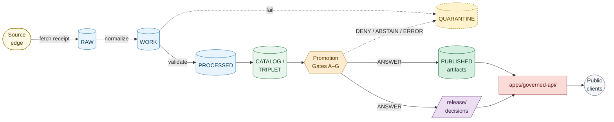
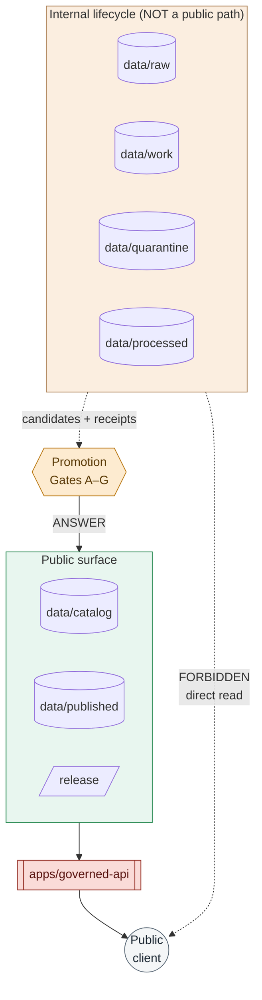

<!-- [KFM_META_BLOCK_V2]
doc_id: kfm://doc/architecture-publication-readme
title: Publication Architecture
type: standard
version: v1
status: draft
owners: TBD-release-manager, TBD-docs-steward
created: 2026-05-10
updated: 2026-05-10
policy_label: public
related: [
  docs/doctrine/lifecycle-law.md,
  docs/doctrine/trust-membrane.md,
  docs/doctrine/truth-posture.md,
  docs/doctrine/directory-rules.md,
  docs/architecture/governed-api.md,
  docs/architecture/contract-schema-policy-split.md,
  docs/adr/ADR-0001-schema-home.md,
  contracts/release/README.md,
  contracts/evidence/README.md,
  release/README.md
]
tags: [kfm, architecture, publication, promotion, release, governance]
notes: [
  "PROPOSED subdirectory: directory-rules.md §6.1 shows flat .md files under docs/architecture/.",
  "Alternative single-file path: docs/architecture/publication.md.",
  "Folder choice should be confirmed by an ADR (e.g., ADR-architecture-publication-folder).",
  "All repo-internal paths are PROPOSED until verified against the mounted repo."
]
[/KFM_META_BLOCK_V2] -->

# Publication Architecture

> **Publication is a governed state transition, not a file move.**
> This folder explains how a candidate artifact becomes a public KFM release — which gates run, which objects must exist, which signatures must verify, and where the trust membrane enforces the boundary between internal lifecycle stores and the public surface.

---

<!-- Badge targets are placeholders (PROPOSED) until CI workflows and branch-protection labels are verified in the repo. -->


| Field | Value |
|---|---|
| **Status** | `draft` — PROPOSED folder grouping; awaits ADR confirmation |
| **Owners** | _Release Manager_ · _Docs Steward_ *(TBD — confirm via repo `CODEOWNERS`)* |
| **Doc class** | Architecture (cross-domain doctrine) |
| **Authority** | CONFIRMED publication doctrine; PROPOSED file paths and folder choice |
| **Lifecycle invariant** | `RAW → WORK / QUARANTINE → PROCESSED → CATALOG / TRIPLET → PUBLISHED` |
| **Truth posture** | Cite-or-abstain. Generated language never outranks `EvidenceBundle`. |

> [!IMPORTANT]
> Publication in KFM is **not** a copy or a `mv`. It is a *state transition* gated by validation, evidence closure, policy, review, signing, catalog closure, and a working rollback path. A pipeline that writes directly to `data/published/` from any earlier phase is a lifecycle violation. See [`docs/doctrine/lifecycle-law.md`](../../doctrine/lifecycle-law.md) and [§13.5 of `directory-rules.md`](../../doctrine/directory-rules.md).

---

## Quick jump

- [1. Scope](#1-scope)
- [2. Repo fit](#2-repo-fit)
- [3. What lives in this folder](#3-what-lives-in-this-folder)
- [4. What does *not* live here](#4-what-does-not-live-here)
- [5. Directory tree (PROPOSED)](#5-directory-tree-proposed)
- [6. The publication invariant](#6-the-publication-invariant)
- [7. Promotion Gates A–G](#7-promotion-gates-ag)
- [8. Object families involved in publication](#8-object-families-involved-in-publication)
- [9. Finite outcomes and DecisionEnvelope](#9-finite-outcomes-and-decisionenvelope)
- [10. Trust membrane intersection](#10-trust-membrane-intersection)
- [11. Rollback and correction](#11-rollback-and-correction)
- [12. Backlog and definition of done](#12-backlog-and-definition-of-done)
- [13. Related doctrine and architecture](#13-related-doctrine-and-architecture)
- [14. Open questions and verification backlog](#14-open-questions-and-verification-backlog)
- [Glossary (collapsible)](#glossary)

---

## 1. Scope

This folder hosts the **architecture doctrine** for how KFM moves a candidate dataset, layer, or claim into the public surface. It is the cross-domain "what publication *is* in KFM" — the invariants, gate matrix, and trust boundary — independent of any single domain (hydrology, soil, archaeology, etc.).

In scope:

- The **publication invariant** as a governed state transition.
- The **Promotion Gate matrix** (A–G) and where each gate runs.
- The **object families** that compose a release (`ReleaseManifest`, `ProofPack`, `EvidenceBundle`, `CatalogMatrix`, `RunReceipt`, `PromotionReceipt`, `DecisionEnvelope`, `RollbackCard`, `CorrectionNotice`).
- How the **trust membrane** (`apps/governed-api/`) consumes published state and never internal stores.
- The **rollback and correction** model: never delete, always supersede.

Out of scope:

- **Operational procedures** — runbooks live under `docs/runbooks/`.
- **Object meaning** — definitions live under `contracts/release/`, `contracts/evidence/`, `contracts/correction/`.
- **Field-level shape** — schemas live under `schemas/contracts/v1/release/`, `schemas/contracts/v1/evidence/`, etc., per [ADR-0001](../../adr/ADR-0001-schema-home.md).
- **Domain-specific publication tables** — those live under `docs/domains/<domain>/PROMOTION_AND_ROLLBACK.md`.

---

## 2. Repo fit

> [!NOTE]
> The canonical layout in [`docs/doctrine/directory-rules.md` §6.1](../../doctrine/directory-rules.md) shows `docs/architecture/` populated by **flat `.md` files** (`system-context.md`, `governed-api.md`, `map-shell.md`, `contract-schema-policy-split.md`). This `publication/` subdirectory is **PROPOSED** as a grouping for related publication-architecture documents that have grown beyond a single page. An ADR (e.g. `ADR-architecture-publication-folder`) should confirm the choice, or this content should be flattened back to `docs/architecture/publication.md`.

```
docs/
├── doctrine/
│   ├── lifecycle-law.md          ← parent doctrine for the invariant
│   ├── trust-membrane.md         ← parent doctrine for the public boundary
│   └── directory-rules.md        ← path authority
├── architecture/
│   ├── README.md                 ← architecture index
│   ├── system-context.md
│   ├── deployment-topology.md
│   ├── governed-api.md           ← trust membrane in executable form
│   ├── map-shell.md
│   ├── contract-schema-policy-split.md
│   └── publication/              ← THIS FOLDER (PROPOSED)
│       └── README.md             ← THIS FILE
├── runbooks/                     ← operational procedures (rollback drills, validation runs)
└── adr/                          ← decisions affecting this folder
```

**Upstream (this folder consumes):**
[`docs/doctrine/lifecycle-law.md`](../../doctrine/lifecycle-law.md) ·
[`docs/doctrine/trust-membrane.md`](../../doctrine/trust-membrane.md) ·
[`docs/doctrine/truth-posture.md`](../../doctrine/truth-posture.md) ·
[`docs/architecture/contract-schema-policy-split.md`](../contract-schema-policy-split.md)

**Downstream (this folder informs):**
[`docs/architecture/governed-api.md`](../governed-api.md) ·
[`docs/runbooks/`](../../runbooks/) ·
[`contracts/release/`](../../../contracts/release/) ·
[`contracts/evidence/`](../../../contracts/evidence/) ·
[`schemas/contracts/v1/release/`](../../../schemas/contracts/v1/release/) ·
[`policy/promotion/`](../../../policy/promotion/) ·
[`release/`](../../../release/)

---

## 3. What lives in this folder

PROPOSED contents (none yet exist; this README is the first):

| File | Purpose |
|---|---|
| `README.md` *(this file)* | Folder orientation; the publication invariant; gate matrix; object families. |
| `promotion-gates.md` *(PROPOSED)* | Per-gate detail for Gates A–G: inputs, deny rules, decision-log shape, fixtures. |
| `release-objects.md` *(PROPOSED)* | The release object family in depth: `ReleaseManifest`, `ProofPack`, `CatalogMatrix`, signatures. |
| `rollback-and-correction.md` *(PROPOSED)* | Supersession model, alias revert, `CorrectionNotice` lifecycle. |
| `release-state-machine.md` *(PROPOSED)* | States `unreleased → candidate → released → superseded / withdrawn / corrected` and transitions. |

> [!TIP]
> If this folder accumulates more than ~5 documents, add an internal `INDEX.md` and re-evaluate whether topics belong in `docs/runbooks/` (operations) or `contracts/release/` (object meaning) instead.

---

## 4. What does *not* live here

| Concern | Correct home |
|---|---|
| Step-by-step rollback procedure | `docs/runbooks/rollback-drill.md` |
| `ReleaseManifest` field definitions | `contracts/release/release_manifest.md` |
| `ReleaseManifest` JSON Schema | `schemas/contracts/v1/release/release_manifest.schema.json` |
| Promotion gate **policy** (Rego) | `policy/promotion/`, `policy/opa/gates/` |
| Promotion gate **CI workflow** | `.github/workflows/promotion.yml` |
| Domain-specific promotion tables | `docs/domains/<domain>/PROMOTION_AND_ROLLBACK.md` |
| Released artifacts (PMTiles, GeoParquet, API snapshots) | `data/published/<domain>/...` |
| `ReleaseManifest` decision artifacts | `release/manifests/` |
| Process-memory receipts | `data/receipts/` |
| Release-grade proof bundles | `data/proofs/` |
| Drift complaints about release placement | `docs/registers/DRIFT_REGISTER.md` |

> [!WARNING]
> A common drift is putting **release manifests** in `data/published/` or **published PMTiles** in `release/`. The split is sharp: `data/published/` holds released **artifacts** (what consumers read); `release/` holds release **decisions** (the manifest, proof closure, rollback/correction path, signatures). See [`directory-rules.md` §9.2](../../doctrine/directory-rules.md).

---

## 5. Directory tree (PROPOSED)

```
docs/architecture/publication/
├── README.md                       ← this file
├── promotion-gates.md              ← PROPOSED
├── release-objects.md              ← PROPOSED
├── rollback-and-correction.md      ← PROPOSED
└── release-state-machine.md        ← PROPOSED
```

> [!NOTE]
> Tree shows the **intended growth path**. Today only this README exists. Each PROPOSED file should be confirmed by either an issue, a backlog entry in `docs/registers/VERIFICATION_BACKLOG.md`, or an ADR before creation, and should preserve stable anchors as it splits.

---

## 6. The publication invariant

The lifecycle invariant — **CONFIRMED doctrine** — is unchanged regardless of domain:

```
RAW  →  WORK / QUARANTINE  →  PROCESSED  →  CATALOG / TRIPLET  →  PUBLISHED
```

Three properties make this an invariant rather than a folder layout:

1. **Every transition is governed.** Pipelines emit candidate objects and *receipts*; promotion is a separate, fail-closed event with its own decision artifact.
2. **Public clients never read internal phases.** The governed API is the only public path. Routes that read `data/raw/`, `data/work/`, `data/quarantine/`, or `data/processed/` directly violate the trust membrane.
3. **No phase is skippable.** A pipeline that writes from `RAW` to `PUBLISHED` directly bypasses validation, catalog closure, evidence binding, and review.



**Reading the diagram:**
A candidate flows left-to-right. The Promotion Gate cluster sits between `CATALOG / TRIPLET` and `PUBLISHED` — only `ANSWER` lets a candidate become published; `DENY`, `ABSTAIN`, and `ERROR` route it to `QUARANTINE` for remediation. Public clients reach published state only through `apps/governed-api/`, never the lifecycle stores directly.

---

## 7. Promotion Gates A–G

Promotion is structured as a **seven-gate matrix** — CONFIRMED doctrine across multiple KFM sources. Each gate emits a per-gate `decision_gate_<X>.json` joined to the others by a shared `decision_id`. A `PromotionReceipt` enumerates all gate statuses and is the auditable promotion record.

| Gate | Name | Asks | Fail-closed when |
|---|---|---|---|
| **A** | `schema_valid` | Do all candidate objects validate against pinned schemas? | Schema mismatch · missing required field · canonical hash unverifiable |
| **B** | `inputs_pinned` | Are inputs pinned by digest, with `spec_hash` and `source_head` recorded? | Missing `spec_hash` · unpinned source · stale `source_head` |
| **C** | `checks_pass` | Do validators, dataset-quality checks, and structural tests pass? | Any required validator FAIL or ERROR |
| **D** | `signatures_valid` | Are receipts signed (DSSE / cosign) and verifiable? *(PROPOSED implementation)* | Signature missing · signature unverifiable · `spec_hash` mismatch in payload |
| **E** | `provenance_complete` | Does catalog closure hold across STAC, DCAT, PROV, and `CatalogMatrix`? | Identifier or digest mismatch across vocabularies · dangling references |
| **F** | `no_policy_violations` | Does policy (rights, sensitivity, source role, scope) `ALLOW`? | OPA decision ≠ allow · sensitivity-precise leakage · unknown rights |
| **G** | `release_ready` | Are review, rollback target, and release manifest present and consistent? | Missing review for sensitive content · `rollback_supported: false` · manifest unsigned |

> [!IMPORTANT]
> **Default-deny.** The absence of evidence blocks promotion; gates do not pass on missing inputs. This is the structural bedrock of evidence-first governance — see [`docs/doctrine/truth-posture.md`](../../doctrine/truth-posture.md).

> [!NOTE]
> Some KFM source documents reference an extended gate set including **Gate H (Merkle integrity)** and **Gate I (release manifest closure)** as proposed extensions. This README treats A–G as canonical; H and I are tracked in the backlog (§12).

**Where the gates live (PROPOSED paths):**

| Concern | PROPOSED path |
|---|---|
| Gate policies (Rego) | `policy/promotion/`, `policy/opa/gates/` |
| Gate runner workflow | `.github/workflows/promotion.yml` |
| `PromotionReceipt` schema | `schemas/contracts/v1/evidence/promotion_receipt.schema.json` |
| `PromotionReceipt` contract | `contracts/release/promotion_receipt.md` *(or `contracts/evidence/`)* |
| Gate decision logs | `data/receipts/promotion/<decision_id>/decision_gate_<x>.json` |
| Validator implementation | `tools/validators/promotion_gate/` |

---

## 8. Object families involved in publication

| Object | Purpose | PROPOSED home | Note |
|---|---|---|---|
| `RunReceipt` | Process memory for any pipeline run; pins inputs, outputs, `spec_hash`, source head, decision log | `data/receipts/<domain>/runs/` | Receipts are *not* release proof |
| `EvidenceBundle` | Resolved support package for a claim or layer; outranks generated language | `data/proofs/<domain>/evidence_bundles/` | Required to resolve any consequential claim |
| `CatalogMatrix` | Closure object linking STAC ↔ DCAT ↔ PROV ↔ ReleaseManifest by `spec_hash` | `data/catalog/matrix/<domain>/` | Promotion DENY on any digest mismatch |
| `ProofPack` | Release-grade evidence: catalog refs, evidence-bundle refs, validation reports, attestations | `data/proofs/<domain>/<release_id>/proof_pack.json` | The lower-level binding referenced by the manifest |
| `ReleaseManifest` | The release decision artifact: `release_id`, `spec_hash`, artifacts, digests, refs, `release_state`, rollback target, correction lineage | `release/manifests/<release_id>.json` | Required before `release_state: PUBLISHED` |
| `PromotionDecision` / `PromotionReceipt` | Governed state-transition record enumerating gate statuses, decision, attestation, integrity | `release/promotion_decisions/`; receipt under `data/receipts/promotion/` | Reconstructable from the receipt alone |
| `DecisionEnvelope` | Normalized policy output: finite outcome, reasons, obligations | runtime / API; schema in `schemas/contracts/v1/runtime/` | Same shape across all gates and modules |
| `ReviewRecord` | Steward / domain / sensitivity / security review outcomes | `release/promotion_decisions/<id>/reviews/` or `data/receipts/<domain>/reviews/` | Required for sensitive content before promotion |
| `RollbackCard` | Reversal/repointing record: previous release, affected artifacts, plan ref, expected post-rollback state | `release/rollback_cards/` | Pre-validated; never deletes prior history |
| `CorrectionNotice` | Public correction, supersession, or withdrawal note | `release/correction_notices/` | Required when public output is corrected or withdrawn |

> [!NOTE]
> Per the corpus: **proof pack** is the lower-level binding (catalog + evidence + receipts + attestations + Merkle); **release manifest** is the publication envelope (release state + rollback + correction lineage + sensitivity), with the proof pack referenced inside it. Treat them as related but distinct.

---

## 9. Finite outcomes and DecisionEnvelope

Every governed decision in KFM emits one of four **finite outcomes** — CONFIRMED doctrine, decoupled from operational state:

| Outcome | Meaning |
|---|---|
| `ANSWER` | Verified: evidence resolved, policy allowed, citation valid, scope in bounds. Promote / publish / render. |
| `ABSTAIN` | Incomplete or unresolved evidence. Do not invent. |
| `DENY` | Policy violation (rights / sensitivity / source role / unpublished candidate). |
| `ERROR` | System issue (policy engine unavailable, model unavailable, validator failure). |

A `DecisionEnvelope` (PROPOSED schema: `schemas/contracts/v1/runtime/decision_envelope.schema.json`) normalizes these outputs across promotion gates, render gates, capability issuance, consent, and runtime answers — so downstream consumers parse one shape:

```json
{
  "decision_id": "00000000-0000-0000-0000-000000000000",
  "outcome": "ANSWER",
  "policy_family": "promotion",
  "reasons": [],
  "obligations": [],
  "evaluated_at": "2026-05-10T00:00:00Z"
}
```

> [!CAUTION]
> Operational vocabulary (`NORMAL`, `DEGRADED`, `ESCALATE`, `QUARANTINE`) is **separate** from the finite-outcome enum. Do not mix them. A layer with `outcome == ANSWER` may have operational state `DEGRADED` (rendered with caveats); a layer with `outcome == DENY` may have operational state `QUARANTINE`.

---

## 10. Trust membrane intersection

Publication is the data side of the trust membrane; the API side lives in [`docs/architecture/governed-api.md`](../governed-api.md). The intersection rules:

- **Public clients use governed APIs and published artifacts only.** No browser or public API path may read `data/raw/`, `data/work/`, `data/quarantine/`, or `data/processed/`.
- **The runtime envelope must reference release artifacts**, never internal lifecycle paths. Public payload includes evidence-bundle refs, policy decision ref, release-manifest refs, freshness, review state, correction state, citations, limitations.
- **Cite-or-abstain is the default.** A claim without a resolvable `EvidenceBundle` returns `ABSTAIN`, not a fluent guess.
- **Watcher-as-non-publisher.** Workers and connectors emit receipts and candidate decisions; they do not publish, do not mutate canonical records, and do not write to `data/catalog/` or `data/published/`.



---

## 11. Rollback and correction

> [!IMPORTANT]
> **Rollback never deletes a release.** It supersedes one with another, preserving lineage so an auditor can always reconstruct what the catalog said at any prior point in time.

The KFM model:

1. A new manifest is published with `release_state: REVOKED` (or `SUPERSEDED`) pointing back to the prior `PUBLISHED` manifest via `correction_lineage[]`.
2. A new `PUBLISHED` manifest takes its place, referencing the revoked manifest in its lineage.
3. The runtime API serves the active `PUBLISHED` manifest; consumers querying the revoked release receive a `REVOKED` response with the rollback target.
4. Prior-release artifacts remain in immutable storage — only the alias moves.
5. A `CorrectionNotice` (signed) records `{correction_id, prior_release, new_release, reason, evidence_refs, signed_by, created_at}` when the public meaning changed.

A release without a validated `rollback_plan_ref` and `rollback_supported: true` is **not** publishable.

---

## 12. Backlog and definition of done

The folder is currently a doctrinal stub. To reach maturity, it should accumulate the items below — each tracked in `docs/registers/VERIFICATION_BACKLOG.md` once available.

- [ ] Confirm folder choice via ADR (`ADR-architecture-publication-folder`) — or flatten into `docs/architecture/publication.md`.
- [ ] Author `promotion-gates.md` with per-gate fixtures and decision-log JSON shape.
- [ ] Author `release-objects.md` covering `ReleaseManifest`, `ProofPack`, `CatalogMatrix`, `PromotionReceipt` field-by-field, with links to schemas.
- [ ] Author `rollback-and-correction.md` covering supersession, alias revert, `CorrectionNotice` lifecycle.
- [ ] Author `release-state-machine.md` enumerating states and transitions.
- [ ] Decide on **Gate H (Merkle integrity)** and **Gate I (release manifest closure)** — extend the matrix or close as out-of-scope.
- [ ] Pin signing posture: keyless OIDC for CI, keyed for stewards (CONFIRMED direction; PROPOSED implementation).
- [ ] Cross-reference per-domain `docs/domains/<domain>/PROMOTION_AND_ROLLBACK.md` once they exist.
- [ ] Add CI: any change to gate count, gate names, or the lifecycle invariant must update this file or fail a docs-drift check.

**Definition of Done for a publication-architecture document in this folder:**

| Criterion | Required |
|---|---|
| Truth-labels applied (CONFIRMED / PROPOSED / NEEDS VERIFICATION / UNKNOWN) | Yes |
| Cross-links to `contracts/`, `schemas/`, `policy/`, `release/` resolve | Yes |
| Examples are runnable or labeled illustrative | Yes |
| Cited objects exist as schemas, fixtures, or are flagged as backlog | Yes |
| Stable anchors preserved on revision | Yes |
| Owner present in `CODEOWNERS` | Yes |

---

## 13. Related doctrine and architecture

| Concern | Location |
|---|---|
| Lifecycle invariant (the ladder) | [`docs/doctrine/lifecycle-law.md`](../../doctrine/lifecycle-law.md) |
| Trust membrane (the public boundary) | [`docs/doctrine/trust-membrane.md`](../../doctrine/trust-membrane.md) |
| Truth posture (cite-or-abstain) | [`docs/doctrine/truth-posture.md`](../../doctrine/truth-posture.md) |
| Authority order, conformance, drift | [`docs/doctrine/directory-rules.md`](../../doctrine/directory-rules.md) |
| Governed API (executable trust membrane) | [`docs/architecture/governed-api.md`](../governed-api.md) |
| `contracts/` vs `schemas/` vs `policy/` split | [`docs/architecture/contract-schema-policy-split.md`](../contract-schema-policy-split.md) |
| Schema home authority | [`docs/adr/ADR-0001-schema-home.md`](../../adr/ADR-0001-schema-home.md) |
| Object meaning for releases | [`contracts/release/`](../../../contracts/release/) |
| Object meaning for evidence | [`contracts/evidence/`](../../../contracts/evidence/) |
| Object meaning for corrections | [`contracts/correction/`](../../../contracts/correction/) |
| Release decision artifacts | [`release/`](../../../release/) |
| Released artifacts | [`data/published/`](../../../data/published/) |
| Process-memory receipts | [`data/receipts/`](../../../data/receipts/) |
| Release-grade proofs | [`data/proofs/`](../../../data/proofs/) |
| Operational rollback drill | [`docs/runbooks/`](../../runbooks/) |

> [!NOTE]
> All linked paths are PROPOSED until verified against the mounted repo. If the mounted repo shows a different layout, file a `docs/registers/DRIFT_REGISTER.md` entry per [`directory-rules.md` §2.5](../../doctrine/directory-rules.md) — do not silently retarget the links.

---

## 14. Open questions and verification backlog

| # | Status | Question |
|---|---|---|
| 1 | NEEDS VERIFICATION | Does `docs/architecture/publication/` exist in the mounted repo, or do peers (`governed-api.md`, etc.) live as flat files only? |
| 2 | NEEDS VERIFICATION | Is the canonical home for `ReleaseManifest` at `release/manifests/`, `data/manifests/`, or `data/published/.../manifests/`? Doctrine prefers `release/manifests/` ([Glossary §19](../../doctrine/directory-rules.md)); per-domain reports cite alternates. |
| 3 | NEEDS VERIFICATION | Is `data/rollback/` a sibling lifecycle phase or does the rollback **decision** live under `release/rollback_cards/` only? Doctrine treats them as data plane vs release plane; an ADR can confirm or merge. |
| 4 | OPEN | Are **Gate H (Merkle integrity)** and **Gate I (release-manifest closure)** part of the canonical matrix, or post-canonical extensions? |
| 5 | OPEN | When `Gate F` returns `escalate` and the steward channel is unavailable, what is the canonical fail mode? Doctrine implies `DENY` with retry; not formalized. |
| 6 | UNKNOWN | What CI-enforced labels are used in branch protection for promotion? Update the badges and §7 paths once verified. |
| 7 | UNKNOWN | OIDC-subject convention for keyless signing (workflow paths, sanctioned branches). |
| 8 | UNKNOWN | OCI repository naming for receipts (`oci://kfm/receipts/<dataset>/<spec_hash>` is corpus-suggested, not pinned). |

---

<details>
<summary><strong>Glossary</strong> (placement-relevant terms — full definitions in <code>docs/doctrine/</code> and <code>contracts/</code>)</summary>

| Term | Short definition |
|---|---|
| **Promotion** | A governed state transition between lifecycle phases. **Not** a file move. |
| **Publication** | The post-promotion state in which a public-safe artifact is reachable through the governed API. |
| **Trust membrane** | Boundary preventing raw / unreviewed / model-generated / internal state from becoming public truth. Operational form: `apps/governed-api/`. |
| **EvidenceBundle / EvidenceRef** | Resolved support package for claims; `data/proofs/`. References resolve via `packages/evidence-resolver/`. |
| **ReleaseManifest** | The release decision artifact; `release/manifests/`. |
| **ProofPack** | Lower-level binding (catalog + evidence + receipts + attestations + Merkle); referenced from the manifest. |
| **CatalogMatrix** | Testable STAC/DCAT/PROV/triplet closure object. |
| **PromotionReceipt** | Self-describing record enumerating Gates A–G with per-gate `{gate, name, status}`. |
| **DecisionEnvelope** | Normalized policy output carrying finite outcome, reasons, obligations. |
| **CorrectionNotice** | Public notice of a corrected claim; `release/correction_notices/`. |
| **RollbackCard** | Rollback decision artifact; `release/rollback_cards/`. |
| **RuntimeResponseEnvelope** | Finite-outcome wrapper (ANSWER, ABSTAIN, DENY, ERROR) returned by the governed API. |
| **Watcher-as-non-publisher** | Workers emit receipts and candidates only; they do not publish or mutate canonical records. |
| **`spec_hash`** | Deterministic content hash of canonical artifact encoding; the catalog primary key, not a mutable path. |

</details>

---

> [!TIP]
> Improvements to this doc should preserve the gate-count (A–G), the finite-outcome enum, the lifecycle invariant, and the trust-membrane rule — these are CONFIRMED doctrine. Anything that bends them needs an ADR per [`directory-rules.md` §2.4](../../doctrine/directory-rules.md).

[⬆ Back to top](#publication-architecture)
