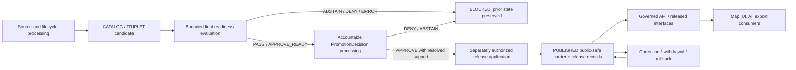

<!-- [KFM_META_BLOCK_V2]
doc_id: kfm://doc/architecture-publication-readme
title: Publication Architecture
type: readme
version: v2.0
status: draft; repository-grounded; explanatory; mixed-maturity; non-authoritative; non-publication
owner: "@bartytime4life via CODEOWNERS; independent release stewardship and accountable release authority NEEDS VERIFICATION"
created: 2026-05-10
updated: 2026-08-14
policy_label: public; architecture; publication; promotion; release; correction; rollback; cite-or-abstain
owning_root: docs/
responsibility: Explain how KFM prepares, evaluates, decides, records, applies, corrects, withdraws, and rolls back release state without becoming contract, schema, policy, evidence, receipt, proof, release, runtime, or publication authority.
truth_posture: >-
  CONFIRMED current path and nine-file publication architecture lane, accepted
  Directory Rules v2 placement authority, current CODEOWNERS route, and bounded
  fixture-first promotion-readiness, PromotionReceipt, publication-denial, and
  rollback-card validation surfaces / PROPOSED ADR-0018 final-readiness profile
  and proposed release contracts or schemas not yet adopted / CONFLICTED
  lifecycle-wide, release-gate, historical, and bounded final-readiness A-G
  vocabularies / UNKNOWN authenticated evidence resolution, signer trust,
  independent reviewer authority, production release assembly, transition
  application, public parity, correction propagation, and operational rollback /
  NEEDS VERIFICATION exact-head hosted checks, required-check coupling,
  accepted policy evaluator, consumer closure, independent stewardship, and the
  first governed release.
evidence_snapshot:
  repository: bartytime4life/Kansas-Frontier-Matrix
  visibility: public
  base_ref: main
  base_commit: 3974da9794fa11bd5355c49243c9193d22b9e81e
  target_prior_blob: 340e737e24d49a5219f5939ee59458c9af459de5
  direct_child_count: 9
  direct_child_blobs:
    CORRECTION.md: dcd7bd43f63a340842ed0f6df315ca68dbb11f69
    GEO_MANIFEST.md: c6af4e5c002f0ec8caf30f4b751368d5bc4d09af
    README.md: 340e737e24d49a5219f5939ee59458c9af459de5
    RELEASE_GATES.md: f89a7fb84bac9a78c0cfb366c446eab7973c26c0
    ROLLBACK.md: 5a8a2e5fe77dad9951288f13e7f48bb50d62a570
    promotion-gates.md: 6ae62f9778dd7ea2d67ea368683a002163b7cac1
    release-objects.md: 09dbef6027cf8595a89b0c52b8ac76ca15406e89
    release-state-machine.md: f61b3ebfca7f88473dd80d31b7a90b104f8ea84a
    rollback-and-correction.md: d352cca4cf87106dd4c9a4df39fd19fa7626e7bb
  directory_rules_blob: fd49a0b83e55cef52c1124281f093e263526898d
  directory_rules_decision: ADR-0029 accepted
  codeowners_blob: dd2a84aa514d8ecd9208bc347f90f9a2ed37dd61
  contracts_release_readme_blob: 3412cb63cfde542cf9a7c8e93e035530569425d8
  release_root_readme_blob: 60b6a656f8f2b765616bba7223f51c25863c7172
  promotion_receipt_workflow_blob: f4e685f85c232e7ea82b5ad5eb5253969f53b098
  release_dry_run_workflow_blob: 7caf1d188bd31d11e159190248e5543b1d2fd36f
inspection_boundary: >-
  Current-session GitHub reads over this complete README, every direct child in
  the publication lane at least to its responsibility boundary, ADR-0018,
  accepted ADR-0029, Directory Rules v2, CODEOWNERS, release and semantic
  contract root READMEs, promotion policy, promotion-gate, PromotionReceipt,
  release-dry-run workflows, and repository-native Make targets. No mounted
  checkout, local test execution, live evidence resolver, policy bundle, signer
  trust root, authenticated reviewer registry, release service, deployment,
  public endpoint, correction propagation, or rollback execution was exercised.
related:
  - ../../adr/ADR-0018-promotion-gate-sequence.md
  - ../../adr/ADR-0029-adopt-directory-governance-standard-v2.md
  - ../../doctrine/directory-rules.md
  - ../../doctrine/lifecycle-law.md
  - ../../doctrine/trust-membrane.md
  - ../README.md
  - promotion-gates.md
  - RELEASE_GATES.md
  - release-objects.md
  - release-state-machine.md
  - rollback-and-correction.md
  - CORRECTION.md
  - ROLLBACK.md
  - GEO_MANIFEST.md
  - ../../../contracts/release/README.md
  - ../../../release/README.md
  - ../../../policy/promotion/README.md
  - ../../../.github/workflows/promotion-gate.yml
  - ../../../.github/workflows/promotion-receipt.yml
  - ../../../.github/workflows/release-dry-run.yml
tags: [kfm, architecture, publication, promotion, release, gates, evidence, policy, review, correction, rollback, non-publication]
notes:
  - "v2.0 is a same-path repository-grounded modernization. It changes one explanatory README and grants no release or publication authority."
  - "The old claim that this folder and its companion files were merely proposed is stale: the current lane contains nine tracked files."
  - "The old schema_valid through release_ready list survives only as historical proposal context in the conflict register."
  - "ADR-0018 v1.5 remains proposed and selects the bounded final-readiness vocabulary only as a candidate for its narrow scope."
  - "Old section anchors are preserved so existing inbound links remain valid."
[/KFM_META_BLOCK_V2] -->

<a id="top"></a>
<a id="publication-architecture"></a>

# Publication Architecture

> **One-line purpose.** `docs/architecture/publication/` explains how KFM prepares, evaluates, decides, records, applies, corrects, withdraws, and rolls back release state. It never makes a release true by itself.

[](#status-and-authority)
[](#2-repo-fit)
[](#2-repo-fit)
[](#7-promotion-gates-ag)
[](#current-implementation-maturity)
[](#current-implementation-maturity)
[](#10-trust-membrane-intersection)

> [!IMPORTANT]
> **Publication is a governed state transition, not a file move, workflow pass, pull request, merge, deployment, or badge.** Public-safe carriers may enter `PUBLISHED` only after applicable evidence, validation, policy, review, release, correction, and rollback requirements are satisfied and a separately authorized release operation applies the transition.

> [!CAUTION]
> **The repository has multiple A–G vocabularies.** The bounded executable readiness profile, lifecycle-wide companion, detailed release-gate document, and earlier proposal language assign different names and scopes to the same letters. This README records that conflict; it does not silently choose an accepted sequence. [`ADR-0018`](../../adr/ADR-0018-promotion-gate-sequence.md) remains `proposed`.

> [!WARNING]
> **A readiness `PASS` is not `APPROVE`, and a schema-valid `transition.applied: true` declaration is not proof that a transition occurred.** The bounded profile maps `PASS` only to `APPROVE_READY` for separately governed decision processing.

**Quick navigation:** [Scope](#1-scope) · [Repo fit](#2-repo-fit) · [Contents](#3-what-lives-in-this-folder) · [Exclusions](#4-what-does-not-live-here) · [Reading order](#5-current-folder-map-and-reading-order) · [Invariant](#6-the-publication-invariant) · [Gates](#7-promotion-gates-ag) · [Objects](#8-object-families-involved-in-publication) · [Outcomes](#9-finite-outcomes-and-decisionenvelope) · [Trust membrane](#10-trust-membrane-intersection) · [Rollback](#11-rollback-and-correction) · [Maturity](#current-implementation-maturity) · [Validation](#validation-and-contributor-contract) · [Definition of done](#12-backlog-and-definition-of-done) · [References](#13-related-doctrine-and-architecture) · [Open questions](#14-open-questions-and-verification-backlog) · [Glossary](#glossary)

---

<a id="status-and-authority"></a>

## Status and authority

| Field | Current bounded result |
|---|---|
| **Path** | `docs/architecture/publication/README.md` — CONFIRMED at `main@3974da9794fa11bd5355c49243c9193d22b9e81e` |
| **Owning root** | `docs/` — canonical human-facing responsibility root under accepted Directory Rules v2 |
| **Authority kind** | Explanatory architecture; not doctrine, ADR, contract, schema, policy, evidence, review, decision, release, or publication authority |
| **Review route** | `@bartytime4life` through CODEOWNERS; independent release stewardship and separation of duties remain NEEDS VERIFICATION |
| **ADR-0018** | `proposed`; revised candidate final-readiness profile, not an accepted runtime order |
| **Current implementation** | Bounded no-network readiness, ReviewRecord, PromotionDecision, PromotionReceipt, publication-denial, and rollback-card fixture validation |
| **Current policy** | `policy/promotion/` is proposed and inactive; both local Rego modules are no-op stubs and are not executed by the promotion-gate workflow |
| **Current release application** | HOLD / not established |
| **Publication effect of this README** | None |

This page is a navigation and reconciliation surface. Accepted doctrine and ADRs outrank it; current implementation evidence controls claims about behavior.

[Back to top](#top)

---

<a id="1-scope"></a>

## 1. Scope

This lane explains the cross-cutting architecture between a release candidate and a governed public surface.

**In scope:** the `CATALOG / TRIPLET → PUBLISHED` boundary; readiness, policy, review, decisions, receipts, manifests, transition application, public delivery, correction, withdrawal, supersession, rollback, current maturity, conflicts, and navigation across the nine tracked documents.

**Out of scope:** operational procedures; semantic contracts; JSON Schemas; policy source; release-governance instances; receipts and proof instances; public-safe payloads; runtime implementation; release application; deployment; source activation; publication; and repository settings.

| Responsibility | Correct home |
|---|---|
| Operational procedures | [`docs/runbooks/`](../../runbooks/) |
| Semantic meaning | [`contracts/`](../../../contracts/README.md) |
| Machine shape | [`schemas/`](../../../schemas/README.md) |
| Admissibility rules | [`policy/`](../../../policy/README.md) |
| Release decisions and records | [`release/`](../../../release/README.md) |
| Receipts and proofs | [`data/receipts/`](../../../data/receipts/) and [`data/proofs/`](../../../data/proofs/) |
| Public-safe released carriers | [`data/published/`](../../../data/published/) |
| Validators and operators | [`tools/validators/`](../../../tools/validators/) and [`tools/release/`](../../../tools/release/) |
| Public delivery | [`apps/governed-api/`](../../../apps/governed-api/) and [`apps/explorer-web/`](../../../apps/explorer-web/) |

[Back to top](#top)

---

<a id="2-repo-fit"></a>

## 2. Repo fit

Accepted [`ADR-0029`](../../adr/ADR-0029-adopt-directory-governance-standard-v2.md) adopts the exact Directory Rules v2 bytes at [`docs/doctrine/directory-rules.md`](../../doctrine/directory-rules.md). This same-path update stays in `docs/architecture/` because it explains architecture to humans. It creates no root, moves no file, and changes no authority boundary.

The old v1 README described this folder and its companions as merely proposed. That claim is stale: the current lane contains nine tracked files. A future consolidation, rename, or retirement of overlapping documents would require its own link inventory, authority review, migration record, validation, and rollback.

[Back to top](#top)

---

<a id="3-what-lives-in-this-folder"></a>

## 3. What lives in this folder

| File | Current role | Current posture |
|---|---|---|
| [`README.md`](README.md) | Lane orientation, boundaries, conflict register, maturity map, contributor contract | Repository-grounded draft; this file |
| [`promotion-gates.md`](promotion-gates.md) | Lifecycle-wide A–G narrative: source admission through release | Draft; conflicts with bounded final-readiness scope |
| [`RELEASE_GATES.md`](RELEASE_GATES.md) | Detailed gate matrix, artifacts, reason codes, PMTiles concerns | Draft; another A–G set and explicit unresolved consolidation |
| [`release-objects.md`](release-objects.md) | Publication object-family catalog | Draft; referenced contracts/schemas are mixed maturity |
| [`release-state-machine.md`](release-state-machine.md) | Lifecycle and post-publication state narrative | Draft; explanatory, not a transition engine |
| [`rollback-and-correction.md`](rollback-and-correction.md) | Concise rollback-versus-correction overview | Draft companion |
| [`CORRECTION.md`](CORRECTION.md) | Deep correction, supersession, invalidation, trust-visible lineage | Draft; end-to-end propagation unproved |
| [`ROLLBACK.md`](ROLLBACK.md) | Deep rollback discipline, roles, RollbackCard, drill expectations | Draft; no operational rollback established |
| [`GEO_MANIFEST.md`](GEO_MANIFEST.md) | Geospatial carrier integrity-manifest architecture | Draft; exact schema/instance placement unresolved |

Overlap is visible, not silently normalized. Concise/deep pairs and competing gate narratives remain separate until an evidence-backed compatibility change decides otherwise.

[Back to top](#top)

---

<a id="4-what-does-not-live-here"></a>

## 4. What does *not* live here

| Concern | Owning surface | Boundary |
|---|---|---|
| Release object semantics | [`contracts/release/`](../../../contracts/release/README.md) | Contracts define meaning |
| Correction semantics | [`contracts/correction/`](../../../contracts/correction/) | Adjacent semantic family |
| Release schemas | [`schemas/contracts/v1/release/`](../../../schemas/contracts/v1/release/) | Schemas define shape |
| Promotion/release policy | [`policy/promotion/`](../../../policy/promotion/README.md), [`policy/release/`](../../../policy/release/README.md) | Policy decides admissibility |
| Decisions, manifests, corrections, withdrawals, rollback cards, signatures | [`release/`](../../../release/README.md) | Append-only decision plane |
| Process memory | [`data/receipts/`](../../../data/receipts/) | Receipt is not proof or approval |
| Evidence and proof | [`data/proofs/`](../../../data/proofs/) | Proof supports; it does not apply state |
| PMTiles, GeoParquet, COG, API snapshots, reports | [`data/published/`](../../../data/published/) | Public-safe carriers only after release |
| CI orchestration | [`.github/workflows/`](../../../.github/workflows/) | A green workflow is not a release |

Never place released payloads in `release/`, policy source in this docs lane, release decisions in `data/published/`, or receipts/proofs inside a manifest merely for convenience.

[Back to top](#top)

---

<a id="5-directory-tree-proposed"></a>
<a id="5-current-folder-map-and-reading-order"></a>

## 5. Current folder map and reading order

```text
docs/architecture/publication/
├── README.md
├── promotion-gates.md
├── RELEASE_GATES.md
├── release-objects.md
├── release-state-machine.md
├── rollback-and-correction.md
├── CORRECTION.md
├── ROLLBACK.md
└── GEO_MANIFEST.md
```

| Task | Read first | Then inspect |
|---|---|---|
| Understand the boundary | This README | ADR-0018, `release/README.md`, `contracts/release/README.md` |
| Understand bounded executable readiness | [`ADR-0018`](../../adr/ADR-0018-promotion-gate-sequence.md) | [`tools/validators/promotion_gate/README.md`](../../../tools/validators/promotion_gate/README.md), promotion-gate workflow |
| Compare lifecycle-wide gate concepts | [`promotion-gates.md`](promotion-gates.md) | This conflict register and `RELEASE_GATES.md` |
| Audit release object relationships | [`release-objects.md`](release-objects.md) | Contracts, schemas, policy, release records |
| Understand state changes | [`release-state-machine.md`](release-state-machine.md) | Lifecycle doctrine and actual records |
| Decide rollback versus correction | [`rollback-and-correction.md`](rollback-and-correction.md) | [`ROLLBACK.md`](ROLLBACK.md), [`CORRECTION.md`](CORRECTION.md) |
| Work on carrier integrity | [`GEO_MANIFEST.md`](GEO_MANIFEST.md) | Carrier contracts, schemas, validators, ReleaseManifest bindings |

[Back to top](#top)

---

<a id="6-the-publication-invariant"></a>

## 6. The publication invariant

```text
RAW -> WORK / QUARANTINE -> PROCESSED -> CATALOG / TRIPLET -> PUBLISHED
```


```mermaid
flowchart LR
  SRC["Source and lifecycle processing"] --> CAT["CATALOG / TRIPLET candidate"]
  CAT --> READY["Bounded final-readiness evaluation"]
  READY -->|"PASS / APPROVE_READY"| DEC["Accountable PromotionDecision processing"]
  READY -->|"ABSTAIN / DENY / ERROR"| HOLD["BLOCKED; prior state preserved"]
  DEC -->|"APPROVE with resolved support"| APPLY["Separately authorized release application"]
  DEC -->|"DENY / ABSTAIN"| HOLD
  APPLY --> PUB["PUBLISHED public-safe carrier + release records"]
  PUB --> API["Governed API / released interfaces"]
  API --> CLIENT["Map, UI, AI, export consumers"]
  PUB --> FIX["Correction / withdrawal / rollback"]
  FIX --> PUB
```

1. **Readiness is not decision.** `APPROVE_READY` cannot mint accountable approval.
2. **Decision is not application.** A schema-valid `APPROVE` does not prove lifecycle state changed.
3. **Application is not public parity.** Release records do not prove API, map, search, export, or AI surfaces serve the intended state.
4. **A hold is not automatically quarantine.** A valid candidate may remain held for incomplete release support; quarantine is a separate lifecycle decision for inadmissible material.
5. **No skipped phase.** Direct internal-to-public paths violate the trust membrane.

[Back to top](#top)

---

<a id="7-promotion-gates-ag"></a>

## 7. Promotion gates and the A–G vocabulary conflict

| Surface | Scope | A → G names or meanings | Authority posture |
|---|---|---|---|
| [`ADR-0018` v1.5](../../adr/ADR-0018-promotion-gate-sequence.md) plus bounded validator/PromotionReceipt | Final readiness for a candidate already at `CATALOG / TRIPLET` | `identity_and_closure` · `asset_integrity` · `geometry_and_crs` · `temporal_semantics` · `rights_and_sensitivity` · `proof_and_catalog_support` · `review_and_rollback` | **PROPOSED candidate**; executable fixture-first profile, not accepted or operational |
| [`promotion-gates.md`](promotion-gates.md) | Lifecycle-wide narrative | Source admission · Provenance · Sensitivity · Validation · Evidence closure · Review · Release | Draft explanatory vocabulary |
| [`RELEASE_GATES.md`](RELEASE_GATES.md) | Detailed release narrative | Structure & Metadata · Schemas & Contracts · Policy Parity · Security & Sensitivity · Data Quality · Provenance & Lineage · Reviewability | Draft explanatory vocabulary |
| Prior README v1 / earlier ADR proposal | Historical final-readiness proposal | `schema_valid` · `inputs_pinned` · `checks_pass` · `signatures_valid` · `provenance_complete` · `no_policy_violations` · `release_ready` | Historical proposal only |

### Revised proposed bounded profile

Use `kfm/promotion-readiness/A-G/v1` when referring to the executable bounded profile:

| Gate | Exact name | Bounded responsibility |
|:---:|---|---|
| **A** | `identity_and_closure` | Candidate/profile/spec identity, lifecycle boundary, minimal manifest closure |
| **B** | `asset_integrity` | Spec and artifact-digest agreement |
| **C** | `geometry_and_crs` | Geometry validity, deterministic processing, CRS, finite ordered bounds |
| **D** | `temporal_semantics` | Strict timestamps, evaluation instant, candidate temporal ordering |
| **E** | `rights_and_sensitivity` | Declared rights/sensitivity and supplied policy-evaluation posture |
| **F** | `proof_and_catalog_support` | Declared evidence, attestation, receipt, catalog, conditional AI support |
| **G** | `review_and_rollback` | Fixture-only review declarations, separation, binding, correction, rollback support |

**Safe current rules:** do not call a set accepted while ADR-0018 is proposed; do not use bare letters without a profile; Gate G does not publish; any non-`PASS` result blocks readiness; and resolving the conflict requires governance plus a compatibility plan across docs, contracts, schemas, fixtures, validators, workflows, runbooks, and historical records.

[Back to top](#top)

---

<a id="8-object-families-involved-in-publication"></a>

## 8. Object families involved in publication

Receipts, proofs, decisions, reviews, manifests, corrections, rollback records, and carriers remain distinct.

| Object family | Primary responsibility | Current bounded posture | Must not replace |
|---|---|---|---|
| `PromotionDecision` | Accountable `APPROVE`, `DENY`, or `ABSTAIN` transition decision | PROPOSED shape/fixtures/validator/tests | Readiness, policy result, receipt, manifest, application |
| `PromotionReceipt` | Process receipt for one declared attempt and ordered gate records | PROPOSED fixture-first contract/schema/tests/read-only workflow | Decision, proof, review, ReleaseManifest, transition authority |
| `ReleaseManifest` | Release-governance manifest binding release identity and carrier set | Mixed maturity; fixture-first profiles exist | Evidence truth, approval, payload storage |
| `ReviewRecord` | Subject-bound accountable review and obligations | Fixture-only declared validation | CODEOWNERS, schema validity, automation identity |
| `RunReceipt` | Process memory for acquisition, transform, validation, assembly | Mixed receipt coverage | Proof, policy result, release decision |
| `EvidenceRef` / `EvidenceBundle` | Consequential-claim support and resolved context | Bounded resolver candidates; release integration unproved | Generated language, map pixels, signature |
| `ProofPack` / attestations | Release-grade support assembled from evidence, validation, receipts, catalog, integrity | Mixed/proposed | Release decision or carrier |
| `RollbackCard` | Named prior target, affected scope, invalidation/restoration plan | Fixture-first profile; no operational rollback | Proof rollback ran, deletion, silent alias change |
| `CorrectionNotice` / `WithdrawalNotice` | Visible correction, supersession, or withdrawal lineage | Semantic/architecture surfaces; propagation unproved | Silent overwrite or erasure |
| `KFMGeoManifest` | Integrity description for geospatial carrier bytes | Draft architecture; placement/profile unresolved | ReleaseManifest, EvidenceBundle, policy, approval |
| Public-safe carrier | PMTiles, GeoParquet, COG, API snapshot, report | `data/published/` only after release | Decision, proof, canonical source |

[Back to top](#top)

---

<a id="9-finite-outcomes-and-decisionenvelope"></a>

## 9. Finite outcomes and vocabulary boundaries

| Axis | Values | Meaning |
|---|---|---|
| Bounded readiness status | `PASS`, `ABSTAIN`, `DENY`, `ERROR` | Declared final-readiness evaluation |
| Readiness | `APPROVE_READY`, `BLOCKED` | Eligibility for separately governed decision processing |
| `PromotionDecision` | `APPROVE`, `DENY`, `ABSTAIN` | Release-transition decision |
| Runtime/API envelope | `ANSWER`, `ABSTAIN`, `DENY`, `ERROR` | Governed request response |
| Receipt declaration | `applied: true` or `false` | Declared effect, not operational proof by itself |
| CI result | Job/check state plus documented holds | Execution evidence only |

```text
ERROR > DENY > ABSTAIN > PASS
PASS  -> APPROVE_READY
other -> BLOCKED
```

A green workflow may prove a hold is visible. `ANSWER` is not gate success. `APPROVE_READY` is not `APPROVE`. `APPROVE` is not applied state. An evaluator error never falls back to allow.

[Back to top](#top)

---

<a id="10-trust-membrane-intersection"></a>

## 10. Trust membrane intersection

```text
internal lifecycle and canonical evidence
  -> validation / policy / review / release decision
  -> authorized release application
  -> data/published/ public-safe carrier + release records
  -> apps/governed-api/
  -> MapLibre shell / Evidence Drawer / Focus Mode / exports
```

- Public clients do not read RAW, WORK, QUARANTINE, PROCESSED, candidates, internal review records, direct model output, or canonical stores as their normal path.
- Public responses resolve released carrier identity, evidence, policy/review posture, freshness, limitations, correction state, and release state through governed interfaces.
- Maps, tiles, graph projections, indexes, summaries, badges, screenshots, and AI answers are carriers, not sovereign truth.
- Watchers, connectors, workers, validators, and drift detectors may create candidates, findings, or receipts; they do not publish.
- Missing or unresolved support produces abstention, denial, error, or hold—not a fluent substitute.

The inspected workflows have read-only repository permissions and emit test output or summaries only. They do not write release records, mutate lifecycle state, deploy, invalidate caches, or publish carriers.

[Back to top](#top)

---

<a id="11-rollback-and-correction"></a>

## 11. Rollback and correction

| Operation | Purpose | Required posture | Current evidence boundary |
|---|---|---|---|
| Rollback | Re-point current state to a validated prior target after an operational defect | Named target, scope, validation, authorization, invalidation/restoration, receipt, public-state verification | Fixtures/readiness exist; no operational rollback exercised |
| Correction | Publish a new supported release superseding prior public meaning | CorrectionNotice, new decision/manifest, lineage, invalidation, public visibility | Architecture/semantic surfaces exist; propagation unproved |
| Withdrawal | Make a release unavailable or unsafe without erasing history | Notice, reason, affected objects, public-safe notice, successor/rollback posture | Mixed maturity; no public flow established |
| Supersession | Preserve historical identity while selecting a newer current release | Append-only lineage and current-state resolution | Documented; production parity UNKNOWN |

Read [`rollback-and-correction.md`](rollback-and-correction.md), [`ROLLBACK.md`](ROLLBACK.md), and [`CORRECTION.md`](CORRECTION.md). Publication never silently overwrites or erases history; storage retention is a separate operational policy concern.

[Back to top](#top)

---

<a id="current-implementation-maturity"></a>

## Current implementation maturity

| Surface | Current bounded status | Safe conclusion |
|---|---:|---|
| Publication lane | **CONFIRMED** | Nine tracked files exist; path is not merely proposed |
| Directory authority | **ACCEPTED** | ADR-0029 adopts Directory Rules v2 |
| Gate authority | **CONFLICTED / PROPOSED** | ADR-0018 is proposed; multiple A–G sets remain |
| Final-readiness validator | **CONFIRMED fixture-first** | Deterministic, no-network findings; no external authentication or state mutation |
| ReviewRecord validation | **CONFIRMED bounded** | Declared relationships checked; live authority not authenticated |
| `PromotionDecision` | **PROPOSED shape** | Finite schema/fixtures do not establish approval |
| `PromotionReceipt` | **PROPOSED fixture-first** | Ordered records/digest checks; not operational proof |
| `promotion-gate` workflow | **CONFIRMED read-only** | Four stable jobs prove bounded behavior and explicit holds |
| `promotion-receipt` workflow | **CONFIRMED read-only / path-filtered** | Validates proposed contract and generated receipt when triggered |
| `release-dry-run` workflow | **CONFIRMED bounded denial proof** | Synthetic denial and rollback-card readiness; no real release |
| Promotion policy | **PROPOSED inactive** | Two no-op stubs, empty active-gate register, no evaluator/consumer |
| Release root | **CONFIRMED canonical / mixed maturity** | Decision plane exists; operational release held |
| Accountable review | **HOLD / NEEDS VERIFICATION** | One CODEOWNERS route; independent authority/separation unproved |
| Evidence/attestation authentication | **NOT ESTABLISHED** | Fixture references/tools do not prove live support or trust roots |
| Transition application | **NOT ESTABLISHED** | No accepted operator/service verified |
| Public parity, correction, rollback | **UNKNOWN / HELD** | No production endpoint or recovery exercise inspected |

### Hosted workflow evidence boundary

The latest inspected main-branch `promotion-receipt` run remains run `31654973080` at `3911c519d9bc134c3ab0662fed6577ebd966813b`: fixture-polarity and contract-test steps passed, and generated-receipt integrity failed. Because the workflow is path-filtered and no exact-current-head run was available, current end-to-end integrity remains **NEEDS VERIFICATION**. This README does not repair or supersede that receipt.

[Back to top](#top)

---

<a id="validation-and-contributor-contract"></a>

## Validation and contributor contract

Before changing this lane: pin current main, target blob, child inventory, ADRs, Directory Rules, and workflows; search concurrent work; classify the responsibility being changed; preserve old anchors or provide a migration; and never upgrade proposed to accepted, fixture-first to operational, or green checks to release authority without evidence.

```bash
make publish-check
make release-dry-run
python tools/validators/release/validate_promotion_receipt.py --fixtures
python -m unittest -q tests.release.test_promotion_receipt
python tools/validators/validate_generated_receipt.py \
  data/receipts/generated/genrec-promotion-receipt-contract-20260805.json \
  --repo-root .
```

These are bounded repository-owned checks, not release authorization. Documentation metadata, link, graph, Markdown, staleness, topology, and changed-area hosted checks remain authoritative for a documentation pull request.

**Rollback of this README:** revert the documentation commit or restore prior blob `340e737e24d49a5219f5939ee59458c9af459de5`. No contract, schema, policy, fixture, validator, workflow, receipt, proof, release record, lifecycle state, deployment, or public surface changes.

[Back to top](#top)

---

<a id="12-backlog-and-definition-of-done"></a>

## 12. Backlog and definition of done

### Convergence backlog

- [ ] Accept, reject, or supersede ADR-0018 through explicit review.
- [ ] Crosswalk or rename lifecycle-wide, detailed, historical, and bounded A–G vocabularies.
- [ ] Migrate docs, runbooks, contracts, schemas, fixtures, validators, workflows, and records under one compatibility plan.
- [ ] Define and accept promotion-policy input/outcome, reasons, obligations, bundle, evaluator, selector, and consumer.
- [ ] Replace no-op policy stubs with meaningful fail-closed rules and tests.
- [ ] Authenticate evidence, attestations, signer trust, reviewer identity/authority, and separation of duties.
- [ ] Bind readiness, policy, review, decisions, receipts, manifests, correction, withdrawal, and rollback identities without collapse.
- [ ] Prove separately authorized transition application on an isolated public-safe state plane.
- [ ] Prove correction propagation, withdrawal, invalidation, forward-fix, and rollback restoration.
- [ ] Repair or supersede generated receipts only through legitimate producers.
- [ ] Decide whether concise/deep document pairs remain, consolidate, or redirect with link-safe rollback.
- [ ] Reconcile `KFMGeoManifest` classification, schema, instance home, validator, and ReleaseManifest binding.

### Definition of done

| Criterion | Required evidence |
|---|---|
| Path and authority | Accepted placement basis; no parallel authority |
| Truth posture | Pinned current claims; proposals/conflicts/unknowns visible |
| Navigation | Complete inventory, roles, resolving links, stable anchors |
| Vocabulary | Profiles and outcomes explicit; no silent crosswalk |
| Object boundaries | Contracts, schemas, policy, receipts, proofs, reviews, decisions, manifests, carriers remain distinct |
| Public boundary | No direct internal-store path; cite-or-abstain and sensitivity preserved |
| Validation | Changed-area and hosted docs checks pass or failures are classified |
| Release safety | Docs change creates no release, deployment, publication, activation, or settings mutation |
| Maintenance | Owner route, review burden, open questions, rollback, re-review triggers visible |

[Back to top](#top)

---

<a id="13-related-doctrine-and-architecture"></a>

## 13. Related doctrine and architecture

| Concern | Surface | Posture |
|---|---|---|
| Directory placement | [`ADR-0029`](../../adr/ADR-0029-adopt-directory-governance-standard-v2.md), [`directory-rules.md`](../../doctrine/directory-rules.md) | Accepted ADR; exact v2 bytes adopted |
| Final-readiness proposal | [`ADR-0018`](../../adr/ADR-0018-promotion-gate-sequence.md) | Proposed, non-binding |
| Lifecycle and trust | [`lifecycle-law.md`](../../doctrine/lifecycle-law.md), [`trust-membrane.md`](../../doctrine/trust-membrane.md) | Doctrine |
| Parent architecture | [`docs/architecture/README.md`](../README.md) | Explanatory parent |
| Promotion runbook | [`PROMOTION_RUNBOOK.md`](../../runbooks/PROMOTION_RUNBOOK.md) | Operational guidance; vocabulary requires reconciliation |
| Release semantics | [`contracts/release/README.md`](../../../contracts/release/README.md) | Mixed-maturity semantic lane |
| Release shapes | [`schemas/contracts/v1/release/`](../../../schemas/contracts/v1/release/) | Machine-shape lane; profile statuses vary |
| Promotion policy | [`policy/promotion/README.md`](../../../policy/promotion/README.md) | Proposed inactive boundary |
| Release decision plane | [`release/README.md`](../../../release/README.md) | Canonical root; operational release held |
| Bounded readiness | [`tools/validators/promotion_gate/README.md`](../../../tools/validators/promotion_gate/README.md) | Fixture-first, no-network, non-publisher |
| Workflows | [`promotion-gate.yml`](../../../.github/workflows/promotion-gate.yml), [`promotion-receipt.yml`](../../../.github/workflows/promotion-receipt.yml), [`release-dry-run.yml`](../../../.github/workflows/release-dry-run.yml) | Read-only bounded validation |
| Public delivery | [`apps/governed-api/`](../../../apps/governed-api/), [`data/published/`](../../../data/published/) | Downstream interfaces/carriers |

[Back to top](#top)

---

<a id="14-open-questions-and-verification-backlog"></a>

## 14. Open questions and verification backlog

| ID | Status | Question or hold | Closure evidence |
|---|---|---|---|
| `PUB-R1` | **CONFLICTED** | Which A–G vocabulary, scope, order, and version is authoritative? | Accepted ADR and migration |
| `PUB-R2` | **OPEN** | Should lifecycle-wide controls retain letters? | Terminology decision and repaired links/diagrams |
| `PUB-R3` | **HELD** | Promotion policy is inactive/no-op | Accepted contracts, fail-closed rules/tests, evaluator/consumer |
| `PUB-R4` | **NEEDS VERIFICATION** | How are evidence, catalog, and attestations authenticated? | Resolver, trust roots, negative fixtures, replay |
| `PUB-R5` | **NEEDS VERIFICATION** | Who has reviewer/release/correction/rollback authority? | Governed assignments, qualification, revocation, separation |
| `PUB-R6` | **OPEN** | How do readiness, policy, review, decisions, receipts, and manifests bind? | Accepted schemas/contracts and relation tests |
| `PUB-R7` | **HELD** | Which operator applies and verifies state? | Isolated applied dry run with append-only records |
| `PUB-R8` | **NEEDS VERIFICATION** | Which rulesets depend on workflow/check names? | Settings inspection and migration-safe plan |
| `PUB-R9` | **HELD** | PromotionReceipt generated-receipt integrity lacks exact-head green evidence | Legitimate repair/supersession and hosted run |
| `PUB-R10` | **OPEN** | Should concise/deep docs remain, consolidate, or redirect? | Link inventory, authority review, migration receipt, rollback |
| `PUB-R11` | **OPEN** | What is accepted `KFMGeoManifest` identity and ReleaseManifest relation? | Object decision, schema, validator, fixtures, compatibility |
| `PUB-R12` | **UNKNOWN** | Are production release, audit, public, correction, or rollback services deployed? | Config, logs, records, deployment/recovery evidence |
| `PUB-R13` | **OPEN** | How are release hold and quarantine selected? | Accepted state/decision contract and negative paths |
| `PUB-R14` | **NEEDS VERIFICATION** | Is release/evidence/policy/correction parity preserved across public surfaces? | End-to-end tests and observed public-safe dry run |

[Back to top](#top)

---

<a id="glossary"></a>

<details>
<summary><strong>Glossary</strong></summary>

| Term | Bounded definition |
|---|---|
| **Promotion** | Governed lifecycle-state transition; never a file move, merge, deployment, or workflow pass. |
| **Publication** | Governed public availability of a released public-safe carrier through approved interfaces. |
| **Final readiness** | Bounded evaluation of a `CATALOG / TRIPLET` candidate before accountable decision processing. |
| **`APPROVE_READY`** | Result of complete bounded `PASS`; not approval or applied transition. |
| **`PromotionDecision`** | Separate `APPROVE`, `DENY`, or `ABSTAIN` transition decision. |
| **`PromotionReceipt`** | Process receipt for one declared attempt and ordered readiness results; not decision or release proof. |
| **`ReleaseManifest`** | Release-governance manifest binding release identity and carrier set; not evidence truth or payload storage. |
| **`ReviewRecord`** | Subject-bound review record; schema validity does not authenticate the reviewer. |
| **`EvidenceRef` / `EvidenceBundle`** | Reference and resolved support for consequential claims; outrank generated language and carriers. |
| **`RunReceipt`** | Process memory for acquisition, transform, validation, or assembly. |
| **`ProofPack`** | Release-grade support assembled from evidence, validation, receipts, catalog, and integrity. |
| **`RollbackCard`** | Named reversal target and plan; not proof rollback ran. |
| **`CorrectionNotice`** | Visible record linking defective public meaning to a corrected release. |
| **Trust membrane** | Boundary preventing internal, unreviewed, sensitive, or direct-model state from becoming ordinary public truth. |
| **Release hold** | Candidate remains in prior valid state because release support is incomplete. |
| **Quarantine** | Governed isolation for inadmissible material. |

</details>

---

## Change history

| Edition | Date | Change | Authority effect |
|---|---|---|---|
| v1 | 2026-05-10 | Initial draft with proposed folder/file claims and historical gate vocabulary. | None |
| **v2.0** | **2026-08-14** | Re-pinned current repository evidence; confirmed the nine-file lane; removed stale proposed-path claims; recorded A–G conflicts; aligned with proposed ADR-0018 v1.5 and bounded workflows; added maturity, responsibility, validation, rollback, and verification contracts. | **None — documentation only** |

## Last reviewed

**2026-08-14** against `main@3974da9794fa11bd5355c49243c9193d22b9e81e`.

Review again when ADR-0018 changes; a sibling is consolidated/renamed; release object profiles or authority change; promotion policy becomes active; application/correction/rollback lands; public-safe applied dry-run evidence exists; workflow/check names change; exact-head PromotionReceipt integrity changes; or six months pass.

[Back to top](#top)
