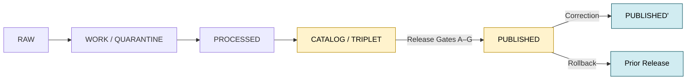
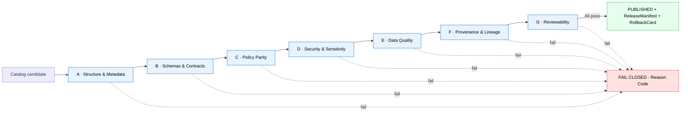
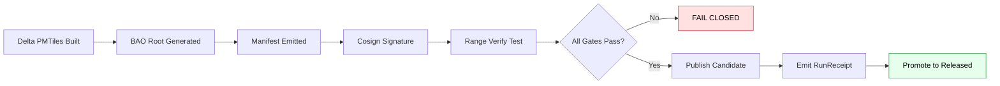
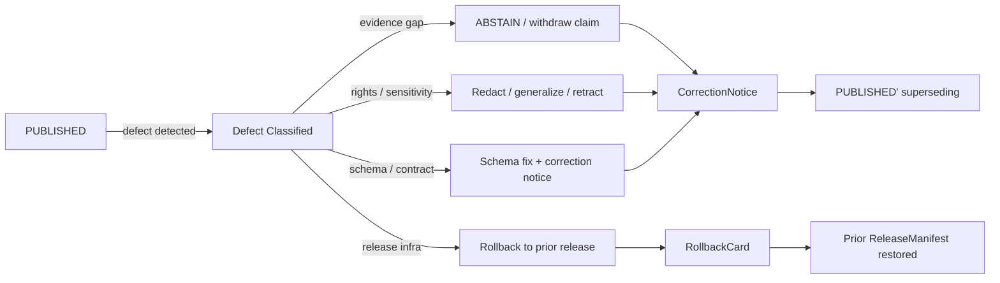

<!-- [KFM_META_BLOCK_V2]
doc_id: kfm://doc/NEEDS-VERIFICATION
title: Release Gates
type: standard
version: v1
status: draft
owners: OWNER_TBD (Docs steward + Release authority)
created: 2026-05-14
updated: 2026-05-14
policy_label: public
related:
  - docs/doctrine/directory-rules.md
  - docs/doctrine/lifecycle-law.md
  - docs/doctrine/trust-membrane.md
  - docs/doctrine/truth-posture.md
  - docs/doctrine/authority-ladder.md
  - docs/architecture/contract-schema-policy-split.md
  - docs/architecture/governed-api.md
  - docs/architecture/publication/GEO_MANIFEST.md
  - docs/architecture/publication/RUN_RECEIPT.md
  - docs/architecture/governed-ai/FOCUS_FLOW.md
  - docs/governance/separation-of-duties.md
  - docs/runbooks/release-rollback.md
  - release/manifests/README.md
  - release/correction_notices/README.md
  - release/rollback_cards/README.md
  - data/proofs/README.md
  - data/receipts/README.md
  - data/published/README.md
  - control_plane/policy_gate_register.yaml
  - control_plane/release_state_register.yaml
  - schemas/contracts/v1/runtime/decision_envelope.schema.json
  - schemas/contracts/v1/release/release_manifest.schema.json
  - schemas/contracts/v1/release/run_receipt.schema.json
  - schemas/contracts/v1/release/rollback_card.schema.json
  - schemas/contracts/v1/release/correction_notice.schema.json
  - policy/promotion/
  - policy/publication/
tags: [kfm, publication, governance, release, gates, promotion, doctrine]
notes:
  - "NEEDS VERIFICATION — every path quoted in this file is PROPOSED until reconciled against mounted-repo evidence (Directory Rules §0)."
  - "NEEDS VERIFICATION — doc_id, ADR linkage, owners, and badge targets pending a repo-mounted pass."
  - "CONFLICTED — the corpus presents the seven-gate matrix in two forms (Pass 10 C5-01 vs. PMTiles publication-gate list); this doc consolidates both and surfaces the open question for an ADR."
[/KFM_META_BLOCK_V2] -->

<a id="top"></a>

# Release Gates

> The governed transitions between **CATALOG / TRIPLET** and **PUBLISHED** in the Kansas Frontier Matrix lifecycle. Where evidence becomes a public surface — and where it does not.

<p align="center">
  <b>Kansas Frontier Matrix — Evidence First · Cite or Abstain · Fail Closed</b>
</p>

<p align="center">
  
  
  
  
  
  
  
</p>

> [!IMPORTANT]
> **Status:** `draft` · **Doctrine:** `CONFIRMED` · **Repo implementation depth:** `UNKNOWN` · **Quoted paths:** `PROPOSED` per `docs/doctrine/directory-rules.md` §0
> **Owners:** `OWNER_TBD` (Docs steward + Release authority — see [Separation of Duties](#separation-of-duties))
> **This doc:** `docs/architecture/publication/RELEASE_GATES.md`

> [!NOTE]
> This document records KFM doctrine where the project corpus supports it. Specific routes, validator names, CI job IDs, policy-bundle digests, branch protections, signer identities, and dashboard surfaces remain **UNKNOWN** until repo files, workflows, manifests, logs, and emitted artifacts are inspected.

## Quick Links

- [Purpose](#purpose)
- [Where Release Gates Fit](#where-release-gates-fit)
- [Operating Law](#operating-law)
- [The Gate Matrix (A–G)](#the-gate-matrix-ag)
- [Gate Families — Layered View](#gate-families--layered-view)
- [Required Artifacts per Gate](#required-artifacts-per-gate)
- [Finite Outcomes](#finite-outcomes)
- [Failure Reason Codes](#failure-reason-codes)
- [PMTiles and Tile-Publication Gates](#pmtiles-and-tile-publication-gates)
- [Universal Closure Rule](#universal-closure-rule)
- [Separation of Duties](#separation-of-duties)
- [Correction and Rollback](#correction-and-rollback)
- [Validation Expectations](#validation-expectations)
- [Anti-Patterns](#anti-patterns)
- [Verification Checklist](#verification-checklist)
- [Open Questions and NEEDS VERIFICATION](#open-questions-and-needs-verification)
- [Glossary](#glossary)
- [Related Docs and Schemas](#related-docs-and-schemas)

---

## Purpose

Release Gates are the **governed transitions** that decide whether content in **CATALOG / TRIPLET** state may become a **PUBLISHED** surface — visible to public clients, the governed API, the map shell, Focus Mode, Story Nodes, export carriers, or any other downstream KFM channel.

A release gate is a **policy decision over evidence and artifacts**, not a file move. Promotion to PUBLISHED is the only path by which content reaches public state, and **PUBLISHED is the only state from which the governed API may emit `ANSWER`.** The gates are how KFM keeps publication inspectable, reversible, and bounded by source rights, sensitivity posture, and review state.

This document defines:

1. the operating law every gate honors,
2. the canonical gate matrix and the layered gate families that implement it,
3. the artifacts each gate produces or consumes,
4. the finite outcomes a gate may emit,
5. the failure reason codes (PROPOSED catalog),
6. the PMTiles and tile-publication additions,
7. separation-of-duties expectations,
8. correction and rollback discipline tied to gate decisions, and
9. the verification gaps that remain until repo evidence is mounted.

[Back to top ↑](#top)

---

## Where Release Gates Fit

The KFM lifecycle invariant is **governance, not storage**:

```text
RAW  →  WORK / QUARANTINE  →  PROCESSED  →  CATALOG / TRIPLET  →  PUBLISHED
```

Release Gates sit at the **`CATALOG / TRIPLET → PUBLISHED`** boundary. They are preceded by admission, normalization, validation, and catalog-closure gates; they are followed by correction and rollback gates that govern post-publication state.



The trust membrane forbids any public client, any normal UI surface, and any released AI surface from reaching **RAW**, **WORK**, **QUARANTINE**, canonical/internal stores, graph internals, vector indexes, source APIs, or direct model runtimes. Release Gates are the only routes by which content crosses that membrane.

[Back to top ↑](#top)

---

## Operating Law

The following invariants are **CONFIRMED doctrine** across the KFM corpus and govern every gate listed in this document. Where a proposal would bend an invariant, the bend must be stated, reviewed, and recorded.

| # | Invariant | Implication for gates |
|---|---|---|
| 1 | Promotion is a governed state transition, not a file move. | A gate that "writes the file to the published folder" is not a gate. |
| 2 | Cite-or-abstain is the default truth posture. | A claim without resolvable `EvidenceRef → EvidenceBundle` cannot publish. |
| 3 | AI output is never sovereign truth. | `AIReceipt` rides as evidence; it does not satisfy a release gate by itself. |
| 4 | Public clients use governed interfaces, not canonical stores. | No release surface may bypass `apps/governed-api/` (PROPOSED). |
| 5 | Fail-closed defaults apply where risk matters. | Missing receipt, missing review, or unresolved sensitivity ⇒ `DENY` or `ABSTAIN`. |
| 6 | Deterministic identity is preferred where practical. | `spec_hash` (canonical-JSON SHA-256) anchors artifacts and gate inputs. |
| 7 | Promotion artifacts (receipts, decisions, manifests, cards, notices) are distinct object families. | Mixing them is a directory drift (Directory Rules §13.2). |
| 8 | Separation of release duties applies when materiality justifies it. | Author ≠ release authority for sensitive lanes (PROPOSED). |
| 9 | Every release must carry a rollback target and correction path. | A gate cannot mint PUBLISHED without naming a reversible prior state. |
| 10 | Derived layers do not replace canonical truth. | Catalogs, triplets, PMTiles, layer manifests, and summaries are downstream carriers. |

[Back to top ↑](#top)

---

## The Gate Matrix (A–G)

KFM enforces **seven gates** between authoring and publication. The matrix below is **CONFIRMED doctrine** at the level of "seven named gates exist and are fail-closed"; the **labels and binding to specific checks are CONFIRMED** as drafted in the corpus, but a single canonical labeling has not yet been frozen in an ADR — see [Open Questions](#open-questions-and-needs-verification).

| Gate | Name | Human intent | Machine check (PROPOSED) | Required evidence |
|:---:|---|---|---|---|
| **A** | Structure & Metadata | The artifact is well-formed and self-describing. | MetaBlock presence; zone correctness; `spec_hash` recomputation match. | Canonical artifact + recomputed `spec_hash`. |
| **B** | Schemas & Contracts | The artifact conforms to its contract and machine shape. | JSON Schema / OpenAPI validation against `schemas/contracts/v1/...`. | `ValidationReport`. |
| **C** | Policy Parity | The same Rego bundle (pinned by digest) decides in CI and at runtime. | Conftest / OPA evaluation with `policy_bundle_version` recorded. | `PolicyDecision` / `DecisionEnvelope`. |
| **D** | Security & Sensitivity | Rights, sensitivity tier, and license posture are resolved. | License-allowlist scan; sensitivity-tier check; CARE/rights review. | `SourceDescriptor`, `RedactionReceipt` (if any), license verdict. |
| **E** | Data Quality | Profilers and assertions clear declared thresholds. | DQ profilers; geometry sanity; alignment scoring; drift checks. | `ValidationReport` with thresholds + outcomes. |
| **F** | Provenance & Lineage | Every input resolves; every transform left a receipt. | Receipt-and-lineage validation; `EvidenceRef → EvidenceBundle` resolution. | `RunReceipt`, `EvidenceBundle`, lineage chain. |
| **G** | Reviewability (two-key) | Human plus policy approval, separated where materiality requires. | CODEOWNERS-enforced review + policy approval. | `ReviewRecord`; signed attestation. |

> [!TIP]
> **Auto-merge / auto-promote fires only when all seven pass.** Any failure blocks promotion until the relevant gate's recovery path is satisfied. The gates evaluate **in order** as a CI pipeline, but a later gate is allowed to flag a defect that resets the chain (see [Failure Reason Codes](#failure-reason-codes)).



[Back to top ↑](#top)

---

## Gate Families — Layered View

The seven-gate matrix is the public vocabulary. Internally, KFM also describes gates as **layered families** that order cheap deterministic checks before expensive evidence, policy, signing, and UI checks. The two views are not in conflict — the A–G matrix names the **named promotion gates**, and the families name the **check kinds** that the gates compose.

| Family | Question it answers | Default failure outcome |
|---|---|---|
| **Shape gate** | Does the object match its schema and required version? | `ERROR` / quarantine |
| **Meaning gate** | Does it conform to contract and vocabulary? | `ERROR` / review |
| **Source gate** | Are source role, rights, cadence, and sensitivity known? | `DENY` / quarantine |
| **Evidence gate** | Do `EvidenceRef`s resolve to `EvidenceBundle`s? | `ABSTAIN` |
| **Policy gate** | Is exposure allowed for this user, purpose, release class? | `DENY` |
| **Lifecycle gate** | Is the object in the correct `RAW → PUBLISHED` state? | `DENY` |
| **Receipt gate** | Are `RunReceipt` / `PromotionReceipt` / decision logs present? | `ERROR` |
| **Release gate** | Does the manifest include proof, correction, and rollback? | `DENY` |

A safe layered order is: structural schema → fixture → source-role → evidence resolution → policy / sensitivity decision → lifecycle state → receipt / proof → catalog closure → release manifest → public surface.

[Back to top ↑](#top)

---

## Required Artifacts per Gate

Every gate decision **produces or consumes** named object families. Mixing these families across canonical homes is the most common drift in KFM (Directory Rules §13.2); each family has exactly one canonical home below.

| Artifact | Role at the gate | Canonical home (PROPOSED) |
|---|---|---|
| `SourceDescriptor` | Source identity, role, rights, cadence, sensitivity, release posture. | `data/registry/sources/` |
| `EvidenceRef` → `EvidenceBundle` | Pointer + resolved support package. Must resolve, not merely reference. | `data/proofs/` (bundles); `packages/evidence-resolver/` (resolver) |
| `RunReceipt` | Auditable record of intake, transform, validation, catalog, or release action. Cosign-signed via DSSE; optionally Rekor-anchored. | `data/receipts/` |
| `ValidationReport` | Validator output: passes, failures, thresholds, deterministic inputs. | `data/proofs/validation_report/` |
| `PolicyDecision` / `DecisionEnvelope` | Finite outcome with reasons, obligations, and freshness. | `data/receipts/runtime/` (decisions); `schemas/contracts/v1/runtime/` (schema) |
| `ReviewRecord` | Steward / authority review action; CODEOWNERS-anchored. | `data/receipts/review/` |
| `PromotionDecision` / `PromotionReceipt` | The gate-level decision binding gate IDs, inputs, proofs, release target, and rollback target. | `data/receipts/release/` |
| `ReleaseManifest` / `MapReleaseManifest` | Published artifact set: contents, digests, evidence refs, rollback target, time. | `release/manifests/` |
| `CorrectionNotice` | Public notice of a corrected, withdrawn, or superseded claim. | `release/correction_notices/` |
| `RollbackCard` | Decision artifact for a reversible rollback target. | `release/rollback_cards/` |
| `LayerManifest` / `TileArtifactManifest` | Layer / tile descriptor bound to proof and release refs. | `data/published/layers/`, `data/manifests/layers/` |

> [!IMPORTANT]
> The four families that the Directory Rules forbid from collapsing are `data/receipts/` (process memory), `data/proofs/` (release-significant support), `release/` (release **decisions**), and `data/published/` (released **artifacts**). Trust-bearing content **must not** live in `artifacts/`.

[Back to top ↑](#top)

---

## Finite Outcomes

Every gate, every validator, every policy decision, and every Focus Mode response returns one of four finite outcomes. The outcome travels in a `DecisionEnvelope` (or `RuntimeResponseEnvelope` at the UI edge) so the same vocabulary surfaces across promotion, governed API, and AI surfaces.

| Outcome | Meaning | Typical gate trigger |
|---|---|---|
| **`ANSWER`** | The gate passes; the operation may proceed. | All required artifacts resolved; policy allow; thresholds met. |
| **`ABSTAIN`** | Insufficient support to decide; do not publish. | Missing `EvidenceBundle`; citation cannot be validated; temporal scope inadequate. |
| **`DENY`** | Policy refuses exposure under current conditions. | Sensitivity tier exceeds allowed; license disallowed; rights unresolved. |
| **`ERROR`** | A tool, input, environment, validation, or signer failure occurred. | Schema mismatch; signer unavailable; manifest invalid. |

> [!CAUTION]
> `ABSTAIN` is **not** a soft `DENY`. `ABSTAIN` says "support is missing"; `DENY` says "support exists but policy forbids exposure." The two carry different recovery paths and different reviewer queues.

[Back to top ↑](#top)

---

## Failure Reason Codes

A **PROPOSED** catalog of reason codes, drawn from the KFM Domains Atlas v1.1. Each gate decision should attach at least one code from this set so reviewers, dashboards, and the drift register share a single vocabulary.

| Failure family | Reason code | Fires at | Recovery path |
|---|---|---|---|
| Missing required artifact | `MISSING_RECEIPT`, `MISSING_EVIDENCE`, `MISSING_REVIEW` | Validation · Catalog · Release | Re-emit missing receipt; re-run review; re-validate. |
| Schema / contract mismatch | `SCHEMA_MISMATCH`, `CONTRACT_DRIFT` | Normalization · Validation | Schema fix and/or ADR; re-run validator. |
| Rights / sensitivity unresolved | `RIGHTS_UNKNOWN`, `SENSITIVITY_UNRESOLVED` | Admission · Validation · Catalog · Release | Steward review; rights resolution; tier reassignment. |
| Source-role collapse risk | `ROLE_COLLAPSE`, `ROLE_DOWNCAST_FORBIDDEN` | Validation · Catalog · Release | Restore source role; refuse upcast. |
| Review state inadequate | `REVIEW_NEEDED`, `REVIEW_INSUFFICIENT`, `REVIEW_REJECTED` | Catalog · Release | Run required review; supply `ReviewRecord`. |
| Release infrastructure error | `RELEASE_MANIFEST_INVALID`, `ROLLBACK_TARGET_MISSING` | Release | Manifest fix; supply rollback target. |
| Correction lineage broken | `CORRECTION_DERIVATIVES_UNRESOLVED`, `CORRECTION_PRIOR_RELEASE_MISSING` | Correction | Resolve derivatives; supersession entry. |
| Identity / signature | `INVALID_SPEC_HASH`, `UNSIGNED_RELEASE_MANIFEST`, `MISSING_RUN_RECEIPT` | Release · Activation | Recompute hash; re-sign; re-emit receipt. |
| Tile integrity | `UNVERIFIED_TILE_CHUNK`, `PUBLIC_UNSIGNED_DELTA`, `ROLLBACK_ROOT_MISMATCH` | Release · Tile activation | Rebuild chunk; sign delta; reseat rollback root. |

[Back to top ↑](#top)

---

## PMTiles and Tile-Publication Gates

For tile / PMTiles / COG / 3D-tiles surfaces, the seven-gate matrix is **supplemented** by integrity gates that protect the chunked-streaming activation path. These are **PROPOSED** as a per-surface extension; an ADR is recommended to bind them into Gate D / E / F semantics.



| Gate addition | Purpose | Fail condition |
|---|---|---|
| `invalid_spec_hash` | Prevent manifest drift between build and release. | Manifest hash mismatch. |
| `unsigned_release_manifest` | Prevent unsigned publication. | Missing Cosign / DSSE verification. |
| `unverified_tile_chunk` | Prevent corrupted range activation. | BAO verification failure on a sampled range. |
| `public_unsigned_delta` | Prevent unsafe CDN publication. | PMTiles delta published without attestation. |
| `rollback_root_mismatch` | Ensure rollback integrity. | Prior root hash unavailable or mismatched. |
| `missing_run_receipt` | Preserve auditability. | Activation lacks a verifiable `RunReceipt`. |

Browser workers MUST surface tile-chunk failures as `DENY` (`reason = chunk_verification_failed`) rather than silently retrying; MapLibre initialization MUST verify sidecar (`DSSE / cosign`, `spec_hash`, `tiling_scheme`, `tile_format`, sampled ranges) **before** calling `addSource`. Treat MapLibre, Cesium, PMTiles, and GeoParquet as **downstream carriers**, never as the truth system.

[Back to top ↑](#top)

---

## Universal Closure Rule

A release transition is **closed** only when **all three** of the following hold:

1. **All required artifacts exist** for the target gate (see [Required Artifacts per Gate](#required-artifacts-per-gate)).
2. **Every required artifact resolves** — not merely references — the artifacts it depends on: `EvidenceRef → EvidenceBundle`, `source_id → SourceDescriptor`, `model_id → ModelRunReceipt`, `prior_release → ReleaseManifest`.
3. **The policy gate evaluated and recorded its decision** with a `policy_bundle_version`, an `input_digest`, and a `decision_id` that can join logs across CI, runtime, and audit ledger.

Missing any of these means the transition **fails closed** and the prior state is preserved. This is the same rule that prevents downstream collapse: catalogs, triplets, graph projections, layer manifests, summaries, and AI answers are derivative; they must remain traceable back through `EvidenceRef`, receipts, policy decisions, and release records.

[Back to top ↑](#top)

---

## Separation of Duties

KFM separates **policy-significant release duties** when maturity justifies it. The matrix below is **PROPOSED** as a reference for ADR discussion; early-stage doctrine work may be authored and approved by the same actor when materiality is low.

| Action | Author may also approve? | Required separation (PROPOSED) |
|---|---|---|
| Source admission (— → RAW) | Yes for routine; No for unresolved rights / sovereignty. | Source steward + rights-holder rep where applicable. |
| Normalization receipts | Yes for routine; No for sensitivity-relevant transforms. | Domain steward; sensitivity reviewer if sensitivity-relevant. |
| Validator authorship and run | Yes (validators are deterministic). | Domain steward; periodic audit by docs steward. |
| Promotion to **PROCESSED / CATALOG** | Yes for non-sensitive routine; No for sensitive lanes. | Domain steward + sensitivity reviewer (sensitive lanes). |
| Release to **PUBLISHED** | **No** when materiality applies. | Author ≠ release authority; rights-holder rep where applicable. |
| Sensitive-lane release | **No.** | Author + sensitivity reviewer + release authority + rights-holder rep. |
| Correction / rollback | **No** when correction is steward-significant. | Author / detector + correction reviewer + release authority. |
| AI surface change (template or policy binding) | **No.** | AI surface steward + docs steward. |

> [!WARNING]
> As maturity rises and the public trust surface expands, separation **must be enforced through tooling, not custom**. CODEOWNERS, branch protections, and policy-bundle digests are the enforcement points; reviewer good intent is not.

[Back to top ↑](#top)

---

## Correction and Rollback

Correction and rollback are **publication requirements**, not afterthoughts. A released claim, layer, catalog record, or answer must carry a visible correction path and a verified rollback target **before** it is treated as safely publishable.



| Defect class | Correction posture | Rollback posture |
|---|---|---|
| Evidence gap | `ABSTAIN` or withdraw unsupported claim. | Restore prior evidence-supported release. |
| Rights / sensitivity error | Redact, generalize, or withdraw; issue `CorrectionNotice`. | Restore prior release; quarantine affected layer. |
| Schema / contract drift | Schema fix + ADR; supersede release. | Revert to last contract-valid release. |
| Source-role collapse | Restore source role; refuse upcast. | Revert to release predating the collapse. |
| Release infrastructure failure | Re-emit manifest with corrected fields. | Restore prior `ReleaseManifest`; reseat tile root. |
| AI / Focus output defect | Update template binding; record `AIReceipt` correction. | Disable affected Focus template; preserve prior receipts. |

Rollback **MUST NOT** be a hidden file copy. It runs through the same governed release path, emits its own `RollbackCard`, and triggers downstream derivative invalidation (caches, vector indexes, search indexes, tile sidecars, graph projections).

[Back to top ↑](#top)

---

## Validation Expectations

Each gate is paired with at least one validator, one fixture pair (valid + invalid), and one policy test. The validator emits a `ValidationReport`; the policy emits a `DecisionEnvelope`; neither emits truth. Together they emit **evidence that the gate decided correctly**.

<details>
<summary><b>Reference validator layout (PROPOSED — Directory Rules §6, §13)</b></summary>

```text
tools/
├── attest/
│   ├── sign_manifest.sh
│   └── verify_manifest.sh
├── validators/
│   ├── release/
│   │   ├── validate_release_manifest.py
│   │   ├── validate_rollback_card.py
│   │   └── validate_correction_notice.py
│   ├── pmtiles/
│   │   ├── validate_pmtiles_manifest.py
│   │   └── validate_bao_root.py
│   └── receipts/
│       └── validate_run_receipt.py
└── ci/
    └── benchmark_verified_streaming.sh

schemas/contracts/v1/release/
├── release_manifest.schema.json
├── run_receipt.schema.json
├── rollback_card.schema.json
└── correction_notice.schema.json

policy/
├── promotion/             # gate-level Rego (A–G)
└── publication/           # surface-level Rego (PMTiles, layer)

fixtures/
├── valid/release/
└── invalid/release/
    ├── unsigned_manifest.json
    ├── invalid_root_hash.json
    ├── missing_rollback_target.json
    └── stale_evidence.json
```
</details>

**Negative-path coverage is required.** Every release gate MUST have at least one negative fixture proving the gate's `DENY` / `ABSTAIN` / `ERROR` path fires when the corresponding precondition is absent or corrupt.

**Policy parity (Gate C).** The same Rego bundle, pinned by digest, MUST evaluate identically in CI (Conftest) and at runtime (PDP or Gatekeeper). The `policy_bundle_version` field on each `DecisionEnvelope` is the join key for parity audits.

**Validator exit-code contract (PROPOSED, pending ADR).**

| Exit | Meaning |
|:---:|---|
| `0` | `PASS` (`ANSWER`) |
| `1` | `FAIL` (`DENY` or `ERROR`) |
| `2` | Runtime / environment `ERROR` |
| `3` | `ABSTAIN` / unresolved |

[Back to top ↑](#top)

---

## Anti-Patterns

> [!WARNING]
> These patterns are listed because they look reasonable in the small and dissolve KFM's governance in the large. Each is forbidden by doctrine or Directory Rules and should be caught at PR review.

- **Treating promotion as a file move.** Writing to `data/published/` from `data/processed/` without running the gate matrix.
- **Hiding `DENY` as `ABSTAIN`.** Conflating policy refusal with evidence insufficiency obscures the recovery path.
- **Collapsing object families.** Receipts in `release/`, manifests in `artifacts/`, proofs in `data/receipts/` — each is a Directory Rules §13.2 drift.
- **Trust content in `artifacts/`.** Release manifests, evidence bundles, signed receipts, rollback cards must live in their canonical homes, not in `artifacts/`.
- **Public route reads canonical store.** `apps/explorer-web/` reading `data/processed/` directly bypasses the trust membrane.
- **Watcher / connector publishes.** Watchers and connectors emit receipts and candidates only; they do not promote.
- **Unsigned tile delta.** Publishing a PMTiles delta without DSSE / cosign attestation; activation receipts cannot anchor.
- **Auto-merge that skips a gate.** Auto-merge is a convenience over the gate matrix, not a replacement for it.
- **Treating `AIReceipt` as release evidence.** AI receipts ride **with** evidence; they do not substitute for `EvidenceBundle` resolution.
- **Single-key release.** A release authorized by the same actor that authored the change when materiality applies.

[Back to top ↑](#top)

---

## Verification Checklist

> [!NOTE]
> Use this checklist when reviewing a PR that proposes a release, a gate change, or a new gate addition. Items marked **(repo-mount)** require mounted-repo evidence to confirm.

- [ ] Target release names a verified `prior_release` and a verified `rollback_target`. **(repo-mount)**
- [ ] All seven gates emitted a `DecisionEnvelope` with `policy_bundle_version` and `input_digest`.
- [ ] `RunReceipt` is DSSE-signed, cosign-verified, and (where mature) Rekor-anchored.
- [ ] `EvidenceRef` resolution checked for every cited claim; no dangling references.
- [ ] `SourceDescriptor` rights, cadence, and sensitivity tier present for every cited source.
- [ ] `ReviewRecord` present where materiality requires; author ≠ release authority. **(repo-mount)**
- [ ] `ReleaseManifest` validates against `schemas/contracts/v1/release/release_manifest.schema.json`. **(repo-mount)**
- [ ] PMTiles / tile path: BAO root verified; sidecar verified; sampled-range probe passed.
- [ ] No public path bypasses `apps/governed-api/`. **(repo-mount)**
- [ ] CodeOwners enforced on `release/`, `policy/promotion/`, `policy/publication/`. **(repo-mount)**
- [ ] Negative fixture exists for every new gate or reason code.
- [ ] Failure paths in the workflow set the conclusion to **failure**, not skipped.
- [ ] Drift register has no open entry contradicting the proposed placement.

[Back to top ↑](#top)

---

## Open Questions and NEEDS VERIFICATION

> [!IMPORTANT]
> These are explicitly **not resolved** by this document. Each should be tracked in `docs/registers/VERIFICATION_BACKLOG.md` and resolved by ADR or per-root README.

- **NEEDS VERIFICATION:** Whether the seven-gate labels in [The Gate Matrix (A–G)](#the-gate-matrix-ag) are the canonical labels. The corpus presents the matrix in at least two forms; a one-line ADR is recommended to freeze the binding `(A=Structure, B=Schemas, C=Policy, D=Sensitivity, E=Quality, F=Provenance, G=Reviewability)`.
- **NEEDS VERIFICATION:** Whether `tools/validators/release/` and `tools/attest/` exist in the mounted repo with the structure proposed here.
- **NEEDS VERIFICATION:** Whether `schemas/contracts/v1/release/` is the live home for `ReleaseManifest`, `RunReceipt`, `RollbackCard`, and `CorrectionNotice` schemas, or whether they live under a different subpath.
- **NEEDS VERIFICATION:** Whether `policy/promotion/` and `policy/publication/` are distinct Rego packages or a single bundle. Either form is acceptable; pinning matters for Gate C parity.
- **OPEN:** Whether `data/rollback/` (alias-revert receipts) and `release/rollback_cards/` (the decision) coexist, or merge into a single canonical home.
- **OPEN:** SLA for each gate's CI evaluation. Slow gates push merge latency and tempt operators to skip.
- **OPEN:** Canonical SPDX allowlist for Gate D. `CC0-1.0` and `CC-BY-4.0` are recurrent; `ODC-By`, `PDDL`, and `US-PD` need an explicit decision.
- **OPEN:** Threshold for when separation-of-duties is enforced by tooling vs. custom (see [Separation of Duties](#separation-of-duties)).
- **OPEN:** Whether the PMTiles-specific gates (`invalid_spec_hash`, `unsigned_release_manifest`, etc.) are sub-checks of Gate D / E / F or first-class gates in the matrix.
- **DEFERRED:** Rollback-drill cadence, dashboard rollups, and signed-publication receipt retention windows.

[Back to top ↑](#top)

---

## Glossary

| Term | Short definition |
|---|---|
| **Gate** | A governed policy decision over evidence and artifacts at a lifecycle boundary. |
| **Promotion** | A governed state transition between lifecycle phases. Not a file move. |
| **Trust membrane** | The boundary that prevents RAW / WORK / QUARANTINE / canonical / internal state from becoming public truth. Operational form: `apps/governed-api/`. |
| **`spec_hash`** | Canonical-JSON (sorted keys, compact separators, UTF-8) SHA-256 over the artifact bytes. The deterministic identity anchor. |
| **`EvidenceBundle`** | Resolved evidence package with source, provenance, scope, citation, and review context. Lives in `data/proofs/`. |
| **`RunReceipt`** | Auditable record of a governed run; DSSE-wrapped, cosign-signed. Lives in `data/receipts/`. |
| **`PromotionDecision`** | Gate-level decision binding gate IDs, inputs, proofs, release target, rollback target. |
| **`ReleaseManifest`** | The release decision artifact: contents, digests, evidence refs, rollback target. Lives in `release/manifests/`. |
| **`RollbackCard`** | Rollback decision artifact for a reversible prior release. Lives in `release/rollback_cards/`. |
| **`CorrectionNotice`** | Public notice of a corrected, withdrawn, or superseded claim. Lives in `release/correction_notices/`. |
| **`DecisionEnvelope`** | Finite-outcome wrapper (`ANSWER` / `ABSTAIN` / `DENY` / `ERROR`) with reasons, obligations, and freshness. |
| **Fail-closed** | When evidence, policy, or signing support is missing or unverifiable, the gate **denies** rather than proceeds. |

[Back to top ↑](#top)

---

## Related Docs and Schemas

> [!NOTE]
> All paths are **PROPOSED** (Directory Rules §0) until reconciled with mounted-repo evidence.

**Doctrine**

- `docs/doctrine/directory-rules.md`
- `docs/doctrine/lifecycle-law.md`
- `docs/doctrine/trust-membrane.md`
- `docs/doctrine/truth-posture.md`
- `docs/doctrine/authority-ladder.md`

**Architecture**

- `docs/architecture/contract-schema-policy-split.md`
- `docs/architecture/governed-api.md`
- `docs/architecture/publication/GEO_MANIFEST.md`
- `docs/architecture/publication/RUN_RECEIPT.md`
- `docs/architecture/governed-ai/FOCUS_FLOW.md`

**Governance and Operations**

- `docs/governance/separation-of-duties.md`
- `docs/runbooks/release-rollback.md`
- `control_plane/policy_gate_register.yaml`
- `control_plane/release_state_register.yaml`

**Schemas (canonical)**

- `schemas/contracts/v1/release/release_manifest.schema.json`
- `schemas/contracts/v1/release/run_receipt.schema.json`
- `schemas/contracts/v1/release/rollback_card.schema.json`
- `schemas/contracts/v1/release/correction_notice.schema.json`
- `schemas/contracts/v1/runtime/decision_envelope.schema.json`

**Policy**

- `policy/promotion/`
- `policy/publication/`

**Data plane**

- `data/proofs/README.md`
- `data/receipts/README.md`
- `data/published/README.md`
- `release/manifests/README.md`
- `release/correction_notices/README.md`
- `release/rollback_cards/README.md`

[Back to top ↑](#top)

---

<sub>This document is governance. Changes follow Directory Rules §17 (Document Change Discipline). A change to the canonical gate labels (A–G) is an ADR-class change.</sub>
