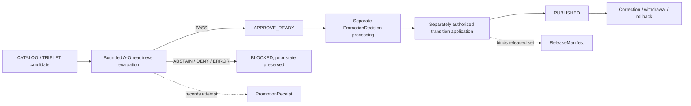
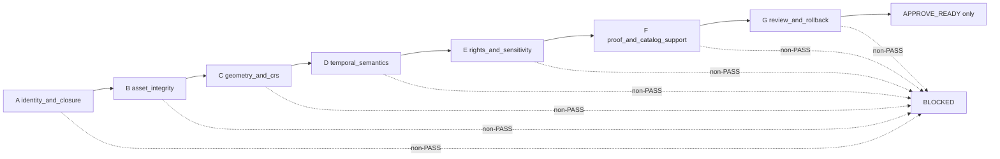
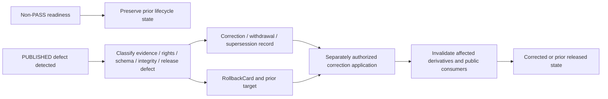

<!-- [KFM_META_BLOCK_V2]
doc_id: kfm://doc/architecture/publication/release-gates
title: Release Gates — Current Final-Readiness Boundary
type: architecture-reference
version: v2.0-draft
status: draft; repository-grounded; conflicted-vocabulary; fixture-first; operational-release-hold; non-authoritative; non-publication
owners:
  - "@bartytime4life — verified CODEOWNERS review route"
  - "NEEDS VERIFICATION — independent release, policy, evidence, review, security/signing, correction, and rollback stewardship"
created: 2026-05-14
updated: 2026-08-19
policy_label: public; architecture; publication; promotion; release; correction; rollback; cite-or-abstain
owning_root: docs/
responsibility: Explain the current release-readiness boundary, its bounded executable profile, vocabulary conflicts, object-family separation, operational holds, and graduation requirements without becoming contract, schema, policy, evidence, review, receipt, proof, release, transition, or publication authority.
truth_posture: >-
  CONFIRMED current path, accepted Directory Rules v2 placement, CODEOWNERS
  route, bounded no-network A-G readiness validator, fixture-first ReviewRecord,
  PromotionDecision, PromotionReceipt, ReleaseManifest, rollback, and
  geospatial-integrity surfaces / PROPOSED ADR-0018 final-readiness profile and
  unaccepted release object profiles / CONFLICTED lifecycle-wide, historical,
  detailed-release, and bounded final-readiness A-G vocabularies / UNKNOWN live
  evidence resolution, accepted policy execution, signer trust, authenticated
  independent review, transition application, public serving, correction
  propagation, and operational rollback / NEEDS VERIFICATION exact-head hosted
  checks, required-check coupling, generated-receipt integrity, governed
  consumers, and the first governed release.
current_path: docs/architecture/publication/RELEASE_GATES.md
evidence_snapshot:
  repository: bartytime4life/Kansas-Frontier-Matrix
  base_ref: main
  base_commit: d639f9ff40288d12244cd7bc84af538652f6dfb1
  target_prior_blob: f89a7fb84bac9a78c0cfb366c446eab7973c26c0
  publication_readme_blob: 4a3a44046619b5b705a9e687d6c3aead91db1a4c
  directory_rules_blob: fd49a0b83e55cef52c1124281f093e263526898d
  codeowners_blob: dd2a84aa514d8ecd9208bc347f90f9a2ed37dd61
  adr_0018_blob: 51cedfdf98b92f1a9af492ce3a1cde231eed9308
  promotion_gates_companion_blob: 6ae62f9778dd7ea2d67ea368683a002163b7cac1
  promotion_validator_blob: 143a8a9720d052870ca0adaa48894e4ce633d9d1
  promotion_validator_readme_blob: e729df0cc007e8cf0d9811afc25ec1f5ffbdffdd
  promotion_workflow_blob: 9b567aad17de2a7419a2a0238386745c1cb5c11c
  promotion_receipt_contract_blob: ed432f8e3e02d170589c9e04d78087a69346909d
  promotion_decision_contract_blob: 42295bfc83a621cf125d33aa821912b426f70bd2
  release_manifest_contract_blob: ce7dc89ff447d76d974afdd802b85a38538d8f48
  adr_0023_blob: 93576e7419e5723b5d7556cb811dc740dfc40a04
inspection_boundary: >-
  Current-session GitHub reads covered this complete target, the publication
  lane README and lifecycle-wide companion, ADR-0018, accepted Directory Rules
  placement, CODEOWNERS, the bounded A-G validator and workflow,
  PromotionDecision, PromotionReceipt, ReleaseManifest, promotion policy, the
  release root, and ADR-0023 geospatial-integrity boundary. No mounted checkout,
  local command execution, live EvidenceBundle resolution, accepted promotion
  policy evaluator, trusted signer, authenticated independent reviewer,
  release operator, deployment, public endpoint, correction propagation, or
  rollback execution was exercised.
related:
  - docs/architecture/publication/README.md
  - docs/architecture/publication/promotion-gates.md
  - docs/architecture/publication/release-objects.md
  - docs/architecture/publication/release-state-machine.md
  - docs/architecture/publication/rollback-and-correction.md
  - docs/architecture/publication/GEO_MANIFEST.md
  - docs/adr/ADR-0018-promotion-gate-sequence.md
  - docs/adr/ADR-0023-geo-manifest-signs-every-pmtiles-cog-release.md
  - docs/adr/ADR-0024-steward-separation-of-duties-for-release.md
  - docs/adr/ADR-0029-adopt-directory-governance-standard-v2.md
  - docs/doctrine/directory-rules.md
  - contracts/release/promotion_decision.md
  - contracts/release/promotion_receipt.md
  - contracts/release/release_manifest.md
  - policy/promotion/README.md
  - release/README.md
  - tools/validators/promotion_gate/README.md
  - .github/workflows/promotion-gate.yml
tags: [kfm, architecture, publication, release-gates, promotion-readiness, evidence, policy, review, correction, rollback, fixture-first, non-publication]
notes:
  - "v2.0-draft is a same-path documentation-only reconciliation against current repository evidence."
  - "The exact bounded A-G names are implemented but not accepted as architecture; ADR-0018 remains proposed with a REVISE checkpoint."
  - "The prior Structure-and-Metadata through Reviewability matrix is retained only as historical vocabulary in the conflict register."
  - "No release, transition, publication, deployment, source activation, policy activation, signer activation, or repository-setting change is performed."
[/KFM_META_BLOCK_V2] -->

<a id="top"></a>
<a id="release-gates"></a>

# Release Gates — Current Final-Readiness Boundary

> **Operating rule.** A release-readiness result may describe whether one declared candidate packet is ready for accountable decision processing. It does not approve, apply, release, deploy, publish, or authorize a public surface.

> [!IMPORTANT]
> **Current result: bounded readiness exists; operational release does not.** The repository has a deterministic, no-network A–G readiness validator, synthetic positive and negative fixtures, focused tests, a read-only workflow, and separate fixture-first release-object profiles. The current promotion policy lane is inactive, support references are not authenticated by the bounded validator, independent release authority is not established, and no transition application or publication path is proved.

> [!CAUTION]
> **A–G is overloaded.** The bounded validator, lifecycle-wide companion document, this file's prior edition, and earlier ADR-0018 language assign different meanings to the letters. This page names those conflicts and uses the executable profile only as the current bounded implementation—not as an accepted canonical sequence.

> [!WARNING]
> **`PASS` is not `APPROVE`.** A bounded `PASS` maps only to `APPROVE_READY`. A schema-valid `PromotionDecision`, `PromotionReceipt`, `ReleaseManifest`, or `transition.applied: true` declaration is not proof that accountable approval, lifecycle mutation, release, or publication occurred.

| Field | Current evidence-backed result |
|---|---|
| **Document role** | Human-readable architecture reference under `docs/`; not doctrine, an ADR, semantic contract, schema, policy, evidence object, review, receipt, proof, release record, transition operator, or publication authority |
| **Placement** | `PLACE` — same-path update in `docs/architecture/publication/` under accepted Directory Rules v2 |
| **Evidence snapshot** | `main@d639f9ff40288d12244cd7bc84af538652f6dfb1` |
| **A–G executable** | CONFIRMED bounded, deterministic, no-network, read-only, non-publisher |
| **A–G architecture authority** | PROPOSED / CONFLICTED — ADR-0018 remains proposed with a `REVISE` checkpoint |
| **Promotion policy** | HOLD — two local Rego modules are no-op proposed stubs and are not executed by the promotion-gate workflow |
| **Release object profiles** | Mixed fixture-first / PROPOSED maturity; shape and local consistency only |
| **Independent review and signer trust** | NOT ESTABLISHED |
| **Transition application** | HOLD / not established |
| **Release, deployment, publication** | None performed or authorized by this document |
| **Review route** | `@bartytime4life` through CODEOWNERS; routing is not independent release authority |

## Quick Links

- [Purpose](#purpose)
- [Where Release Gates Fit](#where-release-gates-fit)
- [Operating Law](#operating-law)
- [The Gate Matrix (A–G)](#the-gate-matrix-ag)
- [Gate Families — Layered View](#gate-families--layered-view)
- [Required Artifacts per Gate](#required-artifacts-per-gate)
- [Finite Outcomes](#finite-outcomes)
- [Failure Reason Codes](#failure-reason-codes)
- [PMTiles and Tile-Publication Gates](#pmtiles-and-tile-publication-gates)
- [Universal Closure Rule](#universal-closure-rule)
- [Separation of Duties](#separation-of-duties)
- [Correction and Rollback](#correction-and-rollback)
- [Validation Expectations](#validation-expectations)
- [Anti-Patterns](#anti-patterns)
- [Verification Checklist](#verification-checklist)
- [Open Questions and NEEDS VERIFICATION](#open-questions-and-needs-verification)
- [Glossary](#glossary)
- [Related Docs and Schemas](#related-docs-and-schemas)

---

<a id="purpose"></a>

## Purpose

This page explains the current architecture and implementation boundary around a candidate already declared to be at `CATALOG` or `TRIPLET` and targeting `PUBLISHED`.

The phrase **release gate** currently covers several different concerns in the repository:

1. **Lifecycle-wide controls** from source admission through release.
2. **Final promotion-readiness checks** over one declared candidate packet.
3. **Accountable transition decisions** recorded separately as `PromotionDecision`.
4. **Attempt receipts and release manifests** that preserve process and artifact-set identity.
5. **Transition application** that would mutate governed lifecycle state.
6. **Public delivery checks** that prevent unreleased or unsafe carriers from being served.

This page keeps those responsibilities separate. Its primary job is to document the bounded final-readiness profile that exists today, expose the unresolved vocabulary conflict, and define what still must be proved before KFM can claim an operational release path.

### Non-effects

This document does not:

- accept ADR-0018 or any gate vocabulary;
- activate `policy/promotion/` or `policy/release/`;
- authenticate an `EvidenceRef`, `EvidenceBundle`, reviewer, stewardship assignment, signer, signature, or rollback target;
- emit a `PromotionDecision`, `PromotionReceipt`, `ReleaseManifest`, review, proof, receipt, correction notice, or rollback card;
- apply a lifecycle transition;
- change a public alias, cache, API, MapLibre source, export, or AI surface;
- release, deploy, publish, or change repository settings.

[Back to top](#top)

---

<a id="where-release-gates-fit"></a>

## Where Release Gates Fit

The KFM lifecycle remains a governance sequence:

```text
RAW -> WORK / QUARANTINE -> PROCESSED -> CATALOG / TRIPLET -> PUBLISHED
```

The current executable profile begins only after a candidate declares that it is at `CATALOG` or `TRIPLET`. It does not replace source admission, processing, validation, catalog closure, or other upstream controls.


```mermaid
flowchart LR
  C["CATALOG / TRIPLET candidate"] --> R["Bounded A-G readiness evaluation"]
  R -->|PASS| AR["APPROVE_READY"]
  R -->|ABSTAIN / DENY / ERROR| B["BLOCKED; prior state preserved"]
  AR --> D["Separate PromotionDecision processing"]
  D --> X["Separately authorized transition application"]
  X --> P["PUBLISHED"]
  R -. records attempt .-> PR["PromotionReceipt"]
  X -. binds released set .-> RM["ReleaseManifest"]
  P --> CR["Correction / withdrawal / rollback"]
```

The arrows show logical responsibility, not current runtime wiring. The bounded validator emits findings and readiness only. The later decision, receipt, manifest, transition, public serving, correction, and rollback steps remain separately governed.

### Trust-membrane consequence

A public client must not infer release from:

- a candidate path;
- an A–G `PASS`;
- `APPROVE_READY`;
- a green workflow;
- a schema-valid `APPROVE`;
- a receipt with `transition.applied: true`;
- a manifest-shaped fixture;
- a signature-shaped sidecar;
- a merged pull request or deployed artifact.

Public clients and ordinary UI surfaces consume only governed, released, public-safe carriers through the accepted delivery boundary.

[Back to top](#top)

---

<a id="operating-law"></a>

## Operating Law

| # | Invariant | Release-gate consequence |
|---:|---|---|
| 1 | Promotion is a governed state transition, not a file move, merge, deployment, alias update, or badge. | Readiness and release application remain separate. |
| 2 | Documentation explains authority but cannot create contract, schema, policy, review, release, or publication authority. | This page records current evidence and holds; it does not settle them. |
| 3 | `EvidenceRef` should resolve to `EvidenceBundle` before consequential claims become authoritative. | Presence of a reference is not evidence closure. |
| 4 | Maps, tiles, graphs, indexes, dashboards, scenes, exports, and AI output are downstream carriers. | A rendered or generated surface cannot satisfy a release gate by itself. |
| 5 | Policy source, policy evaluation, readiness validation, accountable review, transition decision, receipt, manifest, and state application are distinct. | No single object or green check substitutes for the others. |
| 6 | Fail-closed defaults apply to missing, stale, contradictory, unverified, unsafe, or errored context. | Any non-`PASS` bounded result preserves the prior lifecycle state. |
| 7 | Deterministic identity and replay are preferred. | Candidate, specification, artifact, evaluation, decision, receipt, and release identities remain explicit and non-interchangeable. |
| 8 | Rights, sensitivity, sovereignty, protected locations, living-person data, archaeology, infrastructure, and other harmful precision require appropriate review. | Declared public-safe labels are not proof of clearance. |
| 9 | Policy-significant release duties require accountable separation when materiality justifies it. | CODEOWNERS routing and synthetic actor inequality do not prove independent authority. |
| 10 | Correction and rollback are release prerequisites, not post hoc conveniences. | Gate G may check declarations, but operational usability still needs separate proof. |
| 11 | Receipts, proofs, decisions, manifests, reviews, corrections, rollback records, and published carriers remain distinct object families. | References join families; files do not collapse them. |
| 12 | Public clients use governed interfaces and released carriers, not canonical or internal stores. | A readiness output is never a public-serving permission. |

[Back to top](#top)

---

<a id="the-gate-matrix-ag"></a>

## The Gate Matrix (A–G)

The table below describes the **current executable bounded profile** implemented by `tools/validators/promotion_gate/validate_promotion_gate.py` and documented by its adjacent README. The exact names are repository facts. Their use as the accepted KFM architecture remains **PROPOSED** in ADR-0018.

| Gate | Exact executable name | Bounded responsibility | Minimum local `PASS` posture | Explicitly outside the bounded validator |
|:---:|---|---|---|---|
| **A** | `identity_and_closure` | Candidate/profile/author/spec identity, declared lifecycle boundary, and minimal release-manifest closure | Exact profile; non-empty candidate and author; SHA-256 `spec_hash`; declared `CATALOG` or `TRIPLET` to `PUBLISHED`; minimal manifest identity | Accepted candidate and manifest contracts; source authority; real object existence; complete release closure |
| **B** | `asset_integrity` | Candidate, manifest, and run-receipt specification and artifact-digest agreement | Matching specification hashes; valid, unique digest sets; manifest/receipt artifact-set equality | Actual byte retrieval; repository-wide canonicalization policy; immutable storage; trusted signing |
| **C** | `geometry_and_crs` | Declared geometry validity, deterministic processing, CRS, and finite ordered bounds | `valid: true`; `deterministic: true`; `EPSG:4326`; bounded world bbox | Domain topology; scientific fitness; sensitivity transforms; authoritative geometry retrieval |
| **D** | `temporal_semantics` | Strict UTC-second evaluation and candidate temporal ordering | Canonical UTC timestamps; `start <= end`; declared evaluation instant | Source freshness policy; bitemporal authority; trusted external clock |
| **E** | `rights_and_sensitivity` | Declared policy profile, labels, public-safe discipline, and finite supplied policy result | Known profile and labels; valid public-safe combination; supplied result not denied or errored | Execution of current Rego; rights, consent, sovereignty, or sensitivity truth; accepted evaluator/bundle |
| **F** | `proof_and_catalog_support` | Declared evidence, attestation, run-receipt, catalog, and conditional AI-receipt support | Required reference arrays present; STAC/DCAT/PROV support declared; AI receipt when mediation is declared | URI resolution; `EvidenceBundle` truth; cryptographic verification; catalog integrity beyond declarations |
| **G** | `review_and_rollback` | Fixture-only review shape, declared actor/authority intervals, separation, subject/hash binding, rollback, and correction linkage | Declared approving review; closed obligations; canonical distinct actors; current declared intervals; matching subject and hashes; rollback/correction declarations | Live identity and authority registry; reviewer qualification; independent approval; actual rollback usability; correction propagation |

### Evaluation semantics

- The profile binds one declared packet and one packet-supplied evaluation instant.
- Gate statuses are `PASS`, `ABSTAIN`, `DENY`, or `ERROR`.
- Precedence is `ERROR > DENY > ABSTAIN > PASS`.
- Overall `PASS` maps to `APPROVE_READY`; every other result maps to `BLOCKED`.
- The validator may evaluate all seven gates for deterministic diagnostics rather than short-circuiting after the first failure.
- No non-`PASS` packet may become ready.
- `APPROVE_READY` means eligible for separately governed decision processing only.


```mermaid
flowchart LR
  A["A identity_and_closure"] --> B["B asset_integrity"]
  B --> C["C geometry_and_crs"]
  C --> D["D temporal_semantics"]
  D --> E["E rights_and_sensitivity"]
  E --> F["F proof_and_catalog_support"]
  F --> G["G review_and_rollback"]
  G --> READY["APPROVE_READY only"]
  A -. non-PASS .-> BLOCK["BLOCKED"]
  B -. non-PASS .-> BLOCK
  C -. non-PASS .-> BLOCK
  D -. non-PASS .-> BLOCK
  E -. non-PASS .-> BLOCK
  F -. non-PASS .-> BLOCK
  G -. non-PASS .-> BLOCK
```

[Back to top](#top)

---

<a id="gate-families--layered-view"></a>

## Gate Families — Layered View

The repository currently contains several valid-but-incompatible uses of A–G. Scope must be named explicitly; the same letter must never be treated as proof that a different concern passed.

### Vocabulary conflict register

| Surface | A–G scope | Current disposition |
|---|---|---|
| Bounded validator, validator README, and `PromotionReceipt` | Final `CATALOG`/`TRIPLET` to `PUBLISHED` readiness: identity, integrity, geometry, time, rights/sensitivity context, support, review/rollback | CONFIRMED fixture-first implementation; non-authoritative |
| ADR-0018 v1.5 | Proposes the same bounded final-readiness names | PROPOSED; governance checkpoint `REVISE` |
| `promotion-gates.md` | Lifecycle-wide controls: source admission, provenance, sensitivity, validation, evidence closure, review, release | Draft / CONFLICTED with final-readiness letter meanings |
| Prior edition of this file | Structure/metadata, schemas/contracts, policy parity, security/sensitivity, data quality, provenance/lineage, reviewability | Historical vocabulary; not current executable naming |
| ADR-0018 v1.4 | `schema_valid`, `inputs_pinned`, `checks_pass`, `signatures_valid`, `provenance_complete`, `no_policy_violations`, `release_ready` | Historical proposal vocabulary inside ADR-0018 |

### Layered check families

These check families remain useful when they are not assigned an ambiguous A–G letter:

| Family | Question | Current boundary |
|---|---|---|
| Source admission | Is the source identity, role, rights, cadence, and sensitivity posture admitted? | Upstream of the bounded final-readiness profile |
| Shape and meaning | Do semantic contracts and machine schemas agree with the object? | Contract/schema validators own this; bounded A–G checks a narrow packet profile |
| Evidence | Do references resolve to authentic, current `EvidenceBundle` support? | Not performed by the bounded validator |
| Policy | Did an accepted policy bundle evaluate the exact input under a governed evaluator? | Not established for `policy/promotion/` |
| Review | Is the reviewer authenticated, qualified, assigned, current, independent, and subject-bound? | Only synthetic declarations are checked today |
| Integrity | Do digests, bytes, attestations, and signer trust close? | Local digest relationships are checked; production trust is held |
| Decision | Did an accountable authority emit a governed `PromotionDecision`? | Contract/schema fixture surface exists; authenticated decision not established |
| Receipt | Did one promotion attempt emit an internally consistent `PromotionReceipt`? | Fixture-first validator exists; authenticity and transition remain external |
| Release | Did a separately authorized operator apply state and emit authoritative release records? | HOLD / not established |
| Public parity | Do API, map, export, cache, search, and AI consumers serve only the released state? | UNKNOWN / not operationally proved |

### Reconciliation rule

Until a reviewed decision and migration close the conflict:

1. Say **lifecycle-wide promotion controls** for the source-admission-through-release narrative.
2. Say **final promotion-readiness A–G** for `kfm/promotion-readiness/A-G/v1`.
3. Use exact gate names, not letters alone, in requirements and review comments.
4. Do not rename workflows or public check contexts without compatibility analysis.
5. Preserve historical terminology in a crosswalk rather than silently deleting it.

[Back to top](#top)

---

<a id="required-artifacts-per-gate"></a>

## Required Artifacts per Gate

The current implementation checks a **bounded input packet**. That packet is not a new release object family and is not persisted by the validator.

| Surface or object family | Owning responsibility | Current repository evidence | What is not proved |
|---|---|---|---|
| Bounded readiness packet | `tools/validators/promotion_gate/` input profile | Deterministic parser, exact A–G checks, fixtures, tests, CLI, no writes, no network | Accepted semantic contract; persisted record; source/evidence authenticity |
| Fixture-only `ReviewRecord` projection | Governance contract/schema/validator/test surfaces | Shape, canonical identity syntax, declared intervals, separation, scope, subject, and hash binding checks | Live identity, assignment, qualification, independence, authority, or review record |
| `PromotionDecision` | `contracts/release/`, paired schema and release decision plane | PROPOSED contract/schema with `APPROVE`, `DENY`, `ABSTAIN` fixtures and tests | Authenticated accountable decision; transition application; public permission |
| `PromotionReceipt` | `contracts/release/`, paired schema/validator/test/workflow | PROPOSED receipt profile; exactly seven gates; canonical receipt-digest and transition-declaration checks | Evidence, policy, review, attestation authenticity; actual transition |
| `ReleaseManifest` | `contracts/release/`, paired schema/validator/workflow, persisted records under `release/` | Legacy permissive branch plus closed `PROPOSED_INACTIVE` fixture profile | Reference resolution, byte/signature verification, release persistence, public serving |
| Evidence, attestation, and catalog refs | Evidence/proof/catalog owners | Gate F requires declared arrays and STAC/DCAT/PROV support | URI resolution, `EvidenceBundle` truth, signer trust, cross-profile catalog integrity |
| Policy context | `policy/promotion/` and policy decision surfaces | Gate E checks a supplied finite declaration | Execution of current Rego; accepted bundle, selector, evaluator, or governed consumer |
| Run receipt and artifact digests | Receipt and artifact owners | Gate B checks specification and declared digest-set equality | Actual bytes, immutable storage, trusted producer, signature, or transparency proof |
| Rollback and correction declarations | Release/correction/rollback owners | Gate G checks presence and internal binding | Usable prior state, correction propagation, cache invalidation, restoration drill |
| Release decision records | `release/` | Canonical append-only decision root under Directory Rules v2 | Operational release assembly, independent authority, transition execution |
| Public-safe carriers | `data/published/` | Canonical carrier responsibility documented | A production carrier bound to an authenticated release and governed public consumer |

### Object-family separation

```text
contracts/                     semantic meaning
schemas/                       machine shape
policy/                        admissibility rules
tools/validators/              bounded executable checks
fixtures/ and tests/           synthetic proof
data/receipts/                 process memory
data/proofs/                   evidence and proof support
release/                       append-only release decisions and records
data/published/                released public-safe carriers
apps/governed-api/             governed public delivery
apps/explorer-web/             downstream user interface
```

A reference may connect these families. It must not collapse their authority into one file.

[Back to top](#top)

---

<a id="finite-outcomes"></a>

## Finite Outcomes

KFM currently uses several finite vocabularies for different responsibilities. They are related but not interchangeable.

| Responsibility | Vocabulary | Meaning |
|---|---|---|
| One bounded A–G gate | `PASS`, `ABSTAIN`, `DENY`, `ERROR` | Local readiness result for one gate |
| Overall bounded readiness | `PASS`, `ABSTAIN`, `DENY`, `ERROR` | Fail-closed aggregate over seven gates |
| Readiness routing | `APPROVE_READY`, `BLOCKED` | Whether the packet may proceed to accountable decision processing |
| `PromotionDecision` | `APPROVE`, `DENY`, `ABSTAIN` | Separately governed transition decision |
| Runtime/policy envelope | `ANSWER`, `ABSTAIN`, `DENY`, `ERROR` | Request-time or policy response vocabulary |
| Strict fixture `ReleaseManifest` validator | `PASS`, `FAIL`, `ERROR` | Local candidate-shape result |
| GitHub Actions | job/check conclusion | CI execution state, not a release decision |
| Receipt transition field | `applied: true` or `false` | Declaration inside a receipt, not sovereign proof |

### Deterministic bounded mapping

```text
ERROR > DENY > ABSTAIN > PASS

PASS  -> APPROVE_READY
other -> BLOCKED
```

### Validator exit-code contract

| Exit | Bounded validator result |
|:---:|---|
| `0` | `PASS` |
| `1` | `ABSTAIN` or `DENY` |
| `2` | `ERROR` |

There is no current exit code `3` for abstention in the executable profile.

> [!IMPORTANT]
> A green workflow can prove that a hold or negative fixture behaved correctly. Green does not mean that the candidate, policy, review, release, or public-serving prerequisites are satisfied.

[Back to top](#top)

---

<a id="failure-reason-codes"></a>

## Failure Reason Codes

The executable validator owns the current stable bounded reason-code registry in its `CODE_META` table. This page summarizes representative codes; it does not create a competing catalog.

| Gate | Representative current codes | Finite posture |
|:---:|---|---|
| Input | `FIXTURE_JSON_INVALID`, `FIXTURE_TOO_LARGE`, `PG_INPUT_DOCUMENT_INVALID` | `ERROR` |
| A | `PG_A_CANDIDATE_ID_MISSING`, `PG_A_SPEC_HASH_INVALID`, `PG_A_LIFECYCLE_BOUNDARY_INVALID`, `PG_A_RELEASE_MANIFEST_MISSING` | `DENY` |
| B | `PG_B_RUN_RECEIPT_MISSING`, `PG_B_SPEC_HASH_MISMATCH`, `PG_B_ARTIFACT_DIGEST_INVALID`, `PG_B_ARTIFACT_SET_MISMATCH` | `DENY` |
| C | `PG_C_GEOMETRY_INVALID`, `PG_C_GEOMETRY_NONDETERMINISTIC`, `PG_C_CRS_INVALID`, `PG_C_BBOX_INVALID` | `DENY` |
| D | `PG_D_TEMPORAL_INVALID`, `PG_D_TEMPORAL_ORDER_INVALID`, `PG_D_GATE_EVALUATED_AT_INVALID` | `DENY` |
| E | `PG_E_POLICY_PROFILE_UNKNOWN`, `PG_E_POLICY_LABEL_UNKNOWN`, `PG_E_PUBLIC_SAFE_LABEL_INVALID`, `PG_E_POLICY_DENY` | `DENY` |
| E | `PG_E_POLICY_EVALUATION_ERROR` | `ERROR` |
| F | `PG_F_EVIDENCE_REF_MISSING` | `ABSTAIN` |
| F | `PG_F_ATTESTATION_REF_MISSING`, `PG_F_CATALOG_CLOSURE_MISSING`, `PG_F_AI_RECEIPT_MISSING` | `DENY` |
| G | `PG_G_REVIEW_OBLIGATIONS_OPEN`, `PG_G_REVIEW_AUTHORITY_MISSING`, `PG_G_CORRECTION_LINK_MISSING` | `ABSTAIN` |
| G | `PG_G_REVIEW_NOT_APPROVED`, `PG_G_REVIEW_STALE`, `PG_G_REVIEW_SUPERSEDED`, `PG_G_SEPARATION_OF_DUTIES_INVALID`, `PG_G_ROLLBACK_TARGET_INVALID` | `DENY` |
| G | `PG_G_REVIEW_VALIDATION_ERROR` | `ERROR` |

Every gate also rejects undeclared fields with a gate-local `PG_<GATE>_UNDECLARED_FIELD` code. Diagnostics report stable code, gate, bounded parent path, and status without echoing untrusted values or field names.

### Recovery discipline

| Result | Recovery posture |
|---|---|
| `ABSTAIN` | Supply or resolve the missing support; do not reinterpret uncertainty as permission. |
| `DENY` | Correct the unsafe or contradictory condition, obtain required review, or preserve the denial. |
| `ERROR` | Repair the parser, evaluator, input, or environment; never fall back to allow. |
| `PASS` | Proceed only to separately governed decision processing. |

The prior generic codes `UNVERIFIED_TILE_CHUNK`, `PUBLIC_UNSIGNED_DELTA`, and `ROLLBACK_ROOT_MISMATCH` were found only in the prior edition of this page, not in the current bounded validator registry. They are not presented here as implemented gate outcomes.

[Back to top](#top)

---

<a id="pmtiles-and-tile-publication-gates"></a>

## PMTiles and Tile-Publication Gates

Geospatial carriers need additional integrity evidence, but current repository evidence does not support treating the old PMTiles diagram or BAO/cosign/browser sequence as an operational global gate extension.

### Current bounded profile register

| Surface | Current evidence | Hold |
|---|---|---|
| `KFMGeoManifest` | Closed fixture-first shape, deterministic validator, synthetic fixtures, focused tests, and read-only CI | Accepted canonical signed release profile |
| PMTiles attestation | Structural header/archive/PMIDX/split-bundle/declared-manifest/RunReceipt-subject and shape-only PMSIG checks | Trusted signature verification, signer registry, key policy, release authority |
| COG byte-range integrity | Synthetic whole-file and explicit range SHA-256 replay candidate | TIFF/COG conformance, live HTTP Range, trusted signature, release |
| Map release manifest | Fixture profile modeling release closure | Authenticated records, real carrier bytes, public alias/cache transition |
| Tile publication policy | Default-deny policy source exists | Accepted bundle, evaluator, governed consumer, enforcement evidence |
| ADR-0023 | Proposed rule that every released PMTiles/COG carrier have one immutable manifest and approved cryptographic binding | Acceptance and implementation graduation |

### Safe architectural relationship

Carrier-specific integrity profiles may become inputs to:

- Gate B `asset_integrity`;
- Gate F `proof_and_catalog_support`;
- Gate G `review_and_rollback`; and
- the later release-application/public-serving boundary.

That mapping remains **PROPOSED** until accepted. A shape-valid sidecar, sampled range, digest, or signature-shaped fixture does not prove:

- trusted cryptography;
- an approved builder or signer;
- promotion or release approval;
- public alias or CDN activation;
- MapLibre/client enforcement;
- correction propagation; or
- operational rollback.

No current evidence supports claiming that browser workers verify a BAO root before `addSource`, that a CDN refuses unverified deltas, or that any PMTiles/COG carrier has crossed a governed production release path.

[Back to top](#top)

---

<a id="universal-closure-rule"></a>

## Universal Closure Rule

Two kinds of closure must remain distinct.

### 1. Bounded declared closure — implemented

The current validator can prove that one bounded packet:

- parses under the local profile;
- contains required declared fields;
- has internally consistent identities, specification hashes, digest sets, time, geometry, policy labels, review declarations, and rollback/correction references;
- produces deterministic finite findings; and
- causes no network access, writes, release record, or lifecycle mutation.

This is valuable repository evidence. It is not operational release closure.

### 2. Operational release closure — not established

A production release path would need to prove, at minimum:

1. the candidate, source, evidence, policy, review, attestation, catalog, decision, receipt, manifest, correction, and rollback references exist and resolve;
2. referenced bytes and digests match under accepted canonicalization profiles;
3. an accepted policy bundle evaluated the exact input through a governed evaluator;
4. reviewers are authenticated, qualified, assigned, current, subject-bound, and independent where required;
5. signer identity, trust roots, key rotation/revocation, and signature verification are accepted and operational;
6. an accountable `PromotionDecision` authorizes the exact transition;
7. a `PromotionReceipt` records the attempt without substituting for the decision;
8. a complete `ReleaseManifest` binds the released artifact set and prior/rollback state;
9. a separately authorized operator applies the transition and emits auditable records;
10. correction, withdrawal, supersession, invalidation, and rollback paths are usable;
11. public API, map, export, search, cache, and AI consumers serve only the released public-safe state; and
12. replay and rollback/correction drills reproduce the intended behavior.

Missing any required item preserves the prior lifecycle state. This page cannot declare an operationally closed release because the necessary current-session evidence is absent.

[Back to top](#top)

---

<a id="separation-of-duties"></a>

## Separation of Duties

### Current evidence

- CODEOWNERS routes relevant repository paths to `@bartytime4life`.
- CODEOWNERS explicitly says routing is not a `StewardshipAssignment`, `ReviewRecord`, release approval, publication authority, or proof that review occurred.
- Gate G validates synthetic declarations for actor inequality, canonical identity syntax, time intervals, scope, subject, and hash binding.
- No live identity or stewardship registry is queried.
- No independent release steward, authenticated review authority, or enforced author/approver separation was established in the inspected evidence.
- ADR-0024 exists as the separation-of-duties decision surface; its operational enforcement remains separate evidence.

### Graduation requirements

| Concern | Current bounded proof | Required operational proof |
|---|---|---|
| Actor identity | Canonical synthetic identifier shape | Authenticated identity token and issuer |
| Steward assignment | Supplied interval declaration | Authoritative assignment registry and scope |
| Reviewer qualification | Not proved | Accepted role/qualification policy |
| Independence | Declared author/reviewer inequality | Enforced separation and current assignment |
| Review freshness | Supplied UTC intervals | Revocation/supersession-aware registry lookup |
| Subject binding | Candidate/spec/artifact hashes compared | Immutable referenced objects and authenticated review |
| Release authority | Not proved | Separately authorized release decision and operator |
| Repository enforcement | Workflow checks exist | Required-check and review coupling verified in settings |

Until those requirements close, a release that materially depends on independent review remains on HOLD.

[Back to top](#top)

---

<a id="correction-and-rollback"></a>

## Correction and Rollback

Correction and rollback are required release concerns, but current repository evidence is fixture-first and documentation-heavy rather than operational.


```mermaid
flowchart LR
  N["Non-PASS readiness"] --> KEEP["Preserve prior lifecycle state"]
  P["PUBLISHED defect detected"] --> CLASS["Classify evidence / rights / schema / integrity / release defect"]
  CLASS --> CN["Correction / withdrawal / supersession record"]
  CLASS --> RC["RollbackCard and prior target"]
  CN --> AUTH["Separately authorized correction application"]
  RC --> AUTH
  AUTH --> INV["Invalidate affected derivatives and public consumers"]
  INV --> SAFE["Corrected or prior released state"]
```

### Current bounded evidence

- Gate G checks declared rollback and correction linkage.
- RollbackCard and release-alias verification have fixture-first profiles.
- Release and publication architecture documents define correction, withdrawal, supersession, invalidation, and rollback expectations.
- `release/` is the canonical append-only decision plane.
- Public-safe carriers remain separate under `data/published/`.

### Current holds

- No operational rollback target was resolved in this documentation run.
- No release alias or public cache was mutated.
- No correction propagated through catalog, graph, tiles, search, API, MapLibre, export, or AI surfaces.
- No rollback operator applied prior state.
- No authenticated correction or release authority was established.
- No rollback/correction drill was executed here.

Rollback must never be represented as a hidden file copy. It is a separately governed transition with its own decision, evidence, record, invalidation scope, and audit trail.

[Back to top](#top)

---

<a id="validation-expectations"></a>

## Validation Expectations

### Current repository entry points

```bash
make publish-check

python tools/validators/validate_promotion_gate.py --fixtures
python tools/validators/validate_review_record.py --fixtures

python tools/validators/release/validate_promotion_receipt.py --fixtures
python -m unittest -q tests.release.test_promotion_receipt
```

The bounded promotion validator uses the Python standard library plus the repository's bounded-fixture helper, performs no network access, and writes no artifact.

### Current fixture posture

The adjacent validator README records:

- one `PASS` fixture;
- twelve `DENY` fixtures;
- three `ABSTAIN` fixtures;
- two `ERROR` fixtures;
- focused tests for A–G results, precedence, parser behavior, deterministic output, no emission, and network denial; and
- fixture-only ReviewRecord checks composed into Gate G.

### Workflow boundary

`.github/workflows/promotion-gate.yml` is read-only and preserves these job identities:

- `doctrine-artifact-prereq`;
- `doctrine-artifact-schema`;
- `promotion-prerequisites`; and
- `review-records-present`.

The workflow can pass while explicitly proving that a prerequisite remains held. It does not emit an `EvidenceBundle`, `ReviewRecord`, `PromotionDecision`, receipt, proof, manifest, rollback card, signature, release, or public artifact.

### What validation must not claim

A passing local or hosted check does not prove:

- accepted gate vocabulary;
- evidence truth or reference resolution;
- policy execution;
- rights or sensitivity clearance;
- signer trust;
- reviewer authority;
- transition application;
- release persistence;
- public serving;
- correction propagation; or
- rollback execution.

This documentation update records repository entry points. It does not claim they were executed locally in this connector session. Exact-head hosted results remain separate evidence.

[Back to top](#top)

---

<a id="anti-patterns"></a>

## Anti-Patterns

- **Letter equivalence.** Treating Gate A in the lifecycle-wide document as the same check as Gate A in the bounded final-readiness profile.
- **`PASS` laundering.** Turning `APPROVE_READY` into `APPROVE`, `PROMOTED`, `RELEASED`, or `PUBLISHED`.
- **Receipt-as-decision.** Treating `PromotionReceipt` as `PromotionDecision`.
- **Declaration-as-event.** Treating `transition.applied: true` as proof that state changed.
- **Manifest-as-publication.** Treating a schema-valid `ReleaseManifest` as a released carrier or public permission.
- **Reference-as-resolution.** Counting a URI or ID without authenticating and resolving its target.
- **No-op-policy-as-enforcement.** Treating `default deny := false` stubs or a policy directory name as a functioning promotion policy.
- **Green-workflow-as-authority.** Treating CI success as review, release, deployment, or publication.
- **Synthetic-review-as-human-approval.** Treating fixture actor inequality as authenticated separation of duties.
- **Shape-only-signature.** Treating PMSIG, DSSE, COSE, or cosign-shaped data as trusted cryptographic verification.
- **Object-family collapse.** Storing policy in release records, receipts in proofs, published payloads in `release/`, or release decisions in `data/published/`.
- **Public bypass.** Allowing API, UI, map, export, cache, search, or AI clients to read candidate/internal state directly.
- **Hidden rollback.** Copying prior bytes without a governed rollback decision, correction path, and derivative invalidation.
- **Invented reason-code catalog.** Documenting codes not emitted by the current validator as implemented behavior.
- **Documentation authority inflation.** Using this page to accept an ADR, activate policy, or claim operational maturity.

[Back to top](#top)

---

<a id="verification-checklist"></a>

## Verification Checklist

Use this checklist for a future gate change, release-readiness profile change, or operational graduation proposal.

### Vocabulary and authority

- [ ] The exact profile and scope are named; letters are never used without names.
- [ ] ADR-0018 is accepted, revised again, or explicitly remains a HOLD.
- [ ] Lifecycle-wide gate documentation is crosswalked or renamed without breaking consumers.
- [ ] Stable workflow check names and inbound links are inventoried before migration.

### Evidence, policy, review, and integrity

- [ ] Every required reference resolves to an authentic, current object.
- [ ] `EvidenceRef -> EvidenceBundle` resolution is proved for release-visible claims.
- [ ] Accepted promotion policy has a versioned input/output contract, native tests, immutable bundle identity, evaluator, selector, and governed consumer.
- [ ] Rights, sensitivity, consent, sovereignty, and public-safe transforms are resolved for the intended audience.
- [ ] Signatures verify against accepted trust roots, signer policy, rotation, and revocation state.
- [ ] Reviewers are authenticated, qualified, assigned, current, subject-bound, and independent where required.

### Decision, receipt, manifest, and transition

- [ ] Bounded readiness is complete and replayable.
- [ ] Accountable `PromotionDecision` references the exact candidate and readiness/support packet.
- [ ] `PromotionReceipt` records the attempt and canonical digest without replacing the decision.
- [ ] `ReleaseManifest` binds exact carrier bytes, evidence, policy, review, attestations, correction, and rollback.
- [ ] A separately authorized operator applies the transition.
- [ ] Prior and resulting lifecycle states are independently verifiable.

### Correction, rollback, and public parity

- [ ] Correction, withdrawal, supersession, invalidation, and rollback records are complete.
- [ ] A realistic rollback/correction drill passes without bypass.
- [ ] API, MapLibre, export, search, cache, catalog, graph, and AI consumers serve only released public-safe state.
- [ ] Bypass attempts fail closed.
- [ ] Exact-head focused and aggregate checks are classified as introduced, inherited, or external.
- [ ] Repository rules and required-review/check coupling are verified separately from workflow source.

[Back to top](#top)

---

<a id="open-questions-and-needs-verification"></a>

## Open Questions and NEEDS VERIFICATION

| ID | Status | Question or hold | Evidence needed |
|---|---|---|---|
| `RG-OPEN-001` | PROPOSED / REVISE | Will ADR-0018 adopt the bounded final-readiness names, select another profile, or remain proposed? | Accepted ADR decision and migration scope |
| `RG-OPEN-002` | CONFLICTED | How will lifecycle-wide A–G terminology be crosswalked or renamed? | Link/consumer inventory, compatibility plan, reviewed docs migration |
| `RG-OPEN-003` | HOLD | When will `policy/promotion/` become an accepted fail-closed policy implementation? | Contract, schema, native Rego tests, bundle, evaluator, selector, consumer, receipts |
| `RG-OPEN-004` | NEEDS VERIFICATION | Which PromotionDecision, PromotionReceipt, and ReleaseManifest profiles will be accepted and how will legacy compatibility be retired? | Contract/schema decision, fixtures, migration note, consumer evidence |
| `RG-OPEN-005` | UNKNOWN | Which identity and stewardship system authenticates independent review and release authority? | Accepted identity/assignment contracts and operational registry |
| `RG-OPEN-006` | HOLD | Which signing profile, trust roots, rotation, revocation, offline, and transparency rules govern release artifacts? | Accepted signing ADR/policy and target-environment proof |
| `RG-OPEN-007` | HOLD | Which operator applies the lifecycle transition, and how is prior/current state verified? | Release operator contract, tests, append-only records, replay evidence |
| `RG-OPEN-008` | NEEDS VERIFICATION | Is PromotionReceipt generated-receipt integrity green at the exact current head? | Exact-head hosted workflow evidence from the legitimate receipt producer |
| `RG-OPEN-009` | PROPOSED | How do PMTiles, COG, KFMGeoManifest, and MapReleaseManifest checks map into final readiness and release application? | ADR-0023 disposition and accepted profile composition |
| `RG-OPEN-010` | UNKNOWN | Can correction and rollback propagate through all public derivatives and caches? | End-to-end correction/rollback drill and invalidation receipts |
| `RG-OPEN-011` | UNKNOWN | Do governed API, Explorer, map, export, catalog, graph, search, and AI consumers enforce released-state parity? | Current code, integration tests, runtime logs, and deployed checks |
| `RG-OPEN-012` | NEEDS VERIFICATION | Which hosted checks and review rules are required by repository settings? | Ruleset, branch-protection, environment, and check-context inspection |
| `RG-OPEN-013` | UNKNOWN | What is the first representative governed release candidate and accountable review packet? | Steward decision, bounded scope, public-safe fixture, acceptance evidence |

[Back to top](#top)

---

<a id="glossary"></a>

## Glossary

| Term | Meaning in this page |
|---|---|
| **Lifecycle-wide promotion controls** | Controls distributed from source admission through release; not the same as final readiness. |
| **Final promotion-readiness A–G** | The bounded `kfm/promotion-readiness/A-G/v1` profile over a declared `CATALOG`/`TRIPLET` candidate. |
| **Gate status** | `PASS`, `ABSTAIN`, `DENY`, or `ERROR` for one bounded readiness gate. |
| **`APPROVE_READY`** | A bounded packet may proceed to accountable decision processing. It is not approval. |
| **`PromotionDecision`** | Separate release-family decision with `APPROVE`, `DENY`, or `ABSTAIN`. |
| **`PromotionReceipt`** | Process record for one promotion attempt and its declared A–G outcomes. |
| **`ReleaseManifest`** | Release binding for the authoritative artifact set; shape alone does not make it authoritative. |
| **Transition application** | Separately authorized mutation of governed lifecycle state. |
| **Declared closure** | Syntactic presence and local consistency proved by the bounded validator. |
| **Operational closure** | Authenticated, resolved, policy-evaluated, reviewed, signed, applied, correctable, reversible, and publicly enforced release state. |
| **Fail closed** | Missing, stale, contradictory, denied, unsupported, or errored context preserves the prior state. |
| **Object-family separation** | Contracts, schemas, policy, reviews, decisions, receipts, proofs, manifests, corrections, rollback records, and carriers retain distinct owners. |
| **Public parity** | Every downstream consumer presents only the same governed released public-safe state. |

[Back to top](#top)

---

<a id="related-docs-and-schemas"></a>

## Related Docs and Schemas

| Reference | Current role and posture |
|---|---|
| [`README.md`](README.md) | Repository-grounded publication-lane orientation and conflict register |
| [`promotion-gates.md`](promotion-gates.md) | Draft lifecycle-wide A–G narrative; letter meanings conflict with bounded readiness |
| [`release-objects.md`](release-objects.md) | Publication object-family catalog; mixed maturity |
| [`release-state-machine.md`](release-state-machine.md) | Explanatory lifecycle/release-state narrative; not a transition engine |
| [`rollback-and-correction.md`](rollback-and-correction.md) | Concise correction/rollback architecture companion |
| [`GEO_MANIFEST.md`](GEO_MANIFEST.md) | Geospatial integrity-manifest architecture |
| [`../../adr/ADR-0018-promotion-gate-sequence.md`](../../adr/ADR-0018-promotion-gate-sequence.md) | Proposed final-readiness decision; checkpoint `REVISE` |
| [`../../adr/ADR-0023-geo-manifest-signs-every-pmtiles-cog-release.md`](../../adr/ADR-0023-geo-manifest-signs-every-pmtiles-cog-release.md) | Proposed PMTiles/COG release-binding decision |
| [`../../adr/ADR-0024-steward-separation-of-duties-for-release.md`](../../adr/ADR-0024-steward-separation-of-duties-for-release.md) | Separation-of-duties decision surface |
| [`../../adr/ADR-0029-adopt-directory-governance-standard-v2.md`](../../adr/ADR-0029-adopt-directory-governance-standard-v2.md) | Accepted Directory Rules v2 placement decision |
| [`../../doctrine/directory-rules.md`](../../doctrine/directory-rules.md) | Adopted placement bytes; path does not confer release authority |
| [`../../../tools/validators/promotion_gate/README.md`](../../../tools/validators/promotion_gate/README.md) | Current executable bounded A–G behavior and limits |
| [`../../../.github/workflows/promotion-gate.yml`](../../../.github/workflows/promotion-gate.yml) | Read-only fixture/readiness workflow with explicit holds |
| [`../../../contracts/release/promotion_decision.md`](../../../contracts/release/promotion_decision.md) | PROPOSED transition-decision semantic contract |
| [`../../../contracts/release/promotion_receipt.md`](../../../contracts/release/promotion_receipt.md) | PROPOSED promotion-attempt receipt contract |
| [`../../../contracts/release/release_manifest.md`](../../../contracts/release/release_manifest.md) | Dual-profile PROPOSED ReleaseManifest contract |
| [`../../../policy/promotion/README.md`](../../../policy/promotion/README.md) | Proposed-inactive promotion policy boundary; no-op stubs |
| [`../../../release/README.md`](../../../release/README.md) | Canonical append-only release-decision root; operational release HOLD |

### Change record

| Edition | Material result |
|---|---|
| Prior `v1` draft | Corpus-led detailed matrix with all paths marked proposed and several unsupported operational claims |
| `v2.0-draft` | Current-repository reconciliation; exact bounded A–G names; explicit vocabulary conflict; real finite outcomes and reason codes; fixture-first object maturity; inactive policy; PMTiles/COG holds; release, correction, rollback, and public parity graduation map |

---

<sub>This page is explanatory architecture. Any change that accepts a gate vocabulary, changes an object family's authority, activates policy, authorizes release, or changes publication state requires its own governed decision and implementation evidence.</sub>

[Back to top](#top)
