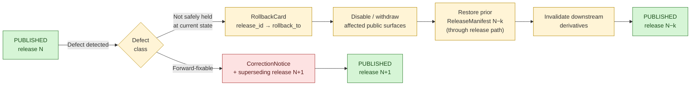

<!-- [KFM_META_BLOCK_V2]
doc_id: kfm://doc/architecture/publication/rollback
title: Publication Rollback Discipline
type: standard
version: v1
status: draft
owners: [release-authority, correction-reviewer, docs-steward]  # NEEDS VERIFICATION — CODEOWNERS not inspected
created: 2026-05-14
updated: 2026-05-14
policy_label: public
related:
  - docs/architecture/publication/GEO_MANIFEST.md          # PROPOSED sibling per [UIAI-MASTER] §14
  - docs/doctrine/lifecycle-law.md                          # PROPOSED per [DIRRULES] §0 related-doctrine list
  - docs/doctrine/trust-membrane.md                         # PROPOSED per [DIRRULES] §0
  - docs/doctrine/authority-ladder.md                       # PROPOSED per [DIRRULES] §0
  - directory-rules.md                                      # CONFIRMED present in project corpus
  - docs/runbooks/rollback-drill.md                         # PROPOSED procedural counterpart
  - release/                                                # PROPOSED emitted-instance home for RollbackCard
tags: [kfm, publication, rollback, release, correction, governance]
notes:
  - Placement under docs/architecture/publication/ is PROPOSED per [UIAI-MASTER] §14 canonical-home plan and [DIRRULES] §0 (docs/architecture/ as architecture-doc home).
  - Doctrine in this file is CONFIRMED against [ENCY], [DIRRULES], [BLD-GREEN], [BLD-COMP], [IMPL-PIPE], [UIAI-MASTER], and [Atlas v1.1].
  - Implementation depth — actual schema files, validators, CI workflows, emitted RollbackCard instances, branch protections, dashboards — remains UNKNOWN; live repo not mounted.
  - Specific paths cited inside this doc remain PROPOSED until verified against the mounted repo.
[/KFM_META_BLOCK_V2] -->

<a id="top"></a>

# Publication Rollback Discipline

> Governed reversal of a `PUBLISHED` KFM release to a prior safe artifact set — emitted as a `RollbackCard`, authorized by separated duties, preserving receipts and invalidating derivatives. Never a hidden file copy.

---

<p align="center">
  <b>Reversible · Evidence-Preserving · Policy-Gated · Audit-Visible</b>
</p>


---

> [!IMPORTANT]
> **Status:** `CONFIRMED doctrine` · `PROPOSED implementation` · `UNKNOWN repo depth`
> **Owners:** Release authority · Correction reviewer · Docs steward — per [Atlas v1.1] §24.7.1 / [DIRRULES]. CODEOWNERS `NEEDS VERIFICATION`.
> **Path:** `docs/architecture/publication/ROLLBACK.md` — `PROPOSED` until verified against the mounted repo.
> **Truth posture:** *cite-or-abstain*; a release without a resolving rollback target does not reach `PUBLISHED`.

> [!NOTE]
> This document states KFM doctrine where supported by project sources ([ENCY], [DIRRULES], [BLD-GREEN], [BLD-COMP], [IMPL-PIPE], [UIAI-MASTER], [Atlas v1.1] §24). Concrete validator paths, CI workflows, emitted `RollbackCard` artifacts, branch protections, and dashboard state remain **UNKNOWN** in this session.

---

## Quick links

- [Scope](#scope)
- [Repo fit](#repo-fit)
- [What belongs here](#what-belongs-here)
- [What does NOT belong here](#what-does-not-belong-here)
- [Why rollback exists](#why-rollback-exists)
- [Rollback at a glance](#rollback-at-a-glance)
- [Core invariants](#core-invariants)
- [RollbackCard object](#rollbackcard-object)
- [Defect class → rollback posture](#defect-class--rollback-posture)
- [Rollback flow](#rollback-flow)
- [Gate failures](#gate-failures)
- [Separation of duties](#separation-of-duties)
- [Validation and the rollback drill](#validation-and-the-rollback-drill)
- [Health indicators](#health-indicators)
- [Anti-patterns](#anti-patterns)
- [Verification checklist](#verification-checklist)
- [Open questions](#open-questions)
- [Appendix](#appendix)

---

## Scope

This document defines **rollback as a publication primitive** in KFM. It covers:

- the doctrinal posture under which a `PUBLISHED` release is reverted to a prior release,
- the object families that authorize and record rollback (`RollbackCard`, `ReleaseManifest`, `CorrectionNotice`),
- the gate failures that justify or compel rollback,
- the duties separated across roles,
- the tests and rehearsals that prove rollback is real rather than rhetorical.

Rollback is **not**: a file copy, a UI toggle, a database `ROLLBACK` statement, a CDN purge, or a feature-flag flip. Those mechanisms may participate in a governed rollback; none of them is sufficient on its own.

## Repo fit

| Direction | Touches (PROPOSED paths) | Role |
|---|---|---|
| **Upstream doctrine** | `directory-rules.md`; lifecycle law; trust membrane; authority ladder | Defines the membrane that rollback must preserve. |
| **Sibling doctrine** | `docs/architecture/publication/GEO_MANIFEST.md`; correction model | Release manifest and correction notice are co-equal release primitives. |
| **Downstream — schema** | `schemas/contracts/v1/release/*.schema.json` (per ADR-0001, [DIRRULES] §7.4) | Machine shape for `RollbackCard`, `ReleaseManifest`, `CorrectionNotice`. |
| **Downstream — policy** | `policy/promotion/`, `policy/release/` | Decision logic that authorizes a rollback. |
| **Downstream — tests** | `tests/release/`, `tests/fixtures/release/` | Negative cases: missing rollback target, stale manifest, unresolved derivatives. |
| **Downstream — emitted instances** | `release/` or `data/receipts/release/` — **not** `artifacts/` ([DIRRULES] §8.2, §13.2) | Where actual `RollbackCard` JSON lands. |
| **Downstream — runbook** | `docs/runbooks/rollback-drill.md` | Operational steps; this doc is normative, the runbook is procedural. |
| **Downstream — UI** | `docs/architecture/ui/` and consuming components | Withdrawn / stale visual state during the rollback window. |

## What belongs here

- The **operating law** of rollback: when it must exist, when it must fire, what it must preserve.
- The **object contract surface** for `RollbackCard` and its links to `ReleaseManifest` and `CorrectionNotice`.
- The **gate semantics** that produce rollback decisions and the codes they emit.
- The **separation-of-duties** rules for rollback authorization.
- The **acceptance criteria** for a release to claim it has a rollback path.
- Cross-references to schema, policy, test, runbook, and UI homes.

## What does NOT belong here

- Concrete schema JSON — lives in `schemas/contracts/v1/release/` per [DIRRULES] §7.4.
- Procedural runbook steps — live in `docs/runbooks/` per [DIRRULES].
- Emitted `RollbackCard` instances — live in `release/` or `data/receipts/release/`, never in `artifacts/` ([DIRRULES] §13.2).
- Policy rule code — lives in `policy/` per [DIRRULES] §4.
- UI behavior for "withdrawn" or "stale" badges — owned by `docs/architecture/ui/` and consumed here, not defined here.
- Database transaction `ROLLBACK` semantics — a database concept, not a publication primitive.

---

## Why rollback exists

> [!IMPORTANT]
> KFM's public unit of value is the **inspectable claim**. A claim is only safely publishable when it has a visible **correction path** and a **rollback target** — not as an afterthought, but as a release prerequisite. [BLD-GREEN §20; BLD-COMP §§21-22; IMPL-PIPE §21]

The trust membrane forbids canonical/internal stores from being the normal public path. The only way content reaches `PUBLISHED` is through governed gates; the only way `PUBLISHED` content is **un**-reached is through the same governed path running in reverse, with its own receipts and authorities. A release whose only reversal is "edit the file" has, by construction, no rollback.

## Rollback at a glance



The diagram reflects [Atlas v1.1] §24.6.1 (Release / Correction / Rollback transitions) and the **PROPOSED rollback flow** in [BLD-GREEN] §20, [UIAI-MASTER] §§10-14, and [BLD-COMP] §§21-23, 30-31. Implementation depth is **UNKNOWN**.

---

## Core invariants

These are **CONFIRMED doctrine**. A proposal that bends one must state the tradeoff clearly ([DIRRULES] §2; KFM operating-law invariant on invariant-bending).

| # | Invariant | Source |
|---|---|---|
| R1 | **Every `PUBLISHED` release names a valid rollback target.** No release reaches `PUBLISHED` without one. | [Atlas v1.1] §24.6.1, §24.11.2 (100% healthy posture); [ENCY] §15; [BLD-GREEN] §20 |
| R2 | **Rollback is a governed state transition**, not a file copy, mirror flip, or out-of-band edit. | [BLD-GREEN] §20; [DIRRULES] §0 lifecycle invariant |
| R3 | **The prior release record is preserved**, not overwritten. Supersession leaves history intact. | [BLD-COMP] §§21-22; [Atlas v1.1] §24.6.1 |
| R4 | **`RollbackCard` and `CorrectionNotice` are distinct object families** with distinct authorities; one names a reversal, the other names a defect. | [ENCY]; [Atlas v1.1] §24.2.1 |
| R5 | **Downstream derivatives are identified and invalidated** as part of rollback. Silent staleness is a defect. | [Atlas v1.1] §24.6.1 Correction row; §24.11.2 |
| R6 | **Public surfaces fail closed during rollback.** UI marks withdrawn or stale state visibly; routes do not silently return cached content as if released. | [BLD-COMP] §§21-23, 30-31; [UIAI-MASTER] §§10-14 |
| R7 | **Audit receipts survive the rollback.** Receipts, proofs, policy decisions, and review records from the failed release remain inspectable. | [BLD-GREEN] §20 |
| R8 | **Rollback authority is separated from authorship** when materiality applies. The release authority — and, where required, the correction reviewer — authorizes the rollback. | [Atlas v1.1] §24.7.1, §24.7.2; operating-law invariant 9; [DIRRULES] |
| R9 | **Rollback rehearsal is required**, not optional. The first proof slice carries a documented rollback drill. | [ENCY] §15 Release/rollback QA, §14 PR-10; [BLD-GREEN] §20 |

---

## RollbackCard object

**CONFIRMED doctrine:** `RollbackCard` records a rollback decision and the targeted prior release. The field set below is the [Atlas v1.1] §24.2.1 receipt-family entry; machine-schema field names, types, and optionality are **PROPOSED** pending `schemas/contracts/v1/release/rollback_card.schema.json`.

| Field | Type (PROPOSED) | Purpose | Source |
|---|---|---|---|
| `release_id` | release reference | The release being rolled back **from**. | [Atlas v1.1] §24.2.1 |
| `rollback_to` | release reference | The prior release being restored. Must resolve to a valid `ReleaseManifest`. | [Atlas v1.1] §24.2.1 |
| `reason` | enum + free text | Defect class (see [Defect class → rollback posture](#defect-class--rollback-posture)) and human-readable cause. | [BLD-GREEN] §20 |
| `invalidates[]` | list of derivative refs | Downstream layers, tiles, projections, AI receipts, summaries that this rollback marks stale. | [Atlas v1.1] §24.11.2 |
| `review_ref` | review reference | The `ReviewRecord` that approved the rollback. | [Atlas v1.1] §24.6.1 Release row |
| `time` | ISO 8601 timestamp | When the rollback decision was recorded. | [Atlas v1.1] §24.2.1 |

> [!TIP]
> A `RollbackCard` is read in the same posture as a `ReleaseManifest`: by reference, never by mutation. If a card needs to change, emit a superseding card and leave the prior one in place.

### Relationship to `ReleaseManifest`

`ReleaseManifest` carries `release_id, contents[], digests, evidence_refs[], rollback_target, time` ([Atlas v1.1] §24.2.1). The `rollback_target` field on a `ReleaseManifest` is the **forward-looking** declaration that "if this release fails, restore *this* prior release." A `RollbackCard` is the **backward-looking** record that the declaration was acted upon.

### Relationship to `CorrectionNotice`

`CorrectionNotice` ([Atlas v1.1] §24.2.1) describes a defect and the superseding fix. Rollback and correction are **not mutually exclusive** — a serious defect may emit both a `CorrectionNotice` and a `RollbackCard`, where the correction explains the defect and the rollback restores the last safe artifact set while the forward fix is prepared.

---

## Defect class → rollback posture

CONFIRMED matrix from [BLD-GREEN] §20 and [BLD-COMP] §§21-23 (consolidated in the Unified Manual §4 correction-and-rollback model):

| Defect class | Correction posture | Rollback posture |
|---|---|---|
| **Evidence gap** | `ABSTAIN` or withdraw unsupported claim | Restore prior evidence-supported release |
| **Rights defect** | `DENY` public use; quarantine source/artifact | Withdraw affected artifacts |
| **Sensitivity leak** | Redact / generalize and notify stewards | **Immediate public disablement** |
| **Geometry defect** | Rebuild derivative layer and evidence payload | Restore previous digest-pinned artifact |
| **Temporal defect** | Correct valid / source / retrieval / release time | Mark stale until rebuilt |
| **Policy defect** | Re-run policy and decision envelope | Disable route / layer if gate failed |
| **AI answer defect** | Invalidate `AIReceipt` and response envelope | Remove answer; preserve `EvidenceBundle` |
| **Catalog defect** | Re-emit catalog closure after proof repair | Restore previous catalog state |

> [!CAUTION]
> **Sensitivity leak** is the only defect class whose default rollback posture is **immediate public disablement** before the full governed flow completes. The flow still runs — receipts, review, and supersession entries still land — but the public surface goes dark first. [BLD-COMP §§21-23, 30-31]

---

## Rollback flow

PROPOSED governed flow per [BLD-GREEN] §20, [UIAI-MASTER] §§10-14, and [BLD-COMP] §§21-23, 30-31. Concrete paths remain **PROPOSED** until verified against the mounted repo.

1. **Identify the affected release.** Resolve `release_id` to its `ReleaseManifest`. If the manifest does not resolve, the flow fails with `RELEASE_MANIFEST_INVALID` and escalates to the release authority ([Atlas v1.1] §24.6.3).
2. **Locate the prior safe artifact set.** Read `rollback_target` from the failing release's manifest. Verify the target's digests and manifest integrity. Missing or unresolved → fail with `ROLLBACK_TARGET_MISSING`.
3. **Disable or withdraw affected public surfaces.** Routes through `apps/governed-api/` return `DENY` or `ABSTAIN` with appropriate cause codes; UI marks layers / answers as withdrawn or stale ([UIAI-MASTER] §§10-14). Direct canonical-store access is not a public path ([DIRRULES] §7.1).
4. **Preserve audit receipts.** Receipts and proofs from the failed release remain in `data/receipts/` and `data/proofs/` (per [DIRRULES] §8.2 sharp split). Nothing is deleted.
5. **Restore or republish the rollback target.** Re-emit the prior `ReleaseManifest` through the **same** governed release path. Do not bypass gates. Do not copy files.
6. **Invalidate derivatives.** Identify downstream layers, tiles, vector indexes, graph projections, `AIReceipt`s, story snapshots, and matrix cells that referenced the failed release. Emit invalidation entries.
7. **Emit the `RollbackCard`.** Record `release_id`, `rollback_to`, `reason`, `invalidates[]`, `review_ref`, `time`. Persist under `release/` or `data/receipts/release/`.
8. **Emit `CorrectionNotice` when a forward fix is required.** Rollback restores a safe state; correction explains the defect and is the precursor to the next release.

> [!WARNING]
> **Rollback must not be a hidden file copy.** [BLD-GREEN §20] A filesystem restore that bypasses the governed release path is a release-discipline defect, not a rollback.

---

## Gate failures

The two reason codes most directly tied to rollback ([Atlas v1.1] §24.6.3, **PROPOSED catalog**):

| Reason code | Gate | Meaning | Recovery |
|---|---|---|---|
| `RELEASE_MANIFEST_INVALID` | Release gate | Manifest fails structural, digest, or evidence-reference validation. | Manifest fix; re-run release gate. |
| `ROLLBACK_TARGET_MISSING` | Release gate | The named `rollback_target` does not resolve to a valid prior `ReleaseManifest`. | Supply a valid rollback target; do not let the release proceed without one. |

A release that emits either code at the release gate **does not reach `PUBLISHED`**. The lifecycle holds at `CATALOG / TRIPLET` with no public surface change ([Atlas v1.1] §24.6.1 Release row).

Closely related codes that often co-occur with a rollback:

- `REVIEW_NEEDED` / `REVIEW_INSUFFICIENT` — rollback authorization requires a `ReviewRecord` from the correction reviewer ([Atlas v1.1] §24.6.3, §24.7.1).
- `CORRECTION_DERIVATIVES_UNRESOLVED` — downstream derivatives must be named and invalidated ([Atlas v1.1] §24.6.3 Correction-lineage row).
- `MISSING_EVIDENCE` — when the rollback target itself fails `EvidenceRef → EvidenceBundle` resolution.

---

## Separation of duties

CONFIRMED doctrine: KFM separates policy-significant release duties when maturity justifies it ([Atlas v1.1] §24.7.1, operating-law invariant 9; [DIRRULES]).

| Role | Authority over rollback (PROPOSED scope) |
|---|---|
| **Release authority** | Issues the `RollbackCard`; authorizes the restored release transition. Distinct from authorship when materiality applies. |
| **Correction reviewer** | Reviews `RollbackCard` and `CorrectionNotice` before they amend a `PUBLISHED` claim. Distinct from the release authority when the defect class is policy-significant. |
| **Sensitivity reviewer** | Required when the triggering defect is a sensitivity leak. May authorize immediate public disablement before the full flow completes. |
| **Rights-holder representative** | Required for rollback affecting archaeology, sovereign data, living-person, or DNA lanes. |
| **Domain steward** | Confirms invalidation list for domain-internal derivatives. |
| **Docs steward** | Updates the drift register and any doctrine docs the rollback touches. |
| **AI surface steward** | Required when the rollback invalidates `AIReceipt`s or Focus Mode answers. |

> [!NOTE]
> **An author cannot single-handedly roll back their own published release** when the defect is policy-significant. This is the same separation-of-duties principle that governs initial release authority ([Atlas v1.1] §24.7.2).

---

## Validation and the rollback drill

**CONFIRMED acceptance rule** from [ENCY] §15:

> Release/rollback QA — `ReleaseManifest`, `PromotionDecision`, `CorrectionNotice`, and `RollbackCard` present. Validation method: **promotion dry-run + rollback drill**.

PROPOSED test set — homes in `tests/release/` and `tests/fixtures/release/`, paths PROPOSED per [DIRRULES] §4:

| Test family | What it must prove | Default failure |
|---|---|---|
| **Release manifest shape** | Manifest matches schema, includes `rollback_target`. | `ERROR` |
| **Rollback target resolution** | Named target resolves to a valid prior `ReleaseManifest`. | `DENY` with `ROLLBACK_TARGET_MISSING` |
| **Digest integrity** | Restored artifact digests match the prior manifest. | `ERROR` |
| **Derivative invalidation coverage** | Named derivatives match the actual downstream graph for the affected release. | `ERROR` |
| **Public-surface withdrawal** | Routes return `DENY` / `ABSTAIN` and UI marks withdrawn state during the rollback window. | `ERROR` |
| **Audit-receipt preservation** | Receipts from the failed release remain inspectable after rollback. | `ERROR` |
| **No file-copy rollback** | The rollback path does not bypass the governed release flow. | `DENY` |
| **Rollback drill rehearsal** | A scheduled, no-network dry run executes against a fixture release and emits a valid `RollbackCard`. | `ERROR` |

The rollback drill is the implementation-roadmap **PR-10** in [ENCY] §14:

> PR-10 rollback drill — Create and run rollback card against a dry-run release. Proposed homes: `release/rollback` + `docs/runbooks`. Risk: irreversible release. Acceptance: rollback drill receipt. Rollback: restore prior release manifest.

---

## Health indicators

PROPOSED indicators per [Atlas v1.1] §24.11.2. These are **reported, not enforced**; enforcement is the validator's job.

| Indicator | What it measures | Healthy posture |
|---|---|---|
| **Release with rollback target** | % of `PUBLISHED` releases that name a valid rollback target. | **100%.** |
| **Correction lead time** | Median time from defect detection to `CorrectionNotice`. | Visibly tracked; trend not regressing. |
| **Derivative-invalidation coverage** | % of corrections that name and invalidate downstream derivatives. | Approaches 100% as coverage matures. |
| **Rollback rehearsal rate** | Number of rehearsed rollbacks per release window. | Non-zero; periodic, scheduled. |
| **Supersession lineage gap** | Number of supersessions without a forward link. | **Zero.** |

> [!TIP]
> Reporting these indicators on a release dashboard does not constitute enforcement. The release gate, not the dashboard, decides whether a release reaches `PUBLISHED`.

---

## Anti-patterns

From [DIRRULES] §13 and [BLD-GREEN] §20:

| Anti-pattern | Why it fails | Fix |
|---|---|---|
| **Hidden file-copy rollback** | Bypasses governed release path; emits no `RollbackCard`; no audit receipt. | Run the rollback flow; emit the card; preserve receipts. |
| **Release without `rollback_target` in the original manifest** | The release should never have reached `PUBLISHED`. | Block at release gate with `ROLLBACK_TARGET_MISSING`. |
| **Author rolls back their own material defect** | Violates separation-of-duties invariant 9. | Route through release authority + correction reviewer. |
| **Silent staleness** | UI continues to render a withdrawn release as if current. | UI marks stale / withdrawn; routes return `DENY` / `ABSTAIN`. |
| **Deleting failed-release receipts** | Audit history evaporates; future drift cannot be reconstructed. | Preserve receipts in `data/receipts/` per [DIRRULES] §8.2. |
| **`RollbackCard` written to `artifacts/`** | Trust content placed in build / QA / temporary lane. | Write to `release/` or `data/receipts/release/` per [DIRRULES] §13.2. |
| **Rollback-target chain that loops** | Restoration cannot terminate; ambiguous prior state. | Release gate validates that `rollback_target` references a non-rolled-back manifest. |
| **No rehearsal** | Rollback exists on paper but has never been exercised; first real use is the worst time to discover defects. | Schedule the drill per [ENCY] §14 PR-10. |
| **Rollback as a UI toggle** | Hides the trust transition behind a presentation control. | UI consumes withdrawn state from governed surfaces; it does not produce it. |

---

## Verification checklist

- [ ] Confirm canonical path for this doc in the mounted repo; open an ADR if `docs/architecture/publication/` does not yet exist.
- [ ] Confirm schema home for `RollbackCard`, `ReleaseManifest`, `CorrectionNotice` per ADR-0001 ([DIRRULES] §7.4).
- [ ] Confirm policy home (`policy/` vs `policies/`) and the release-gate rules.
- [ ] Confirm canonical emitted-instance home for `RollbackCard` JSON: `release/` vs `data/receipts/release/` per [DIRRULES] §13.2.
- [ ] Confirm `CODEOWNERS` entries for release authority and correction reviewer roles.
- [ ] Confirm the rollback drill exists in `tests/release/` (or equivalent) and runs no-network.
- [ ] Confirm UI handling of withdrawn / stale state in `docs/architecture/ui/` and the corresponding components.
- [ ] Confirm the related-docs links in the meta block resolve from this file's path.
- [ ] Confirm no `RollbackCard` instances live in `artifacts/`.
- [ ] Confirm release dashboard surfaces the §24.11.2 health indicators.

## Open questions

- **NEEDS VERIFICATION:** Exact JSON-schema field names, types, and optionality for `RollbackCard` — pending `schemas/contracts/v1/release/rollback_card.schema.json`.
- **NEEDS VERIFICATION:** Whether release authority and correction reviewer are distinct roles in the current `CODEOWNERS`, or whether the split is deferred to a later maturity stage ([Atlas v1.1] §24.7.2 leaves this maturity-dependent).
- **OPEN:** Should rollback windows have a maximum duration before they must either be reverted by a forward correction or escalated? [Atlas v1.1] §24.11.2 does not specify.
- **OPEN:** Treatment of cascading rollback when a `rollback_target` itself is later rolled back. Recommended: forbid `rollback_target` chains from referencing a rolled-back release; the release gate validates this. An ADR is the right home for this rule.
- **OPEN:** Whether rollback rehearsal is per-release, per-domain, or repo-wide cadence. [Atlas v1.1] §24.11.2 says "non-zero; periodic, scheduled"; the cadence itself is `PROPOSED`.
- **DEFERRED:** AI-surface rollback semantics for cached `AIReceipt`s and Focus Mode prior answers — defer to `docs/architecture/governed-ai/`.
- **CONFLICTED / NEEDS VERIFICATION:** Whether the canonical emitted-instance home is `release/` or `data/receipts/release/`. [DIRRULES] §8.2 sharp-split language supports a release-decisions-in-`release/` and receipts-in-`data/receipts/` interpretation; an ADR should freeze this for `RollbackCard` specifically.

---

## Appendix

<details>
<summary><b>A. Lifecycle context — where rollback sits</b></summary>

CONFIRMED lifecycle invariant ([DIRRULES] §0; [Atlas v1.1] §24.6.1):

```text
RAW → WORK / QUARANTINE → PROCESSED → CATALOG / TRIPLET → PUBLISHED
                                                            │
                                                            ├─ Correction → PUBLISHED'
                                                            └─ Rollback   → prior release
```

A transition is closed only when (i) the required artifacts exist, (ii) every required artifact resolves the artifacts it depends on, and (iii) the policy gate evaluated and recorded its decision ([Atlas v1.1] §24.6.2 universal closure rules). Rollback inherits these requirements — a rollback that lacks its `RollbackCard`, `ReviewRecord`, or derivative-invalidation list is not closed, and the prior state is preserved.

</details>

<details>
<summary><b>B. Receipt-family context</b></summary>

`RollbackCard` sits within the receipt-family table at [Atlas v1.1] §24.2.1. Receipts emitted during a rollback flow that this document does not own but that this document depends on:

- `ReviewRecord` — approves the rollback decision.
- `PolicyDecision` — records the gate outcome that triggered or authorized rollback.
- `CorrectionNotice` — co-emitted when the rollback accompanies a forward fix.
- `RealityBoundaryNote` — may be required when withdrawn synthetic or AI-drafted surfaces remain visible during the transition window.
- `AIReceipt` invalidation entries — required when Focus Mode answers referenced the rolled-back release.
- `StorySnapshot / ExportReceipt` invalidation entries — required for story / export / atlas publications that referenced the rolled-back release.

</details>

<details>
<summary><b>C. Source ledger (compact)</b></summary>

| Source | Status | Supports | Limits |
|---|---|---|---|
| `kfm_encyclopedia.pdf` [ENCY] | CONFIRMED doctrine | Release/rollback QA acceptance rule (§15); PR-10 rollback drill (§14); `RollbackCard` requirement. | Does not prove mounted-repo implementation. |
| `directory-rules.md` [DIRRULES] | CONFIRMED governance doctrine | Placement law; required README contract (§15); anti-patterns (§13); sharp split for `release/`, `data/receipts/`, `artifacts/`. | Specific repo paths remain `NEEDS VERIFICATION` until inspection. |
| `KFM_Unified_Implementation_Architecture_Build_Manual.pdf` [BLD-GREEN, BLD-COMP, IMPL-PIPE] | CONFIRMED consolidation of plans | Defect-class → posture matrix; correction/rollback flow; gate architecture. | Marks the rollback model itself as `PROPOSED execution`. |
| `KFM_Domains_Culmination_Atlas_v1_1.pdf` [Atlas v1.1] | CONFIRMED doctrine consolidation | `RollbackCard` field table (§24.2.1); lifecycle gates (§24.6); gate-failure codes (§24.6.3); separation of duties (§24.7); health indicators (§24.11). | Indicators and codes are `PROPOSED` catalogs in the source. |
| `KFM_Whole_UI_Governed_AI_Expansion_Report.pdf` [UIAI-MASTER] | CONFIRMED canonical-home plan | `docs/architecture/publication/` as semantic home for release-architecture docs (§14). | Specific filenames are `PROPOSED`. |
| `Master_MapLibre_Components-Functions-Features` [MAP-MASTER] | CONFIRMED downstream consequence | Public rendering requires released artifacts, evidence refs, policy labels, sensitivity posture, rights status, **and rollback target**. | UI-layer detail; not the rollback authority. |
| `KFM_Pass_18_Idea_Index_Category_Atlas_and_Expansion_Dossier.pdf` | LINEAGE | Carry-forward signal that rollback target is a publication prerequisite for inspectable claims. | Lineage only; does not prove mounted-repo state. |

</details>

<details>
<summary><b>D. Related doctrine — links</b></summary>

These links use repo-relative paths. Paths are **PROPOSED** until verified against the mounted repo.

- `../../doctrine/lifecycle-law.md` — lifecycle invariant
- `../../doctrine/trust-membrane.md` — public-path discipline
- `../../doctrine/authority-ladder.md` — who decides what
- `../../../directory-rules.md` — placement law
- `./GEO_MANIFEST.md` — sibling publication doc per [UIAI-MASTER] §14
- `../../runbooks/rollback-drill.md` — procedural runbook (PROPOSED)
- `../../adr/` — ADR home (ADR-0001 schema-home)
- `../governed-ai/` — AI-surface rollback semantics (DEFERRED)

</details>

---

<p align="right"><a href="#top">↑ Back to top</a></p>
