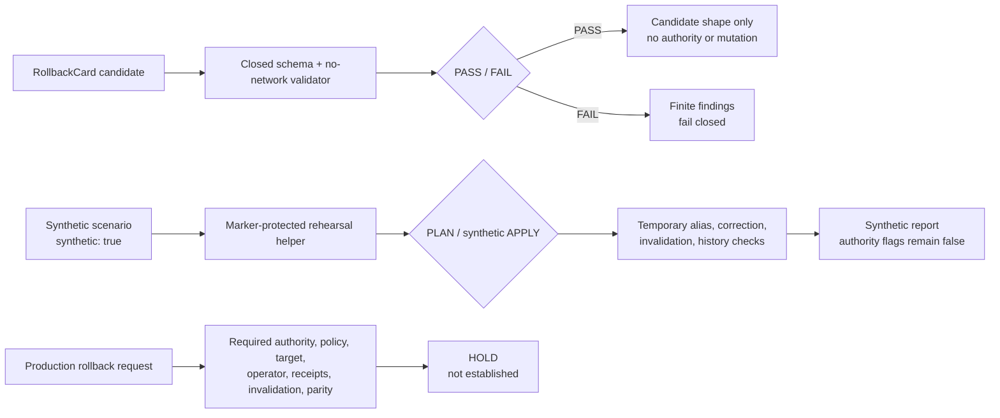

<!-- [KFM_META_BLOCK_V2]
doc_id: kfm://doc/architecture/publication/rollback
title: Publication Rollback Discipline
type: architecture-reference
version: v2.0.0
status: draft; repository-grounded; mixed-maturity; non-executing; non-publication
owners:
  - "@bartytime4life — CODEOWNERS review route"
  - "NEEDS VERIFICATION — independent release, correction, rollback, policy, and public-surface stewardship"
created: 2026-05-14
updated: 2026-08-19
policy_label: public; architecture; publication; rollback; correction-aware; fail-closed; no-erasure
owning_root: docs/
current_path: docs/architecture/publication/ROLLBACK.md
responsibility: Explain KFM publication-rollback architecture, current repository proof, authority boundaries, finite failure states, graduation gates, validation, correction coupling, and recovery obligations without creating or executing rollback authority.
truth_posture: >-
  CONFIRMED accepted Directory Rules placement, current tracked target, RollbackCard
  contract/schema/validator/fixtures/tests/workflow, fixture-only alias verification,
  synthetic-only rollback rehearsal, current placeholders, and current absence of a
  tracked published alias / PROPOSED RollbackCard operational semantics, alias
  decision, release policy, separation of duties, production operator, receipt
  profile, invalidation integration, and public-surface behavior / UNKNOWN deployed
  runtime, external storage, production state, public parity, and operational
  recovery capability / NEEDS VERIFICATION accountable stewards, accepted policy,
  actor authority, live target profile, signatures, retention, and end-to-end drill
evidence_snapshot:
  repository: bartytime4life/Kansas-Frontier-Matrix
  base_ref: main
  base_commit: d639f9ff40288d12244cd7bc84af538652f6dfb1
  target_prior_blob: 5a8a2e5fe77dad9951288f13e7f48bb50d62a570
  directory_rules_blob: fd49a0b83e55cef52c1124281f093e263526898d
  codeowners_blob: dd2a84aa514d8ecd9208bc347f90f9a2ed37dd61
  rollback_card_contract_blob: c6d3c35c56b064e04c3a2532f4709d938d7b0c1a
  rollback_card_schema_blob: e0a9edf02dd5d6997eda60a054a5bf19636c3dd4
  rollback_card_validator_blob: 9e9ed5a92851935b41a36698e4bead13ef4edf57
  rollback_card_tests_blob: c8aeac6348127fb768981e2b5b5588c6a7bdeb78
  rollback_card_workflow_blob: 1980b6e914532c1478d6f14310b916b69a0fb1c4
  synthetic_rollback_helper_blob: a8f6bff350e79b453f425ebce9a9ded6801f8944
  synthetic_rollback_tests_blob: b644ca6c4185b3f81bc339c077eae85299833261
  rollback_cards_readme_blob: c1fc4d27bca8144faa16e1b888ca95c5d2f88eb5
related:
  - README.md
  - CORRECTION.md
  - rollback-and-correction.md
  - promotion-gates.md
  - release-state-machine.md
  - ../../doctrine/directory-rules.md
  - ../../adr/ADR-0015-data-published-_domain_-current-alias-is-governed-by-rollback_card.md
  - ../../adr/ADR-0024-steward-separation-of-duties-for-release.md
  - ../../adr/ADR-0029-adopt-directory-governance-standard-v2.md
  - ../../runbooks/ROLLBACK_RUNBOOK.md
  - ../../../contracts/release/rollback_card.md
  - ../../../contracts/release/release_alias_verification.md
  - ../../../schemas/contracts/v1/release/rollback_card.schema.json
  - ../../../fixtures/release/rollback_card/
  - ../../../tools/validators/release/validate_rollback_card.py
  - ../../../tests/validators/test_validate_rollback_card.py
  - ../../../tools/release/rollback_apply.py
  - ../../../tests/release/test_synthetic_rollback_rehearsal.py
  - ../../../release/rollback_cards/README.md
  - ../../../policy/release/README.md
  - ../../../data/published/README.md
  - ../../../data/rollback/README.md
  - ../../../.github/workflows/rollback-card.yml
  - ../../../.github/workflows/rollback-drill.yml
tags: [kfm, architecture, publication, rollback, withdrawal, correction, release, rollback-card, synthetic-rehearsal, invalidation, audit, fail-closed]
notes:
  - "v2.0.0 is a same-path repository-grounded modernization of the proposal-era page."
  - "The document preserves its doc_id, H1, top anchor, and all legacy section anchors."
  - "Accepted ADR-0029 settles placement: RollbackCard decisions and targets belong under release/rollback_cards/; executed rollback and cache-invalidation receipts belong under data/receipts/rollback/; generic data/rollback/ is deprecated pending classified migration."
  - "The current shared RollbackCard 1.0.0 profile is fixture-first and candidate-only. It deliberately cannot claim policy, review, execution, public mutation, release, or publication authority."
  - "The synthetic helper may mutate only a marker-protected temporary rehearsal root. Production rollback, live alias mutation, external invalidation, and execution receipts remain held."
  - "This revision changes documentation and its generated authoring receipt only. It does not accept ADR-0015 or ADR-0024, activate policy, mutate an alias, execute rollback, change release state, deploy, or publish."
[/KFM_META_BLOCK_V2] -->

<a id="top"></a>

# Publication Rollback Discipline

> **Purpose.** Explain how KFM reverses or withdraws a released public state without erasing history, bypassing evidence and policy, treating a workflow as authority, or confusing a synthetic rehearsal with production rollback.

[](#status-and-authority)
[](#repo-fit)
[](#rollbackcard-object)
[](#validation-and-the-rollback-drill)
[](#current-implementation-maturity)
[](#authority-and-publication-boundary)

> [!IMPORTANT]
> **Rollback is a governed release transition, not a file copy, pointer edit, cache purge, workflow run, or Git revert.** Each mechanism may participate in an accepted rollback operator, but none creates rollback authority or public truth by itself.

> [!CAUTION]
> **Candidate validation is not rollback approval or execution.** The current shared `RollbackCard` schema, validator, fixtures, tests, and workflow prove bounded candidate shape and local consistency only. The schema requires every authority, policy, review, execution, public-mutation, and release flag to remain false or null.

> [!WARNING]
> **The only executable apply path is synthetic-only.** `tools/release/rollback_apply.py` refuses any workspace without the exact synthetic marker and any scenario not declaring `synthetic: true`. Its `APPLY` mode changes a temporary rehearsal tree, not KFM published state.

> [!NOTE]
> **Current repository result.** The release decision lane, candidate profile, fixture-only alias preflight, read-only readiness workflow, and marker-protected rehearsal exist. A production rollback pipeline, accepted alias profile, authenticated review, active release policy, live alias, external invalidation executor, executed rollback receipt, and deployed public parity are not established.

**Quick navigation:** [Status](#status-and-authority) · [Scope](#scope) · [Repo fit](#repo-fit) · [Belongs](#what-belongs-here) · [Exclusions](#what-does-not-belong-here) · [Authority](#authority-and-publication-boundary) · [Why](#why-rollback-exists) · [At a glance](#rollback-at-a-glance) · [Invariants](#core-invariants) · [RollbackCard](#rollbackcard-object) · [Defects](#defect-class--rollback-posture) · [Flow](#rollback-flow) · [Failures](#gate-failures) · [Duties](#separation-of-duties) · [Validation](#validation-and-the-rollback-drill) · [Maturity](#current-implementation-maturity) · [Health](#health-indicators) · [Anti-patterns](#anti-patterns) · [Checklist](#verification-checklist) · [Questions](#open-questions) · [Appendix](#appendix)

---

<a id="status-and-authority"></a>

## Status and authority

| Field | Current bounded result |
|---|---|
| Tracked path | `docs/architecture/publication/ROLLBACK.md` |
| Document identity | `kfm://doc/architecture/publication/rollback` |
| Document role | Human-readable publication-rollback architecture reference |
| Owning root | `docs/` |
| Placement | **CONFIRMED** under accepted ADR-0029 and Directory Rules v2 |
| Repository evidence base | `main@d639f9ff40288d12244cd7bc84af538652f6dfb1` |
| Prior document blob | `5a8a2e5fe77dad9951288f13e7f48bb50d62a570` |
| Review route | `@bartytime4life` through current CODEOWNERS |
| Independent release/rollback stewardship | **NEEDS VERIFICATION** |
| RollbackCard profile | **PROPOSED**, fixture-first, candidate-only, non-executing |
| Synthetic rehearsal | **CONFIRMED** bounded implementation; temporary synthetic roots only |
| Production rollback | **HOLD / UNKNOWN** beyond inspected repository surfaces |
| Release, deployment, publication effect | None |

This document explains current boundaries. It does not own semantic meaning, machine shape, policy, actor authority, release decisions, execution, process receipts, published payloads, or public serving.

### Truth labels used here

| Label | Meaning |
|---|---|
| **CONFIRMED** | Verified from current repository bytes, accepted ADRs, tests, workflows, or generated artifacts inspected for this revision |
| **PROPOSED** | A candidate design, inactive profile, unaccepted ADR, graduation step, or future operational behavior |
| **UNKNOWN** | Not established strongly enough from available repository, platform, deployment, or runtime evidence |
| **NEEDS VERIFICATION** | A concrete check remains before relying on the claim |

`HOLD`, `DENY`, `ABSTAIN`, `ERROR`, and validator outcomes are operational states; they do not replace the four truth labels.

<p align="right"><a href="#top">Back to top</a></p>

---

<a id="scope"></a>

## Scope

This page covers the architecture of a rollback or withdrawal affecting KFM release state:

- the difference among a rollback candidate, accountable decision, execution, correction, withdrawal, and receipt;
- the accepted responsibility split among architecture, contracts, schemas, policy, release decisions, process receipts, published carriers, validators, operators, and workflows;
- the current shared `RollbackCard` 1.0.0 candidate profile;
- the current no-network validator and exact fixture polarity;
- the current fixture-only alias preflight;
- the marker-protected synthetic rollback and withdrawal rehearsal;
- the production gaps that keep operational rollback on hold;
- invalidation, history preservation, correction visibility, and public fail-closed obligations;
- validation, graduation, and rollback of this documentation change.

This page does **not**:

- execute rollback or withdrawal;
- authorize a release-state transition;
- define a live alias serialization;
- authenticate actors or approve separation of duties;
- activate release policy;
- replace the semantic contract, JSON Schema, validators, tests, workflows, or runbook;
- claim production deployment or public runtime behavior;
- prescribe database transaction rollback, schema migration rollback, infrastructure rollback, or Git rollback.

<p align="right"><a href="#top">Back to top</a></p>

---

<a id="repo-fit"></a>

## Repo fit

Accepted [ADR-0029](../../adr/ADR-0029-adopt-directory-governance-standard-v2.md) makes [Directory Rules v2](../../doctrine/directory-rules.md) the placement authority. This same-path page receives `PLACE`: its primary responsibility is to explain publication rollback to humans.

### Current responsibility map

| Responsibility | Current or accepted home | Current status |
|---|---|---:|
| Architecture and boundaries | `docs/architecture/publication/ROLLBACK.md` | **CONFIRMED** tracked page |
| Operational procedure | [`docs/runbooks/ROLLBACK_RUNBOOK.md`](../../runbooks/ROLLBACK_RUNBOOK.md) | **CONFIRMED** tracked, proposal-era; not production proof |
| RollbackCard semantic meaning | [`contracts/release/rollback_card.md`](../../../contracts/release/rollback_card.md) | **CONFIRMED** draft / **PROPOSED** profile |
| RollbackCard machine shape | [`schemas/contracts/v1/release/rollback_card.schema.json`](../../../schemas/contracts/v1/release/rollback_card.schema.json) | **CONFIRMED** closed 1.0.0 candidate schema |
| Deterministic candidate examples | [`fixtures/release/rollback_card/`](../../../fixtures/release/rollback_card/) | **CONFIRMED** three valid and six invalid cases |
| Candidate validator | [`tools/validators/release/validate_rollback_card.py`](../../../tools/validators/release/validate_rollback_card.py) | **CONFIRMED** no-network, candidate-only |
| Focused tests | [`tests/validators/test_validate_rollback_card.py`](../../../tests/validators/test_validate_rollback_card.py) | **CONFIRMED** schema, polarity, CLI, and fail-closed parsing tests |
| Focused candidate workflow | [`.github/workflows/rollback-card.yml`](../../../.github/workflows/rollback-card.yml) | **CONFIRMED** read-only validation; path-scoped |
| Alias transition preflight | [`contracts/release/release_alias_verification.md`](../../../contracts/release/release_alias_verification.md) and paired schema/validator/tests | **CONFIRMED** fixture-only / **PROPOSED_INACTIVE** |
| Rollback decisions and targets | [`release/rollback_cards/`](../../../release/rollback_cards/) | **CONFIRMED** accepted logical home; current lane content is mixed and not operational authority |
| Executed rollback and invalidation receipts | `data/receipts/rollback/` | **CONFIRMED** accepted logical home; **CONFIRMED absent** at this snapshot |
| Public-safe released carriers | [`data/published/`](../../../data/published/) | **CONFIRMED** accepted payload responsibility; no tracked current alias found |
| Release-admissibility policy source | [`policy/release/`](../../../policy/release/) | **CONFIRMED** path; current local rules are scaffolds/inactive |
| Production rollback pipeline | [`pipelines/rollback/main.py`](../../../pipelines/rollback/main.py) | **CONFIRMED** exact greenfield placeholder |
| Production/repository operator family | `tools/release/` | **CONFIRMED** synthetic helper exists; production authority absent |
| Synthetic rehearsal helper | [`tools/release/rollback_apply.py`](../../../tools/release/rollback_apply.py) | **CONFIRMED** marker-protected synthetic-only implementation |
| Synthetic rehearsal tests | [`tests/release/test_synthetic_rollback_rehearsal.py`](../../../tests/release/test_synthetic_rollback_rehearsal.py) | **CONFIRMED** non-vacuous deterministic tests |
| Read-only readiness workflow | [`.github/workflows/rollback-drill.yml`](../../../.github/workflows/rollback-drill.yml) | **CONFIRMED** inspect-and-hold workflow; no production mutation |

### Current placement drift

The accepted rules settle several questions the prior edition left unresolved:

1. `RollbackCard` decisions and targets belong under `release/rollback_cards/`.
2. Executed rollback and cache-invalidation process records belong under `data/receipts/rollback/`.
3. Generic [`data/rollback/`](../../../data/rollback/) is deprecated as an ambiguous authority lane pending object-by-object classification.
4. Public carriers remain under `data/published/`; a mutable alias, if accepted, is a downstream projection of governed release state rather than authority.
5. Policy source belongs under `policy/release/`, not under `release/`.

Two neighboring READMEs predate or conflict with this accepted split:

- [`release/rollback_cards/README.md`](../../../release/rollback_cards/README.md) still describes the lane primarily as compact review-card guidance rather than the accepted rollback-decision and target family.
- [`data/rollback/README.md`](../../../data/rollback/README.md) still describes the generic lane as canonical data-plane recovery support even though Directory Rules now deprecate it.

This page records that documentation drift. It does not migrate, delete, or rewrite either lane.

<p align="right"><a href="#top">Back to top</a></p>

---

<a id="what-belongs-here"></a>

## What belongs here

- the publication-rollback mental model and trust boundaries;
- the distinction among candidate validation, review, policy, decision, execution, receipt, correction, and public state;
- the current repository maturity and explicit production holds;
- the accepted responsibility-root map;
- finite candidate dispositions and failure semantics;
- recovery, invalidation, audit, correction, and public fail-closed obligations;
- architecture-level graduation criteria;
- links to owning contracts, schemas, policy, code, tests, workflows, release records, receipts, and runbooks;
- documentation validation and rollback instructions.

<a id="what-does-not-belong-here"></a>

## What does NOT belong here

| Material | Owning surface or disposition |
|---|---|
| RollbackCard field meaning and invariants | `contracts/release/rollback_card.md` |
| JSON Schema, DTO, or generated type | `schemas/contracts/v1/release/` |
| Policy source or policy result | `policy/release/` and the accepted policy-decision family |
| Valid/invalid candidate data | `fixtures/release/rollback_card/` |
| Validator, operator, or pipeline implementation | `tools/validators/release/`, `tools/release/`, or `pipelines/rollback/` |
| Accountable rollback decision or target record | `release/rollback_cards/` under an accepted operational profile |
| Executed rollback or invalidation process receipt | `data/receipts/rollback/` |
| Released payload or public-safe alias projection | `data/published/` |
| Procedural incident or operator steps | `docs/runbooks/` |
| Secrets, signatures, private endpoints, exploit details, or sensitive exact locations | Approved secret/restricted systems; never this public page |
| Database transaction, migration, deployment, or Git rollback | Their own bounded runbooks and operators |
| Generated prose presented as approval or evidence | Denied; resolve governing evidence or abstain |

<p align="right"><a href="#top">Back to top</a></p>

---

<a id="authority-and-publication-boundary"></a>

## Authority and publication boundary

KFM rollback spans distinct object families and authorities. They must not be collapsed.

| Surface | What it may prove or do | What it cannot prove or do |
|---|---|---|
| Architecture page | Explain boundaries and current evidence | Define fields, approve policy, execute rollback, or publish |
| Semantic contract | Define `RollbackCard` meaning and invariants | Validate JSON, authenticate actors, or mutate state |
| JSON Schema | Validate machine shape | Prove evidence, policy, review, safety, or execution |
| Candidate validator | Prove bounded shape and local consistency | Resolve references, approve target safety, or create authority |
| Policy evaluation | Allow, deny, hold, restrict, or abstain under an accepted profile | Replace evidence, review, release decision, or execution |
| Review/authority record | Bind accountable actors and subject scope | Mutate public state by itself |
| Rollback decision/card | Bind an affected release, disposition, target, support, and obligations | Prove execution or completed invalidation |
| Operator | Perform an authorized conditional state transition | Create the authority it consumes |
| Process receipt | Record what execution and invalidation occurred | Become the decision, proof, or public payload |
| Public carrier/alias | Deliver selected released state | Become canonical truth or release authority |
| Workflow/check | Orchestrate bounded validation | Approve release, rollback, deployment, or publication |

> [!IMPORTANT]
> A green validator or workflow is evidence only for its declared scope. It never upgrades a candidate into an approved rollback or a synthetic state change into production recovery.

<p align="right"><a href="#top">Back to top</a></p>

---

<a id="why-rollback-exists"></a>

## Why rollback exists

KFM's public unit of value is the inspectable claim. Public claims and carriers remain trustworthy only when a defect can be:

1. detected and classified;
2. tied to a specific released state;
3. supported by evidence, policy, review, and release records appropriate to consequence;
4. withdrawn, held, or restored without deleting history;
5. propagated across catalogs, triplets, tiles, caches, search, vector indexes, AI answers, and downstream derivatives;
6. explained through correction or withdrawal lineage;
7. replayed and audited;
8. reversed again if the recovery itself is defective.

Rollback is therefore a publication capability, not merely an operations convenience. The current repository proves important fixture-first pieces of this capability, but not an accepted production transition.

<p align="right"><a href="#top">Back to top</a></p>

---

<a id="rollback-at-a-glance"></a>

## Rollback at a glance

The current repository has two executable but deliberately bounded paths and one held production path:


```mermaid
flowchart LR
    A["RollbackCard candidate"] --> B["Closed schema + no-network validator"]
    B --> C{"PASS / FAIL"}
    C -->|"PASS"| D["Candidate shape only<br/>no authority or mutation"]
    C -->|"FAIL"| E["Finite findings<br/>fail closed"]

    F["Synthetic scenario<br/>synthetic: true"] --> G["Marker-protected rehearsal helper"]
    G --> H{"PLAN / synthetic APPLY"}
    H --> I["Temporary alias, correction,<br/>invalidation, history checks"]
    I --> J["Synthetic report<br/>authority flags remain false"]

    K["Production rollback request"] --> L["Required authority, policy, target,<br/>operator, receipts, invalidation, parity"]
    L --> M["HOLD<br/>not established"]
```

### Candidate, decision, execution, and public state

```text
candidate plan
  -> schema and local validation
  -> reference resolution
  -> accepted policy evaluation
  -> authenticated review and authority binding
  -> accountable rollback / withdrawal decision
  -> conditional target and current-state verification
  -> production execution
  -> cache and derivative invalidation
  -> append-only execution receipts
  -> governed public parity checks
  -> correction / withdrawal visibility
```

Only the first line and the synthetic rehearsal are currently closed by inspected implementation. The rest remains proposed, held, unknown, or needing verification.

<p align="right"><a href="#top">Back to top</a></p>

---

<a id="core-invariants"></a>

## Core invariants

| ID | Invariant | Current posture |
|---|---|---|
| R1 | Rollback preserves the failed release, its manifests, evidence, proofs, receipts, and review history unless a separate lawful erasure process applies. | **CONFIRMED doctrine; synthetic test proves byte preservation in its bounded root** |
| R2 | Rollback, withdrawal, hold, and error remain finite, distinguishable dispositions. | **CONFIRMED candidate schema** |
| R3 | A target release must differ from the affected release and match the restoration target. | **CONFIRMED validator rule** |
| R4 | Evidence, policy, review, correction, and invalidation references remain separate. | **CONFIRMED schema/contract** |
| R5 | A required public notice must resolve through a correction notice reference. | **CONFIRMED validator rule; operational resolution not implemented** |
| R6 | Detection, decision, and effective times remain ordered and timezone-aware. | **CONFIRMED schema/validator rule** |
| R7 | A candidate cannot claim policy evaluation, completed review, rollback execution, public mutation, or release authority. | **CONFIRMED schema/validator rule** |
| R8 | Public clients use governed released state, not canonical/internal stores or a direct operator. | **CONFIRMED doctrine; deployed rollback behavior UNKNOWN** |
| R9 | Invalidations cover every affected carrier class; silent stale state is a defect. | **CONFIRMED synthetic full-set rule; external execution UNKNOWN** |
| R10 | History and correction lineage are append-only and non-self-referential. | **CONFIRMED candidate and synthetic checks** |
| R11 | Production execution must consume authority; it cannot manufacture it. | **CONFIRMED boundary; production operator absent** |
| R12 | A workflow, pull request, merge, GitHub release, badge, or pointer file is not KFM release or rollback authority. | **CONFIRMED doctrine** |

The prior edition stated that every published release already names and resolves a rollback target. That remains a desired release-readiness condition, not a verified repository-wide or production invariant at this snapshot.

<p align="right"><a href="#top">Back to top</a></p>

---

<a id="rollbackcard-object"></a>

## RollbackCard object

The authoritative current candidate field surface is the paired [semantic contract](../../../contracts/release/rollback_card.md) and [JSON Schema](../../../schemas/contracts/v1/release/rollback_card.schema.json), not the obsolete six-field table in the prior edition of this page.

### Required field surface

| Field | Semantic role |
|---|---|
| `object_type` | Constant `RollbackCard` |
| `schema_version` | Constant `1.0.0` |
| `id` | Stable card identifier; not a mutable pointer |
| `version` | Semantic candidate version |
| `spec_hash` | Non-placeholder SHA-256 binding |
| `disposition` | Finite candidate outcome |
| `trigger` | Public-safe reason code and timezone-aware detection time |
| `affected_release_ref` | Release whose current use is under review |
| `target` | Prior release, withdrawal, or hold target |
| `evidence_bundle_refs` | Sorted, unique evidence-support references |
| `policy_decision_refs` | Sorted, unique policy references |
| `review_record_refs` | Sorted, unique review references |
| `correction_notice_ref` | Correction/public-notice reference or null |
| `invalidations` | One or more bounded carrier invalidation classes |
| `restoration` | Intended restored release, notice requirement, and mandatory validation |
| `timing` | Decision and optional effective times |
| `lineage` | Supersedes and superseded-by references |
| `governance` | Explicit candidate-only non-authority state |

### Finite vocabularies

| Vocabulary | Current values |
|---|---|
| Disposition | `ROLLBACK_CANDIDATE`, `WITHDRAWAL_CANDIDATE`, `HOLD`, `ERROR` |
| Target mode | `PRIOR_RELEASE`, `WITHDRAWAL`, `HOLD` |
| Trigger reason | `RELEASE_DEFECT`, `EVIDENCE_CONTRADICTION`, `RIGHTS_CHANGE`, `SENSITIVITY_DISCOVERY`, `VALIDATION_FAILURE`, `SOURCE_WITHDRAWAL`, `POLICY_FAILURE`, `SECURITY_ISSUE`, `OPERATIONAL_FAILURE`, `EMERGENCY_HOLD`, `INSUFFICIENT_EVIDENCE`, `INPUT_INVALID` |
| Invalidation | `API_CACHE`, `CDN`, `TILES`, `CATALOG`, `TRIPLETS`, `SEARCH_INDEX`, `VECTOR_INDEX`, `AI_CACHE`, `DOWNSTREAM_DERIVATIVES` |

### Candidate-only governance state

Every valid 1.0.0 candidate must contain:

```json
{
  "governance": {
    "authority_created": false,
    "policy_evaluated": false,
    "review_completed": false,
    "rollback_executed": false,
    "public_state_mutated": false,
    "release_ref": null
  }
}
```

Any contrary value fails with `GOVERNANCE_BOUNDARY_VIOLATION`.

### Current instance posture

- Three valid fixture candidates and six invalid fixture families exercise the shared profile.
- The two root JSON files currently under `release/rollback_cards/` are treated by the read-only workflow as nonconforming documentation placeholders, not schema-admissible authority.
- Domain-local `rollback_card.schema.json` files exist across several domain lanes with mixed maturity. Shared-object-family convergence remains unresolved; this page does not silently select, migrate, or delete those schemas.
- A future accepted operational card profile may extend the candidate model, but it must not reuse candidate validation as proof of decision or execution.

<p align="right"><a href="#top">Back to top</a></p>

---

<a id="defect-class--rollback-posture"></a>

## Defect class → rollback posture

The current schema supplies public-safe trigger codes. The table below maps each code to a **PROPOSED operational posture**; it does not claim an active policy evaluator.

| Trigger reason | Candidate posture | Public-safe default while unresolved |
|---|---|---|
| `RELEASE_DEFECT` | Prior-release candidate or withdrawal, depending on target safety | Hold affected public state or serve the last verified state |
| `EVIDENCE_CONTRADICTION` | Rollback candidate, withdrawal candidate, or hold | `ABSTAIN` from unsupported claims |
| `RIGHTS_CHANGE` | Withdrawal candidate or hold | `DENY` affected public use |
| `SENSITIVITY_DISCOVERY` | Emergency hold or withdrawal; correction/generalization may follow | Disable harmful precision and fail closed |
| `VALIDATION_FAILURE` | Hold or prior-release candidate | Preserve the last validated release |
| `SOURCE_WITHDRAWAL` | Withdrawal or prior-release candidate with correction lineage | Mark affected claims withdrawn or unsupported |
| `POLICY_FAILURE` | Hold or withdrawal | `DENY` the affected operation |
| `SECURITY_ISSUE` | Emergency hold or withdrawal | Contain first; keep sensitive detail out of public records |
| `OPERATIONAL_FAILURE` | Prior-release candidate or hold | Serve no state that cannot be verified |
| `EMERGENCY_HOLD` | Hold | Immediate containment; accountable review still required |
| `INSUFFICIENT_EVIDENCE` | Hold or withdrawal | `ABSTAIN` |
| `INPUT_INVALID` | Error | No state mutation |

A correction may accompany rollback or withdrawal. The sibling [`CORRECTION.md`](CORRECTION.md) remains the deeper correction page, but it is also proposal-era and must not be read as proof of an operational correction path.

<p align="right"><a href="#top">Back to top</a></p>

---

<a id="rollback-flow"></a>

## Rollback flow

### A. Current demonstrable candidate flow

1. Read one UTF-8 JSON object within the file-size limit.
2. Reject duplicate keys, non-finite numbers, malformed JSON, non-object roots, or missing files.
3. Validate against JSON Schema Draft 2020-12.
4. Apply deterministic local semantic checks.
5. Emit sorted findings and `PASS` or `FAIL`.
6. Stop. Do not resolve references, evaluate policy, authenticate review, select a live target, mutate an alias, invalidate carriers, emit an execution receipt, release, or publish.

### B. Current demonstrable synthetic rehearsal

1. Require a temporary workspace containing `.kfm-synthetic-rollback-rehearsal` with exact contents `synthetic-only`.
2. Require a scenario with `synthetic: true`.
3. Reject absolute paths, parent traversal, and symlink traversal.
4. Verify the current synthetic alias and its digest.
5. Verify affected and target synthetic manifests and artifact digests.
6. Require the complete invalidation-class set.
7. In `PLAN`, emit a deterministic no-write report.
8. In synthetic `APPLY`, atomically replace the temporary alias, write synthetic correction and invalidation records, and prove the affected release bytes remain unchanged.
9. Keep every governance/authority/public-mutation flag false.
10. Stop. Do not access a source, external cache, production alias, deployment, public API, or release authority.

### C. Proposed production graduation flow

The smallest credible production flow remains **PROPOSED** and dependency-ordered:

1. Resolve an accepted affected release and immutable target profile.
2. Resolve every evidence, policy, review, correction, manifest, signature, and prior-state reference.
3. Authenticate actors and prove current scoped authority and required independence.
4. Evaluate accepted fail-closed release/rollback policy.
5. Bind the decision to exact current alias state, revision, manifest digest, target digest, and operation.
6. Execute an atomic compare-and-swap or accepted equivalent through a production operator.
7. Invalidate all affected API, CDN, tile, catalog, triplet, search, vector, AI, and downstream derivative surfaces.
8. Emit append-only execution and invalidation receipts under `data/receipts/rollback/`.
9. Recheck governed API, map, Evidence Drawer, search, export, and AI parity.
10. Surface correction, withdrawal, stale, or restored lineage publicly at the permitted detail.
11. Preserve the failed release and all audit history.
12. Rehearse forward recovery and rollback-of-rollback behavior.
13. Obtain separately governed release, deployment, and publication authorization.

No inspected implementation closes steps 1–13 as one production path.

<p align="right"><a href="#top">Back to top</a></p>

---

<a id="gate-failures"></a>

## Gate failures

The prior edition mixed proposed release-gate codes with current implementation. This edition separates implemented findings from future operational policy.

### RollbackCard parser and schema findings — implemented

`FILE_NOT_FOUND`, `FILE_TOO_LARGE`, `JSON_NOT_UTF8`, `JSON_DUPLICATE_KEY`, `JSON_NONFINITE_NUMBER`, `JSON_INVALID`, `FILE_READ_ERROR`, `ROOT_NOT_OBJECT`, `SCHEMA_UNAVAILABLE`, and `SCHEMA_INVALID`.

### RollbackCard semantic findings — implemented

| Finding | Meaning |
|---|---|
| `DIGEST_PLACEHOLDER` | `spec_hash` uses the forbidden all-zero digest |
| `REFS_NOT_CANONICAL` | A populated reference or invalidation array is not sorted and unique |
| `TARGET_RELEASE_REQUIRED` | A rollback candidate lacks a prior release target |
| `EVIDENCE_REQUIRED` | A rollback candidate lacks evidence references |
| `POLICY_DECISION_REQUIRED` | A rollback candidate lacks policy-decision references |
| `WITHDRAWAL_TARGET_MISMATCH` | Withdrawal disposition and target disagree |
| `HOLD_TARGET_MISMATCH` | Hold disposition and target disagree |
| `ERROR_TARGET_MISMATCH` | Error disposition does not use the required hold target mode |
| `ROLLBACK_TARGET_NOT_PRIOR` | Target and affected release are identical |
| `RESTORATION_TARGET_MISMATCH` | Restoration and target release disagree |
| `CORRECTION_NOTICE_REQUIRED` | Public notice is required but no correction reference exists |
| `DECISION_BEFORE_DETECTION` | Decision time precedes detection |
| `EFFECTIVE_BEFORE_DECISION` | Effective time precedes decision |
| `SELF_SUPERSESSION` | Lineage references the card itself |
| `GOVERNANCE_BOUNDARY_VIOLATION` | Candidate claims authority, policy, review, execution, public mutation, or release |

### Synthetic rehearsal holds — implemented

The helper fails closed for unsafe or non-synthetic input, missing marker/workspace/files, malformed scenarios, unsafe paths or symlinks, missing/identical targets, incomplete invalidations, alias mismatch, manifest mismatch, artifact digest mismatch, target digest mismatch, and history mutation. Its CLI returns a `HOLD` report on `RehearsalError`.

### Operational gate vocabulary — not settled

- ADR-0018, which proposes promotion-gate sequencing, remains proposed.
- Sibling publication pages still contain competing Gate A–G and related vocabularies.
- `policy/release/` has no accepted active rollback policy bundle or evaluator.
- Therefore codes such as `ROLLBACK_TARGET_MISSING` and `RELEASE_MANIFEST_INVALID` remain useful design lineage unless and until an accepted operational contract/policy binds them.

<p align="right"><a href="#top">Back to top</a></p>

---

<a id="separation-of-duties"></a>

## Separation of duties

ADR-0024 remains **proposed**. Current CODEOWNERS routes affected paths to the same verified account and explicitly says routing is not approval, actor authentication, or separation-of-duties proof.

### Current bounded evidence

| Surface | What is confirmed | Limit |
|---|---|---|
| CODEOWNERS | `@bartytime4life` is the review route for docs, release, policy, receipts, published data, validators, tests, workflows, and related roots | One route does not prove independent approval |
| ADR-0024 | Proposed actor, authority, subject-binding, and separation model | Not accepted |
| ReviewAuthorityBinding fixtures/validator/tests | Deterministic structural candidate checks exist | Authority is `NONE`; no actor authentication or release integration |
| SensitiveReleaseReviewClosure fixtures/validator/tests | Deterministic T3/T4 candidate closure checks exist | Inactive and non-publishing |
| Repository ruleset evidence recorded in ADR-0024 | Pull-request mediation and thread resolution were observed | Zero approving reviews and no code-owner review were required at that checkpoint |

### Proposed operational minimum

A production rollback should distinguish at least:

- detector or author;
- release/rollback decision authority;
- correction reviewer;
- policy/sensitivity/rights reviewer where applicable;
- execution operator identity;
- public-surface verification responsibility.

The exact role matrix, emergency containment exception, quorum, signer custody, and enforcement remain **NEEDS VERIFICATION**. This architecture page cannot create them.

<p align="right"><a href="#top">Back to top</a></p>

---

<a id="validation-and-the-rollback-drill"></a>

## Validation and the rollback drill

### Current focused commands

```bash
python tools/validators/release/validate_rollback_card.py --fixtures

python -m unittest discover \
  --start-directory tests/validators \
  --pattern 'test_validate_rollback_card.py' \
  --verbose

python -m unittest -q tests.release.test_synthetic_rollback_rehearsal
```

These commands prove only candidate shape/polarity and the marker-protected synthetic rehearsal.

### Current workflows

| Workflow | Trigger and scope | Safe conclusion |
|---|---|---|
| `rollback-card` | Path-scoped to the RollbackCard contract, schema, fixtures, validator, tests, workflow, and current-binding receipt | A green run proves candidate profile and receipt integrity only |
| `rollback-drill` | Pull requests, pushes to main, and explicit dispatch; repository contents read-only | Confirms current holds, runs candidate fixtures and synthetic rehearsal tests, and checks tracked alias absence; never executes production rollback |

The `rollback-drill` workflow intentionally preserves job IDs `simulate-rollback` and `verify-published-aliases`. Its summaries report `WORKFLOW_SKIPPED_EXPLICIT / WORKFLOW_HOLD` for production rollback and live alias verification.

### What the synthetic rehearsal proves

- deterministic plan replay;
- no writes in plan mode;
- marker and `synthetic: true` enforcement;
- affected/target manifest and artifact digest verification;
- atomic temporary alias replacement;
- rollback and withdrawal cases;
- append-only synthetic correction and invalidation records;
- complete invalidation-class declaration;
- affected history preservation;
- fail-closed non-synthetic, missing-target, tamper, missing-marker, and incomplete-invalidation cases.

### What it does not prove

- accepted `RollbackCard` authority;
- evidence, policy, review, rights, sensitivity, or signature resolution;
- production storage, live alias, or concurrent-writer behavior;
- external CDN, tile, catalog, graph, index, AI, or downstream invalidation;
- governed API, MapLibre, Evidence Drawer, search, export, or AI parity;
- execution receipt emission under `data/receipts/rollback/`;
- operational recovery time, retention, backup, disaster recovery, deployment, release, or publication.

### Documentation validation for this page

The owning pull request should verify:

- one H1;
- preserved `doc_id`, H1, `top`, and legacy section anchors;
- balanced code fences and HTML blocks;
- heading hierarchy and unique anchors;
- repository-relative link closure;
- Markdown tables and Mermaid source structure;
- no proposal-era “repo not mounted” claims;
- exact target hash and generated authoring receipt;
- changed-path closure;
- hosted exact-head documentation and rollback-readiness checks.

<p align="right"><a href="#top">Back to top</a></p>

---

<a id="current-implementation-maturity"></a>

## Current implementation maturity

| Capability | Status | Evidence-backed conclusion |
|---|---:|---|
| Architecture path and identity | **CONFIRMED** | Existing same-path document retained and modernized |
| Directory placement | **CONFIRMED / accepted** | ADR-0029 adopts Directory Rules v2 |
| Shared RollbackCard contract | **CONFIRMED bytes / PROPOSED semantics** | Current contract matches candidate schema/validator |
| Shared RollbackCard schema | **CONFIRMED** | Closed Draft 2020-12, version 1.0.0, candidate-only |
| Valid/invalid fixtures | **CONFIRMED** | Three valid candidates, six invalid families, exact expected findings |
| Candidate validator and tests | **CONFIRMED** | Deterministic, no-network, fail-closed parsing and semantic checks |
| Focused RollbackCard workflow | **CONFIRMED** | Read-only validation; no release or rollback authority |
| Alias preflight | **CONFIRMED fixture-only / PROPOSED_INACTIVE** | Initial bind, advance, correction, and rollback declarations; no live write |
| Synthetic rehearsal helper/tests | **CONFIRMED** | Marker-protected temporary plan/apply and negative tests |
| Production rollback pipeline | **CONFIRMED placeholder** | `pipelines/rollback/main.py` has no production implementation |
| Generic validator entrypoint | **CONFIRMED placeholder** | `tools/validators/validate_rollback_card.py` remains `NotImplementedError` |
| Root RollbackCard instances | **CONFIRMED placeholders** | Two JSON files are not shared-schema candidates or authority |
| Accepted operational RollbackCard profile | **UNKNOWN / HOLD** | Candidate profile cannot express completed authority or execution |
| Accepted release/rollback policy | **UNKNOWN / HOLD** | Current `policy/release/` rules are scaffold/inactive |
| Accepted actor/SoD enforcement | **NEEDS VERIFICATION / HOLD** | ADR-0024 proposed; one CODEOWNERS route |
| Live published alias | **CONFIRMED absent in tracked tree** | No `current`, `current.json`, or `*.current.json` found under `data/published/` |
| Production alias auditor | **CONFIRMED placeholder** | Current script is comment-only |
| Executed rollback receipt lane | **CONFIRMED logical home / absent path** | `data/receipts/rollback/` is not materialized |
| External invalidation execution | **UNKNOWN / HOLD** | No integrated executor or completion receipt established |
| Deployed public fail-closed parity | **UNKNOWN** | No deployment, runtime logs, dashboard, or public endpoint verified |
| Operational rollback capability | **HOLD** | No dependency-closed production path is established |

This table is a repository maturity snapshot, not a release readiness score.

<p align="right"><a href="#top">Back to top</a></p>

---

<a id="health-indicators"></a>

## Health indicators

These are **PROPOSED observability measures**, not currently verified dashboards or gates.

| Indicator | Definition | Evidence needed before claiming it |
|---|---|---|
| Rollback-target closure | Share of release candidates whose target resolves to a distinct immutable manifest and safe artifact set | Accepted release profile, resolver, negative cases, emitted records |
| Candidate-to-decision lead time | Time from defect detection to accountable disposition | Authenticated decision records and clocks |
| Containment lead time | Time from high-risk detection to public fail-closed state | Deployed route/cache/map telemetry |
| Invalidation completion | Share of declared invalidation classes with completed, digest-bound receipts | Integrated invalidators and receipts |
| History-preservation rate | Recovery exercises that preserve affected manifests and artifacts exactly | Production-like drill and byte/digest evidence |
| Public parity closure | API, map, drawer, search, export, and AI surfaces agreeing on restored/withdrawn state | Cross-surface probes and logs |
| Rehearsal recency | Time since the last accepted dependency-closed rehearsal | Scheduled drill record and reviewer evidence |
| Rollback recovery objective | Measured time and acceptable data/state loss for an approved profile | Operational SLO/RTO/RPO decision and drill evidence |
| Correction visibility | Share of rollback/withdrawal events with required public correction lineage | Accepted notice policy and public consumer tests |

A badge, chart, or dashboard cannot substitute for the underlying records and checks.

<p align="right"><a href="#top">Back to top</a></p>

---

<a id="anti-patterns"></a>

## Anti-patterns

| Anti-pattern | Why it fails | Required correction |
|---|---|---|
| Treating a schema-valid card as approved | Shape is not evidence, policy, review, or decision | Resolve support and accountable authority |
| Treating synthetic `APPLY` as production rollback | The helper changes only marker-protected temporary roots | Keep production on hold until an accepted operator exists |
| Directly editing a published alias | Bypasses current-state verification, decision, receipts, and invalidation | Use an accepted conditional operator and append-only receipts |
| Using the generic placeholder validator | It raises `NotImplementedError` and is not the schema-declared validator | Use the release validator or deliberately converge entrypoints |
| Storing RollbackCard decisions under `data/rollback/` | Violates accepted decision/receipt split | Place decisions under `release/rollback_cards/`; classify legacy objects |
| Storing execution receipts under `release/rollback_cards/` | Collapses decision and process memory | Emit to `data/receipts/rollback/` once the profile exists |
| Deleting the failed release or receipts | Destroys audit and correction lineage | Preserve history; use governed erasure separately when legally required |
| Clearing only the CDN | Leaves API, tiles, catalogs, triplets, indexes, AI, and derivatives stale | Close every affected invalidation class |
| Re-serving a target without digest verification | Can restore a damaged or wrong state | Resolve immutable manifests and artifact hashes |
| Hiding rollback state in the UI | Users receive stale or misleading claims | Surface withdrawn, stale, held, or restored state through governed responses |
| Writing sensitive incident detail into trigger reason | Public card fields are not a secure incident channel | Use safe reason codes and restricted incident records |
| Treating CODEOWNERS as independent approval | Routing is not actor authority or review evidence | Authenticate actors and enforce accepted separation |
| Treating a workflow green check as rollback authority | Orchestration has a bounded test scope | Consume separately accepted decisions and policy |
| Requiring every release to carry a candidate card and calling that operational readiness | Current candidate profile deliberately has no authority | Prove the complete decision/execution/receipt path |
| Updating proposal-era sibling docs by implication | Creates hidden semantic drift | Modernize each path through its own bounded review |

<p align="right"><a href="#top">Back to top</a></p>

---

<a id="verification-checklist"></a>

## Verification checklist

### Closed in this documentation slice

- [x] Existing target read in full.
- [x] Parent publication README and adjacent rollback/correction pages inspected.
- [x] Accepted Directory Rules and ADR-0029 inspected.
- [x] RollbackCard contract, schema, validator, fixtures, tests, and workflow inspected.
- [x] Alias preflight contract and ADR-0015 inspected.
- [x] Synthetic helper, tests, and read-only rollback-drill workflow inspected.
- [x] CODEOWNERS and proposed separation-of-duties ADR inspected.
- [x] `release/rollback_cards/`, `data/rollback/`, `data/published/`, policy, pipeline, and receipt-lane boundaries checked.
- [x] No open pull request claiming the exact target path found before authoring.
- [x] Stable document identity and legacy section anchors preserved.

### Required before operational rollback

- [ ] Accept or replace ADR-0015's alias and transition-control decision.
- [ ] Accept a RollbackCard operational profile distinct from candidate-only validation.
- [ ] Converge or explicitly version shared and domain-local rollback-card schemas.
- [ ] Align `release/rollback_cards/README.md` and retire/deprecate conflicting lane guidance through a reviewed migration.
- [ ] Classify every object under generic `data/rollback/`; materialize `data/receipts/rollback/` with contract, schema, fixtures, validator, tests, and retention.
- [ ] Replace the production pipeline and generic validator placeholders through one dependency-closed implementation.
- [ ] Adopt a fail-closed policy bundle, evaluator, decision envelope, replay identity, and reason mapping.
- [ ] Accept actor/authority/subject binding and separation-of-duties enforcement.
- [ ] Define immutable alias/profile, compare-and-swap semantics, concurrency, signature, and stale-prior-state behavior.
- [ ] Integrate and receipt every invalidation class.
- [ ] Implement governed API, map, drawer, search, export, and AI rollback/withdrawal parity.
- [ ] Prove correction, withdrawal, rollback, rollback-of-rollback, and failed-recovery cases.
- [ ] Run an end-to-end production-like no-network drill with exact byte/digest and no-write controls.
- [ ] Obtain separate release, deployment, and publication authorization.

<p align="right"><a href="#top">Back to top</a></p>

---

<a id="open-questions"></a>

## Open questions

| Question | Status | What can resolve it |
|---|---:|---|
| Which physical alias/profile, if any, becomes operational? | **PROPOSED / HOLD** | Accepted ADR-0015 or successor plus contract/schema/operator proof |
| Which RollbackCard profile records an accountable decision rather than a candidate? | **UNKNOWN** | Accepted semantic and machine profile with migration rules |
| Do domain schemas extend the shared profile or retire? | **CONFLICTED / NEEDS VERIFICATION** | Object-family inventory, consumer graph, ADR or compatibility decision |
| Which policy bundle and evaluator authorizes rollback, withdrawal, or emergency hold? | **UNKNOWN** | Accepted policy, fixtures, native tests, evaluator binding, replay receipts |
| Who may decide, review, and execute a rollback? | **NEEDS VERIFICATION** | Accepted ADR-0024 or successor, authenticated assignments, enforced review |
| What signs a decision and execution receipt? | **UNKNOWN** | Trust-root, signing, key-custody, and verification decision |
| How are external CDN/tile/catalog/index/AI invalidations executed and confirmed? | **UNKNOWN** | Consumer inventory, operator adapters, completion receipts, negative tests |
| What is the retention and lawful-erasure boundary? | **NEEDS VERIFICATION** | Policy/legal review and storage-retention contract |
| Can a rollback target itself be withdrawn or rolled back? | **PROPOSED** | Chain semantics, cycle detection, target-safety policy, fixtures |
| What cadence and consequence classes require rehearsal? | **PROPOSED** | Operational risk decision and measured drill program |
| What public detail is shown for rights, security, sensitivity, or sovereign-data triggers? | **NEEDS VERIFICATION** | Policy, sensitivity, rights, sovereignty, and public-communication review |
| Which sibling publication page becomes the concise canonical overview? | **HOLD** | Documentation convergence review; this page remains the deep rollback reference |

Unknowns keep production rollback on hold. They do not justify a permissive default.

<p align="right"><a href="#top">Back to top</a></p>

---

<a id="appendix"></a>

## Appendix

### A. Lifecycle context

```text
RAW -> WORK / QUARANTINE -> PROCESSED -> CATALOG / TRIPLETS -> PUBLISHED
                                                                    |
                                                                    +-> defect detection
                                                                          |
                                                                          +-> HOLD
                                                                          +-> WITHDRAWAL candidate
                                                                          +-> ROLLBACK candidate
                                                                          +-> ERROR
```

Rollback does not run the lifecycle backward by moving files. It creates a governed release/recovery transition whose public result selects or withdraws an immutable released state while preserving all prior records.

### B. Object-family relationship

```text
ReleaseManifest / selected release
          |
          +-> defect and support evidence
          |
          +-> CorrectionNotice or withdrawal context
          |
          +-> RollbackCard candidate
                  |
                  +-> policy decision refs
                  +-> review record refs
                  +-> invalidation classes
                  +-> target and restoration posture
                  +-> timing and lineage
                  +-> candidate-only governance state
          |
          +-> accepted decision profile        [not established]
          |
          +-> production execution             [not established]
          |
          +-> rollback/invalidation receipts   [logical home accepted; path absent]
          |
          +-> governed public parity            [unknown]
```

### C. Current evidence ledger

| Evidence | Observation supported |
|---|---|
| [`docs/doctrine/directory-rules.md`](../../doctrine/directory-rules.md) + [ADR-0029](../../adr/ADR-0029-adopt-directory-governance-standard-v2.md) | Accepted placement and decision/receipt/public-carrier split |
| [`contracts/release/rollback_card.md`](../../../contracts/release/rollback_card.md) | Candidate meaning, finite vocabularies, invariants, non-effects |
| [`schemas/contracts/v1/release/rollback_card.schema.json`](../../../schemas/contracts/v1/release/rollback_card.schema.json) | Closed required shape and candidate-only governance constants |
| [`tools/validators/release/validate_rollback_card.py`](../../../tools/validators/release/validate_rollback_card.py) | No-network parser/schema/local semantic findings |
| [`tests/validators/test_validate_rollback_card.py`](../../../tests/validators/test_validate_rollback_card.py) | Schema validity, fixture polarity, CLI, duplicate-key, non-finite, and missing-file cases |
| [`.github/workflows/rollback-card.yml`](../../../.github/workflows/rollback-card.yml) | Focused read-only candidate validation and authoring-receipt binding |
| [`contracts/release/release_alias_verification.md`](../../../contracts/release/release_alias_verification.md) | Fixture-only, non-mutating alias-transition preflight |
| [ADR-0015](../../adr/ADR-0015-data-published-_domain_-current-alias-is-governed-by-rollback_card.md) | Proposed alias decision, current absence, placeholders, and drift |
| [`tools/release/rollback_apply.py`](../../../tools/release/rollback_apply.py) | Synthetic marker, safe paths, digest checks, plan/apply, preservation, and non-authority |
| [`tests/release/test_synthetic_rollback_rehearsal.py`](../../../tests/release/test_synthetic_rollback_rehearsal.py) | Deterministic positive and negative synthetic rehearsal cases |
| [`.github/workflows/rollback-drill.yml`](../../../.github/workflows/rollback-drill.yml) | Read-only readiness audit and explicit production holds |
| [ADR-0024](../../adr/ADR-0024-steward-separation-of-duties-for-release.md) + [CODEOWNERS](../../../.github/CODEOWNERS) | Proposed SoD model and current one-account routing limitation |
| [`policy/release/README.md`](../../../policy/release/README.md) | Policy lane exists but local rules are scaffold/inactive |
| [`release/rollback_cards/README.md`](../../../release/rollback_cards/README.md) + [`data/rollback/README.md`](../../../data/rollback/README.md) | Current documentation drift against accepted placement |
| [`README.md`](README.md) | Publication subsystem overview and current mixed-maturity boundary |

### D. Compatibility and no-loss ledger

| Prior element | Disposition in v2.0.0 |
|---|---|
| `doc_id` | Preserved |
| H1 `Publication Rollback Discipline` | Preserved |
| `top` anchor | Preserved |
| Legacy section anchors | Preserved explicitly |
| Inspectable-claim and no-hidden-copy doctrine | Preserved and grounded |
| Correction, invalidation, history, and public fail-closed requirements | Preserved and bounded |
| Obsolete six-field RollbackCard table | Replaced with current schema-paired field surface |
| “Repo not mounted” and path-proposal claims | Replaced with current commit-pinned evidence |
| `release/` vs `data/receipts/release/` ambiguity | Replaced with accepted Directory Rules split |
| Proposed runbook/test paths | Replaced with current tracked paths |
| Production maturity claims | Narrowed to fixture-first, synthetic-only, or HOLD |
| Sibling documentation drift | Recorded, not silently repaired |
| Runtime, policy, schema, workflow, release, or public mutation | None |

### E. Rollback of this documentation change

Before merge, close the draft pull request and delete the feature branch if the page is rejected.

After an authorized merge:

1. revert the documentation commit and its generated authoring receipt;
2. restore prior target blob `5a8a2e5fe77dad9951288f13e7f48bb50d62a570`;
3. rerun the same Markdown, link, metadata, generated-receipt, and hosted checks;
4. confirm no subsequent document depends on v2-only anchors or claims;
5. record any superseding correction rather than silently editing history.

Reverting this page does not alter contracts, schemas, policy, fixtures, validators, workflows, rollback candidates, aliases, release state, caches, deployments, or public carriers.

<p align="right"><a href="#top">Back to top</a></p>
