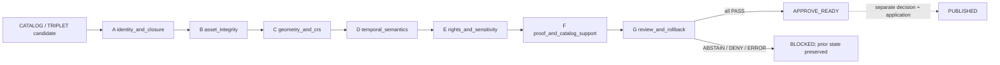

<!-- [KFM_META_BLOCK_V2]
doc_id: kfm://doc/architecture-publication-promotion-gates
title: Publication — Promotion Gates A–G
type: architecture-reference
version: v2.0-draft
status: draft; repository-grounded; vocabulary-conflicted; fixture-first; operational-release-hold; non-authoritative; non-publication
owners:
  - "@bartytime4life — current CODEOWNERS review route"
  - "NEEDS VERIFICATION — independent release, policy, evidence, review, signing, correction, rollback, and operations stewardship"
created: 2026-05-24
updated: 2026-08-20
policy_label: public; architecture; publication; promotion; readiness; correction; rollback; cite-or-abstain
owning_root: docs/
current_path: docs/architecture/publication/promotion-gates.md
responsibility: >-
  Explain the relationship between lifecycle-wide promotion controls and the
  current bounded final-readiness A–G profile, preserve the legacy vocabulary
  crosswalk, and keep readiness, decision, transition, release, publication,
  correction, and rollback authority separate.
truth_posture: >-
  CONFIRMED current path, accepted Directory Rules placement, bounded
  no-network A–G validator, read-only workflow, exact executable gate names,
  finite outcomes, and fixture-first support / PROPOSED ADR-0018 acceptance,
  production release-object profiles, and operational transition architecture /
  UNKNOWN live evidence resolution, accepted policy execution, signer trust,
  authenticated independent review, transition application, public serving,
  correction propagation, and operational rollback / NEEDS VERIFICATION
  exact-head hosted checks, required-check coupling, generated-receipt
  integrity, governed consumers, and the first governed release.
evidence_snapshot:
  repository: bartytime4life/Kansas-Frontier-Matrix
  base_ref: main
  base_commit: 1162f7fccc902bfd56e2679e0b14f2633b7a9fd9
  target_prior_blob: 6ae62f9778dd7ea2d67ea368683a002163b7cac1
  publication_readme_blob: 4a3a44046619b5b705a9e687d6c3aead91db1a4c
  release_gates_blob: 4e6f3aa020363d23192b7d3357ea516ebb2cc87d
  release_state_machine_blob: a5bc6d9cf5497315f63d33012363a1133214867e
  directory_rules_blob: fd49a0b83e55cef52c1124281f093e263526898d
  codeowners_blob: dd2a84aa514d8ecd9208bc347f90f9a2ed37dd61
  promotion_validator_readme_blob: e729df0cc007e8cf0d9811afc25ec1f5ffbdffdd
  promotion_workflow_blob: 9b567aad17de2a7419a2a0238386745c1cb5c11c
inspection_boundary: >-
  Current-session GitHub reads covered the complete prior target, publication
  lane README and detailed release-gate companion, release-state-machine
  companion, proposed ADR-0018, accepted ADR-0029, Directory Rules v2,
  CODEOWNERS, the bounded promotion validator README, the promotion workflow,
  and the inactive promotion-policy boundary. No mounted checkout, local
  repository command execution, live EvidenceBundle resolver, accepted policy
  evaluator, trusted signer, authenticated independent reviewer, release
  operator, deployment, public endpoint, correction propagation, or rollback
  execution was available in this authoring session.
related:
  - README.md
  - RELEASE_GATES.md
  - release-state-machine.md
  - release-objects.md
  - rollback-and-correction.md
  - GEO_MANIFEST.md
  - ../../adr/ADR-0018-promotion-gate-sequence.md
  - ../../adr/ADR-0029-adopt-directory-governance-standard-v2.md
  - ../../doctrine/directory-rules.md
  - ../../doctrine/lifecycle-law.md
  - ../governed-api/LIFECYCLE_GATES.md
  - ../cross-domain/trust-membrane.md
  - ../cross-domain/cross-lane-relations.md
  - ../../../tools/validators/promotion_gate/README.md
  - ../../../.github/workflows/promotion-gate.yml
  - ../../../policy/promotion/README.md
  - ../../../contracts/release/promotion_decision.md
  - ../../../contracts/release/promotion_receipt.md
  - ../../../contracts/release/release_manifest.md
  - ../../../release/README.md
tags: [kfm, architecture, publication, promotion-controls, promotion-readiness, gates, evidence, policy, review, correction, rollback, non-publication]
notes:
  - "v2.0-draft is a same-path documentation-only reconciliation against current repository evidence."
  - "The legacy source-admission-through-release A–G labels are retained only as a compatibility crosswalk; they are not presented as the current executable gate names."
  - "The bounded executable A–G profile is implemented but remains non-authoritative architecture while ADR-0018 is proposed with a REVISE checkpoint."
  - "No lifecycle transition, release, deployment, publication, policy activation, signer activation, or repository-setting change is performed."
[/KFM_META_BLOCK_V2] -->

<a id="top"></a>
<a id="publication--promotion-gates-ag"></a>

# Publication — Promotion Gates A–G

> **Operating rule.** In current repository implementation, A–G names one bounded final-promotion-readiness profile for a declared `CATALOG` or `TRIPLET` candidate. The source-to-publication journey is a wider set of lifecycle controls. Neither a gate result nor this document approves, applies, releases, deploys, publishes, or authorizes a public surface.

> [!IMPORTANT]
> **`PASS` means only `APPROVE_READY`.** It allows a packet to proceed to separately governed decision processing. It is not `APPROVE`, a lifecycle mutation, a release, `PUBLISHED`, or public-serving permission.

> [!CAUTION]
> **A–G is overloaded in repository history.** The prior edition of this page used A–G for source admission, provenance, sensitivity, validation, evidence closure, review, and release. The current bounded validator uses different names and a narrower final-readiness scope. Use the exact gate name and profile, never a letter alone.

> [!NOTE]
> This page is the concise, compatibility-preserving overview. [`RELEASE_GATES.md`](RELEASE_GATES.md) records the detailed current implementation boundary, reason-code families, object maturity, holds, and graduation requirements. [`release-state-machine.md`](release-state-machine.md) separates lifecycle stage, readiness, decision, transition application, and public-serving state.

**Navigation:** [Status](#status-and-authority) · [Scope](#1-scope) · [At a glance](#2-the-seven-gates--ataglance) · [A](#3-gate-a--source-admission) · [B](#4-gate-b--provenance) · [C](#5-gate-c--sensitivity) · [D](#6-gate-d--validation) · [E](#7-gate-e--evidence-closure) · [F](#8-gate-f--review) · [G](#9-gate-g--release) · [Ordering](#10-gate-ordering-and-reevaluation) · [Anti-patterns](#11-anti-patterns) · [Open items](#12-open-questions-and-adr-triggers) · [Related](#13-related-docs) · [Appendix](#14-appendix)

---

<a id="status-and-authority"></a>

## Status and authority

| Field | Current evidence-backed result |
|---|---|
| Document role | Explanatory architecture and compatibility crosswalk under `docs/`; not contract, schema, policy, evidence, review, receipt, proof, release, transition, or publication authority |
| Placement | **CONFIRMED `PLACE`** — same-path update under the accepted `docs/` responsibility root; no new root or parallel authority |
| Lifecycle spine | `RAW -> WORK / QUARANTINE -> PROCESSED -> CATALOG / TRIPLET -> PUBLISHED` |
| Current executable A–G | **CONFIRMED** bounded, deterministic, no-network, read-only, and non-publishing |
| A–G architecture authority | **PROPOSED / vocabulary conflict remains** — ADR-0018 is proposed with checkpoint `REVISE` |
| Promotion policy | **HOLD** — local Rego files are proposed no-op stubs and are not executed by the promotion-gate workflow |
| Evidence and review | Declared fixture support is checked; live resolution, authenticity, authority, independence, and current validity are not established |
| Decision and transition | `PromotionDecision` remains separate; production transition application is not established |
| Release and publication | No release, deployment, publication, alias mutation, or public-carrier authorization is created by A–G or this page |
| Review route | `@bartytime4life` through CODEOWNERS; routing is not independent release authority or proof of review |

### Non-effects

This document does not accept ADR-0018, activate promotion policy, authenticate evidence or actors, verify signatures, emit a `PromotionDecision`, `PromotionReceipt`, `ReleaseManifest`, review, proof, correction notice, or rollback card, apply a lifecycle transition, change `data/published/`, alter a public alias or cache, deploy a service, publish data, or change repository settings.

[Back to top](#top)

---

<a id="1-scope"></a>

## 1. Scope

This page answers four bounded questions:

1. What the current executable final-readiness A–G profile checks.
2. What each gate explicitly does **not** prove.
3. How that profile relates to wider lifecycle controls from source admission through correction and rollback.
4. How to interpret historical A–G references without silently changing their meaning.

It applies when designing, reviewing, or documenting a promotion-readiness packet, validator change, policy input, evidence requirement, review obligation, release-object relationship, or lifecycle-transition handoff.

It does not define a production database, accepted gate sequence, signer profile, identity authority, policy evaluator, release operator, public API route, or deployment procedure.

### Scope names to use

| Phrase | Meaning |
|---|---|
| **Lifecycle-wide promotion controls** | Distributed controls from source admission through validation, evidence, policy, review, decision, release, publication, correction, and rollback. They are not one current executable A–G chain. |
| **Final promotion-readiness A–G** | The bounded `kfm/promotion-readiness/A-G/v1` validator profile over one declared `CATALOG` or `TRIPLET` candidate. |
| **Promotion decision** | A separate `APPROVE`, `DENY`, or `ABSTAIN` decision surface; shape validity does not authenticate authority or apply state. |
| **Transition application** | Separately authorized mutation of governed lifecycle state with before/after evidence and durable records. |
| **Publication** | A governed released state served only through approved public interfaces and public-safe carriers. |

[Back to top](#top)

---

<a id="2-the-seven-gates--ataglance"></a>
<a id="2-the-seven-gates--at-a-glance"></a>

## 2. The seven gates — at a glance

The current executable profile begins only after a candidate declares that it is at `CATALOG` or `TRIPLET` and targets `PUBLISHED`. It evaluates declared packet closure and returns a readiness result; it does not perform the transition.



Dotted transition behavior is not established by the bounded validator.

| Gate | Exact executable name | Bounded question | What a local `PASS` does not prove |
|:---:|---|---|---|
| **A** | `identity_and_closure` | Are candidate/profile/spec/lifecycle and minimal manifest declarations internally complete? | Source admission, object existence, accepted contracts, or complete release closure |
| **B** | `asset_integrity` | Do declared specification hashes and artifact-digest sets agree across candidate, manifest, and run receipt? | Retrieval of actual bytes, immutability, trusted production, or signature validity |
| **C** | `geometry_and_crs` | Is declared geometry valid and deterministic with the bounded CRS and bbox posture? | Domain topology, scientific fitness, authoritative geometry, or sensitivity transformation |
| **D** | `temporal_semantics` | Are declared UTC-second timestamps and temporal ordering valid? | Source freshness policy, bitemporal authority, or a trusted external clock |
| **E** | `rights_and_sensitivity` | Is the supplied policy profile/label/result declaration locally admissible? | Execution of accepted policy, rights, consent, sovereignty, or sensitivity truth |
| **F** | `proof_and_catalog_support` | Are required evidence, attestation, run-receipt, catalog, and conditional AI-receipt references declared? | URI resolution, `EvidenceBundle` truth, signer trust, or catalog integrity |
| **G** | `review_and_rollback` | Are fixture-only review, actor/interval/binding, rollback, and correction declarations internally safe? | Authenticated identity, reviewer qualification, independent approval, usable rollback, or correction propagation |

### Finite evaluation semantics

- Gate statuses are `PASS`, `ABSTAIN`, `DENY`, or `ERROR`.
- Aggregate precedence is `ERROR > DENY > ABSTAIN > PASS`.
- Overall `PASS` maps to `APPROVE_READY`; every other result maps to `BLOCKED`.
- The validator may evaluate all seven gates for deterministic diagnostics instead of short-circuiting after the first non-`PASS` result.
- No gate emits a decision, receipt, manifest, state transition, release, or public artifact.

[Back to top](#top)

---

<a id="3-gate-a--source-admission"></a>

## 3. Gate A — `identity_and_closure`

> **Legacy anchor:** this section was previously titled “Gate A — Source admission.” Source admission remains a lifecycle-wide control, but it is not the current executable Gate A.

| Aspect | Current bounded behavior |
|---|---|
| Question | Does the packet declare the exact profile, candidate and author identities, a SHA-256 specification hash, the allowed lifecycle boundary, and minimal release-manifest identity? |
| Minimum `PASS` posture | Non-empty candidate/author; exact profile; valid `spec_hash`; declared `CATALOG` or `TRIPLET` to `PUBLISHED`; internally present minimal manifest declaration. |
| Failure posture | `DENY` for missing, malformed, unsupported, or contradictory identity and lifecycle declarations. |
| Explicit boundary | It does not admit a source, resolve a `SourceDescriptor`, verify rights, prove referenced objects exist, or establish complete release closure. |

### Lifecycle-wide relation

Source identity, provider role, rights, cadence, acquisition authority, and RAW/quarantine routing must be resolved before this final-readiness packet exists. A Gate A `PASS` cannot repair or substitute for an upstream source-admission failure.

[Back to top](#top)

---

<a id="4-gate-b--provenance"></a>

## 4. Gate B — `asset_integrity`

> **Legacy anchor:** this section was previously titled “Gate B — Provenance.” Provenance remains cross-cutting evidence; the current executable Gate B checks narrower declared digest relationships.

| Aspect | Current bounded behavior |
|---|---|
| Question | Do the declared candidate, release-manifest, and run-receipt specification hashes and artifact-digest sets agree? |
| Minimum `PASS` posture | Matching specification hashes; valid, non-empty, unique digest sets; manifest and run-receipt artifact-set equality. |
| Failure posture | `DENY` for a missing run receipt, invalid digest, specification mismatch, duplicate digest, or artifact-set mismatch. |
| Explicit boundary | It does not retrieve bytes, prove canonicalization, immutability, producer authority, signature trust, transparency, or complete provenance lineage. |

### Lifecycle-wide relation

Acquisition records, transforms, provenance receipts, source roles, and evidence lineage remain owned by their respective source, pipeline, receipt, proof, and evidence families. Digest agreement is necessary but not equivalent to provenance closure.

[Back to top](#top)

---

<a id="5-gate-c--sensitivity"></a>

## 5. Gate C — `geometry_and_crs`

> **Legacy anchor:** this section was previously titled “Gate C — Sensitivity.” Sensitivity is not removed; it is a distributed lifecycle and policy concern, while the current executable Gate C is geometric.

| Aspect | Current bounded behavior |
|---|---|
| Question | Does the packet declare valid, deterministic geometry in the bounded CRS with finite ordered world bounds? |
| Minimum `PASS` posture | `valid: true`; `deterministic: true`; `EPSG:4326`; finite bbox with ordered coordinates inside world limits. |
| Failure posture | `DENY` for invalid, nondeterministic, unsupported-CRS, non-finite, unordered, or out-of-range declarations. |
| Explicit boundary | It does not retrieve authoritative geometry, test domain topology or scientific fitness, apply geoprivacy, generalize sensitive precision, or prove the result is public-safe. |

### Lifecycle-wide relation

Rights, sensitivity, sovereignty, archaeology, rare-species locations, infrastructure, living-person data, and other harmful precision remain fail-closed across processing, policy, review, release, and delivery. Geometry validity never lowers sensitivity.

[Back to top](#top)

---

<a id="6-gate-d--validation"></a>

## 6. Gate D — `temporal_semantics`

> **Legacy anchor:** this section was previously titled “Gate D — Validation.” Schema and domain validation remain wider controls; the current executable Gate D checks bounded time declarations.

| Aspect | Current bounded behavior |
|---|---|
| Question | Are declared temporal bounds and the packet-supplied gate-evaluation instant strict real UTC-second timestamps with valid ordering? |
| Minimum `PASS` posture | Canonical UTC-second spelling; valid calendar values; `start <= end`; valid declared evaluation instant. |
| Failure posture | `DENY` for malformed, impossible, noncanonical, missing, or inverted temporal declarations. |
| Explicit boundary | It does not establish source freshness policy, bitemporal truth, currentness, authoritative event time, or a trusted external clock. |

### Lifecycle-wide relation

Schema validation, domain validators, cross-domain constraints, scientific checks, and public-response shape validation remain separate responsibilities. A Gate D `PASS` proves only the bounded temporal checks implemented by this profile.

[Back to top](#top)

---

<a id="7-gate-e--evidence-closure"></a>

## 7. Gate E — `rights_and_sensitivity`

> **Legacy anchor:** this section was previously titled “Gate E — Evidence closure.” Evidence closure remains mandatory where claims depend on evidence, but the current executable Gate E checks supplied policy context rather than resolving evidence.

| Aspect | Current bounded behavior |
|---|---|
| Question | Are the supplied policy profile, labels, public-safe combinations, and finite policy-evaluation declaration locally admissible? |
| Minimum `PASS` posture | Known profile and labels; valid public-safe label discipline; supplied result is neither denied nor errored. |
| Failure posture | `DENY` for unknown or unsafe policy declarations and supplied denial; `ERROR` for a supplied evaluator-error result. |
| Explicit boundary | It does not run the current Rego stubs, bind an accepted bundle/evaluator, establish rights or consent, prove sovereignty or sensitivity facts, or authorize public use. |

### Lifecycle-wide relation

The current `policy/promotion/` lane is proposed and inactive. Both local Rego modules are no-op stubs and are not executed by the promotion-gate workflow. Accepted policy source, versioned inputs, native tests, immutable bundle identity, evaluator binding, decision normalization, and governed consumption remain future work.

[Back to top](#top)

---

<a id="8-gate-f--review"></a>

## 8. Gate F — `proof_and_catalog_support`

> **Legacy anchor:** this section was previously titled “Gate F — Review.” Review is now represented within bounded Gate G declarations; Gate F checks declared support references.

| Aspect | Current bounded behavior |
|---|---|
| Question | Are evidence, attestation, run-receipt, catalog, and conditional AI-receipt references present in the packet where required? |
| Minimum `PASS` posture | Required arrays are present; STAC/DCAT/PROV support is declared; a run receipt is declared; AI receipt is present when mediation is declared. |
| Failure posture | `ABSTAIN` for missing evidence support; `DENY` for mandatory attestation, catalog, run-receipt, or conditional AI-receipt gaps. |
| Explicit boundary | It does not dereference URIs, resolve `EvidenceRef` to `EvidenceBundle`, authenticate source roles, verify attestations or signatures, or prove catalog closure. |

### Lifecycle-wide relation

A reference is not resolution. Consequential claims should resolve to authentic, current `EvidenceBundle` support under policy and sensitivity checks before public reliance. The bounded validator currently proves declared reference posture only.

[Back to top](#top)

---

<a id="9-gate-g--release"></a>

## 9. Gate G — `review_and_rollback`

> **Legacy anchor:** this section was previously titled “Gate G — Release.” The current Gate G does not release or publish. It checks fixture-only review and rollback/correction declarations.

| Aspect | Current bounded behavior |
|---|---|
| Question | Are declared review shape, canonical actor identifiers, authority/validity intervals, separation, obligations, subject/hash bindings, rollback target, and correction linkage internally safe? |
| Minimum `PASS` posture | Approving fixture declaration; closed obligations; distinct canonical actors; supplied intervals cover evaluation; subject/spec/artifact bindings match; rollback and correction declarations are present. |
| Failure posture | `ABSTAIN` for missing authority, open approving-review obligations, or missing correction lineage; `DENY` for unsafe, stale, superseded, self-reviewed, noncanonical, unbound, contradictory, or unusable declarations; `ERROR` for bounded review-validation failure. |
| Explicit boundary | It does not authenticate identities, assignments, qualification, independence, or review records; verify a rollback target; propagate correction; emit a decision; apply state; release; or publish. |

### Lifecycle-wide relation

After `APPROVE_READY`, KFM still needs separately governed evidence and policy closure, accountable decision processing, release records, verified artifact/signature binding, an authorized idempotent transition operator, public-carrier parity, correction/withdrawal handling, and usable rollback. No current gate substitutes for those steps.

[Back to top](#top)

---

<a id="10-gate-ordering-and-reevaluation"></a>

## 10. Gate ordering and re-evaluation

| Rule | Current interpretation |
|---|---|
| Named sequence | The bounded profile reports A through G in stable order, but requirements and reviews must include the exact gate name. |
| Diagnostic evaluation | The validator may evaluate every gate instead of stopping at the first failure so the same packet yields deterministic diagnostics. |
| Aggregate precedence | `ERROR > DENY > ABSTAIN > PASS`; only all-`PASS` becomes `APPROVE_READY`. |
| State preservation | Any non-`PASS` result is `BLOCKED` and must preserve the prior governed lifecycle state. |
| Decision boundary | `APPROVE_READY` is a handoff to separate decision processing, not an approval or transition. |
| Re-evaluation | Policy, evidence, review, rights, sensitivity, bytes, signatures, correction, and public-delivery posture may change after a bounded check; operational re-evaluation rules remain to be accepted and implemented. |
| Hot fixes | No current evidence authorizes a gate skip or an expedited path around evidence, policy, review, decision, correction, or rollback controls. |

### Lifecycle-wide control flow

The wider control flow is not a single executable A–G chain:

```text
source admission
  -> RAW / WORK / QUARANTINE handling
  -> processing and validation
  -> evidence and catalog/triplet closure
  -> bounded final-readiness A–G
  -> separate accountable decision
  -> separately authorized transition application
  -> governed PUBLISHED carriers and interfaces
  -> correction / withdrawal / supersession / rollback as required
```

Each arrow is a governed responsibility boundary. Current repository evidence does not prove one complete operational path across all arrows.

[Back to top](#top)

---

<a id="11-anti-patterns"></a>

## 11. Anti-patterns

| Anti-pattern | Required correction |
|---|---|
| **Letter-only requirements** — “Gate E passed” without profile or name | Name the exact profile and gate, for example `kfm/promotion-readiness/A-G/v1` Gate E `rights_and_sensitivity`. |
| **Legacy/current label collapse** | Use the compatibility crosswalk; do not treat historical “Gate D validation” as current Gate D `temporal_semantics`. |
| **`PASS` laundering** | Keep `PASS -> APPROVE_READY`; never rewrite it as `APPROVE`, `PROMOTED`, `RELEASED`, or `PUBLISHED`. |
| **Reference-as-evidence** | Resolve and authenticate the referenced support; a URI or ID alone is not evidence closure. |
| **No-op policy as enforcement** | Do not treat the current proposed Rego stubs or a policy directory as an accepted evaluation. |
| **Synthetic review as human approval** | Authenticate reviewer identity, assignment, qualification, scope, currentness, subject binding, and required independence. |
| **Digest agreement as byte/signature proof** | Retrieve and verify the exact bytes, canonicalization, signatures, trust roots, rotation, and revocation posture. |
| **Receipt/decision/manifest collapse** | Keep `PromotionReceipt`, `PromotionDecision`, `ReleaseManifest`, review, proof, and transition application as distinct object families. |
| **Green workflow as publication** | A green check proves only its bounded assertions; it is not release or public-serving authority. |
| **Hidden lifecycle mutation** | Apply state only through a separately authorized, auditable, idempotent transition with before/after evidence and rollback. |
| **Public bypass** | Public clients consume governed interfaces and released public-safe carriers, never candidate or internal stores. |
| **Hidden rollback** | Preserve a governed decision, correction path, invalidation scope, prior target, restoration evidence, and audit trail. |

[Back to top](#top)

---

<a id="12-open-questions-and-adr-triggers"></a>

## 12. Open questions and ADR triggers

| ID | Status | Question or hold | Evidence needed |
|---|---|---|---|
| `PG-OPEN-001` | PROPOSED / `REVISE` | Will ADR-0018 adopt the bounded final-readiness names, select another profile, or remain proposed? | Accepted ADR disposition and migration scope |
| `PG-OPEN-002` | NEEDS VERIFICATION | Which current or external consumers depend on the historical lifecycle-wide A–G labels or anchors? | Repository and external-consumer inventory before any retirement |
| `PG-OPEN-003` | HOLD | When will `policy/promotion/` become an accepted fail-closed policy implementation? | Contract, schema, native Rego tests, bundle, evaluator, selector, governed consumer, and receipts |
| `PG-OPEN-004` | UNKNOWN | Which identity and stewardship system authenticates independent review and release authority? | Accepted identity, assignment, qualification, and current-authority records |
| `PG-OPEN-005` | HOLD | Which signing profile and trust roots govern release artifacts? | Accepted signing decision, key lifecycle, revocation, offline, and target-environment proof |
| `PG-OPEN-006` | HOLD | Which operator applies `CATALOG / TRIPLET -> PUBLISHED` and proves exact before/after state? | Operator contract, idempotent tests, append-only records, and replay evidence |
| `PG-OPEN-007` | UNKNOWN | Do governed API, Explorer, map, export, search, cache, catalog, graph, and AI consumers enforce released-state parity? | Current code, integration tests, runtime logs, and deployed checks |
| `PG-OPEN-008` | UNKNOWN | Can correction, withdrawal, supersession, and rollback propagate through all affected public derivatives? | End-to-end drill, invalidation receipts, notices, and restoration evidence |
| `PG-OPEN-009` | NEEDS VERIFICATION | Which hosted checks and review rules are required at the exact PR head? | Hosted workflow results and repository-rules inspection |
| `PG-OPEN-010` | UNKNOWN | What is the first representative governed release candidate and accountable review packet? | Steward-selected bounded candidate, public-safe support, and acceptance evidence |

[Back to top](#top)

---

<a id="13-related-docs"></a>

## 13. Related docs

| Reference | Current role and posture |
|---|---|
| [`README.md`](README.md) | Publication-lane orientation, boundary map, and maturity register |
| [`RELEASE_GATES.md`](RELEASE_GATES.md) | Detailed current final-readiness boundary, exact reason-code families, object maturity, and graduation requirements |
| [`release-state-machine.md`](release-state-machine.md) | Separates lifecycle, readiness, decision, transition application, release records, and public-serving state |
| [`release-objects.md`](release-objects.md) | Publication object-family catalog; maturity varies by object |
| [`rollback-and-correction.md`](rollback-and-correction.md) | Concise correction and rollback architecture companion |
| [`GEO_MANIFEST.md`](GEO_MANIFEST.md) | Geospatial release-integrity architecture and current holds |
| [`../../adr/ADR-0018-promotion-gate-sequence.md`](../../adr/ADR-0018-promotion-gate-sequence.md) | Proposed final-readiness decision; checkpoint `REVISE` |
| [`../../adr/ADR-0029-adopt-directory-governance-standard-v2.md`](../../adr/ADR-0029-adopt-directory-governance-standard-v2.md) | Accepted same-path placement authority |
| [`../../doctrine/directory-rules.md`](../../doctrine/directory-rules.md) | Adopted placement bytes; path never confers release authority |
| [`../../doctrine/lifecycle-law.md`](../../doctrine/lifecycle-law.md) | Parent lifecycle invariant and governed-promotion posture |
| [`../governed-api/LIFECYCLE_GATES.md`](../governed-api/LIFECYCLE_GATES.md) | Request-time lifecycle and public-envelope boundary; not a release substitute |
| [`../cross-domain/trust-membrane.md`](../cross-domain/trust-membrane.md) | Cross-domain trust boundary and governed-interface posture |
| [`../cross-domain/cross-lane-relations.md`](../cross-domain/cross-lane-relations.md) | Cross-lane relationship and sensitivity-preservation context |
| [`../../../tools/validators/promotion_gate/README.md`](../../../tools/validators/promotion_gate/README.md) | Current executable bounded A–G behavior, fixtures, commands, and limits |
| [`../../../.github/workflows/promotion-gate.yml`](../../../.github/workflows/promotion-gate.yml) | Read-only workflow; it preserves explicit doctrine, review, evidence, policy, and release holds |
| [`../../../policy/promotion/README.md`](../../../policy/promotion/README.md) | Proposed-inactive promotion policy boundary with no-op rule stubs |
| [`../../../contracts/release/promotion_decision.md`](../../../contracts/release/promotion_decision.md) | Separate proposed transition-decision semantics |
| [`../../../contracts/release/promotion_receipt.md`](../../../contracts/release/promotion_receipt.md) | Separate proposed promotion-attempt receipt semantics |
| [`../../../contracts/release/release_manifest.md`](../../../contracts/release/release_manifest.md) | Release-manifest semantics and profile boundaries |
| [`../../../release/README.md`](../../../release/README.md) | Append-only release-decision and record boundary; operational release remains held |

[Back to top](#top)

---

<a id="14-appendix"></a>

## 14. Appendix

<details>
<summary><strong>14.1 Legacy lifecycle-wide A–G compatibility crosswalk</strong></summary>

The prior labels remain discoverable for historical links and migration review. They are not aliases for the current executable gate names.

| Historical letter and label | Current safe interpretation | Current executable letter, if related |
|---|---|---|
| A — Source admission | Upstream lifecycle-wide source identity, role, rights, and routing control | None; current A is `identity_and_closure` |
| B — Provenance | Cross-cutting acquisition, transform, source-role, receipt, proof, and evidence lineage | Current B checks declared `asset_integrity` only |
| C — Sensitivity | Distributed rights/sensitivity/sovereignty/geoprivacy control across lifecycle, policy, review, release, and delivery | Current E checks supplied `rights_and_sensitivity` context only |
| D — Validation | Schema, domain, cross-domain, scientific, and response-shape validation | Current D is `temporal_semantics` |
| E — Evidence closure | Authentic `EvidenceRef -> EvidenceBundle` resolution and claim support | Current F checks declared `proof_and_catalog_support`; it does not resolve refs |
| F — Review | Authenticated, qualified, current, scoped, subject-bound, independent review where required | Current G checks fixture-only review declarations |
| G — Release | Separate decision, manifest, signatures, transition application, public-carrier binding, correction, and rollback | No bounded gate releases; current G is `review_and_rollback` readiness |

</details>

<details>
<summary><strong>14.2 Current validation entry points</strong></summary>

```bash
make publish-check

python tools/validators/validate_promotion_gate.py --fixtures
python tools/validators/validate_review_record.py --fixtures

python tools/validators/release/validate_promotion_receipt.py --fixtures
python -m unittest -q tests.release.test_promotion_receipt
```

These commands are repository entry points documented by current files. They were not executed locally in this connector-only authoring session. Hosted exact-head results remain separate evidence.

A passing check does not prove accepted gate vocabulary, evidence truth, policy execution, rights or sensitivity clearance, signer trust, reviewer authority, transition application, release persistence, public serving, correction propagation, or rollback execution.

</details>

<details>
<summary><strong>14.3 Gate outcome quick reference</strong></summary>

```text
PASS     -> APPROVE_READY -> separate decision processing only
ABSTAIN  -> BLOCKED       -> support is insufficient
DENY     -> BLOCKED       -> unsafe or contradictory condition
ERROR    -> BLOCKED       -> evaluation could not complete safely

precedence: ERROR > DENY > ABSTAIN > PASS
```

</details>

<details>
<summary><strong>14.4 Truth-label legend</strong></summary>

- **CONFIRMED** — verified from current-session repository evidence, tests, logs, or generated artifacts.
- **PROPOSED** — design, profile, decision, or behavior not yet accepted or operationally established.
- **UNKNOWN** — evidence is insufficient to determine the result.
- **NEEDS VERIFICATION** — a concrete check can resolve the question but has not yet been completed.

</details>

### Change record

| Edition | Material result |
|---|---|
| `v0.1` | Concise lifecycle-wide A–G narrative that treated source admission through release as one confirmed sequence and included unsupported runtime and release assertions. |
| `v2.0-draft` | Repository-grounded reconciliation: exact bounded executable A–G names, explicit `APPROVE_READY` boundary, lifecycle-wide unlettered controls, preserved legacy anchors and crosswalk, inactive policy, fixture-only evidence/review limits, separate decision/application/publication, and operational release HOLD. |

---

<sub>This page is explanatory architecture. Any change that accepts a gate vocabulary, activates policy, changes an object family's authority, applies a lifecycle transition, authorizes release, or changes publication state requires its own governed decision and implementation evidence.</sub>

[Back to top](#top)
