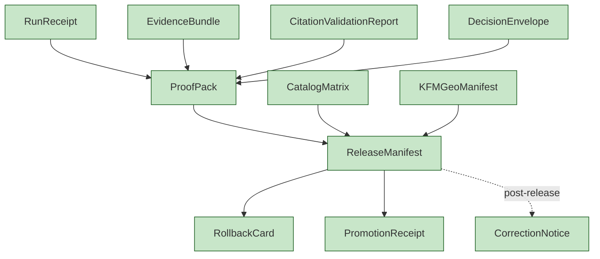
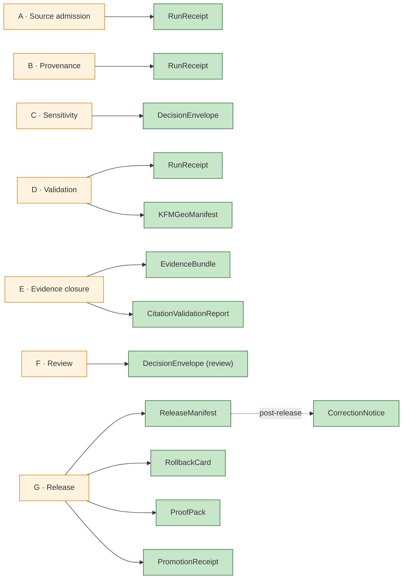

<!-- [KFM_META_BLOCK_V2]
doc_id: kfm://doc/architecture-publication-release-objects
title: Publication — Release Objects
type: standard
version: v0.1
status: draft
owners: Release Manager · Docs Steward · NEEDS VERIFICATION
created: 2026-05-24
updated: 2026-05-24
policy_label: public
related:
  - README.md
  - promotion-gates.md
  - release-state-machine.md
  - rollback-and-correction.md
  - GEO_MANIFEST.md
  - ../cross-domain/shared-kernel.md
  - ../governed-api/ENVELOPES.md
  - kfm_unified_doctrine_synthesis.md#10
tags: [kfm, architecture, publication, release, manifests, receipts, doctrine]
notes:
  - PROPOSED. Concise catalog of object families involved in publication.
  - Field-level schemas live in schemas/contracts/v1/release/; contract meaning in contracts/release/.
[/KFM_META_BLOCK_V2] -->

<a id="top"></a>

# Publication — Release Objects

> *The object families that compose a release: `ReleaseManifest`, `RollbackCard`, `PromotionReceipt`, `ProofPack`, `EvidenceBundle`, `RunReceipt`, `CitationValidationReport`, `CorrectionNotice`, `CatalogMatrix`, `DecisionEnvelope`, `KFMGeoManifest`.*


-blue)


**Status:** draft · **Owners:** Release Manager · Docs Steward *(NEEDS VERIFICATION)* · **Last updated:** 2026-05-24

> [!IMPORTANT]
> **A release is a composition of objects, not a copy of files** *(`README.md` §6, §8; `kfm_unified_doctrine_synthesis.md` §10, CONFIRMED)*. The objects below are the building blocks; the gates A–G *(see [`promotion-gates.md`](promotion-gates.md))* produce and consume them.

> [!NOTE]
> **This doc is the catalog.** Per-object semantic contracts live under `contracts/release/`, `contracts/evidence/`, `contracts/correction/`. JSON Schemas live under `schemas/contracts/v1/release/`, `schemas/contracts/v1/evidence/`, etc. *(ADR-0001)*. This doc names the family, role, and which gate emits / consumes it.

---

## Table of contents

1. [Scope](#1-scope)
2. [Object catalog](#2-object-catalog)
3. [`ReleaseManifest`](#3-releasemanifest)
4. [`RollbackCard`](#4-rollbackcard)
5. [`PromotionReceipt`](#5-promotionreceipt)
6. [`ProofPack`](#6-proofpack)
7. [`EvidenceBundle` and `EvidenceRef`](#7-evidencebundle-and-evidenceref)
8. [`RunReceipt`](#8-runreceipt)
9. [`CitationValidationReport`](#9-citationvalidationreport)
10. [`CorrectionNotice`](#10-correctionnotice)
11. [`CatalogMatrix`](#11-catalogmatrix)
12. [`DecisionEnvelope`](#12-decisionenvelope)
13. [`KFMGeoManifest`](#13-kfmgeomanifest)
14. [Composition through the gates](#14-composition-through-the-gates)
15. [Anti-patterns](#15-anti-patterns)
16. [Open questions and ADR triggers](#16-open-questions-and-adr-triggers)
17. [Related docs](#17-related-docs)
18. [Appendix](#18-appendix)

---

## 1. Scope

This doc enumerates the object families involved in publication, names each one's role, identifies which gate emits or consumes it, and points to its canonical schema / contract home.

> [!TIP]
> **When this doc binds.** Designing a new pipeline step that emits an object, evolving an existing object family, mapping a release event to its receipts, or auditing a release for object completeness.

[↑ Back to top](#top)

---

## 2. Object catalog

> **Evidence basis:** `README.md` §8 *(CONFIRMED summary)*; `kfm_unified_doctrine_synthesis.md` §10 *(core object families, CONFIRMED)*.

| Object | Role at publication | Schema home *(PROPOSED)* | Gate(s) |
|---|---|---|---|
| **`ReleaseManifest`** | Authoritative record of what is `PUBLISHED`. | `schemas/contracts/v1/release/release_manifest.schema.json` | G |
| **`RollbackCard`** | Pre-staged rollback target for a release. | `schemas/contracts/v1/release/rollback_card.schema.json` | G |
| **`PromotionReceipt`** | Receipt of a promotion event *(state transition)*. | `schemas/contracts/v1/release/promotion_receipt.schema.json` | A–G |
| **`ProofPack`** | Bundle of receipts that justify a release. | `schemas/contracts/v1/release/proof_pack.schema.json` | E, G |
| **`EvidenceBundle`** | Resolved support for the release's claims. | `schemas/contracts/v1/evidence/evidence_bundle.schema.json` | E |
| **`RunReceipt`** | Receipt for an automated pipeline run *(connector, validator, model)*. | `schemas/contracts/v1/release/run_receipt.schema.json` | A, B, D |
| **`CitationValidationReport`** | Proof that every cited `EvidenceRef` resolves to an admissible bundle. | `schemas/contracts/v1/focus/citation_validation_report.schema.json` | E, G |
| **`CorrectionNotice`** | Public lineage entry that supersedes a prior release. | `schemas/contracts/v1/release/correction_notice.schema.json` | post-release |
| **`CatalogMatrix`** | The matrix of catalog cells released as a bundle. | `schemas/contracts/v1/catalog/catalog_matrix.schema.json` | G |
| **`DecisionEnvelope`** | Records the policy decision at release time. | `schemas/contracts/v1/runtime/decision_envelope.schema.json` | C, F, G |
| **`KFMGeoManifest`** | Asset digest manifest for PMTiles / COG / Zarr. | `schemas/contracts/v1/release/kfm_geo_manifest.schema.json` | D, G |



[↑ Back to top](#top)

---

## 3. `ReleaseManifest`

| Aspect | Detail |
|---|---|
| Role | The authoritative inventory of what is `PUBLISHED` under a given release id. |
| Required fields *(prose)* | `release_id`, `released_at`, member layer / artifact / scene refs, `proof_pack_ref`, `rollback_card_ref`, `policy_bundle_hash`, signature, `withdrawn`. |
| Immutability | Manifests are immutable; corrections are new manifests. |
| Gate | G *(release)*. |

[↑ Back to top](#top)

---

## 4. `RollbackCard`

| Aspect | Detail |
|---|---|
| Role | Pre-staged rollback target for a release; defines what reverting to. |
| Required fields | `for_release_id`, `rollback_target_release_id`, trigger criteria, operational steps, expected runtime, signature. |
| Mandatory | Every `ReleaseManifest` references a `RollbackCard`. |
| Gate | G. |

> [!IMPORTANT]
> **Pre-staged ≠ executed.** The card is the **target** that rollback executes against; it does not retire the release on its own. See [`rollback-and-correction.md`](rollback-and-correction.md).

[↑ Back to top](#top)

---

## 5. `PromotionReceipt`

| Aspect | Detail |
|---|---|
| Role | Receipt of a state transition event *(e.g., `WORK` → `PROCESSED`, `PROCESSED` → `PUBLISHED`)*. |
| Required fields | `transition`, `from_state`, `to_state`, `at`, signer, evidence refs, policy refs. |
| Append-only | Receipts are append-only and content-addressed. |
| Gate | A through G — every gate emits its transition receipt. |

[↑ Back to top](#top)

---

## 6. `ProofPack`

| Aspect | Detail |
|---|---|
| Role | Bundle of receipts that justify a release: `RunReceipt`s, `EvidenceBundle` refs, `CitationValidationReport`, `DecisionEnvelope`s, validator reports. |
| Required fields | `release_ref`, `receipts[]`, `composition_hash`. |
| Gate | E *(assembled)*, G *(sealed and referenced from manifest)*. |

[↑ Back to top](#top)

---

## 7. `EvidenceBundle` and `EvidenceRef`

| Aspect | Detail |
|---|---|
| Role | The resolved support for every consequential claim in the release. |
| Cardinality | Multiple bundles per release; one bundle resolves multiple refs; refs are stable pointers. |
| Gate | E *(closure)*; re-resolved at runtime per `governed-api/LIFECYCLE_GATES.md`. |
| Cross-doc | `cross-domain/shared-kernel.md` §4. |

[↑ Back to top](#top)

---

## 8. `RunReceipt`

| Aspect | Detail |
|---|---|
| Role | Per-pipeline-run receipt: connector run, validator run, model run, build run. |
| Required fields | `run_id`, `tool_id`, `inputs[]`, `outputs[]`, `spec_hash`, `started_at`, `finished_at`, signer. |
| Gate | A *(connector)*, B *(provenance)*, D *(validator)*. |

[↑ Back to top](#top)

---

## 9. `CitationValidationReport`

| Aspect | Detail |
|---|---|
| Role | Confirms every cited `EvidenceRef` resolves to an admissible `EvidenceBundle`. |
| Required fields | `claim_refs[]`, `bundle_refs[]`, `all_resolved`, per-ref resolution result. |
| Gate | E *(promotion-time)*; runtime *(per request)*. |
| Failure | Unresolved → `ABSTAIN`; release denied at G if closure incomplete. |

[↑ Back to top](#top)

---

## 10. `CorrectionNotice`

| Aspect | Detail |
|---|---|
| Role | Public lineage entry that records a supersession event without deletion. |
| Required fields | `corrects_release_id`, `superseded_by_release_id`, `reason_class`, `summary`, `at`, signer. |
| Visibility | Public; drawer surfaces the chain. |
| When | Post-release; not a gate. |
| Cross-doc | [`rollback-and-correction.md`](rollback-and-correction.md). |

[↑ Back to top](#top)

---

## 11. `CatalogMatrix`

| Aspect | Detail |
|---|---|
| Role | Matrix of catalog cells released as a coherent bundle *(domain × time × space)*. |
| Required fields | `cells[]`, per-cell evidence + source-role distribution, joint sensitivity. |
| Gate | G *(carried in manifest)*. |

[↑ Back to top](#top)

---

## 12. `DecisionEnvelope`

| Aspect | Detail |
|---|---|
| Role | Records `PolicyDecision` at release time with audience class, posture, release state. |
| Required fields | See `governed-api/ENVELOPES.md` §4. |
| Gate | C *(sensitivity decision)*, F *(review decision)*, G *(release decision)*. |

[↑ Back to top](#top)

---

## 13. `KFMGeoManifest`

| Aspect | Detail |
|---|---|
| Role | Asset digest manifest for tile artifacts *(PMTiles, COG, Zarr)*; viewer-side integrity check matches against it. |
| Required fields | Per-asset `content_digest`, signature, format, release_ref. |
| Gate | D *(integrity)*, G *(carried in manifest)*. |
| Cross-doc | [`GEO_MANIFEST.md`](GEO_MANIFEST.md); `map-master/TILE_ARTIFACTS.md`. |

[↑ Back to top](#top)

---

## 14. Composition through the gates



[↑ Back to top](#top)

---

## 15. Anti-patterns

| Anti-pattern | Mitigation |
|---|---|
| **`ReleaseManifest` edited in place** | Manifests immutable; correction is a new manifest. |
| **`RollbackCard` omitted "for hot fixes"** | Always present; expedited path still produces one. |
| **`ProofPack` partially assembled** | Assembly is atomic; partial pack denies release. |
| **`CorrectionNotice` substituted for re-release** | Notice supersedes; the new content is a new manifest. |
| **`RunReceipt` retried without new id** | Each run gets a new id; retries are new receipts. |
| **`KFMGeoManifest` digest computed at publish time, not at build time** | Digests pinned at D; carried unchanged to G. |
| **`EvidenceBundle` inlined into the manifest** | Bundles referenced by URI; never inlined. |

[↑ Back to top](#top)

---

## 16. Open questions and ADR triggers

| Open item | Class | Suggested ADR title |
|---|---|---|
| `ProofPack` composition hash — content-addressed by a Merkle tree of receipts? | Cryptography | "ProofPack composition hash". |
| `CorrectionNotice` cardinality — one per release vs chain of notices? | Schema | "CorrectionNotice chaining". |
| `CatalogMatrix` per-release vs per-Focus-Mode scope? | Composition | "CatalogMatrix scope". |
| `KFMGeoManifest` and `TileArtifactManifest` unification? | Object family | "GeoManifest / TileArtifactManifest unification". |
| Receipt schema home — `schemas/contracts/v1/receipts/` vs `schemas/contracts/v1/release/`? | Layout | "Receipt schema home". |

[↑ Back to top](#top)

---

## 17. Related docs

| Reference | Role | Truth label |
|---|---|---|
| `README.md` *(this folder)* §8 | Landing summary | CONFIRMED doctrine |
| `promotion-gates.md` *(sibling)* | Which gate emits / consumes each object | PROPOSED |
| `release-state-machine.md` *(sibling)* | The states the objects mark transitions through | PROPOSED |
| `rollback-and-correction.md` *(sibling)* | `RollbackCard` + `CorrectionNotice` | PROPOSED |
| `GEO_MANIFEST.md` *(sibling)* | Detailed `KFMGeoManifest` | CONFIRMED scaffold |
| `RELEASE_GATES.md` *(sibling)* | Per-gate object detail | CONFIRMED scaffold |
| `../cross-domain/shared-kernel.md` | Kernel object definitions | CONFIRMED doctrine |
| `../governed-api/ENVELOPES.md` | `DecisionEnvelope` shape | PROPOSED |
| `kfm_unified_doctrine_synthesis.md` §10 | Core object families canonical | CONFIRMED doctrine |
| `contracts/release/` | Semantic contracts | CONFIRMED doctrine *(PROPOSED paths)* |

[↑ Back to top](#top)

---

## 18. Appendix

<details>
<summary><strong>18.1 Object → gate quick-reference</strong></summary>

```text
ReleaseManifest             G
RollbackCard                G
PromotionReceipt            A-G (one per transition)
ProofPack                   E (assembled), G (sealed)
EvidenceBundle              E
RunReceipt                  A, B, D
CitationValidationReport    E (+ runtime)
CorrectionNotice            post-release
CatalogMatrix               G
DecisionEnvelope            C, F, G
KFMGeoManifest              D (computed), G (carried)
```

</details>

<details>
<summary><strong>18.2 Truth-label legend</strong></summary>

- **CONFIRMED** — verified this session from attached docs.
- **PROPOSED** — design / placement / inference not yet verified in implementation.
- **INFERRED** — derivable from confirmed evidence but not directly stated.
- **NEEDS VERIFICATION** — checkable, but not yet checked strongly enough to act as fact.

</details>

---

**Related (mini)** · [`README.md`](README.md) · [`promotion-gates.md`](promotion-gates.md) · [`release-state-machine.md`](release-state-machine.md) · [`rollback-and-correction.md`](rollback-and-correction.md) · [`GEO_MANIFEST.md`](GEO_MANIFEST.md) · [`RELEASE_GATES.md`](RELEASE_GATES.md) · [`../cross-domain/shared-kernel.md`](../cross-domain/shared-kernel.md)

**Last updated:** 2026-05-24 · **Doc version:** v0.1 · **Doc status:** draft · **Path status:** PROPOSED

[↑ Back to top](#top)
