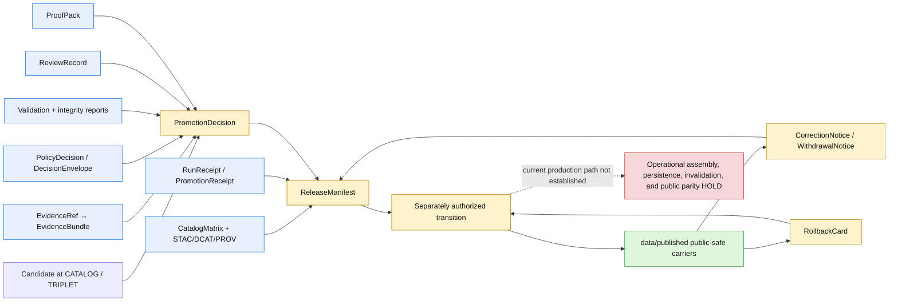

<!-- [KFM_META_BLOCK_V2]
doc_id: kfm://doc/architecture-publication-release-objects
title: Publication — Release Objects and Support Boundaries
type: architecture-reference
version: v2.0-draft
status: draft; repository-grounded; object-family-separated; mixed-maturity; conflicted-gate-vocabulary; operational-release-hold; non-authoritative; non-publication
owners:
  - "@bartytime4life — verified CODEOWNERS review route"
  - "NEEDS VERIFICATION — independent release, evidence, policy, review, correction, rollback, and security/signing stewardship"
created: 2026-05-24
updated: 2026-08-19
policy_label: public; architecture; publication; release; object-families; authority-boundaries; fixture-first; cite-or-abstain; fail-closed
owning_root: docs/
responsibility: Explain the release-governance object graph, adjacent support families, current repository maturity, and non-effects without becoming semantic-contract, schema, policy, evidence, receipt, proof, release, runtime, or publication authority.
truth_posture: >-
  CONFIRMED tracked same-path document, accepted Directory Rules v2 placement,
  current release-governance and support surfaces, bounded fixture-first validation,
  and explicit operational holds / PROPOSED semantic contracts and inactive
  profiles that have not crossed governed adoption or operational release gates /
  CONFLICTED A-G vocabulary, correction-family placement, ReviewRecord
  reconciliation, and some compatibility lanes / UNKNOWN authenticated release
  authority, production assembly, signing custody, transition persistence,
  invalidation, correction propagation, rollback execution, and public parity /
  NEEDS VERIFICATION named stewards, accepted object profiles, reference
  resolution, reviewer independence, hosted exact-head checks, and the first
  governed release.
evidence_snapshot:
  repository: bartytime4life/Kansas-Frontier-Matrix
  base_ref: main
  base_commit: fec1f92fde6fb7dd83c995f9984d495bb61a84bb
  base_tree: b5a7863a604e5f7207b64531abeb61c6ea16b731
  target_prior_blob: 09dbef6027cf8595a89b0c52b8ac76ca15406e89
  publication_readme_blob: 4a3a44046619b5b705a9e687d6c3aead91db1a4c
  release_gates_blob: 4e6f3aa020363d23192b7d3357ea516ebb2cc87d
  directory_rules_blob: fd49a0b83e55cef52c1124281f093e263526898d
  codeowners_blob: dd2a84aa514d8ecd9208bc347f90f9a2ed37dd61
  release_root_readme_blob: 60b6a656f8f2b765616bba7223f51c25863c7172
  release_manifest_contract_blob: ce7dc89ff447d76d974afdd802b85a38538d8f48
  promotion_decision_contract_blob: 42295bfc83a621cf125d33aa821912b426f70bd2
  promotion_receipt_contract_blob: ed432f8e3e02d170589c9e04d78087a69346909d
  rollback_card_contract_blob: c6d3c35c56b064e04c3a2532f4709d938d7b0c1a
  proof_pack_contract_blob: 1e0b3fc941499b28c436842ff95ebe032fc89c0d
  review_record_contract_blob: 9641345d1e5d939dc59687a900e60a563d92c4f0
inspection_boundary: >-
  GitHub repository files and current branch metadata were inspected. No mounted
  checkout, local repository-native test run, runtime log, deployment, release
  registry, signing service, public endpoint, or production rollback exercise was
  available in this authoring environment.
related:
  - README.md
  - RELEASE_GATES.md
  - promotion-gates.md
  - release-state-machine.md
  - rollback-and-correction.md
  - CORRECTION.md
  - ROLLBACK.md
  - GEO_MANIFEST.md
  - ../../adr/ADR-0011-receipts-vs-proofs-vs-manifests-vs-catalog-separation.md
  - ../../adr/ADR-0018-promotion-gate-sequence.md
  - ../../adr/ADR-0029-adopt-directory-governance-standard-v2.md
  - ../../doctrine/directory-rules.md
  - ../../../contracts/release/README.md
  - ../../../contracts/evidence/proof_pack.md
  - ../../../contracts/governance/ReviewRecord.md
  - ../../../release/README.md
  - ../../../data/receipts/README.md
  - ../../../data/proofs/README.md
  - ../../../data/catalog/README.md
  - ../../../data/published/README.md
notes:
  - "Same-path architecture-document modernization; placement outcome PLACE."
  - "Preserves the legacy explicit anchors for the eleven previously cataloged objects."
  - "Adds PromotionDecision, ReviewRecord, WithdrawalNotice, authority-home, maturity, finite-outcome, and operational-HOLD coverage."
  - "Removes the stale claim that every object belongs under release schemas or maps cleanly to one A-G gate vocabulary."
  - "No contract, schema, policy, fixture, validator, workflow, data, receipt, proof, release, runtime, deployment, or publication state changes."
tags: [kfm, architecture, publication, release, promotion, manifests, receipts, proofs, evidence, catalogs, correction, rollback, governance]
[/KFM_META_BLOCK_V2] -->

<a id="top"></a>

# Publication — Release Objects and Support Boundaries

> **One-line purpose.** Explain how KFM release-governance records compose with evidence, review, policy, receipt, proof, catalog, integrity, correction, rollback, and public-carrier families without allowing any one object—or any green check—to impersonate release or publication authority.

[](#status-and-authority)
[](#directory-rules-basis)
[](#directory-rules-basis)
[](#object-family-map)
[](#current-repository-maturity)
[](#current-repository-maturity)
[](#non-effects)

> [!IMPORTANT]
> **A KFM release is a governed composition, not a large JSON file and not a file copy.** Semantic contracts, machine schemas, evidence, policy, review, receipts, proofs, catalog records, release decisions, correction controls, rollback controls, and public-safe carriers remain separate authorities. They may reference one another by stable identity and digest; they do not silently substitute for one another.

> [!CAUTION]
> **“Release object” has two meanings that must stay distinct.** This document calls `PromotionDecision`, `ReleaseManifest`, `RollbackCard`, `CorrectionNotice`, and `WithdrawalNotice` **release-governance records**. It calls `PromotionReceipt`, `RunReceipt`, `ReviewRecord`, `EvidenceBundle`, `ProofPack`, `CatalogMatrix`, `CitationValidationReport`, `DecisionEnvelope`, and `KFMGeoManifest` **adjacent support families**. The support families may be required for a release, but they do not become release decisions by association.

> [!WARNING]
> **Shape-valid is not approved; ready is not transitioned; transitioned is not necessarily published.** Current fixture-first validators prove only their declared local shape, finite-outcome, binding, digest, and no-write properties. They do not authenticate evidence or reviewers, execute policy, approve promotion, persist a release, mutate an alias, invalidate consumers, deploy, or publish.

**Quick navigation:** [Status](#status-and-authority) · [Scope](#scope) · [Family map](#object-family-map) · [Core graph](#composition-and-transition-graph) · [Maturity](#current-repository-maturity) · [Outcomes](#finite-outcomes-do-not-collapse) · [Homes](#responsibility-and-instance-homes) · [Gates](#gate-vocabulary-and-scope) · [Validation](#validation-and-acceptance) · [Holds](#open-holds-and-verification-backlog) · [Rollback](#maintenance-correction-and-rollback)

---

<a id="status-and-authority"></a>

## Status and authority

| Question | Current bounded answer |
|---|---|
| Does this file exist at the documented path? | **CONFIRMED.** `docs/architecture/publication/release-objects.md` is tracked on `main`. |
| Is this the semantic contract or machine schema for any object below? | **No.** This is explanatory architecture under `docs/`. |
| Is the placement accepted? | **CONFIRMED.** Accepted ADR-0029 adopts Directory Rules v2; this same-path human architecture reference remains under `docs/architecture/publication/`. |
| Who is the verified GitHub review route? | **CONFIRMED:** `@bartytime4life` through current CODEOWNERS. That route is not proof of independent stewardship, review completion, release approval, or separation of duties. |
| Are all named object families accepted and operational? | **No.** Current surfaces are mixed maturity: some are closed fixture-first profiles, some remain thin or permissive scaffolds, and operational release remains held. |
| Does this document change release state? | **No.** It changes documentation only. |

### Truth labels

| Label | Use here |
|---|---|
| **CONFIRMED** | Verified from current repository bytes, accepted doctrine, or current branch metadata. |
| **PROPOSED** | Contract, profile, relationship, field family, or operating design not accepted and verified as current behavior. |
| **UNKNOWN** | No sufficient repository, platform, runtime, or public-operation evidence establishes the state. |
| **NEEDS VERIFICATION** | A concrete file, test, review, role, workflow, runtime, or operational check remains. |
| **CONFLICTED** | Current documents, profiles, names, or homes disagree and require coordinated reconciliation. |
| **HOLD** | A bounded next transition must not proceed until its named prerequisite is satisfied. |

[Back to top](#top)

---

<a id="directory-rules-basis"></a>

## Directory Rules basis

Accepted [ADR-0029](../../adr/ADR-0029-adopt-directory-governance-standard-v2.md) adopts the current [Directory Rules](../../doctrine/directory-rules.md). The target is an existing tracked explanatory document; it neither changes responsibility roots nor creates an authority surface. Placement outcome: **PLACE**.

The relevant responsibility split is:

| Responsibility | Canonical lane | This document's relationship |
|---|---|---|
| Human architecture and boundary explanation | `docs/architecture/publication/` | Explain and link; never decide or persist release state. |
| Semantic object meaning | `contracts/` by object family | Consume meaning; do not redefine it here. |
| Machine-checkable shape | `schemas/contracts/v1/` by object family | Link to shape; schema PASS is not authority. |
| Admissibility and obligations | `policy/` | Policy remains executable/normative authority where adopted. |
| Process memory | `data/receipts/` | Reference receipts; do not store them under docs or release decisions. |
| Evidence and proof support | `data/proofs/` and evidence stores | Reference support; do not turn support into approval. |
| Catalog/discovery records | `data/catalog/` and `data/triplets/` | Reference catalog closure; discovery is not publication. |
| Append-only release decisions and records | `release/` | Explain state transitions; do not write records here. |
| Released public-safe carriers | `data/published/` | Downstream output only after governed release. |
| Validation and operators | `tools/validators/` and `tools/` | Run bounded checks; tools do not self-authorize. |
| Public delivery | `apps/governed-api/` and `apps/explorer-web/` | Consume governed, released projections; never canonical/internal stores as the normal path. |

[Back to top](#top)

---

<a id="scope"></a>

## Scope

This page answers five architecture questions:

1. Which objects are release-governance records, and which are supporting evidence, policy, review, receipt, proof, catalog, integrity, runtime, or public-carrier objects?
2. Which responsibility root owns semantic meaning, machine shape, emitted instances, validation, and public delivery?
3. What does the current repository prove for each family, and what remains only proposed, conflicted, unknown, or held?
4. How do finite outcomes compose without letting `PASS`, `APPROVE_READY`, `APPROVE`, `PUBLISHED`, and `ANSWER` collapse into one another?
5. Which exact dependencies must be inspectable before a release-significant transition can be relied upon?

This page does **not** settle field-level schema design, accept ADR-0011 or ADR-0018, activate a profile, authenticate a reviewer, execute a release, or declare a public artifact current.

[Back to top](#top)

---

<a id="object-family-map"></a>

## Object-family map

### Release-governance records

| Object or record family | Primary question answered | Semantic home | Emitted-record home | Current authority limit |
|---|---|---|---|---|
| `PromotionDecision` | May this exact candidate cross the named lifecycle boundary? | [`contracts/release/promotion_decision.md`](../../../contracts/release/promotion_decision.md) | `release/promotion_decisions/` target lane | Proposed shape and bounded fixtures do not authenticate the decider or apply a transition. |
| `ReleaseManifest` | Which exact artifact set and trust references define one release? | [`contracts/release/release_manifest.md`](../../../contracts/release/release_manifest.md) | `release/manifests/` target lane | Dual-profile fixture validation does not resolve refs, verify bytes/signatures, persist, release, or publish. |
| `RollbackCard` | What prior, withdrawal, hold, or error target and invalidation plan bound reversal? | [`contracts/release/rollback_card.md`](../../../contracts/release/rollback_card.md) | `release/rollback_cards/` target lane | Closed candidate profile is non-executing and retains all authority flags as false. |
| `CorrectionNotice` | What published reliance changed, why, and what successor or public posture follows? | [`contracts/correction/correction_notice.md`](../../../contracts/correction/correction_notice.md) | `release/correction_notices/` target lane | Contract/schema placement remains conflicted; end-to-end propagation is not proved. |
| `WithdrawalNotice` | What must stop being served or relied upon while audit history remains visible? | [`contracts/release/withdrawal_notice.md`](../../../contracts/release/withdrawal_notice.md) | `release/withdrawal_notices/` target lane | Current schema is thin/permissive; invalidation and public withdrawal remain unverified. |
| Signature and release changelog records | Which digest-bound attestations and chronological release changes are recorded? | Contract/standard surfaces by family | `release/signatures/` and `release/changelog/` target lanes | Signing custody, verifier policy, and operational use remain **UNKNOWN / NEEDS VERIFICATION**. |

### Adjacent support families

| Object or family | Primary question answered | Owning family | Why it is not a release decision |
|---|---|---|---|
| `PromotionReceipt` | What did one promotion-readiness attempt evaluate, what were the A–G results, and was a transition declared? | Receipt profile with semantic contract under `contracts/release/`; instances remain receipt/data records | Records process memory and declared effect; does not decide, authenticate, or prove transition. |
| `ReviewRecord` | Who reviewed what, in which role, against which basis, and with what disposition? | Governance | Records review; does not equal `PolicyDecision`, `PromotionDecision`, or platform enforcement. |
| `PolicyDecision` / `DecisionEnvelope` | What finite policy or runtime disposition applies to a bounded request or object? | Policy/runtime | Policy and runtime outcomes constrain release; they do not inventory or persist a release. |
| `EvidenceRef` / `EvidenceBundle` | What admissible support resolves for a consequential claim? | Evidence | Evidence supports claims; it does not approve promotion or publish artifacts. |
| `ProofPack` | Are the declared local release-support components mutually bound, path-safe, and digest-consistent? | Evidence/proof | Proof support is review input; PASS does not establish evidence truth or release authority. |
| `RunReceipt` | What execution happened, with which inputs, outputs, code/spec identity, sources, validation refs, and result? | Runtime/receipts | Process memory records what ran; it does not prove output truth or publishability. |
| `CitationValidationReport` | Did cited refs resolve under the declared validation scope? | Evidence/citation or UI projection | Citation closure supports a claim; it is not a release inventory or decision. |
| `CatalogMatrix` plus STAC/DCAT/PROV projections | Do catalog and provenance profiles agree about the declared candidate? | Catalog/data | Discovery and interoperability records are derived support, not sovereign truth or release state. |
| `KFMGeoManifest` and carrier-integrity manifests | Which geospatial candidate bytes, digests, spatial/temporal declarations, and evidence hooks are locally consistent? | Evidence/integrity | Byte/metadata integrity is necessary support; it does not establish rights, review, promotion, release, or publication. |
| Public-safe carriers | Which released PMTiles, COG, GeoParquet, reports, indexes, or other derivatives are consumable? | `data/published/` | Carriers are downstream bytes. Their presence alone does not prove a governed release. |

[Back to top](#top)

---

<a id="composition-and-transition-graph"></a>

## Composition and transition graph

The following is a **responsibility graph**, not a claim that one production workflow currently wires every arrow.


```mermaid
flowchart LR
  classDef support fill:#e8f0fe,stroke:#1a73e8,color:#111;
  classDef decision fill:#fff3cd,stroke:#b58105,color:#111;
  classDef public fill:#dff6dd,stroke:#238636,color:#111;
  classDef hold fill:#f8d7da,stroke:#b42318,color:#111;

  C["Candidate at CATALOG / TRIPLET"]
  E["EvidenceRef → EvidenceBundle"]:::support
  P["PolicyDecision / DecisionEnvelope"]:::support
  V["Validation + integrity reports"]:::support
  R["ReviewRecord"]:::support
  PP["ProofPack"]:::support
  CM["CatalogMatrix + STAC/DCAT/PROV"]:::support
  RR["RunReceipt / PromotionReceipt"]:::support
  PD["PromotionDecision"]:::decision
  RM["ReleaseManifest"]:::decision
  X["Separately authorized transition"]:::decision
  PUB["data/published public-safe carriers"]:::public
  CN["CorrectionNotice / WithdrawalNotice"]:::decision
  RC["RollbackCard"]:::decision
  OP["Operational assembly, persistence, invalidation, and public parity HOLD"]:::hold

  C --> PD
  E --> PD
  P --> PD
  V --> PD
  R --> PD
  PP --> PD
  CM --> RM
  RR --> RM
  PD --> RM
  RM --> X
  X --> PUB
  PUB --> CN
  PUB --> RC
  CN --> RM
  RC --> X
  X -. current production path not established .-> OP
```

### Transition rule

A trustworthy transition requires more than object presence:

```text
candidate identity
  + evidence resolution
  + policy disposition
  + validation and integrity
  + accountable review
  + proof/catalog closure
  + promotion decision
  + release manifest
  + correction and rollback support
  + authorized persistence/public-delivery operation
  = eligible governed transition
```

Even this composition does not prove public parity until governed API, map/UI, cache, index, export, and correction/withdrawal consumers are verified against the exact released state.

[Back to top](#top)

---

<a id="3-releasemanifest"></a>

## `ReleaseManifest`

**Classification:** core release-governance record.

The current semantic contract defines `ReleaseManifest` as the stable binding for an artifact set and its trust references. The paired schema has two branches: a permissive legacy compatibility branch and a closed `RELEASE_MANIFEST_FIXTURE_V1` candidate branch. The strict branch proves deterministic local candidate shape and selected relationships only.

Minimum architecture obligations:

- bind an immutable release identity rather than a floating `latest` pointer;
- reference every included artifact by stable ref and digest rather than embedding payload bytes;
- preserve evidence, source role, policy, promotion, review, rights, sensitivity, attestation, proof, receipt, correction, withdrawal, and rollback context as separate refs;
- record temporal and supersession lineage;
- remain unable to grant public access by itself.

**Current HOLD:** reference dereference/authentication, real byte and signature verification, policy execution, authenticated review, release persistence, alias mutation, public serving, and correction propagation are not established end to end.

[Back to top](#top)

---

<a id="4-rollbackcard"></a>

## `RollbackCard`

**Classification:** core release-governance reversal record.

The current contract, closed schema, fixtures, validator, tests, and workflow define a fixture-first, non-executing candidate profile. A card may propose rollback, withdrawal, hold, or error posture; it identifies affected and target states, evidence/policy/review refs, correction linkage, invalidation classes, restoration intent, time, lineage, and explicit non-authority flags.

**Invariant:** pre-staged does not mean executed. Rollback remains a governed transition with separate approval, persistence, invalidation, restoration, receipt, correction, and public-parity work.

[Back to top](#top)

---

<a id="5-promotionreceipt"></a>

## `PromotionReceipt`

**Classification:** release-scoped receipt profile; not the promotion decision.

The current fixture-first contract records one candidate, the exact bounded final-readiness A–G evaluation, support refs, digest integrity, optional `PromotionDecision` ref, and whether `transition.applied` was declared. Its validator can require internally consistent prerequisites when `transition.applied: true`.

That declaration is not authenticated proof that a state change occurred. `PromotionReceipt` remains separate from:

- `PromotionDecision` — accountable decision;
- the readiness packet — bounded validator input/output;
- `ReleaseManifest` — release inventory;
- `RunReceipt` — general execution memory;
- `ProofPack` — assembled release support;
- `RollbackCard` and `CorrectionNotice` — reversal/correction controls.

[Back to top](#top)

---

<a id="6-proofpack"></a>

## `ProofPack`

**Classification:** evidence/proof support.

The current `kfm.proof-pack.release-support.v1` profile is closed, fixture-first, no-network, path-safe, digest-bound, and non-authoritative. It requires release/subject/spec-hash agreement and a bounded set of component kinds such as evidence bundle, validation report, integrity manifest, provenance export, lineage index, promotion decision, runtime proof, citation sample, CI run, release anchor, and rollback reference.

`PROOF_PACK_CHECK_PASS` means the declared local support set satisfies that profile. It does not mean the evidence is true, policy is correct, a reviewer is authorized, a signature is authentic, a release exists, or publication is allowed.

[Back to top](#top)

---

<a id="7-evidencebundle-and-evidenceref"></a>

## `EvidenceBundle` and `EvidenceRef`

**Classification:** evidence authority and reference surface.

Consequential release-visible claims should resolve `EvidenceRef` to `EvidenceBundle` before they are relied upon. The repository now contains a bounded internal alpha resolver that evaluates one caller-supplied ref, bundle candidate, lookup snapshot, verification history, and policy context deterministically with no network or store access.

The alpha resolver's `RESOLVED` result is explicitly non-authoritative. It does not establish claim-scope completeness, rights/sensitivity clearance, review, release readiness, or publication. Authoritative registries, correction history, source role, policy, and release integration remain held.

[Back to top](#top)

---

<a id="8-runreceipt"></a>

## `RunReceipt`

**Classification:** runtime/pipeline receipt support.

The current semantic contract and paired runtime schema record one execution's run/stage identity, input and output refs, code ref, spec hash, source-descriptor refs, validation refs, and finite `SUCCESS | PARTIAL | FAIL` outcome.

A successful run is only an execution result. It does not mean validation passed, evidence is true, policy allows use, review occurred, promotion is approved, or public serving is safe. Release-specific binding may use a narrower profile, but it must not create a second general receipt authority.

[Back to top](#top)

---

<a id="9-citationvalidationreport"></a>

## `CitationValidationReport`

**Classification:** citation/evidence validation support, with UI/runtime projections.

The repository has citation-report contracts in evidence and UI-adjacent lanes, which makes canonical profile ownership a seam to reconcile rather than a reason to treat the report as a release record. A report may prove that the declared citations satisfy a bounded resolution/admissibility check. It does not authenticate the underlying source, approve a release, or replace `EvidenceBundle`.

For release use, unresolved, stale, withdrawn, corrected, or policy-blocked citations must fail closed through the applicable `ABSTAIN`, `DENY`, `ERROR`, or release-blocking vocabulary without exposing restricted reason detail to unauthorized clients.

[Back to top](#top)

---

<a id="10-correctionnotice"></a>

## `CorrectionNotice`

**Classification:** core correction/release-governance record with a current placement seam.

The semantic contract is under `contracts/correction/`; release schema and release-instance references also exist. Current docs explicitly mark this as **CONFLICTED / NEEDS VERIFICATION** rather than settled authority. The object records what public reliance changed, why, which support and review apply, what successor or withdrawal posture follows, and how prior history remains inspectable.

A correction notice is not the corrected payload, silent mutation, proof closure, policy approval, or completed invalidation. Public correction may require a successor manifest, withdrawal notice, cache/index/map/API/AI invalidation, and a rollback or forward-fix path.

[Back to top](#top)

---

<a id="11-catalogmatrix"></a>

## `CatalogMatrix`

**Classification:** catalog/data support.

`CatalogMatrix` and its additive closure profiles describe catalog-stage relationships and cross-profile agreement. Current no-network synthetic work can check bounded STAC/DCAT/PROV declarations and negative cases. That does not prove live URI resolution, authoritative catalog persistence, real-source coverage, or release/publication.

A release may reference a catalog matrix or emitted STAC/DCAT/PROV records, but the matrix, catalog item, or graph/triplet projection must remain derived and must not substitute for evidence, proof, policy, review, or release state.

[Back to top](#top)

---

<a id="12-decisionenvelope"></a>

## `DecisionEnvelope`

**Classification:** runtime/policy decision projection support.

The repository contains runtime `DecisionEnvelope` contracts and compatibility/domain-specific variants. The release architecture must therefore avoid treating a generic envelope as the canonical release decision. Runtime finite outcomes, policy dispositions, promotion decisions, and review dispositions are different vocabularies with different owners.

For release composition, an envelope may carry or reference a policy result and safe public explanation. The accountable lifecycle decision remains `PromotionDecision`; the release inventory remains `ReleaseManifest`.

[Back to top](#top)

---

<a id="13-kfmgeomanifest"></a>

## `KFMGeoManifest`

**Classification:** evidence/integrity support for geospatial carrier candidates.

The current contract/schema/fixture/validator surface is a closed fixture-first metadata profile for a geospatial artifact candidate. It can check declared identity, hash, artifact, claim scope, source role, evidence, spatial/temporal, and governance fields locally. The actual validator lives under `tools/validators/evidence/`, not the stale path named by the older `GEO_MANIFEST.md` architecture draft.

A valid `KFMGeoManifest` does not resolve evidence, execute policy, approve ADR-0023 signing, authenticate signatures, approve release, or publish PMTiles, COG, GeoParquet, or another carrier. It is one possible integrity component in a ProofPack or ReleaseManifest reference graph.

[Back to top](#top)

---

<a id="promotiondecision"></a>

## `PromotionDecision`

**Classification:** core release-governance decision.

This object was missing from the previous catalog even though it is the object that records the accountable finite lifecycle decision. The current paired contract/schema use `APPROVE | DENY | ABSTAIN` and bind candidate/run identity, evidence, EvidenceBundle, rollback, policy bundle, decision time, and a minimal review reference.

`APPROVE` is permission to proceed only through the separately governed release process. It is not `PASS`, `APPROVE_READY`, `PUBLISHED`, deployment, public-route activation, or publication by itself.

**Current HOLD:** authenticated actor authority, canonical ReviewRecord integration, independent review/separation of duties, decision storage, policy execution, and transition persistence remain unproved.

[Back to top](#top)

---

<a id="reviewrecord"></a>

## `ReviewRecord`

**Classification:** governance support.

`ReviewRecord` records who reviewed what, in which role, against which basis, and with what disposition. The current semantic contract exists, and a fixture-only projection participates in bounded promotion-gate checks. Canonical contract/schema/profile reconciliation and authenticated persistence remain unresolved.

CODEOWNERS, a GitHub review, a CI check, a chat comment, and a ReviewRecord are not interchangeable. Policy-significant release requires the review evidence and independence demanded by the applicable governance rule; current repository routing to one verified account does not prove that separation.

[Back to top](#top)

---

<a id="withdrawalnotice"></a>

## `WithdrawalNotice`

**Classification:** core release-governance withdrawal record.

The current semantic contract describes a governed stop to public or restricted reliance while preserving audit history. The paired schema remains a thin, permissive placeholder, and validator/integration claims remain **NEEDS VERIFICATION**.

Withdrawal is not erasure and not quiet deletion. A complete operational withdrawal must identify affected releases/carriers/claims, safe reason class, evidence/policy/review basis, successor or rollback posture, public explanation, and all consumers requiring invalidation.

[Back to top](#top)

---

<a id="current-repository-maturity"></a>

## Current repository maturity

| Surface | Current bounded status | What current evidence proves | What remains held or unknown |
|---|---|---|---|
| `PromotionDecision` | **PROPOSED / bounded shape** | Contract, schema, fixtures/tests or validation surfaces exist for finite decision shape. | Authenticated authority, policy execution, independent review, persistence, transition. |
| Final-readiness A–G packet | **CONFIRMED fixture-first / non-persisted** | Deterministic, no-network, no-write evaluation with exact gate names and fail-closed outcomes. | Accepted architecture vocabulary, live candidate evaluation, authority, transition. |
| `PromotionReceipt` | **PROPOSED fixture-first** | Exact A–G roster, digest, finite outcomes, transition-declaration consistency. | Authenticated decision, actual state mutation, operational receipt persistence. |
| `ReleaseManifest` | **Dual-profile / strict profile `PROPOSED_INACTIVE`** | Legacy compatibility plus closed deterministic fixture profile and negative matrix. | Ref, byte, signature, policy, review, persistence, alias, public use. |
| `RollbackCard` | **PROPOSED fixture-first / non-executing** | Closed schema, valid/invalid fixtures, validator, tests, explicit non-authority. | Decision authority, apply operator, invalidation, restoration, rollback receipt, public parity. |
| `ReviewRecord` | **Draft semantic contract + fixture projection** | Review meaning and bounded local relationship checks. | Canonical profile, authenticated actors, storage, independent enforcement. |
| `EvidenceRef` resolver | **Internal v1alpha1 / non-authoritative** | Pure no-network candidate resolution with negative outcomes and no public API. | Authoritative registry/history, rights/sensitivity, claim-scope closure, release integration. |
| `ProofPack` | **PROPOSED fixture-first** | Path safety, required component kinds, identity/spec binding, local SHA-256 consistency. | Evidence truth, policy correctness, signature authenticity, release approval. |
| `CatalogMatrix` closure | **PROPOSED bounded synthetic proof** | Local cross-profile consistency and fail-closed synthetic negatives. | Real-source catalog persistence, external URI/byte resolution, public catalog operation. |
| `KFMGeoManifest` | **PROPOSED fixture-first** | Closed local candidate shape and bounded semantic checks. | Carrier bytes/signatures, rights/sensitivity, release binding, public serving. |
| Candidate assembly | **HOLD** | Placeholder/readiness documentation exists. | Accepted assembler and current release-candidate packet. |
| Promotion execution | **HOLD** | No admissible evidence here proves a state-changing operator. | Accountable decision application and durable release state. |
| Rollback execution | **HOLD** | No admissible evidence here proves a complete apply/invalidation path. | Operational mutation, invalidation, restoration, receipt, rehearsal evidence. |
| Production/public parity | **UNKNOWN** | No production registry, runtime log, deployment, public endpoint, cache/index audit, or release dashboard was inspected. | End-to-end release, correction, withdrawal, rollback, and consumer parity. |

> [!IMPORTANT]
> Current fixture-first work is meaningful implementation evidence for its exact acceptance boundary. It is not a reason to remove the operational HOLDs.

[Back to top](#top)

---

<a id="finite-outcomes-do-not-collapse"></a>

## Finite outcomes do not collapse

| Responsibility | Current or proposed vocabulary | Meaning boundary |
|---|---|---|
| Final-readiness gate evaluation | `PASS \| ABSTAIN \| DENY \| ERROR` | Local readiness check only. |
| Readiness summary | `APPROVE_READY \| BLOCKED` | Derived eligibility summary; not a decision. |
| `PromotionDecision` | `APPROVE \| DENY \| ABSTAIN` | Accountable lifecycle decision record; not transition proof. |
| Run execution | `SUCCESS \| PARTIAL \| FAIL` | Immediate execution result; not validation or publication. |
| ProofPack checker | `PROOF_PACK_CHECK_PASS \| PROOF_PACK_CHECK_FAIL \| ABSTAIN \| ERROR` | Local proof-profile result only. |
| Evidence resolver alpha | `RESOLVED \| UNRESOLVED \| DENIED \| ERROR` | Package-local candidate result; not public outcome. |
| Governed API / Focus Mode | `ANSWER \| ABSTAIN \| DENY \| ERROR` | Public/runtime response posture after release and policy checks. |
| Lifecycle/publication | `CANDIDATE`, release states, `PUBLISHED`, correction/withdrawal states | Persisted governed state, not inferred from another object's vocabulary. |

Rules:

1. `PASS` may support `APPROVE_READY`; it does not emit `APPROVE`.
2. `APPROVE` may authorize a separately controlled transition; it does not prove the transition occurred.
3. A persisted release state may allow governed delivery; it does not guarantee every public consumer is current.
4. `ANSWER` is a response outcome over released, policy-safe evidence; it does not create evidence or release state.
5. Unknown or unsupported vocabulary fails closed at the boundary that owns it.

[Back to top](#top)

---

<a id="responsibility-and-instance-homes"></a>

## Responsibility and instance homes

| Family | Meaning | Shape | Synthetic examples | Validation / implementation | Emitted instances or records |
|---|---|---|---|---|---|
| Release governance | `contracts/release/` and `contracts/correction/` where currently assigned | `schemas/contracts/v1/release/` and `schemas/contracts/v1/correction/` | `fixtures/release/`, `fixtures/correction/` | `tools/validators/release/`, correction validators, tests/workflows | `release/` object-family-first lanes |
| Evidence and proof | `contracts/evidence/` | `schemas/contracts/v1/evidence/` | `fixtures/contracts/v1/evidence/`, evidence fixtures | evidence validators, `tools/proof_pack/`, tests/workflows | evidence stores and `data/proofs/` |
| Governance review | `contracts/governance/` | `schemas/contracts/v1/governance/` | governance fixtures | governance/release validators and tests | governed review store **NEEDS VERIFICATION**; not inferred from CODEOWNERS |
| Runtime/receipt | `contracts/runtime/` plus explicit receipt profiles | runtime/receipt schema families | receipt fixtures | runtime/receipt validators and tests | `data/receipts/` |
| Catalog | `contracts/data/` and catalog profiles | data/catalog schema families | catalog fixtures | catalog closure validators/tests | `data/catalog/` and `data/triplets/` |
| Public carriers | carrier/layer/map contracts | carrier schemas | carrier fixtures | builders, byte/integrity validators, release operators | `data/published/` only after governed release |

### Canonical collection spelling

Accepted Directory Rules v2 names `release/manifests/` as the canonical collection lane. Existing singular or domain-first release lanes remain compatibility/drift surfaces until inventoried migration; this document performs no move and creates no second writable authority.

[Back to top](#top)

---

<a id="gate-vocabulary-and-scope"></a>

## Gate vocabulary and scope

The repository currently contains more than one A–G vocabulary. Letters alone are therefore unsafe architecture shorthand.

### Current bounded final-readiness profile

| Gate | Exact name | Bounded responsibility |
|:---:|---|---|
| A | `identity_and_closure` | Candidate identity, lifecycle boundary, and manifest-closure declarations. |
| B | `asset_integrity` | Candidate, manifest, receipt, and digest-set agreement. |
| C | `geometry_and_crs` | Declared geometry validity, deterministic processing, CRS, and bounds. |
| D | `temporal_semantics` | Valid UTC instants and temporal ordering. |
| E | `rights_and_sensitivity` | Declared rights, sensitivity, policy profile, and finite policy outcome. |
| F | `proof_and_catalog_support` | Evidence, attestation, receipt, and STAC/DCAT/PROV support. |
| G | `review_and_rollback` | Review separation, subject/hash binding, correction lineage, and rollback support. |

This exact roster is implemented in the bounded fixture-first promotion-gate validator and PromotionReceipt profile. It is not yet an accepted whole-lifecycle architecture decision.

### Lifecycle-wide promotion controls

The sibling [`promotion-gates.md`](promotion-gates.md) uses a different source-to-release narrative—source admission, provenance, sensitivity, validation, evidence closure, review, and release. ADR-0018 remains proposed and has carried additional historical mappings.

**Documentation rule:** always name the scope and exact gate name. Write “final-readiness gate E `rights_and_sensitivity`” or “lifecycle-wide evidence-closure control,” not merely “Gate E.”

[Back to top](#top)

---

<a id="validation-and-acceptance"></a>

## Validation and acceptance

### Source-level checks for this document

A documentation change should prove at least:

- KFM Meta Block v2 parses as YAML;
- one H1 exists;
- explicit anchors are unique;
- every local fragment link resolves;
- relative repository links target tracked paths at the exact branch head;
- Mermaid fences are balanced and contain no unsupported authority claim;
- no tab characters, trailing whitespace, or unresolved placeholder links were introduced;
- legacy explicit anchors remain available;
- the base-to-head diff changes only the intended file unless a confirmed direct dependency requires more.

### Repository-native changed-area checks

The exact commands and workflow entry points remain owned by the repository. High-signal bounded checks include:

```bash
python tools/validators/promotion_gate/validate_promotion_gate.py --fixtures
python tools/validators/release/validate_promotion_receipt.py --fixtures
python -m unittest -q tests.release.test_promotion_receipt
python tools/validators/release/validate_release_manifest.py --fixtures
python -m pytest -q tests/validators/test_validate_release_manifest.py
python tools/validators/release/validate_rollback_card.py --fixtures
python -m pytest -q tests/validators/test_validate_rollback_card.py
python tools/proof_pack/proof_pack_check.py --fixtures
python -m pytest -q tests/proof_pack
make evidence-resolver
make evidence-resolver-deny
```

> [!NOTE]
> These commands validate the named bounded profiles. They are not required to be rerun merely because this explanatory document changes no implementation bytes, but hosted exact-head checks remain the source of truth for repository-native documentation, link, metadata, path, security, and aggregate validation.

### Acceptance for a future operational release

An operational release cannot graduate from the current HOLD until evidence proves, at minimum:

1. accepted object profiles and reference vocabularies;
2. candidate assembly over real governed bytes;
3. authenticated evidence, policy, review, and decision resolution;
4. independent review/separation of duties appropriate to materiality;
5. digest/signature verification with controlled key and verifier policy;
6. append-only release decision and manifest persistence;
7. atomic or fail-safe published-carrier binding and alias behavior;
8. correction, withdrawal, cache/index/map/API/AI invalidation, and rollback operators;
9. replay and recovery evidence;
10. governed public-client parity against the exact released manifest.

[Back to top](#top)

---

<a id="anti-patterns"></a>

## Anti-patterns

| Anti-pattern | Why it fails | Required correction |
|---|---|---|
| Treating a release manifest as evidence truth | A manifest inventories and binds; it does not create source authority. | Resolve EvidenceRefs to admissible EvidenceBundles separately. |
| Treating `PASS` or `APPROVE_READY` as approval | Readiness is validator output, not an accountable decision. | Require a distinct `PromotionDecision`. |
| Treating `APPROVE` as a completed transition | Decision and state mutation are separate acts. | Require persisted transition evidence and release records. |
| Storing receipts, proofs, and release decisions together | Collapses process memory, support, and authority. | Keep canonical responsibility roots and stable cross-refs. |
| Using one A–G letter set without scope | Current vocabularies conflict. | State exact gate names and scope. |
| Calling CODEOWNERS review a ReviewRecord or release approval | Routing is not authenticated semantic review or separation of duties. | Persist the governed review object and required independent disposition. |
| Inlining EvidenceBundles or payload bytes in ReleaseManifest | Blurs authority, duplicates large data, and weakens correction. | Use stable refs and digests. |
| Publishing from `artifacts/`, `data/receipts/`, `data/proofs/`, or catalog lanes | Those roots are not public release stores. | Bind public-safe carriers under `data/published/` through release governance. |
| Quietly editing or deleting a published release | Destroys lineage and public correction history. | Emit correction/withdrawal/supersession records and a new manifest or rollback transition. |
| Trusting a signature without verifier policy | Cryptographic bytes do not establish identity, authorization, rights, or review. | Bind signer identity, policy, subject digest, review, and release decision. |
| Letting a public client read proof/release internals directly | Bypasses the trust membrane and may expose restricted details. | Project only governed, public-safe envelopes and carrier refs. |

[Back to top](#top)

---

<a id="open-holds-and-verification-backlog"></a>

## Open HOLDs and verification backlog

| Item | Current state | Evidence needed to clear it |
|---|---|---|
| A–G architecture authority | **CONFLICTED / HOLD** | Accepted or amended ADR-0018 with one scoped vocabulary or explicit profile mapping. |
| Receipt/proof/manifest/catalog boundary | **ADR-0011 proposed** | Human acceptance plus migration/enforcement evidence; do not treat the proposal as adopted. |
| ReviewRecord authority | **HOLD** | Canonical contract/schema/profile, actor authority, storage, reason codes, and independent-review enforcement. |
| CorrectionNotice home/profile | **CONFLICTED** | One semantic/schema/instance ownership decision with compatibility and migration notes. |
| WithdrawalNotice maturity | **HOLD** | Closed schema, fixtures, validator, policy/review binding, invalidation and public-consumer tests. |
| Release candidate assembler | **HOLD** | Deterministic, no-write dry run first; then separately governed write-capable design. |
| Transition operator | **HOLD** | Authenticated decision application, idempotency, transaction/atomicity model, durable receipt, and rollback target. |
| Signing and attestation | **NEEDS VERIFICATION** | Accepted signer/verifier identity, key custody, predicate/profile, offline behavior, rotation/revocation, and negative tests. |
| External reference/byte resolution | **HOLD** | Pinned, rights-safe, no-network test doubles plus governed live-source policy and replay evidence. |
| Public parity | **UNKNOWN / HOLD** | Exact-release API, MapLibre, search, graph, export, cache, citation, correction, withdrawal, and AI checks. |
| Named steward roles | **NEEDS VERIFICATION** | Approved assignments to real identities; CODEOWNERS routing alone is insufficient. |
| First governed release | **UNKNOWN** | Complete candidate, decision, manifest, public-safe carrier, correction path, rollback rehearsal, and public read-back evidence. |

[Back to top](#top)

---

<a id="non-effects"></a>

## Non-effects

This document does not:

- accept ADR-0011 or ADR-0018;
- create or change a semantic contract, JSON Schema, policy rule, fixture, validator, test, workflow, package, tool, source registry, or runtime;
- create an EvidenceBundle, ReviewRecord, PromotionDecision, receipt, ProofPack, ReleaseManifest, CorrectionNotice, WithdrawalNotice, RollbackCard, signature, or catalog record;
- assemble a candidate or resolve a live external reference;
- authenticate an actor, reviewer, signer, or release authority;
- mutate lifecycle state, aliases, caches, indexes, maps, APIs, exports, AI surfaces, or published bytes;
- release, deploy, serve, promote, withdraw, correct, roll back, or publish anything;
- change repository rules, settings, permissions, environments, secrets, or branch protection.

[Back to top](#top)

---

<a id="related-docs"></a>

## Related docs and authorities

| Reference | Role | Current bounded posture |
|---|---|---|
| [`README.md`](README.md) | Publication architecture index and trust boundary | Repository-grounded explanatory parent. |
| [`RELEASE_GATES.md`](RELEASE_GATES.md) | Current final-readiness profile, contradictions, and operational holds | Repository-grounded; architecture authority still proposed/conflicted. |
| [`promotion-gates.md`](promotion-gates.md) | Lifecycle-wide promotion-control narrative | Different A–G scope; use exact names. |
| [`release-state-machine.md`](release-state-machine.md) | Release-state vocabulary and transitions | Explanatory; verify against actual records/operators. |
| [`ROLLBACK.md`](ROLLBACK.md) and [`rollback-and-correction.md`](rollback-and-correction.md) | Rollback and correction architecture | Documentation only; operational apply remains held. |
| [`CORRECTION.md`](CORRECTION.md) | Correction architecture | Documentation only; propagation and authority remain bounded. |
| [`GEO_MANIFEST.md`](GEO_MANIFEST.md) | Older detailed geo-manifest architecture draft | Stale paths/claims must defer to current contract/schema/validator bytes. |
| [ADR-0011](../../adr/ADR-0011-receipts-vs-proofs-vs-manifests-vs-catalog-separation.md) | Proposed family-separation decision | Identity confirmed; decision not accepted. |
| [ADR-0018](../../adr/ADR-0018-promotion-gate-sequence.md) | Proposed gate-sequence decision | Not accepted; current vocabulary conflict remains visible. |
| [ADR-0029](../../adr/ADR-0029-adopt-directory-governance-standard-v2.md) | Accepted Directory Rules v2 adoption | Current placement authority. |
| [`contracts/release/README.md`](../../../contracts/release/README.md) | Release semantic-contract family index | Mixed maturity; no release authority. |
| [`schemas/contracts/v1/release/README.md`](../../../schemas/contracts/v1/release/README.md) | Release machine-shape family index | Mixed maturity and some stale inventory; shape only. |
| [`release/README.md`](../../../release/README.md) | Canonical append-only release-decision root | Repository-grounded; operational release held. |
| [`data/receipts/README.md`](../../../data/receipts/README.md) | Process-memory root | Receipts do not approve release. |
| [`data/proofs/README.md`](../../../data/proofs/README.md) | Proof-support root | Proof does not approve release. |
| [`data/catalog/README.md`](../../../data/catalog/README.md) | Catalog/discovery root | Catalog does not equal publication. |
| [`data/published/README.md`](../../../data/published/README.md) | Public-safe carrier root | Bytes require governed release and correction lineage. |

[Back to top](#top)

---

<a id="preservation-ledger"></a>

## No-loss preservation ledger

The prior v0.1 page contained useful object names and explicit anchors but overclaimed canonical gate mapping, schema homes, and family membership. This rewrite preserves the useful reader contract while correcting authority and maturity.

| Prior surface | Disposition |
|---|---|
| Stable `doc_id` and same path | **Preserved** |
| Legacy explicit object anchors `3` through `13` | **Preserved** |
| Release-as-composition principle | **Preserved and strengthened** |
| Eleven-object quick catalog | **Expanded and reclassified** rather than silently deleted |
| Object-to-one-gate mapping | **Removed as inaccurate/unsafe** because A–G vocabularies conflict and support objects span responsibilities |
| All schemas under release family | **Corrected** to object-family-specific schema homes |
| Missing `PromotionDecision`, `ReviewRecord`, and `WithdrawalNotice` | **Added** |
| Broken `kfm_unified_doctrine_synthesis.md` link | **Removed** and replaced with current verified authorities |
| Stale KFMGeoManifest validator path | **Corrected in prose** without changing the sibling draft |
| Operational release implication | **Replaced with explicit HOLDs and non-effects** |

[Back to top](#top)

---

<a id="maintenance-correction-and-rollback"></a>

## Maintenance, correction, and rollback

### Documentation maintenance

Update this page when any of the following changes materially:

- ADR-0011 or ADR-0018 decision status;
- accepted Directory Rules or release-lane spelling;
- canonical contract/schema/profile ownership;
- finite outcome vocabulary;
- candidate assembly, promotion, signing, correction, withdrawal, rollback, or public-parity maturity;
- a named release-support profile becomes accepted, deprecated, superseded, or operational;
- an emitted-instance home migrates.

Every update should pin current repository evidence and keep proposed architecture separate from implemented behavior.

### Rollback

Before merge, close or abandon the draft pull request and its task branch. After an authorized merge, revert the documentation commit or restore prior blob `09dbef6027cf8595a89b0c52b8ac76ca15406e89` through a reviewed pull request.

Because this change is documentation-only, rollback requires no source shutdown, data migration, policy deactivation, key rotation, runtime restart, cache purge, release withdrawal, deployment rollback, or public correction. If readers have relied on a corrected boundary, prefer a forward fix when reverting would reintroduce an overclaim.

[Back to top](#top)

---

**Document version:** `v2.0-draft` · **Updated:** 2026-08-19 · **Placement:** `PLACE` · **Publication effect:** none

[Back to top](#top)
