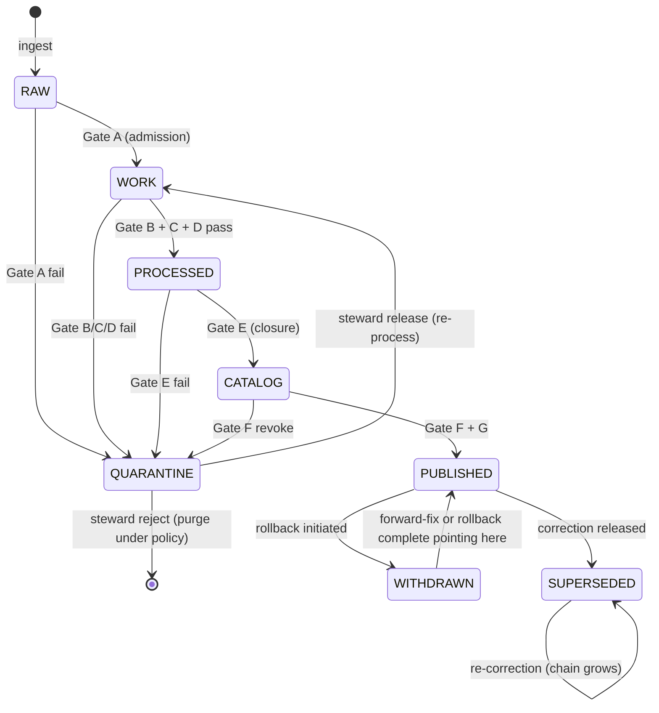

<!-- [KFM_META_BLOCK_V2]
doc_id: kfm://doc/architecture-publication-release-state-machine
title: Publication — Release State Machine
type: standard
version: v0.1
status: draft
owners: Release Manager · Docs Steward · NEEDS VERIFICATION
created: 2026-05-24
updated: 2026-05-24
policy_label: public
related:
  - README.md
  - promotion-gates.md
  - release-objects.md
  - rollback-and-correction.md
  - ../governed-api/LIFECYCLE_GATES.md
  - ../cross-domain/trust-membrane.md
  - ../../doctrine/lifecycle-law.md
  - kfm_unified_doctrine_synthesis.md#7
tags: [kfm, architecture, publication, state-machine, lifecycle, doctrine]
notes:
  - PROPOSED. The lifecycle invariant as an explicit state machine.
  - Doctrine for the state set is CONFIRMED (lifecycle-law.md; synthesis §7).
[/KFM_META_BLOCK_V2] -->

<a id="top"></a>

# Publication — Release State Machine

> *The lifecycle invariant as a state machine: `RAW → WORK / QUARANTINE → PROCESSED → CATALOG / TRIPLET → PUBLISHED`, plus `WITHDRAWN` and `SUPERSEDED` as post-publication states. Every transition is governed.*


-blue)


**Status:** draft · **Owners:** Release Manager · Docs Steward *(NEEDS VERIFICATION)* · **Last updated:** 2026-05-24

> [!IMPORTANT]
> **The state set is canonical doctrine** *(`README.md` §6, "Lifecycle invariant"; CONFIRMED)*. The transitions between them are the **only** legal paths an artifact may take; promotion through Gates A–G *(see [`promotion-gates.md`](promotion-gates.md))* drives them. The trust membrane *(see `cross-domain/trust-membrane.md`)* runs along the `PUBLISHED` edge.

> [!NOTE]
> **This doc names the states, the transitions, and their irreversibility.** The deep gate matrix is in [`RELEASE_GATES.md`](RELEASE_GATES.md) and [`promotion-gates.md`](promotion-gates.md). The objects emitted at each transition are catalogued in [`release-objects.md`](release-objects.md).

---

## Table of contents

1. [Scope](#1-scope)
2. [The state set](#2-the-state-set)
3. [The transition diagram](#3-the-transition-diagram)
4. [Forward transitions](#4-forward-transitions)
5. [Post-publication transitions](#5-postpublication-transitions)
6. [Forbidden transitions](#6-forbidden-transitions)
7. [Per-state visibility](#7-perstate-visibility)
8. [Anti-patterns](#8-anti-patterns)
9. [Open questions and ADR triggers](#9-open-questions-and-adr-triggers)
10. [Related docs](#10-related-docs)
11. [Appendix](#11-appendix)

---

## 1. Scope

This doc enumerates the states an artifact moves through, the legal transitions, the gate that authorizes each transition, the visibility class each state has, and the transitions that are explicitly forbidden.

> [!TIP]
> **When this doc binds.** Designing a new pipeline step, auditing an artifact's lifecycle path, classifying a defect to a state transition, or writing a state-machine validator.

[↑ Back to top](#top)

---

## 2. The state set

> **Evidence basis:** `README.md` §6 *(publication invariant, CONFIRMED)*; `kfm_unified_doctrine_synthesis.md` §7 *(lifecycle states, CONFIRMED)*; `lifecycle-law.md` *(parent doctrine)*.

| State | Definition | Visibility |
|---|---|---|
| **`RAW`** | Connector landing; untouched ingest. | Internal only |
| **`WORK`** | Processed but not validated; staging. | Internal only |
| **`QUARANTINE`** | Failed validation; awaiting steward. | Internal; steward-class read |
| **`PROCESSED`** | Validated; closure pending or recorded. | Internal; steward / internal read |
| **`CATALOG / TRIPLET`** | Catalog indexed; triplets emitted; pre-publication. | Internal |
| **`PUBLISHED`** | Released; manifest written; rollback target pinned. | Public *(per `AUDIENCE_CLASSES`)* |
| **`WITHDRAWN`** | Manifest marked `withdrawn = true`; rollback executed or in progress. | Public *(badge)*; auditable |
| **`SUPERSEDED`** | A later manifest references this one as the corrected prior. | Public *(lineage)*; auditable |

> [!CAUTION]
> **`WITHDRAWN` and `SUPERSEDED` are post-publication, not pre-publication.** They are not part of the forward path; they describe what happens to a `PUBLISHED` manifest after a rollback or correction *(see [`rollback-and-correction.md`](rollback-and-correction.md))*.

[↑ Back to top](#top)

---

## 3. The transition diagram



| Transition | Authority | Receipt |
|---|---|---|
| `[*]` → `RAW` | Connector | Connector run receipt |
| `RAW` → `WORK` | Gate A | `PromotionReceipt(A)` |
| `WORK` → `PROCESSED` | Gates B + C + D | `PromotionReceipt(B,C,D)` + `RunReceipt`s |
| `PROCESSED` → `CATALOG` | Gate E | `PromotionReceipt(E)` + `CitationValidationReport` |
| `CATALOG` → `PUBLISHED` | Gates F + G | `PromotionReceipt(F,G)` + `ReleaseManifest` + `RollbackCard` |
| `*` → `QUARANTINE` | Gate failure | `PromotionReceipt(<failed gate>)` |
| `QUARANTINE` → `WORK` | Steward release | `ReviewRecord` + `PromotionReceipt` |
| `QUARANTINE` → `[*]` | Steward reject + retention expired | Audit record |
| `PUBLISHED` → `WITHDRAWN` | Rollback initiated | `RollbackCard` execution receipt |
| `PUBLISHED` → `SUPERSEDED` | Correction released | `CorrectionNotice` |
| `WITHDRAWN` → `PUBLISHED` | Rollback complete *(prior is current)* | Updated manifest pointer |

[↑ Back to top](#top)

---

## 4. Forward transitions

### 4.1 `RAW` → `WORK`

| Rule | Detail |
|---|---|
| Gate | A *(source admission)*. |
| Required | `SourceDescriptor` with role + rights; connector receipt. |
| Failure | → `QUARANTINE` with reason. |

### 4.2 `WORK` → `PROCESSED`

| Rule | Detail |
|---|---|
| Gates | B *(provenance)*, C *(sensitivity)*, D *(validation)* — all three. |
| Required | Provenance receipt; sensitivity decision; validator reports. |
| Failure on any | → `QUARANTINE`. |

### 4.3 `PROCESSED` → `CATALOG / TRIPLET`

| Rule | Detail |
|---|---|
| Gate | E *(evidence closure)*. |
| Required | `EvidenceBundle` resolves; `CitationValidationReport.all_resolved = true`. |
| Failure | → `QUARANTINE`; resolver re-run on remediation. |

### 4.4 `CATALOG` → `PUBLISHED`

| Rule | Detail |
|---|---|
| Gates | F *(review where required)* + G *(release)*. |
| Required | `ReviewRecord` *(where applicable)*; `ReleaseManifest` + `RollbackCard` + signatures. |
| Failure on F | `ABSTAIN` for `public`; remains `CATALOG` until cleared. |
| Failure on G | Release plane denies; remains `CATALOG`. |

[↑ Back to top](#top)

---

## 5. Post-publication transitions

> **Detail:** [`rollback-and-correction.md`](rollback-and-correction.md).

### 5.1 `PUBLISHED` → `WITHDRAWN`

| Rule | Detail |
|---|---|
| Trigger | Operational defect *(integrity, regression, outage, security)*. |
| Mechanism | `RollbackCard` executed; manifest `withdrawn = true`. |
| API | `ABSTAIN release/rollback-in-progress` for affected layers / claims. |

### 5.2 `PUBLISHED` → `SUPERSEDED`

| Rule | Detail |
|---|---|
| Trigger | Editorial defect *(wrong fact / attribution / scope)*. |
| Mechanism | New `ReleaseManifest` published + `CorrectionNotice` records `corrects_release_id`. |
| API | Returns `ANSWER` from new manifest; lineage in `EvidenceDrawerPayload.correction_lineage`. |

### 5.3 `WITHDRAWN` → `PUBLISHED`

| Rule | Detail |
|---|---|
| Trigger | Rollback complete *(prior manifest now current)* or forward-fix released. |
| Mechanism | Pointer updates; rollback card archives. |
| Note | The `withdrawn` manifest still exists in storage with its marker; only the *current pointer* moved. |

[↑ Back to top](#top)

---

## 6. Forbidden transitions

| Forbidden | Why |
|---|---|
| `RAW` → `PUBLISHED` | Skips every gate; trust-membrane breach. |
| `PROCESSED` → `PUBLISHED` directly | Skips closure *(Gate E)* and review *(F)*. |
| `WORK` ↔ `PUBLISHED` | Skips multiple gates. |
| `PUBLISHED` → `RAW` / `WORK` / `PROCESSED` / `CATALOG` | Publication is forward-only; rollback re-points current state, it does not move the artifact backward through the lifecycle. |
| `WITHDRAWN` → `[*]` *(delete)* | Never-delete rule *(see [`rollback-and-correction.md`](rollback-and-correction.md) §5)*. |
| `SUPERSEDED` → `[*]` *(delete)* | Same. |
| Manifest edits in place | Manifests immutable. |
| `QUARANTINE` → `PUBLISHED` directly | Must re-enter via `WORK` and pass forward. |

> [!IMPORTANT]
> **Forward-only is doctrine.** Going "back" through the lifecycle silently is what creates supply-chain attacks and audit gaps. Rollback re-points; it does not regress.

[↑ Back to top](#top)

---

## 7. Per-state visibility

> **Evidence basis:** `governed-api/AUDIENCE_CLASSES.md` §3–6; `governed-api/LIFECYCLE_GATES.md` §5.

| State | `public` | `partner` | `steward` | `internal` |
|---|---|---|---|---|
| `RAW` | `DENY` | `DENY` | `DENY` | conditional via internal route |
| `WORK` | `DENY` | `DENY` | `ANSWER` on review route *(lane-scoped)* | conditional |
| `QUARANTINE` | `DENY` | `DENY` | `ANSWER` on review route *(lane-scoped)* | conditional |
| `PROCESSED` | `ABSTAIN release/no-manifest` | same | `ANSWER` on review route | conditional |
| `CATALOG` | `ABSTAIN` | `ABSTAIN` | `ANSWER` on review route | conditional |
| `PUBLISHED` | `ANSWER` | `ANSWER` | `ANSWER` | `ANSWER` |
| `WITHDRAWN` | `ABSTAIN release/rollback-in-progress` + badge | same | `ANSWER` with rollback marker | `ANSWER` |
| `SUPERSEDED` | `ANSWER` from current manifest + lineage | same | `ANSWER` with full chain | same |

[↑ Back to top](#top)

---

## 8. Anti-patterns

| Anti-pattern | Mitigation |
|---|---|
| **Pipeline writes to `data/published/` from `WORK`** | Lifecycle violation; only Gate G writes. |
| **`QUARANTINE` artifact "promoted" by editing its state field** | State transitions require gate receipts; no field edit. |
| **`WITHDRAWN` artifact silently deleted** | Never-delete; retention policy governs storage cleanup separately. |
| **`SUPERSEDED` chain collapsed by deleting intermediate releases** | Chain depth grows; never collapse. |
| **State derived from path on disk rather than from manifest** | State lives on the manifest; storage layout is incidental. |
| **Re-ingest treated as forward-from-`PUBLISHED`** | Re-ingest is a new admission *(`RAW`)*; new release supersedes if appropriate. |
| **Pipeline retries cross states** | Each state transition requires its own gate; retries operate within a state, not across. |

[↑ Back to top](#top)

---

## 9. Open questions and ADR triggers

| Open item | Class | Suggested ADR title |
|---|---|---|
| `CATALOG / TRIPLET` as one state or two? | Doctrine | "Catalog vs triplet states". |
| `WITHDRAWN` and `SUPERSEDED` formalization — distinct states or attributes on `PUBLISHED`? | Schema | "Post-publication state modeling". |
| `QUARANTINE` retention window — fixed or policy-driven? | Operational | "Quarantine retention". |
| Should the state machine be encoded as a machine-checkable manifest *(e.g., `STATE_MACHINE.yaml`)* in `control_plane/`? | Tooling | "Encode state machine". |
| Per-domain state extensions — should fail-closed lanes have an extra state? | Variation | "Per-lane state extensions". |

[↑ Back to top](#top)

---

## 10. Related docs

| Reference | Role | Truth label |
|---|---|---|
| `README.md` *(this folder)* §6 | Landing summary | CONFIRMED doctrine |
| `promotion-gates.md` *(sibling)* | Which gate authorizes each transition | PROPOSED |
| `release-objects.md` *(sibling)* | Objects emitted at each transition | PROPOSED |
| `rollback-and-correction.md` *(sibling)* | `WITHDRAWN` and `SUPERSEDED` transitions | PROPOSED |
| `RELEASE_GATES.md` *(sibling)* | Deep gate matrix | CONFIRMED scaffold |
| `../governed-api/LIFECYCLE_GATES.md` §5 | Release-state matrix per audience | PROPOSED |
| `../cross-domain/trust-membrane.md` §3, §4 | Inside vs outside; gates as crossings | CONFIRMED doctrine |
| `../../doctrine/lifecycle-law.md` | Parent doctrine | CONFIRMED doctrine *(referenced)* |
| `kfm_unified_doctrine_synthesis.md` §7 | Lifecycle states canonical | CONFIRMED doctrine |

[↑ Back to top](#top)

---

## 11. Appendix

<details>
<summary><strong>11.1 State machine — at-a-glance</strong></summary>

```text
[*]
  │ ingest
  ▼
RAW ────A────► WORK ──B,C,D──► PROCESSED ──E──► CATALOG ──F,G──► PUBLISHED
  │            │                │                  │              │
  │            │                │                  │              ├── rollback ──► WITHDRAWN ──► (back to PUBLISHED via prior)
  │            │                │                  │              │
  │            │                │                  │              └── correction ──► SUPERSEDED (new manifest current)
  │            │                │                  │
  └─Gate A fail└─B/C/D fail────└─E fail────────────└─F revoke─────► QUARANTINE
                                                                       │
                                                                       ├── steward release ──► WORK
                                                                       └── steward reject (+retention expired) ──► [*]
```

</details>

<details>
<summary><strong>11.2 Forbidden transitions — at-a-glance</strong></summary>

```text
NEVER:  RAW / WORK / PROCESSED / CATALOG → PUBLISHED (skip-gate)
NEVER:  PUBLISHED → RAW / WORK / PROCESSED / CATALOG (regress)
NEVER:  WITHDRAWN → [*]      (delete)
NEVER:  SUPERSEDED → [*]     (delete)
NEVER:  QUARANTINE → PUBLISHED directly
NEVER:  in-place edit of manifest fields
```

</details>

<details>
<summary><strong>11.3 Truth-label legend</strong></summary>

- **CONFIRMED** — verified this session from attached docs.
- **PROPOSED** — design / placement / inference not yet verified in implementation.
- **INFERRED** — derivable from confirmed evidence but not directly stated.
- **NEEDS VERIFICATION** — checkable, but not yet checked strongly enough to act as fact.

</details>

---

**Related (mini)** · [`README.md`](README.md) · [`promotion-gates.md`](promotion-gates.md) · [`release-objects.md`](release-objects.md) · [`rollback-and-correction.md`](rollback-and-correction.md) · [`RELEASE_GATES.md`](RELEASE_GATES.md) · [`../governed-api/LIFECYCLE_GATES.md`](../governed-api/LIFECYCLE_GATES.md) · [`../cross-domain/trust-membrane.md`](../cross-domain/trust-membrane.md)

**Last updated:** 2026-05-24 · **Doc version:** v0.1 · **Doc status:** draft · **Path status:** PROPOSED

[↑ Back to top](#top)
