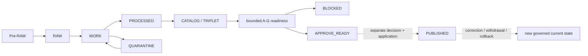

<!-- [KFM_META_BLOCK_V2]
doc_id: kfm://doc/architecture-publication-release-state-machine
title: Publication — Release State Machine
type: architecture-reference
version: v2.0-draft
status: draft; repository-grounded; vocabulary-conflicted; fixture-first; transition-application-hold; non-authoritative; non-publication
owners:
  - "@bartytime4life — current CODEOWNERS review route"
  - "NEEDS VERIFICATION — independent release, policy, review, correction, rollback, signing, and operations stewardship"
created: 2026-05-24
updated: 2026-08-19
policy_label: public; architecture; publication; lifecycle; release-state; correction; rollback
owning_root: docs/
current_path: docs/architecture/publication/release-state-machine.md
responsibility: >-
  Explain KFM lifecycle stages, bounded promotion readiness, release-record
  vocabularies, separately authorized transition application, and post-publication
  effects without becoming release or publication authority.
truth_posture: >-
  CONFIRMED current path, accepted Directory Rules placement, lifecycle invariant,
  fixture-only ReleaseManifest profile, bounded no-network A-G readiness, empty
  proposed release-state register, and release-application holds / PROPOSED
  production decision, transition, correction, withdrawal, supersession, rollback,
  alias, and public-consumer behavior / CONFLICTED gate and release-state
  vocabularies / UNKNOWN first governed production release and deployed behavior /
  NEEDS VERIFICATION hosted checks, accepted policy, independent stewardship,
  signer trust, durable application, and recovery evidence.
evidence_snapshot:
  repository: bartytime4life/Kansas-Frontier-Matrix
  base_commit: fec1f92fde6fb7dd83c995f9984d495bb61a84bb
  target_prior_blob: f61b3ebfca7f88473dd80d31b7a90b104f8ea84a
  release_gates_blob: 4e6f3aa020363d23192b7d3357ea516ebb2cc87d
  release_manifest_schema_blob: c76cd9bdddb34cf33c8eb62801269553726c5923
  promotion_receipt_schema_blob: b9819cc92303aae5b4ab17f0ec9aac48ca236d10
  release_state_register_blob: f576239f447045b04d7b30c540234d8641ceb7dc
  rollback_architecture_blob: 30609139823f3129ad4545b93a98f65246953cf2
  directory_rules_blob: fd49a0b83e55cef52c1124281f093e263526898d
inspection_boundary: >-
  Current GitHub reads covered the target, publication neighbors, gate
  architecture, ADR-0018, accepted ADR-0029, Directory Rules, release
  contracts/schemas, release root, state registers, release model, and rollback
  architecture. No mounted checkout, live evidence resolver, accepted policy,
  authenticated independent review, trusted signer, production transition
  operator, durable state store, public endpoint, live alias mutation, external
  invalidation, or production rollback was exercised. A temporary synthetic
  rollback rehearsal exists but does not mutate KFM published state.
related:
  - README.md
  - RELEASE_GATES.md
  - promotion-gates.md
  - release-objects.md
  - CORRECTION.md
  - ROLLBACK.md
  - ../release-model.md
  - ../../doctrine/lifecycle-law.md
  - ../../adr/ADR-0018-promotion-gate-sequence.md
  - ../../adr/ADR-0029-adopt-directory-governance-standard-v2.md
  - ../../registers/RELEASE_STATE.md
  - ../../../control_plane/release_state_register.yaml
  - ../../../contracts/release/release_manifest.md
  - ../../../contracts/release/promotion_receipt.md
  - ../../../schemas/contracts/v1/release/release_manifest.schema.json
  - ../../../schemas/contracts/v1/release/promotion_receipt.schema.json
  - ../../../release/README.md
tags: [kfm, architecture, publication, state-machine, lifecycle, release, correction, withdrawal, supersession, rollback]
notes:
  - "Same-path reconciliation; legacy sections 1–11 are retained."
  - "The prior page collapsed lifecycle, gates, release states, and post-publication effects into one executable machine."
  - "Current evidence proves bounded candidate/readiness validation only; no production transition application is established."
  - "This update performs no release, transition, deployment, publication, policy activation, or settings change."
[/KFM_META_BLOCK_V2] -->

<a id="top"></a>
<a id="publication--release-state-machine"></a>

# Publication — Release State Machine

> **Operating rule.** KFM has one lifecycle spine and several release-facing vocabularies. Current evidence proves bounded candidate and readiness validation, not an operational transition engine. `PUBLISHED` requires a separately authorized, actually applied transition bound to evidence, policy, review, correction, and rollback support.

[](#status-and-authority)
[](#23-vocabulary-conflicts)
[](#44-decision-and-application)
[](#non-effects)

> [!IMPORTANT]
> **Lifecycle stage, release-record status, readiness result, decision outcome, transition application, and public-serving state are different axes.** `CANDIDATE`, `PASS`, `APPROVE_READY`, `APPROVE`, `transition.applied: true`, a valid fixture, workflow success, pull request, merge, or GitHub release does not by itself establish KFM `PUBLISHED` state.

> [!CAUTION]
> The lifecycle-wide companion, bounded final-readiness implementation, strict fixture-only `ReleaseManifest`, release-root guidance, and older register do not yet define one accepted executable machine.

**Navigation:** [Status](#status-and-authority) · [Scope](#1-scope) · [States](#2-the-state-set) · [Diagram](#3-the-transition-diagram) · [Forward](#4-forward-transitions) · [Post-publication](#5-postpublication-transitions) · [Forbidden](#6-forbidden-transitions) · [Visibility](#7-perstate-visibility) · [Anti-patterns](#8-anti-patterns) · [Open questions](#9-open-questions-and-adr-triggers) · [Related docs](#10-related-docs) · [Appendix](#11-appendix)

---

<a id="status-and-authority"></a>

## Status and authority

| Field | Current result |
|---|---|
| Placement | Existing `docs/` path; **CONFIRMED** by accepted [`ADR-0029`](../../adr/ADR-0029-adopt-directory-governance-standard-v2.md) and [`Directory Rules`](../../doctrine/directory-rules.md) |
| Authority | Explanatory only; not contract, schema, policy, review, release, runtime, or publication authority |
| Lifecycle | `Pre-RAW → RAW → WORK / QUARANTINE → PROCESSED → CATALOG / TRIPLET → PUBLISHED` |
| Bounded readiness | A–G with `PASS / ABSTAIN / DENY / ERROR` and `APPROVE_READY / BLOCKED` |
| Strict manifest fixture | `PROPOSED_INACTIVE`, `FIXTURE_ONLY`, `CANDIDATE / HELD / DEGRADED`; authority flags false |
| Decision/application | Decision profile PROPOSED; production application `HOLD` |
| Machine state register | Present, PROPOSED, empty |

<a id="non-effects"></a>

### Non-effects

This page changes no lifecycle object, contract, schema, policy, fixture, validator, workflow, release record, alias, public artifact, runtime, deployment, or publication. It does not accept ADR-0018, approve a release, activate policy, apply a transition, or execute production rollback.

[Back to top](#top)

---

<a id="1-scope"></a>

## 1. Scope

This page separates the canonical lifecycle from release-facing vocabularies, describes current bounded readiness, defines the decision/application boundary, and preserves distinct correction, supersession, withdrawal, and rollback effects. It does not prescribe a production database, alias format, signer trust root, policy engine, or release service.

[Back to top](#top)

---

<a id="2-the-state-set"></a>

## 2. The state set

<a id="21-lifecycle-stages"></a>

### 2.1 Lifecycle stages

| Stage | Public posture |
|---|---|
| `Pre-RAW`, `RAW`, `WORK`, `QUARANTINE` | `DENY` |
| `PROCESSED` | `ABSTAIN` or `DENY`; release closure absent |
| `CATALOG / TRIPLET` | `ABSTAIN`; still pre-publication |
| `PUBLISHED` | `ANSWER` only through governed interfaces after an applied release |

`WITHDRAWN` and `SUPERSEDED` are useful post-publication concepts, but current evidence does not establish them as one accepted universal manifest enum.

<a id="22-release-facing-vocabularies"></a>

### 2.2 Release-facing vocabularies

| Surface | Vocabulary | Meaning |
|---|---|---|
| Strict manifest fixture | `CANDIDATE / HELD / DEGRADED` | Candidate validation only. |
| Gate result | `PASS / ABSTAIN / DENY / ERROR` | `ERROR > DENY > ABSTAIN > PASS`. |
| Readiness | `APPROVE_READY / BLOCKED` | Handoff, not approval. |
| Proposed decision | `APPROVE / DENY / ABSTAIN` | Actor authority unproved. |
| Release-root guidance | `DRAFT`, `READY_FOR_REVIEW`, `HELD`, `READY_FOR_MANIFEST`, `APPROVED`, `RELEASED`, `CORRECTED`, `SUPERSEDED`, `WITHDRAWN`, `NO_ACTION` | Human guidance, not accepted enum. |
| Older register | `DRAFT / REVIEW / PUBLISHED / REVOKED / SUPERSEDED` | Conflicting draft. |
| Machine register | `entries: []` | No operational state evidence. |

<a id="23-vocabulary-conflicts"></a>

### 2.3 Vocabulary conflicts

- Lifecycle-wide A–G and final-readiness A–G conflict; [`ADR-0018`](../../adr/ADR-0018-promotion-gate-sequence.md) remains proposed with checkpoint `REVISE`.
- Strict manifest `CANDIDATE` and lifecycle `PUBLISHED` are different axes.
- `transition.applied: true` may be internally valid without proving application.
- Release-root guidance and older registers do not establish one accepted release-state enum.
- Correction, withdrawal, supersession, rollback, and `REVOKED` must remain distinct until accepted contracts say otherwise.

[Back to top](#top)

---

<a id="3-the-transition-diagram"></a>

## 3. The transition diagram


```mermaid
flowchart LR
  PRAW["Pre-RAW"] --> RAW --> WORK
  WORK --> PROC["PROCESSED"]
  WORK --> Q["QUARANTINE"] --> WORK
  PROC --> CAT["CATALOG / TRIPLET"]
  CAT --> READY["bounded A-G readiness"]
  READY --> BLOCKED["BLOCKED"]
  READY --> HANDOFF["APPROVE_READY"]
  HANDOFF -. "separate decision + application" .-> PUB["PUBLISHED"]
  PUB -. "correction / withdrawal / rollback" .-> NEXT["new governed current state"]
```

Dotted edges are unproved. Current evidence includes fixture-first rollback checks, fixture-only alias preflight, and a marker-protected temporary synthetic rehearsal, not production state mutation, alias movement, external invalidation, or executed recovery receipts.

[Back to top](#top)

---

<a id="4-forward-transitions"></a>

## 4. Forward transitions

<a id="41-preraw-through-catalog"></a>

### 4.1 `Pre-RAW` through `CATALOG / TRIPLET`

Admission, transformation, quarantine exit, validation, evidence closure, catalog/triplet emission, and receipts remain separately governed. The current A–G profile does **not** implement all lifecycle transitions.

<a id="42-bounded-final-readiness"></a>

### 4.2 Bounded final readiness

A–G currently means: `identity_and_closure`, `asset_integrity`, `geometry_and_crs`, `temporal_semantics`, `rights_and_sensitivity`, `proof_and_catalog_support`, and `review_and_rollback`. A complete `PASS` means only `APPROVE_READY`.

<a id="43-readiness-to-decision"></a>

### 4.3 Readiness to decision

A proposed `PromotionDecision` may say `APPROVE`, `DENY`, or `ABSTAIN`, but schema validity does not authenticate the actor, resolve evidence, run inactive policy, verify signatures, establish separation of duties, or apply state.

<a id="44-decision-and-application"></a>

### 4.4 Decision and application

Production `CATALOG / TRIPLET → PUBLISHED` requires accepted production profiles, resolved evidence and policy, authenticated separated actors, verified bytes/signatures, an idempotent operator bound to exact before/after state, append-only application/release receipts, governed public-carrier binding, consumer invalidation/update evidence, and usable correction/rollback support.

**Current result:** `HOLD`. No inspected production operator proves this path.

[Back to top](#top)

---

<a id="5-postpublication-transitions"></a>

## 5. Post-publication transitions

<a id="51-correction"></a>

### 5.1 Correction

Fix a defect through a reviewed successor release or accepted equivalent while preserving prior lineage; never silently edit public history in place.

<a id="52-supersession"></a>

### 5.2 Supersession

A newer governed release replaces an older release for defined scope; the prior release remains inspectable. Canonical enum modeling remains `NEEDS VERIFICATION`.

<a id="53-withdrawal"></a>

### 5.3 Withdrawal

Remove or suspend current release-facing authority while preserving reason, actor, scope, public effect, invalidation, notice, and retention lineage. Operational application is unproved.

<a id="54-rollback"></a>

### 5.4 Rollback

Restore a previously governed safe target without regressing or erasing history. Current evidence is candidate/fixture/synthetic only; production alias mutation, carrier restoration, external invalidation, notice, and executed rollback receipts remain held or unknown.

[Back to top](#top)

---

<a id="6-forbidden-transitions"></a>

## 6. Forbidden transitions

- Direct `Pre-RAW / RAW / WORK / QUARANTINE / PROCESSED → PUBLISHED`.
- Direct `QUARANTINE → PUBLISHED`.
- Historical regression `PUBLISHED → RAW / WORK / PROCESSED / CATALOG / TRIPLET`.
- Treating `PASS`, `APPROVE_READY`, `APPROVE`, or `transition.applied: true` as publication proof.
- Treating a commit, PR, merge, workflow, GitHub release, copy, or file move as KFM publication.
- Deleting withdrawn, superseded, corrected, or rolled-back history.
- Letting public clients read candidate or internal stores.

[Back to top](#top)

---

<a id="7-perstate-visibility"></a>

## 7. Per-state visibility

| State or axis | Public posture |
|---|---|
| Internal lifecycle stages | `DENY` |
| `PROCESSED`, `CATALOG / TRIPLET` | `ABSTAIN` or `DENY` |
| Manifest `CANDIDATE / HELD / DEGRADED` | `DENY` |
| `APPROVE_READY` or proposed `APPROVE` | `DENY` |
| Applied governed `PUBLISHED` | `ANSWER` through governed interfaces |
| Correction, withdrawal, or rollback in progress | `ABSTAIN` or `DENY` at affected scope |

Maps, APIs, search, graphs, exports, caches, tiles, and AI responses are downstream carriers, not release-state authority.

[Back to top](#top)

---

<a id="8-anti-patterns"></a>

## 8. Anti-patterns

- One enum mixes lifecycle, readiness, review, decision, release, and correction.
- `PromotionReceipt` substitutes for `PromotionDecision`, or decision for application.
- Fixture-only schema is called production-ready.
- State is inferred from path, filename, badge, workflow, or GitHub release.
- CODEOWNERS routing is treated as independent release authority.
- Correction, supersession, withdrawal, and rollback collapse into `REVOKED`.
- Rollback deletes history or public UI hides held/corrected state.

[Back to top](#top)

---

<a id="9-open-questions-and-adr-triggers"></a>

## 9. Open questions and ADR triggers

| Open item | Status |
|---|---|
| Final A–G scope and vocabulary | `CONFLICTED` |
| Canonical release-record states | `NEEDS VERIFICATION` |
| Production transition application | `UNKNOWN / HOLD` |
| Accepted policy evaluation | `HOLD` |
| Independent release authority | `NEEDS VERIFICATION` |
| Signer trust and custody | `UNKNOWN` |
| Public-consumer parity/invalidation | `UNKNOWN` |

**Smallest next proof:** a no-network application test for a synthetic `CATALOG` candidate already `APPROVE_READY`, using temporary state, synthetic separated roles, exact before/after digests, negative self-approval, finite failures, idempotent replay, no-public-write assertions, and test-state rollback. Keep public aliases, `data/published/`, external storage, policy activation, deployment, and serving untouched.

[Back to top](#top)

---

<a id="10-related-docs"></a>

## 10. Related docs

- [`README.md`](README.md), [`RELEASE_GATES.md`](RELEASE_GATES.md), [`promotion-gates.md`](promotion-gates.md), and [`release-objects.md`](release-objects.md).
- [`CORRECTION.md`](CORRECTION.md), [`ROLLBACK.md`](ROLLBACK.md), and [`../release-model.md`](../release-model.md).
- [`lifecycle-law.md`](../../doctrine/lifecycle-law.md), [`RELEASE_STATE.md`](../../registers/RELEASE_STATE.md), and [`release_state_register.yaml`](../../../control_plane/release_state_register.yaml).
- [`release_manifest.md`](../../../contracts/release/release_manifest.md) and its [`schema`](../../../schemas/contracts/v1/release/release_manifest.schema.json).
- [`promotion_receipt.md`](../../../contracts/release/promotion_receipt.md) and its [`schema`](../../../schemas/contracts/v1/release/promotion_receipt.schema.json).
- [`release/README.md`](../../../release/README.md).

[Back to top](#top)

---

<a id="11-appendix"></a>

## 11. Appendix

<a id="111-vocabulary-quick-reference"></a>

### 11.1 Vocabulary quick reference

```text
LIFECYCLE: Pre-RAW -> RAW -> WORK / QUARANTINE -> PROCESSED -> CATALOG / TRIPLET -> PUBLISHED
MANIFEST FIXTURE: CANDIDATE | HELD | DEGRADED; authority flags false
READINESS: PASS | ABSTAIN | DENY | ERROR; APPROVE_READY | BLOCKED
PROPOSED DECISION: APPROVE | DENY | ABSTAIN
TRANSITION APPLICATION: HOLD / not established
POST-PUBLICATION: correction | supersession | withdrawal | rollback
```

<a id="112-transition-claim-evidence"></a>

### 11.2 Transition-claim evidence

Resolve prior state, candidate digest, readiness, policy, authenticated separated reviews, evidence/proof/receipt/attestation closure, verified bytes/signatures, manifest identity, operator version, exact before/after state, application receipt, public-carrier binding, consumer invalidation/update, correction readiness, rollback target, and tested reversal.

<a id="113-validation-contract"></a>

### 11.3 Validation contract

Verify meta, one H1, unique anchors, local fragments, exact-head links, balanced fences, stable tables, no tabs/trailing whitespace, retained sections 1–11, claims against current evidence, and hosted checks separately from source validation.

<a id="114-compatibility-ledger"></a>

### 11.4 Compatibility ledger

| Legacy surface | Disposition |
|---|---|
| Doc ID, path, H1, sections 1–11 | Preserved. |
| Canonical executable seven/eight-state machine | Corrected; axes separated. |
| Direct lifecycle-wide Gate A–G mapping | Removed as current fact; conflict documented. |
| Universal `WITHDRAWN` / `SUPERSEDED` states | Retained as concepts; modeling unresolved. |
| “State lives on the manifest” | Corrected; authority spans contracts, decisions, application records, release records, carriers, and runtime checks. |
| Forward-only and no-erasure | Preserved. |

---

**Last updated:** 2026-08-19 · **Doc version:** v2.0-draft · **Operational transition:** `HOLD` · **Publication effect:** none

[Back to top](#top)
