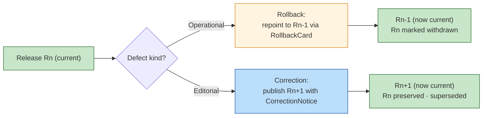

<!-- [KFM_META_BLOCK_V2]
doc_id: kfm://doc/architecture-publication-rollback-and-correction
title: Publication — Rollback and Correction
type: standard
version: v0.1
status: draft
owners: Release Manager · Docs Steward · NEEDS VERIFICATION
created: 2026-05-24
updated: 2026-05-24
policy_label: public
related:
  - README.md
  - ROLLBACK.md
  - CORRECTION.md
  - promotion-gates.md
  - release-objects.md
  - release-state-machine.md
  - ../governed-api/LIFECYCLE_GATES.md
  - ../map-master/LAYER_LIFECYCLE.md
tags: [kfm, architecture, publication, rollback, correction, doctrine]
notes:
  - PROPOSED. Concise companion to ROLLBACK.md and CORRECTION.md (deep treatments).
  - Never delete, always supersede. Public lineage is preserved.
[/KFM_META_BLOCK_V2] -->

<a id="top"></a>

# Publication — Rollback and Correction

> *Never delete, always supersede. Rollback re-points the current release state to a pre-staged target; correction publishes a new manifest that supersedes the prior one. Both preserve public lineage.*


-blue)


**Status:** draft · **Owners:** Release Manager · Docs Steward *(NEEDS VERIFICATION)* · **Last updated:** 2026-05-24

> [!IMPORTANT]
> **Public lineage is preserved** *(`README.md` §11, CONFIRMED)*. A withdrawn release is **withdrawn**, not deleted. A corrected fact ships a new release that supersedes the prior; the prior remains for audit, with a `CorrectionNotice` recording the relationship.

> [!NOTE]
> **This doc is the concise overview.** The detailed rollback procedure lives in [`ROLLBACK.md`](ROLLBACK.md); the detailed correction model lives in [`CORRECTION.md`](CORRECTION.md). This doc names the rule, the contrast between the two operations, and the rules common to both.

---

## Table of contents

1. [Scope](#1-scope)
2. [Rollback vs correction — the contrast](#2-rollback-vs-correction--the-contrast)
3. [Rollback](#3-rollback)
4. [Correction](#4-correction)
5. [The never-delete rule](#5-the-neverdelete-rule)
6. [Drawer and renderer behavior](#6-drawer-and-renderer-behavior)
7. [Audit posture](#7-audit-posture)
8. [Anti-patterns](#8-anti-patterns)
9. [Open questions and ADR triggers](#9-open-questions-and-adr-triggers)
10. [Related docs](#10-related-docs)
11. [Appendix](#11-appendix)

---

## 1. Scope

This doc explains the difference between **rollback** *(operational: re-point the current release to a pre-staged prior target)* and **correction** *(editorial: publish a new manifest that supersedes the prior)*, and the rules that apply to both.

> [!TIP]
> **When this doc binds.** Triaging a release defect, choosing between rollback and correction, drafting a correction notice, or designing how the drawer surfaces lineage.

[↑ Back to top](#top)

---

## 2. Rollback vs correction — the contrast

| Dimension | Rollback | Correction |
|---|---|---|
| **Trigger** | Operational defect *(integrity, regression, outage)* | Editorial defect *(wrong fact, wrong attribution, withdrawn source)* |
| **Speed** | Immediate; pre-staged | Deliberate; runs through gates |
| **Target** | A specific prior `ReleaseManifest` *(via `RollbackCard`)* | A **new** `ReleaseManifest` |
| **Lineage marker** | `RollbackCard` execution receipt; original release marked `withdrawn` | `CorrectionNotice` records `corrects_release_id` + `superseded_by_release_id` |
| **Public visibility** | Drawer / renderer surface the rollback state; ABSTAIN during in-progress | Drawer surfaces the lineage chain to the user |
| **Reversibility** | Reversible — forward-fix is a new release | Reversible — a new correction can re-correct |
| **Doctrine** | `README.md` §11; `ROLLBACK.md` | `README.md` §11; `CORRECTION.md` |



[↑ Back to top](#top)

---

## 3. Rollback

| Aspect | Detail |
|---|---|
| **Pre-stage** | Every release ships with a `RollbackCard` referencing the prior `ReleaseManifest` *(Gate G mandatory)*. |
| **Trigger** | Operational defect: integrity-failure, regression, outage, security incident. |
| **Mechanism** | Release plane sets the affected manifest `withdrawn = true`; manifest resolver returns the rollback target. |
| **API behavior during rollback** | `ABSTAIN release/rollback-in-progress` for affected layers / claims to `public` / `partner`; `steward` / `internal` see rollback marker *(`governed-api/LIFECYCLE_GATES.md` §6)*. |
| **Renderer behavior** | Viewer-verification gate refuses `addSource` for withdrawn layers; renders rollback badge *(`map-master/VIEWER_VERIFICATION.md` §9)*. |
| **Completion** | Prior manifest is the current `PUBLISHED` state; rollback card archived. |
| **Forward fix** | A subsequent new manifest replaces both states; rollback card preserved. |

> [!IMPORTANT]
> **Rollback is not deletion.** The defective manifest remains, marked `withdrawn`; receipts and `EvidenceBundle`s are intact. Auditors can reconstruct the defective state if needed.

[↑ Back to top](#top)

---

## 4. Correction

| Aspect | Detail |
|---|---|
| **Trigger** | Editorial defect: a fact was wrong, attribution changed, a source was withdrawn upstream, scope was misstated. |
| **Mechanism** | A new `ReleaseManifest` is built and runs through Gates A–G; a `CorrectionNotice` is emitted on release linking the new manifest to the corrected one. |
| **`CorrectionNotice` fields** | `corrects_release_id`, `superseded_by_release_id`, `reason_class`, `summary`, `at`, signer. |
| **API behavior** | Returns `ANSWER` from the new manifest; lineage carried via `correction_lineage` on `EvidenceDrawerPayload` *(`map-master/EVIDENCE_DRAWER.md` §7)*. |
| **Drawer behavior** | Surfaces the supersession chain; user can navigate prior versions. |
| **Visibility** | Public; lineage is part of the trust posture. |
| **Re-correction** | A correction can itself be corrected; the chain grows. |

> [!CAUTION]
> **A correction does not silently overwrite.** The prior release persists with its evidence intact; readers can see the chain and reason about the change.

[↑ Back to top](#top)

---

## 5. The never-delete rule

> **Evidence basis:** `README.md` §11 *(rollback and correction, CONFIRMED)*; `lifecycle-law.md` *(parent doctrine)*.

| Aspect | Rule |
|---|---|
| Manifests | Immutable; corrections are new manifests; withdrawn manifests persist marked `withdrawn`. |
| Receipts | Append-only; content-addressed; never edited. |
| `EvidenceBundle`s | Resolved bundles persist for audit; supersession recorded externally. |
| Tile bytes | Not deleted on withdrawal; admission denied via manifest; retention follows policy. |
| Logs | Bounded retention but not edited in place. |

> [!IMPORTANT]
> **"Delete" is an operational concept; "supersede" is a publication concept.** Publication never deletes; storage cleanup *(under operational retention policy)* may delete bytes after sufficient time has passed and audit obligations are met. The two are decoupled.

[↑ Back to top](#top)

---

## 6. Drawer and renderer behavior

| State | Drawer | Renderer |
|---|---|---|
| **Rollback in progress** | "Temporarily unavailable" + `release/rollback-in-progress` reason | `ABSTAIN`; layer hidden with badge |
| **Withdrawn (post-rollback)** | "Withdrawn" + link to current rollback target | Layer hidden with withdrawal badge |
| **Superseded by correction** | Lineage chain visible; "View current release" link | Renders **current** release; user may navigate prior |
| **Current release after correction** | `ANSWER` + `correction_lineage` field present | Renders normally; chain link in drawer footer |
| **Re-corrected** | Chain depth grows; drawer paginates if long | No change |

[↑ Back to top](#top)

---

## 7. Audit posture

| Aspect | Detail |
|---|---|
| Manifests indexed by id and digest | Audit can reach any prior state. |
| `RollbackCard` and `CorrectionNotice` permanently retained | Lineage never expires. |
| Receipts indexed by `request_id` and `release_ref` | Cross-event correlation possible. |
| Steward access to withdrawn / superseded content | Lane-scoped; steward role required. |
| Public access to lineage | Yes — the chain itself is public; the corrected facts are also public. |

[↑ Back to top](#top)

---

## 8. Anti-patterns

| Anti-pattern | Mitigation |
|---|---|
| **Defective manifest edited in place** | Manifests immutable; new manifest required. |
| **Withdrawn manifest deleted from storage** | Retention policy governs storage; manifest record persists. |
| **Correction issued without `CorrectionNotice`** | Notice mandatory; emitted at release. |
| **Drawer hides superseded content as if it never existed** | Lineage visible; reader can navigate. |
| **Rollback used as a "release undo button"** | Rollback for operational defects; corrections for editorial defects. |
| **`RollbackCard` skipped "because the release is small"** | Always present; Gate G enforces. |
| **Re-correction chain collapsed by silently removing intermediate releases** | Chain depth grows; never collapse. |

[↑ Back to top](#top)

---

## 9. Open questions and ADR triggers

| Open item | Class | Suggested ADR title |
|---|---|---|
| Rollback chain depth — single hop only, or chained rollbacks? | Semantics | "Rollback chain depth". |
| Storage retention for withdrawn manifests / tile bytes — fixed window or doctrine? | Operational | "Withdrawn-content retention". |
| Should `CorrectionNotice.reason_class` be enumerated *(controlled vocabulary)*? | Vocabulary | "CorrectionNotice reason vocabulary". |
| Drawer chain pagination — limit depth shown or always show full chain? | UX | "Lineage chain display depth". |
| Should rollback emit a `CorrectionNotice` too *(for cross-class lineage)*? | Object family | "Rollback emits CorrectionNotice". |

[↑ Back to top](#top)

---

## 10. Related docs

| Reference | Role | Truth label |
|---|---|---|
| `README.md` *(this folder)* §11 | Landing summary | CONFIRMED doctrine |
| `ROLLBACK.md` *(sibling)* | Detailed rollback procedure | CONFIRMED scaffold |
| `CORRECTION.md` *(sibling)* | Detailed correction model | CONFIRMED scaffold |
| `promotion-gates.md` *(sibling)* | Gate G mandates `RollbackCard` | PROPOSED |
| `release-objects.md` *(sibling)* | `RollbackCard` + `CorrectionNotice` object families | PROPOSED |
| `release-state-machine.md` *(sibling)* | Transitions for withdrawal and supersession | PROPOSED |
| `../governed-api/LIFECYCLE_GATES.md` §6 | API-side rollback behavior | PROPOSED |
| `../map-master/LAYER_LIFECYCLE.md` §8 | Manifest-level rollback semantics | PROPOSED |
| `../map-master/EVIDENCE_DRAWER.md` §7 | Drawer freshness / review / rollback / correction surfaces | PROPOSED |
| `../../doctrine/lifecycle-law.md` | Parent doctrine | CONFIRMED doctrine *(referenced)* |

[↑ Back to top](#top)

---

## 11. Appendix

<details>
<summary><strong>11.1 Rollback vs correction — at-a-glance card</strong></summary>

```text
Rollback                                Correction
────────                                ──────────
trigger: operational defect             trigger: editorial defect
speed:   immediate (pre-staged)         speed:   deliberate (through gates)
artifact: RollbackCard execution        artifact: new ReleaseManifest +
target:   prior ReleaseManifest                    CorrectionNotice
prior:    marked withdrawn              prior:    preserved · superseded
drawer:   "temporarily unavailable"     drawer:   lineage chain visible
                                                  user can navigate prior
```

</details>

<details>
<summary><strong>11.2 The never-delete rule — at-a-glance</strong></summary>

```text
Manifests          immutable · withdrawn marker only
Receipts           append-only · content-addressed
EvidenceBundles    persist for audit
Tile bytes         retention policy · not deletion
Logs               bounded retention · not edited
```

</details>

<details>
<summary><strong>11.3 Truth-label legend</strong></summary>

- **CONFIRMED** — verified this session from attached docs.
- **PROPOSED** — design / placement / inference not yet verified in implementation.
- **INFERRED** — derivable from confirmed evidence but not directly stated.
- **NEEDS VERIFICATION** — checkable, but not yet checked strongly enough to act as fact.

</details>

---

**Related (mini)** · [`README.md`](README.md) · [`ROLLBACK.md`](ROLLBACK.md) · [`CORRECTION.md`](CORRECTION.md) · [`promotion-gates.md`](promotion-gates.md) · [`release-objects.md`](release-objects.md) · [`release-state-machine.md`](release-state-machine.md) · [`../map-master/EVIDENCE_DRAWER.md`](../map-master/EVIDENCE_DRAWER.md)

**Last updated:** 2026-05-24 · **Doc version:** v0.1 · **Doc status:** draft · **Path status:** PROPOSED

[↑ Back to top](#top)
