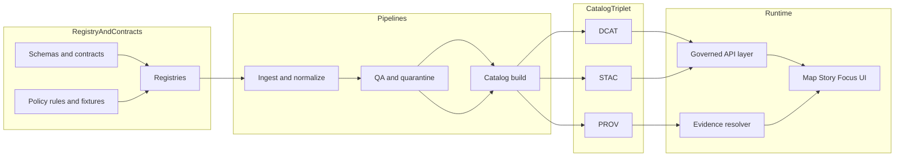

<!-- [KFM_META_BLOCK_V2]
doc_id: kfm://doc/a52defab-30e0-42f6-b153-e6c72b5d0bed
title: Architecture Registries
type: standard
version: v1
status: draft
owners: TODO (steward + tech lead)
created: 2026-03-01
updated: 2026-03-01
policy_label: public
related:
  - TODO: kfm://doc/<architecture-overview>
  - TODO: ../../../data/registry (verify)
  - TODO: ../../../contracts (verify)
tags: [kfm, architecture, registries]
notes:
  - This directory documents how KFM registries work and how they are governed/validated.
  - Paths marked “verify” must be confirmed against the live repo tree.
[/KFM_META_BLOCK_V2] -->

# Architecture Registries
**Purpose:** A governed “registry atlas” for Kansas Frontier Matrix (KFM): what registries exist, what they control, where they live, and how changes are validated and promoted.


---

## Quick navigation
- [Overview](#overview)
- [What a registry is](#what-a-registry-is)
- [Registry taxonomy](#registry-taxonomy)
- [How registries flow through the system](#how-registries-flow-through-the-system)
- [Governance and promotion gates](#governance-and-promotion-gates)
- [Change workflow](#change-workflow)
- [Directory layout](#directory-layout)
- [Templates](#templates)

---

## Overview

Registries are **machine-readable, versioned inputs** that drive:

- **Source onboarding** (where data comes from, how to fetch it, license, cadence, known limitations)
- **Dataset onboarding** (stable IDs, policy classification, spec refs + deterministic hashes)
- **Automation allow-lists** (e.g., “watchers”/fetchers that are allowed to run)
- **Promotion** into runtime surfaces (only what passes gates becomes publishable / queryable)

This directory (`docs/architecture/registries/`) is the **human-readable guide** to those registries:
what they mean, what invariants they must obey, and how they connect to contracts, policy, catalogs, and runtime.

> [!NOTE]
> This folder is documentation. The **registries themselves** are expected to live in machine-readable locations
> (commonly under `data/registry/` with JSON Schemas under `data/registry/schemas/`), but confirm against the repo tree.

[Back to top](#architecture-registries)

---

## What a registry is

In KFM, a *registry* is a governed list of typed records that the system treats as **input**, not commentary.

A registry entry should be:

- **Deterministically identifiable** (stable ID that does not change over time)
- **Schema-valid** (validated by JSON Schema in CI)
- **Policy-classified** (has a policy label; obligations derive from policy evaluation)
- **Rights-aware** (license/rights are explicit, and terms snapshots exist when needed)
- **Promotion-aware** (contains enough information to support promotion gates and evidence resolution)

If a capability depends on “tribal knowledge,” it belongs in a registry or a contract—**not in someone’s head**.

[Back to top](#architecture-registries)

---

## Registry taxonomy

The table below is a *working map* of registries typically referenced by the KFM architecture docs.
Adjust once you confirm the exact repo layout and schemas.

| Registry | Primary key | What it governs | Machine-readable home (expected; verify) | Contract surface | Change approval |
|---|---|---|---|---|---|
| **Dataset registry** | `dataset_id` | Dataset identity, publisher, upstream, policy label, spec ref/hash | `data/registry/datasets/*.y{a,}ml` | `dataset_entry.schema.json` (or equivalent) | Steward + code review |
| **Source registry** | `source_id` | Upstream source authority, access method, cadence, rights, sensitivity, limitations | `data/registry/sources/*.y{a,}ml` | `source_entry.schema.json` (or equivalent) | Steward + code review |
| **Watchers registry** | `watcher_id` | Allowed automated fetchers (endpoints, polling mode, signatures, outputs) | `data/registry/watchers/*.json` | `watcher.v1.schema.json` | Steward + security review |
| **Controlled vocabularies** | `term_id` | Enumerations used by DCAT/STAC/PROV profiles and UI filters | `contracts/vocab/*.json` or similar | “vocab validation” gate | Steward + domain reviewer |
| **Policy labels + obligations** | `policy_label` | Classification inputs + the obligation vocabulary | `policy/` (OPA/Rego) + fixtures | Policy-as-code (CI + runtime parity) | Steward + governance council (as needed) |

> [!WARNING]
> Treat “expected locations” as *targets*, not truths, until you confirm them with `tree -L 4` on the live repo.

[Back to top](#architecture-registries)

---

## How registries flow through the system

Registries sit upstream of catalogs and runtime. They are the **first contract surface** in the data lifecycle.



Practical implications:

- Runtime discovery (“list datasets”, “browse collections”) reads **catalogs**, not ad-hoc database tables.
- Evidence resolution (“open the citation”) requires **cross-linked catalogs** plus the policy label/obligations path.
- Promotion is blocked unless registry entries and their required artifacts exist and validate.

[Back to top](#architecture-registries)

---

## Governance and promotion gates

### Core posture

Registries are part of KFM’s governance-by-construction loop:

- schema validation + policy tests **block merges**
- promotion gates **fail closed**
- sensitive locations and unclear rights **default deny**
- redaction/generalization is treated as a first-class, provenance-captured transform

### Promotion Contract (minimum gates)

When a dataset version is promoted into runtime surfaces, **promotion is blocked** unless all minimum gates pass.

- [ ] **A — Identity & versioning**: stable IDs + deterministic `spec_hash` + content digests
- [ ] **B — Licensing & rights metadata**: explicit license/rights + terms snapshot when needed
- [ ] **C — Sensitivity classification & redaction plan**: `policy_label` + obligations (if applicable)
- [ ] **D — Catalog triplet validation**: DCAT/STAC/PROV validate and cross-link; EvidenceRefs resolve
- [ ] **E — QA & thresholds**: dataset-specific checks documented and met; failures move to quarantine
- [ ] **F — Run receipt & audit record**: typed receipt captures inputs, tooling, hashes, policy decisions
- [ ] **G — Release manifest**: promotion recorded as an immutable manifest referencing artifacts and digests

> [!TIP]
> If you’re unsure whether an entry belongs in a registry: if it can block promotion, filter access, or change behavior, it’s a registry/contract concern.

[Back to top](#architecture-registries)

---

## Change workflow

Use this workflow for adding or updating any registry entry.

### 1) Make the change (small and reviewable)

- Add/update exactly one registry entry (or one coherent set).
- Avoid renaming stable IDs; prefer **additive** changes.

### 2) Validate locally

Minimum local checks (adapt to repo tooling once confirmed):

- JSON/YAML schema validation for the registry entry
- Controlled vocabulary checks (if fields are vocab-constrained)
- Link checks for `spec_ref` / upstream URLs (if present)
- `spec_hash` recomputation for specs referenced by the entry

### 3) Attach required artifacts

Depending on what changed, include:

- license/terms snapshot artifact (if rights are relevant or changed)
- spec documents referenced by `spec_ref`
- QA thresholds/report stubs (even if the pipeline is not implemented yet)

### 4) PR review and promotion readiness

- Steward reviews policy label and rights
- Security review for any automation (watchers/fetchers)
- CI gates must pass; no “manual exceptions” without an explicit, documented policy decision

### 5) Promotion (if applicable)

Promotion should emit:

- run receipt / manifest
- catalogs (DCAT/STAC/PROV)
- policy decision references and obligations fulfillment evidence

[Back to top](#architecture-registries)

---

## Directory layout

This directory is intentionally small: it’s the **index** of registry documentation, not the registries themselves.

| Path | Purpose |
|---|---|
| `docs/architecture/registries/README.md` | You are here — registry atlas + governance map |
| `docs/architecture/registries/` *(future)* | Add one doc per registry when the schemas and locations are confirmed |

### Proposed tree (update after confirming repo)

```text
docs/architecture/registries/                               # Architecture registries docs (how machine registries work + how validated)
├─ README.md                                                # Index + registry philosophy (small, machine-checkable) + validation rules
├─ dataset-registry.md                                      # TODO: dataset registry entry schema + required fields + examples + CI checks
├─ source-registry.md                                       # TODO: source registry entry schema + provenance/rights fields + examples
├─ watchers-registry.md                                     # TODO: watcher registry schema + allow-listing + signing/verification + drift rules
├─ vocabularies.md                                          # TODO: controlled vocab rules (themes/domains/units) + versioning + drift tests
└─ policy-labels.md                                         # TODO: policy_label meanings + defaults + common obligations + leak-safe handling
```

[Back to top](#architecture-registries)

---

## Templates

<details>
<summary><strong>Dataset registry entry (YAML) — skeleton</strong></summary>

```yaml
dataset_id: example_dataset
title: Example Dataset
description: >
  What it is, what it covers, and why it exists.
publisher: Example Publisher
license: public_domain
upstream:
  url: https://example.org/data
  type: bulk_download
  cadence: monthly
policy_label: public
spec_ref: specs/example_dataset.v1.yaml
spec_hash: "sha256:..."   # computed deterministically from spec_ref content
```

</details>

<details>
<summary><strong>Source registry entry (YAML) — skeleton</strong></summary>

```yaml
source_id: example_source
authority: Example Authority
domain: hazards
access_method: api
cadence: weekly
license_rights: public_domain
sensitivity: public
notes: >
  Known limitations, quirks, and QA checks to apply.
```

</details>

<details>
<summary><strong>Watchers registry entry (JSON) — skeleton</strong></summary>

```json
{
  "watcher_id": "example:watcher",
  "canonical_id": "example:watcher:v1",
  "endpoint": "https://example.org/api/feed",
  "poll": { "interval_seconds": 3600, "mode": "poll" },
  "policy": { "staleness_s": 86400, "spec_change_pct": 0.05, "geom_shift_m": 50 },
  "outputs": ["kfm://dataset/example_dataset"],
  "schema_url": "https://kfm.org/schemas/watcher.v1.json",
  "version": "1.0.0",
  "spec_hash": "sha256:...",
  "signature_ref": "kfm://signature/..."
}
```

</details>

> [!WARNING]
> Do not store secrets or credentials in registries. Reference a credentials strategy (and keep secrets in a secrets manager).

[Back to top](#architecture-registries)
