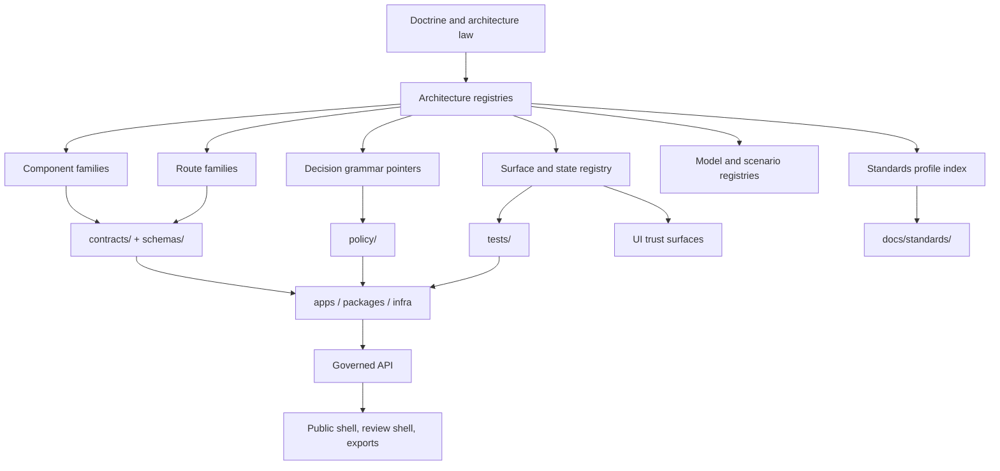

<!-- [KFM_META_BLOCK_V2]
doc_id: kfm://doc/NEEDS_VERIFICATION_UUID
title: Architecture Registries
type: standard
version: v1
status: draft
owners: @bartytime4life
created: YYYY-MM-DD
updated: YYYY-MM-DD
policy_label: NEEDS_VERIFICATION
related: [docs/architecture/README.md, docs/README.md, docs/governance/README.md, docs/standards/README.md, contracts/README.md, schemas/README.md, policy/README.md, tests/README.md, .github/workflows/README.md]
tags: [kfm, architecture, registries]
notes: [doc_id and lifecycle dates require verification before merge, policy label requires verification before merge, current public main showed docs/architecture/registries as a README-only directory before this revision]
[/KFM_META_BLOCK_V2] -->

# Architecture Registries

Human-readable registry hub for KFM’s architecture-critical families, route classes, trust states, and standards pointers.

> **Status:** experimental directory · draft README promotion  
> **Owners:** `@bartytime4life`  
>        
> **Quick jumps:** [Scope](#scope) · [Repo fit](#repo-fit) · [Inputs](#inputs) · [Exclusions](#exclusions) · [Current snapshot](#current-public-main-snapshot) · [Directory tree](#directory-tree) · [Quickstart](#quickstart) · [Usage](#usage) · [Diagram](#diagram) · [Registry map](#registry-map) · [Task list](#task-list--definition-of-done) · [FAQ](#faq) · [Appendix](#appendix)

> [!IMPORTANT]
> Current public `main` showed `docs/architecture/registries/` as a **README-only** directory. This file should make the lane explicit without implying that companion registry files, machine contracts, policy bundles, or tests are already checked in here.

> [!NOTE]
> In this directory, **registry** means a human-readable architecture index for stable names, families, and boundary rules. Machine-authoritative schemas, executable policy vocabularies, and enforcement artifacts still belong in their owning surfaces.

## Scope

This directory exists to stabilize the **architecture-facing registry layer** of KFM:

- component families and write-right boundaries
- route families and trust obligations
- trust-visible surface classes and negative outcome states
- decision grammar pointers such as reason, obligation, and reviewer-role vocabularies
- model/scenario control-plane registries
- standards and profile references used across contracts, policy, runtime, and public surfaces

The goal is not to create a second truth source. The goal is to keep cross-cutting names from drifting across architecture docs, contracts, policy, tests, UI notes, and runtime planning.

[Back to top](#architecture-registries)

## Repo fit

| Field | Value |
|---|---|
| Path | `docs/architecture/registries/README.md` |
| Role | Directory contract and index for architecture registries |
| Upstream | [`../README.md`](../README.md), [`../../README.md`](../../README.md) |
| Adjacent architecture lanes | [`../overview/README.md`](../overview/README.md), [`../enforcement/README.md`](../enforcement/README.md), [`../templates/README.md`](../templates/README.md), [`../threat-model/README.md`](../threat-model/README.md) |
| Machine-neighbor surfaces | [`../../../contracts/README.md`](../../../contracts/README.md), [`../../../schemas/README.md`](../../../schemas/README.md), [`../../../policy/README.md`](../../../policy/README.md), [`../../../tests/README.md`](../../../tests/README.md), [`../../../.github/workflows/README.md`](../../../.github/workflows/README.md) |
| Primary downstream readers | architecture stewards, contract authors, policy authors, test authors, API designers, UI shell maintainers |

This lane should sit **between doctrine and machine implementation**: close enough to architecture to remain readable, and close enough to contracts/policy/tests to remain operational.

## Inputs

Accepted inputs for this directory include:

| Accepted input | Why it belongs here |
|---|---|
| Component-family registries | They define stable cross-plane names, responsibilities, and no-bypass rules |
| Route-family registries | They connect architecture law to API and portrayal boundaries |
| Surface/state registries | They keep trust-visible UI and runtime states named consistently |
| Decision grammar pointers | They explain reason/obligation/reviewer vocabularies without duplicating the machine source |
| Standards/profile indexes | They keep STAC/DCAT/PROV/OGC API/OpenAPI/JSON Schema/WCAG-style references aligned |
| Model/scenario control-plane registries | They reserve architecture names for bounded AI and scenario workflows |
| Write-right and dependency matrices | They clarify which family may write where and what may not be bypassed |

## Exclusions

This directory should **not** become a catch-all.

| Exclusion | Put it here instead |
|---|---|
| Canonical JSON Schemas and machine contract files | [`../../../contracts/README.md`](../../../contracts/README.md), [`../../../schemas/README.md`](../../../schemas/README.md) |
| Executable policy bundles, vocab files, and decision tests | [`../../../policy/README.md`](../../../policy/README.md) |
| Fixtures, proof objects, and validation harnesses | [`../../../tests/README.md`](../../../tests/README.md) |
| Workflow enforcement and merge-gate implementation | [`../../../.github/workflows/README.md`](../../../.github/workflows/README.md) |
| Domain/source inventories | domain atlas or domain-specific docs, not this architecture lane |
| Runtime adapters, service code, or package manifests | app/package/infra surfaces, not this doc lane |
| Decorative diagrams that restate doctrine without boundary value | omit them |

> [!WARNING]
> Do not let this directory become a second schema home, a hidden policy store, or a prose-only substitute for executable enforcement.

[Back to top](#architecture-registries)

## Truth posture

| Label | Meaning here |
|---|---|
| **CONFIRMED** | Directly visible in the current public repo surface or repeatedly established in the attached KFM doctrine |
| **INFERRED** | Strongly implied by repeated doctrine and needed for coherence, but not directly fetched as checked-in implementation here |
| **PROPOSED** | Recommended directory split, file path, or authoring move |
| **UNKNOWN** | Not directly verified in the current public repo surface |
| **NEEDS VERIFICATION** | Value should be reviewed before merge because current evidence is incomplete or intentionally placeholder |

## Current public-main snapshot

| Surface | Status | Current reading | Working implication |
|---|---|---|---|
| `docs/architecture/registries/README.md` | **CONFIRMED** | Current public lane exists | This file is the lane contract |
| Additional child files under `docs/architecture/registries/` | **CONFIRMED absent in current public-main fetch** | No checked-in companion registry docs were directly verified here | Treat any child-file split below as starter guidance, not current tree fact |
| Parent architecture README | **CONFIRMED** | Treats `registries/` as a growth surface inside architecture docs | This README should define the lane clearly |
| `contracts/`, `schemas/`, `policy/`, `tests/`, `.github/workflows/` READMEs | **CONFIRMED** | Machine-adjacent surfaces exist, but are themselves cautious about mounted implementation depth | Cross-link instead of duplicating their authority |
| Executable schema inventory, workflow YAML, policy bundles, fixture sets | **UNKNOWN / NEEDS VERIFICATION** | Not directly proven from the public README-only evidence reviewed for this pass | Keep machine-home claims narrow |

## Directory tree

### Directly fetched current public-main surface

```text
docs/
└── architecture/
    └── registries/
        └── README.md
```

### Doctrine-aligned growth surface  
*Starter split only — not a current public-main tree fact.*

```text
docs/
└── architecture/
    └── registries/
        ├── README.md
        ├── COMPONENT_FAMILIES.md
        ├── ROUTE_FAMILIES.md
        ├── SURFACE_STATE_REGISTRY.md
        ├── DECISION_GRAMMAR.md
        ├── MODEL_AND_SCENARIO_REGISTRIES.md
        └── STANDARDS_PROFILE_INDEX.md
```

A split like this is useful only when the lane grows enough to justify it. Until then, keep this README as the authoritative human-readable index for the directory.

[Back to top](#architecture-registries)

## Quickstart

Use this sequence when checking or expanding the lane:

```bash
find docs/architecture/registries -maxdepth 3 -type f | sort
sed -n '1,260p' docs/architecture/registries/README.md
sed -n '1,260p' docs/architecture/README.md
sed -n '1,220p' contracts/README.md
sed -n '1,220p' schemas/README.md
sed -n '1,220p' policy/README.md
sed -n '1,220p' tests/README.md
sed -n '1,220p' .github/workflows/README.md
grep -RIn "EvidenceBundle\|RuntimeResponseEnvelope\|DecisionEnvelope\|reason_codes\|obligation_codes\|reviewer_roles" docs contracts schemas policy tests .github 2>/dev/null
```

When a registry item is architecture-only, keep it here. When it becomes machine-enforced, update this README and the owning machine surface in the same change.

## Usage

### Reading order

1. Start with [`../README.md`](../README.md) for architecture-wide posture.
2. Use this file to understand **which registries exist conceptually** and **where their machine neighbors belong**.
3. Follow the linked owning surfaces before claiming implementation reality.

### Authoring rule

Use this directory when you need to stabilize a cross-cutting name that would otherwise drift across:

- architecture docs
- contracts and schemas
- policy bundles
- tests and proof objects
- UI trust states
- runtime envelopes and review flows

### Promotion rule

Promote a row in this README into its own file only when one of these becomes true:

- the row acquires change velocity
- more than one subsystem depends on it
- the row requires examples, matrices, or edge cases
- drift risk becomes higher than the cost of a dedicated doc

## Diagram


```mermaid
flowchart TD
    D[Doctrine and architecture law] --> R[Architecture registries]
    R --> CF[Component families]
    R --> RF[Route families]
    R --> SS[Surface and state registry]
    R --> DG[Decision grammar pointers]
    R --> MS[Model and scenario registries]
    R --> SP[Standards profile index]

    CF --> C[contracts/ + schemas/]
    RF --> C
    DG --> P[policy/]
    SS --> T[tests/]
    SS --> U[UI trust surfaces]
    SP --> S[docs/standards/]
    C --> A[apps / packages / infra]
    P --> A
    T --> A

    A --> G[Governed API]
    G --> X[Public shell, review shell, exports]
```

The diagram is intentionally boundary-first: this lane is an index and coordination surface, not the execution surface.

[Back to top](#architecture-registries)

## Registry map

### 1) Registry classes and machine neighbors

| Registry class | What it stabilizes | Keep the human-readable index here? | Machine-authoritative neighbor |
|---|---|---|---|
| Component families | Stable names for major architecture families, responsibilities, write rights, and no-bypass rules | Yes | app/package/infra + contracts + policy |
| Route families | Discovery, read, portrayal, evidence resolution, export, Focus, review, ops families | Yes | OpenAPI/contracts/policy/tests |
| Surface and state registry | Trust-visible surface classes and negative outcome states | Yes | UI payloads + contracts + tests |
| Decision grammar pointers | Reason codes, obligation codes, reviewer roles, result states | Yes, as an index only | policy bundles / policy tests |
| Contract family index | SourceDescriptor, DatasetVersion, EvidenceBundle, RuntimeResponseEnvelope, etc. | Yes, as a cross-link layer | contracts / schemas |
| Model and scenario registries | Model registry, scenario ledger, evaluator bundle index, rollback metadata | Yes | runtime/package/policy surfaces |
| Standards profile index | STAC, DCAT, PROV, OGC API, OpenAPI, JSON Schema, accessibility and release-integrity references | Yes | docs/standards plus owning contracts/policy/runtime lanes |

### 2) Surface/state seed for this lane

| Surface class | Why this directory should keep the name stable |
|---|---|
| Map Explorer | Cross-links geography, freshness, and route-to-evidence behavior |
| Timeline | Carries valid-time, compare anchors, and stale-state cues |
| Dossier | Stabilizes feature/place-centered trust object language |
| Story surface | Keeps narrative publication tied to the same governed shell |
| Evidence Drawer | Prevents provenance drill-through from becoming optional |
| Focus Mode | Keeps bounded assistance tied to visible scope and runtime outcomes |
| Review / Stewardship | Holds moderation, promotion, denial, rollback, and rights handling together |
| Compare | Preserves shared geography/time anchors |
| Export | Keeps release linkage and correction linkage visible |
| Controlled 3D | Prevents 3D from drifting into a separate trust model |

### 3) Registry seeds repeatedly implied by doctrine

| Seed | Expected role in this lane | Status here |
|---|---|---|
| `Component families` | Cross-plane family naming and dependency rules | **INFERRED / PROPOSED** |
| `Route families` | Public/internal route grouping and trust obligations | **INFERRED / PROPOSED** |
| `Surface-state registry` | Promoted, partial, generalized, stale-visible, denied, abstained, withdrawn, superseded, errored | **INFERRED / PROPOSED** |
| `Decision grammar` | Reason codes, obligation codes, reviewer roles, result states | **INFERRED / PROPOSED** |
| `Model registry` | Bounded model adapter naming and compatibility notes | **INFERRED** |
| `Scenario ledger` | Scenario provenance naming and review-bearing control-plane semantics | **INFERRED** |
| `Standards profile index` | Cross-reference of architecture-relevant standards/profile surfaces | **PROPOSED** |

## Task list / definition of done

- [ ] The directory contract states clearly what belongs here and what does not.
- [ ] Current public-main evidence and doctrine-aligned growth guidance are kept visibly separate.
- [ ] Every registry class names its machine-authoritative neighbor.
- [ ] No table implies that companion child files already exist unless they are directly verified.
- [ ] Route-family language stays aligned with contracts and policy, not detached from them.
- [ ] Surface/state language includes negative outcomes and correction-visible states.
- [ ] Reason/obligation/reviewer-role vocabularies are pointed to here, not duplicated as free-text truth.
- [ ] The Mermaid diagram remains boundary-bearing, not decorative.
- [ ] Any future split into child registry docs updates this README, the tree, and cross-links in one PR.
- [ ] KFM meta placeholders are retired only when verified values are known.

> [!TIP]
> The strongest next move for this lane is not to multiply files. It is to keep one clear registry index until a specific family genuinely needs its own page.

[Back to top](#architecture-registries)

## FAQ

### Why is this directory human-readable instead of machine-authoritative?

Because KFM already has machine-neighbor surfaces for contracts, schemas, policy, tests, and workflow enforcement. This lane should keep names and boundaries legible without becoming a second implementation surface.

### Is this the schema home?

No. This lane may index contract families, but it should not become the place where canonical JSON Schemas quietly accumulate.

### Why list proposed child files if the public directory is README-only?

Because the parent architecture lane already treats `registries/` as a growth surface. The proposed split shows **how** the lane could expand without claiming that expansion has already happened.

### When should a registry row become its own file?

When the row gains real change velocity, carries multiple examples or exceptions, or must coordinate work across contracts, policy, tests, and UI.

## Appendix

<details>
<summary><strong>Working vocabulary and starter split</strong></summary>

### Working vocabulary

| Term | Working meaning in this lane |
|---|---|
| Component family | A stable architecture family with a named role, dependency direction, and no-bypass constraint |
| Route family | A stable API class such as discovery, read, portrayal, evidence resolution, export, Focus, review, or ops |
| Surface state | A trust-visible state such as promoted, partial, generalized, stale-visible, denied, abstained, withdrawn, or superseded |
| Decision grammar | The stable vocabulary for result states, reason codes, obligation codes, reviewer roles, and escalation language |
| Model registry | Control-plane registry for model adapters, evaluators, compatibility notes, and rollback metadata |
| Scenario ledger | Control-plane registry for scenario inputs, assumptions, outputs, review state, and provenance |
| Standards profile | Architecture-facing explanation of which external standards/profiles matter and where they bind |

### Proposed starter split

| Proposed file | Job | Status |
|---|---|---|
| `COMPONENT_FAMILIES.md` | Stable names for family roles, write rights, and dependency laws | **PROPOSED** |
| `ROUTE_FAMILIES.md` | Discovery/read/portrayal/evidence/export/Focus/review/ops family breakdown | **PROPOSED** |
| `SURFACE_STATE_REGISTRY.md` | Trust-visible surfaces and outcome/state vocabulary | **INFERRED / PROPOSED** |
| `DECISION_GRAMMAR.md` | Reason/obligation/reviewer/result vocabulary index | **INFERRED / PROPOSED** |
| `MODEL_AND_SCENARIO_REGISTRIES.md` | Model registry + scenario ledger architecture notes | **INFERRED / PROPOSED** |
| `STANDARDS_PROFILE_INDEX.md` | Standards/profile cross-reference and binding notes | **PROPOSED** |

### Authoring guardrails

1. Do not duplicate executable truth already owned by `contracts/`, `schemas/`, `policy/`, or `tests/`.
2. Do not invent mounted implementation.
3. Do not turn “registry” into a bucket for unrelated lists.
4. Do keep names stable enough that contracts, policy, tests, UI, and runtime docs can converge around them.

</details>

[Back to top](#architecture-registries)
