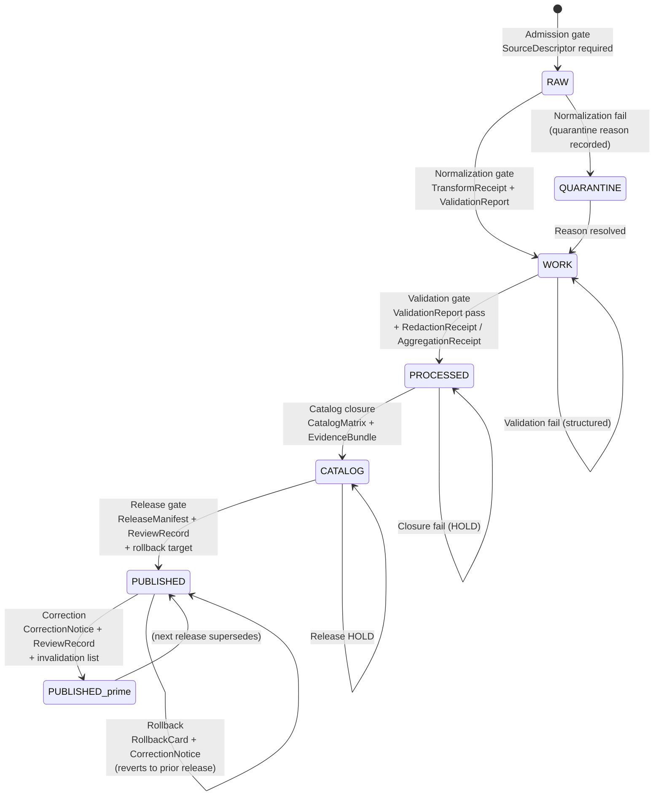

<!-- [KFM_META_BLOCK_V2]
doc_id: kfm://doc/architecture-release-discipline
title: Release Discipline — Architecture
type: standard
version: v1
status: draft
owners: <Release authority + Docs steward + Separation-of-duties reviewer — TBD>
created: 2026-05-25
updated: 2026-05-25
policy_label: public
related:
  - docs/architecture/README.md
  - docs/architecture/governed-api.md
  - docs/architecture/contract-schema-policy-split.md
  - docs/architecture/planetary-3d.md
  - docs/architecture/people-place-joins.md
  - docs/architecture/maplibre-3d.md
  - docs/doctrine/lifecycle-law.md
  - docs/doctrine/trust-membrane.md
  - docs/doctrine/truth-posture.md
  - docs/doctrine/authority-ladder.md
  - docs/adr/README.md
  - docs/runbooks/revocation.md
  - docs/standards/PROV.md
  - docs/standards/SIGNING.md
  - docs/standards/SENSITIVITY_RUBRIC.md
tags: [kfm, architecture, release, promotion, rollback, correction, separation-of-duties, trust-membrane, supersession]
notes:
  - Repo not mounted in authoring session; all path claims are PROPOSED.
  - Gate-A–G labels follow Pass-10 C5-01; the universal RAW→PUBLISHED gate table follows Atlas §24.6.
  - PROV.md / PROVENANCE.md naming variance tracked at directory-rules §18 OPEN-DR-01.
[/KFM_META_BLOCK_V2] -->

# Release Discipline — Architecture

> Promotion is a **governed state transition**, not a file move. This doc consolidates how KFM artifacts cross from RAW into PUBLISHED, how releases prove themselves, who can sign for what, and how corrections and rollbacks repair the public surface without rewriting history.


**Status** · draft &nbsp;·&nbsp; **Owners** · *Release authority + Docs steward + Separation-of-duties reviewer — TBD* &nbsp;·&nbsp; **Updated** · 2026-05-25

---

## Quick jump

- [1. Scope and non-goals](#1-scope-and-non-goals)
- [2. The core invariant](#2-the-core-invariant)
- [3. The universal lifecycle gates](#3-the-universal-lifecycle-gates)
- [4. Gates A through G](#4-gates-a-through-g)
- [5. The ReleaseManifest](#5-the-releasemanifest)
- [6. Reason-code catalog](#6-reason-code-catalog)
- [7. Separation of duties](#7-separation-of-duties)
- [8. Sensitivity-tier transitions](#8-sensitivity-tier-transitions)
- [9. Correction lifecycle](#9-correction-lifecycle)
- [10. Rollback lifecycle](#10-rollback-lifecycle)
- [11. Stale vs wrong, and supersession](#11-stale-vs-wrong-and-supersession)
- [12. Tombstone vs erasure](#12-tombstone-vs-erasure)
- [13. Signing, attestation, supply chain](#13-signing-attestation-supply-chain)
- [14. Anti-patterns](#14-anti-patterns)
- [15. Verification backlog](#15-verification-backlog)
- [16. Related docs](#16-related-docs)

---

## 1. Scope and non-goals

### 1.1 In scope

This document is the **lane-architecture artifact for release discipline**: the rules and artifacts that govern how content crosses from RAW into PUBLISHED, how a release proves itself, who can sign it, how it is corrected after the fact, and how it is rolled back when correction is not enough. It consolidates Atlas Chapter 24's universal references (§24.6 pipeline gates, §24.7 reviewer roles and separation of duties, §24.8 stale-state and supersession) into one operating description.

### 1.2 Non-goals

- This document does **not** define the wire format of any single receipt; receipt schemas live under `schemas/contracts/v1/...` (PROPOSED paths, **NEEDS VERIFICATION** in mounted repo).
- This document does **not** describe per-domain sensitivity rules; see `docs/standards/SENSITIVITY_RUBRIC.md` (PROPOSED, not yet authored in repo).
- This document does **not** describe the governed API surface; see `docs/architecture/governed-api.md` (PROPOSED).
- This document does **not** redefine the lifecycle phases themselves; those are doctrinal and live in `docs/doctrine/lifecycle-law.md` (PROPOSED).
- This document does **not** describe individual runbooks; see `docs/runbooks/` for revocation, rollback drills, correction workflows.

> [!IMPORTANT]
> Release discipline is what makes KFM *reversible*. Every concept below — manifests, reason codes, separation of duties, tombstones, supersession — is in service of a single property: any public surface can be **rolled back, corrected, withdrawn, or restored** with the audit trail intact. If a release cannot be reversed, the discipline failed before the artifact reached PUBLISHED.

---

## 2. The core invariant

### 2.1 Promotion is a governed state transition

**CONFIRMED doctrine** (Atlas KFM-P1-IDEA-0056; Directory Rules; Pass-10 C5-01): *Promotion should be a reviewed, receipt-emitting state transition rather than a file move or UI action.* No artifact reaches PUBLISHED by being copied, by being renamed, by being merged, or by being deployed. It reaches PUBLISHED by passing the gates this document enumerates, and by leaving a paper trail this document specifies.

### 2.2 Three things that always have to be true

| # | Invariant | Citation |
|---|---|---|
| 1 | **Required artifacts exist.** Every gate's listed receipts, manifests, decisions, and review records are present. | Atlas §24.6.2 |
| 2 | **Required artifacts resolve.** Every `EvidenceRef` resolves to an EvidenceBundle; every `source_id` resolves to a SourceDescriptor; every `model_id` resolves to a ModelRunReceipt. Reference is not enough — resolution is required. | Atlas §24.6.2 |
| 3 | **Policy gate evaluated and recorded.** A PolicyDecision exists, with reason code, for every gate the artifact crossed. | Atlas §24.6.2 |

If any of the three is missing, the transition **fails closed** and the prior state is preserved.

### 2.3 The trust-membrane corollary

**CONFIRMED doctrine** (Atlas §24.6.2): *The trust membrane forbids any public client, any normal UI surface, and any released AI surface from reaching RAW, WORK, QUARANTINE, canonical/internal stores, graph internals, vector indexes, source APIs, or direct model runtimes. The gates above are the only routes by which content reaches PUBLISHED, and PUBLISHED is the only state from which the governed API may emit ANSWER.*

This is the discipline's *public-facing* form: the public never sees pre-PUBLISHED state, and the governed API never serves below PUBLISHED.

---

## 3. The universal lifecycle gates

**CONFIRMED doctrine** (Atlas §24.6.1): Every domain follows the same lifecycle invariant — **RAW → WORK / QUARANTINE → PROCESSED → CATALOG / TRIPLET → PUBLISHED** — with promotion as a governed state transition at each step. After PUBLISHED, **CORRECTION** and **ROLLBACK** complete the loop.

### 3.1 Gate-by-gate table

| Gate (transition) | Pre-condition | Required artifacts (PROPOSED minimum) | Failure-closed outcome |
|---|---|---|---|
| **Admission** (— → RAW) | Source identity and rights minimally established at discovery; source-role *intent* set | `SourceDescriptor` (role, authority, rights, sensitivity, cadence); hash of payload or reference | Source not admitted; logged as candidate awaiting steward |
| **Normalization** (RAW → WORK / QUARANTINE) | Schema, geometry, time, identity, evidence, rights, and policy rules are runnable | `TransformReceipt`; `ValidationReport` (working set); `PolicyDecision`; QUARANTINE for failures | Quarantine with reason; never silently promotes |
| **Validation** (WORK → PROCESSED) | Validators are deterministic and tied to fixtures; required receipts present | `ValidationReport` pass; `RedactionReceipt` if sensitivity applies; `AggregationReceipt` if applies | Stay in WORK; structured FAIL outcome |
| **Catalog closure** (PROCESSED → CATALOG / TRIPLET) | EvidenceRefs resolve; catalog matrix and digests close | `CatalogMatrix` entry; `EvidenceBundle`; graph / triplet projections if applicable | HOLD at PROCESSED; structured FAIL outcome; no public edge |
| **Release** (CATALOG / TRIPLET → PUBLISHED) | Review state where required; release authority distinct from original author when materiality applies | `ReleaseManifest`; rollback target; correction path; `ReviewRecord` (if required) | HOLD at CATALOG; no public surface change |
| **Correction** (PUBLISHED → PUBLISHED′) | Detected error or new evidence; downstream derivatives identified | `CorrectionNotice`; `ReviewRecord`; invalidation list; `ReleaseManifest` update or supersession | Stale-state announcement; no silent edit |
| **Rollback** (PUBLISHED → prior release) | Failed release or post-publication failure; targeted prior release identified | `RollbackCard`; `CorrectionNotice`; `ReleaseManifest` reverts to prior release; downstream derivative invalidation | Held at current state until rollback validated |

### 3.2 Lifecycle as a state machine



### 3.3 Universal closure rules

**CONFIRMED doctrine** (Atlas §24.6.2): A transition is closed only when

1. the required artifacts above exist,
2. every required artifact **resolves** (not merely references) the artifacts it depends on, and
3. the policy gate evaluated and recorded its decision.

Missing any of these means the transition fails closed and the prior state is preserved. This rule applies *uniformly* across every domain and every release class.

---

## 4. Gates A through G

**CONFIRMED doctrine** (Pass-10 C5-01 *Promotion Gate Matrix A–G*): The gate sequence above is enforced at PR time and at runtime by a single pinned policy bundle running under both Conftest (CI) and OPA (runtime / admission), with the same Rego rules executing in both contexts ("policy parity"). Each gate is named, machine-checked, and tied to required evidence.

| Gate | Name | Maps to (machine) | Required evidence |
|---|---|---|---|
| **A** | Structure and Metadata | `check_structure` | KFM Meta Block presence, zone correctness, file-class declaration |
| **B** | Schemas and Contracts | JSON Schema + OpenAPI validation | Schema files under `schemas/contracts/v1/...`, contract objects under `contracts/...` |
| **C** | Policy Parity | Conftest / OPA decision | Rego policy bundle pinned by digest; identical execution in CI and runtime |
| **D** | Security and Sensitivity | Sensitivity + license scans | Sensitivity rubric assignment, license metadata, redaction receipts where applicable |
| **E** | Data Quality | Profilers + threshold assertions | `ValidationReport` pass; fixture-driven validators; threshold tables |
| **F** | Provenance and Lineage | Receipt + lineage validation | `RunReceipt`, `TransformReceipt`, OpenLineage event for the run, EvidenceBundle round-trip |
| **G** | Reviewability with two-key approval | CODEOWNERS-enforced human + policy approval | `ReviewRecord`; author ≠ approver when materiality applies (§7) |

**Auto-merge fires only when all seven pass.** Any failure blocks the merge or release until remediation; bypass is forbidden as a normal path (admin shortcuts must be justified, constrained, and audited).

> [!TIP]
> Gates A–G are an **enforcement labeling** of the universal lifecycle gates in §3, not a parallel pipeline. Gate A–G language is the right vocabulary for reviewer dashboards, CI status badges, and PR templates. Lifecycle-gate language (§3) is the right vocabulary for promotion decisions and release manifests. Both name the same checks.

---

## 5. The ReleaseManifest

### 5.1 What it is

**CONFIRMED doctrine** (Atlas KFM-P7-PROG-0003 *ReleaseManifest as the publishable artifact*, NI-425): *When the gate allows promotion to PUBLISHED, it emits a ReleaseManifest: a single, signed, hashable JSON object listing every dataset, bundle, and tile archive included in the release.*

The manifest names every included dataset by stable ID, every bundle by `spec_hash`, every PMTiles archive by `spec_hash`, and every layer manifest by `spec_hash`. **Consumers — web client, catalog harvester, downstream pipelines — bind to the ReleaseManifest, not to floating "latest" pointers.**

### 5.2 Required content (PROPOSED shape)

| Field | Purpose |
|---|---|
| `release_id` | Stable identifier for this release |
| `contents[]` | List of every dataset, bundle, tile archive, layer manifest, with stable IDs |
| `digests` | `spec_hash` for every element in `contents[]` |
| `evidence_refs[]` | Pointers to backing EvidenceBundles |
| `policy_decision_ref` | The PolicyDecision authorizing the release |
| `review_record_ref` | The ReviewRecord if materiality required one |
| `rollback_target` | Stable ID of the prior release this one can revert to |
| `correction_path` | How a correction to this release will be issued (`supersession` vs `in-place amendment`) |
| `signatures` | cosign / DSSE signatures (§13) |
| `signer_identity` | Release-authority identity binding |
| `time` | UTC timestamp of release decision |

### 5.3 Content-addressing as a release invariant

**CONFIRMED doctrine** (Atlas KFM-P1-PROG-0057 *Release and rollback manifests*): The manifest is content-addressed. Any consumer that records the ReleaseManifest's `spec_hash` is recording exactly which evidence it observed. This is the property that makes rollback and correction *reversible*: a downstream client can replay against the prior manifest's hash and reproduce the prior public surface bit-for-bit.

> [!CAUTION]
> Floating pointers — `latest`, branch tips, mutable URLs — are forbidden as consumer-binding targets. They defeat content-addressing, and they make rollback a destructive operation rather than a versioned one. The governed API may *resolve* `latest` to a specific manifest at request time, but the manifest hash is what the receipt records.

### 5.4 Where ReleaseManifests live

**PROPOSED paths** (`kfm_repository_structure_guiding_document.md` — release/ section; **NEEDS VERIFICATION** in mounted repo):

```text
release/
├── candidates/                # release candidates awaiting decision
├── manifests/                 # signed ReleaseManifests
│   └── focus_modes/           # Focus-Mode release manifests (v0.2 lane)
├── promotion_decisions/       # PromotionDecision records
├── rollback_cards/            # RollbackCard artifacts
├── correction_notices/        # CorrectionNotice artifacts
├── withdrawal_notices/        # WithdrawalNotice artifacts
├── signatures/                # cosign signatures
├── attestations/              # DSSE / in-toto / SLSA predicates
├── sbom/                      # SBOMs per release
└── changelog/                 # human-readable changelog
```

**Authority:** `release/` is a **canonical release-decision root** under directory-rules. Policy logic does **not** live here (it lives in `policy/`); published artifacts do not live here (those live under `data/published/`); receipts do not live here (those live under `data/receipts/`); proofs do not live here (those live under `data/proofs/`).

---

## 6. Reason-code catalog

**PROPOSED catalog** (Atlas §24.6.3): Failures during any lifecycle transition return a structured reason code, never a free-text error. The catalog below is doctrinal; specific code strings are PROPOSED and confirmable from `policy/` bundles when mounted.

| Failure family | Reason codes | Gates where it fires | Recovery path |
|---|---|---|---|
| Missing required artifact | `MISSING_RECEIPT` · `MISSING_EVIDENCE` · `MISSING_REVIEW` | Normalization · Validation · Catalog · Release | Re-emit missing receipt; re-run review; re-validate |
| Schema / contract mismatch | `SCHEMA_MISMATCH` · `CONTRACT_DRIFT` | Normalization · Validation | Schema fix and/or ADR; re-run validator |
| Rights / sensitivity unresolved | `RIGHTS_UNKNOWN` · `SENSITIVITY_UNRESOLVED` | Admission · Validation · Catalog · Release | Steward review; rights resolution; tier reassignment |
| Source-role collapse risk | `ROLE_COLLAPSE` · `ROLE_DOWNCAST_FORBIDDEN` | Validation · Catalog · Release | Restore source role; refuse upcast |
| Review state inadequate | `REVIEW_NEEDED` · `REVIEW_INSUFFICIENT` · `REVIEW_REJECTED` | Catalog · Release | Run required review; supply ReviewRecord |
| Release infrastructure error | `RELEASE_MANIFEST_INVALID` · `ROLLBACK_TARGET_MISSING` | Release | Manifest fix; supply rollback target |
| Correction lineage broken | `CORRECTION_DERIVATIVES_UNRESOLVED` · `CORRECTION_PRIOR_RELEASE_MISSING` | Correction | Resolve derivatives; supersession entry |
| Signing / attestation failure (PROPOSED extension) | `SIGNATURE_INVALID` · `REKOR_INCLUSION_MISSING` · `SIGNER_IDENTITY_UNAUTHORIZED` · `SBOM_MISSING` | Release | Re-sign with authorized identity; restore Rekor inclusion; emit SBOM |

> [!NOTE]
> Reason codes are **machine-readable** and **stable**. They appear in `PolicyDecision`, in `ReleaseManifest` failure paths, in CI logs, and in the promotion-gate status board (KFM-P32-FEAT-0014). Renaming a reason code is a breaking change and requires an ADR.

---

## 7. Separation of duties

### 7.1 Roles (CONFIRMED doctrine, Atlas §24.7.1)

| Role | Owns |
|---|---|
| **Source steward** | SourceDescriptor lifecycle; admission gate; rights confirmation; sensitivity tag for a named source family |
| **Domain steward** | Meaning, contracts, and validators of a domain's object families |
| **Sensitivity reviewer** | Redaction, generalization, withholding, tier decisions; RedactionReceipt issuance |
| **Rights-holder representative** | Sovereignty, cultural-heritage, consent-based release decisions (Archaeology; sovereign data; living-person; DNA) |
| **Release authority** | Issuance of ReleaseManifests; PUBLISHED transitions; rollback authorization. **Distinct from authorship when materiality applies.** |
| **Correction reviewer** | Review of CorrectionNotice / RollbackCard before amending a PUBLISHED claim |
| **AI surface steward** | Focus Mode templates, AIReceipts, policy bindings; AI behavior audit |
| **Docs steward** | Governance documentation; ADR index; drift register; Atlas / supplement integrity |

### 7.2 Action matrix (CONFIRMED doctrine, Atlas §24.7.2)

| Action | Author may also approve? | Required separation (PROPOSED) |
|---|---|---|
| Source admission (— → RAW) | Yes for routine; **No** when source has unresolved rights / sovereignty | Source steward + rights-holder rep where applicable |
| Normalization receipts | Yes for routine; **No** when transforms are sensitivity-relevant | Domain steward; sensitivity reviewer if sensitivity-relevant |
| Validator authorship and run | Yes (validators are deterministic) | Domain steward; periodic audit by docs steward |
| Promotion to PROCESSED / CATALOG | Yes for non-sensitive routine; **No** for sensitive lanes | Domain steward + sensitivity reviewer (sensitive lanes) |
| **Release to PUBLISHED** | **No** when materiality applies | Author ≠ release authority; rights-holder rep where applicable |
| **Sensitive-lane release** | **No.** | Author + sensitivity reviewer + release authority + rights-holder rep |
| Correction / rollback | **No** when correction is steward-significant | Author / detector + correction reviewer + release authority |
| AI surface change (template / policy binding) | **No.** | AI surface steward + docs steward (policy binding) |
| Atlas / supplement publication | **No.** | Docs steward + at least one subsystem owner |

### 7.3 Maturity note

**CONFIRMED doctrine** (Atlas §24.7.2 closing note; Directory Rules §2; ADR-S-09): Separation of duties is *maturity-dependent*. Early-stage doctrine work may be authored and approved by the same actor when materiality is low. **As maturity rises and the public trust surface expands, separation must be enforced through tooling, not custom.** The corpus is explicit: doctrine does not pretend the enforcement exists yet. ADR-S-09 is open to set the threshold and the enforcement mechanism.

> [!WARNING]
> The author-equals-approver pattern is *the* most common way a trust-membrane breach reaches production. The PR is small, the approval is fast, the release ships, and only later does anyone notice that the same person wrote, reviewed, signed, and published. Sensitive-lane releases must be tooling-enforced — branch protections, CODEOWNERS, signer-identity gating — not custom-enforced.

---

## 8. Sensitivity-tier transitions

**CONFIRMED doctrine** (Atlas §24.5 sensitivity rubric + tier-transition table): Tier movement is asymmetric — moving toward *more public* always requires both a transform receipt and a review record; moving toward *less public* never requires both.

| Transition | Required artifacts | Authority | Reversibility |
|---|---|---|---|
| T4 → T2 | `PolicyDecision` + `ReviewRecord` | Steward | Reversible: review revocation returns object to T4 |
| T4 → T1 | `RedactionReceipt` + `ReviewRecord` | Steward | Reversible: redaction can be re-evaluated; correction may demote a published T1 to T4 |
| T3 → T2 | `PolicyDecision` + `ReviewRecord` | Steward | Reversible |
| T2 → T1 | `RedactionReceipt` + `ReviewRecord` | Steward | Reversible |
| T1 → T0 | `ReleaseManifest` + `ReviewRecord` | Steward + release authority | Reversible: rollback supported via `RollbackCard` |
| **Any tier → T4 (downgrade)** | `CorrectionNotice` + `ReviewRecord` | Steward + rights-holder where applicable | Always permitted; **precedes** derivative invalidation |

**Reading rule:** a tier *upgrade* (toward more public) always needs both a transform receipt and a review record; a tier *downgrade* (toward less public) never needs both — correction alone is sufficient to remove or restrict. This asymmetry is intentional and load-bearing.

---

## 9. Correction lifecycle

### 9.1 The transition

**CONFIRMED doctrine** (Atlas §24.6.1, *Correction (PUBLISHED → PUBLISHED′)*): A correction transitions a PUBLISHED claim to a new PUBLISHED state, with the prior state retained for audit. A correction is required whenever:

- A detected error is confirmed (data wrong, attribution wrong, geometry wrong, time wrong, source-role wrong).
- New evidence materially changes a prior claim's substance.
- A sensitivity / rights / policy decision changes such that the prior release's posture is no longer supportable.

### 9.2 Required artifacts

| Artifact | Purpose |
|---|---|
| `CorrectionNotice` | What changed, why it changed, what the prior state was |
| `ReviewRecord` | Steward + correction reviewer + release authority sign-off |
| **Invalidation list** | Every downstream derivative (tile, layer, bundle, story, export, AIReceipt) that the corrected claim invalidates |
| Updated or superseding `ReleaseManifest` | New manifest pinning the corrected state |

### 9.3 The no-silent-edit rule

**CONFIRMED doctrine.** Corrections are **announced**, not silent. The Evidence Drawer surfaces a stale-state marker; downstream derivatives are listed in the invalidation list; the prior `ReleaseManifest` remains queryable through its `spec_hash`. *Re-publishing a corrected claim without invalidating derivatives* is a CONFIRMED governance anti-pattern (Atlas §29.3).

---

## 10. Rollback lifecycle

### 10.1 When rollback is the right tool

Rollback is the right tool when correction-in-place is insufficient — when the public surface needs to revert to a known-good prior state rather than be amended. Typical triggers:

- A failed release leaked content that should not have shipped.
- Post-publication evidence shows the release-time PolicyDecision was wrong.
- A signing / attestation failure surfaces after publication.
- A correction-in-place would leave the public surface inconsistent across derivatives.

### 10.2 Required artifacts and rule

**CONFIRMED doctrine** (Atlas §24.6.1; KFM-P1-PROG-0057; KFM-P16-PROG-0021 *Rollback gate with inverse patch verification*):

| Artifact | Purpose |
|---|---|
| `RollbackCard` | Names the targeted prior release, the reason, the validating evidence |
| `CorrectionNotice` | Records the post-publication failure that drove rollback |
| Reverted `ReleaseManifest` | Manifest pointer reverts to the named prior release; rollback chain preserved |
| Downstream derivative invalidation | Every dependent surface re-bound to the reverted manifest |
| Inverse-patch verification | Reverse diff, policy decisions, signatures, run receipts verified **before** the inverse patch is applied (KFM-P16-PROG-0021) |

**PROPOSED rule** (KFM-P1-PROG-0057): Rollback should *point to prior release artifacts and state why the rollback is valid*, not merely restore older files. A rollback that cannot prove validity through receipts is itself a release that did not pass the gates.

### 10.3 Held during validation

**CONFIRMED doctrine** (Atlas §24.6.1, rollback failure-closed outcome): The public surface is **held at current state** until the rollback validates. A half-validated rollback never reaches the public path. This is what makes rollback reversible in turn — if the rollback itself goes wrong, it can be rolled back to the failed state and re-attempted with corrected validation.

---

## 11. Stale vs wrong, and supersession

### 11.1 The distinction (CONFIRMED doctrine, Atlas §24.8)

KFM separates **stale** from **wrong**:

- **Stale** = the claim's evidence, source freshness, dependent data, or context has aged past its declared tolerance. The substance may still be correct; the evidence supporting it is no longer fresh enough to assert.
- **Wrong** = the claim's substance is incorrect.

Both states have **visible markers** and **traceable lifecycles**. Stale-handling and correction-handling are not interchangeable; conflating them is a CONFIRMED governance anti-pattern.

### 11.2 Stale-state markers

| Marker | Trigger | UI signal | Required action |
|---|---|---|---|
| Source freshness expired | Cadence in SourceDescriptor passed without new admission | Stale source badge in Evidence Drawer | Re-admit or supersede; otherwise mark dependent claims stale |
| Schema version drift | Object schema upgraded past the published claim's version | Schema-drift badge; migration ADR shown if any | Migrate, re-validate, re-release; or mark stale |
| Geography version drift | GeographyVersion replaced; claim still bound to prior version | Geography-version banner with prior-version cite | Rebind to current; re-release; or mark stale |
| Time-scope outside support | Claim's temporal scope falls outside current data window | Time-out-of-support indicator | Mark stale; **do not refresh silently** |
| Model version superseded | ModelRunReceipt references an older model | Model-version badge with new model identity | Re-run; supersede; or mark stale |
| Review aged out | ReviewRecord older than the sensitive lane's tolerance | Review-aged badge | Trigger steward review; potentially downgrade tier |
| Rights status changed | Rights change in SourceDescriptor | Rights-changed badge | Re-evaluate tier; potentially downgrade; emit CorrectionNotice if necessary |
| Policy version changed | Policy referenced by prior PolicyDecision was superseded | Policy-version badge | Re-run gate; potentially supersede release |

### 11.3 Supersession lineage (CONFIRMED doctrine, Atlas §24.8.2)

| Object class | Supersession rule | Required lineage artifact |
|---|---|---|
| SourceDescriptor | Replaced by newer descriptor; old retained with `superseded_by` | Supersession entry in source register |
| EvidenceBundle | Replaced when corrected; old retained for audit | EvidenceBundle + CorrectionNotice + supersession link |
| GeographyVersion | Replaced; both versions remain queryable for time-bound claims | Version register entry + crosswalk |
| Schema | Replaced via ADR; old retained | ADR + supersession link in schema header |
| Policy | Replaced via accepted ADR; old retained | ADR + supersession link |
| ReleaseManifest | Replaced by next release; rollback target remains valid | Manifest history + rollback chain |
| AIReceipt | **Never superseded retroactively.** Old answer retained; new answer is a new receipt | Two distinct AIReceipts with cross-reference |
| Atlas / supplement | Superseded by ADR-recorded new version; lineage retained | Supersession appendix in the new edition |

> [!IMPORTANT]
> **AIReceipts are immutable in particular.** A new AI answer is a new receipt, never a retroactive edit of an old one. This is how the audit trail survives evolving evidence: the old answer reflects what the system could say with the evidence it had at the time, the new answer reflects current evidence, and both remain queryable.

---

## 12. Tombstone vs erasure

### 12.1 Tombstone as the default revocation pattern

**CONFIRMED doctrine** (Pass-10 C5-09 *Tombstones for Reversible Revocation*): Revocations are not deletions. A signed tombstone receipt is appended to the ledger pointing at the retracted artifact, records the reason, and (where applicable) names a supersession reference. UI and API clients **hide tombstoned items from public views**, but lineage and audit remain explorable.

This preserves explainability: investigators can ask why something disappeared; auditors can trace the decision; downstream consumers can follow the supersession reference.

### 12.2 When erasure is required instead

| Case | Disposition |
|---|---|
| Right-to-be-forgotten obligations (e.g., GDPR Art. 17 personal data) | Tombstone is **insufficient**; true erasure required, with erasure event logged |
| Tribal data with rights-holder request | Tombstone may be insufficient; sovereignty governs; erasure with logged event |
| Living-person identifying data published in error | Erasure with logged event; CorrectionNotice naming derivatives |
| Routine retraction of incorrect aggregate / public claim | Tombstone sufficient |

The boundary between tombstone and erasure is **PROPOSED** for a dedicated runbook (`docs/runbooks/revocation.md` — referenced in Pass-10 C5-09 expansion; **not yet authored**).

---

## 13. Signing, attestation, supply chain

**CONFIRMED doctrine** (Atlas KFM-P10-PROG-0006 *DSSE/SLSA attestations*; KFM-P27-PROG-0014 *cosign DSSE verification job*; KFM-P27-PROG-0024 *SBOM signing workflow*):

### 13.1 Required at release

| Artifact | What it binds | Tool (PROPOSED) |
|---|---|---|
| cosign signature | ReleaseManifest digest + signer identity | `cosign` |
| DSSE envelope | Signed in-toto statement wrapping artifact predicates | `cosign attest --type ...` |
| SLSA provenance predicate | Build identity, materials, builder, parameters | SLSA `provenance` predicate |
| Rekor inclusion proof | Public-transparency-log entry for the signature | Rekor public instance (or KFM-pinned) |
| SBOM | Bill of materials for the released artifact | CycloneDX or SPDX |
| PROV JSON-LD attestation | W3C PROV-O provenance bound to the release | per `docs/standards/PROV.md` |

### 13.2 The verification job

**CONFIRMED doctrine** (KFM-P27-PROG-0014): A CI job verifies cosign signatures, DSSE envelopes, Rekor inclusion, and **signer identity** before artifact promotion. Drift between signed manifest and verified evidence is a `SIGNATURE_INVALID` failure (reason code §6).

### 13.3 What attestation does *not* prove

Attestation proves the artifact reached the public surface through the build / sign / publish chain *the project intended*. It does **not** prove the underlying evidence is correct, sensitivity tags are right, or sources are fresh. Those are the job of EvidenceBundle resolution, policy gates, and stale-state markers. Signing is necessary but not sufficient.

---

## 14. Anti-patterns

<details>
<summary><strong>Click to expand: catalog of release-discipline anti-patterns</strong></summary>

| Anti-pattern | Why it fails | Counter-rule |
|---|---|---|
| **Promotion as a file move** | Bypasses gates; produces no PromotionReceipt | Promotion is a governed state transition (§2) |
| **Author = release authority** | Self-approval defeats separation of duties | §7 action matrix; tooling-enforced at maturity |
| **Releasing without ReleaseManifest or rollback target** | Public surface cannot be rolled back | Atlas §29.2 ; release gate fails closed |
| **Floating `latest` pointer as consumer binding** | Defeats content-addressing; rollback becomes destructive | Bind to manifest `spec_hash`; resolve `latest` only inside governed API |
| **Silent edit of a published claim** | Removes audit trail; readers cannot tell that the surface changed | Correction emits CorrectionNotice + ReviewRecord + invalidation list; no silent edit |
| **Re-publishing a correction without invalidating derivatives** | Derivative surfaces continue showing the wrong claim | CorrectionNotice must list every invalidated derivative |
| **Rollback that "just restores older files"** | Rollback unverified; could reintroduce a different known-bad state | Rollback validates reverse diff, policy decisions, signatures, run receipts before applying inverse patch (KFM-P16-PROG-0021) |
| **Promotion that "upgrades" a source role** (modeled → observed via join or aggregation) | Role collapse; readers cannot trust source-role labels | Source role fixed at admission; never upgraded by promotion |
| **Aggregate cited as per-place truth via cross-domain join at release** | Source-role collapse + inference risk | DENY join from cell to single record at release gate; aggregation receipt required |
| **Admin shortcut used as the normal public path** | Trust-membrane breach | Admin shortcuts justified, constrained, audited, kept out of normal public path |
| **Treating an Atlas summary or matrix as evidence** | Reference views displace EvidenceBundle as authority | Atlas, supplements, master matrices are reference views; EvidenceBundle is authoritative |
| **Hard delete in place of tombstone for routine revocation** | Loses explainability; investigators cannot trace what was retracted | Tombstone by default; erasure only when legally / sovereignly required |
| **Approving one's own release on a sensitive lane** | Highest-risk surface, lowest-friction self-approval | Tooling-enforced separation; sensitive-lane release requires author + sensitivity reviewer + release authority + rights-holder rep |
| **Pinning consumer to tag rather than digest in cosign verify** | Tag can move; digest cannot | `cosign verify` against digest-pinned manifests, never tag-pinned |
| **Reason codes treated as free-text logs** | Machine consumers cannot detect failure family; recovery automation breaks | Reason codes are stable identifiers; renaming requires ADR |
| **AIReceipt retroactively edited to "match" newer evidence** | Destroys the audit trail of what the AI could say when | A new answer is a **new** AIReceipt; old receipt retained with cross-reference |

</details>

---

## 15. Verification backlog

| Item | Evidence that would settle it | Status |
|---|---|---|
| `release/` root layout (§5.4) confirmed in mounted repo | `release/manifests/`, `release/promotion_decisions/`, `release/rollback_cards/`, `release/correction_notices/`, `release/withdrawal_notices/`, `release/signatures/`, `release/attestations/`, `release/sbom/` present | **NEEDS VERIFICATION** |
| `schemas/contracts/v1/release/release_manifest.schema.json` present with field set in §5.2 | Mounted schema file | **NEEDS VERIFICATION** |
| `schemas/contracts/v1/release/rollback_card.schema.json` present | Mounted schema file | **NEEDS VERIFICATION** |
| `schemas/contracts/v1/release/correction_notice.schema.json` present | Mounted schema file | **NEEDS VERIFICATION** |
| `policy/release/` Rego bundle present with reason-code catalog wired (§6) | Mounted policy bundle + Conftest fixtures | **NEEDS VERIFICATION** |
| CI parity (Conftest = OPA runtime) verified (§4 Gate C) | CI workflow + runtime policy admission test | **NEEDS VERIFICATION** |
| Two-key approval (Gate G) enforced by CODEOWNERS + branch protection | Mounted `.github/CODEOWNERS` + branch-protection settings | **NEEDS VERIFICATION** |
| cosign + DSSE + Rekor verification job present in CI (§13.2) | Workflow file + sample attestation | **NEEDS VERIFICATION** |
| SBOM signing workflow present (§13.1) | Workflow file + sample SBOM | **NEEDS VERIFICATION** |
| Tombstone schema and revocation runbook | `docs/runbooks/revocation.md` + tombstone schema | **PROPOSED** (Pass-10 C5-09 expansion) |
| ADR-S-09 — separation-of-duties threshold and enforcement | Accepted ADR | **PROPOSED open ADR** |
| ADR-S-10 — stale-state propagation across lanes | Accepted ADR | **PROPOSED open ADR** |
| ADR-S-11 — story / export receipt scope and retention | Accepted ADR | **PROPOSED open ADR** |
| ADR-S-15 — atlas / supplement lifecycle | Accepted ADR | **PROPOSED open ADR** |
| Promotion-gate status board (KFM-P32-FEAT-0014) wired and visible | Operator-visible surface showing source monitor, scorecard, schema validator, OPA decision, attestation, ReleaseManifest candidate state | **PROPOSED** |
| Rollback / correction lineage timeline (KFM-P32-FEAT-0020) | Reviewer-visible timeline | **PROPOSED** |
| This file's canonical path `docs/architecture/release-discipline.md` | Mounted `docs/architecture/` tree + `docs/architecture/README.md` index | **PROPOSED** |

> [!NOTE]
> All file paths in this document are **PROPOSED** per directory-rules. Verify against a mounted repo before linking from neighboring docs.

[Back to top](#release-discipline--architecture)

---

## 16. Related docs

- `docs/architecture/README.md` — architecture index *(TODO: link verify)*
- `docs/architecture/governed-api.md` — the trust-membrane surface releases are served through *(PROPOSED)*
- `docs/architecture/contract-schema-policy-split.md` — meaning vs shape vs admissibility *(PROPOSED)*
- `docs/architecture/planetary-3d.md` — sibling lane-architecture doc *(authored prior session; PROPOSED path)*
- `docs/architecture/people-place-joins.md` — sibling lane-architecture doc *(authored prior session; PROPOSED path)*
- `docs/architecture/maplibre-3d.md` — sibling renderer-architecture doc *(authored prior session; PROPOSED path)*
- `docs/doctrine/lifecycle-law.md` — RAW → PUBLISHED governance *(PROPOSED)*
- `docs/doctrine/trust-membrane.md` — public-path constraints *(PROPOSED)*
- `docs/doctrine/truth-posture.md` — cite-or-abstain default *(PROPOSED)*
- `docs/doctrine/authority-ladder.md` — source-role and authority discipline *(PROPOSED)*
- `docs/adr/README.md` — ADR index *(PROPOSED)*
- `docs/runbooks/revocation.md` — tombstone vs erasure operating procedure *(PROPOSED; not yet authored)*
- `docs/standards/PROV.md` — W3C PROV-O + PAV profile *(CONFIRMED authored prior session; naming variance vs `PROVENANCE.md` tracked at directory-rules §18 OPEN-DR-01)*
- `docs/standards/SIGNING.md` — signing and attestation profile *(PROPOSED in corpus Pass-10 C1-03; not yet authored)*
- `docs/standards/SENSITIVITY_RUBRIC.md` — sensitivity rubric 0–5 *(PROPOSED in corpus Pass-10 C6-01; not yet authored)*
- `directory-rules.md` — root-folder authority boundaries

---

<sub>Last updated · 2026-05-25 &nbsp;·&nbsp; Doc class · architecture &nbsp;·&nbsp; Status · draft &nbsp;·&nbsp; <a href="#release-discipline--architecture">Back to top ↑</a></sub>
