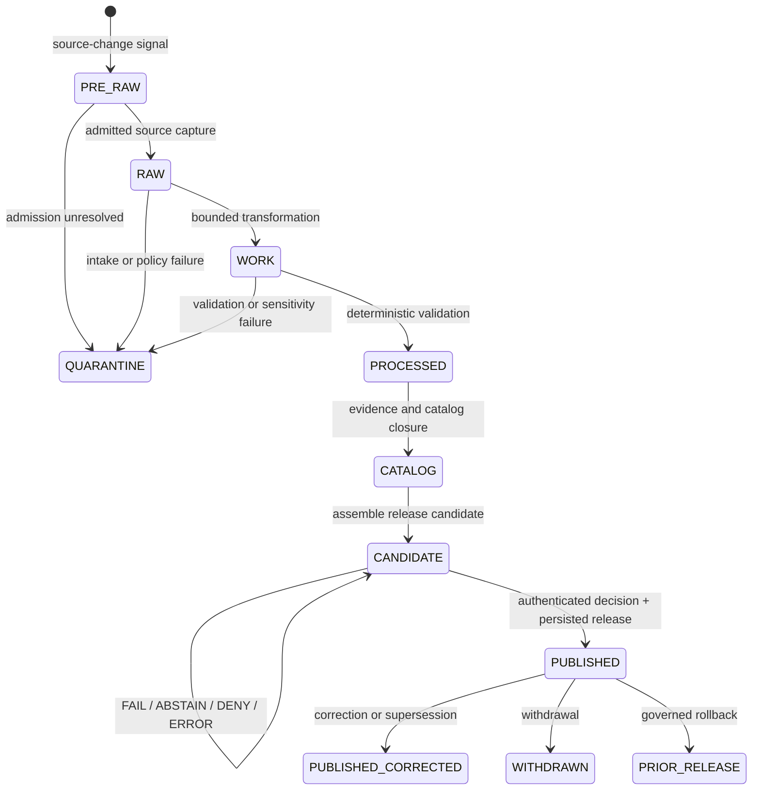

<!-- [KFM_META_BLOCK_V2]
doc_id: kfm://doc/architecture-release-discipline
title: Release Discipline — Current Architecture and Operational Boundary
type: architecture
subtype: release-discipline
version: v2.0
status: draft; repository-grounded; explanatory; mixed-maturity; operational-release-hold; non-authoritative
owners:
  - "@bartytime4life — verified CODEOWNERS review route"
  - "NEEDS VERIFICATION — accountable release, policy, review, correction, rollback, signing, operations, and independent-review stewards"
created: 2026-05-25
updated: 2026-08-19
policy_label: public; architecture; release; promotion; correction; withdrawal; rollback; fail-closed; no-publication-authority
current_path: docs/architecture/release-discipline.md
owning_root: docs/
responsibility: "Explain how KFM release candidates, validation, policy, review, manifests, release decisions, corrections, withdrawals, and rollback compose without transferring authority among doctrine, contracts, schemas, policy, evidence, receipts, proofs, release records, lifecycle data, runtime, or public delivery."
truth_posture: "CONFIRMED same-path placement, accepted Directory Rules v2 authority, canonical release decision root, dual-profile ReleaseManifest candidate, deterministic fixture validation, bounded A-G readiness evaluator, five-case publication-denial dry run, fixture-first RollbackCard, synthetic rollback rehearsal, read-only workflows, and current repository holds / PROPOSED production profile, authenticated reference resolution, signing, policy integration, independent review, candidate assembly, release persistence, correction and invalidation propagation, rollback execution, public aliasing, deployment, and publication / UNKNOWN first governed production release, deployed release registry, active public release alias, external consumers, and runtime/public parity / NEEDS VERIFICATION accountable stewards, ruleset coupling, consumer closure, correction-schema authority, sensitivity vocabulary convergence, signing custody, and operational recovery evidence"
evidence_snapshot:
  repository: bartytime4life/Kansas-Frontier-Matrix
  base_ref: main
  base_commit: 7ef1597779774d80346f81ecd8104b720797c587
  target_prior_blob: 012a2b8090cb16936648e1b11701953497fc5b8f
  directory_rules_blob: fd49a0b83e55cef52c1124281f093e263526898d
  codeowners_blob: dd2a84aa514d8ecd9208bc347f90f9a2ed37dd61
  release_manifest_schema_blob: c76cd9bdddb34cf33c8eb62801269553726c5923
  release_manifest_validator_blob: 00307dc0d5e2c3867a229076e3702f8111455425
  release_manifest_workflow_blob: 91d9a995328f8d162121341ed265fa87781be4e8
  publication_deny_dry_run_blob: 5fed3a16aa0915b9233861048fc6a1e676e0ed8f
  release_dry_run_workflow_blob: 8f76d1011b80769952a0a6561ed7e5cd963bf8c9
  rollback_card_schema_blob: e0a9edf02dd5d6997eda60a054a5bf19636c3dd4
  synthetic_rollback_helper_blob: a8f6bff350e79b453f425ebce9a9ded6801f8944
  rollback_drill_workflow_blob: 6ce891a99b3c192da17eb8ef25757b023b686f47
  proposed_release_policy_blob: 175871cb929663e7a19345fd18f97a81a850b628
related:
  - ./README.md
  - ./release-model.md
  - ./contract-schema-policy-split.md
  - ./publication/RELEASE_GATES.md
  - ../doctrine/lifecycle-law.md
  - ../doctrine/trust-membrane.md
  - ../doctrine/truth-posture.md
  - ../doctrine/directory-rules.md
  - ../adr/ADR-0029-adopt-directory-governance-standard-v2.md
  - ../standards/RELEASE_MANIFEST.md
  - ../standards/SIGNING.md
  - ../standards/PROV.md
  - ../standards/PROVENANCE.md
  - ../runbooks/revocation.md
  - ../../contracts/release/README.md
  - ../../contracts/release/release_manifest.md
  - ../../schemas/contracts/v1/release/release_manifest.schema.json
  - ../../schemas/contracts/v1/release/rollback_card.schema.json
  - ../../policy/rego/release_gate_v1.rego
  - ../../release/README.md
  - ../../tools/validators/promotion_gate/validate_promotion_gate.py
  - ../../tools/release/release_dry_run.py
  - ../../tools/release/rollback_apply.py
  - ../../.github/workflows/release-manifest.yml
  - ../../.github/workflows/release-dry-run.yml
  - ../../.github/workflows/rollback-drill.yml
tags: [kfm, architecture, release, promotion, release-manifest, correction, withdrawal, rollback, separation-of-duties, sensitivity, signing, trust-membrane, fail-closed, reversible]
notes:
  - "v2.0 replaces proposal-era and corpus-only claims with current repository evidence and explicit operational holds."
  - "The existing path receives PLACE under accepted ADR-0029; no path, root, object family, schema, policy, release record, or publication surface is moved or created."
  - "Legacy numbered H2 headings and the legacy title anchor are retained for inbound-link compatibility."
  - "Current executable release surfaces are synthetic, fixture-first, no-network, read-only or synthetic-root-only; none creates production release or publication authority."
[/KFM_META_BLOCK_V2] -->

<a id="top"></a>
<a id="release-discipline--architecture"></a>

# Release Discipline — Current Architecture and Operational Boundary

> **One-line rule.** KFM release discipline is the governed, evidence-bearing transition from a reviewed candidate to an explicit release state; a schema pass, workflow result, signature-shaped reference, commit, pull request, merge, deployment, file copy, or path under `data/published/` is not that transition.

[](#0-status-at-a-glance)
[](#1-scope-and-non-goals)
[](#5-the-releasemanifest)
[](#4-gates-a-through-g)
[](#15-verification-backlog)
[](#2-the-core-invariant)

> [!IMPORTANT]
> **Architecture guidance only.** Semantic meaning belongs under `contracts/`; machine shape belongs under `schemas/`; admissibility belongs under `policy/`; evidence, receipts, and proofs remain separate object families; release decisions belong under `release/`; public-safe carrier bytes belong under `data/published/`; runtime and public delivery remain downstream. This page may explain those boundaries but cannot approve, issue, execute, deploy, or publish a release.

> [!CAUTION]
> **Current implementation is deliberately bounded.** The repository has deterministic, no-network candidate validation, a synthetic A–G readiness evaluator, five publication-denial cases, a fixture-first RollbackCard, and a marker-protected synthetic rollback rehearsal. Those are meaningful implementation slices. They do not resolve real references, verify production artifact bytes or signatures, authenticate reviewers, evaluate an accepted live release policy, persist release state, mutate a production alias, invalidate external carriers, deploy, or publish.

> [!WARNING]
> **Do not infer maturity from green checks.** Current workflows use read-only repository permissions and explicitly record non-effects or holds. A passing workflow proves only the behavior within that workflow's declared boundary.

## 0. Status at a glance

Evidence snapshot: `main@7ef1597779774d80346f81ecd8104b720797c587`; prior target blob `012a2b8090cb16936648e1b11701953497fc5b8f`.

| Surface | Current repository evidence | Safe conclusion |
|---|---|---|
| Document placement | Accepted ADR-0029 adopts Directory Rules v2; this is an existing human-facing architecture page under `docs/architecture/`. | **CONFIRMED `PLACE` at the same path.** No structural migration is needed. |
| Release decision plane | `release/README.md` classifies `release/` as the canonical, append-only decision plane. | **CONFIRMED authority boundary.** It is not the payload store or publication authority by path alone. |
| ReleaseManifest | Draft semantic contract plus a Draft 2020-12 dual-profile schema. | **CONFIRMED mixed maturity.** The strict profile is `PROPOSED_INACTIVE`, `FIXTURE_ONLY`, and `CANDIDATE`; the legacy branch remains permissive. |
| Candidate validation | Closed strict-profile validator, synthetic fixtures, focused tests, and a read-only workflow. | **CONFIRMED deterministic local candidate proof.** No production release is created. |
| A–G readiness evaluator | Side-effect-free validator over a synthetic or assembled declaration packet. | **CONFIRMED bounded implementation.** It evaluates declared closure, not authenticated release authority. |
| Publication-denial dry run | Five deterministic negative mutations remain blocked. | **CONFIRMED no-write denial proof.** No candidate, decision, receipt, proof, manifest, release, or publication is emitted. |
| Release policy | `policy/rego/release_gate_v1.rego` exists, defaults deny, and labels itself `PROPOSED_INACTIVE`. | **CONFIRMED executable proposal.** No accepted live bundle, runtime parity, or release authorization follows. |
| RollbackCard | Closed proposed schema, fixtures, validator, and readiness checks. | **CONFIRMED fixture-first candidate profile.** It cannot execute rollback or mutate public state. |
| Rollback rehearsal | `rollback_apply.py` is marker-protected, synthetic-only, and tested in isolated temporary roots. | **CONFIRMED synthetic rehearsal.** Production pipeline, external invalidation, and published-alias mutation remain held. |
| Correction and withdrawal | Contracts and schema scaffolds exist across release and correction families. | **CONFIRMED presence / CONFLICTED maturity and placement seam.** End-to-end correction or withdrawal propagation is not established. |
| Signing and attestation | Draft signing guidance, attestation refs, and planning contracts exist. | **PROPOSED / NEEDS VERIFICATION.** No production signature, DSSE, Rekor, SBOM, or signer-custody verification is established here. |
| Human review | CODEOWNERS routes review to `@bartytime4life` and explicitly disclaims approval authority. | **CONFIRMED routing only.** Independent release authority and enforced separation of duties remain unverified. |
| Production release | No authenticated production assembly, release evaluator, public alias mutation, deployed registry, or public consumer is established by the inspected evidence. | **OPERATIONAL HOLD / UNKNOWN public parity.** |
| Effect of this page | One explanatory Markdown file. | **No contract, schema, policy, receipt, proof, release, deployment, or publication effect.** |

## Quick jump

- [1. Scope and non-goals](#1-scope-and-non-goals)
- [2. The core invariant](#2-the-core-invariant)
- [3. The universal lifecycle gates](#3-the-universal-lifecycle-gates)
- [4. Gates A through G](#4-gates-a-through-g)
- [5. The ReleaseManifest](#5-the-releasemanifest)
- [6. Reason-code catalog](#6-reason-code-catalog)
- [7. Separation of duties](#7-separation-of-duties)
- [8. Sensitivity-tier transitions](#8-sensitivity-tier-transitions)
- [9. Correction lifecycle](#9-correction-lifecycle)
- [10. Rollback lifecycle](#10-rollback-lifecycle)
- [11. Stale vs wrong, and supersession](#11-stale-vs-wrong-and-supersession)
- [12. Tombstone vs erasure](#12-tombstone-vs-erasure)
- [13. Signing, attestation, supply chain](#13-signing-attestation-supply-chain)
- [14. Anti-patterns](#14-anti-patterns)
- [15. Verification backlog](#15-verification-backlog)
- [16. Related docs](#16-related-docs)

---

## 1. Scope and non-goals

### 1.1 Purpose

This page explains the **process architecture and trust boundary** for KFM release work:

- how lifecycle state and release state remain distinct;
- how a release candidate is assembled and evaluated;
- how local shape checks differ from reference, artifact, policy, review, and signing verification;
- how finite A–G readiness outcomes relate to—but do not replace—the lifecycle law;
- where release decisions, public carriers, receipts, proofs, contracts, schemas, policy, validators, and workflows belong;
- how correction, withdrawal, stale-state handling, supersession, and rollback preserve audit and reversibility;
- what current repository evidence proves and what remains held.

### 1.2 Directory Rules basis

Accepted [ADR-0029](../adr/ADR-0029-adopt-directory-governance-standard-v2.md) makes [`docs/doctrine/directory-rules.md`](../doctrine/directory-rules.md) the writable Directory Rules authority. This existing page explains a cross-system architecture concern to humans, so `docs/architecture/release-discipline.md` retains the same-path placement presumption and a `PLACE` outcome.

The authority split is:

| Responsibility | Current owning surface | This page's relationship |
|---|---|---|
| Release-process explanation | `docs/architecture/` | **This page.** Explain composition and boundaries. |
| Lifecycle doctrine | `docs/doctrine/lifecycle-law.md` | Follow; do not redefine the invariant. |
| Release object meaning | `contracts/release/` | Cite and summarize; do not redefine fields. |
| Release machine shape | `schemas/contracts/v1/release/` | Report exact current profiles; do not alter shape. |
| Release admissibility | `policy/` | Report current policy posture; do not infer allow. |
| Release decisions and records | `release/` | Point to append-only records; do not issue them. |
| Process receipts | `data/receipts/` | Reference; do not store them here. |
| Proof closure | `data/proofs/` | Reference; do not treat decisions as proof. |
| Public-safe carriers | `data/published/` and governed delivery | Downstream only; path presence is not publication. |
| Validation and operations | `tools/`, `pipelines/`, `.github/workflows/` | Name bounded behavior; do not convert execution into authority. |

### 1.3 Evidence basis

Current behavior statements in this edition are grounded in these repository surfaces at the pinned base:

| Surface | What it can prove |
|---|---|
| `release/README.md` | Root class, responsibility, direct-child drift, current maturity, and operational holds. |
| `contracts/release/release_manifest.md` | Draft ReleaseManifest semantics and fixture-only boundary. |
| `schemas/contracts/v1/release/release_manifest.schema.json` | Exact dual-profile shape and fixed false authority flags. |
| `tools/validators/release/validate_release_manifest.py` | Exact local validation behavior and finite outcomes. |
| `.github/workflows/release-manifest.yml` | Read-only focused CI orchestration and stated non-effects. |
| `tools/validators/promotion_gate/validate_promotion_gate.py` | Current A–G order, fields, codes, outcomes, and side-effect-free boundary. |
| `tools/release/release_dry_run.py` | Exact five-case publication-denial proof. |
| `.github/workflows/release-dry-run.yml` | Candidate absence checks, bounded promotion checks, rollback readiness, and no-write hold. |
| `schemas/contracts/v1/release/rollback_card.schema.json` | Closed fixture-first RollbackCard profile and false governance flags. |
| `tools/release/rollback_apply.py` | Marker-protected synthetic plan/apply rehearsal behavior. |
| `.github/workflows/rollback-drill.yml` | Explicit production rollback hold and current placeholder inventory. |
| `.github/CODEOWNERS` | Verified GitHub review route and its explicit non-authority disclaimer. |
| `policy/rego/release_gate_v1.rego` | Exact proposed-inactive default-deny declaration checks. |

### 1.4 Non-goals

This page does **not**:

- adopt or amend a semantic contract, schema, policy profile, ADR, reason-code namespace, sensitivity taxonomy, signing profile, or release state model;
- authenticate a source, EvidenceRef, EvidenceBundle, reviewer, signer, policy decision, release authority, correction authority, or rollback authority;
- assemble a real candidate, issue a `PromotionDecision`, create a `ReleaseManifest`, sign an artifact, mutate an alias, invalidate a cache, deploy, release, or publish;
- select one of the current singular/plural or domain-first release-lane variants for migration;
- claim that current fixture profiles are production profiles;
- treat a GitHub merge, workflow success, release tag, badge, or path as KFM publication;
- replace [`docs/standards/RELEASE_MANIFEST.md`](../standards/RELEASE_MANIFEST.md), which owns current repository-profile and external-standards guidance;
- replace operational runbooks.

### 1.5 Material change from the prior edition

The prior page was authored without a mounted repository and converted many proposals into present-tense architecture claims. This edition corrects that boundary:

- paths that now exist are recorded as current repository facts;
- proposed or inactive profiles remain visibly proposed;
- A–G gate names now match the current validator instead of an older atlas taxonomy;
- the implemented release dry run and synthetic rollback rehearsal are documented;
- production policy parity, signing, reviewer authentication, release persistence, correction propagation, rollback execution, deployment, and publication remain held or unknown;
- placeholder badges and “all paths proposed” language are removed;
- current release-root drift is disclosed rather than replaced by an idealized tree.

[Back to top](#top)

---

## 2. The core invariant

### 2.1 Promotion is a governed state transition

The load-bearing doctrine remains:

```text
(Pre-RAW) -> RAW -> WORK / QUARANTINE -> PROCESSED
          -> CATALOG / TRIPLET -> PUBLISHED
```

A file can be copied into a directory without changing its authority. A build can succeed without creating a release. A release candidate can validate without being reviewed. A signature can verify without proving the underlying claim. A public carrier can exist without being public-safe. Therefore:

> **Promotion is the explicit, reviewable, evidence-bearing, policy-aware, reversible decision that changes governed state. It is never inferred from movement, naming, storage, automation, or presentation.**

### 2.2 Authority-state separation

Current repository evidence supports this separation:

```text
path exists
  != semantic contract adopted
  != schema valid
  != strict candidate PASS
  != references resolved
  != artifact bytes verified
  != policy evaluated by an accepted active profile
  != review authenticated
  != signatures verified
  != promotion authorized
  != release persisted
  != publication authorized
  != public use allowed
```

The strict fixture-only ReleaseManifest profile makes this explicit: its governance fields are required and fixed to `false`.

### 2.3 Three closure layers

| Closure layer | Question | Current evidence |
|---|---|---|
| **Declared candidate closure** | Is the candidate locally well-shaped, deterministically identified, internally coherent, and explicit about refs, scope, time, lineage, and non-authority? | **CONFIRMED bounded implementation** for the strict ReleaseManifest profile and synthetic A–G packet. |
| **Resolved and authenticated closure** | Do refs resolve to the intended objects; do artifact bytes match; did an accepted policy run; are reviewers and signers authentic and current? | **NOT ESTABLISHED as a production release flow.** |
| **Authorized transition closure** | Did an accountable release authority issue and persist a governed decision with correction and rollback support, and did downstream public surfaces bind to it? | **OPERATIONAL HOLD / UNKNOWN public parity.** |

A lower closure layer cannot stand in for a higher one.

### 2.4 Release decision plane versus public carrier plane

Accepted Directory Rules classify `release/` as the append-only **decision plane**. Public-safe carrier bytes belong under `data/published/` or an approved external store represented by governed metadata.

That split prevents two opposite errors:

1. treating a decision record as the payload; and
2. treating a payload path as the decision.

A release record should point to the public-safe carrier and its digest. The carrier should point back to the release identity through governed metadata. Neither should absorb the other's authority.

### 2.5 Trust-membrane corollary

Ordinary public clients and AI surfaces must consume governed APIs or released public-safe artifacts. They must not use RAW, WORK, QUARANTINE, unreleased CATALOG/TRIPLET state, canonical/internal stores, source APIs, graph internals, vector indexes, release candidates, or direct model runtimes as the normal public path.

A candidate evaluator may say `APPROVE_READY` inside a synthetic profile. A public API may emit `ANSWER` only when the separate evidence, policy, review, release, correction, rollback, and exposure conditions are actually satisfied.

[Back to top](#top)

---

## 3. The universal lifecycle gates

### 3.1 Doctrine-level transition model

Lifecycle stages describe data and evidence maturity. Release discipline adds explicit closure at the transition into and out of `PUBLISHED`.


```mermaid
stateDiagram-v2
  [*] --> PRE_RAW: source-change signal
  PRE_RAW --> RAW: admitted source capture
  PRE_RAW --> QUARANTINE: admission unresolved
  RAW --> WORK: bounded transformation
  RAW --> QUARANTINE: intake or policy failure
  WORK --> PROCESSED: deterministic validation
  WORK --> QUARANTINE: validation or sensitivity failure
  PROCESSED --> CATALOG: evidence and catalog closure
  CATALOG --> CANDIDATE: assemble release candidate
  CANDIDATE --> CANDIDATE: FAIL / ABSTAIN / DENY / ERROR
  CANDIDATE --> PUBLISHED: authenticated decision + persisted release
  PUBLISHED --> PUBLISHED_CORRECTED: correction or supersession
  PUBLISHED --> WITHDRAWN: withdrawal
  PUBLISHED --> PRIOR_RELEASE: governed rollback
```

The diagram is an architecture model. It does not claim that every arrow is currently executable.

### 3.2 Transition matrix

| Transition | Architectural minimum | Failure-closed posture | Current executable evidence |
|---|---|---|---|
| Pre-RAW → RAW | Source identity, source role, rights/terms, sensitivity precheck, immutable capture identity. | Hold or quarantine; watcher remains a non-publisher. | Outside the current release slice. |
| RAW → WORK / QUARANTINE | Declared transform, input identity, bounded writer, receipt, error disposition. | Failed or unclear material goes to QUARANTINE. | Domain and pipeline dependent; not established by this page. |
| WORK → PROCESSED | Schema/contract validation, deterministic transformation, quality checks, required sensitivity transforms. | Remain in WORK or move to QUARANTINE. | Domain dependent; not established by this page. |
| PROCESSED → CATALOG / TRIPLET | Evidence and source refs, catalog closure, provenance, digests, relation projection where applicable. | Hold at PROCESSED; no public edge. | Synthetic catalog refs are checked for presence in the A–G packet; real closure is not authenticated. |
| CATALOG / TRIPLET → candidate | Stable candidate identity, ReleaseManifest candidate, run receipt, artifact set, scope, time, lineage, policy/review declarations, rollback/correction links. | Candidate remains non-public. | **CONFIRMED fixture-first implementation.** |
| Candidate → PUBLISHED | Resolved refs, verified bytes/signatures, accepted policy, authenticated review, accountable release authority, persisted decision, rollback/correction path, public-safe carrier binding. | `ABSTAIN`, `DENY`, `ERROR`, or `HOLD`; prior public state remains. | **Not established as an operational transition.** |
| PUBLISHED → corrected/withdrawn/rolled back | Append-only notice, affected release identity, invalidation set, target or withdrawal posture, review/policy authority, public propagation. | Preserve current state until the change validates; restrict exposure immediately when safety requires. | **Synthetic and fixture-first evidence only.** |

### 3.3 Current implementation boundary

The current release implementation concentrates on **readiness and denial**, not publication:

- `validate_release_manifest.py` validates local candidate shape and semantics.
- `validate_promotion_gate.py` evaluates declared A–G closure without writing.
- `release_dry_run.py` proves five known failure classes remain blocked.
- `validate_rollback_card.py` validates RollbackCard fixtures.
- `rollback_apply.py` rehearses plan/apply behavior only inside marker-protected synthetic roots.
- workflows use read-only repository permission and explicitly deny release effects.

This is the correct maturity posture for a system that has not yet closed authenticated production authority.

### 3.4 Closure rule

A real transition into `PUBLISHED` is closed only when all applicable objects:

1. **exist**;
2. **resolve to the intended object identities**;
3. **bind the verified bytes or governed state they claim to bind**;
4. **carry an accepted policy outcome**;
5. **carry authenticated review and accountable release authority where required**;
6. **preserve correction, withdrawal, supersession, and rollback paths**; and
7. **are persisted and propagated to the public surfaces that depend on them**.

Current fixture profiles intentionally stop before several of these steps.

[Back to top](#top)

---

## 4. Gates A through G

### 4.1 Current executable gate vocabulary

The repository's current A–G vocabulary is defined by `tools/validators/promotion_gate/validate_promotion_gate.py`, not by the older labels previously printed on this page.

| Gate | Current bounded concern | Representative checks | What it does not prove |
|---|---|---|---|
| **A** | Candidate identity, declared lifecycle boundary, and ReleaseManifest presence | profile version, candidate id/author, `sha256:` grammar, `CATALOG` or `TRIPLET` → `PUBLISHED`, manifest id/hash | No canonical identity registry lookup; no manifest persistence. |
| **B** | Integrity declarations | RunReceipt presence, spec-hash agreement, artifact digest syntax, duplicate detection, manifest/receipt artifact-set equality | No artifact-byte retrieval or cryptographic verification. |
| **C** | Geometry declarations | validity, determinism, CRS `EPSG:4326`, bounded bbox | No source-geometry authority, topology pipeline, or public-safety transform verification. |
| **D** | Temporal declarations | temporal shape, time ordering, strict UTC evaluation time | No source freshness authority or runtime clock attestation. |
| **E** | Policy-context declarations | known policy profile/labels, public-safe label, finite policy result | No accepted live policy bundle, actor authentication, or runtime policy parity. |
| **F** | Evidence and supporting reference declarations | EvidenceRef presence, attestation refs, catalog refs, AI receipt when AI mediation is declared | No EvidenceRef resolution, EvidenceBundle authentication, signature verification, or catalog closure proof. |
| **G** | Review, authority, separation, rollback, and correction declarations | review validity, current authority interval, scope/subject/hash binding, author/reviewer separation, rollback target, correction link | No authenticated human identity, repository ruleset enforcement, release-authority appointment, rollback execution, or correction propagation. |

### 4.2 Finite outcomes

The evaluator emits finite outcomes with precedence:

```text
PASS < ABSTAIN < DENY < ERROR
```

A no-finding packet can report `PASS` with readiness `APPROVE_READY`. Any finding blocks readiness. In this profile:

- `PASS` means the packet's declared synthetic or assembled fields satisfy the bounded evaluator.
- `ABSTAIN` means evidence or an obligation is insufficient to support readiness.
- `DENY` means the packet violates a bounded gate.
- `ERROR` means validation could not safely complete.

`APPROVE_READY` is not `APPROVED`, `RELEASED`, `PUBLISHED`, or `PUBLIC_USE_ALLOWED`.

### 4.3 Five publication-denial cases currently exercised

`tools/release/release_dry_run.py` mutates the complete synthetic packet and expects these exact blocked results:

| Case | Expected status | Current reason code | Publication result |
|---|---|---|---|
| Evidence missing | `ABSTAIN` | `PG_F_EVIDENCE_REF_MISSING` | `DENIED` |
| Policy denied | `DENY` | `PG_E_POLICY_DENY` | `DENIED` |
| Artifact integrity mismatch | `DENY` | `PG_B_ARTIFACT_SET_MISMATCH` | `DENIED` |
| Rights/sensitivity not public-safe | `DENY` | `PG_E_PUBLIC_SAFE_LABEL_INVALID` | `DENIED` |
| Review absent | `DENY` | `PG_G_REVIEW_INVALID` | `DENIED` |

The report also records:

```text
network_used = false
release_candidate_assembled = false
decision_created = false
publication_created = false
authority_created = false
```

### 4.4 A–G does not replace lifecycle state

A–G is a **bounded readiness profile over a candidate packet**. The lifecycle model is the governed movement of data and release state. They intersect at candidate evaluation but are not interchangeable:

- a lifecycle transition may require checks not represented in the current synthetic packet;
- a gate result does not persist lifecycle or release state;
- current Gate E inspects declared policy context rather than proving an accepted evaluator ran;
- current Gate F inspects reference presence rather than resolving evidence;
- current Gate G inspects declared review data rather than authenticating a reviewer.

### 4.5 No current policy-parity claim

The prior edition claimed one pinned Rego bundle executed identically through Conftest and OPA at CI and runtime. Current evidence does not establish that system-wide parity.

What is confirmed:

- the Python A–G evaluator exists;
- a separate `PROPOSED_INACTIVE` Rego profile exists and defaults deny;
- read-only workflows exercise bounded fixtures.

What remains unverified:

- one accepted canonical release policy bundle;
- Conftest/OPA equivalence over that bundle;
- runtime admission wiring;
- digest pinning across CI and runtime;
- authenticated production decision records.

[Back to top](#top)

---

## 5. The ReleaseManifest

### 5.1 Current role

`ReleaseManifest` is the proposed release binding for an artifact set. Its semantic contract describes a mature target; its current executable strict profile is deliberately smaller and inactive.

It is not:

- a payload store;
- an EvidenceBundle;
- a PolicyDecision;
- a PromotionDecision;
- a ReviewRecord;
- a receipt or proof pack;
- a signature verification result;
- a release merely because it validates.

### 5.2 Current dual-profile schema

| Profile | Current shape | Safe interpretation |
|---|---|---|
| Legacy minimal | Requires only `id`; permits additional properties; optional `spec_hash` and `version`. | Compatibility debt. Validation does not imply release completeness. |
| `RELEASE_MANIFEST_FIXTURE_V1` | Closed strict object with deterministic identity, artifacts, refs, scope, time, lineage, provenance, and governance fields. | `PROPOSED_INACTIVE`, `FIXTURE_ONLY`, lifecycle `CANDIDATE`; local candidate validation only. |

### 5.3 Strict-profile identity and integrity

The strict profile uses the current executable hashing path:

```text
candidate object
  - omit stored id
  - omit stored spec_hash
  -> RFC 8785 JCS
  -> SHA-256
  -> sha256:<64-lowercase-hex>
```

The validator derives:

- `spec_hash` from the canonical candidate subject; and
- `id` as `release-manifest:` plus the first 24 hexadecimal digest characters.

This is bounded current behavior. It does not adopt a production release-id grammar or a `jcs:sha256:` wire prefix.

### 5.4 Strict-profile field families

The strict candidate must declare:

- release id, version, title, lifecycle and release state;
- canonical artifact list with exact `sha256:` digests, media types, and roles;
- SourceDescriptor and EvidenceBundle refs;
- policy, promotion, review, catalog, proof, receipt, and attestation refs;
- intended audience, rights state, sensitivity state, generalization state, and transform-receipt refs;
- assembly and effective times;
- predecessor, correction, withdrawal, and rollback lineage;
- RunReceipt provenance and validator implementation identity;
- governance flags.

Every authority-bearing governance flag is fixed to `false`, including:

```text
references_resolved
artifacts_verified
policy_evaluated
review_authenticated
signatures_verified
promotion_authorized
release_authorized
publication_authorized
public_use_allowed
```

### 5.5 Current semantic checks

The validator currently checks, among other bounded properties:

- deterministic manifest id and spec hash;
- canonical, sorted, duplicate-free ref arrays and artifact array;
- `artifact_count` equality;
- EvidenceBundle-ref binding to `EVIDENCE_BUNDLE` artifact entries;
- denial of floating `latest` references;
- denial of cross-role reference collapse, with the documented RunReceipt exception;
- temporal-window coherence;
- correction predecessor requirement;
- public-intended rights, sensitivity, evidence, policy, promotion, and review prerequisites;
- required transform support when sensitivity says `TRANSFORM_REQUIRED`;
- false authority flags on a passing candidate;
- bounded diagnostics that do not echo untrusted values.

It does **not** resolve refs, retrieve artifacts, verify actual bytes or signatures, execute policy, authenticate review, write a release record, mutate an alias, deploy, or publish.

### 5.6 Release root and current drift

`release/` is the canonical decision root. The repository currently contains both canonical-looking object-family lanes and inherited drift:

- singular and plural variants such as `manifest/` and `manifests/`;
- correction variants such as `correction/`, `corrections/`, and `correction_notices/`;
- generic lanes such as `decisions/`;
- domain-first lanes;
- policy-shaped Rego files at the root.

This page records that state. It does not select migration targets or make the tree appear cleaner than it is. Any consolidation requires object-family inventory, consumer closure, accepted placement authority, migration receipts, validation, and rollback.

### 5.7 Consumer binding remains a graduation requirement

A mature public consumer should resolve a governed alias or request to one immutable release identity and record the resolved manifest digest. Current repository evidence does not establish a deployed registry or active public alias.

Therefore:

- “bind consumers to the ReleaseManifest” remains an architectural requirement;
- “current consumers bind to it” is **UNKNOWN** without runtime and deployment evidence;
- floating `latest` is denied inside the strict candidate, but an operational alias resolver remains separate work.

[Back to top](#top)

---

## 6. Reason-code catalog

### 6.1 Current authority

The current machine-readable release-readiness codes live in specific executable profiles. They are not yet one adopted, system-wide release reason-code ontology.

The most concrete namespace is the promotion evaluator's `PG_*` catalog.

### 6.2 Current gate families

| Family | Representative current codes | Meaning inside the bounded evaluator |
|---|---|---|
| Input | `FIXTURE_JSON_INVALID`, `FIXTURE_TOO_LARGE`, `PG_INPUT_DOCUMENT_INVALID` | Input could not be safely evaluated. |
| Gate A | `PG_A_SPEC_HASH_INVALID`, `PG_A_LIFECYCLE_BOUNDARY_INVALID`, `PG_A_RELEASE_MANIFEST_MISSING` | Identity, lifecycle, or manifest declaration failed. |
| Gate B | `PG_B_RUN_RECEIPT_MISSING`, `PG_B_SPEC_HASH_MISMATCH`, `PG_B_ARTIFACT_SET_MISMATCH` | Declared integrity or run binding failed. |
| Gate C | `PG_C_GEOMETRY_INVALID`, `PG_C_GEOMETRY_NONDETERMINISTIC`, `PG_C_CRS_INVALID` | Declared geometry posture failed. |
| Gate D | `PG_D_TEMPORAL_INVALID`, `PG_D_TEMPORAL_ORDER_INVALID`, `PG_D_GATE_EVALUATED_AT_INVALID` | Declared time posture failed. |
| Gate E | `PG_E_POLICY_PROFILE_UNKNOWN`, `PG_E_PUBLIC_SAFE_LABEL_INVALID`, `PG_E_POLICY_DENY`, `PG_E_POLICY_EVALUATION_ERROR` | Declared policy context is unknown, unsafe, denied, or errored. |
| Gate F | `PG_F_EVIDENCE_REF_MISSING`, `PG_F_ATTESTATION_REF_MISSING`, `PG_F_CATALOG_CLOSURE_MISSING`, `PG_F_AI_RECEIPT_MISSING` | Required supporting declarations are absent. |
| Gate G | `PG_G_REVIEW_INVALID`, `PG_G_REVIEW_AUTHORITY_NOT_CURRENT`, `PG_G_SEPARATION_OF_DUTIES_INVALID`, `PG_G_ROLLBACK_TARGET_INVALID`, `PG_G_CORRECTION_LINK_MISSING` | Review, authority, separation, rollback, or correction declaration failed. |

The RollbackCard profile and synthetic rollback rehearsal have their own bounded codes, including `NON_SYNTHETIC_INPUT_DENIED`, `SYNTHETIC_MARKER_MISSING`, `INVALIDATION_SET_INCOMPLETE`, and `HISTORY_MUTATED`.

The proposed-inactive Rego profile has a third vocabulary such as `MISSING_EVIDENCE`, `MISSING_HUMAN_REVIEW`, `MISSING_RELEASE_MANIFEST`, `MISSING_CORRECTION_PATH`, and `MISSING_ROLLBACK_PATH`.

### 6.3 Current tension

Three bounded profiles using different codes are not automatically a defect. They become a governance problem when downstream systems assume they share one meaning or recovery contract.

Before codes are reused across API, policy, release records, dashboards, or runbooks, KFM needs:

1. an owning semantic contract;
2. stable namespace and version rules;
3. mappings from profile-local codes to shared outcome families;
4. sensitivity-safe diagnostic requirements;
5. compatibility and deprecation tests;
6. correction and replay behavior.

### 6.4 Diagnostic safety

Current validators generally report stable codes and bounded paths rather than echoing untrusted values. Preserve that pattern. A reason code may reveal the class of failure; it must not leak protected source details, exact sensitive locations, reviewer identity data beyond allowed scope, secrets, or untrusted payload text.

### 6.5 Breaking-change rule

Renaming a code that has verified consumers is a compatibility change. The exact authority needed—contract revision, ADR, or migration note—depends on the code's adopted scope and consumers. This page does not declare every current profile-local code globally immutable.

[Back to top](#top)

---

## 7. Separation of duties

### 7.1 Architectural rule

Release-significant work should separate, in proportion to materiality:

- candidate authorship;
- evidence and source stewardship;
- policy/sensitivity review;
- technical validation;
- release approval;
- correction or rollback review;
- operational execution.

The purpose is not ceremony. It prevents one actor or one automation path from creating the candidate, interpreting the evidence, approving policy, signing the decision, and changing the public surface without independent challenge.

### 7.2 Current repository evidence

| Surface | Confirmed | Not proved |
|---|---|---|
| `.github/CODEOWNERS` | `@bartytime4life` is the verified default and trust-root review route. The file explicitly states that CODEOWNERS is not a ReviewRecord, PolicyDecision, release approval, or proof that review happened. | Independent release steward, policy steward, sensitivity reviewer, correction reviewer, or release-authority appointment. |
| Gate G fixture evaluator | Checks declared author/reviewer separation, authority validity interval, scope/subject/hash binding, review freshness, rollback, and correction linkage. | Real GitHub identity authentication, organizational authority, branch/ruleset enforcement, or production release approval. |
| ADR-0029 | Records a transparent single-owner bootstrap exception for directory governance. | General release-process separation or authorization. |
| Branch metadata | The default branch is protected in GitHub metadata. | Exact ruleset, required-review, code-owner-review, bypass, and status-check significance for releases in this session. |

### 7.3 What current Gate G proves

For its synthetic packet, Gate G can detect declared failures such as:

- self-review;
- missing or invalid authority;
- stale or superseded review;
- scope or subject mismatch;
- unbound spec/artifact hashes;
- open review obligations;
- invalid rollback or correction links.

That is useful deterministic validation. It is not an authenticated approval service.

### 7.4 Materiality model needed

A production process needs an accepted matrix that answers:

| Question | Needed decision |
|---|---|
| Which releases require an independent approver? | Define materiality and sensitivity thresholds. |
| Who may act as release authority? | Bind verified identities to accountable assignments. |
| Which roles may be combined at low maturity? | Define explicit bootstrap exceptions, duration, and review trigger. |
| Which roles must never be combined? | Define high-risk and sensitive-lane prohibitions. |
| How is authority made current and revocable? | Stewardship assignment, validity interval, revocation, and audit. |
| What proves review happened? | Authenticated `ReviewRecord`, not only CODEOWNERS or a PR approval icon. |
| What blocks execution? | Ruleset, workflow, policy, signer, and operator controls tied to the accepted profile. |

### 7.5 Fail-closed posture

Until accountable independent authority is established:

- documentation and synthetic validation may proceed;
- fixture-first candidate profiles may remain proposed;
- operational publication should remain on HOLD;
- no page should describe the current single GitHub review route as independent release approval.

[Back to top](#top)

---

## 8. Sensitivity-tier transitions

### 8.1 Prior T0–T4 language is not current machine authority

The prior edition presented a T0–T4 transition table as confirmed release behavior. Current repository evidence does not establish a universally adopted T0–T4 release-policy profile or authenticated transition engine.

Treat that taxonomy as **lineage / proposed policy language** until an accepted policy and domain-steward decision establishes it.

### 8.2 Current ReleaseManifest vocabulary

The strict ReleaseManifest profile currently uses:

| Field | Current values |
|---|---|
| `audience` | `PUBLIC`, `RESTRICTED`, `INTERNAL` |
| `rights_status` | `APPROVED`, `RESTRICTED`, `UNKNOWN` |
| `sensitivity_status` | `PUBLIC_SAFE`, `TRANSFORM_REQUIRED`, `RESTRICTED`, `UNKNOWN` |
| `generalized` | Boolean |
| `transform_receipt_refs` | Zero or more receipt refs |

The validator applies bounded local checks:

- public-intended candidates require `APPROVED` rights;
- public-intended sensitivity must be allowed by the profile;
- required evidence, policy, promotion, and review refs must be present;
- `TRANSFORM_REQUIRED` requires generalized output and transform-receipt support.

These checks inspect declared candidate fields. They do not decide rights, sensitivity, or public safety.

### 8.3 Current Rego-profile vocabulary differs

The proposed-inactive Rego profile uses:

- release scope `public` or `semi_public`;
- sensitivity classes `PUBLIC`, `GENERALIZED`, or `RESTRICTED`;
- `reviewed: true`;
- declared manifest, correction, and rollback refs.

That vocabulary does not exactly match the strict ReleaseManifest schema. The difference is a current integration gap, not evidence that one silently overrides the other.

### 8.4 Required convergence

Before operational release:

1. select one accepted rights/sensitivity vocabulary or define explicit mappings;
2. bind domain-specific rules without collapsing domain meaning;
3. define which transforms require receipts and independent review;
4. prove public-safe geometry and attribute behavior with valid and invalid fixtures;
5. authenticate reviewer authority;
6. preserve downgrade/restriction as a fast fail-closed path;
7. prove correction and invalidation propagation after sensitivity changes.

### 8.5 Asymmetry remains a sound design principle

Moving toward broader exposure should require stronger evidence, transform, and review support. Moving toward less exposure should be permitted quickly when harm or uncertainty appears, while still emitting the appropriate correction, withdrawal, or incident record.

The exact transition objects and approval thresholds remain policy/steward decisions, not architecture-page authority.

[Back to top](#top)

---

## 9. Correction lifecycle

### 9.1 No-silent-edit rule

A published claim or carrier must not be silently replaced in a way that hides what changed. A governed correction should preserve:

- affected release and claim identity;
- prior state;
- reason and evidence;
- correction decision and review;
- invalidated derivatives;
- superseding release or restricted/withdrawn state;
- effective time;
- rollback or restoration path.

### 9.2 Current repository maturity

Current correction surfaces are mixed:

| Surface | Current posture |
|---|---|
| `contracts/correction/correction_notice.md` | Draft semantic contract exists. |
| `schemas/contracts/v1/correction/correction_notice.schema.json` | Proposed permissive `id`-required stub. |
| `schemas/contracts/v1/release/correction_notice.schema.json` | Separate proposed empty scaffold with no paired contract. |
| `release/correction/`, `release/corrections/`, `release/correction_notices/` | Multiple current lanes; authority and migration need reconciliation. |
| Strict ReleaseManifest | Carries predecessor, correction refs, withdrawal ref, and rollback ref. |
| RollbackCard | Can require a correction notice ref and an invalidation set. |
| Synthetic rollback rehearsal | Writes append-only correction and invalidation records only inside a marker-protected synthetic root. |

The duplicate schema and lane surfaces are **CONFLICTED / NEEDS VERIFICATION**, not parallel authorities to normalize by documentation.

### 9.3 Required correction flow

```text
detect
  -> preserve affected release identity
  -> resolve evidence and scope
  -> classify stale / wrong / rights / sensitivity / operational issue
  -> evaluate policy and review
  -> assemble CorrectionNotice
  -> identify every derivative
  -> validate superseding or restricted state
  -> issue governed decision
  -> update released binding
  -> invalidate caches, tiles, catalogs, search, vectors, AI caches, and exports
  -> retain prior state and publish the correction notice at the allowed exposure level
```

### 9.4 Current unverified edges

No current evidence in this slice proves end-to-end correction propagation across:

- governed API responses;
- public map layers and tiles;
- CDN and application caches;
- STAC/DCAT/PROV records;
- search and vector indexes;
- exports and stories;
- AI answers and AI caches;
- deployed release aliases.

Those are explicit graduation requirements.

### 9.5 Correction is not rollback

Correction produces a new supported public or restricted state. Rollback restores or withdraws toward a prior known state. A correction may trigger rollback, but the records and decision rationale remain distinct.

[Back to top](#top)

---

## 10. Rollback lifecycle

### 10.1 Current fixture-first RollbackCard

The current closed RollbackCard schema models a non-executing candidate with:

- disposition `ROLLBACK_CANDIDATE`, `WITHDRAWAL_CANDIDATE`, `HOLD`, or `ERROR`;
- affected release;
- prior-release, withdrawal, or hold target;
- evidence, policy, review, and correction refs;
- invalidation set;
- restoration posture;
- decision/effective times;
- supersession lineage;
- governance fields fixed to false.

It explicitly does not execute rollback, authorize mutation, erase history, or publish.

### 10.2 Current synthetic rehearsal

`tools/release/rollback_apply.py` is not a production rollback engine. It requires:

- a root containing `.kfm-synthetic-rollback-rehearsal`;
- marker content exactly `synthetic-only\n`;
- a scenario with `synthetic: true`;
- safe relative paths and no traversed symlinks;
- exact alias, manifest, and artifact digests;
- a complete invalidation set;
- retained affected release artifacts.

In `PLAN` mode it returns the proposed synthetic state. In `APPLY` mode it may write only inside the verified synthetic root:

- `published/current.json`;
- an append-only synthetic correction record;
- an invalidation record.

It re-verifies that affected historical bytes remain unchanged and fixes every governance authority flag to `false`.

### 10.3 Current invalidation vocabulary

The synthetic profile requires all of:

```text
API_CACHE
CDN
TILES
CATALOG
TRIPLETS
SEARCH_INDEX
VECTOR_INDEX
AI_CACHE
DOWNSTREAM_DERIVATIVES
```

Presence in a synthetic scenario is not proof that those external or runtime systems were actually invalidated.

### 10.4 Rollback workflow hold

The `rollback-drill` workflow confirms:

- the production rollback pipeline remains a placeholder;
- the generic RollbackCard entrypoint remains a placeholder;
- the release-specific candidate validator and synthetic rehearsal tests pass;
- domain-specific rollback profiles remain uneven;
- root rollback-card JSON examples remain documentation placeholders;
- no production target, signature, review, policy decision, receipt flow, invalidation execution, alias mutation, release transition, or publication occurs.

### 10.5 Production rollback sequence

A production rollback should require:

1. authenticated affected release and current binding;
2. evidence-backed trigger;
3. accepted policy and review;
4. verified prior target or explicit withdrawal posture;
5. manifest and artifact-byte verification;
6. signature and signer verification when required;
7. complete downstream dependency inventory;
8. dry-run report;
9. accountable execution authorization;
10. atomic or safely staged binding change;
11. actual invalidation acknowledgements;
12. correction/withdrawal notice;
13. post-change parity checks;
14. persisted rollback receipt and recovery evidence.

### 10.6 Failure-closed behavior

A rollback that has not validated must not partially mutate the normal public path. Safety containment may restrict access immediately, but restoration to a prior release still requires governed validation. Emergency behavior needs a dedicated, accepted runbook and authority model.

[Back to top](#top)

---

## 11. Stale vs wrong, and supersession

### 11.1 Distinction

- **Stale** means current evidence is outside its declared freshness, support, review, policy, geography, schema, or model tolerance. The claim may be substantively correct, but KFM can no longer assert it at the prior confidence or exposure.
- **Wrong** means the claim or carrier is materially incorrect.

Stale and wrong may lead to different public messages and review paths. Neither permits silent refresh.

### 11.2 Typical stale triggers

| Trigger | Required architecture response |
|---|---|
| Source cadence exceeded | Mark dependent claims stale or abstain; re-admit or supersede source state. |
| Evidence superseded | Preserve prior bundle and bind a new bundle or correction. |
| Schema or contract version changed | Migrate and revalidate or retain the older release as version-bound. |
| Geography version changed | Preserve the prior geography binding and use a governed crosswalk before re-release. |
| Policy profile changed | Re-evaluate; restrict or hold if prior allow is no longer supportable. |
| Review validity expired | Require new authenticated review before continued high-risk exposure. |
| Rights or sensitivity changed | Restrict first; then correct, withdraw, or re-release with approved transforms. |
| Model or method superseded | Re-run or mark stale; do not rewrite the old receipt. |

### 11.3 Supersession is append-only lineage

A mature object family should preserve:

- prior object identity;
- successor identity;
- reason;
- effective time;
- correction or migration record;
- consumer and derivative impact.

The current strict ReleaseManifest already carries predecessor, correction, withdrawal, and rollback refs. That is a useful shape precursor. Runtime resolution and public propagation remain unverified.

### 11.4 Immutable historical receipts

Receipts describe what happened at a specific time. New evidence or a new answer should create a new receipt with lineage, not rewrite the old receipt to appear current. This applies especially to AI outputs: a later answer must not retroactively edit what an earlier receipt records.

### 11.5 No stale-to-fresh shortcut

Re-running a build or changing a timestamp does not refresh evidence. Freshness requires a new admissible source/evidence state, appropriate validation and review, and a governed release or supersession decision.

[Back to top](#top)

---

## 12. Tombstone vs erasure

### 12.1 Current status

The repository contains a proposed scaffold at `docs/runbooks/revocation.md`; it is not a complete, adopted revocation or erasure procedure. This page therefore records the architecture boundary without claiming an operational runbook.

### 12.2 Tombstone

A tombstone is an append-only, non-destructive record that a previously reachable object is withdrawn, superseded, revoked, or no longer public-safe. It preserves:

- the object's stable identity;
- the fact and time of revocation;
- an allowed reason category;
- successor or correction linkage;
- audit history.

Public clients may hide or replace the object while a protected audit surface retains the tombstone.

### 12.3 Erasure

Erasure removes protected bytes or identifiers where retention is itself impermissible. It may be required by:

- applicable law or enforceable rights;
- sovereign or cultural authority;
- consent withdrawal;
- living-person privacy;
- genomic or highly sensitive data handling;
- credential or secret exposure;
- incident response.

This architecture page cannot determine when erasure is legally or ethically required.

### 12.4 Decision boundary

| Situation | Default architecture posture | Required authority |
|---|---|---|
| Routine factual retraction of a public aggregate | Tombstone, CorrectionNotice, or WithdrawalNotice; preserve audit. | Release/correction policy and review. |
| Unsupported or stale public claim | Restrict/abstain, then supersede or withdraw with lineage. | Evidence, policy, and release review. |
| Living-person, DNA/genomic, sovereign, cultural, or consent-sensitive material | Fail closed; tombstone may be insufficient. | Qualified privacy/legal/sovereignty/rights review. |
| Secret or credential exposure | Remove from all reachable history/storage as incident procedures require; rotate affected credentials. | Security incident authority. |
| Court, statutory, or rights-holder erasure requirement | Follow the binding requirement; preserve only the audit information that may lawfully remain. | Qualified legal/rights authority. |

### 12.5 Required runbook properties

A complete revocation runbook needs:

- finite tombstone, withdrawal, restriction, and erasure outcomes;
- authorization matrix;
- retention exceptions;
- cache and derivative inventory;
- backup and external-store handling;
- public notice rules;
- audit minimization for protected reasons;
- validation and negative tests;
- correction and rollback behavior;
- incident escalation.

Until that exists, do not claim that ordinary deletion or a tombstone satisfies every revocation case.

[Back to top](#top)

---

## 13. Signing, attestation, supply chain

### 13.1 Current evidence

Current repository surfaces support only a bounded conclusion:

| Surface | Current posture |
|---|---|
| `docs/standards/SIGNING.md` | Draft standard with proposal-era paths and MUST-language; not operational proof. |
| `contracts/release/cosign_attestation_verification_plan.md` | Planning contract, not verified execution. |
| Strict ReleaseManifest | Carries `attestation_refs`; does not verify them. |
| Promotion gate Gate F | Checks declared attestation refs when required by the synthetic packet; does not verify signatures. |
| Proposed-inactive Rego profile | Checks declared attestation status/ref when `required: true`; does not cryptographically verify it. |
| Release-manifest workflow | Read-only fixture validation; no signing secret, signature verification, or release emission. |
| Release dry-run workflow | Explicitly no release or signing secret; no attestation authority created. |

### 13.2 What signing can prove

With a production profile, signing can bind:

- exact bytes or digest;
- signer identity or key;
- envelope/predicate type;
- signing time or transparency evidence;
- build or provenance statement.

Signing cannot by itself prove:

- factual correctness;
- source authority;
- EvidenceBundle support;
- rights or sensitivity clearance;
- policy allow;
- reviewer authority;
- public safety;
- release approval.

### 13.3 Operational signing remains held

Before KFM can claim release-signature enforcement, current-session evidence must establish:

1. accepted signing and canonicalization profiles;
2. exact signed subject and excluded fields;
3. signer identity and custody model;
4. keyless, keyed, and offline-mode policy;
5. verification trust roots;
6. DSSE or other envelope profile;
7. transparency-log or offline-proof rules;
8. SBOM and provenance requirements by release class;
9. CI and runtime verification parity;
10. negative cases for invalid, stale, unauthorized, and revoked signers;
11. persisted verification results bound to the release decision;
12. key rotation, incident, correction, and rollback runbooks.

### 13.4 No signature-shaped shortcut

An `attestation_ref`, `.sig` file, Rekor UUID, SBOM path, or badge is only a reference or artifact. It becomes release evidence only when the accepted verifier resolves it, verifies it against the correct subject and trust root, records the outcome, and the release decision consumes that outcome.

### 13.5 Supply-chain boundaries

Dependency scans, CodeQL, container scans, SBOMs, and provenance attestations are separate evidence families. A passing scan does not replace release evidence, and a release decision does not replace the scans required by policy. Keep each object's identity, scope, time, and failure behavior explicit.

[Back to top](#top)

---

## 14. Anti-patterns

| Anti-pattern | Why it fails | Required counter-rule |
|---|---|---|
| Promotion as a file move, merge, deployment, or GitHub release | Confuses repository/delivery state with governed release state. | Require explicit release decision and persisted release identity. |
| Treating schema validity as approval | Shape cannot authenticate evidence, policy, review, or authority. | Preserve state separation. |
| Treating `APPROVE_READY` as `APPROVED` | Current A–G result is synthetic declared readiness. | Require authenticated decision and persistence. |
| Treating the five-case dry run as a real release rehearsal | It mutates a synthetic packet and writes nothing. | Report its exact denial boundary. |
| Claiming policy parity from a Python validator plus a proposed Rego file | Different profiles and vocabularies are not one accepted production bundle. | Adopt, pin, cross-test, and measure parity. |
| Treating CODEOWNERS as release authority | It routes GitHub review and explicitly disclaims approval authority. | Bind verified assignments to authenticated ReviewRecords. |
| Treating an attestation ref as verified signing | A pointer is not cryptographic verification. | Resolve and verify subject, signer, trust root, and status. |
| Floating `latest` as the durable consumer binding | Mutable pointers hide which release a client observed. | Resolve to and record immutable release identity/digest. |
| Normalizing current release-root drift by documentation | A clean diagram can hide parallel lanes and policy placement defects. | Inventory, decide, migrate, validate, and retain rollback. |
| Silent correction | Erases audit and leaves derivatives inconsistent. | Correction/withdrawal notice plus invalidation and supersession. |
| Running the synthetic rollback helper against a real workspace | Its guards and governance fields explicitly deny production authority. | Build and review a separate production engine. |
| Partial rollback before validation | Can create a worse or internally inconsistent public state. | Hold normal mutation until target, bytes, policy, review, and invalidations close. |
| Publishing through unresolved sensitivity vocabulary | Schema and Rego vocabularies currently differ. | Adopt mappings and negative tests before operational use. |
| Treating a signature as truth | Cryptography binds bytes, not reality or rights. | Keep evidence, policy, review, and signing separate. |
| Rewriting historical receipts | Destroys the record of what happened. | Append new receipts with lineage. |
| Exposing protected reason details | Diagnostics can leak the very data a denial protects. | Emit stable codes and bounded paths only. |
| Making documentation the missing release decision | Prose cannot create machine, policy, review, or publication authority. | Keep this page explanatory and non-authoritative. |

[Back to top](#top)

---

## 15. Verification backlog

### 15.1 Graduation ledger

| Priority | Open item | Current state | Evidence required to close |
|---:|---|---|---|
| P0 | Production ReleaseManifest profile | Strict profile is fixture-only; legacy branch permissive. | Accepted contract/profile, closed production schema, migration plan, compatibility fixtures, production validator, consumer tests. |
| P0 | Real reference resolution | Presence checks only. | EvidenceRef→EvidenceBundle, SourceDescriptor, review, policy, proof, receipt, and attestation resolution with identity/digest binding and negative cases. |
| P0 | Artifact-byte verification | Digests are declared; bytes are not fetched/verified by the candidate validator. | Governed artifact resolver, media/size bounds, digest verification, no-network fixtures, production-store integration tests. |
| P0 | Accepted release policy | Python evaluator plus proposed-inactive Rego profile. | Accepted policy bundle, version/digest, evaluator contract, CI/runtime parity tests, decision records. |
| P0 | Authenticated review and release authority | CODEOWNERS routing only. | Verified assignments, ReviewRecord identity/authentication, validity/revocation, independent-review thresholds, enforced controls. |
| P0 | Signing and attestation | Declarative refs and draft guidance only. | Accepted profile, signer custody, verifier, trust roots, negative cases, persisted verification bound to decision. |
| P0 | Candidate assembly and release persistence | No real candidate packet under `release/candidates/`; no operational evaluator. | Dependency-closed assembler, immutable candidate identity, accepted evaluator, append-only persisted decision and manifest. |
| P0 | Correction schema authority | Duplicate proposed schema surfaces and multiple release lanes. | Accepted object-family owner, migration/crosswalk, closed schema, fixtures, validator, consumer/invalidation tests. |
| P0 | Production rollback | Synthetic rehearsal only; production pipeline placeholder. | Accepted production engine, authenticated target, policy/review/signing checks, external invalidation adapters, atomicity/recovery proof. |
| P0 | Sensitivity vocabulary convergence | ReleaseManifest and Rego vocabularies differ. | Accepted mappings/profile, domain review, transform receipts, public-safe negative tests. |
| P1 | Public alias/registry | Fixture-only alias checks; no deployed alias established. | Governed resolver, immutable manifest binding, correction/rollback semantics, runtime logs and public parity tests. |
| P1 | End-to-end correction/withdrawal propagation | No public-system proof. | API, map, tile, catalog, search, vector, AI, export, CDN/cache invalidation and acknowledgement evidence. |
| P1 | Release-root convergence | Mixed object-family, domain-first, singular/plural, and root-policy drift. | Current inventory, accepted target, migration receipts, zero-writer/consumer closure, topology validation, rollback. |
| P1 | Required-check and ruleset coupling | Not verified for release significance in this session. | Current ruleset export, required checks, bypass policy, reviewer requirements, exact-head test evidence. |
| P2 | Deployed release observability | No production dashboard/log evidence. | Release state dashboard, structured metrics, audit log, incident and recovery exercises. |
| P2 | External interoperability | No external registry or conformance certificate. | Accepted STAC/DCAT/PROV/signing mappings, external verifier tests, versioned conformance record. |

### 15.2 Current repository-native checks

These checks are appropriate for the bounded implementation they own:

```bash
python -m unittest tests.validators.test_validate_release_manifest -v
python tools/validators/release/validate_release_manifest.py --fixtures

make release-dry-run
make publish-check

python tools/validators/release/validate_rollback_card.py --fixtures
python -m unittest -q tests.release.test_synthetic_rollback_rehearsal
```

They must run with the repository's locked test dependencies and no-network environment where declared.

### 15.3 What those checks prove

| Check family | Proves | Does not prove |
|---|---|---|
| ReleaseManifest fixtures | Exact synthetic polarity, local shape, identity, and selected relationships. | Real refs, bytes, signatures, policy, review, release, publication. |
| A–G fixtures | Declared synthetic readiness and finite failures. | Authenticated actors, accepted policy, persisted decision. |
| Publication-denial dry run | Five known negative mutations remain blocked without writes. | Positive real release path or complete negative universe. |
| RollbackCard fixtures | Candidate shape and local consistency. | Rollback authorization or execution. |
| Synthetic rollback rehearsal | Marker-protected plan/apply, digest checks, history preservation, synthetic invalidation records. | Production alias, external invalidation, public recovery. |
| Hosted workflows | Orchestration of the above at an exact revision when run. | Publication, deployment, or ruleset significance by themselves. |

### 15.4 Documentation validation for this page

This same-path update should be checked for:

- balanced Markdown and Mermaid fences;
- unique explicit anchors;
- retained legacy numbered H2 headings;
- valid repository-relative targets;
- no placeholder CI badge;
- no malformed generated citation tokens;
- no claims that fixture validation created release authority;
- exactly the intended file in the branch diff;
- generic documentation, metadata, link, and topology checks where applicable.

The path-filtered `release-manifest` workflow does not list this architecture page. A docs-only change therefore does not independently rerun or prove the ReleaseManifest implementation profile.

### 15.5 Rollback of this documentation change

Before merge, close the draft pull request and delete the feature branch. After an authorized merge, revert the single documentation commit. No contract, schema, policy, data, receipt, proof, release, cache, deployment, or publication rollback is required because this page changes no operational state.

[Back to top](#top)

---

## 16. Related docs

| Path | Current relationship |
|---|---|
| [`docs/architecture/README.md`](./README.md) | Architecture navigation and convergence context. |
| [`docs/architecture/release-model.md`](./release-model.md) | Sibling model/data-side explanation; current May 2026 content is mixed-maturity and needs repository-grounding before use as implementation proof. |
| [`docs/architecture/contract-schema-policy-split.md`](./contract-schema-policy-split.md) | Meaning versus machine shape versus admissibility boundary. |
| [`docs/architecture/publication/RELEASE_GATES.md`](./publication/RELEASE_GATES.md) | Publication-gate companion; reconcile any gate vocabulary against current executable profiles before treating it as current behavior. |
| [`docs/doctrine/lifecycle-law.md`](../doctrine/lifecycle-law.md) | Lifecycle doctrine. Contains older proposed-path material; the invariant remains governing doctrine. |
| [`docs/doctrine/trust-membrane.md`](../doctrine/trust-membrane.md) | Public-path boundary. |
| [`docs/doctrine/truth-posture.md`](../doctrine/truth-posture.md) | Cite-or-abstain and truth-label discipline. |
| [`docs/doctrine/directory-rules.md`](../doctrine/directory-rules.md) | Adopted placement authority under ADR-0029. |
| [`docs/adr/ADR-0029-adopt-directory-governance-standard-v2.md`](../adr/ADR-0029-adopt-directory-governance-standard-v2.md) | Accepted Directory Rules v2 adoption record. |
| [`docs/standards/RELEASE_MANIFEST.md`](../standards/RELEASE_MANIFEST.md) | Current repository-grounded ReleaseManifest profile and external-standards boundary. |
| [`docs/standards/SIGNING.md`](../standards/SIGNING.md) | Draft signing guidance; not current operational signing proof. |
| [`docs/standards/PROV.md`](../standards/PROV.md) and [`PROVENANCE.md`](../standards/PROVENANCE.md) | Provenance guidance surfaces; naming and authority relationship should remain explicit. |
| [`docs/runbooks/revocation.md`](../runbooks/revocation.md) | Proposed scaffold, not an operational tombstone/erasure runbook. |
| [`contracts/release/README.md`](../../contracts/release/README.md) | Release semantic-contract family boundary. |
| [`contracts/release/release_manifest.md`](../../contracts/release/release_manifest.md) | Draft ReleaseManifest semantic contract and fixture-only strict-profile boundary. |
| [`schemas/contracts/v1/release/release_manifest.schema.json`](../../schemas/contracts/v1/release/release_manifest.schema.json) | Current dual-profile machine shape. |
| [`schemas/contracts/v1/release/rollback_card.schema.json`](../../schemas/contracts/v1/release/rollback_card.schema.json) | Current closed fixture-first RollbackCard shape. |
| [`release/README.md`](../../release/README.md) | Canonical release-decision root contract, current mixed maturity, and operational holds. |
| [`policy/rego/release_gate_v1.rego`](../../policy/rego/release_gate_v1.rego) | Proposed-inactive default-deny declaration profile. |
| [`tools/validators/promotion_gate/validate_promotion_gate.py`](../../tools/validators/promotion_gate/validate_promotion_gate.py) | Current side-effect-free A–G readiness evaluator. |
| [`tools/release/release_dry_run.py`](../../tools/release/release_dry_run.py) | Current five-case no-write publication-denial proof. |
| [`tools/release/rollback_apply.py`](../../tools/release/rollback_apply.py) | Marker-protected synthetic rollback/withdrawal rehearsal. |
| [`.github/workflows/release-manifest.yml`](../../.github/workflows/release-manifest.yml) | Read-only strict-profile validation workflow. |
| [`.github/workflows/release-dry-run.yml`](../../.github/workflows/release-dry-run.yml) | Read-only publication-denial and readiness workflow. |
| [`.github/workflows/rollback-drill.yml`](../../.github/workflows/rollback-drill.yml) | Read-only rollback readiness workflow and explicit production hold. |

---

<sub>Last updated · 2026-08-19 · Document class · architecture · Status · repository-grounded draft · Operational release · HOLD · Publication effect · none · <a href="#top">Back to top ↑</a></sub>
