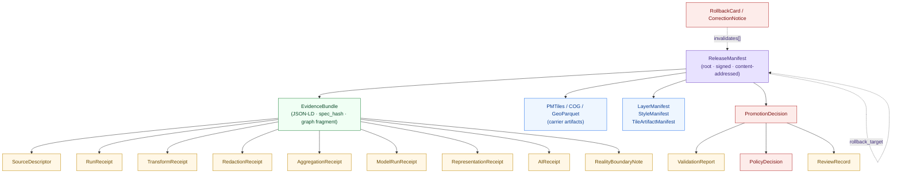
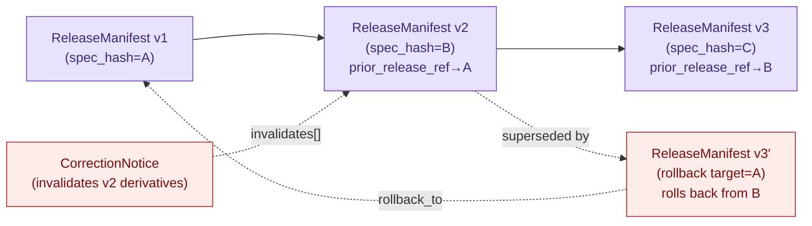

<!-- [KFM_META_BLOCK_V2]
doc_id: kfm://doc/architecture-release-model
title: Release Model — Architecture
type: standard
version: v1
status: draft
owners: <Release authority + Schema steward + Docs steward — TBD>
created: 2026-05-25
updated: 2026-05-25
policy_label: public
related:
  - docs/architecture/README.md
  - docs/architecture/release-discipline.md
  - docs/architecture/governed-api.md
  - docs/architecture/contract-schema-policy-split.md
  - docs/architecture/planetary-3d.md
  - docs/architecture/maplibre-3d.md
  - docs/architecture/people-place-joins.md
  - docs/doctrine/lifecycle-law.md
  - docs/doctrine/trust-membrane.md
  - docs/doctrine/truth-posture.md
  - docs/adr/README.md
  - docs/standards/PROV.md
  - docs/standards/SIGNING.md
tags: [kfm, architecture, release, data-model, content-addressing, receipts, evidence-bundle, supersession, spec-hash]
notes:
  - Repo not mounted in authoring session; all path claims are PROPOSED.
  - Companion to docs/architecture/release-discipline.md — same lane, different axis (model vs process).
  - PROV.md / PROVENANCE.md naming variance tracked at directory-rules §18 OPEN-DR-01.
[/KFM_META_BLOCK_V2] -->

# Release Model — Architecture

> A release is not an event — it is a **typed, content-addressed object graph**. This doc names the objects that participate, the identity rules that bind them, the references that connect them, and the supersession edges that let the graph evolve without losing audit. The process side lives in `docs/architecture/release-discipline.md`; this is the data side.


**Status** · draft &nbsp;·&nbsp; **Owners** · *Release authority + Schema steward + Docs steward — TBD* &nbsp;·&nbsp; **Updated** · 2026-05-25

---

## Quick jump

- [1. Scope and companion document](#1-scope-and-companion-document)
- [2. A release is an object graph](#2-a-release-is-an-object-graph)
- [3. Identity and content-addressing](#3-identity-and-content-addressing)
- [4. The master receipt catalog](#4-the-master-receipt-catalog)
- [5. Receipt × lifecycle phase](#5-receipt--lifecycle-phase)
- [6. Reference types](#6-reference-types)
- [7. The ReleaseManifest as graph root](#7-the-releasemanifest-as-graph-root)
- [8. Release-class shape variants](#8-release-class-shape-variants)
- [9. Delta and patch governance](#9-delta-and-patch-governance)
- [10. Supersession as graph evolution](#10-supersession-as-graph-evolution)
- [11. Schema homes](#11-schema-homes)
- [12. Worked example](#12-worked-example-illustrative)
- [13. Anti-patterns](#13-anti-patterns)
- [14. Verification backlog](#14-verification-backlog)
- [15. Related docs](#15-related-docs)

---

## 1. Scope and companion document

### 1.1 What this doc is

This document is the **data-model artifact for releases**: the object catalog, identity rules, reference types, content-addressing rules, schema-home conventions, and supersession graph that together describe what a KFM release **is** as a structured artifact. It is the static counterpart to `docs/architecture/release-discipline.md`, which describes the dynamic side (gates, separation of duties, workflows, anti-patterns).

| Axis | Doc |
|---|---|
| **Process** — gates, approvals, workflows, separation of duties, reason codes, rollback procedures | `docs/architecture/release-discipline.md` |
| **Model** — object catalog, identity, references, content-addressing, schema shape, supersession lineage | **this doc** |

The two are read together. A reviewer asking *"may this go out today?"* reaches for the discipline doc. A schema author or downstream consumer asking *"what fields must I emit / consume / verify?"* reaches for the model doc.

### 1.2 Non-goals

- This document does **not** define wire formats for any individual receipt; those live in `schemas/contracts/v1/receipts/...` (PROPOSED path; **NEEDS VERIFICATION** in mounted repo).
- This document does **not** describe gates, gate ordering, or separation of duties; see `docs/architecture/release-discipline.md`.
- This document does **not** describe the governed API; see `docs/architecture/governed-api.md` (PROPOSED).
- This document does **not** rename existing KFM object families. Names are stable vocabulary; renames go through ADR.

> [!IMPORTANT]
> Every object below is part of a single typed graph. `EvidenceRef` and other typed pointers in this model must **resolve** — not merely reference — the objects they point at. The Atlas §24.6.2 *universal closure rule* applies at the data layer: a release whose graph contains an unresolved reference is not yet a release.

---

## 2. A release is an object graph

### 2.1 The core picture

A KFM release is a `ReleaseManifest` at the root, with typed edges to every artifact, bundle, receipt, decision, and review record the release depends on. Each node is content-addressed; each edge is a typed, resolvable reference.



### 2.2 What that picture implies

- **The ReleaseManifest is the graph root.** Consumers bind to it; the rest is reachable from it. (See §7.)
- **EvidenceBundles carry the claim-bearing receipts.** Source identity, transform history, redaction, aggregation, model runs, representation, AI usage — all hang under bundles that the manifest references.
- **Decisions sit between artifacts and process.** PolicyDecision, PromotionDecision, and their cousins record *why* the manifest was allowed to ship; ValidationReport and ReviewRecord record *who and what* validated it.
- **Correction and rollback are typed back-edges**, not destructive operations. They reach into the graph and mark invalidation; they never overwrite history.

---

## 3. Identity and content-addressing

### 3.1 The deterministic-basis rule

**PROPOSED deterministic basis** (uniform across every object family in the Atlas):

```text
object_id = digest(
  source_id          : str   # source-ledger id (when applicable)
  object_role        : enum  # observed | regulatory | modeled |
                             # aggregate | administrative |
                             # candidate | synthetic
  temporal_scope     : str   # ISO interval / fuzzy interval / "unknown"
  normalized_digest  : hex   # canonicalized canonical-form digest of payload
)
```

This is the same recipe used for every domain object family; releases use it for their own root.

### 3.2 Canonicalization: JCS+SHA-256 is the default

**CONFIRMED doctrine** (Pass-10 C1-02; C4-04; C8-04; C8-05):

| Canonicalization | When to use | Status |
|---|---|---|
| **RFC 8785 JCS + SHA-256** | Default for JSON payloads (manifests, receipts, bundles' JSON layer) | **CONFIRMED default** |
| **W3C URDNA2015 + SHA-256** | When RDF-semantic equivalence is needed (graph-layer claims with multiple syntactic JSON-LD forms) | **CONFIRMED conditional** |

The two **can disagree for the same logical bundle** — the corpus is explicit that the choice has policy and reproducibility implications (Pass-10 C8-05). A bundle's `spec_hash` is computed from exactly one canonicalization path, recorded in the bundle, and never re-computed under the other.

### 3.3 `spec_hash` is the universal address

Every consequential object in the release graph carries a `spec_hash` field whose value is the canonicalized content digest of the object. This is the same value that:

- Appears as the object's `kfm:spec_hash` in JSON-LD form.
- Becomes the path in a content-addressed store (`kfm://entity-bundle/<sha256>`, `oci://<registry>/<repo>@sha256:<digest>`, `ipfs://<cid>`).
- Is recorded in the `ReleaseManifest.contents[]` entry for the object.
- Is what a consumer pins to and a verifier recomputes.

### 3.4 The `manifestSpecHash` exclusion

**CONFIRMED doctrine** (Master MapLibre ML-M-046): the `manifestSpecHash` field of a manifest must be computed over the manifest *with the `spec_hash` field itself excluded* — otherwise the hash includes the hash and computation is non-terminating. The exclusion is performed at canonicalization time, before the SHA-256 step.

> [!CAUTION]
> Content-addressing is what makes releases *reversible*. Floating pointers (`latest`, branch tips, mutable URLs) defeat reversibility and are forbidden as consumer-binding targets (see `docs/architecture/release-discipline.md` §5.3). The governed API may *resolve* `latest` at request time; the receipt records the resolved `spec_hash`.

---

## 4. The master receipt catalog

**CONFIRMED doctrine** (Atlas §24.2.1): A receipt is a structured, persisted record of a specific governed operation, with enough context for audit and rollback. *The receipt is never optional when the operation is consequential; if no receipt exists, the operation did not happen in the governed sense.*

### 4.1 The catalog

| Receipt | Purpose | Triggered by | Required content (PROPOSED shape) |
|---|---|---|---|
| **SourceDescriptor** | Records source identity, rights, role, sensitivity, cadence at admission *(anchor of every downstream receipt; not strictly a receipt itself)* | Source admission | `source_id`, `source_role`, `authority`, `rights`, `sensitivity`, `cadence`, `ingest_hash`, `time`, `citation` |
| **TransformReceipt** | Records a spatial or attribute transform (reprojection, generalization, snap, simplification) | Geometry normalization, projection, generalization | `input_geom_hash`, `output_geom_hash`, `transform`, `parameters`, `tolerance`, `timestamp`, `actor` |
| **RedactionReceipt** | Records a public-safe transformation that removed, masked, fuzzed, or withheld content for sensitivity, rights, or policy | Sensitive-domain publication (living-person, rare-species, archaeology coords, infrastructure detail) | `policy_ref`, `redaction_method`, `kept_fields`, `removed_fields`, `geometry_transform`, `reviewer` |
| **AggregationReceipt** | Records an aggregation step and pins the geometry scope | Aggregate publication; matrix-cell computation | `geometry_scope`, `time_scope`, `aggregation_method`, `input_source_refs`, `suppression_rule`, `output_unit` |
| **ModelRunReceipt** | Records a modeled output: model identity, version, inputs, parameters, uncertainty, validation | Modeled product publication; suitability surface; smoke trajectory; restoration model | `model_id`, `model_version`, `inputs[]`, `parameters`, `run_time`, `uncertainty_surface_ref`, `validation_ref` |
| **RepresentationReceipt** | Records a representation step where surface fidelity differs from evidence fidelity | 3D scene publication; tile/PMTiles export; visual-only generalization | `evidence_ref`, `representation_method`, `parameters`, `reality_boundary_note_ref` |
| **AIReceipt** | Records a governed AI answer: prompt scope, evidence used, policy decision, outcome class, abstention/denial reason | Any Focus Mode answer; any AI-drafted note or summary | `prompt_scope`, `evidence_refs[]`, `policy_ref`, `outcome`, `reason_code`, `model_id`, `time` |
| **ReviewRecord** | Records a steward, rights-holder, or policy review of a candidate transition | Promotion gate; sensitive-lane publication; correction acceptance | `reviewer`, `role`, `decision`, `evidence_refs[]`, `policy_ref`, `time` |
| **PolicyDecision** | Records a policy evaluation: which rule, against which object, with which outcome | Every governed gate; rights / sensitivity / release checks | `policy_id`, `target_object`, `decision`, `reason_code`, `time`, `evidence_refs[]` |
| **ValidationReport** | Records the outcome of a validator run | WORK promotion; PROCESSED → CATALOG; release closure | `validator_id`, `target`, `passes[]`, `failures[]`, `time`, `deterministic_inputs` |
| **PromotionDecision** | Records the promotion-gate result with gate IDs, inputs, proofs, release target, rollback target | Catalog → PUBLISHED transition | `gate_ids[]`, `inputs[]`, `proofs[]`, `release_target`, `rollback_target` |
| **PromotionReceipt** | Records that the PromotionDecision's gates were satisfied at the transition moment | Promotion to PUBLISHED | `decision_ref`, `gate_outcomes[]`, `signer_identity`, `time` |
| **ReleaseManifest** | Records the contents, version, signatures, and rollback target for a release | PUBLISHED transition | `release_id`, `contents[]`, `digests`, `evidence_refs[]`, `rollback_target`, `time`, signatures |
| **CorrectionNotice** | Records that a published claim was corrected: what changed, why, what derivatives were invalidated | Post-publication correction | `claim_ref`, `prior_release_ref`, `change_summary`, `invalidates[]`, `review_ref`, `time` |
| **RollbackCard** | Records a rollback decision and the targeted prior release | Failed release; correction | `release_id`, `rollback_to`, `reason`, `invalidates[]`, `review_ref`, `time` |
| **RealityBoundaryNote** | Public-facing or steward-facing statement that a carrier is synthetic or reconstructed and not direct evidence | Synthetic surfaces; reconstructed scenes; AI-drafted text | `scope`, `method_summary`, `evidence_refs[]`, `visibility` |
| **MatrixCellReceipt** | Records the inputs, definitions, geography version, and uncertainty of a single Frontier Matrix cell | Matrix-cell publication | `cell_id`, `definition_ref`, `geography_version`, `inputs[]`, `uncertainty`, `review_ref` |
| **StorySnapshot / ExportReceipt** | Records the evidence, redactions, and release state at the moment of a story / export / atlas snapshot | Story or export publication | `snapshot_id`, `evidence_refs[]`, `redactions[]`, `release_refs[]`, `rollback_target`, `time` |
| **VerifyReceipt** | Runtime verification receipt for tile activation | Tile activation on client | `digest_verified`, `bounds_verified`, `schema_verified`, `root_hash`, `tileset`, `capability_issued` |
| **RuntimeProbeResult** | Probe result for renderer/tile runtime budgets | Pre-release runtime check | `decode_latency`, `hash_throughput`, `heap_growth`, `token_latency`, `device_profile`, `pass_fail` |
| **CitationValidationReport** | Pass/fail citation closure object for Focus Mode, Story Nodes, popups, exports | Catalog / Release / Focus Mode | claim ↔ citation pass/fail with missing/stale evidence enumeration |
| **EventRunReceipt** | Pre-RAW watcher event admission *(out-of-spine; tracked under KFM-IDX-EVT-* Pre-RAW Event Family)* | Watcher event admission | Pre-RAW event envelope fields |

### 4.2 EvidenceBundle: the carrier of carriers

**CONFIRMED doctrine** (Pass-10 C4-04, C8-04): An EvidenceBundle is a JSON-LD document that packages a graph fragment (persons, places, events, claims), the run receipts that justify each claim, and the authority crosswalks (Wikidata, LCNAF, GNIS, ITIS, …). It is content-addressed by `spec_hash`. It is *the* unit of publication for graph-layer assertions.

Inside a bundle:

| JSON-LD field | What it carries |
|---|---|
| `kfm:id` | The bundle's identity (equal to its `spec_hash`) |
| `kfm:spec_hash` | Canonicalized content digest |
| `kfm:entities` | Graph nodes (persons, events, places, …) |
| `kfm:sources` | Source citations with URLs, licenses, fetch times |
| `prov:wasGeneratedBy` | The PROV-O Activity that produced the bundle |
| `kfm:run_receipt_ref` | Pointer to the immutable RunReceipt |
| `kfm:evidence_ref` | Where a STAC or DCAT record references the bundle by content address |

A consumer who fetches the bundle by `spec_hash` can verify it offline.

---

## 5. Receipt × lifecycle phase

**CONFIRMED doctrine** (Atlas §24.2.2): receipts are emitted, amended, or referenced at specific lifecycle phases. The dot in each cell means the receipt is normally present at that phase. Receipts created earlier remain *referenced* at later phases via `EvidenceRef` — never duplicated.

| Receipt | RAW | WORK / QUARANTINE | PROCESSED | CATALOG / TRIPLET | PUBLISHED |
|---|---|---|---|---|---|
| SourceDescriptor | • | • | • | • | • |
| TransformReceipt | | • | • | • | |
| RedactionReceipt | | | • | • | • |
| AggregationReceipt | | | • | • | • |
| ModelRunReceipt | | | • | • | • |
| RepresentationReceipt | | | | • | • |
| AIReceipt | | | | | • *(Focus Mode only)* |
| ReviewRecord | | • | • | • | |
| PolicyDecision | • | • | • | • | • |
| ValidationReport | | • | • | • | |
| ReleaseManifest | | | | | • |
| CorrectionNotice | | | | | • |
| RollbackCard | | | | | • |
| RealityBoundaryNote | | | • | • | • |
| MatrixCellReceipt | | | | • | • |
| StorySnapshot | | | | | • |

> [!TIP]
> The mapping is doctrinal because it constrains the receipt graph: a `RedactionReceipt` produced in WORK is *not* the same kind of artifact as one produced at PUBLISHED. The producer phase becomes part of the receipt's audit trail, and consumers downstream can ask "which receipts were present at which phase" to detect promotion shortcuts.

---

## 6. Reference types

The release graph uses a small, typed set of references. Each one has a **source field**, a **target type**, and a **resolution rule**.

| Reference field | Points at | Resolution rule |
|---|---|---|
| `EvidenceRef` / `kfm:evidence_ref` | EvidenceBundle | Must resolve to a fetchable bundle whose recomputed `spec_hash` matches the reference's expected digest |
| `source_id` | SourceDescriptor | Must resolve to the canonical descriptor in the source register |
| `model_id` | ModelRunReceipt | Must resolve to a ModelRunReceipt whose `model_version` matches |
| `policy_id` / `policy_ref` | PolicyDecision (or policy bundle) | Must resolve to the policy whose digest was pinned at decision time |
| `validator_id` | ValidationReport | Must resolve to the validator whose deterministic inputs are recorded |
| `prior_release_ref` | ReleaseManifest | Must resolve to a prior manifest in the release history |
| `rollback_to` / `rollback_target` | ReleaseManifest | Must resolve to a prior manifest still validly reachable from the current rollback chain |
| `claim_ref` | The corrected claim within an EvidenceBundle | Must resolve to a specific node within a specific bundle |
| `invalidates[]` | Set of derivative artifacts (tiles, layers, stories, exports, AIReceipts) | Every element must resolve to a known artifact |
| `reality_boundary_note_ref` | RealityBoundaryNote | Must resolve when the receipt's `source_role` is `synthetic` or `modeled` |
| `delta_base_hash` | A prior tile / PMTiles artifact | Must resolve to a parent artifact whose digest matches |

### 6.1 The "resolves, not just references" rule

**CONFIRMED doctrine** (Atlas §24.6.2): A transition (and therefore a release manifest at the data layer) is closed only when *every required artifact resolves — not merely references — the artifacts it depends on*. The data-model implication: a `ReleaseManifest` whose `evidence_refs[]` contains even one unresolvable pointer is **not a valid release manifest**, even if it parses against the schema. The schema catches shape; resolution catches reality.

### 6.2 What "resolve" means operationally

A reference resolves when:

1. The target exists at the named content-addressed location.
2. Its recomputed `spec_hash` matches the reference's expected digest.
3. It is not tombstoned (see §10).
4. The dependency cycle is acyclic (a release manifest cannot transitively reference itself).

---

## 7. The ReleaseManifest as graph root

### 7.1 Identity

**CONFIRMED doctrine** (Atlas KFM-P7-PROG-0003 *ReleaseManifest as the publishable artifact*, NI-425): *When the gate allows promotion to PUBLISHED, it emits a ReleaseManifest: a single, signed, hashable JSON object listing every dataset, bundle, and tile archive included in the release.*

### 7.2 Required content (PROPOSED shape)

| Field | Purpose |
|---|---|
| `release_id` | Stable identifier for this release |
| `spec_hash` | Self-digest (excluding the `spec_hash` field itself; see §3.4) |
| `contents[]` | List of every dataset, bundle, tile archive, layer manifest, with stable IDs |
| `digests` | `spec_hash` per element in `contents[]` |
| `evidence_refs[]` | Pointers to backing EvidenceBundles |
| `policy_decision_ref` | The PolicyDecision authorizing the release |
| `promotion_decision_ref` | The PromotionDecision recording gate outcomes |
| `review_record_ref` | The ReviewRecord if materiality required one |
| `rollback_target` | Stable ID of the prior release this one can revert to |
| `correction_path` | How a correction will be issued (`supersession` vs `in-place amendment`) |
| `signatures` | cosign / DSSE signatures |
| `signer_identity` | Release-authority identity binding |
| `time` | UTC timestamp of release decision |
| `release_index_entries[]` | Pass 15 addendum: per-content entries with `dataset_id`, `spec_hash`, `run_receipt`, `SPDX`, `timestamp`, `evidence_bundle_digest` |
| `prior_release_ref` | Pointer to the prior release in the sequence (forms the release chain) |

### 7.3 The ReleaseManifest ↔ delta_manifest relationship

**PROPOSED disposition** (Atlas KFM-P7-PROG-0003 expansion direction): *Define the ReleaseManifest as the union of the included delta_manifest references; the delta manifest is per-product, the release manifest is per-release.*

| Object | Granularity | Lives in |
|---|---|---|
| `ReleaseManifest` | Per-release (the envelope) | `release/manifests/` |
| `delta_manifest` / `TileArtifactManifest` | Per-product (one tile artifact, one PMTiles archive, one COG) | `data/published/.../` (PROPOSED) |
| `LayerManifest` | Per-layer composition | `data/published/.../` (PROPOSED) |
| `StyleManifest` | Per-style | `data/published/.../` (PROPOSED) |
| `MapReleaseManifest` | Per-map release; subtype of `ReleaseManifest` | `release/manifests/` |

This **PROPOSED** layering resolves the corpus's note that "the relationship between a ReleaseManifest and a delta_manifest (per-tile-set) is not fully resolved; both exist in the corpus and overlap." The disposition above keeps both, with the manifest as union.

---

## 8. Release-class shape variants

Different release classes specialize the ReleaseManifest with class-specific required content. Each variant is **PROPOSED** unless otherwise noted.

| Variant | Class-specific required content |
|---|---|
| **Data release** | At least one EvidenceBundle; one or more dataset entries with `dataset_id` + `spec_hash` |
| **Map release** *(`MapReleaseManifest`)* | At least one LayerManifest, StyleManifest, and TileArtifactManifest; plugin-pin attestation; render-budget probe result |
| **Scene release** *(`SceneManifest` envelope)* | At least one Scene Manifest; Reality Boundary Note for any synthetic input; 3D Admission Decision; plugin-admission attestation |
| **Frontier Matrix release** *(`MatrixReleaseManifest`)* | At least one MatrixCellReceipt; GeographyVersion pin; AggregationReceipt per matrix cell that computed from underlying records |
| **AI release** | An `AIReceipt` per published Focus Mode template; CitationValidationReport pass; AI surface steward review |
| **Story / Export release** | StorySnapshot or ExportReceipt; embedded `release_refs[]` pointing to the data releases the story / export cites |

> [!NOTE]
> Variants do not relax the base requirements. A scene release still needs an EvidenceBundle for every scene component; an AI release still needs the underlying data releases to be in PUBLISHED state. Variants *add* requirements; they never remove them.

---

## 9. Delta and patch governance

**CONFIRMED doctrine** (Atlas KFM-P28-IDEA-0015 *PMTiles delta and patch governance*; KFM-P5-PROG-0003 *DeltaTileIndex with BAO/BLAKE3 verified streaming*; KFM-P28-PROG-0020 `pmtiles_delta_manifest.schema.json`): When publication moves through deltas rather than full re-pushes, the delta itself is a typed object with its own identity and validation rules.

### 9.1 DeltaTileIndex shape (PROPOSED, KFM-P5-PROG-0003)

```text
{
  "object_type": "DeltaTileIndex",
  "schema_version": "v1",
  "tileset":   "<tileset_id>",
  "spec_hash": "<JCS+SHA-256 over the index minus this field>",
  "chunks": [
    {"id": "<chunk_id>", "offset": <int>, "length": <int>, "blake3": "<hex>"}
  ],
  "root_hash":        "<BAO root over the artifact bytes>",
  "delta_base_hash":  "<spec_hash of the parent artifact>",
  "byte_ranges_manifest": "<incremental patch verification info>"
}
```

### 9.2 Required edges from delta to manifest

| Edge | Rule |
|---|---|
| `delta_base_hash` → parent artifact | **PROPOSED required** (KFM-P28-IDEA-0015): patches lacking base-hash linkage are denied at the validator |
| Delta → enclosing `ReleaseManifest` | The release manifest must list the delta by `spec_hash` in `contents[]` and reference its `delta_base_hash` in the chain |
| Delta → `RunReceipt` for the build | `verify_status`, `verify_time_ms`, `root_hash` must be recorded |
| Delta → cosign signature | The DeltaTileIndex (or its sidecar) must be cosign-signed before publication |

### 9.3 What clients verify at activation

**PROPOSED runtime contract** (KFM-P5-PROG-0003): A client receives the sidecar, recomputes `BLAKE3` over fetched byte ranges, checks against the `root_hash`, and emits a `VerifyReceipt` (`{digest_verified, bounds_verified, schema_verified, root_hash, tileset, capability_issued}`). Activation is forbidden if verification fails.

---

## 10. Supersession as graph evolution

**CONFIRMED doctrine** (Atlas §24.8.2): A release is not a leaf in the graph — it is a node with both forward edges (to its contents) and a chain of past versions. Supersession is how the graph evolves without losing audit.

### 10.1 The supersession rules per object class

| Object class | Supersession rule | Required lineage artifact |
|---|---|---|
| **SourceDescriptor** | Replaced by newer descriptor; old retained with `superseded_by` link | Supersession entry in source register |
| **EvidenceBundle** | Replaced when corrected; old retained for audit | EvidenceBundle + CorrectionNotice + supersession link |
| **GeographyVersion** | Replaced by newer version; both versions remain queryable for time-bound claims | Version register entry + crosswalk |
| **Schema** (under `schemas/contracts/v1/...`) | Replaced via ADR; old retained | ADR + supersession link in schema header |
| **Policy** | Replaced via accepted ADR; old retained | ADR + supersession link |
| **ReleaseManifest** | Replaced by next release; rollback target remains valid | Manifest history + rollback chain |
| **AIReceipt** | **Never superseded retroactively.** Old answer retained; new answer is a **new** receipt | Two distinct AIReceipts with cross-reference |
| **Atlas / supplement** | Superseded by ADR-recorded new version; lineage retained | Supersession appendix in new edition |

### 10.2 The release chain



### 10.3 Tombstone as a typed object

**CONFIRMED doctrine** (Pass-10 C5-09 *Tombstones for Reversible Revocation*): A revocation is **a new typed object**, not a deletion. The tombstone is appended to the ledger and:

| Field | Purpose |
|---|---|
| `retracted_object_ref` | The object being retracted |
| `reason` | Why it was retracted |
| `superseded_by` | Pointer to the replacement object, if any |
| `signer_identity` | Who authorized the tombstone |
| `time` | UTC timestamp |

UI and API clients hide tombstoned items from public views; lineage and audit remain explorable.

---

## 11. Schema homes

**PROPOSED schema-home convention** (Atlas §24.2 *PROPOSED schema home: each receipt class should be under `schemas/contracts/v1/receipts/` unless an ADR relocates it*; directory-rules §18.e OPEN-DR-13; KFM Encyclopedia §5.3):

| Object family | Proposed home |
|---|---|
| All receipts (SourceDescriptor, RunReceipt, TransformReceipt, RedactionReceipt, AggregationReceipt, ModelRunReceipt, RepresentationReceipt, AIReceipt, ReviewRecord, ValidationReport, CitationValidationReport, …) | `schemas/contracts/v1/receipts/` |
| Decision objects (PolicyDecision, PromotionDecision, PromotionReceipt) | `schemas/contracts/v1/policy/` |
| Release-envelope objects (ReleaseManifest, MapReleaseManifest, RollbackCard, CorrectionNotice, WithdrawalNotice) | `schemas/contracts/v1/release/` |
| Evidence objects (EvidenceBundle, EvidenceRef) | `schemas/contracts/v1/evidence/` |
| Map / renderer artifacts (LayerManifest, StyleManifest, TileArtifactManifest, SceneManifest, TerrainModel, SyntheticSurface, ViewState, CameraPath) | `schemas/contracts/v1/maplibre/` |
| 3D / asset artifacts (3DTileSet, glTFAsset, PointCloud, DigitalTwinView, RealityBoundaryNote, 3DAdmissionDecision) | `schemas/contracts/v1/3d/` |
| Delta / patch artifacts (DeltaTileIndex, pmtiles_delta_manifest) | `schemas/contracts/v1/release/delta/` *(PROPOSED sub-home)* |
| Frontier Matrix artifacts (MatrixCellReceipt, GeographyVersion, CountyYearPanel) | `schemas/contracts/v1/matrix/` *(PROPOSED)* |
| Source-watch / Pre-RAW events | `schemas/contracts/v1/intake/` *(PROPOSED)* |
| Story / export artifacts (StorySnapshot, ExportReceipt) | `schemas/contracts/v1/story/` *(PROPOSED)* |

All homes are **PROPOSED** until verified in a mounted repo. The split between `maplibre/` and `3d/` is **PROPOSED** and tracked as directory-rules §18.e **OPEN-DR-13**.

---

## 12. Worked example (illustrative)

> [!NOTE]
> The example below is **illustrative**, not drawn from a real release. Object IDs and digests are placeholders.

A single Map release for a hypothetical *Cottonwood Falls 1888 — Settlements layer* might decompose into the following object graph:

```text
ReleaseManifest                  release_id=rel-2026-05-24-001
  spec_hash                      sha256:aaaa...
  prior_release_ref              rel-2026-04-12-003
  rollback_target                rel-2026-04-12-003
  promotion_decision_ref         pd-2026-05-24-001
  policy_decision_ref            polD-2026-05-24-001
  review_record_ref              rev-2026-05-24-001
  signer_identity                <release-authority-id>
  contents[]:
    ├── EvidenceBundle           bundle-cottonwood-1888  spec_hash=sha256:bbbb...
    │     ├── SourceDescriptor   src-fed-census-1890     (role=observed)
    │     ├── SourceDescriptor   src-kshs-newspaper-1888 (role=administrative)
    │     ├── RunReceipt         run-2026-05-23-014
    │     ├── TransformReceipt   tr-geom-reproject-001
    │     ├── ValidationReport   val-2026-05-24-007  (passes[]=...)
    │     ├── PolicyDecision     polD-bundle-2026-05-24
    │     └── (CRM/PROV-O graph fragment with E5 Event, E21 Person, E53 Place)
    ├── LayerManifest            lm-settlements-1888-v3  spec_hash=sha256:cccc...
    │     ├── plugin_dependencies: pinned
    │     ├── projection_compatibility: globe + mercator
    │     └── evidence_refs[]   → EvidenceBundle bundle-cottonwood-1888
    ├── StyleManifest            sm-settlements-historical-v2  spec_hash=sha256:dddd...
    ├── TileArtifactManifest     pmtiles-settlements-1888.delta
    │     ├── delta_base_hash    sha256:<parent-artifact-digest>
    │     ├── root_hash          <BAO root>
    │     └── verify_receipt_ref vr-2026-05-24-002
    └── ReviewRecord             rev-2026-05-24-001  (steward + release authority)
```

A consumer pinning to `release_id=rel-2026-05-24-001` and `spec_hash=sha256:aaaa...` records exactly the manifest above. A later rollback to `rel-2026-04-12-003` is reachable through the manifest's `rollback_target` and through every prior manifest's `prior_release_ref`. A correction issued tomorrow becomes `rel-2026-05-25-001` with `prior_release_ref=rel-2026-05-24-001`, leaving today's release queryable forever via its digest.

---

## 13. Anti-patterns

<details>
<summary><strong>Click to expand: catalog of release-model anti-patterns</strong></summary>

| Anti-pattern | Why it fails | Counter-rule |
|---|---|---|
| **Reference present, target missing** | Manifest parses but graph does not close | "Resolves, not just references" rule (§6.1) |
| **`spec_hash` computed without canonicalization** | Two clients get different digests for the same bundle; verification breaks | JCS+SHA-256 default; URDNA2015 only when RDF semantics required; choice recorded in the object |
| **`spec_hash` field included in its own hash input** | Computation non-terminating | `manifestSpecHash` exclusion at canonicalization time (§3.4) |
| **`latest` pointer recorded as consumer binding** | Defeats content-addressing; rollback becomes destructive | Bind to `spec_hash`; resolve `latest` only inside governed API |
| **Receipt overwritten in place** | Audit trail destroyed | Receipts are content-addressed and immutable; corrections produce *new* receipts with `superseded_by` |
| **AIReceipt retroactively edited to "match" newer evidence** | Destroys the historical record of what the AI could say when | A new answer is a **new** AIReceipt; old retained with cross-reference (§10.1) |
| **EvidenceBundle without `prov:wasGeneratedBy`** | Claim cannot answer "why do you say that"; provenance unwitnessed | PROV-O graph-layer policy gate fails closed on missing provenance |
| **Delta without `delta_base_hash`** | Patch chain broken; client cannot verify lineage | Validator denies patches lacking base-hash linkage (KFM-P28-IDEA-0015) |
| **Renderer-shaped artifact landing in `schemas/contracts/v1/3d/`** (or vice versa) | Schema-home boundary blurred; OPEN-DR-13 unresolved | Apply §11 split; resolve via ADR |
| **ReleaseManifest without `rollback_target`** | Release cannot be reversed | Release gate fails closed; reason code `ROLLBACK_TARGET_MISSING` |
| **Tombstone implemented as hard delete** | Investigators cannot trace what was retracted | Tombstone is a typed object (§10.3); erasure only when legally required |
| **Multiple manifests claim the same `release_id`** | Release identity collision; consumers cannot pin | `release_id` is unique; supersession uses new `release_id` + `prior_release_ref` link |
| **`evidence_refs[]` points at a tombstoned bundle** | Bundle hidden but still authoritative-by-pointer | Tombstone surfaces at resolution; manifest using tombstoned bundle fails closed |
| **Manifest signed but `policy_decision_ref` missing** | Attestation without authorization | Signature is necessary but not sufficient; PolicyDecision must accompany |

</details>

---

## 14. Verification backlog

| Item | Evidence that would settle it | Status |
|---|---|---|
| `schemas/contracts/v1/release/release_manifest.schema.json` present with §7.2 field set | Mounted schema file | **NEEDS VERIFICATION** |
| `schemas/contracts/v1/release/rollback_card.schema.json` present | Mounted schema file | **NEEDS VERIFICATION** |
| `schemas/contracts/v1/release/correction_notice.schema.json` present | Mounted schema file | **NEEDS VERIFICATION** |
| `schemas/contracts/v1/receipts/` directory present with one schema per receipt class in §4.1 | Mounted directory tree | **NEEDS VERIFICATION** |
| `schemas/contracts/v1/evidence/evidence_bundle.schema.json` present with §4.2 JSON-LD field set | Mounted schema file | **NEEDS VERIFICATION** |
| `schemas/contracts/v1/release/delta/pmtiles_delta_manifest.schema.json` present | Mounted schema file | **NEEDS VERIFICATION** |
| ADR confirming JCS+SHA-256 vs URDNA2015 default canonicalization (Pass-10 C8-05) | Accepted ADR | **PROPOSED** |
| ADR formalizing `manifestSpecHash` self-exclusion rule (§3.4) | Accepted ADR | **PROPOSED** |
| ADR resolving the ReleaseManifest ↔ delta_manifest layering (§7.3) | Accepted ADR | **PROPOSED** |
| ADR resolving schemas/contracts/v1/maplibre/ vs /3d/ split (directory-rules §18.e OPEN-DR-13) | Accepted ADR | **PROPOSED open** |
| `kfm:` namespace IRI base and versioning strategy (Pass-10 C.3 item 1) | Accepted ADR | **UNKNOWN** |
| Versioned EvidenceBundle schema (`kfm-bundle/1.0`) and reference verifier shipped in Python + Go (Pass-10 C8-04 expansion) | Schema + tools | **PROPOSED** |
| Reference resolution verifier ("resolves, not just references") wired in CI (§6.1) | CI workflow + integration test | **PROPOSED** |
| `release_index_entries[]` Pass 15 addendum fields confirmed in schema | Mounted schema | **NEEDS VERIFICATION** |
| StorySnapshot / ExportReceipt schema home and retention policy (ADR-S-11) | Accepted ADR | **PROPOSED open** |
| Stale-state propagation cross-lane rule (ADR-S-10) | Accepted ADR | **PROPOSED open** |
| This file's canonical path `docs/architecture/release-model.md` | Mounted `docs/architecture/` tree + README index | **PROPOSED** |

> [!NOTE]
> All file paths in this document are **PROPOSED** per directory-rules. Verify against a mounted repo before linking from neighboring docs.

[Back to top](#release-model--architecture)

---

## 15. Related docs

- `docs/architecture/README.md` — architecture index *(TODO: link verify)*
- `docs/architecture/release-discipline.md` — process companion: gates, separation of duties, workflows *(authored prior; PROPOSED path)*
- `docs/architecture/governed-api.md` — the surface that resolves manifests for public clients *(PROPOSED)*
- `docs/architecture/contract-schema-policy-split.md` — meaning vs shape vs admissibility *(PROPOSED)*
- `docs/architecture/planetary-3d.md` — Scene Manifest / Reality Boundary Note specifics *(authored prior; PROPOSED path)*
- `docs/architecture/maplibre-3d.md` — renderer-side LayerManifest / StyleManifest / TileArtifactManifest realization *(authored prior; PROPOSED path)*
- `docs/architecture/people-place-joins.md` — sibling lane doc; join releases sit on this model *(authored prior; PROPOSED path)*
- `docs/doctrine/lifecycle-law.md` — RAW → PUBLISHED governance *(PROPOSED)*
- `docs/doctrine/trust-membrane.md` — public-path constraints *(PROPOSED)*
- `docs/doctrine/truth-posture.md` — cite-or-abstain default *(PROPOSED)*
- `docs/standards/PROV.md` — W3C PROV-O + PAV profile *(CONFIRMED authored prior; naming variance vs `PROVENANCE.md` tracked at directory-rules §18 OPEN-DR-01)*
- `docs/standards/SIGNING.md` — signing and attestation profile *(PROPOSED in corpus Pass-10 C1-03; not yet authored)*
- `directory-rules.md` — root-folder authority boundaries

---

<sub>Last updated · 2026-05-25 &nbsp;·&nbsp; Doc class · architecture &nbsp;·&nbsp; Status · draft &nbsp;·&nbsp; <a href="#release-model--architecture">Back to top ↑</a></sub>
