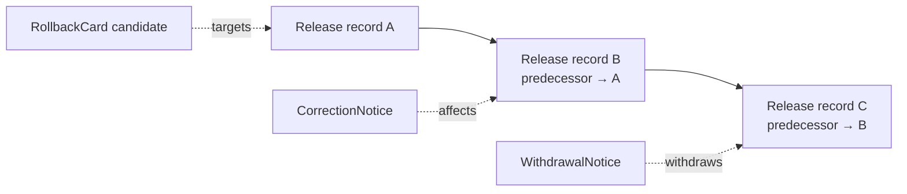

<!-- [KFM_META_BLOCK_V2]
doc_id: kfm://doc/architecture-release-model
title: Release Model — Current Repository Architecture and Graduation Boundary
type: architecture
version: v2.0
status: draft; repository-grounded; explanatory; mixed-maturity; non-authoritative; operational-release-hold
owners:
  - "@bartytime4life — current CODEOWNERS review route"
  - "NEEDS VERIFICATION — independent release, evidence, policy, review, correction, rollback, contracts, schemas, validation, security, and operations stewardship"
created: 2026-05-25
updated: 2026-08-19
policy_label: public; architecture; release-model; candidate-is-not-release; evidence-bound; correction-aware; rollback-aware; non-publication
current_path: docs/architecture/release-model.md
owning_root: docs/
responsibility: >-
  Explain how current KFM release-related contracts, schemas, candidate profiles,
  references, digests, decisions, receipts, proofs, release records, published
  carriers, correction, withdrawal, and rollback surfaces compose without
  transferring authority among their owning responsibility roots.
truth_posture: >-
  CONFIRMED current path, accepted Directory Rules v2 placement authority,
  current ReleaseManifest contract/schema/validator/test/workflow surface,
  bounded PromotionReceipt and RollbackCard profiles, publication-denial dry run,
  canonical release decision root, and current content-hash implementation /
  PROPOSED production ReleaseManifest profile, operational reference resolution,
  authenticated review and signing, accepted promotion sequence, applied release
  transition, correction propagation, rollback execution, and public consumers /
  CONFLICTED publication-document overlap, A-G gate vocabularies, release-manifest
  collection paths, permissive legacy schema branch, and CorrectionNotice family
  placement / UNKNOWN first governed production release, active release alias,
  deployed release registry, complete consumer closure, runtime parity, and public
  release behavior / NEEDS VERIFICATION exact-head hosted checks, independent
  stewards, required-check coupling, accepted policy evaluator, signing trust root,
  production storage, and recovery evidence.
evidence_snapshot:
  repository: bartytime4life/Kansas-Frontier-Matrix
  base_ref: main
  base_commit: 7ef1597779774d80346f81ecd8104b720797c587
  target_prior_blob: 196b69d3d2eb66a526248ce24400d4270f880c92
  directory_rules_decision: ADR-0029 accepted
  release_manifest_schema_blob: c76cd9bdddb34cf33c8eb62801269553726c5923
  release_manifest_validator_blob: 00307dc0d5e2c3867a229076e3702f8111455425
  release_manifest_test_blob: eff34352614a0c03c7ff8b326f83fa9699525e98
  release_manifest_workflow_blob: 91d9a995328f8d162121341ed265fa87781be4e8
  promotion_receipt_contract_blob: ed432f8e3e02d170589c9e04d78087a69346909d
  promotion_receipt_schema_blob: b9819cc92303aae5b4ab17f0ec9aac48ca236d10
  rollback_card_contract_blob: c6d3c35c56b064e04c3a2532f4709d938d7b0c1a
  publication_denial_tool_blob: 5fed3a16aa0915b9233861048fc6a1e676e0ed8f
  release_dry_run_workflow_blob: 8f76d1011b80769952a0a6561ed7e5cd963bf8c9
related:
  - ./README.md
  - ./document-convergence-plan.md
  - ./release-discipline.md
  - ./identity-and-spec-hash.md
  - ./contract-schema-policy-split.md
  - ./publication/README.md
  - ./publication/release-objects.md
  - ../doctrine/lifecycle-law.md
  - ../doctrine/trust-membrane.md
  - ../doctrine/directory-rules.md
  - ../adr/ADR-0013-spec_hash-and-run_id-identity-grammar.md
  - ../adr/ADR-0018-promotion-gate-sequence.md
  - ../adr/ADR-0029-adopt-directory-governance-standard-v2.md
  - ../standards/RELEASE_MANIFEST.md
  - ../../contracts/release/README.md
  - ../../contracts/release/release_manifest.md
  - ../../contracts/release/promotion_receipt.md
  - ../../contracts/release/rollback_card.md
  - ../../contracts/correction/correction_notice.md
  - ../../schemas/contracts/v1/release/release_manifest.schema.json
  - ../../schemas/contracts/v1/release/promotion_receipt.schema.json
  - ../../policy/release/README.md
  - ../../release/README.md
  - ../../tools/validators/release/validate_release_manifest.py
  - ../../tools/release/release_dry_run.py
  - ../../tests/validators/test_validate_release_manifest.py
  - ../../.github/workflows/release-manifest.yml
  - ../../.github/workflows/release-dry-run.yml
tags: [kfm, architecture, release, release-manifest, promotion-receipt, rollback-card, identity, evidence, receipts, proofs, correction, publication, fail-closed]
notes:
  - "v2.0 replaces the May 2026 proposal-only object-graph description with a current-repository architecture explanation and explicit graduation boundary."
  - "The existing tracked path is preserved. The architecture convergence plan's future publication-lane migration remains HOLD and is not performed here."
  - "The current strict ReleaseManifest profile is deterministic and useful but PROPOSED_INACTIVE, FIXTURE_ONLY, and CANDIDATE; every authority-bearing governance flag is false."
  - "Current executable content identity is RFC 8785 JCS plus SHA-256 serialized as sha256:<64-lowercase-hex>; release identity, activity identity, reference identity, and domain identity remain separate families."
  - "Old major-section anchors are retained for compatibility."
[/KFM_META_BLOCK_V2] -->

<a id="top"></a>
<a id="release-model--architecture"></a>

# Release Model — Current Repository Architecture and Graduation Boundary

> **One-line rule.** KFM models a release through several separately governed object families and responsibility roots. A valid candidate, digest, reference, receipt, decision-shaped record, workflow result, pull request, merge, or GitHub release is not a governed KFM release until evidence, policy, review, release, correction, rollback, application, and public-delivery authority close.

[](#current-status)
[](../adr/ADR-0029-adopt-directory-governance-standard-v2.md)
[](#7-the-releasemanifest-as-graph-root)
[](#6-reference-types)
[](#current-status)
[](#authority-boundary)

> [!IMPORTANT]
> **Architecture is explanatory, not sovereign.** Semantic meaning belongs to `contracts/`; machine shape to `schemas/`; admissibility to `policy/`; bounded executable behavior to validators, tests, and workflows; receipts and proofs to their data lanes; release, correction, withdrawal, rollback, and signature decisions to `release/`; public-safe carriers to `data/published/`; and public access to governed delivery surfaces.

> [!CAUTION]
> **The old page promoted a target architecture into current fact.** The repository now has meaningful fixture-first release validation, but it does not establish a production release profile, resolved object graph, authenticated review chain, accepted promotion policy, verified signatures, applied lifecycle transition, active alias, deployed registry, correction propagation, rollback execution, or public publication.

> [!WARNING]
> **Do not collapse distinct identity or trust objects.** `spec_hash` is bounded content-integrity evidence. It is not a release ID, run ID, domain-object ID, reference-resolution proof, policy decision, review, signature, release authorization, or publication state.

**Quick navigation:** [Status](#current-status) · [Authority](#authority-boundary) · [Scope](#1-scope-and-companion-document) · [Composition](#2-a-release-is-an-object-graph) · [Identity](#3-identity-and-content-addressing) · [Object families](#4-the-master-receipt-catalog) · [Lifecycle](#5-receipt--lifecycle-phase) · [References](#6-reference-types) · [ReleaseManifest](#7-the-releasemanifest-as-graph-root) · [Variants](#8-release-class-shape-variants) · [Delta](#9-delta-and-patch-governance) · [Supersession](#10-supersession-as-graph-evolution) · [Homes](#11-schema-homes) · [Example](#12-worked-example-illustrative) · [Anti-patterns](#13-anti-patterns) · [Backlog](#14-verification-backlog) · [Related](#15-related-docs)

---

<a id="current-status"></a>

## Current status

Evidence snapshot: `main@7ef1597779774d80346f81ecd8104b720797c587`; prior target blob `196b69d3d2eb66a526248ce24400d4270f880c92`.

| Surface | Current repository evidence | Safe conclusion |
|---|---|---|
| Placement | Existing tracked architecture page; accepted Directory Rules v2 keeps human cross-root explanation in `docs/architecture/`. | **CONFIRMED same-path `PLACE` for this update.** Future convergence under `publication/` remains `HOLD`. |
| `ReleaseManifest` meaning | Draft v0.3 semantic contract, schema-paired and explicit about its non-authority boundary. | Meaning exists but no accepted production profile is established. |
| `ReleaseManifest` machine shape | Draft 2020-12 dual-profile schema: permissive legacy branch plus closed strict branch. | Mixed compatibility surface; an id-only legacy object can validate without release completeness. |
| Strict candidate profile | `RELEASE_MANIFEST_FIXTURE_V1`, `PROPOSED_INACTIVE`, `FIXTURE_ONLY`, lifecycle `CANDIDATE`. | Deterministic synthetic candidate validation only. |
| Strict governance flags | Reference, artifact, policy, review, signature, promotion, release, publication, and public-use flags are all fixed to `false`. | The schema prevents a fixture from self-promoting. |
| Identity | RFC 8785 JCS plus SHA-256, serialized as `sha256:<64-lowercase-hex>`; strict manifest identity excludes stored `id` and `spec_hash`. | Bounded implemented content identity; no universal release or object identity grammar. |
| Validator | Bounded file admission, schema, identity, canonical ordering, reference-role, public-intended prerequisite, temporal, lineage, and non-authority checks. | `PASS` proves selected local bytes and declarations only. |
| Fixture/test surface | Four valid and seventeen invalid cases are declared; tests cover deterministic/no-network behavior and fail-closed parsing. | **CONFIRMED repository matrix and test code; exact-head hosted execution remains separate evidence.** |
| `PromotionReceipt` | Proposed fixture-first contract/schema with exact ordered A–G readiness records and finite outcomes. | A receipt is process memory for one declared attempt, not the decision or transition. |
| `RollbackCard` | Proposed closed fixture-first candidate contract/schema/validator with explicit non-execution flags. | Recovery planning can be validated locally; no rollback is authorized or executed. |
| Publication-denial dry run | Deterministic helper applies five synthetic negative mutations and requires every case to remain blocked. | Bounded denial proof only; no candidate, decision, manifest, release record, or publication is created. |
| Release policy | `policy/release/` documents scaffolded and unbound rule source; no accepted evaluator/consumer was established. | Operational policy remains `HOLD`. |
| Release decision plane | `release/` is the canonical append-only decision root under ADR-0029. | Correct home is established; production assembly, authenticated authority, and public operation remain unproved. |
| Public carriers | `data/published/` is the intended public-safe carrier lane. | No carrier becomes public merely because a release-shaped record exists. |
| Operational release | Candidate assembly, transition application, live alias mutation, correction propagation, rollback execution, deployment, and public parity are not established here. | **HOLD / UNKNOWN**, fail closed. |

### State separation

```text
tracked path
  != semantic contract accepted
  != schema valid
  != strict candidate PASS
  != references resolved
  != artifact bytes verified
  != signatures verified
  != policy evaluated
  != review authenticated
  != promotion decided
  != transition applied
  != release authorized
  != publication authorized
  != public use allowed
```

A KFM release model is trustworthy only when these distinctions remain visible.

---

<a id="authority-boundary"></a>

## Authority boundary

| Question | Owning surface | This page may do |
|---|---|---|
| What does a release object mean? | `contracts/release/`, `contracts/correction/`, and other accepted semantic contracts | Explain relationships and current maturity. |
| What machine shape is valid? | `schemas/contracts/v1/release/`, `schemas/contracts/v1/correction/`, and paired validators | Summarize the checked profile; never redefine it. |
| What content digest is produced? | `packages/hashing/`, object-family projection rules, and consuming validators | Report current RFC 8785 JCS + SHA-256 behavior and its limits. |
| What evidence supports a consequential claim? | `EvidenceRef`/`EvidenceBundle` contracts, resolver behavior, proofs, and policy | Require resolution; do not pretend declaration equals support. |
| What is admissible? | Accepted policy source, evaluator profile, and normalized decision records | Expose current holds and conflicts. |
| Who reviewed or approved? | Authenticated review records and accountable authority assignments | State when review remains unverified. |
| What was executed? | Run/process receipts and bounded execution evidence | Distinguish process memory from proof and decision. |
| What is released, corrected, withdrawn, or rollback-ready? | Append-only records under `release/` plus governed carrier and invalidation evidence | Link and explain; never issue or apply a state transition. |
| What may a public client consume? | Governed APIs and approved public-safe carriers under release controls | Preserve the trust membrane. |
| What does this page own? | Human-readable cross-root architecture explanation | No contract, schema, policy, release, or publication authority. |

---

## 1. Scope and companion document

### 1.1 What this page is

This page explains the **model side** of release architecture: object-family separation, current machine profiles, identity boundaries, reference states, lifecycle relationships, correction/rollback lineage, and the evidence needed to graduate from fixture validation to an operational release.

The adjacent publication and discipline pages explain process and navigation:

| Axis | Primary explanatory surface | Current caveat |
|---|---|---|
| Publication-lane orientation | [`publication/README.md`](publication/README.md) | Repository-grounded; records multiple A–G vocabularies and operational hold. |
| Gate/process narrative | [`release-discipline.md`](release-discipline.md) | Proposal-era overlap; future convergence remains unexecuted. |
| Object relationships and maturity | **This page** | Same-path repository-grounded modernization. |
| Release-manifest interoperability | [`../standards/RELEASE_MANIFEST.md`](../standards/RELEASE_MANIFEST.md) | Current standards guidance; not object authority. |
| Release object meaning | [`../../contracts/release/`](../../contracts/release/README.md) | Mixed-maturity semantic contracts. |
| Release decisions and records | [`../../release/`](../../release/README.md) | Canonical append-only decision root; operational execution remains held. |

### 1.2 Non-goals

This page does not:

- define or amend a semantic contract, schema, policy rule, validator, fixture, workflow, or release record;
- accept ADR-0013 or ADR-0018;
- select one of the repository's competing A–G vocabularies as accepted doctrine;
- resolve or authenticate any reference;
- verify real artifact bytes, signatures, reviewers, authorities, rights, or sensitivity decisions;
- assemble a candidate, issue a decision, apply a transition, change an alias, invalidate a cache, deploy, or publish;
- migrate this flat page into `docs/architecture/publication/`;
- turn documentation quality into implementation or release proof.

### 1.3 Directory Rules basis and convergence hold

Accepted ADR-0029 adopts the current Directory Rules v2 bytes. This tracked page explains a cross-root concern to humans, so the current same-path update receives `PLACE`.

The architecture convergence plan proposes eventual consolidation of flat release pages with the `publication/` lane. That proposal remains `HOLD`: no complete no-loss comparison, document-identity decision, inbound-consumer migration, compatibility treatment, or rollback plan has authorized a move. This change updates content only.

---

## 2. A release is an object graph

The **target architecture** is a typed, resolvable, policy-checked, review-authenticated, release-authorized composition. The **current repository implementation** is narrower: it validates declared candidate shapes and selected relationships without resolving or authenticating the graph.

### 2.1 Current declared ReleaseManifest composition

The strict fixture profile declares these families:


```mermaid
flowchart TB
  classDef manifest fill:#c8e6c9,stroke:#1b5e20;
  classDef declared fill:#fff4e0,stroke:#d97706;
  classDef authority fill:#ffe8e8,stroke:#b42318;

  RM["ReleaseManifest candidate<br/>PROPOSED_INACTIVE · FIXTURE_ONLY"]:::manifest
  ART["artifacts[]<br/>ref + sha256 digest + media type + role"]:::declared
  SRC["source_descriptor_refs[]"]:::declared
  EVD["evidence_bundle_refs[]"]:::declared
  POL["policy_decision_refs[]"]:::declared
  PRO["promotion_decision_refs[]"]:::declared
  REV["review_record_refs[]"]:::declared
  CAT["catalog_refs[]"]:::declared
  PRF["proof_refs[]"]:::declared
  REC["receipt_refs[]"]:::declared
  ATT["attestation_refs[]"]:::declared
  LIN["lineage<br/>previous + correction + withdrawal + rollback refs"]:::declared
  GOV["governance flags<br/>all false"]:::authority

  RM --> ART
  RM --> SRC
  RM --> EVD
  RM --> POL
  RM --> PRO
  RM --> REV
  RM --> CAT
  RM --> PRF
  RM --> REC
  RM --> ATT
  RM --> LIN
  RM --> GOV
```

The validator checks declaration-level invariants such as canonical ordering, duplicate prevention, evidence-artifact bindings, public-intended prerequisites, temporal ordering, lineage prerequisites, floating `latest` denial, and reference-role separation. It does **not** open the referenced objects or establish their authority.

### 2.2 Target operational composition

A production release would require at least these independently evidenced steps:

```text
candidate bytes and object-family projection
  -> deterministic digest and candidate identity
  -> source/evidence reference resolution
  -> artifact-byte verification
  -> rights and sensitivity evaluation
  -> policy evaluation under an accepted digest-bound bundle
  -> authenticated review and separation-of-duties checks
  -> accountable PromotionDecision
  -> release/correction/rollback record assembly
  -> transition application and immutable carrier binding
  -> alias/catalog/cache/search/map/API/AI propagation
  -> externally observable parity and recovery evidence
```

No single object replaces that sequence. A `ReleaseManifest` is a binding envelope, not sovereign truth. A `PromotionReceipt` records a declared attempt, not the accountable decision. A `ProofPack` supports a release but does not apply it. A signature authenticates a binding under a trust root but does not establish evidence, policy, or release authorization by itself.

### 2.3 Anti-collapse model

| Family | Primary question | Must remain separate from |
|---|---|---|
| Candidate/profile | Does this proposed packet have the declared local shape and consistency? | Release, publication, evidence truth, approval. |
| Evidence | What admissible support exists for release-visible claims? | Receipt, policy result, manifest, generated prose. |
| Receipt | What process or attempt ran, over what inputs, with what bounded result? | Proof, decision, review, manifest, release. |
| Proof | What support justifies a conclusion or release claim? | Process memory, policy source, release record. |
| Policy result | Is the named operation admissible under an accepted policy context? | Evidence truth, reviewer authentication, release application. |
| Review record | Who reviewed what exact subject, under which role and scope? | Authoring, routing, workflow status. |
| Decision | Which accountable finite disposition applies? | Validator result, receipt, manifest. |
| Manifest | Which artifacts and trust references bind one release candidate or released state? | Payload storage, approval, proof closure by itself. |
| Release record | Which transition was authorized/applied, corrected, withdrawn, or rolled back? | Git commit, PR, deployment, carrier bytes. |
| Published carrier | Which immutable public-safe bytes may governed clients consume? | Canonical/internal truth and unrestricted source material. |

---

## 3. Identity and content-addressing

### 3.1 Current implemented content identity

The current bounded hashing path uses:

```text
object-family value/projection
  -> RFC 8785 JSON Canonicalization Scheme
  -> SHA-256
  -> sha256:<64-lowercase-hex>
```

For the strict `ReleaseManifest` candidate:

1. deep-copy the candidate;
2. remove top-level stored `id` and `spec_hash`;
3. compute the RFC 8785 JCS + SHA-256 digest;
4. store the digest as `spec_hash`;
5. derive `id` as `release-manifest:` plus the first 24 digest hex characters.

This is **CONFIRMED bounded implementation** in the current validator. It is not a universal identity law.

### 3.2 Identity classes stay separate

| Identity class | Example | Current owner/posture |
|---|---|---|
| Content identity | `spec_hash` | Bounded hashing contract/package/validator; current grammar `sha256:<hex>`. |
| Candidate object identity | `release-manifest:<24 hex>` | Strict fixture profile only; not the final production release-ID decision. |
| Release identity | `release_id` and release records | Release contracts and append-only decision plane; separate from content digest. |
| Activity identity | `run_id`, promotion attempt ID | Runtime/receipt contracts; no universal accepted grammar established here. |
| Reference identity | Evidence, policy, review, proof, receipt, attestation refs | Owning reference contracts and resolvers. |
| Domain object identity | Source/time/geometry-aware entity identity | Owning domain contracts; never inferred from generic JSON equality alone. |

Two releases may bind different decisions or times while including byte-identical artifacts. Two attempts may evaluate the same candidate while having different activity IDs. Two domain assertions may identify the same real-world entity but differ in source role, valid time, correction state, or representation.

### 3.3 What a matching digest proves

A digest match proves equality only under the same admitted value, object-family projection, exclusions, normalization profile, canonicalization profile, and algorithm.

It does not prove:

- semantic equivalence outside that hash domain;
- source authority or evidence sufficiency;
- rights, sensitivity, policy, review, or release approval;
- reference existence or authenticity;
- signature trust;
- transition application;
- publication or public fitness.

### 3.4 Current conflicts and absent paths

- ADR-0013 remains `proposed`; `jcs:sha256:<hex>` and a universal run-ID grammar are not current executable write behavior.
- The current strict manifest uses JCS + SHA-256; it does not require URDNA2015, JSON-LD canonicalization, BLAKE3, Merkle trees, or Bao proofs.
- No universal object-family hash-domain registry was verified.
- A future cryptographic profile must preserve backward readability and record the exact canonicalization/projection/version rather than silently changing digest meaning.

---

## 4. The master receipt catalog

The old page called nearly every trust-bearing object a “receipt.” Current repository architecture requires a stricter taxonomy.

### 4.1 Object-family catalog

| Object/family | Kind | Current repository posture | What it must not impersonate |
|---|---|---|---|
| `SourceDescriptor` | Source registry / authority declaration | Repository-present family; release manifests declare refs. | Receipt, evidence truth, policy approval. |
| `EvidenceRef` / `EvidenceBundle` | Evidence pointer / resolved support | Central doctrine; strict manifest declares bundle refs but does not resolve them. | Generated text, policy result, manifest. |
| `RunReceipt` | Process receipt | Referenced by strict manifest provenance and receipt arrays. | Proof, review, release decision. |
| `TransformReceipt` / redaction or aggregation receipts | Process receipts | Release scope may declare transform receipt refs. | Policy approval or proof of public safety by presence alone. |
| `ValidationReport` | Bounded validation result | Used throughout release readiness; object-specific maturity varies. | Evidence truth, review, release authority. |
| `PolicyDecision` | Decision/result | Manifest may declare refs; current release policy is unbound. | Evidence or authenticated review. |
| `ReviewRecord` | Review record | Required by public-intended strict candidate declarations; authentication remains unproved. | CODEOWNERS routing or workflow success. |
| `PromotionDecision` | Accountable lifecycle decision | Proposed contract/schema/fixtures exist. | Readiness `PASS`, `PromotionReceipt`, or file movement. |
| `PromotionReceipt` | Release-scoped attempt receipt | Proposed fixture-first A–G profile. | `PromotionDecision`, proof, manifest, applied transition. |
| `ProofPack` / proof refs | Proof composition | Referenced as a distinct family; current production closure unproved. | Receipt, policy source, manifest, release. |
| `ReleaseManifest` | Release-binding manifest | Dual-profile; strict branch fixture-only candidate. | Payload store, decision, policy evaluator, publication. |
| `RollbackCard` | Recovery candidate/plan | Closed fixture-first candidate profile; non-executing. | Executed rollback or public mutation. |
| `CorrectionNotice` | Named correction/supersession notice | Draft contract; schema remains permissive placeholder and placement seam is conflicted. | Corrected payload, release manifest, policy approval. |
| `WithdrawalNotice` | Withdrawal semantic object | Contract family exists; maturity requires separate verification. | Erasure or silent removal. |
| Release/correction/rollback records | Append-only state records | Canonical home under `release/`; operational application remains held. | Git history, documentation, carrier bytes. |
| Published artifact | Public-safe carrier | Intended home under `data/published/` after release. | Release decision, evidence authority, canonical store. |

### 4.2 Receipt minimum contract

A process receipt should answer:

- which activity ran;
- which exact inputs and profiles were used;
- which outputs or findings resulted;
- which digests bind them;
- when and under what execution context it ran;
- whether it created any authority or side effect;
- how it relates to predecessor/successor receipts.

A receipt should not claim more than the process observed. `authority_created: false` is a useful explicit boundary in current fixture tooling.

### 4.3 PromotionReceipt boundary

The current proposed `PromotionReceipt` contains:

- one `promotion_id` and exact candidate binding;
- the `kfm/promotion-readiness/A-G/v1` profile;
- exactly seven ordered gate results;
- finite status `PASS`, `ABSTAIN`, `DENY`, or `ERROR`;
- readiness `APPROVE_READY` or `BLOCKED`;
- a declared `CATALOG`/`TRIPLET` → `PUBLISHED` transition and `applied` boolean;
- separately typed evidence, policy, review, attestation, and decision refs;
- a receipt digest and actor/time declaration.

Even `transition.applied: true` proves only schema and local consistency. It does not authenticate the decision reference, verify support, establish that a transition occurred, or create a release record.

---

## 5. Receipt × lifecycle phase

Receipts and trust objects accompany lifecycle transitions; they do not replace the lifecycle or make a transition true.

```text
SOURCE / PRE-RAW
  -> RAW
  -> WORK / QUARANTINE
  -> PROCESSED
  -> CATALOG / TRIPLET
  -> candidate readiness and decision
  -> applied release transition
  -> PUBLISHED carrier and governed delivery
  -> correction / withdrawal / rollback / recompile
```

| Lifecycle boundary | Typical object families | Current bounded state | Required graduation evidence |
|---|---|---|---|
| Source admission | SourceDescriptor, intake/event receipt, policy context | Varies by source; outside this page's narrow implementation proof. | Accepted source profile, rights, sensitivity, deterministic capture, no silent activation. |
| RAW → WORK/QUARANTINE | Run/TransformReceipt, ValidationReport, quarantine reason | Domain-specific; no universal release claim here. | Bounded execution plus explicit failure/exit paths. |
| WORK → PROCESSED | Validation, transformation, redaction/aggregation support | Domain-specific. | Reproducible validators and correct source/time/geometry semantics. |
| PROCESSED → CATALOG/TRIPLET | EvidenceBundle, catalog/provenance/triplet closure | Synthetic closure proofs exist in bounded lanes; production closure remains separate. | Resolvable refs, catalog identity, proof, correction propagation. |
| CATALOG/TRIPLET readiness | A–G readiness result, ReviewRecord shape, PromotionDecision shape, PromotionReceipt | Meaningful fixture-first implementation; ADR-0018 remains proposed and vocabularies conflict. | Accepted sequence, active policy evaluator, authenticated support/review, exact packet binding. |
| Transition application | Release decision, manifest, signatures/attestations, rollback support | `HOLD`; no accepted release application engine established. | Accountable authority, append-only record, side-effect receipts, idempotency, recovery. |
| PUBLISHED | ReleaseManifest binding plus immutable public-safe carriers and aliases | No first governed production release established here. | Carrier-byte verification, governed alias, API/map/search parity, public correction path. |
| Correction/withdrawal/rollback | CorrectionNotice, WithdrawalNotice, RollbackCard, new/superseding release records | Candidate and prose surfaces exist; operational propagation unproved. | Applied invalidations, public-safe notice, restored/withdrawn state, replay and audit evidence. |

### 5.1 Finite outcomes do not collapse

| Layer | Example vocabulary | Meaning |
|---|---|---|
| Validator | `PASS` / `FAIL` / `ERROR` | Local shape or semantic-check result. |
| Readiness evaluator | `PASS` / `ABSTAIN` / `DENY` / `ERROR` | Bounded readiness over one pinned packet. |
| Readiness mapping | `APPROVE_READY` / `BLOCKED` | Eligibility for separately governed decision processing. |
| Promotion decision | `APPROVE` / `DENY` / `ABSTAIN` | Accountable disposition under its contract. |
| Release state | Candidate/held/degraded or accepted release vocabulary | State recorded by the release decision plane. |
| Public runtime | `ANSWER` / `ABSTAIN` / `DENY` / `ERROR` | Governed outward response; not the internal release decision vocabulary. |

A conversion between layers must be explicit, versioned, testable, and non-escalating.

---

## 6. Reference types

### 6.1 Declaration, resolution, authentication, authorization

A reference passes through distinct states:

| State | Question | Current strict ReleaseManifest coverage |
|---|---|---|
| Declared | Is a syntactically bounded pointer present in the correct field? | Yes. |
| Canonical | Is the pointer array sorted, unique, and free of forbidden floating aliases? | Yes, for selected arrays. |
| Role-separated | Is the same pointer prevented from silently serving conflicting roles? | Bounded cross-role check. |
| Artifact-bound | Does a declared EvidenceBundle ref have a matching declared artifact role? | Yes, declaration-level only. |
| Resolved | Does the target exist under the authoritative resolver? | No. |
| Integrity-verified | Do target bytes match their digest and profile? | No. |
| Authenticated | Are signer/reviewer/issuer identities trusted for the exact subject and scope? | No. |
| Policy-admissible | Is the target allowed for this operation, audience, time, and purpose? | No. |
| Release-authorized | Did accountable authority approve and apply the transition? | No. |
| Public-usable | Is the released carrier propagated and allowed for governed clients? | No. |

The strict schema encodes those absent authority states as `false` rather than leaving them ambiguous.

### 6.2 Current reference families

| Field/reference family | Declared purpose | Current check |
|---|---|---|
| `source_descriptor_refs[]` | Source identity and role context | Required, canonical array; no dereference. |
| `evidence_bundle_refs[]` | Resolved support target | Required and must match declared `EVIDENCE_BUNDLE` artifacts; no evidence resolution. |
| `policy_decision_refs[]` | Policy results relevant to release | May be required for public intent; no policy execution/authentication. |
| `promotion_decision_refs[]` | Accountable transition decisions | May be required for public intent; no decision authentication. |
| `review_record_refs[]` | Review support | May be required for public intent; no actor or assignment authentication. |
| `catalog_refs[]` | Catalog closure | Canonical array; no STAC/DCAT/PROV closure proof. |
| `proof_refs[]` | Proof support | Canonical array; no proof verification. |
| `receipt_refs[]` | Process memory | Required canonical array; no receipt authenticity proof. |
| `attestation_refs[]` | Signature/provenance support | Canonical array; no signature or trust-root verification. |
| `lineage.*` | Predecessor, correction, withdrawal, rollback pointers | Local temporal/relationship checks only. |
| `provenance.run_receipt_ref` | Run that assembled/evaluated candidate | Declared and one exact duplicate role is intentionally allowed; no execution authentication. |

### 6.3 EvidenceRef rule

For consequential claims, `EvidenceRef` should resolve to an admissible `EvidenceBundle` before release or outward `ANSWER`. A manifest pointer does not make the target evidence true, current, rights-compatible, public-safe, or sufficient for the claim.

### 6.4 Public-safe diagnostics

Reference failures should emit stable codes and bounded paths, not raw untrusted values, private reviewer notes, restricted source URLs, secrets, or sensitive exact locations. Current manifest tests explicitly check that untrusted title values are not reflected in diagnostics.

---

## 7. The ReleaseManifest as graph root

The old page called `ReleaseManifest` the authoritative graph root. Current evidence supports a narrower statement:

> **A mature `ReleaseManifest` should bind one release identity to an artifact inventory and resolvable trust references. The current strict profile is an inactive fixture-only candidate envelope, not an authoritative released graph root.**

### 7.1 Dual-profile schema

| Profile | Machine shape | Trust posture |
|---|---|---|
| Legacy minimal | Requires only `id`; optional `spec_hash` and `version`; allows undeclared fields. | Compatibility debt. It does not prove release completeness or safety. |
| `RELEASE_MANIFEST_FIXTURE_V1` | Closed object with identity, artifact inventory, refs, scope, temporal, lineage, provenance, and governance fields. | `PROPOSED_INACTIVE`, `FIXTURE_ONLY`, `CANDIDATE`; candidate validation only. |

The `oneOf` design prevents strict objects from silently falling through the legacy branch because the legacy branch excludes objects that require `object_type`.

### 7.2 Strict candidate field families

| Family | Current field surface | Current authority limit |
|---|---|---|
| Identity | `id`, `spec_hash`, `release_id`, `release_version`, `title` | Deterministic candidate identity, not final release identity or approval. |
| State | `lifecycle_state: CANDIDATE`; `release_state: CANDIDATE|HELD|DEGRADED` | No `PUBLISHED` state in strict profile. |
| Contents | `artifact_count`, `artifacts[]` with ref/digest/media type/role | Declared inventory; bytes not read or verified. |
| Sources/evidence | SourceDescriptor and EvidenceBundle refs | Declared support; targets not resolved. |
| Decisions/review | Policy, promotion, and review refs | Declared prerequisites; not authenticated. |
| Catalog/proof/receipts | Catalog, proof, receipt, attestation refs | Declared trust links; not verified. |
| Exposure | Audience, rights, sensitivity, generalization, transform receipts | Declared posture; does not authorize public use. |
| Time | Assembly and optional effective interval | Local ordering only. |
| Lineage | Predecessor, corrections, withdrawal, rollback | Local relationship checks; no recovery application. |
| Provenance | Run receipt and validator implementation path | Declared process binding. |
| Governance | Nine booleans fixed to `false` | Explicitly denies authority creation. |

### 7.3 Artifact roles

The strict schema currently permits:

`DATASET`, `EVIDENCE_BUNDLE`, `LAYER_MANIFEST`, `TILE_ARCHIVE`, `CATALOG`, `REPORT`, `API_PAYLOAD`, `PROOF`, and `OTHER`.

An artifact entry includes:

- opaque `artifact_ref`;
- exact `sha256:<hex>` digest declaration;
- media type;
- bounded role.

This is not a carrier-byte verifier. A future production profile must specify how physical bytes, external stores, OCI objects, PMTiles/COG/GeoParquet assets, catalogs, and API snapshots are fetched and verified without making the manifest a payload store.

### 7.4 Public-intended candidate checks

For `release_scope.audience: PUBLIC`, the current validator requires declared:

- approved rights;
- public-safe or transform-required sensitivity posture;
- EvidenceBundle refs;
- policy decision refs;
- promotion decision refs;
- review record refs.

When sensitivity is `TRANSFORM_REQUIRED`, output must be declared generalized and transform receipt refs must be present.

These checks are necessary declarations, not proof of resolution or approval.

### 7.5 Current finite outcome

`validate_release_manifest.py` emits `PASS`, `FAIL`, or `ERROR` with:

```json
{
  "authority_created": false,
  "file": "fixture:valid:valid_public_candidate",
  "findings": [],
  "outcome": "PASS",
  "scope": "release-manifest-fixture-only-v1"
}
```

The example is illustrative of the output shape. A `PASS` does not create or modify a release.

---

## 8. Release-class shape variants

The repository already distinguishes a generic release manifest from map-specific and other carrier-specific profiles. That does not establish a production inheritance model.

### 8.1 Current and adjacent profiles

| Surface | Purpose | Current posture |
|---|---|---|
| `release_manifest.schema.json` | Generic dual-profile release candidate shape | Fixture-only strict branch plus permissive legacy compatibility. |
| `map_release_manifest.schema.json` | Map-specific release shape | Repository-present; maturity and relationship to the generic profile require separate verification. |
| `LayerManifest` / tile and geo-manifest families | Renderer/delivery artifact declarations | Adjacent contracts/schemas/docs; do not replace the release decision. |
| Domain release indexes/candidate READMEs | Domain-facing planning and navigation | Mixed guidance/scaffold maturity; no payload or release implied. |
| `release/manifests/` and `release/manifest/` | Competing collection lanes | Path convention remains conflicted; no move in this change. |

### 8.2 Recommended extension rule

A future profile should extend a common release binding only when:

1. the shared semantic contract is accepted;
2. the shared machine schema has a stable compatibility policy;
3. the extension adds carrier/domain fields without weakening shared invariants;
4. validators prove both base and extension closure;
5. profile identity and canonicalization domain are explicit;
6. public consumers can distinguish profiles safely;
7. correction and rollback work across the extension;
8. an ADR or accepted contract records any authority-changing split.

Avoid copy-pasted “release manifests” that diverge by domain without a shared compatibility contract.

### 8.3 Release class is not exposure class

A map release, report release, API snapshot, dataset bundle, story export, or model-derived artifact may use different carrier profiles. Each still requires independent rights, sensitivity, evidence, policy, review, release, correction, and rollback closure appropriate to consequence.

---

## 9. Delta and patch governance

The old page described delta manifests, BLAKE3 leaves, Bao roots, and PMTiles patch verification as though they were current release-model behavior. That is not supported by the inspected implementation.

### 9.1 Current bounded result

- The generic strict `ReleaseManifest` accepts artifact digests in SHA-256 form.
- No Merkle construction is required by that schema.
- No BLAKE3 or Bao verifier is part of the current strict manifest validator.
- No accepted delta-manifest layering decision was verified for this page.
- PMTiles, COG, GeoParquet, catalog, and related artifact-specific integrity work remains in separate standards, manifest, tool, and proof lanes.

### 9.2 Requirements for a future delta profile

A delta or patch may graduate only when it records and proves:

| Requirement | Reason |
|---|---|
| Base release and base artifact digest | Prevent application to the wrong parent. |
| Target release and target artifact digest | Bind the intended result. |
| Patch profile/version/tool identity | Make replay and compatibility inspectable. |
| Complete changed-range or chunk manifest | Prevent hidden or omitted byte regions. |
| Deterministic reassembly | Enable independent verification. |
| Final full-object digest | Patch validity is subordinate to the target artifact identity. |
| Rights/sensitivity equivalence or reevaluation | A small byte delta can change public-safety posture materially. |
| Correction and rollback lineage | Patches must not erase release history. |
| Fail-closed client behavior | Partial verification must never be treated as complete release verification. |

### 9.3 Patch is not release

A delta may reduce transport cost. It does not reduce the evidence, policy, review, release, correction, or rollback burden. The release model should bind the reconstructed full artifact, not merely attest that a patch file exists.

---

## 10. Supersession as graph evolution

### 10.1 Append-only principle

Published state changes through new typed records and new or superseding bindings, not silent in-place mutation.


```mermaid
flowchart LR
  R1["Release record A"] --> R2["Release record B<br/>predecessor → A"]
  R2 --> R3["Release record C<br/>predecessor → B"]
  CN["CorrectionNotice"] -. affects .-> R2
  RC["RollbackCard candidate"] -. targets .-> R1
  WN["WithdrawalNotice"] -. withdraws .-> R3
```

The diagram is architectural. Current operational correction, withdrawal, alias propagation, and rollback execution remain unproved.

### 10.2 Current strict manifest lineage

The strict candidate requires:

- nullable `previous_release_manifest_ref`;
- unique `correction_refs[]`;
- nullable `withdrawal_ref`;
- required `rollback_ref`.

If correction refs are present, a predecessor is required. These are local consistency checks; the validator does not resolve the chain or verify that the rollback target is safe.

### 10.3 RollbackCard candidate

The current proposed `RollbackCard` profile can represent:

- `ROLLBACK_CANDIDATE`;
- `WITHDRAWAL_CANDIDATE`;
- `HOLD`;
- `ERROR`.

It declares affected/target releases, support refs, invalidation classes, restoration posture, correction linkage, timing, lineage, and explicit false governance flags. It does not execute rollback, mutate aliases/caches, erase history, or publish.

### 10.4 CorrectionNotice maturity

The current `CorrectionNotice` contract is draft. Its paired schema remains a permissive placeholder, the schema-declared validator was not found in the inspected contract evidence, and placement between `contracts/correction/` and release-family guidance is conflicted.

Therefore this page does not claim machine-enforced correction closure. A production release model needs:

- one accepted semantic and machine profile;
- affected-object/release binding;
- evidence and policy support;
- public-safe reason and summary;
- reviewer and release authority;
- invalidation and successor/rollback behavior;
- API/map/search/AI/cache propagation;
- append-only public lineage.

### 10.5 Tombstone and lawful erasure

A tombstone should be a typed withdrawal/retraction record that preserves audit lineage. It must not be confused with hard deletion. Lawful erasure or protected-data removal can require stronger deletion behavior, but the public/system record should preserve the minimum safe, legal, non-leaking explanation and correction lineage allowed by policy.

---

## 11. Schema homes

### 11.1 Current responsibility split

| Responsibility | Current home | Status/boundary |
|---|---|---|
| Release object meaning | `contracts/release/` | Mixed maturity; draft contracts. |
| Correction object meaning | `contracts/correction/` | CorrectionNotice placement seam remains conflicted. |
| Release machine shapes | `schemas/contracts/v1/release/` | Repository-present; object profiles have different maturity. |
| Correction machine shapes | `schemas/contracts/v1/correction/` | CorrectionNotice schema remains permissive placeholder. |
| Release admissibility policy | `policy/release/`, `policy/promotion/`, related accepted bundles | Current rule source/scaffolds are not an accepted active release policy system. |
| Candidate fixtures | `fixtures/release/` and family-specific fixture lanes | Synthetic proof only. |
| Validators | `tools/validators/release/`, `tools/validators/promotion_gate/` | Bounded checks; no release authority. |
| Tests | `tests/release/`, `tests/validators/` | Behavior proof within declared scope. |
| Process receipts | `data/receipts/` | Process memory; not proof or decision. |
| Proof | `data/proofs/` | Support; not transition application. |
| Release/correction/rollback records | `release/` | Canonical append-only decision plane. |
| Public-safe carriers | `data/published/` | Immutable/released delivery bytes after authorization. |
| Human architecture | `docs/architecture/` and `docs/architecture/publication/` | Explanation and navigation only. |
| Standards guidance | `docs/standards/` | External profile interpretation; not internal object authority. |

### 11.2 No new parallel homes

This update creates no contract, schema, policy, source, evidence, receipt, proof, release, manifest, correction, rollback, or published-data home. It does not resolve existing `release/manifest/` versus `release/manifests/`, flat versus folder contract, correction-family, or publication-document overlap.

### 11.3 Placement conflicts to preserve visibly

| Conflict | Current disposition |
|---|---|
| Flat `release-model.md` / `release-discipline.md` versus `publication/` lane | Future convergence `HOLD`; same-path modernization only. |
| `release/manifest/` versus `release/manifests/` | `CONFLICTED`; classify contents and consumers before migration. |
| `contracts/release/release_manifest.md` versus folder-form contract material | `NEEDS VERIFICATION`; do not create another authority. |
| `CorrectionNotice` under correction versus release semantic families | `CONFLICTED`; resolve through contract/ADR/migration evidence. |
| Multiple A–G documents | `CONFLICTED`; ADR-0018 remains proposed. |
| Release policy source under release-decision root or other drift lanes | Denied by current Directory Rules for new work; existing drift requires governed migration, not silent cleanup. |

---

## 12. Worked example (illustrative)

> [!NOTE]
> This example is synthetic. It demonstrates current candidate declarations and the graduation gap; it is not a real Kansas release, release decision, or public artifact.

### 12.1 Fixture-level candidate

```json
{
  "object_type": "ReleaseManifest",
  "schema_version": "1.0.0",
  "profile_status": "PROPOSED_INACTIVE",
  "execution_mode": "FIXTURE_ONLY",
  "id": "release-manifest:0123456789abcdef01234567",
  "spec_hash": "sha256:0123456789abcdef0123456789abcdef0123456789abcdef0123456789abcdef",
  "release_id": "release:synthetic.example.v1",
  "release_version": "1.0.0",
  "title": "Synthetic public-safe example candidate",
  "lifecycle_state": "CANDIDATE",
  "release_state": "CANDIDATE",
  "artifact_count": 2,
  "artifacts": [
    {
      "artifact_ref": "artifact:synthetic:evidence-bundle:v1",
      "digest": "sha256:1111111111111111111111111111111111111111111111111111111111111111",
      "media_type": "application/json",
      "role": "EVIDENCE_BUNDLE"
    },
    {
      "artifact_ref": "artifact:synthetic:pmtiles:v1",
      "digest": "sha256:2222222222222222222222222222222222222222222222222222222222222222",
      "media_type": "application/vnd.pmtiles",
      "role": "TILE_ARCHIVE"
    }
  ],
  "source_descriptor_refs": ["source:synthetic:fixture"],
  "evidence_bundle_refs": ["artifact:synthetic:evidence-bundle:v1"],
  "policy_decision_refs": ["policy-decision:synthetic:public-safe"],
  "promotion_decision_refs": ["promotion-decision:synthetic:approve"],
  "review_record_refs": ["review:synthetic:independent"],
  "catalog_refs": [],
  "proof_refs": ["proof:synthetic:closure"],
  "receipt_refs": ["receipt:synthetic:assembly"],
  "attestation_refs": ["attestation:synthetic:build"],
  "release_scope": {
    "audience": "PUBLIC",
    "rights_status": "APPROVED",
    "sensitivity_status": "PUBLIC_SAFE",
    "generalized": false,
    "transform_receipt_refs": []
  },
  "temporal": {
    "assembled_at": "2026-08-19T18:00:00Z",
    "effective_from": null,
    "effective_to": null
  },
  "lineage": {
    "previous_release_manifest_ref": null,
    "correction_refs": [],
    "withdrawal_ref": null,
    "rollback_ref": "rollback:synthetic:hold"
  },
  "provenance": {
    "run_receipt_ref": "receipt:synthetic:assembly",
    "validator_implementation_ref": "tools/validators/release/validate_release_manifest.py"
  },
  "governance": {
    "references_resolved": false,
    "artifacts_verified": false,
    "policy_evaluated": false,
    "review_authenticated": false,
    "signatures_verified": false,
    "promotion_authorized": false,
    "release_authorized": false,
    "publication_authorized": false,
    "public_use_allowed": false
  }
}
```

The displayed `id` and `spec_hash` are placeholders, so this exact example is **not expected to pass** deterministic identity validation. That is intentional: documentation must not present invented digests as verified values.

### 12.2 What current validation could prove

With correctly recomputed identity and a shape-consistent packet, current validation could prove:

- closed strict schema shape;
- deterministic candidate `spec_hash` and `id`;
- canonical arrays and artifact count;
- declaration-level EvidenceBundle artifact binding;
- public-intended prerequisite declarations;
- temporal and correction-predecessor consistency;
- absence of floating `latest` refs and selected role collapse;
- all authority flags remain false.

### 12.3 What remains before a governed release

```text
resolve and authenticate every referenced target
  -> verify actual artifact bytes and declared digests
  -> evaluate accepted rights/sensitivity/release policy
  -> authenticate reviewer roles and separation of duties
  -> verify signatures/attestations under an accepted trust root
  -> issue accountable PromotionDecision and release records
  -> apply an idempotent transition
  -> bind immutable public-safe carrier bytes and governed alias
  -> propagate catalog/API/map/search/AI/cache state
  -> prove correction and rollback behavior
  -> retain append-only audit and public-safe notice lineage
```

Until those steps close, the correct state is candidate, hold, abstain, deny, or error—not release by implication.

---

## 13. Anti-patterns

| Anti-pattern | Why it fails | Counter-rule |
|---|---|---|
| Calling a schema-valid candidate a release | Shape is not authority. | Preserve candidate/decision/application/publication separation. |
| Treating legacy id-only validation as completeness | Permissive compatibility branch omits release requirements. | Surface branch identity and require the appropriate profile explicitly. |
| Treating a declared ref as resolved | Pointer presence does not prove target existence, integrity, authority, or admissibility. | Resolve, verify, authenticate, and policy-check through governed services. |
| Calling every trust object a receipt | Erases the difference between process memory, proof, review, decision, manifest, and release state. | Use the object-family taxonomy in §4. |
| Using `spec_hash` as release identity | Content digest and release decision identity answer different questions. | Keep content, activity, object, reference, and release identities separate. |
| Recording `latest` as a durable binding | Floating aliases defeat deterministic replay and rollback. | Resolve aliases to immutable release/carrier identities and record the resolved binding. |
| Including stored `id` or `spec_hash` in its own manifest hash subject | Creates recursive/unstable identity. | Use the object-family projection implemented by the validator. |
| Claiming URDNA2015, Merkle, BLAKE3, Bao, DSSE, SLSA, Sigstore, OCI, or IPFS conformance without implementation evidence | Proposal-era technologies become false current facts. | Mark them PROPOSED and require contract, schema, implementation, fixtures, tests, workflow, and operational proof. |
| Treating `PromotionReceipt` as `PromotionDecision` | Attempt receipt is not accountable authorization. | Keep the receipt, readiness result, decision, manifest, and applied transition distinct. |
| Treating `transition.applied: true` as execution proof | A declaration can be internally consistent and still unauthenticated or unexecuted. | Require append-only release records and side-effect evidence from an authorized operator. |
| Treating workflow success as publication | CI proves only its declared check scope. | Require release authority and public-delivery evidence separately. |
| Storing payloads under `release/` | Collapses decision records and carrier bytes. | Keep public-safe payloads under governed `data/published/` or accepted external storage. |
| Storing policy source under `release/` | Creates parallel authority and invalid dependency direction. | Use canonical `policy/`; migrate existing drift only through reviewed, reversible change. |
| Silent correction or manifest edit | Destroys audit and consumer reproducibility. | Append CorrectionNotice/new manifest/release lineage and propagate invalidation. |
| Rollback card without execution evidence | Candidate plan is misrepresented as recovery. | Distinguish plan, decision, execution receipt, restored state, invalidation, and public parity. |
| Browser-side policy or direct canonical-store read | Bypasses the trust membrane and may leak restricted data. | Public clients consume governed APIs and released public-safe carriers only. |
| Documentation migration during semantic modernization | Combines content repair with unresolved authority/compatibility change. | Keep this update same-path; leave publication-lane convergence on HOLD. |

---

## 14. Verification backlog

### P0 — authority and operational safety

| Item | Evidence required to close | Current status |
|---|---|---|
| Accept or revise the final promotion-readiness sequence | Accepted ADR resolving A–G scope, names, mappings, and compatibility | `PROPOSED / CONFLICTED` |
| Activate one release-policy profile safely | Accepted bundle/evaluator/entrypoint, native tests, digest binding, normalized outcomes, replay, governed consumer | `HOLD` |
| Define accountable release and review authority | Authenticated role registry, subject/scope binding, independent-review enforcement, correction/incident ownership | `NEEDS VERIFICATION` |
| Resolve EvidenceRef/EvidenceBundle and support refs | No-network fixture resolver plus production adapter, finite outcomes, digest binding, policy/release checks | `PARTIAL elsewhere / production HOLD` |
| Verify carrier bytes and signatures | Accepted artifact loader, digest profile, trust root, signature/attestation verifier, negative tests | `UNKNOWN / PROPOSED` |
| Apply transition through append-only release records | Idempotent operator, state machine, decision binding, side-effect receipts, alias safety, no partial commit | `HOLD` |
| Prove correction and rollback end to end | Correction/withdrawal/rollback profiles, invalidation propagation, restoration, public notice, replay and drill evidence | `PARTIAL fixture-first / operational HOLD` |
| Preserve trust membrane | Tests proving public clients cannot reach candidate/internal stores or direct model/policy surfaces | `NEEDS VERIFICATION per consumer` |

### P1 — profile and compatibility closure

| Item | Evidence required to close | Current status |
|---|---|---|
| Deprecate or constrain legacy ReleaseManifest branch | Inventory of consumers/instances, compatibility fixtures, migration guide, ratchet, rollback | `OPEN` |
| Accept production ReleaseManifest profile | Contract/schema version, mandatory refs, canonicalization, signatures, rights/sensitivity, correction/rollback, validators | `PROPOSED` |
| Resolve generic versus map/domain manifest extension | Accepted extension contract, cross-profile tests, consumer discrimination, no weakened invariants | `OPEN` |
| Resolve `release/manifest/` vs `release/manifests/` | Complete object/consumer inventory, canonical lane decision, migration manifest, aliases, rollback | `CONFLICTED` |
| Resolve flat/folder release contract overlap | Content/identity/consumer comparison and single writable authority | `NEEDS VERIFICATION` |
| Resolve CorrectionNotice family placement and profile | Accepted semantic home, closed schema, fixtures, validator, policy/release integration | `CONFLICTED / PARTIAL` |
| Define release identity/version grammar | Accepted contract/ADR separating release ID, version, digest, predecessor, correction, withdrawal, rollback | `OPEN` |
| Define reference resolver protocol | Stable ref grammar, target authority, integrity/authentication state, bounded diagnostics, cache rules | `OPEN` |

### P2 — integrity, interoperability, scale, and operations

| Item | Evidence required to close | Current status |
|---|---|---|
| Merkle/chunk/delta profile | Accepted threat model, format, canonical leaves, full-object digest, verifier parity, migration | `PROPOSED` |
| STAC/DCAT/PROV closure | Accepted profile mappings, deterministic emitter, cross-profile identity tests, correction/withdrawal propagation | `PARTIAL synthetic proof / production HOLD` |
| OCI/ORAS or external artifact storage | Accepted rights/security/storage profile, digest pinning, retention, outage and rollback behavior | `UNKNOWN` |
| Release registry and immutable alias service | Authenticated registry, atomic compare-and-set, history, rollback, cache invalidation, audit | `UNKNOWN` |
| Cross-language verification | Python plus at least one independent implementation and shared vectors | `PROPOSED` |
| Operational observability | Release dashboards, finite health states, incident/correction triggers, no sensitive leakage | `UNKNOWN` |
| Recovery objectives and drills | Measured RTO/RPO, rollback and withdrawal drills, downstream parity checks | `UNKNOWN` |

### Documentation convergence hold

The flat release model/discipline pages and publication lane overlap. A later structural change must close:

1. source and target document identities;
2. complete no-loss content comparison;
3. inbound links and fragment consumers;
4. generated/writer dependencies;
5. one accepted survivor responsibility;
6. compatibility/redirect or explicit no-redirect decision;
7. changed-area and repository-wide documentation validation;
8. temporary-name case-safe migration where applicable;
9. exact rollback instructions.

No move, rename, redirect, mirror, supersession, or deletion occurs through this update.

---

## 15. Related docs

### Primary current sources

- [`README.md`](README.md) — `docs/architecture/` authority and navigation contract.
- [`document-convergence-plan.md`](document-convergence-plan.md) — provisional convergence ledger; structural work remains unexecuted.
- [`publication/README.md`](publication/README.md) — repository-grounded publication-lane orientation and gate-vocabulary conflict register.
- [`identity-and-spec-hash.md`](identity-and-spec-hash.md) — current content identity, wire grammar, and migration boundary.
- [`contract-schema-policy-split.md`](contract-schema-policy-split.md) — meaning, shape, admissibility, behavior, and proof separation.
- [`../standards/RELEASE_MANIFEST.md`](../standards/RELEASE_MANIFEST.md) — current repository profile and external-standards boundary.
- [`../../contracts/release/release_manifest.md`](../../contracts/release/release_manifest.md) — `ReleaseManifest` semantic contract.
- [`../../schemas/contracts/v1/release/release_manifest.schema.json`](../../schemas/contracts/v1/release/release_manifest.schema.json) — current dual-profile machine shape.
- [`../../tools/validators/release/validate_release_manifest.py`](../../tools/validators/release/validate_release_manifest.py) — bounded strict-candidate validator.
- [`../../tests/validators/test_validate_release_manifest.py`](../../tests/validators/test_validate_release_manifest.py) — focused fixture, parser, identity, and no-network tests.
- [`../../.github/workflows/release-manifest.yml`](../../.github/workflows/release-manifest.yml) — read-only fixture workflow.
- [`../../contracts/release/promotion_receipt.md`](../../contracts/release/promotion_receipt.md) — proposed attempt-receipt semantics.
- [`../../schemas/contracts/v1/release/promotion_receipt.schema.json`](../../schemas/contracts/v1/release/promotion_receipt.schema.json) — exact A–G receipt shape.
- [`../../contracts/release/rollback_card.md`](../../contracts/release/rollback_card.md) — fixture-first non-executing recovery candidate contract.
- [`../../contracts/correction/correction_notice.md`](../../contracts/correction/correction_notice.md) — draft correction semantics and current profile gap.
- [`../../policy/release/README.md`](../../policy/release/README.md) — release policy boundary and inactive scaffold status.
- [`../../release/README.md`](../../release/README.md) — canonical append-only release decision root and current maturity.
- [`../../tools/release/release_dry_run.py`](../../tools/release/release_dry_run.py) — bounded five-case publication-denial helper.
- [`../../.github/workflows/release-dry-run.yml`](../../.github/workflows/release-dry-run.yml) — read-only candidate/readiness/rollback-card workflow boundary.

### Decision and doctrine boundaries

- [`../adr/ADR-0013-spec_hash-and-run_id-identity-grammar.md`](../adr/ADR-0013-spec_hash-and-run_id-identity-grammar.md) — proposed identity grammar; not current write authority.
- [`../adr/ADR-0018-promotion-gate-sequence.md`](../adr/ADR-0018-promotion-gate-sequence.md) — proposed final-readiness sequence; records vocabulary conflict and holds.
- [`../adr/ADR-0029-adopt-directory-governance-standard-v2.md`](../adr/ADR-0029-adopt-directory-governance-standard-v2.md) — accepted placement decision.
- [`../doctrine/directory-rules.md`](../doctrine/directory-rules.md) — accepted placement authority.
- [`../doctrine/lifecycle-law.md`](../doctrine/lifecycle-law.md) — lifecycle invariant.
- [`../doctrine/trust-membrane.md`](../doctrine/trust-membrane.md) — governed public-path boundary.

### Overlapping pages retained pending convergence

- [`release-discipline.md`](release-discipline.md) — proposal-era process companion; do not treat its older runtime/signing assertions as current proof.
- [`publication/release-objects.md`](publication/release-objects.md) — proposal-era object catalog; mixed-maturity paths and gate mappings require reconciliation.
- [`publication/RELEASE_GATES.md`](publication/RELEASE_GATES.md) and [`publication/promotion-gates.md`](publication/promotion-gates.md) — competing gate narratives recorded, not silently normalized.

---

## Validation and maintenance

### Focused repository-native checks

Run after changing this page in a mounted checkout:

```bash
python tools/validators/docs/meta-block/validate_meta_blocks.py \
  docs/architecture/release-model.md
python tools/validators/docs/link-check/check_links.py \
  docs/architecture/release-model.md
python tools/validators/docs/document-graph/validate_document_graph.py
python tools/validators/directory_governance/validate_repository_topology.py
```

Tool names and CLI arguments should be rechecked against the exact branch before execution; the commands above are repository-path derived, not claimed as executed in this authoring step.

The directly related implementation checks are:

```bash
python -m unittest tests.validators.test_validate_release_manifest -v
python tools/validators/release/validate_release_manifest.py --fixtures
python -m unittest -q tests.release.test_promotion_receipt
python tools/validators/release/validate_promotion_receipt.py --fixtures
python tools/release/release_dry_run.py --pretty
```

A green result proves only each tool's declared bounded scope.

### Review burden

Material review should include:

- documentation/architecture review for scope, anchors, and convergence boundaries;
- release/contracts/schemas review for accurate object-family descriptions;
- evidence/policy/review/security review for no authority inflation;
- correction/rollback review for append-only recovery semantics;
- validation/CI review for exact command and workflow claims;
- independent release stewardship when an operational profile is proposed.

### Maintenance triggers

Re-review this page when any of these change:

- `ReleaseManifest`, `PromotionReceipt`, `PromotionDecision`, `RollbackCard`, `CorrectionNotice`, or `WithdrawalNotice` contract/schema versions;
- hash/canonicalization grammar or object-family projection;
- reference resolver or EvidenceBundle rules;
- A–G gate scope or ADR-0018 status;
- release policy bundle/evaluator;
- reviewer/authority registry and separation of duties;
- candidate assembly, transition application, alias management, signing, correction, rollback, or public-delivery implementation;
- manifest/collection lane migration;
- first governed production release or recovery drill.

### Rollback

This is a one-file explanatory update. Revert its commit to restore prior blob `196b69d3d2eb66a526248ce24400d4270f880c92`. Reverting this document must not alter any contract, schema, policy, validator, fixture, workflow, receipt, proof, release record, carrier, alias, cache, runtime, deployment, or publication state.

<sub>Last updated · 2026-08-19 &nbsp;·&nbsp; Doc class · architecture &nbsp;·&nbsp; Status · repository-grounded draft &nbsp;·&nbsp; <a href="#top">Back to top ↑</a></sub>
