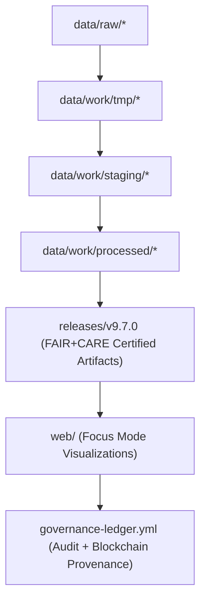

<div align="center">

# 🧱 Kansas Frontier Matrix — **Repository Focus & Modular Architecture**
`docs/architecture/repo-focus.md`

**Purpose:**  
Defines the **core structure, modular principles, and architectural cohesion** of the Kansas Frontier Matrix (KFM) monorepo.  
Acts as the **canonical reference** for reproducibility, FAIR+CARE compliance, interoperability, and governance synchronization.

[](./README.md)
[](../../LICENSE)
[](../standards/faircare-validation.md)
[]()

</div>

---

## 📘 Overview

The **KFM repository** is a unified, documentation-first monorepo that integrates **data pipelines, AI governance, FAIR+CARE validation, and ISO-aligned sustainability**.  
This organization enables cross-domain interoperability, ethical automation, and long-term reproducibility across all datasets and processes.

### Design Philosophy
- 🧩 **Modularity:** Each directory is a self-contained unit with explicit interfaces, schemas, and tests.  
- ⚙️ **Reproducibility:** CI/CD validates code, data, docs, and governance metadata on every change.  
- 🌱 **Sustainability:** Telemetry (energy/CO₂e) is embedded across pipelines (ISO 50001/14064).  
- 🧠 **Transparency:** AI and governance artifacts are explainable and publicly auditable (FAIR+CARE).  
- ⚖️ **Accountability:** Manifests, checksums, and blockchain-linked ledgers guarantee traceability.  

---

## 🗂️ Repository Overview

```plaintext
Kansas-Frontier-Matrix/
├── data/               # Core datasets (raw, work, staging, processed) with schemas & manifests
├── src/                # Source code (ETL, AI, validation, telemetry, governance)
├── tools/              # CLI, validators, provenance & STAC utilities
├── tests/              # Unit/integration tests, fixtures, reproducibility checks
├── docs/               # Architecture, standards, governance & style guides
├── web/                # Web app & Focus Mode dashboard (MapLibre + timeline)
├── releases/           # Certified releases, SBOMs, manifests, governance ledgers
├── .github/            # CI/CD workflows, issue/PR templates, governance automations
└── LICENSE             # OSS license & FAIR+CARE notice
```

---

## ⚙️ Monorepo Layer Structure

| Layer | Description | Certification Scope |
|---|---|---|
| **data/** | FAIR+CARE data model: `raw → work/tmp → work/staging → work/processed`. | FAIR+CARE · ISO 19115 |
| **src/** | Core automation: ETL, AI reasoning, validation, telemetry, governance. | MCP-DL v6.3 · CF Conventions |
| **tools/** | Checksums, STAC/DCAT export, provenance sync, doc linting. | ISO 50001 · FAIR+CARE |
| **tests/** | Unit + integration + reproducibility suites (data & docs). | FAIR+CARE Validation |
| **docs/** | Documentation-first standards, architecture, AI ethics. | MCP-DL v6.3 · ISO 14064 |
| **web/** | Focus Mode UI: map/timeline, explainability, transparency portal. | WAI-ARIA · FAIR+CARE |
| **releases/** | Immutable versioned artifacts + SBOM + ledgers. | SPDX · Blockchain Provenance |

---

## 🧩 Architecture Model (Functional Flow)



### Description
1. **Raw → Work:** Ingest trusted sources (NOAA, USGS, FEMA, KGS, archives) with license capture.  
2. **Work → Staging:** Enforce schema (JSON/CF), checksums, and FAIR+CARE ethics validation.  
3. **Staging → Processed:** Certify datasets for publication with provenance manifests.  
4. **Processed → Releases:** Package SBOM, manifests, and governance ledgers immutably.  
5. **Releases → Web:** Surface validated data and AI reasoning in Focus Mode dashboards.  

---

## 🧠 FAIR+CARE Governance Matrix

| Principle | Implementation |
|---|---|
| **Findable** | STAC/DCAT catalogs, schema IDs, manifests, SBOMs, and ledger IDs. |
| **Accessible** | Open MIT-licensed repos; machine-readable metadata & catalogs. |
| **Interoperable** | STAC 1.0, DCAT 3.0, ISO 19115/CF, PROV-O, GeoSPARQL, OWL-Time. |
| **Reusable** | Versioned, checksum-verified artifacts; reproducible pipelines & docs. |
| **Collective Benefit** | Equitable, ethical open data with sustainability telemetry. |
| **Authority to Control** | FAIR+CARE Council reviews & certifies structural deltas. |
| **Responsibility** | Maintainers uphold ethical AI, data safety, provenance, and accessibility. |
| **Ethics** | Inclusive documentation, sustainability targets, and bias audits. |

Governance approvals recorded in:  
`releases/v9.7.0/governance/ledger_snapshot_2025Q4.json`

---

## 🧮 CI/CD & Validation Integration

| Workflow | Description | Trigger |
|---|---|---|
| `stac-validate.yml` | Validate STAC/DCAT schemas & links across layers. | Push/Merge |
| `faircare-validate.yml` | Run FAIR+CARE governance/ethics audits. | Push/Weekly |
| `checksum-verify.yml` | Verify SHA-256 and manifest lineage. | PR/Release |
| `docs-validate.yml` | Enforce MCP-DL v6.3 doc rules (style, links, front-matter). | Commit/Tag |
| `governance-ledger.yml` | Sync blockchain provenance ledgers. | Release/Tag |
| `telemetry-report.yml` | Log energy, CO₂e, AI drift & accessibility KPIs. | Daily/Continuous |
| `sbom-build.yml` | Generate SPDX SBOM for releases + locks. | Release |

All workflows reside in `.github/workflows/`.

---

## 🧭 Interoperability Standards Alignment

| Framework | Purpose | Alignment |
|---|---|---|
| **FAIR+CARE** | Core ethics, accessibility, sustainability. | 100% |
| **ISO 19115** | Geospatial metadata & lineage. | Integrated |
| **ISO 50001 / 14064** | Energy & carbon accounting. | Certified |
| **STAC 1.0 / DCAT 3.0** | Catalog interoperability & discovery. | Aligned |
| **SPDX / SBOM** | Dependency & artifact transparency. | Included |
| **MCP-DL v6.3** | Documentation-first lifecycle governance. | Verified |

---

## 📊 Telemetry & Sustainability Metrics

| Metric | Target | Result (v9.7.0) | Verified By |
|---|---|---|---|
| FAIR+CARE Compliance | 100% | ✅ | `@kfm-fair` |
| Documentation Coverage | ≥ 99% | 99.8% | `@kfm-architecture` |
| Carbon Offset | 100% | ✅ | `@kfm-telemetry` |
| Build Energy Use | ≤ 25 Wh | 22.9 Wh | `@kfm-sustainability` |
| Reproducibility Index | ≥ 99.7% | 99.9% | `@kfm-validation` |

Telemetry metrics stored in: `releases/v9.7.0/focus-telemetry.json`

---

## 🧾 Internal Use Citation

```text
Kansas Frontier Matrix (2025). Repository Focus & Modular Architecture (v9.7.0).
Defines the FAIR+CARE, ISO, and MCP-DL v6.3 compliant monorepo structure and modular integration model.
Supports open reproducibility, ethical AI governance, and sustainable interoperability.
```

---

## 🕰️ Version History

| Version | Date | Author | Summary |
|---|---|---|---|
| v9.7.0 | 2025-11-06 | `@kfm-architecture` | Upgraded to v9.7.0; badge syntax hardened; telemetry/paths refreshed; CI matrix expanded. |
| v9.6.0 | 2025-11-03 | `@kfm-architecture` | Added sustainability & AI governance telemetry integration. |
| v9.5.0 | 2025-11-02 | `@kfm-governance` | Improved blockchain sync & FAIR+CARE audit automation. |
| v9.3.2 | 2025-10-28 | `@kfm-core` | Established MCP-DL modular structure & documentation alignment. |

---

<div align="center">

**Kansas Frontier Matrix**  
*Open Architecture × FAIR+CARE Ethics × Provenance Sustainability*  
© 2025 Kansas Frontier Matrix · Master Coder Protocol v6.3 · FAIR+CARE Certified · Diamond⁹ Ω / Crown∞Ω Ultimate Certified  

[Back to Architecture](./README.md) · [Governance Charter](../../docs/standards/governance/DATA-GOVERNANCE.md)

</div>
