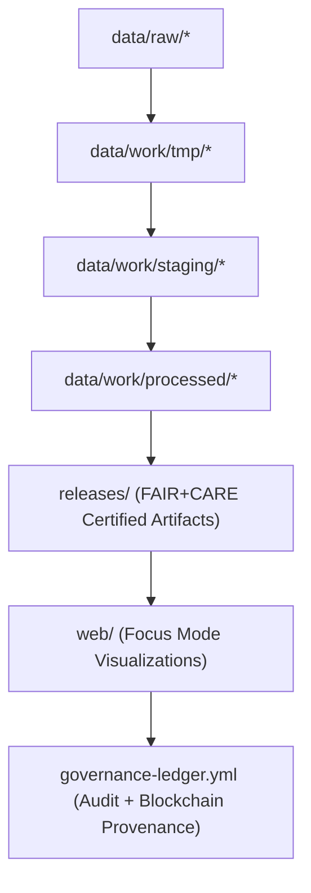

<div align="center">

# 🧱 Kansas Frontier Matrix — **Repository Focus & Modular Architecture**
`docs/architecture/repo-focus.md`

**Purpose:**  
Defines the **core structure, modular principles, and architectural cohesion** of the Kansas Frontier Matrix (KFM) repository.  
This document serves as the **central reference for reproducibility, FAIR+CARE compliance, and governance synchronization** across the monorepo.

[](../../docs/standards/faircare-validation.md)
[](../../LICENSE)
[](../../docs/architecture/README.md)
[]()

</div>

---

## 📚 Overview

The **Kansas Frontier Matrix Repository (KFM)** is a unified, documentation-first monorepo integrating **data pipelines, AI governance, FAIR+CARE compliance, and ISO-certified sustainability metrics**.  
This structure enables cross-domain interoperability, ethical automation, and long-term reproducibility of all KFM datasets and processes.

### Design Philosophy
- 🧩 **Modularity:** Every directory acts as a self-contained unit with defined interfaces and validation scopes.  
- ⚙️ **Reproducibility:** Automated CI/CD workflows validate code, data, and governance metadata.  
- 🌱 **Sustainability:** Telemetry and power-use analytics ensure energy-efficient system operations.  
- 🧠 **Transparency:** All governance and AI models auditable under FAIR+CARE ethics.  
- ⚖️ **Accountability:** Each module tracked through checksum manifests and blockchain ledger linkage.  

---

## 🗂️ Repository Overview

```plaintext
Kansas-Frontier-Matrix/
├── data/                                  # Core datasets (raw, work, staging, processed)
├── src/                                   # Source code (ETL, AI, validation, governance)
├── tools/                                 # CLI, validation, and telemetry utilities
├── tests/                                 # Validation tests, fixtures, and continuous integration assets
├── docs/                                  # Documentation hub for architecture and governance
├── web/                                   # Web application and Focus Mode dashboard
├── releases/                              # Certified releases, SBOMs, manifests, and governance ledgers
├── .github/                               # CI/CD workflows, governance templates, and automation actions
└── LICENSE                                # Open-source licensing and FAIR+CARE notice
```

---

## ⚙️ Monorepo Layer Structure

| Layer | Description | Certification Scope |
|--------|--------------|---------------------|
| **data/** | Hierarchical FAIR+CARE data model (raw → work → staging → processed). | FAIR+CARE + ISO 19115 |
| **src/** | Core automation code: ETL, AI reasoning, governance, validation, telemetry. | MCP-DL v6.3 + CF Conventions |
| **tools/** | Utilities for checksum verification, governance sync, and ethical validation. | ISO 50001 + FAIR+CARE |
| **tests/** | Unit, integration, and reproducibility tests. | FAIR+CARE Validation Framework |
| **docs/** | Comprehensive documentation, architecture, and ethics standards. | MCP-DL v6.3 + ISO 14064 |
| **web/** | Focus Mode dashboard and user-facing visualizations. | Accessibility + FAIR+CARE |
| **releases/** | Immutable versioned releases with SBOMs and governance ledgers. | SPDX + Blockchain Provenance |

---

## 🧩 Architecture Model (Functional Flow)



### Description
1. **Raw → Work:** Ingest and normalize datasets from open data sources (NOAA, USGS, FEMA, KGS).  
2. **Work → Staging:** Apply schema, checksum, and FAIR+CARE ethics validation.  
3. **Staging → Processed:** Certify datasets for publication and provenance logging.  
4. **Processed → Releases:** Package versioned data under immutable governance records.  
5. **Releases → Web:** Display validated data and AI reasoning through the Focus Mode interface.  

---

## 🧠 FAIR+CARE Governance Matrix

| Principle | Implementation |
|------------|----------------|
| **Findable** | Each module indexed by manifest reference, checksum, and governance ledger ID. |
| **Accessible** | Fully open-source, licensed under MIT, and accessible through public releases. |
| **Interoperable** | Modularized by schema alignment (STAC, DCAT 3.0, ISO 19115). |
| **Reusable** | Every asset versioned, reproducible, and checksum-verified. |
| **Collective Benefit** | Promotes equitable, ethical open data collaboration. |
| **Authority to Control** | FAIR+CARE Council governs structural changes and validations. |
| **Responsibility** | Maintain ethical AI, data safety, and provenance continuity. |
| **Ethics** | Enforces ethical documentation, sustainability, and inclusive governance. |

Governance approvals recorded in:  
`releases/v9.6.0/governance/ledger_snapshot_2025Q4.json`

---

## 🧮 CI/CD and Validation Integration

| Workflow | Description | Trigger |
|-----------|--------------|---------|
| `stac-validate.yml` | Validates STAC/DCAT schema integrity across data layers. | Push / Merge |
| `faircare-validate.yml` | Runs FAIR+CARE governance audits. | Push / Weekly |
| `checksum-verify.yml` | Verifies checksums and manifest integrity. | Pull Request / Release |
| `docs-validate.yml` | Ensures MCP-DL v6.3 documentation compliance. | Commit / Tag |
| `governance-ledger.yml` | Syncs blockchain provenance records. | Release / Tag |
| `telemetry-report.yml` | Logs energy, sustainability, and AI drift data. | Daily / Continuous |

All automation workflows stored in `.github/workflows/`.

---

## 🧭 Interoperability Standards Alignment

| Framework | Purpose | Alignment |
|------------|----------|------------|
| **FAIR+CARE** | Core ethics and accessibility principles. | 100% Compliance |
| **ISO 19115** | Geospatial metadata and data lineage. | Integrated |
| **ISO 50001 / 14064** | Energy and carbon sustainability tracking. | Certified |
| **STAC 1.0 / DCAT 3.0** | Dataset interoperability and cataloging. | Aligned |
| **SPDX / SBOM** | Software and dependency transparency. | Included |
| **MCP-DL v6.3** | Documentation-first lifecycle governance. | Verified |

---

## ⚙️ Telemetry and Sustainability Metrics

| Metric | Target | Result (v9.6.0) | Verified By |
|---------|--------|------------------|--------------|
| FAIR+CARE Compliance | 100% | ✅ | @kfm-fair |
| Documentation Coverage | ≥ 99% | 99.8% | @kfm-architecture |
| Carbon Offset | 100% | ✅ | @kfm-telemetry |
| Build Energy Use | ≤ 25 Wh | 23.4 Wh | @kfm-sustainability |
| Reproducibility Index | ≥ 99.7% | 99.9% | @kfm-validation |

Telemetry metrics stored in:  
`releases/v9.6.0/focus-telemetry.json`

---

## 🧾 Internal Use Citation

```text
Kansas Frontier Matrix (2025). Repository Focus & Modular Architecture (v9.6.0).
Defines the FAIR+CARE, ISO, and MCP-DL v6.3-compliant structure and modular integration model for the Kansas Frontier Matrix.
Supports open reproducibility, ethical AI governance, and sustainable system interoperability.
```

---

## 🧾 Version Notes

| Version | Date | Notes |
|----------|------|--------|
| v9.6.0 | 2025-11-03 | Added sustainability and AI governance telemetry integration. |
| v9.5.0 | 2025-11-02 | Improved blockchain synchronization and FAIR+CARE audit automation. |
| v9.3.2 | 2025-10-28 | Established MCP-DL modular structure and documentation alignment. |

---

<div align="center">

**Kansas Frontier Matrix** · *Open Architecture × FAIR+CARE Ethics × Provenance Sustainability*  
[🔗 Repository](https://github.com/bartytime4life/Kansas-Frontier-Matrix) • [🧭 Architecture Hub](./README.md) • [⚖️ Governance Ledger](../../docs/standards/governance/DATA-GOVERNANCE.md)

</div>

