<!-- [KFM_META_BLOCK_V2]
doc_id: kfm://doc/architecture-rest-orchestrated-3d-derivatives
title: REST-Orchestrated 3D Derivatives and LLM-Ingestible PDF Packaging
type: architecture-companion
version: v1.0
status: draft; source-reconciled; standards-verified; implementation-proposed; non-publisher
owners:
  - "@bartytime4life — verified repository review route"
  - "NEEDS VERIFICATION — Planetary/3D, API, PDF accessibility, evidence, security, sensitivity, release, and independent review stewardship"
created: 2026-08-22
updated: 2026-08-22
policy_label: public; architecture; planetary-3d; rest; render-derivatives; llm-ingestion; pdf-packaging; no-runtime-effect; no-release; no-publication
owning_root: docs/
responsibility: Explain the cross-cutting boundary for requesting, generating, validating, packaging, and delivering 3D derivatives over governed HTTP interfaces while keeping evidence, policy, review, release, accessibility, correction, and rollback authority outside the renderer and job system.
parent_architecture: docs/architecture/planetary-3d.md
truth_posture: cite-or-abstain; source-derived concepts, current repository state, direct PDF inspection, and current official standards checks are separated from proposed KFM implementation
current_path: docs/architecture/rest-orchestrated-3d-derivatives.md
evidence_snapshot:
  repository: bartytime4life/Kansas-Frontier-Matrix
  base_ref: main
  base_commit: 23ad1900d5c17d689ccd21489ed19fa852a3d28b
  base_tree: 7681d382530d1718f94e2587793909e5072366d0
  source_pdf: Designing an LLM-Ingestible PDF Resource on REST-Orchestrated Advanced 3D Rendering.pdf
  source_pdf_sha256: d5cd2e88854f3291dbeae5e609a423cce5bbf40e36172efdd2921127e2d8399d
  source_pdf_pages: 23
  source_pdf_pdf_version: "1.7"
  source_pdf_tagged: false
  source_pdf_xmp_metadata_stream: false
  source_pdf_embedded_files: 0
  source_pdf_3d_or_richmedia_annotations: 0
  source_pdf_optimized: false
  current_map_runtime_port_sha: 11b734165bc0e0617b9d98c99f43441b0275cb50
  current_maplibre_entry_sha: 08a48ac008665317833a9476b21cd35b1679c595
  current_three_d_admission_contract_sha: e71692ce8897596e3477a8dafc0ef5c12fcd130a
related:
  - docs/architecture/README.md
  - docs/architecture/planetary-3d.md
  - docs/architecture/map-master/2D_3D_PARITY.md
  - contracts/map/three_d_admission_decision.md
  - contracts/receipts/representation_receipt.md
  - schemas/contracts/v1/scene/README.md
  - packages/maplibre/src/map-runtime-port.ts
  - packages/maplibre/src/null-map-runtime.ts
  - apps/explorer-web/src/features/map_runtime/README.md
  - docs/architecture/ui/ACCESSIBILITY.md
  - docs/standards/ARCHIVAL-STANDARDS.md
  - docs/runbooks/DOCTRINE_ARTIFACT_PREFLIGHT.md
tags: [kfm, architecture, planetary-3d, rest, async-jobs, render-derivative, gltf, usd, 3d-tiles, pdf, pdf-ua, json-ld, xmp, accessibility, evidence, release, rollback]
notes:
  - "This is subordinate to planetary-3d.md, not a competing Planetary/3D landing page."
  - "The supplied PDF is useful design input but is not itself a tagged, XMP-bearing, attachment-bearing, or interactive-3D conformance exemplar."
  - "Current main contains a renderer-neutral MapRuntimePort and NullMapRuntime, but no admitted concrete browser renderer or GPU render-worker implementation."
  - "Every API route, resource name, object shape, worker, queue, storage binding, PDF profile, and implementation path below remains PROPOSED until separately contracted, placed, tested, reviewed, and admitted."
[/KFM_META_BLOCK_V2] -->

<a id="top"></a>

# REST-Orchestrated 3D Derivatives and LLM-Ingestible PDF Packaging

> **Narrow architecture companion.** This page reconciles the supplied REST/3D/PDF research with current KFM repository evidence and current official standards. It defines a governed boundary for future 3D derivative jobs and PDF packaging. It does **not** create an API, contract, schema, renderer, worker, queue, source activation, artifact release, deployment, or publication authority.


## Executive determination

| Area | Current bounded result |
|---|---|
| Source contribution | **CONFIRMED:** the supplied report usefully separates client rendering, server-side asynchronous rendering, and hybrid derivative delivery; it also proposes REST resources, format guidance, PDF fallbacks, and LLM-oriented metadata. |
| Source artifact quality | **CONFIRMED LIMITATION:** direct inspection found a 23-page PDF 1.7 file with title/author information, but no tagged-PDF structure, XMP metadata stream, embedded files, associated-file relationship, 3D/RichMedia annotation, or linearization. It describes an ingestible package but is not itself a conformance exemplar. |
| Current KFM runtime | **CONFIRMED BOUNDED:** current `main` contains a KFM-owned renderer-neutral `MapRuntimePort` and deterministic `NullMapRuntime`; they expose no MapLibre classes and do not admit or implement a concrete renderer. |
| Current KFM 3D governance | **CONFIRMED BOUNDED:** `ThreeDAdmissionDecision` remains a proposed-inactive fixture profile, while `RepresentationReceipt` remains process memory rather than evidence, policy, review, release, or publication authority. |
| REST render service | **UNKNOWN / NOT ESTABLISHED:** bounded repository searches did not establish a render-job API, GPU worker, render queue, capability service, or derivative store. |
| Scene contract | **README-ONLY / HOLD:** the current scene schema family remains a placement guardrail rather than an accepted `SceneManifest` implementation. |
| Standards delta | **CONFIRMED:** OpenAPI 3.2.0 supersedes the report's 3.1 example as the latest published OAS; glTF 2.0 explicitly is not a streaming format; OGC 3D Tiles 1.1 is the mass-geospatial streaming carrier; WebGPU remains a W3C Candidate Recommendation Draft; PDF/UA-2 is the PDF 2.0 accessibility profile; newer PDF 2.0 extension work adds a conditional glTF-in-PDF path beyond U3D/PRC. |
| Immediate repository action | **DOCUMENTATION ONLY:** record the reconciled architecture and verification findings without inventing machine authority or implementing live effects. |

> [!IMPORTANT]
> **A successful render job is not a release decision.** It proves, at most, that a requested derivative was produced under a declared toolchain. Evidence closure, policy, human review, public-safety transformation, release, correction, and rollback remain separate gates.

> [!CAUTION]
> **A PDF is a downstream carrier.** Source Markdown, machine metadata, manifests, evidence references, and release records remain authoritative for reconstruction. PDF tags, XMP, attachments, 3D annotations, posters, and QR/deep links improve delivery; they do not make the PDF sovereign truth.

## Quick navigation

- [1. Goal, scope, and placement](#1-goal-scope-and-placement)
- [2. Evidence basis and source-artifact audit](#2-evidence-basis-and-source-artifact-audit)
- [3. Current KFM reconciliation](#3-current-kfm-reconciliation)
- [4. Verified standards update](#4-verified-standards-update)
- [5. Governed reference architecture](#5-governed-reference-architecture)
- [6. Proposed resources and states](#6-proposed-resources-and-states)
- [7. REST contract profile](#7-rest-contract-profile)
- [8. Format and derivative policy](#8-format-and-derivative-policy)
- [9. LLM-ingestible PDF package profile](#9-llm-ingestible-pdf-package-profile)
- [10. Security, rights, sensitivity, and isolation](#10-security-rights-sensitivity-and-isolation)
- [11. Observability, performance, and cost](#11-observability-performance-and-cost)
- [12. Validation and acceptance gates](#12-validation-and-acceptance-gates)
- [13. Smallest next implementation slice](#13-smallest-next-implementation-slice)
- [14. Rollback and verification backlog](#14-rollback-and-verification-backlog)

---

## 1. Goal, scope, and placement

### 1.1 Goal

Define how KFM may later request and produce 3D derivatives through governed HTTP interfaces while preserving:

- released-input-only public paths;
- EvidenceRef-to-EvidenceBundle traceability;
- explicit source role and temporal scope;
- sensitivity transformation before rendering;
- finite policy and operational outcomes;
- deterministic request and artifact identity where practical;
- accessibility and non-interactive fallbacks;
- receipts that record execution without claiming authority;
- correction, withdrawal, supersession, and rollback closure.

### 1.2 Directory Rules basis

`docs/architecture/` owns cross-cutting human explanation. This topic spans API composition, Planetary/3D carriers, PDF accessibility, evidence, security, release, and rollback, so the architecture root is the appropriate explanatory owner.

This page is subordinate to [`planetary-3d.md`](./planetary-3d.md). It does not create another domain, API, schema, policy, source, release, proof, or runtime home.

| Concern | Owning responsibility |
|---|---|
| Semantic meaning | `contracts/` after separate acceptance |
| Machine shape | accepted schema home under `schemas/` |
| Allow, deny, restrict, or abstain logic | `policy/` plus rights, sensitivity, review, and release evidence |
| Runtime implementation | verified app/package/worker homes after placement review |
| Fixtures and tests | existing `fixtures/` and `tests/` responsibility roots |
| Process memory | `data/receipts/` |
| Proof and release decisions | `data/proofs/` and `release/` as separately governed families |
| Public-safe bytes | `data/published/` only after promotion and release closure |

### 1.3 In scope

- client-side, server-side, and hybrid 3D derivative patterns;
- asynchronous job semantics;
- runtime and interchange format roles;
- large-artifact transfer, caching, integrity, and range access;
- PDF 3D/fallback packaging;
- tagged structure, metadata, associated files, and retrieval sidecars;
- security, sensitivity, sandboxing, observability, testing, and rollback.

### 1.4 Out of scope

- selecting a renderer or converter;
- admitting a package, plugin, GPU driver, external endpoint, source, or live worker;
- defining production route names or database tables;
- claiming a released scene, production queue, deployment, or public operation;
- making PDF, scene, screenshot, tile, model, or generated prose authoritative evidence.

---

## 2. Evidence basis and source-artifact audit

### 2.1 Source-derived design input

The supplied report contributes five useful design clusters:

1. three complementary execution patterns: client, server, and hybrid;
2. a small REST resource model around assets, artifacts, scene manifests, and render jobs;
3. format separation among glTF, USD/USDZ, images/video, and PDF 3D carriers;
4. HTTP concerns such as caching, range requests, authentication, pagination, and asynchronous jobs;
5. LLM-oriented document structure using stable identifiers, machine-readable tables, JSON-LD/XMP, and chunkable companion assets.

These are design inputs. They do not prove current KFM paths or implementation.

### 2.2 Direct artifact inspection

The source PDF was inspected locally by checksum and PDF tooling rather than judged only by visible prose.

| Check | Observed result | Consequence |
|---|---|---|
| SHA-256 | `d5cd2e88854f3291dbeae5e609a423cce5bbf40e36172efdd2921127e2d8399d` | Stable source-artifact identity for this research pass |
| Page count | 23 | Bounded source extent |
| PDF version | 1.7 | It cannot claim PDF/UA-2, which is a PDF 2.0 profile |
| Tagged | No | Heading appearance does not provide a verified structure tree |
| XMP metadata stream | Not found | Example YAML prose is not embedded document metadata |
| Embedded or associated files | 0 | No companion OpenAPI, JSON-LD, model, or corpus attachment is carried in the PDF |
| 3D/RichMedia annotations | 0 found | The file explains interactive PDF but does not demonstrate it |
| Linearized | No | No fast-web-view optimization was detected |

### 2.3 Correct interpretation

The source is **useful architecture research** and **not a packaging exemplar**. A future KFM example must prove the properties it recommends through generated bytes, machine checks, human accessibility review, and a manifest; prose alone is insufficient.

---

## 3. Current KFM reconciliation

### 3.1 Current baseline

This page was prepared against `main@23ad1900d5c17d689ccd21489ed19fa852a3d28b`. At branch creation, no open pull request overlapped this new path.

The exact target path did not exist. The parent architecture page, Directory Rules authority, 3D admission profile, representation receipt, scene guardrail, and current map package were inspected before placement.

### 3.2 Material current-state correction

PR #3433 changed the current map package after the evidence snapshot embedded in parts of the Planetary/3D documentation.

| Surface | Current verified state | Boundary |
|---|---|---|
| `packages/maplibre/src/index.ts` | Exports `map-runtime-port` and `null-map-runtime` | No longer a one-line placeholder export |
| `MapRuntimePort` | KFM-owned, serializable, renderer-neutral interface | No renderer classes, sources, layers, workers, protocols, or truth/release authority |
| `NullMapRuntime` | Deterministic no-network implementation for migration/tests | Not a renderer and not browser-runtime proof |
| Concrete `MapLibreAdapter` | **NOT ESTABLISHED** | Requires separate dependency admission and browser evidence |
| `ThreeDAdmissionDecision` | Proposed-inactive, fixture-only | `ALLOW_RENDER_CANDIDATE` is not permission |
| `RepresentationReceipt` | Bounded process-memory family | Not evidence, policy, review, release, or publication |
| Scene schema family | README-only guardrail | No accepted `SceneManifest` schema established |
| Published scene lane | No released scene established by inspected evidence | Directory presence is not release proof |

### 3.3 Gap classification

| Candidate idea from source | Repository disposition |
|---|---|
| Renderer-neutral client boundary | **PARTIAL:** port and null runtime now exist |
| Concrete browser renderer | **ABSENT / HELD** |
| Async render-job API | **ABSENT / UNKNOWN authority home** |
| GPU render worker and queue | **ABSENT / UNKNOWN** |
| Artifact/derivative semantic family | **PARTIAL through existing receipt/release vocabulary; source proposal not adopted** |
| Scene manifest | **README-ONLY / HOLD** |
| PDF package profile | **ABSENT as an accepted KFM profile** |
| LLM retrieval package | **ABSENT as an accepted KFM profile** |
| 3D candidate governance | **BOUNDED fixture proof exists** |

### 3.4 Anti-collapse rule

A future implementation must keep these states separate:

```text
source asset
  != normalized asset
  != scene composition
  != render request
  != render job
  != derivative candidate
  != validated derivative
  != catalog record
  != release decision
  != published carrier
  != public interpretation
```

---

## 4. Verified standards update

The report's high-level direction remains useful, but several operational details need current correction.

| Topic | Verified current posture | KFM consequence |
|---|---|---|
| OpenAPI | Version 3.2.0 is the latest published specification | New examples should target 3.2 unless repo tooling requires a reviewed compatibility profile |
| HTTP async work | `202 Accepted` means processing is not complete | Return a status resource; never present acceptance as success or release |
| API errors | RFC 9457 defines Problem Details | Use stable KFM reason codes plus safe problem details; do not reflect sensitive input |
| Integrity | RFC 9530 defines HTTP digest fields | Bind request/output bytes and transport integrity without treating hash equality as source authority |
| Message authenticity | RFC 9421 defines HTTP Message Signatures | Candidate option for high-assurance callbacks; exact profile remains proposed |
| OAuth | RFC 9700 is the OAuth 2.0 security BCP | Avoid legacy/insecure flows and long-lived bearer-token shortcuts |
| JWT | RFC 8725 gives JWT BCP | Algorithm, issuer, audience, key, and claim validation must fail closed |
| glTF 2.0 | Runtime delivery format; specification says it is not a streaming format | Use HTTP range/chunking only where container/tooling supports it; use 3D Tiles for mass geospatial streaming |
| OGC 3D Tiles 1.1 | Streaming and rendering massive heterogeneous 3D geospatial content | Use as a delivery carrier, not a truth or visualization-policy authority |
| USD/OpenUSD | Authoring, composition, and interchange system | Prefer for production scene assembly where its layering model is needed; do not force it on lightweight clients |
| WebGPU | W3C Candidate Recommendation Draft | Treat as capability-negotiated and version-sensitive, not universal baseline |
| PDF 3D | Acrobat documents U3D and PRC support; support remains reader-dependent | Always provide poster, text alternative, and external/attached asset fallback |
| PDF accessibility | PDF/UA-2 is ISO 14289-2:2024 for tagged PDF 2.0 | Match claimed profile to actual PDF version and include human review |
| PDF validation | veraPDF can test machine-verifiable profile rules | A pass cannot prove full usability or semantic quality |
| glTF in PDF | New PDF 2.0 extension work provides a conditional glTF model path | Pilot only against an explicit target-reader matrix; do not assume broad vendor support |
| JSON-LD | JSON-LD 1.1 is a W3C Recommendation | Suitable for a companion semantic sidecar; it does not replace KFM-native contracts |

---

## 5. Governed reference architecture

### 5.1 Three execution patterns

#### Pattern A — client rendering

A governed API or immutable released edge delivers a released scene package and public-safe assets. The client renders through an admitted adapter.

Use when:

- interaction is primary;
- client capability is sufficient;
- assets are already public-safe;
- deterministic server pixels are not required.

Risks:

- device/driver variance;
- client resource limits;
- protected-byte leakage if transformation occurs too late;
- plugin, worker, protocol, and endpoint supply-chain expansion.

#### Pattern B — server derivative job

An authenticated internal API accepts a bounded request and creates a sandboxed asynchronous job. Workers produce candidate images, video, model conversions, buffers, or PDF packages.

Use when:

- deterministic review outputs matter;
- advanced conversion or path tracing exceeds client capability;
- the client must not execute untrusted model/shader content;
- batch generation is required.

Risks:

- arbitrary-input execution;
- GPU denial of service;
- queue starvation;
- tenant-data crossover;
- hidden nondeterminism;
- high cost and orphaned artifacts.

#### Pattern C — hybrid

A server creates governed derivatives such as LODs, thumbnails, compressed textures, baked lighting, poster images, and PDF fallbacks. An admitted client remains interactive over released products.

This is the preferred long-term KFM pattern because it permits a strong public-safe release boundary while preserving interaction.

### 5.2 Trust flow

```mermaid
flowchart LR
  A["Admitted source / released input"]
  E["EvidenceRef -> EvidenceBundle"]
  P["Rights + sensitivity + purpose policy"]
  R["Accountable review"]
  Q["RenderDerivativeRequest candidate"]
  J["Sandboxed async job"]
  V["Format + integrity + fidelity validation"]
  RR["RepresentationReceipt"]
  C["Catalog candidate"]
  D["Release decision"]
  U["Published public-safe carrier"]
  X["MapRuntimePort / PDF fallback / export"]

  A --> E --> P --> R --> Q --> J --> V --> RR --> C --> D --> U --> X
```



No arrow may be skipped merely because a worker returned success.

### 5.3 Control plane versus data plane

| Plane | Owns | Must not own |
|---|---|---|
| Control plane | request validation, identity, authorization, capability profile, queue state, policy/review/release references, status projection | raw model execution, public truth, hidden promotion |
| Data plane | sandboxed conversion/render execution, bounded temporary storage, output digesting, resource metrics | source admission, evidence meaning, policy, review, release |
| Released edge | immutable public-safe artifacts, cache headers, range support, release/correction state | RAW/WORK/QUARANTINE access or mutable canonical truth |
| Client | rendering, camera, selection, accessible finite state, Evidence Drawer handoff | evidence resolution, policy decisions, source activation, publication |

---

## 6. Proposed resources and states

All names in this section are **PROPOSED semantic candidates**, not current contracts.

### 6.1 Resource families

| Resource | Purpose | Authority limit |
|---|---|---|
| `AssetRef` | Stable reference to an admitted or released input asset | A reference does not authenticate or release the asset |
| `ScenePackageRef` | Composition reference for scene, camera, layers, time, and variants | Does not create SceneManifest authority |
| `RenderDerivativeRequest` | Immutable desired-output request with bounded input refs and capability profile | Cannot contain arbitrary URLs or secrets |
| `RenderJob` | Operational execution state and safe diagnostics | Job success is not release |
| `DerivativeCandidate` | Output bytes plus format, media type, digest, size, and validation state | Remains non-public until governed release |
| `PdfPackageCandidate` | PDF plus posters, text alternative, attachments/links, XMP/JSON-LD, and manifest | Profile validity is not evidence closure |
| `WorkerCapability` | Exact toolchain, formats, limits, determinism, GPU/CPU, sandbox, and policy version | Capability advertisement is not admission |
| `JobEvent` | Append-only state transition record | Not a review or release record |

### 6.2 Job state machine

```text
RECEIVED
  -> REJECTED
  -> QUEUED
  -> RUNNING
  -> SUCCEEDED_CANDIDATE
  -> FAILED
  -> CANCEL_REQUESTED
  -> CANCELED
  -> EXPIRED
```

`SUCCEEDED_CANDIDATE` is deliberately not named `PUBLISHED`, `RELEASED`, or `APPROVED`.

### 6.3 Required request dimensions

A future request should bind at least:

- profile and version;
- request identity and idempotency key;
- tenant/audience/purpose;
- admitted input refs and exact expected digests;
- EvidenceBundle, release, correction, and Reality Boundary Note refs as applicable;
- requested derivative kind and media type;
- dimensions, quality, LOD, color, camera, time, and animation bounds;
- sensitivity-transform requirements;
- worker capability profile;
- deadline, resource ceiling, and retention class;
- callback policy, when allowed;
- requester identity and authorization context;
- zero-effect defaults for release, deployment, and publication.

### 6.4 Deterministic identity

Where requests are deterministic:

```text
request_spec_hash = sha256(JCS(normalized_request_without_runtime_fields))
derivative_id     = "render-derivative:" + first_24_hex(request_spec_hash)
```

Output identity must additionally bind output bytes, toolchain/version, parameters, and material environment facts. Nondeterministic renderers must declare nondeterminism rather than manufacture a reproducibility claim.

---

## 7. REST contract profile

### 7.1 Proposed resource-oriented surface

Route names remain illustrative. A future contract should prefer resources over command-shaped RPC endpoints.

```text
POST   /render-jobs
GET    /render-jobs/{job_id}
DELETE /render-jobs/{job_id}          # request cancellation, not deletion of history
GET    /render-jobs/{job_id}/events
GET    /render-jobs/{job_id}/outputs
GET    /derivative-candidates/{id}
GET    /worker-capabilities
```

### 7.2 Submission response

A valid asynchronous submission should return:

- `202 Accepted`;
- `Location` pointing to the job status resource;
- `Retry-After` when meaningful;
- request/job identity;
- normalized finite state;
- no assertion that output or release exists;
- no internal queue, host, filesystem, credential, or sensitive-source detail.

### 7.3 Idempotency and concurrency

- Require an idempotency key for job creation.
- Bind the key to requester, tenant, normalized request hash, and expiry.
- Reject reuse with materially different content.
- Use ETag/conditional requests for mutable job status.
- Never permit a stale client update to overwrite correction or cancellation state.

### 7.4 Error envelope

Use `application/problem+json` with stable KFM reason codes.

Safe fields may include:

- type URI or stable identifier;
- title;
- HTTP status;
- public-safe detail;
- instance/job correlation reference;
- retryability;
- safe next action.

Do not echo:

- arbitrary source URLs;
- filesystem paths;
- signed URLs or tokens;
- exact sensitive geometry;
- worker stderr containing source payloads;
- tenant identifiers outside the caller's scope.

### 7.5 Large-artifact delivery

Released or authorized artifact delivery should support, where applicable:

- strong ETag;
- `Digest`/content integrity fields;
- byte ranges;
- immutable cache policy for content-addressed objects;
- explicit media type and content disposition;
- released-manifest and correction headers or links;
- no cacheability for restricted candidate material;
- short-lived, audience-bound access when public release is not allowed.

### 7.6 Callbacks and webhooks

Polling is the safe baseline. Webhooks require a separate admission profile:

- registered destination, not arbitrary request URL;
- HTTPS and destination allowlist;
- DNS/IP/redirect SSRF controls;
- signed messages and replay window;
- event ID, job ID, state, timestamp, and safe status link;
- no artifact bytes or sensitive diagnostics in the callback;
- retry ceiling and dead-letter behavior;
- revocation and audit trail.

---

## 8. Format and derivative policy

### 8.1 Format roles

| Format/carrier | Preferred role | KFM cautions |
|---|---|---|
| glTF/GLB | Lightweight runtime delivery | Not a streaming system; validate extensions, external URIs, animation, texture budgets, and active content assumptions |
| USD/OpenUSD | Authoring, composition, layered interchange | Complex dependency and resolver surface; package a deterministic delivery derivative separately |
| USDZ | Apple-oriented packaged AR/viewing derivative | Target-platform capability and rights need explicit verification |
| OGC 3D Tiles 1.1 | Massive geospatial streaming | Tileset hierarchy and metadata are delivery structures, not evidence or visualization policy |
| OBJ/FBX | Legacy interchange/import | Preserve source role and conversion loss; avoid treating proprietary/legacy import as preferred public runtime |
| images/video | Deterministic review, thumbnail, poster, and low-capability fallback | Camera, lighting, time, crop, and information loss require receipt fields |
| depth/normal/ID buffers | QA, analysis, compositing, and test derivatives | Can expose sensitive geometry or enable reconstruction |
| U3D/PRC in PDF | Established interactive PDF 3D annotation path in capable readers | Reader support is uneven; always provide fallback |
| glTF in PDF extension | Emerging PDF 2.0 route | Pilot only against declared reader/tool matrix |
| tagged PDF + associated assets | Human/LLM delivery package | PDF remains derivative; bind every component by manifest and digest |

### 8.2 Conversion policy

Every material conversion should record:

- source and destination format/version;
- tool and version;
- command/profile and normalized parameters;
- input/output digests;
- coordinate system, axis, unit, and transform;
- geometry, material, animation, metadata, and compression loss;
- extension allowlist/denylist;
- texture resizing/transcoding;
- LOD/decimation method;
- validation result;
- represented and input-as-of time;
- evidence, Reality Boundary Note, correction, and release refs;
- sandbox and resource metrics.

### 8.3 2D/3D parity

A derivative must preserve or explicitly reconcile:

- feature identity;
- evidence refs;
- source roles;
- time selection;
- sensitivity labels;
- correction and release refs;
- visible limitations;
- Evidence Drawer fields.

A format conversion that loses these bindings fails closed or carries an explicit limitation. Visual similarity is not parity proof.

---

## 9. LLM-ingestible PDF package profile

### 9.1 Package, not single opaque PDF

The durable deliverable should be a manifest-bound package:

```text
resource/
  resource.pdf
  source.md
  metadata.jsonld
  manifest.json
  sections.jsonl
  openapi.yaml                 # when applicable
  assets/
    poster.webp
    model.glb                  # optional and rights-cleared
    scene-package.json         # optional candidate/released ref projection
  validation/
    pdf-profile-report.json
    link-report.json
    asset-validation.json
    human-review.md
```

This is a logical package description, not a proposed repository path.

### 9.2 Minimum PDF requirements

A future profile should require:

- correct declared PDF version;
- tagged logical structure and language;
- real headings, lists, tables, captions, and reading order;
- document title and accessible metadata;
- bookmarks or equivalent navigation for substantial resources;
- alt text and long descriptions where needed;
- selectable text rather than image-only pages;
- poster image and textual alternative for every interactive 3D object;
- no critical instruction available only through color, animation, or 3D interaction;
- XMP metadata stream;
- stable section identifiers represented in visible and companion metadata;
- manifest-bound associated files or explicit external links;
- safe deep-link/QR fallback with the URL also available as text;
- correction, supersession, release, and evidence references appropriate to exposure.

### 9.3 Metadata layers

| Layer | Role |
|---|---|
| PDF document information | Basic reader-visible title, author/organization, subject, keywords |
| XMP | Embedded machine metadata and profile identifiers |
| JSON-LD sidecar | Rich semantic graph, stable IDs, source/evidence/release/correction links |
| `manifest.json` | Exact files, media types, byte sizes, digests, roles, rights, and relationships |
| `sections.jsonl` | Retrieval chunks with section ID, heading path, page span, token estimate, evidence refs, and source hash |
| Source Markdown | Correctable, diffable human/machine source; not automatically public authority |

### 9.4 Chunk contract

Each retrieval chunk should include:

```json
{
  "chunk_id": "kfm://doc/example#section-7.2/chunk-001",
  "document_id": "kfm://doc/example",
  "document_version": "1.0.0",
  "heading_path": ["REST contract profile", "Submission response"],
  "section_id": "7.2",
  "page_start": 14,
  "page_end": 14,
  "text_sha256": "sha256:...",
  "source_artifact_sha256": "sha256:...",
  "evidence_refs": [],
  "release_ref": null,
  "correction_refs": [],
  "truth_posture": "PROPOSED"
}
```

The actual field shape requires separate contract/schema acceptance.

### 9.5 Retrieval validation

A package is not LLM-ingestible merely because text extraction succeeds. Validate:

- stable section-to-page mapping;
- heading hierarchy and chunk boundaries;
- table extraction fidelity;
- figure/caption association;
- citation/evidence resolution;
- superseded-section exclusion;
- deterministic chunk IDs and text hashes;
- answer/abstain tests over a small golden question set;
- no retrieval of withheld attachments or restricted metadata;
- distinction between source-derived, verified-current, and proposed content.

### 9.6 Interactive 3D fallback matrix

| Reader capability | Required user experience |
|---|---|
| Full supported 3D reader | Interactive object plus poster, caption, instructions, and text alternative |
| PDF reader without 3D | Poster, description, accessible table/figures, and external/attached asset link |
| Screen reader | Structured text, meaningful labels, equivalent description, no interaction-only facts |
| Offline reader | Embedded public-safe poster/text and, when authorized, associated asset |
| Restricted asset | Generalized poster/text; no protected bytes; governed access link only |
| LLM pipeline | Source Markdown/JSON-LD/sections manifest preferred over reconstructing semantics from PDF pixels |

---

## 10. Security, rights, sensitivity, and isolation

### 10.1 Untrusted 3D input

Treat models, textures, shaders, archives, scene references, and PDFs as untrusted.

Required controls before implementation include:

- strict format and extension allowlist;
- recursive archive and decompression limits;
- file count, byte, texture, vertex, triangle, animation, node, and recursion limits;
- no arbitrary filesystem, network, URI resolver, include, or plugin access;
- blocked active scripts and unsupported embedded actions;
- sandboxed process/container with no default credentials;
- read-only input and isolated scratch output;
- CPU/GPU/memory/time/output ceilings;
- dependency pinning, SBOM, integrity, license, and vulnerability review;
- safe log and error redaction;
- malware/content scanning appropriate to format and risk;
- guaranteed cleanup and orphan detection.

### 10.2 SSRF and URL policy

A render request must reference admitted KFM objects, not arbitrary caller-provided URLs. Resolver behavior should:

- use a registry or capability token;
- reject localhost, link-local, metadata service, private-range, and disallowed destinations;
- revalidate redirects and resolved IPs;
- constrain protocol, host, path, size, media type, and digest;
- separate download from parsing/render execution;
- record retrieval receipt without exposing signed URLs.

### 10.3 Sensitive geometry

Style hiding, clipping, camera limits, or disabled picking are not access control. Protected geometry must be transformed or excluded before candidate bytes reach a public client or PDF.

Transformation must bind:

- policy/review decision;
- input/output digests;
- method and parameter identity;
- information loss;
- spatial and temporal scope;
- reconstruction/inference risk;
- RepresentationReceipt or specialized transform receipt;
- correction and rollback target.

### 10.4 Rights

Before conversion or packaging, verify:

- source license and redistribution rights;
- derivative-work permission;
- attribution and notice requirements;
- embedded texture/font/media rights;
- model-release or privacy constraints;
- Indigenous/community authority and cultural restrictions;
- target audience and purpose;
- whether attaching original assets to a PDF is allowed independently of showing a poster.

Unknown rights produce `HOLD` or `DENY`, not a best-effort public package.

### 10.5 Multi-tenant isolation

- Tenant identity is derived from authenticated context, never trusted from request JSON alone.
- Job, cache, object, callback, and log namespaces are tenant-bound.
- Content-addressed deduplication must not reveal existence across tenants.
- Workers receive least-privilege, short-lived capability to exact inputs/outputs.
- Candidate artifacts never inherit public caching from a released object.

---

## 11. Observability, performance, and cost

### 11.1 Required metrics

Measure separately:

- queue wait and execution duration;
- worker startup/cold start;
- CPU/GPU time and memory peak;
- input/output bytes;
- triangle/vertex/node/texture counts;
- conversion/validation/render phase timing;
- cache hit/miss and range behavior;
- output count and orphan cleanup;
- cancellations, timeouts, retries, and reason codes;
- per-profile cost estimate and actual resource use;
- accessibility/profile validation results;
- release/correction propagation lag where applicable.

### 11.2 Trace model

A trace should connect, without leaking protected data:

```text
request_id
  -> job_id
  -> input artifact refs/digests
  -> worker capability/profile
  -> output candidate refs/digests
  -> validation reports
  -> RepresentationReceipt
  -> catalog/release/correction refs
```

### 11.3 Performance budgets

Budgets must be profile-specific, not universal. Candidate dimensions include:

- maximum input/output size;
- vertices/triangles/nodes/materials/textures;
- texture dimensions and decoded memory;
- animation length/frame count;
- PDF page/attachment/annotation count;
- queue and execution timeout;
- browser frame-time and memory budget;
- mobile/degraded fallback threshold.

Exceeding a budget returns an explicit finite result. The system must not silently reduce fidelity and present the result as equivalent.

### 11.4 Cost and sustainability

- Require a bounded capability profile before scheduling.
- Prefer cached deterministic derivatives when authorization, release, and correction state match.
- Expire failed/canceled scratch artifacts promptly.
- Make GPU use opt-in and accountable.
- Record energy/cost proxies where practical without converting estimates into precise claims.
- Prevent retry storms and duplicate fan-out through idempotency.

---

## 12. Validation and acceptance gates

### 12.1 Validation layers

| Gate | Required proof | Does not prove |
|---|---|---|
| Request schema | Closed shape and bounded fields | Evidence truth or authorization |
| Semantic validator | Identity, refs, state, capability, and anti-collapse consistency | Live referenced-object authenticity |
| Policy | Rights, sensitivity, purpose, audience, transform, retention | Human review or release unless explicitly owned |
| Worker sandbox test | Resource and network isolation | Output correctness |
| Format validator | Structural conformance | Visual fidelity, accessibility, or truth |
| Golden render | Bounded output similarity under declared environment | Semantic correctness across devices |
| RepresentationReceipt | Declared transform/process memory | Evidence, policy, review, or release authority |
| PDF profile validator | Machine-verifiable PDF/UA/PDF/A rules selected for the profile | Complete human accessibility |
| Retrieval tests | Chunk and evidence behavior on a bounded question set | General-purpose model reliability |
| Release gate | Authorized public-safe artifact and rollback target | Deployment health unless separately observed |

### 12.2 Required negative fixtures

A first machine packet should include exact negatives for:

- arbitrary or private-network URL;
- missing input digest;
- unadmitted input or source role;
- request hash/id mismatch;
- cross-tenant artifact ref;
- unsupported format/extension;
- unsupported or unpinned worker capability;
- unbounded dimensions, frame count, or resource request;
- 2.5D requested as vertical evidence;
- modeled/synthetic derivative without Reality Boundary Note;
- exact sensitive geometry without transform receipt;
- expired/revoked/superseded release input;
- callback host not admitted;
- webhook signature/replay failure;
- worker timeout, OOM, cancellation race, and partial output;
- candidate output followed by policy `DENY`;
- PDF without tags, XMP, poster, text alternative, or declared fallback;
- PDF claiming PDF/UA-2 while encoded as PDF 1.7;
- retrieval chunk with wrong source hash or superseded support.

### 12.3 Example tools, not current requirements

Potential tools include the Khronos glTF Validator, official 3D Tiles schemas/validators, `qpdf`, `pdfinfo`, veraPDF, format-specific parsers, browser tests, and repository-native security scanners. Exact versions, licenses, installation paths, CI runners, and required-check status remain **NEEDS VERIFICATION** before implementation.

### 12.4 Acceptance-claim discipline

Every passing check must state what it proves and does not prove.

Examples:

- glTF validator pass: structural conformance, not evidence truth or visual fidelity;
- image comparison pass: bounded pixel similarity, not semantic correctness or accessibility;
- veraPDF pass: machine-verifiable profile checks, not complete human usability;
- job `SUCCEEDED_CANDIDATE`: worker completion, not release;
- digest match: byte integrity, not source authority.

---

## 13. Smallest next implementation slice

### 13.1 Current PR boundary

This page is the complete current slice:

- source report analyzed;
- source PDF artifact inspected;
- current KFM state reconciled;
- current official standards checked;
- governed architecture, API profile, PDF package profile, validation matrix, and rollback boundary recorded;
- no runtime or publication effect created.

### 13.2 Separately authorized next PR

The smallest dependency-closed implementation candidate is a **no-network, no-renderer, no-GPU dry-run job profile**.

Proposed contents, only after overlap and placement verification:

1. semantic candidate for a render-derivative request/job under the existing contract authority;
2. one closed schema pair under the accepted schema home;
3. valid and invalid synthetic fixtures;
4. deterministic validator that emits only a job plan and finite decision output;
5. tests for exact state polarity, canonical identity, no arbitrary URLs, zero effects, and no network;
6. documentation linking the candidate to `ThreeDAdmissionDecision`, `RepresentationReceipt`, Reality Boundary Note, EvidenceBundle, and release boundaries;
7. a generated process receipt if current repository rules require it.

The dry-run must not:

- install a renderer or converter;
- create image, video, model, or PDF bytes;
- add a live API route;
- start a queue or worker;
- activate a source;
- read internal lifecycle data through a public path;
- approve policy, review, or release;
- publish anything.

### 13.3 Graduation sequence

```text
P0 — dry-run contract/schema/fixtures/validator/tests
P1 — sandboxed deterministic converter against one synthetic local fixture
P2 — candidate artifact + RepresentationReceipt + format validation
P3 — governed internal API and authenticated status polling
P4 — one released public-safe artifact consumed through MapRuntimePort or PDF fallback
P5 — controlled GPU/advanced profile after security, cost, device, and rollback evidence
```

Each phase is a separate review and rollback boundary.

---

## 14. Rollback and verification backlog

### 14.1 Documentation rollback

Before merge: close the draft pull request and delete the isolated branch.

After merge: revert the single documentation commit. No data, dependency, source, queue, worker, API, artifact, release, deployment, cache, correction, or publication state requires reversal.

### 14.2 Open verification register

| Item | Status | Required evidence |
|---|---|---|
| Actual KFM API framework and route home | **UNKNOWN** | current app/package/contracts, route registry, tests, and accepted ADRs |
| Accepted scene semantic and schema authority | **HOLD** | authority/overlap review and accepted contract/schema decision |
| Render worker language/toolchain | **UNKNOWN** | dependency, security, licensing, reproducibility, performance, and operator review |
| GPU execution environment | **UNKNOWN** | isolation, driver/runtime pinning, queue, cost, capacity, and rollback evidence |
| MapLibre concrete adapter | **NOT ESTABLISHED** | dependency admission, package implementation, browser tests, exact-head checks |
| PDF 2.0 glTF reader/vendor support | **NEEDS VERIFICATION** | target reader matrix and generated-sample testing |
| PDF/UA profile for interactive 3D | **NEEDS VERIFICATION** | selected PDF version/profile, annotation accessibility, machine and human review |
| Associated-file and archival policy | **NEEDS VERIFICATION** | archival steward decision and PDF/A/PDF/UA compatibility matrix |
| Rights and redistribution for source 3D assets | **NEEDS VERIFICATION per source** | SourceDescriptor, terms, license, attribution, audience, and release review |
| Human specialist reviewers | **NEEDS VERIFICATION** | named accountable routes for 3D, security, accessibility, sensitivity, and release |
| Production release/deployment/public operation | **UNKNOWN** | release records, deployment config, runtime logs, monitoring, incident and rollback evidence |

### 14.3 Primary references

- Supplied source: *Designing an LLM-Ingestible PDF Resource on REST-Orchestrated Advanced 3D Rendering*, SHA-256 `d5cd2e88854f3291dbeae5e609a423cce5bbf40e36172efdd2921127e2d8399d`.
- [OpenAPI Specification 3.2.0](https://spec.openapis.org/oas/v3.2.0.html)
- [RFC 9110 — HTTP Semantics](https://www.rfc-editor.org/rfc/rfc9110.html)
- [RFC 9457 — Problem Details for HTTP APIs](https://www.rfc-editor.org/rfc/rfc9457.html)
- [RFC 9530 — Digest Fields](https://www.rfc-editor.org/rfc/rfc9530.html)
- [RFC 9421 — HTTP Message Signatures](https://www.rfc-editor.org/rfc/rfc9421.html)
- [RFC 9700 — OAuth 2.0 Security Best Current Practice](https://www.rfc-editor.org/info/rfc9700/)
- [RFC 8725 — JWT Best Current Practices](https://www.rfc-editor.org/info/rfc8725/)
- [Khronos glTF 2.0 specification](https://registry.khronos.org/glTF/specs/2.0/glTF-2.0.html)
- [OGC 3D Tiles 1.1](https://www.ogc.org/standards/3dtiles/)
- [OpenUSD](https://openusd.org/release/api/)
- [W3C WebGPU](https://www.w3.org/TR/webgpu/)
- [W3C JSON-LD 1.1](https://www.w3.org/TR/json-ld11/)
- [PDF/UA-2 overview](https://pdfa.org/iso-14289-2-pdfua-2/)
- [veraPDF validation model](https://docs.verapdf.org/validation/)
- [Adobe Acrobat 3D model guidance](https://helpx.adobe.com/acrobat/using/adding-3d-models-pdfs-acrobat.html)
- [PDF 2.0 glTF model support overview](https://pdfa.org/pdf-2-0-adds-gltf-model-support/)

---

## Change history

| Version | Date | Change |
|---|---|---|
| `v1.0` | 2026-08-22 | Source-ledgered, repository-reconciled, standards-verified architecture companion for REST render derivatives, 3D formats, LLM-oriented PDF packaging, security, validation, phased implementation, and rollback |

<sub>Evidence review: **2026-08-22** · Base: `main@23ad1900d5c17d689ccd21489ed19fa852a3d28b` · Source PDF SHA-256: `d5cd2e88854f3291dbeae5e609a423cce5bbf40e36172efdd2921127e2d8399d` · Release/publication effect: **none**.</sub>

[Back to top](#top)
