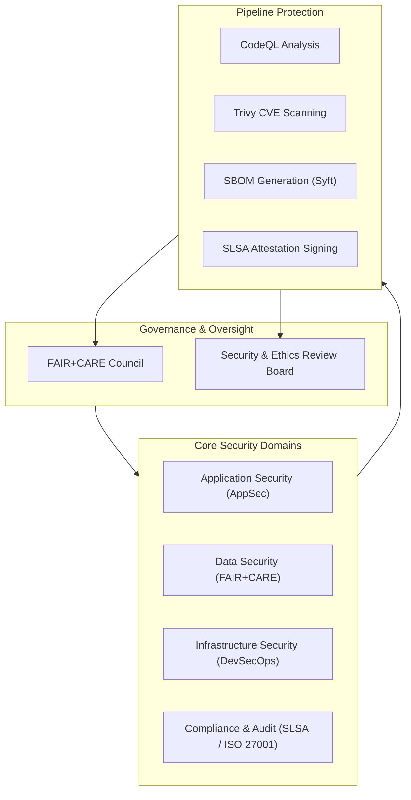
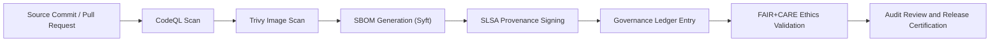

# 🔐 **Kansas Frontier Matrix — Security & Compliance Architecture (v2.1.1 · Tier-Ω+∞ Certified)**  
`docs/architecture/security.md`

**Mission:** Define the **security, compliance, and governance-by-design framework** that protects and verifies all systems,  
datasets, and pipelines in the **Kansas Frontier Matrix (KFM)** — aligning with FAIR+CARE, SLSA, and ISO 27001 principles.

---

## 📚 Overview

The **Security & Compliance Architecture** ensures that KFM’s systems, pipelines, and datasets maintain integrity, confidentiality, and ethical compliance.  
Security and governance are **fully embedded into CI/CD**, with immutable provenance for every code, data, and documentation artifact.

This architecture implements **DevSecOps principles** through automation, continuous validation, and governance-led auditing.

---

## 🧩 Security Framework Overview

<!-- END OF MERMAID -->

---

## 🧱 Security Architecture Domains

| Domain | Objective | Tooling / Frameworks | Outputs |
|:--|:--|:--|:--|
| **Application Security** | Static and dynamic code scanning for vulnerabilities. | GitHub CodeQL, Bandit | SARIF reports |
| **Data Security** | Governance, ethics, and privacy for datasets. | FAIR+CARE audits, OPA | FAIR+CARE reports |
| **Infrastructure Security** | Secure builds, container hardening, dependency checks. | Trivy, Grype, Docker Security Bench | CVE reports |
| **Supply Chain Security** | Provenance attestation for all artifacts. | SLSA, SPDX SBOM | Signed manifest |
| **Compliance & Audit** | Traceable governance of data and system integrity. | OPA / Conftest / Audit Trails | Ledger entries |

---

## ⚙️ Compliance Layers

| Layer | Standard | Implementation |
|:--|:--|:--|
| **Build Integrity** | SLSA Level 3 | Verified build provenance and GPG signing |
| **Dependency Security** | OWASP Top 10 / CVE Scans | Trivy + CodeQL |
| **Data Ethics** | FAIR+CARE | `faircare-validate.yml` |
| **Governance & Provenance** | ISO 27001 Annex A | Governance ledger + risk register |
| **Open Standards** | SPDX / CycloneDX | `releases/v*/sbom.spdx.json` |

---

## 🧮 Security Pipeline Lifecycle

<!-- END OF MERMAID -->

Each security event (commit, merge, release) is recorded with:
- SHA-256 checksum  
- GPG signature  
- Governance council sign-off  

---

## 🔍 Security Validation Workflows

| Workflow | Function | Output |
|:--|:--|:--|
| `codeql.yml` | Static application security analysis. | `reports/security/codeql_analysis.json` |
| `trivy.yml` | CVE scanning for containers and dependencies. | `reports/security/trivy_scan_results.json` |
| `sbom.yml` | SBOM creation and license verification. | `releases/v*/sbom.spdx.json` |
| `slsa.yml` | Attestation signing and supply chain verification. | `releases/v*/slsa.attestation.json` |
| `faircare-validate.yml` | Ethical and data governance audit. | `reports/fair/data_care_assessment.json` |
| `governance-ledger.yml` | Records security decisions and attestations. | `data/reports/audit/security_ledger.json` |

---

## ⚖️ FAIR + CARE Integration

| Principle | Security Mapping | Verification |
|:--|:--|:--|
| **Findable** | Index all signed artifacts with provenance metadata. | `manifest.zip` |
| **Accessible** | Open publication of SBOM and SLSA attestations. | GitHub Releases |
| **Interoperable** | SPDX and CycloneDX formats. | SBOM CI |
| **Reusable** | Signed, reproducible builds for all components. | Governance Ledger |
| **Collective Benefit (CARE)** | Ethical transparency reports publicly accessible. | FAIR+CARE Reports |

---

## 🧠 Security Controls & Mitigations

| Threat Category | Mitigation | Standard |
|:--|:--|:--|
| **Code Vulnerabilities** | CodeQL + static analysis pipelines. | OWASP Top 10 |
| **Dependency Risks** | SBOM generation and Trivy CVE scanning. | NIST SSDF |
| **Data Exposure** | FAIR+CARE-controlled access and masking. | GDPR / CARE |
| **Supply Chain Tampering** | SLSA attestation signing. | SLSA 3 |
| **Documentation Drift** | CI/CD policy checks and versioned manifests. | MCP-DL v6.4.3 |

---

## 🧩 Governance & Audit Integration

| Governance Process | Function | Evidence |
|:--|:--|:--|
| **Ethical Review** | Evaluate data and model risks. | `reports/fair/data_care_assessment.json` |
| **Risk Register** | Log security and privacy issues. | `docs/governance/security_risk_register.md` |
| **Ledger Recording** | Record hash, attestation, and sign-offs. | `data/reports/audit/security_ledger.json` |
| **Audit Certification** | Quarterly FAIR+CARE board approval. | Governance Council Minutes |

---

## 🧩 Observability Metrics

| Metric | Description | Target | Source |
|:--|:--|:--|:--|
| **vulnerability_count** | Total open CVEs. | ≤ 0 | `trivy.yml` |
| **build_integrity** | SLSA provenance verification. | 100% | `slsa.yml` |
| **sbom_completeness** | Coverage of dependencies in SBOM. | ≥ 99% | `sbom.yml` |
| **ethics_compliance_score** | FAIR+CARE ethics audit score. | ≥ 95 | `faircare-validate.yml` |
| **governance_audit_rate** | Quarterly audit coverage. | 100% | Governance Council |

---

## 🧾 Version History

| Version | Date | Author | Summary |
|:--|:--|:--|:--|
| **v2.1.1** | 2025-11-16 | @kfm-security | Added SLSA 3 attestation flow, FAIR+CARE integration, and CI/CD governance mapping. |
| v2.0.0 | 2025-10-25 | @kfm-architecture | Introduced DevSecOps security lifecycle with provenance validation. |
| v1.0.0 | 2025-10-04 | @kfm-security | Initial security architecture and governance structure. |

---

**Kansas Frontier Matrix © 2025**  
*“Security is Provenance — Ethics is Assurance.”*  
📍 `docs/architecture/security.md` — Security and compliance architecture for the Kansas Frontier Matrix.

