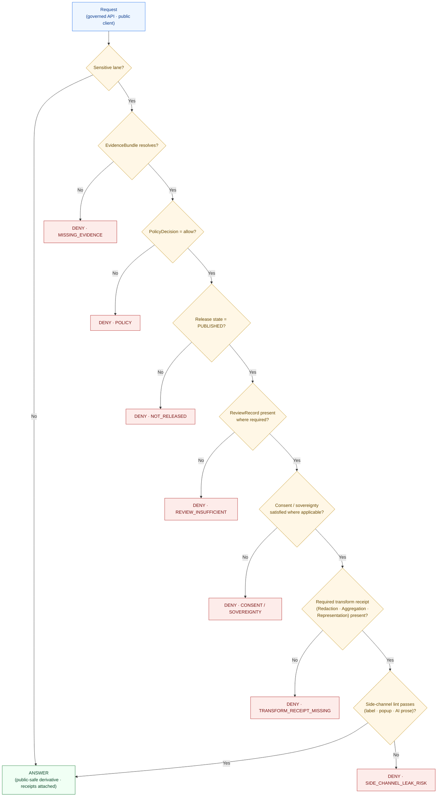

<!-- [KFM_META_BLOCK_V2]
doc_id: kfm://doc/architecture-sensitive-domain-fail-closed
title: Sensitive-Domain Fail-Closed — Architecture
type: standard
version: v1
status: draft
owners: <Sensitivity reviewer + Rights-holder reps + Docs steward — TBD>
created: 2026-05-25
updated: 2026-05-25
policy_label: public
related:
  - docs/architecture/README.md
  - docs/architecture/release-discipline.md
  - docs/architecture/release-model.md
  - docs/architecture/governed-api.md
  - docs/architecture/planetary-3d.md
  - docs/architecture/people-place-joins.md
  - docs/architecture/maplibre-3d.md
  - docs/doctrine/lifecycle-law.md
  - docs/doctrine/trust-membrane.md
  - docs/doctrine/truth-posture.md
  - docs/doctrine/authority-ladder.md
  - docs/standards/SENSITIVITY_RUBRIC.md
  - docs/standards/REDACTION_DETERMINISM.md
  - docs/standards/PROV.md
  - docs/runbooks/revocation.md
  - docs/domains/archaeology/README.md
  - docs/domains/fauna/README.md
  - docs/domains/flora/README.md
  - docs/domains/people-dna-land/README.md
  - docs/domains/settlements-infrastructure/README.md
  - docs/domains/hazards/README.md
tags: [kfm, architecture, sensitivity, fail-closed, deny-by-default, redaction, geoprivacy, sovereignty, consent]
notes:
  - Repo not mounted in authoring session; all path claims are PROPOSED.
  - Open ADR-S-05 ("Sensitivity tier scheme (T0–T4) — adopt as canonical or revise") is the unresolved tension between the Pass-10 C6-01 rubric (0–5) and the Atlas §24.5 tier scheme (T0–T4); both are surfaced here, neither is silently chosen.
  - PROV.md / PROVENANCE.md naming variance tracked at directory-rules §18 OPEN-DR-01.
[/KFM_META_BLOCK_V2] -->

# Sensitive-Domain Fail-Closed — Architecture

> Across KFM's sensitive lanes — archaeology, sensitive fauna, rare flora, critical infrastructure, living-person and DNA, private land joins, hazards-as-authority — the public surface **fails closed by default**. This doc consolidates the rules, the deny lanes, the allowed transforms, the required artifacts, the side-channel disciplines, and the open governance questions into one cross-cutting reference.

**Status** · draft &nbsp;·&nbsp; **Owners** · *Sensitivity reviewer + Rights-holder reps + Docs steward — TBD* &nbsp;·&nbsp; **Updated** · 2026-05-25

---

## Quick jump

- [1. Scope and posture](#1-scope-and-posture)
- [2. What "fail-closed" means](#2-what-fail-closed-means)
- [3. The sensitive-domain list](#3-the-sensitive-domain-list)
- [4. Two sensitivity schemes — and an open ADR](#4-two-sensitivity-schemes--and-an-open-adr)
- [5. The deny-by-default register](#5-the-deny-by-default-register)
- [6. The fail-closed decision flow](#6-the-fail-closed-decision-flow)
- [7. Per-domain fail-closed table](#7-per-domain-fail-closed-table)
- [8. Tier transitions](#8-tier-transitions)
- [9. Required artifacts at each transition](#9-required-artifacts-at-each-transition)
- [10. Side-channel and inference risk](#10-side-channel-and-inference-risk)
- [11. Style-only hiding is forbidden](#11-style-only-hiding-is-forbidden)
- [12. AI surface in sensitive domains](#12-ai-surface-in-sensitive-domains)
- [13. Health indicators](#13-health-indicators)
- [14. Anti-patterns](#14-anti-patterns)
- [15. Verification backlog](#15-verification-backlog)
- [16. Related docs](#16-related-docs)

---

## 1. Scope and posture

### 1.1 What this doc is

This document consolidates the **cross-cutting fail-closed posture** that KFM applies to its sensitive domains. Per-domain READMEs (`docs/domains/archaeology/`, `docs/domains/fauna/`, etc., all PROPOSED) hold the domain-specific rules; this doc holds the rules that apply *uniformly* across them and that downstream surfaces — governed API, MapLibre runtime, Focus Mode AI, story/export exports — must enforce identically.

### 1.2 The posture in one sentence

**CONFIRMED doctrine** (Atlas Appendix F self-check; Atlas §20.5 *Deny-by-Default Register*): *Archaeology, rare fauna/flora, infrastructure, living-person and DNA controls are deny-by-default.* The public surface emits **DENY** for these lanes unless an explicit, evidenced, receipted, reviewed, and policy-allowed transform has produced a public-safe derivative — and even then, the derivative is what ships, never the original.

### 1.3 Non-goals

- This document does **not** define the wire format of `RedactionReceipt`, `AggregationReceipt`, `PolicyDecision`, `ReviewRecord`, or `ConsentMetadata`; those live in `schemas/contracts/v1/receipts/...` and `schemas/contracts/v1/policy/...` (PROPOSED paths; **NEEDS VERIFICATION** in mounted repo).
- This document does **not** describe per-domain source families; those live in each `docs/domains/<domain>/README.md` (PROPOSED).
- This document does **not** name redaction-profile parameter values (radius, jitter seed, epsilon, etc.); those live in `docs/standards/REDACTION_DETERMINISM.md` (PROPOSED in corpus Pass-10 C6-02..06; not yet authored).
- This document does **not** describe the governed-API request/response shape; see `docs/architecture/governed-api.md` (PROPOSED).

> [!IMPORTANT]
> Fail-closed is a default, not a ceiling. Domains and surfaces are free to be *more* restrictive than this doc requires. They are not free to be less.

---

## 2. What "fail-closed" means

### 2.1 The four invariants

| Invariant | What it means |
|---|---|
| **Deny by default.** | The starting answer for any sensitive-lane request is DENY. Transforms, reviews, and policy decisions move it toward ALLOW; their absence keeps it at DENY. |
| **No silent allow.** | An ALLOW outcome is always backed by a recorded PolicyDecision, a ReviewRecord where required, and one or more transform/redaction/aggregation receipts. There is no "default permitted" lane. |
| **No style-as-policy.** | Public surfaces never *hide* sensitive geometry with paint properties, opacity, or zoom thresholds. Public-safe geometry is produced upstream and is *all* the public surface ever sees. |
| **No carrier as evidence.** | Tiles, maps, scenes, popups, AI prose, screenshots, and exports are **carriers**. None of them is the source of an allow decision. The allow decision lives in the policy bundle, on the policy decision, against the EvidenceBundle. |

### 2.2 The closed-system corollary

**CONFIRMED doctrine** (Atlas §24.6.2 universal closure rule, applied to sensitivity gates): a sensitive-lane transition is closed only when:

1. The required artifacts for the transition exist (RedactionReceipt and/or AggregationReceipt; ReviewRecord; PolicyDecision; sometimes ConsentMetadata, RepresentationReceipt, RealityBoundaryNote).
2. Every required artifact **resolves** the artifacts it depends on (`EvidenceRef → EvidenceBundle`, `policy_id → policy bundle`, `reviewer → identity`).
3. The policy gate evaluated and recorded its decision with a reason code.

Missing any of these means the transition fails closed and the prior state — the denied state — is preserved.

---

## 3. The sensitive-domain list

**CONFIRMED doctrine** (AI Build Operating Contract §23.1; Atlas §20.5; KFM Encyclopedia §11). When involved in any flow, the lanes below require heightened caution:

- Archaeology — exact sites, burial, human remains, sacred sites, looting-risk detail.
- Cultural heritage — Indigenous knowledge, treaty, oral-history, or steward-controlled records.
- Sensitive fauna — exact sensitive occurrences; nests, dens, roosts, hibernacula, spawning sites.
- Rare flora — exact rare, protected, or culturally sensitive plant locations.
- Critical infrastructure — assets, dependencies, condition / vulnerability detail.
- Living people — identifiers, private-output identity.
- Genealogy and DNA / genomic data — raw DNA ids, DNA segments, kit-level records.
- Private land and land-ownership joins — private person-parcel joins; private operator-parcel joins.
- Hazards and emergency-adjacent content — alert-authority claims; instruction framing.
- Restricted source terms — sources whose rights or sovereignty status forbid public surface.
- Exact coordinates that could enable harm — irrespective of which domain owns them.

### 3.1 The "sensitive by composition" rule

A lane may be sensitive even when no single contributing input is sensitive by itself. **CONFIRMED risk** (Atlas §24.10 *Living-person data exposed via inference*): an aggregate + context join can re-identify, even when each input is open. The composition is what fails closed, not the inputs.

---

## 4. Two sensitivity schemes — and an open ADR

### 4.1 The two schemes

KFM has **two** sensitivity vocabularies in active doctrine. This is a real, unresolved tension — explicitly tracked under **ADR-S-05** ("Sensitivity tier scheme (T0–T4) — adopt as canonical or revise").

| Scheme | Source | Status | Range |
|---|---|---|---|
| **Pass-10 sensitivity rubric** | Pass-10 C6-01 | **CONFIRMED** | `sensitivity_rank` ∈ {0, 1, 2, 3, 4, 5} |
| **Atlas tier scheme** | Atlas §24.5.1 | **PROPOSED** | `T0`, `T1`, `T2`, `T3`, `T4` |

> [!CAUTION]
> Until ADR-S-05 resolves, **do not silently map between schemes**. The two are similar in intent but not identical in granularity. The Pass-10 rubric distinguishes rank 4 (threatened/rare) from rank 5 (sacred/critical / fail-closed); the Atlas tier scheme collapses both into T4. Both schemes recognize public/open as the lowest level and fail-closed as the highest, but the meaning of intermediate ranks differs.

### 4.2 Pass-10 rubric (CONFIRMED, Pass-10 C6-01)

| Rank | Label | Default posture |
|---|---|---|
| 0 | public / open | open by default |
| 1 | common non-sensitive | open by default |
| 2 | watchlist | profile-required generalization |
| 3 | SINC / locally sensitive | default profile `profile:sinc-obscure-10km` |
| 4 | threatened / rare | strict mask or embargo |
| 5 | sacred / critical | fail-closed; no map / timeline exposure |

### 4.3 Atlas tier scheme (PROPOSED, Atlas §24.5.1)

| Tier | Name | Definition | Default audience |
|---|---|---|---|
| **T0** | Open | Public-safe with no transforms; no rights/sensitivity/steward gating beyond standard release | Any public client via governed API |
| **T1** | Generalized | Public-safe only after generalization, fuzzing, aggregation, or redaction; transform reviewed and recorded | Any public client via governed API |
| **T2** | Reviewer | Released only to authenticated reviewers or domain stewards; policy-bounded; correction path active | Stewards, reviewers, named research collaborators |
| **T3** | Restricted | Released only under named agreement (rights, sovereignty, consent) and recorded | Named authorized parties only |
| **T4** | Denied | Not released to any audience; existence of a record may be released only as steward review permits | — |

### 4.4 How this doc handles the tension

This doc presents both schemes verbatim. Where the per-domain table (§7) uses one or the other, it uses the **Atlas tier scheme** because that is the form the Atlas §24.5.2 *Per-domain tier matrix* uses; the Pass-10 rubric is referenced where it is the authoritative source (e.g., the redaction-profile lookup in `docs/standards/REDACTION_DETERMINISM.md`, PROPOSED). Mapping is **deferred to ADR-S-05**.

---

## 5. The deny-by-default register

**CONFIRMED doctrine** (Atlas §20.5; KFM Encyclopedia §11.1). The register below is doctrinal; it is what gates against by default.

| Domain / surface | Denied by default | Allowed only when |
|---|---|---|
| **Archaeology** | Exact sites, burial, human remains, sacred sites, looting-risk detail | Steward / cultural review + transform receipt + EvidenceBundle |
| **Fauna** | Exact sensitive occurrences; nests, dens, roosts, hibernacula, spawning sites | Geoprivacy generalization + RedactionReceipt + public-safe derivative |
| **Flora** | Exact rare, protected, or culturally sensitive plant locations | Steward review + generalized / withheld geometry + RedactionReceipt |
| **Critical infrastructure** | Critical assets, dependencies, condition detail | Steward review + public-safe generalization |
| **People / DNA / Land** | Living-person private output; raw DNA ids; DNA segments; private person-parcel joins | Consent + policy + restricted authorized surface |
| **Hazards** | Emergency instructions; KFM as alert authority | **Never allowed as KFM authority** |
| **Governed AI** | RAW / WORK access; uncited claims; direct model-to-public traffic | Released EvidenceBundle + policy-safe context + AIReceipt |
| **Planetary / 3D scenes** | Sensitive 3D scene content | Steward review + generalization / clipping / withholding + RealityBoundaryNote + RepresentationReceipt |
| **Restricted source terms** | Sources whose rights are unresolved or unknown | Rights-holder review + SourceDescriptor update + admission gate pass |

### 5.1 The Hazards rule is permanent

**CONFIRMED doctrine** (Atlas §24.5.2): *No transform permits KFM to act as an emergency-alert authority. The boundary holds.* This is the one row in the register that **never** has an allow path — it is a doctrinal floor, not a starting posture.

---

## 6. The fail-closed decision flow

The flow below applies to every request the governed API receives for a sensitive lane. It is uniform across domains.

> [!NOTE]
> The order of checks is illustrative; in practice the governed API may evaluate them in parallel or in a different ordering for performance. What matters is that **every** check must pass; any failure produces a finite DENY (or ABSTAIN) outcome with a reason code (see `docs/architecture/release-discipline.md` §6).

---

## 7. Per-domain fail-closed table

**CONFIRMED doctrine / PROPOSED tier labels** (Atlas §24.5.2 *Per-domain tier matrix*; §20.5 *Deny-by-Default Register*). Tier values use the Atlas T0–T4 scheme pending ADR-S-05 resolution.

| Domain / object class | Default tier | Allowed transforms | Required gates |
|---|---|---|---|
| Archaeology — site location | **T4** | Steward + cultural review + generalized geometry (coarse cell) + RedactionReceipt → T2 or T1 | RedactionReceipt + ReviewRecord + PolicyDecision |
| Archaeology — human remains / sacred sites | **T4** | No transform releases this to T0; T3 only under explicit named authorization | Sovereignty review + ReviewRecord + PolicyDecision |
| Fauna — sensitive occurrence | **T4** | Geoprivacy generalization + RedactionReceipt → T1 | RedactionReceipt + ReviewRecord + PolicyDecision |
| Fauna — range polygon | T1 | Aggregate / generalized public-safe layer | AggregationReceipt or RedactionReceipt |
| Flora — rare or culturally sensitive plant location | **T4** | Generalized geometry + steward review → T2 or T1 | RedactionReceipt + ReviewRecord |
| People / DNA — living-person fields | **T4** | Aggregation by tract or county + AggregationReceipt → T1 | Consent or aggregation gate + ReviewRecord |
| People / DNA — raw DNA segment data | **T4** | No transform releases this to a public tier; T3 only under explicit research agreement | Named consent + ReviewRecord + PolicyDecision |
| People / Land — private person-parcel join | **T4** | Generalized parcel + de-identified person → T2 only | RedactionReceipt + ReviewRecord |
| Infrastructure — critical asset detail | **T4** | Generalized facility footprint + suppressed dependency → T1 | Steward review + RedactionReceipt |
| Infrastructure — condition / vulnerability | **T4** | T3 to named authorities only; **never T0 / T1** | Steward review + named-party agreement |
| Hazards — KFM as alert authority | **T4 forever** | **No transform permits KFM to act as an emergency-alert authority. The boundary holds.** | Policy boundary; deny at runtime |
| Governed AI — RAW / WORK access via AI surface | **T4** | AI never reads RAW or WORK content; only released EvidenceBundle | PolicyDecision + AIReceipt |
| Planetary / 3D — sensitive 3D scene content | **T4** | Generalization / clipping / withholding + RealityBoundaryNote + RepresentationReceipt → T1 or T2 where steward review supports | Steward review + RedactionReceipt + RepresentationReceipt |

### 7.1 What this table does not do

- It does **not** enumerate every domain object family. See per-domain READMEs.
- It does **not** specify redaction-profile parameters (radius, cell size, jitter seed, DP epsilon). See `docs/standards/REDACTION_DETERMINISM.md` (PROPOSED).
- It does **not** establish a final tier-scheme vocabulary. See ADR-S-05.

---

## 8. Tier transitions

**CONFIRMED doctrine** (Atlas §24.5.3 *Tier transitions*): tier movement is asymmetric — moving toward *more public* always requires both a transform receipt and a review record; moving toward *less public* never requires both.

| From → To | Required artifact | Required reviewer | Reversibility |
|---|---|---|---|
| **T4 → T3** | PolicyDecision + ReviewRecord + agreement | Steward + rights-holder where applicable | Reversible: agreement revocation returns object to T4 with CorrectionNotice |
| **T4 → T2** | PolicyDecision + ReviewRecord | Steward | Reversible: review revocation returns object to T4 |
| **T4 → T1** | RedactionReceipt + ReviewRecord | Steward | Reversible: redaction can be re-evaluated; correction may demote a published T1 to T4 |
| **T3 → T2** | PolicyDecision + ReviewRecord | Steward | Reversible |
| **T2 → T1** | RedactionReceipt + ReviewRecord | Steward | Reversible |
| **T1 → T0** | ReleaseManifest + ReviewRecord | Steward + release authority | Reversible: rollback supported via RollbackCard |
| **Any tier → T4 (downgrade)** | CorrectionNotice + ReviewRecord | Steward + rights-holder where applicable | Always permitted; precedes derivative invalidation |

### 8.1 The reading rule

A tier *upgrade* (toward more public) always needs both a transform receipt and a review record. A tier *downgrade* (toward less public) never needs both — **correction alone is sufficient to remove or restrict**. This asymmetry is intentional and load-bearing: it makes restricting *fast* and exposing *slow*.

---

## 9. Required artifacts at each transition

The artifacts below carry the audit trail for every sensitive-lane transition. They are the same artifacts named in the receipt catalog (`docs/architecture/release-model.md` §4), specialized to sensitive use.

| Artifact | What it pins for sensitive lanes |
|---|---|
| **SourceDescriptor** | Source role, rights, sensitivity, cadence at admission — fixed; never edited in place |
| **RedactionReceipt** | The exact public-safe transformation: profile, parameters, seeding rule, kept / removed fields, reviewer |
| **AggregationReceipt** | The geometry scope and time scope of any aggregation; the suppression rule that protected underlying records |
| **RepresentationReceipt** | Where surface fidelity differs from evidence fidelity (3D scene from 2D evidence, synthetic terrain, tile downsampling) — with `reality_boundary_note_ref` populated |
| **RealityBoundaryNote** | The narrative statement of what is real and what is reconstructed, when the carrier is synthetic or interpretive |
| **ReviewRecord** | Steward, sensitivity reviewer, rights-holder rep, or release-authority decision, with role and reason |
| **PolicyDecision** | The policy bundle's evaluation: rule id, target, decision, reason code, time, evidence refs |
| **ConsentMetadata** | Pointer-only consent proof (no raw PII in tile sidecars or public artifacts); revocation endpoint referenced |
| **AIReceipt** | When any AI surface produced output bearing on the sensitive lane: prompt scope, evidence refs, policy decision, outcome, reason code |
| **CorrectionNotice / RollbackCard** | When a sensitive-lane release is corrected or rolled back; lists invalidated derivatives |

### 9.1 Named redaction profiles

**CONFIRMED doctrine** (Pass-10 C6-02 *Named Redaction Profiles*): Redactions reference a named profile (e.g. `profile:sinc-obscure-10km`) rather than inline parameters. Each profile ships its method documentation, its Rego fixture stating which sensitivity ranks it satisfies, and a verifier that re-runs the transform from the receipt's parameters and checks determinism.

The corpus shows three canonical profiles plus a no-op:

| Profile (PROPOSED naming) | Method |
|---|---|
| `point_10km_hex_seeded_v1` | Hex-grid seeded generalization at 10 km |
| `point_3km_jitter_v1` | Seeded jitter at 3 km |
| `centroid_1km_v1` | Centroid + 1 km coarse time bucket |
| `kfm:redact:none` | No-op (recorded explicitly for auditability) |

Parameter values, seeding rules, and per-profile fixtures live in `docs/standards/REDACTION_DETERMINISM.md` (PROPOSED in corpus; not yet authored).

---

## 10. Side-channel and inference risk

### 10.1 The side-channel catalog

**CONFIRMED risk** (Atlas §24.10): sensitive coordinates can leak through carriers other than the geometry. Side-channel lint must cover at least:

| Channel | Leak vector | Counter-rule |
|---|---|---|
| **Tile field allowlist** | A tile carries a field whose value reveals the redacted location (place name; school district; survey ID) | Tile schema declares attribute allowlist; validator rejects fields not on the list |
| **Popup text** | A popup shows the original coordinate, address, or revealing free text | Popups derived from public-safe payload only; popup text is a *carrier*, not the source of an allow decision |
| **Label / glyph density** | Label placement reveals exact locations even when the underlying geometry is generalized | Label density is part of the StyleManifest; review covers density, not just colors |
| **AI prose** | A Focus Mode answer paraphrases the precise location it should have abstained on | AI surface enforces cite-or-abstain; AIReceipt records the evidence the answer cited |
| **Export / screenshot** | A user exports a screenshot or PDF that includes uncited or precise content | Exports carry release id, artifact digest, citations, limitations; uncited export is forbidden |
| **Aggregate + context join** | Two open inputs join to re-identify a sensitive record | Minimum-cell suppression; person-parcel join denial; periodic threat modeling of joins |
| **Stale-vs-fresh delta** | A diff between releases reveals what changed in a sensitive layer | Stale-state markers + Correction discipline; diffs themselves are receipted |

### 10.2 Inference risk grows with cross-lane joins

**CONFIRMED risk** (Atlas §24.10 *Living-person data exposed via inference (e.g., aggregate + context join)*): the inference risk surface is **the join**, not the inputs. Cross-lane joins involving People / DNA / Land are governed in `docs/architecture/people-place-joins.md`; the rules there apply at admission time and at composition time, before the joined claim becomes a release.

> [!WARNING]
> An aggregate that is safe to publish alone may become unsafe to publish next to a context layer that, together with the aggregate, re-identifies. This is not a flaw in the aggregate — it is a flaw in the composition. The fix is at the join, not at the inputs.

---

## 11. Style-only hiding is forbidden

### 11.1 The rule

**CONFIRMED doctrine** (Master MapLibre Category Q; `docs/architecture/maplibre-3d.md` §8.2; Atlas §29.2 anti-patterns):

*No sensitive geometry hidden only by style: archaeology, species, living-person, infrastructure, and culturally sensitive geometry must be generalized, redacted, delayed, or denied before public tile production.*

### 11.2 What the right pattern looks like

A CARE-masked archaeology layer reaching the renderer has already been transformed upstream:

1. Original coordinates remain canonical, **not public** — they live under `data/processed/<domain>/...` (PROPOSED).
2. A generalization pipeline produces a published, transformed derivative under `data/published/layers/<domain>/<dataset>-<profile>.pmtiles` (PROPOSED).
3. The `LayerManifest` declares the transform (`sensitivity.transform = "<profile_id>"`) and references the authorizing `PolicyDecision`.
4. The renderer (MapLibre + plugins) only ever sees the generalized version.

### 11.3 Why style-as-policy fails

Public clients can read style JSON. Devtools can re-enable hidden layers. Zoom thresholds can be overridden. Opacity can be flipped. Tile sets stream at every zoom they were generated at, regardless of style. Style filters and paint properties are *display* primitives — they have no security or sensitivity meaning. Treating them as policy is a CONFIRMED anti-pattern; the geometry must be public-safe **at the carrier layer**, not at the renderer.

---

## 12. AI surface in sensitive domains

**CONFIRMED doctrine** (Atlas §20.5 deny-by-default for Governed AI; per-domain L. sections "AI may summarize released … EvidenceBundles, compare evidence, explain limitations, and draft steward-review notes; AI must ABSTAIN when evidence is insufficient and DENY where policy, rights, sensitivity, or release state blocks the request"):

### 12.1 What the AI may do

- Summarize released EvidenceBundles for the domain.
- Compare evidence across released bundles.
- Explain limitations cited in the bundles.
- Draft steward-review notes for human review.

### 12.2 What the AI must do

| Trigger | Required outcome |
|---|---|
| Evidence is insufficient | ABSTAIN with reason code; AIReceipt emitted |
| Policy, rights, sensitivity, or release state blocks the request | DENY with reason code; AIReceipt emitted |
| AI cannot cite | ABSTAIN; never invents a citation |
| Synthetic content would be presented as observed reality | DENY; RealityBoundaryNote referenced |

### 12.3 What the AI must never do

- Read RAW or WORK content. The AI surface sees only released EvidenceBundle.
- Cross the trust membrane: no direct model-to-public traffic, no admin path acting as the normal public path.
- Summarize a sensitive-lane location to a precision the underlying public-safe carrier does not support. Cite-or-abstain holds in prose, not just in tile output.

### 12.4 AIReceipt is mandatory

Every Focus Mode answer touching a sensitive lane carries an AIReceipt. The receipt is **never superseded retroactively** — a new answer is a new receipt, with cross-reference (`docs/architecture/release-model.md` §10.1).

---

## 13. Health indicators

**PROPOSED indicators** (Atlas §24.11.3 *Sensitivity and rights*). These are reported, not enforced; enforcement is the validator's job.

| Indicator | What it measures | Healthy posture |
|---|---|---|
| **Sensitive-lane fail-closed rate** | % of unauthorized sensitive-lane requests that DENY at the first gate | **100% at the first gate** |
| **RedactionReceipt coverage** | % of public-safe transformations that emit a RedactionReceipt | **100% for sensitive lanes** |
| **Review-aged-out incidence** | Number of sensitive-lane claims past their review cadence | Visibly tracked; trend not regressing |
| **Rights-change response time** | Median time from rights-change detection to tier reassignment | Within stated tolerance per source family |
| **Sensitive-content side-channel audit** | Frequency of automated checks for label / popup / AI-text leaks | Periodic; documented |
| **Synthetic-claim incidence** | % of audited AI answers flagged for presenting synthetic content as observed | Approaches zero; never silently |
| **ABSTAIN rate by template** | How often each Focus Mode template abstains on sensitive-lane prompts | Visibly tracked; very low ABSTAIN suggests over-fitting; very high suggests evidence gaps |
| **DENY reason distribution** | Reason codes returned by sensitive-lane denials | Stable; large new-reason spikes investigated |

---

## 14. Anti-patterns

<strong>Click to expand: catalog of sensitive-domain fail-closed anti-patterns</strong>

| Anti-pattern | Why it fails | Counter-rule |
|---|---|---|
| **Style-only hiding of sensitive geometry** | Public client devtools / zoom override reveal "hidden" data | Transform, redact, generalize, or deny **upstream** of the renderer (§11) |
| **Treating popup text as policy** | Popups derived from canonical fields leak the data they pretend to summarize | Popups derived only from public-safe payload; popup text is a carrier, not the allow decision |
| **Aggregate-as-per-place truth** | Source-role collapse from aggregate → observed | DENY cell→single-record join; AggregationReceipt with geometry-scope guard |
| **Living-person fields joined opportunistically** | Inference risk; rights violation | Default T4; consent + policy + restricted authorized surface required |
| **Person-parcel join from private records** | Discloses ownership + identity simultaneously | DENY by default; restricted authorized surface only |
| **DNA segment join inferred via name + place co-occurrence** | Re-identifies kit holders | DENY raw segments; consent + policy + restricted surface |
| **Style filter or zoom threshold used as redaction** | Display primitive masquerading as security primitive | Sensitivity transforms happen at the carrier layer, not the renderer |
| **AI prose paraphrasing a redacted location to a precision the carrier does not support** | Cite-or-abstain violated in prose where it would not be in tile output | AIReceipt + CitationValidationReport; ABSTAIN when paraphrase would over-disclose |
| **Synthetic content presented as observed reality** | Reconstruction read as observation | RealityBoundaryNote + RepresentationReceipt; DENY without |
| **KFM acting as alert / instruction authority** | Out-of-scope life-safety use | DENY forever — no transform permits this (§5.1) |
| **Tile carries an attribute not on the allowlist** | Side-channel leak via vector tile properties | Tile schema declares allowlist; validator rejects unknown fields |
| **Export without citations or release-id pinning** | Sensitive content escapes the audit trail | Exports carry release id, digests, citations; uncited export forbidden |
| **Reviewer same as author on a sensitive-lane release** | Self-approval defeats separation of duties | Tooling-enforced separation; sensitive-lane release requires author + sensitivity reviewer + release authority + rights-holder rep |
| **Rights change in upstream source not propagated to public surface** | Rights-revoked content continues to ship | Rights-change response time tracked; CorrectionNotice emitted; tier downgrade does not wait |
| **Tombstoned bundle still pointed at by manifest** | Bundle hidden but still authoritative-by-pointer | Tombstone resolution surfaces at request time; manifest using tombstoned bundle fails closed |
| **"We caught it later" framing** | Implies fail-open as default with retroactive fix | Default is closed. Catching it later is correction; it is not the operating model |
| **Aggregate + context join not threat-modeled** | Inference risk grows quietly | Periodic join threat-modeling; minimum-cell suppression; person-parcel denial by default |

---

## 15. Verification backlog

| Item | Evidence that would settle it | Status |
|---|---|---|
| ADR-S-05 — Sensitivity tier scheme (T0–T4 vs Pass-10 rubric 0–5) resolved | Accepted ADR | **PROPOSED open** |
| `docs/standards/SENSITIVITY_RUBRIC.md` authored (Pass-10 C6-01 expansion) | Mounted doc | **PROPOSED; not yet authored** |
| `docs/standards/REDACTION_DETERMINISM.md` authored (Pass-10 C6-02..06 expansion) | Mounted doc | **PROPOSED; not yet authored** |
| Named redaction profiles catalog (`policy/redaction/profiles.yaml`) present | Mounted file + per-profile verifier | **NEEDS VERIFICATION** |
| `policy/sensitivity/<domain>/*.rego` present for archaeology, fauna, flora, infrastructure, people, consent | Mounted policy bundle + Conftest fixtures | **NEEDS VERIFICATION** |
| Tile attribute allowlist enforced by validator (§10.1) | Mounted validator + sample failing fixture | **PROPOSED** |
| Side-channel lint job (label / popup / AI prose) wired in CI | Workflow file + sample failing fixture | **PROPOSED** |
| Cross-lane join threat model (§10.2) authored | `docs/architecture/people-place-joins.md` §10 verification backlog already references this | **PROPOSED** |
| Cite-or-abstain enforcement for AI surface in sensitive lanes (§12) | OPA policy + AIReceipt sampling job | **NEEDS VERIFICATION** |
| Consent token / GA4GH Passport gatehouse for People / DNA lanes | Mounted runtime + sample failing fixture | **NEEDS VERIFICATION** |
| Rights-change detection automation for third-party sources (Atlas §24.10) | Watcher / monitor for upstream rights changes | **PROPOSED open** |
| Sensitive-lane fail-closed rate measurement (§13) | Dashboard / report from governed API logs | **PROPOSED** |
| RedactionReceipt coverage measurement (§13) | Dashboard / report from receipt store | **PROPOSED** |
| Revocation runbook (`docs/runbooks/revocation.md`) | Mounted runbook (Pass-10 C5-09 expansion) | **PROPOSED; not yet authored** |
| Tombstone vs erasure boundary documented | Mounted runbook | **PROPOSED open** |
| This file's canonical path `docs/architecture/sensitive-domain-fail-closed.md` | Mounted `docs/architecture/` tree + README index | **PROPOSED** |

> [!NOTE]
> All file paths in this document are **PROPOSED** per directory-rules. Verify against a mounted repo before linking from neighboring docs.

[Back to top](#sensitive-domain-fail-closed--architecture)

---

## 16. Related docs

- `docs/architecture/README.md` — architecture index *(TODO: link verify)*
- `docs/architecture/release-discipline.md` — process: gates, separation of duties, reason codes *(authored prior; PROPOSED path)*
- `docs/architecture/release-model.md` — data model: receipts, manifests, references *(authored prior; PROPOSED path)*
- `docs/architecture/governed-api.md` — the surface fail-closed is enforced through *(PROPOSED)*
- `docs/architecture/planetary-3d.md` — 3D admission gate; Reality Boundary Note discipline *(authored prior; PROPOSED path)*
- `docs/architecture/people-place-joins.md` — cross-lane join sensitivity; inference-risk threat model *(authored prior; PROPOSED path)*
- `docs/architecture/maplibre-3d.md` — renderer-side enforcement; §8 default-deny matrix; §8.2 upstream transform *(authored prior; PROPOSED path)*
- `docs/doctrine/lifecycle-law.md` — RAW → PUBLISHED governance *(PROPOSED)*
- `docs/doctrine/trust-membrane.md` — public-path constraints *(PROPOSED)*
- `docs/doctrine/truth-posture.md` — cite-or-abstain default *(PROPOSED)*
- `docs/doctrine/authority-ladder.md` — source-role discipline *(PROPOSED)*
- `docs/standards/SENSITIVITY_RUBRIC.md` — Pass-10 C6-01 rubric *(PROPOSED in corpus; not yet authored)*
- `docs/standards/REDACTION_DETERMINISM.md` — named profiles, seeded transforms *(PROPOSED in corpus; not yet authored)*
- `docs/standards/PROV.md` — W3C PROV-O + PAV profile *(authored prior; naming variance vs `PROVENANCE.md` tracked at directory-rules §18 OPEN-DR-01)*
- `docs/runbooks/revocation.md` — tombstone vs erasure operating procedure *(PROPOSED; not yet authored)*
- Per-domain READMEs under `docs/domains/<domain>/` *(PROPOSED)*
- `directory-rules.md` — root-folder authority boundaries

---

Last updated · 2026-05-25 &nbsp;·&nbsp; Doc class · architecture &nbsp;·&nbsp; Status · draft &nbsp;·&nbsp; <a href="#sensitive-domain-fail-closed--architecture">Back to top ↑</a>
