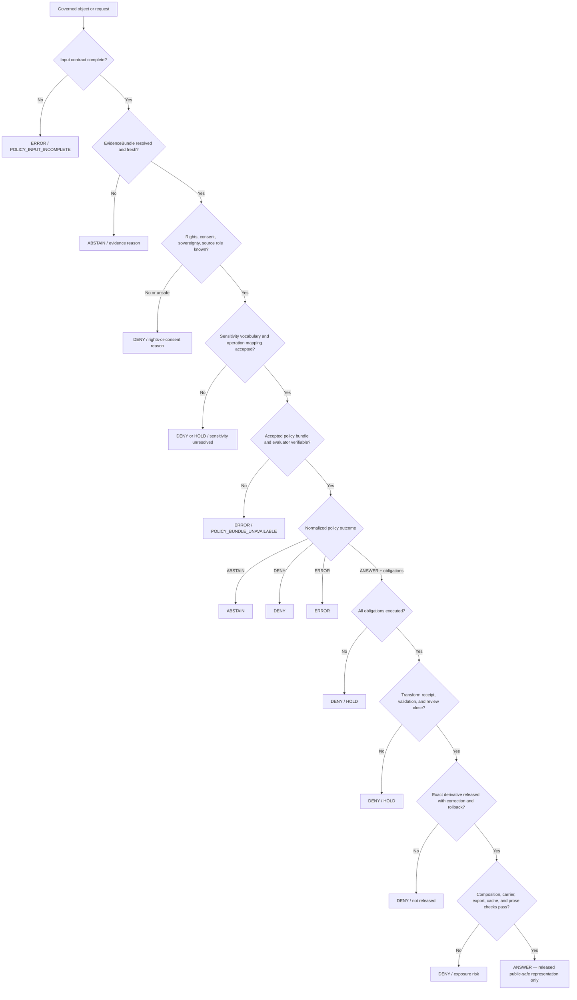

<!-- [KFM_META_BLOCK_V2]
doc_id: kfm://doc/architecture-sensitive-domain-fail-closed
title: Sensitive-Domain Fail-Closed — Current Architecture and Enforcement Boundary
type: architecture-reference
version: v2.0-draft
status: "draft; repository-grounded; mixed-maturity; fail-closed; no-policy-authority; no-release; no-publication"
owners:
  - "@bartytime4life — verified GitHub review route through CODEOWNERS"
  - "NEEDS VERIFICATION — architecture, policy, privacy/genomics, cultural-sovereignty, biodiversity, infrastructure-security, evidence, governed-API, release, correction, and independent-review stewards"
created: 2026-05-25
updated: 2026-08-19
policy_label: "public; architecture; sensitivity; fail-closed; default-hold; release-gated"
owning_root: docs/
current_path: docs/architecture/sensitive-domain-fail-closed.md
responsibility: >
  Explain the cross-root closure required before KFM may expose a sensitive or
  harmful-precision object, derivative, join, claim, map carrier, export, or AI
  response, while distinguishing current repository evidence from proposed
  policy, evaluator, consumer, review, release, and publication behavior.
truth_posture: >
  CONFIRMED same-path architecture placement, accepted Directory Rules,
  CODEOWNERS review route, proposed ADR-0010 status, mixed sensitivity-policy
  scaffold corpus, proposed SensitivityLabel contract/schema, a deterministic
  fixture-only RedactionReceipt profile and validator, a greenfield redaction
  package, and a fail-closed Governed API scaffold / PROPOSED operation-specific
  sensitive-domain closure, obligation enforcement, reviewer separation,
  composition lint, and graduation plan / CONFLICTED sensitivity vocabulary,
  profile-catalog authority, and documentation-to-machine mappings / UNKNOWN
  accepted cross-domain decision, active bundle and evaluator, authenticated
  specialist review, functional protective transform, governed consumer
  enforcement, release integration, correction propagation, deployed behavior,
  and operational effectiveness.
evidence_snapshot:
  repository: bartytime4life/Kansas-Frontier-Matrix
  base_ref: main
  base_commit: 7ef1597779774d80346f81ecd8104b720797c587
  target_prior_blob: 2daac2b4aff483e63c80451b69e9c4cc47928786
  directory_rules_blob: fd49a0b83e55cef52c1124281f093e263526898d
  codeowners_blob: dd2a84aa514d8ecd9208bc347f90f9a2ed37dd61
  policy_sensitivity_readme_blob: 06197c7a7255264b94fb9dd8d7f73844cfa35682
  sensitivity_label_contract_blob: d6ddf1eb7db9bc955e56de76a0d997b6e4ecd231
  sensitivity_label_schema_blob: 3955c7046b50fa7fbdfb9fadf75121fd08a1a39b
  policy_vocabulary_contract_blob: 51158caefd7b440851fb37489c511a5c710bed2b
  policy_vocabulary_registry_blob: ae68a9f3cf80308f18bd04207ef2c85057750f12
  redaction_receipt_contract_blob: c686cdf5c79a8b99ac66d4b01cd30d2f450f645f
  redaction_receipt_schema_blob: 7806abb702accd70dd17e947858c5768cc3eddae
  redaction_receipt_validator_blob: b6d22549a8b043d89ee9c1af658f1662ada70ee5
  redaction_receipt_fixtures_blob: a13adcae4e2fbcb3fa8a42dae8aba510a6ea31e3
  governed_api_main_blob: 4eb335c7c0b27f62c7419c478542e8fe40e1ff38
  governed_api_stub_blob: 371e60d9f96c78e31c8a1e6109d19dee5da4213b
related:
  - ./README.md
  - ./sensitivity.md
  - ./sensitivity-tiers.md
  - ./critical-asset-exposure.md
  - ./cross-lane-join-policy.md
  - ./data-classification-framework.md
  - ./governed-api/README.md
  - ./TRUST_MEMBRANE.md
  - ../standards/SENSITIVITY_RUBRIC.md
  - ../standards/REDACTION_PROFILES.md
  - ../standards/REDACTION_DETERMINISM.md
  - ../security/DATA_CLASSIFICATION.md
  - ../security/EXPOSURE_PLAN.md
  - ../adr/ADR-0010-deny-by-default-for-dna-rare-species-archaeology-infrastructure.md
  - ../adr/ADR-0029-adopt-directory-governance-standard-v2.md
  - ../doctrine/directory-rules.md
  - ../runbooks/revocation.md
  - ../../policy/sensitivity/README.md
  - ../../policy/decision/vocabulary.v1.json
  - ../../contracts/policy/sensitivity_label.md
  - ../../schemas/contracts/v1/policy/sensitivity_label.schema.json
  - ../../contracts/shared/redaction_receipt.md
  - ../../schemas/contracts/v1/receipts/redaction_receipt.schema.json
  - ../../fixtures/contracts/v1/receipts/redaction_receipt/cases.json
  - ../../tools/validators/receipts/validate_redaction_receipt.py
  - ../../packages/redaction/README.md
  - ../../apps/governed-api/src/governed_api/main.py
  - ../../apps/governed-api/src/governed_api/stub.py
  - ../../release/README.md
tags: [kfm, architecture, sensitivity, fail-closed, harmful-precision, redaction, geoprivacy, consent, sovereignty, policy, evidence, governed-api, release, rollback]
notes:
  - "Same-path architecture-document modernization only; no policy, contract, schema, profile, fixture, validator, package, API, data, release, deployment, or publication mutation."
  - "ADR-0010 remains proposed. This page explains the architecture and current evidence; it does not accept the decision or claim enforcement."
  - "Legacy title and numbered-section anchors are retained explicitly for inbound compatibility."
  - "No real protected payload, exact sensitive location, genomic material, private join, infrastructure detail, or reversal-enabling transform parameter is included."
[/KFM_META_BLOCK_V2] -->

<a id="top"></a>
<a id="sensitive-domain-fail-closed--architecture"></a>

# Sensitive-Domain Fail-Closed — Current Architecture and Enforcement Boundary

> **Operating rule.** A sensitive or harmful-precision operation may become a public or semi-public `ANSWER` only after its evidence, source role, rights or consent, sensitivity, policy, protective transform, validation, review, release, correction, and rollback context closes for the exact object, audience, operation, precision, time, and composition. Missing, stale, conflicted, untrusted, or unevaluated context never becomes implicit permission.

[](#0-current-status-and-authority)
[](#3-current-repository-state)
[](#0-current-status-and-authority)
[](#3-current-repository-state)
[](#9-required-artifacts-at-each-transition)
[](#6-the-fail-closed-decision-flow)
[](#18-non-effects-correction-and-rollback)

> [!IMPORTANT]
> **The repository contains real control surfaces, not a complete sensitive-domain control path.** Current evidence establishes explanatory documents, proposed contracts and schemas, mixed policy scaffolds, a closed deterministic fixture-only `RedactionReceipt` validator, and a Governed API scaffold that returns `ABSTAIN` or safe `ERROR`. It does **not** establish an accepted cross-domain decision, active policy bundle, general evaluator, authenticated specialist review, functional redaction executor, governed consumer enforcement, release integration, or public protection.

> [!CAUTION]
> **Source-code polarity is not runtime protection.** Eleven generated sensitivity Rego scaffolds use `default allow := false`; five greenfield stubs use `default deny := false` and contain no operative denial rule. Neither pattern proves bundle selection, evaluator behavior, normalized outcomes, obligation enforcement, consumer binding, or release gating.

> [!WARNING]
> **Client-side hiding is never the control.** Map styling, popup omission, default zoom, a hidden property, a private-looking route, an AI refusal prompt, or an export checkbox cannot make restricted bytes public-safe. Protection must occur before public delivery, and the delivered bytes and their compositions must be tested.

**Quick navigation:** [Status](#0-current-status-and-authority) · [Scope](#1-scope-and-posture) · [Meaning](#2-what-fail-closed-means) · [Repository](#3-current-repository-state) · [Vocabularies](#4-current-sensitivity-vocabularies-and-unresolved-mapping) · [Register](#5-the-deny-by-default-register) · [Decision flow](#6-the-fail-closed-decision-flow) · [Domain table](#7-per-domain-fail-closed-table) · [Transitions](#8-tier-transitions) · [Artifacts](#9-required-artifacts-at-each-transition) · [Inference](#10-side-channel-and-inference-risk) · [Renderer](#11-style-only-hiding-is-forbidden) · [AI](#12-ai-surface-in-sensitive-domains) · [Health](#13-health-indicators) · [Anti-patterns](#14-anti-patterns) · [Backlog](#15-verification-backlog) · [Related](#16-related-docs) · [Review](#17-validation-and-review-checklist) · [Rollback](#18-non-effects-correction-and-rollback)

---

<a id="0-current-status-and-authority"></a>

## 0. Current status and authority

| Field | Current bounded result |
|---|---|
| **Document role** | Human-readable cross-root architecture reference under `docs/architecture/`; not policy source, schema authority, a data-classification decision, a vulnerability assessment, release authority, or implementation proof. |
| **Evidence snapshot** | `main@7ef1597779774d80346f81ecd8104b720797c587`. |
| **Directory result** | **PLACE** at existing `docs/architecture/sensitive-domain-fail-closed.md`. Accepted ADR-0029 assigns human-readable architecture to `docs/`; no move, alias, new root, or authority migration is required. |
| **Review route** | Current CODEOWNERS routes review to `@bartytime4life`; accountable specialist stewardship, independent review, quorum, and release authority remain **NEEDS VERIFICATION**. |
| **Cross-domain decision** | [`ADR-0010`](../adr/ADR-0010-deny-by-default-for-dna-rare-species-archaeology-infrastructure.md) remains `draft` / effectively **proposed**, not accepted. |
| **Policy source** | [`policy/sensitivity/`](../../policy/sensitivity/README.md) is a real but mixed proposed-scaffold corpus; no accepted general bundle, selector, evaluator, or consumer binding is established. |
| **Sensitivity shape** | The proposed [`SensitivityLabel`](../../contracts/policy/sensitivity_label.md) schema currently exposes `public`, `generalized`, `restricted`, and `quarantine`; it is context, not a policy or release decision. |
| **Protective-transform proof** | One deterministic, no-network, **fixture-only** `RedactionReceipt` schema/validator/case family exists. Its schema freezes policy execution, authenticated review, lifecycle mutation, release authorization, and publication authorization to `false`. |
| **Transform runtime** | [`packages/redaction/`](../../packages/redaction/README.md) remains a `0.0.0` greenfield package scaffold without a supported API or functional executor. |
| **Dynamic public boundary** | The current Governed API scaffold serves three GET routes that return `ABSTAIN / NOT_IMPLEMENTED`; unsupported methods and routes return safe `ERROR` envelopes. No sensitive-domain `ANSWER` route is established. |
| **Release and publication** | None established by this document or the reviewed policy, schema, fixture, validator, package, or API surfaces. |

### Authority by question

| Question | Owning authority | This page's role |
|---|---|---|
| Where this explanation belongs | Accepted ADR-0029 and [`directory-rules.md`](../doctrine/directory-rules.md) | Record the same-path architecture boundary. |
| What a sensitivity label, policy decision, receipt, review, or release object means | Accepted contracts under `contracts/` | Cite current semantics; do not redefine them. |
| What fields and values are machine-valid | Accepted schemas under `schemas/` | Report current shapes and conflicts. |
| Which operation is denied, held, restricted, or allowed | Accepted policy source plus a bound evaluator | State prerequisites; never issue a decision. |
| Whether a protective transform is sufficient | Security/privacy/domain review plus measured validation | Define proof burden; never certify. |
| Whether a derivative may be released | Governed evidence, policy, review, validation, receipt/proof, and `release/` records | Keep the release boundary visible. |
| Whether a public request may return `ANSWER` | Governed API and exact runtime evidence | Define closure; do not claim deployment. |
| How correction, withdrawal, and rollback propagate | Owning correction/release mechanisms and affected consumers | Require handoffs; do not mutate lifecycle. |

[Back to top](#top)

---

<a id="1-scope-and-posture"></a>

## 1. Scope and posture

### 1.1 What this document owns

This page owns one responsibility: explain the **operation-specific closure boundary** for sensitive or harmful-precision material across source admission, evidence, policy, transforms, review, release, public delivery, correction, and rollback.

It covers:

- protected or potentially harmful precision in data, geometry, identity, time, joins, and derived carriers;
- finite failure outcomes and safe public reasons;
- the difference between a protected source object, a public-safe derivative candidate, a released artifact, and a runtime response;
- the responsibilities of contracts, schemas, policy, validators, reviewers, release records, governed clients, and AI;
- side-channel and composition risk; and
- the evidence required to graduate from documentation and synthetic fixtures to enforceable behavior.

It does not replace the umbrella [`sensitivity.md`](./sensitivity.md), draft tier and rubric documents, domain sensitivity pages, policy source, contracts, schemas, runbooks, tests, or release records.

### 1.2 The posture in one sentence

**Fail closed at every authority transition:** when an operation depends on unresolved evidence, rights, consent, sovereignty, sensitivity, review, evaluator state, transform sufficiency, release state, correction state, or harmful precision, the operation returns a bounded negative outcome or remains on internal hold; it does not silently proceed.

### 1.3 Operation-specific, not domain-secret-by-name

A domain label alone does not decide exposure. The same domain may contain:

- public reference material;
- a generalized public-safe derivative;
- restricted source detail;
- steward-only review context;
- a claim that must abstain because evidence is insufficient; and
- a composition that becomes sensitive only after a join.

The decision key is the exact **object + operation + audience + purpose + precision + time + composition + release state**, not merely the folder or domain name.

### 1.4 Non-goals

This document does not:

- accept ADR-0010 or any sensitivity-tier scheme;
- classify a real record, source, place, person, species, site, asset, or relationship;
- disclose real protected values, exact locations, genomic material, private joins, security-sensitive detail, or reversal-enabling transform parameters;
- select or activate a redaction profile;
- define an evaluator input DTO, package API, route, or deployment;
- authenticate a reviewer or rights holder;
- authorize source activation, lifecycle promotion, release, deployment, or publication; or
- claim that documentation, a schema pass, policy file, fixture, validator, workflow, pull request, or merge proves operational protection.

[Back to top](#top)

---

<a id="2-what-fail-closed-means"></a>

## 2. What "fail-closed" means

### 2.1 Closure invariants

| Invariant | Required meaning |
|---|---|
| **No implicit permission** | Absence of a denial, missing context, a parser failure, or an unavailable evaluator never becomes `ANSWER`. |
| **Finite outcomes** | A trust-bearing operation resolves to one bounded outcome. Current KFM runtime vocabulary is `ANSWER`, `ABSTAIN`, `DENY`, or `ERROR`; internal workflows may additionally record `HOLD` or review-required state without presenting it as success. |
| **Evidence before claim** | Claim-bearing `ANSWER` requires resolvable, admissible `EvidenceRef → EvidenceBundle` support and citation closure. Missing or stale support normally yields `ABSTAIN`, not fabricated certainty. |
| **Policy before exposure** | Rights, consent, sensitivity, audience, purpose, precision, review, release, and correction context are evaluated by the accepted policy path. Missing or unsafe context yields `DENY` or `ERROR`. |
| **Obligations are executable** | An `ANSWER` with obligations is not complete until generalization, redaction, delay, export restriction, citation, review, or rollback obligations are enforced and verified. |
| **Server-side public safety** | Restricted input is transformed or withheld before public carriers are generated; clients never receive exact protected bytes and then hide them. |
| **No authority collapse** | A label, policy source file, receipt, validator pass, reviewer note, release manifest, map, or AI answer cannot substitute for the other required object families. |
| **Fast retreat, slow exposure** | Correction, withdrawal, restriction, and cache invalidation may retreat immediately; motion toward broader exposure requires complete positive closure. |

### 2.2 Outcome selection

The current proposed-inactive policy vocabulary provides useful, bounded semantics without proving a live evaluator:

| Condition | Safe outcome | Example current vocabulary code |
|---|---|---|
| Required evidence is unresolved | `ABSTAIN` | `EVIDENCE_UNRESOLVED` |
| Evidence is outside the admitted freshness window | `ABSTAIN` | `EVIDENCE_STALE` |
| Rights are unresolved | `DENY` | `RIGHTS_UNKNOWN` |
| Sensitivity or required public-safe transform is unresolved | `DENY` | `SENSITIVITY_UNRESOLVED` |
| Requested public precision is unsafe | `DENY` | `PUBLIC_PRECISION_UNSAFE` |
| Required consent is absent, expired, revoked, or out of scope | `DENY` | `CONSENT_REQUIRED` |
| Policy input or evaluator context is incomplete | `ERROR` | `POLICY_INPUT_INCOMPLETE` |
| Selected bundle or evaluator cannot be verified | `ERROR` | `POLICY_BUNDLE_UNAVAILABLE` |
| Operation is supported only with enforceable obligations | `ANSWER` after obligations close | `OPERATION_ALLOWED_WITH_OBLIGATIONS` |

These codes are currently `PROPOSED_INACTIVE`. They are a fixture-first vocabulary, not live policy behavior.

### 2.3 Closed-system test

A sensitive operation is closed only when:

1. every required input and authority reference exists and resolves;
2. the exact policy source, bundle, evaluator, vocabulary, and effective version are verifiable;
3. the finite result is normalized without collapsing `ABSTAIN`, `DENY`, `ERROR`, or review-required state;
4. every attached obligation is executed before exposure;
5. protective transforms are validated without revealing protected or reversal-enabling material;
6. required specialist and independent review is authenticated for the exact candidate version;
7. the exact derivative has a governed release, correction, withdrawal, and rollback path; and
8. the public carrier, API response, export, search result, graph projection, cache, and AI prose all preserve the same public-safe boundary.

Missing any required step preserves the more restrictive state.

[Back to top](#top)

---

<a id="3-the-sensitive-domain-list"></a>
<a id="3-current-repository-state"></a>

## 3. The sensitive-domain list

The following **candidate sensitivity families** repeatedly carry elevated harm, privacy, sovereignty, rights, or public-safety risk. Inclusion here does not classify every object in the family as secret; it means operations involving these families require explicit context and fail-closed review.

- **Living-person information** — private identifiers, contact or residence detail, sensitive relationships, and re-identifying combinations.
- **DNA and genomic material** — raw segments, genotypes, kit or vendor identifiers, private matches, and derived relationship claims involving living people.
- **Rare or protected biodiversity** — exact occurrence, nest, den, roost, hibernaculum, spawning, rare-plant, or culturally sensitive ecological locations.
- **Archaeology and cultural heritage** — exact site, burial, human-remains, sacred, looting-risk, or community-controlled knowledge.
- **Critical or security-relevant infrastructure** — exploit-enabling precision, operational relationships, condition, dependency, access, or vulnerability context.
- **Private person-to-place or person-to-parcel joins** — combinations that expose an individual even when contributing datasets are individually public.
- **Rights-, consent-, or sovereignty-constrained sources** — material whose storage, transformation, redistribution, attribution, or public use is unresolved or controlled.
- **Hazard and emergency-adjacent claims** — any request that would present KFM as the issuing alert, instruction, or emergency authority.
- **Cross-domain composition and inference** — joins, deltas, search, graph, AI, exports, and surrounding layers that reveal more than any input alone.
- **Any exact precision that could enable harm** — regardless of which domain owns the record.

### 3.1 Current repository state

| Surface | Confirmed current state | Safe conclusion |
|---|---|---|
| [`ADR-0010`](../adr/ADR-0010-deny-by-default-for-dna-rare-species-archaeology-infrastructure.md) | Source metadata `draft`; effective status `proposed` | Cross-domain deny-by-default decision is not accepted. |
| [`policy/sensitivity/README.md`](../../policy/sensitivity/README.md) | Sixteen Rego files, eleven YAML files, six Markdown files, and eighteen placeholder files; mixed default polarity; no accepted evaluator/bundle binding | Real source inventory, not coherent runtime enforcement. |
| Greenfield top-level sensitivity stubs | Archaeology, DNA, rare-species, living-person, and infrastructure files use `default deny := false` with no operative denial rule | Their names do not protect anything. |
| Generated fauna sensitivity scaffolds | Selected files use `default allow := false` | Fail-closed-looking source bytes, still proposed and evaluator-unbound. |
| [`SensitivityLabel`](../../contracts/policy/sensitivity_label.md) | Draft semantic contract paired to a proposed four-level schema | Useful context shape; not a decision or release. |
| Policy reason/obligation vocabulary | Closed, deterministic, `PROPOSED_INACTIVE` registry and validator surfaces | Useful normalized terms; no evaluator or authority. |
| [`RedactionReceipt`](../../schemas/contracts/v1/receipts/redaction_receipt.schema.json) profile | Closed `PROPOSED_INACTIVE` fixture-only schema, validator, and synthetic case matrix | Proves bounded receipt validation and negative polarity only. |
| Redaction profile catalogs | `policy/redaction/profiles.yaml` and `policy/sensitivity/profiles.yaml` are parallel empty proposed placeholders | Catalog authority and accepted profiles remain on HOLD. |
| [`packages/redaction/`](../../packages/redaction/README.md) | `0.0.0` greenfield package, empty initializer, comment-only core, no supported API or package behavior | No functional protective transform. |
| Governed API | Three GET stubs return `ABSTAIN / NOT_IMPLEMENTED`; unsupported routes/methods return safe `ERROR` | Fail-closed scaffold, not sensitive-domain enforcement. |
| Revocation runbook | [`docs/runbooks/revocation.md`](../runbooks/revocation.md) is a short proposed scaffold | Correction/revocation operations are not closed. |

[Back to top](#top)

---

<a id="4-two-sensitivity-schemes--and-an-open-adr"></a>
<a id="4-current-sensitivity-vocabularies-and-unresolved-mapping"></a>

## 4. Current sensitivity vocabularies and unresolved mapping

The prior edition described two schemes. Current repository evidence exposes **several overlapping vocabularies** with no accepted, machine-enforced crosswalk.

| Surface | Vocabulary | Current status | What it answers |
|---|---|---|---|
| [`SENSITIVITY_RUBRIC.md`](../standards/SENSITIVITY_RUBRIC.md) | numeric `0..5` | Draft standards page | Intended content-sensitivity ranking. |
| [`docs/doctrine/sensitivity.md`](../doctrine/sensitivity.md) | `S0..S5`, `C0..C5`, `T0..T4` | Draft doctrine page | Proposed separation of sensitivity, access, and release questions. |
| [`sensitivity-tiers.md`](./sensitivity-tiers.md) | `T0..T4` | Draft architecture page | Proposed release/audience tiers and transitions. |
| [`SensitivityLabel` schema](../../schemas/contracts/v1/policy/sensitivity_label.schema.json) | `public`, `generalized`, `restricted`, `quarantine` | `PROPOSED` machine shape | Current finite exposure-posture context. |
| Fixture-only [`RedactionReceipt` schema](../../schemas/contracts/v1/receipts/redaction_receipt.schema.json) | `T0..T4` input/output sensitivity | `PROPOSED_INACTIVE`, authority `NONE`, fixture-only | Synthetic receipt validation profile. |

### 4.1 Current disposition

- No accepted ADR or machine registry was verified that makes any one vocabulary globally canonical.
- The current `SensitivityLabel` schema does not encode numeric rank or `T0..T4` tier.
- The fixture-only `RedactionReceipt` profile uses `T0..T4`, but it explicitly cannot execute policy, authenticate review, mutate lifecycle, authorize release, or publish.
- Documentation may explain each scheme, but code, policy, fixtures, receipts, and public payloads must not silently coerce between them.
- A translation that is missing, ambiguous, or based only on prose must return `DENY`, `ABSTAIN`, `ERROR`, or internal `HOLD` as appropriate; it must not choose the more-public interpretation.

### 4.2 Decision packet required

A governance decision should establish:

1. which question each vocabulary answers;
2. whether the vocabularies remain orthogonal or one is retired;
3. one accepted machine crosswalk, if translation is permitted;
4. object-family ownership and canonical fields;
5. versioning, aliases, migration, fixtures, and negative cases;
6. policy-selector and receipt bindings;
7. correction behavior when classification changes; and
8. public API semantics that do not confuse sensitivity context with release approval.

Until then, vocabulary convergence remains **CONFLICTED / HOLD**.

[Back to top](#top)

---

<a id="5-the-deny-by-default-register"></a>

## 5. The deny-by-default register

This register states the **architecture posture and current implementation gap**. It does not accept ADR-0010, classify real objects, or activate policy.

| Sensitive operation | Safe default | Candidate bounded derivative | Current repository support | Graduation hold |
|---|---|---|---|---|
| Living-person private identity, residence, or re-identifying join | `DENY` public exposure; restricted review or quarantine | De-identified or sufficiently aggregated candidate, if rights/consent/review support it | Proposed label/schema; greenfield living-person stub | Consent/rights authority, accepted policy/evaluator, transform, specialist review, consumer and release proof absent |
| Raw DNA/genomic material or private match detail | `DENY`; do not place real payloads in repo, fixtures, logs, receipts, search, map, or AI | No public derivative by default; research access requires separate named authority | Greenfield DNA stub only | ADR, consent/privacy/genomics authority, restricted runtime, audit, correction, and revocation unproved |
| Exact rare-species or rare-plant location | `DENY` exact public precision | Generalized, aggregated, delayed, or withheld candidate after domain review | Proposed fauna/flora policy scaffolds; fixture-only generic RedactionReceipt | Accepted profile, functional transform, domain evaluator, source-rights review, consumer and release proof absent |
| Archaeology, burial, sacred, or cultural-sensitive location/identity | `DENY` exact public precision and sensitive existence disclosure where applicable | Generalized or withheld candidate only after cultural/sovereignty and rights review | Greenfield archaeology stub; documentation and receipt lanes | Qualified authority, accepted policy, transform, protected review, correction/revocation, and release proof absent |
| Exploit-enabling infrastructure precision or composition | `DENY` public exactness and operational detail | Generalized, delayed, aggregated, or withheld candidate after security/domain review | Greenfield infrastructure stub; modernized critical-asset architecture page | Exposure contract/evaluator, security review, transform, negative bytes test, and release proof absent |
| Private person-to-parcel or person-to-place composition | `DENY` unless an operation-specific restricted path is accepted | Coarsened statistics only when re-identification risk is measured and reviewed | Cross-lane docs and proposed policy surfaces | Join evaluator, minimum-group/precision policy, composition fixtures, consumer enforcement absent |
| Rights-, consent-, source-term-, or sovereignty-uncertain material | `DENY` storage/use/exposure action that exceeds proven authority; quarantine or hold | Public-safe derivative only within verified terms and obligations | Source/evidence/policy docs; no complete sensitivity evaluator | Dated authority evidence, effective-time handling, review, release and revocation propagation absent |
| KFM as emergency-alert or instruction authority | `DENY` | Contextual citation to official channels may be possible; KFM never becomes the issuing authority | Architecture/doctrine language | This boundary is not transformed into authority by a map, AI answer, feed, or disclaimer |
| Public AI access to restricted content or unsupported precision | `DENY` or `ABSTAIN`; direct model-to-public path prohibited | Evidence-bounded explanation over released public-safe representations | Governed API `ABSTAIN/ERROR` scaffold; AI lanes are not proof | Accepted evidence/policy binding, receipt/audit, precision parity, red-team and runtime proof absent |

### 5.1 Real protected data posture

Until the relevant operation graduates, real sensitive payloads must remain outside:

- the public repository and documentation;
- synthetic fixtures and example values;
- public or broadly retained logs, traces, error messages, receipts, screenshots, and generated artifacts;
- public map, tile, export, search, graph, vector-index, cache, and AI paths; and
- any normal client path that bypasses an accepted governed interface.

Synthetic fixtures may model outcomes and references, but must not encode realistic protected values or operational protection parameters.

[Back to top](#top)

---

<a id="6-the-fail-closed-decision-flow"></a>

## 6. The fail-closed decision flow

Sensitive exposure has two separate decision points:

1. **Release-candidate preparation** decides whether a safe derivative candidate may be reviewed and released.
2. **Runtime request enforcement** decides whether an exact client request may receive that released derivative.

Passing the first does not bypass the second.


```mermaid
flowchart TD
  A["Governed object or request"] --> B{"Input contract complete?"}
  B -- "No" --> E1["ERROR / POLICY_INPUT_INCOMPLETE"]
  B -- "Yes" --> C{"EvidenceBundle resolved and fresh?"}
  C -- "No" --> E2["ABSTAIN / evidence reason"]
  C -- "Yes" --> D{"Rights, consent, sovereignty, source role known?"}
  D -- "No or unsafe" --> E3["DENY / rights-or-consent reason"]
  D -- "Yes" --> F{"Sensitivity vocabulary and operation mapping accepted?"}
  F -- "No" --> E4["DENY or HOLD / sensitivity unresolved"]
  F -- "Yes" --> G{"Accepted policy bundle and evaluator verifiable?"}
  G -- "No" --> E5["ERROR / POLICY_BUNDLE_UNAVAILABLE"]
  G -- "Yes" --> H{"Normalized policy outcome"}
  H -- "ABSTAIN" --> E6["ABSTAIN"]
  H -- "DENY" --> E7["DENY"]
  H -- "ERROR" --> E8["ERROR"]
  H -- "ANSWER + obligations" --> I{"All obligations executed?"}
  I -- "No" --> E9["DENY / HOLD"]
  I -- "Yes" --> J{"Transform receipt, validation, and review close?"}
  J -- "No" --> E10["DENY / HOLD"]
  J -- "Yes" --> K{"Exact derivative released with correction and rollback?"}
  K -- "No" --> E11["DENY / not released"]
  K -- "Yes" --> L{"Composition, carrier, export, cache, and prose checks pass?"}
  L -- "No" --> E12["DENY / exposure risk"]
  L -- "Yes" --> M["ANSWER — released public-safe representation only"]
```

### 6.1 Current runtime evidence

The current Governed API scaffold does not implement this flow end to end. Its verified behavior is intentionally narrower:

- `GET /bootstrap`, `GET /layers`, and `GET /evidence` return `ABSTAIN` with `NOT_IMPLEMENTED`;
- unsupported methods on known routes return safe `ERROR`;
- unknown routes return safe `ERROR`; and
- no sensitive-domain `ANSWER`, active policy evaluation, EvidenceBundle-backed claim, redaction obligation, release lookup, or correction propagation is established.

That scaffold is a useful fail-closed baseline. It is not enforcement graduation.

### 6.2 Public-safe reasons

A public reason should explain the finite outcome without exposing:

- the protected value or exact location;
- the existence of a restricted record when existence is itself sensitive;
- private person, genomic, cultural, or source identifiers;
- internal policy source paths, evaluator internals, stack traces, or operational security detail; or
- transform parameters that enable reversal, triangulation, or protection weakening.

Detailed reasons belong only in an authorized, audited review context.

[Back to top](#top)

---

<a id="7-per-domain-fail-closed-table"></a>

## 7. Per-domain fail-closed table

This table avoids assigning unaccepted global tiers. It describes operation-level defaults and the evidence needed before a bounded derivative may graduate.

| Domain / operation | Default disposition | Potential public-safe candidate | Minimum additional closure | Current maturity |
|---|---|---|---|---|
| Archaeology — exact site or culturally controlled identity | Withhold / deny public precision; existence disclosure is review-dependent | Coarsened or withheld representation with public-safe limitations | Cultural/sovereignty and rights authority; policy; transform; receipt; validation; authenticated review; release; rollback | Documentation and scaffolds; no end-to-end enforcement |
| Fauna — sensitive occurrence or site | Withhold exact point | Generalized, aggregated, delayed, or range-level representation | Source-role and rights review; accepted profile; deterministic transform; receipt; domain validation; review; release | Generated scaffolds plus generic fixture receipt proof |
| Flora — rare or culturally sensitive location | Withhold exact point and revealing attributes | Generalized or withheld representation | Domain/cultural review; accepted profile; transform; receipt; validation; release | Documentation/scaffolds; no active profile or executor |
| People — living-person private fields or joins | Deny public record-level exposure | De-identified aggregate only if re-identification risk and consent/rights close | Consent/rights; join policy; minimum-group/precision proof; review; release; revocation | Proposed contract/policy surfaces; no governed consumer proof |
| DNA / genomics — raw or private match data | Deny public and ordinary semi-public exposure | None by default; separately governed restricted research access is outside the public path | Named legal/privacy/consent authority, restricted runtime, audit, retention, correction, revocation | Greenfield stub only |
| Settlements / infrastructure — exploit-enabling precision | Deny exact operational representation | Generalized, delayed, aggregated, or withheld public-safe derivative | Security/domain review; exposure policy; transform; negative delivered-byte test; release | Architecture/docs/scaffolds; no active evaluator or route |
| Hazards — alert or instruction authority | Deny KFM authority role | Contextual, cited official-source information with visible limitations | Source authority, evidence, non-authority wording, release, stale/correction behavior | Doctrine/architecture pressure; not alert authority |
| Cross-domain join — re-identifying composition | Deny until composition is evaluated | Coarsened or suppressed derived statistic | Join identity; sensitivity inheritance; inference tests; review; export/search/graph parity | Documentation pressure; complete evaluator absent |
| 3D / scene — sensitive geometry or synthetic reconstruction | Deny exact or misleading public scene | Public-safe geometry with explicit representation limitations | Same 2D evidence parity; transform; representation/reality notes as accepted; review; release | Documentation and renderer boundaries; no sensitive-scene release proof |
| Governed AI — sensitive-lane question | Deny or abstain when support or permission is insufficient | Bounded explanation over released public-safe EvidenceBundles | Policy pre/post-check, citations, precision parity, finite envelope, audit-safe receipt/reference | Public API remains `ABSTAIN/ERROR` scaffold |

### 7.1 No one-size-fits-all transform

A transform that is sufficient for one object, audience, time, or composition may be insufficient for another. Public documentation must not publish a universal radius, grid, threshold, seed, salt, or minimum count as though it were safe for every domain. Operational parameters require accepted profile authority, classification, threat review, controlled storage where appropriate, and versioned validation.

[Back to top](#top)

---

<a id="8-tier-transitions"></a>

## 8. Tier transitions

The vocabulary for tiers is unresolved, so this section defines **authority transitions** without silently choosing a rank or tier scheme.

| Transition | Minimum closure | What does not suffice |
|---|---|---|
| Restricted source object → public-safe derivative candidate | Stable input identity/digest; source and evidence refs; rights/consent/sensitivity context; accepted policy result; accepted profile; transform output; receipt; validation | A filename, profile label, style filter, schema pass, or generic reviewer note |
| Derivative candidate → reviewed release candidate | Exact candidate digest; authenticated domain/sensitivity/security/rights review as applicable; unresolved-risk record; correction and rollback target | Receipt validity alone or the author's approval |
| Release candidate → released public-safe artifact | Governed release decision, manifest, proof/receipt closure, audience and obligations, retention/correction/withdrawal/rollback support | Pull request, merge, CI success, GitHub release, or copied bytes |
| Released artifact → runtime `ANSWER` | Request schema; actor/audience/purpose; current policy; current release/correction state; evidence/citations; enforced obligations; safe envelope | Client possession of a URL or a `public` sensitivity label |
| Public/semi-public → restricted, withdrawn, or corrected | Immediate safe-state change; correction/withdrawal record; cache/index/search/graph/map/AI invalidation; preserved audit lineage | Waiting for a new transform or silently editing history |
| Sensitivity vocabulary or classification change | New versioned decision/label; affected-object inventory; migration or re-evaluation; consumer compatibility; correction and rollback | In-place field rewrite with no supersession or receipt |

### 8.1 Asymmetric safety rule

Motion toward broader exposure requires complete positive closure. Motion toward less exposure may proceed immediately when credible risk, rights change, correction, revocation, or control failure is identified. The later audit record must preserve why the retreat occurred, but lack of a completed replacement must not keep unsafe material exposed.

### 8.2 No automatic declassification

A successful transform can create a **candidate derivative**. It does not automatically:

- change the canonical source object's sensitivity;
- establish rights or consent;
- prove residual risk is acceptable;
- authenticate review;
- approve release; or
- make the public request eligible for `ANSWER`.

[Back to top](#top)

---

<a id="9-required-artifacts-at-each-transition"></a>

## 9. Required artifacts at each transition

| Object family | Current repository posture | Required role in a mature flow | Must not be mistaken for |
|---|---|---|---|
| `SourceDescriptor` | Existing source/evidence architecture; exact live-source coverage varies | Identity, source role, rights/terms, access, cadence, authority, sensitivity caveats | Evidence sufficiency or release approval |
| `EvidenceRef` / `EvidenceBundle` | Resolver and fixture work exists elsewhere; coverage is bounded | Claim support, scope, provenance, citations, limitations | Policy, review, transform, or release |
| `SensitivityLabel` | Draft contract + `PROPOSED` four-level schema | Explicit exposure context with safe reason and time | Access grant or publication approval |
| Policy input and `PolicyDecision` | Draft/proposed contracts and inactive vocabulary; evaluator unbound | Evaluate exact operation/audience/context and emit finite outcome plus obligations | Transform execution or release |
| Redaction/profile selection | Two empty proposed catalog placeholders; no accepted profile | Bind immutable profile identity, scope, parameter-handling classification, implementation, and validator | A free-form method name or inline secret |
| `RedactionReceipt` | Deterministic `PROPOSED_INACTIVE` fixture-only profile and validator | Record protective transform or withholding without protected/reversal material | Proof of sufficiency, authenticated review, or release |
| Validation report / proof | Generic and domain validators vary | Prove schema, identity, determinism, obligation, leakage, and negative cases for exact candidate | Rights, consent, policy authority, or human review |
| `ReviewRecord` or accepted equivalent | Specialist/authentication binding unverified | Record qualified review for exact version, scope, residual risk, and decision | CODEOWNERS route or author self-approval |
| `ReleaseManifest`, correction, withdrawal, rollback | Separate release root and object families; sensitive binding unproved | Authorize exact derivative/audience and preserve retreat/correction path | Documentation, receipt, CI, merge, or deployment |
| `RuntimeResponseEnvelope` | Governed API `ABSTAIN/ERROR` scaffold | Return exactly one bounded runtime outcome with safe reasons and support refs | Raw model output or direct store response |
| AI audit/receipt reference | AI object surfaces exist in broader repo; sensitive binding unproved here | Bind model/adapter, prompt policy, evidence, decision, output, citation validation, and correction linkage where AI is used | Evidence or approval |

### 9.1 What the fixture-only RedactionReceipt proof establishes

The current synthetic profile is meaningful but deliberately bounded. It establishes:

- Draft 2020-12 schema validation;
- canonical `spec_hash` and deterministic receipt identity checks;
- finite `PASS`, `ABSTAIN`, `DENY`, and `ERROR` validator outcomes;
- public-candidate requirements for policy, review, validation, evidence, release-candidate, and rollback refs;
- withholding semantics;
- negative cases for missing closure, unsafe output tier, result mismatch, hash/id mismatch, protected-value leakage, and authority overreach; and
- safe non-effects: no restricted input, no policy execution, no authenticated review, no lifecycle mutation, no release, and no publication.

It does **not** establish that the referenced policy, review, evidence, release, or rollback objects exist, are authentic, or authorize anything. The fixture uses synthetic references and freezes all authority flags to `false`.

### 9.2 Documentation drift to preserve, not hide

The shared `RedactionReceipt` contract still describes the schema as empty/permissive, while the current schema has since become a closed fixture-only profile. That documentation-to-machine drift requires a separately scoped correction; this page records it but does not silently rewrite either authority surface.

[Back to top](#top)

---

<a id="10-side-channel-and-inference-risk"></a>

## 10. Side-channel and inference risk

Protection is evaluated over the **delivered system**, not only the geometry field.

| Channel | Failure mode | Required control and proof |
|---|---|---|
| Geometry and tile bytes | Exact or near-exact location remains recoverable | Generate public-safe derivative upstream; inspect delivered bytes at all supported zooms/representations |
| Attributes and free text | Names, IDs, descriptions, addresses, timestamps, or source fields reveal protected context | Explicit allowlist; synthetic negative fixtures; payload and tile inspection |
| Labels, popups, legends, tooltips | UI text discloses more precision than the carrier | Derive only from public-safe payload; cross-surface parity tests |
| Search, graph, index, vector store | Restricted relation or text remains discoverable after map redaction | Sensitivity inheritance; projection-specific deny/generalization; correction propagation tests |
| Cross-lane joins | Two ordinary inputs re-identify a person, site, species, or asset | Operation-specific join policy; group/precision/inference tests; steward review |
| Time and release deltas | Changes, rescissions, or before/after views reveal protected state | Safe diff policy; delayed release or suppression; correction-aware comparison |
| Exports, screenshots, offline bundles | Data escapes API/UI constraints or loses release/citation state | Server-generated bounded export; release/digest/citation refs; export-specific policy and tests |
| Logs, telemetry, errors, denial reasons | Protected values or internal controls leak through observability | Value-safe reason codes; structured redaction; retention/access controls; negative log tests |
| Cache, CDN, object storage, source maps | Corrected or withdrawn bytes remain retrievable | Versioned immutable release refs plus invalidation/withdrawal verification |
| AI prose and tool traces | Model restates exact detail, infers beyond evidence, or records protected prompts | Released public-safe context only; precision parity; safe audit references; no protected chain-of-thought or prompt logging |
| 3D, terrain, scenes, and imagery | Perspective, mesh, texture, or surrounding context reconstructs precise location | Same sensitivity policy as 2D; representation-specific threat review and parity tests |

### 10.1 Composition is a new operation

Every join, overlay, compare, story, export, AI prompt context, or search result set is a new operation with its own audience and inference risk. Upstream `public` labels do not automatically make the composition public-safe.

### 10.2 Delivered-byte test

Before release, validation should inspect the actual public carrier or a byte-equivalent fixture—not only source rows or style configuration. A safe style over unsafe tile bytes is a failure.

[Back to top](#top)

---

<a id="11-style-only-hiding-is-forbidden"></a>

## 11. Style-only hiding is forbidden

### 11.1 Boundary

MapLibre, styles, UI components, search clients, and AI presentation layers are downstream carriers. They may display trust state and suppress unavailable controls, but they must never receive protected exact bytes and rely on presentation logic as the only barrier.


```mermaid
flowchart LR
  Restricted["Restricted governed input"] --> Policy["Policy + rights + sensitivity context"]
  Policy --> Transform["Accepted transform or WITHHOLD"]
  Transform --> Validate["Leakage + determinism + obligation validation"]
  Validate --> Review["Authenticated specialist review"]
  Review --> Release["Governed release + correction + rollback"]
  Release --> Carrier["Public-safe API / tile / export / search / AI context"]
  Carrier --> UI["MapLibre / Evidence Drawer / Focus Mode"]

  Restricted -. "DENY direct public path" .-> UI
```

### 11.2 Why presentation controls fail

- Style documents and browser state are inspectable and modifiable.
- Hidden attributes may still be present in network payloads or tiles.
- Zoom and filter controls can be bypassed or reimplemented.
- Export, cache, search, graph, and AI paths may not share the same UI filter.
- A later style change can accidentally reveal already-delivered bytes.
- Client-side policy cannot safely authenticate restricted review or bind release/correction state.

### 11.3 Current implementation limit

The current redaction package is not functional, no active profile catalog is accepted, and the Governed API has no sensitive-domain `ANSWER` path. Therefore this section is a graduation requirement—not a claim that upstream transformation currently occurs.

[Back to top](#top)

---

<a id="12-ai-surface-in-sensitive-domains"></a>

## 12. AI surface in sensitive domains

AI remains an interpretive consumer behind the same trust membrane. It receives no special permission because it can generate fluent text.

### 12.1 Allowed bounded role

A governed AI surface may, after all required controls graduate:

- summarize released public-safe `EvidenceBundle` representations;
- explain public-safe limitations, redaction, stale state, or correction state;
- compare released artifacts within their supported spatial and temporal scope; and
- draft review notes for an authorized human without deciding policy or release.

### 12.2 Required behavior

| Condition | Required behavior |
|---|---|
| Evidence missing, stale, conflicting, or outside scope | `ABSTAIN`; do not infer the protected fact. |
| Rights, consent, sensitivity, audience, precision, or release blocks the request | `DENY` with a public-safe reason. |
| Policy bundle/evaluator, adapter, citation validator, or runtime is unavailable | `ERROR`; never fall back to raw model output. |
| Released representation supports only generalized precision | Answer only at that precision; do not reconstruct or describe a narrower location. |
| User asks for restricted source, exact coordinates, private joins, or hidden operational detail | `DENY`; do not disclose through explanation, tools, citations, or error text. |
| Synthetic or reconstructed content is involved | Label the representation and cite its evidence/limitations; do not present it as observation. |

### 12.3 Required separation

- Browsers and ordinary clients must not call the model runtime or canonical/internal stores directly.
- Evidence retrieval, policy checks, sensitivity checks, citation validation, and release/correction checks occur before and after model invocation as required.
- Prompts, tool traces, embeddings, caches, telemetry, and receipts must not store real protected values unless an accepted restricted-data design explicitly authorizes and audits that use.
- A model refusal prompt is defense in depth, not policy enforcement.
- An AI receipt or accepted equivalent is a **graduation requirement** where AI participates; current repository evidence reviewed here does not prove a sensitive-domain receipt is bound to the public runtime.

[Back to top](#top)

---

<a id="13-health-indicators"></a>

## 13. Health indicators

These are **PROPOSED operational indicators**, not current measurements.

| Indicator | What it measures | Target posture | Evidence needed |
|---|---|---|---|
| Negative sensitive-case pass rate | Representative `ABSTAIN`, `DENY`, and `ERROR` cases across policy, transform, consumer, and release paths | 100% of required negative cases match expected outcome/reason | Exact fixtures, test reports, required checks |
| Obligation enforcement coverage | `ANSWER` cases whose citation, transform, delay, export, review, and rollback obligations are actually enforced | 100% for admitted operations | Consumer integration and post-condition tests |
| Restricted-value carrier leakage | Protected values or reversal material found in public API, tile, export, search, graph, logs, or AI output | Zero | Delivered-byte and observability scans |
| Bundle/evaluator verification | Decisions bound to accepted policy bundle, evaluator identity/version, and explicit input profile | 100% for policy-significant operations | Decision receipts and runtime evidence |
| Review authenticity and separation | Sensitive releases with authenticated qualified review independent of author where required | 100% of applicable releases | Review records and identity evidence |
| Redaction receipt closure | Public-safe transform candidates with valid receipt, output digest, evidence, validation, release-candidate, and rollback refs | 100% of applicable candidates | Receipt and cross-reference validation |
| Correction propagation latency | Time for withdrawal/restriction to reach API, map, search, graph, cache, export, and AI surfaces | Within accepted incident/runbook objective | Rehearsal and observed telemetry |
| Vocabulary drift | Objects or consumers using unmapped sensitivity/rank/tier values | Zero unreviewed coercions | Registry/crosswalk validator and inventory |
| Sensitive join review coverage | New or changed cross-domain compositions evaluated for inference risk | 100% of policy-significant joins | Join registry, tests, review evidence |
| Public finite-envelope coverage | Trust-bearing public routes returning exactly one valid finite outcome | 100% | Runtime conformance and hosted checks |

A dashboard is a projection of these records. It is not evidence unless its underlying runs, receipts, tests, and artifacts resolve.

[Back to top](#top)

---

<a id="14-anti-patterns"></a>

## 14. Anti-patterns

| Anti-pattern | Why it fails | Required correction |
|---|---|---|
| Treating ADR-0010 as accepted because many docs repeat it | Repetition is not governance adoption | Keep decision `proposed`; obtain reviewed acceptance separately |
| Treating `default allow := false` as active protection | Source bytes do not prove bundle, evaluator, input, result normalization, or consumer binding | Prove the full evaluator-to-consumer path with native and integration tests |
| Treating `default deny := false` as deny-by-default | The stub denies nothing | Keep it inactive; replace only through reviewed policy implementation |
| Treating a `public` SensitivityLabel as publication approval | Label expresses context only | Require evidence, policy, review, release, correction, and rollback closure |
| Treating a valid RedactionReceipt as proof that an output is safe | Receipt records a declared transform; current profile is fixture-only and authority-free | Require accepted profile, executor, validation, review, and release |
| Silently mapping `0..5`, `S/C/T`, T0–T4, and four label values | More-public meaning may be chosen accidentally | HOLD translation until an accepted machine crosswalk exists |
| Publishing exact protection parameters in public docs or reasons | Parameters may enable reversal, triangulation, or weakening | Publish only public-safe method classes and obligations; control operational values |
| Style, popup, zoom, filter, feature flag, or AI prompt used as primary redaction | Protected bytes already crossed the boundary | Transform or withhold before carrier generation |
| Domain-wide secrecy or openness by folder name | Sensitivity is operation-, precision-, audience-, time-, and composition-dependent | Evaluate the exact object and operation |
| Schema validity treated as policy or rights approval | Shape does not establish admissibility | Preserve contract/schema/policy/evidence/review/release separation |
| PR, merge, badge, workflow success, receipt, or GitHub release treated as publication | Repository events are not governed release state | Require exact release records and public-carrier evidence |
| Free-text denial reasons include protected detail | The denial leaks what it protects | Use stable public-safe reason codes; keep restricted detail in audited review context |
| Aggregate or public inputs assumed safe after composition | Join/delta/context may re-identify | Re-evaluate each composition as a new operation |
| AI paraphrases more precision than the released carrier | Prose bypasses geometry redaction | Enforce evidence and precision parity; abstain or deny |
| Author self-approves a policy-significant sensitive release | Separation of duties is lost | Require authenticated qualified and independent review where adopted |
| Correction waits for a replacement artifact | Unsafe material remains exposed | Retreat first; preserve correction lineage; rebuild later |
| Real protected values used in fixtures, logs, examples, or receipts | Testing and documentation become disclosure paths | Use synthetic safe values and non-reversible references only |

[Back to top](#top)

---

<a id="15-verification-backlog"></a>

## 15. Verification backlog

### 15.1 Priority closure register

| Priority | Item | Current result | Evidence required to close |
|---|---|---|---|
| **P0** | Accept, revise, or reject ADR-0010 with named decision authority and review quorum | **HOLD — proposed** | Accepted ADR and matching index/status record |
| **P0** | Reconcile sensitivity/rank/access/release vocabularies and machine mappings | **CONFLICTED / HOLD** | Accepted contract/schema/registry/crosswalk, migrations, fixtures, consumer tests |
| **P0** | Name accountable privacy/genomics, cultural-sovereignty, biodiversity, infrastructure-security, policy, evidence, release, correction, and independent reviewers | **NEEDS VERIFICATION** | Accepted ownership/review records and escalation path |
| **P0** | Establish one accepted policy input profile, bundle/selector, evaluator, normalized outcomes, and obligation contract | **HOLD — unbound** | Native policy tests, evaluator tests, digest/version binding, failure modes |
| **P0** | Keep real sensitive material outside public/repo paths until controls graduate | **Required safe posture** | Source-specific authority, restricted storage design, audit, retention, incident controls |
| **P1** | Resolve redaction-profile catalog home and accept one inactive profile before implementation | **CONFLICTED / HOLD** | Single-writer decision, profile contract/schema, classified parameters, threat review, fixtures |
| **P1** | Implement one smallest no-network synthetic sensitive-operation slice | **PROPOSED** | Accepted profile, functional transform, receipt writer, validator, negative cases; no real data |
| **P1** | Bind policy outcomes and obligations to one governed consumer without public `ANSWER` over real data | **PROPOSED** | Consumer integration, schema validation, safe reasons, audit refs, no-network tests |
| **P1** | Prove release denial, correction, withdrawal, cache/index invalidation, and rollback for the synthetic slice | **PROPOSED** | Release dry run and correction/rollback rehearsal |
| **P1** | Modernize the revocation runbook from scaffold to reviewed procedure | **PROPOSED scaffold** | Owners, triggers, steps, affected surfaces, rehearsal, rollback |
| **P2** | Add domain-specific profiles and specialist review only after shared closure | **DEFERRED** | Domain contracts/policy/fixtures/tests and qualified review |
| **P2** | Add composition, delivered-byte, search/graph, export, logging, and AI side-channel suites | **DEFERRED** | Representative negative fixtures and required workflow checks |
| **P2** | Measure operational health and correction latency | **UNKNOWN** | Deployed instrumentation, dashboards tied to runs/receipts, incident/rehearsal evidence |

### 15.2 Maturity ladder

| Level | Meaning | Current posture |
|---|---|---|
| **1. Architecture and boundaries** | Docs, ADR identity, responsibility roots, contracts, and review language exist | **CONFIRMED / broad** |
| **2. Machine shape and fixture validation** | Closed schemas, deterministic synthetic fixtures, validators, and negative outcomes exist | **PARTIAL** — strongest in fixture-only RedactionReceipt profile |
| **3. Evaluator-backed policy and transform** | Accepted input/bundle/evaluator, functional transform, receipt writer, native tests | **HELD / not established** |
| **4. Governed consumer enforcement** | API, map, export, search, graph, AI, cache, and logs enforce outcomes/obligations | **HELD / not established** |
| **5. Release-significant operation** | Authenticated review, release dry run, correction, withdrawal, rollback, required checks, observed operation | **UNKNOWN / not established** |

### 15.3 Definition of done for a bounded synthetic slice

A slice is reviewable only when it proves, without network access or real protected data:

- deterministic identity and schema validation;
- explicit finite `ANSWER`, `ABSTAIN`, `DENY`, and `ERROR` cases;
- policy-bundle and evaluator failure cannot become allow;
- required obligations are enforced before any candidate output;
- protected values and reversal material cannot enter receipt, response, log, or carrier;
- authenticated-review fields remain synthetic and non-authoritative until a real review system exists;
- no lifecycle, release, or publication authority is implied by fixtures;
- correction, withdrawal, and rollback references are validated; and
- the PR description records exact non-effects and rollback.

[Back to top](#top)

---

<a id="16-related-docs"></a>

## 16. Related docs

### Current architecture and doctrine

- [`README.md`](./README.md) — architecture-folder authority and convergence context.
- [`sensitivity.md`](./sensitivity.md) — umbrella sensitivity architecture; broad and still proposal-heavy.
- [`sensitivity-tiers.md`](./sensitivity-tiers.md) — draft T0–T4 architecture and transitions; not accepted machine authority.
- [`critical-asset-exposure.md`](./critical-asset-exposure.md) — current repository-grounded critical-asset exposure architecture.
- [`cross-lane-join-policy.md`](./cross-lane-join-policy.md) — join and composition boundary.
- [`data-classification-framework.md`](./data-classification-framework.md) — data classification architecture.
- [`governed-api/README.md`](./governed-api/README.md) and [`TRUST_MEMBRANE.md`](./TRUST_MEMBRANE.md) — governed delivery and trust boundary.
- [`directory-rules.md`](../doctrine/directory-rules.md) and accepted [`ADR-0029`](../adr/ADR-0029-adopt-directory-governance-standard-v2.md) — placement authority.
- Proposed [`ADR-0010`](../adr/ADR-0010-deny-by-default-for-dna-rare-species-archaeology-infrastructure.md) — cross-domain decision under review.

### Standards, contracts, policy, and validation

- [`SENSITIVITY_RUBRIC.md`](../standards/SENSITIVITY_RUBRIC.md) — draft numeric rubric; not accepted runtime mapping.
- [`REDACTION_PROFILES.md`](../standards/REDACTION_PROFILES.md) — current repository-grounded profile boundary and graduation standard.
- [`REDACTION_DETERMINISM.md`](../standards/REDACTION_DETERMINISM.md) — draft deterministic-transform proposal; implementation parity unproved.
- [`policy/sensitivity/README.md`](../../policy/sensitivity/README.md) — current mixed-scaffold policy inventory and limitations.
- [`SensitivityLabel`](../../contracts/policy/sensitivity_label.md) and [paired schema](../../schemas/contracts/v1/policy/sensitivity_label.schema.json) — proposed exposure context.
- [`PolicyDecision` vocabulary](../../contracts/policy/policy_decision_vocabulary.md) and [inactive registry](../../policy/decision/vocabulary.v1.json) — finite public-safe reason and obligation candidates.
- Shared [`RedactionReceipt`](../../contracts/shared/redaction_receipt.md), [fixture-only schema](../../schemas/contracts/v1/receipts/redaction_receipt.schema.json), [cases](../../fixtures/contracts/v1/receipts/redaction_receipt/cases.json), and [validator](../../tools/validators/receipts/validate_redaction_receipt.py) — bounded synthetic proof.
- [`packages/redaction/README.md`](../../packages/redaction/README.md) — greenfield transform-package boundary.
- [`release/README.md`](../../release/README.md) — release, correction, withdrawal, and rollback authority.
- [`revocation.md`](../runbooks/revocation.md) — current proposed runbook scaffold.

### Domain lanes

- [`docs/domains/archaeology/`](../domains/archaeology/README.md)
- [`docs/domains/fauna/`](../domains/fauna/README.md)
- [`docs/domains/flora/`](../domains/flora/README.md)
- [`docs/domains/people-dna-land/`](../domains/people-dna-land/README.md)
- [`docs/domains/settlements-infrastructure/`](../domains/settlements-infrastructure/README.md)
- [`docs/domains/hazards/`](../domains/hazards/README.md)

Per-domain documentation supplies domain context. It does not override shared contracts, accepted policy, or release authority.

[Back to top](#top)

---

<a id="17-validation-and-review-checklist"></a>

## 17. Validation and review checklist

### Documentation integrity

- [ ] KFM Meta Block v2 parses as YAML and records the exact evidence snapshot.
- [ ] Legacy H1 and numbered-section anchors remain resolvable.
- [ ] Every repository-relative link resolves at the pinned base or is explicitly labeled as a scaffold/current limitation.
- [ ] No placeholder owner is presented as accepted stewardship.
- [ ] No proposed ADR, tier, profile, route, evaluator, or runbook is described as accepted or operational.
- [ ] No real protected value, precise location, genomic material, private join, infrastructure detail, or reversal-enabling parameter appears.

### Architecture correctness

- [ ] Contract, schema, policy, validator, review, release, consumer, and publication responsibilities remain separate.
- [ ] The document distinguishes source-code defaults from accepted bundle/evaluator behavior.
- [ ] The vocabulary conflict is visible and no silent mapping is introduced.
- [ ] The fixture-only RedactionReceipt proof is represented with its authority flags and non-effects intact.
- [ ] `ANSWER`, `ABSTAIN`, `DENY`, `ERROR`, and internal `HOLD` are not collapsed.
- [ ] Client-side hiding is rejected as the primary control.
- [ ] Correction/withdrawal may retreat before a replacement is ready.

### Repository and hosted validation

- [ ] Documentation build, metadata, link, fragment, citation, and stale-language checks pass for the exact head.
- [ ] Architecture/document-graph and changed-scope checks show only intended dependencies.
- [ ] Schema, contract, policy-boundary, receipt, release, and validator suites are classified as passed, introduced failure, inherited failure, or pending.
- [ ] Hosted CI status is reported separately from source-level validation; a pending check is not presented as passed.

[Back to top](#top)

---

<a id="18-non-effects-correction-and-rollback"></a>

## 18. Non-effects, correction, and rollback

### 18.1 Non-effects

Updating this page does **not**:

- accept ADR-0010 or any sensitivity vocabulary;
- activate, repair, select, or bundle sensitivity policy;
- define or approve a redaction profile or operational parameter;
- implement a transform, evaluator, reviewer identity system, API route, cache, export, search, graph, or AI control;
- open restricted input or create a real sensitive record;
- change a contract, schema, fixture, validator, workflow, application, package, data object, receipt, proof, manifest, or release record;
- authorize source activation, lifecycle promotion, release, deployment, or publication; or
- prove that any public client is currently protected end to end.

### 18.2 Correction rule

If this page overstates current behavior, exposes unsafe detail, invents authority, or conflicts with accepted repository evidence, correct it through a scoped documentation change. If operational evidence shows a released surface is unsafe, restrict or withdraw the surface first through the owning release/correction mechanism; documentation correction alone is insufficient.

### 18.3 Rollback

Before merge, close the draft pull request and delete the feature branch. After an authorized merge, revert the single documentation commit or restore prior target blob:

```text
2daac2b4aff483e63c80451b69e9c4cc47928786
```

No data migration, policy deactivation, source shutdown, release withdrawal, deployment rollback, or cache invalidation is required for the documentation-only revert.

---

<sub>Evidence snapshot · `main@7ef1597779774d80346f81ecd8104b720797c587` &nbsp;·&nbsp; Document status · repository-grounded draft &nbsp;·&nbsp; Publication authority · none &nbsp;·&nbsp; <a href="#top">Back to top ↑</a></sub>
