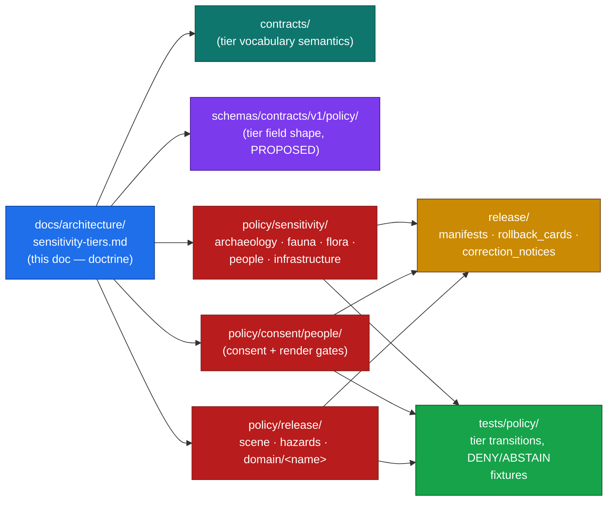
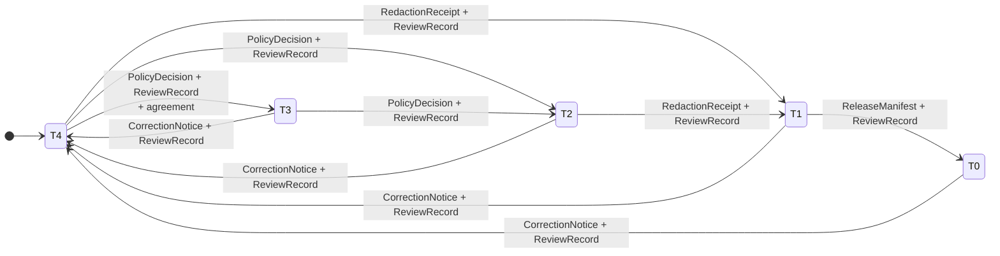

<!-- [KFM_META_BLOCK_V2]
doc_id: kfm://doc/architecture/sensitivity-tiers
title: Sensitivity & Rights Tier Architecture (T0–T4)
type: standard
version: v1.0
status: draft
owners: TODO-architecture-steward-and-policy-steward
created: 2026-05-25
updated: 2026-05-25
policy_label: public
related:
  - ../doctrine/directory-rules.md
  - ./connected-dots-architecture-brief.md
  - ./contract-schema-policy-split.md
  - ./governed-api.md
  - ./maplibre-3d.md
  - ../../policy/sensitivity/README.md
  - ../../policy/consent/people/README.md
  - ../../policy/release/scene/README.md
  - ../../policy/release/hazards/README.md
  - ../../schemas/contracts/v1/policy/
  - ../../KFM_Encyclopedia.md
  - ../../Kansas_Frontier_Matrix_-_Domains_v1_1___Pass_23_32_Consolidated_Atlas.md
  - ../../kfm_unified_doctrine_synthesis.md
tags:
  - kfm
  - architecture
  - sensitivity
  - rights
  - policy-as-code
  - governance
  - publication
  - trust-membrane
notes:
  - "Doctrinal anchor: Atlas v1.1 §24.5 (Master Sensitivity / Rights Tier Reference); KFM Encyclopedia §11 (Sensitive / Deny-by-Default Posture); Unified Doctrine Synthesis §§15–16."
  - "Tier scheme T0–T4 is PROPOSED (Atlas v1.1 §24.5.1)."
  - "Tier transitions in §5 are CONFIRMED doctrine (Atlas v1.1 §24.5.3); concrete policy bundles, schema homes, and validators that enforce them are PROPOSED until verified in a mounted repo."
  - "Hazards — KFM as alert authority — is T4 forever. The boundary is doctrinal, not negotiable by policy."
  - "Authoring session: docs-only. No mounted repository, CI run, workflow, dashboard, runtime log, or release artifact was inspected. Implementation-maturity claims are bounded per the current-session evidence limit."
  - "Default-deny is the architectural posture: when rights, sovereignty, sensitivity, or release-state evidence is missing, the gate fails closed."
[/KFM_META_BLOCK_V2] -->

<a id="top"></a>

# Sensitivity & Rights Tier Architecture (T0–T4)

> **How KFM decides who can see what.** The T0–T4 scheme is the architectural spine that turns rights, sovereignty, sensitivity, and consent obligations into reviewable, repeatable release actions across every domain.


[](#)
[](#)

> [!IMPORTANT]
> **This document is doctrine-rank, not implementation proof.** The tier scheme, transition rules, and reading rule are CONFIRMED doctrine from Atlas v1.1 §24.5 and the Encyclopedia §11. Concrete policy bundles, schema homes, validator names, and CI surfaces that enforce them are **PROPOSED** until verified against a mounted repository. No statement in this file is sufficient evidence of enforcement on its own.

---

## Contents

- [1. Purpose & scope](#1-purpose--scope)
- [2. The tier scheme (T0–T4)](#2-the-tier-scheme-t0t4)
- [3. The reading rule](#3-the-reading-rule)
- [4. Where tiers live in the architecture](#4-where-tiers-live-in-the-architecture)
- [5. Tier transitions (allowed motion)](#5-tier-transitions-allowed-motion)
- [6. Per-domain default tier matrix](#6-per-domain-default-tier-matrix)
- [7. Failure-closed posture](#7-failure-closed-posture)
- [8. Interaction with the lifecycle gates](#8-interaction-with-the-lifecycle-gates)
- [9. Interaction with Governed AI](#9-interaction-with-governed-ai)
- [10. Interaction with 3D / Planetary surfaces](#10-interaction-with-3d--planetary-surfaces)
- [11. The Hazards T4-forever boundary](#11-the-hazards-t4-forever-boundary)
- [12. Anti-patterns](#12-anti-patterns)
- [13. Verification backlog](#13-verification-backlog)
- [14. Related docs](#14-related-docs)
- [Appendix A — Glossary of cited objects](#appendix-a--glossary-of-cited-objects)

---

## 1. Purpose & scope

KFM publishes only the **safest representation that still answers the steward's and the public's reasonable needs.** The Sensitivity & Rights Tier scheme is the architectural mechanism that makes that principle operational. It turns "publish at tier *N*" into a reviewable, repeatable action by binding each tier to:

- a **default audience**,
- a uniform set of **allowed transforms**, and
- a uniform set of **required gates** that must close before any motion to a more-public tier.

**In scope.** The five-tier scheme; the canonical transition matrix; the reading rule; the default tier per domain/object class; the interaction with the RAW → PUBLISHED lifecycle; the interaction with Governed AI; the interaction with 3D/Planetary surfaces; the failure-closed posture; the anti-pattern register.

**Out of scope.** Field-level schema shape (`schemas/`); object-family meaning (`contracts/`); Rego/OPA enforcement modules (`policy/sensitivity/`, `policy/consent/`, `policy/release/`); release decision artifacts (`release/`); UI affordances for review consoles. Those are referenced but each carries its own home and is governed by its own README per Directory Rules.

> [!NOTE]
> **The scheme extends — it does not replace — the v1.0 Deny-by-Default Register.** Atlas v1.0 §20.5 named per-domain restrictions. Atlas v1.1 §24.5 extends that register with the tier vocabulary, the allowed-transforms vocabulary, and the gate vocabulary so the same release action can be evaluated the same way across every domain.

[↑ Back to top](#top)

---

## 2. The tier scheme (T0–T4)

The tier scheme is **PROPOSED** (Atlas v1.1 §24.5.1). The scheme is a uniform vocabulary; specific tier assignments are made per object class in [§6](#6-per-domain-default-tier-matrix).

| Tier | Name | Definition | Default audience |
|---|---|---|---|
| **T0** | Open | Public-safe with no transformations required; no rights, sensitivity, or steward gating beyond standard release. | Any public client via governed API. |
| **T1** | Generalized | Public-safe **only after** generalization, fuzzing, aggregation, or redaction; the transform is reviewed and recorded. | Any public client via governed API. |
| **T2** | Reviewer | Released only to authenticated reviewers or domain stewards; policy-bounded; correction path active. | Stewards, reviewers, named research collaborators. |
| **T3** | Restricted | Released only under a named agreement (rights, sovereignty, or consent) and recorded. | Named authorized parties only. |
| **T4** | Denied | Not released to any audience; the **existence** of a record may be released only as steward review permits. | — |

The scheme is **monotone**: a more-public tier is always reached only through governed motion from a less-public tier. A record never appears "openly" except via a recorded transition.

> [!CAUTION]
> **T0 is not a default.** T0 means "public-safe by construction" — not "we did not look." Anything inherited from a third-party source with unclear rights, missing licensing, or unresolved sovereignty status starts at **T4** until evidence promotes it.

[↑ Back to top](#top)

---

## 3. The reading rule

The single most important property of the scheme is its **asymmetry**:

> A tier upgrade (toward more public) always needs **both** a transform receipt **and** a review record.
> A tier downgrade (toward less public) **never needs both** — a `CorrectionNotice` alone is sufficient to remove or restrict.

This asymmetry is the architectural expression of *cite-or-abstain* applied to release: it is always easier to retreat to safety than to advance to exposure. The scheme treats reversibility as the default property; every upgrade carries an obligation to support the corresponding downgrade later if evidence changes.

| Direction | Required artifacts | Why |
|---|---|---|
| **Upgrade** (less-public → more-public) | Transform receipt (`RedactionReceipt` / `AggregationReceipt` / `ReleaseManifest`) **AND** `ReviewRecord` **AND** a `PolicyDecision` where the gate names one. | The act of exposing more material must be reproducible (the transform), authorized (the review), and policy-aware (the decision). |
| **Downgrade** (more-public → less-public) | `CorrectionNotice` + `ReviewRecord`. No transform receipt needed. | Retreat is always permitted and precedes derivative invalidation. |

> [!IMPORTANT]
> The asymmetry is intentional and **must not be flattened** by tooling, UI, or shortcut policies. A reviewer can always pull material back to T4 with a correction; no reviewer can push material to T0 without both a recorded transform and a recorded review.

[↑ Back to top](#top)

---

## 4. Where tiers live in the architecture

Tier assignment is **doctrine** (this document and Atlas v1.1 §24.5). Tier **enforcement** is split across responsibility roots per Directory Rules §4. PROPOSED placements:



> [!NOTE]
> **PROPOSED placement.** Every path in this diagram is **PROPOSED** until verified in a mounted repository per Directory Rules §2.5. The diagram shows responsibility roots, not file presence. The `contracts/` semantics of the tier vocabulary, the `schemas/` shape of tier-bearing fields, and the per-domain `policy/sensitivity/<domain>/` bundles each require a per-root README before any of them hardens into authority.

| Responsibility | Root | What lives here |
|---|---|---|
| Doctrine — tier scheme | `docs/architecture/` | This document; transition rules; reading rule. |
| Object-family meaning | `contracts/` | What "tier", "transform", "review", and "agreement" *mean* in the KFM ontology. |
| Object-family shape | `schemas/contracts/v1/policy/` | JSON Schema for tier-bearing fields on `PolicyDecision`, `RedactionReceipt`, `ReleaseManifest`. |
| Enforcement (sensitivity) | `policy/sensitivity/<domain>/` | Per-domain Rego bundles that emit `PolicyDecision` allow/deny/abstain. |
| Enforcement (consent) | `policy/consent/people/` | Per-request `ConsentDecision` render gate (DSSE envelope validity, status-list non-revocation, scope, retention). |
| Enforcement (release) | `policy/release/<domain>/` | Per-domain release-state and authority constraints (e.g., `policy/release/scene/`, `policy/release/hazards/`). |
| Release artifacts | `release/` | `ReleaseManifest`, `CorrectionNotice`, `RollbackCard`, `PromotionDecision`. |
| Enforceability proof | `tests/policy/` | Fixture-driven DENY / ABSTAIN / ERROR cases for every transition. |

[↑ Back to top](#top)

---

## 5. Tier transitions (allowed motion)

The transition matrix below is **CONFIRMED doctrine** from Atlas v1.1 §24.5.3. The artifacts named are *minimum* requirements; specific gates can require additional evidence per domain.



| From → To | Required artifact | Required reviewer | Reversibility |
|---|---|---|---|
| **T4 → T3** | `PolicyDecision` + `ReviewRecord` + agreement | Steward + rights-holder where applicable | Reversible — agreement revocation returns object to T4 with `CorrectionNotice`. |
| **T4 → T2** | `PolicyDecision` + `ReviewRecord` | Steward | Reversible — review revocation returns object to T4. |
| **T4 → T1** | `RedactionReceipt` + `ReviewRecord` | Steward | Reversible — redaction can be re-evaluated; correction may demote a published T1 to T4. |
| **T3 → T2** | `PolicyDecision` + `ReviewRecord` | Steward | Reversible. |
| **T2 → T1** | `RedactionReceipt` + `ReviewRecord` | Steward | Reversible. |
| **T1 → T0** | `ReleaseManifest` + `ReviewRecord` | Steward + release authority | Reversible — rollback supported via `RollbackCard`. |
| **Any tier → T4** | `CorrectionNotice` + `ReviewRecord` | Steward + rights-holder where applicable | Always permitted; precedes derivative invalidation. |

> [!TIP]
> **Composition with Promotion Gates A–G.** Every upgrade also passes through the standard promotion gates (Admission, Normalization, Validation, Catalog closure, Release). Tier transitions sit **on top of** the lifecycle gates; they are not a substitute for them. A `RedactionReceipt` proves the transform happened; the lifecycle gates prove the artifact reached PUBLISHED through the governed path.

[↑ Back to top](#top)

---

## 6. Per-domain default tier matrix

The matrix below is the canonical default per object class. Tier assignments are **PROPOSED** at the implementation layer; the *defaults themselves* are doctrine from Atlas v1.1 §24.5.2 and the Unified Doctrine Synthesis §16. Allowed transforms are PROPOSED candidate motions, not commitments — every specific upgrade still requires a recorded `PolicyDecision` and `ReviewRecord`.

<details>
<summary><strong>Full per-domain default tier matrix</strong> (click to expand)</summary>

| Domain / object class | Default tier | Allowed transforms (PROPOSED) | Required gates |
|---|---|---|---|
| **Archaeology — site location** | T4 | Steward + cultural review + generalized geometry (coarse cell) + `RedactionReceipt` → T2 or T1. | `RedactionReceipt` + `ReviewRecord` + `PolicyDecision`. |
| **Archaeology — human remains / sacred sites** | T4 | No transform releases this to T0; T3 only under explicit named authorization. | Sovereignty review + `ReviewRecord` + `PolicyDecision`. |
| **Fauna — sensitive occurrence** | T4 | Geoprivacy generalization + `RedactionReceipt` → T1. | `RedactionReceipt` + `ReviewRecord` + `PolicyDecision`. |
| **Fauna — range polygon** | T1 | Aggregate / generalized public-safe layer. | `AggregationReceipt` or `RedactionReceipt`. |
| **Flora — rare / culturally sensitive plant location** | T4 | Generalized geometry + steward review → T2 or T1. | `RedactionReceipt` + `ReviewRecord`. |
| **Hydrology — HUC12 + flowlines** | T0 | None required. | Standard Gates A–G. |
| **Hydrology — well / withdrawal records** | T1 / T2 | Aggregation; private-owner join denial. | `AggregationReceipt`. |
| **Soil — SSURGO / gNATSGO public layers** | T0 | None required. | Standard Gates A–G. |
| **Agriculture — county histograms** | T0 / T1 | Aggregation; **private farm/operator × parcel joins deny**. | `AggregationReceipt`. |
| **Atmosphere / Air — observed** | T0 / T1 | Stale-state badge; operational disclaimer. | Stale-state policy. |
| **Hazards — historical events** | T0 | None for historical; **alert-authority claims deny**. | `policy/release/hazards/`. |
| **Hazards — KFM as alert authority** | **T4 forever** | No transform permits KFM to act as an emergency-alert authority. The boundary holds. | Policy boundary; deny at runtime. |
| **Roads / Rail — modern public network** | T0 | None required. | Standard Gates A–G. |
| **Roads / Rail — historic uncertain routes** | T1 | Generalization; uncertainty surface. | `UncertaintySurface`. |
| **Settlements / Infrastructure — critical assets** | T2 | Public summary only; precise locations deny. | `policy/sensitivity/infrastructure/`. |
| **Infrastructure — critical asset detail** | T4 | Generalized facility footprint + suppressed dependency → T1. | Steward review + `RedactionReceipt`. |
| **Infrastructure — condition / vulnerability** | T4 | T3 to named authorities only; never T0 / T1. | Steward review + named-party agreement. |
| **People / DNA — living-person fields** | T4 | Aggregation by tract or county + `AggregationReceipt` → T1. | Consent or aggregation gate + `ReviewRecord`. |
| **People / DNA — raw DNA segment data** | T4 | No transform releases this to a public tier; T3 only under explicit research agreement. | Named consent + `ReviewRecord` + `PolicyDecision`. |
| **People / Land — private person-parcel join** | T4 | Generalized parcel + de-identified person → T2 only. | `RedactionReceipt` + `ReviewRecord`. |
| **Governed AI — RAW / WORK access via AI surface** | T4 | AI never reads RAW or WORK content; only released `EvidenceBundle`. | `PolicyDecision` + `AIReceipt`. |
| **Planetary / 3D — sensitive 3D scene content** | T4 | Generalization / clipping / withholding; Reality Boundary Note + `RepresentationReceipt` → T1 or T2 where steward review supports. | Steward review + `RedactionReceipt` + `RepresentationReceipt`. |

</details>

> [!WARNING]
> **The matrix is the *starting* tier per class, not the ceiling.** Every public release still requires its full transform-and-review path. Nothing in this table authorizes publication; it names the level of release the system **starts at** when admitting that object class. The matrix exists so reviewers know what posture to defend, not what to permit.

[↑ Back to top](#top)

---

## 7. Failure-closed posture

When evidence is missing, the tier system **fails closed** — the artifact stays at (or returns to) T4. This is the architectural expression of *default-deny promotion*.

| Missing evidence | Outcome | Reason code (PROPOSED) |
|---|---|---|
| `RedactionReceipt` claimed but not resolvable | DENY at validation gate | `MISSING_RECEIPT` |
| `EvidenceRef` does not resolve to an `EvidenceBundle` | DENY at catalog closure | `MISSING_EVIDENCE` |
| `ReviewRecord` absent for a transition that requires it | DENY at release gate | `MISSING_REVIEW` |
| Rights / sovereignty status unknown | DENY at admission or validation | `RIGHTS_UNKNOWN`, `SENSITIVITY_UNRESOLVED` |
| Source role inconsistent with tier (e.g., modeled output paraphrased as observation) | DENY at validation | `ROLE_COLLAPSE`, `ROLE_DOWNCAST_FORBIDDEN` |
| `ReleaseManifest` invalid or rollback target missing | DENY at release | `RELEASE_MANIFEST_INVALID`, `ROLLBACK_TARGET_MISSING` |

> [!CAUTION]
> **Silent skip is never a permitted outcome.** Every transition either records `ALLOW`, `DENY`, `HOLD`, `ABSTAIN`, or `ERROR` with a reason code. A gate that returns "ok, no check ran" is a defect, not a pass. Validators that cannot evaluate the tier must `ABSTAIN` and route the artifact to QUARANTINE.

[↑ Back to top](#top)

---

## 8. Interaction with the lifecycle gates

Tier transitions and lifecycle gates compose. The lifecycle invariant is **CONFIRMED doctrine**:

```text
RAW → WORK / QUARANTINE → PROCESSED → CATALOG / TRIPLET → PUBLISHED
```

| Lifecycle gate | Tier interaction |
|---|---|
| **Admission** (— → RAW) | `SourceDescriptor` sets initial sensitivity class and rights posture. If unknown, the source admits at T4. |
| **Normalization** (RAW → WORK / QUARANTINE) | `PolicyDecision` evaluates whether normalized output keeps its tier. Sensitive-lane failures route to QUARANTINE, not silent demotion. |
| **Validation** (WORK → PROCESSED) | `RedactionReceipt` and/or `AggregationReceipt` are emitted if sensitivity applies. Validation cannot upgrade tier on its own. |
| **Catalog closure** (PROCESSED → CATALOG / TRIPLET) | `EvidenceBundle` must resolve every `EvidenceRef`; catalog rows carry the current tier. No public edge yet. |
| **Release** (CATALOG / TRIPLET → PUBLISHED) | Tier upgrade is only allowed *here*, with `ReleaseManifest` + `ReviewRecord` + rollback target. The release authority is **distinct from** the original author when materiality applies. |
| **Correction** (PUBLISHED → PUBLISHED′) | `CorrectionNotice` may demote tier without a transform receipt. Downstream derivatives must be invalidated. |
| **Rollback** (PUBLISHED → prior release) | `RollbackCard` returns the artifact to its prior tier; derivative invalidation applies. |

> [!IMPORTANT]
> **The trust membrane is enforced at every public surface.** No public client, no normal UI surface, and no released AI surface ever reaches RAW, WORK, QUARANTINE, canonical / internal stores, graph internals, vector indexes, source APIs, or direct model runtimes. The tier scheme presupposes the membrane; it does not replace it.

[↑ Back to top](#top)

---

## 9. Interaction with Governed AI

The AI plane is **always downstream of release**. From Atlas v1.1 §24.5.2:

> **Governed AI — RAW / WORK access via AI surface: T4.** AI never reads RAW or WORK content; only released `EvidenceBundle`.

This is non-negotiable and not relaxable by any per-domain policy. Specifically:

- The AI surface consumes **only** released artifacts that already carry a `ReleaseManifest`.
- The AI surface **cannot upgrade** an artifact's tier by paraphrase, summary, or composition.
- The AI surface **cannot collapse** a source role — e.g., it cannot paraphrase a "modeled" record as if it were "observed."
- Every AI answer is bounded by `cite-or-abstain`: an answer either resolves to one or more `EvidenceBundle` references via `EvidenceRef`, or returns `ABSTAIN`.
- Every AI output emits an `AIReceipt` capturing the model, prompt, sources, citation validation result, and policy decision.

> [!WARNING]
> **Source-role upgrade by paraphrase is an anti-pattern.** Phrases that lift an aggregate into a per-place fact, a model output into an observation, or a candidate into a confirmed site are prohibited. The Source-Role Anti-Collapse Register (Atlas v1.1 §24.1) lists known upcasting phrases; the AI policy bundle MUST ban them at output validation.

[↑ Back to top](#top)

---

## 10. Interaction with 3D / Planetary surfaces

3D scenes inherit the tier of their **most sensitive** constituent layer. The sensitive-content row in §6 ("Planetary / 3D — sensitive 3D scene content") defaults to T4. Two additional artifacts apply:

- **Reality Boundary Note.** Every scene carries an explicit Reality Boundary Note describing what is observed, what is modeled, and what is synthetic. Synthetic content is **never** presented as observed.
- **`RepresentationReceipt`.** A 3D-specific transform receipt pinning the projection, decimation, clipping, or generalization applied to elevate a scene from T4.

Tier upgrade for 3D scene content requires **all three** of: steward review, `RedactionReceipt`, and `RepresentationReceipt`. The standard `ReviewRecord` and `PolicyDecision` still apply.

> [!NOTE]
> The MapLibre shell is **the sole renderer** for 2D and 3D in the PROPOSED v1.3 renderer-decision doctrine (`docs/architecture/maplibre-3d.md`). That decision does not change tier handling; it concentrates rendering at one boundary where layer-manifest resolution can enforce release-state-tagged tiles. The tier scheme is renderer-agnostic.

[↑ Back to top](#top)

---

## 11. The Hazards T4-forever boundary

One row in the per-domain matrix is unique: **Hazards — KFM as alert authority — T4 forever.** This is a doctrinal boundary, not a tier assignment that any policy can move.

| Property | Value |
|---|---|
| Default tier | **T4 forever** |
| Allowed transforms | **None.** No transform permits KFM to act as an emergency-alert authority. |
| Required gates | Policy boundary; deny at runtime. |
| Reading | KFM publishes hazards as **historical** or **operational context**. It is **not** an alert authority. Operational disclaimers and role labels are required at every surface. |

> [!CAUTION]
> **KFM is never an alert authority.** No tier transition, no policy, no UI affordance, and no AI output may present KFM content as life-safety instruction or as an authoritative emergency alert. This boundary is permanent. Any code path, doc, or surface that drifts toward this posture is a defect.

[↑ Back to top](#top)

---

## 12. Anti-patterns

The following patterns appear in the Atlas v1.1 §24.10 Risk Register and Encyclopedia §11 sensitivity posture. They are anti-patterns regardless of how well-intentioned the underlying request is.

<details>
<summary><strong>Anti-pattern register</strong> (click to expand)</summary>

| Anti-pattern | Why it fails the trust membrane |
|---|---|
| **Silent tier upgrade.** Releasing a derived layer at T0/T1 without a corresponding `RedactionReceipt` or `AggregationReceipt`. | The transform isn't reproducible; rollback can't reconstruct what was redacted. |
| **Admin path as public path.** Using a developer or steward route to expose a record that the governed API would have denied. | Bypasses the trust membrane; correction can't reach it. |
| **Source-role upgrade by paraphrase.** AI surface paraphrases an aggregate as a per-place fact, or a modeled value as an observation. | Collapses source roles; tier inferred from text drifts away from tier recorded in evidence. |
| **Inference-by-join.** Aggregated person data joined to small-cell parcels recovers identity. | Aggregation receipts must include minimum-cell suppression; cross-lane joins require fresh threat modeling. |
| **Side-channel leakage.** Sensitive coordinates leak via popup, label, screenshot, export, or tile cache. | Tier holds for the canonical layer but not for the surface; cross-surface lint is required. |
| **Caching layers that circumvent the governed API.** Third-party tile caches or direct CDN re-publishes. | Renderer becomes a public surface; release-state badge no longer reflects truth. |
| **Correction without invalidation.** Publishing a corrected claim without listing the derivatives it invalidates. | Stale graphs, exports, and stories continue to assert the corrected claim as fact. |
| **Release without rollback target.** Publishing a tier upgrade without a `RollbackCard`. | Failure mode has no defined recovery path. |
| **Treating the doc as evidence.** Citing this file (or any synthesis) as proof that enforcement exists. | Doctrine is not implementation; the policy bundle and validator tests are the proof. |

</details>

[↑ Back to top](#top)

---

## 13. Verification backlog

These items are **NEEDS VERIFICATION** until a mounted repository is inspected. They are not blockers for using this doc as doctrine; they are blockers for treating any specific path or validator as enforcement evidence.

| ID | Item | Evidence that would settle it |
|---|---|---|
| **VB-ST-01** | `policy/sensitivity/<domain>/` bundles exist for each domain in §6 | Repo tree listing; per-bundle `README.md` |
| **VB-ST-02** | `policy/consent/people/` contains the `policy.consent.render` package (DSSE + status list + scope + retention) | Inspect `policy/consent/people/render.rego` and `tests/policy/consent/render_test.rego` |
| **VB-ST-03** | `schemas/contracts/v1/policy/` defines tier-bearing fields on `PolicyDecision`, `RedactionReceipt`, `AggregationReceipt`, `ReleaseManifest` | Schema file inspection |
| **VB-ST-04** | `tests/policy/` carries DENY / ABSTAIN / ERROR fixtures for every transition in §5 | Fixture inventory; CI green |
| **VB-ST-05** | `release/correction_notices/` and `release/rollback_cards/` exist and are referenced by promotion-gate validators | Repo tree listing + tool inspection |
| **VB-ST-06** | The AI surface validator rejects source-role upgrade phrases per Atlas v1.1 §24.1 ban list | Test fixture covering banned upcasting phrases |
| **VB-ST-07** | `policy/release/hazards/` enforces the T4-forever boundary at runtime | Inspect bundle; verify negative-fixture coverage |
| **VB-ST-08** | An ADR exists for the tier scheme (Atlas v1.1 §24.5 / ADR-S-05 candidate) | `docs/adr/` listing |
| **VB-ST-09** | Owner / CODEOWNERS entries name an architecture steward and a policy steward for this file | `.github/CODEOWNERS` inspection |
| **VB-ST-10** | This doc is registered in `control_plane/document_registry.yaml` | Registry inspection |

[↑ Back to top](#top)

---

## 14. Related docs

| Path | Role |
|---|---|
| `docs/doctrine/directory-rules.md` | Placement law that owns where `policy/sensitivity/` and friends live. |
| `docs/architecture/connected-dots-architecture-brief.md` | System-wide architecture brief; sensitivity tiers sit in its publication-controls layer. |
| `docs/architecture/contract-schema-policy-split.md` | Why tier vocabulary lives partly in `contracts/`, partly in `schemas/`, and partly in `policy/`. |
| `docs/architecture/governed-api.md` | The only public surface; receives tier-aware `PolicyDecision` outcomes. |
| `docs/architecture/maplibre-3d.md` | Renderer-decision doctrine; layer-manifest resolver honors tier-tagged release state. |
| `policy/sensitivity/README.md` | PROPOSED per-root README naming sub-bundles per domain. |
| `policy/consent/people/README.md` | PROPOSED per-root README for consent rendering. |
| `policy/release/scene/README.md` | PROPOSED per-root README for 3D scene release. |
| `policy/release/hazards/README.md` | PROPOSED per-root README enforcing the T4-forever Hazards boundary. |
| `KFM_Encyclopedia.md` §11 | Sensitive / Deny-by-Default Posture. |
| `Kansas_Frontier_Matrix_-_Domains_v1_1___Pass_23_32_Consolidated_Atlas.md` §24.5 | Doctrinal anchor for the tier scheme. |
| `kfm_unified_doctrine_synthesis.md` §§15–16 | Doctrine synthesis of tiers and per-domain matrix. |

[↑ Back to top](#top)

---

## Appendix A — Glossary of cited objects

The following objects appear above and have homes elsewhere in the repository. This glossary is **navigational**, not authoritative.

| Object | Role | Authoritative home (PROPOSED) |
|---|---|---|
| `SourceDescriptor` | Names source, maintainer, role, rights, access class, cadence, citation policy, sensitivity. | `data/registry/source_descriptors/` |
| `EvidenceRef` | Stable pointer from a claim to a source locator with spatial/temporal scope and `spec_hash`. | `schemas/contracts/v1/evidence/` |
| `EvidenceBundle` | Closed bundle of evidence references resolvable at runtime. | `schemas/contracts/v1/evidence/` |
| `PolicyDecision` | Finite-shape decision envelope (ALLOW / DENY / HOLD / ABSTAIN / ERROR + reasons[] + obligations[]). | `schemas/contracts/v1/policy/` |
| `ReviewRecord` | Reviewer identity, scope, decision, and timestamp; required for tier upgrades. | `schemas/contracts/v1/policy/` |
| `RedactionReceipt` | Pins a public-safe transform of a sensitive field or geometry. | `schemas/contracts/v1/receipts/` |
| `AggregationReceipt` | Pins bin / cell aggregation applied to protect underlying records. | `schemas/contracts/v1/receipts/` |
| `ReleaseManifest` | Released artifact set, digests, policy posture, rollback target. | `schemas/contracts/v1/release/` |
| `CorrectionNotice` | Notice of detected error or new evidence; lists invalidated derivatives. | `schemas/contracts/v1/release/` |
| `RollbackCard` | Rollback target naming a prior release. | `schemas/contracts/v1/release/` |
| `RepresentationReceipt` | 3D / scene-specific transform receipt (projection, decimation, clipping, generalization). | `schemas/contracts/v1/scene/` |
| `AIReceipt` | AI run receipt: model, prompt, sources, citation validation, policy decision. | `schemas/contracts/v1/ai/` |
| Reality Boundary Note | Per-scene declaration of observed vs modeled vs synthetic content. | `contracts/scene/` |

[↑ Back to top](#top)

---

**Related docs:** [directory-rules](../doctrine/directory-rules.md) · [connected-dots](./connected-dots-architecture-brief.md) · [contract-schema-policy-split](./contract-schema-policy-split.md) · [governed-api](./governed-api.md) · [maplibre-3d](./maplibre-3d.md) · [KFM Encyclopedia](../../KFM_Encyclopedia.md)

**Last updated:** 2026-05-25 · **Doc version:** v1.0 · **Meta block:** v2 · [↑ Back to top](#top)
