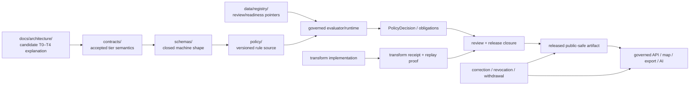
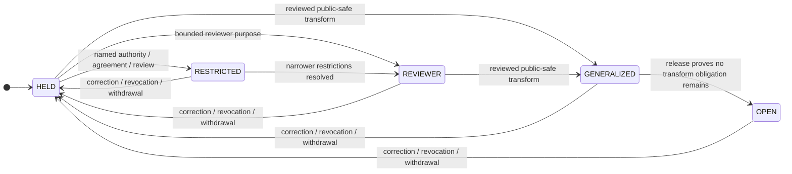

<!-- [KFM_META_BLOCK_V2]
doc_id: kfm://doc/architecture/sensitivity-tiers
title: Sensitivity and Release-Tier Architecture — Current Repository Boundary and Graduation Plan
type: architecture-reference; sensitivity; release-tier-boundary
version: v2.0-draft
status: "draft; repository-grounded; T0-T4-proposed; no-adoption; no-active-general-bundle; no-runtime-enforcement; no-release; no-publication"
owners:
  - "@bartytime4life — verified CODEOWNERS review route only"
  - "NEEDS VERIFICATION — accountable architecture, sensitivity, rights, sovereignty, policy, security, domain, and release stewards"
created: 2026-05-25
updated: 2026-08-19
policy_label: repository-facing; public-safe; sensitivity; rights; release-tier; no-sensitive-values
owning_root: docs/
current_path: docs/architecture/sensitivity-tiers.md
responsibility: >-
  Explain the proposed T0–T4 release-tier vocabulary, distinguish it from current
  SensitivityLabel machine shape and other classification dimensions, map the
  repository surfaces that would have to enforce wider exposure, and record the
  governance and validation work required before KFM may claim adoption or runtime
  enforcement.
truth_posture: >-
  CONFIRMED existing path, unique document identity, adopted Directory Rules v2,
  current SensitivityLabel contract/schema pairing, current policy-source and validator
  routing boundaries, current sensitivity-registry README lanes, CODEOWNERS route,
  and absence of an accepted T0–T4 decision in the reviewed ADR inventory /
  PROPOSED T0–T4 vocabulary, crosswalk, transition profile, risk-family defaults,
  adoption plan, and runtime bindings / UNKNOWN active sensitivity evaluator,
  selected bundle, complete fixtures/tests, production consumers, effective release-tier
  decisions, deployed enforcement, and public interoperability.
evidence_snapshot:
  repository: bartytime4life/Kansas-Frontier-Matrix
  base_ref: main
  base_commit: 7ef1597779774d80346f81ecd8104b720797c587
  target_prior_blob: 68fb6030dd25cea4cb36ecde581c9f3fdda924bd
  directory_rules_decision: ADR-0029 accepted
  sensitivity_label_contract_blob: d6ddf1eb7db9bc955e56de76a0d997b6e4ecd231
  sensitivity_label_schema_blob: 3955c7046b50fa7fbdfb9fadf75121fd08a1a39b
  policy_sensitivity_readme_blob: 06197c7a7255264b94fb9dd8d7f73844cfa35682
  codeowners_blob: dd2a84aa514d8ecd9208bc347f90f9a2ed37dd61
related:
  - README.md
  - sensitivity.md
  - data-classification-framework.md
  - contract-schema-policy-split.md
  - governed-api.md
  - sensitive-domain-fail-closed.md
  - ../doctrine/directory-rules.md
  - ../doctrine/sensitivity.md
  - ../standards/SENSITIVITY_RUBRIC.md
  - ../atlases/sensitivity-tier-reference.md
  - ../adr/README.md
  - ../../contracts/policy/sensitivity_label.md
  - ../../contracts/policy/policy_decision.md
  - ../../schemas/contracts/v1/policy/sensitivity_label.schema.json
  - ../../schemas/contracts/v1/policy/policy_decision.schema.json
  - ../../policy/sensitivity/README.md
  - ../../tools/validators/sensitivity/README.md
  - ../../data/registry/sensitivity/README.md
  - ../../release/README.md
  - ../../.github/CODEOWNERS
 tags:
  - kfm
  - architecture
  - sensitivity
  - rights
  - release-tier
  - audience
  - policy
  - review
  - redaction
  - generalization
  - correction
  - rollback
notes:
  - "Same-path architecture-document modernization only; no contract, schema, policy, source, registry record, fixture, validator, test, workflow, release object, runtime, deployment, public artifact, or repository setting is changed."
  - "T0–T4 remains a proposed release-tier vocabulary. The reviewed ADR inventory establishes only ADR-0029 as accepted; this document does not adopt another decision."
  - "The current closed SensitivityLabel schema uses public, generalized, restricted, and quarantine—not T0 through T4."
  - "Current policy/sensitivity source is mixed-maturity scaffold material; repository presence does not establish an active bundle, evaluator binding, or public enforcement."
  - "All legacy major-section anchors are retained for inbound-link compatibility."
[/KFM_META_BLOCK_V2] -->

<a id="top"></a>
<a id="sensitivity--rights-tier-architecture-t0t4"></a>

# Sensitivity and Release-Tier Architecture — Current Repository Boundary and Graduation Plan

> **Purpose.** Explain what the proposed T0–T4 vocabulary is for, what the current repository actually implements, which classification dimensions must remain separate, and what must close before KFM may claim release-tier adoption or sensitivity enforcement.


> [!IMPORTANT]
> **An architecture page is not policy or conformance proof.** This document does not adopt T0–T4, assign a tier to a record, authorize access, change a schema, activate a policy bundle, certify a transform, approve review, release an artifact, or prove that a public client enforces sensitivity.

> [!CAUTION]
> **The current machine label is not T0–T4.** The paired [`SensitivityLabel`](../../contracts/policy/sensitivity_label.md) schema currently admits `public`, `generalized`, `restricted`, and `quarantine`. Treating those four values as automatic aliases for `T0`–`T4`, S0–S5, C0–C5, a source default, or lifecycle/release state would create unsupported authority.

> [!WARNING]
> **Current policy source is not proven active.** The repository contains sensitivity-policy scaffolds with mixed defaults and no established general evaluator/bundle binding. A tracked rule, README, schema, validator index, fixture, or green documentation check must not be represented as runtime protection.

| Field | Current bounded result |
|---|---|
| **Directory result** | `PLACE` at the existing `docs/architecture/sensitivity-tiers.md` path. Cross-root sensitivity/release-tier composition is an architecture concern under the adopted Directory Rules. |
| **Accepted placement authority** | [`ADR-0029`](../adr/ADR-0029-adopt-directory-governance-standard-v2.md) accepts the exact Directory Rules v2 bytes. |
| **T0–T4 adoption state** | **PROPOSED / HOLD.** The reviewed ADR inventory establishes only ADR-0029 as accepted; no accepted T0–T4 decision was found. |
| **Current semantic object** | Draft [`SensitivityLabel`](../../contracts/policy/sensitivity_label.md), paired to a closed schema with four levels: `public`, `generalized`, `restricted`, `quarantine`. |
| **Current policy-source state** | Repository-present mixed-maturity scaffolds; no accepted active general sensitivity bundle, evaluator binding, or release enforcement established by the reviewed evidence. |
| **Current validator state** | [`tools/validators/sensitivity/README.md`](../../tools/validators/sensitivity/README.md) is a routing boundary; an executable parent sensitivity validator and complete wiring are not established. |
| **Current registry state** | [`data/registry/sensitivity/README.md`](../../data/registry/sensitivity/README.md) and selected child READMEs exist; canonical emitted registry records and runtime consumers remain unverified. |
| **Review route** | `@bartytime4life` through [`CODEOWNERS`](../../.github/CODEOWNERS); routing is not stewardship, independent review, or approval. |
| **Release/publication effect** | None. |

<a id="contents"></a>

**Quick navigation:** [Scope](#1-purpose--scope) · [Candidate tiers](#2-the-tier-scheme-t0t4) · [Reading rule](#3-the-reading-rule) · [Architecture](#4-where-tiers-live-in-the-architecture) · [Transitions](#5-tier-transitions-allowed-motion) · [Risk families](#6-per-domain-default-tier-matrix) · [Fail closed](#7-failure-closed-posture) · [Lifecycle](#8-interaction-with-the-lifecycle-gates) · [AI](#9-interaction-with-governed-ai) · [3D](#10-interaction-with-3d--planetary-surfaces) · [Hazards](#11-the-hazards-t4-forever-boundary) · [Anti-patterns](#12-anti-patterns) · [Graduation](#13-verification-backlog) · [Related](#14-related-docs) · [Objects](#appendix-a--glossary-of-cited-objects)

---

<a id="1-purpose--scope"></a>

## 1. Purpose & scope

This page owns the **human-readable cross-root explanation** of a candidate release-tier vocabulary. It connects sensitivity context, rights, consent or sovereignty, requested audience and precision, policy evaluation, review, transforms, release, correction, and rollback without absorbing any of those authorities.

### 1.1 In scope

- the purpose and limits of the proposed T0–T4 vocabulary;
- the difference between content sensitivity, audience/access, release-transform posture, source defaults, lifecycle, review, and release state;
- current repository evidence for the `SensitivityLabel` contract/schema, sensitivity-policy source, validator routing, registry routing, and related documents;
- fail-closed and most-restrictive composition principles;
- candidate wider-exposure and retreat transitions;
- public-surface implications for API, maps, tiles, exports, search, graphs, screenshots, 3D, and governed AI;
- conflict, adoption, validation, correction, and rollback requirements.

### 1.2 Out of scope

| Question | Owning authority |
|---|---|
| What sensitivity or release-tier objects mean | Accepted semantic contracts under `contracts/` |
| What fields and enums are machine-valid | Exact versioned schemas under `schemas/` |
| Which use is allowed, denied, held, restricted, or abstained | Accepted policy source plus governed evaluation |
| Which source rights, consent, or sovereignty obligations apply | Source/rights/consent records and qualified review |
| Whether evidence supports a sensitivity or public-safety claim | `EvidenceRef` resolution to `EvidenceBundle` and applicable proof authorities |
| Whether a transform ran correctly | Versioned transform implementation, receipt, fixtures, tests, and replay |
| Whether human/steward review occurred | A governed review record, not CODEOWNERS or a pull request |
| Whether an artifact is released or public | `release/`, proof closure, correction, withdrawal, and rollback evidence |
| Whether runtime enforcement works | Exact-revision implementation, configuration, tests, workflows, logs, and observed consumers |

### 1.3 Non-effects

This same-path revision does **not**:

- accept T0–T4 or an S/C/T crosswalk;
- change the current `SensitivityLabel` values;
- turn any planning atlas into policy authority;
- choose a policy package, bundle, evaluator, or runtime entrypoint;
- repair or activate any Rego source;
- assign per-record, per-source, per-domain, or per-product tiers;
- create protected data, exact-location examples, hidden thresholds, or redaction parameters;
- activate a source, promote lifecycle state, release, deploy, or publish.

The supplied KFM corpus consistently requires unknown rights, sovereignty, sensitivity, and release state to fail closed; it also treats implementation plans as proposals until current repository evidence proves otherwise.

[Back to top](#top)

---

<a id="2-the-tier-scheme-t0t4"></a>

## 2. The tier scheme (T0–T4)

T0–T4 is a **candidate release-transform and audience vocabulary** inherited from the atlas lineage. It is useful for design discussion because it makes increasing exposure visible. It is not an accepted machine enum or a current policy decision.

| Candidate tier | Candidate meaning | Audience posture | Current status |
|---|---|---|---|
| **T0 — Open** | Public-safe representation requiring no sensitivity transform for the evaluated operation. | Public through governed released interfaces. | **PROPOSED** |
| **T1 — Generalized** | Public-safe derivative after a reviewed, receipted generalization, aggregation, redaction, suppression, or equivalent transform. | Public through governed released interfaces. | **PROPOSED** |
| **T2 — Reviewer** | Representation limited to authenticated stewards/reviewers for a bounded purpose. | Controlled reviewer surface. | **PROPOSED** |
| **T3 — Restricted** | Representation limited to named authorized parties under a recorded agreement, authority, consent, or sovereignty posture. | Named parties only. | **PROPOSED** |
| **T4 — Denied / held** | No release for the evaluated operation; even existence-only disclosure may need review. | No normal audience. | **PROPOSED** |

> [!IMPORTANT]
> **T0 is never the absence of a label.** A public-safe conclusion still requires the applicable source, rights, evidence, policy, review, lifecycle, release, correction, and rollback gates. “No one marked it sensitive” is not an affirmative public-safety decision.

### 2.1 Do not collapse the classification dimensions

| Dimension | Question answered | Current or candidate vocabulary | Authority boundary |
|---|---|---|---|
| Content sensitivity | Could full-precision content enable harm? | Draft S0–S5/numeric rubrics appear in doctrine and standards lineage | An accepted contract/schema/policy profile is still needed |
| Sensitivity label | What exposure posture is attached to this evaluated object? | **Current schema:** `public`, `generalized`, `restricted`, `quarantine` | `SensitivityLabel` contract/schema |
| Access/audience | Which actor, purpose, route, and operation may receive a representation? | C0–C5 and other access classes appear in draft lineage | Access/consent policy and runtime identity |
| Release-transform tier | What transformation/review/authority posture is required before release? | **Candidate:** T0–T4 | T0–T4 adoption decision plus contracts/schemas/policy |
| Source default | What caution should admission begin with? | SourceDescriptor sensitivity/rights fields | Source contract/schema/registry |
| Lifecycle phase | Where is the object in the governed process? | RAW, WORK/QUARANTINE, PROCESSED, CATALOG/TRIPLETS, PUBLISHED | Lifecycle doctrine and governed records |
| Review state | Has accountable review occurred for this scope/version? | Object-family-specific | Review contract/schema and review record |
| Release/correction state | Is a governed release current, corrected, withdrawn, or superseded? | Object-family-specific | `release/` and linked evidence |

No equation such as `S3 = C1 = T1 = generalized` is valid without an explicit, versioned, operation-bounded crosswalk owned by policy and proven with fixtures. The same underlying object can legitimately have a high sensitivity assessment, a restricted internal representation, and a separate generalized public derivative.

### 2.2 Current machine boundary

The current closed `SensitivityLabel` schema requires:

```json
{
  "level": "public | generalized | restricted | quarantine",
  "reason": "public-safe reason text",
  "applied_at": "RFC 3339 date-time"
}
```

It does not include `T0`, `T1`, `T2`, `T3`, or `T4`. It also does not by itself encode actor, purpose, rights, transform receipt, review, release, correction, or rollback. Those concerns must not be inferred from `level`.

[Back to top](#top)

---

<a id="3-the-reading-rule"></a>

## 3. The reading rule

The durable safety rule is asymmetric:

> **Wider exposure requires affirmative closure. Narrower exposure may happen immediately for safety, followed by auditable correction, withdrawal, and derivative invalidation.**

The previous edition presented a contradiction: prose said a downgrade could occur through a `CorrectionNotice` alone, while its transition table also required a `ReviewRecord`. This edition removes that false precision. The exact object sequence is not adopted; the safety behavior is the load-bearing requirement.

| Direction | Minimum architectural expectation | Safe failure |
|---|---|---|
| **Wider audience or precision** | Resolved identity, evidence, rights/consent/sovereignty, explicit policy decision, accountable review where required, deterministic transform receipt when content changes, release binding, correction path, and rollback target. | `DENY`, `ABSTAIN`, `HOLD`, or remain unreleased. |
| **Narrower audience or precision** | Restrict delivery immediately; preserve the prior state; issue the applicable correction, withdrawal, supersession, cache invalidation, and review records as soon as the owning process requires. | Prefer over-restriction to continued unsafe exposure. |
| **Correction of classification** | Preserve old and new assessments, reason, effective time, affected releases/derivatives, and reviewer/authority scope. | Do not overwrite history. |
| **Changed rights or revocation** | Stop incompatible use first; propagate withdrawal/invalidation to carriers and caches. | No stale allow. |
| **Unknown evaluator or dependency state** | Fail closed and route to quarantine/review. | Never fall back to public/open. |

### 3.1 Derivative identity is mandatory

A generalized or redacted public-safe derivative is **not the same object** as the restricted input. It needs:

- its own deterministic identity and digest;
- explicit derivation lineage;
- the transform/profile/version that produced it;
- public-safe evidence and policy/review references;
- current release and correction state; and
- a rollback/withdrawal target.

A tier or label change must not mutate restricted source truth into a public object in place.

[Back to top](#top)

---

<a id="4-where-tiers-live-in-the-architecture"></a>

## 4. Where tiers live in the architecture

The adopted Directory Rules separate human explanation, semantic meaning, machine shape, policy source, validation, data/registry state, process evidence, release decisions, and runtime delivery.


```mermaid
flowchart LR
    D["docs/architecture/<br/>candidate T0–T4 explanation"] --> C["contracts/<br/>accepted tier semantics"]
    C --> S["schemas/<br/>closed machine shape"]
    S --> P["policy/<br/>versioned rule source"]
    R["data/registry/<br/>review/readiness pointers"] --> E["governed evaluator/runtime"]
    P --> E
    E --> PD["PolicyDecision / obligations"]
    X["transform implementation"] --> RR["transform receipt + replay proof"]
    PD --> L["review + release closure"]
    RR --> L
    L --> A["released public-safe artifact"]
    A --> U["governed API / map / export / AI"]
    N["correction / revocation / withdrawal"] --> A
    N --> U
```

The diagram is a responsibility map, not proof that every arrow is implemented.

### 4.1 Current repository evidence map

| Surface | Confirmed repository evidence | Bounded conclusion |
|---|---|---|
| Architecture | This page and the umbrella [`sensitivity.md`](./sensitivity.md) exist | Human explanation exists; authority and overlap remain unresolved |
| Atlas lineage | Two sensitivity-tier reference pages exist under `docs/atlases/` | Navigational source lineage exists; it does not adopt T0–T4 |
| Doctrine/standard lineage | Draft [`docs/doctrine/sensitivity.md`](../doctrine/sensitivity.md) and [`SENSITIVITY_RUBRIC.md`](../standards/SENSITIVITY_RUBRIC.md) exist | S0–S5/C0–C5/T0–T4 claims need reconciliation; drafts do not become accepted authority |
| Semantic contract | [`contracts/policy/sensitivity_label.md`](../../contracts/policy/sensitivity_label.md) exists and is schema-paired | Four-level label semantics are documented, still draft/PROPOSED |
| Machine shape | [`sensitivity_label.schema.json`](../../schemas/contracts/v1/policy/sensitivity_label.schema.json) is closed | Exact current enum is machine-verifiable; it is not T0–T4 |
| Policy source | [`policy/sensitivity/`](../../policy/sensitivity/README.md) contains tracked rule/profile scaffolds | No active general bundle/evaluator/release binding is established |
| Validator routing | [`tools/validators/sensitivity/README.md`](../../tools/validators/sensitivity/README.md) exists | Parent executable behavior and complete wiring remain unverified |
| Registry routing | [`data/registry/sensitivity/README.md`](../../data/registry/sensitivity/README.md) plus selected domain READMEs exist | Registry path/readme evidence exists; emitted records and consumers remain unverified |
| Policy decision | Draft [`PolicyDecision`](../../contracts/policy/policy_decision.md) contract/schema exists | Current finite runtime-facing outcome is `ANSWER / ABSTAIN / DENY / ERROR`, not the old mixed vocabulary |
| Release | [`release/README.md`](../../release/README.md) exists as the release-root boundary | No release-tier adoption or released T0–T4 artifact is established by this page |

### 4.2 Known architecture conflicts

| ID | Conflict | Current disposition |
|---|---|---|
| **ST-DRIFT-001** | Candidate T0–T4 versus current four-value `SensitivityLabel` schema | **HOLD** crosswalk/adoption |
| **ST-DRIFT-002** | Draft S0–S5 “every record carries a rank” claims versus current object-family-specific schemas | **HOLD** universal-field claim |
| **ST-DRIFT-003** | T0–T4 atlas extracts describe themselves as navigational yet are cited as doctrine in older pages | **REVISE** wording; do not grant authority |
| **ST-DRIFT-004** | `docs/architecture/sensitivity.md` and this page overlap in architecture scope | **HOLD** structural convergence; preserve both identities |
| **ST-DRIFT-005** | Policy source has mixed defaults and incomplete evaluator/consumer evidence | **HOLD** enforcement claim |
| **ST-DRIFT-006** | Policy engine/native outcomes and `PolicyDecision` runtime-facing outcomes use different vocabularies | **NEEDS VERIFICATION** normalization contract |
| **ST-DRIFT-007** | Per-domain documents contain overlapping and sometimes conflicting sensitivity profiles | **NEEDS VERIFICATION** domain-by-domain authority map |

[Back to top](#top)

---

<a id="5-tier-transitions-allowed-motion"></a>

## 5. Tier transitions (allowed motion)

The arrows below are **candidate transition classes**, not a binding state machine.


```mermaid
stateDiagram-v2
    direction LR
    [*] --> HELD
    HELD --> RESTRICTED: named authority / agreement / review
    HELD --> REVIEWER: bounded reviewer purpose
    HELD --> GENERALIZED: reviewed public-safe transform
    RESTRICTED --> REVIEWER: narrower restrictions resolved
    REVIEWER --> GENERALIZED: reviewed public-safe transform
    GENERALIZED --> OPEN: release proves no transform obligation remains
    OPEN --> HELD: correction / revocation / withdrawal
    GENERALIZED --> HELD: correction / revocation / withdrawal
    REVIEWER --> HELD: correction / revocation / withdrawal
    RESTRICTED --> HELD: correction / revocation / withdrawal
```

The state names resemble T4→T0 but deliberately avoid claiming a current machine enum.

### 5.1 Candidate transition evidence

| Candidate motion | Required support before reliance | Must not be inferred from |
|---|---|---|
| Held → restricted | Named authority/agreement/consent, scope, expiry or revocation behavior, policy result, review, audit | Authentication alone |
| Held → reviewer | Purpose-bound reviewer authorization, current sensitivity/rights context, policy result, audit | CODEOWNERS or repository write access |
| Held/reviewer → generalized | Versioned transform, input/output identity, receipt, tests/replay, review, policy obligations | Rounded coordinates or hidden fields |
| Generalized → open | Evidence that the released representation no longer depends on a sensitivity transform for the evaluated operation, plus full release closure | A `public` label alone |
| Any state → held/restricted | Immediate safety restriction plus correction/withdrawal/invalidation lineage | A later scheduled release cycle |
| Corrected state → wider exposure | Fresh evaluation of all wider-exposure requirements | Prior approval |

### 5.2 What a transition is not

A transition is not:

- a field edit without lineage;
- a file move to `data/published/`;
- a schema pass;
- a validator pass;
- a Git commit or pull request;
- a CODEOWNERS review request;
- an authentication check;
- a map style/filter/zoom decision;
- an AI summary;
- a cache setting;
- a release-manifest filename without a governed release record.

### 5.3 Promotion and release remain independent

A candidate release-tier transition may be necessary for public exposure, but it never replaces lifecycle promotion. The public-safe derivative must still pass:

1. source and object identity;
2. evidence and provenance closure;
3. rights/consent/sovereignty review;
4. machine validation and semantic invariants;
5. policy evaluation and obligations;
6. accountable review;
7. proof/catalog integrity;
8. release, correction, withdrawal, and rollback controls.

[Back to top](#top)

---

<a id="6-per-domain-default-tier-matrix"></a>

## 6. Per-domain default tier matrix

The prior edition called one planning-derived table “canonical.” Current repository evidence does not support that claim. The safe replacement is a **risk-family starting posture**. Domain contracts and accepted policy must define finer object/operation decisions.

| Risk family | Safe starting posture | Candidate T0–T4 shorthand | Required review pressure |
|---|---|---|---|
| Living-person identity, residence, relationships, genealogy, DNA/genomics | Hold exact/private material; release only authorized, purpose-bounded derivatives | Usually T4/T3; generalized aggregate may become T1 | Privacy, consent, rights, sensitivity, release |
| Archaeology, burials, sacred/cultural or sovereign-controlled knowledge | Deny exact public disclosure; qualified authority determines whether any derivative exists | Usually T4; reviewed generalized derivative may become T2/T1 | Cultural/tribal/sovereignty, domain, rights |
| Rare species, nests/dens/roosts, rare plants, sensitive habitat | Deny exact locations; use reviewed geoprivacy/generalization where justified | Usually T4; public-safe derivative may become T1 | Domain steward, source terms, geoprivacy |
| Critical infrastructure interiors, vulnerabilities, dependencies, exploit-enabling detail | Deny precise operational detail; public summary only after security review | Usually T4/T2; bounded summary may become T1/T0 | Security, infrastructure, release |
| Private wells, person/parcel, ownership/occupancy and small-cell joins | Separate identity, legal context, observation, and geometry; reassess join output | Usually T4/T3/T2 | Rights, privacy, purpose, re-identification |
| Restricted-source or agreement-bound material | Preserve agreement, permitted purpose, downstream obligations, expiry/revocation | Usually T3/T4 | Rights holder/source steward |
| Models, forecasts, AI, synthetic scenes, reconstructions | Mark derived/synthetic; preserve method, uncertainty, evidence, and reality boundary | Tier depends on inputs/output risk; never infer openness from derivation | Model/domain/release review |
| Historical/public reference layers | May be public-safe, but still require rights, evidence, release, correction, and currentness | Candidate T0 only after affirmative closure | Source, rights, release |
| Sensitive-by-composition output | Reassess the output; strictest applicable obligations win until a transform proves safety | Start no more public than strictest input | Cross-lane and threat review |
| Hazards/advisories | Preserve official issuing authority and currentness; do not present KFM as alert authority | Context product may be public; alert-authority behavior is denied | Source/currentness, hazards, public-safety |

> [!CAUTION]
> **The shorthand is not an assignment.** A domain name does not determine a tier. Object family, source role, full precision, requested operation, audience, rights, consent/sovereignty, composition risk, evidence, review, release, and correction state all matter.

### 6.1 Most restrictive obligations win

For a join or derivative:

1. preserve each input’s role and restrictions;
2. classify the produced output, not only the inputs;
3. inherit the strictest unresolved rights, consent, sovereignty, sensitivity, and release obligations;
4. consider reconstruction, differencing, temporal triangulation, stable identifiers, metadata, labels, screenshots, and caches;
5. allow wider exposure only after a reviewed transform proves the output is public-safe.

A county aggregate can become sensitive when joined to a tiny population, parcel identity, exact time, or stable private identifier. A “public” source can become restricted by license, composition, or requested purpose.

[Back to top](#top)

---

<a id="7-failure-closed-posture"></a>

## 7. Failure-closed posture

Fail-closed is a governing requirement. **Current repository enforcement remains unproved.** The tracked sensitivity-policy source includes mixed defaults, and the reviewed evidence does not establish one active bundle selector, evaluator binding, normalized outcome adapter, complete native tests, or public consumer.

### 7.1 Current finite outcome boundary

The current draft `PolicyDecision` schema uses:

- `ANSWER`
- `ABSTAIN`
- `DENY`
- `ERROR`

Lower-level rule engines or policy profiles may use `ALLOW`, `RESTRICT`, `HOLD`, or other native results. A reviewed normalization contract must preserve distinctions and must never map an evaluation error, missing input, or unknown decision to `ANSWER`.

### 7.2 Safe failure matrix

| Missing or conflicting support | Safe outcome | Public explanation boundary |
|---|---|---|
| Sensitivity context absent or stale | `ABSTAIN` or `DENY`; hold/quarantine | “Sensitivity review is unresolved.” |
| Rights, consent, sovereignty, or agreement unresolved | `DENY` or `ABSTAIN` | Do not reveal protected rationale |
| EvidenceRef cannot resolve | `ABSTAIN` or `ERROR` | “Required evidence is unavailable.” |
| Policy bundle/evaluator/binding unavailable | `ERROR`; no fallback allow | “Policy evaluation failed.” |
| Required transform receipt missing or digest mismatch | `DENY` or `ERROR` | “Public-safe transform could not be verified.” |
| Accountable review missing | `DENY` or hold | “Required review is incomplete.” |
| Release/correction/rollback support missing | Remain unreleased | “Release prerequisites are incomplete.” |
| Source-role or knowledge-character collapse | `DENY` or `ABSTAIN` | Name the public-safe role mismatch only |
| Join/derivative weakens an inherited obligation | `DENY` | Do not expose the protected input |
| Public carrier contains restricted bytes hidden by style | `DENY` and incident/correction routing | Do not describe exploit-enabling detail |

### 7.3 No sensitive values in reasons

Reason codes, logs, receipts, docs, fixtures, test names, issue bodies, and generated reports must not contain:

- exact protected coordinates;
- private living-person identifiers;
- DNA kit/vendor IDs or raw segments;
- sacred/cultural site identifiers;
- exploit-enabling infrastructure details;
- private source payloads;
- hidden transform thresholds or reverse-engineering parameters.

Use public-safe reason families and keep protected evidence behind governed access.

[Back to top](#top)

---

<a id="8-interaction-with-the-lifecycle-gates"></a>

## 8. Interaction with the lifecycle gates

Release tier, sensitivity label, lifecycle phase, and release state are separate axes.

```text
RAW -> WORK / QUARANTINE -> PROCESSED -> CATALOG / TRIPLETS -> PUBLISHED
```

| Lifecycle boundary | Sensitivity/release-tier expectation | Current implementation conclusion |
|---|---|---|
| Source edge / admission | Record source-native rights, sensitivity default, role, scope, and permitted use; unresolved posture fails closed | Object-family-specific; no universal active T0–T4 assignment established |
| RAW → WORK/QUARANTINE | Preserve exact source material only in governed internal storage; route unresolved or unsafe material to quarantine | Lifecycle doctrine exists; exact runtime behavior is not established by this page |
| WORK → PROCESSED | Validate object shape/identity; produce a distinct transformed derivative when needed; preserve input/output lineage | Some domain validators exist; no general tier-transition implementation is established |
| PROCESSED → CATALOG/TRIPLETS | Prevent restricted values from public discovery/graph/search projections; bind current sensitivity and evidence references | Catalog closure is independent of public release |
| CATALOG/TRIPLETS → PUBLISHED | Require public-safe artifact binding, policy/review, proof, release, correction, and rollback | No T0–T4 release workflow is established here |
| Correction/withdrawal | Restrict first, preserve history, invalidate derivatives/caches/search/tiles/AI, then rebuild reviewed state | Required architecture; operational closure needs verification |
| Rollback | Return to a known prior released state or remove exposure; preserve audit chain | Required architecture; exact object/runtime support needs verification |

### 8.1 Public clients never receive restricted bytes

A public map or API must not receive exact restricted content and rely on:

- hidden columns;
- CSS/opacity;
- zoom thresholds;
- filters;
- popup omission;
- client-side feature state;
- authentication performed only in the browser;
- undocumented CDN behavior.

Transform and authorize the derivative before delivery. A carrier cannot make restricted bytes safe.

### 8.2 Correction propagation

A rights, consent, sensitivity, role, evidence, or release change must identify affected:

- catalog records and graph/triplet projections;
- API payloads and caches;
- tiles, PMTiles, COGs, GeoParquet, and static exports;
- search/vector/embedding indexes;
- screenshots, stories, reports, and download packages;
- Evidence Drawer and Focus Mode answers;
- public documentation that asserts a current release.

Silently updating one record while stale derivatives remain public is a failed correction.

[Back to top](#top)

---

<a id="9-interaction-with-governed-ai"></a>

## 9. Interaction with Governed AI

Governed AI is downstream of the same evidence, policy, review, and release membrane as every other public surface.

### 9.1 Required posture

An AI answer that depends on sensitivity-relevant material should:

1. define the requested audience, purpose, scope, spatial precision, and temporal precision;
2. retrieve only through governed interfaces;
3. resolve cited `EvidenceRef` values to admissible `EvidenceBundle` support;
4. evaluate rights, consent/sovereignty, sensitivity, source role, review, release, and correction state;
5. use only the released public-safe representation;
6. return `ANSWER`, `ABSTAIN`, `DENY`, or `ERROR` without leaking protected reasons;
7. record the applicable AI/runtime receipt where the accepted object family requires it.

### 9.2 Prohibited behavior

AI must not:

- read RAW, WORK, QUARANTINE, or restricted internal stores through a normal public route;
- infer a more-public tier because a fact is easy to find online;
- paraphrase modeled, aggregate, regulatory, candidate, or synthetic material as direct observation;
- disclose that a protected T4-like record exists without permission;
- reveal withheld precision through prose, tool arguments, citations, labels, or follow-up questions;
- combine several public-safe outputs to reconstruct a protected input;
- treat an embedding, vector hit, graph edge, screenshot, map tile, or generated summary as root evidence;
- fallback to uncited prose when policy/evidence resolution fails.

### 9.3 Current evidence boundary

The presence of governed-AI architecture and policy documentation does not establish that every model request is currently bound to an active sensitivity evaluator. Runtime and deployment claims require exact-revision implementation and observed evidence.

[Back to top](#top)

---

<a id="10-interaction-with-3d--planetary-surfaces"></a>

## 10. Interaction with 3D / Planetary surfaces

3D, terrain, point clouds, models, reconstructions, and synthetic scenes are downstream representations. They can create new exposure risks through occlusion removal, vertical context, viewpoint changes, asset metadata, mesh detail, temporal animation, or combination of several otherwise generalized layers.

### 10.1 Required principles

- **Most restrictive wins.** A composed scene cannot be more public than its unresolved constituent obligations.
- **Reality boundary stays visible.** Observed, modeled, inferred, reconstructed, and synthetic elements remain distinguishable.
- **Public-safe derivation occurs upstream.** Do not ship protected geometry and hide it in a renderer.
- **Representation lineage is explicit.** Projection, decimation, clipping, aggregation, simplification, and generalization are recorded where material.
- **2D/3D parity is checked.** Switching representation must not reveal a stricter field, time slice, feature set, or geometry.
- **Plugin/runtime capability is not release authority.** A renderer that can load an asset is not permission to expose it.

### 10.2 Candidate release-tier treatment

A scene may use the T0–T4 vocabulary only after that vocabulary is adopted and a scene/profile contract binds:

- constituent object identities and release refs;
- sensitivity/rights obligations;
- public-safe derivative refs;
- reality-boundary statement;
- representation/transform receipts;
- review and policy decisions;
- correction and rollback behavior.

This page does not accept a sole-renderer decision, a scene schema, or a specific representation-receipt home.

[Back to top](#top)

---

<a id="11-the-hazards-t4-forever-boundary"></a>

## 11. The Hazards T4-forever boundary

The durable safety invariant is:

> **KFM is not an emergency-alert authority and must not present its own content as authoritative life-safety instruction.**

The prior edition encoded that invariant as “T4 forever.” That is useful shorthand in the planning atlas, but it mixes **capability denial** with **content release tier**. This edition keeps the legacy anchor while separating the two questions.

| Question | Bounded answer |
|---|---|
| May KFM claim to be the issuing emergency-alert authority? | **DENY.** This is a capability/presentation boundary. |
| May KFM reproduce or link a released official advisory? | Potentially, only with issuing authority, issue/update/expiry/cancellation time, currentness, evidence, terms, policy, review, release, and prominent role/disclaimer support. |
| May historical hazard events or public-safe analyses be released? | Potentially, through ordinary governed evidence and release controls. |
| Does every hazard object equal T4? | **No.** Object family, source role, currentness, operation, audience, and release state matter. |
| Does a T0/T1-like public hazard product make KFM an alert authority? | **No.** Public availability and operational authority are different dimensions. |
| What happens when official status cannot be verified? | `ABSTAIN`, `ERROR`, stale/held state, or removal from operational context—not a guessed clear. |

### 11.1 Surface requirements

A hazards surface should preserve:

- the official issuing authority;
- source-native identifier and jurisdiction;
- issue, valid, update, expiry, cancellation, and retrieval times where material;
- observed/forecast/advisory/model/historical source role;
- stale, missing, conflict, and correction state;
- direct route to official channels for action.

No map color, AI wording, badge, notification, or story card may imply that KFM itself issued the warning.

[Back to top](#top)

---

<a id="12-anti-patterns"></a>

## 12. Anti-patterns

| Anti-pattern | Why it fails |
|---|---|
| **Silent T0 default** | Missing sensitivity evidence is converted into public permission. |
| **Universal-number collapse** | Source role, S rank, C access class, T tier, lifecycle, and release state lose distinct meanings. |
| **Schema-as-policy** | A valid `SensitivityLabel` is treated as permission to expose. |
| **Policy-file-as-enforcement** | Tracked Rego or YAML is cited without a selected bundle, evaluator binding, native tests, and consumer. |
| **Documentation-as-adoption** | Atlas or architecture prose is treated as an accepted ADR. |
| **Authentication-as-authorization** | Logged-in users receive material without purpose/scope/policy review. |
| **Admin path as public path** | A steward/developer shortcut bypasses normal governed delivery and correction. |
| **Style-as-redaction** | Restricted bytes are sent to the browser and hidden visually. |
| **Source-role upgrade by paraphrase** | AI or UI converts aggregate/model/candidate/context into observed truth. |
| **Sensitivity downgrade by derivative** | A tile, graph, export, summary, or scene drops inherited restrictions. |
| **Inference-by-join** | Public-safe inputs reconstruct protected people, places, sites, infrastructure, or species locations. |
| **Sensitive reasons in public output** | Denial text reveals the protected fact. |
| **Correction without invalidation** | Stale carriers remain available after classification or rights change. |
| **Release without rollback** | Wider exposure has no safe recovery path. |
| **T4-for-everything hazards rule** | Capability denial is incorrectly converted into a blanket content classification. |
| **Passing docs/CI badge as conformance** | A check proves only its declared assertions at a revision. |

[Back to top](#top)

---

<a id="13-verification-backlog"></a>

## 13. Verification backlog

T0–T4 may graduate only through an explicit, dependency-closed governance and implementation sequence. This page does not perform that graduation.

### 13.1 Graduation sequence

| Step | Required decision/evidence | Status |
|---:|---|---|
| 1 | Decide whether KFM needs T0–T4 as a distinct release-tier vocabulary rather than using existing `SensitivityLabel` plus separate access/release fields | **OPEN / DECISION** |
| 2 | Reconcile `sensitivity-tiers.md`, `sensitivity.md`, doctrine sensitivity, SENSITIVITY_RUBRIC, and atlas extracts; identify survivor roles without deleting history | **NEEDS VERIFICATION** |
| 3 | Accept or reject an ADR defining scope, vocabulary, semantics, authority, compatibility, and migration | **OPEN** |
| 4 | Define semantic contracts for release tier, transition request/result, review binding, and public-safe derivative identity | **PROPOSED** |
| 5 | Define closed schemas or a versioned mapping to existing labels without alias collapse | **PROPOSED** |
| 6 | Define policy input, native policy outcomes, normalization to `PolicyDecision`, reason codes, obligations, evaluator/bundle binding, and fail-closed errors | **PROPOSED** |
| 7 | Select or repair sensitivity-policy source; add bundle manifest, exact digests, native tests, and no-network fixtures | **PROPOSED** |
| 8 | Implement deterministic validators for crosswalk, most-restrictive propagation, transform/review/release closure, and correction invalidation | **PROPOSED** |
| 9 | Add positive and negative fixtures for each transition, risk family, join/composition case, stale/revoked state, and public surface | **PROPOSED** |
| 10 | Bind governed API, map/tile/export/search/graph/AI consumers to evaluated public-safe derivatives; prove no restricted bytes reach public clients | **PROPOSED** |
| 11 | Rehearse correction, withdrawal, cache/index invalidation, rollback, and deterministic replay | **PROPOSED** |
| 12 | Record accountable specialist review and a governed release/adoption decision | **UNKNOWN** |

### 13.2 Open verification register

| ID | Question | Evidence that would settle it |
|---|---|---|
| **VB-ST-01** | Is T0–T4 accepted, rejected, or still proposal-only? | Accepted/rejected ADR and synchronized authoritative index |
| **VB-ST-02** | Which document owns umbrella sensitivity architecture and which owns tier-specific guidance? | Convergence decision, identity/link inventory, migration/rollback plan |
| **VB-ST-03** | Is the four-value `SensitivityLabel` sufficient, or must it gain a separate release-tier field/object? | Accepted contract/schema decision and compatibility fixtures |
| **VB-ST-04** | Which S0–S5/C0–C5/T0–T4 crosswalks are valid for which operations/domains? | Versioned policy-owned crosswalk with positive/negative fixtures |
| **VB-ST-05** | Which policy bundle is active and what exact evaluator entrypoint consumes it? | Bundle manifest/digest, evaluator config, runtime binding, observed decision |
| **VB-ST-06** | How are engine-native outcomes normalized to `PolicyDecision` without collapsing hold/restrict/abstain/error? | Contract/schema, adapter tests, negative fixtures |
| **VB-ST-07** | Which transform receipts and review records are canonical? | Accepted object-family contracts/schemas and producer/consumer tests |
| **VB-ST-08** | Do public clients ever receive restricted bytes? | Network/browser tests, payload inspection, map/tile/export/AI negative fixtures |
| **VB-ST-09** | Do corrections invalidate all catalog, graph, cache, tile, search, export, story, and AI derivatives? | Correction/withdrawal/rollback rehearsal and emitted closure report |
| **VB-ST-10** | Which specialist roles must review each risk family? | Approved stewardship assignments and separation-of-duties policy |
| **VB-ST-11** | Are sensitivity registry records emitted and consumed, or are the lanes documentation-only? | Schema, fixtures, records, validators, runtime consumer evidence |
| **VB-ST-12** | Which checks are required by branch protection/release gating? | Current repository ruleset and exact workflow evidence |

### 13.3 Validation expectations for this document

This documentation-only change should pass:

- metadata-block validation;
- document graph and stable identity checks;
- internal/external link checks;
- Markdown build/render checks;
- stale-document and citation checks;
- accessibility checks; and
- repository-wide security/validator gates, with any inherited failures classified against the exact base.

A green documentation check does not adopt T0–T4 or prove sensitivity enforcement.

### 13.4 Rollback

Before merge, close the draft pull request and delete the feature branch. After an authorized merge, revert the same-path documentation commit or restore prior blob `68fb6030dd25cea4cb36ecde581c9f3fdda924bd`.

Rollback changes only human-readable architecture guidance. It does not alter the current `SensitivityLabel` schema, policy source, evaluator, registry, lifecycle objects, release state, runtime, deployment, or public artifacts.

[Back to top](#top)

---

<a id="14-related-docs"></a>

## 14. Related docs

| Path | Current role |
|---|---|
| [`README.md`](./README.md) | `docs/architecture/` explanatory boundary and convergence posture |
| [`sensitivity.md`](./sensitivity.md) | Proposal-era umbrella sensitivity architecture; overlap remains unresolved |
| [`data-classification-framework.md`](./data-classification-framework.md) | Repository-grounded classification-dimension map |
| [`contract-schema-policy-split.md`](./contract-schema-policy-split.md) | Meaning/shape/policy/enforceability separation |
| [`sensitive-domain-fail-closed.md`](./sensitive-domain-fail-closed.md) | Sensitive-domain fail-closed architecture |
| [`docs/doctrine/sensitivity.md`](../doctrine/sensitivity.md) | Draft doctrine proposal; not an accepted T0–T4 decision |
| [`SENSITIVITY_RUBRIC.md`](../standards/SENSITIVITY_RUBRIC.md) | Draft S0–S5 standards guidance; currentness and universal-field claims require reconciliation |
| [`sensitivity-tier-reference.md`](../atlases/sensitivity-tier-reference.md) | Navigational atlas extract; proposal lineage, not adoption authority |
| [`docs/adr/README.md`](../adr/README.md) | ADR status/inventory boundary; only ADR-0029 is accepted in the reviewed inventory |
| [`SensitivityLabel`](../../contracts/policy/sensitivity_label.md) | Current draft semantic label with four schema-paired levels |
| [`PolicyDecision`](../../contracts/policy/policy_decision.md) | Current draft finite policy-result semantics |
| [`policy/sensitivity/README.md`](../../policy/sensitivity/README.md) | Repository-grounded policy-source maturity boundary |
| [`tools/validators/sensitivity/README.md`](../../tools/validators/sensitivity/README.md) | Sensitivity-validator routing boundary |
| [`data/registry/sensitivity/README.md`](../../data/registry/sensitivity/README.md) | Sensitivity registry/control-state routing boundary |
| [`release/README.md`](../../release/README.md) | Release, correction, withdrawal, and rollback authority boundary |
| [`CODEOWNERS`](../../.github/CODEOWNERS) | GitHub review routing only |

[Back to top](#top)

---

<a id="appendix-a--glossary-of-cited-objects"></a>

## Appendix A — Glossary of cited objects

This table is navigational. Exact current contracts and schemas outrank the summary.

| Object or concept | Bounded role | Current evidence |
|---|---|---|
| `SensitivityLabel` | Exposure-context label; not access or release approval | Contract/schema pair exists; four finite levels |
| `PolicyDecision` | Finite result of one policy evaluation; not release approval | Contract/schema pair exists; draft/PROPOSED |
| T0–T4 release tier | Candidate transform/review/audience vocabulary | Planning/atlas/architecture lineage only |
| S0–S5 sensitivity rank | Candidate content-harm rubric | Draft doctrine/standards lineage; universal current field not established |
| C0–C5 access class | Candidate audience/route vocabulary | Draft lineage; current binding not established |
| `SourceDescriptor` | Source identity, role, rights, sensitivity default, admission constraints | Draft contract/schema elsewhere in repository |
| `EvidenceRef` / `EvidenceBundle` | Evidence pointer and resolved support bundle | Separate evidence authority |
| Transform receipt | Input/output/profile/version/run evidence for generalization/redaction/aggregation | Exact canonical family and coverage need verification |
| Review record | Accountable human/steward review for a named scope/version | Exact canonical family and current producers need verification |
| Public-safe derivative | New derived object safe for an approved public operation | Requires identity, lineage, transform, policy/review, release, correction, rollback |
| Release record | Binds reviewed public-safe artifacts and rollback/correction state | `release/` authority; T0–T4 binding not established |
| Sensitivity registry record | Pointer/control state for review/readiness | Registry README lanes exist; emitted shape/records need verification |
| Correction/withdrawal | Restricts or removes stale/unsafe public state and invalidates derivatives | First-class architecture; end-to-end behavior needs verification |
| Governed AI answer | Evidence-bounded released interpretation with finite outcome | Must not become evidence or sensitivity authority |
| Reality-boundary statement | Distinguishes observed, modeled, inferred, reconstructed, and synthetic content | Exact accepted object family needs verification |

---

**Current conclusion:** T0–T4 is a useful candidate release-tier language, but KFM has not established its adoption or runtime enforcement in the reviewed repository evidence. The current machine label is the four-value `SensitivityLabel`; policy source, evaluator binding, transition objects, public consumers, and correction closure require further governed work.

**Last evidence review:** 2026-08-19 · **Prior blob:** `68fb6030dd25cea4cb36ecde581c9f3fdda924bd` · **Release/publication effect:** none · [Back to top](#top)
