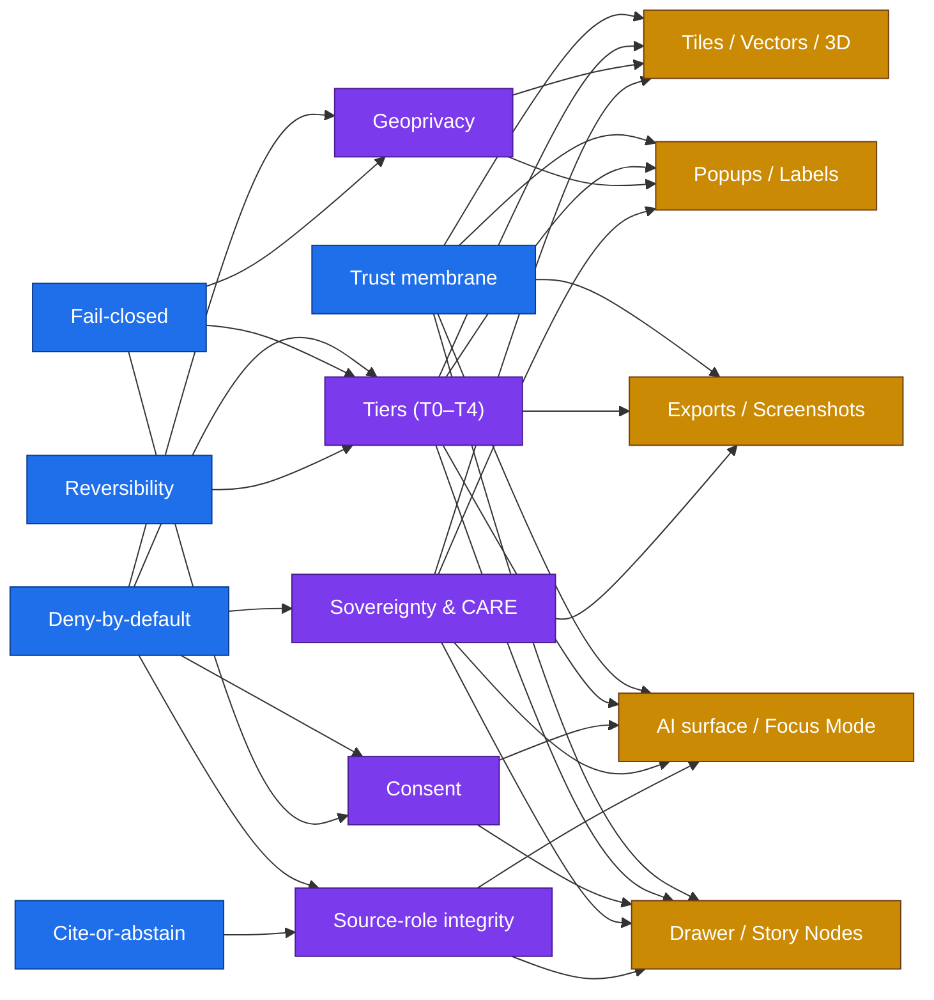
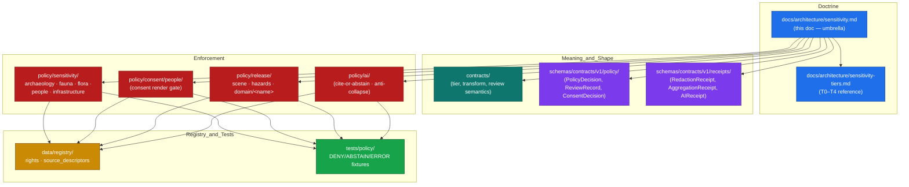

<!-- [KFM_META_BLOCK_V2]
doc_id: kfm://doc/architecture/sensitivity
title: Sensitivity Architecture — Deny-by-Default Posture for KFM
type: standard
version: v1.0
status: draft
owners: TODO-architecture-steward-and-policy-steward
created: 2026-05-25
updated: 2026-05-25
policy_label: public
related:
  - ./sensitivity-tiers.md
  - ../doctrine/directory-rules.md
  - ./connected-dots-architecture-brief.md
  - ./contract-schema-policy-split.md
  - ./governed-api.md
  - ./maplibre-3d.md
  - ../../policy/sensitivity/README.md
  - ../../policy/consent/people/README.md
  - ../../policy/release/scene/README.md
  - ../../policy/release/hazards/README.md
  - ../../schemas/contracts/v1/policy/
  - ../../schemas/contracts/v1/receipts/
  - ../../KFM_Encyclopedia.md
  - ../../Kansas_Frontier_Matrix_-_Domains_v1_1___Pass_23_32_Consolidated_Atlas.md
  - ../../kfm_unified_doctrine_synthesis.md
tags:
  - kfm
  - architecture
  - sensitivity
  - rights
  - sovereignty
  - care
  - fair
  - geoprivacy
  - consent
  - policy-as-code
  - governance
  - trust-membrane
  - deny-by-default
notes:
  - "Umbrella architecture doc for KFM's sensitivity posture. T0–T4 tier specifics live in sensitivity-tiers.md."
  - "Doctrinal anchors: KFM Encyclopedia §11 (Sensitive / Deny-by-Default Posture); Atlas v1.1 §24.5 (Sensitivity / Rights Tier Reference) and §24.10 (Risk Register); Components Pass 10 §C6 (Sensitivity, Redaction, Geoprivacy) and §C15 (FAIR + CARE)."
  - "Deny-by-default is the architectural posture. When rights, sovereignty, sensitivity, or release-state evidence is missing, the gate fails closed."
  - "Authoring session: docs-only. No mounted repository, CI run, workflow, dashboard, runtime log, or release artifact was inspected. Implementation-maturity claims are bounded per the current-session evidence limit."
  - "Every concrete policy bundle path, schema home, validator name, and CI surface is PROPOSED until verified against a mounted repository per Directory Rules §2.5."
[/KFM_META_BLOCK_V2] -->

<a id="top"></a>

# Sensitivity Architecture — Deny-by-Default Posture for KFM

> **How KFM protects sensitive content across every surface.** This is the umbrella architecture for the sensitivity posture: tiers, geoprivacy, consent, sovereignty/CARE, source-role integrity, cross-surface enforcement, and the trust-membrane invariants they all depend on. The tier scheme is *one component* of the architecture, not the whole.


[](#)
[](#)

> [!IMPORTANT]
> **This is doctrine-rank architecture, not implementation proof.** The principles, sub-architectures, and cross-surface invariants below are CONFIRMED from KFM Encyclopedia §11, Atlas v1.1 §24.5 / §24.10, and Components Pass 10 §C6 / §C15. Concrete policy bundles, schema homes, validator names, and CI surfaces are **PROPOSED** until verified in a mounted repository. The doc organizes the posture; it does not prove enforcement.

> [!NOTE]
> **Companion doc.** The T0–T4 tier scheme, transition matrix, and per-domain default tiers live in [`sensitivity-tiers.md`](./sensitivity-tiers.md). This umbrella doc summarizes the scheme in §3 and defers tier specifics to the companion. Read this doc first for the posture; read the companion for the matrix.

---

## Contents

- [1. Purpose & scope](#1-purpose--scope)
- [2. Architectural principles](#2-architectural-principles)
- [3. The five sub-architectures](#3-the-five-sub-architectures)
- [4. Cross-cutting deny lanes](#4-cross-cutting-deny-lanes)
- [5. Tiers — summary and pointer](#5-tiers--summary-and-pointer)
- [6. Geoprivacy](#6-geoprivacy)
- [7. Consent](#7-consent)
- [8. Sovereignty & CARE](#8-sovereignty--care)
- [9. Source-role integrity](#9-source-role-integrity)
- [10. Per-surface enforcement](#10-per-surface-enforcement)
- [11. Inference risk & cross-surface lint](#11-inference-risk--cross-surface-lint)
- [12. Hazards: the alert-authority boundary](#12-hazards-the-alert-authority-boundary)
- [13. Lifecycle integration](#13-lifecycle-integration)
- [14. Anti-patterns](#14-anti-patterns)
- [15. Where this lives in the repository](#15-where-this-lives-in-the-repository)
- [16. Verification backlog](#16-verification-backlog)
- [17. Related docs](#17-related-docs)
- [Appendix A — Glossary of cited objects](#appendix-a--glossary-of-cited-objects)

---

## 1. Purpose & scope

KFM publishes only the **safest representation that still answers the steward's and the public's reasonable needs.** That principle decomposes into concrete architectural moves — generalize, aggregate, redact, withhold, deny — each with its own contracts, schemas, policy bundles, receipts, and review records. This document is the *map* of those moves.

**In scope.** The architectural principles that govern every sensitivity decision; the five sub-architectures (tiers, geoprivacy, consent, sovereignty/CARE, source-role integrity); the cross-cutting deny-by-default register; per-surface enforcement (tiles, popups, exports, AI text, 3D scenes); inference-risk and cross-surface lint posture; the alert-authority boundary; lifecycle integration; anti-patterns.

**Out of scope.** Tier-specific transition rules (see [`sensitivity-tiers.md`](./sensitivity-tiers.md)); concrete Rego/OPA modules (live in `policy/`); object meaning (lives in `contracts/`); object shape (lives in `schemas/`); release decision artifacts (live in `release/`); UI affordances (live with the apps).

> [!TIP]
> **If you are looking for a specific tier's transition rules, audience, or per-domain default** — go directly to [`sensitivity-tiers.md`](./sensitivity-tiers.md). This umbrella doc explains *what kind of decision the tier system is*; the companion doc carries the matrix.

[↑ Back to top](#top)

---

## 2. Architectural principles

Five principles govern every sensitivity decision in KFM. They are **CONFIRMED doctrine** from the Encyclopedia §11 and Atlas v1.1.

| Principle | What it means | Where it shows up |
|---|---|---|
| **Deny-by-default** | When rights, sovereignty, sensitivity, or release-state evidence is missing or unresolved, the gate fails closed. The default answer is `DENY` or `ABSTAIN`, not `ALLOW`. | Every policy gate; admission; validation; catalog closure; release. |
| **Cite-or-abstain** | A consequential claim either resolves to a recorded `EvidenceBundle` via `EvidenceRef`, or returns `ABSTAIN`. No uncited authoritative claims. | Governed API; Focus Mode; AI surface; Story Nodes; exports. |
| **Fail-closed** | Validators and gates emit finite outcomes (`ALLOW` / `DENY` / `HOLD` / `ABSTAIN` / `ERROR`) with reason codes. Silent skip is never a permitted outcome. | Validators; promotion gates; release gate; AI policy. |
| **Trust membrane** | No public client, no normal UI surface, and no released AI surface ever reaches `RAW`, `WORK`, `QUARANTINE`, canonical / internal stores, graph internals, vector indexes, source APIs, or direct model runtimes. | The whole architecture. |
| **Reversibility** | Every upgrade toward more-public state is matched by a recorded path back. `CorrectionNotice` and `RollbackCard` can always retreat; downgrade never needs both a transform receipt and a review record. | Tier transitions; release; correction; rollback. |



> [!CAUTION]
> **Principles are layered, not optional.** Removing or weakening any one principle compromises the others. Deny-by-default without fail-closed produces silent skips; trust membrane without cite-or-abstain produces uncited public claims; reversibility without source-role integrity produces correction storms.

[↑ Back to top](#top)

---

## 3. The five sub-architectures

The sensitivity architecture decomposes into five independent-but-composable sub-architectures. Each has its own contracts, schemas, policy lane, receipts, and validators. They compose through `PolicyDecision`, `EvidenceBundle`, and the lifecycle gates.

| Sub-architecture | Concern | Key artifacts | Authoritative home (PROPOSED) |
|---|---|---|---|
| **Tiers (T0–T4)** | What level of release an object may reach. | `PolicyDecision`, `RedactionReceipt`, `AggregationReceipt`, `ReleaseManifest`, `ReviewRecord`. | This doc + [`sensitivity-tiers.md`](./sensitivity-tiers.md); enforcement in `policy/sensitivity/<domain>/`. |
| **Geoprivacy** | How sensitive geometry is transformed before any public exposure. | `RedactionReceipt`, `AggregationReceipt`, redaction profile id, cell-size convention, jitter seed. | Patterns in this doc §6; profiles in `policy/sensitivity/<domain>/`; receipts in `schemas/contracts/v1/receipts/`. |
| **Consent** | When the data subject's enforceable, revocable permission is required. | `ConsentSidecar`, `ConsentDecision`, DSSE envelope, Bitstring Status List, scope, retention. | `policy/consent/people/`; `schemas/contracts/v1/policy/`. |
| **Sovereignty & CARE** | When community / steward authority governs the object beyond ordinary rights. | MetaBlock v2 CARE fields (`steward_org`, `authority_to_control`, `consent`, `obligations`, `benefit_commitments`); `ReviewRecord`; sovereignty notice chips. | `policy/sensitivity/<domain>/` + `data/registry/rights/`; doctrine in this doc §8. |
| **Source-role integrity** | Whether the source role (observed / modeled / synthetic / candidate) is preserved through the lifecycle. | `SourceDescriptor.source_role`, Source-Role Anti-Collapse Register, `AIReceipt` ban list. | `data/registry/source_descriptors/`; AI policy at `policy/ai/`; doctrine in this doc §9. |

> [!NOTE]
> **The composition is the architecture.** A single release decision typically passes through *all five* — the tier scheme says "this is T1 only after redaction," geoprivacy says "the redaction is H3-r7 grid snapping with seeded jitter," consent says "no living-person field is exposed," sovereignty says "the AIANNH intersection inherits a tribal-sovereignty label," and source-role integrity says "the underlying record is observed, not modeled." Any of the five returning `DENY` or `ABSTAIN` blocks the release.

[↑ Back to top](#top)

---

## 4. Cross-cutting deny lanes

The Encyclopedia §11.1 names cross-cutting **deny-by-default lanes** that hold regardless of domain. These are doctrine; the per-domain matrix in [`sensitivity-tiers.md`](./sensitivity-tiers.md) §6 specializes them.

| Lane | Default | Doctrine source |
|---|---|---|
| Living-person identifiers; DNA / genomic data | **DENY** | Encyclopedia §11.1; Atlas v1.1 §24.5.2; `policy/consent/people/` (PROPOSED) |
| Archaeological site coordinates | **DENY** (generalized release only after sovereignty review) | Encyclopedia §11.1; `policy/sensitivity/archaeology/` (PROPOSED) |
| Rare / sensitive fauna occurrences (nests, dens, roosts, hibernacula, spawning sites) | **DENY** (T4); generalized only after rights/sensitivity check | Encyclopedia §11.1; `policy/sensitivity/fauna/` (PROPOSED) |
| Rare-plant precise locations; ethnobotanical context | **DENY** (T4) | Encyclopedia §11.1; `policy/sensitivity/flora/` (PROPOSED) |
| Critical infrastructure detail; condition / vulnerability | **DENY** | Encyclopedia §11.1; `policy/sensitivity/infrastructure/` (PROPOSED) |
| Private person × parcel joins | **DENY** | Encyclopedia §11.1; `policy/sensitivity/people/` (PROPOSED) |
| KFM as emergency-alert authority | **DENY** forever | Atlas v1.1 §24.5.2; `policy/release/hazards/` (PROPOSED) |
| Governed AI access to RAW / WORK / QUARANTINE | **DENY** | Atlas v1.1 §24.5.2; `policy/ai/` (PROPOSED) |
| Uncited AI claims | **DENY** / `ABSTAIN` | Cite-or-abstain doctrine; AI policy bundle (PROPOSED) |
| Direct model-client traffic from public surfaces | **DENY** | Trust membrane; governed-API contract |

> [!WARNING]
> **A deny lane is not a guideline — it is the default decision.** Promoting any object out of a deny lane requires the full upgrade path: transform receipt + `ReviewRecord` + `PolicyDecision`, plus the standard promotion gates. The lane closes again automatically when evidence becomes stale, when rights change, or when correction demotes the object.

[↑ Back to top](#top)

---

## 5. Tiers — summary and pointer

Sensitivity tiers are KFM's **vocabulary for release level**. The scheme is `T0` Open → `T1` Generalized → `T2` Reviewer → `T3` Restricted → `T4` Denied. The asymmetric reading rule is the architectural property that matters: an **upgrade** (toward more public) always needs both a transform receipt *and* a review record; a **downgrade** (toward less public) needs only a `CorrectionNotice`.

| Tier | One-line definition |
|---|---|
| **T0** Open | Public-safe with no transformation required. |
| **T1** Generalized | Public-safe only after generalization, fuzzing, aggregation, or redaction; transform is reviewed and recorded. |
| **T2** Reviewer | Released only to authenticated reviewers or domain stewards. |
| **T3** Restricted | Released only under a named agreement (rights, sovereignty, consent). |
| **T4** Denied | Not released to any audience; existence of a record may be released only as steward review permits. |

> [!TIP]
> **See [`sensitivity-tiers.md`](./sensitivity-tiers.md)** for: the full T0–T4 definitions, the canonical transition matrix (artifacts × reviewer × reversibility), the per-domain default-tier table, the reading rule with worked examples, the failure-closed posture, the Governed-AI / 3D interaction rules, and the verification backlog specific to the tier scheme.

[↑ Back to top](#top)

---

## 6. Geoprivacy

Geoprivacy is the **transformation discipline** for sensitive geometry. It is how a T4 record becomes a T1 release without leaking the underlying coordinates. The transforms below come from Components Pass 10 §C6 (Sensitivity, Redaction, and Geoprivacy).

| Transform | When to use | Determinism | Key artifact |
|---|---|---|---|
| **Grid generalization** | Sensitive species records, archaeological footprints, sensitive fauna occurrences. Snap precise points to grid cells (square via `ST_SnapToGrid`, hex via H3 at e.g. r7–r9). Publish the cell, not the point. | Deterministic by construction. | `RedactionReceipt` recording cell size, grid type, and rule version. |
| **Representative point + uncertainty** | When a single anchor point with an explicit uncertainty radius better serves the layer than a cell. | Deterministic with seeded jitter. | `RedactionReceipt` + uncertainty surface. |
| **Seeded reproducible jitter** | Display-redaction for individual occurrences where the consumer needs a point but not the true point. Use a PRNG seeded by `spec_hash + occurrence_id` so the same record always receives the same offset; uniform-in-radius or Laplace distributions are acceptable. | Deterministic — same record always yields the same offset. **Random-each-render jitter is prohibited** (temporal triangulation). | `RedactionReceipt` recording seed rule, distribution, and radius. |
| **Aggregation** | County histograms, population grids, density heatmaps, living-people overlays. | Deterministic. | `AggregationReceipt` recording aggregation unit, minimum-cell suppression, and join-denial rules. |
| **k-Anonymity gate** | Living-people overlays. Render a cell only if at least *k* individuals fall in it; otherwise apply a fallback radius mask server-side. Default candidate: `density_k_anonymity_grid` with `k=10`, `cell_m=500`, fallback `radius_mask` at 250 m. | Deterministic over the underlying data. | `PolicyDecision` recording `k`, cell size, fallback. |
| **Differential privacy (aggregates only)** | DP applied **only** to aggregate outputs (counts, heatmaps) using a recognized library; raw points are never DP-noised. Epsilon / delta and budget consumption are recorded. | Stochastic — but the DP parameters are pinned. | `AggregationReceipt` recording (ε, δ) and dataset-level budget. |
| **Withholding** | When no transform safely reduces sensitivity. The record stays T4. | n/a | `PolicyDecision` recording `DENY` + reason. |

> [!CAUTION]
> **Jitter is for display obfuscation, not formal privacy.** Random-each-render jitter is **prohibited** — multiple snapshots over time would reveal the true location. Seeded jitter must be deterministic across renders, and the seed must include `spec_hash` so reviewers can reproduce the transform from the receipt alone.

> [!IMPORTANT]
> **Style filters are not geoprivacy.** Hiding a layer with `setLayoutProperty('visibility', 'none')` or a style filter does not remove the geometry from tiles. Sensitive geometry must be **generalized, redacted, delayed, restricted, or denied before tile generation** — never hidden only by style. The trust membrane forbids "no sensitive geometry hidden only by style."

[↑ Back to top](#top)

---

## 7. Consent

Consent is the **enforceable, revocable permission** discipline for living-person and steward-governed records. It treats consent as a machine-readable policy carried with the data, not as static text.

### 7.1 Consent objects (PROPOSED shapes)

| Object | Role |
|---|---|
| **`ConsentSidecar`** | Per-record sidecar carrying the DSSE envelope, status-list reference, scopes, audience, retention window, revocation endpoint, and consent-history hash. |
| **Consent token (JWT or GA4GH visa)** | Short-lived signed token carrying scopes, audience, expiry, revocation endpoint, `jti`, and a redaction-profile reference. Travels with the request; checked on every render. |
| **`ConsentDecision`** | Finite-shape decision envelope (`ALLOW` / `DENY` / `ABSTAIN` / `ERROR` + reasons + obligations). Emitted by `policy.consent.render`. |
| **Bitstring Status List** | Non-revocation source the consent gate introspects per render. |

### 7.2 The consent render gate

PROPOSED design from Atlas KFM-P5-PROG-0007. The `policy.consent.render` package combines four checks:

1. **DSSE envelope validity.** The sidecar's signature verifies.
2. **Status-list non-revocation.** The Bitstring Status List confirms the consent is unrevoked.
3. **Scope coverage.** Requested scope ⊆ allowed scope.
4. **Retention window.** Current time `now` < `retention.expires_at`.

Outcomes:

| Condition | Outcome | Notes |
|---|---|---|
| All four checks pass | `ALLOW` | Obligations propagated from the sidecar. |
| Any check fails | `DENY` | `reasons[]` populated per failure. |
| Partial / unresolved evidence | `ABSTAIN` | The gate cannot decide; route to QUARANTINE. |
| System error | `ERROR` | Reason code emitted; gate fails closed. |

> [!IMPORTANT]
> **Consent is revocable; the render gate must respect that.** A consent grant can be revoked **after** publication. The status-list check on every render is what makes revocation actually take effect at runtime; without it, consent is checked at publication time only and revocation has no runtime force. This is the difference between consent-as-policy and consent-as-paperwork.

### 7.3 Composition with the tier system

Consent and tiers compose. Consent governs *whether* a record may be exposed; tiers govern *at what level*. A T4 → T1 motion for a living-person record requires **both** a `ConsentDecision = ALLOW` and the standard upgrade artifacts (`AggregationReceipt` + `ReviewRecord`).

[↑ Back to top](#top)

---

## 8. Sovereignty & CARE

The CARE principles (Collective benefit, Authority to control, Responsibility, Ethics) are the operational policy layer that determines which FAIR moves are *allowed*. FAIR alone is insufficient — it produces technically open data that may violate the rights of the communities it describes. CARE alone is insufficient — it lacks the operational specificity to be enforced in software. KFM pairs them: FAIR is the engineering substrate; CARE is the operational gate.

### 8.1 MetaBlock v2 CARE fields

MetaBlock v2 extends the catalog entry shape with five CARE-aligned fields:

| Field | Meaning |
|---|---|
| `steward_org` | Institutional steward of the asset. |
| `authority_to_control` | Community or body whose authority governs the asset. |
| `consent` | The consent grant under which the asset is held. |
| `obligations` | Obligations attached to use of the asset. |
| `benefit_commitments` | What benefit flows back to the relevant community from publication and reuse. |

The fields are **required** for any asset where CARE applies (Indigenous, marginalized-community, sensitive-cultural, or sovereignty-implicating data) and optional for assets where it does not. **Determining which assets are CARE-applicable requires curatorial judgment** — it cannot be fully automated.

### 8.2 Tribal sovereignty label inheritance

PROPOSED policy from Atlas KFM-P11-PROG-0025: artifacts whose AOIs intersect AIANNH / BIA overlays should **inherit** `sovereignty:tribal` and sensitivity labels, or require signed time-boxed waivers before promotion. The intersection is computed at admission and re-evaluated when source rights or sovereignty status changes.

### 8.3 Cultural, archaeological, and steward review

PROPOSED policy from Atlas KFM-P1-IDEA-0034: cultural, archaeological, tribal, sacred, burial, and steward-governed material requires **review and public-safe transformation** before release. Specifically:

- Exact coordinates of sacred sites, burials, and restricted cultural archives are **prohibited** without review.
- Archaeological footprints for public layers are generalized to **H3 r7–r9**; any geometry below H3 r7 is prohibited for sensitive archaeology products.
- Terrain linked to archaeological locations requires coordinate generalization of **at least 5 km** plus alt text and metadata on captures.
- Story Nodes covering sensitive narratives use **context-only spatial footprints** — provenance, citations, and lineage are required, but precise site disclosure is avoided.

> [!NOTE]
> **CARE labels and sovereignty notice chips are required in UI.** The map shell and Evidence Drawer must surface CARE annotation, sovereignty notice chips, generalization logs, and consent / custodial review state. The UI must not present a generalized layer without acknowledging that it has been generalized.

[↑ Back to top](#top)

---

## 9. Source-role integrity

The source role (observed / modeled / synthetic / candidate / paraphrased) is set at admission on the `SourceDescriptor` and **never upgraded by promotion**. This is the Source-Role Anti-Collapse rule from Atlas v1.1 §24.1.

| Anti-collapse rule | Why it matters |
|---|---|
| **A modeled value never becomes an observation by promotion.** | Promotion proves governed flow, not measurement. |
| **A candidate site never becomes a confirmed site by rendering.** | Map rendering identifies candidates, not proof. |
| **A synthetic 3D element never appears as observed reality.** | Requires Reality Boundary Note + `RepresentationReceipt`. |
| **An aggregate is never quoted as a per-place fact by the AI surface.** | Source-role upgrade by paraphrase is prohibited. |

> [!WARNING]
> **Source-role upgrade by paraphrase is the most subtle anti-pattern.** Phrases that lift an aggregate into a per-place fact, a model output into an observation, or a candidate into a confirmed site cause source-role collapse without changing the underlying record. The AI policy bundle MUST ban known upcasting phrases at output validation, and the validator must sample `AIReceipt`s for drift.

The `AIReceipt` records the model, prompt, sources, citation validation result, and policy decision for every AI output. The AI surface is bound by `cite-or-abstain`: an answer either resolves to one or more `EvidenceBundle` references via `EvidenceRef`, or returns `ABSTAIN`.

[↑ Back to top](#top)

---

## 10. Per-surface enforcement

Sensitivity holds **per surface**, not per layer. A tier-correct canonical layer can still leak through a popup, a label, a screenshot, a tile cache, an AI summary, or a story node. The trust-membrane invariants below apply at *every* public surface.

| Surface | Required posture | Anti-pattern |
|---|---|---|
| **Tiles (PMTiles / MVT / COG / 3D Tiles)** | Tile-generation step honors tier. Sensitive geometry is generalized, redacted, delayed, restricted, or denied **before tile generation**. Layer manifest resolver tags tiles with release state. Digest-pinned, signed, and SBOM-attached before publication. | Sensitive geometry hidden only by style filter. Mutable tileset URLs in public release. |
| **Popups / Labels** | Popups may summarize and link; consequential claims resolve through the Evidence Drawer. Labels do not leak coordinates, identifiers, or sensitive-class names. | Popup as Evidence Drawer substitute. Identifier strings in label text. |
| **Drawer / Story Nodes** | Drawer payload is a governed projection of canonical evidence. Story Nodes preserve citations, evidence IDs, version locks, and release-manifest references. Sensitive narratives use context-only spatial footprints. | Uncited Story Node export. Drawer payload composed from RAW. |
| **Exports / Screenshots / Reports** | Every export carries citations, evidence IDs, version locks, and release-manifest references. Screenshots include alt text and metadata. | Uncited screenshot used as proof. PDF report citing an unreleased candidate. |
| **AI surface / Focus Mode** | Reads **only released `EvidenceBundle`**. Cite-or-abstain. `AIReceipt` per output. Source-role anti-collapse enforced at output validation. | Direct model-client traffic. Paraphrased aggregate as per-place fact. Uncited authoritative claim. |
| **3D scenes** | Reality Boundary Note + `RepresentationReceipt` mandatory. Synthetic content never presented as observed. Generalized geometry only. | T4 scene content rendered without `RepresentationReceipt`. Synthetic-as-observed presentation. |
| **Local exposed system (dev host / demo)** | Deny-by-default access; least privilege; audit logging; operational governance. Admin shortcuts justified, constrained, and kept off the normal public path. | Local admin endpoint reachable beyond loopback. Admin route used as public route. |

> [!IMPORTANT]
> **The map shell is not a public surface.** The MapLibre shell renders released layers via the layer-manifest resolver and surfaces evidence, policy, stale state, and release state. It does **not** become a public surface by caching layers or circumventing the governed API. Renderer-boundary tests, layer-manifest resolution, and release-state-tagged tiles are the architectural guardrails. Third-party tile caches are an audited risk, not a permitted shortcut.

[↑ Back to top](#top)

---

## 11. Inference risk & cross-surface lint

Sensitivity holds per surface — and across surfaces. Two records that are each public-safe in isolation can together leak identity, location, or condition. This is the inference-by-join risk named in Atlas v1.1 §24.10.

| Inference risk | Mitigation |
|---|---|
| Aggregated person data joined to small-cell parcels recovers identity. | Aggregation receipts include minimum-cell suppression. Cross-lane joins require fresh threat modeling. |
| Multiple snapshots of seeded-jitter geometry over time triangulate the true point. | Jitter seed includes `spec_hash`; same record always yields the same offset across renders. |
| Side-channel leak via popup, label, screenshot, export, or tile cache exposes coordinates that the canonical layer redacted. | Cross-surface lint at every public surface. Renderer-boundary tests. Release-state-tagged tiles. |
| AI text exposes a sensitive identifier the released layer omitted. | AI policy bundle bans upcasting phrases. `AIReceipt` sampling for drift. |

> [!CAUTION]
> **Cross-surface lint is mandatory, not optional.** A surface that protects coordinates while another surface leaks them is functionally equivalent to a surface that always leaks them. The architecture treats every public surface as part of the same trust boundary; lint coverage is per surface but the deny lane is shared.

[↑ Back to top](#top)

---

## 12. Hazards: the alert-authority boundary

One sensitivity decision in KFM is permanent and not negotiable by any policy: **KFM is never an emergency-alert authority.** This is the Hazards T4-forever boundary from Atlas v1.1 §24.5.2.

| Property | Value |
|---|---|
| Default tier | **T4 forever** |
| Allowed transforms | **None.** No transform permits KFM to act as an emergency-alert authority. |
| Required gates | Policy boundary; deny at runtime. Enforced by `policy/release/hazards/` (PROPOSED). |
| Reading | KFM publishes hazards as **historical** or **operational context**. Operational disclaimers and role labels are required at every surface. |

> [!CAUTION]
> **No tier transition, no policy, no UI affordance, and no AI output may present KFM content as life-safety instruction or as an authoritative emergency alert.** The boundary is permanent. Any code path, doc, or surface that drifts toward this posture is a defect, regardless of how clearly the language is hedged.

[↑ Back to top](#top)

---

## 13. Lifecycle integration

Sensitivity decisions bind to the KFM lifecycle invariant — **CONFIRMED doctrine**:

```text
RAW → WORK / QUARANTINE → PROCESSED → CATALOG / TRIPLET → PUBLISHED
```

| Gate | Sensitivity interaction |
|---|---|
| **Admission** (— → RAW) | `SourceDescriptor` sets initial sensitivity class, source role, rights posture, sovereignty status. Unknown → T4. |
| **Normalization** (RAW → WORK / QUARANTINE) | Sensitive-lane failures route to **QUARANTINE**, never silent demotion. `PolicyDecision` evaluated against the normalized form. |
| **Validation** (WORK → PROCESSED) | `RedactionReceipt` / `AggregationReceipt` emitted if sensitivity applies. Validation cannot upgrade tier on its own. |
| **Catalog closure** (PROCESSED → CATALOG / TRIPLET) | `EvidenceBundle` must resolve every `EvidenceRef`. Catalog rows carry current tier; no public edge yet. |
| **Release** (CATALOG / TRIPLET → PUBLISHED) | Tier upgrade is only allowed *here*, with `ReleaseManifest` + `ReviewRecord` + rollback target. Release authority is distinct from the original author when materiality applies. |
| **Correction** (PUBLISHED → PUBLISHED′) | `CorrectionNotice` may demote tier without a transform receipt. Derivative invalidation list is mandatory. |
| **Rollback** (PUBLISHED → prior release) | `RollbackCard` returns the artifact to its prior tier. Downstream derivatives invalidated. |

> [!NOTE]
> **Promotion is a governed state transition, not a file move.** Moving an artifact to `data/published/` without the corresponding `ReleaseManifest`, `PolicyDecision`, and `ReviewRecord` is a defect that violates the trust membrane. The lifecycle gates are the only path to PUBLISHED, and PUBLISHED is the only state from which the governed API may emit `ANSWER`.

[↑ Back to top](#top)

---

## 14. Anti-patterns

The patterns below all violate one or more of the architectural principles in §2. They are anti-patterns regardless of how well-intentioned the underlying request is.

<details>
<summary><strong>Sensitivity anti-pattern register</strong> (click to expand)</summary>

| Anti-pattern | Why it violates the posture |
|---|---|
| **Silent tier upgrade.** Releasing a derived layer without a corresponding `RedactionReceipt` / `AggregationReceipt`. | Transform isn't reproducible; rollback can't reconstruct what was redacted. Violates fail-closed and reversibility. |
| **Sensitive geometry hidden only by style.** Style filters do not remove geometry from tiles. | Style is a presentation concern; tiles carry coordinates regardless. Violates trust membrane. |
| **Random-each-render jitter.** Display jitter that re-rolls per request. | Temporal triangulation recovers the true point across snapshots. Violates determinism + reversibility. |
| **DP on raw points.** Applying differential privacy to per-point geometry. | DP math holds on aggregates, not points; DP-noised points produce undoable noise that misleads users. |
| **Admin path as public path.** Using a developer or steward route to expose what the governed API would deny. | Bypasses trust membrane; correction can't reach it. |
| **Source-role upgrade by paraphrase.** AI paraphrases an aggregate as a per-place fact, or a modeled value as an observation. | Source-role collapse without changing the record. Violates source-role integrity + cite-or-abstain. |
| **Inference-by-join.** Aggregated person data joined to small-cell parcels recovers identity. | Aggregation receipts must include minimum-cell suppression. Violates deny-by-default. |
| **Side-channel leak.** Sensitive coordinates leak via popup, label, screenshot, export, AI text, or tile cache. | Tier holds for the canonical layer but not the surface. Violates per-surface enforcement. |
| **Caching layers that circumvent the governed API.** Third-party tile caches or direct CDN re-publishes. | Renderer becomes a public surface; release-state badge no longer reflects truth. |
| **Popup as Evidence Drawer substitute.** Material claims asserted in popup text without drawer payload + citation validation. | Bypasses cite-or-abstain at the surface that gets the most attention. |
| **Correction without invalidation.** Publishing a corrected claim without listing the derivatives it invalidates. | Stale graphs, exports, and Story Nodes continue to assert the corrected claim as fact. |
| **Release without rollback target.** Tier upgrade without a `RollbackCard`. | Failure mode has no defined recovery. Violates reversibility. |
| **CARE field omission for CARE-applicable assets.** Asset is CARE-applicable but MetaBlock v2 fields are blank. | Policy layer cannot reason about CARE; the C15-03 default-deny gate must refuse. |
| **Sovereignty label evasion.** AOI intersects AIANNH / BIA overlay but the artifact is not labeled `sovereignty:tribal`. | Per Atlas KFM-P11-PROG-0025 the label must be inherited or a signed time-boxed waiver provided. |
| **KFM-as-alert-authority drift.** UI, AI, or doc language that presents KFM as an emergency-alert source. | Hazards T4-forever boundary is permanent. |
| **Treating the doc as evidence.** Citing this file (or any synthesis) as proof that enforcement exists. | Doctrine is not implementation; the policy bundle and validator tests are the proof. |

</details>

[↑ Back to top](#top)

---

## 15. Where this lives in the repository

The sensitivity architecture **doctrine** lives in `docs/architecture/`. **Enforcement** is split across responsibility roots per Directory Rules §4. All paths in this section are **PROPOSED** until verified per Directory Rules §2.5.



| Responsibility | Root | What lives here |
|---|---|---|
| Doctrine — umbrella | `docs/architecture/sensitivity.md` (this doc) | Posture, principles, sub-architectures, anti-patterns. |
| Doctrine — tier reference | `docs/architecture/sensitivity-tiers.md` | T0–T4 scheme, transition matrix, per-domain defaults. |
| Object-family meaning | `contracts/` | What "tier", "transform", "review", "consent", "agreement", "sovereignty" *mean*. |
| Object-family shape | `schemas/contracts/v1/policy/` + `schemas/contracts/v1/receipts/` | JSON Schema for decision and receipt objects. |
| Enforcement — sensitivity | `policy/sensitivity/<domain>/` | Per-domain Rego bundles; tier defaults. |
| Enforcement — consent | `policy/consent/people/` | Consent render gate (DSSE + status list + scope + retention). |
| Enforcement — release | `policy/release/<domain>/` | Release-state and authority constraints (e.g. Hazards T4-forever, scene release). |
| Enforcement — AI | `policy/ai/` | Cite-or-abstain; source-role anti-collapse; upcasting-phrase ban list. |
| Rights & source registry | `data/registry/rights/` + `data/registry/source_descriptors/` | Per-source rights, sovereignty, sensitivity status; source-role admission. |
| Enforceability proof | `tests/policy/` | Fixture-driven `DENY` / `ABSTAIN` / `ERROR` cases per gate. |

[↑ Back to top](#top)

---

## 16. Verification backlog

These items are **NEEDS VERIFICATION** until a mounted repository is inspected. They are not blockers for using this doc as doctrine; they are blockers for treating any specific path or validator as enforcement evidence.

| ID | Item | Evidence that would settle it |
|---|---|---|
| **VB-SENS-01** | `policy/sensitivity/<domain>/` bundles exist for each domain in §4 / [`sensitivity-tiers.md`](./sensitivity-tiers.md) §6 | Repo tree listing; per-bundle `README.md` |
| **VB-SENS-02** | `policy/consent/people/render.rego` implements the four-check render gate per §7.2 | Inspect bundle + `tests/policy/consent/render_test.rego` |
| **VB-SENS-03** | `schemas/contracts/v1/policy/` defines tier-bearing fields on `PolicyDecision`, `ConsentDecision`, `ReviewRecord` | Schema inspection |
| **VB-SENS-04** | `schemas/contracts/v1/receipts/` defines `RedactionReceipt`, `AggregationReceipt`, `AIReceipt`, `RepresentationReceipt` | Schema inspection |
| **VB-SENS-05** | `policy/ai/` enforces cite-or-abstain and bans known upcasting phrases at output validation | Bundle inspection; fixture coverage |
| **VB-SENS-06** | `policy/release/hazards/` enforces the T4-forever alert-authority boundary at runtime | Bundle inspection; negative-fixture coverage |
| **VB-SENS-07** | MetaBlock v2 CARE fields are required (not optional) on CARE-applicable asset classes | Schema validator coverage |
| **VB-SENS-08** | Tribal-sovereignty label inheritance against AIANNH / BIA overlays is implemented at admission | Pipeline inspection; fixture coverage |
| **VB-SENS-09** | Cross-surface lint covers tile / popup / label / export / AI text / 3D scene | Lint config + CI green |
| **VB-SENS-10** | Renderer-boundary tests confirm no public client reaches RAW / WORK / QUARANTINE / canonical stores | Test inventory |
| **VB-SENS-11** | An ADR exists for the sensitivity-tier scheme (ADR-S-05 candidate) and for the consent render gate | `docs/adr/` listing |
| **VB-SENS-12** | This doc is registered in `control_plane/document_registry.yaml` | Registry inspection |
| **VB-SENS-13** | Owner / `CODEOWNERS` entries name an architecture steward and a policy steward for `docs/architecture/sensitivity.md` | `.github/CODEOWNERS` inspection |

[↑ Back to top](#top)

---

## 17. Related docs

| Path | Role |
|---|---|
| [`./sensitivity-tiers.md`](./sensitivity-tiers.md) | Companion — T0–T4 scheme, transitions, per-domain matrix. |
| `docs/doctrine/directory-rules.md` | Placement law that owns where `policy/sensitivity/`, `policy/consent/`, `policy/release/`, `policy/ai/` live. |
| `docs/architecture/connected-dots-architecture-brief.md` | System-wide architecture brief; sensitivity is one of its publication-control disciplines. |
| `docs/architecture/contract-schema-policy-split.md` | Why sensitivity vocabulary lives partly in `contracts/`, partly in `schemas/`, and partly in `policy/`. |
| `docs/architecture/governed-api.md` | The only public surface; receives sensitivity-aware `PolicyDecision` outcomes. |
| `docs/architecture/maplibre-3d.md` | Renderer-decision doctrine; honors tier-tagged release state and 3D Reality Boundary Notes. |
| `policy/sensitivity/README.md` | PROPOSED per-root README naming sub-bundles per domain. |
| `policy/consent/people/README.md` | PROPOSED per-root README for consent rendering. |
| `policy/release/scene/README.md` | PROPOSED per-root README for 3D scene release. |
| `policy/release/hazards/README.md` | PROPOSED per-root README enforcing the T4-forever Hazards boundary. |
| `policy/ai/README.md` | PROPOSED per-root README for cite-or-abstain and source-role anti-collapse. |
| `KFM_Encyclopedia.md` §11 | Sensitive / Deny-by-Default Posture (doctrinal anchor for this umbrella). |
| `Kansas_Frontier_Matrix_-_Domains_v1_1___Pass_23_32_Consolidated_Atlas.md` §24.5 / §24.10 | Tier reference + risk register. |
| `kfm_unified_doctrine_synthesis.md` §§15–16 | Doctrine synthesis of tiers and per-domain matrix. |

[↑ Back to top](#top)

---

## Appendix A — Glossary of cited objects

This glossary is **navigational**, not authoritative. Each object has its own home in `contracts/` (meaning) and `schemas/contracts/v1/` (shape).

<details>
<summary><strong>Cited objects</strong> (click to expand)</summary>

| Object | Role | Authoritative home (PROPOSED) |
|---|---|---|
| `SourceDescriptor` | Names source, maintainer, role, rights, access class, cadence, citation policy, sensitivity. | `data/registry/source_descriptors/` |
| `EvidenceRef` | Stable pointer from a claim to a source locator with spatial/temporal scope and `spec_hash`. | `schemas/contracts/v1/evidence/` |
| `EvidenceBundle` | Closed bundle of evidence references resolvable at runtime. | `schemas/contracts/v1/evidence/` |
| `PolicyDecision` | Finite-shape decision envelope (`ALLOW` / `DENY` / `HOLD` / `ABSTAIN` / `ERROR` + reasons[] + obligations[]). | `schemas/contracts/v1/policy/` |
| `ConsentSidecar` | Per-record consent sidecar carrying DSSE envelope, status-list reference, scopes, retention. | `schemas/contracts/v1/policy/` |
| `ConsentDecision` | Output of `policy.consent.render`; mirrors the decision envelope. | `schemas/contracts/v1/policy/` |
| `ReviewRecord` | Reviewer identity, scope, decision, and timestamp; required for tier upgrades. | `schemas/contracts/v1/policy/` |
| `RedactionReceipt` | Pins a public-safe transform of a sensitive field or geometry (grid size, jitter seed, profile). | `schemas/contracts/v1/receipts/` |
| `AggregationReceipt` | Pins bin / cell aggregation, minimum-cell suppression, DP parameters where applicable. | `schemas/contracts/v1/receipts/` |
| `AIReceipt` | AI run receipt: model, prompt, sources, citation validation, policy decision. | `schemas/contracts/v1/receipts/` |
| `RepresentationReceipt` | 3D / scene-specific transform receipt (projection, decimation, clipping, generalization). | `schemas/contracts/v1/receipts/` |
| `ReleaseManifest` | Released artifact set, digests, policy posture, rollback target. | `schemas/contracts/v1/release/` |
| `CorrectionNotice` | Notice of detected error or new evidence; lists invalidated derivatives. | `schemas/contracts/v1/release/` |
| `RollbackCard` | Rollback target naming a prior release. | `schemas/contracts/v1/release/` |
| Reality Boundary Note | Per-scene declaration of observed vs modeled vs synthetic content. | `contracts/scene/` |
| MetaBlock v2 CARE fields | `steward_org`, `authority_to_control`, `consent`, `obligations`, `benefit_commitments`. | `schemas/contracts/v1/catalog/` |

</details>

[↑ Back to top](#top)

---

**Related docs:** [sensitivity-tiers](./sensitivity-tiers.md) · [directory-rules](../doctrine/directory-rules.md) · [connected-dots](./connected-dots-architecture-brief.md) · [contract-schema-policy-split](./contract-schema-policy-split.md) · [governed-api](./governed-api.md) · [maplibre-3d](./maplibre-3d.md) · [KFM Encyclopedia](../../KFM_Encyclopedia.md)

**Last updated:** 2026-05-25 · **Doc version:** v1.0 · **Meta block:** v2 · [↑ Back to top](#top)
