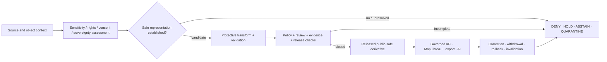

<!-- [KFM_META_BLOCK_V2]
doc_id: kfm://doc/architecture/sensitivity
title: Sensitivity Architecture — Current Responsibility and Enforcement Map
type: architecture-reference
version: v2.0-draft
status: draft; repository-grounded; non-authoritative; convergence-hold
owners:
  - "@bartytime4life — CODEOWNERS review route only"
  - "NEEDS VERIFICATION — accountable sensitivity, privacy, rights, sovereignty, policy, and release stewardship"
created: 2026-05-25
updated: 2026-08-19
policy_label: public
owning_root: docs/
current_path: docs/architecture/sensitivity.md
responsibility: Explain how KFM composes sensitivity classification, rights, consent, sovereignty, protective transforms, source role, review, release, correction, rollback, and public-surface controls without becoming doctrine, a standard, semantic contract, machine schema, policy source, registry record, decision record, or runtime proof.
truth_posture: CONFIRMED current repository paths and bounded fixture-only validation at the pinned snapshot / PROPOSED terminology and integration where no accepted decision or runtime proof exists / CONFLICTED overlapping rubric and authority documents / HOLD on consolidation, vocabulary selection, and policy-sensitive graduation
evidence_base: bartytime4life/Kansas-Frontier-Matrix main@7ef1597779774d80346f81ecd8104b720797c587; prior target blob 48ff1c297767b7a59dffa505fb8b54ef5a02bab4; ADR-0029 is the only accepted numbered ADR
related:
  - README.md
  - document-convergence-plan.md
  - data-classification-framework.md
  - sensitivity-tiers.md
  - sensitive-domain-fail-closed.md
  - sovereignty-care.md
  - source-role-anti-collapse.md
  - ../doctrine/sensitivity.md
  - ../doctrine/directory-rules.md
  - ../standards/SENSITIVITY_RUBRIC.md
  - ../adr/INDEX.md
  - ../adr/ADR-0010-deny-by-default-for-dna-rare-species-archaeology-infrastructure.md
  - ../adr/ADR-0029-adopt-directory-governance-standard-v2.md
  - ../../contracts/policy/sensitivity_label.md
  - ../../schemas/contracts/v1/policy/sensitivity_label.schema.json
  - ../../policy/sensitivity/README.md
  - ../../data/registry/sensitivity/README.md
  - ../../contracts/shared/redaction_receipt.md
  - ../../schemas/contracts/v1/receipts/redaction_receipt.schema.json
  - ../../fixtures/contracts/v1/receipts/redaction_receipt/cases.json
  - ../../tools/validators/receipts/validate_redaction_receipt.py
  - ../../.github/workflows/redaction-receipt.yml
  - ../../packages/policy-runtime/README.md
notes:
  - "Same-path architecture modernization only; no doctrine, ADR, standard, contract, schema, policy, registry, fixture, validator, workflow, application, release, deployment, publication, or repository-setting state changes."
  - "The architecture convergence plan classifies this document as SPLIT because doctrine, standards, tier guidance, policy source, and domain-specific material overlap. This revision narrows the page to explanatory composition and does not perform that split."
  - "No sensitivity rubric, tier vocabulary, crosswalk, transform threshold, consent mechanism, bundle, evaluator, or domain default is accepted by this document."
  - "No sensitive values, precise protected locations, living-person records, genomic material, restricted source content, or exploit-enabling infrastructure detail are included."
[/KFM_META_BLOCK_V2] -->

<a id="top"></a>

# Sensitivity Architecture — Current Responsibility and Enforcement Map

> **Purpose.** Explain how KFM keeps sensitivity, rights, consent, sovereignty, source role, audience, protective transforms, review, release, and correction responsibilities separate; show the bounded repository surfaces that currently exist; and make the unresolved vocabulary and enforcement seams visible without turning architecture prose into policy or implementation authority.

| Field | Current bounded result |
|---|---|
| **Document role** | Cross-cutting architecture explanation under `docs/architecture/`; not doctrine, a standard, contract, schema, policy, registry, evidence, review, release, or runtime authority. |
| **Evidence snapshot** | `main@7ef1597779774d80346f81ecd8104b720797c587`. |
| **Placement authority** | [`ADR-0029`](../adr/ADR-0029-adopt-directory-governance-standard-v2.md) accepts the exact Directory Rules v2 bytes at [`docs/doctrine/directory-rules.md`](../doctrine/directory-rules.md). |
| **Numbered ADR posture** | [`ADR-0029`](../adr/ADR-0029-adopt-directory-governance-standard-v2.md) is the only accepted numbered ADR. Sensitivity-related [`ADR-0010`](../adr/ADR-0010-deny-by-default-for-dna-rare-species-archaeology-infrastructure.md) remains proposed. |
| **Current finite label surface** | The draft [`SensitivityLabel`](../../contracts/policy/sensitivity_label.md) and paired proposed [schema](../../schemas/contracts/v1/policy/sensitivity_label.schema.json) use `public`, `generalized`, `restricted`, and `quarantine`. They do not authorize release. |
| **Sensitivity policy source** | [`policy/sensitivity/`](../../policy/sensitivity/README.md) is present as a local policy-source boundary. Its repository-grounded README describes proposed scaffolds, mixed rule defaults, no accepted active bundle, and no proved runtime or release enforcement. |
| **Sensitivity registry** | [`data/registry/sensitivity/`](../../data/registry/sensitivity/README.md) is present as a registry/control lane with several domain README children. A canonical record schema, emitted records, resolver, and public integration remain unproved. |
| **Protective-transform proof** | A proposed-inactive, fixture-only `RedactionReceipt` schema, synthetic fixtures, deterministic validator, focused tests, and a read-only workflow exist. They explicitly perform no policy evaluation, authenticated review, lifecycle mutation, release, or publication. |
| **General policy runtime** | [`packages/policy-runtime/`](../../packages/policy-runtime/README.md) remains a greenfield placeholder by its current boundary document; no accepted evaluator, active bundle selector, consumer, deployment, or operational health is established. |
| **Documentation overlap** | Draft doctrine, standard, tier, fail-closed, sovereignty, architecture, domain, registry, and policy-source pages overlap. The current convergence result is **SPLIT / HOLD**, not silent consolidation. |
| **Mutation result** | Same-path `PLACE` for this documentation update only. The structural `SPLIT` disposition remains open. |
| **Publication effect** | None. Documentation, a commit, a workflow, or a pull request is not sensitivity approval, promotion, release, deployment, or publication. |

> [!IMPORTANT]
> **KFM does not currently have one accepted universal sensitivity number.** The proposed `SensitivityLabel` enum, draft S0–S5 sensitivity ranks, draft C0–C5 access classes, draft T0–T4 release tiers, source defaults, rights, consent, sovereignty, lifecycle, review, and release state answer different questions. Do not alias them or choose a crosswalk through documentation cleanup.

> [!CAUTION]
> **Repository presence is not protection.** A Rego file, README, schema, fixture, validator, workflow, or green check proves only its stated bounded scope. It does not establish an active bundle, authenticated policy decision, safe public derivative, release approval, or deployed enforcement.

**Quick navigation:** [Purpose](#1-purpose--scope) · [Principles](#2-architectural-principles) · [Concern map](#3-the-five-sub-architectures) · [Deny lanes](#4-cross-cutting-deny-lanes) · [Vocabularies](#5-tiers--summary-and-pointer) · [Geoprivacy](#6-geoprivacy) · [Consent](#7-consent) · [Sovereignty](#8-sovereignty--care) · [Source role](#9-source-role-integrity) · [Surfaces](#10-per-surface-enforcement) · [Inference](#11-inference-risk--cross-surface-lint) · [Hazards](#12-hazards-the-alert-authority-boundary) · [Lifecycle](#13-lifecycle-integration) · [Anti-patterns](#14-anti-patterns) · [Placement](#15-where-this-lives-in-the-repository) · [Verification](#16-verification-backlog) · [Related](#17-related-docs) · [Object map](#appendix-a--glossary-of-cited-objects)

---

## 1. Purpose & scope

This page owns one responsibility: the human-readable cross-root map of KFM sensitivity architecture.

It explains:

- which sensitivity-related questions remain independent;
- where current doctrine candidates, standards, contracts, schemas, policy source, registry state, fixtures, validators, release records, and public clients fit;
- how unresolved or harmful precision fails closed;
- how public-safe derivatives remain distinct from restricted inputs;
- where current repository evidence proves only fixture-level behavior; and
- which decisions remain on `HOLD` before a sensitivity-bearing object can be treated as publicly safe.

It does **not**:

- accept a sensitivity vocabulary or crosswalk;
- define a per-domain default, transform radius, grid resolution, anonymity threshold, privacy budget, embargo, or consent technology;
- execute policy or authenticate a reviewer;
- assign rights, consent, sovereignty, or release authority;
- store a sensitive value or exact protected location;
- authorize a public answer, layer, export, scene, or AI response; or
- consolidate or retire the overlapping doctrine, standard, tier, fail-closed, registry, policy, or domain documents.

The file already lives under the explanatory `docs/architecture/` responsibility root. The current change therefore modernizes it in place. The convergence plan's broader `SPLIT` direction remains valid because the old page mixed normative vocabulary, proposed policy mechanisms, fixed parameters, and implementation claims that belong to other authorities.

[Back to top](#top)

---

## 2. Architectural principles

The architecture preserves six KFM trust principles without claiming that current runtime enforcement is complete.

| Principle | Architectural effect | Evidence required before relying on enforcement |
|---|---|---|
| **Fail safe when material facts are unresolved** | Unknown rights, consent, sovereignty, sensitivity, review, release, or harmful precision produces deny, hold, abstain, quarantine, restriction, generalization, delay, or withdrawal—not optimistic allow. | Accepted policy, exact input context, evaluator binding, decision record, consumer behavior, and negative tests. |
| **Keep classification dimensions independent** | Content sensitivity, audience, rights, source role, lifecycle, review, and release remain separate fields or objects. | Accepted contracts/schemas plus versioned, policy-owned crosswalks where composition is needed. |
| **Transform before delivery** | Exact protected values do not reach public clients and then become “hidden” by UI behavior. Public-safe derivatives are produced upstream. | Transform identity, input/output binding, safe receipt, validation, review, policy, and release evidence. |
| **Use governed interfaces** | Public clients receive released public-safe projections, not RAW, WORK, QUARANTINE, registry-internal, policy-source, canonical, or model-runtime stores. | Dependency/data-flow tests, route contracts, deployed storage/network evidence, and public-origin verification. |
| **Do not confuse process memory with authority** | Labels, receipts, validators, tests, policy-source files, and registries inform decisions but do not approve release. | Separate PolicyDecision, ReviewRecord, release decision, correction path, and rollback target. |
| **Retreat is always easier than exposure** | Correction, withdrawal, narrowing, and rollback can immediately reduce exposure; wider exposure requires affirmative closure. | Current lineage, derivative invalidation, cache/search/map/AI propagation, and rollback verification. |


```mermaid
flowchart LR
  A["Source and object context"] --> B["Sensitivity / rights / consent / sovereignty assessment"]
  B --> C{"Safe representation established?"}
  C -- "no / unresolved" --> D["DENY · HOLD · ABSTAIN · QUARANTINE"]
  C -- "candidate" --> E["Protective transform + validation"]
  E --> F["Policy + review + evidence + release checks"]
  F -- "incomplete" --> D
  F -- "closed" --> G["Released public-safe derivative"]
  G --> H["Governed API · MapLibre/UI · export · AI"]
  H --> I["Correction · withdrawal · rollback · invalidation"]
  I --> D
```

The diagram is explanatory. It does not claim a complete deployed evaluator or release path.

[Back to top](#top)

---

## 3. The five sub-architectures

The old page described five universal sub-architectures as though their vocabularies and homes were settled. Current evidence supports a narrower **concern map**. These concern families compose, but none may absorb the others.

| Concern family | Question | Current repository surface | Boundary |
|---|---|---|---|
| **Sensitivity labeling and assessment** | Could the material or requested precision enable harm? | Draft [`SensitivityLabel`](../../contracts/policy/sensitivity_label.md), proposed schema, draft doctrine/standard pages, sensitivity registry. | A label supplies context; it is not access, policy, review, or release approval. |
| **Rights, consent, sovereignty, and obligations** | May KFM acquire, retain, transform, join, disclose, or reuse the material for this purpose and audience? | Policy, rights/registry, consent, sovereignty, domain, and review documents exist in mixed maturity. | Strong source authority does not override rights or sovereignty; consent is not inferred. |
| **Protective transformation and geoprivacy** | Which exact fields, geometry, time, attributes, or relations must be generalized, redacted, aggregated, delayed, or withheld? | Shared RedactionReceipt contract, proposed-inactive schema, synthetic fixtures, validator, workflow; policy redaction/sensitivity source. | A receipt records a transform; it does not prove sufficiency or authorize release. |
| **Audience and release posture** | Which audience may receive which representation, and is a current governed release in force? | Draft T0–T4 architecture, proposed PolicyDecision/label surfaces, `release/`. | Audience, content sensitivity, and release state are different axes. |
| **Source-role and evidence integrity** | What may the source support, and does the public claim resolve to admissible evidence? | SourceDescriptor and source-role architecture/validators; EvidenceRef/EvidenceBundle families. | Promotion, rendering, or paraphrase never upgrades modeled, aggregate, candidate, contextual, or synthetic support into observation. |

A single public projection may depend on all five concern families. The safe result is the most restrictive unresolved obligation, not the most permissive available label.

[Back to top](#top)

---

## 4. Cross-cutting deny lanes

The table below records **risk families and safe architecture defaults**, not accepted per-record classifications or hidden policy thresholds.

| Risk family | Safe default while unresolved | Required closure before wider exposure |
|---|---|---|
| Living-person identity, residence, relationships, private joins, or contact detail | Deny or quarantine exact/private material; use only reviewed purpose-bounded derivatives. | Identity minimization, rights/consent, purpose, audience, policy, review, transform, release, correction, and rollback. |
| DNA or genomic material and linkable kit/match detail | Deny public exposure; restrict even existence disclosure where necessary. | Qualified privacy/legal review, explicit authority and consent, controlled access, audit, revocation, retention, and release decision. |
| Archaeological, burial, sacred, cultural, oral-history, or sovereign-controlled knowledge | Deny exact disclosure and reconstruction-enabling detail. | Qualified cultural/sovereignty authority, rights, public-safe transform or withholding, review, release, and correction plan. |
| Rare species, sensitive habitat, nests, dens, roosts, hibernacula, spawning sites, or culturally sensitive flora | Deny exact location and re-identifying joins. | Domain/rights review, public-safe geoprivacy, transform validation, evidence, release, and downstream parity. |
| Critical infrastructure interiors, vulnerabilities, dependencies, access paths, or condition detail | Deny exploit-enabling precision. | Security review, purpose/audience controls, public-safe generalization, release decision, monitoring, and rollback. |
| Private wells, parcels, occupancy, title, operator, or person-to-place joins | Hold or restrict composition that exposes private identity, property, or operational detail. | Separate legal context, observations, identities, geometry, purpose, audience, and reviewed join risk. |
| Unknown source terms, rights, redistribution, attribution, or revocation state | Quarantine or deny public use. | Current SourceDescriptor/rights evidence, steward or legal review, policy decision, and release binding. |
| Sensitive-by-composition outputs | Reassess the output; do not inherit the least restrictive input. | Join/threat analysis, output-specific label, transform, negative fixtures, review, and release. |
| Uncited or source-role-upcast AI language | Abstain or deny. | Released EvidenceBundle support, bounded scope, citation validation, policy/review context, and an auditable outcome. |
| KFM presented as emergency-alert authority | Deny the authority claim permanently. | No transform authorizes KFM as the issuing life-safety authority; only issuer-attributed context may be displayed. |

These defaults narrow exposure; they do not prove that current Rego, applications, or infrastructure enforce every row.

[Back to top](#top)

---

## 5. Tiers — summary and pointer

KFM currently contains several draft or proposed vocabularies. They answer different questions and must remain distinct.

| Vocabulary or field | Current evidence | Question answered | Current authority limit |
|---|---|---|---|
| `SensitivityLabel.level = public | generalized | restricted | quarantine` | Present in a draft semantic contract and proposed closed schema. | What exposure posture is attached to this evaluated object? | The label does not grant access or approve release. |
| S0–S5 or numeric `sensitivity_rank` | Draft [`SENSITIVITY_RUBRIC.md`](../standards/SENSITIVITY_RUBRIC.md) and draft doctrine. | How harmful could full-precision content be? | No accepted numbered ADR establishes the rubric or universal field. |
| C0–C5 access classes | Draft doctrine/policy-aware material. | Which audience or route is entitled to a representation? | Access class is not content sensitivity or release state. |
| T0–T4 release tiers | Draft [`sensitivity-tiers.md`](./sensitivity-tiers.md) and fixture-level RedactionReceipt profile. | What transformation/review/restriction posture is proposed for release? | The scheme remains proposed; fixture use does not ratify it. |
| `SourceDescriptor.sensitivity_default` | Draft source-admission contract/schema context described by the classification architecture. | What initial sensitivity posture accompanies the source? | A source default is not the final object, join, audience, or release decision. |
| Rights, consent, sovereignty, review, lifecycle, release, correction | Separate contracts, policy, registry, and release surfaces. | May KFM perform a specific operation now? | None can be inferred from another vocabulary. |

> [!IMPORTANT]
> **HOLD:** no document in this change maps one vocabulary to another. A crosswalk must be explicit, versioned, policy-owned, operation/domain bounded, fixture-backed, reviewed, and adopted through the applicable governance path.

The fixture-only [`RedactionReceipt`](../../schemas/contracts/v1/receipts/redaction_receipt.schema.json) currently uses T0–T4 values for its `exposure` fields. That proves only the closed shape of a proposed-inactive synthetic profile. Its `governance` object fixes policy execution, authenticated review, lifecycle mutation, release authorization, and publication authorization to `false`.

[Back to top](#top)

---

## 6. Geoprivacy

Geoprivacy is the protective-transform boundary for spatial, temporal, attribute, and relationship precision. The architecture requires **profiled, reproducible, reviewable transformation before delivery** without prescribing one universal method or threshold.

### Required properties

| Property | Architecture requirement |
|---|---|
| Upstream protection | Exact restricted values are removed, generalized, aggregated, delayed, or withheld before public tile/API/export generation. |
| Distinct derivative identity | The public-safe derivative has its own identity/digest and remains linked to—not substituted for—the restricted input. |
| Reproducibility | The transform class, profile/version, verifier-safe inputs, output digest, and applicable policy/review/validation references are recorded where practical. |
| Non-disclosure | Receipts, logs, reason strings, error detail, and public metadata must not reveal the protected value or reversal/re-identification material. |
| Composition review | A safe individual field does not guarantee a safe join, time series, popup, export, or AI summary. Reassess each output. |
| Release separation | A transform or receipt is necessary where applicable but never sufficient for public release. |

### Current bounded executable surface

The current proposed-inactive `RedactionReceipt` profile provides a useful fixture-level proof:

- the schema is closed and enumerates protective transform classes such as remove, mask, fuzz, generalize, aggregate, suppress, delay, clip, simplify, and withhold;
- the validator recomputes deterministic `spec_hash` and receipt identity;
- public-candidate fixtures require policy, review, validation, evidence, source-descriptor, release-candidate, and rollback references;
- synthetic cases cover pass, abstain, deny, and error outcomes; and
- the workflow is read-only and explicitly declares no restricted-input access, policy execution, authenticated review, lifecycle mutation, release, or publication.

This is **CONFIRMED bounded validation**, not evidence that a protective transform was run against real restricted data or that any public carrier is safe.

> [!CAUTION]
> **Client-side hiding is not geoprivacy.** Opacity, zoom rules, omitted popup fields, style filters, feature-state, and UI permissions do not remove coordinates or attributes already delivered to the client.

[Back to top](#top)

---

## 7. Consent

Consent is an operation-specific, revocable authority question. It is separate from sensitivity: highly sensitive material may lack consent, and consented material may still be unsafe or outside the permitted purpose.

A mature consent decision should make at least these dimensions explicit:

- subject or governing authority identity at the appropriate protected level;
- permitted purpose, operation, audience, fields, precision, and geography;
- effective and expiry times;
- retention and deletion obligations;
- revocation and downstream propagation;
- source/rights/sovereignty dependencies;
- reviewer or authority evidence; and
- audit-safe decision and reason codes.

Current repository evidence does not establish one accepted general consent contract, active evaluator, public render gate, or end-to-end revocation path for all sensitive domains. Therefore:

- consent must not be inferred from public availability, source authority, prior publication, a blank field, or an AI summary;
- unresolved consent fails safe through deny, hold, abstain, quarantine, restricted access, or removal;
- a consent record or policy-source file is not authenticated consent by itself; and
- revocation must invalidate dependent releases, caches, exports, indexes, maps, and AI context before prior exposure remains trusted.

[Back to top](#top)

---

## 8. Sovereignty & CARE

Sovereignty, cultural authority, and CARE-aligned obligations are not reducible to ordinary licensing, sensitivity rank, geographic intersection, or a public/private flag.

The architecture requires:

- qualified authority to decide whether material is steward- or community-governed;
- explicit obligations, use limits, benefit commitments, attribution, consent, retention, and review state where applicable;
- no automated inference that an intersection, place name, source, or metadata tag alone establishes or clears sovereignty obligations;
- preservation of restrictions through derivatives, catalog records, exports, stories, maps, and AI context; and
- immediate narrowing, withdrawal, correction, or rollback when authority or obligations change.

The repository contains draft sensitivity, sovereignty, policy, domain, and registry documentation. This page does not declare their fields or crosswalks accepted, does not name a qualified authority, and does not replace direct consultation or reviewed policy.

> [!IMPORTANT]
> A generalized representation can remain restricted. Reducing geometric precision does not automatically satisfy cultural, sovereignty, consent, rights, or purpose obligations.

[Back to top](#top)

---

## 9. Source-role integrity

Sensitivity and source role answer different questions. The source-role anti-collapse rule remains active throughout the sensitivity flow:

- modeled values do not become observations through promotion;
- aggregates do not become per-place facts through paraphrase;
- candidates do not become confirmed sites through rendering;
- synthetic or reconstructed surfaces do not become observed reality;
- administrative or regulatory context does not become measurement; and
- a public-safe derivative does not become the canonical exact source object.

A consequential public claim should resolve its `EvidenceRef` to an admissible `EvidenceBundle` for the requested scope. Missing or incompatible support produces abstention, denial, narrowing, or error—not a role upgrade.

Protective transformation must preserve source limitations and evidence lineage. Redaction may remove sensitive detail; it must not strengthen what the remaining evidence can support.

[Back to top](#top)

---

## 10. Per-surface enforcement

Sensitivity must be enforced before and at every outward surface. Each surface is a consumer of governed state, not an independent sensitivity authority.

| Surface | Required posture | Current proof limit |
|---|---|---|
| Governed API | Construct only finite, audit-safe projections from released public-safe inputs; preserve evidence, policy, release, freshness, and correction state. | Current API maturity must be proved route by route; architecture does not establish a live sensitivity evaluator. |
| Explorer Web / MapLibre | Render released safe carriers and visible trust states; never receive restricted bytes and then hide them. | Renderer/client code and deployment data flow require separate exact-head and browser/runtime proof. |
| Tiles, COG, PMTiles, vectors, and 3D assets | Transform before build; bind carrier identity/digest to release; invalidate on correction or withdrawal. | A manifest or renderer check does not prove source sensitivity closure. |
| Popups, labels, search, graph, and indexes | Expose no hidden identifier, exact location, relation, or metadata side channel; consequential claims route to governed evidence. | Output-specific cross-surface lint remains NEEDS VERIFICATION. |
| Exports, screenshots, reports, and stories | Preserve public-safe scope, evidence/release references, correction state, and caveats; do not export a more precise view than the released source. | Static-copy propagation and correction parity require dedicated validation. |
| Governed AI / Focus Mode | Use only permitted released evidence, preserve source role, cite or abstain, and never infer a less restrictive sensitivity state. | No general active policy-runtime integration is established by current repository evidence. |
| Review/admin surfaces | Enforce least privilege, purpose limitation, audit, session controls, and separation from the normal public path. | A private route name or local host is not protection by itself. |

> [!CAUTION]
> MapLibre is a public-client surface and a renderer—not a policy engine. A style, popup, camera, or layer toggle cannot authorize, redact, or release data.

[Back to top](#top)

---

## 11. Inference risk & cross-surface lint

A public-safe decision must apply to the **produced output**, not merely to each input in isolation.

| Risk | Safe architecture response |
|---|---|
| Open datasets combine into a re-identifying person/place or operator/parcel join. | Reclassify the join output; apply minimum-group, field, purpose, audience, and release controls; deny when unresolved. |
| Repeated geometry or temporal snapshots reveal a protected location. | Use deterministic reviewed derivatives where appropriate, limit historical precision, and test multi-release inference—not only one render. |
| Labels, IDs, source-layer names, URLs, errors, or metadata reveal what geometry redaction hid. | Use public-safe identifiers/reasons and cross-surface lint across payloads, tiles, logs, exports, screenshots, and caches. |
| Search, graph, embeddings, or vector indexes reconstruct restricted relations. | Treat indexes as derived carriers; filter before indexing and revalidate after correction/withdrawal. |
| AI language restores omitted attributes or upcasts aggregate/model context. | Bound retrieval, preserve source role, validate citations/output, sample receipts, and abstain or deny. |
| A third-party cache or copied export outlives the corrected release. | Bind releases, define invalidation/withdrawal, monitor parity, and surface correction state. |

Current repository evidence does not prove one complete cross-surface sensitivity lint suite. A green schema or fixture workflow must not be generalized into that claim.

[Back to top](#top)

---

## 12. Hazards: the alert-authority boundary

KFM may preserve and explain issuer-attributed hazard or advisory context. It must not present itself as the issuing emergency-alert authority or as a substitute for official life-safety channels.

| Concern | Required posture |
|---|---|
| Issuing authority | Preserve the official issuer and source role; KFM does not inherit that authority. |
| Time | Keep issue, observation, validity, update, expiry/rescission, retrieval, release, and correction times distinct where material. |
| Wording | No KFM-originated life-safety command, guarantee, or false-clear claim. Direct users to the official channel. |
| Missing/conflicting status | Abstain, hold, deny, or mark uncertainty; never infer clearance from a missing row or stale response. |
| Public product | Released context only, with source, time, limitations, and correction state visible. |

This boundary does not depend on accepting T0–T4. Calling it “T4 forever” in older planning material does not make the tier vocabulary accepted; the durable invariant is that no sensitivity transform or UI policy turns KFM into the official alert issuer.

[Back to top](#top)

---

## 13. Lifecycle integration

Sensitivity state travels through—without collapsing—the KFM lifecycle:

```text
RAW -> WORK / QUARANTINE -> PROCESSED -> CATALOG / TRIPLETS -> PUBLISHED
```

| Lifecycle point | Sensitivity responsibility | Safe failure |
|---|---|---|
| Source admission / RAW | Record source identity, role, rights/terms, initial sensitivity posture, known obligations, and review state without treating defaults as final object decisions. | Quarantine or deny admission/use when identity, rights, sensitivity, or terms are unresolved. |
| WORK / QUARANTINE | Assess the actual object, claim, join, precision, purpose, and audience; separate restricted input from candidate derivative. | Remain in WORK/QUARANTINE; emit bounded reasons without exposing protected facts. |
| PROCESSED | Validate object shape and protective transform; preserve input/output identity and provenance; create receipt candidates where applicable. | Hold or deny; validation cannot authorize wider exposure. |
| CATALOG / TRIPLETS | Catalog only safe metadata/relations for the intended audience; preserve sensitivity/rights/release pointers and prevent restricted graph/search projection. | Keep internal or omit public projection. |
| Release candidate | Resolve evidence, rights/consent/sovereignty, policy, review, transform validation, integrity, correction, and rollback. | No promotion; do not substitute a receipt or green check for release approval. |
| PUBLISHED | Serve only the released public-safe derivative through governed interfaces; retain current correction and withdrawal state. | Abstain, deny, narrow, withdraw, or fail closed. |
| Correction / withdrawal / rollback | Restrict immediately, preserve lineage, list invalidated derivatives, update aliases/caches/indexes/maps/AI, and verify parity. | Keep prior public answer unavailable until propagation is proved. |

Promotion is a governed state transition, not a path move. A file under a published-looking directory, a merge, or a successful workflow is not sufficient public authority.

[Back to top](#top)

---

## 14. Anti-patterns

| Anti-pattern | Why it fails |
|---|---|
| One universal sensitivity number | Collapses harm, audience, release, rights, consent, source role, and lifecycle into an ambiguous scalar. |
| Silent S/C/T crosswalk | Treats draft vocabularies as accepted and hides operation/domain assumptions. |
| `SensitivityLabel = public` treated as release approval | The label is only policy context; evidence, rights, review, release, correction, and rollback still apply. |
| Rego or YAML presence treated as protection | Current policy source includes proposed scaffolds and mixed defaults; file presence does not establish active evaluation. |
| Fixture `PASS` treated as policy approval | The RedactionReceipt lane is fixture-only and explicitly carries no policy, review, release, or publication authority. |
| Client-side style or UI hiding | Restricted bytes already reached the client. |
| Universal hard-coded transform parameters | Ignores domain, harm, source, geography, time, audience, and qualified stewardship; may reveal hidden protection rules. |
| Sensitive values in reasons, receipts, logs, examples, or metadata | The protective control becomes a disclosure channel. |
| Rights or consent inferred from public availability | Availability is not permission for KFM's operation, retention, join, or release. |
| Source-role upgrade by paraphrase | Turns aggregate, model, candidate, context, or synthetic material into stronger public claims. |
| Admin/reviewer path used as normal public path | Bypasses the trust membrane and public correction controls. |
| Correction without derivative invalidation | Stale tiles, graphs, exports, caches, stories, and AI context continue to disclose or assert withdrawn material. |
| Architecture prose cited as enforcement proof | This page maps responsibilities; implementation and observed behavior carry current proof. |

[Back to top](#top)

---

## 15. Where this lives in the repository

Accepted Directory Rules place artifacts by responsibility. The current sensitivity system is distributed deliberately:

| Responsibility | Current path or surface | Current bounded status |
|---|---|---|
| Cross-root architecture map | `docs/architecture/sensitivity.md` | This explanatory page; same-path modernization. |
| Normative sensitivity candidate | [`docs/doctrine/sensitivity.md`](../doctrine/sensitivity.md) | Draft and overlapping; not accepted by this update. |
| Sensitivity-rank standard candidate | [`docs/standards/SENSITIVITY_RUBRIC.md`](../standards/SENSITIVITY_RUBRIC.md) | Draft S0–S5 standard; not an accepted universal runtime field. |
| Release-tier architecture candidate | [`docs/architecture/sensitivity-tiers.md`](./sensitivity-tiers.md) | Draft/proposed T0–T4 scheme; governance decision remains on HOLD. |
| Fail-closed overlap | [`docs/architecture/sensitive-domain-fail-closed.md`](./sensitive-domain-fail-closed.md) | Older overlapping architecture; no consolidation in this change. |
| Semantic label meaning | [`contracts/policy/sensitivity_label.md`](../../contracts/policy/sensitivity_label.md) | Draft/PROPOSED; explicitly not policy or release authority. |
| Label machine shape | [`schemas/contracts/v1/policy/sensitivity_label.schema.json`](../../schemas/contracts/v1/policy/sensitivity_label.schema.json) | Proposed closed schema with four finite label values. Declared validator path is not found by current bounded search. |
| Sensitivity policy source | [`policy/sensitivity/`](../../policy/sensitivity/README.md) | Canonical policy-root placement; proposed/mixed scaffold corpus; active bundle/evaluator and runtime enforcement unproved. |
| Sensitivity registry state | [`data/registry/sensitivity/`](../../data/registry/sensitivity/README.md) | Parent and domain README paths exist; canonical record schema, concrete records, resolver, and public integration unproved. |
| Shared transform semantics | [`contracts/shared/redaction_receipt.md`](../../contracts/shared/redaction_receipt.md) | Draft/PROPOSED; contract text and current schema posture require reconciliation. |
| Fixture-only transform shape/proof | [schema](../../schemas/contracts/v1/receipts/redaction_receipt.schema.json), [fixtures](../../fixtures/contracts/v1/receipts/redaction_receipt/cases.json), [validator](../../tools/validators/receipts/validate_redaction_receipt.py), [workflow](../../.github/workflows/redaction-receipt.yml) | Bounded deterministic, no-network, proposed-inactive fixture validation; authority `NONE`. |
| General policy-evaluation mechanics | [`packages/policy-runtime/`](../../packages/policy-runtime/README.md) | Greenfield placeholder; evaluator, bundle selection, API, consumers, tests, deployment, and health remain unestablished. |
| Release/correction/rollback decisions | [`release/`](../../release/README.md) | Separate decision plane; sensitivity source or receipts cannot replace it. |
| Public clients | [`apps/governed-api/`](../../apps/governed-api/README.md) and [`apps/explorer-web/`](../../apps/explorer-web/README.md) | Must consume governed released projections; route-by-route and deployed sensitivity enforcement require separate proof. |

### Convergence boundary

The repository's [`document-convergence-plan.md`](./document-convergence-plan.md) classifies this page as `SPLIT`. A later structural change must first:

1. compare complete unique content across architecture, doctrine, standard, tier, fail-closed, sovereignty, policy, registry, and domain documents;
2. identify the accepted owner for each responsibility;
3. preserve document identity, inbound links, anchors, and useful lineage;
4. avoid selecting a sensitivity vocabulary through file movement;
5. update all affected references in one dependency-closed change; and
6. validate rollback and no-loss treatment.

Until then, this page remains the explanatory map and the overlaps remain visible.

[Back to top](#top)

---

## 16. Verification backlog

| ID | Open verification | Evidence required to close |
|---|---|---|
| **VB-SENS-01** | Which sensitivity, access, audience, and release vocabularies are accepted, and what crosswalk is authoritative? | Accepted ADR/steward decision, versioned contract/schema/policy mapping, fixtures, and migration plan. |
| **VB-SENS-02** | Who is accountable for sensitivity, privacy, rights, consent, sovereignty, domain review, policy, release, and correction? | Approved role assignments and verified GitHub identities/teams where executable routing is required. |
| **VB-SENS-03** | Is the proposed `SensitivityLabel` contract/schema sufficient, and where is its validator? | Contract/schema review, implemented validator, valid/invalid fixtures, focused tests, registry/runtime consumers. |
| **VB-SENS-04** | Which `policy/sensitivity/` files are active, inert, unsafe stubs, superseded, or unowned? | Complete current tree inventory, parse/native tests, package/entrypoint map, reviewed bundle manifest, selector, evaluator binding. |
| **VB-SENS-05** | Does a general policy runtime execute sensitivity rules fail closed? | Buildable package, accepted API/adapter, pinned evaluator/bundle, explicit inputs, normalization contract, consumers, tests, hosted and deployed evidence. |
| **VB-SENS-06** | What is the canonical sensitivity-registry record and are concrete records emitted? | Semantic contract, schema, fixtures, validator, registry inventory, resolver, correction/rollback behavior. |
| **VB-SENS-07** | Does the RedactionReceipt contract match the current detailed schema and fixture validator? | Contract/schema reconciliation, generated-receipt update if required, focused validator tests, docs/graph checks. |
| **VB-SENS-08** | Which protective transform profiles and parameters are accepted per domain and operation? | Qualified domain/privacy/security/sovereignty review, threat model, versioned profile, fixtures, false-release/false-deny tests. |
| **VB-SENS-09** | Are consent and revocation enforced end to end? | Accepted contract/policy, authenticated authority, runtime check, retention/deletion behavior, cache/index/map/AI propagation tests. |
| **VB-SENS-10** | Do public API, map, tile, export, search, graph, story, and AI surfaces receive only released public-safe projections? | Dependency/data-flow tests, browser/network traces, build artifacts, deployed storage/network policy, negative fixtures, public-origin verification. |
| **VB-SENS-11** | Does correction/withdrawal invalidate every derivative and cached surface? | Synthetic rehearsal plus operational parity evidence across manifests, aliases, caches, tiles, search, graph, exports, stories, and AI context. |
| **VB-SENS-12** | How should the overlapping sensitivity documents be split or consolidated? | No-loss content ledger, inbound-link/anchor inventory, owner decision, registry/identity update, migration and rollback plan. |
| **VB-SENS-13** | Which domain sensitivity pages are current and non-competing? | Domain-by-domain content/authority review, accepted default posture, supersession records, qualified steward sign-off. |
| **VB-SENS-14** | Which exact-head checks are required for a sensitivity-bearing change? | Ruleset/workflow inventory, required-check settings, recent run evidence, failure classification, adoption decision. |

### Repository-native validation for this documentation change

Run against the feature-branch range and record the real outcomes:

```bash
git diff --check

python tools/validators/docs/link-check/check_links.py \
  --repo-root . \
  --git-diff <BASE_SHA>...HEAD \
  --format json

python tools/validators/docs/meta-block/check_meta_blocks.py \
  --repo-root . \
  --profile present \
  --registry control_plane/document_registry.yaml \
  --git-diff <BASE_SHA>...HEAD \
  --format markdown \
  README.md docs tools/validators/docs

python tools/validators/docs/document-graph/check_document_graph.py \
  --repo-root . \
  --entrypoint README.md \
  --entrypoint docs/README.md \
  --registry control_plane/document_registry.yaml \
  --git-diff <BASE_SHA>...HEAD \
  --format markdown \
  README.md docs tools/validators/docs

python tools/validators/directory_governance/validate_repository_topology.py \
  --format text
```

A green documentation check proves document structure for its declared scope. It does not prove sensitivity policy, safe transforms, restricted-data handling, release, or deployed enforcement.

[Back to top](#top)

---

## 17. Related docs

| Document | Relationship |
|---|---|
| [`data-classification-framework.md`](./data-classification-framework.md) | Current architecture map for source role, sensitivity, rights, audience, lifecycle, and release dimensions. |
| [`sensitivity-tiers.md`](./sensitivity-tiers.md) | Draft T0–T4 release-tier architecture; remains proposed/HOLD. |
| [`sensitive-domain-fail-closed.md`](./sensitive-domain-fail-closed.md) | Older overlapping fail-closed architecture; convergence unresolved. |
| [`sovereignty-care.md`](./sovereignty-care.md) | Cross-system sovereignty/CARE architecture; qualified stewardship review remains required. |
| [`source-role-anti-collapse.md`](./source-role-anti-collapse.md) | Universal source-role preservation architecture. |
| [`docs/doctrine/sensitivity.md`](../doctrine/sensitivity.md) | Draft normative sensitivity candidate; not accepted or consolidated here. |
| [`docs/standards/SENSITIVITY_RUBRIC.md`](../standards/SENSITIVITY_RUBRIC.md) | Draft S0–S5 rubric standard. |
| [`docs/adr/INDEX.md`](../adr/INDEX.md) | Current human ADR inventory; only ADR-0029 is accepted. |
| [`policy/sensitivity/README.md`](../../policy/sensitivity/README.md) | Current policy-source boundary and implementation-maturity record. |
| [`data/registry/sensitivity/README.md`](../../data/registry/sensitivity/README.md) | Current sensitivity registry/control boundary. |
| [`contracts/policy/sensitivity_label.md`](../../contracts/policy/sensitivity_label.md) | Draft semantic label contract and paired finite schema. |
| [`contracts/shared/redaction_receipt.md`](../../contracts/shared/redaction_receipt.md) | Draft shared protective-transform receipt semantics. |
| [`release/README.md`](../../release/README.md) | Release, correction, withdrawal, and rollback authority boundary. |

[Back to top](#top)

---

## Appendix A — Glossary of cited objects

This table is navigational. Exact meaning and machine shape remain with current contracts and schemas.

| Object or surface | Architectural role | Authority limit |
|---|---|---|
| `SensitivityLabel` | Finite exposure context attached to an evaluated object. | Not access, policy, or release approval. |
| `SensitivityAssessment` or registry record | Records reviewed sensitivity posture and pointers where an accepted profile defines it. | Current canonical record shape and emitted inventory remain unverified. |
| `SourceDescriptor` | Records source identity, role, rights/terms, defaults, and admissibility context. | Does not prove claims or final object sensitivity. |
| `EvidenceRef` / `EvidenceBundle` | Binds consequential claims to resolvable support and scope. | Evidence does not by itself clear rights, sensitivity, review, or release. |
| `PolicyDecision` | Finite decision and obligations under a named policy/evaluator context. | Cannot create evidence, consent, review, or release. |
| `ReviewRecord` | Records an authenticated review act for a declared scope. | Does not automatically promote or publish. |
| `RedactionReceipt` | Records a protective transform or withholding result without exposing protected values. | Does not prove sufficiency or authorize release. |
| Public-safe derivative | Distinct, bounded representation produced from a protected input. | Never replaces canonical exact truth or erases source limitations. |
| `ReleaseManifest` / release decision | Binds approved artifacts, evidence/policy/review state, integrity, correction, and rollback for a declared scope. | Does not prove deployment/public parity without delivery evidence. |
| `CorrectionNotice`, withdrawal, rollback record | Restricts, supersedes, withdraws, or returns a release to a prior safe state while preserving lineage. | Must propagate to derivatives and consumers. |
| Map, tile, graph, search, export, story, or AI response | Downstream delivery or interpretation surface. | Never sovereign truth or sensitivity authority. |

---

## Rollback

Before merge, close the draft pull request and delete the feature branch. After an authorized merge, revert the single documentation commit. No contract, schema, policy, registry, fixture, validator, workflow, restricted payload, lifecycle state, release, deployment, or public artifact requires migration or withdrawal.

---

**Current result:** repository-grounded explanatory architecture; vocabulary selection, enforcement graduation, and structural convergence remain on `HOLD`.  
**Last updated:** 2026-08-19 · **Doc version:** v2.0-draft · [Back to top](#top)
