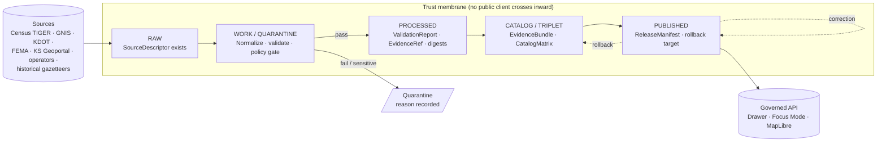
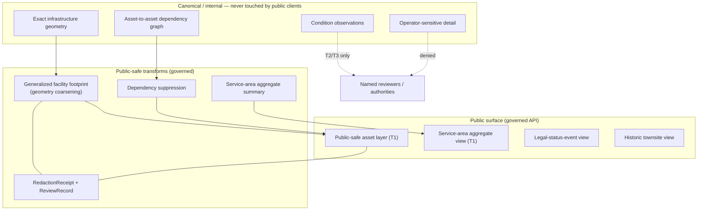
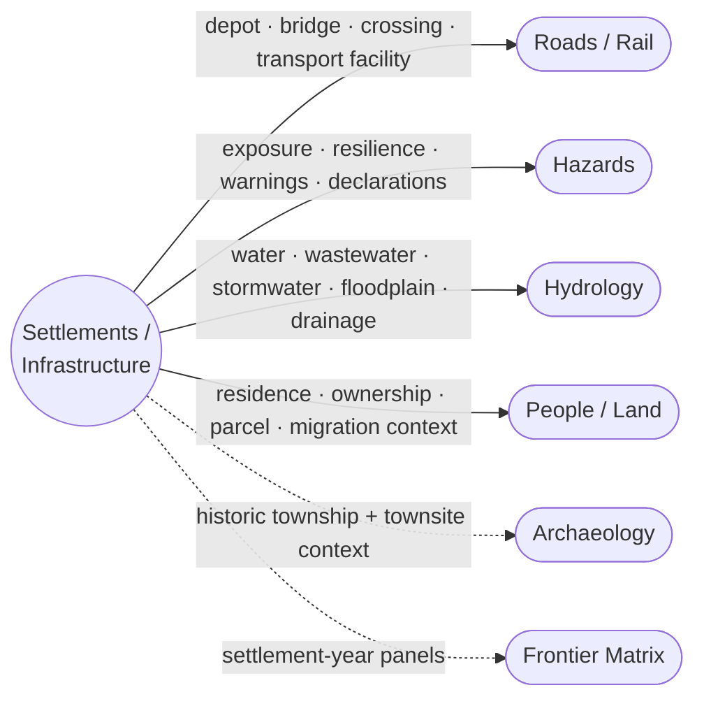

<!-- [KFM_META_BLOCK_V2]
doc_id: kfm://doc/architecture/settlements-infrastructure
title: Settlements and Infrastructure — Architecture Brief
type: standard
version: v0.1
status: draft
owners: <docs steward + Settlements/Infrastructure domain steward — TODO>
created: 2026-05-24
updated: 2026-05-24
policy_label: public
related:
  - docs/doctrine/directory-rules.md
  - docs/doctrine/lifecycle-law.md
  - docs/doctrine/trust-membrane.md
  - docs/architecture/governed-api.md
  - docs/architecture/map-shell.md
  - docs/architecture/contract-schema-policy-split.md
  - docs/domains/settlements-infrastructure/   # PROPOSED domain operating manual home
tags: [kfm, architecture, domain, settlements, infrastructure]
notes:
  - Architecture-level brief; not the domain operating manual.
  - Placement of this file under docs/architecture/ vs. docs/domains/ is noted in §10 (Open questions).
  - PROV.md vs. PROVENANCE.md naming variance acknowledged in §10 (carried from prior sessions).
[/KFM_META_BLOCK_V2] -->

# Settlements and Infrastructure — Architecture Brief

> The architecture-level view of how the **Settlements / Infrastructure** domain plugs into the KFM trust membrane, lifecycle law, governed API surface, MapLibre shell, and governed AI surfaces. Not the domain operating manual.


<!-- TODO: replace with real Shields.io endpoints once CI, version, and last-updated targets are confirmed -->

| Field | Value |
|---|---|
| **Status** | `draft` (architecture brief, v0.1) |
| **Owners** | `<docs steward>` + `<Settlements/Infrastructure domain steward>` — **TODO** |
| **Last reviewed** | 2026-05-24 |
| **Authority class** | Architecture brief — explains; does not replace `contracts/` (meaning), `schemas/` (shape), or `policy/` (admissibility). |
| **Doctrine anchors** | Directory Rules §§5, 6, 12; Lifecycle Law; Trust Membrane; ENCY §11; Atlas v1.1 Ch. 14 + Ch. 24.5, 24.6, 24.13, 24.14 |

---

## Mini-TOC

- [1. Scope and audience](#1-scope-and-audience)
- [2. Architecture placement](#2-architecture-placement)
- [3. Bounded context (what the domain owns and does not own)](#3-bounded-context-what-the-domain-owns-and-does-not-own)
- [4. Lifecycle realization (RAW → PUBLISHED)](#4-lifecycle-realization-raw--published)
- [5. Trust membrane and sensitivity posture](#5-trust-membrane-and-sensitivity-posture)
- [6. Governed surfaces (API · Drawer · Focus Mode)](#6-governed-surfaces-api--drawer--focus-mode)
- [7. Cross-domain integration](#7-cross-domain-integration)
- [8. Validators, tests, and fixtures](#8-validators-tests-and-fixtures)
- [9. Publication, correction, and rollback](#9-publication-correction-and-rollback)
- [10. Open questions and verification backlog](#10-open-questions-and-verification-backlog)
- [11. Related docs](#11-related-docs)

---

## 1. Scope and audience

> [!NOTE]
> **What this brief is.** An architecture-level view of how the **Settlements / Infrastructure** domain integrates with KFM's cross-cutting governance and runtime surfaces — trust membrane, lifecycle law, governed API, MapLibre shell, sensitivity tiers, and Focus Mode. It is intended for architects, reviewers, and downstream consumers.
>
> **What this brief is not.** The full domain operating manual. That lives under `docs/domains/settlements-infrastructure/` (**PROPOSED** placement per Directory Rules §12; **NEEDS VERIFICATION** in mounted repo). Object-family meaning is governed by `contracts/`; field-level shape by `schemas/`; admissibility by `policy/`.

**CONFIRMED doctrine** [DOM-SETTLE] [ENCY]: the domain governs **settlements, municipalities, census places, historic townsites, ghost towns, forts, missions, reservation communities, infrastructure assets, networks, facilities, service areas, operators, condition observations, dependencies,** and **public-safe representations**.

**PROPOSED implementation**: every claim about repository paths, route names, schema homes, test runners, CI workflows, deployment, owners, or enforcement maturity in this document is **PROPOSED / NEEDS VERIFICATION** until a mounted repo confirms it.

---

## 2. Architecture placement

### 2.1 Responsibility roots (PROPOSED)

Per **Directory Rules §12 (Domain Placement Law)**, the Settlements/Infrastructure domain MUST appear as a **lane segment inside responsibility roots**, never as a root-level domain folder. The proposed lane addresses are:

| Responsibility root | Proposed lane segment | Notes |
|---|---|---|
| `docs/` | `docs/domains/settlements-infrastructure/` | Domain operating manual; this brief lives in `docs/architecture/`. |
| `contracts/` | `contracts/domains/settlements-infrastructure/` *or* `contracts/settlement/` | **Naming variance** — see §10 OPEN-SI-01. |
| `schemas/` | `schemas/contracts/v1/domains/settlements-infrastructure/` *or* `schemas/contracts/v1/settlement/` | **Naming variance** — see §10 OPEN-SI-01. |
| `policy/` | `policy/domains/settlements-infrastructure/` and `policy/sensitivity/infrastructure/` | Critical-asset deny lane is policy-significant. |
| `tests/` | `tests/domains/settlements-infrastructure/` | Includes contract, schema, and integration tests. |
| `fixtures/` | `fixtures/domains/settlements-infrastructure/` | Valid + invalid + public-safe fixtures. |
| `data/` | `data/raw/settlements-infrastructure/`, `data/work/`, `data/quarantine/`, `data/processed/`, `data/catalog/domain/settlements-infrastructure/`, `data/published/layers/settlements-infrastructure/` | Lifecycle segregation per Lifecycle Law. |
| `data/registry/` | `data/registry/sources/settlements-infrastructure/` | Source-descriptor registry per source family. |
| `release/` | `release/candidates/settlements-infrastructure/` | Release-candidate manifests. |
| `pipelines/` | `pipelines/domains/settlements-infrastructure/` | Pipeline implementations. |
| `pipeline_specs/` | `pipeline_specs/settlements-infrastructure/` | Pipeline specifications. |

> [!IMPORTANT]
> Atlas v1.1 §24.13 lists the responsibility root for this domain as **`schemas/contracts/v1/settlement/` + `contracts/settlement/` + `policy/sensitivity/infrastructure/`** — without an intermediate `domains/` segment, and using `settlement/` (singular). Directory Rules §12 instead patterns lane segments as `<root>/domains/settlements-infrastructure/`. Both patterns are visible in the corpus; reconciliation is an **ADR-class** question (Directory Rules §2.4(5) — parallel schema home). Marked **OPEN-SI-01** in §10.

### 2.2 Where this brief sits

```
docs/
├── architecture/
│   ├── README.md                                  # canonical home for architecture briefs
│   ├── system-context.md
│   ├── deployment-topology.md
│   ├── governed-api.md
│   ├── map-shell.md
│   ├── contract-schema-policy-split.md
│   └── settlements-infrastructure.md              # THIS FILE (PROPOSED)
└── domains/
    └── settlements-infrastructure/                 # domain operating manual (PROPOSED home)
        └── README.md
```

> [!NOTE]
> Directory Rules §12 says "cross-domain doctrine → `docs/architecture/<topic>.md`, not under `docs/domains/<picked-one>/`." This file is **single-domain architecture**, not cross-domain doctrine in the strict §12 sense. Treat it as a sibling pattern: an architecture-level view *of a single domain's external surface*, complementary to the in-domain operating manual. The acceptability of this pattern is **OPEN-SI-02** in §10.

[↑ Back to top](#settlements-and-infrastructure--architecture-brief)

---

## 3. Bounded context (what the domain owns and does not own)

### 3.1 Owned object families

**CONFIRMED / PROPOSED** [DOM-SETTLE] [ENCY]:

| Object family | Role | Identity rule (PROPOSED) | Temporal handling (CONFIRMED doctrine) |
|---|---|---|---|
| **Settlement** | Aggregated populated place evidence or released derivative. | `source_id + object role + temporal scope + normalized digest`. | Source, observed, valid, retrieval, release, and correction times stay distinct where material. |
| **Municipality** | Legal/administrative incorporated place. | as above | as above |
| **CensusPlace** | Census-defined place geography. | as above | as above |
| **Townsite** | Platted or historic townsite. | as above | as above |
| **GhostTown** | Abandoned/decommissioned populated place. | as above | as above |
| **Fort** | Military/colonial fort or post. | as above | as above |
| **Mission** | Mission settlement. | as above | as above |
| **ReservationCommunity** | Tribal reservation community. | as above; **sovereignty-sensitive**. | as above |
| **Infrastructure Asset** | Built infrastructure feature (utility, facility, structure). | as above; **critical-asset deny lane**. | as above |
| **Network Node** | Discrete node in an infrastructure network. | as above | as above |
| **Network Segment** | Linear infrastructure segment. | as above | as above |
| **Facility** | Operational facility (e.g., water treatment, substation). | as above; **sensitive condition detail**. | as above |
| **Service Area** | Polygon of service coverage / operational reach. | as above | as above |
| **Operator** | Operating entity (utility, agency, private). | as above; **operator-sensitive details restricted**. | as above |
| **Condition Observation** | Observed condition / vulnerability state. | as above; **T4 default** per Atlas v1.1 §24.5.2. | as above |
| **Dependency** | Inter-asset / inter-network dependency relation. | as above; **dependency suppression on public release**. | as above |

### 3.2 Explicit non-ownership

**CONFIRMED / PROPOSED** [DOM-SETTLE] [ENCY] — this domain does **not** own:

- **Roads / Rail** owns transport routes (the Settlements/Infrastructure domain references them via depot, bridge, crossing, and transport facility relations).
- **Hydrology** owns water evidence (this domain references water, wastewater, stormwater, floodplain, and drainage relations).
- **Hazards** owns hazard events and warnings (this domain references exposure, resilience, warnings, and declarations).
- **People / Land** owns ownership records and living-person privacy (this domain references residence, ownership, parcel, and migration context with restrictions).

> [!TIP]
> "Cross-lane relation" ≠ "duplicate ownership." A bridge appears here as an asset citing the Roads/Rail transport facility; the canonical bridge identity is owned by the Roads/Rail lane.

[↑ Back to top](#settlements-and-infrastructure--architecture-brief)

---

## 4. Lifecycle realization (RAW → PUBLISHED)

**CONFIRMED doctrine / PROPOSED lane application** [DIRRULES] [DOM-SETTLE] [ENCY]: Settlements/Infrastructure follows the universal invariant **RAW → WORK / QUARANTINE → PROCESSED → CATALOG / TRIPLET → PUBLISHED**, with promotion as a **governed state transition, not a file move**.



### 4.1 Per-stage gates (PROPOSED)

| Stage | Handling | Gate | Status |
|---|---|---|---|
| **RAW** | Capture immutable source payload or reference with source role, rights, sensitivity, citation, time, and hash. | `SourceDescriptor` exists. | **PROPOSED** |
| **WORK / QUARANTINE** | Normalize schema, geometry, time, identity, evidence, rights, and policy; hold failures. | Validation and policy gate pass, **or** quarantine reason is recorded. | **PROPOSED** |
| **PROCESSED** | Emit validated normalized objects, receipts, and public-safe candidates. | `EvidenceRef` resolves; `ValidationReport` and digest closure exist. | **PROPOSED** |
| **CATALOG / TRIPLET** | Emit catalog records, `EvidenceBundle`s, graph/triplet projections, and release candidates. | Catalog/proof closure passes. | **PROPOSED** |
| **PUBLISHED** | Serve released public-safe artifacts through governed APIs and manifests. | `ReleaseManifest`, correction path, rollback target, and review/policy state exist. | **PROPOSED** |

### 4.2 Source families (illustrative)

**CONFIRMED / PROPOSED** [DOM-SETTLE] [ENCY] — typical source families for this domain:

- Census TIGER / census place geography
- GNIS and gazetteers
- State / local GIS (Kansas Geoportal-style sources)
- Municipal and local legal records
- Historical gazetteers and maps
- Infrastructure operators and providers
- KDOT / bridge / facility sources
- FEMA / hazards / resilience sources (for exposure context only)

> [!WARNING]
> Source families above are illustrative of the domain's canonical sources. **Source rights, terms, and current cadence are NEEDS VERIFICATION** per Atlas v1.1 §14 N. (verification backlog). Sensitive joins (e.g., operator × condition × precise geometry) must **fail closed** until rights, sensitivity, and source-role are resolved.

[↑ Back to top](#settlements-and-infrastructure--architecture-brief)

---

## 5. Trust membrane and sensitivity posture

### 5.1 Default sensitivity (CONFIRMED doctrine; PROPOSED tier assignments)

Settlements/Infrastructure carries the project's **critical-asset deny lane**. Per **Atlas v1.1 §24.5.2** and the **KFM Unified Doctrine Synthesis §16**:

| Object class | Default tier | Allowed transforms (PROPOSED) | Required gates |
|---|---|---|---|
| **Settlement / Municipality / GhostTown** (public-facing) | **T0** | None required for public administrative geography. | Standard Gates A–G. |
| **Infrastructure Asset — critical detail** | **T4** | Generalized facility footprint + suppressed dependency → T1. | Steward review + `RedactionReceipt`. |
| **Infrastructure — condition / vulnerability** | **T4** | T3 to named authorities only; **never T0 / T1**. | Steward review + named-party agreement. |

**CONFIRMED / PROPOSED** [DOM-SETTLE] [ENCY]: critical infrastructure, utilities, condition observations, dependencies, operator-sensitive details, and exact facility geometry default to **restricted or review**.

**CONFIRMED doctrine** [ENCY] [DIRRULES]: unclear rights, unresolved source role, missing evidence, unresolved sensitivity, or absent release state **blocks public promotion**.

### 5.2 Public-safe representation



### 5.3 Anti-collapse rules

> [!IMPORTANT]
> **CONFIRMED doctrine — invariants for this domain:**
> - **Census-vs-municipality distinction MUST NOT collapse.** A `CensusPlace` is not a `Municipality`; legal status events live distinctly.
> - **Operator-sensitive detail MUST NOT collapse into asset geometry.** Operator identity, condition, and vulnerability are separate object lanes.
> - **Style-only hiding is not redaction.** Sensitive geometry must be **transformed before public tile release**, not merely styled invisible — see Master MapLibre Components v2.1.
> - **Detection is not publication.** Watcher receipts, candidate facility detections, and proposed asset records remain in WORK until review, policy, and release gates pass.

[↑ Back to top](#settlements-and-infrastructure--architecture-brief)

---

## 6. Governed surfaces (API · Drawer · Focus Mode)

**PROPOSED** — exact route names, DTO field shapes, schema URIs, and runtime envelopes are **NEEDS VERIFICATION** pending mounted-repo inspection.

| Endpoint or artifact | DTO / schema | Finite outcomes | Status |
|---|---|---|---|
| Settlements/Infrastructure **feature / detail resolver** | `SettlementsInfrastructureDecisionEnvelope` (PROPOSED) | `ANSWER` / `ABSTAIN` / `DENY` / `ERROR` | **PROPOSED** governed API surface; exact route **UNKNOWN**. |
| Settlements/Infrastructure **layer manifest resolver** | `LayerManifest` / domain layer descriptor | `ANSWER` / `DENY` / `ERROR` | **PROPOSED**; public-safe release only. |
| Settlements/Infrastructure **Evidence Drawer payload** | `EvidenceDrawerPayload` + `EvidenceBundle` projection | `ANSWER` / `ABSTAIN` / `DENY` / `ERROR` | **PROPOSED**; evidence and policy filtered. |
| Settlements/Infrastructure **Focus Mode answer** | `Runtime Response Envelope` + `AIReceipt` | `ANSWER` / `ABSTAIN` / `DENY` / `ERROR` | **PROPOSED**; AI never root truth. |
| Schema responsibility root | `schemas/contracts/v1/...` | finite validator outcomes | **PROPOSED**; verify with Directory Rules and ADR. |

### 6.1 Governed AI behavior (CONFIRMED doctrine / PROPOSED implementation)

[GAI] [DOM-SETTLE] [ENCY]:

- AI **MAY** summarize **released** Settlements/Infrastructure `EvidenceBundle`s, compare evidence, explain limitations, and draft steward-review notes.
- AI **MUST ABSTAIN** when evidence is insufficient.
- AI **MUST DENY** where policy, rights, sensitivity, or release state blocks the request.
- AI **MUST NOT** reach RAW, WORK, QUARANTINE, canonical/internal stores, graph internals, vector indexes, source APIs, or direct model runtimes [GAI] [MAP-MASTER] [ENCY].

<details>
<summary><strong>Example shape of a denied Focus Mode answer</strong> (illustrative; not from current repo)</summary>

```json
{
  "envelope_version": "0.1",
  "outcome": "DENY",
  "reason_codes": ["SENSITIVITY_UNRESOLVED", "OPERATOR_DETAIL_RESTRICTED"],
  "scope": {
    "domain": "settlements-infrastructure",
    "object_class": "FacilityCondition"
  },
  "ai_receipt": {
    "evidence_resolved": false,
    "policy_decision_id": "<PolicyDecision id>",
    "review_required": true
  }
}
```

This example is illustrative of the finite-outcome envelope grammar (`ANSWER / ABSTAIN / DENY / ERROR`) carried by all governed surfaces. Exact field names are **PROPOSED** and pending schema-home reconciliation (see §10 OPEN-SI-01).

</details>

[↑ Back to top](#settlements-and-infrastructure--architecture-brief)

---

## 7. Cross-domain integration

**CONFIRMED / PROPOSED** [DOM-SETTLE] [ENCY] — every cross-lane relation **MUST** preserve ownership, source role, sensitivity, and `EvidenceBundle` support.



| Related lane | Relation type | Constraint |
|---|---|---|
| **Roads / Rail** | depot, bridge, crossing, transport facility relation. | Roads/Rail owns the transport-route identity; Settlements/Infrastructure cites it. |
| **Hazards** | exposure, resilience, warnings, declarations. | KFM is **never an alert authority**; hazard-authority claims deny [DOM-HAZ]. |
| **Hydrology** | water, wastewater, stormwater, floodplain, drainage. | Hydrology owns water evidence; floodplain (NFHL) is regulatory-channel evidence from Hydrology. |
| **People / Land** | residence, ownership, parcel, migration context (with restrictions). | Living-person identifiers and DNA fields default to **T4** [DOM-PEOPLE]. |
| **Archaeology** | historic township / mission / fort context (generalized). | Exact archaeological site coords are **T4 default** [DOM-ARCH]; this domain consumes only public-safe summaries. |
| **Frontier Matrix** | settlement existence and legal status per county-year. | Frontier Matrix is **composition, not root truth** [ENCY]. |

[↑ Back to top](#settlements-and-infrastructure--architecture-brief)

---

## 8. Validators, tests, and fixtures

**PROPOSED** [DOM-SETTLE] [ENCY] — the validator set surfaced by the corpus for this domain:

- Legal municipality evidence tests.
- Census-vs-municipality distinction tests.
- Infrastructure topology tests (network node × segment closure).
- Condition `observed_at` tests (temporal-role separation).
- Restricted-geometry no-leak tests (public tile must not contain T4 geometry).
- Catalog / proof / release closure tests.

Recommended fixture lanes (PROPOSED placement):

| Fixture lane | Proposed path |
|---|---|
| Valid public-safe asset | `fixtures/domains/settlements-infrastructure/valid/public_safe/` |
| Invalid (schema fail) | `fixtures/domains/settlements-infrastructure/invalid/schema/` |
| Restricted (T4 leak attempt) | `fixtures/domains/settlements-infrastructure/invalid/sensitivity_leak/` |
| Quarantine (rights unknown) | `fixtures/domains/settlements-infrastructure/quarantine/` |

> [!NOTE]
> All fixture paths above are **PROPOSED** placements consistent with Directory Rules §12 and `fixtures/` per-root conventions in the **Repository Structure Guiding Document**. Current mounted-repo conventions are **NEEDS VERIFICATION**.

[↑ Back to top](#settlements-and-infrastructure--architecture-brief)

---

## 9. Publication, correction, and rollback

**CONFIRMED doctrine / PROPOSED implementation** [ENCY Appendix E] [DOM-SETTLE]: Settlements/Infrastructure publication requires **all** of:

1. `ReleaseManifest`
2. `EvidenceBundle` resolution
3. Validation + policy support (`ValidationReport` + `PolicyDecision`)
4. Review state where required (`ReviewRecord`)
5. Correction path
6. Stale-state rule
7. Rollback target (`RollbackCard` reference)

| Lifecycle event | Required artifacts | Failure-closed outcome |
|---|---|---|
| **Release** (CATALOG → PUBLISHED) | `ReleaseManifest` + `EvidenceBundle` + `PolicyDecision` + `ReviewRecord` (if material) + rollback target. | HOLD at CATALOG; no public surface change. |
| **Correction** (PUBLISHED → PUBLISHED′) | `CorrectionNotice` + `ReviewRecord` + invalidation list + `ReleaseManifest` update or supersession. | Stale-state announcement; no silent edit. |
| **Rollback** (PUBLISHED → prior release) | `RollbackCard` + `CorrectionNotice` + prior `ReleaseManifest` + downstream derivative invalidation. | Held at current state until rollback validated. |

> [!CAUTION]
> **Promotion is a governed state transition, not a file move.** Moving a file under `data/published/layers/settlements-infrastructure/` without a `ReleaseManifest`, rollback target, and policy decision is a drift event, not a release.

[↑ Back to top](#settlements-and-infrastructure--architecture-brief)

---

## 10. Open questions and verification backlog

| # | Question / item | Resolution path | Status |
|---|---|---|---|
| **OPEN-SI-01** | Schema-home naming: `schemas/contracts/v1/settlement/` (Atlas v1.1 §24.13) vs. `schemas/contracts/v1/domains/settlements-infrastructure/` (Directory Rules §12). The same conflict applies to `contracts/`, `policy/`, `tests/`. | **ADR required** per Directory Rules §2.4(5) — parallel schema home. Candidate: ADR-S-01 or a domain-specific ADR. | **OPEN** |
| **OPEN-SI-02** | Acceptability of `docs/architecture/settlements-infrastructure.md` as a per-domain architecture brief, given Directory Rules §12 wording ("Cross-domain doctrine → `docs/architecture/<topic>.md`"). | Docs steward decision; potentially folded into ADR-S-02. | **OPEN** |
| **OPEN-SI-03** | Source rights and municipal legal-source roles (Census TIGER, GNIS, KS Geoportal, operator data, KDOT / FEMA cross-references). | Mounted-repo `data/registry/sources/settlements-infrastructure/` inspection + per-source `SourceDescriptor`. | **NEEDS VERIFICATION** |
| **OPEN-SI-04** | Critical-infrastructure policy bundle — exact rule set under `policy/sensitivity/infrastructure/`. | Mounted-repo policy inspection + steward review. | **NEEDS VERIFICATION** |
| **OPEN-SI-05** | Public-safe layer registry — exact entries under `data/registry/layers/` for this domain. | Mounted-repo layer registry inspection. | **NEEDS VERIFICATION** |
| **OPEN-SI-06** | Governed API route names and Focus Mode auth/policy behavior for this domain. | Mounted-repo `apps/governed-api/` inspection + runtime envelope verification. | **NEEDS VERIFICATION** |
| **OPEN-SI-07** | Naming variance `PROV.md` (prior-session authored) vs. `PROVENANCE.md` (corpus reference) — affects every cross-link from this brief to provenance standards. | **ADR-class** per Directory Rules §2.4; carried from prior sessions. | **OPEN** (deferred) |

[↑ Back to top](#settlements-and-infrastructure--architecture-brief)

---

## 11. Related docs

**Doctrine and architecture**

- [`docs/doctrine/directory-rules.md`](../doctrine/directory-rules.md) — placement and lifecycle authority
- [`docs/doctrine/lifecycle-law.md`](../doctrine/lifecycle-law.md) — RAW → PUBLISHED invariant
- [`docs/doctrine/trust-membrane.md`](../doctrine/trust-membrane.md) — public-client / canonical-store separation
- [`docs/architecture/system-context.md`](./system-context.md) — system context
- [`docs/architecture/governed-api.md`](./governed-api.md) — governed API surface
- [`docs/architecture/map-shell.md`](./map-shell.md) — MapLibre disciplined renderer
- [`docs/architecture/contract-schema-policy-split.md`](./contract-schema-policy-split.md) — `contracts/` vs `schemas/` vs `policy/` authority split

**Standards**

- [`docs/standards/PROV.md`](../standards/PROV.md) — W3C PROV-O / PAV provenance profile *(naming variance — see OPEN-SI-07)*
- [`docs/standards/ISO-19115.md`](../standards/ISO-19115.md) — geographic metadata crosswalk
- [`docs/standards/OGC-API-TILES.md`](../standards/OGC-API-TILES.md) — OGC API Tiles integration
- [`docs/standards/PMTILES.md`](../standards/PMTILES.md) — PMTiles v3 governance

**Domain operating manual** (PROPOSED; not yet authored)

- `docs/domains/settlements-infrastructure/README.md` — **TODO**
- `docs/domains/settlements-infrastructure/sources.md` — **TODO**
- `docs/domains/settlements-infrastructure/sensitivity.md` — **TODO**

**Atlas / dossier sources**

- *Kansas Frontier Matrix — Domains v1.1 + Pass 23/32 Consolidated Atlas*, Ch. 14 (Settlements and Infrastructure), Ch. 24.5 (Sensitivity Tiers), Ch. 24.6 (Pipeline Gates), Ch. 24.13 (Section ↔ Dossier ↔ Responsibility Root Crosswalk), Ch. 24.14 (Object Family × Domain Matrix).
- *KFM Encyclopedia* §11 (Domains) [DOM-SETTLE].
- *KFM Unified Doctrine Synthesis* §§6–16 (Lifecycle, promotion, sensitivity tiers).
- *Master MapLibre Components-Functions-Features v2.1* — renderer-boundary and Evidence Drawer doctrine.

---

<sub>**Last reviewed:** 2026-05-24 · **Version:** v0.1 (draft) · **Authority class:** architecture brief (explains; does not replace contracts / schemas / policy) · [↑ Back to top](#settlements-and-infrastructure--architecture-brief)</sub>
