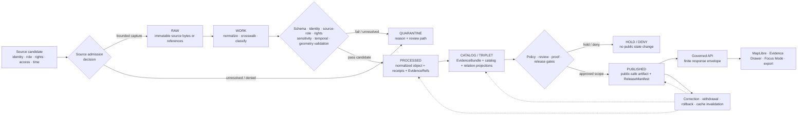

<!-- [KFM_META_BLOCK_V2]
doc_id: kfm://doc/architecture/settlements-infrastructure
title: "Settlements & Infrastructure — Integration Architecture"
type: standard
subtype: architecture-integration-overview
version: v0.2
status: draft
owners:
  - "OWNER_TBD — Settlements/Infrastructure domain steward"
  - "OWNER_TBD — architecture steward"
  - "OWNER_TBD — docs steward"
owner_status: >-
  CODEOWNERS routes this path to @bartytime4life. Domain, architecture, sensitivity,
  evidence, API, validation, and release stewardship assignments remain unverified.
reviewers_required:
  - Settlements/Infrastructure domain steward
  - Architecture steward
  - Docs steward
  - Source and evidence steward
  - Sensitivity and policy reviewer
  - Governed API and MapLibre reviewer
  - Validation and CI steward
  - Release, correction, and rollback steward
created: 2026-05-24
updated: 2026-08-14
policy_label: public
truth_posture: cite-or-abstain
owning_root: docs/
current_path: docs/architecture/settlements-infrastructure/README.md
responsibility: >-
  Explain how the Settlements/Infrastructure domain lane composes with KFM's shared
  trust membrane, lifecycle, contracts, schemas, policy, validation, delivery, UI,
  AI, cross-domain seams, release, correction, and rollback surfaces without
  replacing domain doctrine or creating implementation authority.
authority_posture: >-
  Explanatory integration overview. The detailed domain architecture remains in
  docs/domains/settlements-infrastructure/ARCHITECTURE.md; accepted ADRs and
  Directory Rules govern placement; contracts define meaning; schemas define shape;
  policy decides admissibility; tests and fixtures prove behavior; release records
  govern publication.
evidence_snapshot:
  repository: bartytime4life/Kansas-Frontier-Matrix
  base_ref: main
  base_commit: 3974da9794fa11bd5355c49243c9193d22b9e81e
  target_prior_blob: be29d8643fe84dd3b8af84276171a092cdc87b8a
  codeowners_blob: dd2a84aa514d8ecd9208bc347f90f9a2ed37dd61
  adr_0029_blob: a4de0d7a96b78da59cfc499d1025e1508afd8dd9
  directory_rules_blob: fd49a0b83e55cef52c1124281f093e263526898d
  domain_readme_blob: bccb04cd4f181ac5cc1c7935177bbd4977715e19
  domain_architecture_blob: c8fd2b4ee3d02cc02d868355f0d119f966156bb0
  canonical_paths_blob: a388ccbf2802fc4f705ec470aee3bddfe39dfd37
  contract_lane_readme_blob: e5dd0c110fcd751437873b5d7eaeb0403161a6d7
  canonical_schema_lane_readme_blob: 5b8d78c55ca6872e54e5ad99ed418427313a62e9
  representative_schema_blob: 05f219da2a1d4e8d4560c03d26edba9dd44f825d
  flat_schema_compatibility_readme_blob: b92da57b45b7b64b48c9e33525741a8730390679
  policy_lane_readme_blob: 792a67caab14d119cf4a21dee1365216bfaefb11
  representative_policy_blob: 77fb04971146ed711d0078ef1cb169956ca07528
  representative_test_blob: be4cd61e9451ea9b85aa2a69f4c1ba0d77513680
  representative_validator_blob: 6a2d445855f62615513171d264173a5920fa9dcc
  workflow_blob: a47d89c40efd58ac31bc44dbc56bdfb1ccc3a325
  domain_lane_register_blob: 1bfc6f91cfa713a5e3d51ece011b63b46310734f
  cross_domain_seam_register_blob: dc87ea9c2ab11cc10e51cf4e8284c030e7c9ab29
  latest_domain_workflow_run: 31832038501
  latest_domain_workflow_head: 3974da9794fa11bd5355c49243c9193d22b9e81e
  latest_domain_workflow_conclusion: success_with_explicit_holds
inspection_boundary: >-
  Current-session GitHub reads over the exact target, accepted Directory Rules
  decision and adopted bytes, CODEOWNERS, detailed domain documentation, canonical
  path guidance, contract and schema lanes, representative schema, policy, test,
  validator, current workflow, machine domain-lane and cross-domain-seam projections,
  and the latest hosted domain workflow run. No live source endpoint, protected or
  exact infrastructure record, source registry instance, policy evaluator, proof
  producer, release environment, governed API deployment, public map client, model
  runtime, or correction/rollback execution was exercised.
related:
  - ../README.md
  - ../../adr/ADR-0029-adopt-directory-governance-standard-v2.md
  - ../../doctrine/directory-rules.md
  - ../../doctrine/lifecycle-law.md
  - ../../doctrine/trust-membrane.md
  - ../governed-api.md
  - ../map-shell.md
  - ../contract-schema-policy-split.md
  - ../../domains/settlements-infrastructure/README.md
  - ../../domains/settlements-infrastructure/ARCHITECTURE.md
  - ../../domains/settlements-infrastructure/CANONICAL_PATHS.md
  - ../../domains/settlements-infrastructure/API_CONTRACTS.md
  - ../../domains/settlements-infrastructure/SENSITIVITY.md
  - ../../domains/settlements-infrastructure/DENY_BY_DEFAULT.md
  - ../../domains/settlements-infrastructure/SOURCE_FAMILIES.md
  - ../../../control_plane/domain_lane_register.yaml
  - ../../../control_plane/cross_domain_seam_register.yaml
  - ../../../contracts/domains/settlements-infrastructure/README.md
  - ../../../schemas/contracts/v1/domains/settlements-infrastructure/README.md
  - ../../../schemas/contracts/v1/settlements-infrastructure/README.md
  - ../../../policy/domains/settlements-infrastructure/README.md
  - ../../../tests/domains/settlements-infrastructure/README.md
  - ../../../tools/validators/domains/settlements-infrastructure/README.md
  - ../../../.github/workflows/domain-settlements-infrastructure.yml
tags:
  - kfm
  - architecture
  - settlements
  - infrastructure
  - bounded-context
  - trust-membrane
  - lifecycle
  - source-role
  - sensitivity
  - governed-api
  - maplibre
  - evidence-drawer
  - focus-mode
  - correction
  - rollback
notes:
  - "v0.2 is a same-path, repository-grounded modernization of the 2026-05-24 architecture brief."
  - "The existing path is retained as an integration overview for link and history continuity; it is not promoted into domain-doctrine authority."
  - "Current schemas, Rego files, focused tests, and domain validators are predominantly scaffolds or placeholders."
  - "The latest hosted domain workflow is green because its bounded readiness checks and explicit HOLD assertions passed; it does not prove semantic validation, proof closure, release readiness, or publication."
  - "This revision changes documentation only and does not expose infrastructure, activate sources, implement policy, release data, deploy, or publish."
[/KFM_META_BLOCK_V2] -->

<a id="top"></a>

# Settlements & Infrastructure — Integration Architecture

> **Repository-grounded integration view.** This page explains how KFM's
> Settlements/Infrastructure lane meets the shared trust membrane: source admission,
> lifecycle processing, evidence, policy, validation, governed delivery, MapLibre,
> Evidence Drawer, Focus Mode, release, correction, and rollback. It does not replace
> the detailed domain architecture or make a scaffolded control operational.

[](#status-and-authority)
[](#document-relationship)
[](#placement-and-current-topology)
[](#contract-schema-policy-test-split)
[](#contract-schema-policy-test-split)
[](#validation-and-ci-maturity)
[](#validation-and-ci-maturity)
[](#latest-hosted-evidence)
[](#publication-correction-and-rollback)

> [!IMPORTANT]
> **This page is not the domain authority.** The detailed domain dossier is
> [`docs/domains/settlements-infrastructure/ARCHITECTURE.md`](../../domains/settlements-infrastructure/ARCHITECTURE.md),
> with the domain landing page, source, sensitivity, lifecycle, API, and canonical-path
> documents beside it. This tracked architecture path is retained as a cross-root
> integration overview. Moving or retiring it would require a separate reference and
> migration review.

> [!CAUTION]
> **Green does not mean implemented.** The latest inspected
> `domain-settlements-infrastructure` workflow completed successfully at
> `main@3974da9794fa11bd5355c49243c9193d22b9e81e`, but all three jobs explicitly
> record HOLD posture. The workflow checks boundary presence and scaffold integrity;
> it does not execute semantic domain validation, create proofs, or run a release
> candidate.

> [!WARNING]
> **Critical-asset information remains fail closed.** Exact infrastructure geometry,
> condition and vulnerability detail, operator-sensitive information, and dependency
> graphs must not reach public clients through this page, a map style, generated text,
> or a direct store path. Public representation requires a governed transform, policy
> and review support, evidence closure, release state, correction path, and rollback
> target appropriate to consequence.

**Quick navigation:** [Status](#status-and-authority) · [Relationship](#document-relationship) · [Context](#bounded-context-and-ubiquitous-language) · [Topology](#placement-and-current-topology) · [Flow](#governed-operating-flow) · [Trust split](#contract-schema-policy-test-split) · [Sensitivity](#sensitivity-and-public-safe-representation) · [Delivery](#governed-delivery-and-user-surfaces) · [Seams](#cross-domain-seams) · [Validation](#validation-and-ci-maturity) · [Convergence](#implementation-convergence-plan) · [Release](#publication-correction-and-rollback) · [Holds](#conflict-and-hold-register) · [Acceptance](#acceptance-gates) · [Risks](#risks-and-anti-patterns) · [Questions](#open-questions) · [References](#references) · [No-loss ledger](#appendix-a--no-loss-reconciliation-ledger)

---

<a id="status-and-authority"></a>

## Status and authority

| Field | Current value |
|---|---|
| **Tracked path** | `docs/architecture/settlements-infrastructure/README.md` |
| **Document status** | `draft`, v0.2 |
| **Primary role** | Cross-root integration overview for the Settlements/Infrastructure lane |
| **Detailed domain architecture** | [`docs/domains/settlements-infrastructure/ARCHITECTURE.md`](../../domains/settlements-infrastructure/ARCHITECTURE.md) |
| **Placement authority** | Accepted [`ADR-0029`](../../adr/ADR-0029-adopt-directory-governance-standard-v2.md) and the exact adopted [`directory-rules.md`](../../doctrine/directory-rules.md) bytes |
| **GitHub review route** | `@bartytime4life` through [`CODEOWNERS`](../../../.github/CODEOWNERS); role assignments remain unverified |
| **Evidence checkpoint** | `main@3974da9794fa11bd5355c49243c9193d22b9e81e` |
| **Current implementation characterization** | Broad documented lane; draft contracts; permissive schema scaffolds; non-enforcing policy stubs; placeholder tests and validators; green readiness workflow with explicit holds |
| **Publication effect of this revision** | None |
| **Release state verified in this task** | None |
| **Live systems exercised** | None |

### Truth labels used here

| Label | Meaning in this page |
|---|---|
| **CONFIRMED** | Read from current repository bytes, workflow metadata, or adopted doctrine at the pinned evidence checkpoint. |
| **PROPOSED** | Recommended design or future implementation not yet established by current behavior. |
| **UNKNOWN** | Evidence is insufficient to characterize the current state. |
| **NEEDS VERIFICATION** | A concrete repository, runtime, source, rights, review, or release check remains. |
| **CONFLICTED** | Current surfaces express competing names, homes, or semantics and no accepted decision has closed the difference. |
| **HOLD** | A known prerequisite is not satisfied; no stronger lifecycle or public claim follows. |

### Current evidence matrix

| Surface | Current-session finding | What it does not prove |
|---|---|---|
| This architecture page | **CONFIRMED tracked file**; prior blob dated 2026-05-24 | Domain authority, implementation, release, or runtime behavior |
| Directory governance | `ADR-0029` is the only accepted numbered ADR and adopts the exact Directory Rules v2 bytes | That every legacy path has converged |
| Domain documentation | Domain README, detailed architecture, canonical paths, API contracts, sensitivity, deny-by-default, lifecycle, source, and backlog documents exist | That their older “no mounted repo” implementation statements remain current |
| Machine lane register | `settlements-infrastructure` is registered with alias `settlement`; register status is `PROPOSED`, authority is projection only | Source, sensitivity, policy, release, or publication authority |
| Contract lane | `contracts/domains/settlements-infrastructure/` contains a maintained README and multiple semantic contract documents | Accepted object semantics or complete object-family coverage |
| Canonical schema working lane | `schemas/contracts/v1/domains/settlements-infrastructure/` contains many JSON Schema files | Substantive validation; representative schemas remain permissive stubs |
| Flat schema lane | `schemas/contracts/v1/settlements-infrastructure/` is a compatibility guardrail with no current flat schema files found | A second canonical schema home |
| Policy lane | Rego files and a substantial README exist | Enforced policy; representative rules are greenfield stubs |
| Focused tests | Expected test paths exist | Behavior proof; representative files contain only module documentation |
| Domain validators | Expected validator paths exist | Executable validation; representative entrypoints raise `NotImplementedError` |
| Hosted workflow | Latest run `31832038501` succeeded for validation-readiness, proof-readiness, and release-readiness jobs | Semantic validation, proof creation, release readiness, or publication |
| Public clients and runtime | Not exercised | Route behavior, deployed controls, API authorization, map behavior, AI behavior, or cache invalidation |
| Source and release records | Not inspected as admitted instances | Rights, currentness, source authority, evidence sufficiency, review, release, correction, or rollback closure |

> [!NOTE]
> A file can be **CONFIRMED present** while the behavior it describes remains
> **PROPOSED**, **UNKNOWN**, or **HELD**. This distinction is load-bearing for this
> lane because many current files are deliberate readiness scaffolds.

[Back to top](#top)

---

<a id="document-relationship"></a>

## Document relationship

The repository now contains both a detailed domain documentation system and this
architecture-folder path. Their responsibilities must remain non-competing.

| Surface | Responsibility | Authority boundary |
|---|---|---|
| [`docs/domains/settlements-infrastructure/README.md`](../../domains/settlements-infrastructure/README.md) | Domain landing page and human doctrine index | Explains domain scope; does not define shape or admissibility |
| [`docs/domains/settlements-infrastructure/ARCHITECTURE.md`](../../domains/settlements-infrastructure/ARCHITECTURE.md) | Detailed domain architecture and ubiquitous language | Primary domain-dossier architecture; still draft and evidence-bounded |
| [`docs/domains/settlements-infrastructure/CANONICAL_PATHS.md`](../../domains/settlements-infrastructure/CANONICAL_PATHS.md) | Domain path crosswalk and naming-variance register | Navigational guidance; accepted Directory Rules and ADRs still govern placement |
| [`docs/domains/settlements-infrastructure/API_CONTRACTS.md`](../../domains/settlements-infrastructure/API_CONTRACTS.md) | Domain API and envelope planning | Does not prove live routes or deployed consumers |
| [`docs/domains/settlements-infrastructure/SENSITIVITY.md`](../../domains/settlements-infrastructure/SENSITIVITY.md) and [`DENY_BY_DEFAULT.md`](../../domains/settlements-infrastructure/DENY_BY_DEFAULT.md) | Domain sensitivity and fail-closed explanations | Policy decisions belong in `policy/`; review and release remain separate |
| **This page** | Cross-root integration and current maturity overview | Explains how the lane composes; does not duplicate the dossier or create authority |

### Why this same path remains

The page is an existing tracked path with repository history and possible inbound
references. The smallest reversible correction is therefore a same-path role
clarification:

1. retain the file and its identity;
2. make the detailed domain architecture explicitly primary for domain semantics;
3. use this page for integration boundaries and current implementation evidence;
4. defer any move, redirect, or retirement until a reference inventory, replacement
   target, compatibility window, validation plan, and rollback path exist.

This revision does not create a new architecture pattern or amend
[`docs/architecture/README.md`](../README.md). It narrows this page so that the parent
folder's cross-cutting role and the domain folder's domain-specific role can coexist
without parallel doctrinal authority.

### What this page does not do

- It does not define `Settlement`, `Municipality`, `Facility`, or `Dependency`.
- It does not select a schema home or remove a compatibility lane.
- It does not activate a source, connector, watcher, policy bundle, API route, map layer,
  proof producer, or release path.
- It does not certify legal municipal status, infrastructure condition, service
  availability, resilience, vulnerability, safety, emergency status, planning need, or
  operational dependency.
- It does not authorize precise infrastructure disclosure.
- It does not replace source descriptors, evidence bundles, policy decisions, review
  records, release manifests, correction notices, or rollback cards.

[Back to top](#top)

---

<a id="bounded-context-and-ubiquitous-language"></a>

## Bounded context and ubiquitous language

The Settlements/Infrastructure lane is a single KFM domain lane with two closely
related sublanes:

1. **Settlements** — place and community identity over time.
2. **Infrastructure** — assets, networks, facilities, service areas, operators,
   condition observations, and dependencies.

The combined lane is useful because settled places and infrastructure are often
interpreted together. The terms must nevertheless remain distinct.

### Owned object families

| Sublane | Object family | Core meaning | Required non-collapse boundary |
|---|---|---|---|
| Settlements | `Settlement` | Evidence-bounded inhabited or historically inhabited place identity | Not automatically a legal municipality or census geography |
| Settlements | `Municipality` | Legally incorporated or otherwise legally constituted municipal entity | Not interchangeable with `CensusPlace` |
| Settlements | `CensusPlace` | Statistical geography defined for a census vintage | Not legal incorporation and not a continuous historic identity |
| Settlements | `Townsite` | Platted, founded, or historically asserted townsite | Does not prove continuing habitation |
| Settlements | `GhostTown` | Historical settlement identity with abandonment or uncertain continuity | May overlap archaeology or private property; exact location may require review |
| Settlements | `Fort` | Military post or fort identity | Military history does not automatically authorize current facility claims |
| Settlements | `Mission` | Mission station or settlement identity | May require cultural and sovereignty-aware review |
| Settlements | `ReservationCommunity` | Community identity in a sovereignty-sensitive context | Governmental, tribal, legal, cultural, and geographic identities must remain distinct |
| Infrastructure | `InfrastructureAsset` | Physical infrastructure feature or governed asset identity | Not parcel/title truth, not route identity, not operator authority by itself |
| Infrastructure | `NetworkNode` | Node in a declared infrastructure network | Not a transport graph node unless a governed crosswalk says so |
| Infrastructure | `NetworkSegment` | Segment in a declared infrastructure network | Not a road or rail segment unless cited from the owning lane |
| Infrastructure | `Facility` | Operational site or complex | Exact geometry, interior layout, condition, and operating detail may be restricted |
| Infrastructure | `ServiceArea` | Time-scoped area of intended or observed service coverage | Not a guarantee that service is available to every location |
| Infrastructure | `Operator` | Organization or entity operating a system, facility, or asset | Operator relation is not legal ownership, title, or public-contact permission |
| Infrastructure | `ConditionObservation` | Time-scoped observation about condition, inspection, status, or performance | Not a forecast, safety instruction, or general current-state assertion without time |
| Infrastructure | `Dependency` | Directed reliance between assets, facilities, systems, or services | Dependency graphs are sensitive and not public by default |

### High-value anti-collapse rules

| Rule | Consequence |
|---|---|
| `Municipality != CensusPlace` | Preserve legal authority, census vintage, geography, and time as separate dimensions. |
| Historical identity is not present legal status | A townsite or ghost-town record cannot become a current municipality through name matching. |
| Administrative compilation is not observation | Registry, inventory, and legal records retain their source roles. |
| Asset is not operator | Do not merge physical identity, operation, ownership, and contact details into one record. |
| Service area is not service guarantee | Public summaries must state the supporting time, method, limits, and release scope. |
| Condition observation is not advisory | KFM does not turn inspection or condition evidence into safety or emergency instructions. |
| Candidate or model is not confirmed asset truth | Detection, inference, or modeled dependency remains candidate/model context until governed admission and review. |
| Geometry is not permission | Public visibility of a source or map does not authorize KFM redistribution or precision. |
| Style hiding is not redaction | Restricted geometry and attributes must be transformed before public delivery. |
| Lifecycle promotion does not upgrade source role | A released derivative preserves the authority limits of its supporting sources. |

### Explicit non-ownership

| Adjacent lane | Owns | Settlements/Infrastructure may do |
|---|---|---|
| Roads, Rail & Trade | Route, corridor, road, rail, and transport-network identity | Cite depot, bridge, crossing, and facility relations without taking route authority |
| Hydrology | Water observations, hydrologic units, reaches, water evidence, and flood-related source meaning | Cite water, wastewater, stormwater, floodplain, and drainage context |
| Hazards | Hazard-event identity, warnings, official advisory context, exposure methodology | Cite released exposure context without becoming an alert authority |
| People, DNA & Land | Living-person, parcel, ownership, title, genealogy, and genomic authority | Use released aggregate or public-safe context only |
| Archaeology | Archaeological site identity, provenience, cultural sensitivity, sacred and burial context | Use generalized, steward-reviewed historical context only |
| Frontier Matrix | Compositional analytical panels and versioned frontier definitions | Contribute released settlement/time context without becoming matrix truth |

[Back to top](#top)

---

<a id="placement-and-current-topology"></a>

## Placement and current topology

### Directory Rules basis

Accepted [`ADR-0029`](../../adr/ADR-0029-adopt-directory-governance-standard-v2.md)
makes [`docs/doctrine/directory-rules.md`](../../doctrine/directory-rules.md) the
single writable human-readable Directory Rules authority. This update follows the
existing path's same-path presumption and changes no responsibility root.

The primary responsibility of this file is **human explanation**, so `docs/` owns it.
Its narrower integration role justifies preserving its tracked
`docs/architecture/settlements-infrastructure/README.md` location for this revision.
The domain's semantic and operating detail remains under
`docs/domains/settlements-infrastructure/`.

### Current responsibility map

| Responsibility | Current working path | Current evidence-based posture |
|---|---|---|
| Integration explanation | `docs/architecture/settlements-infrastructure/README.md` | **CONFIRMED tracked path**; this page |
| Domain documentation | `docs/domains/settlements-infrastructure/` | **CONFIRMED extensive documentation lane** |
| Machine domain index | `control_plane/domain_lane_register.yaml` | **PROPOSED projection only**; alias `settlement` resolves to lane ID |
| Machine seam index | `control_plane/cross_domain_seam_register.yaml` | **PROPOSED, partial projection**; high-risk seams remain held |
| Semantic contracts | `contracts/domains/settlements-infrastructure/` | **CONFIRMED working lane**; draft/experimental |
| Canonical working schema lane | `schemas/contracts/v1/domains/settlements-infrastructure/` | **CONFIRMED file family**; schemas largely scaffold maturity |
| Flat schema compatibility lane | `schemas/contracts/v1/settlements-infrastructure/` | **CONFIRMED README-only guardrail**; not a second authority |
| Singular aliases | `settlement` path families | **CONFLICTED / compatibility posture**; no authority upgrade here |
| Admissibility policy | `policy/domains/settlements-infrastructure/` | **CONFIRMED files / non-enforcing scaffold behavior** |
| Fixtures and tests | `fixtures/domains/settlements-infrastructure/`, `tests/domains/settlements-infrastructure/` | **CONFIRMED boundary paths / behavior largely placeholder** |
| Validators | `tools/validators/domains/settlements-infrastructure/` | **CONFIRMED paths / representative entrypoints unimplemented** |
| Domain CI | `.github/workflows/domain-settlements-infrastructure.yml` | **CONFIRMED bounded readiness workflow with explicit holds** |
| Source, lifecycle, proof, and release lanes | `data/` and `release/` responsibility roots | Boundary documentation is referenced by the workflow; substantive instances were not inspected here |
| Public delivery | Governed API and released artifacts | Runtime and deployment **UNKNOWN** in this task |

### Canonical versus compatibility schema lanes

```text
schemas/contracts/v1/
├── domains/
│   └── settlements-infrastructure/     # current working domain schema lane
├── settlements-infrastructure/         # flat compatibility guardrail; README only
└── settlement/                         # singular compatibility / variance surfaces
```

The existence of a compatibility path does not make it writable authority. New schema
work should use the current working domain lane unless an accepted ADR or reviewed
migration changes the relationship. This page does not resolve, remove, or duplicate
those paths.

### Responsibility boundaries

| Root | Owns | Must not be treated as |
|---|---|---|
| `docs/` | Human explanation, architecture, domain guidance, runbooks, decisions, and registers by sub-lane | Machine enforcement or runtime proof |
| `contracts/` | Semantic meaning and object boundaries | JSON validation, policy, source truth, or release |
| `schemas/` | Machine-checkable shape | Evidence sufficiency or publication approval |
| `policy/` | Allow, deny, restrict, abstain, obligation, and review logic | Source truth or schema authority |
| `fixtures/` and `tests/` | Deterministic examples and behavior proof | Real source records or human approval |
| `tools/validators/` | Validation implementation and finite reports | Vocabulary or policy authority |
| `control_plane/` | Machine projections and indexes | Authority minting |
| `data/` | Registry, lifecycle, evidence, receipt, proof, catalog, and published records by owned plane | A convenience bucket or direct public API |
| `release/` | Candidate, review, release, correction, withdrawal, and rollback decisions | Source capture or canonical domain data |
| `apps/` and delivery packages | Governed public and steward interfaces | Canonical/internal truth stores |

[Back to top](#top)

---

<a id="governed-operating-flow"></a>

## Governed operating flow

Settlements/Infrastructure follows the universal KFM lifecycle. Each arrow is a
governed transition; none is implied by path presence, a commit, a green badge, or a
map layer.


```mermaid
flowchart LR
  SRC["Source candidate<br/>identity · role · rights · access · time"] --> SAD{"Source admission<br/>decision"}
  SAD -->|bounded capture| RAW["RAW<br/>immutable source bytes or references"]
  SAD -->|unresolved / denied| Q["QUARANTINE<br/>reason + review path"]
  RAW --> W["WORK<br/>normalize · crosswalk · classify"]
  W --> V{"Schema · identity · source-role · rights<br/>sensitivity · temporal · geometry validation"}
  V -->|fail / unresolved| Q
  V -->|pass candidate| P["PROCESSED<br/>normalized object + receipts + EvidenceRefs"]
  P --> C["CATALOG / TRIPLET<br/>EvidenceBundle + catalog + relation projections"]
  C --> R{"Policy · review · proof · release gates"}
  R -->|hold / deny| Q2["HOLD / DENY<br/>no public state change"]
  R -->|approved scope| PUB["PUBLISHED<br/>public-safe artifact + ReleaseManifest"]
  PUB --> API["Governed API<br/>finite response envelope"]
  API --> UI["MapLibre · Evidence Drawer · Focus Mode · export"]
  PUB --> FIX["Correction · withdrawal · rollback · cache invalidation"]
  FIX -.-> P
  FIX -.-> C
  FIX -.-> PUB
```

### Stage obligations

| Stage | Minimum posture | Forbidden shortcut |
|---|---|---|
| Source edge | Stable source identity, role, authority limits, rights, sensitivity, access, citation, cadence, and bounded admission decision | Public visibility or HTTP success as implicit admission |
| RAW | Immutable source bytes or reference plus capture identity and receipt | Normal public client access |
| WORK | Deterministic normalization, identity, time, geometry, crosswalk, and source-role handling | Treating candidate or generated interpretation as accepted fact |
| QUARANTINE | Reason codes, steward route, retained lineage, and structured exit | Silent deletion or auto-promotion |
| PROCESSED | Schema-valid candidate, validation report, EvidenceRefs, transforms, and content identity | Calling shape validation evidence closure |
| CATALOG / TRIPLET | EvidenceBundle resolution, catalog/provenance closure, relationship ownership, and release candidate identity | Treating a graph edge or catalog record as truth |
| PUBLISHED | Policy, review, proof, manifest, public-safe transform, correction, and rollback support | Copying a file into a published directory |
| Public delivery | Governed API or approved released-artifact surface with finite outcomes and citations | Direct reads from canonical/internal stores or direct model endpoints |

### Public response outcomes

| Outcome | Meaning |
|---|---|
| `ANSWER` | Requested scope is supported by released evidence, policy, review, and citation state. |
| `ABSTAIN` | Evidence, source role, time, identity, geography, or citation support is insufficient. |
| `DENY` | Rights, sensitivity, access, policy, release, or harmful-precision rules block output. |
| `ERROR` | A resolver, validator, policy, evidence, or runtime dependency failed; no generated fallback answer. |

`HOLD` and `RESTRICT` remain internal lifecycle or policy dispositions unless an
accepted outward contract explicitly exposes them.

[Back to top](#top)

---

<a id="contract-schema-policy-test-split"></a>

## Contract, schema, policy, and test split

Current repository evidence proves that all four responsibility families have paths.
It does **not** prove that they are mature.

### Current implementation evidence

| Layer | Current evidence | Maturity |
|---|---|---|
| Semantic contracts | Contract-lane README and multiple named contract documents exist, including feature identity, layer descriptor, observation, validation report, Evidence Drawer payload, historical-place resolution, and crosswalk surfaces | **PARTIAL / draft** |
| Schemas | Many paired `.schema.json` files exist in the working domain lane | **SCAFFOLD** — representative `domain_observation` requires only `id`, permits arbitrary properties, and labels itself `PROPOSED` |
| Policy | Domain README and Rego files exist | **SCAFFOLD / non-enforcing** — representative `deny_unpublished.rego` declares no real rules and defaults `deny` to false |
| Fixtures | Domain fixture boundary exists | **NEEDS VERIFICATION** for semantic valid/invalid payloads and consumer coverage |
| Focused tests | Named tests exist for census vintage, census-versus-municipality, observed time, restricted geometry, catalog/release closure, and smoke behavior | **PLACEHOLDER** — representative test has no executable assertion |
| Validators | Domain validator files exist for schema, source descriptor, evidence bundle, and catalog matrix | **PLACEHOLDER** — representative validator raises `NotImplementedError` |
| Workflow | Readiness, proof, and release-dry-run jobs exist | **HELD BY DESIGN** — checks scaffolds and fails when unreviewed implementation appears |

### Why this matters

A repository can contain all expected filenames and still lack enforceable behavior.
For this lane:

- **Contract presence** does not establish accepted semantics.
- **Schema validity** does not prove a settlement, municipality, facility, condition, or
  dependency claim.
- **Rego presence** does not establish fail-closed policy.
- **Test filenames** do not establish assertions.
- **Validator paths** do not establish execution.
- **Workflow success** does not establish proof or release readiness.
- **Documentation quality** does not authorize sensitive disclosure.

### Graduation order

A domain capability should advance in this order:

1. settle one bounded semantic distinction;
2. bind it to the current working schema home;
3. make the schema closed and field-complete for that slice;
4. add deterministic public-safe valid and invalid fixtures;
5. implement one finite validator with stable reason codes;
6. replace placeholder tests with executable assertions;
7. add policy only where the operation requires policy;
8. update the readiness workflow so it runs the accepted validator and tests;
9. add EvidenceBundle and governed response fixtures;
10. add proof and release dry-run producers only after the preceding gates pass.

The workflow currently fails when substantive implementation appears without deliberate
wiring. That is a safety feature: graduation must update the workflow and its documented
holds in the same dependency-closed change.

[Back to top](#top)

---

<a id="sensitivity-and-public-safe-representation"></a>

## Sensitivity and public-safe representation

### Lane baseline versus object sensitivity

The machine domain-lane register currently records a `T0` sensitivity baseline for the
lane. Its own status is `PROPOSED`, and that baseline is not permission to publish every
object in the lane. Object, source, attribute, join, time, geography, and requested use can
raise the effective sensitivity.

The most restrictive applicable posture controls.

| Information class | Default public posture |
|---|---|
| Released municipality name, legal-status event, and public administrative boundary | Potentially public when source role, rights, time, evidence, and release state close |
| Released census-place geography and vintage | Potentially public with census-vintage and statistical-role disclosure |
| Historic townsite or ghost-town context | Public-safe or generalized only after rights, temporal, private-property, and archaeology/cultural review where applicable |
| Public facility category or generalized service-area summary | Conditional; must not imply service guarantee or reveal sensitive operational detail |
| Exact critical-asset geometry | **DENY / restricted by default** |
| Interior layout, access path, security control, weak point, or operational dependency | **DENY** |
| Condition, vulnerability, outage, capacity, failure mode, or maintenance detail | **DENY or named-party restriction** unless a qualified authority and release decision approve a bounded form |
| Operator-sensitive identity, contact, credential, or operational relationship | Restricted and purpose-limited |
| Dependency graph or cascading-failure relation | Restricted; public summaries require aggregation or suppression and review |
| Cross-domain join that reconstructs protected precision | Governed by the most restrictive participant; default HOLD or DENY |

### Required public-safe transforms

A public candidate may require one or more of:

- geometry generalization or removal;
- attribute suppression;
- dependency removal;
- service-area aggregation;
- time delay or historical-only framing;
- source-role and uncertainty labels;
- omission of operator or condition detail;
- policy obligations and access-class restriction;
- steward or independent review;
- transform and redaction receipts;
- release-manifest binding and cache invalidation plan.

This page adopts no universal distance, zoom, precision, or aggregation threshold.
Thresholds are policy-significant and must be defined by the appropriate policy and
review authority with tests showing they resist reconstruction.

### Carrier-wide redaction

A transform applies to the whole response envelope, not only to geometry. Review must
cover:

- vector and raster payloads;
- tiles and tile metadata;
- feature properties and popups;
- labels, legends, tooltips, and search results;
- graph and relation endpoints;
- URL state and exports;
- screenshots, stories, and cached previews;
- Evidence Drawer text;
- Focus Mode retrieval and generated explanation;
- telemetry, logs, and error details.

Client-side filtering, CSS hiding, map style opacity, or omitted UI controls are not
redaction.

[Back to top](#top)

---

<a id="governed-delivery-and-user-surfaces"></a>

## Governed delivery and user surfaces

No exact live domain route, DTO binding, deployed API, or public layer was exercised in
this task. The requirements below are integration obligations, not runtime claims.

### Governed API

A domain resolver should receive a stable object, layer, feature, or query reference and
return a finite envelope containing, as applicable:

- stable request and object references;
- object family and source-role posture;
- spatial and temporal scope;
- outcome and stable reason codes;
- public-safe payload or explicit omission;
- evidence references that resolve to released EvidenceBundles;
- policy, review, and release references;
- freshness, stale, correction, and supersession state;
- citation payload;
- obligations or limitations;
- rollback or release identity where public artifacts are involved.

It must not expose canonical/internal storage addresses, restricted policy reasoning,
credentials, private contacts, precise denied geometry, or hidden reconstruction hints.

### MapLibre shell

MapLibre is a downstream renderer. The browser may:

- render released public-safe layer artifacts;
- preserve layer, time, camera, and selection state;
- send a stable feature candidate to a governed resolver;
- display policy-safe negative states;
- open Evidence Drawer and Focus Mode surfaces;
- carry release, citation, stale, and correction indicators.

The browser must not:

- read RAW, WORK, QUARANTINE, internal evidence stores, or restricted graphs;
- infer a facility, dependency, vulnerability, or condition from rendered pixels;
- unhide sensitive geometry through query APIs, source metadata, or style changes;
- treat a layer manifest or tile as evidence authority;
- invoke a model provider directly.

### Evidence Drawer

A Settlements/Infrastructure drawer should distinguish:

- legal or administrative place identity;
- census/statistical identity and vintage;
- historical identity and uncertainty;
- asset or facility category;
- source role and supporting authority;
- observed, valid, retrieval, release, and correction time;
- public-safe geometry posture;
- missing, withheld, generalized, or restricted fields;
- EvidenceBundle, policy, review, and release state;
- corrections and supersession.

The drawer must not reveal why a protected asset is sensitive in a way that enables
reconstruction.

### Focus Mode and governed AI

AI may summarize released evidence, compare allowed public-safe records, explain
uncertainty, and draft a bounded review note. It must:

1. resolve allowed EvidenceRefs;
2. enforce policy and sensitivity before retrieval and before response;
3. preserve source role and time;
4. return `ANSWER`, `ABSTAIN`, `DENY`, or `ERROR`;
5. cite released support;
6. record an AI receipt where the runtime contract requires it;
7. avoid actionable emergency, safety, security, or facility-operation advice.

Examples of required outcomes:

| Request | Required posture |
|---|---|
| “How did this municipality's legal boundary change over time?” | `ANSWER` only with released legal/administrative evidence and valid-time support; otherwise `ABSTAIN`. |
| “Is this census place legally incorporated?” | Preserve `CensusPlace` versus `Municipality`; answer from legal evidence or `ABSTAIN`. |
| “Show the exact dependency path for this facility.” | `DENY` unless a named-party policy and review state explicitly permit the bounded use. |
| “What should residents do during this outage or hazard?” | KFM is not the alert or emergency authority; redirect to verified official channels without adding generated action guidance. |
| “Infer where a hidden asset is from service-area geometry.” | `DENY`; do not assist reconstruction. |
| Tool or resolver failure | `ERROR`; never fall back to uncited generated prose. |

[Back to top](#top)

---

<a id="cross-domain-seams"></a>

## Cross-domain seams

A cross-domain relation does not transfer object authority. Each participant preserves
its own identity, source role, evidence, policy, sensitivity, review, release, correction,
and rollback state.

### Machine-registered high-risk seam

The current inspected cross-domain seam register contains one explicit seam involving
this lane:

| Seam | Current register state | Allocated authority | Prohibited inference |
|---|---|---|---|
| `hazards--settlements-infrastructure--exposure-context` | `HOLD_UNRESOLVED`; contextual join; public join not allowed | Hazards owns exposure context and hazard-event identity. Settlements/Infrastructure owns settlement identity, infrastructure-asset identity, and critical-asset sensitivity. | Exposure summary as precise asset location; hazard geometry as infrastructure identity |

The register is `PROPOSED`, partial, and navigational only. Its defaults require
cite-only interaction, EvidenceBundle support from each participant, preserved source
roles, the most restrictive sensitivity and policy, and released state from each
participant. It creates no join or publication authority.

### Other documented relations

| Related lane | Documented relation | Current integration posture |
|---|---|---|
| Roads, Rail & Trade | Depots, bridges, crossings, transport facilities | Preserve route ownership; seam contract and machine registration **NEEDS VERIFICATION** |
| Hydrology | Water, wastewater, stormwater, floodplain, drainage | Preserve hydrologic evidence ownership; seam contract and release parity **NEEDS VERIFICATION** |
| People, DNA & Land | Residence, parcel, ownership, migration context | Most restrictive privacy and land/title posture; public joins default deny |
| Archaeology | Historic townsite, fort, mission, and cultural context | Generalized, steward-reviewed context only; precise archaeological information remains denied |
| Frontier Matrix | County-year or place-time analytical composition | Composition must cite released domain objects and cannot overwrite their identity or uncertainty |

### Seam admission checklist

A cross-domain product remains on HOLD until it has:

- named participants and owned object families;
- one stable relation class;
- EvidenceBundle support from each participant where claims depend on both;
- preserved source-role and time semantics;
- the most restrictive sensitivity and policy posture;
- explicit prohibited inferences;
- public-safe geometry and attribute transforms;
- independent release references for each participant where required;
- correction and rollback propagation across the joined derivative;
- negative fixtures that test authority and precision leakage.

[Back to top](#top)

---

<a id="validation-and-ci-maturity"></a>

## Validation and CI maturity

<a id="latest-hosted-evidence"></a>

### Latest hosted evidence

The latest inspected `domain-settlements-infrastructure` run was
[`31832038501`](https://github.com/bartytime4life/Kansas-Frontier-Matrix/actions/runs/31832038501)
at the pinned main commit.

| Job | Hosted conclusion | Actual meaning |
|---|---|---|
| `validate-settlements-infrastructure` | success | Required boundary paths, schema/fixture JSON parsing, and readiness classification passed; semantic validation remains explicitly held |
| `build-proof-settlements-infrastructure` | success | Proof boundary and absence-of-unreviewed-producer checks passed; no accepted proof producer or deterministic proof command exists |
| `publish-dry-run-settlements-infrastructure` | success | Release boundary and hold conditions passed; no accepted candidate manifest contract or release dry-run command exists |

The workflow deliberately records:

- `WORKFLOW_HOLD: semantic Settlements/Infrastructure validation is not established`;
- `WORKFLOW_HOLD: no accepted Settlements/Infrastructure proof producer or deterministic proof command`;
- `WORKFLOW_HOLD: no accepted Settlements/Infrastructure release dry-run command or candidate manifest contract`.

A held green run is a valid readiness result. It is not a domain claim, EvidenceBundle,
proof pack, policy decision, release approval, service guarantee, safety determination,
deployment, or publication.

### Current negative evidence

| Expected behavior | Current evidence |
|---|---|
| Closed, field-complete domain schemas | Representative schema is permissive and stub-labeled |
| Executable domain policy | Representative Rego file contains no real rule logic |
| Census-versus-municipality test | Representative test is docstring-only |
| Domain schema validator | Representative validator raises `NotImplementedError` |
| Proof producer | Workflow confirms no accepted producer or deterministic command |
| Release dry run | Workflow confirms no accepted command or candidate manifest contract |
| Runtime/API behavior | Not exercised |
| Public client leakage tests | Not executed as substantive domain behavior in the inspected readiness profile |

### Required representative test families

| Test family | Positive case | Negative case | Expected finite result |
|---|---|---|---|
| Municipality identity | Legal authority, valid interval, evidence, source role, and deterministic ID align | Census place or name match used as incorporation proof | PASS / DENY |
| Census vintage | Census geometry and statistics carry the correct vintage | Cross-vintage geometry silently substituted | PASS / DENY |
| Historical place | Historic identity has evidence, uncertainty, and time scope | Historic townsite presented as current municipality | PASS / DENY |
| Condition observation | Observed time, method, asset ref, source role, and uncertainty exist | Undated status presented as current | PASS / ABSTAIN / DENY |
| Service area | Released aggregate with method and limitations | Service polygon presented as universal availability guarantee | PASS / DENY |
| Restricted geometry | Governed public-safe transform and receipt | Exact critical geometry or reconstructable attributes in any carrier | PASS / DENY |
| Dependency | Restricted reviewer context with access controls | Public dependency path or cascading-failure reconstruction | RESTRICT / DENY |
| Source role | Administrative, observation, candidate, model, and derivative roles remain distinct | Promotion upgrades a weak role | PASS / DENY |
| Cross-domain seam | Each participant contributes released evidence and policy state | Join transfers authority or lowers sensitivity | PASS / HOLD / DENY |
| Catalog/release closure | Evidence, policy, review, proof, manifest, correction, and rollback bind | Published path exists without release closure | PASS / DENY |
| Error handling | Resolver failure emits safe finite error | Runtime falls back to generated explanation | ERROR |

### Validation commands for future semantic slices

The current placeholder entrypoints must not be advertised as passing commands. A future
implementation PR should replace them with repository-native commands and then wire those
exact commands into the domain workflow. The minimum changed-area checks should include:

```bash
python -m json.tool \
  schemas/contracts/v1/domains/settlements-infrastructure/<slice>.schema.json

python tools/validators/domains/settlements-infrastructure/<validator>.py \
  --fixtures fixtures/domains/settlements-infrastructure/<slice>

python -m pytest \
  tests/domains/settlements-infrastructure/<test_file>.py \
  -q --strict-config --strict-markers
```

The actual filenames above remain placeholders until a bounded slice selects them. Do not
create a generic “all infrastructure truth” validator.

[Back to top](#top)

---

<a id="implementation-convergence-plan"></a>

## Implementation convergence plan

The safest next implementation is not live critical-infrastructure ingestion. It is a
small, no-network, public-safe semantic distinction with deterministic fixtures.

### Recommended first behavioral slice

**PROPOSED:** graduate the `Municipality` versus `CensusPlace` distinction.

Why this slice is suitable:

- it is central to the lane's ubiquitous language;
- it is lower-risk than critical-asset geometry, condition, or dependencies;
- current contract, schema, fixture, validator, test, and workflow homes already exist;
- the repository already carries a placeholder test named for the distinction;
- it can use synthetic records and no network;
- it creates a reusable identity and temporal pattern for later settlement families.

### Dependency-closed future slice

| Responsibility | Required change |
|---|---|
| Contract | Define `Municipality` and `CensusPlace` meaning, legal/statistical authority, allowed evidence, exclusions, identity, time, correction, and crosswalk semantics |
| Schema | Add one closed, versioned shape or a bounded paired profile under the current working domain schema lane |
| Fixtures | Add synthetic valid and invalid cases with no real private, sensitive, or current operational data |
| Validator | Implement deterministic checks and stable reason codes; no source activation or network |
| Tests | Assert valid/invalid polarity, identity, time, source-role, cross-vintage, and anti-collapse behavior |
| Policy | Add only the minimum public-use rule needed for the selected operation; do not generalize it to critical infrastructure |
| Workflow | Replace the readiness hold for that bounded capability with the exact validator/test command while retaining proof and release holds |
| Documentation | Update the domain dossier, contract/schema indexes, and this page's maturity matrix |
| Rollback | Revert the bounded commit; no lifecycle or public artifacts exist in the fixture-first phase |

### Proposed phases after the first slice

1. **Place identity and legal-status time** — municipality/census/historic distinctions.
2. **Source admission fixture profile** — synthetic SourceDescriptor and source-role checks.
3. **Evidence and governed response profile** — one released-like fixture, EvidenceBundle
   projection, and finite response envelope; still no public deployment.
4. **Public-safe map carrier** — synthetic or approved public place data only, with
   manifest and Evidence Drawer parity.
5. **Critical-infrastructure policy profile** — separately reviewed, deny-first, with
   negative reconstruction tests.
6. **Proof and release dry run** — only after policy, evidence, validator, correction,
   and rollback prerequisites close.
7. **Live source assessment** — separate source-specific decisions, rights verification,
   steward assignments, and activation records.

### Non-goals for early slices

- no exact critical-asset geometry;
- no live operator feed;
- no outage, vulnerability, capacity, or dependency publication;
- no emergency or safety guidance;
- no direct public model integration;
- no release, deployment, or publication;
- no schema-home migration or compatibility-path deletion;
- no broad rewrite of all sixteen object families.

[Back to top](#top)

---

<a id="publication-correction-and-rollback"></a>

## Publication, correction, and rollback

A Settlements/Infrastructure release is a governed state transition. The existence of
`data/published/`, a candidate README, a manifest schema, a green workflow, a pull
request, or a merge is insufficient.

### Minimum release packet

A public or semi-public release should bind, at a significance-appropriate level:

- release and candidate identity;
- immutable artifact digest and rebuild inputs;
- source descriptors and source-head state;
- EvidenceBundle references;
- source-role and temporal scope;
- rights and attribution posture;
- sensitivity classification and public-safe transforms;
- validation reports and receipts;
- policy decisions and obligations;
- review records and separation-of-duties evidence where required;
- catalog/provenance closure;
- correction, withdrawal, supersession, and stale-state behavior;
- rollback target and cache/search/map/AI invalidation plan.

### State transitions

| Event | Required behavior | Forbidden behavior |
|---|---|---|
| Release | Create or select reviewed release record; bind exact artifacts and scope | Copy files into a published path and infer release |
| Correction | Preserve prior state, publish a correction notice, rebuild affected derivatives, update citations and caches | Silent in-place factual edit |
| Withdrawal | Mark release unavailable or unsafe, preserve audit lineage, invalidate public carriers | Delete history and leave stale copies |
| Supersession | Link old and new releases bidirectionally; preserve effective time | Overwrite identity |
| Rollback | Select a verified prior target, validate it, restore public pointers, record reason and affected carriers | Revert only the visible map while API/search/AI remain stale |

### Sensitive incident posture

If exact or reconstructable critical information is exposed:

1. stop further delivery through the governed incident path;
2. preserve evidence and audit logs without redistributing the sensitive payload;
3. invalidate caches, tiles, search indexes, exports, story snapshots, and AI retrieval
   surfaces;
4. withdraw or correct the affected release;
5. restore a verified public-safe target;
6. document the source, transform, policy, review, and test failure;
7. add a deterministic negative regression fixture that contains no real sensitive data.

This page does not establish an operational incident runbook. It records the required
architecture boundary.

[Back to top](#top)

---

<a id="conflict-and-hold-register"></a>

## Conflict and hold register

| ID | Surface | Current finding | Required resolution |
|---|---|---|---|
| `SI-HOLD-001` | Architecture-page relationship | This tracked page and the detailed domain architecture overlap historically | Role narrowed here; future move or retirement requires reference migration |
| `SI-HOLD-002` | Schema naming and homes | Domain, flat, and singular compatibility lanes coexist | Keep current working domain lane; resolve aliases through ADR/migration, not new parallel schemas |
| `SI-HOLD-003` | Contract naming | Combined lane and singular settlement variants exist | Preserve compatibility posture; do not silently upgrade an alias |
| `SI-HOLD-004` | Schema substance | Representative schemas are open, minimal, and `PROPOSED` | Graduate one bounded object profile with closed shape and fixtures |
| `SI-HOLD-005` | Policy enforcement | Rego files exist but representative rules are non-enforcing stubs | Implement reviewed fail-closed rules with positive/negative tests before use |
| `SI-HOLD-006` | Tests | Expected focused files exist but representative test is documentation-only | Replace only through a bounded semantic slice |
| `SI-HOLD-007` | Validators | Expected entrypoints exist but representative validator is `NotImplemented` | Implement deterministic validator and wire exact command |
| `SI-HOLD-008` | Domain workflow | Latest hosted run is green with explicit semantic/proof/release holds | Preserve holds until each capability graduates with evidence |
| `SI-HOLD-009` | Proof and release | No accepted proof producer or release dry-run command | Add only after evidence, policy, review, correction, and rollback closure |
| `SI-HOLD-010` | Source rights/currentness | Candidate source families are documented but no live source assessment was performed here | Source-specific admission and rights review |
| `SI-HOLD-011` | Hazard exposure seam | Machine register marks the seam `HOLD_UNRESOLVED` and disallows public join | Accept a seam contract, fixtures, evidence, policy, review, and release rules |
| `SI-HOLD-012` | Owner assignments | CODEOWNERS route is verified, stewardship separation is not | Record approved stewardship assignments before policy-significant release |
| `SI-HOLD-013` | Runtime delivery | API, UI, map, AI, and deployment behavior were not exercised | Verify current implementation and representative runtime tests |
| `SI-HOLD-014` | Publication | No released domain artifact was verified in this task | Do not infer release from path or workflow presence |

[Back to top](#top)

---

<a id="acceptance-gates"></a>

## Acceptance gates

### Documentation modernization gates for this revision

| Gate | Result |
|---|---|
| Existing target read in full | **PASS** |
| Same-path role preserved | **PASS** |
| Accepted Directory Rules and current repository evidence reconciled | **PASS** |
| Detailed domain architecture identified as primary domain dossier | **PASS** |
| Current contracts, schema, policy, test, validator, workflow, and control-plane evidence reflected | **PASS** |
| Unsupported implementation claims removed or bounded | **PASS** |
| Sensitive details or operational reconstruction guidance added | **PASS — none added** |
| Runtime, release, deployment, or publication claimed | **PASS — none claimed** |
| Rollback path stated | **PASS** |

### Behavioral graduation gates

| Gate | Acceptance evidence |
|---|---|
| Vocabulary and authority | Reviewed semantic contract and source-role compatibility |
| Machine shape | Closed schema, stable `$id`, required fields, compatibility posture |
| Deterministic identity | Canonical projection, repeatable ID/hash tests, collision handling |
| Time | Distinct source, observed, valid, retrieval, release, and correction semantics where material |
| Fixtures | Public-safe synthetic valid/invalid cases with explicit expected outcomes |
| Validator | Bounded input, no network, deterministic output, stable reason codes, safe error handling |
| Tests | Exact fixture polarity, anti-collapse, rights/sensitivity, public-leak, and CWD-independent behavior |
| Policy | Fail-closed decision logic, policy fixtures, obligations, reviewer assignments |
| Evidence | EvidenceRef resolution and claim-scope tests |
| Cross-domain | Seam ownership, each-participant evidence, most-restrictive policy, prohibited-inference tests |
| Workflow | Exact repository-native commands and no placeholder-detection hold for the graduated slice |
| Proof | Deterministic proof object and producer with receipt binding |
| Release dry run | Candidate manifest, independent review, correction, withdrawal, and rollback target |
| Public delivery | Governed API, MapLibre, Drawer, export, search, cache, and AI parity tests |
| Operations | Observability, stale-state handling, incident response, correction propagation, rollback drill |

No single green gate substitutes for the others.

[Back to top](#top)

---

<a id="risks-and-anti-patterns"></a>

## Risks and anti-patterns

| Anti-pattern | Risk | Required response |
|---|---|---|
| Treating this page as domain authority | Parallel documentation authority | Defer object and domain semantics to the domain dossier and contracts |
| Treating path presence as implementation | False maturity | Require executable tests, validators, artifacts, or runtime evidence |
| Calling a scaffold schema complete | Weak shape and silent field drift | Close one bounded schema and prove polarity |
| Assuming Rego presence means fail closed | Sensitive exposure through non-enforcing rules | Inspect defaults and rule logic; test denial |
| Interpreting held green CI as release readiness | Publication bypass | Read workflow step summaries and explicit holds |
| Municipality/census collapse | Legal and statistical misinformation | Preserve authority, vintage, geography, and valid time |
| Historical/current identity collapse | False present-state claims | Require time-scoped evidence and status |
| Service area as service guarantee | Public operational misinformation | Preserve method, time, uncertainty, and limitation |
| Hazard geometry as asset identity | Sensitive reconstruction and authority transfer | Maintain seam HOLD and prohibited inference |
| Public dependency graph | Security and resilience exposure | Deny or restrict; use reviewed aggregate summaries only |
| Style-only hiding | Data remains queryable or recoverable | Transform before delivery and test every carrier |
| Direct public canonical-store access | Trust-membrane bypass | Serve only released artifacts and governed API payloads |
| AI inference from hidden or missing fields | Generated disclosure and false certainty | Deny reconstruction and abstain on missing evidence |
| Watcher or connector publication | Unreviewed source change becomes public state | Watchers emit candidates and receipts only |
| Silent correction | Stale maps, search, exports, and AI retrieval | Use correction, supersession, rebuild, and invalidation paths |
| Broad critical-infrastructure first slice | Excessive risk and review burden | Start with synthetic place-identity semantics |

[Back to top](#top)

---

<a id="open-questions"></a>

## Open questions

| Question | Status | Smallest resolution path |
|---|---|---|
| Should this architecture-folder page eventually become a redirect to the domain architecture? | **NEEDS VERIFICATION** | Inventory inbound links and readers; propose a compatibility migration separately |
| Which object contract should become the first accepted semantic slice? | **PROPOSED recommendation:** Municipality/CensusPlace | Domain, contract, schema, and validation review |
| Which current schema lane is writable authority after all compatibility migrations? | Current working domain lane; final convergence **NEEDS VERIFICATION** | Accepted ADR or migration record with no parallel authority |
| Which stable reason-code vocabulary governs the lane? | **UNKNOWN** | Define within a bounded validator/policy contract and test it |
| Which source descriptors are admitted for legal municipality and census-place claims? | **NEEDS VERIFICATION** | Source-specific official-authority, rights, cadence, and use review |
| Which object-level sensitivity vocabulary is accepted beyond the lane baseline? | **NEEDS VERIFICATION** | Policy and sensitivity steward decision with fixtures |
| Who holds domain, sensitivity, evidence, and release stewardship roles? | **UNKNOWN** | Approved stewardship assignment; do not infer from CODEOWNERS |
| Which API routes and response contracts exist now? | **UNKNOWN** | Inspect current governed API implementation and tests |
| Which public-safe domain layers or releases exist now? | **UNKNOWN** | Inspect release manifests, proof packs, catalogs, data artifacts, and deployed clients |
| When can the hazard-exposure seam leave HOLD? | **NEEDS VERIFICATION** | Seam contract, each-participant evidence, most-restrictive policy, negative tests, separate releases |
| What threshold resists reconstruction of generalized critical assets? | **Policy-significant / UNKNOWN** | Threat-model, qualified review, synthetic attack tests, no real sensitive fixture |
| Which correction and rollback runbooks are operational? | **UNKNOWN** | Inspect runbooks, emitted records, cache/search/map/AI invalidation, and drill evidence |

[Back to top](#top)

---

<a id="references"></a>

## References

### Governing and placement

- [`docs/adr/ADR-0029-adopt-directory-governance-standard-v2.md`](../../adr/ADR-0029-adopt-directory-governance-standard-v2.md)
- [`docs/doctrine/directory-rules.md`](../../doctrine/directory-rules.md)
- [`docs/architecture/README.md`](../README.md)
- [`docs/architecture/contract-schema-policy-split.md`](../contract-schema-policy-split.md)
- [`docs/architecture/governed-api.md`](../governed-api.md)
- [`docs/architecture/map-shell.md`](../map-shell.md)
- [`.github/CODEOWNERS`](../../../.github/CODEOWNERS)

### Domain documentation

- [`docs/domains/settlements-infrastructure/README.md`](../../domains/settlements-infrastructure/README.md)
- [`docs/domains/settlements-infrastructure/ARCHITECTURE.md`](../../domains/settlements-infrastructure/ARCHITECTURE.md)
- [`docs/domains/settlements-infrastructure/CANONICAL_PATHS.md`](../../domains/settlements-infrastructure/CANONICAL_PATHS.md)
- [`docs/domains/settlements-infrastructure/API_CONTRACTS.md`](../../domains/settlements-infrastructure/API_CONTRACTS.md)
- [`docs/domains/settlements-infrastructure/SENSITIVITY.md`](../../domains/settlements-infrastructure/SENSITIVITY.md)
- [`docs/domains/settlements-infrastructure/DENY_BY_DEFAULT.md`](../../domains/settlements-infrastructure/DENY_BY_DEFAULT.md)
- [`docs/domains/settlements-infrastructure/SOURCE_FAMILIES.md`](../../domains/settlements-infrastructure/SOURCE_FAMILIES.md)

### Machine projections and responsibility roots

- [`control_plane/domain_lane_register.yaml`](../../../control_plane/domain_lane_register.yaml)
- [`control_plane/cross_domain_seam_register.yaml`](../../../control_plane/cross_domain_seam_register.yaml)
- [`contracts/domains/settlements-infrastructure/README.md`](../../../contracts/domains/settlements-infrastructure/README.md)
- [`schemas/contracts/v1/domains/settlements-infrastructure/README.md`](../../../schemas/contracts/v1/domains/settlements-infrastructure/README.md)
- [`schemas/contracts/v1/settlements-infrastructure/README.md`](../../../schemas/contracts/v1/settlements-infrastructure/README.md)
- [`policy/domains/settlements-infrastructure/README.md`](../../../policy/domains/settlements-infrastructure/README.md)
- [`tests/domains/settlements-infrastructure/README.md`](../../../tests/domains/settlements-infrastructure/README.md)
- [`tools/validators/domains/settlements-infrastructure/README.md`](../../../tools/validators/domains/settlements-infrastructure/README.md)
- [`.github/workflows/domain-settlements-infrastructure.yml`](../../../.github/workflows/domain-settlements-infrastructure.yml)

### Evidence notes

- Representative permissive schema:
  [`domain_observation.schema.json`](../../../schemas/contracts/v1/domains/settlements-infrastructure/domain_observation.schema.json)
- Representative non-enforcing policy scaffold:
  [`deny_unpublished.rego`](../../../policy/domains/settlements-infrastructure/deny_unpublished.rego)
- Representative placeholder test:
  [`test_census_vs_municipality.py`](../../../tests/domains/settlements-infrastructure/test_census_vs_municipality.py)
- Representative unimplemented validator:
  [`validate_schema.py`](../../../tools/validators/domains/settlements-infrastructure/validate_schema.py)
- Latest inspected hosted domain workflow:
  [run 31832038501](https://github.com/bartytime4life/Kansas-Frontier-Matrix/actions/runs/31832038501)

[Back to top](#top)

---

<a id="appendix-a--no-loss-reconciliation-ledger"></a>

## Appendix A — No-loss reconciliation ledger

The prior v0.1 page contained useful doctrine but was stale about repository evidence.
This ledger records how its material was preserved or corrected.

| Prior material | v0.2 treatment |
|---|---|
| Architecture-level purpose | Preserved and narrowed to cross-root integration overview |
| Statement that page is not the domain operating manual | Preserved and strengthened with explicit link to the existing detailed domain architecture |
| Placement uncertainty | Reconciled against accepted ADR-0029 and current tracked paths; no move performed |
| Responsibility-root table | Replaced with current topology and canonical/compatibility distinction |
| Sixteen owned object families | Preserved and reorganized into settlements and infrastructure sublanes |
| Non-ownership rules | Preserved and expanded with explicit authority-transfer prohibitions |
| RAW-to-PUBLISHED lifecycle | Preserved with source admission, finite outcomes, correction, and rollback |
| Source-family examples | Deferred to current `SOURCE_FAMILIES.md`; no live source claim added |
| Critical-asset sensitivity | Preserved and expanded into carrier-wide public-safe requirements |
| Census-versus-municipality rule | Preserved and selected as proposed first behavioral slice |
| Style-only hiding rule | Preserved and strengthened across map, API, export, search, cache, and AI carriers |
| Governed API, Drawer, and Focus Mode | Preserved without claiming exact route names or deployed behavior |
| Cross-domain diagram | Reconciled with the current machine seam register and explicit hazard seam HOLD |
| Validator and fixture recommendations | Replaced with current evidence showing existing placeholder files and graduation requirements |
| Release, correction, and rollback | Preserved and expanded into release-packet and incident architecture |
| Open schema-home question | Reframed as current working domain lane plus compatibility surfaces; no unilateral migration |
| PROV naming variance | Removed from this page because it is not needed to define this lane's integration boundary |
| “Domain operating manual not yet authored” | Corrected: the current domain documentation system is extensive |
| “No mounted repo” posture | Replaced with commit-pinned current repository evidence and explicit runtime limits |
| v0.1 related-doc list | Replaced with resolving current repository links |
| Existing path identity and history | Preserved exactly; no rename or deletion |

---

## Appendix B — Verification checklist

Use this checklist before a future change claims that this lane is operational.

### Authority and placement

- [ ] Current main SHA is pinned.
- [ ] Accepted ADRs and Directory Rules are inspected.
- [ ] Canonical and compatibility schema/contract paths are identified.
- [ ] No parallel writable authority is introduced.
- [ ] CODEOWNERS route and actual stewardship assignments are distinguished.

### Source and evidence

- [ ] SourceDescriptor is admitted for the exact operation.
- [ ] Rights, terms, attribution, redistribution, cadence, and source head are current.
- [ ] Source role is explicit and compatible with the claim.
- [ ] EvidenceRefs resolve to scoped EvidenceBundles.
- [ ] Missing or conflicting evidence produces finite abstention or denial.

### Domain meaning

- [ ] Municipality, census, historic place, asset, operator, condition, service area, and dependency meanings remain distinct.
- [ ] Time axes are explicit where material.
- [ ] Crosswalks preserve authority and uncertainty.
- [ ] Cross-domain seams preserve each participant's identity and policy.

### Sensitivity and policy

- [ ] Exact and reconstructable critical information is denied or transformed.
- [ ] Policy defaults and rule logic are inspected, not inferred from filenames.
- [ ] Positive and negative policy fixtures exist.
- [ ] Map, API, Drawer, export, search, cache, telemetry, and AI carriers are tested.
- [ ] Qualified review is recorded where required.

### Validation and workflow

- [ ] Schemas are closed and field-complete for the bounded slice.
- [ ] Validators execute with stable reason codes.
- [ ] Tests contain assertions and exact fixture polarity.
- [ ] No-network and deterministic execution are proven.
- [ ] The domain workflow runs the accepted commands.
- [ ] Readiness, proof, and release holds are updated honestly.

### Release and operations

- [ ] Candidate identity and immutable artifact pointers exist.
- [ ] Validation, evidence, policy, review, proof, and catalog closure bind.
- [ ] Release manifest identifies exact scope and obligations.
- [ ] Correction, withdrawal, stale state, and supersession behavior are tested.
- [ ] Rollback target and downstream invalidation are verified.
- [ ] Deployed API and public client behavior are observed at the released revision.

Until these checks close for a bounded capability, the lane remains documented and
partially scaffolded rather than operationally proven.

---

## Change history

| Date | Version | Change |
|---|---|---|
| 2026-05-24 | v0.1 | Initial architecture brief created from doctrine and proposed paths. |
| 2026-08-14 | v0.2 | Same-path repository-grounded modernization; clarified document authority, reconciled current topology and maturity, preserved domain boundaries, added explicit holds, convergence, validation, sensitivity, seam, release, correction, rollback, and no-loss records. |

<sub>**Status:** draft · **Version:** v0.2 · **Evidence checkpoint:** `main@3974da9794fa11bd5355c49243c9193d22b9e81e` · **Publication effect:** none · [Back to top](#top)</sub>
