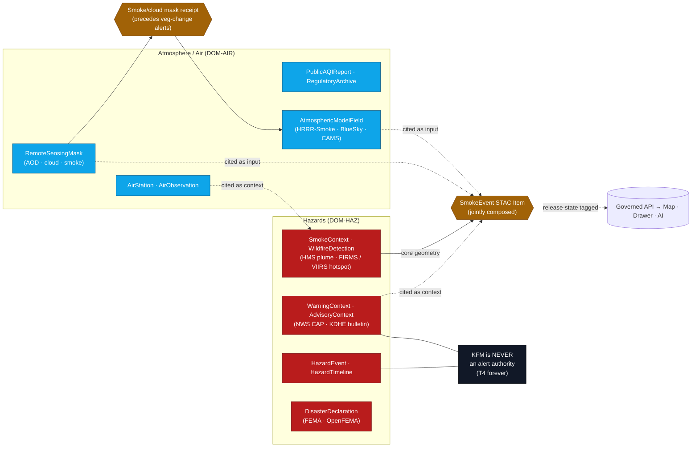
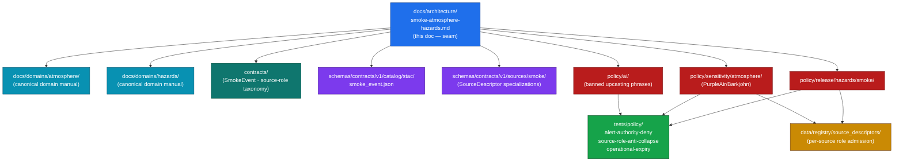

<!-- [KFM_META_BLOCK_V2]
doc_id: kfm://doc/architecture/smoke-atmosphere-hazards
title: Smoke at the Atmosphere ↔ Hazards Seam — Cross-Domain Architecture
type: standard
version: v1.0
status: draft
owners: TODO-architecture-steward-and-dom-air-and-dom-haz-stewards
created: 2026-05-25
updated: 2026-05-25
policy_label: public
related:
  - ./sensitivity.md
  - ./sensitivity-tiers.md
  - ./connected-dots-architecture-brief.md
  - ./contract-schema-policy-split.md
  - ./governed-api.md
  - ./maplibre-3d.md
  - ../domains/atmosphere/
  - ../domains/hazards/
  - ../doctrine/directory-rules.md
  - ../../policy/release/hazards/README.md
  - ../../policy/sensitivity/atmosphere/README.md
  - ../../schemas/contracts/v1/sources/smoke/
  - ../../schemas/contracts/v1/catalog/stac/
  - ../../KFM_Encyclopedia.md
  - ../../Kansas_Frontier_Matrix_-_Domains_v1_1___Pass_23_32_Consolidated_Atlas.md
tags:
  - kfm
  - architecture
  - cross-domain
  - atmosphere
  - air-quality
  - hazards
  - smoke
  - wildfire
  - eo
  - stac
  - source-role
  - alert-authority
notes:
  - "Cross-domain architecture doc covering the Atmosphere/Air ↔ Hazards seam where smoke is jointly described. Atmosphere/Air owns observation and air-quality reporting; Hazards owns the hazard-event narrative. Neither domain owns smoke alone."
  - "Doctrinal anchors: Atlas v1.1 Ch. 11 (Atmosphere/Air, [DOM-AIR]); Atlas v1.1 Ch. 12 (Hazards, [DOM-HAZ]); Atlas v1.1 §24.4.9 (Atmosphere → Hazards edges); §24.4.10 (Hazards → all edges); §24.5.2 (Hazards T4-forever alert-authority boundary); KFM Encyclopedia §11; Components Pass 10 §C10.b (Air Quality Stack). Smoke-event composition (FIRMS + HMS + NWS CAP) is PROPOSED per Atlas cards KFM-P13-PROG-0014 and KFM-P13-PROG-0015."
  - "KFM is NEVER an alert authority. The Hazards T4-forever boundary is permanent; operational warning products are contextual only and not for life safety."
  - "Authoring session: docs-only. No mounted repository, CI run, workflow, dashboard, runtime log, or release artifact was inspected. Implementation-maturity claims are bounded per the current-session evidence limit."
  - "Path placement flag: cross-domain architecture treatments are unusual under docs/architecture/; this file is justified as architecture about a *seam*, not domain content. A per-domain treatment may still be appropriate at docs/domains/atmosphere/smoke.md and docs/domains/hazards/smoke.md. See Section 2 for reconciliation."
[/KFM_META_BLOCK_V2] -->

<a id="top"></a>

# Smoke at the Atmosphere ↔ Hazards Seam — Cross-Domain Architecture

> **One topic, two responsibility roots, one set of trust invariants.** Smoke crosses Atmosphere/Air (observation, air-quality, low-cost sensors, model fields) and Hazards (wildfire detection, smoke plume buffers, fire/smoke timeline). This doc maps the seam, names the joint-ownership rules, and binds them to the deny-by-default posture so no surface — map, drawer, AI text, export, alert chip — can present KFM as an emergency-alert authority.


-critical?style=flat-square)


[](#)
[](#)

> [!CAUTION]
> **KFM is never an emergency-alert authority.** The Hazards T4-forever boundary (Atlas v1.1 §24.5.2) holds for smoke. KFM publishes smoke as **historical context** or **operational context with stale-state disclaimers**. No code path, doc, popup, label, export, AI text, or 3D scene may present KFM smoke content as life-safety instruction. This boundary is permanent and not negotiable by any per-domain policy.

> [!IMPORTANT]
> **This is doctrine-rank architecture, not implementation proof.** The cross-domain edges, source-role rules, and alert-authority boundary are CONFIRMED from Atlas v1.1 §24.4.9 / §24.4.10 / §24.5.2 and the [DOM-AIR] / [DOM-HAZ] chapters. Concrete schema paths, policy bundles, validator names, and CI surfaces are **PROPOSED** until verified in a mounted repository. The architecture maps the seam; it does not prove enforcement.

---

## Contents

- [1. Purpose & scope](#1-purpose--scope)
- [2. Why smoke is a cross-domain problem](#2-why-smoke-is-a-cross-domain-problem)
- [3. Domain ownership map](#3-domain-ownership-map)
- [4. Source families across the seam](#4-source-families-across-the-seam)
- [5. The smoke-events composition pattern](#5-the-smoke-events-composition-pattern)
- [6. Source roles and anti-collapse](#6-source-roles-and-anti-collapse)
- [7. The alert-authority boundary](#7-the-alert-authority-boundary)
- [8. Air-quality stack: PurpleAir + Barkjohn correction](#8-air-quality-stack-purpleair--barkjohn-correction)
- [9. Smoke and cloud masking for vegetation-change products](#9-smoke-and-cloud-masking-for-vegetation-change-products)
- [10. Lifecycle integration](#10-lifecycle-integration)
- [11. Sensitivity posture](#11-sensitivity-posture)
- [12. Per-surface enforcement](#12-per-surface-enforcement)
- [13. Anti-patterns](#13-anti-patterns)
- [14. Where this lives in the repository](#14-where-this-lives-in-the-repository)
- [15. Verification backlog](#15-verification-backlog)
- [16. Related docs](#16-related-docs)
- [Appendix A — Smoke glossary and source-role assignments](#appendix-a--smoke-glossary-and-source-role-assignments)

---

## 1. Purpose & scope

Smoke is the cleanest worked example of a KFM topic that **cannot live in a single domain lane**. It mixes air-quality observation (Atmosphere/Air), satellite hotspot detection (Hazards), forecast model output (Atmosphere/Air or Hazards depending on framing), and emergency-warning text (Hazards). Treating it as either a pure-air-quality or pure-hazard story collapses source roles and creates the conditions for the most dangerous anti-pattern KFM doctrine names: **KFM presented as an emergency-alert authority.**

This document is the **architectural contract** for that seam.

**In scope.**
- The Atmosphere/Air ↔ Hazards seam, as it concerns smoke.
- The joint source-family map (atmosphere-owned vs hazards-owned vs jointly-cited).
- The smoke-events composition pattern (FIRMS + HMS + NWS CAP → `SmokeEvent` STAC Item).
- Source-role rules at the seam — observed sensor, remote-sensing detection, modeled derivative, operational warning, regulatory context.
- The alert-authority boundary and stale-state posture.
- The PurpleAir-with-Barkjohn-correction pattern as a canonical example of a low-cost-sensor / regulatory-monitor reconciliation.
- Smoke/cloud masking as a precondition for vegetation-change publication.
- Lifecycle integration; sensitivity posture; per-surface enforcement; anti-patterns.

**Out of scope.**
- Either domain's full canonical reference (see `docs/domains/atmosphere/` and `docs/domains/hazards/`).
- The T0–T4 tier scheme mechanics (see [`./sensitivity-tiers.md`](./sensitivity-tiers.md)).
- The umbrella sensitivity architecture (see [`./sensitivity.md`](./sensitivity.md)).
- Concrete Rego/OPA modules (live in `policy/release/hazards/`, `policy/sensitivity/atmosphere/`).
- UI affordances (live with the apps).

[↑ Back to top](#top)

---

## 2. Why smoke is a cross-domain problem

Smoke does not have a single source-role. Different sources tell different stories about the same physical event, and the architecture must hold each story at its correct role without collapsing them.

| Observation about smoke | Source-role | Owning domain | What the architecture must protect |
|---|---|---|---|
| Particulate concentration at a regulatory monitor | `OBSERVED_SENSOR` / `REGULATORY_ARCHIVE` | Atmosphere/Air | The reading is observation. It is not "the smoke event." |
| Particulate concentration at a community PurpleAir sensor | `LOW_COST_SENSOR` | Atmosphere/Air | Raw readings systematically overstate concentration; the Barkjohn correction is required before public exposure. |
| A satellite-detected hotspot (FIRMS / VIIRS) | `REMOTE_SENSING_DETECTION` | Hazards (fire) → Atmosphere/Air (cited as smoke input) | Detection is *candidate evidence of fire*, not proof that "smoke is at place X right now." |
| An HMS smoke plume polygon | `REMOTE_SENSING_DETECTION` (analyst-curated) | Hazards (SmokeContext) | Plume geometry is a snapshot; cadence matters; expired plumes cannot appear current. |
| HRRR-Smoke / BlueSky forecast field | `ATMOSPHERIC_MODEL_FIELD` / `modeled_derivative` | Atmosphere/Air (model) cited by Hazards | Model output is *not observation*. Source-role anti-collapse prohibits paraphrasing it as observed. |
| An NWS air-quality / smoke advisory text | `ALERT_AND_ADVISORY_CONTEXT` / `operational_advisory` | Hazards (warning context) | KFM cites it; KFM is not its issuing authority. Stale-state and expiry must be visible. |
| A public AQI report | `PUBLIC_AQI_REPORT` | Atmosphere/Air | Cited at the AQI's stated time; never re-asserted as a fresh fact. |
| A CAMS / ECMWF atmospheric composition field | `ATMOSPHERIC_MODEL_FIELD` | Atmosphere/Air | Model field; never observation. |

> [!NOTE]
> **Collapsing any of these roles is the architecture failure.** The most common drift is paraphrasing a *model field* or a *forecast* as if it were an observed concentration. The Source-Role Anti-Collapse Register (Atlas v1.1 §24.1) is the doctrinal guardrail; the AI policy bundle and validator fixtures are the enforcement layer.

[↑ Back to top](#top)

---

## 3. Domain ownership map

Atlas v1.1 §24.4.9 names the Atmosphere → Hazards edge explicitly: **"Smoke context, AOD raster, and weather observations are cited as hazard inputs."** §24.4.10 names the Hazards → all edge: **"Hazard event context is cited; KFM is never an alert authority."** The seam is real and bounded.



| Atmosphere/Air owns | Hazards owns | Jointly cited |
|---|---|---|
| `AirStation`, `AirObservation`, `PublicAQIReport`, `RegulatoryArchive`, `LowCostSensor`, `AtmosphericModelField`, `RemoteSensingMask`, `MeteorologicalContext` | `HazardEvent`, `HazardObservation`, `WarningContext`, `AdvisoryContext`, `DisasterDeclaration`, `SmokeContext`, `WildfireDetection`, `HazardTimeline`, `ImpactArea` | `SmokeEvent` STAC Item (PROPOSED), smoke/cloud mask receipts, joint Evidence Drawer payloads |

> [!IMPORTANT]
> **Atmosphere/Air does not own the hazard narrative; Hazards does not own the regulatory air-quality archive.** When the two are cited together, each citation carries its *owning-domain* source role. The composition object (`SmokeEvent`) is jointly held but is **published from Hazards** because it is, in its narrative shape, a hazard story. The atmosphere-side citations attached to it stay atmosphere-rooted.

[↑ Back to top](#top)

---

## 4. Source families across the seam

The following table consolidates the [DOM-AIR] and [DOM-HAZ] source-family lists from Atlas v1.1 Ch. 11 and Ch. 12, plus the Kansas air-quality stack from Components Pass 10 §C10-02. All rights / freshness / sensitivity assertions are **NEEDS VERIFICATION** per the corpus.

| Source family | Owning domain | Role | Notes |
|---|---|---|---|
| **EPA AirNow API** | Atmosphere/Air | `PUBLIC_AQI_REPORT` | Real-time AQI for public surfaces; cited at its stated time. |
| **EPA AQS API** | Atmosphere/Air | `REGULATORY_ARCHIVE` | Regulatory-grade monitor data with full QA/QC. |
| **KDHE bulletins** | Atmosphere/Air ↔ Hazards | `operational_advisory` | Kansas-specific advisories; carried as warning context. |
| **PurpleAir** | Atmosphere/Air | `LOW_COST_SENSOR` | Raw values overstate; **Barkjohn correction required**; preserve corrected-and-uncorrected pair. |
| **HRRR-Smoke** | Atmosphere/Air | `ATMOSPHERIC_MODEL_FIELD` | NOAA smoke forecast model; **model field, not observation**. |
| **BlueSky** | Atmosphere/Air | `ATMOSPHERIC_MODEL_FIELD` | Forecast product for wildfire smoke. |
| **CAMS / ECMWF-family** | Atmosphere/Air | `ATMOSPHERIC_MODEL_FIELD` | Model fields; not observation. |
| **NOAA HMS Fire and Smoke** | Hazards | `REMOTE_SENSING_DETECTION` (analyst-curated) | Plume polygons; cadence-bounded; expiry matters. |
| **NASA FIRMS active fire** | Hazards | `REMOTE_SENSING_DETECTION` | Satellite hotspot points; candidate evidence of fire. |
| **VIIRS fire / hotspot** | Hazards | `REMOTE_SENSING_DETECTION` | Same role as FIRMS; different satellite cadence. |
| **GOES / ABI AOD** | Atmosphere/Air | `REMOTE_SENSING_DETECTION` | Aerosol Optical Depth raster; atmosphere-rooted. |
| **NWS alerts / warnings / advisories / watches** | Hazards | `operational_warning` / `operational_advisory` / `operational_watch` | KFM **cites**; KFM is **not** the issuing authority. |
| **NOAA Storm Events / NCEI** | Hazards | `historical_event_record` | Historical hazard archive. |
| **FEMA Disaster Declarations / OpenFEMA** | Hazards | `administrative_declaration` | Administrative record; not an alert. |
| **OpenAQ-like aggregators** | Atmosphere/Air | `OBSERVED_SENSOR` (depending on origin) | Federated; role depends on underlying source. |
| **Kansas / local emergency context** | Hazards | `regulatory_context` | Kansas-specific; cited, not authoritative. |

> [!WARNING]
> **The line between atmosphere-rooted and hazards-rooted is *source-role*, not *topic*.** "Smoke" can be air-quality observation, wildfire detection, model forecast, or warning text. The source role decides the lane. A forecast is never observation; a detection is never an alert; an advisory is never a regulatory archive.

[↑ Back to top](#top)

---

## 5. The smoke-events composition pattern

Atlas card **KFM-P13-PROG-0014** (PROPOSED) describes modeling FIRMS + HMS + NWS CAP joins as **`SmokeEvent` STAC Items** with plume geometry, source assets, event properties, material-change metrics, and run receipts. Atlas card **KFM-P13-PROG-0015** (PROPOSED) names the join rules.

### 5.1 PROPOSED join rules (KFM-P13-PROG-0015)

| Join | Window / threshold | Output |
|---|---|---|
| **FIRMS hotspot → HMS plume buffer** | Within **500 m spatial** and **6 hours temporal**. | Hotspot becomes a candidate vertex of an HMS plume polygon. |
| **NWS CAP alert → SmokeEvent** | Tie by **geometric intersection** or by **FIPS** containment. | The CAP message is attached as `operational_advisory` context. |
| **Material-change flag (snapshot-to-snapshot)** | Threshold on **IoU**, **area delta**, **centroid shift**. | Re-emit a new `SmokeEvent` revision; otherwise debounce. |

### 5.2 PROPOSED `SmokeEvent` STAC Item shape

The atlas describes the item as carrying plume geometry, source assets, event properties, material-change metrics, and run receipts. Concrete field names are PROPOSED until the schema lands.

```json
{
  "type": "Feature",
  "stac_version": "1.0.0",
  "id": "smoke_event-<spec_hash>",
  "geometry": "<HMS plume polygon — generalized>",
  "properties": {
    "kfm:source_roles": {
      "hms": "REMOTE_SENSING_DETECTION",
      "firms_or_viirs": "REMOTE_SENSING_DETECTION",
      "nws_cap": "operational_advisory",
      "hrrr_smoke": "ATMOSPHERIC_MODEL_FIELD"
    },
    "kfm:material_change": {
      "iou": 0.42,
      "area_delta_km2": 187.5,
      "centroid_shift_km": 12.3
    },
    "kfm:operational_state": "expired | current | stale",
    "kfm:not_alert_authority": true
  },
  "assets": {
    "hms_plume": { "href": "...", "type": "application/geo+json" },
    "firms_hotspots": { "href": "...", "type": "application/geo+json" },
    "cap_alert": { "href": "...", "type": "application/cap+xml" }
  },
  "links": [
    { "rel": "evidence", "href": "kfm://evidence/<bundle-id>" },
    { "rel": "policy-decision", "href": "kfm://policy/<decision-id>" },
    { "rel": "rollback-target", "href": "kfm://release/<prior-manifest>" }
  ]
}
```

> [!NOTE]
> **The example is illustrative.** Field names, namespaces, and the inclusion of a `kfm:not_alert_authority` flag are PROPOSED. The schema home is PROPOSED as `schemas/contracts/v1/catalog/stac/smoke_event.json` (Directory Rules §4, Step-1 "machine shape" → `schemas/`); the policy gates are PROPOSED at `policy/release/hazards/smoke/` and `policy/sensitivity/atmosphere/smoke/`.

### 5.3 Cadence and freshness

- **HMS** updates on an analyst cadence (multiple times per day during active fire conditions).
- **FIRMS / VIIRS** cadence is satellite-pass-driven (≥ 2–4 passes per day with mid-latitude swath gaps).
- **NWS CAP** is event-driven and time-boxed by the issuer.
- **HRRR-Smoke** runs hourly with a forecast horizon.

The published `SmokeEvent` carries the **least-fresh** cadence as its operational expiry, and the `kfm:operational_state` field surfaces expiry to every consuming surface.

[↑ Back to top](#top)

---

## 6. Source roles and anti-collapse

The Atlas v1.1 §24.1 Source-Role Anti-Collapse Register applies with particular force here because smoke is the topic where source-role collapse is *easiest*. Four anti-collapse rules govern the seam:

| Anti-collapse rule | Why it matters for smoke |
|---|---|
| **A model field never becomes an observation by promotion.** | HRRR-Smoke / BlueSky / CAMS are model fields. Paraphrasing "the model shows PM2.5 of 75 µg/m³ in Wichita" as "PM2.5 is 75 µg/m³ in Wichita" upcasts model → observation. |
| **A detection never becomes a fire by rendering.** | A FIRMS / VIIRS hotspot is `REMOTE_SENSING_DETECTION`. Rendering it as "a wildfire is at this location" upcasts detection → confirmed event. |
| **A forecast never becomes a warning.** | An HRRR-Smoke plume forecast is a *model* product. Presenting it as a warning conflates roles and drifts toward alert-authority posture. |
| **A low-cost sensor reading never becomes a regulatory measurement.** | PurpleAir without Barkjohn correction is not comparable to AQS. Presenting it as such drifts the regulatory-archive role. |

> [!WARNING]
> **Source-role upgrade by paraphrase is the dominant anti-pattern at this seam.** The AI policy bundle MUST ban known upcasting phrases (e.g., "smoke is at," "PM2.5 measured at," "wildfire detected at" when the underlying record is a detection or model field). `AIReceipt` sampling for drift is required; the Atlas v1.1 §24.1 ban list is the starting set.

### 6.1 Stale-state and operational expiry

Per [DOM-HAZ] §I: **operational warning products are contextual only and not for life safety; unknown source roles are quarantined; expired operational context cannot appear as current warning state.** This applies to every smoke-related warning, advisory, or CAP-derived context. Stale-state badges at every public surface (map, drawer, popup, AI text) are mandatory.

[↑ Back to top](#top)

---

## 7. The alert-authority boundary

This is the single most important architectural decision in this document. Atlas v1.1 §24.5.2:

> **Hazards — KFM as alert authority: T4 forever.** No transform permits KFM to act as an emergency-alert authority. The boundary holds.

| Property | Value |
|---|---|
| Default tier | **T4 forever** |
| Allowed transforms | **None.** No transform permits KFM to act as an emergency-alert authority. |
| Required gate | Policy boundary; deny at runtime. Enforced by `policy/release/hazards/` (PROPOSED). |
| Reading | KFM publishes smoke as **historical context** or **operational context with stale-state disclaimers**. Operational disclaimers and role labels are required at every surface. |

> [!CAUTION]
> **No tier transition, no policy, no UI affordance, and no AI output may present KFM smoke content as life-safety instruction or as an authoritative emergency alert.** This includes — but is not limited to — phrases like *"evacuate"*, *"shelter in place"*, *"current alert level"*, *"do not breathe"*, *"hazardous AQI in your area"*. KFM **cites** NWS / KDHE / NOAA advisories; it does not **issue** them. UI components must visibly label every advisory-derived element with its issuing authority and its expiry.

### 7.1 What this rules out

- Push notifications.
- "Alert subscriptions" or "alert me" UI flows.
- AI outputs that recommend evacuation, sheltering, or any specific safety action.
- "Current air quality at your location" framing without a regulatory-archive citation and the issuer's own expiry.
- Re-publishing a CAP message as if KFM issued it.
- Maintaining smoke layers past the issuer's stated expiry without a `stale` badge and a disclaimer.

### 7.2 What this permits

- Publishing **historical smoke events** with full provenance.
- Publishing **operational context** with explicit issuer attribution and stale-state visibility.
- Citing NWS / KDHE / NOAA / EPA materials with link-throughs to the issuer.
- Smoke-and-cloud **masking metadata** as part of vegetation-change products.
- Steward-review notes and AI summaries with `AIReceipt` and `cite-or-abstain` discipline.

[↑ Back to top](#top)

---

## 8. Air-quality stack: PurpleAir + Barkjohn correction

The Kansas air-quality stack from Components Pass 10 §C10-02 is the canonical pattern for low-cost-sensor / regulatory-monitor reconciliation. It is included here because smoke episodes are exactly when low-cost sensor coverage matters most.

| Element | Role | Pattern |
|---|---|---|
| **EPA AirNow** | `PUBLIC_AQI_REPORT` | Public-facing real-time AQI; cited at its stated time. |
| **EPA AQS** | `REGULATORY_ARCHIVE` | Regulatory-grade with full QA/QC. |
| **KDHE bulletins** | `operational_advisory` | Kansas-specific advisories; cited with issuer + expiry. |
| **PurpleAir + Barkjohn correction** | `LOW_COST_SENSOR` (with correction receipt) | Raw readings overstate concentration; Barkjohn correction is required; **corrected and uncorrected values are both preserved** so the correction is reversible and auditable. |
| **HRRR-Smoke / BlueSky** | `ATMOSPHERIC_MODEL_FIELD` | Forecast products; cited as model, never as observation. |

### 8.1 The Barkjohn-correction rule

Per C10-02:

- **PurpleAir terms of service have changed.** Bulk ingestion posture must be re-checked.
- **The Barkjohn correction is the published EPA regression** that reconciles PurpleAir to regulatory monitors.
- **The correction is versioned**; the version in use must be recorded in the run receipt.
- **The corrected-and-uncorrected pair is preserved** so the correction is reversible.

> [!IMPORTANT]
> **Publishing PurpleAir without the Barkjohn correction is a source-role collapse.** Uncorrected PurpleAir presented next to AQS without explicit role labels reads as comparable measurement, which it is not. A `TransformReceipt` recording the Barkjohn correction version is required; a `policy/sensitivity/atmosphere/purpleair_correction/` (PROPOSED) Rego bundle should `DENY` public release of uncorrected values.

### 8.2 What this looks like at the seam

During a smoke episode the architecture composes:

```text
HMS plume polygon (Hazards)
  + FIRMS / VIIRS hotspots (Hazards)
  + AirNow / AQS regulatory monitors (Atmosphere/Air)
  + PurpleAir corrected + uncorrected pair (Atmosphere/Air)
  + HRRR-Smoke forecast field (Atmosphere/Air, model)
  + NWS CAP advisories (Hazards, operational_advisory)
  ─────────────────────────────────────────────
  → SmokeEvent STAC Item (jointly cited)
  → Released via policy/release/hazards/smoke/ with stale-state badging
  → Drawer payload shows each citation at its own source-role
```

[↑ Back to top](#top)

---

## 9. Smoke and cloud masking for vegetation-change products

Atlas card **KFM-P2-PROG-0010** (PROPOSED) names a satellite-vegetation-change recipe that explicitly handles smoke and clouds so they **do not fake change**. This is where the smoke architecture reaches outside Atmosphere/Air ↔ Hazards into Habitat / Agriculture / Flora.

| Step | Why it matters |
|---|---|
| Ingest HLS (Harmonized Landsat Sentinel-2) / Landsat. | Foundation imagery. |
| Apply smoke-and-cloud detection-and-masking. | Smoke and cirrus can be hard to distinguish from real vegetation change at certain phenological windows. |
| Compute alerts **over masked imagery**. | Alerts must reflect change, not occlusion. |
| Each alert carries the masking decision, the reference period, and an uncertainty band. | Reviewers must be able to reproduce the masking decision. |
| **Policy-safe defaults exclude alerts that fail mask QA** or fall below an evidence-confidence threshold. | Fail-closed posture. |

> [!NOTE]
> **The recipe prefers exclusion over false-positive publication.** Vegetation change is high-public-interest, high-misinterpretation-risk content; an alert that turns out to be smoke or cloud is a worse outcome than no alert. The smoke-and-cloud mask receipt accompanies every vegetation-change alert.

[↑ Back to top](#top)

---

## 10. Lifecycle integration

The lifecycle invariant is CONFIRMED doctrine: `RAW → WORK / QUARANTINE → PROCESSED → CATALOG / TRIPLET → PUBLISHED`. The seam-specific behaviors below specialize that invariant for smoke.

| Gate | Seam-specific behavior |
|---|---|
| **Admission** | `SourceDescriptor` sets the source-role: `OBSERVED_SENSOR`, `LOW_COST_SENSOR`, `REGULATORY_ARCHIVE`, `PUBLIC_AQI_REPORT`, `ATMOSPHERIC_MODEL_FIELD`, `REMOTE_SENSING_DETECTION`, `operational_warning`, `operational_advisory`, `historical_event_record`. Unknown role → QUARANTINE. |
| **Normalization** | PurpleAir → Barkjohn-correction `TransformReceipt` (corrected + uncorrected pair retained). HMS plume normalization records the analyst-curation cadence. CAP messages parse into `operational_advisory` with expiry. |
| **Validation** | Source-role anti-collapse tests run. Smoke / cloud mask QA runs for any product that consumes raw EO imagery. Operational expiry / freshness tests run for any advisory-derived content. Emergency-alert denial tests run for any output that includes warning text. |
| **Catalog closure** | `SmokeEvent` STAC Item closes only when every cited source is resolvable through `EvidenceRef` → `EvidenceBundle`. Cross-domain edges (Atmosphere → Hazards) are recorded in the catalog matrix. |
| **Release** | Hazards-owned narrative releases via `policy/release/hazards/smoke/` (PROPOSED). Atmosphere-owned observations release via `policy/release/atmosphere/` (PROPOSED). Both paths enforce the alert-authority boundary. |
| **Correction** | A corrected CAP attribution, a Barkjohn-version change, or an HMS analyst revision triggers a `CorrectionNotice` with derivative invalidation. |
| **Rollback** | `RollbackCard` returns to the prior `ReleaseManifest`. Downstream tile caches, Drawer payloads, and AI summaries are invalidated. |

> [!IMPORTANT]
> **Promotion never upgrades a source role.** A model field that promotes through the gates is still a model field at PUBLISHED. A detection that promotes is still a detection. The release authority validates source-role preservation as part of the release gate; failure routes to QUARANTINE with reason code `ROLE_COLLAPSE` or `ROLE_DOWNCAST_FORBIDDEN`.

[↑ Back to top](#top)

---

## 11. Sensitivity posture

Smoke is **not** an inherently sensitive layer in the way that archaeological sites or living-person records are. The sensitivity concerns at this seam are different in character — they are about **misrepresentation** (presenting model as observed, detection as fire, advisory as alert), about **stale-state leakage** (expired warnings rendered as current), and about the **alert-authority boundary** (KFM acting as if it issues warnings). The companion docs handle the general posture; the table below applies that posture to smoke.

| Smoke object class | Default tier | Notes |
|---|---|---|
| Historical smoke events (post-issuer expiry, NCEI-style record) | **T0** | Public-safe with standard release. Cited with issuer attribution. |
| Active HMS plume during operational window | **T0 / T1** with stale-state badge | Public-safe with explicit cadence and expiry; the operational disclaimer is mandatory. |
| AirNow / AQS observations | **T0** | Public AQI is already public. Cite at issuer's time. |
| PurpleAir uncorrected | **T4** for public release; **T2** for reviewers | Public release requires the Barkjohn correction first. |
| PurpleAir Barkjohn-corrected | **T1** | Public-safe after correction; `TransformReceipt` records the Barkjohn version. |
| HRRR-Smoke / BlueSky / CAMS model fields | **T1** with role label | Public-safe as **model field**, never as observation. |
| FIRMS / VIIRS hotspot detection | **T1** with detection label | Public-safe as **detection**, never as confirmed fire location. |
| NWS / KDHE advisory text | **T1** | Cited with issuer and expiry; KFM is not the issuer. |
| **KFM as alert authority for smoke** | **T4 forever** | Permanent. See §7. |

> [!CAUTION]
> **A T0 release for a stale advisory is a defect, not a publication.** The operational expiry is part of the release decision; once expired, the artifact must carry a `stale` badge or be retracted to T4 with a `CorrectionNotice`. The release authority is responsible for monitoring expiry; the layer-manifest resolver enforces release-state tagging at runtime.

[↑ Back to top](#top)

---

## 12. Per-surface enforcement

Smoke is the topic where **cross-surface lint** matters most. A tier-correct canonical layer can still drift into alert-authority posture through popup text, AI summary, or label drift. The invariants below apply per surface.

| Surface | Required posture | Anti-pattern |
|---|---|---|
| **Map (tiles, layers)** | Smoke plume polygons rendered with issuer attribution; cadence and expiry visible. Layer-manifest resolver tags tiles with release state. Forecast layers visually distinct from observation layers (legend, style, badge). | Forecast and observation rendered in the same style. Expired plume rendered as current. |
| **Popups / Labels** | Popup names issuer, role, time, expiry. Labels do not assert events ("Wildfire at X" is prohibited; "FIRMS hotspot detected, 2026-05-23 14:32 UTC" is correct). | Popup as alert message. Label upcasting detection to event. |
| **Drawer / Story Nodes** | Each cited source carries its own role chip. SmokeEvent narrative resolves to canonical `EvidenceBundle`. Issuer + expiry visible. | Drawer presenting all sources without role chips. Story Node language drifting toward instruction. |
| **Exports / Screenshots / Reports** | Citations preserve role labels and issuer attributions. Expiry recorded at export time. | Uncited smoke screenshot used as proof. Report quoting NWS advisory without expiry. |
| **AI surface / Focus Mode** | Reads only released `EvidenceBundle`. Cite-or-abstain. `AIReceipt` per output. Banned phrases enforced at output validation. | AI summary using "is" instead of "was forecast to be". AI recommending action. |
| **3D scenes** | Generalized plume geometry only. Reality Boundary Note distinguishes observed plume from modeled forecast. | 3D scene showing model field as observed plume. |
| **Notifications / push (if any)** | **Prohibited for smoke.** | Push-style "alert" UI flow. |

> [!IMPORTANT]
> **The map shell is not the alert authority.** Public attention focuses on rendered surfaces — that's exactly where alert-authority drift happens. Renderer-boundary tests, layer-manifest resolution, and release-state-tagged tiles are mandatory; visual distinctness between forecast and observation is part of style governance, not a presentation choice.

[↑ Back to top](#top)

---

## 13. Anti-patterns

<details>
<summary><strong>Cross-domain smoke anti-pattern register</strong> (click to expand)</summary>

| Anti-pattern | Why it violates the posture |
|---|---|
| **Treating HRRR-Smoke / BlueSky / CAMS as observation.** | Source-role upgrade: model → observation. Violates anti-collapse. |
| **Rendering FIRMS / VIIRS hotspots as confirmed wildfires.** | Source-role upgrade: detection → event. Violates anti-collapse. |
| **Publishing uncorrected PurpleAir alongside AQS as if comparable.** | Source-role collision: low-cost sensor presented as regulatory archive. Barkjohn correction is required. |
| **Re-publishing an NWS CAP advisory without issuer attribution and expiry.** | KFM-as-alert-authority drift. Atlas v1.1 §24.5.2 T4-forever boundary. |
| **Maintaining a smoke layer past the issuer's stated expiry without a `stale` badge.** | Expired operational context appearing as current. Violates [DOM-HAZ] §I. |
| **Push notifications / "alert me" UI flows for smoke.** | Alert-authority posture. Permanently denied. |
| **AI text that says "smoke is at X" when the source is a forecast.** | Upcasting by paraphrase. AI policy ban-list must catch this. |
| **AI text that recommends evacuation, sheltering, or any specific safety action.** | Alert-authority posture via AI. Permanently denied. |
| **Vegetation-change alerts published over unmasked smoke / cloud imagery.** | Violates KFM-P2-PROG-0010 mask QA. False-positive vegetation change. |
| **A SmokeEvent STAC Item without explicit `kfm:source_roles` per asset.** | Source-role provenance lost at the composition object. |
| **Style filters used to hide expired plumes instead of release-state demotion.** | Hidden-only-by-style anti-pattern (sensitivity §6). Layer still in tiles. |
| **AOD raster cited as "smoke."** | AOD measures aerosol optical depth — a broader physical quantity. Equating it with smoke is a source-role collision. |
| **Promotion that "upgrades" a source role mid-lifecycle.** | Source role is fixed at admission; never upgraded by promotion. |

</details>

[↑ Back to top](#top)

---

## 14. Where this lives in the repository

This doc is **architecture about a seam**, not a domain manual. Concrete files are split per Directory Rules across `schemas/`, `policy/`, `contracts/`, `tests/`, and the per-domain `docs/domains/` directories. All paths are **PROPOSED** per Directory Rules §2.5.



| Responsibility | Root | What lives here |
|---|---|---|
| Doctrine — seam | `docs/architecture/smoke-atmosphere-hazards.md` (this doc) | Cross-domain architecture; source-role rules; alert-authority boundary. |
| Doctrine — Atmosphere/Air domain | `docs/domains/atmosphere/` (PROPOSED) | Canonical Atmosphere/Air manual. |
| Doctrine — Hazards domain | `docs/domains/hazards/` (PROPOSED) | Canonical Hazards manual. |
| Object-family meaning | `contracts/` | What `SmokeEvent`, `SmokeContext`, `AirObservation`, `PUBLIC_AQI_REPORT`, source-role taxonomy *mean*. |
| Object-family shape | `schemas/contracts/v1/catalog/stac/smoke_event.json`; `schemas/contracts/v1/sources/smoke/` | STAC Item shape; per-source `SourceDescriptor` specializations. |
| Enforcement — release (Hazards) | `policy/release/hazards/smoke/` | Alert-authority denial; operational expiry; CAP attribution. |
| Enforcement — sensitivity (Atmosphere) | `policy/sensitivity/atmosphere/` | PurpleAir / Barkjohn correction; uncorrected → DENY public. |
| Enforcement — AI | `policy/ai/` | Cite-or-abstain; banned upcasting phrases for smoke. |
| Rights & source registry | `data/registry/source_descriptors/` | Per-source role admission for FIRMS, HMS, NWS CAP, AirNow, AQS, PurpleAir, HRRR-Smoke, BlueSky, CAMS, VIIRS, GOES/ABI AOD, KDHE. |
| Enforceability proof | `tests/policy/` | Alert-authority-deny fixtures; source-role anti-collapse fixtures; operational-expiry fixtures; PurpleAir-uncorrected-deny fixture; smoke/cloud mask QA fixtures. |

> [!NOTE]
> **The seam doc is intentionally short on file paths.** Each owning domain's `docs/domains/<domain>/` manual carries its own canonical reference. This file resolves the *cross-domain* questions that neither domain manual can resolve alone.

[↑ Back to top](#top)

---

## 15. Verification backlog

| ID | Item | Evidence that would settle it |
|---|---|---|
| **VB-SMK-01** | `docs/domains/atmosphere/` and `docs/domains/hazards/` exist with per-domain READMEs that reference this seam doc | Repo tree listing |
| **VB-SMK-02** | `policy/release/hazards/smoke/` enforces the T4-forever alert-authority boundary at runtime, including for AI outputs | Bundle inspection; negative-fixture coverage |
| **VB-SMK-03** | `policy/sensitivity/atmosphere/purpleair_correction/` (PROPOSED name) denies public release of uncorrected PurpleAir values | Bundle inspection; fixture coverage |
| **VB-SMK-04** | `schemas/contracts/v1/catalog/stac/smoke_event.json` defines the `SmokeEvent` STAC Item including `kfm:source_roles` and `kfm:operational_state` | Schema file inspection |
| **VB-SMK-05** | Source-role anti-collapse fixtures cover every upcasting pair named in §6: model→observation, detection→event, forecast→warning, low-cost→regulatory | Fixture inventory; CI green |
| **VB-SMK-06** | Operational-expiry validator rejects advisory-derived layers past issuer expiry without a `stale` badge | Test fixture + validator behavior |
| **VB-SMK-07** | AI policy ban-list includes smoke-specific upcasting phrases | `policy/ai/` bundle + `AIReceipt` sampling |
| **VB-SMK-08** | The Barkjohn correction version is recorded in every PurpleAir `TransformReceipt` and pinned in a policy bundle | Receipt + bundle inspection |
| **VB-SMK-09** | Smoke / cloud mask QA fixtures gate vegetation-change alert publication (KFM-P2-PROG-0010) | Fixture inventory |
| **VB-SMK-10** | Source-Role Anti-Collapse Register (Atlas v1.1 §24.1) is reflected in `policy/ai/` ban list | Bundle inspection |
| **VB-SMK-11** | PurpleAir terms-of-service posture has been re-checked since the C10-02 advisory (Components Pass 10) | Source-watch receipt; SourceDescriptor `terms_status` |
| **VB-SMK-12** | Renderer styles visibly distinguish forecast layers from observation layers (different stroke / fill / legend / badge) | Style file inspection + visual regression |
| **VB-SMK-13** | Owner / CODEOWNERS entries name the architecture steward, the [DOM-AIR] steward, and the [DOM-HAZ] steward for this file | `.github/CODEOWNERS` inspection |
| **VB-SMK-14** | This doc is registered in `control_plane/document_registry.yaml` | Registry inspection |
| **VB-SMK-15** | An ADR exists for the `SmokeEvent` composition pattern (joint Atmosphere ↔ Hazards ownership; release lane via Hazards) | `docs/adr/` listing |

[↑ Back to top](#top)

---

## 16. Related docs

| Path | Role |
|---|---|
| [`./sensitivity.md`](./sensitivity.md) | Umbrella sensitivity architecture; alert-authority and source-role rules sit inside it. |
| [`./sensitivity-tiers.md`](./sensitivity-tiers.md) | T0–T4 scheme; defines T4-forever for Hazards as alert authority. |
| `docs/architecture/connected-dots-architecture-brief.md` | System-wide architecture brief; smoke is a worked example of the publication-controls layer. |
| `docs/architecture/contract-schema-policy-split.md` | Why `SmokeEvent` meaning lives in `contracts/`, shape in `schemas/`, release decision in `policy/release/`. |
| `docs/architecture/governed-api.md` | The only public surface; receives smoke-aware `PolicyDecision` outcomes. |
| `docs/architecture/maplibre-3d.md` | Renderer doctrine; honors release-state-tagged smoke layers and forecast/observation visual distinctness. |
| `docs/domains/atmosphere/` | Canonical [DOM-AIR] domain manual (PROPOSED home). |
| `docs/domains/hazards/` | Canonical [DOM-HAZ] domain manual (PROPOSED home). |
| `docs/doctrine/directory-rules.md` | Placement law. |
| `policy/release/hazards/README.md` | PROPOSED per-root README enforcing the T4-forever boundary. |
| `policy/sensitivity/atmosphere/README.md` | PROPOSED per-root README for atmosphere-rooted sensitivity. |
| `policy/ai/README.md` | PROPOSED per-root README for cite-or-abstain and source-role anti-collapse. |
| `KFM_Encyclopedia.md` §11 | Sensitive / Deny-by-Default Posture. |
| `Kansas_Frontier_Matrix_-_Domains_v1_1___Pass_23_32_Consolidated_Atlas.md` Ch. 11 (Atmosphere/Air); Ch. 12 (Hazards); §24.4.9 (Atmosphere → Hazards edges); §24.4.10 (Hazards → all edges); §24.5.2 (Hazards T4-forever boundary) | Doctrinal anchors. |

[↑ Back to top](#top)

---

## Appendix A — Smoke glossary and source-role assignments

<details>
<summary><strong>Smoke vocabulary at the seam</strong> (click to expand)</summary>

| Term | Owning domain | Source role | Notes |
|---|---|---|---|
| `SmokeEvent` (composition) | Released from Hazards | (composes multiple) | Joint atmosphere ↔ hazards STAC Item. |
| `SmokeContext` | Hazards | `REMOTE_SENSING_DETECTION` (analyst-curated) | HMS-derived plume context. |
| `WildfireDetection` | Hazards | `REMOTE_SENSING_DETECTION` | FIRMS / VIIRS hotspot. |
| `WarningContext` | Hazards | `operational_warning` | NWS CAP-derived. |
| `AdvisoryContext` | Hazards | `operational_advisory` | NWS or KDHE advisory. |
| `AirStation` | Atmosphere/Air | (identity) | Regulatory / public network station. |
| `AirObservation` | Atmosphere/Air | `OBSERVED_SENSOR` | Measured concentration. |
| `PublicAQIReport` | Atmosphere/Air | `PUBLIC_AQI_REPORT` | AirNow AQI. |
| `RegulatoryArchive` | Atmosphere/Air | `REGULATORY_ARCHIVE` | EPA AQS. |
| `LowCostSensor` | Atmosphere/Air | `LOW_COST_SENSOR` | PurpleAir; **Barkjohn required**. |
| `AtmosphericModelField` | Atmosphere/Air | `ATMOSPHERIC_MODEL_FIELD` | HRRR-Smoke / BlueSky / CAMS. |
| `RemoteSensingMask` | Atmosphere/Air | (transform) | Smoke / cloud mask for EO products. |
| `MeteorologicalContext` | Atmosphere/Air | (context) | Wind, humidity, temperature. |
| `AOD raster` (GOES/ABI) | Atmosphere/Air | `REMOTE_SENSING_DETECTION` | Aerosol Optical Depth; **not "smoke"**. |
| `historical_event_record` | Hazards | `historical_event_record` | NOAA Storm Events / NCEI. |
| `administrative_declaration` | Hazards | `administrative_declaration` | FEMA disaster declaration. |
| `modeled_derivative` | Hazards (when hazards-rooted) | `modeled_derivative` | Hazard exposure / resilience model output. |
| `unknown_unclassified` | Hazards | (quarantine) | Default for unresolved source role. |

</details>

[↑ Back to top](#top)

---

**Related docs:** [sensitivity](./sensitivity.md) · [sensitivity-tiers](./sensitivity-tiers.md) · [connected-dots](./connected-dots-architecture-brief.md) · [directory-rules](../doctrine/directory-rules.md) · [governed-api](./governed-api.md) · [maplibre-3d](./maplibre-3d.md) · [KFM Encyclopedia](../../KFM_Encyclopedia.md)

**Last updated:** 2026-05-25 · **Doc version:** v1.0 · **Meta block:** v2 · [↑ Back to top](#top)
