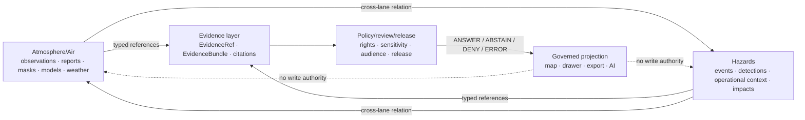

<!-- [KFM_META_BLOCK_V2]
doc_id: kfm://doc/architecture/smoke-atmosphere-hazards
title: Smoke at the Atmosphere ↔ Hazards Seam — Repository-Grounded Architecture
type: architecture
version: v2.0.0
status: "draft; repository-grounded; cross-domain; structural-migration-hold; no-live-source; no-release; no-publication"
owners:
  - "@bartytime4life — verified CODEOWNERS review route"
  - "NEEDS VERIFICATION — Atmosphere, Hazards, source-role, evidence, policy, security, release, map/UI, and documentation stewardship"
created: 2026-05-25
updated: 2026-08-19
policy_label: public
owning_root: docs/
current_path: docs/architecture/smoke-atmosphere-hazards.md
responsibility: >
  Explain the Atmosphere/Air × Hazards smoke seam, preserve domain ownership,
  source-role and temporal distinctions, define the not-for-life-safety boundary,
  record current repository maturity, and route future implementation to the
  correct responsibility roots without becoming semantic, schema, policy,
  evidence, release, runtime, or publication authority.
truth_posture: >
  CONFIRMED current path, accepted Directory Rules authority, current domain and
  contract documentation, permissive SmokeContext schema scaffold, README-only
  cross-domain smoke validator lanes, bounded synthetic Atmosphere validation,
  bounded synthetic Hazards materiality validation, documentation-only or
  inactive smoke connector/data lanes, and current documentation-convergence
  HOLD / PROPOSED composite smoke object semantics, source activation, closed
  smoke schema, smoke-specific cross-domain validator, operational freshness
  policy, EvidenceBundle closure, released map/UI/AI behavior, correction
  propagation, and structural migration / UNKNOWN live smoke ingestion,
  production smoke payloads, current-source fitness, public release, deployment,
  operational metrics, and accountable specialist stewardship.
evidence_snapshot:
  repository: bartytime4life/Kansas-Frontier-Matrix
  base_ref: main
  base_commit: 7ef1597779774d80346f81ecd8104b720797c587
  target_prior_blob: eaa2dd031e4325404fb6dae002feccde0e222833
  directory_rules_blob: fd49a0b83e55cef52c1124281f093e263526898d
convergence:
  current_outcome: HOLD
  proposed_target: docs/architecture/cross-domain/smoke-atmosphere-hazards.md
  reason: >
    The architecture convergence plan proposes a cross-domain target only after
    document identity, no-loss content, inbound references, domain links,
    source-role and temporal distinctions, validation, compatibility, and
    rollback close. This revision performs no move, rename, redirect, or deletion.
related:
  - ./README.md
  - ./document-convergence-plan.md
  - ./source-role-anti-collapse.md
  - ./source-roles.md
  - ./evidence-drawer.md
  - ./contract-schema-policy-split.md
  - ./governed-api/README.md
  - ./map-master/README.md
  - ../doctrine/directory-rules.md
  - ../adr/ADR-0029-adopt-directory-governance-standard-v2.md
  - ../domains/atmosphere/README.md
  - ../domains/hazards/README.md
  - ../domains/hazards/LIFE_SAFETY_BOUNDARY.md
  - ../domains/hazards/PUBLICATION_AND_BOUNDARY.md
  - ../../contracts/domains/atmosphere/SmokeContext.md
  - ../../contracts/domains/atmosphere/AODRaster.md
  - ../../contracts/domains/atmosphere/PM25Observation.md
  - ../../contracts/domains/atmosphere/AdvisoryContext.md
  - ../../contracts/domains/atmosphere/airnow_aqs_reconciliation.md
  - ../../schemas/contracts/v1/domains/atmosphere/SmokeContext.schema.json
  - ../../tools/validators/air-hazards/README.md
  - ../../tools/validators/atmosphere_hazards/README.md
  - ../../tools/validators/domains/atmosphere/smoke/README.md
  - ../../tools/validators/domains/atmosphere/validate_low_cost_sensor_caveats.py
  - ../../tools/validators/domains/atmosphere/validate_observed_modeled_separation.py
  - ../../tests/domains/atmosphere/test_atmosphere_smoke.py
  - ../../tests/domains/atmosphere/test_low_cost_sensor_caveat_required.py
  - ../../tests/domains/atmosphere/test_observed_modeled_separation.py
  - ../../.github/workflows/domain-atmosphere.yml
  - ../../.github/workflows/domain-hazards.yml
  - ../../connectors/hrrr_smoke/README.md
  - ../../connectors/noaa-hms-smoke/README.md
  - ../../data/raw/atmosphere/modeled/hrrr-smoke/README.md
  - ../../data/raw/hazards/firms/README.md
  - ../../data/processed/atmosphere/smoke_context/README.md
tags:
  - kfm
  - architecture
  - cross-domain
  - atmosphere
  - hazards
  - smoke
  - source-role
  - temporal
  - evidence
  - not-life-safety
  - correction
  - rollback
  - convergence
notes:
  - "Same-path semantic modernization only; no document move, rename, redirect, tombstone, or deletion."
  - "All prior major-section anchors are preserved through unchanged headings or explicit compatibility anchors."
  - "The old jointly-owned SmokeEvent framing is narrowed: every artifact requires one authority owner; a composite smoke object remains HOLD until semantics, ownership, identity, and lifecycle are decided."
  - "The prior PurpleAir/Barkjohn mandate is retained as design lineage, not current repository authority; the current executable profile is provider-neutral, synthetic, fixture-only, and scientifically non-authoritative."
  - "No source is activated, no smoke payload is added, no policy decision is accepted, and no release, deployment, alert, or publication action occurs."
[/KFM_META_BLOCK_V2] -->

<a id="top"></a>
<a id="smoke-atmosphere-hazards"></a>

# Smoke at the Atmosphere ↔ Hazards Seam

> **Operating rule.** Smoke-related observations, reports, detections, masks, model fields, advisories, and hazard context may be composed only when each input keeps its own identity, domain owner, source role, temporal support, uncertainty, evidence, policy, and release state. A rendered plume or fluent summary never becomes observation, emergency authority, or public truth.


> [!WARNING]
> **KFM is not an emergency-alert or life-safety system.** Smoke, air-quality, fire-detection, weather, watch, warning, and advisory material may be represented only as evidence-bounded context. Current protective action, emergency guidance, and authoritative operational status remain with the issuing public authorities. KFM must deny or abstain rather than turn its map, API, export, or AI surface into an alert channel.

> [!IMPORTANT]
> **This page is explanatory architecture, not machine authority.** It does not define object meaning, machine shape, source admission, rights, policy, review, EvidenceBundle closure, release state, or public behavior. Those responsibilities remain with their owning roots and current implementation evidence.

> [!CAUTION]
> **Structural convergence remains on `HOLD`.** The repository convergence plan proposes a future cross-domain home, but the current path has active identity and inbound-link obligations. This update modernizes the existing file in place and performs no move, rename, redirect, tombstone, or deletion.

## Current checkpoint

| Field | Current bounded result |
|---|---|
| Evidence snapshot | `main@7ef1597779774d80346f81ecd8104b720797c587` |
| Prior target blob | `eaa2dd031e4325404fb6dae002feccde0e222833` |
| Directory authority | [ADR-0029](../adr/ADR-0029-adopt-directory-governance-standard-v2.md) accepts the exact [Directory Rules v2](../doctrine/directory-rules.md) bytes |
| Current document path | `docs/architecture/smoke-atmosphere-hazards.md` — existing cross-root explanatory surface |
| Structural disposition | `HOLD`: proposed future `cross-domain/` placement requires identity, content, link, fragment, validation, and rollback closure |
| Atmosphere semantic object | Draft [`SmokeContext`](../../contracts/domains/atmosphere/SmokeContext.md) contract is repository-present |
| Smoke machine shape | [`SmokeContext.schema.json`](../../schemas/contracts/v1/domains/atmosphere/SmokeContext.schema.json) is a permissive `PROPOSED` scaffold with no fields and `additionalProperties: true` |
| Cross-domain smoke validator | **Not established:** [`air-hazards/`](../../tools/validators/air-hazards/README.md) and the Atmosphere smoke child are README-only lanes |
| Bounded executable evidence | Atmosphere has synthetic no-network profiles; Hazards has synthetic USDM materiality validation; neither proves a complete smoke seam |
| Smoke connector posture | HRRR-Smoke and NOAA HMS paths are documentation/compatibility or placement-pending surfaces; live activation is not established |
| Smoke data posture | Checked FIRMS, HRRR-Smoke, and processed smoke-context directories contain documentation and `.gitkeep`, not smoke payloads |
| Composite `SmokeEvent` | Design lineage only; no accepted owner, semantic contract, schema, validator, release record, or public consumer is established |
| Current public smoke product | **UNKNOWN / not established by inspected evidence** |
| Release/publication effect | None |

**Quick navigation:** [Status](#0-status--authority) · [Purpose](#1-purpose--scope) · [Why the seam exists](#2-why-smoke-is-a-cross-domain-problem) · [Ownership](#3-domain-ownership-map) · [Source families](#4-source-families-across-the-seam) · [Composition](#5-the-smoke-events-composition-pattern) · [Anti-collapse](#6-source-roles-and-anti-collapse) · [Life safety](#7-the-alert-authority-boundary) · [Air quality](#8-air-quality-stack-purpleair--barkjohn-correction) · [Masking](#9-smoke-and-cloud-masking-for-vegetation-change-products) · [Lifecycle](#10-lifecycle-integration) · [Risk](#11-sensitivity-posture) · [Surfaces](#12-per-surface-enforcement) · [Anti-patterns](#13-anti-patterns) · [Repository map](#14-where-this-lives-in-the-repository) · [Backlog](#15-verification-backlog) · [Related](#16-related-docs) · [Glossary](#appendix-a--smoke-glossary-and-source-role-assignments) · [No-loss ledger](#appendix-b--no-loss-modernization-ledger)

---

<a id="0-status--authority"></a>

## 0. Status and authority

### 0.1 Authority order for this page

| Question | Controlling evidence |
|---|---|
| Where does this page belong now? | Accepted Directory Rules, the existing tracked path, the architecture README, and the convergence plan |
| Which domain owns a fact? | The applicable domain contract and domain-lane boundary |
| What does an object mean? | `contracts/` |
| What shape is machine-valid? | `schemas/` |
| What is allowed, denied, held, or redacted? | `policy/`, rights, sensitivity, review, and release evidence |
| What is implemented? | Pinned code, configuration, tests, fixtures, workflows, and emitted artifacts |
| What supports a claim? | Resolved evidence; not renderer state, prose, or schema validity |
| What is public? | A governed release and exposure transition, not a document, branch, test, or preview |

### 0.2 Current repository evidence

| Surface | CONFIRMED state | Safe conclusion |
|---|---|---|
| [`docs/domains/atmosphere/README.md`](../domains/atmosphere/README.md) | Draft domain entry point; explicitly not an emergency advisory or life-safety system | Atmosphere owns air/weather/smoke context semantics, not emergency authority |
| [`docs/domains/hazards/README.md`](../domains/hazards/README.md) | Draft domain entry point; not-for-life-safety boundary is prominent | Hazards owns event/impact and official-referral context, not alert issuance |
| [`LIFE_SAFETY_BOUNDARY.md`](../domains/hazards/LIFE_SAFETY_BOUNDARY.md) | Draft but strongly bounded doctrine and design | KFM must deny life-safety instruction; executable enforcement still requires proof |
| [`SmokeContext.md`](../../contracts/domains/atmosphere/SmokeContext.md) | Draft semantic contract | Smoke context is source-dependent Atmosphere context, not PM2.5, hazard event, alert, proof, or release |
| [`SmokeContext.schema.json`](../../schemas/contracts/v1/domains/atmosphere/SmokeContext.schema.json) | Empty permissive scaffold | No closed smoke machine contract exists at this profile |
| [`tools/validators/air-hazards/`](../../tools/validators/air-hazards/README.md) | README plus `.gitkeep`; no executable surfaced | Cross-domain validation is documented, not implemented |
| [`tools/validators/domains/atmosphere/smoke/`](../../tools/validators/domains/atmosphere/smoke/README.md) | README-only child lane | Smoke-specific validation remains proposed |
| [`domain-atmosphere.yml`](../../.github/workflows/domain-atmosphere.yml) | Runs several bounded synthetic no-network profiles | Those profiles prove narrow fixture invariants, not live smoke truth, public safety, or release |
| [`domain-hazards.yml`](../../.github/workflows/domain-hazards.yml) | Runs synthetic USDM materiality validation; proof and release jobs are explicit holds | Hazards smoke proof/release is not established |
| [`hrrr_smoke/`](../../connectors/hrrr_smoke/README.md) | Documentation-only compatibility/reconciliation path; implementation there is forbidden | HRRR-Smoke runtime, source activation, and public delivery are not established |
| [`noaa-hms-smoke/`](../../connectors/noaa-hms-smoke/README.md) | README-only placement-pending boundary | HMS product code, active source authority, and released product are not established |
| Checked smoke data lanes | Documentation and `.gitkeep`; no smoke payloads in bounded path reads | Do not claim ingestion, processing, catalog closure, or publication |

### 0.3 Non-effects

This document does not:

- accept or amend an ADR;
- choose a canonical composite smoke object or joint owner;
- activate FIRMS, HMS, HRRR-Smoke, AirNow, AQS, PurpleAir, GOES, NWS, KDHE, or another source;
- define or change a contract, schema, policy rule, validator, fixture, workflow, connector, or data payload;
- resolve an `EvidenceRef`, build an `EvidenceBundle`, or authenticate a citation;
- issue an alert, advisory, AQI determination, PM2.5 measurement, exposure claim, health instruction, or emergency action;
- create a `SmokeEvent`, STAC item, layer, tile, Evidence Drawer payload, Focus Mode response, release, deployment, or publication;
- migrate this page to `docs/architecture/cross-domain/` or retire any sibling document.

[Back to top](#top)

---

<a id="1-purpose--scope"></a>

## 1. Purpose and scope

Smoke is a useful KFM seam because the same word can describe several fundamentally different objects:

- measured particulate concentration;
- a public AQI report;
- an analyst-interpreted smoke mask or plume;
- a satellite fire or hotspot detection;
- an atmospheric model field or forecast;
- an externally issued watch, warning, advisory, or bulletin;
- an historical event narrative;
- a derived mask used to qualify another product.

The architecture must keep those objects related without pretending they are interchangeable.

**This page owns:**

- cross-domain responsibility and handoff rules;
- source-role, knowledge-character, temporal, spatial, evidence, and claim-grammar separation;
- the permanent not-for-life-safety boundary;
- current repository maturity and explicit implementation holds;
- target composition, validation, correction, withdrawal, and rollback expectations;
- navigation to the owning contracts, schemas, policy, validators, data lanes, domain docs, and release controls.

**This page does not own:**

- full Atmosphere or Hazards domain doctrine;
- `SmokeContext`, PM2.5, AOD, advisory, fire-event, or impact semantics;
- a universal source-role vocabulary or a crosswalk between all current vocabularies;
- current-source rights, endpoint, cadence, latency, or scientific-fitness decisions;
- machine schemas, policy decisions, release records, operational runbooks, or application behavior.

### 1.1 Directory Rules basis

The current path is an existing cross-root architecture explanation under `docs/architecture/`. That responsibility is valid for a seam page. The convergence plan's proposed move to `docs/architecture/cross-domain/` remains a future structural operation because a path move would also change document identity, inbound links, fragments, navigation, compatibility, and rollback obligations. Therefore this change is `PLACE` for same-path modernization and `HOLD` for structural migration.

[Back to top](#top)

---

<a id="2-why-smoke-is-a-cross-domain-problem"></a>

## 2. Why smoke is a cross-domain problem

A smoke-related user question can require several domains and object families without giving any one of them authority over the others.

| Candidate statement or carrier | Primary owner | Required interpretation | Prohibited collapse |
|---|---|---|---|
| Monitor concentration at a place/time | Atmosphere | Observation/report under its source status, units, QA, and temporal support | Not the whole smoke event; not health advice by itself |
| Public AQI report | Atmosphere | Public report at the issuer's stated time and method | Not raw concentration; not regulatory archive by default |
| Low-cost sensor reading | Atmosphere | Caveated sensor context with calibration/qualification lineage | Not reference-grade or regulatory measurement |
| AOD raster or retrieval | Atmosphere | Remote-sensing proxy/mask with retrieval uncertainty | Not PM2.5, AQI, surface exposure, or smoke proof by itself |
| HRRR-Smoke or similar model output | Atmosphere | Model/run/lead/valid-time-bound field | Not observation, current condition, or warning |
| FIRMS/VIIRS-like hotspot | Hazards or source-specific fire-detection context | Remote-sensing detection with confidence and time | Not ground-confirmed wildfire or impact |
| HMS-like smoke polygon | Atmosphere context cited by Hazards, subject to accepted contract | Analyst-augmented mask/plume context | Not PM2.5, exposure, event confirmation, or KFM alert |
| External advisory/watch/warning | Hazards context | Issuer-attributed operational context with validity and expiry | Not KFM-authored guidance or observed event |
| Hazard event/impact record | Hazards | Separate reviewed event/impact claim | Must not absorb Atmosphere observation/model truth |
| Smoke/cloud mask for vegetation analysis | Owning derived-product lane with Atmosphere input | Qualification transform with QA, uncertainty, and receipt | Not a smoke event or alert |

The seam exists because composition is necessary and collapse is dangerous. It allows related records to be viewed together while preserving who owns each fact, what each source can support, and which claims remain unsupported.

### 2.1 Three independent classifications

KFM must not force every distinction into one overloaded field:

1. **Domain owner** — which bounded context defines the fact or object.
2. **Source role / knowledge character** — what relationship the source or product has to reality and authority.
3. **Lifecycle and release state** — whether a candidate is RAW, held, processed, cataloged, released, corrected, or withdrawn.

A model field can be well validated and released while remaining a model field. A regulatory archive can be stale for a current question while remaining authoritative for a historical one. A detected hotspot can be accurately rendered while remaining only a detection.

[Back to top](#top)

---

<a id="3-domain-ownership-map"></a>

## 3. Domain ownership map


```mermaid
flowchart LR
  ATMO["Atmosphere/Air\nobservations · reports · masks · models · weather"]
  HAZ["Hazards\nevents · detections · operational context · impacts"]
  EVID["Evidence layer\nEvidenceRef · EvidenceBundle · citations"]
  POL["Policy/review/release\nrights · sensitivity · audience · release"]
  VIEW["Governed projection\nmap · drawer · export · AI"]

  ATMO -->|typed references| EVID
  HAZ -->|typed references| EVID
  ATMO -->|cross-lane relation| HAZ
  HAZ -->|cross-lane relation| ATMO
  EVID --> POL
  POL -->|ANSWER / ABSTAIN / DENY / ERROR| VIEW

  VIEW -. no write authority .-> ATMO
  VIEW -. no write authority .-> HAZ
```

| Atmosphere retains | Hazards retains | Cross-domain layer may retain |
|---|---|---|
| Observation/report/model/mask semantics; parameter, unit, method, station/grid, retrieval/run, uncertainty, and correction lineage | Detection/event/impact and operational-context semantics; issuing authority, validity, expiry, official referral, and not-for-life-safety posture | Typed references, temporal/spatial relations, evidence references, policy/release projection, and explicit conflict or non-equivalence |

> [!IMPORTANT]
> **A relation is not transfer of authority.** Hazards may cite an Atmosphere model or observation; it does not become the owner of that model or observation. Atmosphere may cite fire-detection or advisory context; it does not become the event or emergency authority.

### 3.1 Composite-object ownership rule

Directory Rules require one authority owner per artifact. The old page described a jointly held `SmokeEvent`. Current repository evidence does not establish that object, and “joint ownership” would be ambiguous for mutation, identity, lifecycle, policy, correction, and rollback.

A future decision must choose one finite disposition:

| Option | Authority owner | Tradeoff |
|---|---|---|
| No composite object | None; query composes existing records | Least new authority, but query/replay semantics must be deterministic |
| Hazards-owned derived event | Hazards contract owns narrative object; Atmosphere remains referenced input | Clear event ownership, but must prevent event from absorbing observation/model meaning |
| Evidence/composition record | Evidence or cross-domain composition contract owns relation packet | Strong traceability, but must avoid becoming a second event/catalog authority |
| Catalog-only projection | Catalog emitter creates a derived discovery view from released records | Rebuildable and non-sovereign, but cannot carry unsupported semantic claims |

Until an accepted decision selects and closes one option, the composite object remains `HOLD`.

[Back to top](#top)

---

<a id="4-source-families-across-the-seam"></a>

## 4. Source families across the seam

The repository contains documentation for several source families, but source documentation is not source activation or current operational proof. This table records only what the inspected repository surfaces support.

| Repository-modeled source family | Current repository surface | Safe role statement | Current operational status |
|---|---|---|---|
| HRRR-Smoke | Compatibility README and modeled RAW boundary | Modeled forecast context; cycle, lead, valid time, and model identity matter | Connector/runtime and payload activation not established |
| NOAA HMS smoke/fire | Placement-pending README-only connector boundary | Fire detections and smoke polygons are distinct; smoke polygon is analyst-augmented qualitative context | Product code, active descriptor, payload, and release not established |
| FIRMS-like active fire detection | Hazards RAW boundary documentation | Remote-sensing detection, not ground-confirmed event | Checked directory contains README and `.gitkeep` only |
| AirNow/AQS-like reports/archive | Synthetic reconciliation contract, fixtures, validator, and workflow | Public/provisional reporting and regulatory archive remain distinct under exact monitor identity | Fixture-only; no live replacement or regulatory operation |
| Low-cost sensor context | Provider-neutral synthetic calibration profile | Caveated, non-reference, non-regulatory context with qualification lineage | Executable synthetic profile only; no provider/source activation |
| AOD/remote-sensing retrieval | Draft Atmosphere contracts and policy scaffolds | Proxy/mask context; not PM2.5 or surface exposure by itself | Closed production schema and released layer not established |
| External advisories/watches/warnings | Hazards domain and life-safety docs | Issuer-attributed context with validity, expiry, and referral | Current feed, policy execution, and public product not established |

### 4.1 Source admission minimum

Before any source above can participate in a public smoke product, source admission must establish, as applicable:

- stable source and product identity;
- owning source family and source role;
- rights, terms, attribution, redistribution, and audience constraints;
- access, authentication, rate, cache, and network policy;
- issue, observation, analysis, model-run, valid, expiry, retrieval, correction, and release times;
- geometry/grid/footprint meaning and precision;
- uncertainty, QA, missingness, revision, and stale behavior;
- immutable snapshot or reproducible retrieval evidence;
- correction and withdrawal monitoring;
- RAW or QUARANTINE destination and no direct public path.

Unknown role, rights, time semantics, or source identity must fail closed. Documentation and a successful fetch are not admission.

[Back to top](#top)

---

<a id="5-the-smoke-events-composition-pattern"></a>

## 5. The smoke-events composition pattern

### 5.1 Current state

No accepted `SmokeEvent` semantic contract, machine schema, validator, fixture set, release object, or public consumer was established by the bounded repository search. Search results for `SmokeEvent` and `smoke_event.json` resolve to architecture prose rather than an implementation authority. The current valid claim is therefore:

> KFM has a **proposed smoke composition idea**, not an implemented or accepted `SmokeEvent` object family.

The prior page carried an illustrative STAC item and three concrete join thresholds. Those details are preserved as design lineage only:

- hotspot within a plume by a proposed spatial and temporal window;
- advisory related by geometric intersection or administrative containment;
- material change proposed from intersection-over-union, area change, and centroid movement.

None of those thresholds is current contract, schema, policy, validator, release, or runtime authority. They must not be copied into code as defaults merely because they appeared in an architecture document.

### 5.2 Target composition packet

A future composition may be valid only if it binds, without collapsing:

| Dimension | Required closure |
|---|---|
| Object identity | One accepted authority owner, stable object family, schema version, and deterministic identity rule |
| Inputs | Immutable or release-bound references to every Atmosphere and Hazards input |
| Roles | Domain owner, source role, knowledge character, and claim limitations per input |
| Time | Each input's native temporal axes plus the composition query/as-of time |
| Space | Geometry/grid support, CRS, precision, uncertainty, and relation predicate |
| Method | Join predicate, tolerances, threshold versions, deduplication, and material-change method |
| Evidence | EvidenceRefs resolving to admissible EvidenceBundles for claim-bearing outputs |
| Policy | Rights, sensitivity, audience, operational-context, and not-for-life-safety decisions |
| Review | Accountable review appropriate to the consequence and ambiguity of the composition |
| Release | Release identity, artifact bindings, correction state, withdrawal state, and rollback target |
| Non-effects | No implication that a detection is a confirmed event, a model is observation, or KFM is an alert authority |

### 5.3 Deterministic relation rather than visual coincidence

A renderer overlap is not a governed join. A future composition must specify the relation that created it. Examples include:

- `intersects_at_valid_time`;
- `detected_within_analysis_footprint`;
- `model_supports_context_for_event_window`;
- `public_report_overlaps_generalized_event_area`;
- `advisory_references_region_containing_candidate`.

These names are illustrative, not accepted vocabulary. A query must retain unmatched inputs, conflicting inputs, and abstention cases. It must not drop a nonmatching authoritative record simply to create a clean story.

### 5.4 Material change and deduplication

A material-change rule should be versioned and significance-aware. It may consider geometry overlap, extent, centroid, count, classification, model run, source revision, advisory validity, evidence, or policy state. It must also distinguish:

- an updated source record from a new physical event;
- a new model cycle from a changed observation;
- a correction from a new release;
- a stale/expired operational context from a cleared real-world condition;
- an ingestion retry from a substantive change.

A deduplicator may suppress duplicate work. It may not suppress correction, conflict, withdrawal, or source-role change evidence.

[Back to top](#top)

---

<a id="6-source-roles-and-anti-collapse"></a>

## 6. Source roles and anti-collapse

### 6.1 Preserve current vocabulary boundaries

The repository currently uses more than one vocabulary axis:

- broad source roles such as observed, modeled, regulatory, aggregate, administrative, candidate, or synthetic in cross-system architecture;
- Atmosphere knowledge characters such as `OBSERVED_SENSOR`, `ATMOSPHERIC_MODEL_FIELD`, `REMOTE_SENSING_MASK`, `PUBLIC_AQI_REPORT`, and `REGULATORY_ARCHIVE`;
- Hazards context distinctions for event, detection, warning, advisory, historical record, and administrative declaration;
- lifecycle and review states that are separate from all of the above.

This page does not silently declare one axis canonical or force a lossy crosswalk. Until the relevant contracts and registry bindings close, a smoke packet should carry the most specific accepted native values and a versioned crosswalk reference where one exists.

### 6.2 The durable anti-collapse rule

> **Promotion, rendering, aggregation, release, and paraphrase never upgrade what an input can support.**

| Input character | Allowed statement | Prohibited upgrade |
|---|---|---|
| Observed concentration | “The cited monitor reported the cited quantity at the cited time under its QA status.” | “The entire area was exposed” without spatial/method evidence |
| Public AQI report | “The issuer reported the cited AQI at its stated time.” | Treating AQI as a concentration value or regulatory archive |
| Low-cost sensor context | “The qualified sensor profile reported caveated context.” | Calling it reference-grade, regulatory, or life-safety measurement |
| Remote-sensing hotspot | “A remote-sensing detection was recorded at the cited time/footprint.” | “A wildfire occurred here” without event evidence |
| Smoke mask/plume | “The cited analysis represented a smoke-related mask/plume.” | “Ground-level PM2.5 was X” or “people were exposed” |
| AOD retrieval | “The cited retrieval represented aerosol optical depth.” | “This is smoke” or “this is PM2.5” without accepted method/evidence |
| Model field | “The cited model run forecast/estimated the field for the cited valid time.” | “This was observed” or “this is the current condition” |
| Advisory/watch/warning | “The issuing authority issued the cited product for the cited validity window.” | KFM-issued alert, protective action, or observed event |
| Historical event record | “The archive records the event under its stated method and limitations.” | Treating it as current operational state |
| Derived composition | “The versioned method related these typed inputs.” | Treating the composition as independent source authority |

### 6.3 Claim grammar is part of validation

The same bytes can be safely or unsafely described. Output validation should therefore inspect claim grammar in addition to field shape. At minimum, public and AI surfaces need patterns that distinguish:

- “observed,” “reported,” “detected,” “analyzed,” “modeled,” “forecast,” “estimated,” “issued,” “expired,” “corrected,” and “withdrawn”;
- “at a monitor,” “within a model cell,” “within an analysis footprint,” “for a region,” and “for a generalized public geometry”;
- “as of,” “valid for,” “retrieved at,” “released at,” and “corrected at.”

A ban list alone is insufficient because safe phrasing depends on the input packet. Validation should compare the output claim with its source roles, knowledge characters, temporal support, spatial support, evidence, and policy state.

### 6.4 Role correction

A role or knowledge-character correction must not edit history invisibly. It should:

1. preserve the prior descriptor or record;
2. issue a correction/supersession record;
3. identify the affected derived products and releases;
4. recompute compositions, catalogs, tiles, drawer projections, and AI summaries;
5. invalidate or withdraw unsafe public artifacts;
6. retain the reason and reviewer path appropriate to the consequence;
7. preserve rollback to a known-good state when rollback remains safe.

[Back to top](#top)

---

<a id="7-the-alert-authority-boundary"></a>

## 7. The alert-authority boundary

The strongest shared rule at this seam is independent of source or product choice:

> **KFM is never the issuing or life-safety authority for smoke, air quality, wildfire, weather, watches, warnings, advisories, evacuation, sheltering, exposure, or protective action.**

### 7.1 Allowed and denied roles

| KFM may | KFM must not |
|---|---|
| Cite an official operational product with issuer, identifier, issue time, valid time, expiry, source link, and correction state | Present the product as KFM-authored or KFM-validated life-safety instruction |
| Display historical or operational context with visible limitations and stale/expired state | Issue or relay push alerts, “alert me” subscriptions, or protective-action recommendations |
| Explain source roles, evidence, uncertainty, and release state | Decide whether a user should evacuate, shelter, travel, breathe outside, or take medical action |
| Return `DENY` or `ABSTAIN` with an official-source referral | Convert abundant evidence into a “best effort” life-safety answer |
| Preserve an expired product as historical context when policy and release allow | Show expired context as a current warning or infer that the real-world hazard is over |
| State that KFM cannot establish current operational status | Fill missing current status with a model, detection, stale report, or nearby observation |

### 7.2 Finite outcomes

| Request or state | Required outcome |
|---|---|
| Supported historical/research question over released evidence | `ANSWER` with source role, time, caveats, and citations |
| Current condition requested but source fitness or freshness is insufficient | `ABSTAIN` with bounded scope and official-source referral |
| Protective-action or emergency instruction requested | `DENY` with official-source referral; no partial instruction |
| Restricted/sensitive content requested | `DENY` or narrowed public-safe response according to policy |
| Validator, resolver, source, policy, or release service fails | `ERROR` without leaking private diagnostics or implying safe conditions |
| External operational product expired | `ABSTAIN` for current use; optionally show released historical context with explicit expired state |

### 7.3 Referral behavior

A referral is not a relay or interpretation. It should identify the official issuing authority or official public channel appropriate to the context. It should not paraphrase protective-action language as KFM advice, and it should not expose internal source URLs, credentials, or restricted decision reasons.

### 7.4 Enforcement burden

The repository documents the boundary, and several workflows state non-effects, but a complete smoke-seam enforcement proof is not present. Graduation would require equivalent evidence at:

- source admission;
- domain contract/schema validation;
- policy evaluation;
- evidence resolution;
- release candidate closure;
- governed API projection;
- map/popup/drawer/export rendering;
- AI output validation;
- correction, withdrawal, and rollback;
- browser and deployed public parity.

A default-deny Rego scaffold or green synthetic domain workflow is not equivalent to end-to-end enforcement.

[Back to top](#top)

---

<a id="8-air-quality-stack-purpleair--barkjohn-correction"></a>

## 8. Air-quality and low-cost-sensor reconciliation

> **Legacy-anchor note.** The prior heading named “PurpleAir + Barkjohn correction.” This section preserves that fragment for compatibility while replacing the prior provider-specific mandate with the repository's current evidence boundary.

### 8.1 Current executable evidence

The repository currently has a provider-neutral synthetic low-cost-sensor calibration profile. Its validator proves narrow fixture invariants such as:

- raw versus corrected lineage remains explicit;
- a reference-collocation and held-out evaluation may be required for the corrected synthetic profile;
- identity references and digests are pinned within the fixture profile;
- limitations include non-reference-grade, non-regulatory, not-life-safety, and fixture-only posture;
- exact station coordinates are forbidden in the public-safe fixture;
- release and promotion remain false;
- network access is denied.

The validator explicitly does **not** train or apply a correction model, validate scientific fitness, assess air quality, admit a source, evaluate production policy, or authorize release.

### 8.2 Current report/archive reconciliation

The repository also has a synthetic AirNow-to-AQS reconciliation contract and validator path. It keeps public/provisional reporting distinct from regulatory archive, requires exact monitor identity for a proposed supersession, uses finite outcomes, and does not perform live source replacement or release.

Together these profiles establish useful anti-collapse patterns. They do not establish a current PurpleAir source, Barkjohn implementation, terms review, source descriptor, production correction, or public smoke product.

### 8.3 Method-specific correction as design lineage

A future provider/method-specific correction would require, at minimum:

- verified current source terms and permitted use;
- a source descriptor and stable sensor identity;
- raw immutable observation preservation;
- accepted correction method, version, coefficients/inputs, applicability domain, and uncertainty;
- reference-collocation and evaluation evidence appropriate to the claim;
- hardware/firmware/deployment and drift treatment;
- corrected and uncorrected lineage where policy permits retention;
- deterministic transform receipt and artifact digest;
- rights, sensitivity, public-field, and location policy;
- valid and invalid fixtures plus scientific review;
- correction, supersession, withdrawal, and rollback behavior;
- clear non-regulatory and not-life-safety wording unless an authoritative decision supports otherwise.

The old “Barkjohn correction required” statement remains **PROPOSED design lineage**, not current repository authority. This page does not endorse a formula, provider, version, or public-release policy.

### 8.4 Comparison rules

A map or table comparing public reports, regulatory archives, low-cost sensors, remote-sensing products, and model fields must expose role, method, units, time, QA, uncertainty, and comparability. A common visual scale or proximity does not make the values interchangeable.

[Back to top](#top)

---

<a id="9-smoke-and-cloud-masking-for-vegetation-change-products"></a>

## 9. Smoke and cloud masking for vegetation-change products

Smoke and cloud can qualify or invalidate evidence for a different domain without becoming the derived claim itself. A future vegetation-change, agriculture, habitat, or flora product that depends on optical imagery should treat atmospheric masking as an input-quality decision.

### 9.1 Target mask packet

| Field family | Purpose |
|---|---|
| Input identity | Image/scene/product IDs, release or snapshot digests, acquisition time, sensor/product identity |
| Mask method | Algorithm/profile/version, thresholds, model or lookup inputs, and software identity |
| Spatial support | Pixel/cell/footprint, CRS, resolution, coverage, edge behavior, and public-safe geometry |
| Temporal support | Acquisition time, reference period, comparison period, processing time, and validity |
| QA and uncertainty | Cloud/smoke probability or categories, missingness, nodata, confidence, false-positive/negative limitations |
| Source roles | Remote-sensing/modeled/observed distinctions for every input |
| Output effect | Excluded pixels/areas, retained support, confidence change, and whether downstream result must abstain |
| Provenance | Transform receipt, run receipt, input references, output digest, and deterministic/replay posture |
| Governance | Rights, sensitivity, review, release, correction, and rollback references |

### 9.2 Fail-closed behavior

- Mask QA failure must not be converted into a positive vegetation-change claim.
- Missing atmospheric support must remain missing, not “clear sky.”
- A mask may reduce valid support; it must not imply absence of vegetation change in excluded areas.
- Mask revisions must invalidate dependent analytical products when the result can change materially.
- Sensitive-domain joins must use public-safe geometry and policy-approved fields.
- A mask receipt is process evidence, not proof that the downstream ecological or agricultural interpretation is correct.

### 9.3 Current implementation posture

This page retains the masking requirement as architecture. It does not claim a smoke/cloud-mask contract, schema, executable validator, fixture corpus, pipeline, released vegetation product, or correction cascade exists for this seam.

[Back to top](#top)

---

<a id="10-lifecycle-integration"></a>

## 10. Lifecycle integration

The governing lifecycle remains:

```text
RAW -> WORK / QUARANTINE -> PROCESSED -> CATALOG / TRIPLET -> PUBLISHED
```

### 10.1 Current checked posture

| Surface | Current evidence | Safe conclusion |
|---|---|---|
| HRRR-Smoke RAW lane | README plus `.gitkeep` | Modeled RAW boundary documented; no payload proven |
| FIRMS RAW lane | README plus `.gitkeep` | Detection RAW boundary documented; no payload proven |
| Processed smoke-context lane | README plus `.gitkeep` | PROCESSED responsibility documented; no processed artifact proven |
| Cross-domain validator | README-only | No complete smoke admission/normalization/validation gate exists |
| Atmosphere validation | Multiple synthetic no-network profiles | Narrow fixture behavior exists outside a complete smoke flow |
| Hazards validation | Synthetic USDM materiality | Narrow Hazards behavior exists outside a complete smoke flow |
| Proof/release | Explicit workflow holds and no checked smoke release | No public smoke lifecycle closure established |

### 10.2 Proposed governed flow

| Transition | Required smoke-seam behavior |
|---|---|
| Source edge → RAW | Resolve source/product identity, role, rights, access, native time, integrity, and RAW/QUARANTINE disposition; preserve native bytes or immutable reference |
| RAW → WORK | Parse without semantic upcasting; preserve source component, model cycle, advisory identifier, geometry/grid, QA, and uncertainty |
| WORK → QUARANTINE | Hold unknown role, rights, identity, time, method, stale state, malformed content, sensitive join, or unsupported claim |
| WORK → PROCESSED | Emit typed domain object candidate plus validation and transform receipts; keep Atmosphere and Hazards ownership explicit |
| PROCESSED → CATALOG/TRIPLET | Resolve evidence, catalog identity, relations, temporal/spatial fitness, conflict, correction, and provenance; derived catalog views remain rebuildable |
| CATALOG/TRIPLET → PUBLISHED | Require policy, rights, sensitivity, review, release manifest, artifact integrity, correction path, withdrawal behavior, and rollback target |
| PUBLISHED → governed surfaces | Serve only released public-safe projections; no canonical/internal-store reads; finite outcomes and current release state visible |
| Correction/withdrawal | Recompute affected compositions, catalogs, tiles, caches, drawer projections, exports, search, and AI outputs; preserve audit lineage |

### 10.3 Time model

At this seam, these time axes may all matter and must not be collapsed:

- observation or detection time;
- analysis time;
- model initialization/cycle time;
- forecast lead and valid time;
- advisory issue, onset, effective, and expiry time;
- source publication/update time;
- retrieval time;
- processing and evaluation time;
- review and release time;
- correction, supersession, withdrawal, and rollback time;
- user query/as-of time.

A composite has no safe single “least-fresh” rule that works for all questions. Fitness must be evaluated per input, claim, and query. A historical question may legitimately use expired context; a current-condition question may have to abstain even when every input is internally valid.

### 10.4 Correction versus rollback

- **Correction** changes the governed understanding or public state and records why.
- **Withdrawal** makes a release unavailable for current use without erasing its audit history.
- **Rollback** returns operation to a known-safe prior release and policy state when that prior state remains valid.
- **Revert** is a repository action and does not by itself perform any of those public lifecycle transitions.

[Back to top](#top)

---

<a id="11-sensitivity-posture"></a>

## 11. Rights, sensitivity, and operational-risk posture

> **Legacy-anchor note.** The prior heading used “Sensitivity posture” and a T0–T4 table. This edition preserves the anchor but does not present that table as current executable authority. Smoke risk is multidimensional, and current cross-domain tier bindings are not sufficiently verified here.

### 11.1 Risk dimensions

| Dimension | Smoke-seam question | Fail-closed posture |
|---|---|---|
| Rights and terms | May KFM retrieve, retain, transform, redistribute, cache, and publicly expose the source/product? | QUARANTINE or no activation when unclear |
| Source authority | Is the record observed, reported, detected, modeled, analyzed, regulatory, administrative, or advisory context? | Preserve native role; abstain or deny unsupported claim |
| Temporal fitness | Is the input fit for the user's requested as-of/valid window? | Stale/expired label, narrowed historical use, or abstention |
| Spatial fitness | What footprint, cell, monitor support, precision, uncertainty, and public-safe geometry apply? | Generalize, aggregate, omit, or deny harmful precision |
| Scientific fitness | Does the method support concentration, detection, event, exposure, trend, or causal inference? | Narrow claim or abstain |
| Cross-layer inference | Can public layers be joined to infer protected people, facilities, habitat, archaeology, or operations? | Transform, stage access, deny, or remove join keys |
| Operational interpretation | Could the product be mistaken for current emergency instruction or authoritative warning? | Permanent not-for-life-safety boundary and official referral |
| Evidence/review/release | Are evidence, policy, review, artifact integrity, correction, and rollback closed? | No public exposure |

### 11.2 Sensitive joins

Smoke and air-quality material can become sensitive when joined with:

- precise living-person or household locations;
- medical, occupational, school, care-facility, or vulnerable-population data;
- critical infrastructure, emergency operations, or restricted facilities;
- rare species, habitat, nesting, roosting, or refugia locations;
- archaeology, sacred/cultural sites, tribal/sovereign information, or field operations;
- private land, wells, claims, or precise asset ownership;
- response-resource, evacuation, or operational routing information.

Public-safe treatment must occur before a public carrier is built. Hiding a field or feature with client-side style is not redaction because the bytes may still be delivered, cached, queried, logged, or inferred.

### 11.3 No false-clear behavior

Missing or expired operational context must not be interpreted as “clear,” “safe,” “no smoke,” or “no hazard.” Likewise:

- an empty tile is not absence evidence;
- an unavailable monitor is not zero concentration;
- an omitted restricted layer is not a negative observation;
- a model run with no predicted plume at one resolution is not proof of no smoke;
- a detection gap is not proof of no fire;
- a correction or withdrawal is not proof the real-world condition ended.

### 11.4 Review burden

Material public smoke products should receive review appropriate to consequence, including domain, source/evidence, scientific/method, rights, sensitivity/security, accessibility, release, and correction/rollback review. A CODEOWNERS route is not proof that each specialist review occurred.

[Back to top](#top)

---

<a id="12-per-surface-enforcement"></a>

## 12. Per-surface behavior and enforcement

The target behavior below is **PROPOSED architecture** unless the row cites a current bounded implementation. A surface may only consume the public-safe projection appropriate to its role.

| Surface | Required target behavior | Current evidence boundary |
|---|---|---|
| Governed API | Return finite outcome, release identity, role/character, time, evidence refs, limitations, correction state, and public-safe locators; no internal-store access | Governed API architecture exists; smoke route behavior is not established |
| Map layer | Render only released public-safe carrier; visually distinguish observation/report/detection/model/advisory; expose release and stale state | Map architecture exists; released smoke layer is not established |
| Popup/label | Identify source/issuer, type, time, validity/expiry, and limitation; avoid event or current-condition upcasting | Smoke-specific runtime proof not established |
| Evidence Drawer | Render a governed public-safe projection and finite outcome; no feature-property-as-evidence shortcut | Bounded fixture-only drawer exists; smoke launch and upstream authenticity are unverified |
| Focus Mode / AI | Retrieve released evidence, apply policy, answer with typed phrasing/citations, or abstain/deny/error; never provide life-safety instruction | Smoke-specific model path, output validator, and AIReceipt are not established |
| Export/report/story | Preserve release ID, citations, role, time, legend, caveats, expiry/as-of, correction state, and public-safe geometry | Smoke export implementation not established |
| Search/catalog | Index typed released records and corrections; do not flatten roles or withdrawn/current state | Smoke catalog projection not established |
| Notification/push | Not an allowed KFM smoke alert channel | No notification implementation should be inferred |
| 3D/scene | Treat terrain/plume/model as representation with reality and uncertainty boundaries; no extra authority from realism | Renderer decision/runtime remains separate; smoke scene not established |

### 12.1 Public-safe projection packet

A future public projection should carry only what the accepted contracts and policy allow. Typical dimensions include:

- object, source, product, release, and correction identities;
- domain owner, source role, knowledge character, and relation type;
- typed spatial support and public-safe precision;
- observation/analysis/run/valid/issue/expiry/retrieval/release times as applicable;
- method/version, QA, uncertainty, caveats, and comparability;
- evidence and citation references appropriate to the public audience;
- issuer attribution and official-source referral for operational context;
- finite outcome and public-safe reason code;
- no-leak negative-state copy;
- rollback/supersession state when material.

This is a projection, not a copy of the canonical record or full EvidenceBundle.

### 12.2 Required negative states

| State | User-visible posture |
|---|---|
| Missing evidence | `ABSTAIN`: support cannot be resolved for the requested claim/scope |
| Stale or expired | Show the verified as-of/valid window; do not present as current |
| Conflicted | State that authoritative inputs disagree or cannot be reconciled; preserve citations |
| Modeled only | Identify model/run/valid time and limitations; do not imply observation |
| Detection only | Identify detection and time/footprint; do not imply confirmed event |
| Denied/restricted | Provide a safe reason without revealing protected existence, location, rule threshold, or internal detail |
| Corrected/superseded | Route to current release while preserving bounded lineage |
| Withdrawn | Do not present as current; explain availability in public-safe terms |
| Runtime error | `ERROR`: bounded failure and safe recovery; never substitute stale/alternate source silently |

### 12.3 Accessibility

Smoke context must remain understandable without relying on color, animation, or a visual canvas. A production surface needs:

- keyboard-operable layer, time, feature, drawer, and dismissal controls;
- text/list/table alternatives for material content;
- non-color-only role, stale, denied, model, detection, and correction cues;
- readable legends, units, issuer attribution, valid/expiry times, and limitations;
- reduced-motion treatment for plume or time animation;
- announcements for finite outcomes and state changes;
- focus preservation and recovery on errors;
- accessible official-source referrals.

[Back to top](#top)

---

<a id="13-anti-patterns"></a>

## 13. Anti-patterns

| Anti-pattern | Why it fails | Required correction |
|---|---|---|
| Model field described as observation | Upgrades source/knowledge character by prose | Correct/withdraw affected claims and validate typed grammar |
| Hotspot rendered as confirmed wildfire | Detection becomes event without evidence | Relabel as detection or abstain; re-evaluate dependent products |
| Smoke/AOD mask described as PM2.5 or exposure | Proxy becomes concentration/impact | Remove claim; require accepted method and evidence profile |
| AQI treated as concentration | Report/index meaning collapsed | Use the proper object/units/method or abstain |
| Low-cost sensor shown as regulatory/reference-grade | Qualification and source authority hidden | Expose caveats/lineage; deny unsupported regulatory use |
| External advisory reproduced as KFM alert | Issuing authority and life-safety boundary violated | Attribute issuer and validity; referral only; deny instruction |
| Expired advisory/plume shown as current | Time and public state falsified | Demote/withdraw or display as historical with explicit expiry |
| Blank tile or unavailable source treated as no smoke | Missingness becomes negative fact | Show unavailable/unknown and abstain |
| Forecast and observation styled identically | Visual grammar hides source character | Distinct legend/style/badge and accessible text |
| Client-only style filter used for safety | Restricted bytes still reach browser/cache | Transform or omit before public carrier generation |
| One “freshest/least-fresh” timestamp for composite | Native temporal semantics lost | Evaluate per input and query; preserve all relevant axes |
| Threshold copied from old architecture prose | Proposal becomes hidden machine authority | Accept through contract/policy/ADR and fixtures first |
| `SmokeEvent` treated as jointly owned | Mutation, correction, release, and rollback owner ambiguous | Choose one owner or avoid new object family |
| Passing schema/validator treated as truth or release | Shape/process proof substitutes for evidence/policy/review | Keep object families and decisions separate |
| Watcher or connector publishes directly | Source change bypasses lifecycle and review | Emit candidate/receipt only; route through governed promotion |
| AI uses fluent hedging to provide life-safety advice | “Informational” wording does not remove consequence | `DENY` and refer to official authority |
| Cached withdrawn layer remains active | Correction does not reach public surface | Invalidate aliases/caches and verify deployed parity |
| Composite drops contradictory input | Clean story replaces evidence conflict | Preserve conflict and abstain where needed |

[Back to top](#top)

---

<a id="14-where-this-lives-in-the-repository"></a>

## 14. Repository responsibility map

This architecture page stays at its existing path for this change. The table below records current repository-present surfaces and their boundaries; it is not a proposal to create parallel homes.

| Responsibility | Current repository path | Current status |
|---|---|---|
| Cross-domain architecture | `docs/architecture/smoke-atmosphere-hazards.md` | This page; same-path update; structural move held |
| Atmosphere domain explanation | [`docs/domains/atmosphere/`](../domains/atmosphere/README.md) | Draft domain lane; bounded synthetic implementation evidence |
| Hazards domain explanation | [`docs/domains/hazards/`](../domains/hazards/README.md) | Draft domain lane; life-safety boundary explicit |
| Life-safety boundary | [`docs/domains/hazards/LIFE_SAFETY_BOUNDARY.md`](../domains/hazards/LIFE_SAFETY_BOUNDARY.md) | Draft explanatory boundary; no automatic machine-proof claim |
| Smoke semantics | [`contracts/domains/atmosphere/SmokeContext.md`](../../contracts/domains/atmosphere/SmokeContext.md) | Draft semantic contract |
| Adjacent semantics | `AODRaster.md`, `PM25Observation.md`, `AdvisoryContext.md`, AirNow/AQS reconciliation | Draft or fixture-only contracts; distinct object families |
| Smoke shape | [`schemas/contracts/v1/domains/atmosphere/SmokeContext.schema.json`](../../schemas/contracts/v1/domains/atmosphere/SmokeContext.schema.json) | Permissive `PROPOSED` scaffold; not closed |
| Cross-domain validator seam | [`tools/validators/air-hazards/`](../../tools/validators/air-hazards/README.md) | README-only, no executable |
| Compatibility validator path | [`tools/validators/atmosphere_hazards/`](../../tools/validators/atmosphere_hazards/README.md) | Compatibility bridge; must not host duplicate implementation |
| Atmosphere smoke validator design | [`tools/validators/domains/atmosphere/smoke/`](../../tools/validators/domains/atmosphere/smoke/README.md) | README-only child lane |
| Executable Atmosphere checks | `tools/validators/domains/atmosphere/` and associated tests/workflow | Multiple bounded synthetic profiles; not complete smoke seam |
| Executable Hazards checks | `tools/validators/domains/hazards/validate_usdm_materiality.py` and workflow | Synthetic USDM materiality only for checked workflow |
| Atmosphere policy | `policy/domains/atmosphere/` | Mixed README/scaffold and narrow policy files; production smoke policy not proven |
| Hazards policy | `policy/domains/hazards/` | Mixed README/scaffold; operational child contains only `.gitkeep` at checkpoint |
| HRRR-Smoke connector surface | [`connectors/hrrr_smoke/`](../../connectors/hrrr_smoke/README.md) | Documentation-only compatibility path; runtime there forbidden |
| NOAA HMS connector surface | [`connectors/noaa-hms-smoke/`](../../connectors/noaa-hms-smoke/README.md) | README-only, placement unresolved |
| Modeled HRRR-Smoke RAW lane | [`data/raw/atmosphere/modeled/hrrr-smoke/`](../../data/raw/atmosphere/modeled/hrrr-smoke/README.md) | README + `.gitkeep`; no payload proven |
| FIRMS RAW lane | [`data/raw/hazards/firms/`](../../data/raw/hazards/firms/README.md) | README + `.gitkeep`; no payload proven |
| Processed smoke-context lane | [`data/processed/atmosphere/smoke_context/`](../../data/processed/atmosphere/smoke_context/README.md) | README + `.gitkeep`; no processed artifact proven |
| Evidence/proof | `data/proofs/`, evidence contracts/resolver surfaces | No smoke-specific EvidenceBundle closure established |
| Release | `release/` and domain candidate lanes | No smoke release record or public parity established |

### 14.1 Placement constraints for future work

Future implementation must follow the owning responsibility root and current accepted Directory Rules:

- semantic meaning belongs in the accepted contract family;
- machine shape belongs in the accepted schema family;
- allow/deny/abstain logic belongs in policy;
- deterministic behavior belongs in validators/code;
- positive/negative examples belong in fixtures;
- behavior proof belongs in tests and observed runs;
- source activation belongs in source registry/admission authority;
- lifecycle instances belong in the correct `data/` phase;
- release, correction, withdrawal, and rollback decisions belong in `release/`;
- public clients consume governed projections, not lifecycle/internal stores.

Do not create a second `SmokeEvent` contract/schema/policy/source/release home to make progress while ownership remains unresolved. Return `HOLD` and resolve authority first.

### 14.2 Documentation convergence

Moving this page later requires one atomic migration packet that closes:

1. surviving `doc_id` and canonical path;
2. no-loss content comparison with any target/sibling;
3. inbound links and fragments;
4. domain, source, validator, policy, and architecture consumers;
5. document registry and navigation;
6. case-sensitive/case-insensitive checkout safety;
7. compatibility or redirect policy;
8. documentation and topology validation;
9. rollback to the prior path and content without dual writable authority.

[Back to top](#top)

---

<a id="15-verification-backlog"></a>

## 15. Verification backlog

| ID | Priority | Item | Evidence required to close |
|---|---:|---|---|
| `SMK-V01` | P0 | Composite-object disposition and accountable authority owner | Accepted ADR/decision plus contract relationship and migration/non-creation record |
| `SMK-V02` | P0 | Canonical source-role/knowledge-character crosswalk for this seam | Accepted contracts/registry vocabulary, versioned crosswalk, positive/negative fixtures |
| `SMK-V03` | P0 | Not-for-life-safety machine enforcement across API, UI, export, and AI | Policy bundle, tests, runtime traces, no-leak DENY behavior, exact deployed revision |
| `SMK-V04` | P0 | Current source rights, terms, attribution, and access for every proposed source | Dated source descriptors, terms review, allowed-use decision, correction/withdrawal obligations |
| `SMK-V05` | P0 | Closed smoke semantic/machine packet | Accepted `SmokeContext` contract/profile, closed schema, compatibility rules, fixtures, validator |
| `SMK-V06` | P0 | No-public-internal-store and no-direct-source bypass proof | Boundary tests, network/source allowlist, API/runtime inspection, browser tests |
| `SMK-V07` | P1 | Cross-domain validator implementation and authority | One accepted executable seam, no duplicate underscore/hyphen implementation, registry/CI wiring |
| `SMK-V08` | P1 | Temporal fitness and expiry rules | Contracted time fields, source/profile-specific fitness policy, stale/expired fixtures, correction tests |
| `SMK-V09` | P1 | Low-cost sensor method/source admission | Provider/source descriptor, method profile, current terms, scientific review, drift/evaluation evidence |
| `SMK-V10` | P1 | Model/detection/mask anti-collapse output validation | Typed claim grammar, fixtures for every prohibited upcast, API/UI/AI tests |
| `SMK-V11` | P1 | Smoke/cloud mask derived-product packet | Contract/schema, deterministic method identity, QA fixtures, dependent-product invalidation tests |
| `SMK-V12` | P1 | EvidenceRef-to-EvidenceBundle integration for smoke selection | Synthetic supported/ABSTAIN/DENY/ERROR end-to-end proof with policy/review/release checks |
| `SMK-V13` | P1 | Public-safe map and Evidence Drawer projection | Released synthetic carrier, layer manifest, distinct styles, accessible drawer, browser tests |
| `SMK-V14` | P1 | Correction/withdrawal/cache propagation | Synthetic correction rehearsal across catalog, alias, tile/cache, drawer, search, export, AI |
| `SMK-V15` | P2 | Security and parser/network envelope | Threat model, size/decompression limits, SSRF/redirect/DNS rules, credential and log safety tests |
| `SMK-V16` | P2 | Performance and resilience budgets | Exact supported toolchain/device matrix, network/memory/render/evidence budgets, degraded-mode tests |
| `SMK-V17` | P2 | Source-health and revision watchers | Non-publishing watcher receipts, material-change rules, correction signals, false-clear tests |
| `SMK-V18` | P2 | Public/deployed release parity | Approved release bytes/digests compared with served assets and observed UI/API behavior |
| `SMK-V19` | P2 | Specialist ownership and separation of duties | Verified role assignments, CODEOWNERS routing, independent review criteria, release/correction authority |
| `SMK-V20` | P2 | Structural document migration | Complete identity/content/reference/fragment/registry/validation/rollback closure |

### 15.1 Smallest safe implementation-forward slice

A bounded next implementation should avoid live sources and avoid inventing `SmokeEvent`. The smallest useful slice is a deterministic, no-network cross-domain validation packet that:

1. reuses existing Atmosphere and Hazards semantic authorities;
2. uses one sufficiently closed synthetic public-safe input packet containing a modeled smoke context, a detection context, and an external advisory context as separate typed records;
3. returns finite `PASS/FAIL` or `ANSWER/ABSTAIN/DENY/ERROR` outcomes through an existing governed envelope where applicable;
4. proves model-as-observation, detection-as-event, advisory-as-KFM-alert, expired-as-current, AOD-as-PM2.5, missing evidence, missing release, and sensitive-join negative cases;
5. proves no network, no model, no lifecycle write, no source activation, no release, and no public output;
6. does not create a composite object unless ownership is first decided;
7. leaves production policy, live connector, browser, release, deployment, and publication on `HOLD`.

The exact paths remain `NEEDS VERIFICATION` until current issue/ownership and validator topology are reviewed. This architecture page does not authorize that future slice by itself.

[Back to top](#top)

---

<a id="16-related-docs"></a>

## 16. Related repository evidence

### Architecture and doctrine

- [`docs/architecture/README.md`](./README.md) — architecture-lane authority and current convergence posture.
- [`document-convergence-plan.md`](./document-convergence-plan.md) — provisional structural target and migration gates.
- [`source-role-anti-collapse.md`](./source-role-anti-collapse.md) — general anti-collapse architecture and current vocabulary lineage.
- [`source-roles.md`](./source-roles.md) — source-role architecture companion.
- [`evidence-drawer.md`](./evidence-drawer.md) — current bounded public-safe drawer projection and production holds.
- [`contract-schema-policy-split.md`](./contract-schema-policy-split.md) — meaning/shape/admissibility/proof separation.
- [`governed-api/README.md`](./governed-api/README.md) — governed API architecture lane.
- [`map-master/README.md`](./map-master/README.md) — renderer downstream-of-trust boundary.
- [`Directory Rules v2`](../doctrine/directory-rules.md) and [ADR-0029](../adr/ADR-0029-adopt-directory-governance-standard-v2.md) — accepted placement authority.

### Domain boundaries

- [`Atmosphere README`](../domains/atmosphere/README.md)
- [`Hazards README`](../domains/hazards/README.md)
- [`Hazards Life-Safety Boundary`](../domains/hazards/LIFE_SAFETY_BOUNDARY.md)
- [`Hazards Publication and Boundary`](../domains/hazards/PUBLICATION_AND_BOUNDARY.md)

### Contracts, schemas, validation, and workflows

- [`SmokeContext` contract](../../contracts/domains/atmosphere/SmokeContext.md)
- [`AODRaster` contract](../../contracts/domains/atmosphere/AODRaster.md)
- [`PM25Observation` contract](../../contracts/domains/atmosphere/PM25Observation.md)
- [`AdvisoryContext` contract](../../contracts/domains/atmosphere/AdvisoryContext.md)
- [`AirNow/AQS reconciliation` contract](../../contracts/domains/atmosphere/airnow_aqs_reconciliation.md)
- [`SmokeContext` schema](../../schemas/contracts/v1/domains/atmosphere/SmokeContext.schema.json)
- [`Air–Hazards validator seam`](../../tools/validators/air-hazards/README.md)
- [`Atmosphere smoke validator design`](../../tools/validators/domains/atmosphere/smoke/README.md)
- [`Low-cost sensor caveat validator`](../../tools/validators/domains/atmosphere/validate_low_cost_sensor_caveats.py)
- [`Observed/model separation validator`](../../tools/validators/domains/atmosphere/validate_observed_modeled_separation.py)
- [`Atmosphere workflow`](../../.github/workflows/domain-atmosphere.yml)
- [`Hazards workflow`](../../.github/workflows/domain-hazards.yml)

### Source and lifecycle boundaries

- [`HRRR-Smoke compatibility lane`](../../connectors/hrrr_smoke/README.md)
- [`NOAA HMS connector boundary`](../../connectors/noaa-hms-smoke/README.md)
- [`HRRR-Smoke RAW boundary`](../../data/raw/atmosphere/modeled/hrrr-smoke/README.md)
- [`FIRMS RAW boundary`](../../data/raw/hazards/firms/README.md)
- [`Processed smoke-context boundary`](../../data/processed/atmosphere/smoke_context/README.md)

[Back to top](#top)

---

<a id="appendix-a--smoke-glossary-and-source-role-assignments"></a>

## Appendix A — Smoke glossary and source-role assignments

| Term | Current status | Safe meaning in this page |
|---|---|---|
| `SmokeContext` | Repository-present draft semantic contract | Atmosphere-owned smoke-related atmospheric context; source-dependent mask/proxy or model character; not PM2.5, event, alert, proof, or release |
| `AODRaster` | Repository-present draft contract | Aerosol optical-depth proxy/mask context; not ground PM2.5 or exposure by itself |
| `PM25Observation` | Repository-present draft contract | PM2.5-specific observation family with its own units, QA, source, time, and evidence obligations |
| `AirObservation` | Repository-present draft contract | General Atmosphere observation family; not a hazard event or advisory |
| Public report | Fixture-backed reconciliation concept | Timely/provisional reporting context under its own source status; not automatically regulatory archive or concentration |
| Regulatory archive | Fixture-backed reconciliation concept | Validated/certified archive role under exact identity; not automatically current public report |
| Low-cost sensor context | Executable synthetic profile | Caveated provider-neutral context with qualification lineage; not reference-grade/regulatory/life-safety authority |
| Remote-sensing detection | Cross-domain semantic requirement | Sensor/analyst signal at a time/footprint; not ground-confirmed event |
| Remote-sensing mask/proxy | SmokeContext/AOD semantic requirement | Analysis/retrieval context with uncertainty; not concentration, AQI, exposure, or event truth |
| Atmospheric model field | Repository-modeled source character | Run/version/lead/valid-time-bound modeled context; not observation or alert |
| Advisory/watch/warning context | Hazards boundary concept | External issuer's operational context with validity/expiry/referral; never KFM-issued alert |
| Hazard event/impact | Hazards-owned semantic family | Reviewed event/impact claim with separate evidence; does not absorb Atmosphere truth |
| `SmokeEvent` | Design lineage only / `HOLD` | No accepted owner, contract, schema, identity, validator, release, or public consumer is established |
| Smoke/cloud mask receipt | Proposed derived-product control | Would record mask inputs, method, support, uncertainty, QA, and relation to downstream change product |
| Governed smoke projection | Proposed runtime surface | Public-safe query result over released typed records; not canonical store |

[Back to top](#top)

---

<a id="appendix-b--no-loss-modernization-ledger"></a>

## Appendix B — No-loss modernization ledger

| Prior material | v2 treatment |
|---|---|
| Cross-domain Atmosphere/Hazards responsibility map | Retained and grounded in current domain/contract surfaces |
| Source-family discussion | Retained as repository-modeled source boundaries; live endpoint/cadence/rights claims removed |
| `SmokeEvent` and STAC composition | Retained as design lineage; current implementation and joint ownership claims removed; disposition set to `HOLD` |
| Specific join/material-change thresholds | Preserved as proposal lineage; removed as implied defaults or machine authority |
| Source-role anti-collapse | Retained and expanded to knowledge character, temporal support, and claim grammar |
| Not-for-life-safety boundary | Retained and tied to current domain docs/workflow non-effects; no machine-enforcement overclaim |
| PurpleAir/Barkjohn section | Preserved through legacy anchor; narrowed to provider-neutral executable profile plus method-specific verification backlog |
| Smoke/cloud masking | Retained as proposed downstream control; no implementation claim |
| Lifecycle, correction, withdrawal, rollback | Retained and separated into current evidence versus proposed governed flow |
| T0–T4 table | Replaced with multidimensional rights, sensitivity, scientific, temporal, spatial, and operational-risk posture because executable cross-domain bindings remain unsettled |
| Per-surface rules and anti-patterns | Retained and made explicitly target architecture rather than current runtime proof |
| Repository placement tree | Replaced with current repository-grounded responsibility map; speculative parallel paths removed |
| Structural migration | Explicitly held; current path, document ID, legacy anchors, and history preserved |

### Validation expectations for this documentation change

The bounded documentation change should prove:

- exactly one tracked target changed;
- metadata parses and records the exact base/prior blob;
- one H1 and ordered heading levels;
- explicit legacy anchors are unique;
- Markdown fences are balanced;
- repository-relative links resolve at the exact head;
- no new contract/schema/policy/source/release authority is created;
- documentation, link, metadata, graph, topology, and security checks are classified against exact base/head;
- no release or publication effect is claimed.

### Rollback

Before merge, close the draft pull request and delete the task branch if appropriate. After an authorized merge, revert the documentation commit or restore prior blob `eaa2dd031e4325404fb6dae002feccde0e222833` through normal review. No source, data, schema, policy, runtime, release, cache, deployment, or public artifact requires operational rollback because this change modifies documentation only.

[Back to top](#top)

---

**Last updated:** 2026-08-19 · **Version:** v2.0.0 · **Effect:** architecture documentation only · [Back to top](#top)
