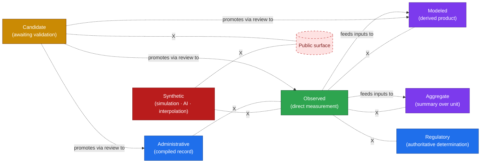
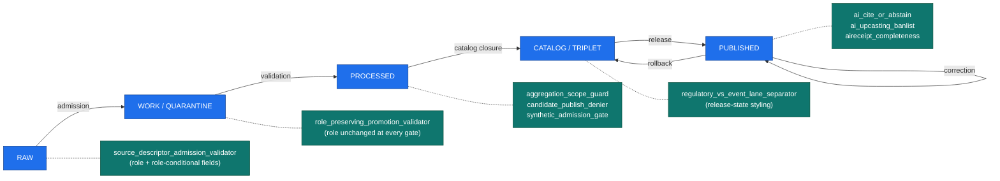
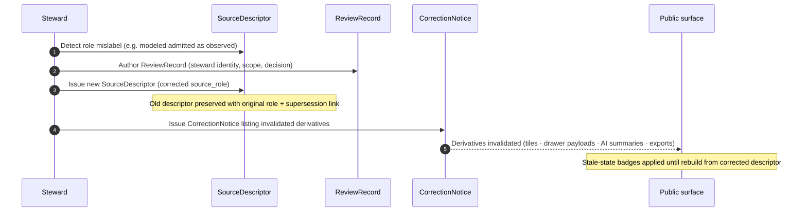
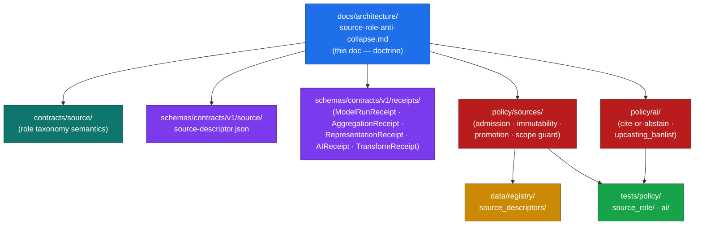

<!-- [KFM_META_BLOCK_V2]
doc_id: kfm://doc/architecture/source-role-anti-collapse
title: Source-Role Anti-Collapse — Architecture
type: standard
version: v1.0
status: draft
owners: TODO-architecture-steward-and-source-ledger-steward
created: 2026-05-25
updated: 2026-05-25
policy_label: public
related:
  - ./sensitivity.md
  - ./sensitivity-tiers.md
  - ./smoke-atmosphere-hazards.md
  - ./connected-dots-architecture-brief.md
  - ./contract-schema-policy-split.md
  - ./governed-api.md
  - ./maplibre-3d.md
  - ../doctrine/directory-rules.md
  - ../../contracts/source/
  - ../../schemas/contracts/v1/source/source-descriptor.json
  - ../../schemas/contracts/v1/receipts/
  - ../../policy/sources/README.md
  - ../../policy/ai/README.md
  - ../../data/registry/source_descriptors/
  - ../../KFM_Encyclopedia.md
  - ../../Kansas_Frontier_Matrix_-_Domains_v1_1___Pass_23_32_Consolidated_Atlas.md
  - ../../kfm_unified_doctrine_synthesis.md
tags:
  - kfm
  - architecture
  - source-role
  - anti-collapse
  - source-descriptor
  - evidence
  - cite-or-abstain
  - governance
  - trust-membrane
  - admission
notes:
  - "Doctrinal anchor: Atlas v1.1 §24.1 (Master Source-Role Anti-Collapse Register). Atlas v1.0 §20.4 references the rule; §23.3 names it as a figure-to-generate. v1.1 consolidates the roles."
  - "Seven canonical source roles are CONFIRMED doctrine: observed, regulatory, modeled, aggregate, administrative, candidate, synthetic."
  - "The Source-Role Anti-Collapse rule is fixed at admission: a source's role is set on the SourceDescriptor at admission and is preserved through every promotion. Promotion never upgrades a role."
  - "SourceDescriptor field shapes in §4 are PROPOSED (Atlas v1.1 §24.1.3); concrete schema home and validator presence are NEEDS VERIFICATION."
  - "Authoring session: docs-only. No mounted repository, CI run, workflow, dashboard, runtime log, or release artifact was inspected. Implementation-maturity claims are bounded per the current-session evidence limit."
  - "This doc is the fourth in the publication-controls architecture family alongside sensitivity.md, sensitivity-tiers.md, and smoke-atmosphere-hazards.md."
[/KFM_META_BLOCK_V2] -->

<a id="top"></a>

# Source-Role Anti-Collapse — Architecture

> **A source's role is its identity, not its label.** An observed reading is not a modeled estimate. A regulatory determination is not an administrative compilation. An aggregate publication is not a per-place fact. A candidate is not a verified record. Synthetic content is not observed reality. KFM treats source role as a **first-class identity attribute** — set at admission, preserved through every promotion, enforced at every gate, never upgraded by paraphrase. This doc is how that rule survives contact with real software.


[](#)
[](#)

> [!IMPORTANT]
> **This is doctrine-rank architecture, not implementation proof.** The seven roles, the seven collapse-pattern DENY conditions, the SourceDescriptor field intent, and the cross-domain enforcement responsibilities are CONFIRMED from Atlas v1.1 §24.1. Concrete schema paths, validator names, ban lists, and CI surfaces are **PROPOSED** until verified in a mounted repository. The doc names the rule; the policy bundles and validator tests are what prove it.

> [!CAUTION]
> **Source-role upgrade by paraphrase is the dominant trust failure.** Atlas v1.1 §24.10 names it as a **high-severity risk**. AI surfaces, narrative summaries, popup text, and "harmonized" cross-source visualizations are exactly where it happens. The rule below is the architectural defense; the AI ban list, validator fixtures, and `AIReceipt` sampling are the operational defense.

---

## Contents

- [1. Purpose & scope](#1-purpose--scope)
- [2. The single rule](#2-the-single-rule)
- [3. The seven canonical source roles](#3-the-seven-canonical-source-roles)
- [4. SourceDescriptor field shape](#4-sourcedescriptor-field-shape)
- [5. The seven collapse patterns](#5-the-seven-collapse-patterns)
- [6. Roles are set at admission, not by promotion](#6-roles-are-set-at-admission-not-by-promotion)
- [7. Per-domain hot spots](#7-per-domain-hot-spots)
- [8. The AI surface — where collapse is easiest](#8-the-ai-surface--where-collapse-is-easiest)
- [9. Validators, fixtures, and enforcement](#9-validators-fixtures-and-enforcement)
- [10. Lifecycle integration](#10-lifecycle-integration)
- [11. Per-surface enforcement](#11-per-surface-enforcement)
- [12. Correction path](#12-correction-path)
- [13. Anti-patterns](#13-anti-patterns)
- [14. Where this lives in the repository](#14-where-this-lives-in-the-repository)
- [15. Verification backlog](#15-verification-backlog)
- [16. Related docs](#16-related-docs)
- [Appendix A — Per-role worked examples](#appendix-a--per-role-worked-examples)

---

## 1. Purpose & scope

KFM accepts source material from many places: regulatory agencies, scientific observation networks, model runs, aggregator services, administrative compilations, candidate connector outputs, and synthetic / AI-generated content. Each carries a different relationship to physical truth. The Source-Role Anti-Collapse rule is the architectural mechanism that **prevents those relationships from melting into each other** as material flows through the lifecycle, through the governed API, through the map shell, and through the AI surface.

**In scope.**
- The seven canonical source roles and their definitions.
- The `SourceDescriptor` field surface that carries role at admission.
- The seven collapse patterns and their `DENY` conditions.
- The admission-fixes-role rule and the correction path.
- Per-domain hot spots where collapse is most likely.
- AI-surface enforcement (cite-or-abstain, ban list, `AIReceipt` sampling).
- Validator and fixture posture.
- Lifecycle integration; per-surface enforcement; anti-patterns.

**Out of scope.**
- The general sensitivity posture (see [`./sensitivity.md`](./sensitivity.md)).
- The T0–T4 release tier scheme (see [`./sensitivity-tiers.md`](./sensitivity-tiers.md)).
- The cross-domain smoke worked example (see [`./smoke-atmosphere-hazards.md`](./smoke-atmosphere-hazards.md), which applies anti-collapse to one seam).
- Concrete Rego/OPA modules (live in `policy/sources/`, `policy/ai/`).
- Object meaning (lives in `contracts/source/`) and shape (lives in `schemas/contracts/v1/source/`).

> [!NOTE]
> **Why this is a separate document.** Anti-collapse runs *through* the sensitivity architecture, the tier scheme, the governed-API contract, the renderer doctrine, and the AI plane — but it is not a sub-concern of any of them. It is a peer principle. Pulling it into its own doc surfaces the per-role definitions, the DENY conditions, and the SourceDescriptor field intent at the level of detail they need, without burying them in any one consumer's surface area.

[↑ Back to top](#top)

---

## 2. The single rule

> **A source's role is set at admission, preserved through every promotion, enforced at every gate, and never upgraded by paraphrase.**

That sentence is the whole architecture. Everything else in this document is its mechanics. Three corollaries follow:

| Corollary | What it means in practice |
|---|---|
| **Roles are fixed at admission.** | `SourceDescriptor.source_role` is set when the source enters RAW. It is never edited in place; a role correction produces a new descriptor *and* a `CorrectionNotice`. |
| **Promotion never upgrades a role.** | RAW → WORK → PROCESSED → CATALOG → PUBLISHED carries the role unchanged. A modeled product that promotes through the gates is still a modeled product at PUBLISHED. |
| **Paraphrase never upgrades a role.** | The AI surface cannot lift a modeled estimate into an observation by rewording, a candidate into a verified record by summarizing, or an aggregate into a per-place fact by interpolating. The AI ban list and `AIReceipt` sampling enforce this. |

> [!IMPORTANT]
> **Anti-collapse is not opposed to composition.** Modeled products are *built from* observed inputs; aggregates are *computed from* per-place records; AI summaries *cite* `EvidenceBundle`s. The rule says that **the resulting product carries its own role**, not its inputs' roles. A hydrograph reconstruction built from gauge observations is a modeled product, not an observation. The gauge readings remain observations *as cited inputs*.

[↑ Back to top](#top)

---

## 3. The seven canonical source roles

The roles below are **CONFIRMED doctrine** from Atlas v1.1 §24.1.1.

| Role | Definition | Typical example | Allowed downstream role |
|---|---|---|---|
| **Observed** | A direct reading, measurement, or first-hand evidentiary record tied to a place and time. | Stream-gauge stage reading; soil pedon description; air-quality monitor sample; ground archaeological observation. | May feed modeled or aggregate products; never relabeled as 'regulatory' or 'administrative'. |
| **Regulatory** | An authoritative determination by a regulatory or governing body with legal or administrative force. | NFHL flood-zone designation; air-quality non-attainment ruling; designated critical-habitat unit; protected-species listing. | Cite as regulatory context; never labeled an 'observed' event or a 'modeled' estimate. |
| **Modeled** | A derived product from inputs, assumptions, or fitted parameters; uncertainty and provenance of inputs must be preserved. | Hydrograph reconstruction; smoke trajectory model; suitability raster; population estimation surface; AOD raster. | Cite with model identity, run receipt, and bounds; never labeled an observation. |
| **Aggregate** | A published summary, total, or average over a unit (county, year, watershed); irreversible loss of individual-record fidelity. | USDA crop county totals; Census tract aggregates; decadal climate normal; resource estimate summary. | Cite with aggregation receipt; never treated as a per-place record. |
| **Administrative** | A compiled record produced by an agency for administration, registration, or accounting purposes — not necessarily an observation or a regulation. | Land-office tract book; deed index compilation; county incorporation record; transport-facility roster. | Cite as administrative context; never collapsed with observation or regulation. |
| **Candidate** | A proposed record awaiting validation, evidence resolution, deduplication, or steward review; not yet authoritative. | Quarantined connector output; unresolved person assertion; duplicate site candidate; unmerged crop observation. | May be cited as candidate evidence in WORK / QUARANTINE; **must not appear in PUBLISHED without promotion.** |
| **Synthetic** | Content generated by simulation, reconstruction, AI, or interpolation that has no underlying first-hand observation. | Synthetic terrain surface; reconstructed historical scene; AI-drafted summary of an `EvidenceBundle`. | Carries Reality Boundary Note and `RepresentationReceipt`; **must never be presented or queried as observed reality.** |



> [!NOTE]
> **The X-marked dotted edges in the diagram are the forbidden collapses.** They are the seven `DENY` conditions enumerated in §5. The solid arrows are permitted compositions; the dashed arrows are governed promotions that require a `ReviewRecord`.

[↑ Back to top](#top)

---

## 4. SourceDescriptor field shape

The role lives on the `SourceDescriptor`. Atlas v1.1 §24.1.3 names the **PROPOSED** field surface (illustrative; concrete schema home is `schemas/contracts/v1/source/source-descriptor.json` per Directory Rules §7.4 / ADR-0001, but **NEEDS VERIFICATION** of file presence).

| Field | Type / vocabulary | Required? | Notes |
|---|---|---|---|
| `source_role` | `enum: observed \| regulatory \| modeled \| aggregate \| administrative \| candidate \| synthetic` | **MUST** | Set at admission. Never edited in-place; corrections produce a new descriptor + `CorrectionNotice`. |
| `role_authority` | string (issuing body / model identity / steward) | MUST when role ∈ `{regulatory, modeled, aggregate}` | Disambiguates the authoring authority for downstream cite text. |
| `role_aggregation_unit` | geometry-scope token (`county`, `HUC`, `tract`, `year`, `decade`, …) | MUST when `source_role = aggregate` | Prevents geometry-scope drift on join. |
| `role_model_run_ref` | `EvidenceRef` → `ModelRunReceipt` | MUST when `source_role = modeled` | Pins the inputs, parameters, and version that produced the value. |
| `role_synthetic_basis` | structured: `{ method, inputs, reality_boundary_note_ref }` | MUST when `source_role = synthetic` | Records what is and is not real in the carrier. |
| `role_candidate_disposition` | `enum: pending \| merged \| rejected \| quarantined` | MUST when `source_role = candidate` | Tracks promotion state; PUBLISHED edge forbidden until `merged`. |

### 4.1 Illustrative descriptor (PROPOSED — NEEDS VERIFICATION)

```json
{
  "source_id": "kfm:source/airnow/aqi/v1",
  "source_role": "observed",
  "role_authority": "EPA AirNow Program",
  "rights": { "license": "kfm:rights/airnow", "terms_status": "verified" },
  "sensitivity": "T0",
  "cadence": "hourly",
  "ingest_hash": "sha256-…",
  "admission_time": "2026-05-25T18:00:00Z",
  "citation": "EPA AirNow API, retrieved 2026-05-25"
}
```

```json
{
  "source_id": "kfm:source/hrrr-smoke/v3",
  "source_role": "modeled",
  "role_authority": "NOAA NCEP HRRR-Smoke",
  "role_model_run_ref": "kfm:evidence/model-run/hrrr-smoke/2026-05-25T18Z",
  "rights": { "license": "kfm:rights/noaa", "terms_status": "verified" },
  "sensitivity": "T1",
  "cadence": "hourly",
  "ingest_hash": "sha256-…",
  "admission_time": "2026-05-25T18:30:00Z",
  "citation": "NOAA HRRR-Smoke model output, run 2026-05-25T18Z"
}
```

```json
{
  "source_id": "kfm:source/usda-nass/county-corn/2024",
  "source_role": "aggregate",
  "role_authority": "USDA NASS",
  "role_aggregation_unit": "county-year",
  "rights": { "license": "kfm:rights/usda-nass", "terms_status": "verified" },
  "sensitivity": "T0",
  "cadence": "annual",
  "ingest_hash": "sha256-…",
  "admission_time": "2026-05-25T19:00:00Z",
  "citation": "USDA NASS County-Year Corn Production, 2024 release"
}
```

> [!WARNING]
> **`source_role` is immutable in place.** A wrong role at admission is a *correction*, not an edit. The corrected descriptor is a new object with a new `admission_time`; the previous descriptor is preserved with its original role; a `CorrectionNotice` lists the derivatives that must be invalidated. This protects audit trails from silent role drift.

[↑ Back to top](#top)

---

## 5. The seven collapse patterns

The patterns below are **CONFIRMED doctrine** as `DENY` conditions from Atlas v1.1 §24.1.2. Each names the collapse, the domains most at risk, the denied outcome, and the required guardrail.

| # | Collapse pattern | Domains most at risk | Denied outcome | Required guardrail |
|---|---|---|---|---|
| **1** | Modeled product labeled or queried as observed. | Air; Hydrology; Habitat; Agriculture; 3D | `DENY` at publication; `ABSTAIN` at AI surface. | `ModelRunReceipt` + uncertainty surface + role-preserving DTO field. |
| **2** | Regulatory zone labeled as an observed flood / event. | Hydrology; Hazards; Air | `DENY` publication of regulatory layer as event evidence. | Separate regulatory-layer and observed-event lanes; banner in UI. |
| **3** | Aggregate cited as a per-place truth. | Agriculture; People; Geology; Air | `DENY` join from aggregate cell to single record; `ABSTAIN` at AI. | `AggregationReceipt`; geometry-scope guard; matrix-cell semantics. |
| **4** | Administrative compilation cited as observation. | People/Land; Settlements; Roads | `DENY` publication of compilation as observed event timeline. | Source-role tag preserved; named `LifeEvent` / `AdminEvent` types. |
| **5** | Candidate record exposed on a public surface. | All | `DENY` at trust membrane; route to QUARANTINE. | Promotion gate; no PUBLISHED edge to WORK / QUARANTINE. |
| **6** | Synthetic content presented as observed reality. | Planetary/3D; AI; Archaeology; Habitat | `DENY` publication; `HOLD` for steward review; `ABSTAIN` at AI. | Reality Boundary Note; `RepresentationReceipt`; UI badge. |
| **7** | AI text treated as evidence. | All Focus Mode surfaces | `DENY` publication; `ABSTAIN` at Focus Mode; `AIReceipt` mandatory. | Cite-or-abstain rule; `AIReceipt`; release state required. |

> [!CAUTION]
> **Patterns 1, 3, and 7 are the most operationally dangerous.** Modeled-as-observed (1) is the air-quality / hydrology / fire-detection failure that turns model output into ambient fact. Aggregate-as-per-place (3) is the inference-by-join failure that joins county totals to single farms. AI-as-evidence (7) is the cite-or-abstain failure that lets generated language stand in for evidence. The AI ban list, the geometry-scope guard, and the `AIReceipt` validator are the three highest-leverage enforcements.

[↑ Back to top](#top)

---

## 6. Roles are set at admission, not by promotion

Atlas v1.1 §24.1.1 (reading note) is explicit:

> The role of a source is set at admission (`SourceDescriptor`) and is preserved through every promotion. Promotion does not upgrade an observation to a regulation, or a model to an aggregate, or a candidate to a verified record — those are **separate governed transitions** with their own evidence and review requirements.

This is what makes the rule architecturally simple: the lifecycle gates do not need to re-evaluate role at each step. The role rides on the descriptor; the gates verify role-consistent behavior at their stage.

### 6.1 The three transitions that *look like* role upgrades but aren't

| Apparent upgrade | What's actually happening |
|---|---|
| **Candidate → Observed** (via merge) | The candidate is *deduplicated, validated, and steward-reviewed* into a record that *was already observed at its source*. The role didn't change; the candidate's `role_candidate_disposition` moved from `pending` to `merged`, and the underlying observation's descriptor governs the published record. |
| **Modeled run → Modeled release** | Multiple model runs converge through promotion gates, but each retains its `ModelRunReceipt`. The release carries `source_role = modeled`. There is no "promoting modeled to observed." |
| **Observed → Aggregate** (composition) | The aggregate is a *new* derived product, cited by aggregation receipt, that *cites* the underlying observations. The observations remain observations. The aggregate is its own object with its own role. |

> [!IMPORTANT]
> **Two records with different roles describing "the same thing" coexist.** A hydrograph observation at a USGS gauge and a hydrograph reconstruction from a model both describe stage at a place and time. They have *different roles*. They appear *as different objects* with *different citations*. The map shell, drawer, and AI surface present them distinctly; the renderer styles them differently; the AI never paraphrases one as the other.

[↑ Back to top](#top)

---

## 7. Per-domain hot spots

The Atlas v1.1 §24.1 register names per-domain hot spots. The table below organizes them by domain so per-domain reviewers know what to watch for.

<details>
<summary><strong>Per-domain anti-collapse hot spots</strong> (click to expand)</summary>

| Domain | Most-likely collapse | Example | Guardrail |
|---|---|---|---|
| **Atmosphere / Air** | Modeled → Observed (#1) | HRRR-Smoke / BlueSky / CAMS model fields paraphrased as observed concentration. | `ModelRunReceipt`; visual distinctness of forecast vs observation layers; AI ban list. |
| **Atmosphere / Air** | Low-cost sensor → Regulatory (#1 variant) | PurpleAir uncorrected presented alongside AQS without Barkjohn correction. | `TransformReceipt` recording Barkjohn version; `policy/sensitivity/atmosphere/purpleair_correction/`; preserve corrected+uncorrected pair. |
| **Hazards** | Forecast → Warning (#1 → alert-authority drift) | HRRR-Smoke forecast presented as an active warning. | T4-forever alert-authority boundary; `policy/release/hazards/`. |
| **Hazards** | Detection → Confirmed event (#1) | FIRMS / VIIRS hotspot rendered as "a wildfire is at this location." | Source-role label preserved at the popup, label, and AI surface; cross-surface lint. |
| **Hydrology** | Regulatory zone → Observed flood (#2) | NFHL designation rendered as a current flood event. | Separate regulatory-layer and observed-event lanes; banner in UI; "NEVER LABEL NFHL OBSERVED FLOOD" (Atlas v1.0 Phase 5 rule). |
| **Hydrology** | Modeled hydrograph → Observation (#1) | Reconstruction styled like a gauge observation. | `ModelRunReceipt`; uncertainty surface; legend distinctness. |
| **Agriculture** | Aggregate → Per-place (#3) | USDA county-year totals joined to single farms. | `AggregationReceipt` with `role_aggregation_unit = county-year`; geometry-scope guard. |
| **People / DNA / Land** | Administrative → Observation (#4) | Deed index compilation cited as an observed life event. | Named `LifeEvent` vs `AdminEvent` types; source-role tag preserved. |
| **People / DNA / Land** | Aggregate → Per-place (#3) | Census tract aggregates joined to private parcel. | Minimum-cell suppression; person-parcel join denial. |
| **Archaeology / Cultural Heritage** | Candidate → Verified site (#5) | Remote-sensing anomaly rendered as a confirmed site. | Steward + cultural review; promotion gate; geoprivacy generalization. |
| **Habitat** | Modeled suitability → Observation (#1) | Suitability raster paraphrased as "habitat exists here." | `ModelRunReceipt`; bounds; legend distinctness. |
| **Geology / Natural Resources** | Aggregate → Per-place (#3) | Resource estimate summary cited as exploitable resource at a parcel. | `AggregationReceipt`; legal/physical separation. |
| **Settlements / Infrastructure** | Administrative → Observation (#4) | County incorporation record cited as an observed founding event. | Named `AdminEvent` type; date discipline (observed vs valid vs administrative). |
| **Roads / Rail / Trade Routes** | Administrative → Observation (#4) | Transport-facility roster cited as an observed transit event. | Named `AdminEvent` type. |
| **Planetary / 3D / Digital Twin** | Synthetic → Observed reality (#6) | Synthetic terrain or reconstructed scene presented without Reality Boundary Note. | Scene admission gate; `RepresentationReceipt`; UI badge. |
| **Governed AI (all domains)** | AI text → Evidence (#7) | AI summary treated as authoritative claim. | Cite-or-abstain; `AIReceipt`; `policy/ai/` ban list. |
| **Frontier Matrix (composition)** | Multiple, by join | Cells aggregated across domains lose their per-input roles. | Each matrix cell preserves contributing source roles; geometry-scope guard. |

</details>

[↑ Back to top](#top)

---

## 8. The AI surface — where collapse is easiest

The AI plane carries the highest collapse risk because **paraphrase is its native operation**. Generation can turn a forecast into a warning, a candidate into a confirmed record, an aggregate into a per-place fact, a model field into an observation — all without changing any underlying data, and all in fluent prose that reads as authoritative.

### 8.1 The three AI-specific defenses

| Defense | What it does |
|---|---|
| **Cite-or-abstain** | An AI answer either resolves to one or more `EvidenceBundle`s via `EvidenceRef`, or returns `ABSTAIN`. Generated language is not authority. |
| **`AIReceipt` per output** | Every AI output emits an `AIReceipt` with `prompt_scope`, `evidence_refs[]`, `policy_ref`, `outcome` (`ANSWER` / `ABSTAIN` / `DENY` / `ERROR`), `reason_code`, `model_id`, and `time`. Sampling against this corpus detects drift. |
| **Upcasting ban list** | A versioned ban list at `policy/ai/upcasting_banlist.{rego,json}` (PROPOSED) refuses phrases that lift role: e.g., "PM2.5 is X at Y" when the source is a model field; "a wildfire is at Z" when the source is a detection; "X is at this location" when the source is an aggregate. |

### 8.2 The PROPOSED upcasting ban-list seed

The list below is a **PROPOSED** starting set, distilled from per-domain hot spots in §7. Every entry needs negative-fixture coverage in `tests/policy/ai/`.

| Pattern (regex-class) | Forbidden under what role | Suggested replacement |
|---|---|---|
| `"is at"` / `"is in"` / `"is here"` | `modeled`, `aggregate`, `synthetic`, `candidate` | `"is forecast to be at"` (modeled); `"was X on average across <unit>"` (aggregate); `"is depicted as"` (synthetic); `"is reported as candidate"` (candidate). |
| `"measured at"` / `"observed at"` | `modeled`, `aggregate`, `synthetic` | `"modeled as"`, `"summarized as"`, `"reconstructed as"`. |
| `"wildfire at"` / `"flood at"` / `"smoke at"` | `modeled`, `candidate` (detection only) | `"wildfire detection at"`, `"FEMA flood-zone designation at"`, `"smoke forecast for"`. |
| `"current"` / `"now"` / `"as of today"` | any role past its issuer's expiry | Replace with timestamp + stale-state badge. |
| `"alert"` / `"warning"` / `"evacuate"` / `"shelter in place"` | any KFM-generated text | DENY; alert authority is permanently forbidden. |
| `"the same as"` / `"equivalent to"` between regulatory ↔ observed | `regulatory` ↔ `observed` | Cite both with distinct labels; never collapse. |

### 8.3 `AIReceipt` sampling

`AIReceipt` sampling is the auditor's eye. A periodic sample of AI outputs is replayed through the ban-list validator and the cite-or-abstain evaluator; drift produces a verification-backlog entry, and the AI surface steward holds standing review. Sampling cadence is **PROPOSED** at weekly, with mandatory rolling review at every model upgrade.

> [!WARNING]
> **`AIReceipt` is not optional.** An AI output without a receipt is an ungoverned generation; the trust membrane denies it. Implementations that strip receipts for "performance" violate the architecture; the cost of receipt persistence is the price of governed AI.

[↑ Back to top](#top)

---

## 9. Validators, fixtures, and enforcement

The single rule (§2) decomposes into specific validator behaviors. Each row below is **PROPOSED** for the validator surface; each requires a fixture-driven test.

| Validator | What it checks | DENY reason code (PROPOSED) | Fixture home (PROPOSED) |
|---|---|---|---|
| **`source_descriptor_admission_validator`** | `source_role` is set; required role-conditional fields are present (e.g. `role_authority` for regulatory). | `MISSING_ROLE` / `MISSING_ROLE_AUTHORITY` / `MISSING_ROLE_AGGREGATION_UNIT` / `MISSING_ROLE_MODEL_RUN_REF` | `tests/policy/source_role/admission/` |
| **`source_role_immutability_validator`** | A descriptor's `source_role` did not change in place (a corrected descriptor is a new object with a `CorrectionNotice`). | `ROLE_EDIT_FORBIDDEN` | `tests/policy/source_role/immutability/` |
| **`role_preserving_promotion_validator`** | The role on an artifact matches the role on its underlying `SourceDescriptor` at every gate (Admission → Normalization → Validation → Catalog closure → Release). | `ROLE_COLLAPSE` / `ROLE_DOWNCAST_FORBIDDEN` | `tests/policy/source_role/promotion/` |
| **`aggregation_scope_guard`** | An aggregate's geometry-scope (`role_aggregation_unit`) matches the geometry it is being joined to; refuses joins from aggregate cell to single record. | `AGGREGATE_SCOPE_DRIFT` | `tests/policy/source_role/aggregation/` |
| **`regulatory_vs_event_lane_separator`** | Regulatory layers are not styled as observed-event layers; banners present. | `REGULATORY_AS_EVENT` | `tests/policy/source_role/regulatory/` |
| **`candidate_publish_denier`** | No `PUBLISHED` edge from a descriptor with `source_role = candidate` and `role_candidate_disposition != merged`. | `CANDIDATE_PUBLISHED` | `tests/policy/source_role/candidate/` |
| **`synthetic_admission_gate`** | Synthetic content carries a Reality Boundary Note and a `RepresentationReceipt`; UI badge present. | `SYNTHETIC_AS_OBSERVED` | `tests/policy/source_role/synthetic/` |
| **`ai_cite_or_abstain_validator`** | Every AI `ANSWER` resolves to one or more `EvidenceRef`s; otherwise `ABSTAIN`. | `UNCITED_ANSWER` | `tests/policy/ai/cite_or_abstain/` |
| **`ai_upcasting_banlist_validator`** | AI output text does not contain banned upcasting phrases for the underlying sources' roles. | `ROLE_UPCAST_BY_PARAPHRASE` | `tests/policy/ai/upcasting/` |
| **`aireceipt_completeness_validator`** | Every AI output has an `AIReceipt` with required fields. | `MISSING_AIRECEIPT` | `tests/policy/ai/receipts/` |

> [!NOTE]
> **The validators are not a hierarchy.** Each runs independently at its gate. A request can pass `source_descriptor_admission_validator` and still fail `aggregation_scope_guard`; an AI output can satisfy `ai_cite_or_abstain_validator` and still trip `ai_upcasting_banlist_validator`. The validators compose by *intersection* — a release is allowed only when every applicable validator returns `ALLOW`.

[↑ Back to top](#top)

---

## 10. Lifecycle integration



| Gate | Role-related behavior |
|---|---|
| **Admission** (— → RAW) | `SourceDescriptor.source_role` set; role-conditional fields populated; `source_descriptor_admission_validator` runs. Unknown role → QUARANTINE. |
| **Normalization** (RAW → WORK / QUARANTINE) | `role_preserving_promotion_validator` confirms role is unchanged. Sensitive-lane role mismatches route to QUARANTINE. |
| **Validation** (WORK → PROCESSED) | `aggregation_scope_guard`, `candidate_publish_denier`, `synthetic_admission_gate` run as applicable. |
| **Catalog closure** (PROCESSED → CATALOG / TRIPLET) | `EvidenceRef`s resolve to `EvidenceBundle`s; the role on each bundle's contributing sources is recorded; `regulatory_vs_event_lane_separator` runs. |
| **Release** (CATALOG / TRIPLET → PUBLISHED) | `ReleaseManifest` carries the role; release authority distinct from author when materiality applies; AI surface validators run for any AI-derived release artifact. |
| **Correction** (PUBLISHED → PUBLISHED′) | A role correction triggers a new `SourceDescriptor` + `CorrectionNotice` + derivative invalidation list. |
| **Rollback** (PUBLISHED → prior release) | `RollbackCard` returns to the prior `ReleaseManifest`, which carried its own role. |

> [!IMPORTANT]
> **Promotion is a state transition, not a role transformation.** The lifecycle moves the artifact toward PUBLISHED; it does not move it from one role to another. A modeled product that promotes through all five gates is still modeled at PUBLISHED.

[↑ Back to top](#top)

---

## 11. Per-surface enforcement

Anti-collapse holds **per surface**, not per layer. A role-correct canonical layer can leak through any surface where text, label, or visual cue paraphrases role.

| Surface | Required posture | Anti-pattern |
|---|---|---|
| **Tiles / layers** | Visual distinctness between roles: forecast vs observation; modeled vs measured; regulatory vs event. Legend names the role; layer manifest tags release-state. | Forecast and observation styled identically. Regulatory layer styled as event. |
| **Popups / Labels** | Popup names role + authority + time. Labels do not lift role ("FIRMS hotspot detected, 2026-05-23 14:32 UTC" — not "Wildfire at X"). | Label paraphrases detection as event. Popup omits issuer. |
| **Drawer / Story Nodes** | Each cited source carries its own role chip. Composition objects (e.g. `SmokeEvent`) surface each contributing role. | Drawer presents all sources without role chips. Story Node language drifts roles. |
| **Exports / Screenshots / Reports** | Citations preserve role labels. Captions name the role. | Caption omits role; reader infers observation. |
| **AI surface / Focus Mode** | Cite-or-abstain; `AIReceipt` per output; ban list enforced at output validation; sampling for drift. | AI uses "is" instead of "is forecast to be." AI summarizes aggregate as per-place. |
| **3D scenes** | Reality Boundary Note + `RepresentationReceipt`; synthetic content visually distinct from observed. | 3D scene shows reconstructed terrain as observed. |
| **Notifications / push** | Forbidden for any role that would imply alert authority. | Push notification with smoke advisory text. |

[↑ Back to top](#top)

---

## 12. Correction path

A `source_role` set in error at admission is a **correction event**, not an edit. The corrected descriptor is a *new* object; the previous descriptor is preserved; downstream derivatives are invalidated.



| Correction step | Required artifact |
|---|---|
| Detect role mislabel | (none — a steward observation) |
| Author review | `ReviewRecord` |
| Issue corrected descriptor | New `SourceDescriptor` with `admission_time` = correction time; old descriptor preserved with supersession link |
| Invalidate derivatives | `CorrectionNotice` with `invalidated_derivatives[]` |
| Rebuild | New `ReleaseManifest` from corrected descriptor; `RollbackCard` references prior release |

> [!IMPORTANT]
> **The old descriptor is never deleted.** Audit trails depend on preserving the wrong-role descriptor as historical evidence of what was admitted. The supersession link makes the correction discoverable; the `CorrectionNotice` makes the impact reviewable.

[↑ Back to top](#top)

---

## 13. Anti-patterns

<details>
<summary><strong>Source-role anti-collapse anti-pattern register</strong> (click to expand)</summary>

| Anti-pattern | Why it violates the rule |
|---|---|
| **Editing `source_role` in place.** | Role is immutable in place; corrections produce a new descriptor + `CorrectionNotice`. |
| **Promotion that "upgrades" a role.** | Roles are fixed at admission; promotion never changes role. Atlas §24.9.3 names this explicitly. |
| **Single-record join from an aggregate cell.** | Geometry-scope drift; collapse #3. Requires `aggregation_scope_guard`. |
| **Styling a regulatory layer as an event layer.** | Collapse #2. Requires lane separation and UI banner. |
| **Publishing a candidate to PUBLISHED without merge.** | Collapse #5. `candidate_publish_denier` enforces. |
| **Rendering a synthetic scene without Reality Boundary Note.** | Collapse #6. Scene admission gate denies. |
| **AI summary that says "is" instead of "is forecast" / "is modeled."** | Collapse #1 by paraphrase. Ban list catches. |
| **AI text without `AIReceipt`.** | Collapse #7. Ungoverned generation. |
| **Composition object lacking per-source role chips at the drawer.** | Roles lost at composition surface. |
| **Caption / label omits role.** | Reader infers observation. |
| **"Harmonizing" cross-source layers by unifying style.** | Visual collapse of distinct roles. |
| **Treating an Atlas matrix as evidence.** | Atlas tables are navigational, not authoritative. `EvidenceBundle` is. |
| **Inferring observation from a model+observation match.** | Match validates the model; it does not promote it to observation. |
| **AI text quoting an aggregate as a per-place fact.** | Most subtle collapse; requires ban-list pattern coverage. |
| **Deleting the old descriptor on correction.** | Breaks audit; the old descriptor is preserved with supersession link. |

</details>

[↑ Back to top](#top)

---

## 14. Where this lives in the repository

Anti-collapse **doctrine** lives in `docs/architecture/`. **Enforcement** is split across responsibility roots per Directory Rules §4. All paths are **PROPOSED** until verified per Directory Rules §2.5.



| Responsibility | Root | What lives here |
|---|---|---|
| Doctrine — this doc | `docs/architecture/source-role-anti-collapse.md` | The rule; the seven roles; the seven collapse patterns. |
| Object meaning | `contracts/source/` | What "observed", "regulatory", "modeled", "aggregate", "administrative", "candidate", "synthetic" *mean*. |
| Object shape | `schemas/contracts/v1/source/source-descriptor.json` | Field schema: `source_role`, `role_authority`, `role_aggregation_unit`, `role_model_run_ref`, `role_synthetic_basis`, `role_candidate_disposition`. |
| Receipt shapes | `schemas/contracts/v1/receipts/` | `SourceDescriptor`, `ModelRunReceipt`, `AggregationReceipt`, `RepresentationReceipt`, `AIReceipt`, `TransformReceipt`. |
| Enforcement — sources | `policy/sources/` | Admission, immutability, role-preserving promotion, scope guards. |
| Enforcement — AI | `policy/ai/` | Cite-or-abstain; `upcasting_banlist`; `AIReceipt` completeness. |
| Source registry | `data/registry/source_descriptors/` | Admitted descriptors, indexed by `source_id`. |
| Enforceability proof | `tests/policy/source_role/` + `tests/policy/ai/` | Fixture-driven `DENY` / `ABSTAIN` / `ERROR` cases per validator. |

[↑ Back to top](#top)

---

## 15. Verification backlog

| ID | Item | Evidence that would settle it |
|---|---|---|
| **VB-SRC-01** | `schemas/contracts/v1/source/source-descriptor.json` exists and defines `source_role` enum plus role-conditional fields per §4 | Schema file inspection |
| **VB-SRC-02** | `policy/sources/` contains Rego bundles for each of the validators in §9 | Bundle inspection |
| **VB-SRC-03** | `policy/ai/upcasting_banlist.{rego,json}` exists, is versioned, and covers at least the patterns in §8.2 | File inspection + version pin |
| **VB-SRC-04** | `tests/policy/source_role/` carries fixture-driven `DENY` cases for each of the seven collapse patterns in §5 | Fixture inventory + CI green |
| **VB-SRC-05** | `tests/policy/ai/` carries cite-or-abstain fixtures and upcasting-banlist fixtures | Fixture inventory + CI green |
| **VB-SRC-06** | `AIReceipt` schema is defined and required on every AI output | Schema + governed-API contract |
| **VB-SRC-07** | `AIReceipt` sampling is wired (weekly + at-model-upgrade) | Workflow file + recent runs |
| **VB-SRC-08** | A `CorrectionNotice` template carries `invalidated_derivatives[]` and supersession links | Schema + worked example |
| **VB-SRC-09** | `data/registry/source_descriptors/` holds admitted descriptors keyed by `source_id` with immutable role | Registry inspection |
| **VB-SRC-10** | An ADR governs the SourceDescriptor schema home and the upcasting ban list policy | `docs/adr/` listing |
| **VB-SRC-11** | The renderer styles forecast layers visibly differently from observation layers (legend + stroke + badge) | Style file inspection + visual regression |
| **VB-SRC-12** | The drawer presents per-source role chips on composition objects (e.g. `SmokeEvent`) | UI inspection + payload inspection |
| **VB-SRC-13** | `tests/policy/source_role/promotion/` proves role is preserved across all five lifecycle gates | Test inventory |
| **VB-SRC-14** | Owner / `CODEOWNERS` entries name an architecture steward and a source-ledger steward for this file | `.github/CODEOWNERS` inspection |
| **VB-SRC-15** | This doc is registered in `control_plane/document_registry.yaml` | Registry inspection |

[↑ Back to top](#top)

---

## 16. Related docs

| Path | Role |
|---|---|
| [`./sensitivity.md`](./sensitivity.md) | Umbrella sensitivity architecture; anti-collapse is one of its five sub-architectures. |
| [`./sensitivity-tiers.md`](./sensitivity-tiers.md) | T0–T4 release tier scheme; tier upgrades require role-preserving evidence. |
| [`./smoke-atmosphere-hazards.md`](./smoke-atmosphere-hazards.md) | Cross-domain worked example; smoke is the canonical seam where collapses happen. |
| `docs/architecture/connected-dots-architecture-brief.md` | System-wide brief; anti-collapse sits in its trust-membrane layer. |
| `docs/architecture/contract-schema-policy-split.md` | Why role *meaning* lives in `contracts/`, *shape* in `schemas/`, *enforcement* in `policy/`. |
| `docs/architecture/governed-api.md` | The only public surface; emits role-preserving `PolicyDecision` outcomes. |
| `docs/architecture/maplibre-3d.md` | Renderer doctrine; honors role-distinct styling and Reality Boundary Note for synthetic content. |
| `docs/doctrine/directory-rules.md` | Placement law. |
| `contracts/source/README.md` | PROPOSED per-root README for source-family semantics. |
| `policy/sources/README.md` | PROPOSED per-root README for admission and promotion enforcement. |
| `policy/ai/README.md` | PROPOSED per-root README for cite-or-abstain and the upcasting ban list. |
| `KFM_Encyclopedia.md` §11 (Sensitive / Deny-by-Default Posture) and Encyclopedia object-family index | Doctrinal cross-references. |
| `Kansas_Frontier_Matrix_-_Domains_v1_1___Pass_23_32_Consolidated_Atlas.md` §24.1 (Master Source-Role Anti-Collapse Register); §24.10 (Risk Register) | Doctrinal anchors. |
| `kfm_unified_doctrine_synthesis.md` §29.2 (release-stage anti-patterns); §29.3 (governance-process anti-patterns) | Anti-pattern cross-references. |

[↑ Back to top](#top)

---

## Appendix A — Per-role worked examples

The examples below illustrate role-correct citations and the corresponding role-collapse failures. They are **illustrative**; concrete field names and ban-list patterns are PROPOSED.

<details>
<summary><strong>Worked examples per role</strong> (click to expand)</summary>

### Observed

- **Correct.** "USGS streamgauge 06892350 reported a stage of 4.21 ft at 2026-05-25T17:00:00Z."
- **Collapse.** "The river was 4.21 ft on May 25." *(omits source identity + time; could be observed or modeled.)*

### Regulatory

- **Correct.** "FEMA NFHL designates this area as Zone A (1% annual chance) under the 2024 effective map."
- **Collapse #2.** "This area flooded." *(regulatory designation paraphrased as observed flood event.)*

### Modeled

- **Correct.** "HRRR-Smoke run 2026-05-25T18Z forecasts PM2.5 of 75 µg/m³ over Wichita with uncertainty band ±20."
- **Collapse #1.** "PM2.5 is 75 µg/m³ in Wichita." *(model field paraphrased as observation.)*

### Aggregate

- **Correct.** "USDA NASS reports 2024 county-year corn production for Sedgwick County at 8.4 million bushels."
- **Collapse #3.** "This farm produced 8.4 million bushels in 2024." *(county aggregate joined to single farm.)*

### Administrative

- **Correct.** "Sedgwick County's incorporation record lists 1867 as the year of organization."
- **Collapse #4.** "The county was founded in 1867." *(administrative record cited as an observed founding event; founding is not the same as administrative organization.)*

### Candidate

- **Correct.** "FIRMS hotspot detection ID 12345678, 2026-05-25T16:42Z, awaiting steward review." *(rendered with `role_candidate_disposition: pending`.)*
- **Collapse #5.** "Wildfire at coordinates X, Y." *(candidate detection paraphrased as confirmed event.)*

### Synthetic

- **Correct.** "Reconstructed 1880 Wichita streetscape — Reality Boundary Note: building geometries are synthetic infill from historical photographs and parcel records; street layout is administrative."
- **Collapse #6.** A 3D scene showing the same content without the Reality Boundary Note or `RepresentationReceipt`. *(reconstruction presented as observed reality.)*

### Cite-or-abstain (AI)

- **Correct.** AI answer: "Based on `kfm:evidence/smoke-event-2026-05-23/bundle`, HMS plumes intersected Wichita at 2026-05-23T14:32Z; the source is a remote-sensing detection at analyst cadence, not an observed PM2.5 measurement." *(emits `AIReceipt`.)*
- **Collapse #7.** AI answer: "Smoke was at Wichita on May 23." *(no `EvidenceRef`; role paraphrased; no receipt — DENY.)*

</details>

[↑ Back to top](#top)

---

**Related docs:** [sensitivity](./sensitivity.md) · [sensitivity-tiers](./sensitivity-tiers.md) · [smoke-atmosphere-hazards](./smoke-atmosphere-hazards.md) · [directory-rules](../doctrine/directory-rules.md) · [governed-api](./governed-api.md) · [maplibre-3d](./maplibre-3d.md) · [KFM Encyclopedia](../../KFM_Encyclopedia.md)

**Last updated:** 2026-05-25 · **Doc version:** v1.0 · **Meta block:** v2 · [↑ Back to top](#top)
