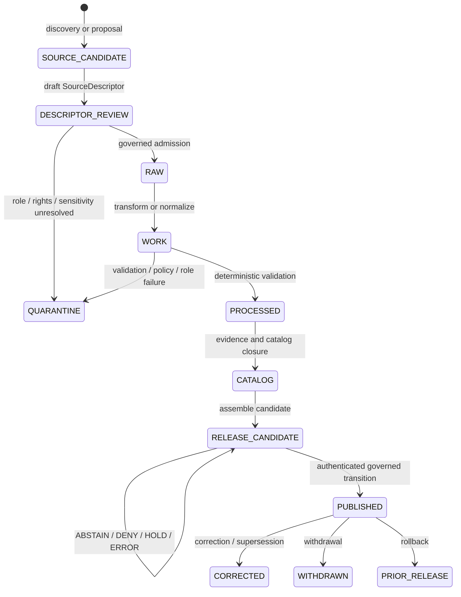
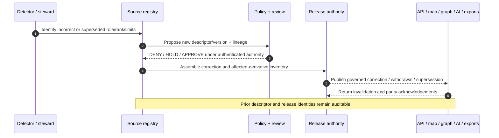
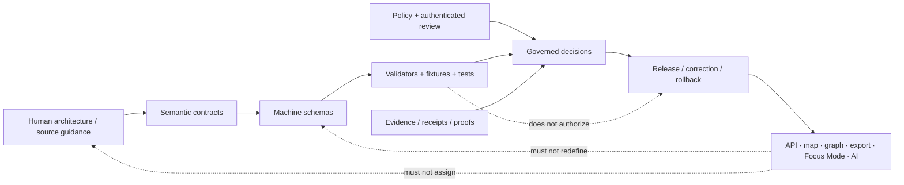

<!-- [KFM_META_BLOCK_V2]
doc_id: kfm://doc/architecture/source-role-anti-collapse
title: Source-Role Anti-Collapse — Current Responsibility and Enforcement Map
type: architecture-reference
version: v2.0-draft
status: draft; repository-grounded; non-authoritative; profile-convergence-hold
owners:
  - "@bartytime4life — CODEOWNERS review route only"
  - "NEEDS VERIFICATION — accountable source, evidence, policy, validation, domain, AI-surface, release, and correction stewards"
created: 2026-05-25
updated: 2026-08-19
policy_label: public
owning_root: docs/
current_path: docs/architecture/source-role-anti-collapse.md
responsibility: >-
  Explain the source-role anti-collapse invariant, show how current repository
  contracts, schemas, validators, fixtures, workflows, release-review guidance,
  and downstream consumer surfaces compose, and keep vocabulary, authority,
  runtime, correction, and publication gaps visible without becoming source-role
  doctrine, a vocabulary authority, a machine schema, policy source, review
  record, release decision, or implementation proof.
truth_posture: >-
  CONFIRMED same-path placement, accepted Directory Rules v2 authority, the
  current rich SourceDescriptor schema, deterministic SourceRoleUseRequest
  validator and 14-case no-network fixture profile, fixture-first
  SourceRoleTransitionAssessment profile, read-only workflows, compatibility
  aliases, and current documentation/release-lane overlap / PROPOSED source-role
  contracts and schemas, seven-class transition vocabulary, human vocabulary
  families, production policy, cross-profile mappings, consumer integration,
  correction propagation, and release execution / CONFLICTED vocabulary and
  schema-path projections / UNKNOWN live source activation, deployed API/map/AI
  enforcement, public release parity, and external consumer behavior / NEEDS
  VERIFICATION accountable ownership, accepted vocabulary, authenticated
  references, active policy bundle, runtime wiring, and structural convergence.
evidence_snapshot:
  repository: bartytime4life/Kansas-Frontier-Matrix
  base_ref: main
  base_commit: 8d2535d3231c81b3d7bc32dff660ad8cc7983f64
  target_prior_blob: f95d549968a90e1a1c06f66f84c5a9a08857f020
  source_descriptor_schema_blob: 582e70b834278c3c6ca9a8b31efbe0989c96f0bc
  plural_schema_alias_blob: 42da54b28a527850cce88ad89f68921c101fc56b
  source_role_use_contract_blob: 6bc07a551511cc8fca8024625cf962e15f77eed0
  source_role_use_schema_blob: e9c5b9f90dd3a77a6f1164b56571fa9d697ef193
  source_role_core_blob: 84c67aa4be17fa2cd5848b556162dfe53698f2e7
  source_role_rules_blob: aa94f33d5e91b10f8b17a2ea88e4c337c45a23bc
  source_role_cli_blob: 01d0707c367a5908a7c867181421d2a21eb9f1c7
  source_role_test_blob: 580c698e53b5144a0f6061d3f5fbc30942485156
  source_role_fixture_blob: 7cb054fc81674b9e8f25e421919a80c3a8f72fe7
  source_role_workflow_blob: 77524dc0f7e468cb111c4a69179f4f8a183f5ff2
  transition_contract_blob: 8da34b5bcf95f0b7319f2fa6a30104a63bc7dac3
  transition_schema_blob: 48c8dfded26ba54840c47c4c6b08a434ffea83ff
  transition_validator_blob: c97b96c6a8c7536649b51146d8fec672d1fe0876
  transition_test_blob: 41b9a389397a8b371b8eaaeaaf62ffc5d4f63a4b
  transition_workflow_blob: 7c10968f5a36c38be8ef1ff8b803955820eaa93a
  release_rego_scaffold_blob: 8664dcfb547443c2a3d94021e577bc9b14b48bf9
related:
  - README.md
  - document-convergence-plan.md
  - sensitivity.md
  - contract-schema-policy-split.md
  - governed-api.md
  - ../sources/source-roles.md
  - ../sources/SOURCE_DESCRIPTOR_STANDARD.md
  - ../doctrine/directory-rules.md
  - ../adr/ADR-0029-adopt-directory-governance-standard-v2.md
  - ../atlases/source-role-anti-collapse.md
  - ../atlas/source-role-anti-collapse.md
  - ../intake/exploratory/source-role-anti-collapse-source-map.md
  - ../../contracts/source/source_descriptor.md
  - ../../contracts/source/source_role_use_request.md
  - ../../contracts/source/source_role_transition_assessment.md
  - ../../schemas/contracts/v1/source/source_descriptor.schema.json
  - ../../schemas/contracts/v1/sources/source_descriptor.schema.json
  - ../../schemas/contracts/v1/source/source_role_use_request.schema.json
  - ../../schemas/contracts/v1/source/source_role_transition_assessment.schema.json
  - ../../tools/validators/source_role/validate_source_role.py
  - ../../tools/validators/source_role/validate_source_role_transition_assessment.py
  - ../../tests/validators/test_validate_source_role.py
  - ../../tests/source/test_source_role_transition_assessment.py
  - ../../.github/workflows/source-role-anti-collapse.yml
  - ../../.github/workflows/source-role-transition-assessment.yml
tags: [kfm, architecture, source-role, anti-collapse, SourceDescriptor, authority-rank, claim-role, admission, evidence, policy, validation, release, correction, trust-membrane]
notes:
  - "v2.0 replaces proposal-era repository claims with a commit-pinned current-responsibility and enforcement map."
  - "The same path receives PLACE under accepted ADR-0029; no source-role vocabulary, schema, contract, policy, registry, fixture, validator, workflow, release lane, or public surface is moved or created."
  - "The seven Atlas role classes remain visible as lineage and as the transition-assessment profile vocabulary; they are not represented as the sole current SourceDescriptor enum."
  - "The current SourceDescriptor schema, SourceRoleUseRequest profile, and SourceRoleTransitionAssessment profile are all proposed or inactive and create no source, truth, policy, review, release, publication, or public-use authority."
  - "Legacy numbered H2 headings, the top anchor, and the legacy title anchor are retained for inbound-link compatibility."
[/KFM_META_BLOCK_V2] -->

<a id="top"></a>
<a id="source-role-anti-collapse--architecture"></a>

# Source-Role Anti-Collapse — Current Responsibility and Enforcement Map

> **One-line rule.** A downstream KFM surface may preserve, narrow, qualify, or refuse an admitted source posture, but it must never silently strengthen the source role, authority rank, claim scope, evidence status, review state, release state, or public-use permission.

| Field | Current bounded result |
|---|---|
| **Document role** | Cross-cutting architecture explanation under `docs/architecture/`; not a source-role vocabulary, semantic contract, schema, policy, registry, validator result, review record, release decision, or runtime authority. |
| **Evidence snapshot** | `main@8d2535d3231c81b3d7bc32dff660ad8cc7983f64`; prior target blob `f95d549968a90e1a1c06f66f84c5a9a08857f020`. |
| **Placement authority** | Accepted [`ADR-0029`](../adr/ADR-0029-adopt-directory-governance-standard-v2.md) makes [`docs/doctrine/directory-rules.md`](../doctrine/directory-rules.md) the writable Directory Rules authority. This existing cross-root architecture page receives same-path `PLACE`. |
| **Current SourceDescriptor shape** | A proposed Draft 2020-12 schema exists at [`schemas/contracts/v1/source/source_descriptor.schema.json`](../../schemas/contracts/v1/source/source_descriptor.schema.json). It requires source role, authority rank, claim admissibility, rights, sensitivity, review, release, lifecycle, and related source-governance fields. |
| **Schema-path seam** | The singular schema says the plural path is canonical; the plural path is a proposed compatibility alias that points back to the singular implementation schema. This is **CONFLICTED metadata / compatibility posture**, not two independent shape authorities. |
| **Downstream-use validator** | `SourceRoleUseRequest` has a proposed-inactive, deterministic, no-network profile with six finite outcomes, 14 exact synthetic cases, focused tests, a compatibility shim, and a read-only workflow. |
| **Transformation validator** | `SourceRoleTransitionAssessment` has a separate proposed, fixture-first, no-network profile for passthrough, generalization, lifecycle promotion, aggregation, modeling, and synthesis. |
| **Vocabulary posture** | The repository currently exposes at least three related vocabularies: a 16-value SourceDescriptor enum, a seven-class transition profile, and a broader human source-role reference. No accepted global crosswalk was proved. |
| **Policy posture** | Domain and release-oriented Rego files exist in mixed locations and maturity. The root `release/source_role_anti_collapse.rego` is a four-line proposed scaffold, not an active policy bundle. |
| **Release posture** | `release/source_role_anti_collapse/README.md` is release-review guidance only. It does not authenticate review, execute policy, issue a decision, or release an artifact. |
| **Runtime posture** | No deployed source-role resolver, authenticated EvidenceRef chain, governed API integration, map/UI enforcement, AI-output lint, public alias, or production release path was established by this evidence slice. |
| **Mutation effect** | This revision changes one explanatory Markdown page. It does not assign a role, activate a source, mutate a descriptor, change policy, approve review, promote lifecycle state, release, deploy, or publish. |

> [!IMPORTANT]
> **The invariant is stronger than any one vocabulary.** The current repository has useful executable slices, but the role names differ by profile. This page therefore explains the shared anti-collapse law and each profile's exact boundary. It does not choose a universal enum, invent a crosswalk, or treat Atlas terminology as current machine authority.

> [!CAUTION]
> **A validator `PASS` is compatibility evidence only.** It does not resolve or authenticate the supplied references, verify source claims, decide rights or sensitivity, approve review, activate a source, persist release state, or authorize public use.

> [!WARNING]
> **Presentation can collapse authority even when stored data is correct.** A map label, popup, legend, export caption, graph edge, Focus Mode answer, embedding, or AI summary can silently turn a model into an observation, an aggregate into per-place truth, a candidate into a verified record, or contextual material into primary authority. The public and interpretive surfaces remain on operational `HOLD` until their role-preservation behavior is proved.

---

## Contents

- [1. Purpose & scope](#1-purpose--scope)
- [2. The single rule](#2-the-single-rule)
- [3. The seven canonical source roles](#3-the-seven-canonical-source-roles)
- [4. SourceDescriptor field shape](#4-sourcedescriptor-field-shape)
- [5. The seven collapse patterns](#5-the-seven-collapse-patterns)
- [6. Roles are set at admission, not by promotion](#6-roles-are-set-at-admission-not-by-promotion)
- [7. Per-domain hot spots](#7-per-domain-hot-spots)
- [8. The AI surface — where collapse is easiest](#8-the-ai-surface--where-collapse-is-easiest)
- [9. Validators, fixtures, and enforcement](#9-validators-fixtures-and-enforcement)
- [10. Lifecycle integration](#10-lifecycle-integration)
- [11. Per-surface enforcement](#11-per-surface-enforcement)
- [12. Correction path](#12-correction-path)
- [13. Anti-patterns](#13-anti-patterns)
- [14. Where this lives in the repository](#14-where-this-lives-in-the-repository)
- [15. Verification backlog](#15-verification-backlog)
- [16. Related docs](#16-related-docs)
- [Appendix A — Per-role worked examples](#appendix-a--per-role-worked-examples)

---

## 1. Purpose & scope

This page owns one responsibility: explain how KFM prevents source authority from being silently strengthened as source posture crosses contracts, schemas, validators, lifecycle stages, release review, APIs, maps, graphs, exports, embeddings, and AI interpretation.

The page connects five independently owned questions:

1. **What role and authority posture did the admitted descriptor declare?**
2. **Which claim roles and uses did that descriptor allow or prohibit?**
3. **Did a transformation create a new derived role with the required lineage and process receipt?**
4. **Does the requested consumer preserve those limits and carry the required evidence, policy, review, release, correction, and rollback references?**
5. **Does the presentation tell the user what the source actually supports instead of implying a stronger claim?**

### 1.1 Directory Rules basis

This page already lives under the human-readable architecture responsibility root. Accepted Directory Rules keep the connected authorities separate:

| Responsibility | Current owning surface | This page may do |
|---|---|---|
| Universal anti-collapse architecture | `docs/architecture/source-role-anti-collapse.md` | Explain composition, current implementation slices, tensions, and holds. |
| Human source-role reference | [`docs/sources/source-roles.md`](../sources/source-roles.md) | Cite and compare; do not silently promote it to accepted machine vocabulary. |
| SourceDescriptor meaning | [`contracts/source/source_descriptor.md`](../../contracts/source/source_descriptor.md) | Report current draft semantics; do not redefine fields. |
| Downstream-use meaning | [`contracts/source/source_role_use_request.md`](../../contracts/source/source_role_use_request.md) | Explain its bounded request/assessment semantics. |
| Transformation meaning | [`contracts/source/source_role_transition_assessment.md`](../../contracts/source/source_role_transition_assessment.md) | Explain its bounded transformation semantics. |
| Machine shape | `schemas/contracts/v1/source/` plus the plural compatibility alias | Report exact current schemas and the path seam; do not choose canonicality. |
| Admissibility | `policy/`, accepted evaluators, and decision records | Report current scaffolds and gaps; never infer allow. |
| Source registry records | `data/registry/sources/` and accepted registry homes | Point to the responsibility; do not create or mutate records. |
| Executable validation | `tools/validators/source_role/` | Describe current deterministic checks and non-effects. |
| Synthetic proof | `fixtures/`, `tests/`, and read-only workflows | State exact bounded proof; do not turn tests into release authority. |
| Release review and decisions | `release/` | Distinguish guidance from authenticated decisions and persisted release state. |
| Public/runtime consumption | Governed application and runtime roots | Define architecture requirements; do not claim deployed enforcement without evidence. |

The architecture-convergence plan classifies source role as a P2 overlap cluster: keep one universal rule, route taxonomy/catalog material toward source documentation, and narrow seam pages. This same-path update performs only the first part—narrowing this page to the universal rule and current enforcement map. It moves, merges, redirects, or retires nothing.

### 1.2 In scope

- the shared anti-collapse invariant;
- the current SourceDescriptor role/rank/claim vocabulary;
- the seven-class transition profile and its limits;
- the broader human reference vocabulary and current crosswalk gap;
- the current downstream-use and transformation validators;
- fixture and workflow boundaries;
- role preservation across lifecycle and consumer surfaces;
- correction, supersession, retirement, and rollback expectations;
- current directory, policy, release-review, and documentation overlap;
- production-graduation evidence.

### 1.3 Out of scope

This page does **not**:

- accept, merge, rename, or retire a role vocabulary;
- assign a source role or authority rank;
- amend `SourceDescriptor`, a domain source-role matrix, or an admissibility rule;
- authenticate an EvidenceRef, PolicyDecision, ReviewRecord, ReleaseManifest, correction, or rollback reference;
- inspect live source endpoints or activate connectors;
- create policy decisions, review approvals, source-registry records, receipts, proofs, release records, or public artifacts;
- move the plural/singular schema paths or release-root Rego scaffold;
- normalize domain-specific source semantics into one generic enum;
- claim that current synthetic validators protect deployed API, map, graph, export, embedding, Focus Mode, or AI behavior;
- make KFM an alert, legal-title, emergency, or observation authority.

[Back to top](#top)

---

## 2. The single rule

> **The admitted source posture must survive every downstream use without silent strengthening.**

“Source posture” is intentionally broader than one field. In the current rich descriptor it includes at least:

- `source_role`;
- `authority_rank`;
- `admissibility_limits.allowed_claim_roles`;
- `admissibility_limits.prohibited_claim_roles`;
- `admissibility_limits.confidence_posture`;
- rights and sensitivity defaults;
- review and release states;
- lifecycle and supersession metadata;
- public-release conditions.

A consumer may **narrow** this posture. It may use an authoritative source only as context, hide a sensitive field, restrict exposure, abstain, or deny. It may not silently make any of these changes in the stronger direction:

```text
modeled or interpreted     -> observed or measured
aggregate or aggregator    -> per-place or individual truth
candidate                  -> verified
contextual/corroborating   -> primary or authoritative
administrative             -> legal title or physical observation
synthetic/derived          -> observed reality
role metadata              -> claim truth / evidence closure / policy approval
```

### 2.1 Role preservation versus derivation

Anti-collapse does not forbid creating a new derived object. It requires the derivation to be explicit.

| Operation | Correct architectural treatment |
|---|---|
| Carry one source through normalization, generalization, or lifecycle promotion | Preserve the admitted role/rank and limitations. |
| Aggregate observations | Create a new aggregate output with input-role lineage and an `AggregationReceipt` reference. |
| Run a model | Create a modeled output with input-role lineage and a `ModelRunReceipt` reference. |
| Create a synthetic representation | Create a synthetic output with a `RepresentationReceipt` and Reality Boundary Note. |
| Correct or supersede an admitted descriptor | Issue a new governed descriptor/version and lineage; do not mutate authority silently in a downstream carrier. |
| Refuse unsupported use | Return `ABSTAIN`, `DENY`, `HOLD`, `RESTRICT`, or `ERROR` as appropriate. |

### 2.2 What current executable profiles prove

The repository currently proves two bounded forms of the rule:

- **SourceRoleUseRequest:** a complete descriptor snapshot and requested downstream use can be checked for role/rank preservation, claim-role compatibility, public-surface prerequisites, deterministic identity, and explicit non-authority.
- **SourceRoleTransitionAssessment:** a declared transformation can be checked for role-consistent output, input-role lineage, required process-receipt references, and candidate-input holds.

Neither profile authenticates real references or executes a production transition.

[Back to top](#top)

---

## 3. The seven canonical source roles

The legacy Atlas and this page's prior edition use seven role classes:

```text
Observed · Regulatory · Modeled · Aggregate · Administrative · Candidate · Synthetic
```

Those classes remain useful as a **conceptual anti-collapse register** and are the exact uppercase enum used by the current proposed `SourceRoleTransitionAssessment` schema. They are not the sole current SourceDescriptor machine vocabulary.

### 3.1 Current profile map

| Seven-class concept | Transition profile enum | Related current SourceDescriptor role values | Current conclusion |
|---|---|---|---|
| Observed | `OBSERVED` | `observation`, `occurrence_evidence`, `remote_sensing_observation`, sometimes `authoritative_for_claim` within a bounded claim | No one-to-one universal mapping is accepted. Method, authority rank, and allowed claim role matter. |
| Regulatory | `REGULATORY` | `regulatory_context`; legal cases may also use `legal_context` | Regulatory or legal authority remains distinct from physical observation. |
| Modeled | `MODELED` | `model_context`; some released outputs may be `derived_public_product` | A derived public carrier does not become an observation merely because it was released. |
| Aggregate | `AGGREGATE` | `aggregator` describes an aggregator source, while an aggregate output may be `derived_public_product`; the current schema has no single exact aggregate-output role | This is an explicit cross-profile seam. Do not map `aggregator` to `AGGREGATE` mechanically. |
| Administrative | `ADMINISTRATIVE` | May be bounded through `authoritative_for_claim`, `legal_context`, `operational_context`, `historical_context`, or contextual roles depending on the claim | The rich schema models authority and claim compatibility separately rather than using one administrative enum. |
| Candidate | `CANDIDATE` | `candidate_signal`; `fixture_only` is a separate non-public posture | Candidate material remains non-public unless a separate governed source/record transition closes. |
| Synthetic | `SYNTHETIC` | `derived_public_product`, `model_context`, or `fixture_only` may be relevant depending on the object; no universal mapping is accepted | Synthetic representation needs explicit reality-boundary support and cannot imply observation. |

> [!IMPORTANT]
> **Do not treat this table as a crosswalk contract.** It is an architecture comparison that exposes the current seam. A production mapping needs an owning semantic contract, version, fixtures, compatibility rules, domain review, and an accepted decision.

### 3.2 Current rich SourceDescriptor vocabulary

The current proposed schema defines these 16 values:

```text
authoritative_for_claim
regulatory_context
legal_context
observation
occurrence_evidence
aggregator
operational_context
remote_sensing_observation
model_context
candidate_signal
historical_context
corroborating_context
derived_public_product
steward_review_source
citation_source
fixture_only
```

It also defines `authority_rank` and `claim_role` vocabularies. A role value therefore cannot be interpreted safely without its authority rank, admissibility limits, confidence posture, rights, sensitivity, review, and release state.

### 3.3 Human vocabulary reference

[`docs/sources/source-roles.md`](../sources/source-roles.md) documents additional human-facing families such as primary evidence, corroborating evidence, context, administrative record, monitoring reference, operational notice, scientific interpretation, model product, remote-sensing product, community observation, historical source, generated derivative, restricted source, and unknown/unclassified.

That document is useful source-governance guidance. Its status remains proposed, and its terms are not automatically JSON enum values.

[Back to top](#top)

---

## 4. SourceDescriptor field shape

### 4.1 Current machine shape

The current rich schema is:

```text
schemas/contracts/v1/source/source_descriptor.schema.json
```

It is Draft 2020-12, `additionalProperties: false`, and marked `PROPOSED`. It requires:

| Family | Required fields |
|---|---|
| Identity | `object_type`, `schema_version`, `source_id`, `descriptor_version`, `title` |
| Classification | `source_type`, `source_role`, `authority_rank` |
| Accountability | `publisher`, `owner_or_steward` |
| Rights and sensitivity | `rights`, `sensitivity_default` |
| Time and access | `cadence`, `access`, `source_head` |
| Citation and admissibility | `citation`, `admissibility_limits` |
| Governance state | `public_release`, `review_state`, `release_state`, `lifecycle` |

Optional fields include domain scope, secondary roles, connectors, governance references, `spec_hash`, and deprecated migration aliases.

### 4.2 Source role is not enough

The current schema deliberately separates related questions:

| Field or object | Question answered | What it does not prove |
|---|---|---|
| `source_role` | How may this source contribute? | That a claim is true or publicly usable. |
| `authority_rank` | How strong is the source within that role? | Evidence closure or legal/public permission. |
| `allowed_claim_roles` / `prohibited_claim_roles` | Which claim types may this source support? | That required EvidenceBundles or reviews exist. |
| `confidence_posture` | How cautiously should claims use it? | A probability or scientific uncertainty model. |
| `rights` | What terms or permissions are known? | Sensitivity clearance or release approval. |
| `sensitivity_default` | What protective posture starts by default? | Audience or release state. |
| `review_state` | What review posture is recorded? | Authenticated review unless the record is resolved and verified. |
| `release_state` / `public_release` | What release posture is declared? | A persisted, governed ReleaseManifest or public route. |
| `lifecycle` | Registry creation, update, supersession, and state | Data lifecycle promotion or public publication by itself. |

### 4.3 Schema-path conflict

The singular schema's metadata declares:

```text
canonical_schema_path = schemas/contracts/v1/sources/source_descriptor.schema.json
legacy_schema_path    = schemas/contracts/v1/source/source_descriptor.schema.json
```

The plural file currently exists only as a proposed compatibility `$ref` alias and identifies the singular rich schema as the canonical implementation shape. This creates a circular naming claim:

```text
singular implementation says plural is canonical
plural alias says singular is implementation authority
```

This page records the conflict and keeps both paths untouched. Resolving it requires consumer inventory, `$id` and `$ref` closure, validator/schema-registry review, migration tests, and rollback—not a documentation assertion.

### 4.4 Deprecated fields

The rich schema retains legacy aliases such as `id`, `domain`, `role`, `authority`, `sensitivity_floor`, `update_cadence`, `access_posture`, and `citation_template` for migration. New architecture and validators should use the rich fields rather than treating the legacy aliases as a second contract.

[Back to top](#top)

---

## 5. The seven collapse patterns

The seven patterns remain the architecture's stable risk register. The final column distinguishes current executable proof from production enforcement.

| # | Collapse pattern | Required safe posture | Current bounded evidence |
|---:|---|---|---|
| 1 | **Modeled or interpreted output represented as observed.** | Preserve model role, method, uncertainty, inputs, and model-run support; deny observed framing. | Transition profile denies a `MODEL` operation whose output is not `MODELED` and requires `model_run_receipt_ref`; focused test covers modeled-as-observed mismatch. |
| 2 | **Regulatory or legal context represented as an observed event.** | Keep regulatory/legal claim roles and presentation distinct from observations. | SourceRoleUseRequest can deny incompatible claim roles when the descriptor declares the correct admissibility limits. No deployed regulatory/event UI parity was proved. |
| 3 | **Aggregate or aggregator material represented as per-place or individual truth.** | Preserve aggregation scope, input lineage, suppression/uncertainty, and an aggregation receipt; deny unsupported joins. | Transition profile requires `AGGREGATE` output plus `aggregation_receipt_ref`. The generic use-request validator enforces declared claim limits, but no universal geometry-scope join validator was proved here. |
| 4 | **Administrative record represented as physical observation or legal title beyond its authority.** | Preserve the administrative claim boundary, authority rank, jurisdiction, date, and allowed claim roles. | Rich descriptor can express legal, operational, historical, contextual, and authoritative-within-claim roles. No accepted generic administrative crosswalk or title-truth runtime was proved. |
| 5 | **Candidate or fixture-only material exposed as verified public evidence.** | Hold unresolved candidates; deny public use of `candidate_signal` and `fixture_only`; require separate governed resolution. | SourceRoleUseRequest denies public candidate/fixture roles; transition profile holds candidate inputs for promotion, aggregation, modeling, or synthesis. |
| 6 | **Synthetic reconstruction or representation presented as observed reality.** | Mark synthetic status, preserve input roles, require RepresentationReceipt and Reality Boundary Note, and expose the limitation. | Transition profile requires `SYNTHETIC` output plus both support refs. No deployed scene/map/UI badge behavior was proved. |
| 7 | **AI prose or other carrier treated as evidence or authority.** | Resolve evidence separately, keep authority claims false, deny AI-inferred role, cite or abstain, and persist the applicable receipt when adopted. | SourceRoleUseRequest denies `role_origin: AI_INFERRED` and any true authority-claim flag. It does not inspect natural-language phrasing or prove AIReceipt/runtime integration. |

### 5.1 Finite failure posture

Depending on the profile and consequence, anti-collapse may produce:

- `DENY` for silent role/rank strengthening, incompatible claims, overclaim, denied rights, or public leakage;
- `ABSTAIN` when the admitted confidence posture cannot support the requested claim;
- `HOLD` when support, review, release, or governed role-change lineage is incomplete;
- `RESTRICT` when internal or steward use is permitted but public use is not;
- `ERROR` for malformed, non-canonical, contradictory, or unevaluable input.

A candidate profile returning `PASS` does not authorize the downstream action.

[Back to top](#top)

---

## 6. Roles are set at admission, not by promotion

### 6.1 Current rule

The current contracts and executable slices converge on this narrower formulation:

> A role/rank declared by an admitted `SourceDescriptor` is not changed by lifecycle promotion or downstream presentation. A change in descriptor authority requires explicit correction, supersession, or retirement lineage; a derived object receives its own role under a declared transformation.

This avoids two errors in the prior edition:

1. treating every role distinction as one seven-value SourceDescriptor enum; and
2. describing candidate resolution as though lifecycle promotion itself converted a candidate role into observed authority.

### 6.2 Current downstream role-change behavior

`SourceRoleUseRequest.use.role_change.kind` permits:

```text
NONE · CORRECTION · SUPERSESSION · RETIREMENT
```

The current validator behaves as follows:

| Declared condition | Current result |
|---|---|
| Propagated role/rank match descriptor and `kind = NONE` | Continue other checks; may `PASS`, `ABSTAIN`, `RESTRICT`, `HOLD`, or `DENY` for other reasons. |
| Propagated role/rank change silently or without lineage | `DENY` with role-collapse and missing-lineage findings. |
| Propagated role/rank change with correction/supersession/retirement lineage | `HOLD`; the validator does not mutate the descriptor. |
| Role-change kind supplied without an actual delta | `ERROR`. |
| Lineage supplied while kind is `NONE` | `ERROR`. |

### 6.3 Current transformation behavior

The transition profile models creation of new outputs:

| Operation | Output rule | Required support |
|---|---|---|
| `PASSTHROUGH` | Same role as the single input role | Input EvidenceBundle ref declared. |
| `GENERALIZE` | Same role as the single input role | Input EvidenceBundle ref declared; public-safety sufficiency is not proved. |
| `PROMOTE_LIFECYCLE` | Same role as the single input role | Candidate input remains `HOLD`. |
| `AGGREGATE` | Output role `AGGREGATE` | `aggregation_receipt_ref`. |
| `MODEL` | Output role `MODELED` | `model_run_receipt_ref`. |
| `SYNTHESIZE` | Output role `SYNTHETIC` | `representation_receipt_ref` and `reality_boundary_note_ref`. |

The output also carries the distinct set of input roles in `lineage_roles`.

### 6.4 What remains unproved

- authenticated descriptor admission;
- registry persistence and immutable versioning;
- an accepted role-change decision contract;
- correction notice issuance;
- real EvidenceBundle resolution;
- domain-specific source-role mapping;
- production lifecycle or release execution;
- downstream derivative invalidation.

[Back to top](#top)

---

## 7. Per-domain hot spots

Domain lanes share the anti-collapse invariant but retain their own meanings. The generic validator must not erase those bounded contexts.

| Domain or seam | Typical collapse risk | Role-correct distinction | Current maturity in this architecture slice |
|---|---|---|---|
| Atmosphere / air | Model field or low-cost sensor correction presented as regulatory-grade observation | Sensor observation, corrected derivative, model context, forecast, and regulatory determination remain distinct | Domain policy files exist in mixed forms; no current end-to-end public parity proved. |
| Hydrology / hazards | NFHL regulatory designation presented as current flooding; modeled hydrograph presented as gauge observation | Regulatory context, observed event, gauge observation, model output, and operational notice remain distinct | Domain source-role matrices exist; generic validators prove only declared compatibility. |
| Agriculture / frontier matrix | County-year aggregate joined to a farm, parcel, or person | Aggregate output carries aggregation scope and receipt; per-place claims require separate evidence | Transition profile covers aggregate output role; universal join-scope enforcement remains unproved. |
| Geology / natural resources | Interpreted map, resource estimate, production record, legal/administrative status, and observed sample collapsed | Observed, interpreted/modeled, aggregate, regulatory, production, and public-safe products remain separate | Domain Rego and matrices exist in multiple locations; active bundle and production behavior remain unknown. |
| Flora / fauna / habitat | Aggregator or model presented as steward-confirmed occurrence; precise sensitive occurrence leaked | Original occurrence, aggregator, community observation, suitability model, regulatory listing, and public-safe derivative remain distinct | Domain validators/policies are uneven; geoprivacy and role enforcement require joint proof. |
| Archaeology / cultural heritage | Remote-sensing anomaly or reconstruction presented as verified site or observed past reality | Candidate, observation, administrative record, interpretation, synthetic reconstruction, and restricted source remain distinct | Sensitive review and reality-boundary behavior remain production holds. |
| People / DNA / land | Assessor or administrative record presented as title truth; aggregate joined to a living person | Administrative, legal, historical, aggregate, candidate, and restricted sources remain distinct | High-risk joins default deny; no title or identity authority is created by this architecture. |
| Settlements / roads / infrastructure | Facility roster or administrative boundary presented as observed operational event | Administrative inventory, observation, operational notice, legal/regulatory status, and sensitive asset detail remain distinct | Runtime exposure and critical-asset controls require separate evidence. |
| Planetary / 3D / map representation | Derived terrain, generalized geometry, or reconstruction presented as source-native observation | Representation lineage and Reality Boundary Note remain visible | Transition profile supplies a synthetic precursor; renderer integration remains unproved. |
| Governed AI / all domains | Fluent text removes role, time, scope, uncertainty, or source authority | Answer cites released evidence and preserves role/rank/limits, or returns a finite negative outcome | AI-inferred role denial is implemented in fixtures; prose lint and deployed AI receipts remain unproved. |

### 7.1 Domain-specific matrices outrank generic guesses

Current domain source-role matrices and policies are evidence of lane-specific work, but their maturity and vocabulary vary. The generic source-role profiles should act as an **anti-corruption layer**, not as a replacement for domain contracts. Any cross-domain crosswalk must preserve:

- native source identity;
- role and authority rank;
- spatial and temporal support;
- uncertainty and method;
- rights and sensitivity;
- allowed and prohibited claim roles;
- correction lineage.

[Back to top](#top)

---

## 8. The AI surface — where collapse is easiest

AI is especially risky because its normal operation is paraphrase. A fluent answer can erase every visible distinction without changing the underlying data.

### 8.1 Current executable AI-related checks

The current SourceRoleUseRequest profile includes `AI` as a consumer surface and provides two concrete protections:

1. `role_origin: AI_INFERRED` produces `DENY`;
2. every field under `use.authority_claims` must remain false:
   - `claim_truth`;
   - `evidence_closure`;
   - `policy_approval`;
   - `release_approval`;
   - `public_permission`.

It can also return `ABSTAIN` when the source confidence posture is too weak for a primary claim and `HOLD` when public-support references are absent.

### 8.2 What it does not inspect

The current profile does not parse or lint generated prose. It does not detect wording such as:

- “is” where the support is a forecast or model;
- “measured” where the support is interpreted or derived;
- “at this location” where the support is aggregate;
- “verified” where the source is candidate;
- “current” where source freshness is expired;
- an emergency instruction authored by KFM.

The prior page proposed an upcasting ban list and AIReceipt sampling. Current repository evidence in this slice does not prove an accepted ban-list contract, a natural-language validator, a required AIReceipt on every output, sampling cadence, model-upgrade replay, or production Focus Mode wiring.

### 8.3 Production AI rule

A production AI response should:

```text
define scope
  -> resolve released evidence
  -> preserve each source role and authority rank
  -> apply rights, sensitivity, review, release, and freshness checks
  -> distinguish observation / regulation / model / aggregate / context
  -> produce ANSWER, ABSTAIN, DENY, or ERROR
  -> persist an auditable receipt when the adopted runtime contract requires it
```

AI must never assign source role, authenticate evidence, decide policy, approve release, or manufacture authority through wording.

[Back to top](#top)

---

## 9. Validators, fixtures, and enforcement

Two current profiles implement different slices of the architecture.

### 9.1 SourceRoleUseRequest profile

| Surface | Current repository evidence | Safe conclusion |
|---|---|---|
| Contract | [`contracts/source/source_role_use_request.md`](../../contracts/source/source_role_use_request.md) | Proposed-inactive meaning for a downstream-use assessment. |
| Shape | [`source_role_use_request.schema.json`](../../schemas/contracts/v1/source/source_role_use_request.schema.json) plus full descriptor validation | Closed request envelope with all consequential permissions and non-effects fixed false. |
| Core | [`source_role_core.py`](../../tools/validators/source_role/source_role_core.py) | Bounded UTF-8 JSON, duplicate/non-finite rejection, schema loading, current vocabulary extraction, deterministic request identity, finite reports. |
| Rules | [`source_role_rules.py`](../../tools/validators/source_role/source_role_rules.py) | Role/rank preservation, claim compatibility, rights/sensitivity/public checks, overclaim denial, finite outcome precedence. |
| CLI | [`validate_source_role.py`](../../tools/validators/source_role/validate_source_role.py) | File validation and exact fixture replay; no network calls. |
| Compatibility | `tools/validators/sources/validate_source_role.py` | Plural-path shim delegates to the canonical source-role entrypoint; no second grammar. |
| Fixtures | [`cases.json`](../../fixtures/contracts/v1/source/source_role_use_request/cases.json) | 14 exact cases covering positive and all six finite outcomes. |
| Tests | [`test_validate_source_role.py`](../../tests/validators/test_validate_source_role.py) | Schema self-check, exact polarity, deterministic identity, no network, compatibility parity, CLI exit codes. |
| Workflow | [`source-role-anti-collapse.yml`](../../.github/workflows/source-role-anti-collapse.yml) | Read-only CI orchestration with no-network environment and generated-receipt validation. |

The exact fixture set covers:

```text
PASS:
  pass_internal_map
  pass_public_map

RESTRICT:
  restrict_steward_sensitive

ABSTAIN:
  abstain_context_only

HOLD:
  hold_role_change_with_lineage
  hold_public_missing_support

DENY:
  deny_ai_inferred
  deny_collapse_without_lineage
  deny_claim_incompatible
  deny_public_surface_leakage
  deny_source_role_overclaim

ERROR:
  error_request_id_drift
  error_noncanonical_claim_roles
  error_closed_schema
```

Outcome and CLI mapping:

| Outcome | Exit | Meaning inside this profile |
|---|---:|---|
| `PASS` | 0 | Declared snapshot/use are internally compatible. |
| `ERROR` | 2 | Input, schema, ordering, identity, or internal state is invalid. |
| `HOLD` | 3 | Governed support or role-change closure is incomplete. |
| `RESTRICT` | 4 | Use is limited to internal or steward exposure. |
| `ABSTAIN` | 5 | Source posture cannot support the requested claim. |
| `DENY` | 6 | Silent collapse, AI inference, overclaim, incompatible use, rights denial, or public leakage is present. |

Precedence is `ERROR > DENY > HOLD > RESTRICT > ABSTAIN > PASS`.

### 9.2 SourceRoleTransitionAssessment profile

| Surface | Current repository evidence | Safe conclusion |
|---|---|---|
| Contract | [`source_role_transition_assessment.md`](../../contracts/source/source_role_transition_assessment.md) | Proposed, fixture-first transformation meaning. |
| Shape | [`source_role_transition_assessment.schema.json`](../../schemas/contracts/v1/source/source_role_transition_assessment.schema.json) | Seven uppercase roles, six operations, four outcomes, refs, lineage roles, fixed-false authority flags. |
| Validator | [`validate_source_role_transition_assessment.py`](../../tools/validators/source_role/validate_source_role_transition_assessment.py) | Bounded local schema and semantic checks; fixture-only scope. |
| Fixtures | `fixtures/contracts/v1/source/source_role_transition_assessment/{valid,invalid}/` | Non-empty positive and negative transformation matrix. |
| Tests | [`test_source_role_transition_assessment.py`](../../tests/source/test_source_role_transition_assessment.py) | Schema validity, fixture polarity, modeled-as-observed denial, candidate-promotion hold. |
| Workflow | [`source-role-transition-assessment.yml`](../../.github/workflows/source-role-transition-assessment.yml) | Read-only, no-network focused execution and generated-receipt check. |

This profile's hash helper uses deterministic sorted JSON plus SHA-256 with `spec_hash` omitted. It should not be described as RFC 8785 JCS until implementation parity with the shared hashing authority is verified.

### 9.3 Workflow and policy boundary

Both specialized workflows:

- use `contents: read`;
- persist no source, descriptor, decision, release, or public artifact;
- receive no source or publication authority;
- declare no-network fixture behavior;
- record explicit non-effects.

Neither workflow currently lists this architecture page in its path filter. A docs-only update to this page does not independently rerun or prove either implementation profile.

The repository also contains policy-shaped files, including domain rules and a root `release/source_role_anti_collapse.rego`. The root file is only:

```rego
package kfm.generated.release.source_role_anti_collapse
default allow := false
```

It labels itself a proposed scaffold. Its presence is not proof of an active canonical bundle, evaluator, CI/runtime parity, or release enforcement. Policy source under `release/` is also placement drift under the current release-root contract; migration remains separate governed work.

[Back to top](#top)

---

## 10. Lifecycle integration

Source role intersects two state systems that must remain separate:

1. **source/registry posture** — proposed, active, quarantined, retired, superseded;
2. **data and release lifecycle** — Pre-RAW, RAW, WORK/QUARANTINE, PROCESSED, CATALOG/TRIPLET, candidate, PUBLISHED, corrected, withdrawn, rolled back.

A lifecycle stage says where an artifact is in governed processing. A role says how a source or derived object may support claims. Moving rightward does not strengthen role.


```mermaid
stateDiagram-v2
  [*] --> SOURCE_CANDIDATE: discovery or proposal
  SOURCE_CANDIDATE --> DESCRIPTOR_REVIEW: draft SourceDescriptor
  DESCRIPTOR_REVIEW --> QUARANTINE: role / rights / sensitivity unresolved
  DESCRIPTOR_REVIEW --> RAW: governed admission
  RAW --> WORK: transform or normalize
  WORK --> QUARANTINE: validation / policy / role failure
  WORK --> PROCESSED: deterministic validation
  PROCESSED --> CATALOG: evidence and catalog closure
  CATALOG --> RELEASE_CANDIDATE: assemble candidate
  RELEASE_CANDIDATE --> RELEASE_CANDIDATE: ABSTAIN / DENY / HOLD / ERROR
  RELEASE_CANDIDATE --> PUBLISHED: authenticated governed transition
  PUBLISHED --> CORRECTED: correction / supersession
  PUBLISHED --> WITHDRAWN: withdrawal
  PUBLISHED --> PRIOR_RELEASE: rollback
```

The diagram is an architecture model. Current repository evidence proves only fixture-first assessments, not the operational arrows.

### 10.1 Stage requirements

| Stage | Source-role responsibility | Current evidence |
|---|---|---|
| Discovery / Pre-RAW | Treat discovered role as candidate; do not infer authority from prose, URL, publisher reputation, or AI. | SourceRoleUseRequest denies AI-inferred role; no live admission service proved. |
| Descriptor review / admission | Assign role, rank, claim limits, rights, sensitivity, review, and public posture in a governed descriptor. | Rich proposed schema and contract exist; authenticated admission and registry persistence unproved. |
| WORK / QUARANTINE | Preserve source posture through transformations; hold ambiguity. | Transition profile models role-preserving or role-creating operations over synthetic inputs. |
| PROCESSED | Validate shape, identity, lineage, receipts, and domain semantics. | Focused fixture validators exist; real data/runtime integration unproved. |
| CATALOG / TRIPLET | Preserve role, authority, claim limits, and evidence refs in projections. | `CATALOG` and `GRAPH` consumer values exist in the use-request schema; consumer wiring unproved. |
| Release candidate | Check references, rights, sensitivity, review, release, correction, rollback, and public exposure. | Use-request profile checks declared refs and state; it does not authenticate them. |
| PUBLISHED | Serve only governed public-safe projections with role-visible semantics. | No deployed source-role public parity established. |
| Correction / withdrawal / rollback | Preserve prior descriptor/release identity, issue lineage, invalidate derivatives, and restrict exposure promptly. | Role-change `HOLD` and transition lineage checks are precursors only. |

[Back to top](#top)

---

## 11. Per-surface enforcement

The current SourceRoleUseRequest schema names these downstream surfaces:

```text
INTERNAL_PIPELINE · CATALOG · GRAPH · API · MAP · EXPORT ·
FOCUS_MODE · EMBEDDING · AI
```

The validator can check declared role/rank preservation and requested claim compatibility for each. It does not prove that the real consumer invokes the validator or displays the result.

| Surface | Production requirement | Current bounded evidence | Open risk |
|---|---|---|---|
| Internal pipeline | Carry descriptor identity, role/rank, claim limits, and lineage through every transform. | `INTERNAL_PIPELINE` request value and transition profile. | Real pipeline adapters and persistence unproved. |
| Catalog | Preserve source posture and EvidenceRefs in catalog projections. | `CATALOG` request value. | No STAC/DCAT/catalog consumer integration proved here. |
| Graph | Edge semantics must not turn contextual or aggregate support into entity truth. | `GRAPH` request value and claim compatibility. | Graph schema, edge policy, and query behavior unproved. |
| API | Governed response exposes role, authority, time, limitations, evidence, and finite outcome. | `API` request value and public-support checks. | No deployed route or authenticated ref resolution proved. |
| Map | Layer, legend, popup, label, and Evidence Drawer remain role-distinct. | `MAP` request value; two map fixture passes. | No renderer/style visual regression or payload parity proved. |
| Export | Caption, metadata, citation, release identity, and correction state preserve role. | `EXPORT` request value. | Export generators and detached-file correction behavior unproved. |
| Focus Mode | Answer distinguishes source roles and cites released evidence, or abstains/denies. | `FOCUS_MODE` request value. | No production Focus Mode integration or AIReceipt requirement proved. |
| Embedding | Vector/index records preserve source role and cannot become claim authority. | `EMBEDDING` request value. | Retrieval/reranking and answer-boundary enforcement unproved. |
| AI | Role must originate from SourceDescriptor, authority claims remain false, citations and finite outcomes remain explicit. | `AI_INFERRED` denial and overclaim denial. | No natural-language anti-upcasting validator or model-runtime binding proved. |
| Release review | Review record links the exact candidate, evidence, validation, decisions, correction, and rollback state. | Release-lane README exists as guidance. | No authenticated review record or release authority established. |

### 11.1 Visual and textual parity

A production surface should make these distinctions perceivable:

- observation versus model/forecast;
- regulatory/legal designation versus event;
- source-native record versus aggregator;
- aggregate scope versus feature or individual scope;
- candidate versus reviewed source;
- synthetic or generalized representation versus observation;
- fresh versus stale;
- released versus internal/candidate.

Visual styling is a delivery mechanism. It must follow the governed payload and cannot choose role authority locally.

[Back to top](#top)

---

## 12. Correction path

A role or authority correction is not a silent edit in a map, index, descriptor snapshot, or generated answer.

### 12.1 Current bounded behavior

The downstream-use validator:

- detects propagated role/rank changes;
- requires declared correction, supersession, or retirement lineage;
- returns `HOLD` when a change has lineage;
- returns `DENY` when it is silent;
- never mutates the descriptor;
- fixes every authority and mutation effect to false.

The transition validator:

- verifies input-role lineage on the output;
- denies inconsistent transformation role;
- never writes a registry, lifecycle, release, or public state.

### 12.2 Required production sequence


```mermaid
sequenceDiagram
  autonumber
  participant Detector as Detector / steward
  participant Registry as Source registry
  participant Policy as Policy + review
  participant Release as Release authority
  participant Consumers as API / map / graph / AI / exports

  Detector->>Registry: Identify incorrect or superseded role/rank/limits
  Registry->>Policy: Propose new descriptor/version + lineage
  Policy-->>Registry: DENY / HOLD / APPROVE under authenticated authority
  Registry->>Release: Assemble correction and affected-derivative inventory
  Release-->>Consumers: Publish governed correction / withdrawal / supersession
  Consumers-->>Release: Return invalidation and parity acknowledgements
  Note over Registry,Consumers: Prior descriptor and release identities remain auditable
```

The production flow should preserve:

1. affected descriptor and release identity;
2. evidence for the correction;
3. new descriptor/version or retirement state;
4. correction/supersession lineage;
5. policy and authenticated review;
6. invalidated catalog, graph, API, map, export, embedding, and AI derivatives;
7. replacement or withdrawal release;
8. rollback target;
9. public-safe correction notice where applicable;
10. post-change parity evidence.

### 12.3 Current gaps

Current evidence does not establish:

- a canonical source-role correction object;
- authenticated descriptor registry writes;
- correction-notice schema authority for this seam;
- downstream dependency inventory;
- cache, catalog, graph, tile, search, vector, export, or AI invalidation;
- production alias mutation;
- release or rollback execution.

[Back to top](#top)

---

## 13. Anti-patterns

| Anti-pattern | Why it fails | Required counter-rule |
|---|---|---|
| Treating the seven Atlas roles as the current SourceDescriptor enum | The active proposed schema uses 16 role values plus separate rank and claim-role vocabularies. | Name the profile and version for every vocabulary claim. |
| Treating the 16 schema roles as an accepted universal ontology | The schema is proposed and human/domain vocabularies differ. | Preserve convergence `HOLD` until an accepted decision and crosswalk exist. |
| Mapping `aggregator` directly to `AGGREGATE` | An aggregator source and an aggregate output are not the same concept. | Model source type/role and transformation output separately. |
| Editing propagated role/rank without lineage | Hides authority change. | Deny silent change; correction/supersession/retirement stays held until governed closure. |
| Treating lifecycle promotion as role upgrade | Processing maturity is not evidentiary authority. | Preserve role across promotion. |
| Treating a derived object as though it inherited an input's role | A model, aggregate, or synthetic output has its own role and receipt. | Declare transformation, output role, input roles, and support. |
| Treating a validator `PASS` as evidence, policy, review, release, or public permission | The current reports fix all authority effects false. | Resolve and authenticate each authority object separately. |
| Treating declared support refs as resolved support | Current use-request checks presence only. | Use governed resolvers with identity/digest binding. |
| Treating workflow success as production enforcement | Workflows are read-only fixture orchestration. | Prove consumer invocation, deployed parity, and persisted decisions. |
| Treating `release/source_role_anti_collapse.rego` as active policy | It is a proposed default-deny scaffold in a drifted responsibility root. | Keep policy authority under accepted policy homes and migrate only through governed work. |
| Treating the release review README as approval | It is guidance with placeholder owners, not an authenticated ReviewRecord. | Require accountable assignments and persisted review. |
| Inferring role from AI, file path, publisher reputation, URL, or popularity | Authority must be governed and claim-specific. | Deny unsupported origin and route to steward review. |
| Dropping role/rank/limits from a map, graph, export, embedding, or AI answer | Presentation silently strengthens support. | Preserve role-visible payload and finite outcomes on every surface. |
| Treating an atlas register as source or schema authority | Atlas tables are navigational lineage. | Resolve current contracts, schemas, policies, and evidence. |
| Moving or merging source-role docs to make the tree look clean | The current pages have different responsibilities and unresolved consumers. | Follow the convergence plan with no-loss comparison and rollback. |
| Deleting prior descriptor/release identity during correction | Destroys the audit trail. | Preserve append-only lineage and invalidation records. |
| Letting source role override rights or sensitivity | Evidentiary role does not grant lawful or safe disclosure. | Evaluate independent rights, sensitivity, review, and release controls. |
| Using KFM text as an emergency, legal-title, or official observation authority | Exceeds source and system authority. | Attribute official context, narrow the claim, or deny. |

[Back to top](#top)

---

## 14. Where this lives in the repository

### 14.1 Current responsibility map

| Responsibility | Current path or family | Current posture |
|---|---|---|
| Universal architecture rule | `docs/architecture/source-role-anti-collapse.md` | **PLACE** at same path; this page. |
| Architecture taxonomy/catalog companion | `docs/architecture/source-roles.md` | Proposal-era overlap; convergence plan directs taxonomy toward source documentation, but no migration is executed here. |
| Human source-governance reference | `docs/sources/source-roles.md` | Proposed human vocabulary; not machine authority. |
| SourceDescriptor standard | `docs/sources/SOURCE_DESCRIPTOR_STANDARD.md` | Proposal-era standard with stale implementation claims; needs separate modernization. |
| Atlas register | `docs/atlases/source-role-anti-collapse.md` | Navigational extract and seven-class lineage; not current implementation proof. |
| Deprecated atlas pointer | `docs/atlas/source-role-anti-collapse.md` | Compatibility pointer with stale proposed-target claims. |
| SourceDescriptor meaning | `contracts/source/source_descriptor.md` | Draft, proposed, schema-paired. |
| Downstream-use meaning | `contracts/source/source_role_use_request.md` | Proposed-inactive fixture-first contract. |
| Transformation meaning | `contracts/source/source_role_transition_assessment.md` | Proposed fixture-first contract. |
| Current rich machine shape | `schemas/contracts/v1/source/source_descriptor.schema.json` | Proposed implementation schema used by current validators. |
| Plural schema alias | `schemas/contracts/v1/sources/source_descriptor.schema.json` | Proposed compatibility `$ref`; naming authority conflicted. |
| Downstream-use shape | `schemas/contracts/v1/source/source_role_use_request.schema.json` | Closed proposed request schema. |
| Transition shape | `schemas/contracts/v1/source/source_role_transition_assessment.schema.json` | Closed proposed fixture schema. |
| Executable validation | `tools/validators/source_role/` | Current deterministic fixture-first implementation. |
| Compatibility entrypoint | `tools/validators/sources/validate_source_role.py` | Delegating shim only. |
| Synthetic fixtures/tests | `fixtures/contracts/v1/source/`, `tests/validators/`, `tests/source/` | Bounded executable proof. |
| CI orchestration | `.github/workflows/source-role-anti-collapse.yml`, `.github/workflows/source-role-transition-assessment.yml` | Read-only, no-network workflows. |
| Source adaptation | `docs/intake/exploratory/source-role-anti-collapse-source-map.md` | Documents the implementation slice and domain/DDD basis. |
| Release-review guidance | `release/source_role_anti_collapse/README.md` | Review lane guidance only; exact authority and record shape unverified. |
| Root release Rego | `release/source_role_anti_collapse.rego` | Proposed scaffold and placement drift; not active policy. |
| Domain semantics/policy | `docs/domains/*`, `contracts/domains/*`, `policy/domains/*` | Mixed maturity; preserve bounded contexts. |

### 14.2 Structural convergence remains held

This update does not:

- merge `docs/architecture/source-roles.md` into this page;
- move taxonomy rows into `docs/sources/`;
- retire atlas extracts or pointers;
- choose the singular or plural schema path;
- move the root release Rego file;
- rename the release review lane;
- normalize domain role matrices;
- create a new policy bundle or registry.

Each structural action requires complete content comparison, inbound-link and fragment inventory, consumer closure, ownership review, applicable ADR or migration authority, changed-area validation, and rollback.

### 14.3 Dependency direction


```mermaid
flowchart LR
  Human["Human architecture / source guidance"] --> Contract["Semantic contracts"]
  Contract --> Schema["Machine schemas"]
  Schema --> Validator["Validators + fixtures + tests"]
  Policy["Policy + authenticated review"] --> Decision["Governed decisions"]
  Validator --> Decision
  Evidence["Evidence / receipts / proofs"] --> Decision
  Decision --> Release["Release / correction / rollback"]
  Release --> Consumer["API · map · graph · export · Focus Mode · AI"]

  Consumer -. must not redefine .-> Schema
  Consumer -. must not assign .-> Human
  Validator -. does not authorize .-> Release
```

The diagram shows responsibility direction, not a fully deployed runtime.

[Back to top](#top)

---

## 15. Verification backlog

| Priority | ID | Open item | Current state | Evidence required to close |
|---:|---|---|---|---|
| P0 | `SRCROLE-VB-01` | Accepted source-role vocabulary and profile map | 16-value schema, seven-class transition profile, broader human vocabulary; no accepted global crosswalk | Accepted semantic decision, versioned vocabularies, domain review, compatibility fixtures, migration plan |
| P0 | `SRCROLE-VB-02` | SourceDescriptor schema-path authority | Singular implementation and plural alias make reciprocal authority claims | Consumer and registry inventory, `$id`/`$ref` closure, accepted path decision, migration tests, rollback |
| P0 | `SRCROLE-VB-03` | Authenticated source admission and registry | Draft contract/schema only in this slice | Accountable assignment, admission evaluator, persisted immutable descriptor/version, correction and revocation tests |
| P0 | `SRCROLE-VB-04` | Real reference resolution | Current downstream-use profile checks reference presence, not identity or bytes | EvidenceRef/decision/review/release/correction/rollback resolvers with identity/digest binding and negative cases |
| P0 | `SRCROLE-VB-05` | Accepted policy and runtime evaluator | Domain files and root release scaffold are mixed/proposed | Accepted policy bundle, version/digest, evaluator contract, CI/runtime parity, persisted PolicyDecision |
| P0 | `SRCROLE-VB-06` | Accountable review and release authority | CODEOWNERS and release README are routing/guidance only | Verified assignments, authenticated ReviewRecord, separation thresholds, revocation, enforced controls |
| P0 | `SRCROLE-VB-07` | Correction and supersession execution | Role-change lineage yields `HOLD`; no mutation or propagation | Versioned descriptor correction, CorrectionNotice, derivative inventory, release update, invalidation acknowledgements, rollback |
| P1 | `SRCROLE-VB-08` | Generic aggregate/per-place scope enforcement | Transition aggregate support exists; no universal geometry-scope join proof | Scope contract, aggregation receipt binding, valid/invalid joins, domain tests, API/map/AI parity |
| P1 | `SRCROLE-VB-09` | AI prose anti-upcasting | AI-inferred role and overclaim flags are denied; prose not inspected | Adopted response contract, natural-language fixtures, citation validation, AIReceipt binding, replay at model changes |
| P1 | `SRCROLE-VB-10` | Public consumer integration | Surface enum exists; no deployed invocation/parity proof | API, map, graph, export, embedding, Focus Mode, and AI integration tests plus runtime logs |
| P1 | `SRCROLE-VB-11` | Visual role distinctness | Architecture requirement only | Style/legend/popup/drawer contracts, accessibility review, visual regression, screenshot/export parity |
| P1 | `SRCROLE-VB-12` | Domain crosswalks | Domain matrices/policies use mixed vocabularies | Per-domain semantic mappings, steward approval, fixtures, no-loss transition tests |
| P1 | `SRCROLE-VB-13` | Workflow significance | Specialized workflows exist; this doc is outside their path filters; required-check coupling unverified | Exact-head hosted results, ruleset/required-check evidence, bypass posture, consumer workflow wiring |
| P1 | `SRCROLE-VB-14` | Policy placement drift | Root `release/source_role_anti_collapse.rego` is a proposed scaffold | Policy inventory, accepted target, zero-writer/consumer closure, migration receipt, tests, rollback |
| P2 | `SRCROLE-VB-15` | Documentation convergence | Architecture taxonomy, source guidance, atlas extracts, and pointers overlap | Full no-loss comparison, doc identity, inbound links/fragments, consumer closure, reviewed convergence PR |
| P2 | `SRCROLE-VB-16` | Release-review record contract | README provides an unvalidated template and custom outcomes | Accepted ReviewRecord/profile, schema, fixtures, authenticated reviewer binding, release integration |
| P2 | `SRCROLE-VB-17` | Transition hash-profile convergence | Transition validator uses sorted JSON SHA-256, not proved shared RFC 8785 implementation | Shared hashing authority, byte-for-byte vectors, migration note, regenerated fixtures and receipts |
| P2 | `SRCROLE-VB-18` | Accountable ownership | Only repository-default CODEOWNERS route is verified | Named, current source/evidence/policy/validation/domain/AI/release/correction assignments |

### 15.1 Current repository-native checks

For the implementation surfaces, the current documented commands are:

```bash
PYTHONDONTWRITEBYTECODE=1 KFM_NO_NETWORK=1 \
  python -m pytest -q tests/validators/test_validate_source_role.py

PYTHONDONTWRITEBYTECODE=1 KFM_NO_NETWORK=1 \
  python tools/validators/source_role/validate_source_role.py --fixtures

PYTHONDONTWRITEBYTECODE=1 KFM_NO_NETWORK=1 \
  python tools/validators/sources/validate_source_role.py --fixtures

PYTHONDONTWRITEBYTECODE=1 KFM_NO_NETWORK=1 \
  python tools/validators/source_role/validate_source_role_transition_assessment.py --fixtures

PYTHONDONTWRITEBYTECODE=1 KFM_NO_NETWORK=1 \
  python -m pytest -q tests/source/test_source_role_transition_assessment.py
```

These prove only their synthetic, local, no-network boundaries. A docs-only change to this page does not independently rerun them.

### 15.2 Documentation validation for this page

A same-path change should verify:

- complete Markdown parsing;
- balanced Markdown and Mermaid fences;
- unique explicit anchors;
- all 16 legacy numbered H2 headings present exactly once;
- the legacy title anchor retained;
- repository-relative links resolve at the pinned base;
- no placeholder CI/license badge;
- no generated citation-token residue;
- no claim that current fixture validation creates source, policy, review, release, or publication authority;
- exactly the intended file in the branch diff.

### 15.3 Rollback of this documentation change

Before merge, close the draft pull request and delete the feature branch. After an authorized merge, revert the single documentation commit. No source deactivation, schema migration, policy rollback, descriptor correction, release withdrawal, cache invalidation, deployment rollback, or publication rollback is required because this page changes no operational state.

[Back to top](#top)

---

## 16. Related docs

| Path | Relationship |
|---|---|
| [`docs/architecture/README.md`](./README.md) | Architecture entry point and local lane contract. |
| [`docs/architecture/document-convergence-plan.md`](./document-convergence-plan.md) | Provisional source-role convergence direction; no structural action authorized. |
| [`docs/architecture/sensitivity.md`](./sensitivity.md) | Explains the independent relationship among source role, rights, sensitivity, transform, review, and release. |
| [`docs/architecture/contract-schema-policy-split.md`](./contract-schema-policy-split.md) | Meaning, shape, admissibility, validation, and decision boundaries. |
| [`docs/architecture/governed-api.md`](./governed-api.md) | Public trust membrane and finite response boundary; current source-role integration must be verified separately. |
| [`docs/sources/source-roles.md`](../sources/source-roles.md) | Proposed human source-role and role-to-claim reference. |
| [`docs/sources/SOURCE_DESCRIPTOR_STANDARD.md`](../sources/SOURCE_DESCRIPTOR_STANDARD.md) | Proposal-era SourceDescriptor standard; current implementation statements need separate grounding. |
| [`docs/doctrine/directory-rules.md`](../doctrine/directory-rules.md) | Accepted placement authority under ADR-0029. |
| [`docs/adr/ADR-0029-adopt-directory-governance-standard-v2.md`](../adr/ADR-0029-adopt-directory-governance-standard-v2.md) | Accepted Directory Rules adoption record. |
| [`docs/atlases/source-role-anti-collapse.md`](../atlases/source-role-anti-collapse.md) | Atlas seven-class navigational extract; lineage, not current implementation authority. |
| [`docs/atlas/source-role-anti-collapse.md`](../atlas/source-role-anti-collapse.md) | Deprecated compatibility pointer with stale proposed-target claims. |
| [`docs/intake/exploratory/source-role-anti-collapse-source-map.md`](../intake/exploratory/source-role-anti-collapse-source-map.md) | Source adaptation for the executable downstream-use slice, including soil/geology and DDD anti-corruption-layer pressure. |
| [`contracts/source/source_descriptor.md`](../../contracts/source/source_descriptor.md) | Draft SourceDescriptor meaning and current rich field surface. |
| [`contracts/source/source_role_use_request.md`](../../contracts/source/source_role_use_request.md) | Proposed-inactive downstream-use assessment contract. |
| [`contracts/source/source_role_transition_assessment.md`](../../contracts/source/source_role_transition_assessment.md) | Proposed fixture-first transformation assessment contract. |
| [`schemas/contracts/v1/source/source_descriptor.schema.json`](../../schemas/contracts/v1/source/source_descriptor.schema.json) | Current rich proposed machine shape. |
| [`schemas/contracts/v1/sources/source_descriptor.schema.json`](../../schemas/contracts/v1/sources/source_descriptor.schema.json) | Proposed plural compatibility alias. |
| [`tools/validators/source_role/IMPLEMENTATION.md`](../../tools/validators/source_role/IMPLEMENTATION.md) | Current bounded implementation note for the downstream-use validator. |
| [`release/source_role_anti_collapse/README.md`](../../release/source_role_anti_collapse/README.md) | Release-review guidance only. |
| [`release/source_role_anti_collapse.rego`](../../release/source_role_anti_collapse.rego) | Proposed default-deny scaffold in a drifted policy location. |

[Back to top](#top)

---

## Appendix A — Per-role worked examples

The examples are synthetic and explanatory. They illustrate the seven-class concepts while showing the current profile boundary; they are not source admissions, EvidenceBundles, policy decisions, reviews, releases, or public claims.

### Observed

**Role-correct:** “The admitted gauge descriptor classifies this timestamped reading for the `observation` claim role; the released payload identifies source, units, time, qualifier, and evidence.”

**Collapse:** “The river is 4.21 feet,” with no source, timestamp, qualifier, or distinction from a model.

**Current profile behavior:** `PASSTHROUGH` or `PROMOTE_LIFECYCLE` must preserve `OBSERVED`; SourceRoleUseRequest can deny a propagated role/rank delta or incompatible claim.

### Regulatory

**Role-correct:** “The effective regulatory map designates this area under the cited jurisdiction and edition; this is regulatory context, not proof that an event occurred.”

**Collapse:** “This area flooded,” when the only support is a regulatory flood-hazard designation.

**Current profile boundary:** The rich descriptor can use `regulatory_context` and an appropriate authority rank. Production UI wording and event-lane separation remain unproved.

### Modeled

**Role-correct:** “Model run X estimates the value for this area and time under the stated method and uncertainty; the output is modeled and cites its run receipt.”

**Collapse:** “The measured value is X,” when the support is a model field.

**Current profile behavior:** `MODEL` requires `MODELED` output and `model_run_receipt_ref`; modeled-as-observed mismatch is tested.

### Aggregate

**Role-correct:** “The released county-year summary reports X across the named aggregation unit; it does not describe a single farm, parcel, or person.”

**Collapse:** “This farm produced X,” using only a county aggregate.

**Current profile behavior:** `AGGREGATE` output requires `aggregation_receipt_ref`; a universal geometry-scope join check remains a verification item.

### Administrative

**Role-correct:** “The agency record lists this administrative status as of the stated date and jurisdiction; it is not represented as physical observation or title truth beyond its authority.”

**Collapse:** “The property legally belongs to X,” using an assessor or administrative index without legal authority.

**Current profile boundary:** The rich schema expresses legal, operational, historical, contextual, and authoritative-within-claim roles separately. No accepted one-value administrative mapping exists.

### Candidate

**Role-correct:** “Candidate signal X remains under review and is not available on the public surface.”

**Collapse:** “Confirmed event at X,” when the only support is an unresolved candidate or detection.

**Current profile behavior:** Public `candidate_signal` use is denied; transition operations involving `CANDIDATE` inputs remain held where authority would otherwise be manufactured.

### Synthetic

**Role-correct:** “This reconstruction is a synthetic representation derived from the cited inputs; a Reality Boundary Note explains which geometry and appearance are inferred.”

**Collapse:** A scene or generated summary presented as direct observation.

**Current profile behavior:** `SYNTHESIZE` requires `SYNTHETIC` output, `representation_receipt_ref`, and `reality_boundary_note_ref`. Deployed renderer and AI presentation remain unproved.

### AI interpretation

**Role-correct:** “The response preserves the role and authority of each cited source, distinguishes model/regulation/observation/aggregate support, and returns a finite negative outcome when the requested claim cannot be supported.”

**Collapse:** Generated prose assigns its own source role, treats itself as evidence, or claims public permission.

**Current profile behavior:** `AI_INFERRED` role origin and any source-role authority overclaim are denied. Natural-language anti-upcasting remains open work.

[Back to top](#top)

---

<sub>Last updated · 2026-08-19 · Document class · architecture reference · Status · repository-grounded draft · Vocabulary convergence · HOLD · Operational source-role enforcement · fixture-first only · Publication effect · none · <a href="#top">Back to top ↑</a></sub>
