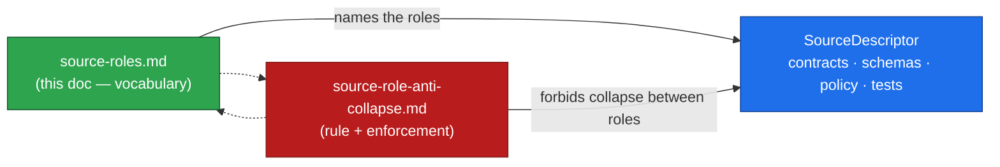
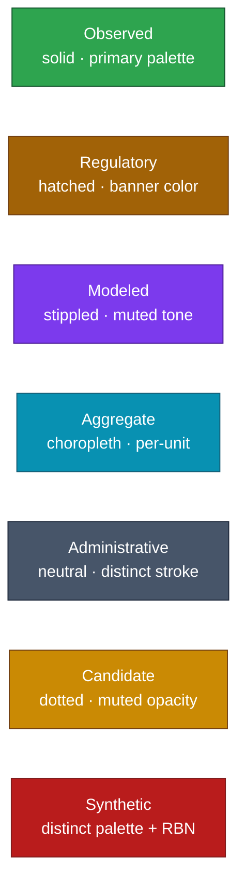
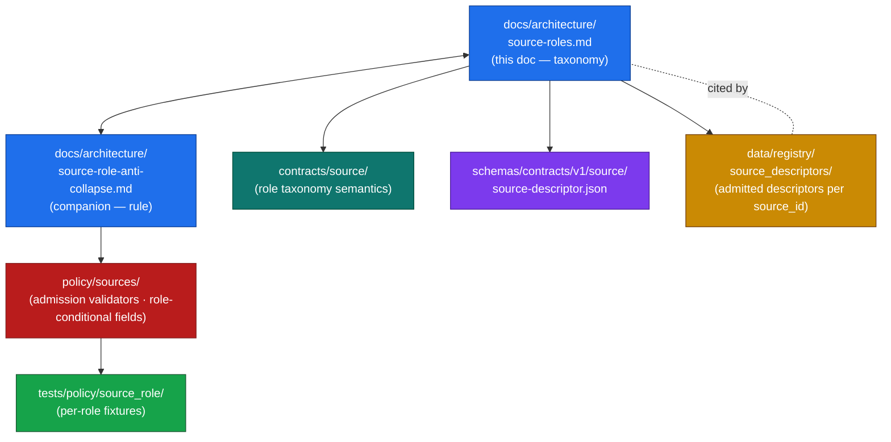

<!-- [KFM_META_BLOCK_V2]
doc_id: kfm://doc/architecture/source-roles
title: Source-Role Taxonomy & Per-Domain Source Catalog
type: standard
version: v1.0
status: draft
owners: TODO-architecture-steward-and-source-ledger-steward
created: 2026-05-25
updated: 2026-05-25
policy_label: public
related:
  - ./source-role-anti-collapse.md
  - ./sensitivity.md
  - ./sensitivity-tiers.md
  - ./smoke-atmosphere-hazards.md
  - ./connected-dots-architecture-brief.md
  - ./contract-schema-policy-split.md
  - ./governed-api.md
  - ./maplibre-3d.md
  - ../doctrine/directory-rules.md
  - ../../contracts/source/
  - ../../schemas/contracts/v1/source/source-descriptor.json
  - ../../data/registry/source_descriptors/
  - ../../KFM_Encyclopedia.md
  - ../../Kansas_Frontier_Matrix_-_Domains_v1_1___Pass_23_32_Consolidated_Atlas.md
tags:
  - kfm
  - architecture
  - source-role
  - source-descriptor
  - taxonomy
  - catalog
  - vocabulary
  - per-domain
  - reference
notes:
  - "Taxonomy reference. Carries the per-domain source catalog and the per-role characteristics. The rule and the seven collapse patterns live in the companion doc, source-role-anti-collapse.md."
  - "Doctrinal anchor: Atlas v1.1 §24.1.1 (canonical source-role classes); per-domain D-tables in Ch. 4–18 of Atlas v1.1 for the source-family lists."
  - "Authoring session: docs-only. No mounted repository, CI run, workflow, dashboard, runtime log, or release artifact was inspected. Implementation-maturity claims are bounded per the current-session evidence limit."
  - "Per-domain catalog rows are CONFIRMED at the source-family level (named in [DOM-*] dossiers) but role assignments shown for each source are PROPOSED — the corpus catalogs read 'authority / observation / context / model as source role requires' which is a deferred role assignment. This doc names the likely role per source for reviewer disposition; final role is fixed at admission on the SourceDescriptor."
  - "Sister doc to source-role-anti-collapse.md. Read order: this doc for vocabulary and catalog → source-role-anti-collapse.md for rule and enforcement."
[/KFM_META_BLOCK_V2] -->

<a id="top"></a>

# Source-Role Taxonomy & Per-Domain Source Catalog

> **What kind of source is this, and how should KFM treat it?** This doc is the taxonomy reference for KFM's source-role system. It carries the seven canonical roles with full definitions and examples, the SourceDescriptor fields each role requires, and a per-domain catalog naming the typical sources KFM admits at which roles. It is the **vocabulary side** of the source-role architecture. The **rule and enforcement side** — what cannot happen when these roles meet a release surface — lives in [`./source-role-anti-collapse.md`](./source-role-anti-collapse.md).


[](#)
[](#)

> [!IMPORTANT]
> **Taxonomy is doctrine; catalog is PROPOSED.** The seven canonical roles, their definitions, and the required `SourceDescriptor` field surface are CONFIRMED from Atlas v1.1 §24.1.1 / §24.1.3. The per-domain source-family lists are CONFIRMED from the [DOM-*] dossier D-tables, but the **per-source role assignments shown here are PROPOSED** — the Atlas D-tables intentionally defer role to admission, recording "authority / observation / context / model as source role requires." This doc names the *likely* role per source for reviewer disposition; the final role is fixed at admission on each `SourceDescriptor`.

> [!NOTE]
> **Where to start.** If you're admitting a new source, jump to [§6 — Per-domain source catalog](#6-per-domain-source-catalog). If you're confused about which role applies, see [§9 — Disambiguation guide](#9-disambiguation-guide). For the *rule* about how roles must not collapse — and how validators enforce that — see the companion [`./source-role-anti-collapse.md`](./source-role-anti-collapse.md).

---

## Contents

- [1. Purpose & scope](#1-purpose--scope)
- [2. Reading order: this doc vs. the companion](#2-reading-order-this-doc-vs-the-companion)
- [3. The seven canonical source roles](#3-the-seven-canonical-source-roles)
- [4. SourceDescriptor field shape per role](#4-sourcedescriptor-field-shape-per-role)
- [5. Per-role characteristics](#5-per-role-characteristics)
- [6. Per-domain source catalog](#6-per-domain-source-catalog)
- [7. Cross-domain shared sources](#7-cross-domain-shared-sources)
- [8. Composition patterns](#8-composition-patterns)
- [9. Disambiguation guide](#9-disambiguation-guide)
- [10. Citation patterns by role](#10-citation-patterns-by-role)
- [11. Visual identity by role](#11-visual-identity-by-role)
- [12. Where this lives in the repository](#12-where-this-lives-in-the-repository)
- [13. Verification backlog](#13-verification-backlog)
- [14. Related docs](#14-related-docs)
- [Appendix A — Quick reference card](#appendix-a--quick-reference-card)

---

## 1. Purpose & scope

KFM admits material from many places — regulatory agencies, sensor networks, model runs, aggregator services, administrative compilations, candidate connector outputs, and synthetic / AI-generated content. Each carries a different relationship to physical truth. The **source-role taxonomy** is the architectural vocabulary KFM uses to record that relationship at admission and preserve it through the lifecycle.

**In scope.**
- The seven canonical source roles, their definitions, allowed downstream uses, typical examples.
- The `SourceDescriptor` field surface per role (which fields each role requires).
- Per-role operational characteristics: uncertainty handling, citation patterns, render style.
- A per-domain source catalog naming the typical sources KFM admits per domain and their **PROPOSED** likely role.
- Cross-domain shared sources (sources that appear in multiple domains).
- Composition patterns (how roles combine in derived products).
- Disambiguation guide for ambiguous source-role assignments.

**Out of scope.**
- The single rule about role immutability and the seven collapse patterns — see [`./source-role-anti-collapse.md`](./source-role-anti-collapse.md).
- Validator names, ban-list contents, fixture organization — see the companion doc.
- The general sensitivity architecture — see [`./sensitivity.md`](./sensitivity.md).
- The T0–T4 release tier scheme — see [`./sensitivity-tiers.md`](./sensitivity-tiers.md).
- Per-domain canonical manuals — live at `docs/domains/<domain>/`.
- Concrete schema and policy contents (live in `schemas/contracts/v1/source/`, `policy/sources/`).

[↑ Back to top](#top)

---

## 2. Reading order: this doc vs. the companion

The source-role architecture is documented as a **two-doc pair**:



| Question | Read |
|---|---|
| What roles exist? What does each one mean? | This doc — [§3](#3-the-seven-canonical-source-roles) |
| What fields does the `SourceDescriptor` need per role? | This doc — [§4](#4-sourcedescriptor-field-shape-per-role); companion — §4 |
| Where does the NOAA HMS smoke product fit? | This doc — [§6](#6-per-domain-source-catalog) |
| Why can't I just rename a modeled product to "observed"? | Companion — §2, §5, §6 |
| What validator rejects an aggregate-as-per-place join? | Companion — §9 |
| What's the correction path if I admitted a source under the wrong role? | Companion — §12 |
| What does it look like to cite something correctly per role? | This doc — [§10](#10-citation-patterns-by-role) |
| How should the renderer style observation vs forecast? | This doc — [§11](#11-visual-identity-by-role) |

> [!TIP]
> **The two docs are complementary, not redundant.** This doc populates the role vocabulary across KFM domains; the companion enforces the rule. Reading both gives the full picture; reading one in isolation works only for narrow questions.

[↑ Back to top](#top)

---

## 3. The seven canonical source roles

The roles below are **CONFIRMED doctrine** from Atlas v1.1 §24.1.1. They are reproduced here as the taxonomy spine of this document. The companion [`./source-role-anti-collapse.md`](./source-role-anti-collapse.md) §3 carries the same table for self-containment of the rule doc.

| Role | Definition | Typical example | Allowed downstream use |
|---|---|---|---|
| **Observed** | A direct reading, measurement, or first-hand evidentiary record tied to a place and time. | Stream-gauge stage reading; soil pedon description; air-quality monitor sample; ground archaeological observation. | May feed modeled or aggregate products; never relabeled as 'regulatory' or 'administrative'. |
| **Regulatory** | An authoritative determination by a regulatory or governing body with legal or administrative force. | NFHL flood-zone designation; air-quality non-attainment ruling; designated critical-habitat unit; protected-species listing. | Cite as regulatory context; never labeled an 'observed' event or a 'modeled' estimate. |
| **Modeled** | A derived product from inputs, assumptions, or fitted parameters; uncertainty and provenance of inputs must be preserved. | Hydrograph reconstruction; smoke trajectory model; suitability raster; population estimation surface; AOD raster. | Cite with model identity, run receipt, and bounds; never labeled an observation. |
| **Aggregate** | A published summary, total, or average over a unit (county, year, watershed); irreversible loss of individual-record fidelity. | USDA crop county totals; Census tract aggregates; decadal climate normal; resource estimate summary. | Cite with aggregation receipt; never treated as a per-place record. |
| **Administrative** | A compiled record produced by an agency for administration, registration, or accounting purposes — not necessarily an observation or a regulation. | Land-office tract book; deed index compilation; county incorporation record; transport-facility roster. | Cite as administrative context; never collapsed with observation or regulation. |
| **Candidate** | A proposed record awaiting validation, evidence resolution, deduplication, or steward review; not yet authoritative. | Quarantined connector output; unresolved person assertion; duplicate site candidate; unmerged crop observation. | May be cited as candidate evidence in WORK / QUARANTINE; **must not appear in PUBLISHED without promotion**. |
| **Synthetic** | Content generated by simulation, reconstruction, AI, or interpolation that has no underlying first-hand observation. | Synthetic terrain surface; reconstructed historical scene; AI-drafted summary of an `EvidenceBundle`. | Carries Reality Boundary Note and `RepresentationReceipt`; **must never be presented or queried as observed reality**. |

> [!IMPORTANT]
> **Role is a property of the *source*, not the *topic*.** An air-quality measurement is `observed`; a forecast of air quality is `modeled`; a county-year average of air-quality readings is `aggregate`; an EPA designation that an area is in non-attainment is `regulatory`. All four describe air quality. All four have different roles. The taxonomy is what keeps them distinct.

[↑ Back to top](#top)

---

## 4. SourceDescriptor field shape per role

The `SourceDescriptor` is the object that carries source identity, rights, role, sensitivity, and cadence at admission. It anchors every downstream receipt. The full field surface is **PROPOSED** per Atlas v1.1 §24.1.3; canonical schema home is `schemas/contracts/v1/source/source-descriptor.json` per Directory Rules §7.4 + ADR-0001 (file presence **NEEDS VERIFICATION**).

### 4.1 Core fields (all roles)

| Field | Type | Required? | Notes |
|---|---|---|---|
| `source_id` | URI (`kfm:source/...`) | MUST | Stable identifier; immutable. |
| `source_role` | enum: `observed \| regulatory \| modeled \| aggregate \| administrative \| candidate \| synthetic` | MUST | Set at admission. Immutable in place; corrections produce a new descriptor + `CorrectionNotice`. |
| `rights` | `{ license, terms_status, … }` | MUST | License and current terms status. |
| `sensitivity` | T0–T4 tier label | MUST | Initial admission tier; see [`./sensitivity-tiers.md`](./sensitivity-tiers.md). |
| `cadence` | enum / string | MUST | Update cadence (`hourly`, `daily`, `annual`, `event-driven`, `static`, …). |
| `ingest_hash` | hash | MUST | Hash of the admitted payload or reference. |
| `admission_time` | ISO-8601 timestamp | MUST | When the descriptor was admitted. |
| `citation` | string | MUST | Canonical citation text. |

### 4.2 Role-conditional fields

The conditional fields below are required only when the role applies. They are the operational mechanism that prevents source-role collapse: a `modeled` source without `role_model_run_ref` fails admission validation; an `aggregate` source without `role_aggregation_unit` fails join-scope validation.

| Field | Type | Required when `source_role =` | Notes |
|---|---|---|---|
| `role_authority` | string (issuing body / model identity / steward) | `regulatory` · `modeled` · `aggregate` | Names the authoring authority for downstream cite text. |
| `role_aggregation_unit` | geometry-scope token (`county`, `HUC`, `tract`, `year`, `decade`, …) | `aggregate` | Prevents geometry-scope drift on join. |
| `role_model_run_ref` | `EvidenceRef` → `ModelRunReceipt` | `modeled` | Pins inputs, parameters, version. |
| `role_synthetic_basis` | `{ method, inputs, reality_boundary_note_ref }` | `synthetic` | Records what is and is not real in the carrier. |
| `role_candidate_disposition` | enum: `pending \| merged \| rejected \| quarantined` | `candidate` | Tracks promotion state; PUBLISHED edge forbidden until `merged`. |

### 4.3 Required fields summary by role

| Role | Required role-conditional fields |
|---|---|
| **Observed** | (core only) |
| **Regulatory** | `role_authority` |
| **Modeled** | `role_authority` + `role_model_run_ref` |
| **Aggregate** | `role_authority` + `role_aggregation_unit` |
| **Administrative** | (core only — `role_authority` recommended) |
| **Candidate** | `role_candidate_disposition` |
| **Synthetic** | `role_synthetic_basis` (which itself references a Reality Boundary Note) |

> [!NOTE]
> **The shape is illustrative.** Concrete field names, types, and schema home are **PROPOSED** per Atlas v1.1 §24.1.3. An ADR or schema PR is the authoritative resolution. Fields shown above are the design surface, not a committed contract.

[↑ Back to top](#top)

---

## 5. Per-role characteristics

Each role carries operational consequences beyond the descriptor — how the artifact is validated, how uncertainty is recorded, how it is cited, how it is rendered, and what AI may say about it.

<details>
<summary><strong>Per-role operational characteristics</strong> (click to expand)</summary>

### Observed

- **Validator focus:** identity rule, geometry validity, time discipline (source / observed / valid / retrieval times all distinct where material).
- **Uncertainty handling:** instrument / measurement uncertainty if applicable; never extrapolated.
- **Citation pattern:** *"<source>, retrieved <time>"* with measurement provenance.
- **Render style:** solid features; legend names the observation; popup shows time + station + value.
- **AI may:** summarize and cite directly; the answer reads as observation.
- **AI must not:** extrapolate beyond the observed point; aggregate across cells without `AggregationReceipt`.

### Regulatory

- **Validator focus:** issuing body identity; effective-date discipline; supersession lineage.
- **Uncertainty handling:** none — regulatory determinations are categorical.
- **Citation pattern:** *"<body> designates <area> as <category> under <map/ruling>, effective <date>"*.
- **Render style:** distinct from observed events; banner in UI names the regulatory authority.
- **AI may:** cite as authoritative determination.
- **AI must not:** describe a regulatory zone as an observed event ("flooded," "burned," "polluted") — that's collapse #2.

### Modeled

- **Validator focus:** `ModelRunReceipt` presence; inputs resolvable; uncertainty surface present; bounds documented.
- **Uncertainty handling:** uncertainty surface attached; runs and ensemble members preserved.
- **Citation pattern:** *"<model> run <run-id>, <time>, with inputs <input-refs>, uncertainty ±<band>"*.
- **Render style:** visually distinct from observation (stroke / fill / pattern / badge); legend names the model.
- **AI may:** cite as forecast / estimate / projection.
- **AI must not:** use "is" / "measured at" / "observed at" — those phrases imply observation.

### Aggregate

- **Validator focus:** `AggregationReceipt` presence; `role_aggregation_unit` matches join target; minimum-cell suppression where applicable.
- **Uncertainty handling:** confidence intervals where stated by source; aggregation method and suppression rule recorded.
- **Citation pattern:** *"<authority> reports <unit>-<period> <quantity>: <value>"*.
- **Render style:** choropleth or cell-based; never per-point; legend names the aggregation unit.
- **AI may:** describe aggregates over their own unit.
- **AI must not:** infer per-place values from aggregate cells — that's collapse #3.

### Administrative

- **Validator focus:** issuing agency identity; record-time vs. event-time discipline; named `AdminEvent` / `LifeEvent` types where applicable.
- **Uncertainty handling:** administrative-data-quality conventions of the source agency.
- **Citation pattern:** *"<agency> <record-type>, <date>"*.
- **Render style:** distinct from observation; "administrative record" label visible.
- **AI may:** cite as administrative record.
- **AI must not:** describe an administrative record as an observed event ("founded," "married," "died" derived from compilation alone) — that's collapse #4.

### Candidate

- **Validator focus:** `role_candidate_disposition` is `pending` or `quarantined` until merge; no PUBLISHED edge.
- **Uncertainty handling:** explicit "awaiting review" marker.
- **Citation pattern:** *"<source>, candidate <id>, awaiting steward review"*.
- **Render style:** candidate badge; reviewer-only surface or QUARANTINE; never on public layers.
- **AI may:** refer to candidate evidence only in WORK / QUARANTINE contexts.
- **AI must not:** present a candidate on PUBLISHED surfaces — that's collapse #5.

### Synthetic

- **Validator focus:** Reality Boundary Note present; `RepresentationReceipt` present; `role_synthetic_basis.method` resolvable.
- **Uncertainty handling:** explicit statement of what is and is not real; synthetic-method documentation.
- **Citation pattern:** *"Reconstructed/Synthetic <product> via <method>; Reality Boundary Note: <what-is-and-isn't-real>"*.
- **Render style:** synthetic badge mandatory; visually distinct from observation; 3D scenes carry the Reality Boundary Note.
- **AI may:** describe synthetic content with explicit synthetic framing.
- **AI must not:** present synthetic content as observed reality — that's collapse #6.

</details>

[↑ Back to top](#top)

---

## 6. Per-domain source catalog

The catalog below names known source families per KFM domain and their **PROPOSED** likely role. Source-family names are CONFIRMED from the Atlas v1.1 [DOM-*] D-tables; role assignments shown are the most likely admission posture, but the **final role is fixed at admission on the SourceDescriptor**.

> [!IMPORTANT]
> **The Atlas D-tables defer role to admission.** Each Atlas row reads "authority / observation / context / model as source role requires." That is intentional: a single source family can be admitted under different roles for different products. (E.g., FEMA NFHL is `regulatory` when cited as flood-zone designation; it can be cited as `context` when discussing historical flood evidence.) The PROPOSED role below is the *typical* admission for the most common product from each source.

### 6.1 Spatial Foundation

Spatial Foundation source families are mostly `regulatory` or `observed` and provide base layers, projections, and terrain.

| Source family | PROPOSED role | Typical product / notes |
|---|---|---|
| Coordinate Reference Profiles (national CRS, state plane) | `regulatory` | Authoritative CRS definitions. |
| 3DEP terrain | `observed` | LiDAR-derived terrain. |
| Base-layer descriptors (USGS topo, etc.) | `observed` / `administrative` | Depends on layer. |

### 6.2 Hydrology

Hydrology has the cleanest role split in KFM: USGS NWIS is `observed`, FEMA NFHL is `regulatory`, modeled hydrographs are `modeled`. The Atlas v1.0 Phase 5 rule "**never label NFHL observed flood**" is the per-domain expression of collapse pattern #2.

| Source family | PROPOSED role | Typical product / notes |
|---|---|---|
| USGS NWIS (streamflow, water levels, groundwater) | `observed` | Canonical authority for gauge observations. |
| NHDPlus HR / 3DHP-oriented hydrography | `administrative` / `regulatory` | Stream network identity. |
| USGS WBD / HUC12 | `administrative` | Watershed boundary delineation. |
| FEMA NFHL / MSC | `regulatory` | Flood-zone designation. **Never relabeled as observed flood event.** |
| 3DEP terrain | `observed` | Elevation. |
| Water-quality and groundwater sources | `observed` | Quality observations. |
| Historical observed flood evidence | `observed` (when ground-truthed) / `candidate` (when narrative-only) | NCEI, USACE, oral histories. |

### 6.3 Soil

Soil is `observed` (pedon descriptions, station moisture) plus `modeled` (gridded derivatives like gSSURGO/gNATSGO at uniform resolutions).

| Source family | PROPOSED role | Typical product / notes |
|---|---|---|
| NRCS SSURGO | `observed` (curated) | High-resolution soil survey. |
| USDA NRCS Soil Data Access | `observed` | API for SSURGO data. |
| NRCS gSSURGO | `modeled` (gridded derivative) | 30 m gridded raster derived from SSURGO. |
| NRCS gNATSGO | `modeled` (gridded derivative) | 30 m national gridded soil. |
| Kansas Mesonet soil moisture | `observed` | Station-level moisture readings. |
| NRCS SCAN | `observed` | Soil moisture station network. |
| NOAA USCRN | `observed` | Climate-reference soil/temperature observations. |
| NASA SMAP | `observed` (satellite-derived) | Surface soil moisture from satellite. |

### 6.4 Agriculture

Agriculture is where the **aggregate-as-per-place** collapse (#3) is most dangerous. USDA NASS QuickStats is `aggregate` by county-year; it must never be joined to individual farms.

| Source family | PROPOSED role | Typical product / notes |
|---|---|---|
| USDA NASS QuickStats / Crop Progress | `aggregate` | County-year totals; `role_aggregation_unit = county-year`. |
| SSURGO / Soil Data Access | `observed` | Soil context for agriculture. |
| gSSURGO | `modeled` | Gridded soil derivative. |
| Kansas Mesonet | `observed` | Ag-weather observations. |
| NRCS SCAN | `observed` | Soil moisture stations. |
| NOAA USCRN | `observed` | Climate observations. |
| NASA SMAP | `observed` (satellite-derived) | Soil moisture. |
| NASA HLS / HLS-VI | `observed` (with smoke/cloud mask) | Vegetation index from HLS. **Mask QA precedes publication** (see [`./smoke-atmosphere-hazards.md`](./smoke-atmosphere-hazards.md) §9). |

### 6.5 Habitat / Fauna / Flora

These three domains share the **modeled vs observed** tension on suitability rasters and the **candidate** problem for occurrence records.

| Source family | PROPOSED role | Typical product / notes |
|---|---|---|
| GBIF / iNaturalist occurrence records | `candidate` → `observed` after review | Citizen-science occurrences require steward review. |
| State natural-heritage occurrences (KS NHI) | `observed` (curated) | Steward-reviewed occurrence records. |
| KDWP SINC species list | `regulatory` | Protected-species listing. |
| USFWS critical-habitat designations | `regulatory` | Designated critical habitat unit. |
| Land-cover products (NLCD, CDL) | `modeled` | Classification rasters. |
| Habitat suitability rasters (internal models) | `modeled` | `role_authority` = model identity; `role_model_run_ref` required. |
| Sensitive occurrences (nests, dens, roosts, hibernacula) | `observed` but **T4** | See sensitivity architecture for redaction. |

> [!WARNING]
> **Modeled suitability is not observation.** A high-suitability raster cell does not mean "habitat exists here" — it means "the model predicts suitable conditions here." The render style must distinguish modeled from observed; the AI must say "is forecast to be suitable for X" rather than "X is here."

### 6.6 Atmosphere / Air

Atmosphere/Air has all four "ambient quantity" roles in active use simultaneously: `observed` (AQS), `aggregate` (annual averages), `modeled` (HRRR-Smoke), and `regulatory` (non-attainment areas). Source-role drift is highest here. See [`./smoke-atmosphere-hazards.md`](./smoke-atmosphere-hazards.md) for the worked example at the smoke seam.

| Source family | PROPOSED role | Typical product / notes |
|---|---|---|
| EPA AirNow API | `observed` (public AQI report) | Real-time AQI; cite at issuer's time. |
| EPA AQS API | `observed` (regulatory archive) | QA/QC regulatory-grade monitor data. |
| EPA non-attainment area designations | `regulatory` | Categorical designations. |
| KDHE bulletins | `administrative` / `operational_advisory` | Kansas-specific advisories. |
| PurpleAir | `observed` (low-cost sensor) | **Barkjohn correction required** before public release; preserve corrected + uncorrected pair. |
| OpenAQ aggregators | `observed` (depending on origin) | Federated; role depends on underlying source. |
| HRRR-Smoke | `modeled` | NOAA smoke forecast model. |
| BlueSky | `modeled` | Wildfire-smoke forecast. |
| CAMS / ECMWF | `modeled` | Atmospheric composition model fields. |
| GOES / ABI AOD | `observed` (remote-sensing detection) | Aerosol Optical Depth raster. |
| VIIRS fire / hotspot | `observed` (remote-sensing detection) | Satellite hotspot points. |
| NOAA HMS Fire and Smoke | `observed` (analyst-curated, remote-sensing) | Plume polygons. |

### 6.7 Hazards

Hazards is **structurally distinct** from every other domain because of the **alert-authority boundary** (T4 forever). NWS advisories are admitted as `administrative` / `operational_advisory`; KFM **cites** them but is never their issuing authority. See [`./sensitivity-tiers.md`](./sensitivity-tiers.md) §11 for the boundary.

| Source family | PROPOSED role | Typical product / notes |
|---|---|---|
| NOAA Storm Events / NCEI | `observed` (historical event record) | Historical hazard archive. |
| NWS alerts / warnings / advisories / watches | `administrative` (operational context) | KFM **cites**; KFM is not the issuing authority. **T4 if presented as KFM authority**. |
| FEMA Disaster Declarations / OpenFEMA | `administrative` (declaration) | Administrative record; not an alert. |
| FEMA NFHL / MSC | `regulatory` | Flood-zone designation. |
| USGS Earthquake Catalog | `observed` | Authoritative earthquake records. |
| NOAA HMS Fire and Smoke | `observed` (remote-sensing detection) | See §6.6. |
| NASA FIRMS active fire | `observed` (remote-sensing detection) | Hotspot detections — **not confirmed fires**. |
| Kansas / local emergency context | `administrative` / `regulatory_context` | Kansas-specific; cited, not authoritative. |

### 6.8 Roads / Rail / Trade Routes

Roads/Rail is heavy on `administrative` (transport rosters) and `observed` (modern road networks).

| Source family | PROPOSED role | Typical product / notes |
|---|---|---|
| Modern road / rail network (state / federal) | `observed` (curated) | Current transport networks. |
| Historic transport rosters | `administrative` | Compiled facility lists. |
| Historic uncertain routes (corridors) | `modeled` / `candidate` | Reconstructed corridors carry uncertainty surface. |
| BLM CadNSDI / GLO records | `administrative` | Cadastral spine. |

### 6.9 Settlements / Infrastructure

Settlements/Infrastructure includes high-sensitivity `regulatory` and `administrative` material; critical-asset details default to T4 (see [`./sensitivity-tiers.md`](./sensitivity-tiers.md)).

| Source family | PROPOSED role | Typical product / notes |
|---|---|---|
| County incorporation records | `administrative` | **Not** an observed founding event. |
| Critical-infrastructure asset registries | `administrative` | T4 by default; public summary only. |
| Township / settlement footprints | `administrative` | Boundary spines. |
| GhostTown / Townsite / ReservationCommunity identifiers | `administrative` | Named settlement records. |

### 6.10 Archaeology / Cultural Heritage

Archaeology has the highest **candidate** burden: remote-sensing anomalies and oral-history references admit as `candidate` until cultural review.

| Source family | PROPOSED role | Typical product / notes |
|---|---|---|
| State archaeological inventories | `regulatory` / `administrative` | Authoritative site listings. |
| Remote-sensing anomaly detection | `candidate` | **Not** a confirmed site; admits to QUARANTINE. |
| Oral-history reference | `candidate` (after steward + cultural review) | Steward + cultural review required. |
| Synthetic / reconstructed scenes | `synthetic` | Reality Boundary Note + `RepresentationReceipt`. |
| Sensitive coordinates | (any) but **T4** | Geoprivacy generalization required. |

### 6.11 Geology / Natural Resources

Geology mixes `regulatory` (state geological surveys), `observed` (boreholes, well logs), and `modeled` (resource estimates).

| Source family | PROPOSED role | Typical product / notes |
|---|---|---|
| State geological survey publications | `regulatory` / `administrative` | Authoritative bedrock and surficial mapping. |
| KGS Geoportal | `observed` / `administrative` | Groundwater and geological products. |
| Borehole / well-log references | `observed` | Subsurface observations. |
| Geochemistry sample references | `observed` | Direct measurements. |
| Resource estimates | `aggregate` / `modeled` | Estimates over a unit; `role_aggregation_unit` required. |
| Earthquake catalog | `observed` | Per-event records. |

### 6.12 People / Genealogy / DNA / Land

The most role-mixed domain. Administrative compilations (deeds, censuses) must never be cited as observed life events; aggregates (tract-level) must never be joined to individuals; DNA segment data is **T4** regardless of role.

| Source family | PROPOSED role | Typical product / notes |
|---|---|---|
| Vital / cemetery / burial / obituary / church / school / military / census / directory / court / probate records | `administrative` | Compiled records; **not** observed life events. |
| GEDCOM / GEDZip / tree overlays | `candidate` → `administrative` after review | User-contributed genealogy; admits as candidate. |
| DNA vendor match CSV / segment / triangulation data | `observed` (genetic match) but **T4** | Living-person data; consent gate required. |
| Patent / deed / mortgage / lien / easement / lease / mineral / water / access / probate instruments | `administrative` | Land-transaction records. |
| Assessor and tax-roll records | `administrative` | Annual compilations. |
| Plat / survey / metes / bounds / PLSS / subdivision / derived geometry | `administrative` (when official) / `modeled` (when reconstructed) | Cadastral geometry. |

### 6.13 Frontier Matrix (composition)

The Frontier Matrix composes per-cell aggregates from multiple owning domains. Each cell preserves contributing source roles; geometry-scope guards prevent aggregate-as-per-place drift across joins.

| Source family | PROPOSED role | Typical product / notes |
|---|---|---|
| Census tract aggregates | `aggregate` | `role_aggregation_unit = tract`. |
| County aggregates | `aggregate` | `role_aggregation_unit = county`. |
| Decadal climate normals | `aggregate` | `role_aggregation_unit = decade`. |
| Domain-emitted cell values | (inherited from contributing sources) | Each cell carries its contributors' roles. |

### 6.14 Planetary / 3D / Digital Twin / Synthetic Spatial

This domain is where **synthetic** is the default role. Every scene carries a Reality Boundary Note distinguishing observed terrain / vector data from synthetic infill or reconstructed elements.

| Source family | PROPOSED role | Typical product / notes |
|---|---|---|
| 3DEP terrain | `observed` | LiDAR-derived. |
| Photogrammetric / SfM reconstructions | `modeled` / `synthetic` | Depends on direct-observation density. |
| Reconstructed historical scenes | `synthetic` | Reality Boundary Note mandatory. |
| AI-generated terrain / infill | `synthetic` | `role_synthetic_basis.method` required. |
| Cesium / 3D Tiles overlays | (inherited from contributing layers) | Visual distinctness by role required. |

[↑ Back to top](#top)

---

## 7. Cross-domain shared sources

Some sources appear in multiple domains under the same role; some change role with the product. The table below names the shared sources and how they behave across domains.

| Source family | Appears in | Role behavior |
|---|---|---|
| **3DEP terrain** | Hydrology, Spatial Foundation, 3D | `observed` everywhere (LiDAR-derived). |
| **NOAA HMS Fire and Smoke** | Atmosphere/Air, Hazards | `observed` (remote-sensing detection, analyst-curated) in both. |
| **NASA FIRMS / VIIRS fire** | Atmosphere/Air, Hazards | `observed` (remote-sensing detection) in both — **not** confirmed fire. |
| **GOES / ABI AOD** | Atmosphere/Air, Hazards | `observed` (remote-sensing) — aerosol depth, not smoke per se. |
| **FEMA NFHL / MSC** | Hydrology, Hazards | `regulatory` in both — flood-zone designation. |
| **SSURGO / gSSURGO / gNATSGO** | Soil, Agriculture | SSURGO `observed`; g* variants `modeled` (gridded derivative). |
| **Kansas Mesonet** | Soil, Agriculture, Atmosphere/Air | `observed` (station network) across all three. |
| **NASA SMAP** | Soil, Agriculture, Hydrology | `observed` (satellite-derived surface moisture) — but with satellite-resolution caveat. |
| **NASA HLS / HLS-VI** | Agriculture, Habitat | `observed` only after smoke/cloud mask QA (see [`./smoke-atmosphere-hazards.md`](./smoke-atmosphere-hazards.md) §9). |
| **USDA NASS QuickStats** | Agriculture, Frontier Matrix | `aggregate` (`county-year` unit) in both. |
| **BLM CadNSDI / GLO records** | Roads/Rail, People/Land | `administrative` (cadastral compilation) in both. |
| **USGS Earthquake Catalog** | Hazards, Geology | `observed` in both. |

> [!NOTE]
> **Same source, different role.** When the *same source* feeds different products at different roles (e.g., a raw SSURGO pedon as `observed`, then a gridded-derivative gSSURGO raster as `modeled`), each product is a distinct `SourceDescriptor` admission. The two descriptors share lineage but carry different roles. The geometry-scope guard and validator chain treat them independently.

[↑ Back to top](#top)

---

## 8. Composition patterns

Roles compose. The composition rule is: **the resulting product carries its own role**, not the inputs' roles. The inputs remain themselves *as cited contributors*.

| Composition | Resulting role | Required artifact |
|---|---|---|
| Observed inputs → modeled output (e.g., hydrograph reconstruction from gauge observations) | `modeled` | `ModelRunReceipt` listing observed inputs. |
| Observed per-place records → aggregate (e.g., county-year crop total from individual field observations) | `aggregate` | `AggregationReceipt` listing per-place sources, `role_aggregation_unit`. |
| Multiple modeled fields → composite forecast (e.g., HRRR-Smoke + BlueSky → composite plume) | `modeled` | `ModelRunReceipt` for each ensemble member; uncertainty surface for composite. |
| Observed + modeled inputs → reconstructed scene | `synthetic` (the scene as a whole) | `RepresentationReceipt` + Reality Boundary Note distinguishing observed parts from modeled / synthetic infill. |
| Candidate → merged record via review | (inherits underlying source role) | `ReviewRecord`; `role_candidate_disposition = merged`. |
| Multiple regulatory designations → policy summary | (still regulatory — KFM does not author regulation) | Citations preserved per source; no synthesis as new authority. |
| Administrative records → graph projection (e.g., LandOwnership chain from deeds) | `administrative` | Source-role tag preserved per record; chain provenance documented. |

> [!IMPORTANT]
> **Composition is the safe path. Collapse is the failure path.** Building a modeled hydrograph from gauge observations is *composition* (good). Calling the modeled hydrograph "an observation" is *collapse* (bad). The same inputs and the same output; the difference is whether the role of the output is recorded honestly.

[↑ Back to top](#top)

---

## 9. Disambiguation guide

When a source's role is ambiguous, the following decision tree resolves the question. All ambiguity defaults to the **safest role for downstream use** — typically `candidate` for unresolved authority, `modeled` for uncertain mechanism, or `administrative` when "observed vs administrative" is unclear.

```mermaid
flowchart TD
  Q1{Is this a direct measurement<br/>at a place and time?}
  Q2{Is it issued by a regulator<br/>or governing body with<br/>legal force?}
  Q3{Is it derived from inputs<br/>via a model or fitted parameters?}
  Q4{Is it a summary over a<br/>unit (county / year / watershed)?}
  Q5{Is it generated by simulation,<br/>reconstruction, AI, or interpolation<br/>without first-hand observation?}
  Q6{Is it awaiting validation,<br/>review, or deduplication?}

  Obs[observed]
  Reg[regulatory]
  Mod[modeled]
  Agg[aggregate]
  Adm[administrative]
  Cnd[candidate]
  Syn[synthetic]

  Q1 -->|Yes| Obs
  Q1 -->|No| Q2
  Q2 -->|Yes| Reg
  Q2 -->|No| Q3
  Q3 -->|Yes| Mod
  Q3 -->|No| Q4
  Q4 -->|Yes| Agg
  Q4 -->|No| Q5
  Q5 -->|Yes| Syn
  Q5 -->|No| Q6
  Q6 -->|Yes| Cnd
  Q6 -->|No| Adm
```

### 9.1 Ambiguity patterns

<details>
<summary><strong>Common ambiguity patterns and resolutions</strong> (click to expand)</summary>

| Ambiguity | Default resolution |
|---|---|
| Observed sensor with known systematic bias (e.g., PurpleAir) | `observed` with `LOW_COST_SENSOR` flag; **correction transform required** before public release. |
| Gridded derivative of observed survey (e.g., gSSURGO from SSURGO) | `modeled` (the resampling/interpolation makes it derived). |
| Citizen-science occurrence record (e.g., iNaturalist) | `candidate` until steward review; then `observed`. |
| Reconstructed historical scene with some photographic anchors | `synthetic` for the scene as a whole; observed anchors cited within the Reality Boundary Note. |
| Administrative compilation that *cites* observations (e.g., census aggregating individual returns) | `aggregate` if it's a summary; `administrative` if it's a roster. |
| Forecast model output verified against observations | Still `modeled` — verification validates the model; it does not promote the output to observation. |
| Remote-sensing detection with analyst review (e.g., HMS plume) | `observed` (remote-sensing detection, analyst-curated). |
| Operational warning text from issuing authority | `administrative` (operational context); **never** an "alert" emitted by KFM. |
| Suitability raster cell with high model confidence | Still `modeled` — confidence does not change role. |
| AI-drafted summary that cites `EvidenceBundle` | `synthetic` (AI output is generated) — `AIReceipt` required; cite-or-abstain enforced. |
| Aggregate from a known minority of contributors | `aggregate` with `AggregationReceipt` noting the contributor count; `ABSTAIN` if too small to publish. |
| Source whose rights status is unresolved | Admit to QUARANTINE; role assignment pending rights resolution. |

</details>

### 9.2 When to ABSTAIN at admission

Some sources should be **denied at admission** rather than admitted under any role. The Atlas v1.1 §24.10 risk register names these:

- Source role mislabeling at admission (high severity) → if role cannot be resolved, route to QUARANTINE.
- Source rights or sovereignty status unknown → DENY admission until resolved.
- Source authority cannot be named → DENY admission.
- Source provenance cannot be reconstructed → DENY admission.

> [!CAUTION]
> **A wrong role at admission is the most expensive correction in the system.** Every downstream artifact, derivative, tile, drawer payload, AI summary, and export inherits the role and would need invalidation if the role changes later. Better to ABSTAIN at admission than to admit under a guess.

[↑ Back to top](#top)

---

## 10. Citation patterns by role

Citations carry role. The patterns below are PROPOSED templates; the corpus does not commit specific phrasing but does require role-distinct citation. The `AIReceipt` validator and the upcasting ban list (see companion §8) enforce role-correctness on AI-generated citations.

| Role | Citation template | Worked example |
|---|---|---|
| **Observed** | `"<source> (<role_authority>?), <observed_time>: <value>"` | "USGS streamgauge 06892350, 2026-05-25T17:00:00Z: stage 4.21 ft." |
| **Regulatory** | `"<role_authority> designates <feature> as <category> under <ruling>, effective <date>"` | "FEMA NFHL designates this area as Zone A (1% annual chance), effective 2024-06-01." |
| **Modeled** | `"<model> run <run_id>, <run_time>: <value>, uncertainty ±<band>"` | "NOAA HRRR-Smoke run 2026-05-25T18Z: PM2.5 = 75 µg/m³, uncertainty ±20." |
| **Aggregate** | `"<role_authority> reports <role_aggregation_unit> <quantity>: <value>"` | "USDA NASS reports Sedgwick County 2024 corn production: 8.4 million bushels." |
| **Administrative** | `"<role_authority> <record_type>, <date>"` | "Sedgwick County incorporation record, 1867." |
| **Candidate** | `"<source>, candidate <id>, awaiting steward review"` | "FIRMS hotspot 12345678, awaiting steward review." |
| **Synthetic** | `"Reconstructed/Synthetic <product> via <method>; Reality Boundary Note: <statement>"` | "Reconstructed 1880 Wichita streetscape via photogrammetric infill; Reality Boundary Note: building geometries are synthetic infill from historical photographs; street layout is administrative." |

> [!TIP]
> **The citation is what survives copy-paste.** When a reader screenshots a layer, exports a story node, or pastes an AI answer into a document, the citation is the only thing that travels. Role-correct citations are the difference between honest external use and uncontextualized claims. The export and screenshot surfaces enforce citation preservation per [`./sensitivity.md`](./sensitivity.md) §10.

[↑ Back to top](#top)

---

## 11. Visual identity by role

The renderer surfaces role through legend, style, and badge. The visual identity below is PROPOSED guidance; concrete style tokens belong in `apps/explorer-web/styles/` (PROPOSED) and `viewer_templates/` per Directory Rules. The map shell and Evidence Drawer apply these consistently.

| Role | Legend label | Suggested style cue | Badge / chip |
|---|---|---|---|
| **Observed** | "Observation" or specific (e.g., "USGS streamgauge") | Solid lines, filled symbols; primary color of domain palette. | `observation` chip. |
| **Regulatory** | "<authority> designation" | Hatched fill or distinct stroke; banner color (e.g., amber). | `regulatory · <authority>` chip. |
| **Modeled** | "Modeled forecast" or "<model>" | Stippled fill, dashed stroke, or pattern overlay; secondary color or muted tone. | `modeled · <model>` chip. |
| **Aggregate** | "<unit> aggregate" (e.g., "county-year") | Choropleth; cell-based; clear per-unit boundary. | `aggregate · <unit>` chip. |
| **Administrative** | "<authority> record" | Distinct stroke; neutral tone. | `administrative · <authority>` chip. |
| **Candidate** | "Awaiting review" | Dotted stroke or muted opacity; reviewer-only or QUARANTINE surfaces. | `candidate` chip with disposition. |
| **Synthetic** | "Reconstructed" or "Synthetic" | Distinct synthetic palette; 3D scenes carry Reality Boundary Note. | `synthetic` chip (mandatory). |

> [!IMPORTANT]
> **Visual distinctness is part of governance, not aesthetics.** When forecast and observation render identically, the renderer becomes the surface where collapse pattern #1 (modeled-as-observed) actually happens — the reader sees "a layer" without role context. Style governance ensures the visual cue does the work of the role chip when chips aren't visible (e.g., on small viewports).



[↑ Back to top](#top)

---

## 12. Where this lives in the repository

This doc is **doctrine** — the role vocabulary. Concrete files are split across responsibility roots per Directory Rules. All paths are **PROPOSED** until verified per Directory Rules §2.5.



| Responsibility | Root | What lives here |
|---|---|---|
| Doctrine — this doc | `docs/architecture/source-roles.md` | The seven roles; per-domain catalog; disambiguation; citation and visual identity. |
| Doctrine — companion | `docs/architecture/source-role-anti-collapse.md` | The rule; the seven collapse patterns; validators; enforcement. |
| Object meaning | `contracts/source/` | What "observed", "regulatory", "modeled", "aggregate", "administrative", "candidate", "synthetic" *mean*. |
| Object shape | `schemas/contracts/v1/source/source-descriptor.json` | Field schema including `source_role` enum and role-conditional fields. |
| Admitted descriptors | `data/registry/source_descriptors/` | Per-`source_id` admitted descriptors. |
| Enforcement | `policy/sources/` | Admission validators; role-conditional field validators; immutability checks. |
| Enforceability proof | `tests/policy/source_role/` | Fixture-driven `DENY` / `ABSTAIN` cases per role; admission-correctness fixtures. |

[↑ Back to top](#top)

---

## 13. Verification backlog

| ID | Item | Evidence that would settle it |
|---|---|---|
| **VB-SRT-01** | `schemas/contracts/v1/source/source-descriptor.json` exists and defines the seven-role `source_role` enum plus role-conditional fields per §4 | Schema inspection |
| **VB-SRT-02** | An ADR governs the SourceDescriptor schema home (referenced as ADR-0001 in Atlas v1.1 §24.1.3) | `docs/adr/` listing |
| **VB-SRT-03** | `data/registry/source_descriptors/` exists and is keyed by `source_id` with immutable role | Registry inspection |
| **VB-SRT-04** | The per-domain catalog in §6 matches what's admitted in `data/registry/source_descriptors/` for at least one worked domain (e.g., Atmosphere/Air) | Cross-check of descriptors + this doc |
| **VB-SRT-05** | `policy/sources/` carries the admission validators referenced in §9.2 (rights/role/authority/provenance gates) | Bundle inspection |
| **VB-SRT-06** | `tests/policy/source_role/admission/` covers each of the seven roles with required-field fixtures | Test inventory |
| **VB-SRT-07** | Renderer styles encode role-distinct visual identity per §11 | Style file inspection + visual regression |
| **VB-SRT-08** | Citation templates per role (§10) are reflected in drawer payload generators | Payload inspection |
| **VB-SRT-09** | Owner / `CODEOWNERS` entries name an architecture steward and a source-ledger steward for this file | `.github/CODEOWNERS` inspection |
| **VB-SRT-10** | This doc is registered in `control_plane/document_registry.yaml` | Registry inspection |
| **VB-SRT-11** | Cross-domain shared sources (§7) carry consistent `source_id` across the domains they serve | Registry cross-check |
| **VB-SRT-12** | The disambiguation guide (§9) is reflected in admission-validator messages so reviewers see role guidance at admission time | Validator output inspection |

[↑ Back to top](#top)

---

## 14. Related docs

| Path | Role |
|---|---|
| [`./source-role-anti-collapse.md`](./source-role-anti-collapse.md) | **Companion — the rule and enforcement.** Read together with this doc. |
| [`./sensitivity.md`](./sensitivity.md) | Umbrella sensitivity architecture; source-role integrity is one of its five sub-architectures. |
| [`./sensitivity-tiers.md`](./sensitivity-tiers.md) | T0–T4 release tiers; tier upgrades require role-preserving evidence. |
| [`./smoke-atmosphere-hazards.md`](./smoke-atmosphere-hazards.md) | Worked cross-domain example using the role taxonomy at the Atmosphere ↔ Hazards seam. |
| `docs/architecture/connected-dots-architecture-brief.md` | System-wide brief; source-role taxonomy sits in its trust-membrane layer. |
| `docs/architecture/contract-schema-policy-split.md` | Why role *meaning* lives in `contracts/`, *shape* in `schemas/`, *enforcement* in `policy/`. |
| `docs/architecture/governed-api.md` | The only public surface; emits role-preserving `PolicyDecision` outcomes. |
| `docs/architecture/maplibre-3d.md` | Renderer doctrine; honors role-distinct styling and Reality Boundary Note for synthetic content. |
| `docs/domains/<domain>/` | Per-domain manuals; carry domain-specific source-family details beyond this catalog. |
| `docs/doctrine/directory-rules.md` | Placement law. |
| `contracts/source/README.md` | PROPOSED per-root README for source-family semantics. |
| `policy/sources/README.md` | PROPOSED per-root README for admission and role enforcement. |
| `KFM_Encyclopedia.md` (Appendix B — Source family index) | Per-domain dossier short-names cited throughout this doc. |
| `Kansas_Frontier_Matrix_-_Domains_v1_1___Pass_23_32_Consolidated_Atlas.md` §24.1 + per-domain D-tables | Doctrinal anchors. |

[↑ Back to top](#top)

---

## Appendix A — Quick reference card

A compact one-screen reference for reviewers, contributors, and AI-policy authors.

<details>
<summary><strong>Source-role quick reference</strong> (click to expand)</summary>

### The seven roles

| Code | Name | Means |
|---|---|---|
| `observed` | Observed | direct measurement at a place and time |
| `regulatory` | Regulatory | authoritative determination with legal force |
| `modeled` | Modeled | derived product from inputs/parameters |
| `aggregate` | Aggregate | summary over a unit; per-place fidelity lost |
| `administrative` | Administrative | compiled record for administration / accounting |
| `candidate` | Candidate | awaiting validation / review |
| `synthetic` | Synthetic | generated by simulation / AI / interpolation |

### Required descriptor fields by role

| Role | Beyond core fields |
|---|---|
| Observed | (none) |
| Regulatory | `role_authority` |
| Modeled | `role_authority` + `role_model_run_ref` |
| Aggregate | `role_authority` + `role_aggregation_unit` |
| Administrative | (none — `role_authority` recommended) |
| Candidate | `role_candidate_disposition` |
| Synthetic | `role_synthetic_basis` (includes Reality Boundary Note ref) |

### Don't-collapse map (see companion doc for full enforcement)

| From | To | Why it fails |
|---|---|---|
| Modeled | Observed | model is not measurement |
| Regulatory | Observed event | designation is not occurrence |
| Aggregate | Per-place | unit fidelity lost |
| Administrative | Observation | compilation is not direct evidence |
| Candidate | Public | not yet authoritative |
| Synthetic | Observed reality | generated is not real |
| AI text | Evidence | generation is not authority |

### When in doubt

1. Is it a direct measurement? → `observed`
2. Is it a regulator's determination? → `regulatory`
3. Is it derived via a model? → `modeled`
4. Is it a summary over a unit? → `aggregate`
5. Is it a generated reconstruction? → `synthetic`
6. Is it awaiting review? → `candidate`
7. Otherwise → `administrative` (or DENY admission if unresolved)

</details>

[↑ Back to top](#top)

---

**Related docs:** [source-role-anti-collapse](./source-role-anti-collapse.md) · [sensitivity](./sensitivity.md) · [sensitivity-tiers](./sensitivity-tiers.md) · [smoke-atmosphere-hazards](./smoke-atmosphere-hazards.md) · [directory-rules](../doctrine/directory-rules.md) · [governed-api](./governed-api.md) · [KFM Encyclopedia](../../KFM_Encyclopedia.md)

**Last updated:** 2026-05-25 · **Doc version:** v1.0 · **Meta block:** v2 · [↑ Back to top](#top)
