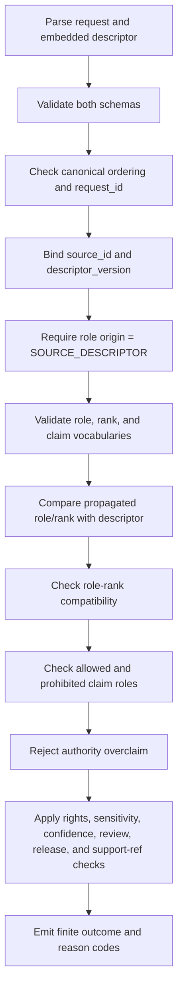
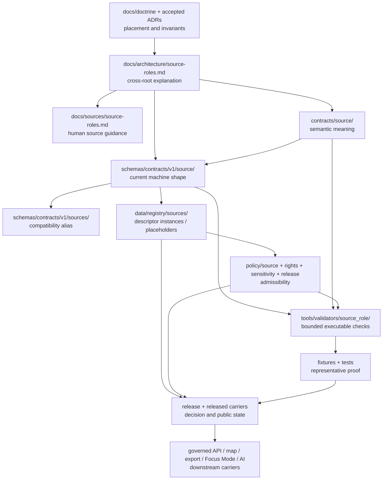

<!-- [KFM_META_BLOCK_V2]
doc_id: kfm://doc/architecture/source-roles
title: Source Roles — Architecture and Enforcement Register
type: architecture
version: v2.0
status: draft; repository-grounded; explanatory; non-authoritative
owners:
  - "@bartytime4life"
created: 2026-05-25
updated: 2026-08-19
policy_label: public
owning_root: docs/
responsibility: Explain how SourceDescriptor role, authority rank, admissibility limits, registry instances, policy, validators, downstream carriers, correction, and release compose without turning this page into vocabulary, schema, policy, source-admission, or publication authority.
truth_posture: cite-or-abstain
evidence_snapshot:
  repository: bartytime4life/Kansas-Frontier-Matrix
  base_ref: main
  base_commit: 8d2535d3231c81b3d7bc32dff660ad8cc7983f64
  base_tree: d09135959450938956f04497c54863ccf9538889
  target_prior_blob: e67784de62b9b919fd7673fce4157be607a65ebf
related:
  - ./README.md
  - ./source-role-anti-collapse.md
  - ../sources/source-roles.md
  - ./contract-schema-policy-split.md
  - ../doctrine/directory-rules.md
  - ../adr/ADR-0029-adopt-directory-governance-standard-v2.md
  - ../adr/ADR-0001-schema-home--schemas-contracts-v1-is-canonical.md
  - ../../contracts/source/source_descriptor.md
  - ../../contracts/source/source_role_use_request.md
  - ../../contracts/source/source_role_transition_assessment.md
  - ../../schemas/contracts/v1/source/source_descriptor.schema.json
  - ../../schemas/contracts/v1/sources/source_descriptor.schema.json
  - ../../schemas/contracts/v1/source/source_role_use_request.schema.json
  - ../../tools/validators/source_role/IMPLEMENTATION.md
  - ../../tools/validators/source_role/validate_source_role.py
  - ../../tests/validators/test_validate_source_role.py
  - ../../data/registry/sources/
  - ../../policy/source/
tags:
  - kfm
  - architecture
  - source-role
  - source-descriptor
  - anti-collapse
  - source-admission
  - authority-rank
  - admissibility
  - cite-or-abstain
  - trust-membrane
notes:
  - "v2.0 reclassifies this page from a seven-role taxonomy and static per-domain source catalog into a repository-grounded architecture and enforcement register."
  - "The currently executed SourceDescriptor schema exposes sixteen source_role values, not the seven conceptual roles asserted by v1.0."
  - "The sixteen-token schema, the seven-role lineage pages, the broader docs/sources role families, and the proposed transition-assessment grammar are not silently merged here."
  - "The source-role use validator is fixture-first, no-network, and PROPOSED_INACTIVE. Its PASS outcome is compatibility evidence only."
  - "No source is activated, admitted, fetched, promoted, released, published, or made public by this document."
[/KFM_META_BLOCK_V2] -->

<a id="top"></a>

# Source Roles — Architecture and Enforcement Register

> **One-line purpose.** Explain the current KFM source-role trust path—from a versioned `SourceDescriptor`, through role/rank-preserving downstream-use assessment, to governed carriers—without making architecture prose the source-role vocabulary, source registry, policy engine, evidence store, or release authority.

> [!IMPORTANT]
> **Current determination.** The repository does **not** currently support the former claim that seven conceptual roles are the single implemented source-role taxonomy. The executable `SourceDescriptor` schema currently exposes **sixteen** `source_role` tokens. The older seven-role architecture pages, the broader human guidance at [`docs/sources/source-roles.md`](../sources/source-roles.md), proposed domain matrices, and the proposed transition-assessment grammar remain useful lineage or review inputs, but they are not interchangeable machine vocabularies.

> [!CAUTION]
> **A role label is not claim truth or public permission.** `source_role`, `authority_rank`, rights, sensitivity, admissibility limits, evidence support, review, release, correction, and rollback are separate controls. A passing source-role validator result does not create an `EvidenceBundle`, policy approval, review approval, source activation, release, publication, or public-use permission.

## Current checkpoint

| Field | Repository-grounded result |
|---|---|
| Evidence snapshot | `main@8d2535d3231c81b3d7bc32dff660ad8cc7983f64` |
| Previous page blob | `e67784de62b9b919fd7673fce4157be607a65ebf` |
| Placement | **PLACE** — same-path architecture explanation under `docs/architecture/`; accepted Directory Rules v2 keeps source catalogs/guidance under `docs/sources/` and machine instances under `data/registry/` |
| Accepted placement authority | [`ADR-0029`](../adr/ADR-0029-adopt-directory-governance-standard-v2.md) accepts the exact Directory Rules v2 bytes |
| Dedicated schema-home ADR | [`ADR-0001`](../adr/ADR-0001-schema-home--schemas-contracts-v1-is-canonical.md) remains `proposed`; the default versioned schema route already comes from accepted Directory Rules |
| Current implementation schema | [`schemas/contracts/v1/source/source_descriptor.schema.json`](../../schemas/contracts/v1/source/source_descriptor.schema.json), blob `582e70b834278c3c6ca9a8b31efbe0989c96f0bc`, status `PROPOSED` |
| Plural-path schema | [`schemas/contracts/v1/sources/source_descriptor.schema.json`](../../schemas/contracts/v1/sources/source_descriptor.schema.json), a `PROPOSED` compatibility alias that references the singular implementation shape |
| Semantic contract | [`contracts/source/source_descriptor.md`](../../contracts/source/source_descriptor.md), draft and schema-paired |
| Downstream-use contract | [`contracts/source/source_role_use_request.md`](../../contracts/source/source_role_use_request.md), `PROPOSED_INACTIVE`, fixture-first, no-network |
| Executable validator | [`tools/validators/source_role/validate_source_role.py`](../../tools/validators/source_role/validate_source_role.py) plus `source_role_core.py` and `source_role_rules.py` |
| Focused executable proof | [`tests/validators/test_validate_source_role.py`](../../tests/validators/test_validate_source_role.py): 14 finite fixture cases, deterministic CLI parity, and a no-network assertion |
| Hosted workflow | [`.github/workflows/source-role-anti-collapse.yml`](../../.github/workflows/source-role-anti-collapse.yml); its current path filter does not include this architecture page |
| Source registry | [`data/registry/sources/`](../../data/registry/sources/) exists with domain lanes, but representative entries such as `hydrology/usgs_nwis.yaml` are proposal placeholders rather than rich schema-conformant descriptors |
| Source policy | [`policy/source/descriptor_required_before_ingest.rego`](../../policy/source/descriptor_required_before_ingest.rego) is an explicit greenfield stub with no operative deny rules |
| Review route | `@bartytime4life` through [`.github/CODEOWNERS`](../../.github/CODEOWNERS); independent source/schema/policy stewardship remains **NEEDS VERIFICATION** |
| Public runtime, release, publication | **UNKNOWN / no effect from this page** |

**Truth labels used here**

- **CONFIRMED** — verified from the pinned repository bytes named on this page.
- **PROPOSED** — declared future, draft, fixture-first, inactive, or design state.
- **UNKNOWN** — current evidence does not establish the claim.
- **NEEDS VERIFICATION** — a concrete check is named but remains open.
- **CONFLICTED** — current candidate authorities or vocabularies disagree.
- `PASS`, `HOLD`, `RESTRICT`, `ABSTAIN`, `DENY`, and `ERROR` are validator outcomes, not truth labels.

**Quick navigation:** [Purpose](#1-purpose-and-scope) · [Authority](#2-authority-and-current-status) · [Concept split](#3-concepts-that-must-not-collapse) · [Descriptor](#4-current-sourcedescriptor-shape) · [Vocabulary](#5-current-machine-source-role-vocabulary) · [Compatibility](#6-role-rank-and-claim-compatibility) · [Use assessment](#7-downstream-use-assessment) · [Lifecycle](#8-lifecycle-composition-and-correction) · [Domains](#9-domain-and-source-guidance) · [Surfaces](#10-public-api-ui-map-and-ai-obligations) · [Placement](#11-repository-placement) · [Validation](#12-validation-and-ci) · [Backlog](#13-verification-backlog) · [Related](#14-related-documents)

---

## 1. Purpose and scope

This page owns the **cross-root architecture explanation** for source role. It connects:

```text
accepted doctrine and ADRs
  -> SourceDescriptor meaning
  -> SourceDescriptor machine shape
  -> source-registry instances
  -> rights / sensitivity / admissibility policy
  -> downstream-use request
  -> deterministic validator and fixtures
  -> governed API / map / export / Focus Mode / AI carrier
  -> correction, withdrawal, and rollback
```

It answers four architecture questions:

1. Which current repository object carries source role and its limits?
2. Which current machine vocabulary is actually consumed by the executable validator?
3. How are downstream uses checked without silently upgrading source authority?
4. Which decisions remain outside this page and outside the current fixture-first validator?

### In scope

- Current `SourceDescriptor` fields and controlled vocabularies.
- The relationship between `source_type`, `source_role`, `authority_rank`, `claim_role`, and `admissibility_limits`.
- The executable `SourceRoleUseRequest` assessment boundary.
- Finite outcomes and no-network fixture evidence.
- Role/rank propagation, public-surface prerequisites, correction holds, and anti-overclaim rules.
- Current repository placement, implementation maturity, conflicts, validation, and rollback.
- Routing to domain source guidance without repeating a static source catalog as current admission fact.

### Out of scope

- Assigning a role to any live or candidate source.
- Activating connectors, fetching endpoints, or admitting material into RAW.
- Deciding rights, sovereignty, sensitivity, consent, or legal authority.
- Authenticating `EvidenceRef`, policy, review, release, correction, or rollback references.
- Defining domain-specific claim semantics.
- Accepting ADR-0001, freezing a vocabulary, or selecting a successor for conflicting source-role documents.
- Releasing or publishing source material or a derivative.
- Treating a map, graph edge, popup, summary, model output, or AI response as evidence.

[Back to top](#top)

---

<a id="3-source-role-anti-collapse-rule"></a>

## 2. Authority and current status

Source-role architecture spans several responsibility roots. No single file may absorb all of them.

| Question | Current owning surface | Current status |
|---|---|---|
| Where may the architecture explanation live? | Accepted Directory Rules v2 and [`docs/architecture/README.md`](./README.md) | **ACCEPTED placement / CONFIRMED current guidance** |
| What does `SourceDescriptor` mean? | [`contracts/source/source_descriptor.md`](../../contracts/source/source_descriptor.md) | **PROPOSED semantic contract** |
| What machine shape and vocabulary validate? | [`schemas/contracts/v1/source/source_descriptor.schema.json`](../../schemas/contracts/v1/source/source_descriptor.schema.json) | **PROPOSED schema, currently consumed by executable tests** |
| Is the plural schema path a second authority? | [`schemas/contracts/v1/sources/source_descriptor.schema.json`](../../schemas/contracts/v1/sources/source_descriptor.schema.json) | **No — PROPOSED `$ref` compatibility alias** |
| Which source instances exist? | [`data/registry/sources/`](../../data/registry/sources/) | **CONFIRMED tree; mixed/placeholder maturity** |
| What use is allowed, denied, held, restricted, or abstained? | `policy/` plus review/release evidence | **PARTIAL / NEEDS VERIFICATION** |
| What does the current bounded validator check? | [`tools/validators/source_role/`](../../tools/validators/source_role/) | **CONFIRMED executable fixture-first slice** |
| What proves the current fixture behavior? | [`tests/validators/test_validate_source_role.py`](../../tests/validators/test_validate_source_role.py) and fixture manifest | **CONFIRMED repository tests; exact-head execution still separate** |
| What is released or public? | `release/`, released carriers, review, correction, rollback | **UNKNOWN here; not created by the validator or this page** |
| Who may review changes? | CODEOWNERS routes `@bartytime4life` | **CONFIRMED route; independent specialist duty remains open** |

### Authority order for a source-role claim

1. Accepted doctrine and ADRs control placement and invariant-level behavior.
2. The semantic contract controls object meaning.
3. The active machine schema controls accepted field and enum shape for the inspected validator.
4. A versioned source-registry instance controls the admitted posture for one source descriptor.
5. Policy, rights, sensitivity, review, and release records control use and exposure.
6. Validators and tests provide bounded conformance evidence.
7. Architecture pages, domain matrices, maps, exports, and generated language explain or carry the result; they do not create authority.

> [!IMPORTANT]
> The current schema is `PROPOSED`, but it is still the shape the executable source-role validator reads. That makes it **current implementation evidence**, not an accepted global vocabulary decision. Adoption and implementation are separate states.

[Back to top](#top)

---

<a id="9-disambiguation-guide"></a>

## 3. Concepts that must not collapse

The former page treated a compact conceptual taxonomy as though it were the current machine vocabulary. The current object model separates several dimensions instead.

| Dimension | Current field or surface | What it answers | Must not be represented as |
|---|---|---|---|
| Source identity | `source_id`, `descriptor_version` | Which versioned admission profile is being assessed? | Claim truth |
| Source kind | `source_type` | What kind of material or service is this? | Evidentiary authority |
| Primary source role | `source_role` | Which admitted downstream role token governs this descriptor? | Rights, sensitivity, or release |
| Additional roles | `secondary_source_roles` | Which extra role tokens are declared on the descriptor? | Automatic permission to use any role |
| Authority posture | `authority_rank`, `authority_notes` | How strong is the source within its admitted role? | Claim evidence closure |
| Allowed claim use | `admissibility_limits.allowed_claim_roles` | Which claim-role tokens may this source support? | Approval to publish |
| Prohibited claim use | `admissibility_limits.prohibited_claim_roles` | Which uses are explicitly incompatible? | A suggestion |
| Confidence posture | `admissibility_limits.confidence_posture` | Is the source authoritative within role, corroborative, contextual, candidate-only, fixture-only, or unknown? | Statistical confidence unless separately defined |
| Rights | `rights` | What terms, attribution, redistribution, and use limits apply? | Source role |
| Sensitivity | `sensitivity_default` | What default exposure risk applies? | Authority rank |
| Review and release | `review_state`, `release_state`, `public_release` | What review/release posture is declared? | A complete release decision |
| Lifecycle | `lifecycle.registry_state` | Is the descriptor proposed, active, quarantined, retired, or superseded? | RAW-to-PUBLISHED data state |
| Claim evidence | `EvidenceRef` / `EvidenceBundle` outside the descriptor | What admissible evidence supports a claim? | Source metadata |
| Consumer request | `consumer_surface`, `exposure`, requested claim roles | How does one downstream consumer propose to use the descriptor? | A mutation of the descriptor |
| Process result | validator outcome and findings | Is the supplied request compatible under this bounded profile? | Public permission |

### A source role is descriptor-relative

A source role is not an eternal property of an organization, URL, or topic. It is part of a **versioned `SourceDescriptor` admission profile**. The same upstream provider can publish different products with different source types, roles, authority ranks, time support, rights, and admissibility limits. Those distinctions require separate or versioned descriptors and preserved lineage.

### Primary and secondary roles remain unresolved in the current use validator

The schema permits `secondary_source_roles`, but the inspected `SourceRoleUseRequest` validator propagates and compares the primary `source_role` and `authority_rank`. How secondary roles are requested, ordered, corrected, or exposed downstream remains **NEEDS VERIFICATION**. Consumers must not infer that a secondary declaration grants an unbounded role change.

[Back to top](#top)

---

<a id="4-sourcedescriptor-field-shape"></a>

## 4. Current SourceDescriptor shape

The current implementation shape is the singular-path schema:

[`schemas/contracts/v1/source/source_descriptor.schema.json`](../../schemas/contracts/v1/source/source_descriptor.schema.json)

The schema declares itself `PROPOSED`, closes unknown properties, and requires the following fields:

| Field group | Required fields | Architecture purpose |
|---|---|---|
| Identity | `object_type`, `schema_version`, `source_id`, `descriptor_version`, `title` | Stable object and descriptor identity |
| Classification | `source_type`, `source_role`, `authority_rank` | Kind, admitted role, and authority posture |
| Accountability | `publisher`, `owner_or_steward` | Named organizational responsibility |
| Rights and exposure | `rights`, `sensitivity_default`, `public_release` | Terms, default sensitivity, and declared release limits |
| Time and access | `cadence`, `access`, `source_head` | Freshness, retrieval posture, and low-cost content identity |
| Citation and claim limits | `citation`, `admissibility_limits` | Citation duties and permitted/prohibited claim roles |
| State | `review_state`, `release_state`, `lifecycle` | Review, release, and registry-lifecycle posture |

Optional fields include `domain_scope`, `secondary_source_roles`, `connectors`, `governance_refs`, `spec_hash`, and deprecated migration aliases.

### Schema-enforced fail-closed relationships

The current schema enforces several bounded relationships:

| Condition | Schema consequence | What it does not prove |
|---|---|---|
| Rights are `unknown`, `noassertion`, or `denied` | `public_release.allowed` must be `false` | That all other rights cases are safe |
| Sensitivity is restricted, living-person, DNA/genomic, cultural, infrastructure, steward-controlled, controlled, or unknown-review | `public_release.requires_review` must be `true` | That review occurred or approved exposure |
| Connector state is `live_candidate` or `live_active` | `review_state` must be `reviewed` or `approved` | That source activation was authorized |
| `source_role` is `fixture_only` | Public release must be false and normal release state is disallowed | That non-fixture roles are public-safe |
| `public_release.allowed` is true | `review_state` must be `reviewed` or `approved` | A `ReleaseManifest`, policy decision, correction path, or rollback target |

### Compatibility path and naming state

The plural-path schema:

[`schemas/contracts/v1/sources/source_descriptor.schema.json`](../../schemas/contracts/v1/sources/source_descriptor.schema.json)

is a small `PROPOSED` alias whose `$ref` points to the singular implementation schema. It explicitly says it creates no independent source-admission, rights, policy, review, release, or publication authority.

The schema-path migration remains **open**:

- accepted Directory Rules establish `schemas/contracts/v1/<family>/` as the default route;
- ADR-0001 remains proposed;
- the singular implementation file is the shape current tests consume;
- the plural file is an alias, not a second writable definition;
- this page does not select a deletion or migration date.

[Back to top](#top)

---

<a id="2-canonical-source-role-taxonomy"></a>
<a id="3-the-seven-canonical-source-roles"></a>
<a id="5-per-role-characteristics"></a>

## 5. Current machine source-role vocabulary

The current schema exposes these **sixteen** exact `source_role` tokens. The compatible authority ranks below are enforced by [`source_role_rules.py`](../../tools/validators/source_role/source_role_rules.py).

| `source_role` token | Compatible `authority_rank` values | Current bounded reading |
|---|---|---|
| `authoritative_for_claim` | `authoritative_for_role`, `primary_authority` | Source may be primary within explicitly admitted claim limits |
| `regulatory_context` | `authoritative_for_role`, `regulatory_authority`, `contextual` | Regulatory context; not automatically an observed event |
| `legal_context` | `authoritative_for_role`, `legal_authority`, `contextual` | Legal context; not title truth outside allowed claim roles |
| `observation` | `authoritative_for_role`, `primary_authority`, `corroborating` | Observation posture within temporal/spatial/method limits |
| `occurrence_evidence` | `authoritative_for_role`, `primary_authority`, `corroborating` | Occurrence support; sensitivity and review remain separate |
| `aggregator` | `aggregator` | Compilation/discovery posture; original-source authority is not inherited |
| `operational_context` | `authoritative_for_role`, `contextual` | Operational context; not KFM-authored life-safety authority |
| `remote_sensing_observation` | `authoritative_for_role`, `primary_authority`, `corroborating` | Sensor-derived observation/detection with method and resolution limits |
| `model_context` | `derived`, `contextual` | Model or interpretation context; never silently upgraded to observation |
| `candidate_signal` | `candidate_only` | Candidate/discovery signal; denied on normal public use |
| `historical_context` | `primary_authority`, `corroborating`, `contextual` | Historical support with temporal, provenance, and interpretation limits |
| `corroborating_context` | `corroborating`, `contextual` | Supports or contextualizes; weak confidence can force abstention |
| `derived_public_product` | `derived` | Released or release-candidate derivative remains downstream of source/evidence |
| `steward_review_source` | `steward_authority` | Steward-controlled source whose admissibility depends on review |
| `citation_source` | `corroborating`, `contextual` | Citation support; not claim truth by itself |
| `fixture_only` | `fixture_only` | Synthetic test posture; denied for public release |

The third column is an architecture-level bounded interpretation of the current schema and validator behavior. The semantic contract, accepted domain rules, and source-specific descriptor remain controlling for any consequential use.

### The seven-role lineage is not deleted

The former version of this page organized sources as:

`observed`, `regulatory`, `modeled`, `aggregate`, `administrative`, `candidate`, and `synthetic`.

Those concepts remain useful for explaining broad anti-collapse patterns and transformation outputs, but they are **not** the current `SourceDescriptor.source_role` enum. They may map to multiple current tokens, source types, authority ranks, claim roles, or transition results. A future accepted vocabulary decision may reconcile them; this page does not silently do so.

### Current vocabulary conflict register

| Surface | Vocabulary posture | Current disposition |
|---|---|---|
| This page v1.0 and [`source-role-anti-collapse.md`](./source-role-anti-collapse.md) | Seven conceptual roles | **LINEAGE / STALE against current machine enum** |
| [`docs/sources/source-roles.md`](../sources/source-roles.md) | Broader human role-family guidance | **PROPOSED guidance; not machine enum authority** |
| Current `SourceDescriptor` schema | Sixteen exact tokens | **Current executable shape; schema itself PROPOSED** |
| [`SourceRoleTransitionAssessment`](../../contracts/source/source_role_transition_assessment.md) | Proposed transformation outputs such as aggregate, modeled, and synthetic | **PROPOSED separate grammar; crosswalk unresolved** |
| Domain matrices | Lane-specific tables, often based on the seven-role lineage | **Useful review inputs; current consistency varies** |

> [!CAUTION]
> Never “solve” this conflict by accepting every term as an alias. Aliases can erase authority, claim, transformation, and exposure distinctions. Reconciliation needs an explicit crosswalk, migration rules, fixtures, consumer inventory, and rollback.

[Back to top](#top)

---

## 6. Role, rank, and claim compatibility

The current validator treats the descriptor as the source of the admitted role and rank. A downstream request declares:

- the same `source_id` and `descriptor_version`;
- `role_origin = SOURCE_DESCRIPTOR`;
- the propagated primary `source_role`;
- the propagated `authority_rank`;
- one or more requested `claim_role` values;
- a consumer surface and exposure;
- evidence, policy, review, release, correction, and rollback references;
- any declared role-change kind and lineage;
- explicit false authority claims.

### Current `claim_role` vocabulary

The schema currently exposes:

```text
identity
legal_status
regulatory_context
observed_event
observation
occurrence
range_context
historical_context
model_context
candidate_signal
map_display
citation_support
derived_summary
operational_context
not_for_life_safety
not_for_title_truth
fixture_only
```

A requested claim role must be present in `admissibility_limits.allowed_claim_roles` and absent from `prohibited_claim_roles`. Role/rank compatibility alone is not enough.

### Confidence posture

The current schema and validator use:

```text
source_authoritative_within_role
corroborate_before_claim
context_only
candidate_only
fixture_only
unknown
```

When a weak confidence posture is used for a primary claim role such as identity, legal status, observed event, observation, or occurrence, the bounded validator returns `ABSTAIN` unless a higher-precedence finding applies.

### Prohibited overclaim

The use request has explicit booleans for:

- `claim_truth`;
- `evidence_closure`;
- `policy_approval`;
- `release_approval`;
- `public_permission`.

Any `true` value returns `DENY`. Source-role metadata cannot manufacture any of those authorities.

[Back to top](#top)

---

## 7. Downstream-use assessment

The current executable slice assesses a `SourceRoleUseRequest`. It is a deterministic, value-minimized anti-corruption boundary between one complete descriptor snapshot and one declared consumer use.

### Request identity

The contract defines:

```text
request_id =
  "kfm:source-role-use:" +
  SHA-256(
    RFC8785-JCS({
      profile,
      descriptor,
      use_without_request_id
    })
  )
```

Changing the descriptor, claim roles, exposure, support references, or role-change lineage creates a different request identity.

### Supported consumer surfaces

```text
INTERNAL_PIPELINE
CATALOG
GRAPH
API
MAP
EXPORT
FOCUS_MODE
EMBEDDING
AI
```

Exposure is separately declared as `INTERNAL`, `STEWARD`, or `PUBLIC`.

### Evaluation sequence


```mermaid
flowchart TD
  A[Parse request and embedded descriptor] --> B[Validate both schemas]
  B --> C[Check canonical ordering and request_id]
  C --> D[Bind source_id and descriptor_version]
  D --> E[Require role origin = SOURCE_DESCRIPTOR]
  E --> F[Validate role, rank, and claim vocabularies]
  F --> G[Compare propagated role/rank with descriptor]
  G --> H[Check role-rank compatibility]
  H --> I[Check allowed and prohibited claim roles]
  I --> J[Reject authority overclaim]
  J --> K[Apply rights, sensitivity, confidence, review, release, and support-ref checks]
  K --> L[Emit finite outcome and reason codes]
```

### Finite outcomes

| Outcome | Exit code | Bounded meaning |
|---|---:|---|
| `PASS` | `0` | The supplied descriptor snapshot and request are internally compatible under this profile |
| `ERROR` | `2` | Input, schema, canonical ordering, identity, or internal state is malformed or contradictory |
| `HOLD` | `3` | The request is well formed but awaits support, review/release state, or a new governed descriptor after a declared change |
| `RESTRICT` | `4` | Use is compatible only in internal or steward-gated contexts |
| `ABSTAIN` | `5` | The source posture is too weak or uncertain for the requested claim role |
| `DENY` | `6` | Role inference, collapse, incompatible claim use, overclaim, denied rights, or public leakage is present |

Precedence is:

```text
ERROR > DENY > HOLD > RESTRICT > ABSTAIN > PASS
```

### Current executable examples

The fixture manifest contains 14 cases covering:

- internal and public `PASS`;
- steward-sensitive `RESTRICT`;
- context-only `ABSTAIN`;
- declared correction `HOLD`;
- missing public support `HOLD`;
- AI-inferred role `DENY`;
- silent role collapse `DENY`;
- incompatible claim `DENY`;
- public-surface leakage `DENY`;
- source-role overclaim `DENY`;
- request-ID drift `ERROR`;
- noncanonical arrays `ERROR`;
- closed-schema violation `ERROR`.

> [!IMPORTANT]
> The public `PASS` fixture uses synthetic references to exercise closure fields. The validator checks presence and compatibility; it does not authenticate those references, resolve an `EvidenceBundle`, run a policy engine, approve review, or release anything.

[Back to top](#top)

---

<a id="8-composition-patterns"></a>

## 8. Lifecycle, composition, and correction

### Lifecycle rule

Source role and its limits must remain visible through:

```text
PRE-RAW / admission candidate
  -> RAW
  -> WORK or QUARANTINE
  -> PROCESSED
  -> CATALOG / TRIPLETS
  -> PUBLISHED
  -> governed API / map / export / Focus Mode / AI carrier
```

Promotion is a governed state transition; it does not upgrade source role or authority rank.

### Current validator behavior

| Situation | Current bounded result |
|---|---|
| Propagated role/rank equal the descriptor | Continue evaluation |
| Role origin is AI-inferred, free text, or unknown | `DENY` |
| Role/rank change is silent or lacks lineage | `DENY` |
| Role/rank change is explicitly declared as correction, supersession, or retirement with lineage | `HOLD` |
| Descriptor role/rank pair is incompatible | `DENY` |
| Candidate or fixture-only role is requested on a public surface | `DENY` |
| Public request lacks evidence, policy/review, release, correction, or rollback references | `HOLD` |
| Restricted rights or sensitivity are used only internally/steward-side | `RESTRICT` where no higher-precedence issue applies |

The validator never mutates the descriptor. A role change requires a separately governed descriptor version and correction/supersession process.

### Composition is allowed; collapse is not

| Composition | Honest output posture | Required follow-up |
|---|---|---|
| Observation inputs feed a model | Model/derived role and claim limits | Model-run provenance and uncertainty |
| Per-record inputs are aggregated | Aggregate/derived role and aggregation unit | Aggregation receipt and geometry-scope guard |
| Context sources support a claim | Context/citation contribution | Primary evidence remains separately resolvable |
| Observed and derived inputs feed a reconstruction | Synthetic/representation posture | Representation receipt and reality-boundary note |
| Candidate material is reviewed | New governed descriptor or explicit disposition | Review, correction, and lineage; no in-place authority laundering |

The proposed [`SourceRoleTransitionAssessment`](../../contracts/source/source_role_transition_assessment.md) records a shared transformation grammar, but its output vocabulary is not yet reconciled with the sixteen-token descriptor enum. It is not authority to rewrite current descriptors.

### Correction and rollback obligations

A mature role correction should:

1. preserve the prior descriptor and exact version;
2. create a new descriptor or explicit retirement/supersession record;
3. identify the reason and accountable review;
4. re-evaluate affected evidence, claims, catalogs, graph projections, maps, exports, embeddings, and AI answers;
5. issue or link the applicable correction/withdrawal records;
6. identify rollback targets and cache/index invalidation;
7. preserve audit history.

The current fixture-first validator proves only the detection/routing boundary. End-to-end correction propagation remains **UNKNOWN** unless separately verified.

[Back to top](#top)

---

<a id="6-per-domain-source-catalog"></a>
<a id="7-cross-domain-shared-sources"></a>

## 9. Domain and source guidance

The previous page embedded a large static per-domain source catalog and presented many source-to-role assignments as though they were current admission facts. That structure is no longer safe.

### Current routing rule

- Cross-cutting architecture stays on this page.
- Human source guidance and catalog prose belong under [`docs/sources/`](../sources/).
- Domain-specific claim/use matrices belong under [`docs/domains/<domain>/`](../domains/).
- Machine descriptor instances belong under [`data/registry/sources/`](../../data/registry/sources/).
- A source-specific role is current only when a versioned descriptor, applicable policy/review state, and current evidence support it.
- Shared upstream providers do not imply one global role; products and scopes may require distinct descriptors.

### Repository reality

The repository contains multiple domain naming patterns, including:

- `SOURCE_ROLE_MATRIX.md`;
- `source-role-matrix.md`;
- `SOURCE_ROLES.md`;
- `SOURCES.md`;
- `SOURCE_FAMILIES.md`.

Hydrology currently contains both:

- [`docs/domains/hydrology/SOURCE_ROLE_MATRIX.md`](../domains/hydrology/SOURCE_ROLE_MATRIX.md); and
- [`docs/domains/hydrology/source-role-matrix.md`](../domains/hydrology/source-role-matrix.md).

They have distinct document IDs, different bytes, placeholder owners, seven-role lineage, and stale schema-path references. This is a case-insensitive topology and authority hazard. No rename, merge, survivor choice, link rewrite, or deletion is performed here.

### Registry maturity

`data/registry/sources/` and domain subdirectories are present. Presence is not admission maturity. A representative current entry:

[`data/registry/sources/hydrology/usgs_nwis.yaml`](../../data/registry/sources/hydrology/usgs_nwis.yaml)

contains only proposal status, a source-document pointer, its path, and a note that it was generated from a Markdown inventory. It is not a rich `SourceDescriptor` conforming to the current required schema surface.

Therefore:

- **CONFIRMED:** registry lanes and proposal records exist.
- **UNKNOWN:** how many source entries are rich, validated, reviewed, activated, or released.
- **DENY as a documentation claim:** treating every file under `data/registry/sources/` as an admitted active source.
- **NEEDS VERIFICATION:** recursive inventory, schema conformance, duplicate source identities, placeholder classification, supersession, rights/currentness, and consumer closure.

### Source-specific current facts

Versions, endpoints, access terms, rights, update cadence, and operational status are volatile. They belong in dated source descriptors, source-head observations, rights reviews, and source-specific docs—not as timeless facts in this architecture page. Authoritative external research is required before live activation or current operational claims.

[Back to top](#top)

---

<a id="10-citation-patterns-by-role"></a>
<a id="11-visual-identity-by-role"></a>

## 10. Public API, UI, map, and AI obligations

A downstream carrier must preserve the descriptor posture needed to interpret the claim honestly.

### Minimum role-preserving payload

A governed payload should expose or resolve, as appropriate to the surface and sensitivity:

- `source_id` and descriptor version;
- source title and publisher;
- primary source role and authority rank;
- requested/used claim role;
- temporal and spatial scope;
- admissibility limitations and confidence posture;
- citation text or citation reference;
- rights and public-release obligations;
- sensitivity and any redaction/generalization statement;
- evidence reference and resolution status;
- review and release status;
- correction, withdrawal, or supersession status;
- rollback or replacement reference where consequential.

Sensitive reasons, exact protected locations, private source data, and internal policy detail must remain redacted or steward-only.

### Citation posture

There is no accepted one-line citation template per current source-role token in this page. Citation wording must come from the descriptor's `citation` object, source-specific requirements, claim type, temporal/spatial scope, and downstream carrier. A citation must not imply a stronger role or authority rank than the descriptor permits.

### Visual posture

Map and UI styling should make consequential distinctions visible, but style tokens are not defined here. At minimum, users must be able to distinguish:

- observation from model/context;
- regulatory or legal context from physical occurrence;
- aggregator/citation support from primary claim support;
- candidate/fixture-only material from reviewed material;
- derived public products from canonical evidence;
- public-safe generalized output from exact restricted geometry.

A badge, legend, color, pattern, or popup label is a projection of role metadata. It is not proof that the metadata, evidence, policy, review, or release state is valid.

### Governed AI

AI may summarize only after it receives bounded, policy-safe support. It must not:

- infer source role from prose, publisher reputation, URL, popularity, or map styling;
- upgrade contextual or corroborating sources into primary authority;
- convert model context into observation;
- convert an aggregator record into original-source authority;
- treat a fixture or candidate as public evidence;
- erase limitations while paraphrasing;
- represent source-role compatibility as evidence closure or release approval.

The current validator explicitly denies `role_origin = AI_INFERRED` and source-role overclaim.

[Back to top](#top)

---

<a id="12-where-this-lives-in-the-repository"></a>

## 11. Repository placement

Accepted Directory Rules v2 make this a responsibility-root problem, not a topic-bucket problem.


```mermaid
flowchart TB
  DR["docs/doctrine + accepted ADRs<br/>placement and invariants"]
  ARCH["docs/architecture/source-roles.md<br/>cross-root explanation"]
  SG["docs/sources/source-roles.md<br/>human source guidance"]
  C["contracts/source/<br/>semantic meaning"]
  S["schemas/contracts/v1/source/<br/>current machine shape"]
  A["schemas/contracts/v1/sources/<br/>compatibility alias"]
  R["data/registry/sources/<br/>descriptor instances / placeholders"]
  P["policy/source + rights + sensitivity + release<br/>admissibility"]
  V["tools/validators/source_role/<br/>bounded executable checks"]
  F["fixtures + tests<br/>representative proof"]
  REL["release + released carriers<br/>decision and public state"]
  UI["governed API / map / export / Focus Mode / AI<br/>downstream carriers"]

  DR --> ARCH
  ARCH --> C
  ARCH --> S
  ARCH --> SG
  C --> S
  S --> A
  S --> R
  R --> P
  S --> V
  C --> V
  P --> V
  V --> F
  R --> REL
  P --> REL
  F --> REL
  REL --> UI
```

| Responsibility | Current path | Status and boundary |
|---|---|---|
| Cross-root architecture | `docs/architecture/source-roles.md` | **This page; explanatory only** |
| Anti-collapse lineage companion | `docs/architecture/source-role-anti-collapse.md` | **Seven-role lineage; needs reconciliation** |
| Human source-role guidance | `docs/sources/source-roles.md` | **PROPOSED guidance; not schema authority** |
| Descriptor semantics | `contracts/source/source_descriptor.md` | **PROPOSED contract** |
| Downstream-use semantics | `contracts/source/source_role_use_request.md` | **PROPOSED_INACTIVE** |
| Transition semantics | `contracts/source/source_role_transition_assessment.md` | **PROPOSED; crosswalk open** |
| Current descriptor shape | `schemas/contracts/v1/source/source_descriptor.schema.json` | **PROPOSED; executable consumer** |
| Compatibility alias | `schemas/contracts/v1/sources/source_descriptor.schema.json` | **PROPOSED `$ref` alias** |
| Use-request shape | `schemas/contracts/v1/source/source_role_use_request.schema.json` | **CONFIRMED file; bounded request shape** |
| Registry instances | `data/registry/sources/` | **Present; mixed/placeholder maturity** |
| Source policy | `policy/source/` | **README plus small stubs; operative role policy not established** |
| Canonical validator | `tools/validators/source_role/` | **Executable fixture-first slice** |
| Compatibility CLI | `tools/validators/sources/validate_source_role.py` | **Delegating shim; not a second implementation** |
| Use fixtures | `fixtures/contracts/v1/source/source_role_use_request/` | **14 current cases** |
| Focused tests | `tests/validators/test_validate_source_role.py` | **Executable repository proof** |
| Workflow | `.github/workflows/source-role-anti-collapse.yml` | **Read-only, no-network; current trigger excludes this page** |
| Review route | `.github/CODEOWNERS` | **`@bartytime4life`; routing is not approval** |

No new root, vocabulary authority, source registry, policy lane, proof lane, release lane, or public runtime surface is proposed by this update.

[Back to top](#top)

---

## 12. Validation and CI

### Focused implementation checks

The current implementation documents these commands:

```bash
PYTHONDONTWRITEBYTECODE=1 KFM_NO_NETWORK=1 \
  python -m pytest -q tests/validators/test_validate_source_role.py

PYTHONDONTWRITEBYTECODE=1 KFM_NO_NETWORK=1 \
  python tools/validators/source_role/validate_source_role.py --fixtures

PYTHONDONTWRITEBYTECODE=1 KFM_NO_NETWORK=1 \
  python tools/validators/sources/validate_source_role.py --fixtures
```

Expected bounded evidence from the current tests:

- both schemas meta-validate;
- the base request validates;
- 14 fixture cases match exact outcomes and findings;
- the descriptor is not mutated;
- request identity changes when support changes;
- duplicate JSON keys fail;
- fixture execution does not open a socket;
- canonical and compatibility CLIs emit identical deterministic output;
- a `DENY` request exits `6`.

### Hosted workflow boundary

`.github/workflows/source-role-anti-collapse.yml` runs the focused tests, both CLIs, and generated-receipt validation when one of its current path filters changes or when manually dispatched. `docs/architecture/source-roles.md` is not currently in that filter, so this documentation-only update does not by itself prove a new exact-head source-role workflow run.

Documentation, link, metadata, topology, and aggregate repository checks remain applicable through the repository's normal PR workflows. Pending, inherited, or external failures must be classified rather than hidden.

### Required negative cases for future expansion

Any extension of the source-role boundary should keep or add tests for:

- missing or unsupported role/rank/claim token;
- AI-inferred or free-text role;
- silent role/rank change;
- change with missing correction lineage;
- incompatible role/rank pair;
- requested claim outside allowed limits;
- public candidate/fixture leakage;
- unknown or denied rights;
- restricted sensitivity on a public surface;
- missing evidence/policy/review/release/correction/rollback support;
- overclaim that source metadata proves truth or permission;
- secondary-role ambiguity;
- descriptor supersession and stale-version use;
- cross-domain source-ID collision;
- transition-assessment vocabulary drift.

[Back to top](#top)

---

## 13. Verification backlog

| ID | Priority | Item | Evidence required to close |
|---|---|---|---|
| `VB-SR-01` | P0 | Select and accept the authoritative source-role vocabulary and its change process | Accepted ADR or steward decision, schema/contract parity, migration and rollback |
| `VB-SR-02` | P0 | Reconcile sixteen schema tokens, seven-role lineage, broader source guidance, transition roles, and domain matrices | Explicit non-loss crosswalk plus invalid alias cases |
| `VB-SR-03` | P0 | Establish operative source policy | Non-placeholder rules, fixtures, policy tests, reason codes, and review ownership |
| `VB-SR-04` | P0 | Prove source-registry admission maturity | Recursive inventory, schema validation, placeholder classification, rights/currentness review, activation state |
| `VB-SR-05` | P1 | Resolve singular/plural schema-path migration | Consumer/writer inventory, accepted survivor, `$id` closure, deprecation record, rollback |
| `VB-SR-06` | P1 | Define secondary-source-role semantics | Contract update, ordering/precedence rules, use-request shape, fixtures, consumer migration |
| `VB-SR-07` | P1 | Reconcile transition-assessment output vocabulary with descriptor roles | Contract/schema crosswalk, role-preserving fixtures, correction behavior |
| `VB-SR-08` | P1 | Inventory and converge domain source-role pages | Case-safe path inventory, document identity, links/fragments, survivor decisions, no-loss migration |
| `VB-SR-09` | P1 | Prove public carrier propagation | Governed API DTO, map/drawer/export/AI payload tests, redaction and negative states |
| `VB-SR-10` | P1 | Resolve support references rather than checking presence only | EvidenceRef resolver, policy/review/release lookup, finite unavailable/error behavior |
| `VB-SR-11` | P1 | Prove end-to-end correction and withdrawal propagation | Synthetic descriptor correction through catalog, map, search, AI, cache, rollback |
| `VB-SR-12` | P2 | Register this document and companion authority relationships | Current document registry with governing refs and non-self-authorizing status |
| `VB-SR-13` | P2 | Decide whether this architecture page should trigger focused implementation CI | Workflow/path-filter decision with cost and coverage evidence |
| `VB-SR-14` | P2 | Verify external source facts before activation | Dated official-source ledger for version, endpoint, rights, cadence, jurisdiction, and limits |
| `VB-SR-15` | P2 | Establish independent review when maturity requires it | Verified steward assignments and separation-of-duties policy |

### Structural HOLDs

This page does not authorize:

- renaming or deleting either Hydrology case-variant matrix;
- retiring `docs/architecture/source-role-anti-collapse.md`;
- replacing `docs/sources/source-roles.md`;
- accepting ADR-0001;
- moving the singular schema;
- deleting the plural alias;
- rewriting placeholder registry records as admitted descriptors;
- activating source policy stubs;
- adding a live source or connector;
- changing release or publication state.

Each requires its own dependency-closed evidence and rollback.

[Back to top](#top)

---

## 14. Related documents

| Document | Current relationship |
|---|---|
| [`docs/architecture/README.md`](./README.md) | Architecture-folder authority and explanatory boundary |
| [`source-role-anti-collapse.md`](./source-role-anti-collapse.md) | Seven-role lineage companion; useful but stale against current machine vocabulary |
| [`docs/sources/source-roles.md`](../sources/source-roles.md) | Broader human source guidance; proposal, not machine enum authority |
| [`contract-schema-policy-split.md`](./contract-schema-policy-split.md) | Meaning / shape / admissibility / proof split |
| [`docs/doctrine/directory-rules.md`](../doctrine/directory-rules.md) | Accepted placement law |
| [`ADR-0029`](../adr/ADR-0029-adopt-directory-governance-standard-v2.md) | Accepted adoption record for Directory Rules v2 |
| [`ADR-0001`](../adr/ADR-0001-schema-home--schemas-contracts-v1-is-canonical.md) | Proposed dedicated schema-home/migration decision |
| [`contracts/source/source_descriptor.md`](../../contracts/source/source_descriptor.md) | Descriptor semantics |
| [`contracts/source/source_role_use_request.md`](../../contracts/source/source_role_use_request.md) | Downstream-use semantics |
| [`contracts/source/source_role_transition_assessment.md`](../../contracts/source/source_role_transition_assessment.md) | Proposed transformation anti-collapse grammar |
| [`schemas/contracts/v1/source/source_descriptor.schema.json`](../../schemas/contracts/v1/source/source_descriptor.schema.json) | Current implementation shape and vocabularies |
| [`tools/validators/source_role/IMPLEMENTATION.md`](../../tools/validators/source_role/IMPLEMENTATION.md) | Executable slice boundary, commands, and non-effects |
| [`data/registry/sources/README.md`](../../data/registry/sources/README.md) | Registry landing page; contains older proposal language that still needs reconciliation |
| [`policy/source/README.md`](../../policy/source/README.md) | Source-policy landing page; actual rule maturity must be checked file by file |

[Back to top](#top)

---

## Appendix A — reviewer quick card

### Before accepting a source-role use

1. Resolve the exact `SourceDescriptor` version.
2. Confirm `source_type`, primary `source_role`, and `authority_rank`.
3. Check allowed and prohibited claim roles.
4. Check confidence posture.
5. Check rights, sensitivity, access, citation, cadence, and source-head state.
6. Resolve evidence appropriate to the claim.
7. Apply policy and required review.
8. Check release, correction, and rollback state for public use.
9. Preserve the exact role/rank/limitations in every carrier.
10. Return `ABSTAIN`, `RESTRICT`, `HOLD`, `DENY`, or `ERROR` instead of guessing.

### Immediate deny patterns

- AI or free text assigns the role.
- A model/context token is presented as observation.
- An aggregator inherits original-source authority.
- A candidate or fixture appears on a normal public surface.
- Role/rank changes without descriptor lineage.
- A requested claim is outside admissibility limits.
- Source-role metadata is represented as truth, evidence closure, policy approval, release approval, or public permission.
- Rights are denied or a public surface would leak restricted material.

[Back to top](#top)

---

## Appendix B — v1.0 to v2.0 no-loss ledger

| v1.0 material | v2.0 disposition |
|---|---|
| Seven conceptual roles | Retained as explicit lineage; no longer mislabeled as current machine enum |
| Source-role anti-collapse rule | Preserved and grounded in current executable checks |
| Proposed role-conditional fields | Replaced by the actual current rich schema surface |
| Static per-domain source catalog | Replaced by governed routing and current registry/domain evidence limits |
| Cross-domain shared-source table | Replaced by descriptor-relative product/scope rule |
| Composition patterns | Retained and bounded by transition/correction gaps |
| Disambiguation tree | Replaced by explicit field and authority separation |
| Role-specific citation templates | Replaced by descriptor citation obligations; no unsupported global template |
| Proposed visual palette | Replaced by minimum distinction obligations without inventing style authority |
| Proposed repository tree | Replaced by verified current paths and compatibility state |
| Twelve verification items | Expanded into a priority-ordered repository-grounded backlog |
| Quick reference | Updated to the current schema/use-validator model |
| Stable document identity and path | Preserved |

### Rollback

This update changes one explanatory Markdown file. Before merge, close the draft PR and abandon the feature branch. After a separately authorized merge, revert the documentation commit or restore prior blob:

```text
e67784de62b9b919fd7673fce4157be607a65ebf
```

No source deactivation, registry migration, policy rollback, data withdrawal, release rollback, cache invalidation, or public correction is required for the documentation-only reversal.

---

**Last reviewed:** 2026-08-19 against `main@8d2535d3231c81b3d7bc32dff660ad8cc7983f64`  
**Document version:** v2.0 · **Meta block:** v2 · **Publication effect:** none · [Back to top](#top)
